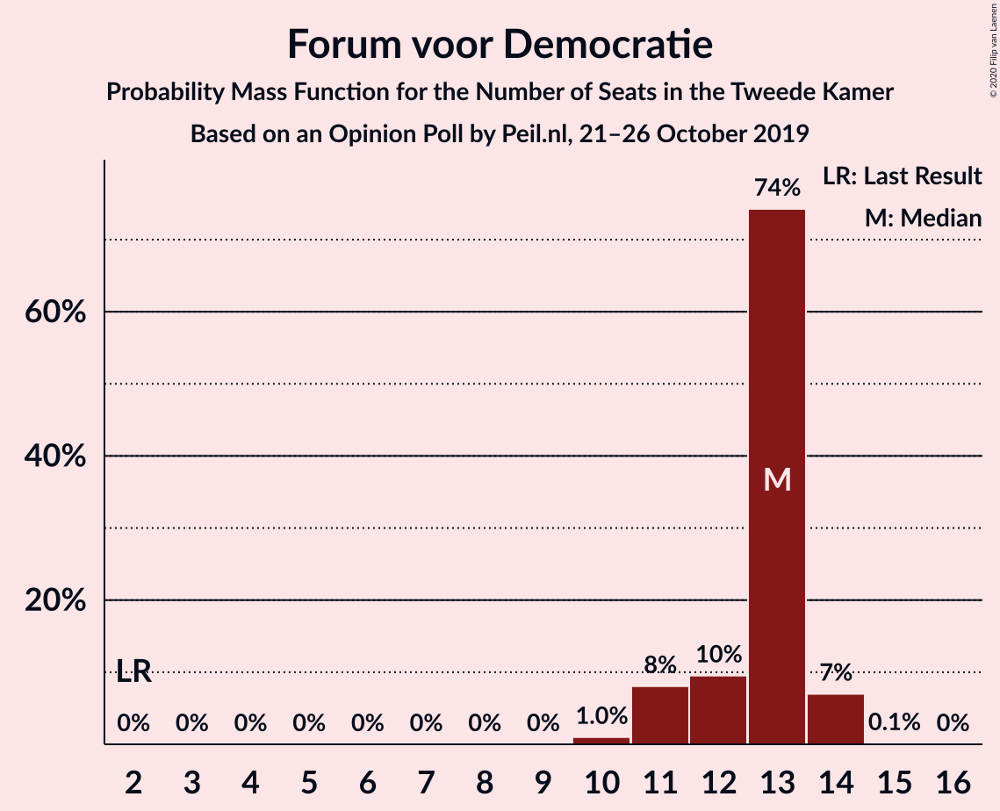
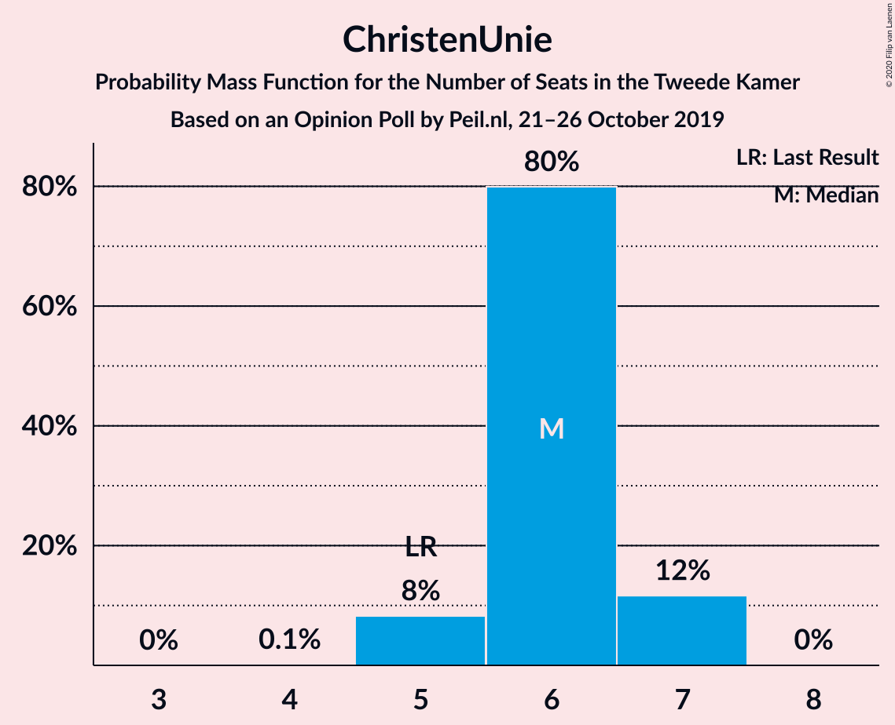
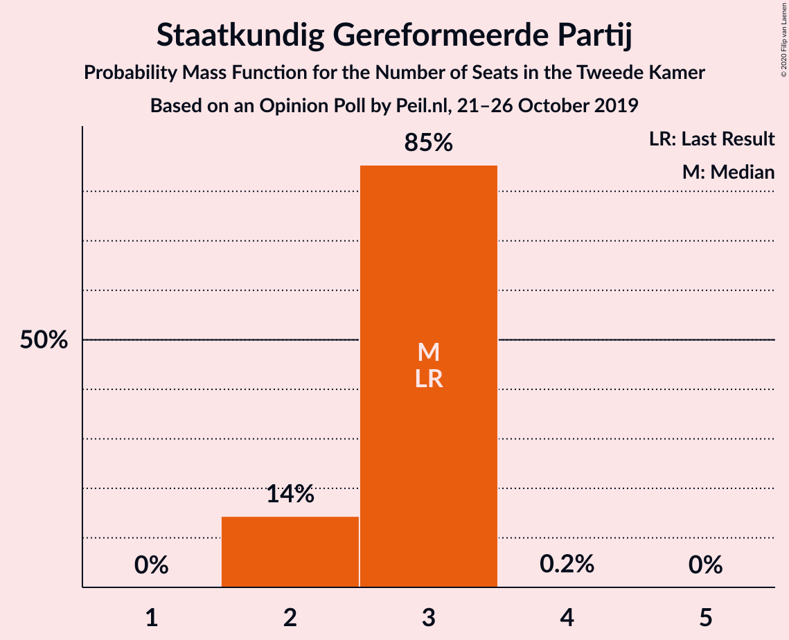
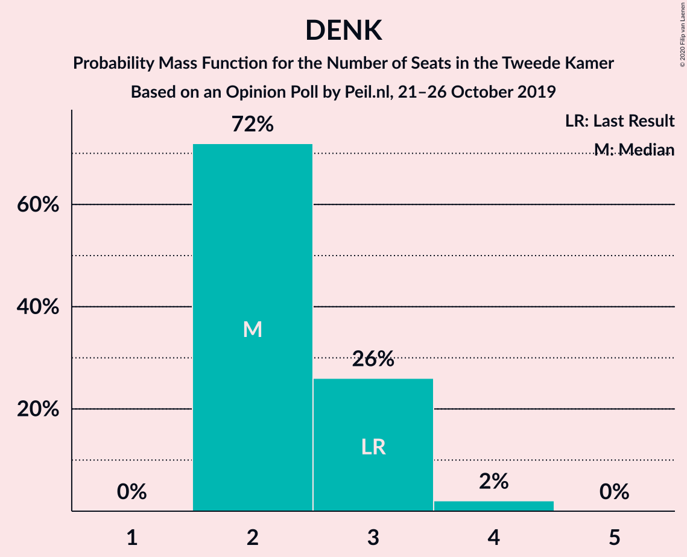
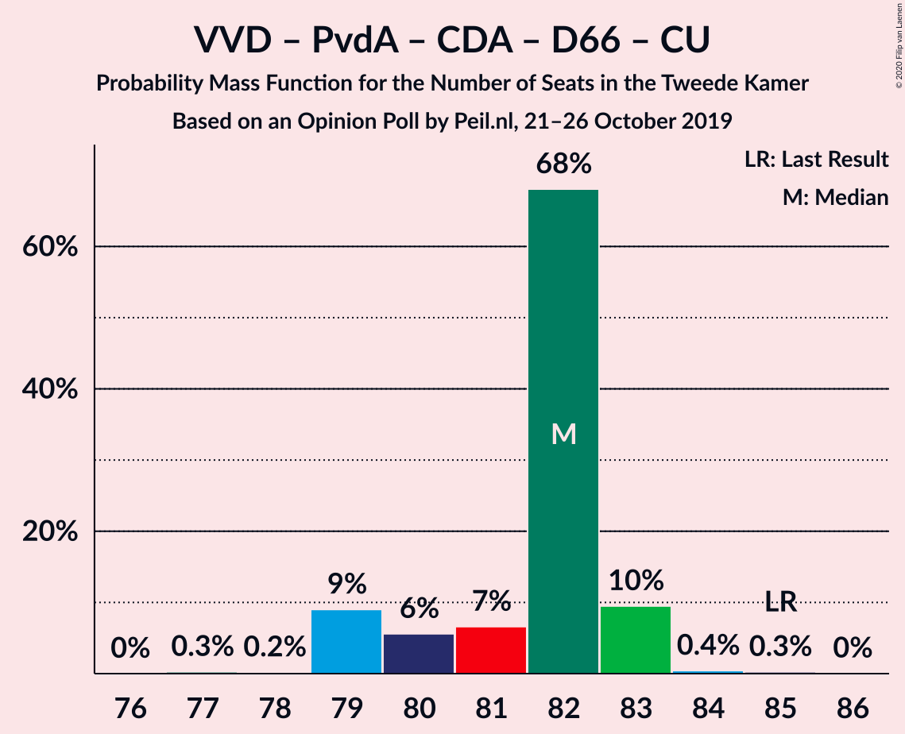
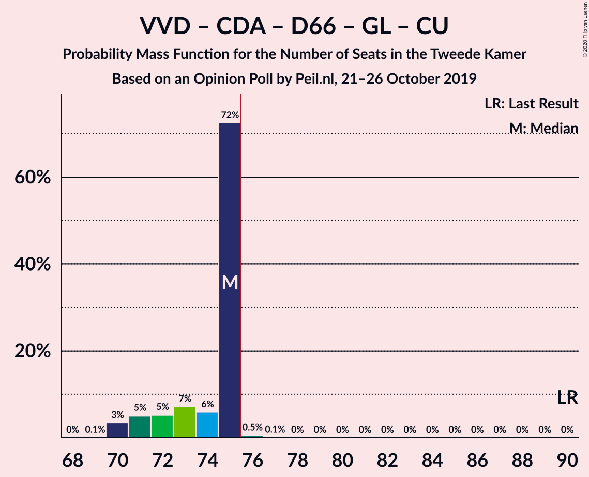
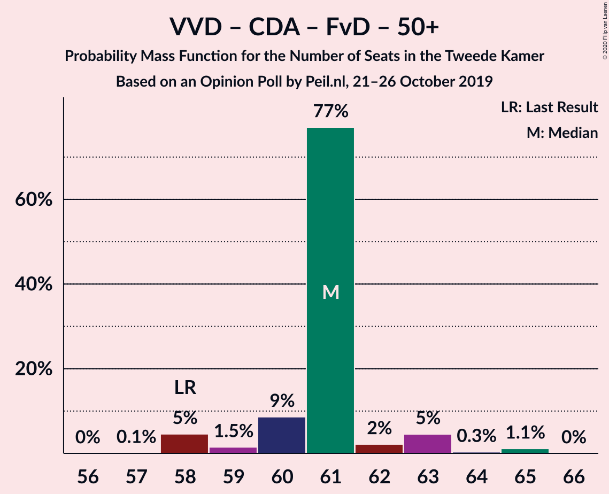
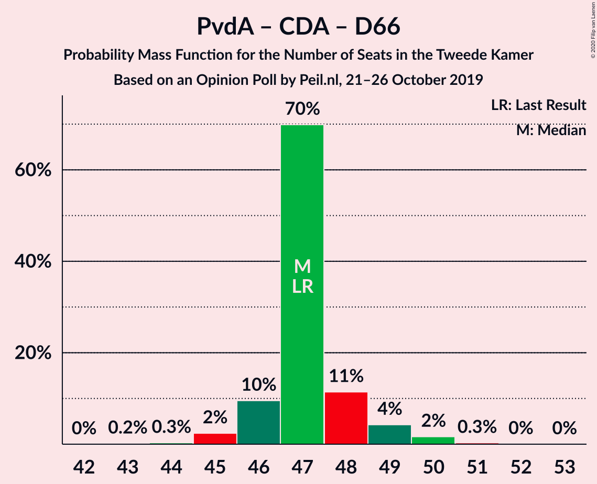

# Opinion Poll by Peil.nl, 21–26 October 2019

<a href="#voting-intentions">Voting Intentions</a> | <a href="#seats">Seats</a> | <a href="#coalitions">Coalitions</a> | <a href="#technical-information">Technical Information</a>

## Voting Intentions

### Confidence Intervals

| Party | Last Result | Poll Result | 80% Confidence Interval | 90% Confidence Interval | 95% Confidence Interval | 99% Confidence Interval |
|:-----:|:-----------:|:-----------:|:-----------------------:|:-----------------------:|:-----------------------:|:-----------------------:|
| Volkspartij voor Vrijheid en Democratie | 21.3% | 18.2% | 17.3–19.1% |17.0–19.4% |16.8–19.6% |16.4–20.0% |
| Partij van de Arbeid | 5.7% | 13.1% | 12.4–14.0% |12.1–14.2% |12.0–14.4% |11.6–14.8% |
| Partij voor de Vrijheid | 13.1% | 11.1% | 10.4–11.9% |10.2–12.1% |10.0–12.3% |9.7–12.7% |
| Christen-Democratisch Appèl | 12.4% | 10.1% | 9.4–10.9% |9.2–11.1% |9.1–11.2% |8.7–11.6% |
| Democraten 66 | 12.2% | 8.1% | 7.5–8.7% |7.3–8.9% |7.1–9.1% |6.9–9.4% |
| GroenLinks | 9.1% | 8.1% | 7.5–8.7% |7.3–8.9% |7.1–9.1% |6.9–9.4% |
| Forum voor Democratie | 1.8% | 8.1% | 7.5–8.7% |7.3–8.9% |7.1–9.1% |6.9–9.4% |
| Socialistische Partij | 9.1% | 6.1% | 5.5–6.7% |5.4–6.8% |5.3–7.0% |5.0–7.3% |
| ChristenUnie | 3.4% | 4.0% | 3.6–4.5% |3.5–4.7% |3.4–4.8% |3.2–5.1% |
| 50Plus | 3.1% | 4.0% | 3.6–4.5% |3.5–4.7% |3.4–4.8% |3.2–5.1% |
| Partij voor de Dieren | 3.2% | 3.0% | 2.7–3.5% |2.6–3.6% |2.5–3.7% |2.3–3.9% |
| Staatkundig Gereformeerde Partij | 2.1% | 2.0% | 1.7–2.4% |1.6–2.5% |1.6–2.6% |1.4–2.8% |
| DENK | 2.1% | 2.0% | 1.7–2.4% |1.6–2.5% |1.6–2.6% |1.4–2.8% |

*Note:* The poll result column reflects the actual value used in the calculations. Published results may vary slightly, and in addition be rounded to fewer digits.

## Seats

### Confidence Intervals

| Party | Last Result | Median | 80% Confidence Interval | 90% Confidence Interval | 95% Confidence Interval | 99% Confidence Interval |
|:-----:|:-----------:|:------:|:-----------------------:|:-----------------------:|:-----------------------:|:-----------------------:|
| <a href="#volkspartij-voor-vrijheid-en-democratie">Volkspartij voor Vrijheid en Democratie</a> | 33 | 28 | 27–29 |27–30 |26–31 |26–31 |
| <a href="#partij-van-de-arbeid">Partij van de Arbeid</a> | 9 | 19 | 19–21 |19–22 |19–22 |18–23 |
| <a href="#partij-voor-de-vrijheid">Partij voor de Vrijheid</a> | 20 | 16 | 16–17 |16–18 |15–18 |15–19 |
| <a href="#christen-democratisch-appèl">Christen-Democratisch Appèl</a> | 19 | 15 | 14–15 |14–16 |14–17 |13–17 |
| <a href="#democraten-66">Democraten 66</a> | 19 | 14 | 11–14 |11–14 |11–14 |11–14 |
| <a href="#groenlinks">GroenLinks</a> | 14 | 11 | 11–13 |11–14 |11–14 |10–14 |
| <a href="#forum-voor-democratie">Forum voor Democratie</a> | 2 | 13 | 11–13 |10–13 |10–13 |10–14 |
| <a href="#socialistische-partij">Socialistische Partij</a> | 14 | 9 | 9 |8–10 |7–10 |7–10 |
| <a href="#christenunie">ChristenUnie</a> | 5 | 7 | 6–7 |6–7 |6–7 |5–7 |
| <a href="#50plus">50Plus</a> | 4 | 5 | 5–6 |5–7 |5–7 |5–7 |
| <a href="#partij-voor-de-dieren">Partij voor de Dieren</a> | 5 | 4 | 4–5 |4–5 |4–5 |4–5 |
| <a href="#staatkundig-gereformeerde-partij">Staatkundig Gereformeerde Partij</a> | 3 | 3 | 2–3 |2–3 |2–3 |2–3 |
| <a href="#denk">DENK</a> | 3 | 3 | 3 |2–4 |2–4 |2–4 |

### Volkspartij voor Vrijheid en Democratie

*For a full overview of the results for this party, see the [Volkspartij voor Vrijheid en Democratie](party-volkspartijvoorvrijheidendemocratie.html) page.*

| Number of Seats | Probability | Accumulated | Special Marks |
|:---------------:|:-----------:|:-----------:|:-------------:|
| 25 | 0.1% | 100% |  |
| 26 | 4% | 99.9% |  |
| 27 | 10% | 96% |  |
| 28 | 72% | 86% | Median |
| 29 | 9% | 14% |  |
| 30 | 0.9% | 5% |  |
| 31 | 4% | 4% |  |
| 32 | 0% | 0% |  |
| 33 | 0% | 0% | Last Result |

### Partij van de Arbeid

*For a full overview of the results for this party, see the [Partij van de Arbeid](party-partijvandearbeid.html) page.*

| Number of Seats | Probability | Accumulated | Special Marks |
|:---------------:|:-----------:|:-----------:|:-------------:|
| 9 | 0% | 100% | Last Result |
| 10 | 0% | 100% |  |
| 11 | 0% | 100% |  |
| 12 | 0% | 100% |  |
| 13 | 0% | 100% |  |
| 14 | 0% | 100% |  |
| 15 | 0% | 100% |  |
| 16 | 0% | 100% |  |
| 17 | 0.1% | 100% |  |
| 18 | 0.7% | 99.9% |  |
| 19 | 71% | 99.2% | Median |
| 20 | 16% | 28% |  |
| 21 | 7% | 12% |  |
| 22 | 4% | 5% |  |
| 23 | 0.4% | 0.8% |  |
| 24 | 0.4% | 0.4% |  |
| 25 | 0% | 0% |  |

### Partij voor de Vrijheid

*For a full overview of the results for this party, see the [Partij voor de Vrijheid](party-partijvoordevrijheid.html) page.*

| Number of Seats | Probability | Accumulated | Special Marks |
|:---------------:|:-----------:|:-----------:|:-------------:|
| 14 | 0.2% | 100% |  |
| 15 | 3% | 99.8% |  |
| 16 | 82% | 97% | Median |
| 17 | 6% | 15% |  |
| 18 | 8% | 9% |  |
| 19 | 1.2% | 1.2% |  |
| 20 | 0.1% | 0.1% | Last Result |
| 21 | 0% | 0% |  |

### Christen-Democratisch Appèl

*For a full overview of the results for this party, see the [Christen-Democratisch Appèl](party-christen-democratischappèl.html) page.*

| Number of Seats | Probability | Accumulated | Special Marks |
|:---------------:|:-----------:|:-----------:|:-------------:|
| 13 | 2% | 100% |  |
| 14 | 13% | 98% |  |
| 15 | 77% | 85% | Median |
| 16 | 3% | 8% |  |
| 17 | 4% | 4% |  |
| 18 | 0% | 0% |  |
| 19 | 0% | 0% | Last Result |

### Democraten 66

*For a full overview of the results for this party, see the [Democraten 66](party-democraten66.html) page.*

| Number of Seats | Probability | Accumulated | Special Marks |
|:---------------:|:-----------:|:-----------:|:-------------:|
| 10 | 0.3% | 100% |  |
| 11 | 22% | 99.7% |  |
| 12 | 11% | 78% |  |
| 13 | 1.5% | 67% |  |
| 14 | 65% | 65% | Median |
| 15 | 0% | 0% |  |
| 16 | 0% | 0% |  |
| 17 | 0% | 0% |  |
| 18 | 0% | 0% |  |
| 19 | 0% | 0% | Last Result |

### GroenLinks

*For a full overview of the results for this party, see the [GroenLinks](party-groenlinks.html) page.*

| Number of Seats | Probability | Accumulated | Special Marks |
|:---------------:|:-----------:|:-----------:|:-------------:|
| 10 | 1.5% | 100% |  |
| 11 | 67% | 98.5% | Median |
| 12 | 16% | 31% |  |
| 13 | 10% | 15% |  |
| 14 | 5% | 5% | Last Result |
| 15 | 0% | 0% |  |

### Forum voor Democratie

*For a full overview of the results for this party, see the [Forum voor Democratie](party-forumvoordemocratie.html) page.*

| Number of Seats | Probability | Accumulated | Special Marks |
|:---------------:|:-----------:|:-----------:|:-------------:|
| 2 | 0% | 100% | Last Result |
| 3 | 0% | 100% |  |
| 4 | 0% | 100% |  |
| 5 | 0% | 100% |  |
| 6 | 0% | 100% |  |
| 7 | 0% | 100% |  |
| 8 | 0% | 100% |  |
| 9 | 0% | 100% |  |
| 10 | 6% | 100% |  |
| 11 | 10% | 94% |  |
| 12 | 3% | 84% |  |
| 13 | 80% | 81% | Median |
| 14 | 2% | 2% |  |
| 15 | 0% | 0% |  |

### Socialistische Partij

*For a full overview of the results for this party, see the [Socialistische Partij](party-socialistischepartij.html) page.*

| Number of Seats | Probability | Accumulated | Special Marks |
|:---------------:|:-----------:|:-----------:|:-------------:|
| 7 | 4% | 100% |  |
| 8 | 5% | 96% |  |
| 9 | 84% | 91% | Median |
| 10 | 6% | 6% |  |
| 11 | 0% | 0% |  |
| 12 | 0% | 0% |  |
| 13 | 0% | 0% |  |
| 14 | 0% | 0% | Last Result |

### ChristenUnie

*For a full overview of the results for this party, see the [ChristenUnie](party-christenunie.html) page.*

| Number of Seats | Probability | Accumulated | Special Marks |
|:---------------:|:-----------:|:-----------:|:-------------:|
| 4 | 0.1% | 100% |  |
| 5 | 1.3% | 99.9% | Last Result |
| 6 | 19% | 98.6% |  |
| 7 | 80% | 80% | Median |
| 8 | 0.1% | 0.1% |  |
| 9 | 0% | 0% |  |

### 50Plus

*For a full overview of the results for this party, see the [50Plus](party-50plus.html) page.*

| Number of Seats | Probability | Accumulated | Special Marks |
|:---------------:|:-----------:|:-----------:|:-------------:|
| 4 | 0.1% | 100% | Last Result |
| 5 | 71% | 99.9% | Median |
| 6 | 19% | 28% |  |
| 7 | 9% | 9% |  |
| 8 | 0% | 0% |  |

### Partij voor de Dieren

*For a full overview of the results for this party, see the [Partij voor de Dieren](party-partijvoordedieren.html) page.*

| Number of Seats | Probability | Accumulated | Special Marks |
|:---------------:|:-----------:|:-----------:|:-------------:|
| 3 | 0.3% | 100% |  |
| 4 | 80% | 99.7% | Median |
| 5 | 20% | 20% | Last Result |
| 6 | 0% | 0% |  |

### Staatkundig Gereformeerde Partij

*For a full overview of the results for this party, see the [Staatkundig Gereformeerde Partij](party-staatkundiggereformeerdepartij.html) page.*

| Number of Seats | Probability | Accumulated | Special Marks |
|:---------------:|:-----------:|:-----------:|:-------------:|
| 2 | 18% | 100% |  |
| 3 | 81% | 82% | Last Result, Median |
| 4 | 0.3% | 0.3% |  |
| 5 | 0% | 0% |  |

### DENK

*For a full overview of the results for this party, see the [DENK](party-denk.html) page.*

| Number of Seats | Probability | Accumulated | Special Marks |
|:---------------:|:-----------:|:-----------:|:-------------:|
| 2 | 10% | 100% |  |
| 3 | 82% | 90% | Last Result, Median |
| 4 | 8% | 8% |  |
| 5 | 0% | 0% |  |

## Coalitions

### Confidence Intervals

| Coalition | Last Result | Median | Majority? | 80% Confidence Interval | 90% Confidence Interval | 95% Confidence Interval | 99% Confidence Interval |
|:---------:|:-----------:|:------:|:---------:|:-----------------------:|:-----------------------:|:-----------------------:|:-----------------------:|
| Volkspartij voor Vrijheid en Democratie – Partij van de Arbeid – Christen-Democratisch Appèl – Democraten 66 – ChristenUnie | 85 | 83 | 100% | 79–83 | 79–83 | 79–83 | 78–85 |
| Partij van de Arbeid – Christen-Democratisch Appèl – Democraten 66 – GroenLinks – Socialistische Partij – ChristenUnie | 80 | 75 | 8% | 73–75 | 71–76 | 71–78 | 70–78 |
| Volkspartij voor Vrijheid en Democratie – Partij voor de Vrijheid – Christen-Democratisch Appèl – Forum voor Democratie – Staatkundig Gereformeerde Partij | 77 | 75 | 8% | 73–75 | 71–77 | 71–78 | 71–78 |
| Volkspartij voor Vrijheid en Democratie – Christen-Democratisch Appèl – Democraten 66 – GroenLinks – ChristenUnie | 90 | 75 | 0.9% | 73–75 | 71–75 | 70–75 | 70–76 |
| Volkspartij voor Vrijheid en Democratie – Partij voor de Vrijheid – Christen-Democratisch Appèl – Forum voor Democratie | 74 | 72 | 0.5% | 70–73 | 69–74 | 69–75 | 69–76 |
| Partij van de Arbeid – Christen-Democratisch Appèl – Democraten 66 – GroenLinks – ChristenUnie | 66 | 66 | 0% | 64–66 | 64–67 | 63–69 | 62–69 |
| Volkspartij voor Vrijheid en Democratie – Christen-Democratisch Appèl – Forum voor Democratie – 50Plus – Staatkundig Gereformeerde Partij | 61 | 64 | 0% | 62–64 | 62–65 | 62–68 | 62–68 |
| Volkspartij voor Vrijheid en Democratie – Partij van de Arbeid – Christen-Democratisch Appèl | 61 | 62 | 0% | 62–64 | 62–66 | 62–66 | 62–66 |
| Volkspartij voor Vrijheid en Democratie – Christen-Democratisch Appèl – Forum voor Democratie – 50Plus | 58 | 61 | 0% | 60–61 | 60–63 | 60–65 | 59–65 |
| Volkspartij voor Vrijheid en Democratie – Christen-Democratisch Appèl – Democraten 66 – ChristenUnie | 76 | 64 | 0% | 60–64 | 59–64 | 58–64 | 58–65 |
| Volkspartij voor Vrijheid en Democratie – Partij van de Arbeid – Democraten 66 | 61 | 61 | 0% | 59–61 | 58–62 | 58–62 | 58–63 |
| Volkspartij voor Vrijheid en Democratie – Partij voor de Vrijheid – Christen-Democratisch Appèl | 72 | 59 | 0% | 59–61 | 57–62 | 57–62 | 57–63 |
| Volkspartij voor Vrijheid en Democratie – Christen-Democratisch Appèl – Forum voor Democratie – Staatkundig Gereformeerde Partij | 57 | 59 | 0% | 56–59 | 55–60 | 55–62 | 55–62 |
| Volkspartij voor Vrijheid en Democratie – Christen-Democratisch Appèl – Forum voor Democratie | 54 | 56 | 0% | 54–56 | 53–57 | 53–59 | 53–59 |
| Volkspartij voor Vrijheid en Democratie – Christen-Democratisch Appèl – Democraten 66 | 71 | 57 | 0% | 54–57 | 53–57 | 52–57 | 52–59 |
| Volkspartij voor Vrijheid en Democratie – Partij van de Arbeid | 42 | 47 | 0% | 47–49 | 47–50 | 47–51 | 46–51 |
| Partij van de Arbeid – Christen-Democratisch Appèl – Democraten 66 | 47 | 48 | 0% | 46–48 | 45–50 | 45–50 | 45–51 |
| Volkspartij voor Vrijheid en Democratie – Christen-Democratisch Appèl | 52 | 43 | 0% | 42–43 | 41–44 | 41–46 | 41–46 |
| Partij van de Arbeid – Christen-Democratisch Appèl – ChristenUnie | 33 | 41 | 0% | 41–42 | 40–44 | 39–46 | 38–46 |
| Partij van de Arbeid – Christen-Democratisch Appèl | 28 | 34 | 0% | 34–35 | 34–38 | 34–39 | 32–39 |
| Christen-Democratisch Appèl – Democraten 66 | 38 | 29 | 0% | 26–29 | 25–29 | 25–29 | 25–30 |

### Volkspartij voor Vrijheid en Democratie – Partij van de Arbeid – Christen-Democratisch Appèl – Democraten 66 – ChristenUnie

| Number of Seats | Probability | Accumulated | Special Marks |
|:---------------:|:-----------:|:-----------:|:-------------:|
| 77 | 0% | 100% |  |
| 78 | 1.1% | 99.9% |  |
| 79 | 10% | 98.9% |  |
| 80 | 2% | 89% |  |
| 81 | 5% | 87% |  |
| 82 | 8% | 82% |  |
| 83 | 72% | 75% | Median |
| 84 | 0.7% | 2% |  |
| 85 | 1.4% | 1.5% | Last Result |
| 86 | 0.1% | 0.1% |  |
| 87 | 0% | 0% |  |

### Partij van de Arbeid – Christen-Democratisch Appèl – Democraten 66 – GroenLinks – Socialistische Partij – ChristenUnie

| Number of Seats | Probability | Accumulated | Special Marks |
|:---------------:|:-----------:|:-----------:|:-------------:|
| 70 | 2% | 100% |  |
| 71 | 4% | 98% |  |
| 72 | 2% | 94% |  |
| 73 | 5% | 92% |  |
| 74 | 0.8% | 87% |  |
| 75 | 78% | 86% | Median |
| 76 | 3% | 8% | Majority |
| 77 | 0.2% | 5% |  |
| 78 | 4% | 4% |  |
| 79 | 0% | 0% |  |
| 80 | 0% | 0% | Last Result |

### Volkspartij voor Vrijheid en Democratie – Partij voor de Vrijheid – Christen-Democratisch Appèl – Forum voor Democratie – Staatkundig Gereformeerde Partij

| Number of Seats | Probability | Accumulated | Special Marks |
|:---------------:|:-----------:|:-----------:|:-------------:|
| 70 | 0.1% | 100% |  |
| 71 | 6% | 99.9% |  |
| 72 | 3% | 94% |  |
| 73 | 5% | 91% |  |
| 74 | 9% | 86% |  |
| 75 | 69% | 77% | Median |
| 76 | 3% | 8% | Majority |
| 77 | 0.9% | 5% | Last Result |
| 78 | 4% | 4% |  |
| 79 | 0% | 0% |  |

### Volkspartij voor Vrijheid en Democratie – Christen-Democratisch Appèl – Democraten 66 – GroenLinks – ChristenUnie

| Number of Seats | Probability | Accumulated | Special Marks |
|:---------------:|:-----------:|:-----------:|:-------------:|
| 70 | 5% | 100% |  |
| 71 | 3% | 95% |  |
| 72 | 1.4% | 92% |  |
| 73 | 7% | 91% |  |
| 74 | 8% | 84% |  |
| 75 | 75% | 75% | Median |
| 76 | 0.8% | 0.9% | Majority |
| 77 | 0.1% | 0.1% |  |
| 78 | 0% | 0.1% |  |
| 79 | 0% | 0% |  |
| 80 | 0% | 0% |  |
| 81 | 0% | 0% |  |
| 82 | 0% | 0% |  |
| 83 | 0% | 0% |  |
| 84 | 0% | 0% |  |
| 85 | 0% | 0% |  |
| 86 | 0% | 0% |  |
| 87 | 0% | 0% |  |
| 88 | 0% | 0% |  |
| 89 | 0% | 0% |  |
| 90 | 0% | 0% | Last Result |

### Volkspartij voor Vrijheid en Democratie – Partij voor de Vrijheid – Christen-Democratisch Appèl – Forum voor Democratie

| Number of Seats | Probability | Accumulated | Special Marks |
|:---------------:|:-----------:|:-----------:|:-------------:|
| 67 | 0.1% | 100% |  |
| 68 | 0.1% | 99.9% |  |
| 69 | 9% | 99.8% |  |
| 70 | 5% | 91% |  |
| 71 | 2% | 86% |  |
| 72 | 72% | 84% | Median |
| 73 | 6% | 12% |  |
| 74 | 1.2% | 6% | Last Result |
| 75 | 4% | 5% |  |
| 76 | 0.5% | 0.5% | Majority |
| 77 | 0% | 0% |  |

### Partij van de Arbeid – Christen-Democratisch Appèl – Democraten 66 – GroenLinks – ChristenUnie

| Number of Seats | Probability | Accumulated | Special Marks |
|:---------------:|:-----------:|:-----------:|:-------------:|
| 62 | 2% | 100% |  |
| 63 | 3% | 98% |  |
| 64 | 9% | 96% |  |
| 65 | 5% | 86% |  |
| 66 | 71% | 81% | Last Result, Median |
| 67 | 5% | 10% |  |
| 68 | 0.1% | 5% |  |
| 69 | 4% | 4% |  |
| 70 | 0% | 0% |  |

### Volkspartij voor Vrijheid en Democratie – Christen-Democratisch Appèl – Forum voor Democratie – 50Plus – Staatkundig Gereformeerde Partij

| Number of Seats | Probability | Accumulated | Special Marks |
|:---------------:|:-----------:|:-----------:|:-------------:|
| 60 | 0.1% | 100% |  |
| 61 | 0.1% | 99.9% | Last Result |
| 62 | 12% | 99.9% |  |
| 63 | 14% | 88% |  |
| 64 | 66% | 74% | Median |
| 65 | 3% | 8% |  |
| 66 | 0.5% | 4% |  |
| 67 | 0.2% | 4% |  |
| 68 | 4% | 4% |  |
| 69 | 0% | 0% |  |

### Volkspartij voor Vrijheid en Democratie – Partij van de Arbeid – Christen-Democratisch Appèl

| Number of Seats | Probability | Accumulated | Special Marks |
|:---------------:|:-----------:|:-----------:|:-------------:|
| 58 | 0.1% | 100% |  |
| 59 | 0.1% | 99.9% |  |
| 60 | 0.3% | 99.9% |  |
| 61 | 0.1% | 99.6% | Last Result |
| 62 | 80% | 99.5% | Median |
| 63 | 7% | 19% |  |
| 64 | 2% | 12% |  |
| 65 | 4% | 10% |  |
| 66 | 5% | 5% |  |
| 67 | 0% | 0.4% |  |
| 68 | 0.4% | 0.4% |  |
| 69 | 0% | 0% |  |

### Volkspartij voor Vrijheid en Democratie – Christen-Democratisch Appèl – Forum voor Democratie – 50Plus

| Number of Seats | Probability | Accumulated | Special Marks |
|:---------------:|:-----------:|:-----------:|:-------------:|
| 57 | 0% | 100% |  |
| 58 | 0.2% | 99.9% | Last Result |
| 59 | 0.5% | 99.7% |  |
| 60 | 22% | 99.2% |  |
| 61 | 70% | 78% | Median |
| 62 | 2% | 8% |  |
| 63 | 2% | 6% |  |
| 64 | 0.6% | 4% |  |
| 65 | 4% | 4% |  |
| 66 | 0% | 0% |  |

### Volkspartij voor Vrijheid en Democratie – Christen-Democratisch Appèl – Democraten 66 – ChristenUnie

| Number of Seats | Probability | Accumulated | Special Marks |
|:---------------:|:-----------:|:-----------:|:-------------:|
| 58 | 5% | 100% |  |
| 59 | 1.3% | 95% |  |
| 60 | 7% | 94% |  |
| 61 | 10% | 87% |  |
| 62 | 7% | 77% |  |
| 63 | 5% | 70% |  |
| 64 | 65% | 65% | Median |
| 65 | 0.6% | 0.6% |  |
| 66 | 0% | 0% |  |
| 67 | 0% | 0% |  |
| 68 | 0% | 0% |  |
| 69 | 0% | 0% |  |
| 70 | 0% | 0% |  |
| 71 | 0% | 0% |  |
| 72 | 0% | 0% |  |
| 73 | 0% | 0% |  |
| 74 | 0% | 0% |  |
| 75 | 0% | 0% |  |
| 76 | 0% | 0% | Last Result, Majority |

### Volkspartij voor Vrijheid en Democratie – Partij van de Arbeid – Democraten 66

| Number of Seats | Probability | Accumulated | Special Marks |
|:---------------:|:-----------:|:-----------:|:-------------:|
| 55 | 0.1% | 100% |  |
| 56 | 0% | 99.9% |  |
| 57 | 0.2% | 99.9% |  |
| 58 | 6% | 99.7% |  |
| 59 | 13% | 93% |  |
| 60 | 0.9% | 80% |  |
| 61 | 74% | 80% | Last Result, Median |
| 62 | 5% | 6% |  |
| 63 | 0.9% | 1.1% |  |
| 64 | 0.2% | 0.2% |  |
| 65 | 0% | 0% |  |

### Volkspartij voor Vrijheid en Democratie – Partij voor de Vrijheid – Christen-Democratisch Appèl

| Number of Seats | Probability | Accumulated | Special Marks |
|:---------------:|:-----------:|:-----------:|:-------------:|
| 56 | 0.1% | 100% |  |
| 57 | 7% | 99.9% |  |
| 58 | 0.2% | 92% |  |
| 59 | 74% | 92% | Median |
| 60 | 6% | 19% |  |
| 61 | 6% | 13% |  |
| 62 | 5% | 6% |  |
| 63 | 0.8% | 0.9% |  |
| 64 | 0.1% | 0.1% |  |
| 65 | 0% | 0% |  |
| 66 | 0% | 0% |  |
| 67 | 0% | 0% |  |
| 68 | 0% | 0% |  |
| 69 | 0% | 0% |  |
| 70 | 0% | 0% |  |
| 71 | 0% | 0% |  |
| 72 | 0% | 0% | Last Result |

### Volkspartij voor Vrijheid en Democratie – Christen-Democratisch Appèl – Forum voor Democratie – Staatkundig Gereformeerde Partij

| Number of Seats | Probability | Accumulated | Special Marks |
|:---------------:|:-----------:|:-----------:|:-------------:|
| 54 | 0% | 100% |  |
| 55 | 6% | 99.9% |  |
| 56 | 7% | 94% |  |
| 57 | 9% | 87% | Last Result |
| 58 | 6% | 78% |  |
| 59 | 66% | 72% | Median |
| 60 | 2% | 6% |  |
| 61 | 0.1% | 4% |  |
| 62 | 4% | 4% |  |
| 63 | 0% | 0% |  |

### Volkspartij voor Vrijheid en Democratie – Christen-Democratisch Appèl – Forum voor Democratie

| Number of Seats | Probability | Accumulated | Special Marks |
|:---------------:|:-----------:|:-----------:|:-------------:|
| 52 | 0.2% | 100% |  |
| 53 | 8% | 99.8% |  |
| 54 | 14% | 92% | Last Result |
| 55 | 0.8% | 78% |  |
| 56 | 72% | 77% | Median |
| 57 | 0.9% | 6% |  |
| 58 | 0.9% | 5% |  |
| 59 | 4% | 4% |  |
| 60 | 0% | 0% |  |

### Volkspartij voor Vrijheid en Democratie – Christen-Democratisch Appèl – Democraten 66

| Number of Seats | Probability | Accumulated | Special Marks |
|:---------------:|:-----------:|:-----------:|:-------------:|
| 51 | 0% | 100% |  |
| 52 | 5% | 99.9% |  |
| 53 | 0.4% | 95% |  |
| 54 | 16% | 95% |  |
| 55 | 8% | 79% |  |
| 56 | 0.9% | 70% |  |
| 57 | 69% | 70% | Median |
| 58 | 0.2% | 0.8% |  |
| 59 | 0.6% | 0.7% |  |
| 60 | 0.1% | 0.1% |  |
| 61 | 0% | 0% |  |
| 62 | 0% | 0% |  |
| 63 | 0% | 0% |  |
| 64 | 0% | 0% |  |
| 65 | 0% | 0% |  |
| 66 | 0% | 0% |  |
| 67 | 0% | 0% |  |
| 68 | 0% | 0% |  |
| 69 | 0% | 0% |  |
| 70 | 0% | 0% |  |
| 71 | 0% | 0% | Last Result |

### Volkspartij voor Vrijheid en Democratie – Partij van de Arbeid

| Number of Seats | Probability | Accumulated | Special Marks |
|:---------------:|:-----------:|:-----------:|:-------------:|
| 42 | 0% | 100% | Last Result |
| 43 | 0% | 100% |  |
| 44 | 0.2% | 100% |  |
| 45 | 0.2% | 99.8% |  |
| 46 | 0.1% | 99.6% |  |
| 47 | 73% | 99.5% | Median |
| 48 | 11% | 26% |  |
| 49 | 9% | 15% |  |
| 50 | 2% | 6% |  |
| 51 | 4% | 4% |  |
| 52 | 0.5% | 0.5% |  |
| 53 | 0% | 0% |  |

### Partij van de Arbeid – Christen-Democratisch Appèl – Democraten 66

| Number of Seats | Probability | Accumulated | Special Marks |
|:---------------:|:-----------:|:-----------:|:-------------:|
| 44 | 0.3% | 100% |  |
| 45 | 9% | 99.7% |  |
| 46 | 15% | 91% |  |
| 47 | 4% | 76% | Last Result |
| 48 | 66% | 72% | Median |
| 49 | 0.1% | 6% |  |
| 50 | 4% | 6% |  |
| 51 | 1.3% | 1.3% |  |
| 52 | 0% | 0% |  |

### Volkspartij voor Vrijheid en Democratie – Christen-Democratisch Appèl

| Number of Seats | Probability | Accumulated | Special Marks |
|:---------------:|:-----------:|:-----------:|:-------------:|
| 40 | 0% | 100% |  |
| 41 | 5% | 99.9% |  |
| 42 | 5% | 95% |  |
| 43 | 83% | 90% | Median |
| 44 | 2% | 7% |  |
| 45 | 0.9% | 5% |  |
| 46 | 4% | 4% |  |
| 47 | 0% | 0% |  |
| 48 | 0% | 0% |  |
| 49 | 0% | 0% |  |
| 50 | 0% | 0% |  |
| 51 | 0% | 0% |  |
| 52 | 0% | 0% | Last Result |

### Partij van de Arbeid – Christen-Democratisch Appèl – ChristenUnie

| Number of Seats | Probability | Accumulated | Special Marks |
|:---------------:|:-----------:|:-----------:|:-------------:|
| 33 | 0% | 100% | Last Result |
| 34 | 0% | 100% |  |
| 35 | 0% | 100% |  |
| 36 | 0% | 100% |  |
| 37 | 0.1% | 100% |  |
| 38 | 0.5% | 99.9% |  |
| 39 | 3% | 99.4% |  |
| 40 | 6% | 97% |  |
| 41 | 80% | 90% | Median |
| 42 | 3% | 10% |  |
| 43 | 0.3% | 7% |  |
| 44 | 2% | 7% |  |
| 45 | 0.5% | 5% |  |
| 46 | 4% | 4% |  |
| 47 | 0% | 0% |  |

### Partij van de Arbeid – Christen-Democratisch Appèl

| Number of Seats | Probability | Accumulated | Special Marks |
|:---------------:|:-----------:|:-----------:|:-------------:|
| 28 | 0% | 100% | Last Result |
| 29 | 0% | 100% |  |
| 30 | 0% | 100% |  |
| 31 | 0.1% | 100% |  |
| 32 | 0.5% | 99.9% |  |
| 33 | 2% | 99.5% |  |
| 34 | 78% | 98% | Median |
| 35 | 11% | 19% |  |
| 36 | 0.8% | 8% |  |
| 37 | 2% | 7% |  |
| 38 | 0.9% | 5% |  |
| 39 | 4% | 4% |  |
| 40 | 0.4% | 0.4% |  |
| 41 | 0% | 0% |  |

### Christen-Democratisch Appèl – Democraten 66

| Number of Seats | Probability | Accumulated | Special Marks |
|:---------------:|:-----------:|:-----------:|:-------------:|
| 24 | 0.3% | 100% |  |
| 25 | 8% | 99.7% |  |
| 26 | 16% | 92% |  |
| 27 | 5% | 76% |  |
| 28 | 5% | 71% |  |
| 29 | 65% | 65% | Median |
| 30 | 0.7% | 0.7% |  |
| 31 | 0% | 0% |  |
| 32 | 0% | 0% |  |
| 33 | 0% | 0% |  |
| 34 | 0% | 0% |  |
| 35 | 0% | 0% |  |
| 36 | 0% | 0% |  |
| 37 | 0% | 0% |  |
| 38 | 0% | 0% | Last Result |

## Technical Information

### Opinion Poll

+ **Polling firm:** Peil.nl
+ **Commissioner(s):** —
+ **Fieldwork period:** 21–26 October 2019

### Calculations

+ **Sample size:** 3000
+ **Simulations done:** 131,072
+ **Error estimate:** 1.60%

