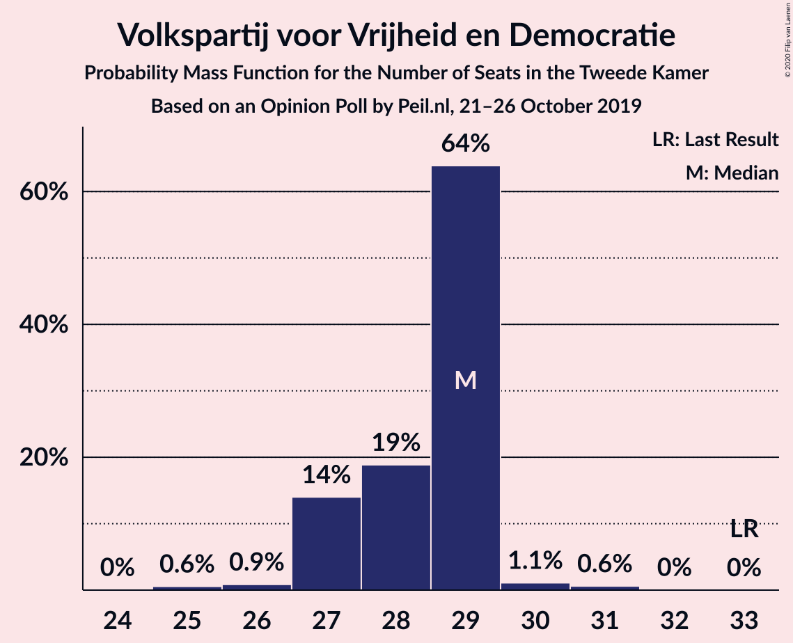
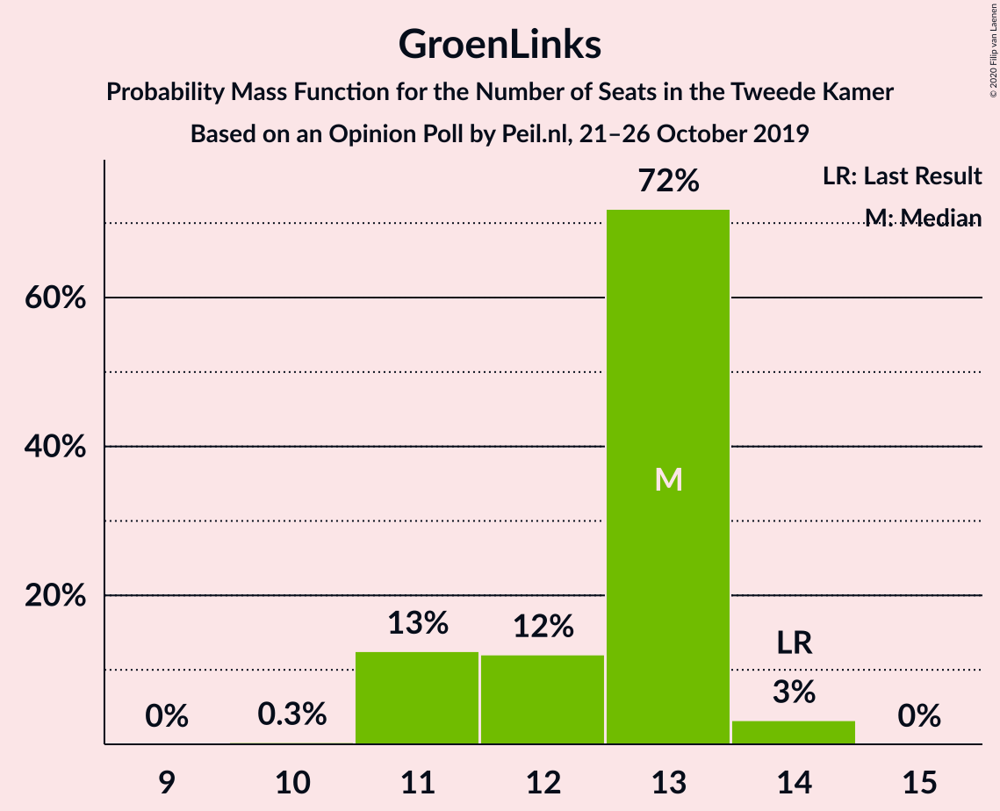
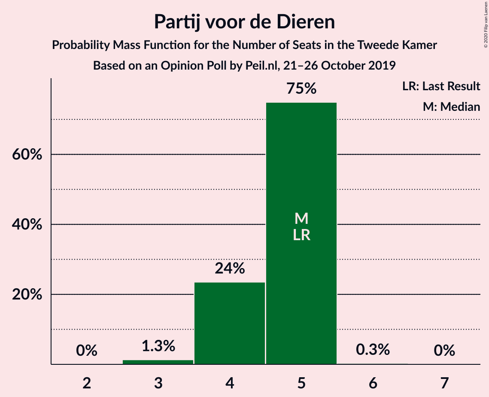
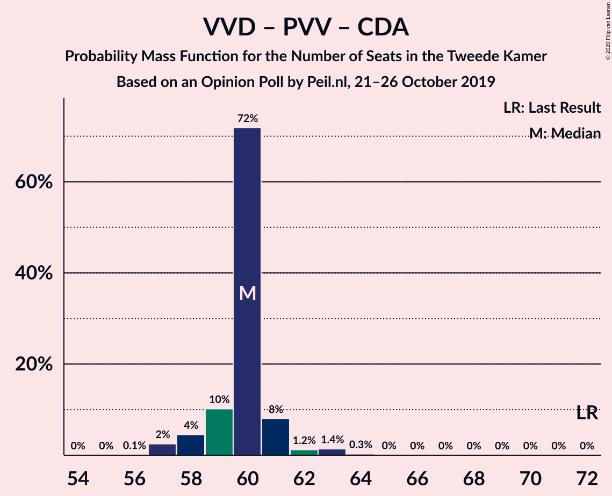
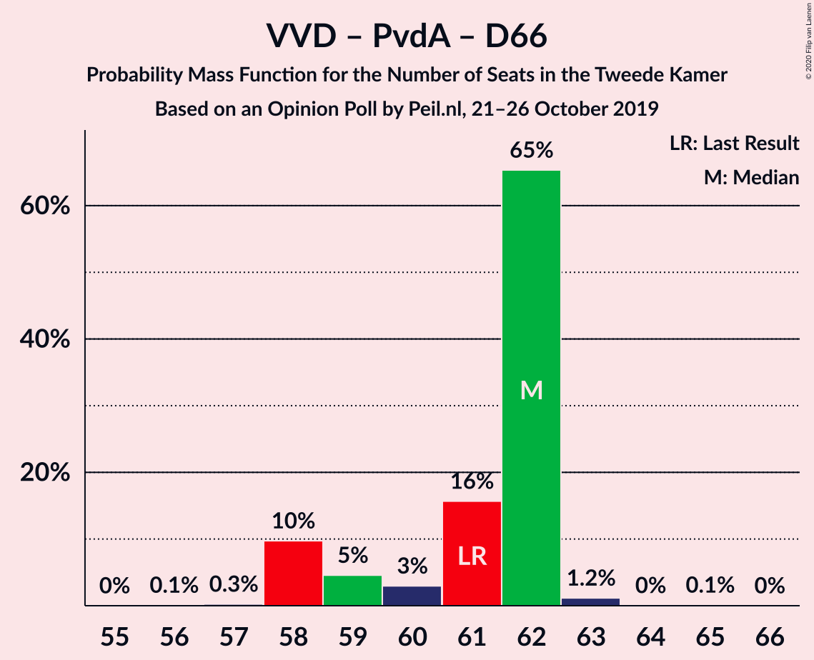
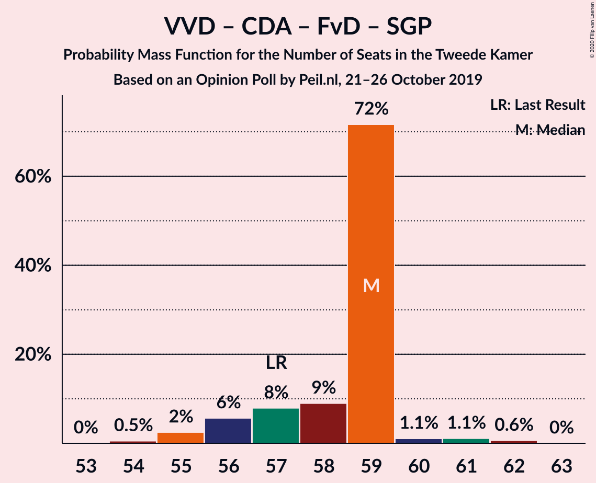
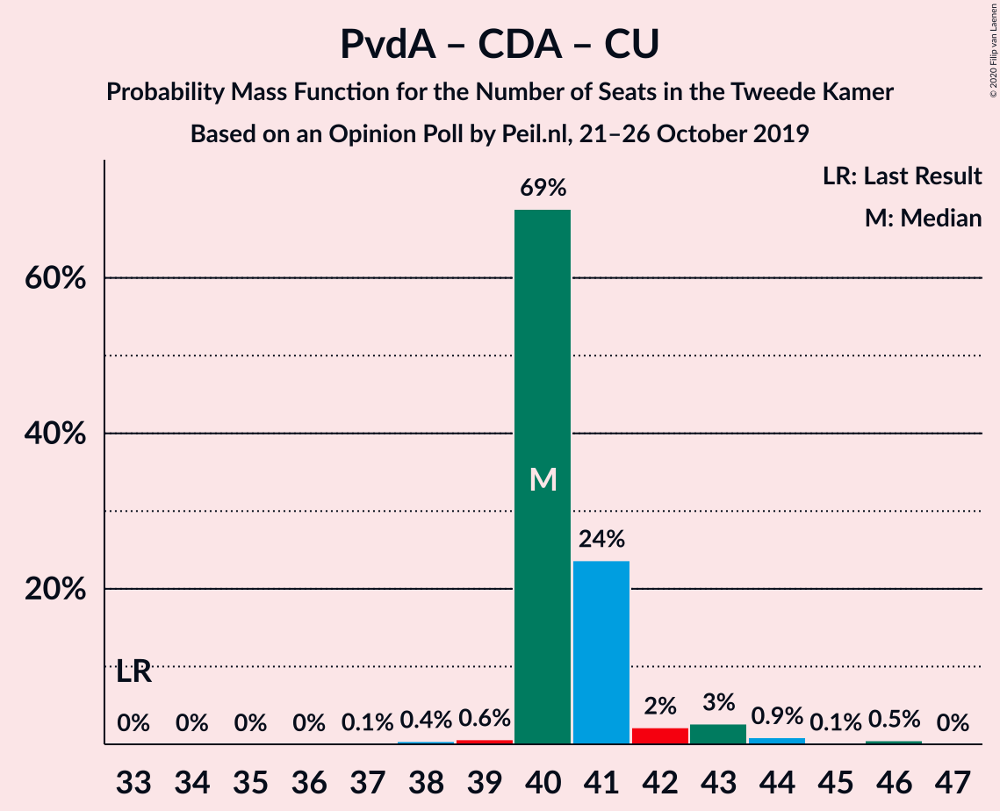

# Opinion Poll by Peil.nl, 21–26 October 2019

<a href="#voting-intentions">Voting Intentions</a> | <a href="#seats">Seats</a> | <a href="#coalitions">Coalitions</a> | <a href="#technical-information">Technical Information</a>

## Voting Intentions

### Confidence Intervals

| Party | Last Result | Poll Result | 80% Confidence Interval | 90% Confidence Interval | 95% Confidence Interval | 99% Confidence Interval |
|:-----:|:-----------:|:-----------:|:-----------------------:|:-----------------------:|:-----------------------:|:-----------------------:|
| Volkspartij voor Vrijheid en Democratie | 21.3% | 18.2% | 17.3–19.1% |17.0–19.4% |16.8–19.6% |16.4–20.0% |
| Partij van de Arbeid | 5.7% | 13.1% | 12.4–14.0% |12.1–14.2% |12.0–14.4% |11.6–14.8% |
| Partij voor de Vrijheid | 13.1% | 11.1% | 10.4–11.9% |10.2–12.1% |10.0–12.3% |9.7–12.7% |
| Christen-Democratisch Appèl | 12.4% | 10.1% | 9.4–10.9% |9.2–11.1% |9.1–11.2% |8.7–11.6% |
| Democraten 66 | 12.2% | 8.1% | 7.5–8.7% |7.3–8.9% |7.1–9.1% |6.9–9.4% |
| GroenLinks | 9.1% | 8.1% | 7.5–8.7% |7.3–8.9% |7.1–9.1% |6.9–9.4% |
| Forum voor Democratie | 1.8% | 8.1% | 7.5–8.7% |7.3–8.9% |7.1–9.1% |6.9–9.4% |
| Socialistische Partij | 9.1% | 6.1% | 5.5–6.7% |5.4–6.8% |5.3–7.0% |5.0–7.3% |
| ChristenUnie | 3.4% | 4.0% | 3.6–4.5% |3.5–4.7% |3.4–4.8% |3.2–5.1% |
| 50Plus | 3.1% | 4.0% | 3.6–4.5% |3.5–4.7% |3.4–4.8% |3.2–5.1% |
| Partij voor de Dieren | 3.2% | 3.0% | 2.7–3.5% |2.6–3.6% |2.5–3.7% |2.3–3.9% |
| Staatkundig Gereformeerde Partij | 2.1% | 2.0% | 1.7–2.4% |1.6–2.5% |1.6–2.6% |1.4–2.8% |
| DENK | 2.1% | 2.0% | 1.7–2.4% |1.6–2.5% |1.6–2.6% |1.4–2.8% |

*Note:* The poll result column reflects the actual value used in the calculations. Published results may vary slightly, and in addition be rounded to fewer digits.

## Seats

### Confidence Intervals

| Party | Last Result | Median | 80% Confidence Interval | 90% Confidence Interval | 95% Confidence Interval | 99% Confidence Interval |
|:-----:|:-----------:|:------:|:-----------------------:|:-----------------------:|:-----------------------:|:-----------------------:|
| <a href="#volkspartij-voor-vrijheid-en-democratie">Volkspartij voor Vrijheid en Democratie</a> | 33 | 31 | 27–31 |26–31 |25–31 |24–33 |
| <a href="#partij-van-de-arbeid">Partij van de Arbeid</a> | 9 | 21 | 19–21 |19–21 |19–23 |19–23 |
| <a href="#partij-voor-de-vrijheid">Partij voor de Vrijheid</a> | 20 | 18 | 17–18 |15–18 |15–18 |15–18 |
| <a href="#christen-democratisch-appèl">Christen-Democratisch Appèl</a> | 19 | 14 | 14–16 |14–16 |14–16 |13–16 |
| <a href="#democraten-66">Democraten 66</a> | 19 | 10 | 10–11 |10–11 |10–14 |10–14 |
| <a href="#groenlinks">GroenLinks</a> | 14 | 11 | 11–14 |11–14 |9–14 |9–14 |
| <a href="#forum-voor-democratie">Forum voor Democratie</a> | 2 | 14 | 12–14 |12–14 |12–14 |12–15 |
| <a href="#socialistische-partij">Socialistische Partij</a> | 14 | 7 | 7–9 |7–9 |7–10 |7–10 |
| <a href="#christenunie">ChristenUnie</a> | 5 | 5 | 5–6 |5–8 |5–8 |5–8 |
| <a href="#50plus">50Plus</a> | 4 | 6 | 5–6 |5–6 |5–6 |5–6 |
| <a href="#partij-voor-de-dieren">Partij voor de Dieren</a> | 5 | 4 | 4 |3–4 |3–5 |3–6 |
| <a href="#staatkundig-gereformeerde-partij">Staatkundig Gereformeerde Partij</a> | 3 | 3 | 3 |2–3 |2–3 |2–3 |
| <a href="#denk">DENK</a> | 3 | 3 | 1–3 |1–3 |1–3 |1–3 |

### Volkspartij voor Vrijheid en Democratie

*For a full overview of the results for this party, see the [Volkspartij voor Vrijheid en Democratie](party-volkspartijvoorvrijheidendemocratie.html) page.*

| Number of Seats | Probability | Accumulated | Special Marks |
|:---------------:|:-----------:|:-----------:|:-------------:|
| 24 | 2% | 100% |  |
| 25 | 0% | 98% |  |
| 26 | 3% | 97% |  |
| 27 | 6% | 94% |  |
| 28 | 0.2% | 88% |  |
| 29 | 19% | 88% |  |
| 30 | 0% | 70% |  |
| 31 | 69% | 70% | Median |
| 32 | 0% | 0.5% |  |
| 33 | 0.5% | 0.5% | Last Result |
| 34 | 0% | 0% |  |

### Partij van de Arbeid

*For a full overview of the results for this party, see the [Partij van de Arbeid](party-partijvandearbeid.html) page.*

| Number of Seats | Probability | Accumulated | Special Marks |
|:---------------:|:-----------:|:-----------:|:-------------:|
| 9 | 0% | 100% | Last Result |
| 10 | 0% | 100% |  |
| 11 | 0% | 100% |  |
| 12 | 0% | 100% |  |
| 13 | 0% | 100% |  |
| 14 | 0% | 100% |  |
| 15 | 0% | 100% |  |
| 16 | 0.3% | 100% |  |
| 17 | 0% | 99.7% |  |
| 18 | 0% | 99.7% |  |
| 19 | 19% | 99.7% |  |
| 20 | 2% | 81% |  |
| 21 | 75% | 79% | Median |
| 22 | 0.2% | 3% |  |
| 23 | 3% | 3% |  |
| 24 | 0% | 0% |  |

### Partij voor de Vrijheid

*For a full overview of the results for this party, see the [Partij voor de Vrijheid](party-partijvoordevrijheid.html) page.*

| Number of Seats | Probability | Accumulated | Special Marks |
|:---------------:|:-----------:|:-----------:|:-------------:|
| 15 | 6% | 100% |  |
| 16 | 0.8% | 94% |  |
| 17 | 22% | 93% |  |
| 18 | 71% | 71% | Median |
| 19 | 0% | 0.3% |  |
| 20 | 0.3% | 0.3% | Last Result |
| 21 | 0% | 0% |  |

### Christen-Democratisch Appèl

*For a full overview of the results for this party, see the [Christen-Democratisch Appèl](party-christen-democratischappèl.html) page.*

| Number of Seats | Probability | Accumulated | Special Marks |
|:---------------:|:-----------:|:-----------:|:-------------:|
| 13 | 0.5% | 100% |  |
| 14 | 69% | 99.5% | Median |
| 15 | 4% | 31% |  |
| 16 | 27% | 27% |  |
| 17 | 0% | 0% |  |
| 18 | 0% | 0% |  |
| 19 | 0% | 0% | Last Result |

### Democraten 66

*For a full overview of the results for this party, see the [Democraten 66](party-democraten66.html) page.*

| Number of Seats | Probability | Accumulated | Special Marks |
|:---------------:|:-----------:|:-----------:|:-------------:|
| 10 | 75% | 100% | Median |
| 11 | 21% | 25% |  |
| 12 | 0.8% | 4% |  |
| 13 | 0.3% | 3% |  |
| 14 | 3% | 3% |  |
| 15 | 0% | 0% |  |
| 16 | 0% | 0% |  |
| 17 | 0% | 0% |  |
| 18 | 0% | 0% |  |
| 19 | 0% | 0% | Last Result |

### GroenLinks

*For a full overview of the results for this party, see the [GroenLinks](party-groenlinks.html) page.*

| Number of Seats | Probability | Accumulated | Special Marks |
|:---------------:|:-----------:|:-----------:|:-------------:|
| 9 | 3% | 100% |  |
| 10 | 0.2% | 97% |  |
| 11 | 69% | 97% | Median |
| 12 | 3% | 27% |  |
| 13 | 6% | 25% |  |
| 14 | 19% | 19% | Last Result |
| 15 | 0% | 0% |  |

### Forum voor Democratie

*For a full overview of the results for this party, see the [Forum voor Democratie](party-forumvoordemocratie.html) page.*

| Number of Seats | Probability | Accumulated | Special Marks |
|:---------------:|:-----------:|:-----------:|:-------------:|
| 2 | 0% | 100% | Last Result |
| 3 | 0% | 100% |  |
| 4 | 0% | 100% |  |
| 5 | 0% | 100% |  |
| 6 | 0% | 100% |  |
| 7 | 0% | 100% |  |
| 8 | 0% | 100% |  |
| 9 | 0% | 100% |  |
| 10 | 0.2% | 100% |  |
| 11 | 0% | 99.8% |  |
| 12 | 19% | 99.8% |  |
| 13 | 0.8% | 81% |  |
| 14 | 78% | 80% | Median |
| 15 | 2% | 2% |  |
| 16 | 0% | 0% |  |

### Socialistische Partij

*For a full overview of the results for this party, see the [Socialistische Partij](party-socialistischepartij.html) page.*

| Number of Seats | Probability | Accumulated | Special Marks |
|:---------------:|:-----------:|:-----------:|:-------------:|
| 7 | 69% | 100% | Median |
| 8 | 0% | 31% |  |
| 9 | 28% | 31% |  |
| 10 | 3% | 3% |  |
| 11 | 0.2% | 0.2% |  |
| 12 | 0% | 0% |  |
| 13 | 0% | 0% |  |
| 14 | 0% | 0% | Last Result |

### ChristenUnie

*For a full overview of the results for this party, see the [ChristenUnie](party-christenunie.html) page.*

| Number of Seats | Probability | Accumulated | Special Marks |
|:---------------:|:-----------:|:-----------:|:-------------:|
| 5 | 70% | 100% | Last Result, Median |
| 6 | 22% | 30% |  |
| 7 | 2% | 8% |  |
| 8 | 6% | 6% |  |
| 9 | 0% | 0% |  |

### 50Plus

*For a full overview of the results for this party, see the [50Plus](party-50plus.html) page.*

| Number of Seats | Probability | Accumulated | Special Marks |
|:---------------:|:-----------:|:-----------:|:-------------:|
| 4 | 0.2% | 100% | Last Result |
| 5 | 25% | 99.8% |  |
| 6 | 75% | 75% | Median |
| 7 | 0% | 0% |  |

### Partij voor de Dieren

*For a full overview of the results for this party, see the [Partij voor de Dieren](party-partijvoordedieren.html) page.*

| Number of Seats | Probability | Accumulated | Special Marks |
|:---------------:|:-----------:|:-----------:|:-------------:|
| 3 | 7% | 100% |  |
| 4 | 90% | 93% | Median |
| 5 | 3% | 3% | Last Result |
| 6 | 0.8% | 0.8% |  |
| 7 | 0% | 0% |  |

### Staatkundig Gereformeerde Partij

*For a full overview of the results for this party, see the [Staatkundig Gereformeerde Partij](party-staatkundiggereformeerdepartij.html) page.*

| Number of Seats | Probability | Accumulated | Special Marks |
|:---------------:|:-----------:|:-----------:|:-------------:|
| 2 | 9% | 100% |  |
| 3 | 91% | 91% | Last Result, Median |
| 4 | 0% | 0% |  |

### DENK

*For a full overview of the results for this party, see the [DENK](party-denk.html) page.*

| Number of Seats | Probability | Accumulated | Special Marks |
|:---------------:|:-----------:|:-----------:|:-------------:|
| 1 | 19% | 100% |  |
| 2 | 9% | 81% |  |
| 3 | 72% | 72% | Last Result, Median |
| 4 | 0% | 0.2% |  |
| 5 | 0.2% | 0.2% |  |
| 6 | 0% | 0% |  |

## Coalitions

### Confidence Intervals

| Coalition | Last Result | Median | Majority? | 80% Confidence Interval | 90% Confidence Interval | 95% Confidence Interval | 99% Confidence Interval |
|:---------:|:-----------:|:------:|:---------:|:-----------------------:|:-----------------------:|:-----------------------:|:-----------------------:|
| Volkspartij voor Vrijheid en Democratie – Partij van de Arbeid – Christen-Democratisch Appèl – Democraten 66 – ChristenUnie | 85 | 81 | 100% | 81 | 81–82 | 80–82 | 80–83 |
| Volkspartij voor Vrijheid en Democratie – Partij voor de Vrijheid – Christen-Democratisch Appèl – Forum voor Democratie – Staatkundig Gereformeerde Partij | 77 | 80 | 88% | 75–80 | 74–80 | 74–80 | 73–80 |
| Volkspartij voor Vrijheid en Democratie – Partij voor de Vrijheid – Christen-Democratisch Appèl – Forum voor Democratie | 74 | 77 | 70% | 73–77 | 72–77 | 72–77 | 70–77 |
| Partij van de Arbeid – Christen-Democratisch Appèl – Democraten 66 – GroenLinks – Socialistische Partij – ChristenUnie | 80 | 68 | 8% | 68–75 | 68–77 | 68–77 | 68–77 |
| Volkspartij voor Vrijheid en Democratie – Christen-Democratisch Appèl – Democraten 66 – GroenLinks – ChristenUnie | 90 | 71 | 19% | 71–76 | 71–76 | 69–76 | 67–76 |
| Volkspartij voor Vrijheid en Democratie – Christen-Democratisch Appèl – Forum voor Democratie – 50Plus – Staatkundig Gereformeerde Partij | 61 | 68 | 0% | 65–68 | 63–68 | 62–68 | 62–68 |
| Partij van de Arbeid – Christen-Democratisch Appèl – Democraten 66 – GroenLinks – ChristenUnie | 66 | 61 | 0% | 61–66 | 61–68 | 61–68 | 61–68 |
| Volkspartij voor Vrijheid en Democratie – Partij van de Arbeid – Christen-Democratisch Appèl | 61 | 66 | 0% | 64–66 | 62–66 | 62–66 | 62–67 |
| Volkspartij voor Vrijheid en Democratie – Christen-Democratisch Appèl – Forum voor Democratie – 50Plus | 58 | 65 | 0% | 62–65 | 61–65 | 59–65 | 59–65 |
| Volkspartij voor Vrijheid en Democratie – Partij voor de Vrijheid – Christen-Democratisch Appèl | 72 | 63 | 0% | 59–63 | 58–63 | 57–63 | 57–63 |
| Volkspartij voor Vrijheid en Democratie – Christen-Democratisch Appèl – Democraten 66 – ChristenUnie | 76 | 60 | 0% | 60–62 | 60–62 | 58–62 | 57–62 |
| Volkspartij voor Vrijheid en Democratie – Partij van de Arbeid – Democraten 66 | 61 | 62 | 0% | 59–62 | 58–62 | 58–62 | 58–64 |
| Volkspartij voor Vrijheid en Democratie – Christen-Democratisch Appèl – Forum voor Democratie – Staatkundig Gereformeerde Partij | 57 | 62 | 0% | 59–62 | 58–62 | 57–62 | 57–63 |
| Volkspartij voor Vrijheid en Democratie – Christen-Democratisch Appèl – Forum voor Democratie | 54 | 59 | 0% | 57–59 | 56–59 | 54–59 | 54–60 |
| Volkspartij voor Vrijheid en Democratie – Christen-Democratisch Appèl – Democraten 66 | 71 | 55 | 0% | 55–56 | 53–56 | 52–56 | 50–56 |
| Volkspartij voor Vrijheid en Democratie – Partij van de Arbeid | 42 | 52 | 0% | 48–52 | 47–52 | 47–52 | 46–54 |
| Partij van de Arbeid – Christen-Democratisch Appèl – Democraten 66 | 47 | 45 | 0% | 45–47 | 45–49 | 45–50 | 44–50 |
| Partij van de Arbeid – Christen-Democratisch Appèl – ChristenUnie | 33 | 40 | 0% | 40–42 | 40–45 | 40–45 | 40–45 |
| Volkspartij voor Vrijheid en Democratie – Christen-Democratisch Appèl | 52 | 45 | 0% | 43–45 | 42–45 | 39–45 | 39–46 |
| Partij van de Arbeid – Christen-Democratisch Appèl | 28 | 35 | 0% | 35–36 | 35–37 | 35–38 | 34–38 |
| Christen-Democratisch Appèl – Democraten 66 | 38 | 24 | 0% | 24–27 | 24–27 | 24–30 | 23–30 |

### Volkspartij voor Vrijheid en Democratie – Partij van de Arbeid – Christen-Democratisch Appèl – Democraten 66 – ChristenUnie

| Number of Seats | Probability | Accumulated | Special Marks |
|:---------------:|:-----------:|:-----------:|:-------------:|
| 80 | 3% | 100% |  |
| 81 | 88% | 97% | Median |
| 82 | 8% | 9% |  |
| 83 | 0.5% | 0.7% |  |
| 84 | 0% | 0.2% |  |
| 85 | 0% | 0.2% | Last Result |
| 86 | 0% | 0.2% |  |
| 87 | 0% | 0.2% |  |
| 88 | 0.2% | 0.2% |  |
| 89 | 0% | 0% |  |

### Volkspartij voor Vrijheid en Democratie – Partij voor de Vrijheid – Christen-Democratisch Appèl – Forum voor Democratie – Staatkundig Gereformeerde Partij

| Number of Seats | Probability | Accumulated | Special Marks |
|:---------------:|:-----------:|:-----------:|:-------------:|
| 72 | 0.2% | 100% |  |
| 73 | 0.8% | 99.8% |  |
| 74 | 6% | 99.0% |  |
| 75 | 5% | 93% |  |
| 76 | 0% | 88% | Majority |
| 77 | 19% | 88% | Last Result |
| 78 | 0% | 70% |  |
| 79 | 0.2% | 70% |  |
| 80 | 69% | 69% | Median |
| 81 | 0% | 0% |  |

### Volkspartij voor Vrijheid en Democratie – Partij voor de Vrijheid – Christen-Democratisch Appèl – Forum voor Democratie

| Number of Seats | Probability | Accumulated | Special Marks |
|:---------------:|:-----------:|:-----------:|:-------------:|
| 69 | 0.2% | 100% |  |
| 70 | 0.8% | 99.8% |  |
| 71 | 0% | 99.0% |  |
| 72 | 8% | 99.0% |  |
| 73 | 2% | 91% |  |
| 74 | 19% | 88% | Last Result |
| 75 | 0% | 70% |  |
| 76 | 0.2% | 70% | Majority |
| 77 | 69% | 69% | Median |
| 78 | 0.3% | 0.3% |  |
| 79 | 0% | 0% |  |

### Partij van de Arbeid – Christen-Democratisch Appèl – Democraten 66 – GroenLinks – Socialistische Partij – ChristenUnie

| Number of Seats | Probability | Accumulated | Special Marks |
|:---------------:|:-----------:|:-----------:|:-------------:|
| 68 | 69% | 100% | Median |
| 69 | 0% | 31% |  |
| 70 | 0.5% | 31% |  |
| 71 | 0.3% | 31% |  |
| 72 | 0% | 31% |  |
| 73 | 0% | 31% |  |
| 74 | 1.0% | 31% |  |
| 75 | 21% | 30% |  |
| 76 | 0% | 8% | Majority |
| 77 | 8% | 8% |  |
| 78 | 0% | 0% |  |
| 79 | 0% | 0% |  |
| 80 | 0% | 0% | Last Result |

### Volkspartij voor Vrijheid en Democratie – Christen-Democratisch Appèl – Democraten 66 – GroenLinks – ChristenUnie

| Number of Seats | Probability | Accumulated | Special Marks |
|:---------------:|:-----------:|:-----------:|:-------------:|
| 67 | 0.8% | 100% |  |
| 68 | 0% | 99.2% |  |
| 69 | 2% | 99.2% |  |
| 70 | 0% | 97% |  |
| 71 | 71% | 97% | Median |
| 72 | 0% | 26% |  |
| 73 | 0.7% | 26% |  |
| 74 | 6% | 25% |  |
| 75 | 0% | 19% |  |
| 76 | 19% | 19% | Majority |
| 77 | 0.3% | 0.3% |  |
| 78 | 0% | 0% |  |
| 79 | 0% | 0% |  |
| 80 | 0% | 0% |  |
| 81 | 0% | 0% |  |
| 82 | 0% | 0% |  |
| 83 | 0% | 0% |  |
| 84 | 0% | 0% |  |
| 85 | 0% | 0% |  |
| 86 | 0% | 0% |  |
| 87 | 0% | 0% |  |
| 88 | 0% | 0% |  |
| 89 | 0% | 0% |  |
| 90 | 0% | 0% | Last Result |

### Volkspartij voor Vrijheid en Democratie – Christen-Democratisch Appèl – Forum voor Democratie – 50Plus – Staatkundig Gereformeerde Partij

| Number of Seats | Probability | Accumulated | Special Marks |
|:---------------:|:-----------:|:-----------:|:-------------:|
| 61 | 0.2% | 100% | Last Result |
| 62 | 3% | 99.8% |  |
| 63 | 2% | 97% |  |
| 64 | 0% | 94% |  |
| 65 | 25% | 94% |  |
| 66 | 0.2% | 69% |  |
| 67 | 0% | 69% |  |
| 68 | 69% | 69% | Median |
| 69 | 0% | 0% |  |

### Partij van de Arbeid – Christen-Democratisch Appèl – Democraten 66 – GroenLinks – ChristenUnie

| Number of Seats | Probability | Accumulated | Special Marks |
|:---------------:|:-----------:|:-----------:|:-------------:|
| 61 | 69% | 100% | Median |
| 62 | 0.3% | 31% |  |
| 63 | 0% | 31% |  |
| 64 | 0.9% | 31% |  |
| 65 | 2% | 30% |  |
| 66 | 19% | 27% | Last Result |
| 67 | 0.2% | 9% |  |
| 68 | 8% | 8% |  |
| 69 | 0% | 0% |  |

### Volkspartij voor Vrijheid en Democratie – Partij van de Arbeid – Christen-Democratisch Appèl

| Number of Seats | Probability | Accumulated | Special Marks |
|:---------------:|:-----------:|:-----------:|:-------------:|
| 61 | 0.2% | 100% | Last Result |
| 62 | 5% | 99.8% |  |
| 63 | 0% | 95% |  |
| 64 | 25% | 95% |  |
| 65 | 0% | 69% |  |
| 66 | 69% | 69% | Median |
| 67 | 0.5% | 0.7% |  |
| 68 | 0% | 0.2% |  |
| 69 | 0.2% | 0.2% |  |
| 70 | 0% | 0% |  |

### Volkspartij voor Vrijheid en Democratie – Christen-Democratisch Appèl – Forum voor Democratie – 50Plus

| Number of Seats | Probability | Accumulated | Special Marks |
|:---------------:|:-----------:|:-----------:|:-------------:|
| 58 | 0.2% | 100% | Last Result |
| 59 | 3% | 99.8% |  |
| 60 | 0% | 97% |  |
| 61 | 2% | 97% |  |
| 62 | 19% | 94% |  |
| 63 | 6% | 76% |  |
| 64 | 0% | 69% |  |
| 65 | 69% | 69% | Median |
| 66 | 0% | 0% |  |

### Volkspartij voor Vrijheid en Democratie – Partij voor de Vrijheid – Christen-Democratisch Appèl

| Number of Seats | Probability | Accumulated | Special Marks |
|:---------------:|:-----------:|:-----------:|:-------------:|
| 57 | 3% | 100% |  |
| 58 | 6% | 97% |  |
| 59 | 3% | 91% |  |
| 60 | 0% | 88% |  |
| 61 | 0% | 88% |  |
| 62 | 19% | 88% |  |
| 63 | 69% | 70% | Median |
| 64 | 0.2% | 0.4% |  |
| 65 | 0% | 0.3% |  |
| 66 | 0.3% | 0.3% |  |
| 67 | 0% | 0% |  |
| 68 | 0% | 0% |  |
| 69 | 0% | 0% |  |
| 70 | 0% | 0% |  |
| 71 | 0% | 0% |  |
| 72 | 0% | 0% | Last Result |

### Volkspartij voor Vrijheid en Democratie – Christen-Democratisch Appèl – Democraten 66 – ChristenUnie

| Number of Seats | Probability | Accumulated | Special Marks |
|:---------------:|:-----------:|:-----------:|:-------------:|
| 57 | 2% | 100% |  |
| 58 | 0.8% | 98% |  |
| 59 | 0% | 97% |  |
| 60 | 69% | 97% | Median |
| 61 | 6% | 28% |  |
| 62 | 22% | 22% |  |
| 63 | 0% | 0.4% |  |
| 64 | 0.3% | 0.4% |  |
| 65 | 0% | 0.2% |  |
| 66 | 0.2% | 0.2% |  |
| 67 | 0% | 0% |  |
| 68 | 0% | 0% |  |
| 69 | 0% | 0% |  |
| 70 | 0% | 0% |  |
| 71 | 0% | 0% |  |
| 72 | 0% | 0% |  |
| 73 | 0% | 0% |  |
| 74 | 0% | 0% |  |
| 75 | 0% | 0% |  |
| 76 | 0% | 0% | Last Result, Majority |

### Volkspartij voor Vrijheid en Democratie – Partij van de Arbeid – Democraten 66

| Number of Seats | Probability | Accumulated | Special Marks |
|:---------------:|:-----------:|:-----------:|:-------------:|
| 58 | 8% | 100% |  |
| 59 | 19% | 91% |  |
| 60 | 3% | 73% |  |
| 61 | 0.9% | 70% | Last Result |
| 62 | 69% | 69% | Median |
| 63 | 0% | 0.7% |  |
| 64 | 0.5% | 0.7% |  |
| 65 | 0% | 0.2% |  |
| 66 | 0% | 0.2% |  |
| 67 | 0.2% | 0.2% |  |
| 68 | 0% | 0% |  |

### Volkspartij voor Vrijheid en Democratie – Christen-Democratisch Appèl – Forum voor Democratie – Staatkundig Gereformeerde Partij

| Number of Seats | Probability | Accumulated | Special Marks |
|:---------------:|:-----------:|:-----------:|:-------------:|
| 55 | 0.2% | 100% |  |
| 56 | 0% | 99.8% |  |
| 57 | 3% | 99.8% | Last Result |
| 58 | 2% | 97% |  |
| 59 | 6% | 94% |  |
| 60 | 19% | 88% |  |
| 61 | 0% | 69% |  |
| 62 | 69% | 69% | Median |
| 63 | 0.5% | 0.5% |  |
| 64 | 0% | 0% |  |

### Volkspartij voor Vrijheid en Democratie – Christen-Democratisch Appèl – Forum voor Democratie

| Number of Seats | Probability | Accumulated | Special Marks |
|:---------------:|:-----------:|:-----------:|:-------------:|
| 52 | 0.2% | 100% |  |
| 53 | 0% | 99.8% |  |
| 54 | 3% | 99.8% | Last Result |
| 55 | 0% | 97% |  |
| 56 | 2% | 96% |  |
| 57 | 25% | 94% |  |
| 58 | 0.3% | 70% |  |
| 59 | 69% | 69% | Median |
| 60 | 0.5% | 0.5% |  |
| 61 | 0% | 0% |  |

### Volkspartij voor Vrijheid en Democratie – Christen-Democratisch Appèl – Democraten 66

| Number of Seats | Probability | Accumulated | Special Marks |
|:---------------:|:-----------:|:-----------:|:-------------:|
| 50 | 2% | 100% |  |
| 51 | 0% | 98% |  |
| 52 | 0% | 98% |  |
| 53 | 7% | 97% |  |
| 54 | 0% | 91% |  |
| 55 | 69% | 91% | Median |
| 56 | 22% | 22% |  |
| 57 | 0% | 0.4% |  |
| 58 | 0% | 0.4% |  |
| 59 | 0.3% | 0.4% |  |
| 60 | 0% | 0.2% |  |
| 61 | 0.2% | 0.2% |  |
| 62 | 0% | 0% |  |
| 63 | 0% | 0% |  |
| 64 | 0% | 0% |  |
| 65 | 0% | 0% |  |
| 66 | 0% | 0% |  |
| 67 | 0% | 0% |  |
| 68 | 0% | 0% |  |
| 69 | 0% | 0% |  |
| 70 | 0% | 0% |  |
| 71 | 0% | 0% | Last Result |

### Volkspartij voor Vrijheid en Democratie – Partij van de Arbeid

| Number of Seats | Probability | Accumulated | Special Marks |
|:---------------:|:-----------:|:-----------:|:-------------:|
| 42 | 0% | 100% | Last Result |
| 43 | 0% | 100% |  |
| 44 | 0% | 100% |  |
| 45 | 0% | 100% |  |
| 46 | 2% | 100% |  |
| 47 | 3% | 98% |  |
| 48 | 25% | 95% |  |
| 49 | 0.8% | 70% |  |
| 50 | 0% | 69% |  |
| 51 | 0% | 69% |  |
| 52 | 69% | 69% | Median |
| 53 | 0.2% | 0.7% |  |
| 54 | 0.5% | 0.5% |  |
| 55 | 0% | 0% |  |

### Partij van de Arbeid – Christen-Democratisch Appèl – Democraten 66

| Number of Seats | Probability | Accumulated | Special Marks |
|:---------------:|:-----------:|:-----------:|:-------------:|
| 44 | 0.8% | 100% |  |
| 45 | 69% | 99.2% | Median |
| 46 | 19% | 31% |  |
| 47 | 6% | 12% | Last Result |
| 48 | 0% | 6% |  |
| 49 | 3% | 6% |  |
| 50 | 3% | 3% |  |
| 51 | 0% | 0.2% |  |
| 52 | 0.2% | 0.2% |  |
| 53 | 0% | 0% |  |

### Partij van de Arbeid – Christen-Democratisch Appèl – ChristenUnie

| Number of Seats | Probability | Accumulated | Special Marks |
|:---------------:|:-----------:|:-----------:|:-------------:|
| 33 | 0% | 100% | Last Result |
| 34 | 0% | 100% |  |
| 35 | 0% | 100% |  |
| 36 | 0.3% | 100% |  |
| 37 | 0% | 99.7% |  |
| 38 | 0% | 99.7% |  |
| 39 | 0.2% | 99.7% |  |
| 40 | 69% | 99.6% | Median |
| 41 | 19% | 30% |  |
| 42 | 2% | 12% |  |
| 43 | 1.0% | 9% |  |
| 44 | 0% | 8% |  |
| 45 | 8% | 8% |  |
| 46 | 0% | 0% |  |

### Volkspartij voor Vrijheid en Democratie – Christen-Democratisch Appèl

| Number of Seats | Probability | Accumulated | Special Marks |
|:---------------:|:-----------:|:-----------:|:-------------:|
| 39 | 3% | 100% |  |
| 40 | 0% | 97% |  |
| 41 | 0.8% | 97% |  |
| 42 | 3% | 97% |  |
| 43 | 6% | 94% |  |
| 44 | 0% | 88% |  |
| 45 | 87% | 88% | Median |
| 46 | 0.8% | 0.9% |  |
| 47 | 0.2% | 0.2% |  |
| 48 | 0% | 0% |  |
| 49 | 0% | 0% |  |
| 50 | 0% | 0% |  |
| 51 | 0% | 0% |  |
| 52 | 0% | 0% | Last Result |

### Partij van de Arbeid – Christen-Democratisch Appèl

| Number of Seats | Probability | Accumulated | Special Marks |
|:---------------:|:-----------:|:-----------:|:-------------:|
| 28 | 0% | 100% | Last Result |
| 29 | 0% | 100% |  |
| 30 | 0% | 100% |  |
| 31 | 0.3% | 100% |  |
| 32 | 0% | 99.7% |  |
| 33 | 0.2% | 99.7% |  |
| 34 | 0.5% | 99.6% |  |
| 35 | 87% | 99.0% | Median |
| 36 | 2% | 12% |  |
| 37 | 6% | 9% |  |
| 38 | 3% | 3% |  |
| 39 | 0% | 0% |  |

### Christen-Democratisch Appèl – Democraten 66

| Number of Seats | Probability | Accumulated | Special Marks |
|:---------------:|:-----------:|:-----------:|:-------------:|
| 23 | 0.5% | 100% |  |
| 24 | 69% | 99.5% | Median |
| 25 | 0% | 31% |  |
| 26 | 8% | 31% |  |
| 27 | 19% | 22% |  |
| 28 | 0.4% | 3% |  |
| 29 | 0% | 3% |  |
| 30 | 3% | 3% |  |
| 31 | 0% | 0% |  |
| 32 | 0% | 0% |  |
| 33 | 0% | 0% |  |
| 34 | 0% | 0% |  |
| 35 | 0% | 0% |  |
| 36 | 0% | 0% |  |
| 37 | 0% | 0% |  |
| 38 | 0% | 0% | Last Result |

## Technical Information

### Opinion Poll

+ **Polling firm:** Peil.nl
+ **Commissioner(s):** —
+ **Fieldwork period:** 21–26 October 2019

### Calculations

+ **Sample size:** 3000
+ **Simulations done:** 1,024
+ **Error estimate:** 2.27%

