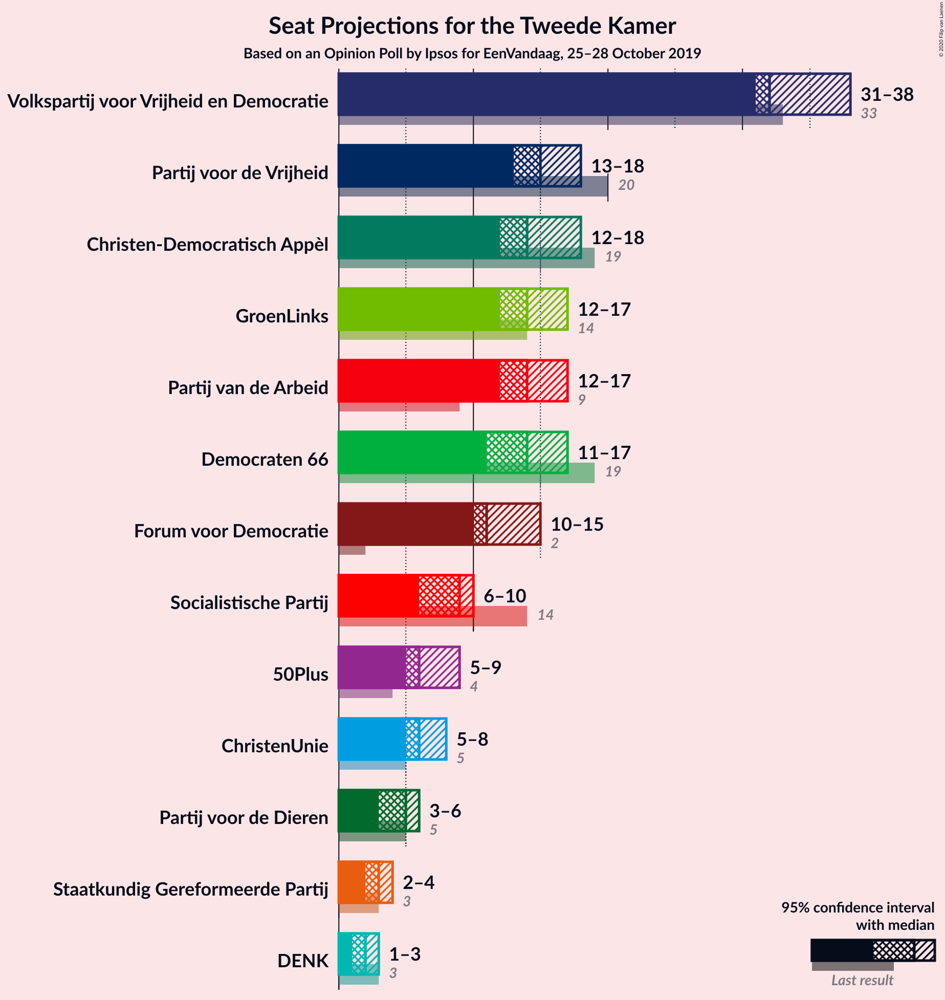
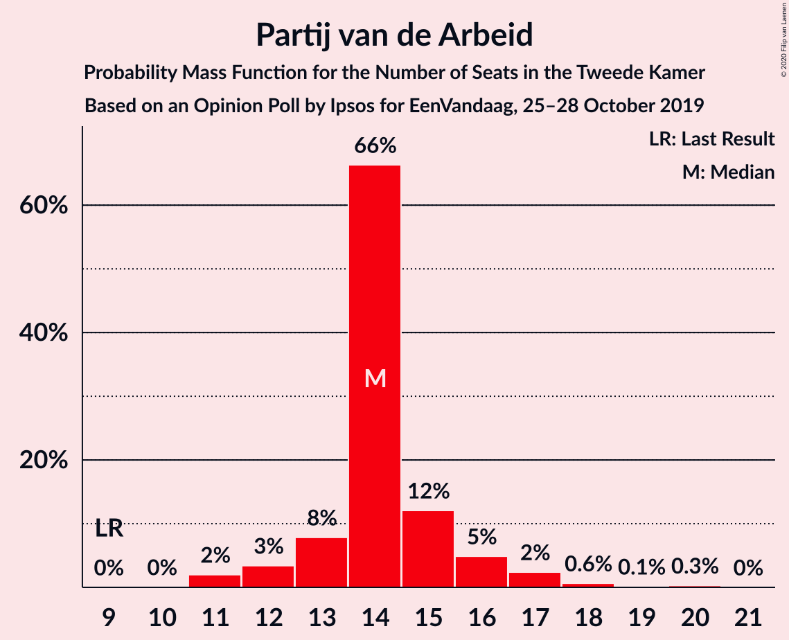
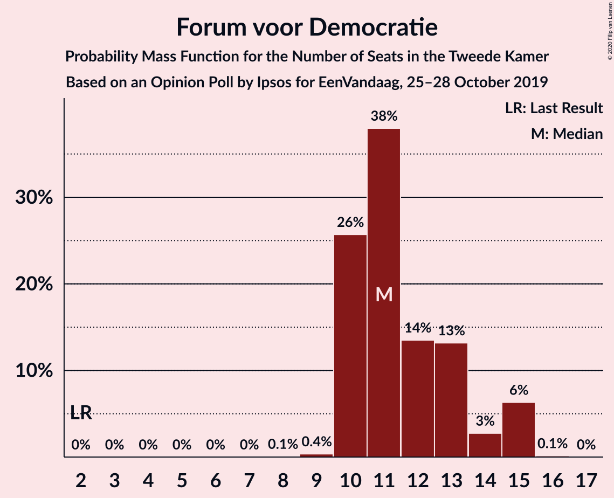
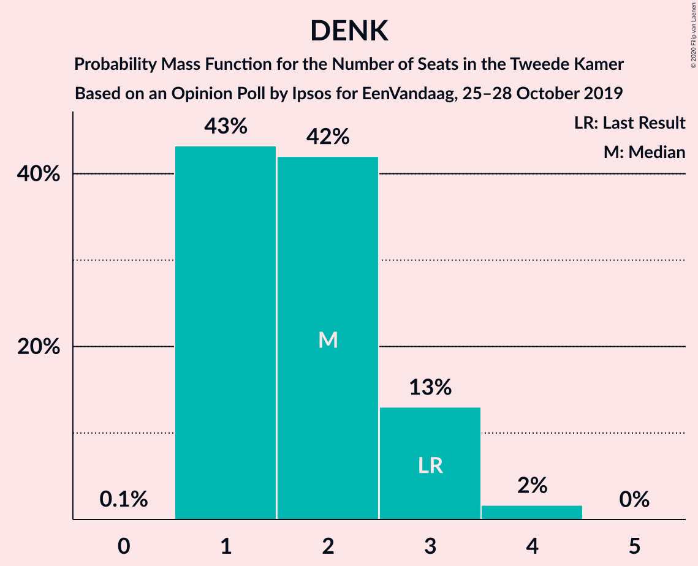
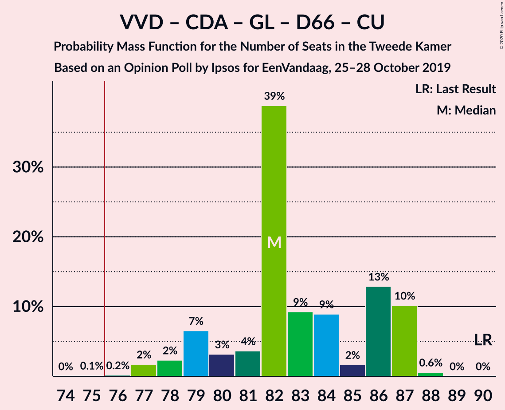
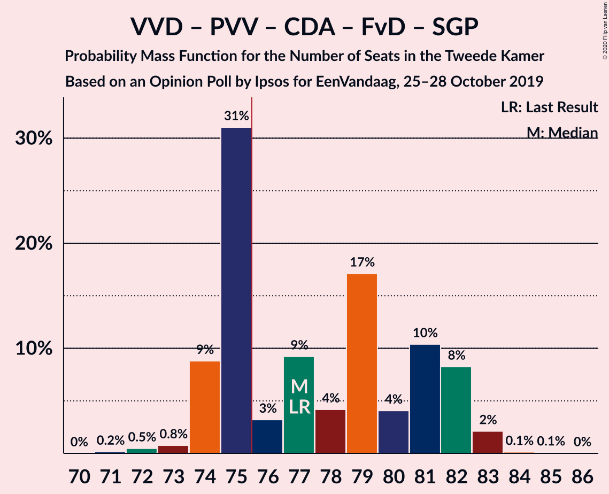
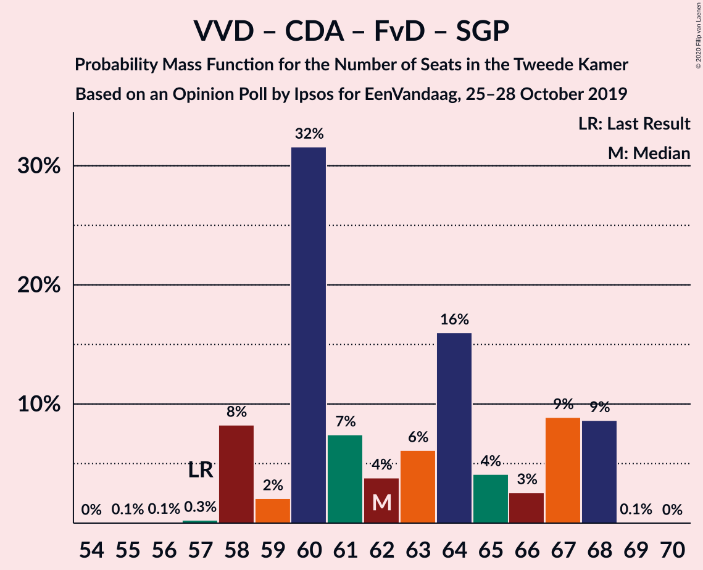
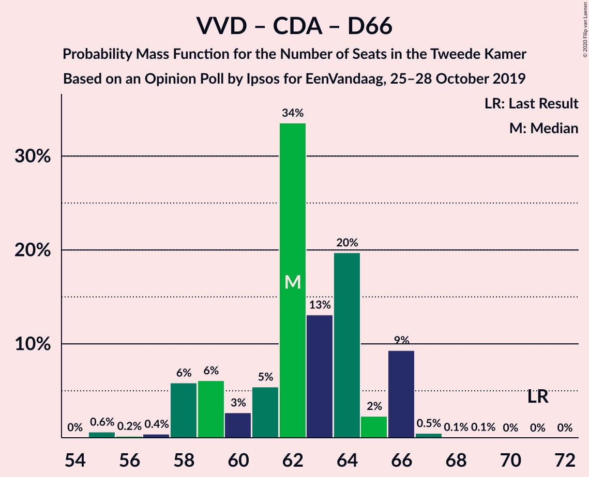
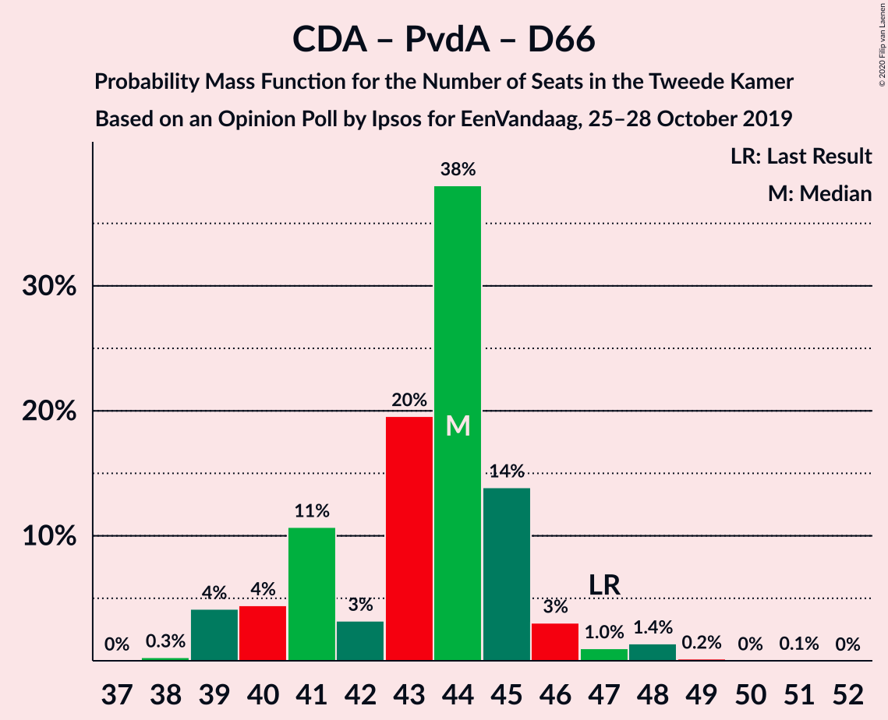

# Opinion Poll by Ipsos for EenVandaag, 25–28 October 2019

<a href="#voting-intentions">Voting Intentions</a> | <a href="#seats">Seats</a> | <a href="#coalitions">Coalitions</a> | <a href="#technical-information">Technical Information</a>

## Voting Intentions

### Confidence Intervals

| Party | Last Result | Poll Result | 80% Confidence Interval | 90% Confidence Interval | 95% Confidence Interval | 99% Confidence Interval |
|:-----:|:-----------:|:-----------:|:-----------------------:|:-----------------------:|:-----------------------:|:-----------------------:|
| Volkspartij voor Vrijheid en Democratie | 21.3% | 21.6% | 20.0–23.3% |19.6–23.8% |19.2–24.2% |18.4–25.1% |
| Partij voor de Vrijheid | 13.1% | 10.3% | 9.2–11.6% |8.9–12.0% |8.6–12.3% |8.1–13.0% |
| Christen-Democratisch Appèl | 12.4% | 9.9% | 8.8–11.2% |8.5–11.6% |8.2–11.9% |7.7–12.6% |
| Partij van de Arbeid | 5.7% | 9.6% | 8.5–10.9% |8.2–11.3% |8.0–11.6% |7.5–12.2% |
| GroenLinks | 9.1% | 9.2% | 8.2–10.5% |7.8–10.9% |7.6–11.2% |7.1–11.8% |
| Democraten 66 | 12.2% | 9.0% | 8.0–10.3% |7.7–10.6% |7.4–11.0% |6.9–11.6% |
| Forum voor Democratie | 1.8% | 7.9% | 7.0–9.1% |6.7–9.5% |6.4–9.8% |6.0–10.4% |
| Socialistische Partij | 9.1% | 5.6% | 4.8–6.6% |4.5–6.9% |4.3–7.2% |4.0–7.7% |
| ChristenUnie | 3.4% | 4.4% | 3.7–5.4% |3.5–5.6% |3.3–5.9% |3.0–6.4% |
| 50Plus | 3.1% | 4.3% | 3.6–5.3% |3.4–5.5% |3.2–5.8% |2.9–6.2% |
| Partij voor de Dieren | 3.2% | 3.0% | 2.5–3.9% |2.3–4.1% |2.1–4.3% |1.9–4.7% |
| Staatkundig Gereformeerde Partij | 2.1% | 1.9% | 1.4–2.5% |1.3–2.7% |1.2–2.9% |1.0–3.3% |
| DENK | 2.1% | 1.5% | 1.1–2.1% |1.0–2.3% |0.9–2.4% |0.7–2.7% |

*Note:* The poll result column reflects the actual value used in the calculations. Published results may vary slightly, and in addition be rounded to fewer digits.

## Seats

### Confidence Intervals

| Party | Last Result | Median | 80% Confidence Interval | 90% Confidence Interval | 95% Confidence Interval | 99% Confidence Interval |
|:-----:|:-----------:|:------:|:-----------------------:|:-----------------------:|:-----------------------:|:-----------------------:|
| <a href="#volkspartij-voor-vrijheid-en-democratie">Volkspartij voor Vrijheid en Democratie</a> | 33 | 31 | 31–35 |31–35 |31–35 |29–35 |
| <a href="#partij-voor-de-vrijheid">Partij voor de Vrijheid</a> | 20 | 16 | 16 |15–17 |15–18 |13–18 |
| <a href="#christen-democratisch-appèl">Christen-Democratisch Appèl</a> | 19 | 16 | 13–16 |13–16 |13–16 |13–17 |
| <a href="#partij-van-de-arbeid">Partij van de Arbeid</a> | 9 | 14 | 11–16 |11–16 |11–20 |11–20 |
| <a href="#groenlinks">GroenLinks</a> | 14 | 16 | 14–16 |14–16 |11–16 |11–18 |
| <a href="#democraten-66">Democraten 66</a> | 19 | 11 | 11–15 |11–15 |11–15 |10–17 |
| <a href="#forum-voor-democratie">Forum voor Democratie</a> | 2 | 12 | 12–13 |12–15 |10–15 |10–15 |
| <a href="#socialistische-partij">Socialistische Partij</a> | 14 | 10 | 9–10 |8–10 |7–10 |6–11 |
| <a href="#christenunie">ChristenUnie</a> | 5 | 8 | 6–8 |6–8 |5–8 |5–8 |
| <a href="#50plus">50Plus</a> | 4 | 7 | 5–7 |5–7 |5–7 |5–9 |
| <a href="#partij-voor-de-dieren">Partij voor de Dieren</a> | 5 | 5 | 3–5 |3–5 |3–6 |3–6 |
| <a href="#staatkundig-gereformeerde-partij">Staatkundig Gereformeerde Partij</a> | 3 | 2 | 2 |1–2 |1–3 |1–4 |
| <a href="#denk">DENK</a> | 3 | 1 | 1–2 |1–3 |1–3 |1–4 |

### Volkspartij voor Vrijheid en Democratie

*For a full overview of the results for this party, see the [Volkspartij voor Vrijheid en Democratie](party-volkspartijvoorvrijheidendemocratie.html) page.*

| Number of Seats | Probability | Accumulated | Special Marks |
|:---------------:|:-----------:|:-----------:|:-------------:|
| 26 | 0.1% | 100% |  |
| 27 | 0% | 99.9% |  |
| 28 | 0.3% | 99.9% |  |
| 29 | 0.2% | 99.6% |  |
| 30 | 0.6% | 99.4% |  |
| 31 | 72% | 98.8% | Median |
| 32 | 4% | 26% |  |
| 33 | 1.5% | 23% | Last Result |
| 34 | 3% | 21% |  |
| 35 | 18% | 18% |  |
| 36 | 0.2% | 0.4% |  |
| 37 | 0.2% | 0.3% |  |
| 38 | 0% | 0.1% |  |
| 39 | 0% | 0% |  |

### Partij voor de Vrijheid

*For a full overview of the results for this party, see the [Partij voor de Vrijheid](party-partijvoordevrijheid.html) page.*

| Number of Seats | Probability | Accumulated | Special Marks |
|:---------------:|:-----------:|:-----------:|:-------------:|
| 12 | 0.4% | 100% |  |
| 13 | 0.7% | 99.6% |  |
| 14 | 1.0% | 98.9% |  |
| 15 | 3% | 98% |  |
| 16 | 89% | 95% | Median |
| 17 | 1.3% | 5% |  |
| 18 | 4% | 4% |  |
| 19 | 0.1% | 0.2% |  |
| 20 | 0% | 0.1% | Last Result |
| 21 | 0% | 0% |  |

### Christen-Democratisch Appèl

*For a full overview of the results for this party, see the [Christen-Democratisch Appèl](party-christen-democratischappèl.html) page.*

| Number of Seats | Probability | Accumulated | Special Marks |
|:---------------:|:-----------:|:-----------:|:-------------:|
| 11 | 0.2% | 100% |  |
| 12 | 0.3% | 99.8% |  |
| 13 | 11% | 99.5% |  |
| 14 | 0.9% | 89% |  |
| 15 | 8% | 88% |  |
| 16 | 78% | 80% | Median |
| 17 | 2% | 2% |  |
| 18 | 0.3% | 0.4% |  |
| 19 | 0% | 0.1% | Last Result |
| 20 | 0% | 0.1% |  |
| 21 | 0% | 0% |  |

### Partij van de Arbeid

*For a full overview of the results for this party, see the [Partij van de Arbeid](party-partijvandearbeid.html) page.*

| Number of Seats | Probability | Accumulated | Special Marks |
|:---------------:|:-----------:|:-----------:|:-------------:|
| 9 | 0% | 100% | Last Result |
| 10 | 0.2% | 100% |  |
| 11 | 18% | 99.8% |  |
| 12 | 0.2% | 82% |  |
| 13 | 1.1% | 81% |  |
| 14 | 65% | 80% | Median |
| 15 | 1.0% | 15% |  |
| 16 | 11% | 14% |  |
| 17 | 0.3% | 3% |  |
| 18 | 0.2% | 3% |  |
| 19 | 0.3% | 3% |  |
| 20 | 3% | 3% |  |
| 21 | 0% | 0% |  |

### GroenLinks

*For a full overview of the results for this party, see the [GroenLinks](party-groenlinks.html) page.*

| Number of Seats | Probability | Accumulated | Special Marks |
|:---------------:|:-----------:|:-----------:|:-------------:|
| 10 | 0.1% | 100% |  |
| 11 | 3% | 99.9% |  |
| 12 | 0.5% | 97% |  |
| 13 | 0.5% | 96% |  |
| 14 | 22% | 96% | Last Result |
| 15 | 2% | 74% |  |
| 16 | 72% | 72% | Median |
| 17 | 0% | 0.6% |  |
| 18 | 0.1% | 0.6% |  |
| 19 | 0.1% | 0.5% |  |
| 20 | 0.4% | 0.4% |  |
| 21 | 0% | 0% |  |

### Democraten 66

*For a full overview of the results for this party, see the [Democraten 66](party-democraten66.html) page.*

| Number of Seats | Probability | Accumulated | Special Marks |
|:---------------:|:-----------:|:-----------:|:-------------:|
| 10 | 1.0% | 100% |  |
| 11 | 71% | 98.9% | Median |
| 12 | 0.9% | 28% |  |
| 13 | 8% | 27% |  |
| 14 | 1.0% | 19% |  |
| 15 | 17% | 18% |  |
| 16 | 0.6% | 1.3% |  |
| 17 | 0.4% | 0.7% |  |
| 18 | 0.1% | 0.2% |  |
| 19 | 0.1% | 0.2% | Last Result |
| 20 | 0% | 0% |  |

### Forum voor Democratie

*For a full overview of the results for this party, see the [Forum voor Democratie](party-forumvoordemocratie.html) page.*

| Number of Seats | Probability | Accumulated | Special Marks |
|:---------------:|:-----------:|:-----------:|:-------------:|
| 2 | 0% | 100% | Last Result |
| 3 | 0% | 100% |  |
| 4 | 0% | 100% |  |
| 5 | 0% | 100% |  |
| 6 | 0% | 100% |  |
| 7 | 0% | 100% |  |
| 8 | 0.1% | 100% |  |
| 9 | 0.3% | 99.9% |  |
| 10 | 4% | 99.6% |  |
| 11 | 0.5% | 96% |  |
| 12 | 71% | 95% | Median |
| 13 | 16% | 25% |  |
| 14 | 0.5% | 9% |  |
| 15 | 8% | 9% |  |
| 16 | 0.1% | 0.1% |  |
| 17 | 0% | 0% |  |

### Socialistische Partij

*For a full overview of the results for this party, see the [Socialistische Partij](party-socialistischepartij.html) page.*

| Number of Seats | Probability | Accumulated | Special Marks |
|:---------------:|:-----------:|:-----------:|:-------------:|
| 5 | 0.4% | 100% |  |
| 6 | 0.7% | 99.6% |  |
| 7 | 3% | 98.9% |  |
| 8 | 1.4% | 96% |  |
| 9 | 21% | 94% |  |
| 10 | 72% | 73% | Median |
| 11 | 0.5% | 0.7% |  |
| 12 | 0.2% | 0.2% |  |
| 13 | 0% | 0% |  |
| 14 | 0% | 0% | Last Result |

### ChristenUnie

*For a full overview of the results for this party, see the [ChristenUnie](party-christenunie.html) page.*

| Number of Seats | Probability | Accumulated | Special Marks |
|:---------------:|:-----------:|:-----------:|:-------------:|
| 4 | 0.2% | 100% |  |
| 5 | 5% | 99.8% | Last Result |
| 6 | 9% | 95% |  |
| 7 | 21% | 86% |  |
| 8 | 65% | 65% | Median |
| 9 | 0.4% | 0.4% |  |
| 10 | 0% | 0% |  |

### 50Plus

*For a full overview of the results for this party, see the [50Plus](party-50plus.html) page.*

| Number of Seats | Probability | Accumulated | Special Marks |
|:---------------:|:-----------:|:-----------:|:-------------:|
| 4 | 0.3% | 100% | Last Result |
| 5 | 17% | 99.7% |  |
| 6 | 13% | 82% |  |
| 7 | 67% | 69% | Median |
| 8 | 2% | 2% |  |
| 9 | 0.5% | 0.6% |  |
| 10 | 0.1% | 0.2% |  |
| 11 | 0% | 0% |  |

### Partij voor de Dieren

*For a full overview of the results for this party, see the [Partij voor de Dieren](party-partijvoordedieren.html) page.*

| Number of Seats | Probability | Accumulated | Special Marks |
|:---------------:|:-----------:|:-----------:|:-------------:|
| 2 | 0.2% | 100% |  |
| 3 | 18% | 99.8% |  |
| 4 | 11% | 81% |  |
| 5 | 67% | 70% | Last Result, Median |
| 6 | 3% | 3% |  |
| 7 | 0.3% | 0.4% |  |
| 8 | 0.1% | 0.1% |  |
| 9 | 0% | 0% |  |

### Staatkundig Gereformeerde Partij

*For a full overview of the results for this party, see the [Staatkundig Gereformeerde Partij](party-staatkundiggereformeerdepartij.html) page.*

| Number of Seats | Probability | Accumulated | Special Marks |
|:---------------:|:-----------:|:-----------:|:-------------:|
| 1 | 6% | 100% |  |
| 2 | 92% | 94% | Median |
| 3 | 2% | 3% | Last Result |
| 4 | 0.9% | 1.1% |  |
| 5 | 0.2% | 0.2% |  |
| 6 | 0% | 0% |  |

### DENK

*For a full overview of the results for this party, see the [DENK](party-denk.html) page.*

| Number of Seats | Probability | Accumulated | Special Marks |
|:---------------:|:-----------:|:-----------:|:-------------:|
| 0 | 0.1% | 100% |  |
| 1 | 65% | 99.9% | Median |
| 2 | 26% | 35% |  |
| 3 | 8% | 9% | Last Result |
| 4 | 0.9% | 1.0% |  |
| 5 | 0.1% | 0.1% |  |
| 6 | 0% | 0% |  |

## Coalitions

### Confidence Intervals

| Coalition | Last Result | Median | Majority? | 80% Confidence Interval | 90% Confidence Interval | 95% Confidence Interval | 99% Confidence Interval |
|:---------:|:-----------:|:------:|:---------:|:-----------------------:|:-----------------------:|:-----------------------:|:-----------------------:|
| Volkspartij voor Vrijheid en Democratie – Christen-Democratisch Appèl – GroenLinks – Democraten 66 – ChristenUnie | 90 | 82 | 99.8% | 78–87 | 77–87 | 77–87 | 77–87 |
| Volkspartij voor Vrijheid en Democratie – Christen-Democratisch Appèl – Partij van de Arbeid – Democraten 66 – ChristenUnie | 85 | 80 | 99.9% | 79–84 | 77–84 | 77–87 | 77–87 |
| Volkspartij voor Vrijheid en Democratie – Partij voor de Vrijheid – Christen-Democratisch Appèl – Forum voor Democratie – Staatkundig Gereformeerde Partij | 77 | 77 | 96% | 77–82 | 77–82 | 74–82 | 73–82 |
| Volkspartij voor Vrijheid en Democratie – Partij voor de Vrijheid – Christen-Democratisch Appèl – Forum voor Democratie | 74 | 75 | 21% | 75–80 | 74–80 | 72–80 | 70–80 |
| Christen-Democratisch Appèl – Partij van de Arbeid – GroenLinks – Democraten 66 – Socialistische Partij – ChristenUnie | 80 | 75 | 0.8% | 72–75 | 69–75 | 69–75 | 69–77 |
| Volkspartij voor Vrijheid en Democratie – Christen-Democratisch Appèl – Democraten 66 – ChristenUnie | 76 | 66 | 0.1% | 66–73 | 61–73 | 61–73 | 61–73 |
| Volkspartij voor Vrijheid en Democratie – Christen-Democratisch Appèl – Forum voor Democratie – 50Plus – Staatkundig Gereformeerde Partij | 61 | 68 | 0.1% | 67–71 | 66–71 | 66–71 | 63–74 |
| Volkspartij voor Vrijheid en Democratie – Christen-Democratisch Appèl – Forum voor Democratie – 50Plus | 58 | 66 | 0% | 65–69 | 64–69 | 64–69 | 61–71 |
| Volkspartij voor Vrijheid en Democratie – Partij voor de Vrijheid – Christen-Democratisch Appèl | 72 | 63 | 0% | 62–67 | 60–67 | 60–68 | 58–68 |
| Christen-Democratisch Appèl – Partij van de Arbeid – GroenLinks – Democraten 66 – ChristenUnie | 66 | 65 | 0% | 62–65 | 60–65 | 60–67 | 59–69 |
| Volkspartij voor Vrijheid en Democratie – Christen-Democratisch Appèl – Partij van de Arbeid | 61 | 61 | 0% | 61–62 | 60–64 | 60–67 | 57–67 |
| Volkspartij voor Vrijheid en Democratie – Partij van de Arbeid – Democraten 66 | 61 | 56 | 0% | 56–61 | 56–63 | 56–67 | 54–67 |
| Volkspartij voor Vrijheid en Democratie – Christen-Democratisch Appèl – Forum voor Democratie – Staatkundig Gereformeerde Partij | 57 | 61 | 0% | 61–66 | 61–66 | 59–66 | 57–66 |
| Volkspartij voor Vrijheid en Democratie – Christen-Democratisch Appèl – Democraten 66 | 71 | 58 | 0% | 58–66 | 55–66 | 55–66 | 55–66 |
| Volkspartij voor Vrijheid en Democratie – Christen-Democratisch Appèl – Forum voor Democratie | 54 | 59 | 0% | 59–64 | 58–64 | 57–64 | 55–64 |
| Volkspartij voor Vrijheid en Democratie – Partij van de Arbeid | 42 | 45 | 0% | 45–47 | 45–48 | 45–54 | 42–54 |
| Volkspartij voor Vrijheid en Democratie – Christen-Democratisch Appèl | 52 | 47 | 0% | 47–51 | 44–51 | 44–51 | 44–51 |
| Christen-Democratisch Appèl – Partij van de Arbeid – Democraten 66 | 47 | 41 | 0% | 40–42 | 40–46 | 39–46 | 38–48 |
| Christen-Democratisch Appèl – Partij van de Arbeid – ChristenUnie | 33 | 38 | 0% | 34–38 | 34–38 | 33–40 | 33–40 |
| Christen-Democratisch Appèl – Partij van de Arbeid | 28 | 30 | 0% | 27–30 | 27–31 | 26–33 | 25–33 |
| Christen-Democratisch Appèl – Democraten 66 | 38 | 27 | 0% | 26–31 | 24–31 | 24–31 | 24–32 |

### Volkspartij voor Vrijheid en Democratie – Christen-Democratisch Appèl – GroenLinks – Democraten 66 – ChristenUnie

| Number of Seats | Probability | Accumulated | Special Marks |
|:---------------:|:-----------:|:-----------:|:-------------:|
| 75 | 0.2% | 100% |  |
| 76 | 0% | 99.8% | Majority |
| 77 | 8% | 99.7% |  |
| 78 | 3% | 92% |  |
| 79 | 1.4% | 89% |  |
| 80 | 0.5% | 88% |  |
| 81 | 4% | 88% |  |
| 82 | 64% | 83% | Median |
| 83 | 0.2% | 19% |  |
| 84 | 4% | 19% |  |
| 85 | 0.3% | 15% |  |
| 86 | 1.0% | 15% |  |
| 87 | 14% | 14% |  |
| 88 | 0.1% | 0.2% |  |
| 89 | 0.1% | 0.1% |  |
| 90 | 0% | 0% | Last Result |

### Volkspartij voor Vrijheid en Democratie – Christen-Democratisch Appèl – Partij van de Arbeid – Democraten 66 – ChristenUnie

| Number of Seats | Probability | Accumulated | Special Marks |
|:---------------:|:-----------:|:-----------:|:-------------:|
| 75 | 0% | 100% |  |
| 76 | 0.1% | 99.9% | Majority |
| 77 | 8% | 99.9% |  |
| 78 | 0.5% | 92% |  |
| 79 | 2% | 91% |  |
| 80 | 64% | 90% | Median |
| 81 | 4% | 26% |  |
| 82 | 0.5% | 22% |  |
| 83 | 3% | 21% |  |
| 84 | 14% | 18% |  |
| 85 | 0.4% | 4% | Last Result |
| 86 | 0.2% | 4% |  |
| 87 | 3% | 3% |  |
| 88 | 0.1% | 0.2% |  |
| 89 | 0% | 0.1% |  |
| 90 | 0.1% | 0.1% |  |
| 91 | 0% | 0% |  |

### Volkspartij voor Vrijheid en Democratie – Partij voor de Vrijheid – Christen-Democratisch Appèl – Forum voor Democratie – Staatkundig Gereformeerde Partij

| Number of Seats | Probability | Accumulated | Special Marks |
|:---------------:|:-----------:|:-----------:|:-------------:|
| 68 | 0% | 100% |  |
| 69 | 0% | 99.9% |  |
| 70 | 0% | 99.9% |  |
| 71 | 0.2% | 99.9% |  |
| 72 | 0.2% | 99.7% |  |
| 73 | 0.2% | 99.5% |  |
| 74 | 3% | 99.3% |  |
| 75 | 0.5% | 96% |  |
| 76 | 0.7% | 96% | Majority |
| 77 | 74% | 95% | Last Result, Median |
| 78 | 0.2% | 21% |  |
| 79 | 0.9% | 21% |  |
| 80 | 1.0% | 20% |  |
| 81 | 5% | 19% |  |
| 82 | 14% | 14% |  |
| 83 | 0.1% | 0.3% |  |
| 84 | 0.1% | 0.2% |  |
| 85 | 0% | 0.1% |  |
| 86 | 0% | 0.1% |  |
| 87 | 0% | 0% |  |

### Volkspartij voor Vrijheid en Democratie – Partij voor de Vrijheid – Christen-Democratisch Appèl – Forum voor Democratie

| Number of Seats | Probability | Accumulated | Special Marks |
|:---------------:|:-----------:|:-----------:|:-------------:|
| 66 | 0% | 100% |  |
| 67 | 0% | 99.9% |  |
| 68 | 0% | 99.9% |  |
| 69 | 0.3% | 99.9% |  |
| 70 | 0.3% | 99.7% |  |
| 71 | 0.5% | 99.3% |  |
| 72 | 3% | 98.8% |  |
| 73 | 0.3% | 95% |  |
| 74 | 0.5% | 95% | Last Result |
| 75 | 74% | 95% | Median |
| 76 | 0.5% | 21% | Majority |
| 77 | 0.6% | 20% |  |
| 78 | 0.2% | 19% |  |
| 79 | 0.9% | 19% |  |
| 80 | 18% | 18% |  |
| 81 | 0% | 0.2% |  |
| 82 | 0.1% | 0.2% |  |
| 83 | 0% | 0.1% |  |
| 84 | 0% | 0% |  |

### Christen-Democratisch Appèl – Partij van de Arbeid – GroenLinks – Democraten 66 – Socialistische Partij – ChristenUnie

| Number of Seats | Probability | Accumulated | Special Marks |
|:---------------:|:-----------:|:-----------:|:-------------:|
| 64 | 0% | 100% |  |
| 65 | 0.1% | 99.9% |  |
| 66 | 0.1% | 99.8% |  |
| 67 | 0.1% | 99.7% |  |
| 68 | 0.1% | 99.6% |  |
| 69 | 5% | 99.5% |  |
| 70 | 0.2% | 94% |  |
| 71 | 3% | 94% |  |
| 72 | 22% | 91% |  |
| 73 | 1.3% | 69% |  |
| 74 | 3% | 68% |  |
| 75 | 64% | 65% | Median |
| 76 | 0.2% | 0.8% | Majority |
| 77 | 0.3% | 0.5% |  |
| 78 | 0.1% | 0.2% |  |
| 79 | 0% | 0.1% |  |
| 80 | 0.1% | 0.1% | Last Result |
| 81 | 0% | 0% |  |

### Volkspartij voor Vrijheid en Democratie – Christen-Democratisch Appèl – Democraten 66 – ChristenUnie

| Number of Seats | Probability | Accumulated | Special Marks |
|:---------------:|:-----------:|:-----------:|:-------------:|
| 61 | 8% | 100% |  |
| 62 | 0.2% | 92% |  |
| 63 | 0.1% | 92% |  |
| 64 | 0.2% | 92% |  |
| 65 | 1.0% | 92% |  |
| 66 | 65% | 91% | Median |
| 67 | 6% | 26% |  |
| 68 | 0.4% | 20% |  |
| 69 | 0.4% | 19% |  |
| 70 | 4% | 19% |  |
| 71 | 0.1% | 15% |  |
| 72 | 0.6% | 15% |  |
| 73 | 14% | 14% |  |
| 74 | 0.1% | 0.3% |  |
| 75 | 0.1% | 0.1% |  |
| 76 | 0.1% | 0.1% | Last Result, Majority |
| 77 | 0% | 0% |  |

### Volkspartij voor Vrijheid en Democratie – Christen-Democratisch Appèl – Forum voor Democratie – 50Plus – Staatkundig Gereformeerde Partij

| Number of Seats | Probability | Accumulated | Special Marks |
|:---------------:|:-----------:|:-----------:|:-------------:|
| 59 | 0.1% | 100% |  |
| 60 | 0% | 99.9% |  |
| 61 | 0% | 99.9% | Last Result |
| 62 | 0% | 99.9% |  |
| 63 | 0.4% | 99.9% |  |
| 64 | 0.2% | 99.5% |  |
| 65 | 0.3% | 99.2% |  |
| 66 | 5% | 98.9% |  |
| 67 | 8% | 94% |  |
| 68 | 64% | 85% | Median |
| 69 | 4% | 21% |  |
| 70 | 1.1% | 17% |  |
| 71 | 14% | 16% |  |
| 72 | 0.9% | 2% |  |
| 73 | 0.1% | 0.7% |  |
| 74 | 0.3% | 0.6% |  |
| 75 | 0.2% | 0.3% |  |
| 76 | 0% | 0.1% | Majority |
| 77 | 0% | 0% |  |

### Volkspartij voor Vrijheid en Democratie – Christen-Democratisch Appèl – Forum voor Democratie – 50Plus

| Number of Seats | Probability | Accumulated | Special Marks |
|:---------------:|:-----------:|:-----------:|:-------------:|
| 57 | 0.1% | 100% |  |
| 58 | 0% | 99.9% | Last Result |
| 59 | 0.1% | 99.9% |  |
| 60 | 0.3% | 99.8% |  |
| 61 | 0.3% | 99.5% |  |
| 62 | 0.3% | 99.3% |  |
| 63 | 0.3% | 99.0% |  |
| 64 | 5% | 98.7% |  |
| 65 | 8% | 93% |  |
| 66 | 64% | 85% | Median |
| 67 | 0.4% | 21% |  |
| 68 | 4% | 20% |  |
| 69 | 15% | 16% |  |
| 70 | 0.1% | 1.4% |  |
| 71 | 0.9% | 1.3% |  |
| 72 | 0.3% | 0.4% |  |
| 73 | 0.1% | 0.2% |  |
| 74 | 0% | 0% |  |

### Volkspartij voor Vrijheid en Democratie – Partij voor de Vrijheid – Christen-Democratisch Appèl

| Number of Seats | Probability | Accumulated | Special Marks |
|:---------------:|:-----------:|:-----------:|:-------------:|
| 54 | 0% | 100% |  |
| 55 | 0% | 99.9% |  |
| 56 | 0% | 99.9% |  |
| 57 | 0.1% | 99.9% |  |
| 58 | 0.4% | 99.7% |  |
| 59 | 0.1% | 99.3% |  |
| 60 | 8% | 99.3% |  |
| 61 | 0.5% | 91% |  |
| 62 | 4% | 91% |  |
| 63 | 67% | 87% | Median |
| 64 | 2% | 21% |  |
| 65 | 0.3% | 19% |  |
| 66 | 0.1% | 19% |  |
| 67 | 14% | 18% |  |
| 68 | 4% | 4% |  |
| 69 | 0.1% | 0.2% |  |
| 70 | 0.1% | 0.1% |  |
| 71 | 0% | 0% |  |
| 72 | 0% | 0% | Last Result |

### Christen-Democratisch Appèl – Partij van de Arbeid – GroenLinks – Democraten 66 – ChristenUnie

| Number of Seats | Probability | Accumulated | Special Marks |
|:---------------:|:-----------:|:-----------:|:-------------:|
| 55 | 0.1% | 100% |  |
| 56 | 0% | 99.9% |  |
| 57 | 0.2% | 99.9% |  |
| 58 | 0.1% | 99.7% |  |
| 59 | 0.1% | 99.6% |  |
| 60 | 5% | 99.5% |  |
| 61 | 0.4% | 95% |  |
| 62 | 11% | 94% |  |
| 63 | 15% | 84% |  |
| 64 | 0.6% | 69% |  |
| 65 | 64% | 69% | Median |
| 66 | 1.1% | 5% | Last Result |
| 67 | 3% | 4% |  |
| 68 | 0.2% | 0.8% |  |
| 69 | 0.2% | 0.6% |  |
| 70 | 0.3% | 0.4% |  |
| 71 | 0% | 0.1% |  |
| 72 | 0% | 0% |  |

### Volkspartij voor Vrijheid en Democratie – Christen-Democratisch Appèl – Partij van de Arbeid

| Number of Seats | Probability | Accumulated | Special Marks |
|:---------------:|:-----------:|:-----------:|:-------------:|
| 55 | 0.3% | 100% |  |
| 56 | 0% | 99.7% |  |
| 57 | 0.6% | 99.6% |  |
| 58 | 0.2% | 99.1% |  |
| 59 | 0.8% | 98.9% |  |
| 60 | 8% | 98% |  |
| 61 | 68% | 90% | Last Result, Median |
| 62 | 14% | 22% |  |
| 63 | 3% | 8% |  |
| 64 | 1.2% | 5% |  |
| 65 | 0.2% | 4% |  |
| 66 | 0.8% | 4% |  |
| 67 | 3% | 3% |  |
| 68 | 0.1% | 0.1% |  |
| 69 | 0% | 0% |  |

### Volkspartij voor Vrijheid en Democratie – Partij van de Arbeid – Democraten 66

| Number of Seats | Probability | Accumulated | Special Marks |
|:---------------:|:-----------:|:-----------:|:-------------:|
| 54 | 0.5% | 100% |  |
| 55 | 0% | 99.5% |  |
| 56 | 64% | 99.4% | Median |
| 57 | 2% | 36% |  |
| 58 | 8% | 34% |  |
| 59 | 4% | 26% |  |
| 60 | 0.6% | 22% |  |
| 61 | 14% | 21% | Last Result |
| 62 | 0.5% | 7% |  |
| 63 | 3% | 7% |  |
| 64 | 0.5% | 4% |  |
| 65 | 0.5% | 3% |  |
| 66 | 0.2% | 3% |  |
| 67 | 3% | 3% |  |
| 68 | 0% | 0.1% |  |
| 69 | 0% | 0% |  |

### Volkspartij voor Vrijheid en Democratie – Christen-Democratisch Appèl – Forum voor Democratie – Staatkundig Gereformeerde Partij

| Number of Seats | Probability | Accumulated | Special Marks |
|:---------------:|:-----------:|:-----------:|:-------------:|
| 54 | 0% | 100% |  |
| 55 | 0.1% | 99.9% |  |
| 56 | 0% | 99.8% |  |
| 57 | 0.4% | 99.8% | Last Result |
| 58 | 0.4% | 99.5% |  |
| 59 | 3% | 99.0% |  |
| 60 | 0.2% | 96% |  |
| 61 | 75% | 96% | Median |
| 62 | 0.3% | 21% |  |
| 63 | 4% | 21% |  |
| 64 | 2% | 17% |  |
| 65 | 0.3% | 15% |  |
| 66 | 14% | 14% |  |
| 67 | 0.2% | 0.5% |  |
| 68 | 0.2% | 0.3% |  |
| 69 | 0% | 0.1% |  |
| 70 | 0% | 0% |  |

### Volkspartij voor Vrijheid en Democratie – Christen-Democratisch Appèl – Democraten 66

| Number of Seats | Probability | Accumulated | Special Marks |
|:---------------:|:-----------:|:-----------:|:-------------:|
| 55 | 8% | 100% |  |
| 56 | 0.3% | 92% |  |
| 57 | 0.2% | 92% |  |
| 58 | 64% | 92% | Median |
| 59 | 0.5% | 28% |  |
| 60 | 4% | 27% |  |
| 61 | 1.4% | 23% |  |
| 62 | 3% | 22% |  |
| 63 | 4% | 19% |  |
| 64 | 0.5% | 15% |  |
| 65 | 0.1% | 14% |  |
| 66 | 14% | 14% |  |
| 67 | 0.2% | 0.2% |  |
| 68 | 0% | 0% |  |
| 69 | 0% | 0% |  |
| 70 | 0% | 0% |  |
| 71 | 0% | 0% | Last Result |

### Volkspartij voor Vrijheid en Democratie – Christen-Democratisch Appèl – Forum voor Democratie

| Number of Seats | Probability | Accumulated | Special Marks |
|:---------------:|:-----------:|:-----------:|:-------------:|
| 52 | 0% | 100% |  |
| 53 | 0.1% | 99.9% |  |
| 54 | 0.2% | 99.8% | Last Result |
| 55 | 0.4% | 99.6% |  |
| 56 | 0.6% | 99.2% |  |
| 57 | 3% | 98.6% |  |
| 58 | 0.7% | 96% |  |
| 59 | 74% | 95% | Median |
| 60 | 0.3% | 21% |  |
| 61 | 0.3% | 20% |  |
| 62 | 4% | 20% |  |
| 63 | 2% | 16% |  |
| 64 | 14% | 14% |  |
| 65 | 0% | 0.2% |  |
| 66 | 0.2% | 0.2% |  |
| 67 | 0% | 0.1% |  |
| 68 | 0% | 0% |  |

### Volkspartij voor Vrijheid en Democratie – Partij van de Arbeid

| Number of Seats | Probability | Accumulated | Special Marks |
|:---------------:|:-----------:|:-----------:|:-------------:|
| 41 | 0.3% | 100% |  |
| 42 | 0.5% | 99.7% | Last Result |
| 43 | 0.3% | 99.2% |  |
| 44 | 1.0% | 98.8% |  |
| 45 | 64% | 98% | Median |
| 46 | 18% | 34% |  |
| 47 | 9% | 16% |  |
| 48 | 3% | 7% |  |
| 49 | 0.3% | 4% |  |
| 50 | 0.8% | 4% |  |
| 51 | 0.4% | 3% |  |
| 52 | 0.1% | 3% |  |
| 53 | 0% | 3% |  |
| 54 | 3% | 3% |  |
| 55 | 0% | 0% |  |

### Volkspartij voor Vrijheid en Democratie – Christen-Democratisch Appèl

| Number of Seats | Probability | Accumulated | Special Marks |
|:---------------:|:-----------:|:-----------:|:-------------:|
| 41 | 0% | 100% |  |
| 42 | 0.1% | 99.9% |  |
| 43 | 0.2% | 99.9% |  |
| 44 | 8% | 99.7% |  |
| 45 | 0.6% | 91% |  |
| 46 | 0.7% | 91% |  |
| 47 | 69% | 90% | Median |
| 48 | 1.2% | 21% |  |
| 49 | 0.4% | 20% |  |
| 50 | 5% | 19% |  |
| 51 | 14% | 14% |  |
| 52 | 0.2% | 0.4% | Last Result |
| 53 | 0.1% | 0.2% |  |
| 54 | 0.1% | 0.1% |  |
| 55 | 0% | 0% |  |

### Christen-Democratisch Appèl – Partij van de Arbeid – Democraten 66

| Number of Seats | Probability | Accumulated | Special Marks |
|:---------------:|:-----------:|:-----------:|:-------------:|
| 36 | 0.1% | 100% |  |
| 37 | 0% | 99.9% |  |
| 38 | 0.6% | 99.9% |  |
| 39 | 4% | 99.2% |  |
| 40 | 8% | 95% |  |
| 41 | 65% | 87% | Median |
| 42 | 14% | 22% |  |
| 43 | 1.1% | 9% |  |
| 44 | 0.3% | 8% |  |
| 45 | 0.4% | 7% |  |
| 46 | 6% | 7% |  |
| 47 | 0.2% | 0.9% | Last Result |
| 48 | 0.7% | 0.7% |  |
| 49 | 0% | 0.1% |  |
| 50 | 0% | 0% |  |

### Christen-Democratisch Appèl – Partij van de Arbeid – ChristenUnie

| Number of Seats | Probability | Accumulated | Special Marks |
|:---------------:|:-----------:|:-----------:|:-------------:|
| 27 | 0.1% | 100% |  |
| 28 | 0% | 99.9% |  |
| 29 | 0% | 99.9% |  |
| 30 | 0% | 99.9% |  |
| 31 | 0.1% | 99.9% |  |
| 32 | 0.3% | 99.8% |  |
| 33 | 4% | 99.5% | Last Result |
| 34 | 14% | 95% |  |
| 35 | 9% | 81% |  |
| 36 | 4% | 72% |  |
| 37 | 0.7% | 68% |  |
| 38 | 64% | 67% | Median |
| 39 | 0.3% | 4% |  |
| 40 | 3% | 3% |  |
| 41 | 0.2% | 0.4% |  |
| 42 | 0% | 0.2% |  |
| 43 | 0.2% | 0.2% |  |
| 44 | 0% | 0% |  |

### Christen-Democratisch Appèl – Partij van de Arbeid

| Number of Seats | Probability | Accumulated | Special Marks |
|:---------------:|:-----------:|:-----------:|:-------------:|
| 22 | 0.1% | 100% |  |
| 23 | 0% | 99.9% |  |
| 24 | 0.2% | 99.9% |  |
| 25 | 0.3% | 99.7% |  |
| 26 | 4% | 99.4% |  |
| 27 | 14% | 95% |  |
| 28 | 0.3% | 81% | Last Result |
| 29 | 8% | 81% |  |
| 30 | 65% | 72% | Median |
| 31 | 4% | 8% |  |
| 32 | 0.4% | 4% |  |
| 33 | 3% | 3% |  |
| 34 | 0.2% | 0.4% |  |
| 35 | 0.1% | 0.2% |  |
| 36 | 0.1% | 0.1% |  |
| 37 | 0% | 0% |  |

### Christen-Democratisch Appèl – Democraten 66

| Number of Seats | Probability | Accumulated | Special Marks |
|:---------------:|:-----------:|:-----------:|:-------------:|
| 23 | 0% | 100% |  |
| 24 | 8% | 99.9% |  |
| 25 | 0.3% | 92% |  |
| 26 | 3% | 92% |  |
| 27 | 65% | 89% | Median |
| 28 | 4% | 24% |  |
| 29 | 0.6% | 20% |  |
| 30 | 4% | 19% |  |
| 31 | 14% | 15% |  |
| 32 | 0.4% | 0.7% |  |
| 33 | 0.1% | 0.3% |  |
| 34 | 0.2% | 0.2% |  |
| 35 | 0% | 0% |  |
| 36 | 0% | 0% |  |
| 37 | 0% | 0% |  |
| 38 | 0% | 0% | Last Result |

## Technical Information

### Opinion Poll

+ **Polling firm:** Ipsos
+ **Commissioner(s):** EenVandaag
+ **Fieldwork period:** 25–28 October 2019

### Calculations

+ **Sample size:** 1019
+ **Simulations done:** 131,072
+ **Error estimate:** 2.62%

