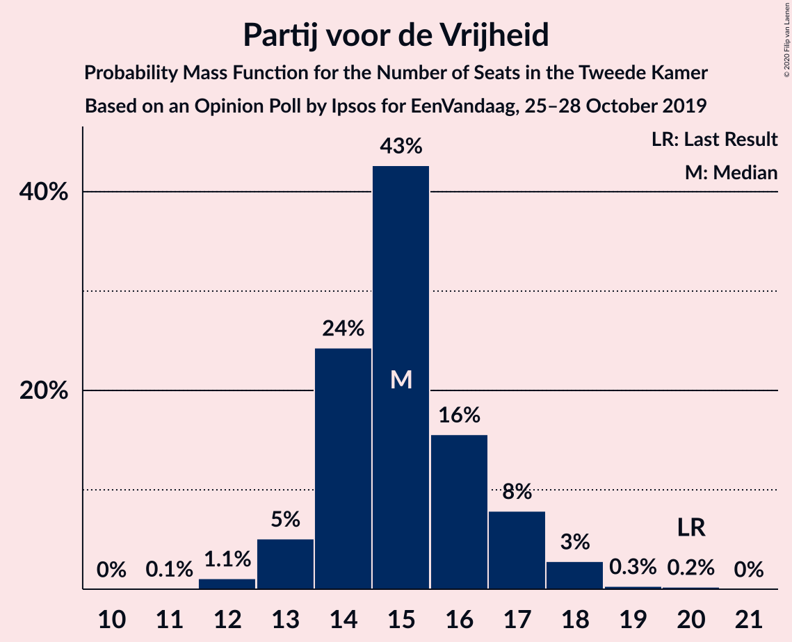
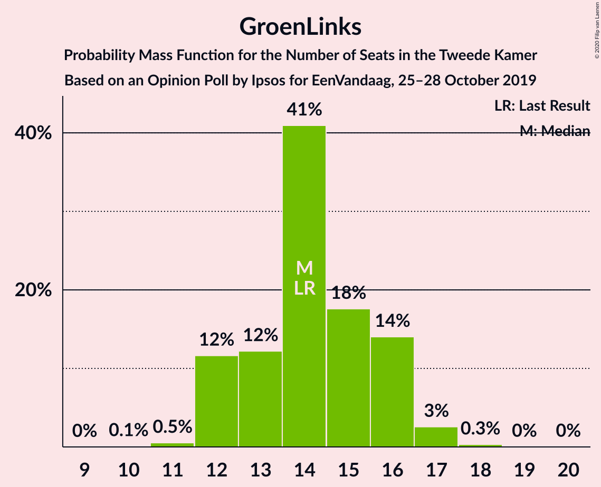
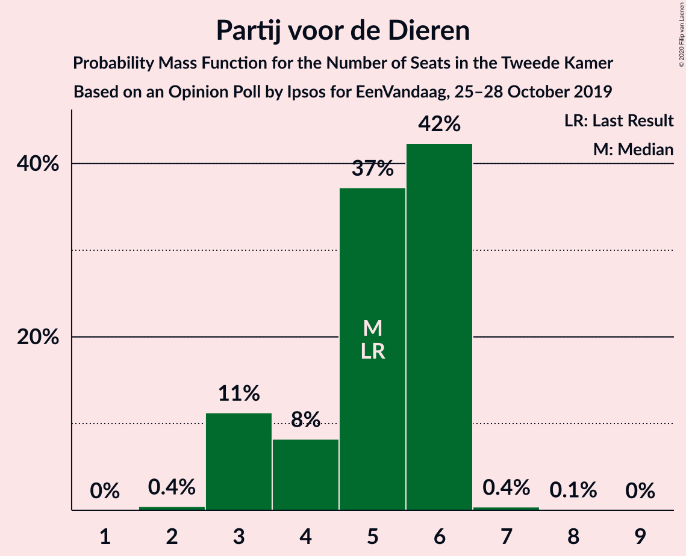
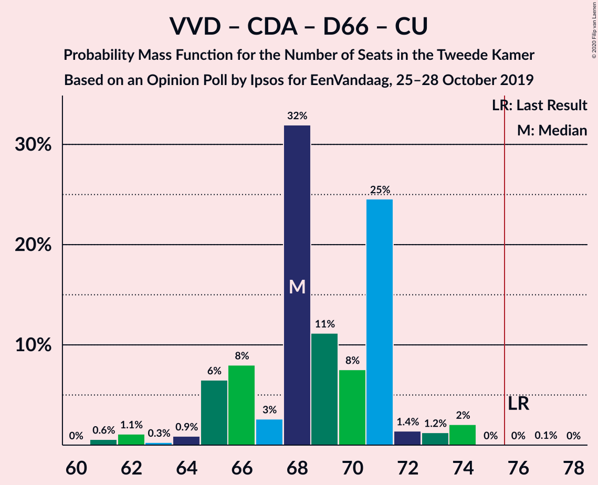
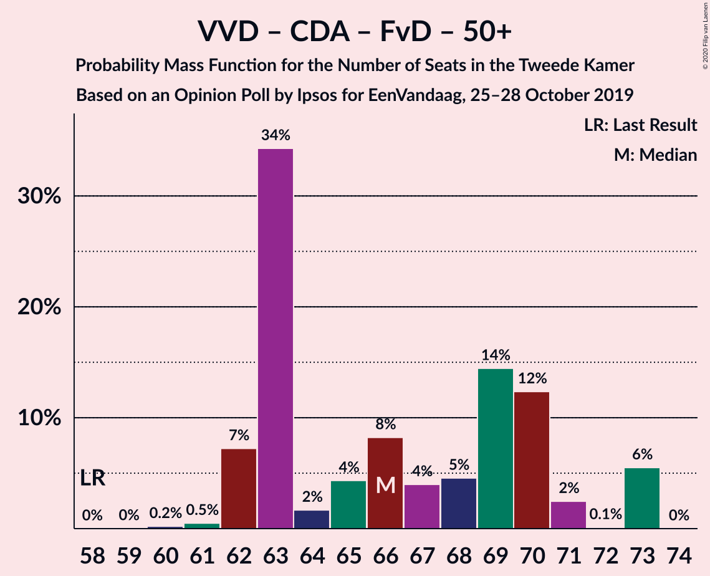

# Opinion Poll by Ipsos for EenVandaag, 25–28 October 2019

<a href="#voting-intentions">Voting Intentions</a> | <a href="#seats">Seats</a> | <a href="#coalitions">Coalitions</a> | <a href="#technical-information">Technical Information</a>

## Voting Intentions

### Confidence Intervals

| Party | Last Result | Poll Result | 80% Confidence Interval | 90% Confidence Interval | 95% Confidence Interval | 99% Confidence Interval |
|:-----:|:-----------:|:-----------:|:-----------------------:|:-----------------------:|:-----------------------:|:-----------------------:|
| Volkspartij voor Vrijheid en Democratie | 21.3% | 21.6% | 20.0–23.3% |19.6–23.8% |19.2–24.2% |18.4–25.1% |
| Partij voor de Vrijheid | 13.1% | 10.3% | 9.2–11.6% |8.9–12.0% |8.6–12.3% |8.1–13.0% |
| Christen-Democratisch Appèl | 12.4% | 9.9% | 8.8–11.2% |8.5–11.6% |8.2–11.9% |7.7–12.6% |
| Partij van de Arbeid | 5.7% | 9.6% | 8.5–10.9% |8.2–11.3% |8.0–11.6% |7.5–12.2% |
| GroenLinks | 9.1% | 9.2% | 8.2–10.5% |7.8–10.9% |7.6–11.2% |7.1–11.8% |
| Democraten 66 | 12.2% | 9.0% | 8.0–10.3% |7.7–10.6% |7.4–11.0% |6.9–11.6% |
| Forum voor Democratie | 1.8% | 7.9% | 7.0–9.1% |6.7–9.5% |6.4–9.8% |6.0–10.4% |
| Socialistische Partij | 9.1% | 5.6% | 4.8–6.6% |4.5–6.9% |4.3–7.2% |4.0–7.7% |
| ChristenUnie | 3.4% | 4.4% | 3.7–5.4% |3.5–5.6% |3.3–5.9% |3.0–6.4% |
| 50Plus | 3.1% | 4.3% | 3.6–5.3% |3.4–5.5% |3.2–5.8% |2.9–6.2% |
| Partij voor de Dieren | 3.2% | 3.0% | 2.5–3.9% |2.3–4.1% |2.1–4.3% |1.9–4.7% |
| Staatkundig Gereformeerde Partij | 2.1% | 1.9% | 1.4–2.5% |1.3–2.7% |1.2–2.9% |1.0–3.3% |
| DENK | 2.1% | 1.5% | 1.1–2.1% |1.0–2.3% |0.9–2.4% |0.7–2.7% |

*Note:* The poll result column reflects the actual value used in the calculations. Published results may vary slightly, and in addition be rounded to fewer digits.

## Seats

### Confidence Intervals

| Party | Last Result | Median | 80% Confidence Interval | 90% Confidence Interval | 95% Confidence Interval | 99% Confidence Interval |
|:-----:|:-----------:|:------:|:-----------------------:|:-----------------------:|:-----------------------:|:-----------------------:|
| <a href="#volkspartij-voor-vrijheid-en-democratie">Volkspartij voor Vrijheid en Democratie</a> | 33 | 28 | 28 |28–30 |28–38 |28–38 |
| <a href="#partij-voor-de-vrijheid">Partij voor de Vrijheid</a> | 20 | 14 | 14 |14 |14–17 |14–17 |
| <a href="#christen-democratisch-appèl">Christen-Democratisch Appèl</a> | 19 | 18 | 18 |18 |12–20 |12–20 |
| <a href="#partij-van-de-arbeid">Partij van de Arbeid</a> | 9 | 13 | 13 |13 |10–18 |10–18 |
| <a href="#groenlinks">GroenLinks</a> | 14 | 13 | 13 |13 |10–20 |10–20 |
| <a href="#democraten-66">Democraten 66</a> | 19 | 17 | 17 |13–17 |12–17 |12–17 |
| <a href="#forum-voor-democratie">Forum voor Democratie</a> | 2 | 10 | 10 |10–12 |10–13 |8–13 |
| <a href="#socialistische-partij">Socialistische Partij</a> | 14 | 9 | 9 |8–9 |7–9 |7–9 |
| <a href="#christenunie">ChristenUnie</a> | 5 | 7 | 7 |7 |6–7 |6–7 |
| <a href="#50plus">50Plus</a> | 4 | 8 | 8 |6–8 |6–8 |4–8 |
| <a href="#partij-voor-de-dieren">Partij voor de Dieren</a> | 5 | 4 | 4 |4 |3–4 |3–5 |
| <a href="#staatkundig-gereformeerde-partij">Staatkundig Gereformeerde Partij</a> | 3 | 4 | 4 |3–4 |3–4 |3–4 |
| <a href="#denk">DENK</a> | 3 | 3 | 3 |2–3 |2–3 |1–3 |

### Volkspartij voor Vrijheid en Democratie

*For a full overview of the results for this party, see the [Volkspartij voor Vrijheid en Democratie](party-volkspartijvoorvrijheidendemocratie.html) page.*

| Number of Seats | Probability | Accumulated | Special Marks |
|:---------------:|:-----------:|:-----------:|:-------------:|
| 28 | 95% | 100% | Median |
| 29 | 0% | 5% |  |
| 30 | 0.1% | 5% |  |
| 31 | 0% | 5% |  |
| 32 | 0% | 5% |  |
| 33 | 0% | 5% | Last Result |
| 34 | 0.6% | 5% |  |
| 35 | 0% | 4% |  |
| 36 | 0.1% | 4% |  |
| 37 | 0% | 4% |  |
| 38 | 4% | 4% |  |
| 39 | 0% | 0% |  |

### Partij voor de Vrijheid

*For a full overview of the results for this party, see the [Partij voor de Vrijheid](party-partijvoordevrijheid.html) page.*

| Number of Seats | Probability | Accumulated | Special Marks |
|:---------------:|:-----------:|:-----------:|:-------------:|
| 14 | 96% | 100% | Median |
| 15 | 0% | 4% |  |
| 16 | 0.1% | 4% |  |
| 17 | 3% | 3% |  |
| 18 | 0% | 0% |  |
| 19 | 0% | 0% |  |
| 20 | 0% | 0% | Last Result |

### Christen-Democratisch Appèl

*For a full overview of the results for this party, see the [Christen-Democratisch Appèl](party-christen-democratischappèl.html) page.*

| Number of Seats | Probability | Accumulated | Special Marks |
|:---------------:|:-----------:|:-----------:|:-------------:|
| 11 | 0.1% | 100% |  |
| 12 | 3% | 99.9% |  |
| 13 | 0% | 97% |  |
| 14 | 0.6% | 97% |  |
| 15 | 0% | 96% |  |
| 16 | 0% | 96% |  |
| 17 | 0.1% | 96% |  |
| 18 | 92% | 96% | Median |
| 19 | 0% | 4% | Last Result |
| 20 | 4% | 4% |  |
| 21 | 0% | 0% |  |

### Partij van de Arbeid

*For a full overview of the results for this party, see the [Partij van de Arbeid](party-partijvandearbeid.html) page.*

| Number of Seats | Probability | Accumulated | Special Marks |
|:---------------:|:-----------:|:-----------:|:-------------:|
| 9 | 0% | 100% | Last Result |
| 10 | 4% | 100% |  |
| 11 | 0.1% | 96% |  |
| 12 | 0.1% | 96% |  |
| 13 | 92% | 96% | Median |
| 14 | 0.1% | 4% |  |
| 15 | 0.1% | 4% |  |
| 16 | 0.5% | 4% |  |
| 17 | 0% | 3% |  |
| 18 | 3% | 3% |  |
| 19 | 0% | 0% |  |

### GroenLinks

*For a full overview of the results for this party, see the [GroenLinks](party-groenlinks.html) page.*

| Number of Seats | Probability | Accumulated | Special Marks |
|:---------------:|:-----------:|:-----------:|:-------------:|
| 10 | 4% | 100% |  |
| 11 | 0.1% | 96% |  |
| 12 | 0.1% | 96% |  |
| 13 | 92% | 96% | Median |
| 14 | 0% | 4% | Last Result |
| 15 | 0% | 4% |  |
| 16 | 0% | 4% |  |
| 17 | 0.1% | 4% |  |
| 18 | 0% | 4% |  |
| 19 | 0.5% | 4% |  |
| 20 | 3% | 3% |  |
| 21 | 0% | 0% |  |

### Democraten 66

*For a full overview of the results for this party, see the [Democraten 66](party-democraten66.html) page.*

| Number of Seats | Probability | Accumulated | Special Marks |
|:---------------:|:-----------:|:-----------:|:-------------:|
| 11 | 0.2% | 100% |  |
| 12 | 3% | 99.8% |  |
| 13 | 4% | 96% |  |
| 14 | 0% | 92% |  |
| 15 | 0.5% | 92% |  |
| 16 | 0% | 92% |  |
| 17 | 92% | 92% | Median |
| 18 | 0% | 0% |  |
| 19 | 0% | 0% | Last Result |

### Forum voor Democratie

*For a full overview of the results for this party, see the [Forum voor Democratie](party-forumvoordemocratie.html) page.*

| Number of Seats | Probability | Accumulated | Special Marks |
|:---------------:|:-----------:|:-----------:|:-------------:|
| 2 | 0% | 100% | Last Result |
| 3 | 0% | 100% |  |
| 4 | 0% | 100% |  |
| 5 | 0% | 100% |  |
| 6 | 0% | 100% |  |
| 7 | 0.5% | 100% |  |
| 8 | 0% | 99.5% |  |
| 9 | 0% | 99.5% |  |
| 10 | 92% | 99.5% | Median |
| 11 | 0% | 8% |  |
| 12 | 3% | 8% |  |
| 13 | 4% | 4% |  |
| 14 | 0% | 0.1% |  |
| 15 | 0.1% | 0.1% |  |
| 16 | 0% | 0% |  |

### Socialistische Partij

*For a full overview of the results for this party, see the [Socialistische Partij](party-socialistischepartij.html) page.*

| Number of Seats | Probability | Accumulated | Special Marks |
|:---------------:|:-----------:|:-----------:|:-------------:|
| 7 | 3% | 100% |  |
| 8 | 4% | 97% |  |
| 9 | 92% | 92% | Median |
| 10 | 0% | 0.2% |  |
| 11 | 0.1% | 0.1% |  |
| 12 | 0% | 0% |  |
| 13 | 0% | 0% |  |
| 14 | 0% | 0% | Last Result |

### ChristenUnie

*For a full overview of the results for this party, see the [ChristenUnie](party-christenunie.html) page.*

| Number of Seats | Probability | Accumulated | Special Marks |
|:---------------:|:-----------:|:-----------:|:-------------:|
| 4 | 0.1% | 100% |  |
| 5 | 0.1% | 99.9% | Last Result |
| 6 | 3% | 99.8% |  |
| 7 | 96% | 96% | Median |
| 8 | 0% | 0.1% |  |
| 9 | 0.1% | 0.1% |  |
| 10 | 0% | 0% |  |

### 50Plus

*For a full overview of the results for this party, see the [50Plus](party-50plus.html) page.*

| Number of Seats | Probability | Accumulated | Special Marks |
|:---------------:|:-----------:|:-----------:|:-------------:|
| 4 | 0.5% | 100% | Last Result |
| 5 | 0% | 99.5% |  |
| 6 | 7% | 99.5% |  |
| 7 | 0.1% | 92% |  |
| 8 | 92% | 92% | Median |
| 9 | 0% | 0% |  |

### Partij voor de Dieren

*For a full overview of the results for this party, see the [Partij voor de Dieren](party-partijvoordedieren.html) page.*

| Number of Seats | Probability | Accumulated | Special Marks |
|:---------------:|:-----------:|:-----------:|:-------------:|
| 2 | 0.2% | 100% |  |
| 3 | 4% | 99.8% |  |
| 4 | 95% | 96% | Median |
| 5 | 0.5% | 0.6% | Last Result |
| 6 | 0% | 0.1% |  |
| 7 | 0% | 0.1% |  |
| 8 | 0% | 0% |  |

### Staatkundig Gereformeerde Partij

*For a full overview of the results for this party, see the [Staatkundig Gereformeerde Partij](party-staatkundiggereformeerdepartij.html) page.*

| Number of Seats | Probability | Accumulated | Special Marks |
|:---------------:|:-----------:|:-----------:|:-------------:|
| 1 | 0.1% | 100% |  |
| 2 | 0.1% | 99.9% |  |
| 3 | 8% | 99.8% | Last Result |
| 4 | 92% | 92% | Median |
| 5 | 0% | 0.1% |  |
| 6 | 0.1% | 0.1% |  |
| 7 | 0% | 0% |  |

### DENK

*For a full overview of the results for this party, see the [DENK](party-denk.html) page.*

| Number of Seats | Probability | Accumulated | Special Marks |
|:---------------:|:-----------:|:-----------:|:-------------:|
| 1 | 0.5% | 100% |  |
| 2 | 8% | 99.5% |  |
| 3 | 92% | 92% | Last Result, Median |
| 4 | 0.1% | 0.1% |  |
| 5 | 0% | 0% |  |

## Coalitions

### Confidence Intervals

| Coalition | Last Result | Median | Majority? | 80% Confidence Interval | 90% Confidence Interval | 95% Confidence Interval | 99% Confidence Interval |
|:---------:|:-----------:|:------:|:---------:|:-----------------------:|:-----------------------:|:-----------------------:|:-----------------------:|
| Volkspartij voor Vrijheid en Democratie – Christen-Democratisch Appèl – GroenLinks – Democraten 66 – ChristenUnie | 90 | 83 | 100% | 83 | 83 | 78–88 | 78–88 |
| Volkspartij voor Vrijheid en Democratie – Christen-Democratisch Appèl – Partij van de Arbeid – Democraten 66 – ChristenUnie | 85 | 83 | 100% | 83 | 83 | 76–88 | 76–88 |
| Volkspartij voor Vrijheid en Democratie – Partij voor de Vrijheid – Christen-Democratisch Appèl – Forum voor Democratie – Staatkundig Gereformeerde Partij | 77 | 74 | 4% | 74 | 74 | 72–88 | 72–88 |
| Volkspartij voor Vrijheid en Democratie – Partij voor de Vrijheid – Christen-Democratisch Appèl – Forum voor Democratie | 74 | 70 | 4% | 70 | 70 | 69–85 | 69–85 |
| Volkspartij voor Vrijheid en Democratie – Christen-Democratisch Appèl – Forum voor Democratie – 50Plus – Staatkundig Gereformeerde Partij | 61 | 68 | 4% | 68 | 68 | 61–80 | 61–80 |
| Volkspartij voor Vrijheid en Democratie – Christen-Democratisch Appèl – Democraten 66 – ChristenUnie | 76 | 70 | 4% | 70 | 70 | 58–78 | 58–78 |
| Christen-Democratisch Appèl – Partij van de Arbeid – GroenLinks – Democraten 66 – Socialistische Partij – ChristenUnie | 80 | 77 | 92% | 77 | 75–77 | 68–77 | 68–77 |
| Volkspartij voor Vrijheid en Democratie – Christen-Democratisch Appèl – Forum voor Democratie – 50Plus | 58 | 64 | 4% | 64 | 64 | 58–77 | 58–77 |
| Volkspartij voor Vrijheid en Democratie – Christen-Democratisch Appèl – Forum voor Democratie – Staatkundig Gereformeerde Partij | 57 | 60 | 0% | 60 | 60 | 55–74 | 55–74 |
| Volkspartij voor Vrijheid en Democratie – Partij voor de Vrijheid – Christen-Democratisch Appèl | 72 | 60 | 0% | 60 | 60 | 57–72 | 57–72 |
| Volkspartij voor Vrijheid en Democratie – Christen-Democratisch Appèl – Democraten 66 | 71 | 63 | 0% | 63 | 63 | 52–71 | 52–71 |
| Volkspartij voor Vrijheid en Democratie – Christen-Democratisch Appèl – Forum voor Democratie | 54 | 56 | 0% | 56 | 56 | 52–71 | 52–71 |
| Christen-Democratisch Appèl – Partij van de Arbeid – GroenLinks – Democraten 66 – ChristenUnie | 66 | 68 | 0% | 68 | 68 | 60–68 | 60–68 |
| Volkspartij voor Vrijheid en Democratie – Christen-Democratisch Appèl – Partij van de Arbeid | 61 | 59 | 0% | 59 | 59 | 58–68 | 58–68 |
| Volkspartij voor Vrijheid en Democratie – Partij van de Arbeid – Democraten 66 | 61 | 58 | 0% | 58 | 58 | 58–61 | 58–64 |
| Volkspartij voor Vrijheid en Democratie – Christen-Democratisch Appèl | 52 | 46 | 0% | 46 | 46 | 40–58 | 40–58 |
| Christen-Democratisch Appèl – Partij van de Arbeid – Democraten 66 | 47 | 48 | 0% | 48 | 43–48 | 42–48 | 42–48 |
| Volkspartij voor Vrijheid en Democratie – Partij van de Arbeid | 42 | 41 | 0% | 41 | 41–46 | 41–48 | 41–50 |
| Christen-Democratisch Appèl – Partij van de Arbeid – ChristenUnie | 33 | 38 | 0% | 38 | 37–38 | 36–38 | 36–38 |
| Christen-Democratisch Appèl – Democraten 66 | 38 | 35 | 0% | 35 | 33–35 | 24–35 | 24–35 |
| Christen-Democratisch Appèl – Partij van de Arbeid | 28 | 31 | 0% | 31 | 30–31 | 30–31 | 30–31 |

### Volkspartij voor Vrijheid en Democratie – Christen-Democratisch Appèl – GroenLinks – Democraten 66 – ChristenUnie

| Number of Seats | Probability | Accumulated | Special Marks |
|:---------------:|:-----------:|:-----------:|:-------------:|
| 77 | 0.1% | 100% |  |
| 78 | 3% | 99.9% |  |
| 79 | 0% | 97% |  |
| 80 | 0% | 97% |  |
| 81 | 0% | 97% |  |
| 82 | 0% | 96% |  |
| 83 | 92% | 96% | Median |
| 84 | 0% | 5% |  |
| 85 | 0% | 5% |  |
| 86 | 0% | 5% |  |
| 87 | 0.1% | 5% |  |
| 88 | 4% | 5% |  |
| 89 | 0.5% | 0.5% |  |
| 90 | 0% | 0% | Last Result |

### Volkspartij voor Vrijheid en Democratie – Christen-Democratisch Appèl – Partij van de Arbeid – Democraten 66 – ChristenUnie

| Number of Seats | Probability | Accumulated | Special Marks |
|:---------------:|:-----------:|:-----------:|:-------------:|
| 76 | 3% | 100% | Majority |
| 77 | 0% | 97% |  |
| 78 | 0% | 97% |  |
| 79 | 0% | 97% |  |
| 80 | 0% | 97% |  |
| 81 | 0% | 97% |  |
| 82 | 0.1% | 97% |  |
| 83 | 92% | 96% | Median |
| 84 | 0% | 5% |  |
| 85 | 0.1% | 5% | Last Result |
| 86 | 0.5% | 5% |  |
| 87 | 0% | 4% |  |
| 88 | 4% | 4% |  |
| 89 | 0% | 0% |  |

### Volkspartij voor Vrijheid en Democratie – Partij voor de Vrijheid – Christen-Democratisch Appèl – Forum voor Democratie – Staatkundig Gereformeerde Partij

| Number of Seats | Probability | Accumulated | Special Marks |
|:---------------:|:-----------:|:-----------:|:-------------:|
| 72 | 4% | 100% |  |
| 73 | 0% | 96% |  |
| 74 | 92% | 96% | Median |
| 75 | 0% | 4% |  |
| 76 | 0% | 4% | Majority |
| 77 | 0% | 4% | Last Result |
| 78 | 0.1% | 4% |  |
| 79 | 0% | 4% |  |
| 80 | 0% | 4% |  |
| 81 | 0% | 4% |  |
| 82 | 0.1% | 4% |  |
| 83 | 0% | 4% |  |
| 84 | 0% | 4% |  |
| 85 | 0.1% | 4% |  |
| 86 | 0% | 4% |  |
| 87 | 0% | 4% |  |
| 88 | 4% | 4% |  |
| 89 | 0% | 0% |  |

### Volkspartij voor Vrijheid en Democratie – Partij voor de Vrijheid – Christen-Democratisch Appèl – Forum voor Democratie

| Number of Seats | Probability | Accumulated | Special Marks |
|:---------------:|:-----------:|:-----------:|:-------------:|
| 69 | 4% | 100% |  |
| 70 | 92% | 96% | Median |
| 71 | 0% | 4% |  |
| 72 | 0% | 4% |  |
| 73 | 0% | 4% |  |
| 74 | 0% | 4% | Last Result |
| 75 | 0% | 4% |  |
| 76 | 0.1% | 4% | Majority |
| 77 | 0.1% | 4% |  |
| 78 | 0% | 4% |  |
| 79 | 0% | 4% |  |
| 80 | 0% | 4% |  |
| 81 | 0% | 4% |  |
| 82 | 0% | 4% |  |
| 83 | 0% | 4% |  |
| 84 | 0% | 4% |  |
| 85 | 4% | 4% |  |
| 86 | 0% | 0% |  |

### Volkspartij voor Vrijheid en Democratie – Christen-Democratisch Appèl – Forum voor Democratie – 50Plus – Staatkundig Gereformeerde Partij

| Number of Seats | Probability | Accumulated | Special Marks |
|:---------------:|:-----------:|:-----------:|:-------------:|
| 61 | 3% | 100% | Last Result |
| 62 | 0.5% | 97% |  |
| 63 | 0% | 96% |  |
| 64 | 0% | 96% |  |
| 65 | 0% | 96% |  |
| 66 | 0% | 96% |  |
| 67 | 0% | 96% |  |
| 68 | 92% | 96% | Median |
| 69 | 0.1% | 4% |  |
| 70 | 0% | 4% |  |
| 71 | 0% | 4% |  |
| 72 | 0.1% | 4% |  |
| 73 | 0% | 4% |  |
| 74 | 0% | 4% |  |
| 75 | 0% | 4% |  |
| 76 | 0% | 4% | Majority |
| 77 | 0% | 4% |  |
| 78 | 0% | 4% |  |
| 79 | 0% | 4% |  |
| 80 | 4% | 4% |  |
| 81 | 0% | 0% |  |

### Volkspartij voor Vrijheid en Democratie – Christen-Democratisch Appèl – Democraten 66 – ChristenUnie

| Number of Seats | Probability | Accumulated | Special Marks |
|:---------------:|:-----------:|:-----------:|:-------------:|
| 58 | 3% | 100% |  |
| 59 | 0% | 97% |  |
| 60 | 0% | 97% |  |
| 61 | 0% | 97% |  |
| 62 | 0% | 97% |  |
| 63 | 0% | 97% |  |
| 64 | 0% | 97% |  |
| 65 | 0.1% | 97% |  |
| 66 | 0% | 97% |  |
| 67 | 0% | 97% |  |
| 68 | 0% | 97% |  |
| 69 | 0% | 96% |  |
| 70 | 92% | 96% | Median |
| 71 | 0% | 4% |  |
| 72 | 0% | 4% |  |
| 73 | 0% | 4% |  |
| 74 | 0% | 4% |  |
| 75 | 0% | 4% |  |
| 76 | 0% | 4% | Last Result, Majority |
| 77 | 0% | 4% |  |
| 78 | 4% | 4% |  |
| 79 | 0% | 0% |  |

### Christen-Democratisch Appèl – Partij van de Arbeid – GroenLinks – Democraten 66 – Socialistische Partij – ChristenUnie

| Number of Seats | Probability | Accumulated | Special Marks |
|:---------------:|:-----------:|:-----------:|:-------------:|
| 66 | 0.1% | 100% |  |
| 67 | 0% | 99.9% |  |
| 68 | 4% | 99.9% |  |
| 69 | 0.1% | 96% |  |
| 70 | 0.1% | 96% |  |
| 71 | 0% | 96% |  |
| 72 | 0% | 96% |  |
| 73 | 0.1% | 96% |  |
| 74 | 0% | 95% |  |
| 75 | 3% | 95% |  |
| 76 | 0% | 92% | Majority |
| 77 | 92% | 92% | Median |
| 78 | 0% | 0.5% |  |
| 79 | 0% | 0.5% |  |
| 80 | 0.5% | 0.5% | Last Result |
| 81 | 0% | 0% |  |

### Volkspartij voor Vrijheid en Democratie – Christen-Democratisch Appèl – Forum voor Democratie – 50Plus

| Number of Seats | Probability | Accumulated | Special Marks |
|:---------------:|:-----------:|:-----------:|:-------------:|
| 58 | 3% | 100% | Last Result |
| 59 | 0.5% | 97% |  |
| 60 | 0% | 96% |  |
| 61 | 0% | 96% |  |
| 62 | 0% | 96% |  |
| 63 | 0% | 96% |  |
| 64 | 92% | 96% | Median |
| 65 | 0% | 4% |  |
| 66 | 0.1% | 4% |  |
| 67 | 0% | 4% |  |
| 68 | 0.1% | 4% |  |
| 69 | 0% | 4% |  |
| 70 | 0% | 4% |  |
| 71 | 0% | 4% |  |
| 72 | 0% | 4% |  |
| 73 | 0% | 4% |  |
| 74 | 0% | 4% |  |
| 75 | 0% | 4% |  |
| 76 | 0% | 4% | Majority |
| 77 | 4% | 4% |  |
| 78 | 0% | 0% |  |

### Volkspartij voor Vrijheid en Democratie – Christen-Democratisch Appèl – Forum voor Democratie – Staatkundig Gereformeerde Partij

| Number of Seats | Probability | Accumulated | Special Marks |
|:---------------:|:-----------:|:-----------:|:-------------:|
| 55 | 3% | 100% |  |
| 56 | 0% | 97% |  |
| 57 | 0% | 97% | Last Result |
| 58 | 0.5% | 97% |  |
| 59 | 0% | 96% |  |
| 60 | 92% | 96% | Median |
| 61 | 0.1% | 4% |  |
| 62 | 0% | 4% |  |
| 63 | 0% | 4% |  |
| 64 | 0% | 4% |  |
| 65 | 0.1% | 4% |  |
| 66 | 0% | 4% |  |
| 67 | 0% | 4% |  |
| 68 | 0% | 4% |  |
| 69 | 0% | 4% |  |
| 70 | 0% | 4% |  |
| 71 | 0% | 4% |  |
| 72 | 0% | 4% |  |
| 73 | 0% | 4% |  |
| 74 | 4% | 4% |  |
| 75 | 0% | 0% |  |

### Volkspartij voor Vrijheid en Democratie – Partij voor de Vrijheid – Christen-Democratisch Appèl

| Number of Seats | Probability | Accumulated | Special Marks |
|:---------------:|:-----------:|:-----------:|:-------------:|
| 57 | 3% | 100% |  |
| 58 | 0% | 97% |  |
| 59 | 0% | 97% |  |
| 60 | 92% | 97% | Median |
| 61 | 0% | 5% |  |
| 62 | 0.5% | 5% |  |
| 63 | 0% | 4% |  |
| 64 | 0.1% | 4% |  |
| 65 | 0% | 4% |  |
| 66 | 0% | 4% |  |
| 67 | 0.1% | 4% |  |
| 68 | 0% | 4% |  |
| 69 | 0.1% | 4% |  |
| 70 | 0% | 4% |  |
| 71 | 0% | 4% |  |
| 72 | 4% | 4% | Last Result |
| 73 | 0% | 0% |  |

### Volkspartij voor Vrijheid en Democratie – Christen-Democratisch Appèl – Democraten 66

| Number of Seats | Probability | Accumulated | Special Marks |
|:---------------:|:-----------:|:-----------:|:-------------:|
| 52 | 3% | 100% |  |
| 53 | 0% | 97% |  |
| 54 | 0% | 97% |  |
| 55 | 0% | 97% |  |
| 56 | 0% | 97% |  |
| 57 | 0% | 97% |  |
| 58 | 0% | 97% |  |
| 59 | 0.1% | 97% |  |
| 60 | 0% | 97% |  |
| 61 | 0.1% | 97% |  |
| 62 | 0% | 96% |  |
| 63 | 92% | 96% | Median |
| 64 | 0% | 4% |  |
| 65 | 0% | 4% |  |
| 66 | 0.1% | 4% |  |
| 67 | 0% | 4% |  |
| 68 | 0% | 4% |  |
| 69 | 0% | 4% |  |
| 70 | 0% | 4% |  |
| 71 | 4% | 4% | Last Result |
| 72 | 0% | 0% |  |

### Volkspartij voor Vrijheid en Democratie – Christen-Democratisch Appèl – Forum voor Democratie

| Number of Seats | Probability | Accumulated | Special Marks |
|:---------------:|:-----------:|:-----------:|:-------------:|
| 52 | 3% | 100% |  |
| 53 | 0% | 97% |  |
| 54 | 0% | 97% | Last Result |
| 55 | 0.5% | 97% |  |
| 56 | 92% | 96% | Median |
| 57 | 0% | 4% |  |
| 58 | 0% | 4% |  |
| 59 | 0.1% | 4% |  |
| 60 | 0.1% | 4% |  |
| 61 | 0% | 4% |  |
| 62 | 0.1% | 4% |  |
| 63 | 0% | 4% |  |
| 64 | 0% | 4% |  |
| 65 | 0% | 4% |  |
| 66 | 0% | 4% |  |
| 67 | 0% | 4% |  |
| 68 | 0% | 4% |  |
| 69 | 0% | 4% |  |
| 70 | 0% | 4% |  |
| 71 | 4% | 4% |  |
| 72 | 0% | 0% |  |

### Christen-Democratisch Appèl – Partij van de Arbeid – GroenLinks – Democraten 66 – ChristenUnie

| Number of Seats | Probability | Accumulated | Special Marks |
|:---------------:|:-----------:|:-----------:|:-------------:|
| 58 | 0.1% | 100% |  |
| 59 | 0.1% | 99.9% |  |
| 60 | 4% | 99.8% |  |
| 61 | 0% | 96% |  |
| 62 | 0% | 96% |  |
| 63 | 0% | 96% |  |
| 64 | 0% | 96% |  |
| 65 | 0% | 96% |  |
| 66 | 0.1% | 96% | Last Result |
| 67 | 0% | 95% |  |
| 68 | 95% | 95% | Median |
| 69 | 0% | 0.5% |  |
| 70 | 0% | 0.5% |  |
| 71 | 0.5% | 0.5% |  |
| 72 | 0% | 0% |  |

### Volkspartij voor Vrijheid en Democratie – Christen-Democratisch Appèl – Partij van de Arbeid

| Number of Seats | Probability | Accumulated | Special Marks |
|:---------------:|:-----------:|:-----------:|:-------------:|
| 58 | 3% | 100% |  |
| 59 | 92% | 97% | Median |
| 60 | 0% | 5% |  |
| 61 | 0% | 5% | Last Result |
| 62 | 0% | 5% |  |
| 63 | 0% | 5% |  |
| 64 | 0.5% | 5% |  |
| 65 | 0.1% | 4% |  |
| 66 | 0% | 4% |  |
| 67 | 0.1% | 4% |  |
| 68 | 4% | 4% |  |
| 69 | 0% | 0% |  |

### Volkspartij voor Vrijheid en Democratie – Partij van de Arbeid – Democraten 66

| Number of Seats | Probability | Accumulated | Special Marks |
|:---------------:|:-----------:|:-----------:|:-------------:|
| 53 | 0.1% | 100% |  |
| 54 | 0% | 99.9% |  |
| 55 | 0% | 99.9% |  |
| 56 | 0% | 99.9% |  |
| 57 | 0.1% | 99.9% |  |
| 58 | 95% | 99.9% | Median |
| 59 | 0.1% | 5% |  |
| 60 | 0% | 5% |  |
| 61 | 4% | 5% | Last Result |
| 62 | 0.1% | 0.7% |  |
| 63 | 0% | 0.6% |  |
| 64 | 0% | 0.5% |  |
| 65 | 0.5% | 0.5% |  |
| 66 | 0% | 0% |  |

### Volkspartij voor Vrijheid en Democratie – Christen-Democratisch Appèl

| Number of Seats | Probability | Accumulated | Special Marks |
|:---------------:|:-----------:|:-----------:|:-------------:|
| 40 | 3% | 100% |  |
| 41 | 0% | 97% |  |
| 42 | 0% | 97% |  |
| 43 | 0% | 97% |  |
| 44 | 0% | 97% |  |
| 45 | 0% | 97% |  |
| 46 | 92% | 97% | Median |
| 47 | 0.1% | 5% |  |
| 48 | 0.5% | 5% |  |
| 49 | 0% | 4% |  |
| 50 | 0.1% | 4% |  |
| 51 | 0% | 4% |  |
| 52 | 0% | 4% | Last Result |
| 53 | 0% | 4% |  |
| 54 | 0% | 4% |  |
| 55 | 0% | 4% |  |
| 56 | 0% | 4% |  |
| 57 | 0% | 4% |  |
| 58 | 4% | 4% |  |
| 59 | 0% | 0% |  |

### Christen-Democratisch Appèl – Partij van de Arbeid – Democraten 66

| Number of Seats | Probability | Accumulated | Special Marks |
|:---------------:|:-----------:|:-----------:|:-------------:|
| 40 | 0.2% | 100% |  |
| 41 | 0% | 99.8% |  |
| 42 | 3% | 99.8% |  |
| 43 | 4% | 96% |  |
| 44 | 0.1% | 92% |  |
| 45 | 0.5% | 92% |  |
| 46 | 0% | 92% |  |
| 47 | 0% | 92% | Last Result |
| 48 | 92% | 92% | Median |
| 49 | 0% | 0% |  |

### Volkspartij voor Vrijheid en Democratie – Partij van de Arbeid

| Number of Seats | Probability | Accumulated | Special Marks |
|:---------------:|:-----------:|:-----------:|:-------------:|
| 41 | 92% | 100% | Median |
| 42 | 0% | 8% | Last Result |
| 43 | 0% | 8% |  |
| 44 | 0% | 8% |  |
| 45 | 0% | 8% |  |
| 46 | 3% | 8% |  |
| 47 | 0% | 5% |  |
| 48 | 4% | 5% |  |
| 49 | 0% | 0.6% |  |
| 50 | 0.5% | 0.6% |  |
| 51 | 0.1% | 0.1% |  |
| 52 | 0% | 0% |  |

### Christen-Democratisch Appèl – Partij van de Arbeid – ChristenUnie

| Number of Seats | Probability | Accumulated | Special Marks |
|:---------------:|:-----------:|:-----------:|:-------------:|
| 30 | 0% | 100% |  |
| 31 | 0% | 99.9% |  |
| 32 | 0% | 99.9% |  |
| 33 | 0% | 99.9% | Last Result |
| 34 | 0.1% | 99.9% |  |
| 35 | 0% | 99.8% |  |
| 36 | 3% | 99.8% |  |
| 37 | 5% | 97% |  |
| 38 | 92% | 92% | Median |
| 39 | 0% | 0% |  |

### Christen-Democratisch Appèl – Democraten 66

| Number of Seats | Probability | Accumulated | Special Marks |
|:---------------:|:-----------:|:-----------:|:-------------:|
| 24 | 3% | 100% |  |
| 25 | 0.1% | 97% |  |
| 26 | 0% | 97% |  |
| 27 | 0% | 97% |  |
| 28 | 0.1% | 97% |  |
| 29 | 0.5% | 96% |  |
| 30 | 0% | 96% |  |
| 31 | 0% | 96% |  |
| 32 | 0% | 96% |  |
| 33 | 4% | 96% |  |
| 34 | 0% | 92% |  |
| 35 | 92% | 92% | Median |
| 36 | 0% | 0% |  |
| 37 | 0% | 0% |  |
| 38 | 0% | 0% | Last Result |

### Christen-Democratisch Appèl – Partij van de Arbeid

| Number of Seats | Probability | Accumulated | Special Marks |
|:---------------:|:-----------:|:-----------:|:-------------:|
| 25 | 0% | 100% |  |
| 26 | 0% | 99.9% |  |
| 27 | 0% | 99.9% |  |
| 28 | 0.1% | 99.9% | Last Result |
| 29 | 0.1% | 99.8% |  |
| 30 | 8% | 99.7% |  |
| 31 | 92% | 92% | Median |
| 32 | 0% | 0.1% |  |
| 33 | 0.1% | 0.1% |  |
| 34 | 0% | 0% |  |

## Technical Information

### Opinion Poll

+ **Polling firm:** Ipsos
+ **Commissioner(s):** EenVandaag
+ **Fieldwork period:** 25–28 October 2019

### Calculations

+ **Sample size:** 1019
+ **Simulations done:** 1,024
+ **Error estimate:** 6.68%

