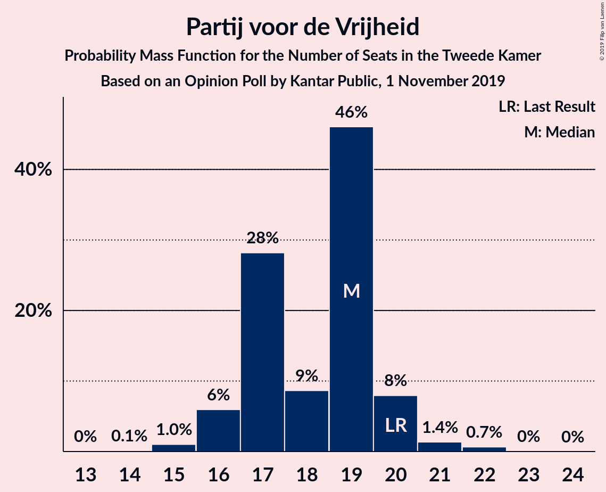
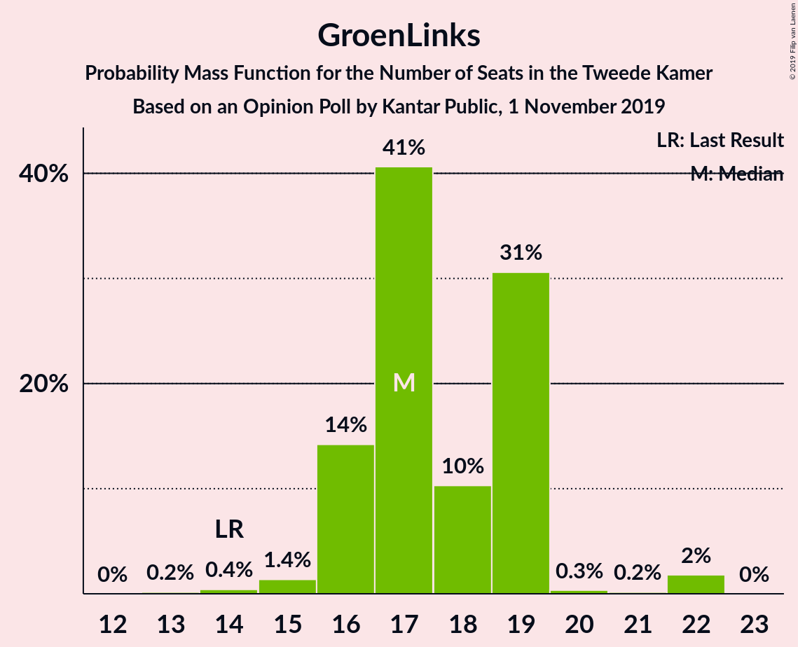
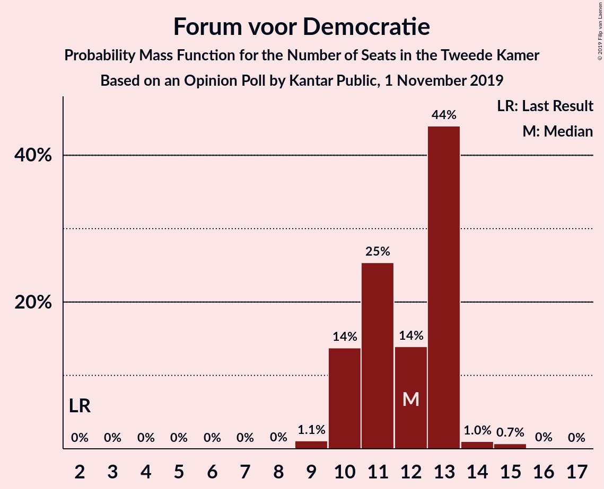
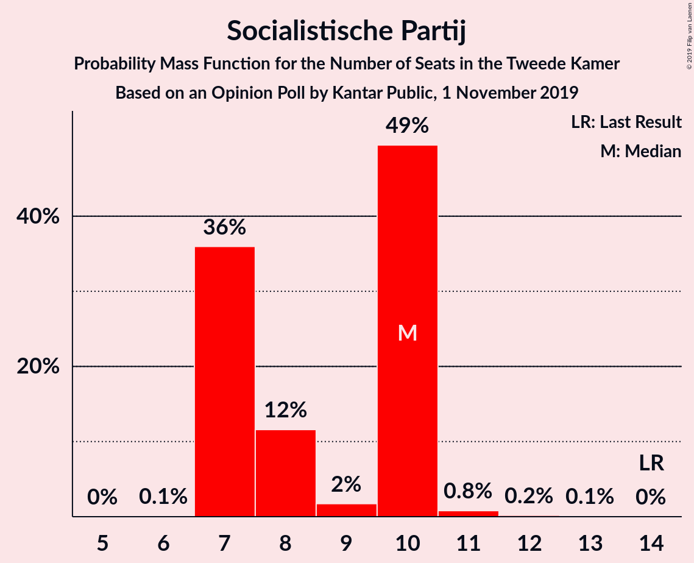
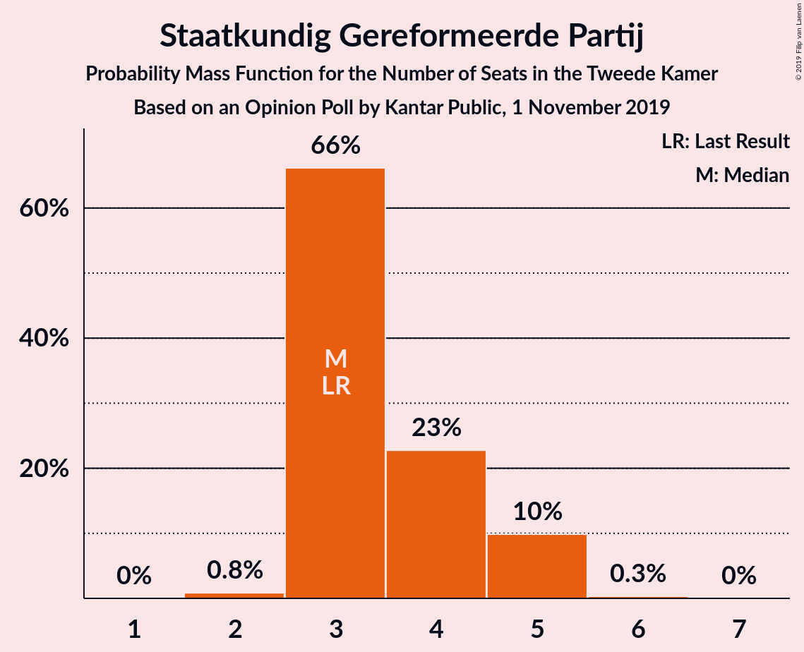
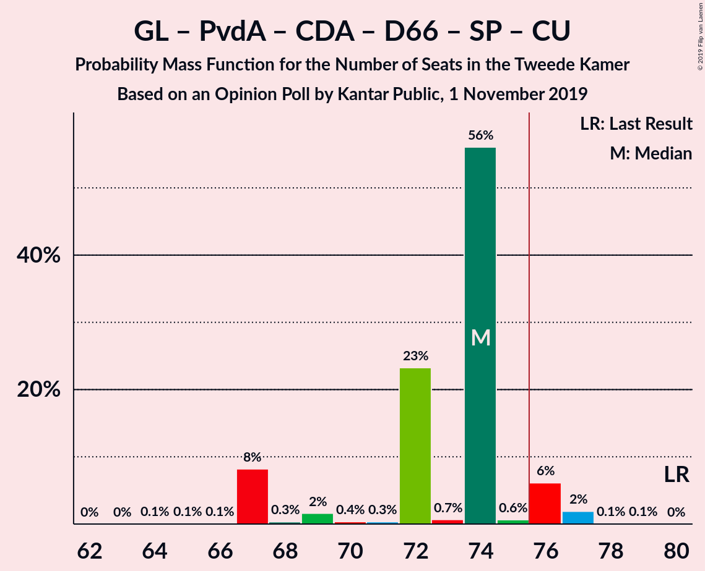
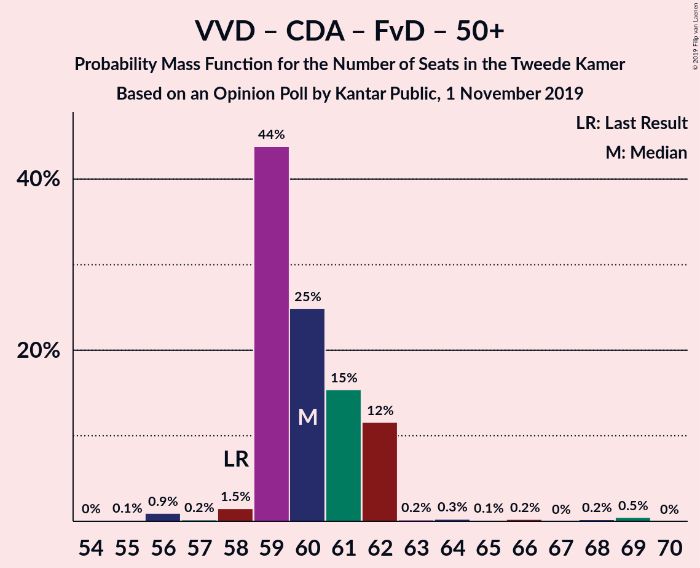
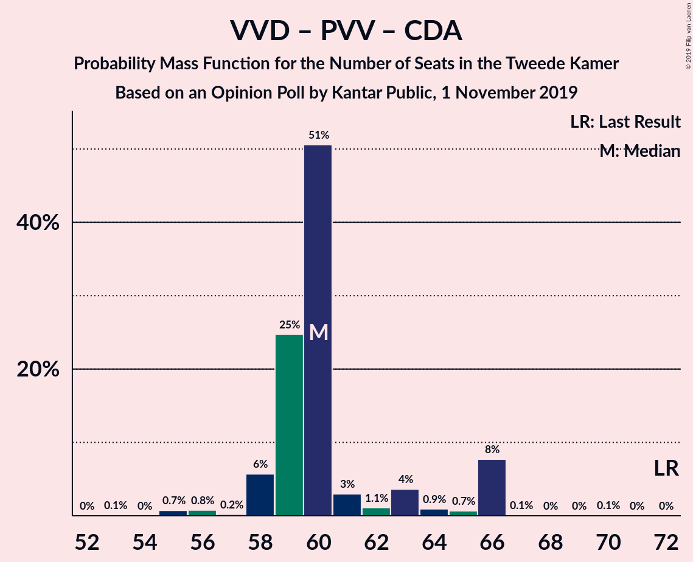
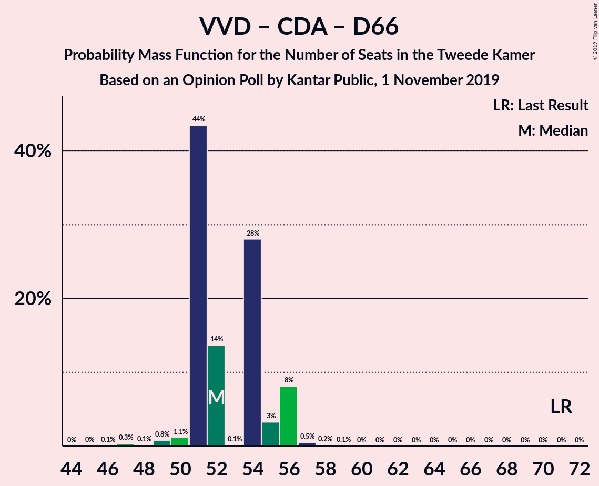

# Opinion Poll by Kantar Public, 1 November 2019

<a href="#voting-intentions">Voting Intentions</a> | <a href="#seats">Seats</a> | <a href="#coalitions">Coalitions</a> | <a href="#technical-information">Technical Information</a>

## Voting Intentions

### Confidence Intervals

| Party | Last Result | Poll Result | 80% Confidence Interval | 90% Confidence Interval | 95% Confidence Interval | 99% Confidence Interval |
|:-----:|:-----------:|:-----------:|:-----------------------:|:-----------------------:|:-----------------------:|:-----------------------:|
| Volkspartij voor Vrijheid en Democratie | 21.3% | 20.0% | 18.4–21.8% |18.0–22.3% |17.6–22.7% |16.9–23.6% |
| Partij voor de Vrijheid | 13.1% | 12.0% | 10.7–13.4% |10.3–13.8% |10.0–14.2% |9.5–14.9% |
| GroenLinks | 9.1% | 11.3% | 10.1–12.8% |9.8–13.2% |9.5–13.5% |8.9–14.2% |
| Partij van de Arbeid | 5.7% | 10.7% | 9.5–12.1% |9.2–12.5% |8.9–12.8% |8.4–13.5% |
| Christen-Democratisch Appèl | 12.4% | 8.0% | 7.0–9.2% |6.7–9.6% |6.4–9.9% |6.0–10.5% |
| Forum voor Democratie | 1.8% | 8.0% | 7.0–9.2% |6.7–9.6% |6.4–9.9% |6.0–10.5% |
| Democraten 66 | 12.2% | 6.7% | 5.8–7.9% |5.5–8.2% |5.3–8.5% |4.9–9.1% |
| Socialistische Partij | 9.1% | 6.0% | 5.1–7.1% |4.8–7.4% |4.6–7.7% |4.3–8.2% |
| ChristenUnie | 3.4% | 5.4% | 4.5–6.4% |4.3–6.7% |4.1–7.0% |3.7–7.5% |
| Partij voor de Dieren | 3.2% | 4.6% | 3.9–5.6% |3.6–5.9% |3.5–6.1% |3.1–6.7% |
| 50Plus | 3.1% | 4.0% | 3.3–4.9% |3.1–5.2% |2.9–5.4% |2.6–5.9% |
| Staatkundig Gereformeerde Partij | 2.1% | 2.6% | 2.1–3.4% |1.9–3.6% |1.8–3.9% |1.5–4.3% |
| DENK | 2.1% | 0.6% | 0.4–1.1% |0.3–1.2% |0.3–1.4% |0.2–1.6% |

*Note:* The poll result column reflects the actual value used in the calculations. Published results may vary slightly, and in addition be rounded to fewer digits.

## Seats

### Confidence Intervals

| Party | Last Result | Median | 80% Confidence Interval | 90% Confidence Interval | 95% Confidence Interval | 99% Confidence Interval |
|:-----:|:-----------:|:------:|:-----------------------:|:-----------------------:|:-----------------------:|:-----------------------:|
| <a href="#volkspartij-voor-vrijheid-en-democratie">Volkspartij voor Vrijheid en Democratie</a> | 33 | 32 | 32 |32–35 |31–35 |29–35 |
| <a href="#partij-voor-de-vrijheid">Partij voor de Vrijheid</a> | 20 | 18 | 18 |17–18 |16–21 |16–22 |
| <a href="#groenlinks">GroenLinks</a> | 14 | 18 | 18 |16–18 |15–18 |15–20 |
| <a href="#partij-van-de-arbeid">Partij van de Arbeid</a> | 9 | 17 | 16–17 |16–17 |15–17 |15–18 |
| <a href="#christen-democratisch-appèl">Christen-Democratisch Appèl</a> | 19 | 10 | 10 |10–12 |10–13 |9–13 |
| <a href="#forum-voor-democratie">Forum voor Democratie</a> | 2 | 13 | 13 |12–13 |11–14 |11–14 |
| <a href="#democraten-66">Democraten 66</a> | 19 | 10 | 10 |8–10 |8–11 |6–13 |
| <a href="#socialistische-partij">Socialistische Partij</a> | 14 | 8 | 8 |8–9 |7–9 |7–11 |
| <a href="#christenunie">ChristenUnie</a> | 5 | 9 | 9 |8–9 |8–10 |6–11 |
| <a href="#partij-voor-de-dieren">Partij voor de Dieren</a> | 5 | 4 | 4 |4–6 |4–8 |4–9 |
| <a href="#50plus">50Plus</a> | 4 | 6 | 6 |6–7 |6–7 |5–7 |
| <a href="#staatkundig-gereformeerde-partij">Staatkundig Gereformeerde Partij</a> | 3 | 5 | 3–5 |3–5 |3–5 |3–5 |
| <a href="#denk">DENK</a> | 3 | 0 | 0 |0–1 |0–1 |0–1 |

### Volkspartij voor Vrijheid en Democratie

*For a full overview of the results for this party, see the [Volkspartij voor Vrijheid en Democratie](party-volkspartijvoorvrijheidendemocratie.html) page.*

| Number of Seats | Probability | Accumulated | Special Marks |
|:---------------:|:-----------:|:-----------:|:-------------:|
| 29 | 2% | 100% |  |
| 30 | 0% | 98% |  |
| 31 | 0.5% | 98% |  |
| 32 | 92% | 97% | Median |
| 33 | 0.1% | 5% | Last Result |
| 34 | 0.1% | 5% |  |
| 35 | 5% | 5% |  |
| 36 | 0.3% | 0.3% |  |
| 37 | 0% | 0% |  |

### Partij voor de Vrijheid

*For a full overview of the results for this party, see the [Partij voor de Vrijheid](party-partijvoordevrijheid.html) page.*

| Number of Seats | Probability | Accumulated | Special Marks |
|:---------------:|:-----------:|:-----------:|:-------------:|
| 12 | 0.1% | 100% |  |
| 13 | 0% | 99.9% |  |
| 14 | 0% | 99.9% |  |
| 15 | 0.4% | 99.9% |  |
| 16 | 4% | 99.5% |  |
| 17 | 2% | 95% |  |
| 18 | 89% | 93% | Median |
| 19 | 0.1% | 4% |  |
| 20 | 0% | 4% | Last Result |
| 21 | 2% | 4% |  |
| 22 | 2% | 2% |  |
| 23 | 0% | 0% |  |

### GroenLinks

*For a full overview of the results for this party, see the [GroenLinks](party-groenlinks.html) page.*

| Number of Seats | Probability | Accumulated | Special Marks |
|:---------------:|:-----------:|:-----------:|:-------------:|
| 13 | 0.1% | 100% |  |
| 14 | 0% | 99.9% | Last Result |
| 15 | 4% | 99.9% |  |
| 16 | 2% | 95% |  |
| 17 | 2% | 93% |  |
| 18 | 90% | 91% | Median |
| 19 | 0% | 2% |  |
| 20 | 2% | 2% |  |
| 21 | 0% | 0% |  |

### Partij van de Arbeid

*For a full overview of the results for this party, see the [Partij van de Arbeid](party-partijvandearbeid.html) page.*

| Number of Seats | Probability | Accumulated | Special Marks |
|:---------------:|:-----------:|:-----------:|:-------------:|
| 9 | 0% | 100% | Last Result |
| 10 | 0% | 100% |  |
| 11 | 0% | 100% |  |
| 12 | 0% | 100% |  |
| 13 | 0% | 100% |  |
| 14 | 0.3% | 100% |  |
| 15 | 2% | 99.7% |  |
| 16 | 8% | 97% |  |
| 17 | 89% | 90% | Median |
| 18 | 0.5% | 0.6% |  |
| 19 | 0% | 0.1% |  |
| 20 | 0% | 0.1% |  |
| 21 | 0% | 0% |  |

### Christen-Democratisch Appèl

*For a full overview of the results for this party, see the [Christen-Democratisch Appèl](party-christen-democratischappèl.html) page.*

| Number of Seats | Probability | Accumulated | Special Marks |
|:---------------:|:-----------:|:-----------:|:-------------:|
| 8 | 0.1% | 100% |  |
| 9 | 2% | 99.9% |  |
| 10 | 90% | 98% | Median |
| 11 | 0.4% | 7% |  |
| 12 | 2% | 7% |  |
| 13 | 4% | 5% |  |
| 14 | 0.1% | 0.5% |  |
| 15 | 0.4% | 0.4% |  |
| 16 | 0% | 0% |  |
| 17 | 0% | 0% |  |
| 18 | 0% | 0% |  |
| 19 | 0% | 0% | Last Result |

### Forum voor Democratie

*For a full overview of the results for this party, see the [Forum voor Democratie](party-forumvoordemocratie.html) page.*

| Number of Seats | Probability | Accumulated | Special Marks |
|:---------------:|:-----------:|:-----------:|:-------------:|
| 2 | 0% | 100% | Last Result |
| 3 | 0% | 100% |  |
| 4 | 0% | 100% |  |
| 5 | 0% | 100% |  |
| 6 | 0% | 100% |  |
| 7 | 0% | 100% |  |
| 8 | 0.2% | 100% |  |
| 9 | 0.1% | 99.8% |  |
| 10 | 0% | 99.8% |  |
| 11 | 4% | 99.7% |  |
| 12 | 3% | 96% |  |
| 13 | 89% | 93% | Median |
| 14 | 4% | 5% |  |
| 15 | 0.1% | 0.1% |  |
| 16 | 0% | 0% |  |

### Democraten 66

*For a full overview of the results for this party, see the [Democraten 66](party-democraten66.html) page.*

| Number of Seats | Probability | Accumulated | Special Marks |
|:---------------:|:-----------:|:-----------:|:-------------:|
| 6 | 2% | 100% |  |
| 7 | 0.4% | 98% |  |
| 8 | 6% | 98% |  |
| 9 | 0.2% | 92% |  |
| 10 | 89% | 92% | Median |
| 11 | 0.2% | 3% |  |
| 12 | 0.4% | 2% |  |
| 13 | 2% | 2% |  |
| 14 | 0% | 0.1% |  |
| 15 | 0% | 0.1% |  |
| 16 | 0% | 0.1% |  |
| 17 | 0.1% | 0.1% |  |
| 18 | 0% | 0% |  |
| 19 | 0% | 0% | Last Result |

### Socialistische Partij

*For a full overview of the results for this party, see the [Socialistische Partij](party-socialistischepartij.html) page.*

| Number of Seats | Probability | Accumulated | Special Marks |
|:---------------:|:-----------:|:-----------:|:-------------:|
| 7 | 3% | 100% |  |
| 8 | 89% | 97% | Median |
| 9 | 6% | 8% |  |
| 10 | 0.1% | 2% |  |
| 11 | 2% | 2% |  |
| 12 | 0% | 0% |  |
| 13 | 0% | 0% |  |
| 14 | 0% | 0% | Last Result |

### ChristenUnie

*For a full overview of the results for this party, see the [ChristenUnie](party-christenunie.html) page.*

| Number of Seats | Probability | Accumulated | Special Marks |
|:---------------:|:-----------:|:-----------:|:-------------:|
| 5 | 0% | 100% | Last Result |
| 6 | 0.5% | 100% |  |
| 7 | 0.2% | 99.5% |  |
| 8 | 6% | 99.2% |  |
| 9 | 89% | 93% | Median |
| 10 | 2% | 4% |  |
| 11 | 2% | 2% |  |
| 12 | 0% | 0% |  |

### Partij voor de Dieren

*For a full overview of the results for this party, see the [Partij voor de Dieren](party-partijvoordedieren.html) page.*

| Number of Seats | Probability | Accumulated | Special Marks |
|:---------------:|:-----------:|:-----------:|:-------------:|
| 4 | 91% | 100% | Median |
| 5 | 0.3% | 9% | Last Result |
| 6 | 5% | 9% |  |
| 7 | 0.5% | 5% |  |
| 8 | 3% | 4% |  |
| 9 | 0.3% | 0.7% |  |
| 10 | 0.4% | 0.4% |  |
| 11 | 0% | 0% |  |

### 50Plus

*For a full overview of the results for this party, see the [50Plus](party-50plus.html) page.*

| Number of Seats | Probability | Accumulated | Special Marks |
|:---------------:|:-----------:|:-----------:|:-------------:|
| 4 | 0% | 100% | Last Result |
| 5 | 2% | 99.9% |  |
| 6 | 92% | 98% | Median |
| 7 | 5% | 5% |  |
| 8 | 0.1% | 0.1% |  |
| 9 | 0% | 0% |  |

### Staatkundig Gereformeerde Partij

*For a full overview of the results for this party, see the [Staatkundig Gereformeerde Partij](party-staatkundiggereformeerdepartij.html) page.*

| Number of Seats | Probability | Accumulated | Special Marks |
|:---------------:|:-----------:|:-----------:|:-------------:|
| 3 | 11% | 100% | Last Result |
| 4 | 0.1% | 89% |  |
| 5 | 89% | 89% | Median |
| 6 | 0% | 0% |  |

### DENK

*For a full overview of the results for this party, see the [DENK](party-denk.html) page.*

| Number of Seats | Probability | Accumulated | Special Marks |
|:---------------:|:-----------:|:-----------:|:-------------:|
| 0 | 94% | 100% | Median |
| 1 | 6% | 6% |  |
| 2 | 0.1% | 0.1% |  |
| 3 | 0% | 0% | Last Result |

## Coalitions

### Confidence Intervals

| Coalition | Last Result | Median | Majority? | 80% Confidence Interval | 90% Confidence Interval | 95% Confidence Interval | 99% Confidence Interval |
|:---------:|:-----------:|:------:|:---------:|:-----------------------:|:-----------------------:|:-----------------------:|:-----------------------:|
| Volkspartij voor Vrijheid en Democratie – Partij voor de Vrijheid – Christen-Democratisch Appèl – Forum voor Democratie – Staatkundig Gereformeerde Partij | 77 | 78 | 98% | 78 | 77–79 | 77–81 | 73–81 |
| Volkspartij voor Vrijheid en Democratie – GroenLinks – Christen-Democratisch Appèl – Democraten 66 – ChristenUnie | 90 | 79 | 98% | 79 | 79 | 79–80 | 72–81 |
| Volkspartij voor Vrijheid en Democratie – Partij van de Arbeid – Christen-Democratisch Appèl – Democraten 66 – ChristenUnie | 85 | 78 | 98% | 78 | 78–79 | 77–80 | 71–80 |
| Volkspartij voor Vrijheid en Democratie – Partij voor de Vrijheid – Christen-Democratisch Appèl – Forum voor Democratie | 74 | 73 | 5% | 73 | 73–74 | 72–78 | 69–78 |
| GroenLinks – Partij van de Arbeid – Christen-Democratisch Appèl – Democraten 66 – Socialistische Partij – ChristenUnie | 80 | 72 | 0.2% | 72 | 69–72 | 69–73 | 67–75 |
| Volkspartij voor Vrijheid en Democratie – Christen-Democratisch Appèl – Forum voor Democratie – 50Plus – Staatkundig Gereformeerde Partij | 61 | 66 | 0% | 66 | 62–67 | 61–72 | 61–72 |
| Volkspartij voor Vrijheid en Democratie – Christen-Democratisch Appèl – Forum voor Democratie – 50Plus | 58 | 61 | 0% | 61 | 59–63 | 58–69 | 58–69 |
| GroenLinks – Partij van de Arbeid – Christen-Democratisch Appèl – Democraten 66 – ChristenUnie | 66 | 64 | 0% | 64 | 60–64 | 60–65 | 56–66 |
| Volkspartij voor Vrijheid en Democratie – Christen-Democratisch Appèl – Forum voor Democratie – Staatkundig Gereformeerde Partij | 57 | 60 | 0% | 60 | 56–62 | 56–65 | 55–65 |
| Volkspartij voor Vrijheid en Democratie – Christen-Democratisch Appèl – Democraten 66 – ChristenUnie | 76 | 61 | 0% | 61 | 61–64 | 61–64 | 55–64 |
| Volkspartij voor Vrijheid en Democratie – Partij voor de Vrijheid – Christen-Democratisch Appèl | 72 | 60 | 0% | 60 | 60–63 | 60–64 | 59–65 |
| Volkspartij voor Vrijheid en Democratie – Partij van de Arbeid – Christen-Democratisch Appèl | 61 | 59 | 0% | 59 | 58–60 | 57–64 | 56–64 |
| Volkspartij voor Vrijheid en Democratie – Christen-Democratisch Appèl – Forum voor Democratie | 54 | 55 | 0% | 55 | 53–57 | 53–62 | 51–62 |
| Volkspartij voor Vrijheid en Democratie – Partij van de Arbeid – Democraten 66 | 61 | 59 | 0% | 59 | 57–59 | 56–59 | 54–61 |
| Volkspartij voor Vrijheid en Democratie – Christen-Democratisch Appèl – Democraten 66 | 71 | 52 | 0% | 52 | 52–55 | 50–56 | 47–57 |
| Volkspartij voor Vrijheid en Democratie – Partij van de Arbeid | 42 | 49 | 0% | 49 | 48–50 | 48–51 | 44–51 |
| Volkspartij voor Vrijheid en Democratie – Christen-Democratisch Appèl | 52 | 42 | 0% | 42 | 42–45 | 41–48 | 40–48 |
| Partij van de Arbeid – Christen-Democratisch Appèl – Democraten 66 | 47 | 37 | 0% | 37 | 37 | 34–39 | 31–40 |
| Partij van de Arbeid – Christen-Democratisch Appèl – ChristenUnie | 33 | 36 | 0% | 36 | 36–37 | 36–37 | 33–37 |
| Partij van de Arbeid – Christen-Democratisch Appèl | 28 | 27 | 0% | 27 | 27–28 | 26–29 | 25–30 |
| Christen-Democratisch Appèl – Democraten 66 | 38 | 20 | 0% | 20 | 20–21 | 18–22 | 15–25 |

### Volkspartij voor Vrijheid en Democratie – Partij voor de Vrijheid – Christen-Democratisch Appèl – Forum voor Democratie – Staatkundig Gereformeerde Partij

| Number of Seats | Probability | Accumulated | Special Marks |
|:---------------:|:-----------:|:-----------:|:-------------:|
| 69 | 0.4% | 100% |  |
| 70 | 0% | 99.6% |  |
| 71 | 0% | 99.6% |  |
| 72 | 0% | 99.6% |  |
| 73 | 2% | 99.6% |  |
| 74 | 0.3% | 98% |  |
| 75 | 0% | 98% |  |
| 76 | 0% | 98% | Majority |
| 77 | 4% | 98% | Last Result |
| 78 | 89% | 94% | Median |
| 79 | 0.3% | 5% |  |
| 80 | 0% | 5% |  |
| 81 | 4% | 5% |  |
| 82 | 0.5% | 0.5% |  |
| 83 | 0% | 0% |  |

### Volkspartij voor Vrijheid en Democratie – GroenLinks – Christen-Democratisch Appèl – Democraten 66 – ChristenUnie

| Number of Seats | Probability | Accumulated | Special Marks |
|:---------------:|:-----------:|:-----------:|:-------------:|
| 72 | 2% | 100% |  |
| 73 | 0.1% | 98% |  |
| 74 | 0% | 98% |  |
| 75 | 0.1% | 98% |  |
| 76 | 0.1% | 98% | Majority |
| 77 | 0.1% | 98% |  |
| 78 | 0% | 98% |  |
| 79 | 93% | 98% | Median |
| 80 | 2% | 5% |  |
| 81 | 2% | 2% |  |
| 82 | 0.1% | 0.1% |  |
| 83 | 0% | 0% |  |
| 84 | 0% | 0% |  |
| 85 | 0% | 0% |  |
| 86 | 0% | 0% |  |
| 87 | 0% | 0% |  |
| 88 | 0% | 0% |  |
| 89 | 0% | 0% |  |
| 90 | 0% | 0% | Last Result |

### Volkspartij voor Vrijheid en Democratie – Partij van de Arbeid – Christen-Democratisch Appèl – Democraten 66 – ChristenUnie

| Number of Seats | Probability | Accumulated | Special Marks |
|:---------------:|:-----------:|:-----------:|:-------------:|
| 71 | 2% | 100% |  |
| 72 | 0% | 98% |  |
| 73 | 0% | 98% |  |
| 74 | 0% | 98% |  |
| 75 | 0.1% | 98% |  |
| 76 | 0.1% | 98% | Majority |
| 77 | 2% | 98% |  |
| 78 | 89% | 96% | Median |
| 79 | 2% | 7% |  |
| 80 | 4% | 5% |  |
| 81 | 0.1% | 0.2% |  |
| 82 | 0.1% | 0.1% |  |
| 83 | 0% | 0% |  |
| 84 | 0% | 0% |  |
| 85 | 0% | 0% | Last Result |

### Volkspartij voor Vrijheid en Democratie – Partij voor de Vrijheid – Christen-Democratisch Appèl – Forum voor Democratie

| Number of Seats | Probability | Accumulated | Special Marks |
|:---------------:|:-----------:|:-----------:|:-------------:|
| 66 | 0.4% | 100% |  |
| 67 | 0% | 99.6% |  |
| 68 | 0% | 99.6% |  |
| 69 | 0.2% | 99.6% |  |
| 70 | 2% | 99.4% |  |
| 71 | 0.1% | 98% |  |
| 72 | 0.1% | 98% |  |
| 73 | 89% | 97% | Median |
| 74 | 4% | 9% | Last Result |
| 75 | 0.1% | 5% |  |
| 76 | 0% | 5% | Majority |
| 77 | 0% | 5% |  |
| 78 | 4% | 5% |  |
| 79 | 0.5% | 0.5% |  |
| 80 | 0% | 0% |  |

### GroenLinks – Partij van de Arbeid – Christen-Democratisch Appèl – Democraten 66 – Socialistische Partij – ChristenUnie

| Number of Seats | Probability | Accumulated | Special Marks |
|:---------------:|:-----------:|:-----------:|:-------------:|
| 66 | 0.3% | 100% |  |
| 67 | 2% | 99.7% |  |
| 68 | 0.5% | 98% |  |
| 69 | 4% | 98% |  |
| 70 | 0.1% | 93% |  |
| 71 | 0% | 93% |  |
| 72 | 90% | 93% | Median |
| 73 | 0.4% | 3% |  |
| 74 | 0.1% | 2% |  |
| 75 | 2% | 2% |  |
| 76 | 0.2% | 0.2% | Majority |
| 77 | 0% | 0% |  |
| 78 | 0% | 0% |  |
| 79 | 0% | 0% |  |
| 80 | 0% | 0% | Last Result |

### Volkspartij voor Vrijheid en Democratie – Christen-Democratisch Appèl – Forum voor Democratie – 50Plus – Staatkundig Gereformeerde Partij

| Number of Seats | Probability | Accumulated | Special Marks |
|:---------------:|:-----------:|:-----------:|:-------------:|
| 59 | 0% | 100% |  |
| 60 | 0% | 99.9% |  |
| 61 | 4% | 99.9% | Last Result |
| 62 | 2% | 96% |  |
| 63 | 0% | 94% |  |
| 64 | 0.1% | 94% |  |
| 65 | 0% | 94% |  |
| 66 | 89% | 94% | Median |
| 67 | 0.3% | 5% |  |
| 68 | 0.1% | 5% |  |
| 69 | 0% | 5% |  |
| 70 | 0.1% | 5% |  |
| 71 | 0% | 5% |  |
| 72 | 5% | 5% |  |
| 73 | 0% | 0% |  |

### Volkspartij voor Vrijheid en Democratie – Christen-Democratisch Appèl – Forum voor Democratie – 50Plus

| Number of Seats | Probability | Accumulated | Special Marks |
|:---------------:|:-----------:|:-----------:|:-------------:|
| 56 | 0.2% | 100% |  |
| 57 | 0% | 99.8% |  |
| 58 | 4% | 99.8% | Last Result |
| 59 | 2% | 96% |  |
| 60 | 0.1% | 94% |  |
| 61 | 89% | 94% | Median |
| 62 | 0.3% | 5% |  |
| 63 | 0.1% | 5% |  |
| 64 | 0% | 5% |  |
| 65 | 0.2% | 5% |  |
| 66 | 0% | 5% |  |
| 67 | 0% | 5% |  |
| 68 | 0% | 5% |  |
| 69 | 5% | 5% |  |
| 70 | 0% | 0% |  |

### GroenLinks – Partij van de Arbeid – Christen-Democratisch Appèl – Democraten 66 – ChristenUnie

| Number of Seats | Probability | Accumulated | Special Marks |
|:---------------:|:-----------:|:-----------:|:-------------:|
| 56 | 2% | 100% |  |
| 57 | 0.1% | 98% |  |
| 58 | 0.3% | 98% |  |
| 59 | 0% | 98% |  |
| 60 | 4% | 98% |  |
| 61 | 0.5% | 94% |  |
| 62 | 0% | 93% |  |
| 63 | 0.1% | 93% |  |
| 64 | 89% | 93% | Median |
| 65 | 2% | 4% |  |
| 66 | 2% | 2% | Last Result |
| 67 | 0% | 0.1% |  |
| 68 | 0% | 0% |  |

### Volkspartij voor Vrijheid en Democratie – Christen-Democratisch Appèl – Forum voor Democratie – Staatkundig Gereformeerde Partij

| Number of Seats | Probability | Accumulated | Special Marks |
|:---------------:|:-----------:|:-----------:|:-------------:|
| 54 | 0.4% | 100% |  |
| 55 | 2% | 99.6% |  |
| 56 | 4% | 98% |  |
| 57 | 0.1% | 94% | Last Result |
| 58 | 0% | 94% |  |
| 59 | 0% | 94% |  |
| 60 | 89% | 94% | Median |
| 61 | 0% | 5% |  |
| 62 | 0.3% | 5% |  |
| 63 | 0.1% | 5% |  |
| 64 | 0% | 5% |  |
| 65 | 5% | 5% |  |
| 66 | 0% | 0% |  |

### Volkspartij voor Vrijheid en Democratie – Christen-Democratisch Appèl – Democraten 66 – ChristenUnie

| Number of Seats | Probability | Accumulated | Special Marks |
|:---------------:|:-----------:|:-----------:|:-------------:|
| 55 | 2% | 100% |  |
| 56 | 0% | 98% |  |
| 57 | 0.1% | 98% |  |
| 58 | 0% | 98% |  |
| 59 | 0% | 98% |  |
| 60 | 0.2% | 98% |  |
| 61 | 91% | 98% | Median |
| 62 | 0.2% | 7% |  |
| 63 | 0.4% | 7% |  |
| 64 | 7% | 7% |  |
| 65 | 0.1% | 0.1% |  |
| 66 | 0% | 0% |  |
| 67 | 0% | 0% |  |
| 68 | 0% | 0% |  |
| 69 | 0% | 0% |  |
| 70 | 0% | 0% |  |
| 71 | 0% | 0% |  |
| 72 | 0% | 0% |  |
| 73 | 0% | 0% |  |
| 74 | 0% | 0% |  |
| 75 | 0% | 0% |  |
| 76 | 0% | 0% | Last Result, Majority |

### Volkspartij voor Vrijheid en Democratie – Partij voor de Vrijheid – Christen-Democratisch Appèl

| Number of Seats | Probability | Accumulated | Special Marks |
|:---------------:|:-----------:|:-----------:|:-------------:|
| 55 | 0.4% | 100% |  |
| 56 | 0% | 99.6% |  |
| 57 | 0% | 99.6% |  |
| 58 | 0% | 99.6% |  |
| 59 | 2% | 99.6% |  |
| 60 | 89% | 98% | Median |
| 61 | 0.2% | 9% |  |
| 62 | 2% | 9% |  |
| 63 | 2% | 7% |  |
| 64 | 4% | 5% |  |
| 65 | 0% | 0.5% |  |
| 66 | 0.1% | 0.5% |  |
| 67 | 0.4% | 0.4% |  |
| 68 | 0% | 0% |  |
| 69 | 0% | 0% |  |
| 70 | 0% | 0% |  |
| 71 | 0% | 0% |  |
| 72 | 0% | 0% | Last Result |

### Volkspartij voor Vrijheid en Democratie – Partij van de Arbeid – Christen-Democratisch Appèl

| Number of Seats | Probability | Accumulated | Special Marks |
|:---------------:|:-----------:|:-----------:|:-------------:|
| 56 | 2% | 100% |  |
| 57 | 2% | 98% |  |
| 58 | 2% | 96% |  |
| 59 | 89% | 94% | Median |
| 60 | 0.3% | 5% |  |
| 61 | 0% | 5% | Last Result |
| 62 | 0% | 5% |  |
| 63 | 0% | 5% |  |
| 64 | 4% | 5% |  |
| 65 | 0.4% | 0.4% |  |
| 66 | 0% | 0% |  |

### Volkspartij voor Vrijheid en Democratie – Christen-Democratisch Appèl – Forum voor Democratie

| Number of Seats | Probability | Accumulated | Special Marks |
|:---------------:|:-----------:|:-----------:|:-------------:|
| 51 | 0.5% | 100% |  |
| 52 | 2% | 99.4% |  |
| 53 | 4% | 98% |  |
| 54 | 0% | 94% | Last Result |
| 55 | 89% | 94% | Median |
| 56 | 0% | 5% |  |
| 57 | 0.4% | 5% |  |
| 58 | 0% | 5% |  |
| 59 | 0% | 5% |  |
| 60 | 0.1% | 5% |  |
| 61 | 0% | 5% |  |
| 62 | 5% | 5% |  |
| 63 | 0% | 0% |  |

### Volkspartij voor Vrijheid en Democratie – Partij van de Arbeid – Democraten 66

| Number of Seats | Probability | Accumulated | Special Marks |
|:---------------:|:-----------:|:-----------:|:-------------:|
| 54 | 2% | 100% |  |
| 55 | 0.1% | 98% |  |
| 56 | 2% | 98% |  |
| 57 | 2% | 97% |  |
| 58 | 0% | 94% |  |
| 59 | 93% | 94% | Median |
| 60 | 0.4% | 1.1% |  |
| 61 | 0.4% | 0.7% | Last Result |
| 62 | 0.1% | 0.3% |  |
| 63 | 0.2% | 0.2% |  |
| 64 | 0% | 0% |  |

### Volkspartij voor Vrijheid en Democratie – Christen-Democratisch Appèl – Democraten 66

| Number of Seats | Probability | Accumulated | Special Marks |
|:---------------:|:-----------:|:-----------:|:-------------:|
| 47 | 2% | 100% |  |
| 48 | 0% | 98% |  |
| 49 | 0% | 98% |  |
| 50 | 2% | 98% |  |
| 51 | 0.1% | 97% |  |
| 52 | 89% | 96% | Median |
| 53 | 0.1% | 7% |  |
| 54 | 2% | 7% |  |
| 55 | 0.3% | 5% |  |
| 56 | 4% | 5% |  |
| 57 | 0.6% | 0.6% |  |
| 58 | 0% | 0% |  |
| 59 | 0% | 0% |  |
| 60 | 0% | 0% |  |
| 61 | 0% | 0% |  |
| 62 | 0% | 0% |  |
| 63 | 0% | 0% |  |
| 64 | 0% | 0% |  |
| 65 | 0% | 0% |  |
| 66 | 0% | 0% |  |
| 67 | 0% | 0% |  |
| 68 | 0% | 0% |  |
| 69 | 0% | 0% |  |
| 70 | 0% | 0% |  |
| 71 | 0% | 0% | Last Result |

### Volkspartij voor Vrijheid en Democratie – Partij van de Arbeid

| Number of Seats | Probability | Accumulated | Special Marks |
|:---------------:|:-----------:|:-----------:|:-------------:|
| 42 | 0% | 100% | Last Result |
| 43 | 0% | 100% |  |
| 44 | 2% | 100% |  |
| 45 | 0% | 98% |  |
| 46 | 0.1% | 98% |  |
| 47 | 0.1% | 98% |  |
| 48 | 3% | 98% |  |
| 49 | 89% | 95% | Median |
| 50 | 0.7% | 5% |  |
| 51 | 4% | 5% |  |
| 52 | 0.1% | 0.2% |  |
| 53 | 0.1% | 0.1% |  |
| 54 | 0% | 0% |  |

### Volkspartij voor Vrijheid en Democratie – Christen-Democratisch Appèl

| Number of Seats | Probability | Accumulated | Special Marks |
|:---------------:|:-----------:|:-----------:|:-------------:|
| 40 | 0.5% | 100% |  |
| 41 | 3% | 99.5% |  |
| 42 | 91% | 96% | Median |
| 43 | 0.2% | 5% |  |
| 44 | 0.1% | 5% |  |
| 45 | 0.3% | 5% |  |
| 46 | 0% | 5% |  |
| 47 | 0.1% | 5% |  |
| 48 | 4% | 5% |  |
| 49 | 0% | 0.4% |  |
| 50 | 0.4% | 0.4% |  |
| 51 | 0% | 0% |  |
| 52 | 0% | 0% | Last Result |

### Partij van de Arbeid – Christen-Democratisch Appèl – Democraten 66

| Number of Seats | Probability | Accumulated | Special Marks |
|:---------------:|:-----------:|:-----------:|:-------------:|
| 31 | 2% | 100% |  |
| 32 | 0% | 98% |  |
| 33 | 0.2% | 98% |  |
| 34 | 2% | 98% |  |
| 35 | 0.1% | 96% |  |
| 36 | 0.1% | 96% |  |
| 37 | 94% | 96% | Median |
| 38 | 0.1% | 3% |  |
| 39 | 0.6% | 3% |  |
| 40 | 2% | 2% |  |
| 41 | 0% | 0.2% |  |
| 42 | 0% | 0.2% |  |
| 43 | 0% | 0.2% |  |
| 44 | 0% | 0.1% |  |
| 45 | 0.1% | 0.1% |  |
| 46 | 0% | 0% |  |
| 47 | 0% | 0% | Last Result |

### Partij van de Arbeid – Christen-Democratisch Appèl – ChristenUnie

| Number of Seats | Probability | Accumulated | Special Marks |
|:---------------:|:-----------:|:-----------:|:-------------:|
| 32 | 0.3% | 100% |  |
| 33 | 2% | 99.7% | Last Result |
| 34 | 0% | 98% |  |
| 35 | 0.1% | 98% |  |
| 36 | 90% | 98% | Median |
| 37 | 8% | 8% |  |
| 38 | 0% | 0.1% |  |
| 39 | 0% | 0.1% |  |
| 40 | 0% | 0.1% |  |
| 41 | 0% | 0% |  |

### Partij van de Arbeid – Christen-Democratisch Appèl

| Number of Seats | Probability | Accumulated | Special Marks |
|:---------------:|:-----------:|:-----------:|:-------------:|
| 23 | 0.2% | 100% |  |
| 24 | 0% | 99.8% |  |
| 25 | 2% | 99.8% |  |
| 26 | 2% | 98% |  |
| 27 | 91% | 96% | Median |
| 28 | 0.4% | 5% | Last Result |
| 29 | 4% | 5% |  |
| 30 | 0.4% | 0.5% |  |
| 31 | 0% | 0.1% |  |
| 32 | 0% | 0.1% |  |
| 33 | 0% | 0.1% |  |
| 34 | 0% | 0.1% |  |
| 35 | 0% | 0% |  |

### Christen-Democratisch Appèl – Democraten 66

| Number of Seats | Probability | Accumulated | Special Marks |
|:---------------:|:-----------:|:-----------:|:-------------:|
| 15 | 2% | 100% |  |
| 16 | 0% | 98% |  |
| 17 | 0.1% | 98% |  |
| 18 | 2% | 98% |  |
| 19 | 0.3% | 97% |  |
| 20 | 89% | 96% | Median |
| 21 | 5% | 8% |  |
| 22 | 0.7% | 3% |  |
| 23 | 0% | 2% |  |
| 24 | 0% | 2% |  |
| 25 | 2% | 2% |  |
| 26 | 0% | 0.1% |  |
| 27 | 0% | 0.1% |  |
| 28 | 0.1% | 0.1% |  |
| 29 | 0% | 0% |  |
| 30 | 0% | 0% |  |
| 31 | 0% | 0% |  |
| 32 | 0% | 0% |  |
| 33 | 0% | 0% |  |
| 34 | 0% | 0% |  |
| 35 | 0% | 0% |  |
| 36 | 0% | 0% |  |
| 37 | 0% | 0% |  |
| 38 | 0% | 0% | Last Result |

## Technical Information

### Opinion Poll

+ **Polling firm:** Kantar Public
+ **Commissioner(s):** —
+ **Fieldwork period:** 1 November 2019

### Calculations

+ **Sample size:** 953
+ **Simulations done:** 65,536
+ **Error estimate:** 2.50%

