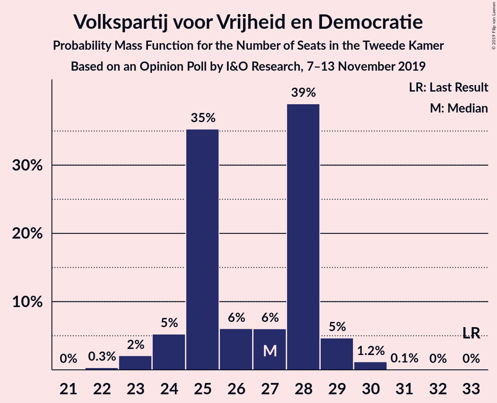
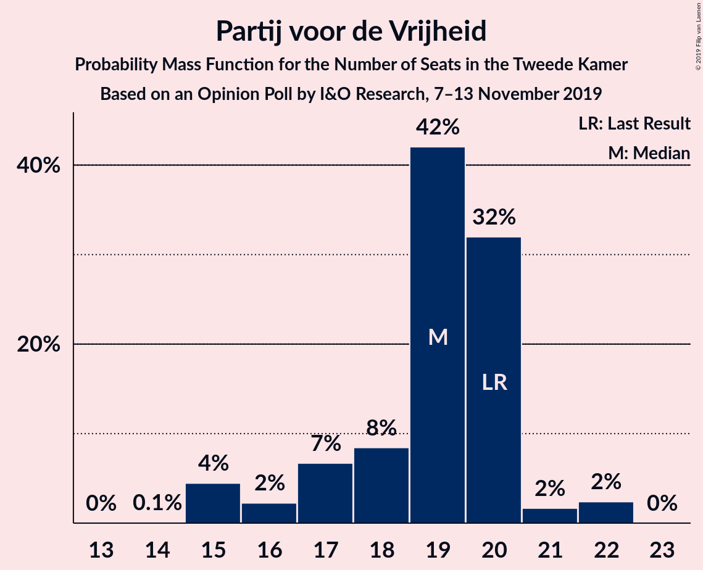
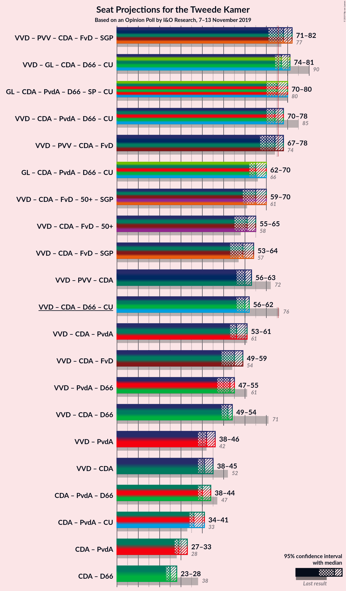
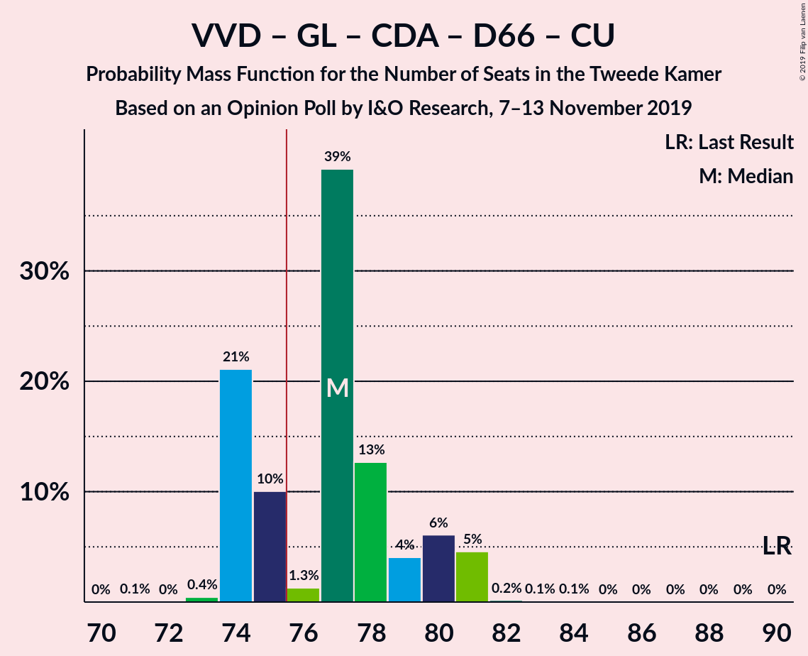
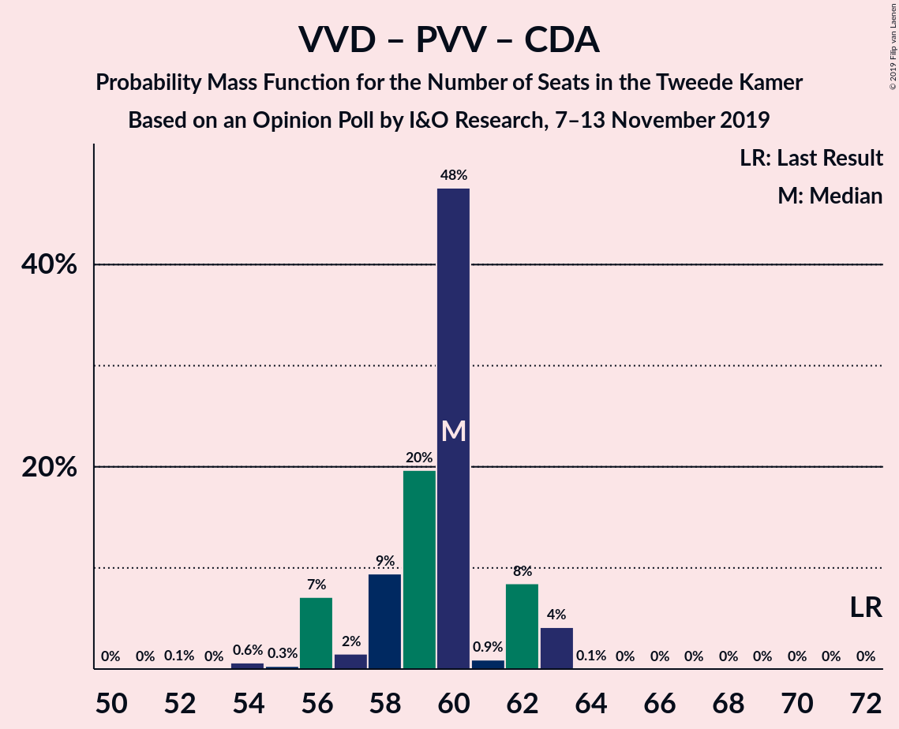
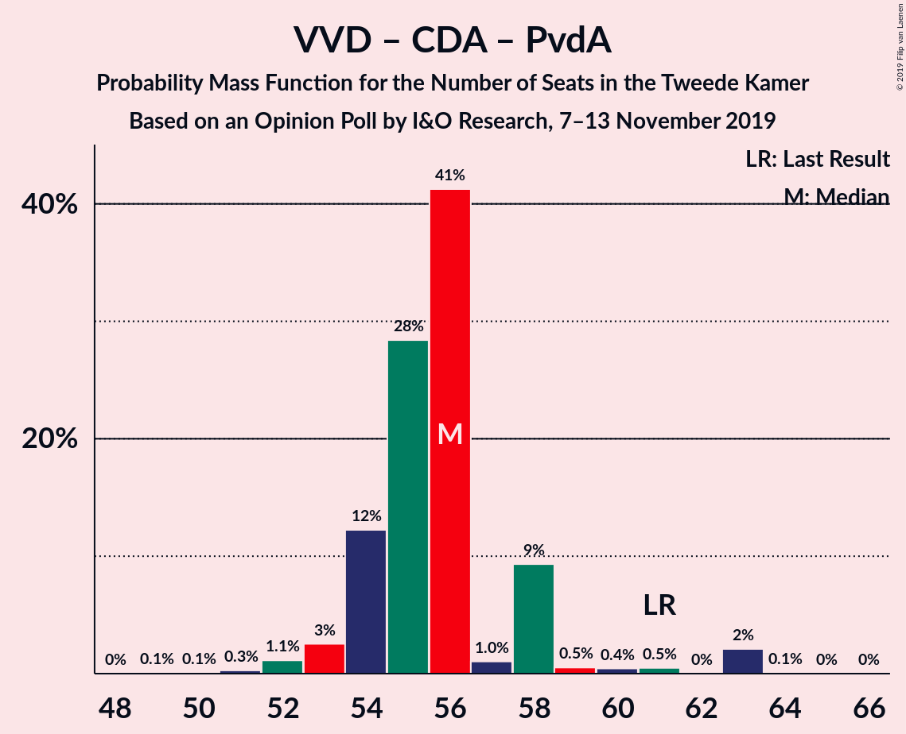
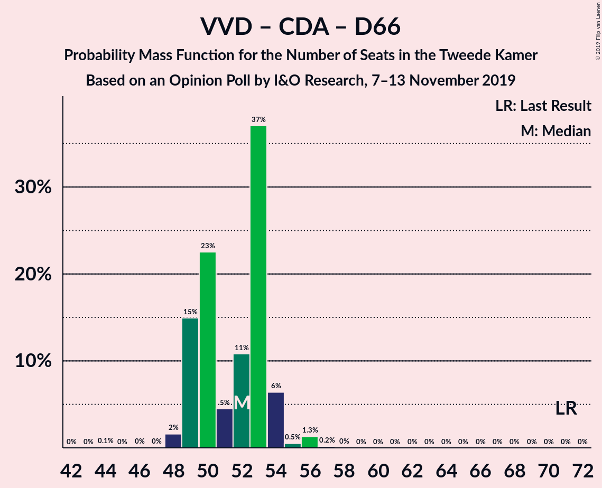
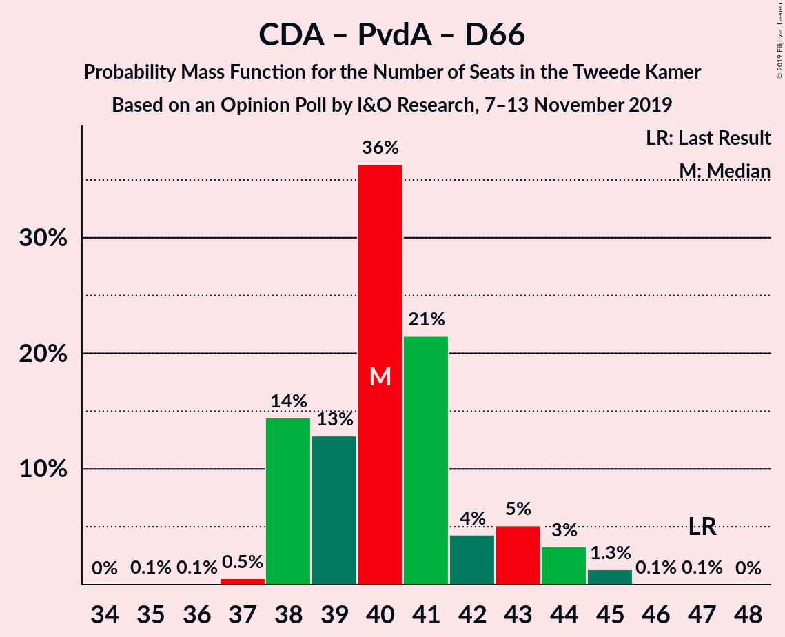

# Opinion Poll by I&O Research, 7–13 November 2019

<a href="#voting-intentions">Voting Intentions</a> | <a href="#seats">Seats</a> | <a href="#coalitions">Coalitions</a> | <a href="#technical-information">Technical Information</a>

## Voting Intentions

### Confidence Intervals

| Party | Last Result | Poll Result | 80% Confidence Interval | 90% Confidence Interval | 95% Confidence Interval | 99% Confidence Interval |
|:-----:|:-----------:|:-----------:|:-----------------------:|:-----------------------:|:-----------------------:|:-----------------------:|
| Volkspartij voor Vrijheid en Democratie | 21.3% | 17.0% | 15.8–18.4% |15.4–18.8% |15.1–19.1% |14.5–19.8% |
| GroenLinks | 9.1% | 12.1% | 11.0–13.3% |10.7–13.7% |10.5–14.0% |10.0–14.6% |
| Partij voor de Vrijheid | 13.1% | 11.9% | 10.8–13.1% |10.5–13.4% |10.2–13.7% |9.8–14.3% |
| Christen-Democratisch Appèl | 12.4% | 9.9% | 8.9–11.1% |8.7–11.4% |8.4–11.7% |8.0–12.2% |
| Partij van de Arbeid | 5.7% | 9.9% | 8.9–11.1% |8.7–11.4% |8.4–11.7% |8.0–12.2% |
| Forum voor Democratie | 1.8% | 9.2% | 8.2–10.3% |8.0–10.6% |7.7–10.9% |7.3–11.4% |
| Democraten 66 | 12.2% | 7.1% | 6.3–8.1% |6.0–8.4% |5.8–8.6% |5.5–9.1% |
| Socialistische Partij | 9.1% | 6.4% | 5.6–7.4% |5.4–7.6% |5.2–7.9% |4.9–8.4% |
| ChristenUnie | 3.4% | 4.9% | 4.2–5.8% |4.1–6.0% |3.9–6.2% |3.6–6.7% |
| 50Plus | 3.1% | 4.0% | 3.4–4.8% |3.2–5.0% |3.1–5.2% |2.8–5.6% |
| Partij voor de Dieren | 3.2% | 3.4% | 2.9–4.2% |2.7–4.4% |2.6–4.6% |2.3–4.9% |
| Staatkundig Gereformeerde Partij | 2.1% | 2.9% | 2.4–3.6% |2.3–3.8% |2.1–4.0% |1.9–4.3% |
| DENK | 2.1% | 0.9% | 0.6–1.3% |0.6–1.4% |0.5–1.6% |0.4–1.8% |

*Note:* The poll result column reflects the actual value used in the calculations. Published results may vary slightly, and in addition be rounded to fewer digits.

## Seats

### Confidence Intervals

| Party | Last Result | Median | 80% Confidence Interval | 90% Confidence Interval | 95% Confidence Interval | 99% Confidence Interval |
|:-----:|:-----------:|:------:|:-----------------------:|:-----------------------:|:-----------------------:|:-----------------------:|
| <a href="#volkspartij-voor-vrijheid-en-democratie">Volkspartij voor Vrijheid en Democratie</a> | 33 | 27 | 24–28 |23–30 |23–30 |23–31 |
| <a href="#groenlinks">GroenLinks</a> | 14 | 18 | 15–22 |15–22 |15–22 |15–22 |
| <a href="#partij-voor-de-vrijheid">Partij voor de Vrijheid</a> | 20 | 19 | 16–21 |16–21 |16–21 |15–21 |
| <a href="#christen-democratisch-appèl">Christen-Democratisch Appèl</a> | 19 | 15 | 13–16 |13–16 |13–16 |13–18 |
| <a href="#partij-van-de-arbeid">Partij van de Arbeid</a> | 9 | 15 | 13–17 |13–17 |13–17 |12–18 |
| <a href="#forum-voor-democratie">Forum voor Democratie</a> | 2 | 14 | 12–15 |12–15 |12–16 |11–17 |
| <a href="#democraten-66">Democraten 66</a> | 19 | 11 | 10–13 |9–13 |9–13 |8–14 |
| <a href="#socialistische-partij">Socialistische Partij</a> | 14 | 10 | 8–11 |8–11 |8–11 |8–12 |
| <a href="#christenunie">ChristenUnie</a> | 5 | 7 | 6–9 |6–9 |5–9 |5–10 |
| <a href="#50plus">50Plus</a> | 4 | 5 | 5–8 |4–8 |4–8 |4–8 |
| <a href="#partij-voor-de-dieren">Partij voor de Dieren</a> | 5 | 5 | 4–6 |4–6 |3–6 |3–7 |
| <a href="#staatkundig-gereformeerde-partij">Staatkundig Gereformeerde Partij</a> | 3 | 4 | 4–5 |4–5 |3–5 |3–6 |
| <a href="#denk">DENK</a> | 3 | 1 | 0–2 |0–2 |0–2 |0–3 |

### Volkspartij voor Vrijheid en Democratie

*For a full overview of the results for this party, see the [Volkspartij voor Vrijheid en Democratie](party-volkspartijvoorvrijheidendemocratie.html) page.*

| Number of Seats | Probability | Accumulated | Special Marks |
|:---------------:|:-----------:|:-----------:|:-------------:|
| 21 | 0.1% | 100% |  |
| 22 | 0.3% | 99.9% |  |
| 23 | 8% | 99.6% |  |
| 24 | 16% | 92% |  |
| 25 | 15% | 76% |  |
| 26 | 6% | 60% |  |
| 27 | 25% | 54% | Median |
| 28 | 21% | 29% |  |
| 29 | 0.8% | 8% |  |
| 30 | 7% | 7% |  |
| 31 | 0.6% | 0.6% |  |
| 32 | 0% | 0% |  |
| 33 | 0% | 0% | Last Result |

### GroenLinks

*For a full overview of the results for this party, see the [GroenLinks](party-groenlinks.html) page.*

| Number of Seats | Probability | Accumulated | Special Marks |
|:---------------:|:-----------:|:-----------:|:-------------:|
| 14 | 0.1% | 100% | Last Result |
| 15 | 37% | 99.9% |  |
| 16 | 2% | 63% |  |
| 17 | 5% | 61% |  |
| 18 | 21% | 56% | Median |
| 19 | 14% | 35% |  |
| 20 | 2% | 21% |  |
| 21 | 3% | 19% |  |
| 22 | 16% | 16% |  |
| 23 | 0.1% | 0.1% |  |
| 24 | 0.1% | 0.1% |  |
| 25 | 0% | 0% |  |

### Partij voor de Vrijheid

*For a full overview of the results for this party, see the [Partij voor de Vrijheid](party-partijvoordevrijheid.html) page.*

| Number of Seats | Probability | Accumulated | Special Marks |
|:---------------:|:-----------:|:-----------:|:-------------:|
| 14 | 0.1% | 100% |  |
| 15 | 2% | 99.8% |  |
| 16 | 8% | 98% |  |
| 17 | 19% | 89% |  |
| 18 | 3% | 71% |  |
| 19 | 56% | 68% | Median |
| 20 | 1.3% | 12% | Last Result |
| 21 | 10% | 10% |  |
| 22 | 0% | 0.1% |  |
| 23 | 0% | 0% |  |

### Christen-Democratisch Appèl

*For a full overview of the results for this party, see the [Christen-Democratisch Appèl](party-christen-democratischappèl.html) page.*

| Number of Seats | Probability | Accumulated | Special Marks |
|:---------------:|:-----------:|:-----------:|:-------------:|
| 12 | 0.4% | 100% |  |
| 13 | 11% | 99.6% |  |
| 14 | 38% | 89% |  |
| 15 | 30% | 51% | Median |
| 16 | 19% | 21% |  |
| 17 | 0.9% | 2% |  |
| 18 | 0.6% | 0.9% |  |
| 19 | 0% | 0.3% | Last Result |
| 20 | 0.2% | 0.2% |  |
| 21 | 0% | 0% |  |

### Partij van de Arbeid

*For a full overview of the results for this party, see the [Partij van de Arbeid](party-partijvandearbeid.html) page.*

| Number of Seats | Probability | Accumulated | Special Marks |
|:---------------:|:-----------:|:-----------:|:-------------:|
| 9 | 0% | 100% | Last Result |
| 10 | 0% | 100% |  |
| 11 | 0.1% | 100% |  |
| 12 | 0.9% | 99.9% |  |
| 13 | 21% | 99.0% |  |
| 14 | 26% | 78% |  |
| 15 | 10% | 52% | Median |
| 16 | 27% | 42% |  |
| 17 | 14% | 15% |  |
| 18 | 0.2% | 0.7% |  |
| 19 | 0.1% | 0.5% |  |
| 20 | 0.4% | 0.4% |  |
| 21 | 0% | 0% |  |

### Forum voor Democratie

*For a full overview of the results for this party, see the [Forum voor Democratie](party-forumvoordemocratie.html) page.*

| Number of Seats | Probability | Accumulated | Special Marks |
|:---------------:|:-----------:|:-----------:|:-------------:|
| 2 | 0% | 100% | Last Result |
| 3 | 0% | 100% |  |
| 4 | 0% | 100% |  |
| 5 | 0% | 100% |  |
| 6 | 0% | 100% |  |
| 7 | 0% | 100% |  |
| 8 | 0% | 100% |  |
| 9 | 0% | 100% |  |
| 10 | 0.1% | 100% |  |
| 11 | 0.9% | 99.9% |  |
| 12 | 21% | 99.0% |  |
| 13 | 20% | 78% |  |
| 14 | 17% | 58% | Median |
| 15 | 37% | 41% |  |
| 16 | 4% | 4% |  |
| 17 | 0.4% | 0.7% |  |
| 18 | 0% | 0.3% |  |
| 19 | 0.2% | 0.2% |  |
| 20 | 0% | 0% |  |

### Democraten 66

*For a full overview of the results for this party, see the [Democraten 66](party-democraten66.html) page.*

| Number of Seats | Probability | Accumulated | Special Marks |
|:---------------:|:-----------:|:-----------:|:-------------:|
| 8 | 1.0% | 100% |  |
| 9 | 5% | 99.0% |  |
| 10 | 18% | 94% |  |
| 11 | 49% | 77% | Median |
| 12 | 1.4% | 27% |  |
| 13 | 25% | 26% |  |
| 14 | 0.7% | 0.7% |  |
| 15 | 0% | 0% |  |
| 16 | 0% | 0% |  |
| 17 | 0% | 0% |  |
| 18 | 0% | 0% |  |
| 19 | 0% | 0% | Last Result |

### Socialistische Partij

*For a full overview of the results for this party, see the [Socialistische Partij](party-socialistischepartij.html) page.*

| Number of Seats | Probability | Accumulated | Special Marks |
|:---------------:|:-----------:|:-----------:|:-------------:|
| 7 | 0.5% | 100% |  |
| 8 | 26% | 99.5% |  |
| 9 | 16% | 73% |  |
| 10 | 29% | 58% | Median |
| 11 | 27% | 29% |  |
| 12 | 1.3% | 1.5% |  |
| 13 | 0.1% | 0.1% |  |
| 14 | 0% | 0% | Last Result |

### ChristenUnie

*For a full overview of the results for this party, see the [ChristenUnie](party-christenunie.html) page.*

| Number of Seats | Probability | Accumulated | Special Marks |
|:---------------:|:-----------:|:-----------:|:-------------:|
| 5 | 4% | 100% | Last Result |
| 6 | 29% | 96% |  |
| 7 | 25% | 67% | Median |
| 8 | 31% | 42% |  |
| 9 | 10% | 10% |  |
| 10 | 0.4% | 0.6% |  |
| 11 | 0.1% | 0.1% |  |
| 12 | 0% | 0% |  |

### 50Plus

*For a full overview of the results for this party, see the [50Plus](party-50plus.html) page.*

| Number of Seats | Probability | Accumulated | Special Marks |
|:---------------:|:-----------:|:-----------:|:-------------:|
| 3 | 0.4% | 100% |  |
| 4 | 9% | 99.6% | Last Result |
| 5 | 45% | 91% | Median |
| 6 | 6% | 46% |  |
| 7 | 25% | 40% |  |
| 8 | 15% | 15% |  |
| 9 | 0.1% | 0.1% |  |
| 10 | 0% | 0% |  |

### Partij voor de Dieren

*For a full overview of the results for this party, see the [Partij voor de Dieren](party-partijvoordedieren.html) page.*

| Number of Seats | Probability | Accumulated | Special Marks |
|:---------------:|:-----------:|:-----------:|:-------------:|
| 3 | 3% | 100% |  |
| 4 | 35% | 97% |  |
| 5 | 44% | 62% | Last Result, Median |
| 6 | 17% | 19% |  |
| 7 | 2% | 2% |  |
| 8 | 0.3% | 0.3% |  |
| 9 | 0% | 0% |  |

### Staatkundig Gereformeerde Partij

*For a full overview of the results for this party, see the [Staatkundig Gereformeerde Partij](party-staatkundiggereformeerdepartij.html) page.*

| Number of Seats | Probability | Accumulated | Special Marks |
|:---------------:|:-----------:|:-----------:|:-------------:|
| 2 | 0.2% | 100% |  |
| 3 | 4% | 99.8% | Last Result |
| 4 | 49% | 96% | Median |
| 5 | 46% | 46% |  |
| 6 | 0.5% | 0.5% |  |
| 7 | 0.1% | 0.1% |  |
| 8 | 0% | 0% |  |

### DENK

*For a full overview of the results for this party, see the [DENK](party-denk.html) page.*

| Number of Seats | Probability | Accumulated | Special Marks |
|:---------------:|:-----------:|:-----------:|:-------------:|
| 0 | 13% | 100% |  |
| 1 | 70% | 87% | Median |
| 2 | 16% | 17% |  |
| 3 | 0.6% | 0.6% | Last Result |
| 4 | 0% | 0% |  |

## Coalitions

### Confidence Intervals

| Coalition | Last Result | Median | Majority? | 80% Confidence Interval | 90% Confidence Interval | 95% Confidence Interval | 99% Confidence Interval |
|:---------:|:-----------:|:------:|:---------:|:-----------------------:|:-----------------------:|:-----------------------:|:-----------------------:|
| Volkspartij voor Vrijheid en Democratie – GroenLinks – Christen-Democratisch Appèl – Democraten 66 – ChristenUnie | 90 | 77 | 56% | 75–81 | 74–81 | 74–81 | 73–81 |
| Volkspartij voor Vrijheid en Democratie – Partij voor de Vrijheid – Christen-Democratisch Appèl – Forum voor Democratie – Staatkundig Gereformeerde Partij | 77 | 78 | 71% | 73–81 | 73–81 | 73–81 | 70–83 |
| GroenLinks – Christen-Democratisch Appèl – Partij van de Arbeid – Democraten 66 – Socialistische Partij – ChristenUnie | 80 | 75 | 48% | 70–79 | 70–80 | 70–81 | 70–83 |
| Volkspartij voor Vrijheid en Democratie – Christen-Democratisch Appèl – Partij van de Arbeid – Democraten 66 – ChristenUnie | 85 | 74 | 13% | 72–76 | 72–80 | 71–80 | 70–80 |
| Volkspartij voor Vrijheid en Democratie – Partij voor de Vrijheid – Christen-Democratisch Appèl – Forum voor Democratie | 74 | 74 | 19% | 68–76 | 68–76 | 68–78 | 66–79 |
| GroenLinks – Christen-Democratisch Appèl – Partij van de Arbeid – Democraten 66 – ChristenUnie | 66 | 65 | 0% | 60–71 | 60–71 | 60–71 | 60–74 |
| Volkspartij voor Vrijheid en Democratie – Christen-Democratisch Appèl – Forum voor Democratie – 50Plus – Staatkundig Gereformeerde Partij | 61 | 66 | 0% | 61–70 | 61–70 | 60–70 | 57–70 |
| Volkspartij voor Vrijheid en Democratie – Christen-Democratisch Appèl – Forum voor Democratie – 50Plus | 58 | 62 | 0% | 56–65 | 56–65 | 56–65 | 53–66 |
| Volkspartij voor Vrijheid en Democratie – Christen-Democratisch Appèl – Forum voor Democratie – Staatkundig Gereformeerde Partij | 57 | 60 | 0% | 56–62 | 56–64 | 55–64 | 53–65 |
| Volkspartij voor Vrijheid en Democratie – Christen-Democratisch Appèl – Democraten 66 – ChristenUnie | 76 | 59 | 0% | 57–60 | 57–63 | 56–63 | 54–63 |
| Volkspartij voor Vrijheid en Democratie – Partij voor de Vrijheid – Christen-Democratisch Appèl | 72 | 60 | 0% | 56–62 | 56–62 | 54–63 | 54–63 |
| Volkspartij voor Vrijheid en Democratie – Christen-Democratisch Appèl – Partij van de Arbeid | 61 | 55 | 0% | 54–59 | 52–63 | 52–63 | 51–63 |
| Volkspartij voor Vrijheid en Democratie – Christen-Democratisch Appèl – Forum voor Democratie | 54 | 56 | 0% | 51–57 | 51–59 | 51–59 | 49–61 |
| Volkspartij voor Vrijheid en Democratie – Partij van de Arbeid – Democraten 66 | 61 | 52 | 0% | 50–54 | 47–57 | 47–57 | 47–57 |
| Volkspartij voor Vrijheid en Democratie – Christen-Democratisch Appèl – Democraten 66 | 71 | 52 | 0% | 50–54 | 50–56 | 49–56 | 48–56 |
| Volkspartij voor Vrijheid en Democratie – Partij van de Arbeid | 42 | 41 | 0% | 40–43 | 36–47 | 36–47 | 36–47 |
| Volkspartij voor Vrijheid en Democratie – Christen-Democratisch Appèl | 52 | 41 | 0% | 39–43 | 39–46 | 38–46 | 37–46 |
| Christen-Democratisch Appèl – Partij van de Arbeid – Democraten 66 | 47 | 40 | 0% | 39–44 | 38–44 | 38–44 | 38–45 |
| Christen-Democratisch Appèl – Partij van de Arbeid – ChristenUnie | 33 | 36 | 0% | 34–40 | 34–40 | 34–40 | 33–42 |
| Christen-Democratisch Appèl – Partij van de Arbeid | 28 | 29 | 0% | 28–33 | 28–33 | 28–33 | 26–34 |
| Christen-Democratisch Appèl – Democraten 66 | 38 | 26 | 0% | 24–28 | 23–28 | 23–28 | 22–29 |

### Volkspartij voor Vrijheid en Democratie – GroenLinks – Christen-Democratisch Appèl – Democraten 66 – ChristenUnie

| Number of Seats | Probability | Accumulated | Special Marks |
|:---------------:|:-----------:|:-----------:|:-------------:|
| 71 | 0% | 100% |  |
| 72 | 0.1% | 99.9% |  |
| 73 | 2% | 99.9% |  |
| 74 | 3% | 98% |  |
| 75 | 38% | 94% |  |
| 76 | 1.2% | 56% | Majority |
| 77 | 15% | 55% |  |
| 78 | 14% | 40% | Median |
| 79 | 5% | 26% |  |
| 80 | 11% | 21% |  |
| 81 | 10% | 10% |  |
| 82 | 0.2% | 0.5% |  |
| 83 | 0.1% | 0.3% |  |
| 84 | 0.2% | 0.2% |  |
| 85 | 0% | 0% |  |
| 86 | 0% | 0% |  |
| 87 | 0% | 0% |  |
| 88 | 0% | 0% |  |
| 89 | 0% | 0% |  |
| 90 | 0% | 0% | Last Result |

### Volkspartij voor Vrijheid en Democratie – Partij voor de Vrijheid – Christen-Democratisch Appèl – Forum voor Democratie – Staatkundig Gereformeerde Partij

| Number of Seats | Probability | Accumulated | Special Marks |
|:---------------:|:-----------:|:-----------:|:-------------:|
| 70 | 2% | 100% |  |
| 71 | 0.3% | 98% |  |
| 72 | 0.1% | 98% |  |
| 73 | 12% | 98% |  |
| 74 | 2% | 86% |  |
| 75 | 13% | 84% |  |
| 76 | 5% | 71% | Majority |
| 77 | 2% | 66% | Last Result |
| 78 | 16% | 64% |  |
| 79 | 22% | 49% | Median |
| 80 | 7% | 26% |  |
| 81 | 17% | 19% |  |
| 82 | 1.4% | 2% |  |
| 83 | 0.4% | 0.7% |  |
| 84 | 0.3% | 0.3% |  |
| 85 | 0% | 0% |  |

### GroenLinks – Christen-Democratisch Appèl – Partij van de Arbeid – Democraten 66 – Socialistische Partij – ChristenUnie

| Number of Seats | Probability | Accumulated | Special Marks |
|:---------------:|:-----------:|:-----------:|:-------------:|
| 68 | 0.1% | 100% |  |
| 69 | 0% | 99.9% |  |
| 70 | 15% | 99.8% |  |
| 71 | 2% | 85% |  |
| 72 | 1.2% | 84% |  |
| 73 | 25% | 82% |  |
| 74 | 2% | 58% |  |
| 75 | 7% | 55% |  |
| 76 | 8% | 48% | Median, Majority |
| 77 | 1.2% | 40% |  |
| 78 | 22% | 39% |  |
| 79 | 12% | 17% |  |
| 80 | 1.0% | 5% | Last Result |
| 81 | 2% | 4% |  |
| 82 | 0% | 2% |  |
| 83 | 2% | 2% |  |
| 84 | 0% | 0% |  |

### Volkspartij voor Vrijheid en Democratie – Christen-Democratisch Appèl – Partij van de Arbeid – Democraten 66 – ChristenUnie

| Number of Seats | Probability | Accumulated | Special Marks |
|:---------------:|:-----------:|:-----------:|:-------------:|
| 68 | 0.2% | 100% |  |
| 69 | 0.2% | 99.8% |  |
| 70 | 0.7% | 99.6% |  |
| 71 | 3% | 98.9% |  |
| 72 | 8% | 96% |  |
| 73 | 22% | 87% |  |
| 74 | 40% | 66% |  |
| 75 | 13% | 26% | Median |
| 76 | 5% | 13% | Majority |
| 77 | 0.2% | 8% |  |
| 78 | 0.6% | 8% |  |
| 79 | 0.1% | 7% |  |
| 80 | 7% | 7% |  |
| 81 | 0.1% | 0.1% |  |
| 82 | 0% | 0% |  |
| 83 | 0% | 0% |  |
| 84 | 0% | 0% |  |
| 85 | 0% | 0% | Last Result |

### Volkspartij voor Vrijheid en Democratie – Partij voor de Vrijheid – Christen-Democratisch Appèl – Forum voor Democratie

| Number of Seats | Probability | Accumulated | Special Marks |
|:---------------:|:-----------:|:-----------:|:-------------:|
| 66 | 2% | 100% |  |
| 67 | 0.1% | 98% |  |
| 68 | 11% | 98% |  |
| 69 | 0.2% | 87% |  |
| 70 | 4% | 87% |  |
| 71 | 16% | 83% |  |
| 72 | 2% | 67% |  |
| 73 | 9% | 66% |  |
| 74 | 9% | 57% | Last Result |
| 75 | 29% | 48% | Median |
| 76 | 15% | 19% | Majority |
| 77 | 0.2% | 5% |  |
| 78 | 4% | 5% |  |
| 79 | 0.6% | 0.6% |  |
| 80 | 0% | 0% |  |

### GroenLinks – Christen-Democratisch Appèl – Partij van de Arbeid – Democraten 66 – ChristenUnie

| Number of Seats | Probability | Accumulated | Special Marks |
|:---------------:|:-----------:|:-----------:|:-------------:|
| 58 | 0.1% | 100% |  |
| 59 | 0% | 99.9% |  |
| 60 | 14% | 99.9% |  |
| 61 | 0.2% | 85% |  |
| 62 | 25% | 85% |  |
| 63 | 3% | 61% |  |
| 64 | 0.5% | 58% |  |
| 65 | 7% | 57% |  |
| 66 | 3% | 50% | Last Result, Median |
| 67 | 1.0% | 47% |  |
| 68 | 14% | 46% |  |
| 69 | 12% | 32% |  |
| 70 | 6% | 20% |  |
| 71 | 12% | 14% |  |
| 72 | 0.2% | 2% |  |
| 73 | 0.3% | 2% |  |
| 74 | 2% | 2% |  |
| 75 | 0% | 0% |  |

### Volkspartij voor Vrijheid en Democratie – Christen-Democratisch Appèl – Forum voor Democratie – 50Plus – Staatkundig Gereformeerde Partij

| Number of Seats | Probability | Accumulated | Special Marks |
|:---------------:|:-----------:|:-----------:|:-------------:|
| 57 | 2% | 100% |  |
| 58 | 0% | 98% |  |
| 59 | 0% | 98% |  |
| 60 | 0.9% | 98% |  |
| 61 | 30% | 97% | Last Result |
| 62 | 0.7% | 68% |  |
| 63 | 0.8% | 67% |  |
| 64 | 12% | 66% |  |
| 65 | 1.4% | 54% | Median |
| 66 | 5% | 52% |  |
| 67 | 24% | 47% |  |
| 68 | 0.6% | 23% |  |
| 69 | 7% | 22% |  |
| 70 | 15% | 15% |  |
| 71 | 0% | 0.4% |  |
| 72 | 0.3% | 0.3% |  |
| 73 | 0% | 0% |  |

### Volkspartij voor Vrijheid en Democratie – Christen-Democratisch Appèl – Forum voor Democratie – 50Plus

| Number of Seats | Probability | Accumulated | Special Marks |
|:---------------:|:-----------:|:-----------:|:-------------:|
| 53 | 2% | 100% |  |
| 54 | 0% | 98% |  |
| 55 | 0.1% | 98% |  |
| 56 | 11% | 98% |  |
| 57 | 20% | 87% |  |
| 58 | 0.1% | 67% | Last Result |
| 59 | 11% | 67% |  |
| 60 | 3% | 56% |  |
| 61 | 1.4% | 53% | Median |
| 62 | 3% | 52% |  |
| 63 | 26% | 49% |  |
| 64 | 7% | 22% |  |
| 65 | 15% | 15% |  |
| 66 | 0.2% | 0.5% |  |
| 67 | 0.3% | 0.4% |  |
| 68 | 0% | 0% |  |

### Volkspartij voor Vrijheid en Democratie – Christen-Democratisch Appèl – Forum voor Democratie – Staatkundig Gereformeerde Partij

| Number of Seats | Probability | Accumulated | Special Marks |
|:---------------:|:-----------:|:-----------:|:-------------:|
| 53 | 2% | 100% |  |
| 54 | 0.3% | 98% |  |
| 55 | 0.6% | 98% |  |
| 56 | 23% | 97% |  |
| 57 | 8% | 74% | Last Result |
| 58 | 2% | 66% |  |
| 59 | 13% | 65% |  |
| 60 | 26% | 52% | Median |
| 61 | 3% | 26% |  |
| 62 | 15% | 23% |  |
| 63 | 0.3% | 8% |  |
| 64 | 7% | 7% |  |
| 65 | 0.1% | 0.5% |  |
| 66 | 0.1% | 0.4% |  |
| 67 | 0.3% | 0.3% |  |
| 68 | 0% | 0% |  |

### Volkspartij voor Vrijheid en Democratie – Christen-Democratisch Appèl – Democraten 66 – ChristenUnie

| Number of Seats | Probability | Accumulated | Special Marks |
|:---------------:|:-----------:|:-----------:|:-------------:|
| 52 | 0% | 100% |  |
| 53 | 0.3% | 99.9% |  |
| 54 | 0.4% | 99.6% |  |
| 55 | 0.1% | 99.2% |  |
| 56 | 4% | 99.1% |  |
| 57 | 8% | 95% |  |
| 58 | 12% | 88% |  |
| 59 | 29% | 76% |  |
| 60 | 37% | 47% | Median |
| 61 | 1.2% | 9% |  |
| 62 | 0.7% | 8% |  |
| 63 | 7% | 7% |  |
| 64 | 0.1% | 0.3% |  |
| 65 | 0.2% | 0.2% |  |
| 66 | 0.1% | 0.1% |  |
| 67 | 0% | 0% |  |
| 68 | 0% | 0% |  |
| 69 | 0% | 0% |  |
| 70 | 0% | 0% |  |
| 71 | 0% | 0% |  |
| 72 | 0% | 0% |  |
| 73 | 0% | 0% |  |
| 74 | 0% | 0% |  |
| 75 | 0% | 0% |  |
| 76 | 0% | 0% | Last Result, Majority |

### Volkspartij voor Vrijheid en Democratie – Partij voor de Vrijheid – Christen-Democratisch Appèl

| Number of Seats | Probability | Accumulated | Special Marks |
|:---------------:|:-----------:|:-----------:|:-------------:|
| 53 | 0% | 100% |  |
| 54 | 4% | 99.9% |  |
| 55 | 0.4% | 96% |  |
| 56 | 15% | 96% |  |
| 57 | 0.5% | 80% |  |
| 58 | 21% | 80% |  |
| 59 | 3% | 59% |  |
| 60 | 22% | 56% |  |
| 61 | 0.9% | 34% | Median |
| 62 | 28% | 33% |  |
| 63 | 4% | 5% |  |
| 64 | 0.4% | 0.4% |  |
| 65 | 0% | 0% |  |
| 66 | 0% | 0% |  |
| 67 | 0% | 0% |  |
| 68 | 0% | 0% |  |
| 69 | 0% | 0% |  |
| 70 | 0% | 0% |  |
| 71 | 0% | 0% |  |
| 72 | 0% | 0% | Last Result |

### Volkspartij voor Vrijheid en Democratie – Christen-Democratisch Appèl – Partij van de Arbeid

| Number of Seats | Probability | Accumulated | Special Marks |
|:---------------:|:-----------:|:-----------:|:-------------:|
| 50 | 0.3% | 100% |  |
| 51 | 0.3% | 99.7% |  |
| 52 | 7% | 99.4% |  |
| 53 | 1.1% | 93% |  |
| 54 | 3% | 92% |  |
| 55 | 48% | 88% |  |
| 56 | 26% | 40% |  |
| 57 | 2% | 14% | Median |
| 58 | 1.3% | 12% |  |
| 59 | 2% | 10% |  |
| 60 | 0.3% | 8% |  |
| 61 | 0.3% | 8% | Last Result |
| 62 | 0% | 7% |  |
| 63 | 7% | 7% |  |
| 64 | 0% | 0% |  |

### Volkspartij voor Vrijheid en Democratie – Christen-Democratisch Appèl – Forum voor Democratie

| Number of Seats | Probability | Accumulated | Special Marks |
|:---------------:|:-----------:|:-----------:|:-------------:|
| 49 | 2% | 100% |  |
| 50 | 0.3% | 98% |  |
| 51 | 12% | 98% |  |
| 52 | 12% | 86% |  |
| 53 | 8% | 74% |  |
| 54 | 11% | 66% | Last Result |
| 55 | 3% | 55% |  |
| 56 | 25% | 52% | Median |
| 57 | 19% | 27% |  |
| 58 | 0.1% | 8% |  |
| 59 | 7% | 8% |  |
| 60 | 0.1% | 0.6% |  |
| 61 | 0.1% | 0.5% |  |
| 62 | 0.4% | 0.4% |  |
| 63 | 0% | 0% |  |

### Volkspartij voor Vrijheid en Democratie – Partij van de Arbeid – Democraten 66

| Number of Seats | Probability | Accumulated | Special Marks |
|:---------------:|:-----------:|:-----------:|:-------------:|
| 46 | 0% | 100% |  |
| 47 | 7% | 99.9% |  |
| 48 | 0.4% | 93% |  |
| 49 | 0.5% | 92% |  |
| 50 | 6% | 92% |  |
| 51 | 0.9% | 86% |  |
| 52 | 41% | 85% |  |
| 53 | 21% | 44% | Median |
| 54 | 14% | 23% |  |
| 55 | 0.9% | 8% |  |
| 56 | 0.4% | 8% |  |
| 57 | 7% | 7% |  |
| 58 | 0% | 0.2% |  |
| 59 | 0% | 0.2% |  |
| 60 | 0.1% | 0.1% |  |
| 61 | 0% | 0% | Last Result |

### Volkspartij voor Vrijheid en Democratie – Christen-Democratisch Appèl – Democraten 66

| Number of Seats | Probability | Accumulated | Special Marks |
|:---------------:|:-----------:|:-----------:|:-------------:|
| 46 | 0.1% | 100% |  |
| 47 | 0% | 99.9% |  |
| 48 | 2% | 99.9% |  |
| 49 | 2% | 98% |  |
| 50 | 13% | 95% |  |
| 51 | 8% | 82% |  |
| 52 | 47% | 74% |  |
| 53 | 3% | 26% | Median |
| 54 | 15% | 23% |  |
| 55 | 0.3% | 8% |  |
| 56 | 7% | 8% |  |
| 57 | 0.2% | 0.3% |  |
| 58 | 0.1% | 0.1% |  |
| 59 | 0% | 0% |  |
| 60 | 0% | 0% |  |
| 61 | 0% | 0% |  |
| 62 | 0% | 0% |  |
| 63 | 0% | 0% |  |
| 64 | 0% | 0% |  |
| 65 | 0% | 0% |  |
| 66 | 0% | 0% |  |
| 67 | 0% | 0% |  |
| 68 | 0% | 0% |  |
| 69 | 0% | 0% |  |
| 70 | 0% | 0% |  |
| 71 | 0% | 0% | Last Result |

### Volkspartij voor Vrijheid en Democratie – Partij van de Arbeid

| Number of Seats | Probability | Accumulated | Special Marks |
|:---------------:|:-----------:|:-----------:|:-------------:|
| 36 | 7% | 100% |  |
| 37 | 0.3% | 93% |  |
| 38 | 2% | 93% |  |
| 39 | 1.0% | 91% |  |
| 40 | 14% | 90% |  |
| 41 | 56% | 76% |  |
| 42 | 1.3% | 20% | Last Result, Median |
| 43 | 9% | 19% |  |
| 44 | 2% | 10% |  |
| 45 | 0.1% | 8% |  |
| 46 | 0.2% | 8% |  |
| 47 | 7% | 7% |  |
| 48 | 0% | 0.2% |  |
| 49 | 0.2% | 0.2% |  |
| 50 | 0% | 0% |  |

### Volkspartij voor Vrijheid en Democratie – Christen-Democratisch Appèl

| Number of Seats | Probability | Accumulated | Special Marks |
|:---------------:|:-----------:|:-----------:|:-------------:|
| 35 | 0% | 100% |  |
| 36 | 0% | 99.9% |  |
| 37 | 2% | 99.9% |  |
| 38 | 0.9% | 98% |  |
| 39 | 35% | 97% |  |
| 40 | 4% | 62% |  |
| 41 | 30% | 58% |  |
| 42 | 5% | 29% | Median |
| 43 | 15% | 24% |  |
| 44 | 0.5% | 8% |  |
| 45 | 0.3% | 8% |  |
| 46 | 7% | 7% |  |
| 47 | 0.3% | 0.3% |  |
| 48 | 0% | 0% |  |
| 49 | 0% | 0% |  |
| 50 | 0% | 0% |  |
| 51 | 0% | 0% |  |
| 52 | 0% | 0% | Last Result |

### Christen-Democratisch Appèl – Partij van de Arbeid – Democraten 66

| Number of Seats | Probability | Accumulated | Special Marks |
|:---------------:|:-----------:|:-----------:|:-------------:|
| 35 | 0.1% | 100% |  |
| 36 | 0.1% | 99.8% |  |
| 37 | 0.2% | 99.7% |  |
| 38 | 8% | 99.5% |  |
| 39 | 38% | 92% |  |
| 40 | 11% | 54% |  |
| 41 | 7% | 43% | Median |
| 42 | 1.4% | 36% |  |
| 43 | 21% | 35% |  |
| 44 | 13% | 14% |  |
| 45 | 0.2% | 0.6% |  |
| 46 | 0.4% | 0.5% |  |
| 47 | 0% | 0% | Last Result |

### Christen-Democratisch Appèl – Partij van de Arbeid – ChristenUnie

| Number of Seats | Probability | Accumulated | Special Marks |
|:---------------:|:-----------:|:-----------:|:-------------:|
| 30 | 0.2% | 100% |  |
| 31 | 0% | 99.8% |  |
| 32 | 0.3% | 99.8% |  |
| 33 | 0.6% | 99.5% | Last Result |
| 34 | 15% | 98.9% |  |
| 35 | 3% | 83% |  |
| 36 | 40% | 80% |  |
| 37 | 6% | 40% | Median |
| 38 | 18% | 34% |  |
| 39 | 3% | 15% |  |
| 40 | 10% | 12% |  |
| 41 | 1.0% | 2% |  |
| 42 | 0.5% | 0.6% |  |
| 43 | 0% | 0% |  |

### Christen-Democratisch Appèl – Partij van de Arbeid

| Number of Seats | Probability | Accumulated | Special Marks |
|:---------------:|:-----------:|:-----------:|:-------------:|
| 24 | 0.1% | 100% |  |
| 25 | 0.2% | 99.9% |  |
| 26 | 0.5% | 99.7% |  |
| 27 | 1.4% | 99.2% |  |
| 28 | 43% | 98% | Last Result |
| 29 | 8% | 55% |  |
| 30 | 21% | 47% | Median |
| 31 | 12% | 26% |  |
| 32 | 3% | 13% |  |
| 33 | 9% | 10% |  |
| 34 | 0.4% | 0.8% |  |
| 35 | 0% | 0.4% |  |
| 36 | 0.4% | 0.4% |  |
| 37 | 0% | 0% |  |

### Christen-Democratisch Appèl – Democraten 66

| Number of Seats | Probability | Accumulated | Special Marks |
|:---------------:|:-----------:|:-----------:|:-------------:|
| 21 | 0.1% | 100% |  |
| 22 | 2% | 99.9% |  |
| 23 | 8% | 98% |  |
| 24 | 2% | 91% |  |
| 25 | 28% | 89% |  |
| 26 | 27% | 61% | Median |
| 27 | 20% | 33% |  |
| 28 | 13% | 13% |  |
| 29 | 0.3% | 0.7% |  |
| 30 | 0.3% | 0.4% |  |
| 31 | 0.1% | 0.1% |  |
| 32 | 0% | 0% |  |
| 33 | 0% | 0% |  |
| 34 | 0% | 0% |  |
| 35 | 0% | 0% |  |
| 36 | 0% | 0% |  |
| 37 | 0% | 0% |  |
| 38 | 0% | 0% | Last Result |

## Technical Information

### Opinion Poll

+ **Polling firm:** I&O Research
+ **Commissioner(s):** —
+ **Fieldwork period:** 7–13 November 2019

### Calculations

+ **Sample size:** 1339
+ **Simulations done:** 524,288
+ **Error estimate:** 1.63%

