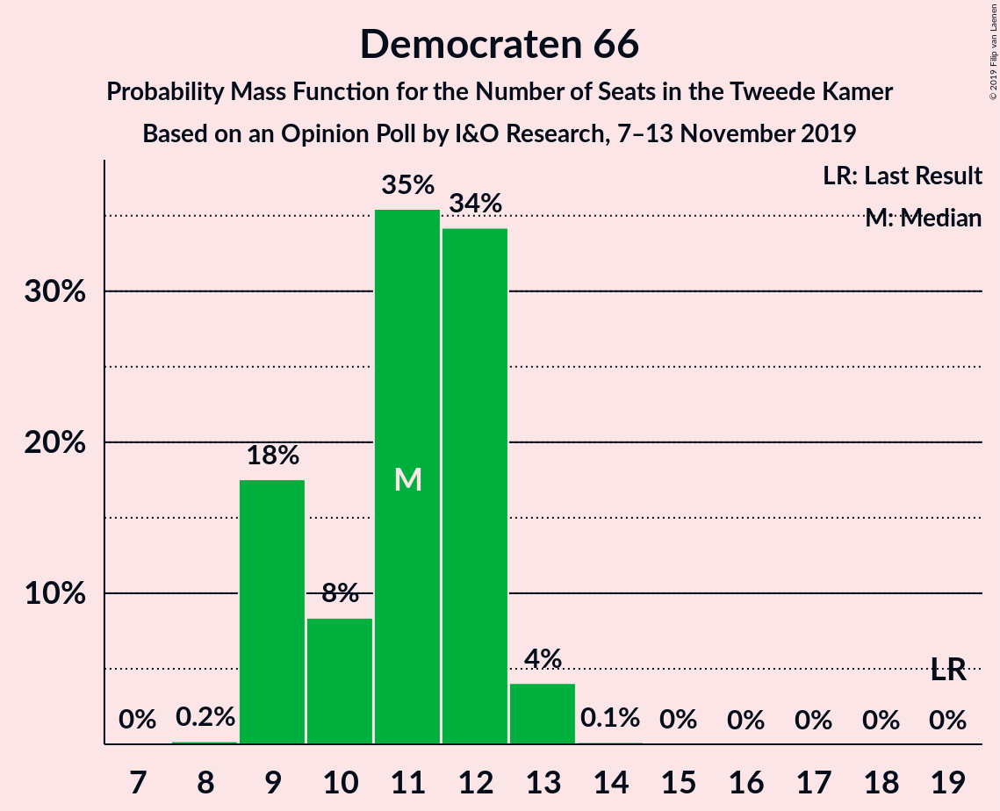
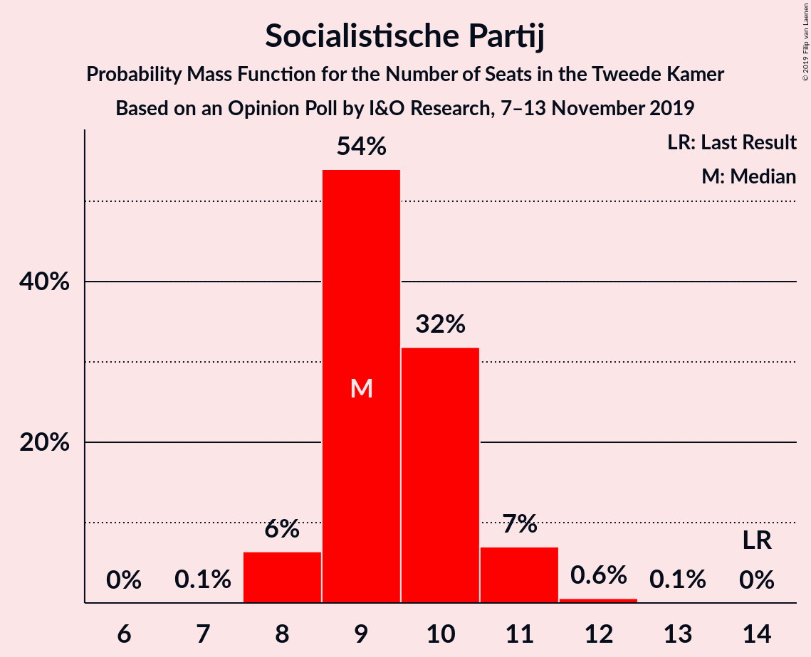
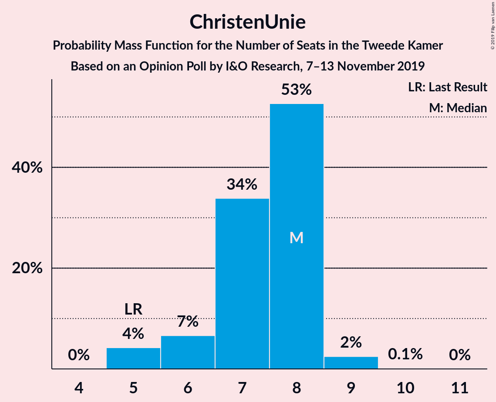
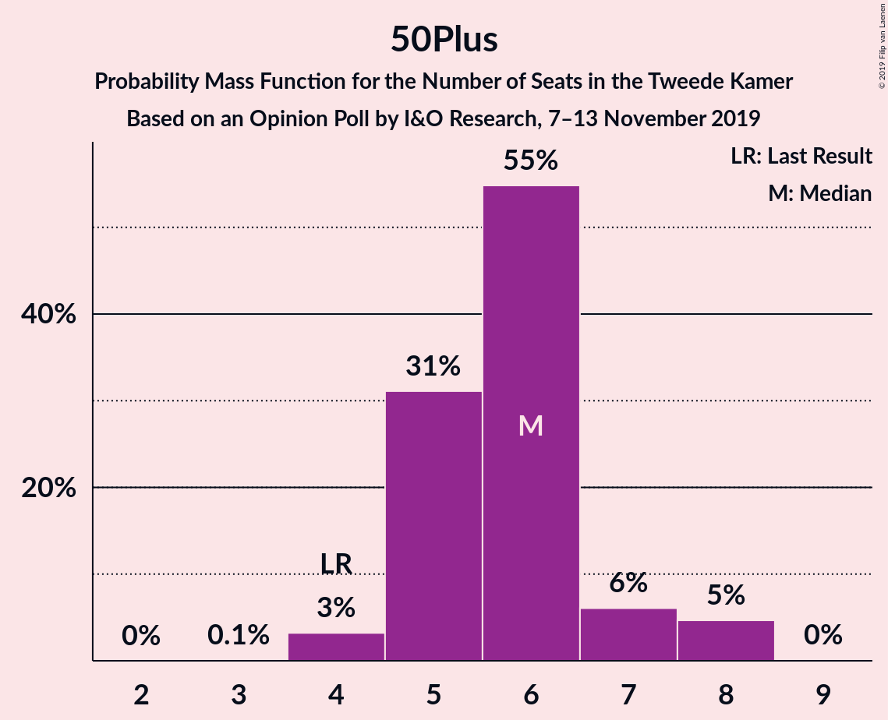
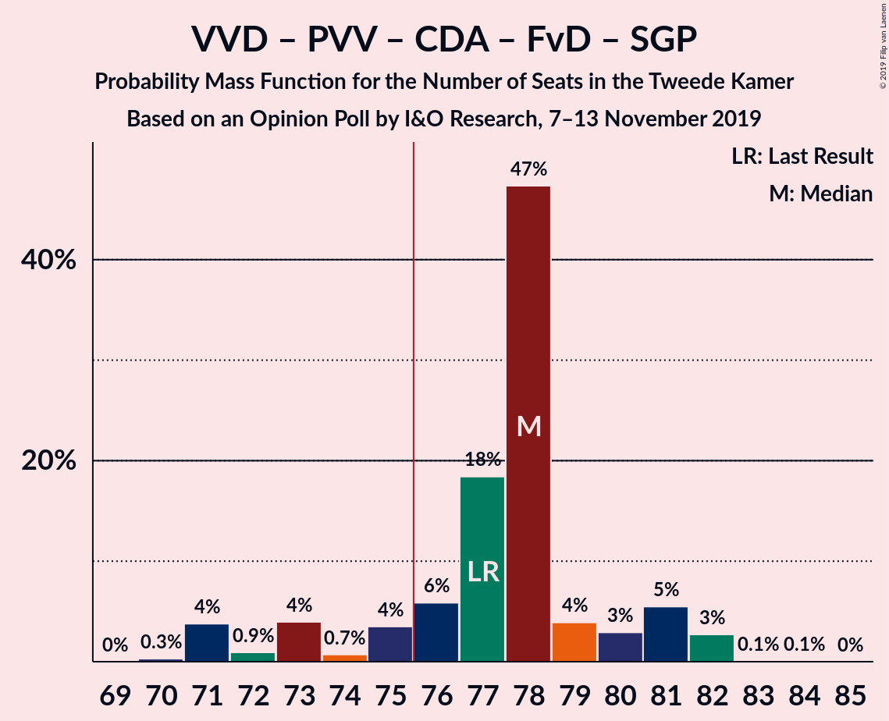
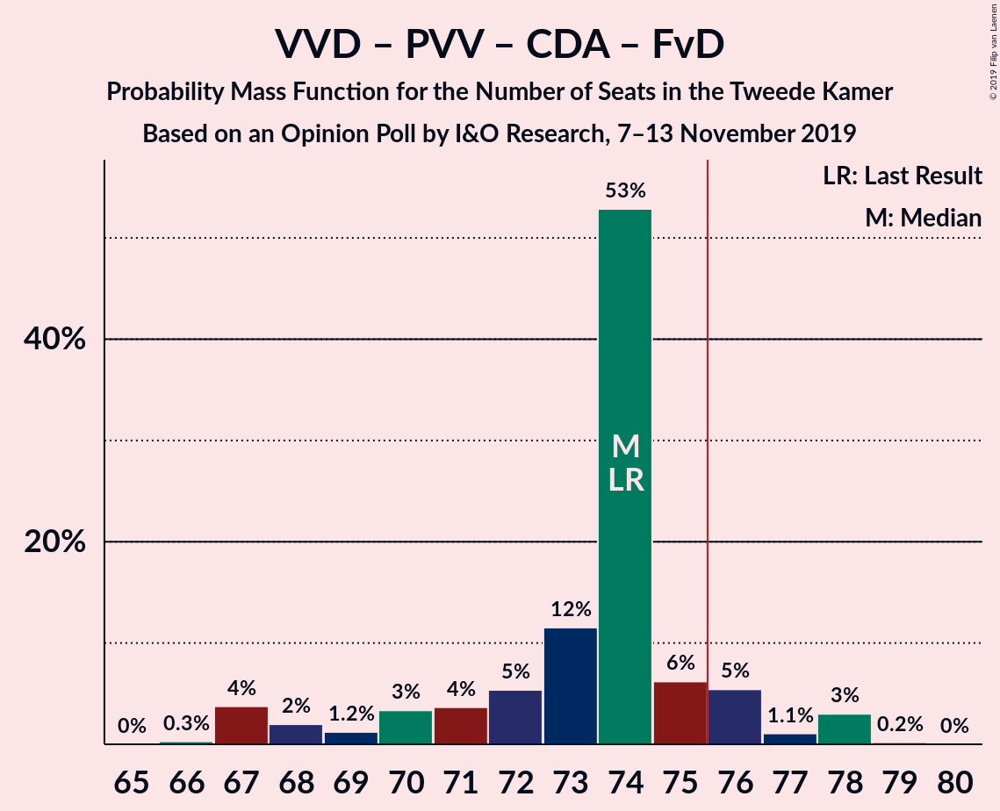
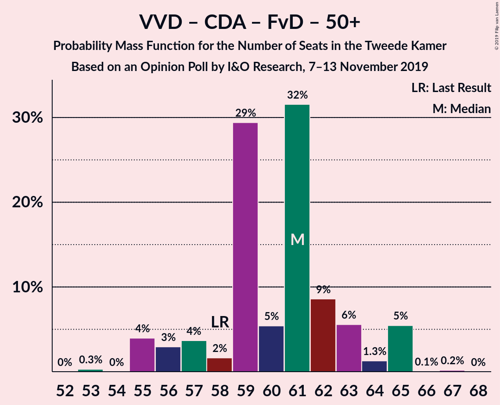
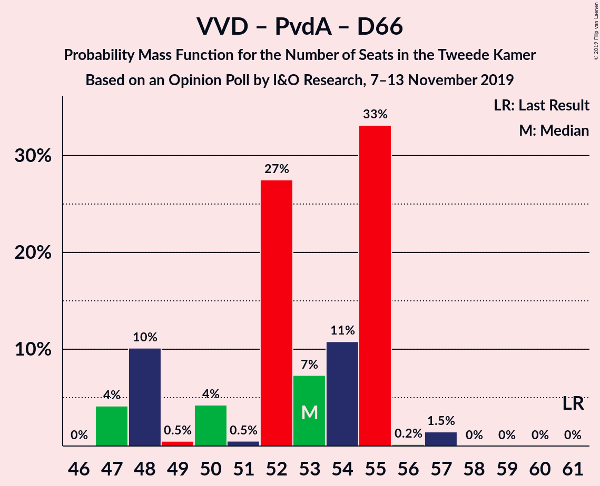
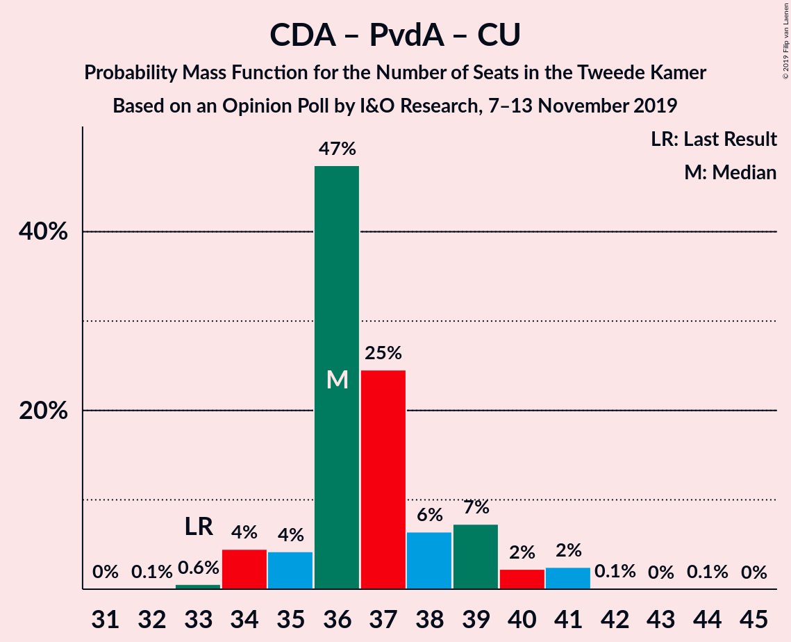

# Opinion Poll by I&O Research, 7–13 November 2019

<a href="#voting-intentions">Voting Intentions</a> | <a href="#seats">Seats</a> | <a href="#coalitions">Coalitions</a> | <a href="#technical-information">Technical Information</a>

## Voting Intentions

### Confidence Intervals

| Party | Last Result | Poll Result | 80% Confidence Interval | 90% Confidence Interval | 95% Confidence Interval | 99% Confidence Interval |
|:-----:|:-----------:|:-----------:|:-----------------------:|:-----------------------:|:-----------------------:|:-----------------------:|
| Volkspartij voor Vrijheid en Democratie | 21.3% | 17.0% | 15.8–18.4% |15.4–18.8% |15.1–19.1% |14.5–19.8% |
| GroenLinks | 9.1% | 12.1% | 11.0–13.3% |10.7–13.7% |10.5–14.0% |10.0–14.6% |
| Partij voor de Vrijheid | 13.1% | 11.9% | 10.8–13.1% |10.5–13.4% |10.2–13.7% |9.8–14.3% |
| Christen-Democratisch Appèl | 12.4% | 9.9% | 8.9–11.1% |8.7–11.4% |8.4–11.7% |8.0–12.2% |
| Partij van de Arbeid | 5.7% | 9.9% | 8.9–11.1% |8.7–11.4% |8.4–11.7% |8.0–12.2% |
| Forum voor Democratie | 1.8% | 9.2% | 8.2–10.3% |8.0–10.6% |7.7–10.9% |7.3–11.4% |
| Democraten 66 | 12.2% | 7.1% | 6.3–8.1% |6.0–8.4% |5.8–8.6% |5.5–9.1% |
| Socialistische Partij | 9.1% | 6.4% | 5.6–7.4% |5.4–7.6% |5.2–7.9% |4.9–8.4% |
| ChristenUnie | 3.4% | 4.9% | 4.2–5.8% |4.1–6.0% |3.9–6.2% |3.6–6.7% |
| 50Plus | 3.1% | 4.0% | 3.4–4.8% |3.2–5.0% |3.1–5.2% |2.8–5.6% |
| Partij voor de Dieren | 3.2% | 3.4% | 2.9–4.2% |2.7–4.4% |2.6–4.6% |2.3–4.9% |
| Staatkundig Gereformeerde Partij | 2.1% | 2.9% | 2.4–3.6% |2.3–3.8% |2.1–4.0% |1.9–4.3% |
| DENK | 2.1% | 0.9% | 0.6–1.3% |0.6–1.4% |0.5–1.6% |0.4–1.8% |

*Note:* The poll result column reflects the actual value used in the calculations. Published results may vary slightly, and in addition be rounded to fewer digits.

## Seats

### Confidence Intervals

| Party | Last Result | Median | 80% Confidence Interval | 90% Confidence Interval | 95% Confidence Interval | 99% Confidence Interval |
|:-----:|:-----------:|:------:|:-----------------------:|:-----------------------:|:-----------------------:|:-----------------------:|
| <a href="#volkspartij-voor-vrijheid-en-democratie">Volkspartij voor Vrijheid en Democratie</a> | 33 | 24 | 23–27 |23–27 |23–27 |23–31 |
| <a href="#groenlinks">GroenLinks</a> | 14 | 19 | 17–22 |16–22 |15–22 |14–22 |
| <a href="#partij-voor-de-vrijheid">Partij voor de Vrijheid</a> | 20 | 19 | 17–19 |17–19 |16–19 |15–21 |
| <a href="#christen-democratisch-appèl">Christen-Democratisch Appèl</a> | 19 | 16 | 13–16 |13–16 |13–16 |12–18 |
| <a href="#partij-van-de-arbeid">Partij van de Arbeid</a> | 9 | 13 | 13–17 |13–17 |12–17 |11–18 |
| <a href="#forum-voor-democratie">Forum voor Democratie</a> | 2 | 15 | 14–16 |13–16 |13–16 |10–17 |
| <a href="#democraten-66">Democraten 66</a> | 19 | 11 | 9–11 |9–13 |9–13 |8–13 |
| <a href="#socialistische-partij">Socialistische Partij</a> | 14 | 10 | 8–10 |8–11 |8–11 |7–13 |
| <a href="#christenunie">ChristenUnie</a> | 5 | 8 | 7–9 |6–9 |6–9 |5–11 |
| <a href="#50plus">50Plus</a> | 4 | 5 | 5–7 |5–7 |5–8 |4–8 |
| <a href="#partij-voor-de-dieren">Partij voor de Dieren</a> | 5 | 5 | 4–6 |4–7 |4–7 |3–8 |
| <a href="#staatkundig-gereformeerde-partij">Staatkundig Gereformeerde Partij</a> | 3 | 5 | 4–5 |4–5 |3–5 |3–6 |
| <a href="#denk">DENK</a> | 3 | 0 | 0–1 |0–1 |0–2 |0–2 |

### Volkspartij voor Vrijheid en Democratie

*For a full overview of the results for this party, see the [Volkspartij voor Vrijheid en Democratie](party-volkspartijvoorvrijheidendemocratie.html) page.*

| Number of Seats | Probability | Accumulated | Special Marks |
|:---------------:|:-----------:|:-----------:|:-------------:|
| 22 | 0.1% | 100% |  |
| 23 | 48% | 99.8% |  |
| 24 | 6% | 52% | Median |
| 25 | 26% | 46% |  |
| 26 | 3% | 20% |  |
| 27 | 15% | 17% |  |
| 28 | 0.3% | 2% |  |
| 29 | 0.4% | 1.5% |  |
| 30 | 0.1% | 1.1% |  |
| 31 | 1.0% | 1.0% |  |
| 32 | 0% | 0% |  |
| 33 | 0% | 0% | Last Result |

### GroenLinks

*For a full overview of the results for this party, see the [GroenLinks](party-groenlinks.html) page.*

| Number of Seats | Probability | Accumulated | Special Marks |
|:---------------:|:-----------:|:-----------:|:-------------:|
| 14 | 0.5% | 100% | Last Result |
| 15 | 3% | 99.5% |  |
| 16 | 2% | 96% |  |
| 17 | 15% | 95% |  |
| 18 | 2% | 79% |  |
| 19 | 48% | 77% | Median |
| 20 | 3% | 29% |  |
| 21 | 0.2% | 26% |  |
| 22 | 26% | 26% |  |
| 23 | 0.2% | 0.2% |  |
| 24 | 0.1% | 0.1% |  |
| 25 | 0% | 0% |  |

### Partij voor de Vrijheid

*For a full overview of the results for this party, see the [Partij voor de Vrijheid](party-partijvoordevrijheid.html) page.*

| Number of Seats | Probability | Accumulated | Special Marks |
|:---------------:|:-----------:|:-----------:|:-------------:|
| 14 | 0.1% | 100% |  |
| 15 | 2% | 99.9% |  |
| 16 | 1.5% | 98% |  |
| 17 | 28% | 97% |  |
| 18 | 14% | 69% |  |
| 19 | 53% | 54% | Median |
| 20 | 0.4% | 1.0% | Last Result |
| 21 | 0.4% | 0.6% |  |
| 22 | 0% | 0.2% |  |
| 23 | 0.1% | 0.1% |  |
| 24 | 0% | 0% |  |

### Christen-Democratisch Appèl

*For a full overview of the results for this party, see the [Christen-Democratisch Appèl](party-christen-democratischappèl.html) page.*

| Number of Seats | Probability | Accumulated | Special Marks |
|:---------------:|:-----------:|:-----------:|:-------------:|
| 11 | 0.1% | 100% |  |
| 12 | 1.3% | 99.9% |  |
| 13 | 12% | 98.6% |  |
| 14 | 30% | 86% |  |
| 15 | 6% | 57% |  |
| 16 | 48% | 50% | Median |
| 17 | 1.1% | 2% |  |
| 18 | 1.0% | 1.3% |  |
| 19 | 0.2% | 0.3% | Last Result |
| 20 | 0% | 0.1% |  |
| 21 | 0.1% | 0.1% |  |
| 22 | 0% | 0% |  |

### Partij van de Arbeid

*For a full overview of the results for this party, see the [Partij van de Arbeid](party-partijvandearbeid.html) page.*

| Number of Seats | Probability | Accumulated | Special Marks |
|:---------------:|:-----------:|:-----------:|:-------------:|
| 9 | 0% | 100% | Last Result |
| 10 | 0% | 100% |  |
| 11 | 0.5% | 100% |  |
| 12 | 4% | 99.5% |  |
| 13 | 48% | 96% | Median |
| 14 | 2% | 48% |  |
| 15 | 7% | 46% |  |
| 16 | 26% | 39% |  |
| 17 | 11% | 12% |  |
| 18 | 1.2% | 1.4% |  |
| 19 | 0.1% | 0.1% |  |
| 20 | 0% | 0% |  |

### Forum voor Democratie

*For a full overview of the results for this party, see the [Forum voor Democratie](party-forumvoordemocratie.html) page.*

| Number of Seats | Probability | Accumulated | Special Marks |
|:---------------:|:-----------:|:-----------:|:-------------:|
| 2 | 0% | 100% | Last Result |
| 3 | 0% | 100% |  |
| 4 | 0% | 100% |  |
| 5 | 0% | 100% |  |
| 6 | 0% | 100% |  |
| 7 | 0% | 100% |  |
| 8 | 0% | 100% |  |
| 9 | 0.1% | 100% |  |
| 10 | 0.5% | 99.9% |  |
| 11 | 0.2% | 99.4% |  |
| 12 | 1.3% | 99.2% |  |
| 13 | 5% | 98% |  |
| 14 | 4% | 93% |  |
| 15 | 77% | 89% | Median |
| 16 | 11% | 12% |  |
| 17 | 1.1% | 1.3% |  |
| 18 | 0.2% | 0.2% |  |
| 19 | 0% | 0% |  |

### Democraten 66

*For a full overview of the results for this party, see the [Democraten 66](party-democraten66.html) page.*

| Number of Seats | Probability | Accumulated | Special Marks |
|:---------------:|:-----------:|:-----------:|:-------------:|
| 7 | 0.1% | 100% |  |
| 8 | 0.8% | 99.9% |  |
| 9 | 12% | 99.2% |  |
| 10 | 1.4% | 87% |  |
| 11 | 76% | 86% | Median |
| 12 | 0.9% | 9% |  |
| 13 | 8% | 8% |  |
| 14 | 0.1% | 0.1% |  |
| 15 | 0% | 0% |  |
| 16 | 0% | 0% |  |
| 17 | 0% | 0% |  |
| 18 | 0% | 0% |  |
| 19 | 0% | 0% | Last Result |

### Socialistische Partij

*For a full overview of the results for this party, see the [Socialistische Partij](party-socialistischepartij.html) page.*

| Number of Seats | Probability | Accumulated | Special Marks |
|:---------------:|:-----------:|:-----------:|:-------------:|
| 7 | 0.9% | 100% |  |
| 8 | 39% | 99.1% |  |
| 9 | 1.4% | 60% |  |
| 10 | 52% | 59% | Median |
| 11 | 5% | 6% |  |
| 12 | 0.7% | 1.4% |  |
| 13 | 0.7% | 0.7% |  |
| 14 | 0% | 0% | Last Result |

### ChristenUnie

*For a full overview of the results for this party, see the [ChristenUnie](party-christenunie.html) page.*

| Number of Seats | Probability | Accumulated | Special Marks |
|:---------------:|:-----------:|:-----------:|:-------------:|
| 5 | 2% | 100% | Last Result |
| 6 | 4% | 98% |  |
| 7 | 43% | 94% |  |
| 8 | 1.5% | 51% | Median |
| 9 | 48% | 49% |  |
| 10 | 0.4% | 1.1% |  |
| 11 | 0.7% | 0.7% |  |
| 12 | 0% | 0% |  |

### 50Plus

*For a full overview of the results for this party, see the [50Plus](party-50plus.html) page.*

| Number of Seats | Probability | Accumulated | Special Marks |
|:---------------:|:-----------:|:-----------:|:-------------:|
| 4 | 2% | 100% | Last Result |
| 5 | 78% | 98% | Median |
| 6 | 3% | 20% |  |
| 7 | 14% | 17% |  |
| 8 | 3% | 3% |  |
| 9 | 0% | 0.1% |  |
| 10 | 0.1% | 0.1% |  |
| 11 | 0% | 0% |  |

### Partij voor de Dieren

*For a full overview of the results for this party, see the [Partij voor de Dieren](party-partijvoordedieren.html) page.*

| Number of Seats | Probability | Accumulated | Special Marks |
|:---------------:|:-----------:|:-----------:|:-------------:|
| 3 | 0.7% | 100% |  |
| 4 | 27% | 99.2% |  |
| 5 | 52% | 72% | Last Result, Median |
| 6 | 15% | 21% |  |
| 7 | 4% | 6% |  |
| 8 | 1.5% | 1.5% |  |
| 9 | 0% | 0% |  |

### Staatkundig Gereformeerde Partij

*For a full overview of the results for this party, see the [Staatkundig Gereformeerde Partij](party-staatkundiggereformeerdepartij.html) page.*

| Number of Seats | Probability | Accumulated | Special Marks |
|:---------------:|:-----------:|:-----------:|:-------------:|
| 2 | 0.2% | 100% |  |
| 3 | 3% | 99.8% | Last Result |
| 4 | 18% | 97% |  |
| 5 | 77% | 80% | Median |
| 6 | 2% | 2% |  |
| 7 | 0% | 0% |  |

### DENK

*For a full overview of the results for this party, see the [DENK](party-denk.html) page.*

| Number of Seats | Probability | Accumulated | Special Marks |
|:---------------:|:-----------:|:-----------:|:-------------:|
| 0 | 74% | 100% | Median |
| 1 | 22% | 26% |  |
| 2 | 4% | 4% |  |
| 3 | 0.1% | 0.1% | Last Result |
| 4 | 0% | 0% |  |

## Coalitions

### Confidence Intervals

| Coalition | Last Result | Median | Majority? | 80% Confidence Interval | 90% Confidence Interval | 95% Confidence Interval | 99% Confidence Interval |
|:---------:|:-----------:|:------:|:---------:|:-----------------------:|:-----------------------:|:-----------------------:|:-----------------------:|
| Volkspartij voor Vrijheid en Democratie – Partij voor de Vrijheid – Christen-Democratisch Appèl – Forum voor Democratie – Staatkundig Gereformeerde Partij | 77 | 78 | 95% | 76–78 | 75–78 | 74–79 | 73–81 |
| Volkspartij voor Vrijheid en Democratie – GroenLinks – Christen-Democratisch Appèl – Democraten 66 – ChristenUnie | 90 | 78 | 84% | 73–79 | 73–79 | 73–79 | 73–81 |
| GroenLinks – Christen-Democratisch Appèl – Partij van de Arbeid – Democraten 66 – Socialistische Partij – ChristenUnie | 80 | 78 | 79% | 71–78 | 71–78 | 71–78 | 71–80 |
| Volkspartij voor Vrijheid en Democratie – Christen-Democratisch Appèl – Partij van de Arbeid – Democraten 66 – ChristenUnie | 85 | 72 | 4% | 72–73 | 72–74 | 70–76 | 68–80 |
| Volkspartij voor Vrijheid en Democratie – Partij voor de Vrijheid – Christen-Democratisch Appèl – Forum voor Democratie | 74 | 73 | 2% | 71–74 | 71–74 | 70–74 | 68–77 |
| GroenLinks – Christen-Democratisch Appèl – Partij van de Arbeid – Democraten 66 – ChristenUnie | 66 | 68 | 0.2% | 63–70 | 63–70 | 63–70 | 61–71 |
| Volkspartij voor Vrijheid en Democratie – Christen-Democratisch Appèl – Forum voor Democratie – 50Plus – Staatkundig Gereformeerde Partij | 61 | 64 | 0% | 64–67 | 63–67 | 63–67 | 61–69 |
| Volkspartij voor Vrijheid en Democratie – Christen-Democratisch Appèl – Forum voor Democratie – 50Plus | 58 | 59 | 0% | 59–63 | 59–63 | 59–63 | 57–65 |
| Volkspartij voor Vrijheid en Democratie – Christen-Democratisch Appèl – Forum voor Democratie – Staatkundig Gereformeerde Partij | 57 | 59 | 0% | 58–60 | 58–60 | 57–62 | 55–63 |
| Volkspartij voor Vrijheid en Democratie – Christen-Democratisch Appèl – Democraten 66 – ChristenUnie | 76 | 59 | 0% | 56–59 | 56–60 | 56–61 | 56–64 |
| Volkspartij voor Vrijheid en Democratie – Partij voor de Vrijheid – Christen-Democratisch Appèl | 72 | 58 | 0% | 56–58 | 56–60 | 56–61 | 55–63 |
| Volkspartij voor Vrijheid en Democratie – Christen-Democratisch Appèl – Partij van de Arbeid | 61 | 52 | 0% | 52–57 | 52–57 | 52–58 | 51–63 |
| Volkspartij voor Vrijheid en Democratie – Christen-Democratisch Appèl – Forum voor Democratie | 54 | 54 | 0% | 54–56 | 53–56 | 53–57 | 51–60 |
| Volkspartij voor Vrijheid en Democratie – Partij van de Arbeid – Democraten 66 | 61 | 49 | 0% | 47–53 | 47–53 | 47–55 | 47–60 |
| Volkspartij voor Vrijheid en Democratie – Christen-Democratisch Appèl – Democraten 66 | 71 | 50 | 0% | 49–52 | 49–53 | 49–54 | 48–56 |
| Volkspartij voor Vrijheid en Democratie – Partij van de Arbeid | 42 | 38 | 0% | 36–44 | 36–44 | 36–44 | 36–49 |
| Volkspartij voor Vrijheid en Democratie – Christen-Democratisch Appèl | 52 | 39 | 0% | 39–40 | 39–41 | 39–43 | 37–45 |
| Christen-Democratisch Appèl – Partij van de Arbeid – Democraten 66 | 47 | 40 | 0% | 39–41 | 39–43 | 38–43 | 36–44 |
| Christen-Democratisch Appèl – Partij van de Arbeid – ChristenUnie | 33 | 38 | 0% | 37–38 | 35–38 | 33–38 | 30–41 |
| Christen-Democratisch Appèl – Partij van de Arbeid | 28 | 29 | 0% | 29–30 | 27–30 | 26–32 | 24–33 |
| Christen-Democratisch Appèl – Democraten 66 | 38 | 27 | 0% | 22–27 | 22–28 | 22–28 | 21–30 |

### Volkspartij voor Vrijheid en Democratie – Partij voor de Vrijheid – Christen-Democratisch Appèl – Forum voor Democratie – Staatkundig Gereformeerde Partij

| Number of Seats | Probability | Accumulated | Special Marks |
|:---------------:|:-----------:|:-----------:|:-------------:|
| 71 | 0.1% | 100% |  |
| 72 | 0.2% | 99.8% |  |
| 73 | 1.4% | 99.6% |  |
| 74 | 0.7% | 98% |  |
| 75 | 3% | 97% |  |
| 76 | 27% | 95% | Majority |
| 77 | 6% | 68% | Last Result |
| 78 | 59% | 62% |  |
| 79 | 2% | 3% | Median |
| 80 | 0.3% | 2% |  |
| 81 | 1.0% | 1.3% |  |
| 82 | 0.1% | 0.3% |  |
| 83 | 0.2% | 0.2% |  |
| 84 | 0% | 0% |  |

### Volkspartij voor Vrijheid en Democratie – GroenLinks – Christen-Democratisch Appèl – Democraten 66 – ChristenUnie

| Number of Seats | Probability | Accumulated | Special Marks |
|:---------------:|:-----------:|:-----------:|:-------------:|
| 67 | 0.1% | 100% |  |
| 68 | 0% | 99.9% |  |
| 69 | 0% | 99.9% |  |
| 70 | 0% | 99.9% |  |
| 71 | 0% | 99.9% |  |
| 72 | 0% | 99.9% |  |
| 73 | 11% | 99.9% |  |
| 74 | 4% | 89% |  |
| 75 | 0.3% | 85% |  |
| 76 | 4% | 84% | Majority |
| 77 | 3% | 81% |  |
| 78 | 48% | 77% | Median |
| 79 | 28% | 30% |  |
| 80 | 0.8% | 2% |  |
| 81 | 0.6% | 1.0% |  |
| 82 | 0.1% | 0.4% |  |
| 83 | 0.2% | 0.2% |  |
| 84 | 0% | 0% |  |
| 85 | 0% | 0% |  |
| 86 | 0% | 0% |  |
| 87 | 0% | 0% |  |
| 88 | 0% | 0% |  |
| 89 | 0% | 0% |  |
| 90 | 0% | 0% | Last Result |

### GroenLinks – Christen-Democratisch Appèl – Partij van de Arbeid – Democraten 66 – Socialistische Partij – ChristenUnie

| Number of Seats | Probability | Accumulated | Special Marks |
|:---------------:|:-----------:|:-----------:|:-------------:|
| 71 | 11% | 100% |  |
| 72 | 3% | 89% |  |
| 73 | 0.7% | 86% |  |
| 74 | 3% | 86% |  |
| 75 | 5% | 83% |  |
| 76 | 1.5% | 79% | Majority |
| 77 | 3% | 77% | Median |
| 78 | 73% | 74% |  |
| 79 | 0.2% | 0.8% |  |
| 80 | 0.2% | 0.6% | Last Result |
| 81 | 0.1% | 0.4% |  |
| 82 | 0.1% | 0.3% |  |
| 83 | 0% | 0.2% |  |
| 84 | 0.2% | 0.2% |  |
| 85 | 0% | 0% |  |

### Volkspartij voor Vrijheid en Democratie – Christen-Democratisch Appèl – Partij van de Arbeid – Democraten 66 – ChristenUnie

| Number of Seats | Probability | Accumulated | Special Marks |
|:---------------:|:-----------:|:-----------:|:-------------:|
| 67 | 0% | 100% |  |
| 68 | 1.5% | 99.9% |  |
| 69 | 0.2% | 98% |  |
| 70 | 0.8% | 98% |  |
| 71 | 1.4% | 97% |  |
| 72 | 49% | 96% | Median |
| 73 | 38% | 47% |  |
| 74 | 4% | 9% |  |
| 75 | 0.7% | 5% |  |
| 76 | 2% | 4% | Majority |
| 77 | 0.6% | 2% |  |
| 78 | 0.2% | 1.4% |  |
| 79 | 0% | 1.2% |  |
| 80 | 1.0% | 1.2% |  |
| 81 | 0.2% | 0.2% |  |
| 82 | 0% | 0% |  |
| 83 | 0% | 0% |  |
| 84 | 0% | 0% |  |
| 85 | 0% | 0% | Last Result |

### Volkspartij voor Vrijheid en Democratie – Partij voor de Vrijheid – Christen-Democratisch Appèl – Forum voor Democratie

| Number of Seats | Probability | Accumulated | Special Marks |
|:---------------:|:-----------:|:-----------:|:-------------:|
| 66 | 0.1% | 100% |  |
| 67 | 0.1% | 99.8% |  |
| 68 | 1.3% | 99.8% |  |
| 69 | 0.3% | 98% |  |
| 70 | 3% | 98% |  |
| 71 | 27% | 95% |  |
| 72 | 3% | 69% |  |
| 73 | 51% | 66% |  |
| 74 | 13% | 15% | Last Result, Median |
| 75 | 0.3% | 2% |  |
| 76 | 0.4% | 2% | Majority |
| 77 | 0.7% | 1.1% |  |
| 78 | 0.5% | 0.5% |  |
| 79 | 0% | 0% |  |

### GroenLinks – Christen-Democratisch Appèl – Partij van de Arbeid – Democraten 66 – ChristenUnie

| Number of Seats | Probability | Accumulated | Special Marks |
|:---------------:|:-----------:|:-----------:|:-------------:|
| 60 | 0.1% | 100% |  |
| 61 | 0.5% | 99.9% |  |
| 62 | 0.8% | 99.4% |  |
| 63 | 13% | 98.6% |  |
| 64 | 3% | 85% |  |
| 65 | 4% | 82% |  |
| 66 | 2% | 79% | Last Result |
| 67 | 2% | 76% | Median |
| 68 | 48% | 74% |  |
| 69 | 0.4% | 27% |  |
| 70 | 25% | 26% |  |
| 71 | 0.6% | 0.9% |  |
| 72 | 0.1% | 0.3% |  |
| 73 | 0% | 0.2% |  |
| 74 | 0% | 0.2% |  |
| 75 | 0% | 0.2% |  |
| 76 | 0.2% | 0.2% | Majority |
| 77 | 0% | 0% |  |

### Volkspartij voor Vrijheid en Democratie – Christen-Democratisch Appèl – Forum voor Democratie – 50Plus – Staatkundig Gereformeerde Partij

| Number of Seats | Probability | Accumulated | Special Marks |
|:---------------:|:-----------:|:-----------:|:-------------:|
| 56 | 0.1% | 100% |  |
| 57 | 0% | 99.9% |  |
| 58 | 0% | 99.9% |  |
| 59 | 0.1% | 99.9% |  |
| 60 | 0.2% | 99.8% |  |
| 61 | 0.1% | 99.6% | Last Result |
| 62 | 1.4% | 99.5% |  |
| 63 | 3% | 98% |  |
| 64 | 76% | 95% |  |
| 65 | 2% | 19% | Median |
| 66 | 4% | 17% |  |
| 67 | 12% | 14% |  |
| 68 | 0.7% | 1.4% |  |
| 69 | 0.5% | 0.6% |  |
| 70 | 0% | 0.1% |  |
| 71 | 0% | 0.1% |  |
| 72 | 0% | 0% |  |

### Volkspartij voor Vrijheid en Democratie – Christen-Democratisch Appèl – Forum voor Democratie – 50Plus

| Number of Seats | Probability | Accumulated | Special Marks |
|:---------------:|:-----------:|:-----------:|:-------------:|
| 52 | 0.1% | 100% |  |
| 53 | 0% | 99.9% |  |
| 54 | 0% | 99.9% |  |
| 55 | 0.3% | 99.9% |  |
| 56 | 0.1% | 99.6% |  |
| 57 | 1.3% | 99.5% |  |
| 58 | 0.2% | 98% | Last Result |
| 59 | 77% | 98% |  |
| 60 | 3% | 21% | Median |
| 61 | 4% | 18% |  |
| 62 | 0.3% | 14% |  |
| 63 | 12% | 14% |  |
| 64 | 1.2% | 2% |  |
| 65 | 0.6% | 0.6% |  |
| 66 | 0% | 0.1% |  |
| 67 | 0% | 0.1% |  |
| 68 | 0% | 0% |  |

### Volkspartij voor Vrijheid en Democratie – Christen-Democratisch Appèl – Forum voor Democratie – Staatkundig Gereformeerde Partij

| Number of Seats | Probability | Accumulated | Special Marks |
|:---------------:|:-----------:|:-----------:|:-------------:|
| 51 | 0.1% | 100% |  |
| 52 | 0% | 99.9% |  |
| 53 | 0% | 99.9% |  |
| 54 | 0.1% | 99.9% |  |
| 55 | 0.3% | 99.8% |  |
| 56 | 0.5% | 99.5% |  |
| 57 | 3% | 99.0% | Last Result |
| 58 | 6% | 95% |  |
| 59 | 75% | 90% |  |
| 60 | 12% | 15% | Median |
| 61 | 0.7% | 3% |  |
| 62 | 2% | 3% |  |
| 63 | 0.7% | 1.1% |  |
| 64 | 0.4% | 0.4% |  |
| 65 | 0% | 0.1% |  |
| 66 | 0% | 0.1% |  |
| 67 | 0% | 0% |  |

### Volkspartij voor Vrijheid en Democratie – Christen-Democratisch Appèl – Democraten 66 – ChristenUnie

| Number of Seats | Probability | Accumulated | Special Marks |
|:---------------:|:-----------:|:-----------:|:-------------:|
| 52 | 0.1% | 100% |  |
| 53 | 0.1% | 99.9% |  |
| 54 | 0% | 99.8% |  |
| 55 | 0.2% | 99.7% |  |
| 56 | 14% | 99.6% |  |
| 57 | 26% | 86% |  |
| 58 | 1.0% | 60% |  |
| 59 | 53% | 59% | Median |
| 60 | 3% | 7% |  |
| 61 | 1.5% | 4% |  |
| 62 | 1.5% | 2% |  |
| 63 | 0.4% | 1.0% |  |
| 64 | 0.6% | 0.7% |  |
| 65 | 0% | 0.1% |  |
| 66 | 0.1% | 0.1% |  |
| 67 | 0% | 0% |  |
| 68 | 0% | 0% |  |
| 69 | 0% | 0% |  |
| 70 | 0% | 0% |  |
| 71 | 0% | 0% |  |
| 72 | 0% | 0% |  |
| 73 | 0% | 0% |  |
| 74 | 0% | 0% |  |
| 75 | 0% | 0% |  |
| 76 | 0% | 0% | Last Result, Majority |

### Volkspartij voor Vrijheid en Democratie – Partij voor de Vrijheid – Christen-Democratisch Appèl

| Number of Seats | Probability | Accumulated | Special Marks |
|:---------------:|:-----------:|:-----------:|:-------------:|
| 53 | 0.1% | 100% |  |
| 54 | 0.1% | 99.9% |  |
| 55 | 2% | 99.8% |  |
| 56 | 26% | 98% |  |
| 57 | 3% | 72% |  |
| 58 | 63% | 69% |  |
| 59 | 1.3% | 6% | Median |
| 60 | 2% | 5% |  |
| 61 | 2% | 3% |  |
| 62 | 0.5% | 1.1% |  |
| 63 | 0.2% | 0.6% |  |
| 64 | 0.3% | 0.4% |  |
| 65 | 0% | 0.1% |  |
| 66 | 0% | 0% |  |
| 67 | 0% | 0% |  |
| 68 | 0% | 0% |  |
| 69 | 0% | 0% |  |
| 70 | 0% | 0% |  |
| 71 | 0% | 0% |  |
| 72 | 0% | 0% | Last Result |

### Volkspartij voor Vrijheid en Democratie – Christen-Democratisch Appèl – Partij van de Arbeid

| Number of Seats | Probability | Accumulated | Special Marks |
|:---------------:|:-----------:|:-----------:|:-------------:|
| 50 | 0.1% | 100% |  |
| 51 | 2% | 99.8% |  |
| 52 | 49% | 98% |  |
| 53 | 1.0% | 49% | Median |
| 54 | 5% | 48% |  |
| 55 | 27% | 43% |  |
| 56 | 0.3% | 16% |  |
| 57 | 13% | 15% |  |
| 58 | 0.5% | 3% |  |
| 59 | 1.0% | 2% |  |
| 60 | 0.1% | 1.2% |  |
| 61 | 0.2% | 1.1% | Last Result |
| 62 | 0% | 1.0% |  |
| 63 | 1.0% | 1.0% |  |
| 64 | 0% | 0% |  |

### Volkspartij voor Vrijheid en Democratie – Christen-Democratisch Appèl – Forum voor Democratie

| Number of Seats | Probability | Accumulated | Special Marks |
|:---------------:|:-----------:|:-----------:|:-------------:|
| 47 | 0.1% | 100% |  |
| 48 | 0% | 99.9% |  |
| 49 | 0.1% | 99.9% |  |
| 50 | 0.1% | 99.8% |  |
| 51 | 0.3% | 99.7% |  |
| 52 | 2% | 99.5% |  |
| 53 | 5% | 98% |  |
| 54 | 76% | 92% | Last Result |
| 55 | 3% | 17% | Median |
| 56 | 12% | 14% |  |
| 57 | 0.9% | 3% |  |
| 58 | 0.1% | 2% |  |
| 59 | 1.2% | 2% |  |
| 60 | 0.1% | 0.5% |  |
| 61 | 0.4% | 0.4% |  |
| 62 | 0% | 0% |  |

### Volkspartij voor Vrijheid en Democratie – Partij van de Arbeid – Democraten 66

| Number of Seats | Probability | Accumulated | Special Marks |
|:---------------:|:-----------:|:-----------:|:-------------:|
| 45 | 0.1% | 100% |  |
| 46 | 0.1% | 99.9% |  |
| 47 | 49% | 99.8% |  |
| 48 | 0.8% | 51% | Median |
| 49 | 0.7% | 51% |  |
| 50 | 2% | 50% |  |
| 51 | 4% | 48% |  |
| 52 | 29% | 44% |  |
| 53 | 12% | 15% |  |
| 54 | 0.7% | 3% |  |
| 55 | 1.4% | 3% |  |
| 56 | 0.1% | 1.3% |  |
| 57 | 0.2% | 1.2% |  |
| 58 | 0% | 1.0% |  |
| 59 | 0% | 1.0% |  |
| 60 | 1.0% | 1.0% |  |
| 61 | 0% | 0% | Last Result |

### Volkspartij voor Vrijheid en Democratie – Christen-Democratisch Appèl – Democraten 66

| Number of Seats | Probability | Accumulated | Special Marks |
|:---------------:|:-----------:|:-----------:|:-------------:|
| 44 | 0.1% | 100% |  |
| 45 | 0% | 99.9% |  |
| 46 | 0.2% | 99.9% |  |
| 47 | 0.1% | 99.7% |  |
| 48 | 1.1% | 99.6% |  |
| 49 | 11% | 98% |  |
| 50 | 74% | 88% |  |
| 51 | 1.1% | 14% | Median |
| 52 | 6% | 12% |  |
| 53 | 4% | 7% |  |
| 54 | 0.7% | 3% |  |
| 55 | 0.4% | 2% |  |
| 56 | 1.0% | 1.5% |  |
| 57 | 0.3% | 0.5% |  |
| 58 | 0.1% | 0.1% |  |
| 59 | 0% | 0% |  |
| 60 | 0% | 0% |  |
| 61 | 0% | 0% |  |
| 62 | 0% | 0% |  |
| 63 | 0% | 0% |  |
| 64 | 0% | 0% |  |
| 65 | 0% | 0% |  |
| 66 | 0% | 0% |  |
| 67 | 0% | 0% |  |
| 68 | 0% | 0% |  |
| 69 | 0% | 0% |  |
| 70 | 0% | 0% |  |
| 71 | 0% | 0% | Last Result |

### Volkspartij voor Vrijheid en Democratie – Partij van de Arbeid

| Number of Seats | Probability | Accumulated | Special Marks |
|:---------------:|:-----------:|:-----------:|:-------------:|
| 36 | 49% | 100% |  |
| 37 | 0.1% | 51% | Median |
| 38 | 5% | 51% |  |
| 39 | 4% | 47% |  |
| 40 | 0.8% | 43% |  |
| 41 | 26% | 42% |  |
| 42 | 3% | 16% | Last Result |
| 43 | 0.8% | 13% |  |
| 44 | 11% | 12% |  |
| 45 | 0.1% | 1.1% |  |
| 46 | 0% | 1.0% |  |
| 47 | 0% | 1.0% |  |
| 48 | 0% | 1.0% |  |
| 49 | 1.0% | 1.0% |  |
| 50 | 0% | 0% |  |

### Volkspartij voor Vrijheid en Democratie – Christen-Democratisch Appèl

| Number of Seats | Probability | Accumulated | Special Marks |
|:---------------:|:-----------:|:-----------:|:-------------:|
| 35 | 0.1% | 100% |  |
| 36 | 0.1% | 99.9% |  |
| 37 | 0.3% | 99.8% |  |
| 38 | 0.7% | 99.5% |  |
| 39 | 78% | 98.8% |  |
| 40 | 15% | 21% | Median |
| 41 | 2% | 6% |  |
| 42 | 2% | 5% |  |
| 43 | 0.7% | 3% |  |
| 44 | 0.6% | 2% |  |
| 45 | 1.1% | 1.2% |  |
| 46 | 0.1% | 0.2% |  |
| 47 | 0.1% | 0.1% |  |
| 48 | 0% | 0% |  |
| 49 | 0% | 0% |  |
| 50 | 0% | 0% |  |
| 51 | 0% | 0% |  |
| 52 | 0% | 0% | Last Result |

### Christen-Democratisch Appèl – Partij van de Arbeid – Democraten 66

| Number of Seats | Probability | Accumulated | Special Marks |
|:---------------:|:-----------:|:-----------:|:-------------:|
| 34 | 0% | 100% |  |
| 35 | 0% | 99.9% |  |
| 36 | 0.7% | 99.9% |  |
| 37 | 0.6% | 99.2% |  |
| 38 | 2% | 98.6% |  |
| 39 | 14% | 97% |  |
| 40 | 49% | 83% | Median |
| 41 | 26% | 34% |  |
| 42 | 2% | 8% |  |
| 43 | 5% | 6% |  |
| 44 | 0.9% | 1.2% |  |
| 45 | 0% | 0.3% |  |
| 46 | 0.2% | 0.3% |  |
| 47 | 0.1% | 0.1% | Last Result |
| 48 | 0% | 0% |  |

### Christen-Democratisch Appèl – Partij van de Arbeid – ChristenUnie

| Number of Seats | Probability | Accumulated | Special Marks |
|:---------------:|:-----------:|:-----------:|:-------------:|
| 30 | 0.5% | 100% |  |
| 31 | 0% | 99.5% |  |
| 32 | 0.2% | 99.5% |  |
| 33 | 4% | 99.3% | Last Result |
| 34 | 0.3% | 95% |  |
| 35 | 1.0% | 95% |  |
| 36 | 2% | 94% |  |
| 37 | 40% | 92% | Median |
| 38 | 50% | 52% |  |
| 39 | 0.4% | 2% |  |
| 40 | 0.3% | 1.4% |  |
| 41 | 0.8% | 1.2% |  |
| 42 | 0.2% | 0.3% |  |
| 43 | 0% | 0.2% |  |
| 44 | 0% | 0.1% |  |
| 45 | 0% | 0.1% |  |
| 46 | 0.1% | 0.1% |  |
| 47 | 0% | 0% |  |

### Christen-Democratisch Appèl – Partij van de Arbeid

| Number of Seats | Probability | Accumulated | Special Marks |
|:---------------:|:-----------:|:-----------:|:-------------:|
| 24 | 0.5% | 100% |  |
| 25 | 0% | 99.5% |  |
| 26 | 3% | 99.5% |  |
| 27 | 3% | 97% |  |
| 28 | 1.4% | 94% | Last Result |
| 29 | 47% | 93% | Median |
| 30 | 41% | 46% |  |
| 31 | 1.1% | 4% |  |
| 32 | 2% | 3% |  |
| 33 | 1.0% | 1.4% |  |
| 34 | 0.2% | 0.4% |  |
| 35 | 0.2% | 0.2% |  |
| 36 | 0% | 0% |  |

### Christen-Democratisch Appèl – Democraten 66

| Number of Seats | Probability | Accumulated | Special Marks |
|:---------------:|:-----------:|:-----------:|:-------------:|
| 20 | 0% | 100% |  |
| 21 | 0.5% | 99.9% |  |
| 22 | 11% | 99.4% |  |
| 23 | 0.6% | 89% |  |
| 24 | 1.1% | 88% |  |
| 25 | 28% | 87% |  |
| 26 | 3% | 59% |  |
| 27 | 50% | 56% | Median |
| 28 | 4% | 6% |  |
| 29 | 0.9% | 2% |  |
| 30 | 0.5% | 0.6% |  |
| 31 | 0% | 0.1% |  |
| 32 | 0% | 0.1% |  |
| 33 | 0.1% | 0.1% |  |
| 34 | 0% | 0% |  |
| 35 | 0% | 0% |  |
| 36 | 0% | 0% |  |
| 37 | 0% | 0% |  |
| 38 | 0% | 0% | Last Result |

## Technical Information

### Opinion Poll

+ **Polling firm:** I&O Research
+ **Commissioner(s):** —
+ **Fieldwork period:** 7–13 November 2019

### Calculations

+ **Sample size:** 1339
+ **Simulations done:** 131,072
+ **Error estimate:** 2.41%

