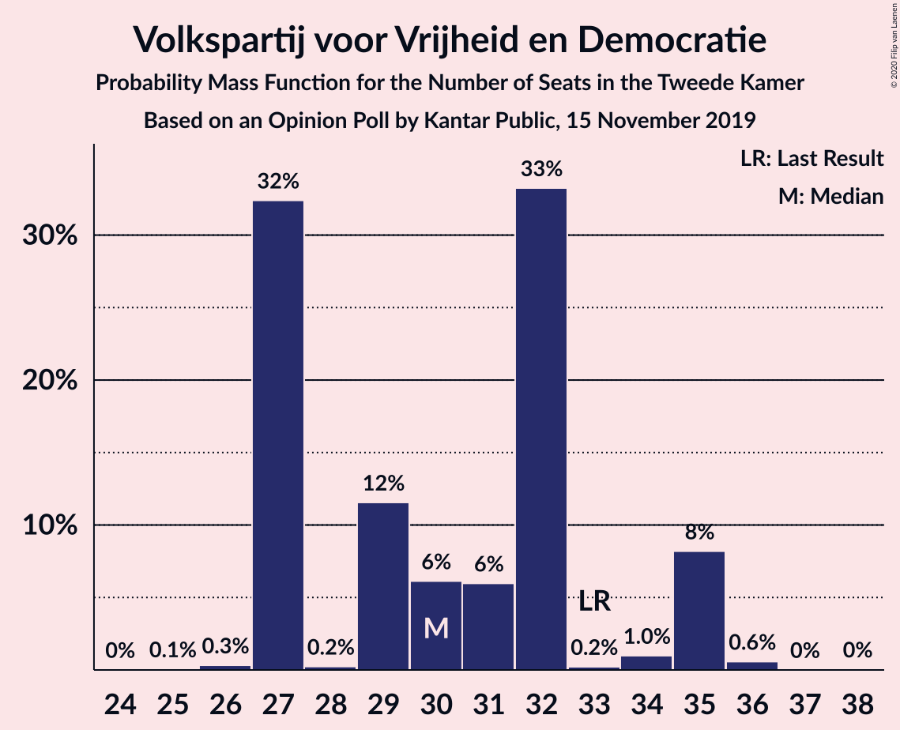
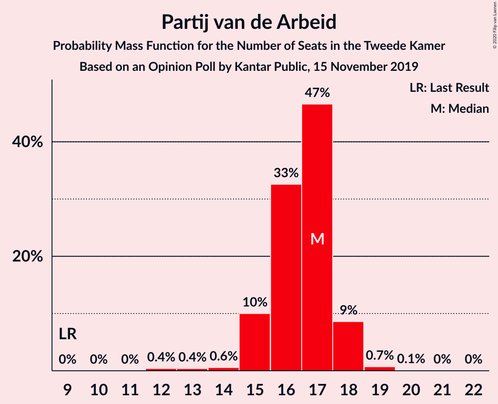
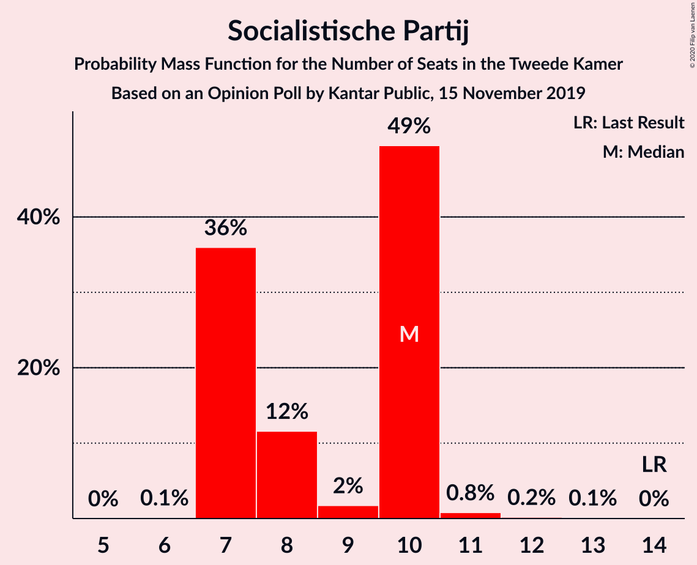
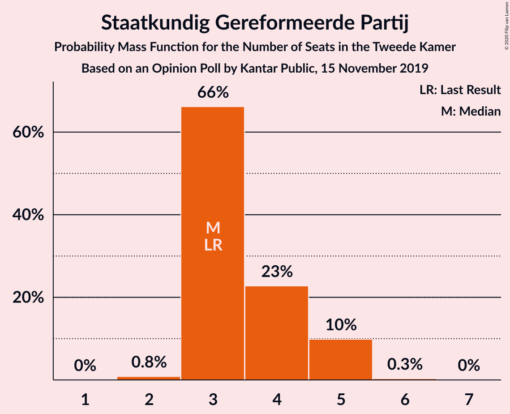
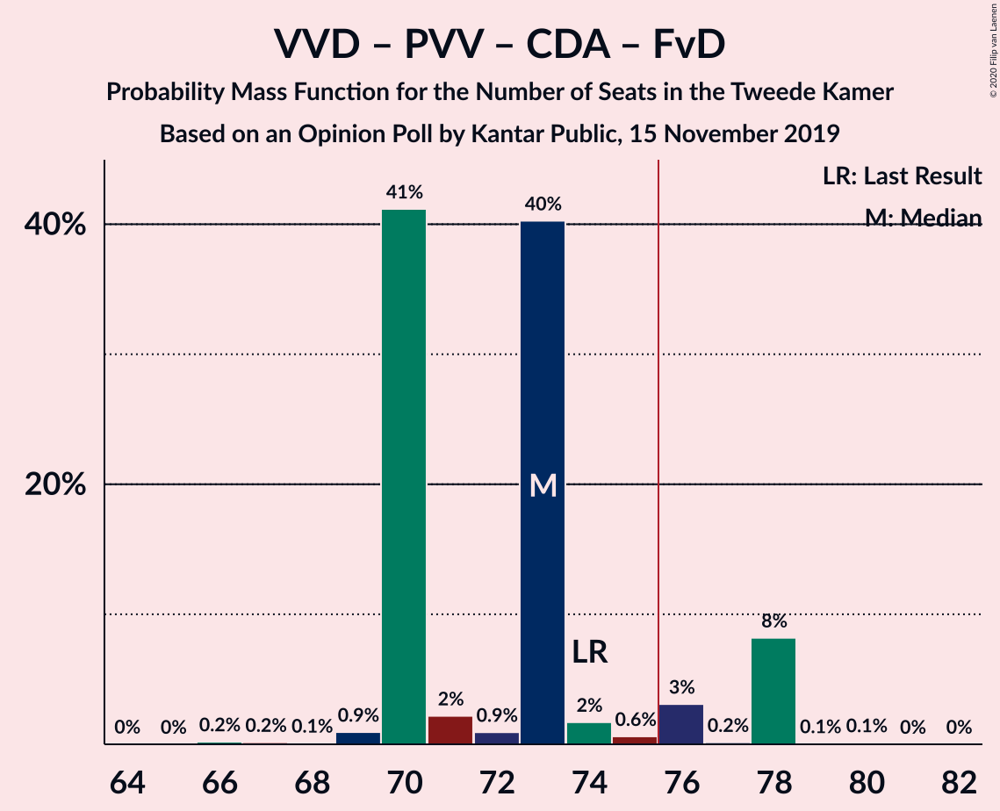
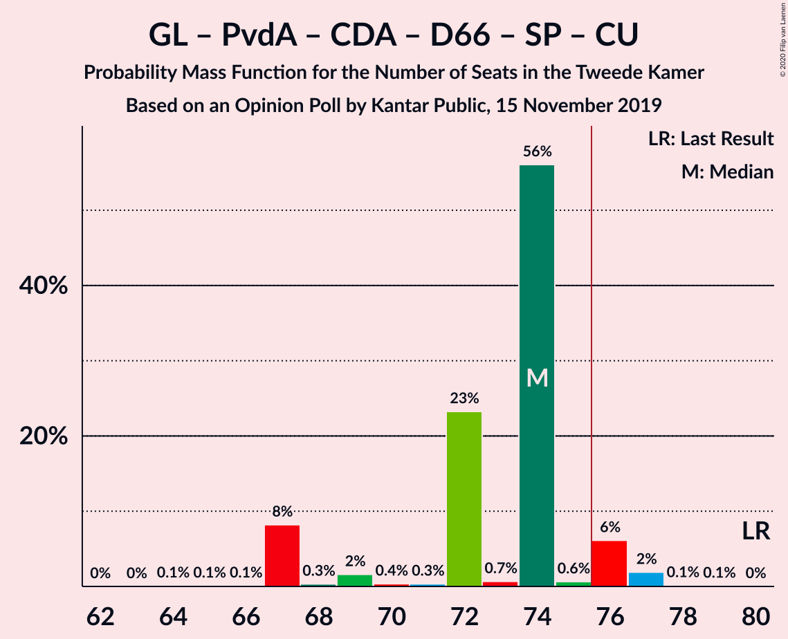
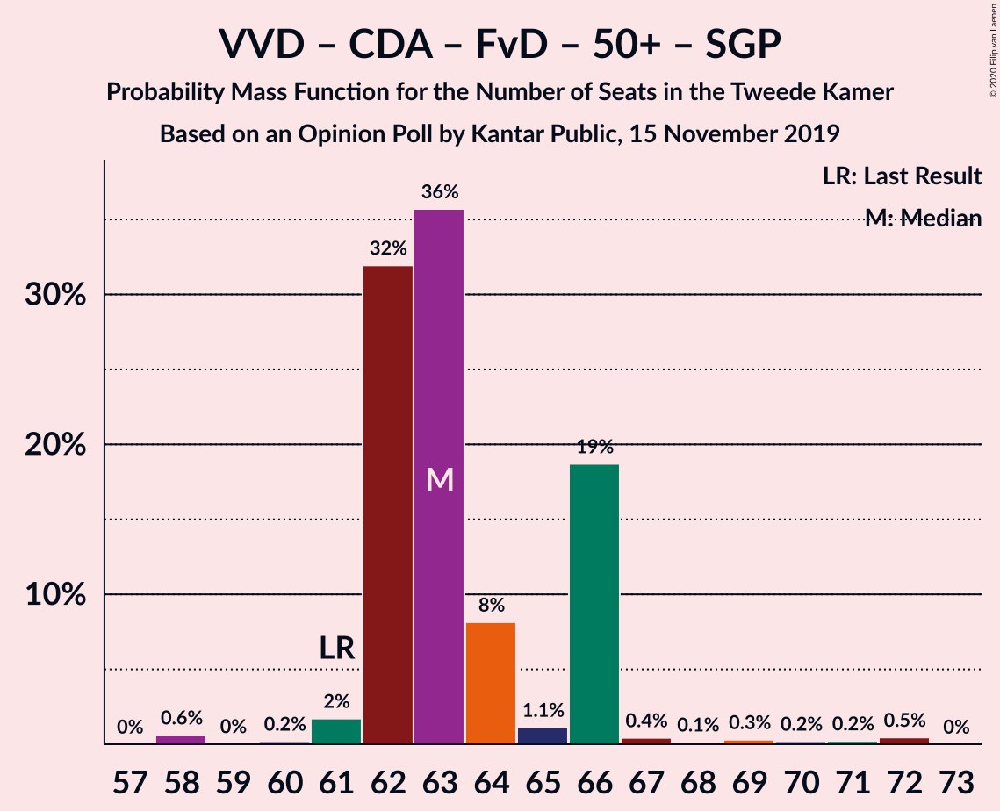
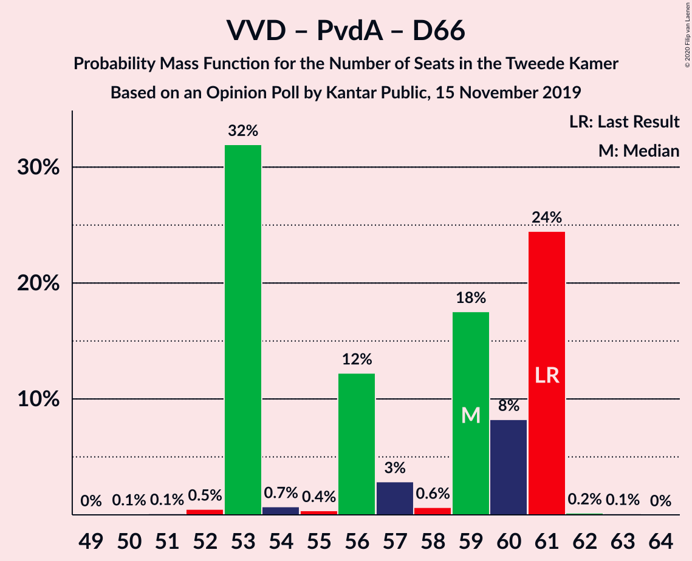

# Opinion Poll by Kantar Public, 15 November 2019

<a href="#voting-intentions">Voting Intentions</a> | <a href="#seats">Seats</a> | <a href="#coalitions">Coalitions</a> | <a href="#technical-information">Technical Information</a>

## Voting Intentions

### Confidence Intervals

| Party | Last Result | Poll Result | 80% Confidence Interval | 90% Confidence Interval | 95% Confidence Interval | 99% Confidence Interval |
|:-----:|:-----------:|:-----------:|:-----------------------:|:-----------------------:|:-----------------------:|:-----------------------:|
| Volkspartij voor Vrijheid en Democratie | 21.3% | 20.0% | 18.4–21.8% |18.0–22.3% |17.6–22.7% |16.9–23.6% |
| Partij voor de Vrijheid | 13.1% | 12.0% | 10.7–13.4% |10.3–13.8% |10.0–14.2% |9.5–14.9% |
| GroenLinks | 9.1% | 11.3% | 10.1–12.8% |9.8–13.2% |9.5–13.5% |8.9–14.2% |
| Partij van de Arbeid | 5.7% | 10.7% | 9.5–12.1% |9.2–12.5% |8.9–12.8% |8.4–13.5% |
| Christen-Democratisch Appèl | 12.4% | 8.0% | 7.0–9.2% |6.7–9.6% |6.4–9.9% |6.0–10.5% |
| Forum voor Democratie | 1.8% | 8.0% | 7.0–9.2% |6.7–9.6% |6.4–9.9% |6.0–10.5% |
| Democraten 66 | 12.2% | 6.7% | 5.8–7.9% |5.5–8.2% |5.3–8.5% |4.9–9.1% |
| Socialistische Partij | 9.1% | 6.0% | 5.1–7.1% |4.8–7.4% |4.6–7.7% |4.3–8.2% |
| ChristenUnie | 3.4% | 5.4% | 4.5–6.4% |4.3–6.7% |4.1–7.0% |3.7–7.5% |
| Partij voor de Dieren | 3.2% | 4.6% | 3.9–5.6% |3.6–5.9% |3.5–6.1% |3.1–6.7% |
| 50Plus | 3.1% | 4.0% | 3.3–4.9% |3.1–5.2% |2.9–5.4% |2.6–5.9% |
| Staatkundig Gereformeerde Partij | 2.1% | 2.6% | 2.1–3.4% |1.9–3.6% |1.8–3.9% |1.5–4.3% |
| DENK | 2.1% | 0.6% | 0.4–1.1% |0.3–1.2% |0.3–1.4% |0.2–1.6% |

*Note:* The poll result column reflects the actual value used in the calculations. Published results may vary slightly, and in addition be rounded to fewer digits.

## Seats

### Confidence Intervals

| Party | Last Result | Median | 80% Confidence Interval | 90% Confidence Interval | 95% Confidence Interval | 99% Confidence Interval |
|:-----:|:-----------:|:------:|:-----------------------:|:-----------------------:|:-----------------------:|:-----------------------:|
| <a href="#volkspartij-voor-vrijheid-en-democratie">Volkspartij voor Vrijheid en Democratie</a> | 33 | 30 | 27–33 |27–35 |27–35 |27–36 |
| <a href="#partij-voor-de-vrijheid">Partij voor de Vrijheid</a> | 20 | 19 | 17–20 |16–20 |16–20 |15–22 |
| <a href="#groenlinks">GroenLinks</a> | 14 | 17 | 16–19 |16–19 |16–19 |14–22 |
| <a href="#partij-van-de-arbeid">Partij van de Arbeid</a> | 9 | 17 | 15–17 |15–18 |15–18 |13–19 |
| <a href="#christen-democratisch-appèl">Christen-Democratisch Appèl</a> | 19 | 12 | 10–14 |10–14 |10–14 |9–14 |
| <a href="#forum-voor-democratie">Forum voor Democratie</a> | 2 | 12 | 10–13 |10–13 |10–13 |9–15 |
| <a href="#democraten-66">Democraten 66</a> | 19 | 10 | 10–12 |10–12 |9–12 |7–12 |
| <a href="#socialistische-partij">Socialistische Partij</a> | 14 | 10 | 7–10 |7–10 |7–10 |7–11 |
| <a href="#christenunie">ChristenUnie</a> | 5 | 7 | 7–9 |6–9 |6–9 |6–11 |
| <a href="#partij-voor-de-dieren">Partij voor de Dieren</a> | 5 | 7 | 5–8 |4–8 |4–8 |4–11 |
| <a href="#50plus">50Plus</a> | 4 | 6 | 5–8 |4–8 |4–8 |4–8 |
| <a href="#staatkundig-gereformeerde-partij">Staatkundig Gereformeerde Partij</a> | 3 | 3 | 3–5 |3–5 |3–5 |2–5 |
| <a href="#denk">DENK</a> | 3 | 0 | 0–1 |0–1 |0–1 |0–2 |

### Volkspartij voor Vrijheid en Democratie

*For a full overview of the results for this party, see the [Volkspartij voor Vrijheid en Democratie](party-volkspartijvoorvrijheidendemocratie.html) page.*

| Number of Seats | Probability | Accumulated | Special Marks |
|:---------------:|:-----------:|:-----------:|:-------------:|
| 25 | 0.1% | 100% |  |
| 26 | 0.3% | 99.9% |  |
| 27 | 32% | 99.6% |  |
| 28 | 0.2% | 67% |  |
| 29 | 12% | 67% |  |
| 30 | 6% | 55% | Median |
| 31 | 6% | 49% |  |
| 32 | 33% | 43% |  |
| 33 | 0.2% | 10% | Last Result |
| 34 | 1.0% | 10% |  |
| 35 | 8% | 9% |  |
| 36 | 0.6% | 0.6% |  |
| 37 | 0% | 0.1% |  |
| 38 | 0% | 0% |  |

### Partij voor de Vrijheid

*For a full overview of the results for this party, see the [Partij voor de Vrijheid](party-partijvoordevrijheid.html) page.*

| Number of Seats | Probability | Accumulated | Special Marks |
|:---------------:|:-----------:|:-----------:|:-------------:|
| 14 | 0.1% | 100% |  |
| 15 | 1.0% | 99.9% |  |
| 16 | 6% | 98.9% |  |
| 17 | 28% | 93% |  |
| 18 | 9% | 65% |  |
| 19 | 46% | 56% | Median |
| 20 | 8% | 10% | Last Result |
| 21 | 1.4% | 2% |  |
| 22 | 0.7% | 0.7% |  |
| 23 | 0% | 0.1% |  |
| 24 | 0% | 0% |  |

### GroenLinks

*For a full overview of the results for this party, see the [GroenLinks](party-groenlinks.html) page.*

| Number of Seats | Probability | Accumulated | Special Marks |
|:---------------:|:-----------:|:-----------:|:-------------:|
| 13 | 0.2% | 100% |  |
| 14 | 0.4% | 99.8% | Last Result |
| 15 | 1.4% | 99.4% |  |
| 16 | 14% | 98% |  |
| 17 | 41% | 84% | Median |
| 18 | 10% | 43% |  |
| 19 | 31% | 33% |  |
| 20 | 0.3% | 2% |  |
| 21 | 0.2% | 2% |  |
| 22 | 2% | 2% |  |
| 23 | 0% | 0% |  |

### Partij van de Arbeid

*For a full overview of the results for this party, see the [Partij van de Arbeid](party-partijvandearbeid.html) page.*

| Number of Seats | Probability | Accumulated | Special Marks |
|:---------------:|:-----------:|:-----------:|:-------------:|
| 9 | 0% | 100% | Last Result |
| 10 | 0% | 100% |  |
| 11 | 0% | 100% |  |
| 12 | 0.4% | 100% |  |
| 13 | 0.4% | 99.6% |  |
| 14 | 0.6% | 99.2% |  |
| 15 | 10% | 98.6% |  |
| 16 | 33% | 89% |  |
| 17 | 47% | 56% | Median |
| 18 | 9% | 9% |  |
| 19 | 0.7% | 0.9% |  |
| 20 | 0.1% | 0.2% |  |
| 21 | 0% | 0.1% |  |
| 22 | 0% | 0% |  |

### Christen-Democratisch Appèl

*For a full overview of the results for this party, see the [Christen-Democratisch Appèl](party-christen-democratischappèl.html) page.*

| Number of Seats | Probability | Accumulated | Special Marks |
|:---------------:|:-----------:|:-----------:|:-------------:|
| 8 | 0.1% | 100% |  |
| 9 | 0.7% | 99.9% |  |
| 10 | 34% | 99.2% |  |
| 11 | 14% | 65% |  |
| 12 | 12% | 51% | Median |
| 13 | 1.4% | 39% |  |
| 14 | 37% | 37% |  |
| 15 | 0.3% | 0.4% |  |
| 16 | 0.1% | 0.1% |  |
| 17 | 0% | 0% |  |
| 18 | 0% | 0% |  |
| 19 | 0% | 0% | Last Result |

### Forum voor Democratie

*For a full overview of the results for this party, see the [Forum voor Democratie](party-forumvoordemocratie.html) page.*

| Number of Seats | Probability | Accumulated | Special Marks |
|:---------------:|:-----------:|:-----------:|:-------------:|
| 2 | 0% | 100% | Last Result |
| 3 | 0% | 100% |  |
| 4 | 0% | 100% |  |
| 5 | 0% | 100% |  |
| 6 | 0% | 100% |  |
| 7 | 0% | 100% |  |
| 8 | 0% | 100% |  |
| 9 | 1.1% | 100% |  |
| 10 | 14% | 98.9% |  |
| 11 | 25% | 85% |  |
| 12 | 14% | 60% | Median |
| 13 | 44% | 46% |  |
| 14 | 1.0% | 2% |  |
| 15 | 0.7% | 0.8% |  |
| 16 | 0% | 0.1% |  |
| 17 | 0% | 0% |  |

### Democraten 66

*For a full overview of the results for this party, see the [Democraten 66](party-democraten66.html) page.*

| Number of Seats | Probability | Accumulated | Special Marks |
|:---------------:|:-----------:|:-----------:|:-------------:|
| 6 | 0.2% | 100% |  |
| 7 | 0.6% | 99.8% |  |
| 8 | 1.1% | 99.2% |  |
| 9 | 0.8% | 98% |  |
| 10 | 68% | 97% | Median |
| 11 | 4% | 29% |  |
| 12 | 25% | 25% |  |
| 13 | 0.4% | 0.5% |  |
| 14 | 0.1% | 0.1% |  |
| 15 | 0% | 0% |  |
| 16 | 0% | 0% |  |
| 17 | 0% | 0% |  |
| 18 | 0% | 0% |  |
| 19 | 0% | 0% | Last Result |

### Socialistische Partij

*For a full overview of the results for this party, see the [Socialistische Partij](party-socialistischepartij.html) page.*

| Number of Seats | Probability | Accumulated | Special Marks |
|:---------------:|:-----------:|:-----------:|:-------------:|
| 6 | 0.1% | 100% |  |
| 7 | 36% | 99.9% |  |
| 8 | 12% | 64% |  |
| 9 | 2% | 52% |  |
| 10 | 49% | 51% | Median |
| 11 | 0.8% | 1.1% |  |
| 12 | 0.2% | 0.3% |  |
| 13 | 0.1% | 0.1% |  |
| 14 | 0% | 0% | Last Result |

### ChristenUnie

*For a full overview of the results for this party, see the [ChristenUnie](party-christenunie.html) page.*

| Number of Seats | Probability | Accumulated | Special Marks |
|:---------------:|:-----------:|:-----------:|:-------------:|
| 5 | 0% | 100% | Last Result |
| 6 | 6% | 100% |  |
| 7 | 52% | 94% | Median |
| 8 | 6% | 43% |  |
| 9 | 35% | 36% |  |
| 10 | 0.5% | 2% |  |
| 11 | 0.9% | 1.0% |  |
| 12 | 0.1% | 0.1% |  |
| 13 | 0% | 0% |  |

### Partij voor de Dieren

*For a full overview of the results for this party, see the [Partij voor de Dieren](party-partijvoordedieren.html) page.*

| Number of Seats | Probability | Accumulated | Special Marks |
|:---------------:|:-----------:|:-----------:|:-------------:|
| 4 | 9% | 100% |  |
| 5 | 6% | 91% | Last Result |
| 6 | 28% | 85% |  |
| 7 | 12% | 57% | Median |
| 8 | 44% | 45% |  |
| 9 | 0.7% | 1.4% |  |
| 10 | 0.2% | 0.7% |  |
| 11 | 0.5% | 0.5% |  |
| 12 | 0% | 0% |  |

### 50Plus

*For a full overview of the results for this party, see the [50Plus](party-50plus.html) page.*

| Number of Seats | Probability | Accumulated | Special Marks |
|:---------------:|:-----------:|:-----------:|:-------------:|
| 4 | 8% | 100% | Last Result |
| 5 | 37% | 92% |  |
| 6 | 10% | 54% | Median |
| 7 | 33% | 44% |  |
| 8 | 11% | 12% |  |
| 9 | 0.1% | 0.2% |  |
| 10 | 0% | 0% |  |

### Staatkundig Gereformeerde Partij

*For a full overview of the results for this party, see the [Staatkundig Gereformeerde Partij](party-staatkundiggereformeerdepartij.html) page.*

| Number of Seats | Probability | Accumulated | Special Marks |
|:---------------:|:-----------:|:-----------:|:-------------:|
| 2 | 0.8% | 100% |  |
| 3 | 66% | 99.2% | Last Result, Median |
| 4 | 23% | 33% |  |
| 5 | 10% | 10% |  |
| 6 | 0.3% | 0.4% |  |
| 7 | 0% | 0% |  |

### DENK

*For a full overview of the results for this party, see the [DENK](party-denk.html) page.*

| Number of Seats | Probability | Accumulated | Special Marks |
|:---------------:|:-----------:|:-----------:|:-------------:|
| 0 | 56% | 100% | Median |
| 1 | 43% | 44% |  |
| 2 | 1.4% | 1.4% |  |
| 3 | 0% | 0% | Last Result |

## Coalitions

### Confidence Intervals

| Coalition | Last Result | Median | Majority? | 80% Confidence Interval | 90% Confidence Interval | 95% Confidence Interval | 99% Confidence Interval |
|:---------:|:-----------:|:------:|:---------:|:-----------------------:|:-----------------------:|:-----------------------:|:-----------------------:|
| Volkspartij voor Vrijheid en Democratie – GroenLinks – Christen-Democratisch Appèl – Democraten 66 – ChristenUnie | 90 | 78 | 56% | 74–82 | 74–82 | 74–82 | 72–83 |
| Volkspartij voor Vrijheid en Democratie – Partij voor de Vrijheid – Christen-Democratisch Appèl – Forum voor Democratie – Staatkundig Gereformeerde Partij | 77 | 76 | 55% | 73–80 | 73–82 | 73–82 | 72–82 |
| Volkspartij voor Vrijheid en Democratie – Partij van de Arbeid – Christen-Democratisch Appèl – Democraten 66 – ChristenUnie | 85 | 78 | 54% | 74–80 | 74–80 | 74–80 | 71–80 |
| Volkspartij voor Vrijheid en Democratie – Partij voor de Vrijheid – Christen-Democratisch Appèl – Forum voor Democratie | 74 | 73 | 12% | 70–76 | 70–78 | 70–78 | 68–78 |
| GroenLinks – Partij van de Arbeid – Christen-Democratisch Appèl – Democraten 66 – Socialistische Partij – ChristenUnie | 80 | 74 | 8% | 69–74 | 67–76 | 67–76 | 67–77 |
| GroenLinks – Partij van de Arbeid – Christen-Democratisch Appèl – Democraten 66 – ChristenUnie | 66 | 64 | 0% | 60–67 | 60–67 | 60–69 | 58–69 |
| Volkspartij voor Vrijheid en Democratie – Christen-Democratisch Appèl – Forum voor Democratie – 50Plus – Staatkundig Gereformeerde Partij | 61 | 63 | 0% | 62–66 | 62–66 | 61–66 | 58–71 |
| Volkspartij voor Vrijheid en Democratie – Partij voor de Vrijheid – Christen-Democratisch Appèl | 72 | 60 | 0% | 59–63 | 58–66 | 58–66 | 55–66 |
| Volkspartij voor Vrijheid en Democratie – Christen-Democratisch Appèl – Democraten 66 – ChristenUnie | 76 | 60 | 0% | 58–63 | 58–63 | 58–63 | 56–65 |
| Volkspartij voor Vrijheid en Democratie – Christen-Democratisch Appèl – Forum voor Democratie – 50Plus | 58 | 60 | 0% | 59–62 | 59–62 | 58–62 | 56–68 |
| Volkspartij voor Vrijheid en Democratie – Partij van de Arbeid – Christen-Democratisch Appèl | 61 | 59 | 0% | 57–61 | 57–61 | 57–62 | 53–64 |
| Volkspartij voor Vrijheid en Democratie – Christen-Democratisch Appèl – Forum voor Democratie – Staatkundig Gereformeerde Partij | 57 | 57 | 0% | 55–61 | 55–62 | 55–62 | 53–65 |
| Volkspartij voor Vrijheid en Democratie – Partij van de Arbeid – Democraten 66 | 61 | 59 | 0% | 53–61 | 53–61 | 53–61 | 52–61 |
| Volkspartij voor Vrijheid en Democratie – Christen-Democratisch Appèl – Forum voor Democratie | 54 | 54 | 0% | 51–57 | 51–58 | 51–58 | 51–61 |
| Volkspartij voor Vrijheid en Democratie – Christen-Democratisch Appèl – Democraten 66 | 71 | 52 | 0% | 51–55 | 51–56 | 50–56 | 48–57 |
| Volkspartij voor Vrijheid en Democratie – Partij van de Arbeid | 42 | 48 | 0% | 43–49 | 43–50 | 43–50 | 42–51 |
| Volkspartij voor Vrijheid en Democratie – Christen-Democratisch Appèl | 52 | 42 | 0% | 41–44 | 41–46 | 41–46 | 38–48 |
| Partij van de Arbeid – Christen-Democratisch Appèl – Democraten 66 | 47 | 39 | 0% | 36–40 | 36–41 | 35–43 | 33–43 |
| Partij van de Arbeid – Christen-Democratisch Appèl – ChristenUnie | 33 | 36 | 0% | 33–37 | 33–37 | 33–38 | 31–42 |
| Partij van de Arbeid – Christen-Democratisch Appèl | 28 | 29 | 0% | 26–30 | 26–31 | 25–32 | 24–33 |
| Christen-Democratisch Appèl – Democraten 66 | 38 | 22 | 0% | 20–24 | 20–24 | 20–25 | 18–25 |

### Volkspartij voor Vrijheid en Democratie – GroenLinks – Christen-Democratisch Appèl – Democraten 66 – ChristenUnie

| Number of Seats | Probability | Accumulated | Special Marks |
|:---------------:|:-----------:|:-----------:|:-------------:|
| 70 | 0% | 100% |  |
| 71 | 0.2% | 99.9% |  |
| 72 | 0.3% | 99.7% |  |
| 73 | 0.2% | 99.4% |  |
| 74 | 11% | 99.2% |  |
| 75 | 32% | 88% |  |
| 76 | 0.2% | 56% | Median, Majority |
| 77 | 4% | 56% |  |
| 78 | 2% | 51% |  |
| 79 | 15% | 50% |  |
| 80 | 8% | 35% |  |
| 81 | 0.3% | 27% |  |
| 82 | 26% | 27% |  |
| 83 | 0.1% | 0.6% |  |
| 84 | 0.4% | 0.4% |  |
| 85 | 0% | 0% |  |
| 86 | 0% | 0% |  |
| 87 | 0% | 0% |  |
| 88 | 0% | 0% |  |
| 89 | 0% | 0% |  |
| 90 | 0% | 0% | Last Result |

### Volkspartij voor Vrijheid en Democratie – Partij voor de Vrijheid – Christen-Democratisch Appèl – Forum voor Democratie – Staatkundig Gereformeerde Partij

| Number of Seats | Probability | Accumulated | Special Marks |
|:---------------:|:-----------:|:-----------:|:-------------:|
| 68 | 0.1% | 100% |  |
| 69 | 0.1% | 99.9% |  |
| 70 | 0% | 99.8% |  |
| 71 | 0.2% | 99.8% |  |
| 72 | 0.2% | 99.7% |  |
| 73 | 30% | 99.5% |  |
| 74 | 14% | 69% |  |
| 75 | 0.4% | 55% |  |
| 76 | 32% | 55% | Median, Majority |
| 77 | 2% | 23% | Last Result |
| 78 | 9% | 21% |  |
| 79 | 0.5% | 12% |  |
| 80 | 3% | 12% |  |
| 81 | 1.0% | 9% |  |
| 82 | 8% | 8% |  |
| 83 | 0% | 0.2% |  |
| 84 | 0.1% | 0.1% |  |
| 85 | 0% | 0% |  |

### Volkspartij voor Vrijheid en Democratie – Partij van de Arbeid – Christen-Democratisch Appèl – Democraten 66 – ChristenUnie

| Number of Seats | Probability | Accumulated | Special Marks |
|:---------------:|:-----------:|:-----------:|:-------------:|
| 70 | 0.1% | 100% |  |
| 71 | 0.6% | 99.8% |  |
| 72 | 0.2% | 99.2% |  |
| 73 | 0.7% | 99.0% |  |
| 74 | 32% | 98% |  |
| 75 | 12% | 66% |  |
| 76 | 0.3% | 54% | Median, Majority |
| 77 | 2% | 54% |  |
| 78 | 22% | 52% |  |
| 79 | 5% | 30% |  |
| 80 | 25% | 25% |  |
| 81 | 0.1% | 0.4% |  |
| 82 | 0.1% | 0.3% |  |
| 83 | 0.2% | 0.2% |  |
| 84 | 0% | 0% |  |
| 85 | 0% | 0% | Last Result |

### Volkspartij voor Vrijheid en Democratie – Partij voor de Vrijheid – Christen-Democratisch Appèl – Forum voor Democratie

| Number of Seats | Probability | Accumulated | Special Marks |
|:---------------:|:-----------:|:-----------:|:-------------:|
| 64 | 0% | 100% |  |
| 65 | 0% | 99.9% |  |
| 66 | 0.2% | 99.9% |  |
| 67 | 0.2% | 99.7% |  |
| 68 | 0.1% | 99.6% |  |
| 69 | 0.9% | 99.5% |  |
| 70 | 41% | 98.5% |  |
| 71 | 2% | 57% |  |
| 72 | 0.9% | 55% |  |
| 73 | 40% | 54% | Median |
| 74 | 2% | 14% | Last Result |
| 75 | 0.6% | 12% |  |
| 76 | 3% | 12% | Majority |
| 77 | 0.2% | 9% |  |
| 78 | 8% | 8% |  |
| 79 | 0.1% | 0.2% |  |
| 80 | 0.1% | 0.2% |  |
| 81 | 0% | 0% |  |

### GroenLinks – Partij van de Arbeid – Christen-Democratisch Appèl – Democraten 66 – Socialistische Partij – ChristenUnie

| Number of Seats | Probability | Accumulated | Special Marks |
|:---------------:|:-----------:|:-----------:|:-------------:|
| 64 | 0.1% | 100% |  |
| 65 | 0.1% | 99.9% |  |
| 66 | 0.1% | 99.8% |  |
| 67 | 8% | 99.7% |  |
| 68 | 0.3% | 92% |  |
| 69 | 2% | 91% |  |
| 70 | 0.4% | 90% |  |
| 71 | 0.3% | 89% |  |
| 72 | 23% | 89% |  |
| 73 | 0.7% | 66% | Median |
| 74 | 56% | 65% |  |
| 75 | 0.6% | 9% |  |
| 76 | 6% | 8% | Majority |
| 77 | 2% | 2% |  |
| 78 | 0.1% | 0.2% |  |
| 79 | 0.1% | 0.1% |  |
| 80 | 0% | 0% | Last Result |

### GroenLinks – Partij van de Arbeid – Christen-Democratisch Appèl – Democraten 66 – ChristenUnie

| Number of Seats | Probability | Accumulated | Special Marks |
|:---------------:|:-----------:|:-----------:|:-------------:|
| 56 | 0.2% | 100% |  |
| 57 | 0.2% | 99.8% |  |
| 58 | 0.2% | 99.6% |  |
| 59 | 1.3% | 99.4% |  |
| 60 | 9% | 98% |  |
| 61 | 0.6% | 90% |  |
| 62 | 11% | 89% |  |
| 63 | 1.1% | 78% | Median |
| 64 | 40% | 77% |  |
| 65 | 4% | 36% |  |
| 66 | 6% | 33% | Last Result |
| 67 | 24% | 27% |  |
| 68 | 0.1% | 3% |  |
| 69 | 3% | 3% |  |
| 70 | 0% | 0.1% |  |
| 71 | 0% | 0.1% |  |
| 72 | 0% | 0% |  |

### Volkspartij voor Vrijheid en Democratie – Christen-Democratisch Appèl – Forum voor Democratie – 50Plus – Staatkundig Gereformeerde Partij

| Number of Seats | Probability | Accumulated | Special Marks |
|:---------------:|:-----------:|:-----------:|:-------------:|
| 58 | 0.6% | 100% |  |
| 59 | 0% | 99.3% |  |
| 60 | 0.2% | 99.3% |  |
| 61 | 2% | 99.1% | Last Result |
| 62 | 32% | 97% |  |
| 63 | 36% | 65% | Median |
| 64 | 8% | 30% |  |
| 65 | 1.1% | 22% |  |
| 66 | 19% | 20% |  |
| 67 | 0.4% | 2% |  |
| 68 | 0.1% | 1.3% |  |
| 69 | 0.3% | 1.2% |  |
| 70 | 0.2% | 0.9% |  |
| 71 | 0.2% | 0.7% |  |
| 72 | 0.5% | 0.5% |  |
| 73 | 0% | 0% |  |

### Volkspartij voor Vrijheid en Democratie – Partij voor de Vrijheid – Christen-Democratisch Appèl

| Number of Seats | Probability | Accumulated | Special Marks |
|:---------------:|:-----------:|:-----------:|:-------------:|
| 53 | 0.1% | 100% |  |
| 54 | 0% | 99.9% |  |
| 55 | 0.7% | 99.9% |  |
| 56 | 0.8% | 99.2% |  |
| 57 | 0.2% | 98% |  |
| 58 | 6% | 98% |  |
| 59 | 25% | 93% |  |
| 60 | 51% | 68% |  |
| 61 | 3% | 17% | Median |
| 62 | 1.1% | 14% |  |
| 63 | 4% | 13% |  |
| 64 | 0.9% | 10% |  |
| 65 | 0.7% | 9% |  |
| 66 | 8% | 8% |  |
| 67 | 0.1% | 0.2% |  |
| 68 | 0% | 0.1% |  |
| 69 | 0% | 0.1% |  |
| 70 | 0.1% | 0.1% |  |
| 71 | 0% | 0% |  |
| 72 | 0% | 0% | Last Result |

### Volkspartij voor Vrijheid en Democratie – Christen-Democratisch Appèl – Democraten 66 – ChristenUnie

| Number of Seats | Probability | Accumulated | Special Marks |
|:---------------:|:-----------:|:-----------:|:-------------:|
| 53 | 0% | 100% |  |
| 54 | 0.2% | 99.9% |  |
| 55 | 0.2% | 99.7% |  |
| 56 | 0.6% | 99.5% |  |
| 57 | 0.4% | 99.0% |  |
| 58 | 43% | 98.6% |  |
| 59 | 0.6% | 56% | Median |
| 60 | 9% | 55% |  |
| 61 | 12% | 47% |  |
| 62 | 0.9% | 35% |  |
| 63 | 32% | 34% |  |
| 64 | 1.1% | 2% |  |
| 65 | 0.3% | 0.7% |  |
| 66 | 0.3% | 0.4% |  |
| 67 | 0% | 0.1% |  |
| 68 | 0.1% | 0.1% |  |
| 69 | 0% | 0% |  |
| 70 | 0% | 0% |  |
| 71 | 0% | 0% |  |
| 72 | 0% | 0% |  |
| 73 | 0% | 0% |  |
| 74 | 0% | 0% |  |
| 75 | 0% | 0% |  |
| 76 | 0% | 0% | Last Result, Majority |

### Volkspartij voor Vrijheid en Democratie – Christen-Democratisch Appèl – Forum voor Democratie – 50Plus

| Number of Seats | Probability | Accumulated | Special Marks |
|:---------------:|:-----------:|:-----------:|:-------------:|
| 54 | 0% | 100% |  |
| 55 | 0.1% | 99.9% |  |
| 56 | 0.9% | 99.8% |  |
| 57 | 0.2% | 98.9% |  |
| 58 | 1.5% | 98.7% | Last Result |
| 59 | 44% | 97% |  |
| 60 | 25% | 53% | Median |
| 61 | 15% | 28% |  |
| 62 | 12% | 13% |  |
| 63 | 0.2% | 1.5% |  |
| 64 | 0.3% | 1.3% |  |
| 65 | 0.1% | 1.0% |  |
| 66 | 0.2% | 0.9% |  |
| 67 | 0% | 0.7% |  |
| 68 | 0.2% | 0.7% |  |
| 69 | 0.5% | 0.5% |  |
| 70 | 0% | 0% |  |

### Volkspartij voor Vrijheid en Democratie – Partij van de Arbeid – Christen-Democratisch Appèl

| Number of Seats | Probability | Accumulated | Special Marks |
|:---------------:|:-----------:|:-----------:|:-------------:|
| 51 | 0.1% | 100% |  |
| 52 | 0% | 99.9% |  |
| 53 | 0.6% | 99.9% |  |
| 54 | 0.2% | 99.3% |  |
| 55 | 0.4% | 99.1% |  |
| 56 | 0.7% | 98.8% |  |
| 57 | 32% | 98% |  |
| 58 | 12% | 66% |  |
| 59 | 34% | 54% | Median |
| 60 | 7% | 20% |  |
| 61 | 10% | 14% | Last Result |
| 62 | 3% | 4% |  |
| 63 | 0.1% | 0.9% |  |
| 64 | 0.6% | 0.8% |  |
| 65 | 0.1% | 0.2% |  |
| 66 | 0% | 0.1% |  |
| 67 | 0% | 0.1% |  |
| 68 | 0% | 0% |  |

### Volkspartij voor Vrijheid en Democratie – Christen-Democratisch Appèl – Forum voor Democratie – Staatkundig Gereformeerde Partij

| Number of Seats | Probability | Accumulated | Special Marks |
|:---------------:|:-----------:|:-----------:|:-------------:|
| 52 | 0.1% | 100% |  |
| 53 | 0.8% | 99.8% |  |
| 54 | 0.1% | 99.1% |  |
| 55 | 12% | 99.0% |  |
| 56 | 26% | 87% |  |
| 57 | 39% | 61% | Last Result, Median |
| 58 | 0.5% | 23% |  |
| 59 | 0.8% | 22% |  |
| 60 | 10% | 22% |  |
| 61 | 3% | 12% |  |
| 62 | 8% | 9% |  |
| 63 | 0.3% | 1.1% |  |
| 64 | 0.2% | 0.7% |  |
| 65 | 0.5% | 0.5% |  |
| 66 | 0% | 0% |  |

### Volkspartij voor Vrijheid en Democratie – Partij van de Arbeid – Democraten 66

| Number of Seats | Probability | Accumulated | Special Marks |
|:---------------:|:-----------:|:-----------:|:-------------:|
| 50 | 0.1% | 100% |  |
| 51 | 0.1% | 99.9% |  |
| 52 | 0.5% | 99.8% |  |
| 53 | 32% | 99.3% |  |
| 54 | 0.7% | 67% |  |
| 55 | 0.4% | 67% |  |
| 56 | 12% | 66% |  |
| 57 | 3% | 54% | Median |
| 58 | 0.6% | 51% |  |
| 59 | 18% | 51% |  |
| 60 | 8% | 33% |  |
| 61 | 24% | 25% | Last Result |
| 62 | 0.2% | 0.3% |  |
| 63 | 0.1% | 0.1% |  |
| 64 | 0% | 0% |  |

### Volkspartij voor Vrijheid en Democratie – Christen-Democratisch Appèl – Forum voor Democratie

| Number of Seats | Probability | Accumulated | Special Marks |
|:---------------:|:-----------:|:-----------:|:-------------:|
| 48 | 0.1% | 100% |  |
| 49 | 0.2% | 99.8% |  |
| 50 | 0.1% | 99.6% |  |
| 51 | 12% | 99.5% |  |
| 52 | 2% | 88% |  |
| 53 | 25% | 86% |  |
| 54 | 39% | 61% | Last Result, Median |
| 55 | 8% | 22% |  |
| 56 | 0.5% | 13% |  |
| 57 | 4% | 13% |  |
| 58 | 8% | 9% |  |
| 59 | 0.2% | 0.9% |  |
| 60 | 0% | 0.8% |  |
| 61 | 0.2% | 0.7% |  |
| 62 | 0.5% | 0.5% |  |
| 63 | 0% | 0% |  |

### Volkspartij voor Vrijheid en Democratie – Christen-Democratisch Appèl – Democraten 66

| Number of Seats | Probability | Accumulated | Special Marks |
|:---------------:|:-----------:|:-----------:|:-------------:|
| 45 | 0% | 100% |  |
| 46 | 0.1% | 99.9% |  |
| 47 | 0.3% | 99.8% |  |
| 48 | 0.1% | 99.5% |  |
| 49 | 0.8% | 99.4% |  |
| 50 | 1.1% | 98.6% |  |
| 51 | 44% | 97% |  |
| 52 | 14% | 54% | Median |
| 53 | 0.1% | 40% |  |
| 54 | 28% | 40% |  |
| 55 | 3% | 12% |  |
| 56 | 8% | 9% |  |
| 57 | 0.5% | 0.8% |  |
| 58 | 0.2% | 0.3% |  |
| 59 | 0.1% | 0.1% |  |
| 60 | 0% | 0% |  |
| 61 | 0% | 0% |  |
| 62 | 0% | 0% |  |
| 63 | 0% | 0% |  |
| 64 | 0% | 0% |  |
| 65 | 0% | 0% |  |
| 66 | 0% | 0% |  |
| 67 | 0% | 0% |  |
| 68 | 0% | 0% |  |
| 69 | 0% | 0% |  |
| 70 | 0% | 0% |  |
| 71 | 0% | 0% | Last Result |

### Volkspartij voor Vrijheid en Democratie – Partij van de Arbeid

| Number of Seats | Probability | Accumulated | Special Marks |
|:---------------:|:-----------:|:-----------:|:-------------:|
| 41 | 0.2% | 100% |  |
| 42 | 0.5% | 99.8% | Last Result |
| 43 | 32% | 99.3% |  |
| 44 | 0.6% | 68% |  |
| 45 | 0.5% | 67% |  |
| 46 | 12% | 67% |  |
| 47 | 3% | 54% | Median |
| 48 | 3% | 51% |  |
| 49 | 39% | 48% |  |
| 50 | 8% | 9% |  |
| 51 | 0.5% | 0.7% |  |
| 52 | 0.1% | 0.2% |  |
| 53 | 0% | 0.1% |  |
| 54 | 0% | 0.1% |  |
| 55 | 0% | 0.1% |  |
| 56 | 0% | 0% |  |

### Volkspartij voor Vrijheid en Democratie – Christen-Democratisch Appèl

| Number of Seats | Probability | Accumulated | Special Marks |
|:---------------:|:-----------:|:-----------:|:-------------:|
| 35 | 0.1% | 100% |  |
| 36 | 0.1% | 99.9% |  |
| 37 | 0.1% | 99.9% |  |
| 38 | 0.6% | 99.8% |  |
| 39 | 0.4% | 99.2% |  |
| 40 | 0.7% | 98.8% |  |
| 41 | 44% | 98% |  |
| 42 | 38% | 54% | Median |
| 43 | 1.1% | 16% |  |
| 44 | 6% | 15% |  |
| 45 | 0.3% | 9% |  |
| 46 | 8% | 9% |  |
| 47 | 0.2% | 0.9% |  |
| 48 | 0.4% | 0.6% |  |
| 49 | 0.1% | 0.2% |  |
| 50 | 0.1% | 0.1% |  |
| 51 | 0% | 0% |  |
| 52 | 0% | 0% | Last Result |

### Partij van de Arbeid – Christen-Democratisch Appèl – Democraten 66

| Number of Seats | Probability | Accumulated | Special Marks |
|:---------------:|:-----------:|:-----------:|:-------------:|
| 31 | 0.2% | 100% |  |
| 32 | 0.1% | 99.8% |  |
| 33 | 0.4% | 99.8% |  |
| 34 | 1.0% | 99.4% |  |
| 35 | 1.5% | 98% |  |
| 36 | 8% | 97% |  |
| 37 | 9% | 89% |  |
| 38 | 1.1% | 80% |  |
| 39 | 41% | 79% | Median |
| 40 | 32% | 38% |  |
| 41 | 2% | 6% |  |
| 42 | 0.1% | 4% |  |
| 43 | 3% | 3% |  |
| 44 | 0.1% | 0.1% |  |
| 45 | 0% | 0% |  |
| 46 | 0% | 0% |  |
| 47 | 0% | 0% | Last Result |

### Partij van de Arbeid – Christen-Democratisch Appèl – ChristenUnie

| Number of Seats | Probability | Accumulated | Special Marks |
|:---------------:|:-----------:|:-----------:|:-------------:|
| 30 | 0.1% | 100% |  |
| 31 | 1.2% | 99.9% |  |
| 32 | 0.7% | 98.8% |  |
| 33 | 8% | 98% | Last Result |
| 34 | 0.3% | 90% |  |
| 35 | 0.2% | 89% |  |
| 36 | 44% | 89% | Median |
| 37 | 40% | 45% |  |
| 38 | 3% | 5% |  |
| 39 | 0.7% | 2% |  |
| 40 | 0.2% | 1.1% |  |
| 41 | 0.2% | 0.9% |  |
| 42 | 0.6% | 0.7% |  |
| 43 | 0% | 0% |  |

### Partij van de Arbeid – Christen-Democratisch Appèl

| Number of Seats | Probability | Accumulated | Special Marks |
|:---------------:|:-----------:|:-----------:|:-------------:|
| 22 | 0.1% | 100% |  |
| 23 | 0.3% | 99.9% |  |
| 24 | 0.8% | 99.5% |  |
| 25 | 1.3% | 98.8% |  |
| 26 | 8% | 97% |  |
| 27 | 33% | 89% |  |
| 28 | 1.3% | 56% | Last Result |
| 29 | 17% | 55% | Median |
| 30 | 33% | 38% |  |
| 31 | 2% | 5% |  |
| 32 | 3% | 4% |  |
| 33 | 0.6% | 0.7% |  |
| 34 | 0.1% | 0.1% |  |
| 35 | 0% | 0% |  |

### Christen-Democratisch Appèl – Democraten 66

| Number of Seats | Probability | Accumulated | Special Marks |
|:---------------:|:-----------:|:-----------:|:-------------:|
| 15 | 0.2% | 100% |  |
| 16 | 0% | 99.8% |  |
| 17 | 0.1% | 99.8% |  |
| 18 | 0.3% | 99.7% |  |
| 19 | 0.7% | 99.4% |  |
| 20 | 10% | 98.7% |  |
| 21 | 14% | 89% |  |
| 22 | 36% | 75% | Median |
| 23 | 0.6% | 38% |  |
| 24 | 34% | 38% |  |
| 25 | 3% | 3% |  |
| 26 | 0.1% | 0.2% |  |
| 27 | 0.1% | 0.1% |  |
| 28 | 0% | 0.1% |  |
| 29 | 0% | 0% |  |
| 30 | 0% | 0% |  |
| 31 | 0% | 0% |  |
| 32 | 0% | 0% |  |
| 33 | 0% | 0% |  |
| 34 | 0% | 0% |  |
| 35 | 0% | 0% |  |
| 36 | 0% | 0% |  |
| 37 | 0% | 0% |  |
| 38 | 0% | 0% | Last Result |

## Technical Information

### Opinion Poll

+ **Polling firm:** Kantar Public
+ **Commissioner(s):** —
+ **Fieldwork period:** 15 November 2019

### Calculations

+ **Sample size:** 953
+ **Simulations done:** 1,048,576
+ **Error estimate:** 1.92%

