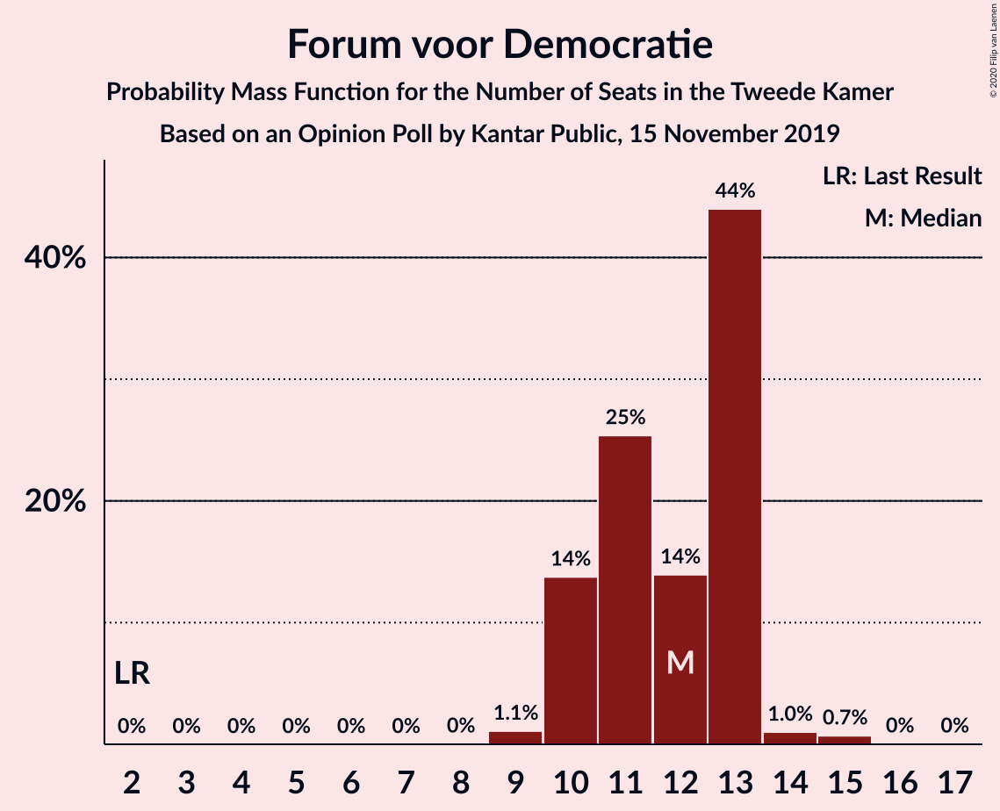
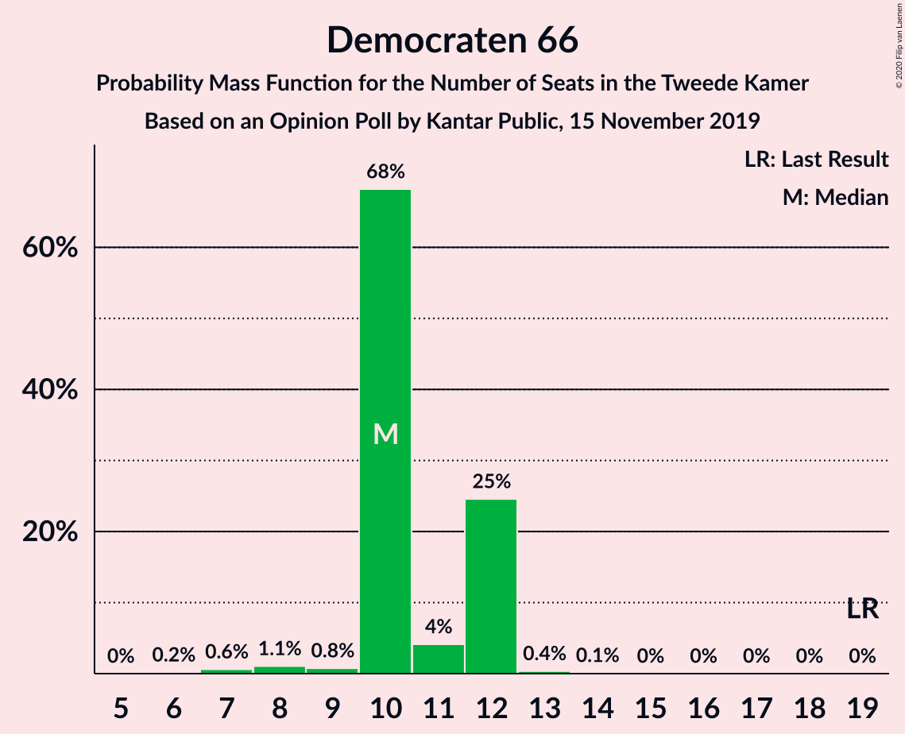
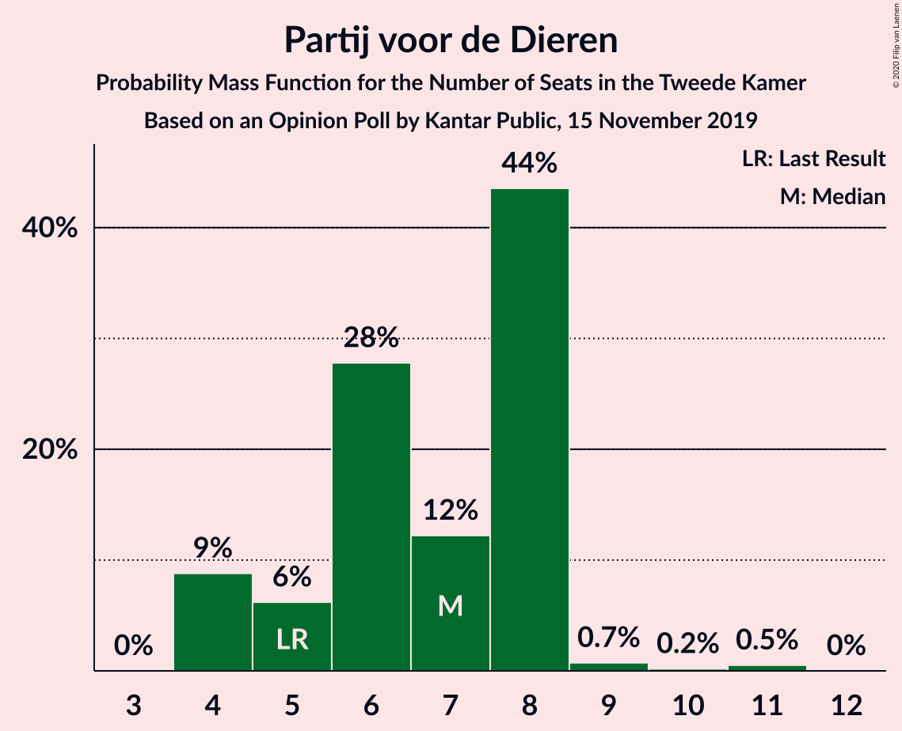
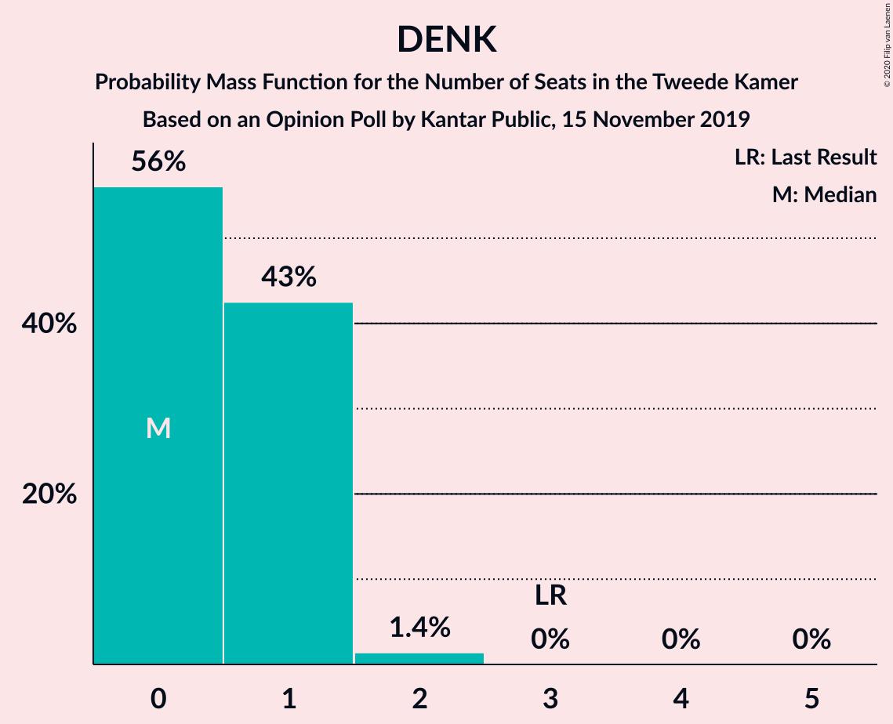
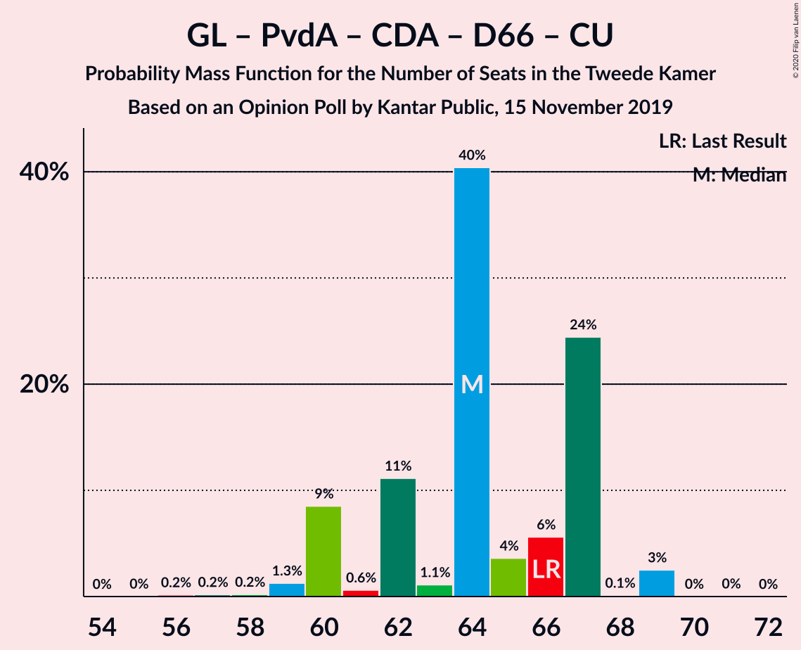
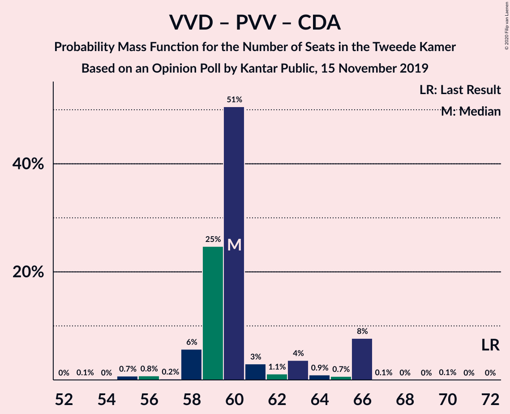
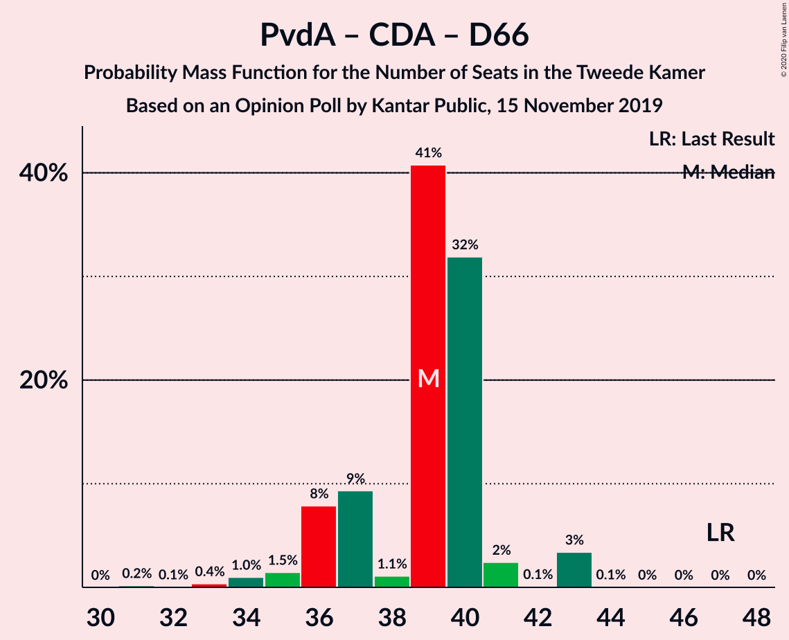

# Opinion Poll by Kantar Public, 15 November 2019

<a href="#voting-intentions">Voting Intentions</a> | <a href="#seats">Seats</a> | <a href="#coalitions">Coalitions</a> | <a href="#technical-information">Technical Information</a>

## Voting Intentions

### Confidence Intervals

| Party | Last Result | Poll Result | 80% Confidence Interval | 90% Confidence Interval | 95% Confidence Interval | 99% Confidence Interval |
|:-----:|:-----------:|:-----------:|:-----------------------:|:-----------------------:|:-----------------------:|:-----------------------:|
| Volkspartij voor Vrijheid en Democratie | 21.3% | 20.0% | 18.4–21.8% |18.0–22.3% |17.6–22.7% |16.9–23.6% |
| Partij voor de Vrijheid | 13.1% | 12.0% | 10.7–13.4% |10.3–13.8% |10.0–14.2% |9.5–14.9% |
| GroenLinks | 9.1% | 11.3% | 10.1–12.8% |9.8–13.2% |9.5–13.5% |8.9–14.2% |
| Partij van de Arbeid | 5.7% | 10.7% | 9.5–12.1% |9.2–12.5% |8.9–12.8% |8.4–13.5% |
| Christen-Democratisch Appèl | 12.4% | 8.0% | 7.0–9.2% |6.7–9.6% |6.4–9.9% |6.0–10.5% |
| Forum voor Democratie | 1.8% | 8.0% | 7.0–9.2% |6.7–9.6% |6.4–9.9% |6.0–10.5% |
| Democraten 66 | 12.2% | 6.7% | 5.8–7.9% |5.5–8.2% |5.3–8.5% |4.9–9.1% |
| Socialistische Partij | 9.1% | 6.0% | 5.1–7.1% |4.8–7.4% |4.6–7.7% |4.3–8.2% |
| ChristenUnie | 3.4% | 5.4% | 4.5–6.4% |4.3–6.7% |4.1–7.0% |3.7–7.5% |
| Partij voor de Dieren | 3.2% | 4.6% | 3.9–5.6% |3.6–5.9% |3.5–6.1% |3.1–6.7% |
| 50Plus | 3.1% | 4.0% | 3.3–4.9% |3.1–5.2% |2.9–5.4% |2.6–5.9% |
| Staatkundig Gereformeerde Partij | 2.1% | 2.6% | 2.1–3.4% |1.9–3.6% |1.8–3.9% |1.5–4.3% |
| DENK | 2.1% | 0.6% | 0.4–1.1% |0.3–1.2% |0.3–1.4% |0.2–1.6% |

*Note:* The poll result column reflects the actual value used in the calculations. Published results may vary slightly, and in addition be rounded to fewer digits.

## Seats

### Confidence Intervals

| Party | Last Result | Median | 80% Confidence Interval | 90% Confidence Interval | 95% Confidence Interval | 99% Confidence Interval |
|:-----:|:-----------:|:------:|:-----------------------:|:-----------------------:|:-----------------------:|:-----------------------:|
| <a href="#volkspartij-voor-vrijheid-en-democratie">Volkspartij voor Vrijheid en Democratie</a> | 33 | 33 | 23–33 |23–33 |23–33 |23–33 |
| <a href="#partij-voor-de-vrijheid">Partij voor de Vrijheid</a> | 20 | 16 | 16–21 |16–21 |16–22 |16–22 |
| <a href="#groenlinks">GroenLinks</a> | 14 | 16 | 16–20 |16–20 |16–20 |14–20 |
| <a href="#partij-van-de-arbeid">Partij van de Arbeid</a> | 9 | 14 | 14–17 |14–17 |11–17 |11–17 |
| <a href="#christen-democratisch-appèl">Christen-Democratisch Appèl</a> | 19 | 11 | 11–17 |11–17 |11–17 |11–17 |
| <a href="#forum-voor-democratie">Forum voor Democratie</a> | 2 | 13 | 11–13 |11–13 |11–17 |11–17 |
| <a href="#democraten-66">Democraten 66</a> | 19 | 8 | 8–9 |8–9 |8–9 |8–9 |
| <a href="#socialistische-partij">Socialistische Partij</a> | 14 | 7 | 7 |7 |7–13 |7–13 |
| <a href="#christenunie">ChristenUnie</a> | 5 | 10 | 10 |10 |6–10 |6–10 |
| <a href="#partij-voor-de-dieren">Partij voor de Dieren</a> | 5 | 9 | 7–9 |7–9 |7–9 |7–11 |
| <a href="#50plus">50Plus</a> | 4 | 4 | 4–5 |4–5 |4–5 |4–8 |
| <a href="#staatkundig-gereformeerde-partij">Staatkundig Gereformeerde Partij</a> | 3 | 6 | 2–6 |2–6 |2–6 |2–6 |
| <a href="#denk">DENK</a> | 3 | 2 | 1–2 |1–2 |0–2 |0–2 |

### Volkspartij voor Vrijheid en Democratie

*For a full overview of the results for this party, see the [Volkspartij voor Vrijheid en Democratie](party-volkspartijvoorvrijheidendemocratie.html) page.*

| Number of Seats | Probability | Accumulated | Special Marks |
|:---------------:|:-----------:|:-----------:|:-------------:|
| 23 | 38% | 100% |  |
| 24 | 0% | 62% |  |
| 25 | 0% | 62% |  |
| 26 | 0.2% | 62% |  |
| 27 | 0% | 61% |  |
| 28 | 3% | 61% |  |
| 29 | 0% | 58% |  |
| 30 | 0% | 58% |  |
| 31 | 0.1% | 58% |  |
| 32 | 0% | 58% |  |
| 33 | 58% | 58% | Last Result, Median |
| 34 | 0% | 0% |  |

### Partij voor de Vrijheid

*For a full overview of the results for this party, see the [Partij voor de Vrijheid](party-partijvoordevrijheid.html) page.*

| Number of Seats | Probability | Accumulated | Special Marks |
|:---------------:|:-----------:|:-----------:|:-------------:|
| 15 | 0.2% | 100% |  |
| 16 | 57% | 99.8% | Median |
| 17 | 0% | 42% |  |
| 18 | 0% | 42% |  |
| 19 | 0% | 42% |  |
| 20 | 0% | 42% | Last Result |
| 21 | 39% | 42% |  |
| 22 | 3% | 3% |  |
| 23 | 0% | 0% |  |

### GroenLinks

*For a full overview of the results for this party, see the [GroenLinks](party-groenlinks.html) page.*

| Number of Seats | Probability | Accumulated | Special Marks |
|:---------------:|:-----------:|:-----------:|:-------------:|
| 14 | 0.9% | 100% | Last Result |
| 15 | 0% | 99.1% |  |
| 16 | 57% | 99.1% | Median |
| 17 | 3% | 42% |  |
| 18 | 0.2% | 39% |  |
| 19 | 0% | 38% |  |
| 20 | 38% | 38% |  |
| 21 | 0% | 0% |  |

### Partij van de Arbeid

*For a full overview of the results for this party, see the [Partij van de Arbeid](party-partijvandearbeid.html) page.*

| Number of Seats | Probability | Accumulated | Special Marks |
|:---------------:|:-----------:|:-----------:|:-------------:|
| 9 | 0% | 100% | Last Result |
| 10 | 0% | 100% |  |
| 11 | 4% | 100% |  |
| 12 | 0% | 96% |  |
| 13 | 0% | 96% |  |
| 14 | 57% | 96% | Median |
| 15 | 0.2% | 39% |  |
| 16 | 0% | 39% |  |
| 17 | 39% | 39% |  |
| 18 | 0% | 0% |  |

### Christen-Democratisch Appèl

*For a full overview of the results for this party, see the [Christen-Democratisch Appèl](party-christen-democratischappèl.html) page.*

| Number of Seats | Probability | Accumulated | Special Marks |
|:---------------:|:-----------:|:-----------:|:-------------:|
| 11 | 61% | 100% | Median |
| 12 | 0% | 39% |  |
| 13 | 0% | 39% |  |
| 14 | 0% | 39% |  |
| 15 | 0% | 39% |  |
| 16 | 0.1% | 39% |  |
| 17 | 38% | 39% |  |
| 18 | 0% | 0.2% |  |
| 19 | 0.2% | 0.2% | Last Result |
| 20 | 0% | 0% |  |

### Forum voor Democratie

*For a full overview of the results for this party, see the [Forum voor Democratie](party-forumvoordemocratie.html) page.*

| Number of Seats | Probability | Accumulated | Special Marks |
|:---------------:|:-----------:|:-----------:|:-------------:|
| 2 | 0% | 100% | Last Result |
| 3 | 0% | 100% |  |
| 4 | 0% | 100% |  |
| 5 | 0% | 100% |  |
| 6 | 0% | 100% |  |
| 7 | 0% | 100% |  |
| 8 | 0% | 100% |  |
| 9 | 0.3% | 100% |  |
| 10 | 0% | 99.6% |  |
| 11 | 38% | 99.6% |  |
| 12 | 0% | 61% |  |
| 13 | 58% | 61% | Median |
| 14 | 0% | 3% |  |
| 15 | 0% | 3% |  |
| 16 | 0% | 3% |  |
| 17 | 3% | 3% |  |
| 18 | 0% | 0% |  |

### Democraten 66

*For a full overview of the results for this party, see the [Democraten 66](party-democraten66.html) page.*

| Number of Seats | Probability | Accumulated | Special Marks |
|:---------------:|:-----------:|:-----------:|:-------------:|
| 8 | 57% | 100% | Median |
| 9 | 42% | 43% |  |
| 10 | 0% | 0.2% |  |
| 11 | 0% | 0.2% |  |
| 12 | 0% | 0.2% |  |
| 13 | 0.2% | 0.2% |  |
| 14 | 0% | 0% |  |
| 15 | 0% | 0% |  |
| 16 | 0% | 0% |  |
| 17 | 0% | 0% |  |
| 18 | 0% | 0% |  |
| 19 | 0% | 0% | Last Result |

### Socialistische Partij

*For a full overview of the results for this party, see the [Socialistische Partij](party-socialistischepartij.html) page.*

| Number of Seats | Probability | Accumulated | Special Marks |
|:---------------:|:-----------:|:-----------:|:-------------:|
| 6 | 0.2% | 100% |  |
| 7 | 96% | 99.8% | Median |
| 8 | 0% | 4% |  |
| 9 | 0.2% | 4% |  |
| 10 | 0% | 4% |  |
| 11 | 0.9% | 4% |  |
| 12 | 0% | 3% |  |
| 13 | 3% | 3% |  |
| 14 | 0% | 0% | Last Result |

### ChristenUnie

*For a full overview of the results for this party, see the [ChristenUnie](party-christenunie.html) page.*

| Number of Seats | Probability | Accumulated | Special Marks |
|:---------------:|:-----------:|:-----------:|:-------------:|
| 5 | 0.2% | 100% | Last Result |
| 6 | 4% | 99.8% |  |
| 7 | 0% | 96% |  |
| 8 | 0% | 96% |  |
| 9 | 0.2% | 96% |  |
| 10 | 96% | 96% | Median |
| 11 | 0% | 0% |  |

### Partij voor de Dieren

*For a full overview of the results for this party, see the [Partij voor de Dieren](party-partijvoordedieren.html) page.*

| Number of Seats | Probability | Accumulated | Special Marks |
|:---------------:|:-----------:|:-----------:|:-------------:|
| 5 | 0% | 100% | Last Result |
| 6 | 0.1% | 100% |  |
| 7 | 38% | 99.8% |  |
| 8 | 3% | 61% |  |
| 9 | 57% | 58% | Median |
| 10 | 0% | 0.9% |  |
| 11 | 0.9% | 0.9% |  |
| 12 | 0% | 0% |  |

### 50Plus

*For a full overview of the results for this party, see the [50Plus](party-50plus.html) page.*

| Number of Seats | Probability | Accumulated | Special Marks |
|:---------------:|:-----------:|:-----------:|:-------------:|
| 4 | 60% | 100% | Last Result, Median |
| 5 | 39% | 40% |  |
| 6 | 0% | 1.1% |  |
| 7 | 0% | 1.1% |  |
| 8 | 0.9% | 1.1% |  |
| 9 | 0% | 0.1% |  |
| 10 | 0.1% | 0.1% |  |
| 11 | 0% | 0% |  |

### Staatkundig Gereformeerde Partij

*For a full overview of the results for this party, see the [Staatkundig Gereformeerde Partij](party-staatkundiggereformeerdepartij.html) page.*

| Number of Seats | Probability | Accumulated | Special Marks |
|:---------------:|:-----------:|:-----------:|:-------------:|
| 2 | 39% | 100% |  |
| 3 | 0% | 61% | Last Result |
| 4 | 3% | 61% |  |
| 5 | 0.2% | 58% |  |
| 6 | 57% | 57% | Median |
| 7 | 0% | 0% |  |

### DENK

*For a full overview of the results for this party, see the [DENK](party-denk.html) page.*

| Number of Seats | Probability | Accumulated | Special Marks |
|:---------------:|:-----------:|:-----------:|:-------------:|
| 0 | 4% | 100% |  |
| 1 | 38% | 96% |  |
| 2 | 57% | 57% | Median |
| 3 | 0.1% | 0.1% | Last Result |
| 4 | 0% | 0% |  |

## Coalitions

### Confidence Intervals

| Coalition | Last Result | Median | Majority? | 80% Confidence Interval | 90% Confidence Interval | 95% Confidence Interval | 99% Confidence Interval |
|:---------:|:-----------:|:------:|:---------:|:-----------------------:|:-----------------------:|:-----------------------:|:-----------------------:|
| Volkspartij voor Vrijheid en Democratie – Partij voor de Vrijheid – Christen-Democratisch Appèl – Forum voor Democratie – Staatkundig Gereformeerde Partij | 77 | 79 | 61% | 74–79 | 74–79 | 74–82 | 74–82 |
| GroenLinks – Partij van de Arbeid – Christen-Democratisch Appèl – Democraten 66 – Socialistische Partij – ChristenUnie | 80 | 66 | 39% | 66–80 | 66–80 | 66–80 | 62–80 |
| Volkspartij voor Vrijheid en Democratie – GroenLinks – Christen-Democratisch Appèl – Democraten 66 – ChristenUnie | 90 | 78 | 96% | 78–79 | 78–79 | 71–79 | 71–79 |
| Volkspartij voor Vrijheid en Democratie – Partij voor de Vrijheid – Christen-Democratisch Appèl – Forum voor Democratie | 74 | 73 | 4% | 72–73 | 72–73 | 72–78 | 72–78 |
| Volkspartij voor Vrijheid en Democratie – Partij van de Arbeid – Christen-Democratisch Appèl – Democraten 66 – ChristenUnie | 85 | 76 | 96% | 76 | 76 | 65–76 | 65–76 |
| GroenLinks – Partij van de Arbeid – Christen-Democratisch Appèl – Democraten 66 – ChristenUnie | 66 | 59 | 0.2% | 59–73 | 59–73 | 54–73 | 51–73 |
| Volkspartij voor Vrijheid en Democratie – Christen-Democratisch Appèl – Forum voor Democratie – 50Plus – Staatkundig Gereformeerde Partij | 61 | 67 | 0% | 58–67 | 58–67 | 58–67 | 58–67 |
| Volkspartij voor Vrijheid en Democratie – Christen-Democratisch Appèl – Forum voor Democratie – Staatkundig Gereformeerde Partij | 57 | 63 | 0% | 53–63 | 53–63 | 53–63 | 53–63 |
| Volkspartij voor Vrijheid en Democratie – Christen-Democratisch Appèl – Democraten 66 – ChristenUnie | 76 | 62 | 0% | 59–62 | 59–62 | 54–62 | 54–62 |
| Volkspartij voor Vrijheid en Democratie – Partij voor de Vrijheid – Christen-Democratisch Appèl | 72 | 60 | 0% | 60–61 | 60–61 | 60–61 | 60–65 |
| Volkspartij voor Vrijheid en Democratie – Christen-Democratisch Appèl – Forum voor Democratie – 50Plus | 58 | 61 | 0% | 56–61 | 56–61 | 56–61 | 56–65 |
| Volkspartij voor Vrijheid en Democratie – Partij van de Arbeid – Christen-Democratisch Appèl | 61 | 58 | 0% | 57–58 | 57–58 | 50–58 | 50–58 |
| Volkspartij voor Vrijheid en Democratie – Christen-Democratisch Appèl – Forum voor Democratie | 54 | 57 | 0% | 51–57 | 51–57 | 51–57 | 51–57 |
| Volkspartij voor Vrijheid en Democratie – Partij van de Arbeid – Democraten 66 | 61 | 55 | 0% | 49–55 | 49–55 | 48–55 | 48–55 |
| Volkspartij voor Vrijheid en Democratie – Christen-Democratisch Appèl – Democraten 66 | 71 | 52 | 0% | 49–52 | 49–52 | 48–52 | 48–53 |
| Volkspartij voor Vrijheid en Democratie – Partij van de Arbeid | 42 | 47 | 0% | 40–47 | 40–47 | 39–47 | 39–47 |
| Volkspartij voor Vrijheid en Democratie – Christen-Democratisch Appèl | 52 | 44 | 0% | 40–44 | 40–44 | 39–44 | 39–44 |
| Partij van de Arbeid – Christen-Democratisch Appèl – ChristenUnie | 33 | 35 | 0% | 35–44 | 35–44 | 28–44 | 28–44 |
| Partij van de Arbeid – Christen-Democratisch Appèl – Democraten 66 | 47 | 33 | 0% | 33–43 | 33–43 | 31–43 | 31–43 |
| Partij van de Arbeid – Christen-Democratisch Appèl | 28 | 25 | 0% | 25–34 | 25–34 | 22–34 | 22–34 |
| Christen-Democratisch Appèl – Democraten 66 | 38 | 19 | 0% | 19–26 | 19–26 | 19–26 | 19–26 |

### Volkspartij voor Vrijheid en Democratie – Partij voor de Vrijheid – Christen-Democratisch Appèl – Forum voor Democratie – Staatkundig Gereformeerde Partij

| Number of Seats | Probability | Accumulated | Special Marks |
|:---------------:|:-----------:|:-----------:|:-------------:|
| 74 | 39% | 100% |  |
| 75 | 0% | 61% |  |
| 76 | 0.1% | 61% | Majority |
| 77 | 0% | 61% | Last Result |
| 78 | 0% | 61% |  |
| 79 | 57% | 61% | Median |
| 80 | 0.9% | 4% |  |
| 81 | 0% | 3% |  |
| 82 | 3% | 3% |  |
| 83 | 0% | 0% |  |

### GroenLinks – Partij van de Arbeid – Christen-Democratisch Appèl – Democraten 66 – Socialistische Partij – ChristenUnie

| Number of Seats | Probability | Accumulated | Special Marks |
|:---------------:|:-----------:|:-----------:|:-------------:|
| 62 | 0.9% | 100% |  |
| 63 | 0% | 99.1% |  |
| 64 | 0% | 99.1% |  |
| 65 | 0% | 99.1% |  |
| 66 | 57% | 99.1% | Median |
| 67 | 3% | 42% |  |
| 68 | 0% | 39% |  |
| 69 | 0% | 39% |  |
| 70 | 0% | 39% |  |
| 71 | 0.2% | 39% |  |
| 72 | 0% | 39% |  |
| 73 | 0% | 39% |  |
| 74 | 0% | 39% |  |
| 75 | 0% | 39% |  |
| 76 | 0% | 39% | Majority |
| 77 | 0% | 39% |  |
| 78 | 0% | 39% |  |
| 79 | 0% | 39% |  |
| 80 | 38% | 39% | Last Result |
| 81 | 0% | 0.2% |  |
| 82 | 0.2% | 0.2% |  |
| 83 | 0% | 0% |  |

### Volkspartij voor Vrijheid en Democratie – GroenLinks – Christen-Democratisch Appèl – Democraten 66 – ChristenUnie

| Number of Seats | Probability | Accumulated | Special Marks |
|:---------------:|:-----------:|:-----------:|:-------------:|
| 71 | 3% | 100% |  |
| 72 | 0% | 97% |  |
| 73 | 0.9% | 97% |  |
| 74 | 0% | 96% |  |
| 75 | 0% | 96% |  |
| 76 | 0% | 96% | Majority |
| 77 | 0% | 96% |  |
| 78 | 57% | 96% | Median |
| 79 | 38% | 39% |  |
| 80 | 0% | 0.2% |  |
| 81 | 0% | 0.2% |  |
| 82 | 0% | 0.2% |  |
| 83 | 0% | 0.2% |  |
| 84 | 0% | 0.2% |  |
| 85 | 0.2% | 0.2% |  |
| 86 | 0% | 0% |  |
| 87 | 0% | 0% |  |
| 88 | 0% | 0% |  |
| 89 | 0% | 0% |  |
| 90 | 0% | 0% | Last Result |

### Volkspartij voor Vrijheid en Democratie – Partij voor de Vrijheid – Christen-Democratisch Appèl – Forum voor Democratie

| Number of Seats | Probability | Accumulated | Special Marks |
|:---------------:|:-----------:|:-----------:|:-------------:|
| 69 | 0.2% | 100% |  |
| 70 | 0% | 99.8% |  |
| 71 | 0% | 99.8% |  |
| 72 | 39% | 99.8% |  |
| 73 | 57% | 61% | Median |
| 74 | 0% | 4% | Last Result |
| 75 | 0% | 4% |  |
| 76 | 0% | 4% | Majority |
| 77 | 0% | 4% |  |
| 78 | 4% | 4% |  |
| 79 | 0% | 0% |  |

### Volkspartij voor Vrijheid en Democratie – Partij van de Arbeid – Christen-Democratisch Appèl – Democraten 66 – ChristenUnie

| Number of Seats | Probability | Accumulated | Special Marks |
|:---------------:|:-----------:|:-----------:|:-------------:|
| 65 | 3% | 100% |  |
| 66 | 0% | 97% |  |
| 67 | 0% | 97% |  |
| 68 | 0% | 97% |  |
| 69 | 0% | 97% |  |
| 70 | 0.9% | 97% |  |
| 71 | 0% | 96% |  |
| 72 | 0% | 96% |  |
| 73 | 0% | 96% |  |
| 74 | 0% | 96% |  |
| 75 | 0% | 96% |  |
| 76 | 96% | 96% | Median, Majority |
| 77 | 0% | 0.2% |  |
| 78 | 0% | 0.2% |  |
| 79 | 0% | 0.2% |  |
| 80 | 0% | 0.2% |  |
| 81 | 0% | 0.2% |  |
| 82 | 0% | 0.2% |  |
| 83 | 0% | 0.2% |  |
| 84 | 0.2% | 0.2% |  |
| 85 | 0% | 0% | Last Result |

### GroenLinks – Partij van de Arbeid – Christen-Democratisch Appèl – Democraten 66 – ChristenUnie

| Number of Seats | Probability | Accumulated | Special Marks |
|:---------------:|:-----------:|:-----------:|:-------------:|
| 51 | 0.9% | 100% |  |
| 52 | 0% | 99.1% |  |
| 53 | 0% | 99.1% |  |
| 54 | 3% | 99.1% |  |
| 55 | 0% | 96% |  |
| 56 | 0% | 96% |  |
| 57 | 0% | 96% |  |
| 58 | 0% | 96% |  |
| 59 | 57% | 96% | Median |
| 60 | 0% | 39% |  |
| 61 | 0% | 39% |  |
| 62 | 0.2% | 39% |  |
| 63 | 0% | 39% |  |
| 64 | 0% | 39% |  |
| 65 | 0% | 39% |  |
| 66 | 0% | 39% | Last Result |
| 67 | 0% | 39% |  |
| 68 | 0% | 39% |  |
| 69 | 0% | 39% |  |
| 70 | 0% | 39% |  |
| 71 | 0% | 39% |  |
| 72 | 0% | 39% |  |
| 73 | 38% | 39% |  |
| 74 | 0% | 0.2% |  |
| 75 | 0% | 0.2% |  |
| 76 | 0.2% | 0.2% | Majority |
| 77 | 0% | 0% |  |

### Volkspartij voor Vrijheid en Democratie – Christen-Democratisch Appèl – Forum voor Democratie – 50Plus – Staatkundig Gereformeerde Partij

| Number of Seats | Probability | Accumulated | Special Marks |
|:---------------:|:-----------:|:-----------:|:-------------:|
| 58 | 38% | 100% |  |
| 59 | 0% | 62% |  |
| 60 | 0% | 62% |  |
| 61 | 0% | 62% | Last Result |
| 62 | 0% | 62% |  |
| 63 | 0% | 62% |  |
| 64 | 3% | 62% |  |
| 65 | 0% | 58% |  |
| 66 | 0% | 58% |  |
| 67 | 58% | 58% | Median |
| 68 | 0% | 0.1% |  |
| 69 | 0% | 0.1% |  |
| 70 | 0.1% | 0.1% |  |
| 71 | 0% | 0% |  |

### Volkspartij voor Vrijheid en Democratie – Christen-Democratisch Appèl – Forum voor Democratie – Staatkundig Gereformeerde Partij

| Number of Seats | Probability | Accumulated | Special Marks |
|:---------------:|:-----------:|:-----------:|:-------------:|
| 53 | 38% | 100% |  |
| 54 | 0% | 62% |  |
| 55 | 0% | 62% |  |
| 56 | 0% | 62% |  |
| 57 | 0% | 62% | Last Result |
| 58 | 0% | 62% |  |
| 59 | 1.1% | 62% |  |
| 60 | 3% | 60% |  |
| 61 | 0% | 57% |  |
| 62 | 0% | 57% |  |
| 63 | 57% | 57% | Median |
| 64 | 0% | 0% |  |

### Volkspartij voor Vrijheid en Democratie – Christen-Democratisch Appèl – Democraten 66 – ChristenUnie

| Number of Seats | Probability | Accumulated | Special Marks |
|:---------------:|:-----------:|:-----------:|:-------------:|
| 54 | 3% | 100% |  |
| 55 | 0% | 97% |  |
| 56 | 0% | 97% |  |
| 57 | 0% | 97% |  |
| 58 | 0% | 97% |  |
| 59 | 39% | 97% |  |
| 60 | 0% | 58% |  |
| 61 | 0.1% | 58% |  |
| 62 | 57% | 58% | Median |
| 63 | 0% | 0.2% |  |
| 64 | 0% | 0.2% |  |
| 65 | 0% | 0.2% |  |
| 66 | 0% | 0.2% |  |
| 67 | 0.2% | 0.2% |  |
| 68 | 0% | 0% |  |
| 69 | 0% | 0% |  |
| 70 | 0% | 0% |  |
| 71 | 0% | 0% |  |
| 72 | 0% | 0% |  |
| 73 | 0% | 0% |  |
| 74 | 0% | 0% |  |
| 75 | 0% | 0% |  |
| 76 | 0% | 0% | Last Result, Majority |

### Volkspartij voor Vrijheid en Democratie – Partij voor de Vrijheid – Christen-Democratisch Appèl

| Number of Seats | Probability | Accumulated | Special Marks |
|:---------------:|:-----------:|:-----------:|:-------------:|
| 60 | 57% | 100% | Median |
| 61 | 41% | 42% |  |
| 62 | 0% | 1.1% |  |
| 63 | 0.1% | 1.1% |  |
| 64 | 0% | 0.9% |  |
| 65 | 0.9% | 0.9% |  |
| 66 | 0% | 0% |  |
| 67 | 0% | 0% |  |
| 68 | 0% | 0% |  |
| 69 | 0% | 0% |  |
| 70 | 0% | 0% |  |
| 71 | 0% | 0% |  |
| 72 | 0% | 0% | Last Result |

### Volkspartij voor Vrijheid en Democratie – Christen-Democratisch Appèl – Forum voor Democratie – 50Plus

| Number of Seats | Probability | Accumulated | Special Marks |
|:---------------:|:-----------:|:-----------:|:-------------:|
| 56 | 38% | 100% |  |
| 57 | 0% | 62% |  |
| 58 | 0% | 62% | Last Result |
| 59 | 0.2% | 62% |  |
| 60 | 3% | 61% |  |
| 61 | 57% | 58% | Median |
| 62 | 0% | 1.1% |  |
| 63 | 0% | 1.1% |  |
| 64 | 0% | 1.1% |  |
| 65 | 0.9% | 1.1% |  |
| 66 | 0.1% | 0.1% |  |
| 67 | 0% | 0% |  |

### Volkspartij voor Vrijheid en Democratie – Partij van de Arbeid – Christen-Democratisch Appèl

| Number of Seats | Probability | Accumulated | Special Marks |
|:---------------:|:-----------:|:-----------:|:-------------:|
| 50 | 3% | 100% |  |
| 51 | 0% | 97% |  |
| 52 | 0% | 97% |  |
| 53 | 0% | 97% |  |
| 54 | 0% | 97% |  |
| 55 | 0.9% | 97% |  |
| 56 | 0% | 96% |  |
| 57 | 38% | 96% |  |
| 58 | 57% | 58% | Median |
| 59 | 0% | 0.4% |  |
| 60 | 0% | 0.4% |  |
| 61 | 0% | 0.4% | Last Result |
| 62 | 0.3% | 0.3% |  |
| 63 | 0% | 0% |  |

### Volkspartij voor Vrijheid en Democratie – Christen-Democratisch Appèl – Forum voor Democratie

| Number of Seats | Probability | Accumulated | Special Marks |
|:---------------:|:-----------:|:-----------:|:-------------:|
| 51 | 38% | 100% |  |
| 52 | 0% | 62% |  |
| 53 | 0% | 62% |  |
| 54 | 0.2% | 62% | Last Result |
| 55 | 0% | 61% |  |
| 56 | 3% | 61% |  |
| 57 | 58% | 58% | Median |
| 58 | 0% | 0% |  |

### Volkspartij voor Vrijheid en Democratie – Partij van de Arbeid – Democraten 66

| Number of Seats | Probability | Accumulated | Special Marks |
|:---------------:|:-----------:|:-----------:|:-------------:|
| 48 | 3% | 100% |  |
| 49 | 38% | 97% |  |
| 50 | 0% | 59% |  |
| 51 | 0% | 59% |  |
| 52 | 0% | 59% |  |
| 53 | 0.9% | 59% |  |
| 54 | 0% | 58% |  |
| 55 | 57% | 58% | Median |
| 56 | 0.2% | 0.2% |  |
| 57 | 0% | 0% |  |
| 58 | 0% | 0% |  |
| 59 | 0% | 0% |  |
| 60 | 0% | 0% |  |
| 61 | 0% | 0% | Last Result |

### Volkspartij voor Vrijheid en Democratie – Christen-Democratisch Appèl – Democraten 66

| Number of Seats | Probability | Accumulated | Special Marks |
|:---------------:|:-----------:|:-----------:|:-------------:|
| 48 | 3% | 100% |  |
| 49 | 38% | 97% |  |
| 50 | 0% | 59% |  |
| 51 | 0% | 59% |  |
| 52 | 57% | 59% | Median |
| 53 | 0.9% | 1.3% |  |
| 54 | 0% | 0.3% |  |
| 55 | 0% | 0.3% |  |
| 56 | 0.1% | 0.3% |  |
| 57 | 0% | 0.2% |  |
| 58 | 0.2% | 0.2% |  |
| 59 | 0% | 0% |  |
| 60 | 0% | 0% |  |
| 61 | 0% | 0% |  |
| 62 | 0% | 0% |  |
| 63 | 0% | 0% |  |
| 64 | 0% | 0% |  |
| 65 | 0% | 0% |  |
| 66 | 0% | 0% |  |
| 67 | 0% | 0% |  |
| 68 | 0% | 0% |  |
| 69 | 0% | 0% |  |
| 70 | 0% | 0% |  |
| 71 | 0% | 0% | Last Result |

### Volkspartij voor Vrijheid en Democratie – Partij van de Arbeid

| Number of Seats | Probability | Accumulated | Special Marks |
|:---------------:|:-----------:|:-----------:|:-------------:|
| 39 | 3% | 100% |  |
| 40 | 38% | 97% |  |
| 41 | 0% | 59% |  |
| 42 | 0% | 59% | Last Result |
| 43 | 0.2% | 59% |  |
| 44 | 0.9% | 58% |  |
| 45 | 0% | 57% |  |
| 46 | 0.1% | 57% |  |
| 47 | 57% | 57% | Median |
| 48 | 0% | 0% |  |

### Volkspartij voor Vrijheid en Democratie – Christen-Democratisch Appèl

| Number of Seats | Probability | Accumulated | Special Marks |
|:---------------:|:-----------:|:-----------:|:-------------:|
| 39 | 3% | 100% |  |
| 40 | 38% | 97% |  |
| 41 | 0% | 59% |  |
| 42 | 0% | 59% |  |
| 43 | 0% | 59% |  |
| 44 | 58% | 59% | Median |
| 45 | 0.2% | 0.4% |  |
| 46 | 0% | 0.2% |  |
| 47 | 0.1% | 0.1% |  |
| 48 | 0% | 0% |  |
| 49 | 0% | 0% |  |
| 50 | 0% | 0% |  |
| 51 | 0% | 0% |  |
| 52 | 0% | 0% | Last Result |

### Partij van de Arbeid – Christen-Democratisch Appèl – ChristenUnie

| Number of Seats | Probability | Accumulated | Special Marks |
|:---------------:|:-----------:|:-----------:|:-------------:|
| 28 | 4% | 100% |  |
| 29 | 0% | 96% |  |
| 30 | 0% | 96% |  |
| 31 | 0% | 96% |  |
| 32 | 0% | 96% |  |
| 33 | 0% | 96% | Last Result |
| 34 | 0% | 96% |  |
| 35 | 57% | 96% | Median |
| 36 | 0.1% | 39% |  |
| 37 | 0% | 39% |  |
| 38 | 0% | 39% |  |
| 39 | 0% | 39% |  |
| 40 | 0% | 39% |  |
| 41 | 0% | 39% |  |
| 42 | 0% | 39% |  |
| 43 | 0% | 39% |  |
| 44 | 38% | 39% |  |
| 45 | 0.2% | 0.2% |  |
| 46 | 0% | 0% |  |

### Partij van de Arbeid – Christen-Democratisch Appèl – Democraten 66

| Number of Seats | Probability | Accumulated | Special Marks |
|:---------------:|:-----------:|:-----------:|:-------------:|
| 31 | 4% | 100% |  |
| 32 | 0% | 96% |  |
| 33 | 57% | 96% | Median |
| 34 | 0% | 39% |  |
| 35 | 0% | 39% |  |
| 36 | 0% | 39% |  |
| 37 | 0% | 39% |  |
| 38 | 0% | 39% |  |
| 39 | 0% | 39% |  |
| 40 | 0.2% | 39% |  |
| 41 | 0% | 39% |  |
| 42 | 0% | 39% |  |
| 43 | 38% | 39% |  |
| 44 | 0% | 0.2% |  |
| 45 | 0% | 0.2% |  |
| 46 | 0% | 0.2% |  |
| 47 | 0% | 0.2% | Last Result |
| 48 | 0% | 0.2% |  |
| 49 | 0.2% | 0.2% |  |
| 50 | 0% | 0% |  |

### Partij van de Arbeid – Christen-Democratisch Appèl

| Number of Seats | Probability | Accumulated | Special Marks |
|:---------------:|:-----------:|:-----------:|:-------------:|
| 22 | 4% | 100% |  |
| 23 | 0% | 96% |  |
| 24 | 0% | 96% |  |
| 25 | 57% | 96% | Median |
| 26 | 0% | 39% |  |
| 27 | 0% | 39% |  |
| 28 | 0% | 39% | Last Result |
| 29 | 0% | 39% |  |
| 30 | 0% | 39% |  |
| 31 | 0.2% | 39% |  |
| 32 | 0% | 39% |  |
| 33 | 0% | 39% |  |
| 34 | 38% | 39% |  |
| 35 | 0% | 0.2% |  |
| 36 | 0.2% | 0.2% |  |
| 37 | 0% | 0% |  |

### Christen-Democratisch Appèl – Democraten 66

| Number of Seats | Probability | Accumulated | Special Marks |
|:---------------:|:-----------:|:-----------:|:-------------:|
| 19 | 57% | 100% | Median |
| 20 | 4% | 43% |  |
| 21 | 0% | 39% |  |
| 22 | 0% | 39% |  |
| 23 | 0% | 39% |  |
| 24 | 0% | 39% |  |
| 25 | 0.1% | 39% |  |
| 26 | 38% | 39% |  |
| 27 | 0% | 0.2% |  |
| 28 | 0% | 0.2% |  |
| 29 | 0% | 0.2% |  |
| 30 | 0% | 0.2% |  |
| 31 | 0% | 0.2% |  |
| 32 | 0.2% | 0.2% |  |
| 33 | 0% | 0% |  |
| 34 | 0% | 0% |  |
| 35 | 0% | 0% |  |
| 36 | 0% | 0% |  |
| 37 | 0% | 0% |  |
| 38 | 0% | 0% | Last Result |

## Technical Information

### Opinion Poll

+ **Polling firm:** Kantar Public
+ **Commissioner(s):** —
+ **Fieldwork period:** 15 November 2019

### Calculations

+ **Sample size:** 953
+ **Simulations done:** 1,024
+ **Error estimate:** 6.22%

