# Opinion Poll by Peil.nl, 11–16 November 2019

<a href="#voting-intentions">Voting Intentions</a> | <a href="#seats">Seats</a> | <a href="#coalitions">Coalitions</a> | <a href="#technical-information">Technical Information</a>

## Voting Intentions

### Confidence Intervals

| Party | Last Result | Poll Result | 80% Confidence Interval | 90% Confidence Interval | 95% Confidence Interval | 99% Confidence Interval |
|:-----:|:-----------:|:-----------:|:-----------------------:|:-----------------------:|:-----------------------:|:-----------------------:|
| Volkspartij voor Vrijheid en Democratie | 21.3% | 16.0% | 15.2–16.9% |14.9–17.1% |14.7–17.4% |14.3–17.8% |
| Partij van de Arbeid | 5.7% | 13.3% | 12.6–14.2% |12.3–14.4% |12.2–14.6% |11.8–15.0% |
| Partij voor de Vrijheid | 13.1% | 12.0% | 11.3–12.8% |11.1–13.0% |10.9–13.2% |10.5–13.6% |
| Forum voor Democratie | 1.8% | 11.3% | 10.6–12.1% |10.4–12.3% |10.2–12.5% |9.9–12.9% |
| Christen-Democratisch Appèl | 12.4% | 9.3% | 8.7–10.1% |8.5–10.3% |8.3–10.4% |8.0–10.8% |
| Democraten 66 | 12.2% | 8.7% | 8.0–9.4% |7.8–9.6% |7.7–9.7% |7.4–10.1% |
| GroenLinks | 9.1% | 8.7% | 8.0–9.4% |7.8–9.6% |7.7–9.7% |7.4–10.1% |
| Socialistische Partij | 9.1% | 5.3% | 4.8–5.9% |4.7–6.1% |4.6–6.2% |4.4–6.5% |
| 50Plus | 3.1% | 4.7% | 4.2–5.2% |4.1–5.3% |4.0–5.5% |3.7–5.8% |
| ChristenUnie | 3.4% | 4.0% | 3.6–4.5% |3.4–4.6% |3.4–4.8% |3.2–5.0% |
| Partij voor de Dieren | 3.2% | 2.7% | 2.3–3.1% |2.2–3.2% |2.1–3.3% |2.0–3.5% |
| DENK | 2.1% | 2.0% | 1.7–2.4% |1.6–2.5% |1.6–2.6% |1.4–2.8% |
| Staatkundig Gereformeerde Partij | 2.1% | 1.3% | 1.1–1.6% |1.0–1.7% |1.0–1.8% |0.9–2.0% |

*Note:* The poll result column reflects the actual value used in the calculations. Published results may vary slightly, and in addition be rounded to fewer digits.

## Seats

### Confidence Intervals

| Party | Last Result | Median | 80% Confidence Interval | 90% Confidence Interval | 95% Confidence Interval | 99% Confidence Interval |
|:-----:|:-----------:|:------:|:-----------------------:|:-----------------------:|:-----------------------:|:-----------------------:|
| <a href="#volkspartij-voor-vrijheid-en-democratie">Volkspartij voor Vrijheid en Democratie</a> | 33 | 24 | 23–26 |23–26 |23–26 |23–27 |
| <a href="#partij-van-de-arbeid">Partij van de Arbeid</a> | 9 | 21 | 19–23 |18–23 |18–23 |18–24 |
| <a href="#partij-voor-de-vrijheid">Partij voor de Vrijheid</a> | 20 | 19 | 17–20 |17–20 |17–21 |17–21 |
| <a href="#forum-voor-democratie">Forum voor Democratie</a> | 2 | 18 | 16–19 |16–19 |16–20 |15–20 |
| <a href="#christen-democratisch-appèl">Christen-Democratisch Appèl</a> | 19 | 14 | 13–15 |13–16 |13–16 |12–16 |
| <a href="#democraten-66">Democraten 66</a> | 19 | 12 | 12–14 |12–14 |11–14 |11–15 |
| <a href="#groenlinks">GroenLinks</a> | 14 | 14 | 12–14 |12–16 |12–16 |11–16 |
| <a href="#socialistische-partij">Socialistische Partij</a> | 14 | 7 | 7–8 |6–8 |6–9 |6–10 |
| <a href="#50plus">50Plus</a> | 4 | 7 | 6–8 |6–8 |6–8 |5–9 |
| <a href="#christenunie">ChristenUnie</a> | 5 | 6 | 5–6 |5–6 |5–6 |4–7 |
| <a href="#partij-voor-de-dieren">Partij voor de Dieren</a> | 5 | 3 | 3–4 |3–4 |3–5 |3–5 |
| <a href="#denk">DENK</a> | 3 | 3 | 2–4 |2–4 |2–4 |2–4 |
| <a href="#staatkundig-gereformeerde-partij">Staatkundig Gereformeerde Partij</a> | 3 | 2 | 1–2 |1–2 |1–2 |1–3 |

### Volkspartij voor Vrijheid en Democratie

*For a full overview of the results for this party, see the [Volkspartij voor Vrijheid en Democratie](party-volkspartijvoorvrijheidendemocratie.html) page.*

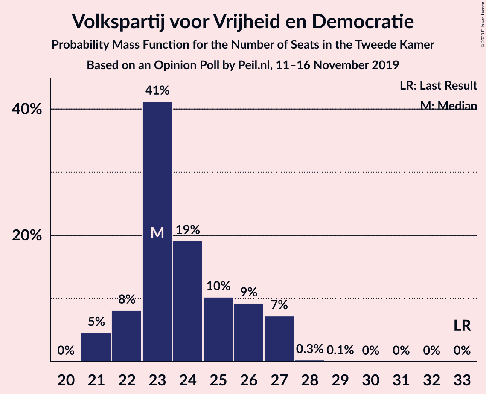

| Number of Seats | Probability | Accumulated | Special Marks |
|:---------------:|:-----------:|:-----------:|:-------------:|
| 22 | 0.4% | 100% |  |
| 23 | 13% | 99.6% |  |
| 24 | 39% | 87% | Median |
| 25 | 13% | 48% |  |
| 26 | 34% | 35% |  |
| 27 | 1.3% | 2% |  |
| 28 | 0.4% | 0.4% |  |
| 29 | 0.1% | 0.1% |  |
| 30 | 0% | 0% |  |
| 31 | 0% | 0% |  |
| 32 | 0% | 0% |  |
| 33 | 0% | 0% | Last Result |

### Partij van de Arbeid

*For a full overview of the results for this party, see the [Partij van de Arbeid](party-partijvandearbeid.html) page.*

| Number of Seats | Probability | Accumulated | Special Marks |
|:---------------:|:-----------:|:-----------:|:-------------:|
| 9 | 0% | 100% | Last Result |
| 10 | 0% | 100% |  |
| 11 | 0% | 100% |  |
| 12 | 0% | 100% |  |
| 13 | 0% | 100% |  |
| 14 | 0% | 100% |  |
| 15 | 0% | 100% |  |
| 16 | 0% | 100% |  |
| 17 | 0.2% | 100% |  |
| 18 | 7% | 99.8% |  |
| 19 | 35% | 92% |  |
| 20 | 6% | 57% |  |
| 21 | 8% | 51% | Median |
| 22 | 11% | 43% |  |
| 23 | 31% | 32% |  |
| 24 | 0.9% | 0.9% |  |
| 25 | 0% | 0% |  |

### Partij voor de Vrijheid

*For a full overview of the results for this party, see the [Partij voor de Vrijheid](party-partijvoordevrijheid.html) page.*

| Number of Seats | Probability | Accumulated | Special Marks |
|:---------------:|:-----------:|:-----------:|:-------------:|
| 16 | 0.4% | 100% |  |
| 17 | 41% | 99.5% |  |
| 18 | 5% | 59% |  |
| 19 | 10% | 54% | Median |
| 20 | 39% | 44% | Last Result |
| 21 | 5% | 5% |  |
| 22 | 0.3% | 0.3% |  |
| 23 | 0% | 0% |  |

### Forum voor Democratie

*For a full overview of the results for this party, see the [Forum voor Democratie](party-forumvoordemocratie.html) page.*

| Number of Seats | Probability | Accumulated | Special Marks |
|:---------------:|:-----------:|:-----------:|:-------------:|
| 2 | 0% | 100% | Last Result |
| 3 | 0% | 100% |  |
| 4 | 0% | 100% |  |
| 5 | 0% | 100% |  |
| 6 | 0% | 100% |  |
| 7 | 0% | 100% |  |
| 8 | 0% | 100% |  |
| 9 | 0% | 100% |  |
| 10 | 0% | 100% |  |
| 11 | 0% | 100% |  |
| 12 | 0% | 100% |  |
| 13 | 0% | 100% |  |
| 14 | 0.2% | 100% |  |
| 15 | 1.2% | 99.8% |  |
| 16 | 12% | 98.6% |  |
| 17 | 34% | 86% |  |
| 18 | 14% | 53% | Median |
| 19 | 34% | 38% |  |
| 20 | 5% | 5% |  |
| 21 | 0.2% | 0.2% |  |
| 22 | 0% | 0% |  |

### Christen-Democratisch Appèl

*For a full overview of the results for this party, see the [Christen-Democratisch Appèl](party-christen-democratischappèl.html) page.*

| Number of Seats | Probability | Accumulated | Special Marks |
|:---------------:|:-----------:|:-----------:|:-------------:|
| 12 | 0.8% | 100% |  |
| 13 | 40% | 99.2% |  |
| 14 | 42% | 59% | Median |
| 15 | 10% | 17% |  |
| 16 | 7% | 7% |  |
| 17 | 0.1% | 0.2% |  |
| 18 | 0% | 0% |  |
| 19 | 0% | 0% | Last Result |

### Democraten 66

*For a full overview of the results for this party, see the [Democraten 66](party-democraten66.html) page.*

| Number of Seats | Probability | Accumulated | Special Marks |
|:---------------:|:-----------:|:-----------:|:-------------:|
| 11 | 3% | 100% |  |
| 12 | 57% | 97% | Median |
| 13 | 23% | 40% |  |
| 14 | 15% | 17% |  |
| 15 | 1.4% | 2% |  |
| 16 | 0.1% | 0.1% |  |
| 17 | 0% | 0% |  |
| 18 | 0% | 0% |  |
| 19 | 0% | 0% | Last Result |

### GroenLinks

*For a full overview of the results for this party, see the [GroenLinks](party-groenlinks.html) page.*

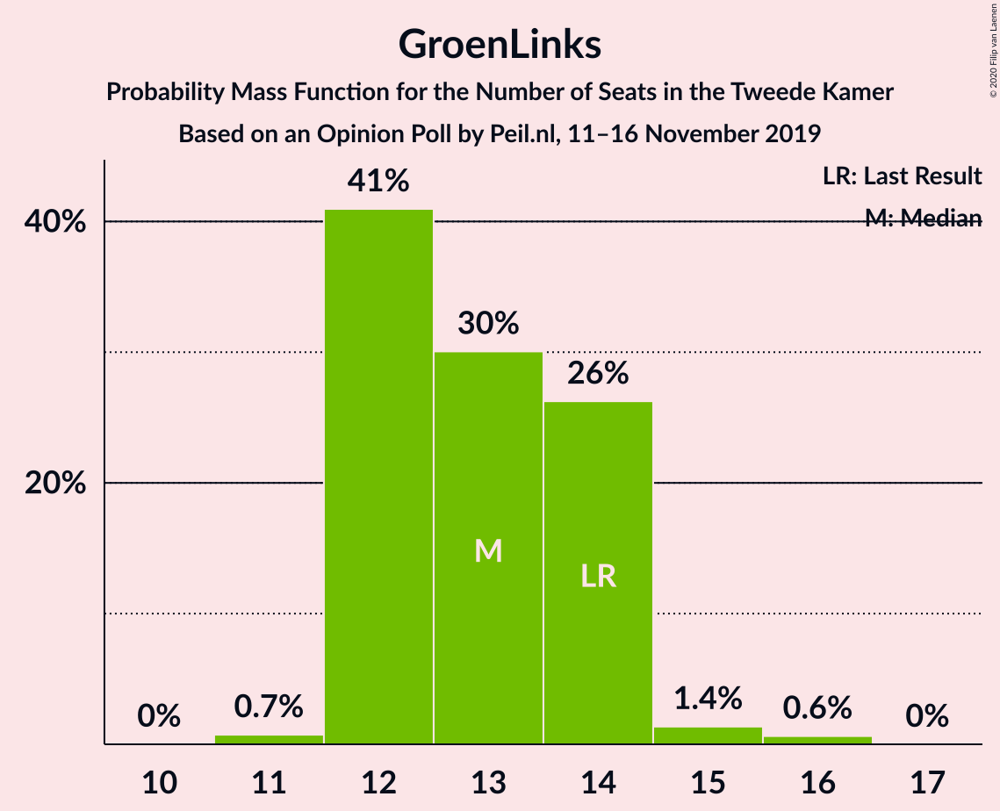

| Number of Seats | Probability | Accumulated | Special Marks |
|:---------------:|:-----------:|:-----------:|:-------------:|
| 11 | 2% | 100% |  |
| 12 | 12% | 98% |  |
| 13 | 22% | 86% |  |
| 14 | 56% | 63% | Last Result, Median |
| 15 | 2% | 8% |  |
| 16 | 6% | 6% |  |
| 17 | 0% | 0% |  |

### Socialistische Partij

*For a full overview of the results for this party, see the [Socialistische Partij](party-socialistischepartij.html) page.*

| Number of Seats | Probability | Accumulated | Special Marks |
|:---------------:|:-----------:|:-----------:|:-------------:|
| 6 | 8% | 100% |  |
| 7 | 68% | 92% | Median |
| 8 | 19% | 24% |  |
| 9 | 4% | 5% |  |
| 10 | 0.7% | 0.8% |  |
| 11 | 0.1% | 0.1% |  |
| 12 | 0% | 0% |  |
| 13 | 0% | 0% |  |
| 14 | 0% | 0% | Last Result |

### 50Plus

*For a full overview of the results for this party, see the [50Plus](party-50plus.html) page.*

| Number of Seats | Probability | Accumulated | Special Marks |
|:---------------:|:-----------:|:-----------:|:-------------:|
| 4 | 0% | 100% | Last Result |
| 5 | 0.7% | 100% |  |
| 6 | 41% | 99.3% |  |
| 7 | 20% | 58% | Median |
| 8 | 38% | 38% |  |
| 9 | 0.3% | 0.5% |  |
| 10 | 0.2% | 0.2% |  |
| 11 | 0% | 0% |  |

### ChristenUnie

*For a full overview of the results for this party, see the [ChristenUnie](party-christenunie.html) page.*

| Number of Seats | Probability | Accumulated | Special Marks |
|:---------------:|:-----------:|:-----------:|:-------------:|
| 4 | 1.0% | 100% |  |
| 5 | 19% | 99.0% | Last Result |
| 6 | 78% | 80% | Median |
| 7 | 2% | 2% |  |
| 8 | 0.4% | 0.4% |  |
| 9 | 0% | 0% |  |

### Partij voor de Dieren

*For a full overview of the results for this party, see the [Partij voor de Dieren](party-partijvoordedieren.html) page.*

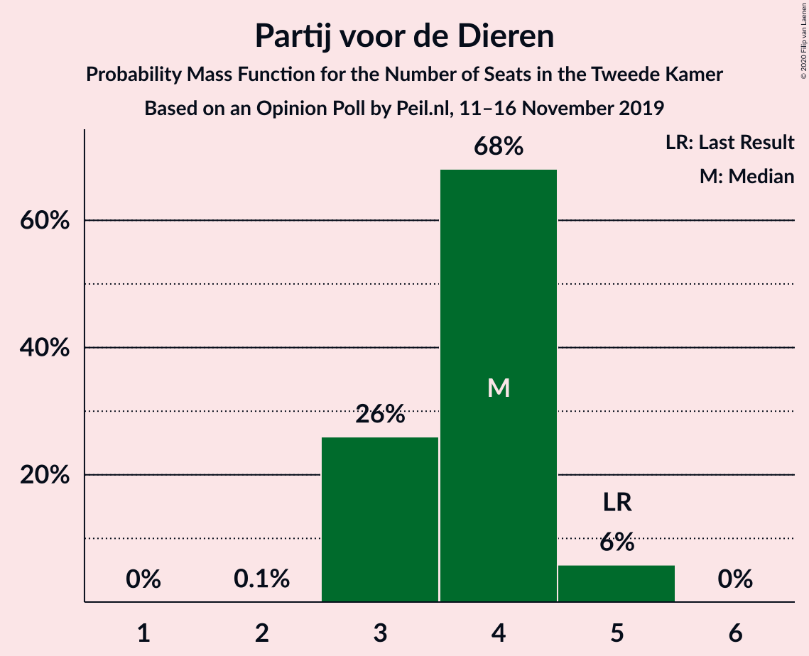

| Number of Seats | Probability | Accumulated | Special Marks |
|:---------------:|:-----------:|:-----------:|:-------------:|
| 3 | 62% | 100% | Median |
| 4 | 34% | 37% |  |
| 5 | 3% | 3% | Last Result |
| 6 | 0.1% | 0.1% |  |
| 7 | 0% | 0% |  |

### DENK

*For a full overview of the results for this party, see the [DENK](party-denk.html) page.*

| Number of Seats | Probability | Accumulated | Special Marks |
|:---------------:|:-----------:|:-----------:|:-------------:|
| 2 | 34% | 100% |  |
| 3 | 53% | 66% | Last Result, Median |
| 4 | 13% | 13% |  |
| 5 | 0% | 0% |  |

### Staatkundig Gereformeerde Partij

*For a full overview of the results for this party, see the [Staatkundig Gereformeerde Partij](party-staatkundiggereformeerdepartij.html) page.*

| Number of Seats | Probability | Accumulated | Special Marks |
|:---------------:|:-----------:|:-----------:|:-------------:|
| 1 | 47% | 100% |  |
| 2 | 52% | 53% | Median |
| 3 | 0.7% | 0.7% | Last Result |
| 4 | 0% | 0% |  |

## Coalitions

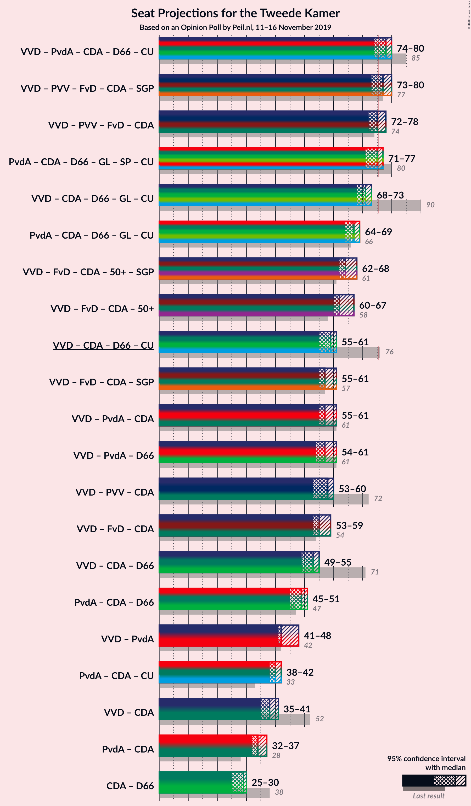

### Confidence Intervals

| Coalition | Last Result | Median | Majority? | 80% Confidence Interval | 90% Confidence Interval | 95% Confidence Interval | 99% Confidence Interval |
|:---------:|:-----------:|:------:|:---------:|:-----------------------:|:-----------------------:|:-----------------------:|:-----------------------:|
| Volkspartij voor Vrijheid en Democratie – Partij van de Arbeid – Christen-Democratisch Appèl – Democraten 66 – ChristenUnie | 85 | 78 | 92% | 77–81 | 73–81 | 73–81 | 73–82 |
| Volkspartij voor Vrijheid en Democratie – Partij voor de Vrijheid – Forum voor Democratie – Christen-Democratisch Appèl – Staatkundig Gereformeerde Partij | 77 | 76 | 86% | 73–79 | 73–80 | 73–80 | 72–80 |
| Volkspartij voor Vrijheid en Democratie – Partij voor de Vrijheid – Forum voor Democratie – Christen-Democratisch Appèl | 74 | 74 | 47% | 72–77 | 72–78 | 72–78 | 71–78 |
| Partij van de Arbeid – Christen-Democratisch Appèl – Democraten 66 – GroenLinks – Socialistische Partij – ChristenUnie | 80 | 74 | 11% | 72–77 | 70–77 | 70–77 | 70–78 |
| Volkspartij voor Vrijheid en Democratie – Christen-Democratisch Appèl – Democraten 66 – GroenLinks – ChristenUnie | 90 | 70 | 0% | 69–72 | 69–72 | 69–72 | 68–73 |
| Volkspartij voor Vrijheid en Democratie – Forum voor Democratie – Christen-Democratisch Appèl – 50Plus – Staatkundig Gereformeerde Partij | 61 | 64 | 0% | 62–69 | 62–69 | 62–70 | 62–70 |
| Partij van de Arbeid – Christen-Democratisch Appèl – Democraten 66 – GroenLinks – ChristenUnie | 66 | 66 | 0% | 65–69 | 64–69 | 64–69 | 63–70 |
| Volkspartij voor Vrijheid en Democratie – Forum voor Democratie – Christen-Democratisch Appèl – 50Plus | 58 | 62 | 0% | 60–67 | 60–67 | 60–68 | 60–68 |
| Volkspartij voor Vrijheid en Democratie – Forum voor Democratie – Christen-Democratisch Appèl – Staatkundig Gereformeerde Partij | 57 | 57 | 0% | 56–61 | 56–61 | 56–62 | 54–62 |
| Volkspartij voor Vrijheid en Democratie – Partij van de Arbeid – Christen-Democratisch Appèl | 61 | 60 | 0% | 58–61 | 55–61 | 55–62 | 55–64 |
| Volkspartij voor Vrijheid en Democratie – Partij van de Arbeid – Democraten 66 | 61 | 58 | 0% | 57–61 | 55–61 | 55–61 | 55–63 |
| Volkspartij voor Vrijheid en Democratie – Forum voor Democratie – Christen-Democratisch Appèl | 54 | 56 | 0% | 54–59 | 54–59 | 54–60 | 53–60 |
| Volkspartij voor Vrijheid en Democratie – Partij voor de Vrijheid – Christen-Democratisch Appèl | 72 | 57 | 0% | 56–59 | 56–59 | 55–59 | 53–61 |
| Volkspartij voor Vrijheid en Democratie – Christen-Democratisch Appèl – Democraten 66 – ChristenUnie | 76 | 58 | 0% | 55–59 | 54–59 | 54–59 | 54–60 |
| Volkspartij voor Vrijheid en Democratie – Christen-Democratisch Appèl – Democraten 66 | 71 | 52 | 0% | 49–53 | 49–53 | 49–54 | 48–54 |
| Partij van de Arbeid – Christen-Democratisch Appèl – Democraten 66 | 47 | 48 | 0% | 45–50 | 45–50 | 45–50 | 44–51 |
| Volkspartij voor Vrijheid en Democratie – Partij van de Arbeid | 42 | 45 | 0% | 43–47 | 42–47 | 42–48 | 41–50 |
| Partij van de Arbeid – Christen-Democratisch Appèl – ChristenUnie | 33 | 41 | 0% | 38–42 | 37–43 | 37–43 | 37–44 |
| Volkspartij voor Vrijheid en Democratie – Christen-Democratisch Appèl | 52 | 39 | 0% | 37–40 | 36–40 | 36–41 | 36–42 |
| Partij van de Arbeid – Christen-Democratisch Appèl | 28 | 35 | 0% | 32–36 | 32–37 | 32–37 | 31–38 |
| Christen-Democratisch Appèl – Democraten 66 | 38 | 26 | 0% | 25–29 | 25–29 | 25–29 | 24–30 |

### Volkspartij voor Vrijheid en Democratie – Partij van de Arbeid – Christen-Democratisch Appèl – Democraten 66 – ChristenUnie

| Number of Seats | Probability | Accumulated | Special Marks |
|:---------------:|:-----------:|:-----------:|:-------------:|
| 73 | 6% | 100% |  |
| 74 | 0.8% | 94% |  |
| 75 | 2% | 94% |  |
| 76 | 1.1% | 92% | Majority |
| 77 | 39% | 91% | Median |
| 78 | 33% | 51% |  |
| 79 | 3% | 19% |  |
| 80 | 3% | 15% |  |
| 81 | 11% | 12% |  |
| 82 | 1.0% | 1.1% |  |
| 83 | 0% | 0.1% |  |
| 84 | 0% | 0% |  |
| 85 | 0% | 0% | Last Result |

### Volkspartij voor Vrijheid en Democratie – Partij voor de Vrijheid – Forum voor Democratie – Christen-Democratisch Appèl – Staatkundig Gereformeerde Partij

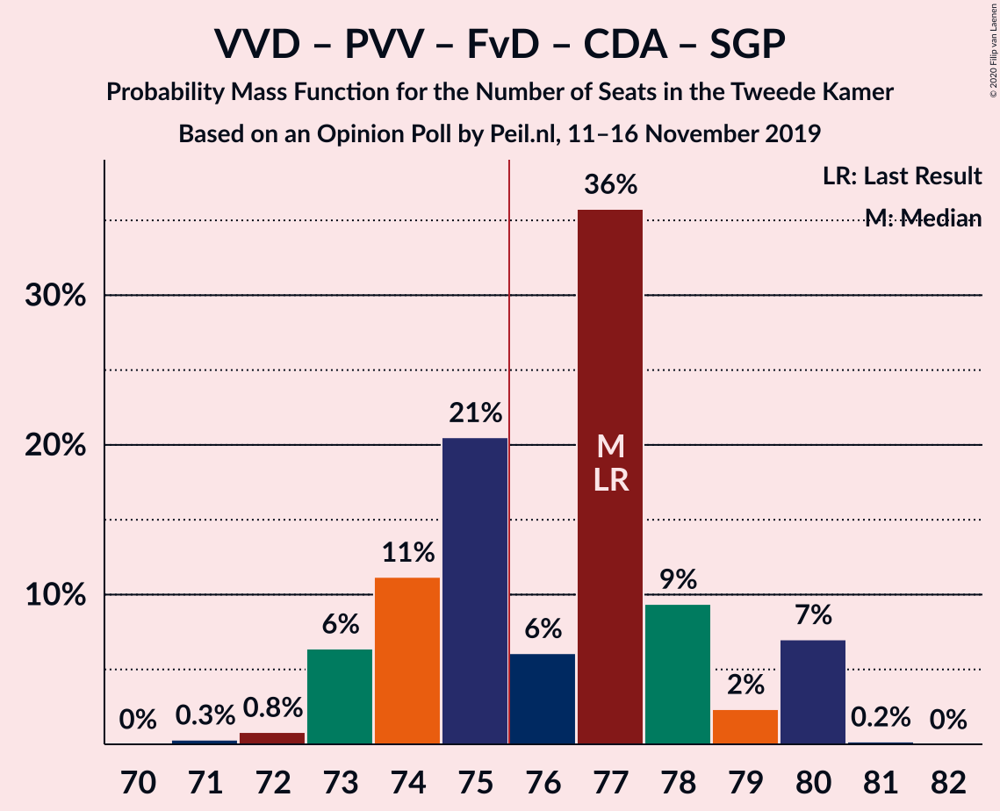

| Number of Seats | Probability | Accumulated | Special Marks |
|:---------------:|:-----------:|:-----------:|:-------------:|
| 71 | 0.3% | 100% |  |
| 72 | 0.5% | 99.7% |  |
| 73 | 9% | 99.2% |  |
| 74 | 0.5% | 90% |  |
| 75 | 3% | 89% |  |
| 76 | 38% | 86% | Majority |
| 77 | 30% | 48% | Last Result, Median |
| 78 | 5% | 18% |  |
| 79 | 5% | 13% |  |
| 80 | 8% | 8% |  |
| 81 | 0.1% | 0.2% |  |
| 82 | 0% | 0% |  |

### Volkspartij voor Vrijheid en Democratie – Partij voor de Vrijheid – Forum voor Democratie – Christen-Democratisch Appèl

| Number of Seats | Probability | Accumulated | Special Marks |
|:---------------:|:-----------:|:-----------:|:-------------:|
| 69 | 0.1% | 100% |  |
| 70 | 0.2% | 99.9% |  |
| 71 | 0.6% | 99.6% |  |
| 72 | 10% | 99.0% |  |
| 73 | 3% | 89% |  |
| 74 | 36% | 86% | Last Result |
| 75 | 3% | 50% | Median |
| 76 | 30% | 47% | Majority |
| 77 | 8% | 17% |  |
| 78 | 9% | 9% |  |
| 79 | 0.1% | 0.1% |  |
| 80 | 0% | 0% |  |

### Partij van de Arbeid – Christen-Democratisch Appèl – Democraten 66 – GroenLinks – Socialistische Partij – ChristenUnie

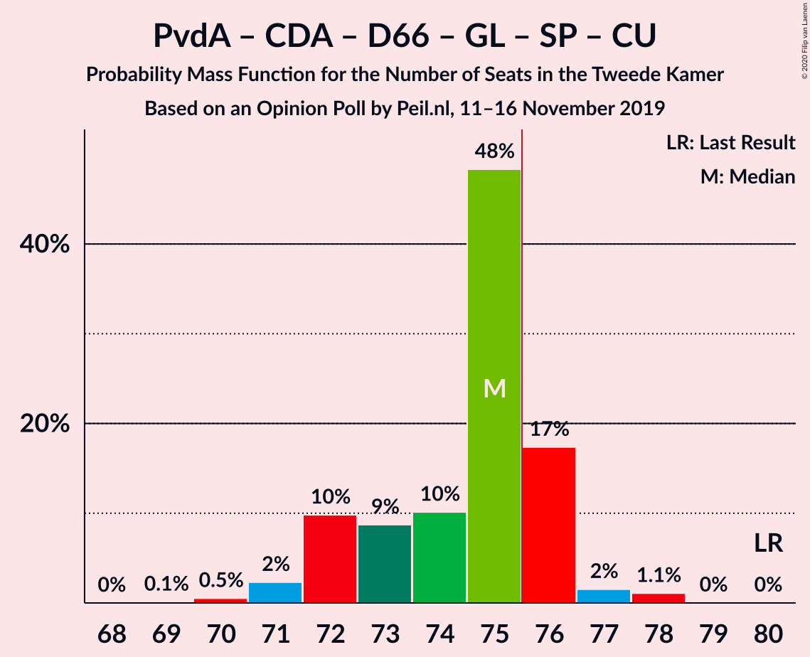

| Number of Seats | Probability | Accumulated | Special Marks |
|:---------------:|:-----------:|:-----------:|:-------------:|
| 70 | 7% | 100% |  |
| 71 | 0.2% | 93% |  |
| 72 | 27% | 92% |  |
| 73 | 6% | 66% |  |
| 74 | 13% | 60% | Median |
| 75 | 36% | 46% |  |
| 76 | 0.4% | 11% | Majority |
| 77 | 9% | 10% |  |
| 78 | 0.6% | 0.7% |  |
| 79 | 0% | 0.1% |  |
| 80 | 0% | 0% | Last Result |

### Volkspartij voor Vrijheid en Democratie – Christen-Democratisch Appèl – Democraten 66 – GroenLinks – ChristenUnie

| Number of Seats | Probability | Accumulated | Special Marks |
|:---------------:|:-----------:|:-----------:|:-------------:|
| 65 | 0.2% | 100% |  |
| 66 | 0% | 99.8% |  |
| 67 | 0.3% | 99.8% |  |
| 68 | 2% | 99.5% |  |
| 69 | 38% | 98% |  |
| 70 | 10% | 60% | Median |
| 71 | 6% | 50% |  |
| 72 | 43% | 44% |  |
| 73 | 0.7% | 1.0% |  |
| 74 | 0.2% | 0.3% |  |
| 75 | 0.1% | 0.1% |  |
| 76 | 0% | 0% | Majority |
| 77 | 0% | 0% |  |
| 78 | 0% | 0% |  |
| 79 | 0% | 0% |  |
| 80 | 0% | 0% |  |
| 81 | 0% | 0% |  |
| 82 | 0% | 0% |  |
| 83 | 0% | 0% |  |
| 84 | 0% | 0% |  |
| 85 | 0% | 0% |  |
| 86 | 0% | 0% |  |
| 87 | 0% | 0% |  |
| 88 | 0% | 0% |  |
| 89 | 0% | 0% |  |
| 90 | 0% | 0% | Last Result |

### Volkspartij voor Vrijheid en Democratie – Forum voor Democratie – Christen-Democratisch Appèl – 50Plus – Staatkundig Gereformeerde Partij

| Number of Seats | Probability | Accumulated | Special Marks |
|:---------------:|:-----------:|:-----------:|:-------------:|
| 60 | 0.1% | 100% |  |
| 61 | 0.3% | 99.9% | Last Result |
| 62 | 37% | 99.6% |  |
| 63 | 12% | 63% |  |
| 64 | 7% | 51% |  |
| 65 | 4% | 44% | Median |
| 66 | 3% | 40% |  |
| 67 | 1.0% | 37% |  |
| 68 | 25% | 36% |  |
| 69 | 8% | 11% |  |
| 70 | 3% | 3% |  |
| 71 | 0% | 0% |  |

### Partij van de Arbeid – Christen-Democratisch Appèl – Democraten 66 – GroenLinks – ChristenUnie

| Number of Seats | Probability | Accumulated | Special Marks |
|:---------------:|:-----------:|:-----------:|:-------------:|
| 62 | 0.4% | 100% |  |
| 63 | 0.9% | 99.6% |  |
| 64 | 8% | 98.7% |  |
| 65 | 30% | 91% |  |
| 66 | 11% | 61% | Last Result |
| 67 | 5% | 50% | Median |
| 68 | 33% | 44% |  |
| 69 | 10% | 11% |  |
| 70 | 0.2% | 0.7% |  |
| 71 | 0.1% | 0.4% |  |
| 72 | 0.3% | 0.4% |  |
| 73 | 0% | 0% |  |

### Volkspartij voor Vrijheid en Democratie – Forum voor Democratie – Christen-Democratisch Appèl – 50Plus

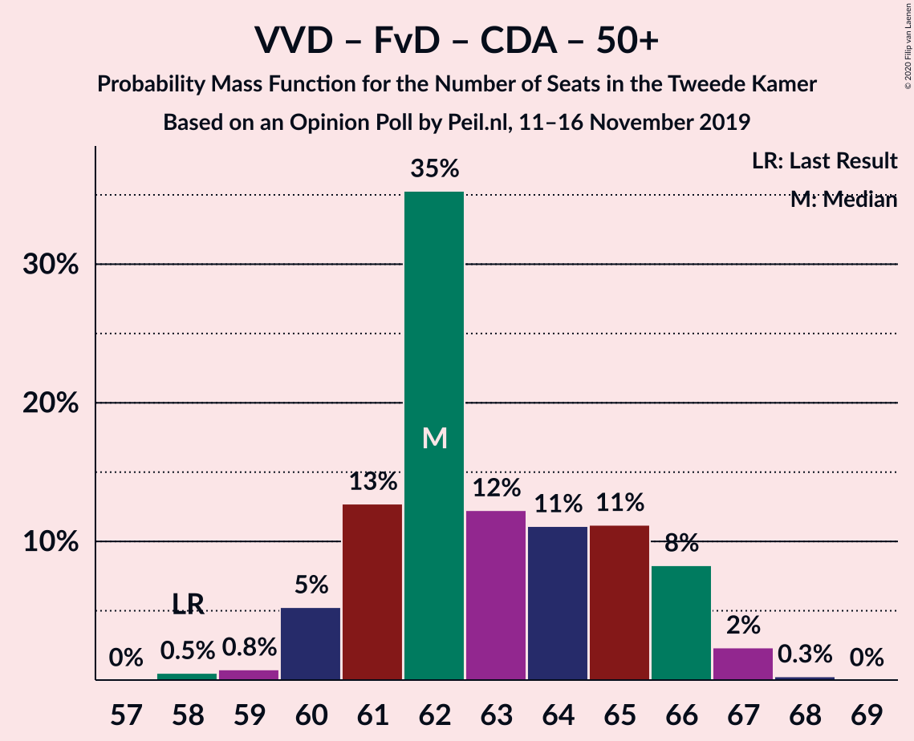

| Number of Seats | Probability | Accumulated | Special Marks |
|:---------------:|:-----------:|:-----------:|:-------------:|
| 58 | 0.1% | 100% | Last Result |
| 59 | 0.2% | 99.9% |  |
| 60 | 36% | 99.8% |  |
| 61 | 1.4% | 64% |  |
| 62 | 13% | 62% |  |
| 63 | 7% | 49% | Median |
| 64 | 3% | 42% |  |
| 65 | 2% | 39% |  |
| 66 | 1.0% | 37% |  |
| 67 | 31% | 36% |  |
| 68 | 4% | 4% |  |
| 69 | 0% | 0% |  |

### Volkspartij voor Vrijheid en Democratie – Forum voor Democratie – Christen-Democratisch Appèl – Staatkundig Gereformeerde Partij

| Number of Seats | Probability | Accumulated | Special Marks |
|:---------------:|:-----------:|:-----------:|:-------------:|
| 53 | 0% | 100% |  |
| 54 | 0.7% | 99.9% |  |
| 55 | 0.8% | 99.2% |  |
| 56 | 45% | 98% |  |
| 57 | 8% | 53% | Last Result |
| 58 | 6% | 45% | Median |
| 59 | 2% | 40% |  |
| 60 | 26% | 37% |  |
| 61 | 8% | 12% |  |
| 62 | 4% | 4% |  |
| 63 | 0.1% | 0.1% |  |
| 64 | 0% | 0% |  |

### Volkspartij voor Vrijheid en Democratie – Partij van de Arbeid – Christen-Democratisch Appèl

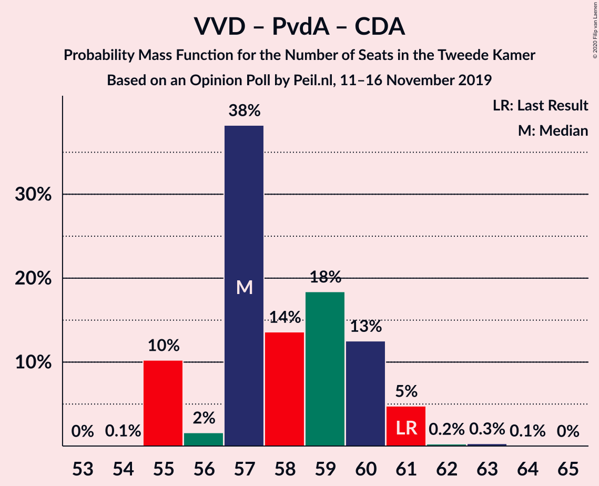

| Number of Seats | Probability | Accumulated | Special Marks |
|:---------------:|:-----------:|:-----------:|:-------------:|
| 54 | 0.4% | 100% |  |
| 55 | 6% | 99.6% |  |
| 56 | 1.1% | 94% |  |
| 57 | 2% | 93% |  |
| 58 | 12% | 91% |  |
| 59 | 28% | 79% | Median |
| 60 | 33% | 51% |  |
| 61 | 15% | 18% | Last Result |
| 62 | 1.0% | 3% |  |
| 63 | 0.5% | 2% |  |
| 64 | 2% | 2% |  |
| 65 | 0% | 0% |  |

### Volkspartij voor Vrijheid en Democratie – Partij van de Arbeid – Democraten 66

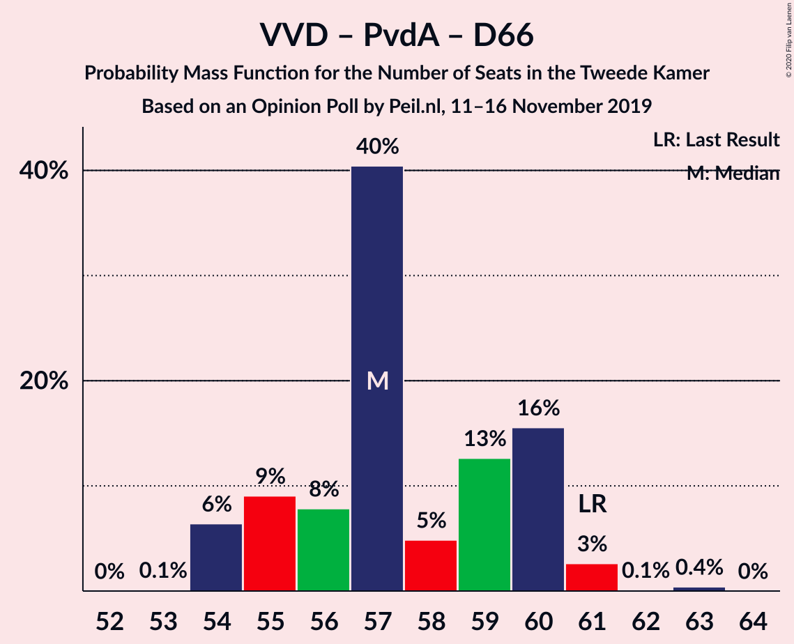

| Number of Seats | Probability | Accumulated | Special Marks |
|:---------------:|:-----------:|:-----------:|:-------------:|
| 54 | 0.4% | 100% |  |
| 55 | 9% | 99.5% |  |
| 56 | 0.9% | 91% |  |
| 57 | 36% | 90% | Median |
| 58 | 8% | 54% |  |
| 59 | 33% | 46% |  |
| 60 | 1.2% | 12% |  |
| 61 | 11% | 11% | Last Result |
| 62 | 0.1% | 0.7% |  |
| 63 | 0.5% | 0.6% |  |
| 64 | 0.1% | 0.1% |  |
| 65 | 0% | 0% |  |

### Volkspartij voor Vrijheid en Democratie – Forum voor Democratie – Christen-Democratisch Appèl

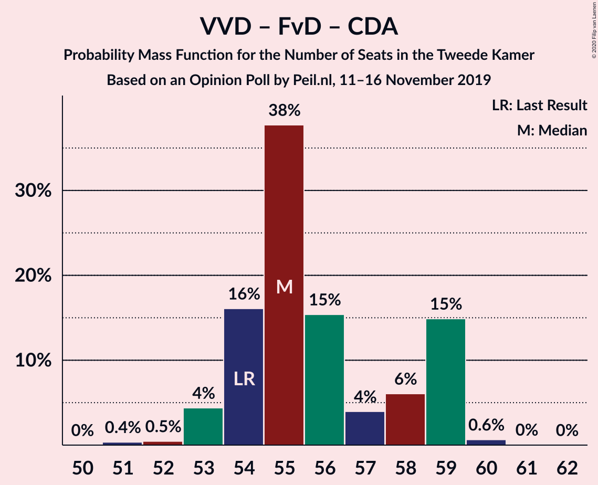

| Number of Seats | Probability | Accumulated | Special Marks |
|:---------------:|:-----------:|:-----------:|:-------------:|
| 51 | 0% | 100% |  |
| 52 | 0.3% | 99.9% |  |
| 53 | 0.7% | 99.7% |  |
| 54 | 36% | 98.9% | Last Result |
| 55 | 10% | 63% |  |
| 56 | 10% | 52% | Median |
| 57 | 3% | 42% |  |
| 58 | 3% | 39% |  |
| 59 | 32% | 36% |  |
| 60 | 5% | 5% |  |
| 61 | 0.1% | 0.1% |  |
| 62 | 0% | 0% |  |

### Volkspartij voor Vrijheid en Democratie – Partij voor de Vrijheid – Christen-Democratisch Appèl

| Number of Seats | Probability | Accumulated | Special Marks |
|:---------------:|:-----------:|:-----------:|:-------------:|
| 53 | 0.5% | 100% |  |
| 54 | 0.6% | 99.5% |  |
| 55 | 2% | 98.9% |  |
| 56 | 15% | 97% |  |
| 57 | 60% | 81% | Median |
| 58 | 5% | 21% |  |
| 59 | 14% | 16% |  |
| 60 | 0.8% | 2% |  |
| 61 | 0.7% | 0.8% |  |
| 62 | 0.1% | 0.1% |  |
| 63 | 0% | 0% |  |
| 64 | 0% | 0% |  |
| 65 | 0% | 0% |  |
| 66 | 0% | 0% |  |
| 67 | 0% | 0% |  |
| 68 | 0% | 0% |  |
| 69 | 0% | 0% |  |
| 70 | 0% | 0% |  |
| 71 | 0% | 0% |  |
| 72 | 0% | 0% | Last Result |

### Volkspartij voor Vrijheid en Democratie – Christen-Democratisch Appèl – Democraten 66 – ChristenUnie

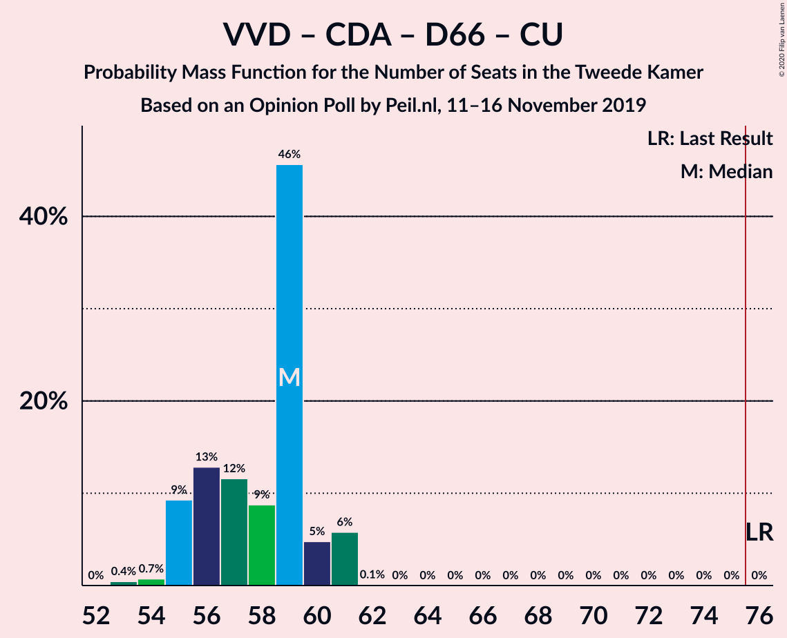

| Number of Seats | Probability | Accumulated | Special Marks |
|:---------------:|:-----------:|:-----------:|:-------------:|
| 53 | 0.3% | 100% |  |
| 54 | 6% | 99.7% |  |
| 55 | 31% | 94% |  |
| 56 | 3% | 63% | Median |
| 57 | 7% | 59% |  |
| 58 | 30% | 52% |  |
| 59 | 21% | 22% |  |
| 60 | 0.9% | 1.4% |  |
| 61 | 0.4% | 0.5% |  |
| 62 | 0% | 0.1% |  |
| 63 | 0% | 0% |  |
| 64 | 0% | 0% |  |
| 65 | 0% | 0% |  |
| 66 | 0% | 0% |  |
| 67 | 0% | 0% |  |
| 68 | 0% | 0% |  |
| 69 | 0% | 0% |  |
| 70 | 0% | 0% |  |
| 71 | 0% | 0% |  |
| 72 | 0% | 0% |  |
| 73 | 0% | 0% |  |
| 74 | 0% | 0% |  |
| 75 | 0% | 0% |  |
| 76 | 0% | 0% | Last Result, Majority |

### Volkspartij voor Vrijheid en Democratie – Christen-Democratisch Appèl – Democraten 66

| Number of Seats | Probability | Accumulated | Special Marks |
|:---------------:|:-----------:|:-----------:|:-------------:|
| 47 | 0.2% | 100% |  |
| 48 | 0.6% | 99.8% |  |
| 49 | 36% | 99.2% |  |
| 50 | 1.5% | 63% | Median |
| 51 | 4% | 62% |  |
| 52 | 32% | 57% |  |
| 53 | 22% | 25% |  |
| 54 | 3% | 3% |  |
| 55 | 0.2% | 0.3% |  |
| 56 | 0% | 0.1% |  |
| 57 | 0% | 0.1% |  |
| 58 | 0% | 0% |  |
| 59 | 0% | 0% |  |
| 60 | 0% | 0% |  |
| 61 | 0% | 0% |  |
| 62 | 0% | 0% |  |
| 63 | 0% | 0% |  |
| 64 | 0% | 0% |  |
| 65 | 0% | 0% |  |
| 66 | 0% | 0% |  |
| 67 | 0% | 0% |  |
| 68 | 0% | 0% |  |
| 69 | 0% | 0% |  |
| 70 | 0% | 0% |  |
| 71 | 0% | 0% | Last Result |

### Partij van de Arbeid – Christen-Democratisch Appèl – Democraten 66

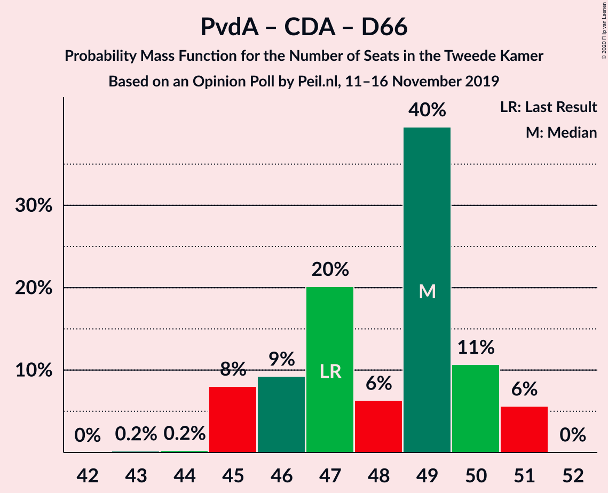

| Number of Seats | Probability | Accumulated | Special Marks |
|:---------------:|:-----------:|:-----------:|:-------------:|
| 43 | 0.4% | 100% |  |
| 44 | 0.3% | 99.6% |  |
| 45 | 38% | 99.3% |  |
| 46 | 2% | 62% |  |
| 47 | 6% | 60% | Last Result, Median |
| 48 | 32% | 54% |  |
| 49 | 7% | 23% |  |
| 50 | 14% | 15% |  |
| 51 | 0.5% | 0.9% |  |
| 52 | 0.4% | 0.4% |  |
| 53 | 0% | 0% |  |

### Volkspartij voor Vrijheid en Democratie – Partij van de Arbeid

| Number of Seats | Probability | Accumulated | Special Marks |
|:---------------:|:-----------:|:-----------:|:-------------:|
| 41 | 0.5% | 100% |  |
| 42 | 7% | 99.5% | Last Result |
| 43 | 6% | 92% |  |
| 44 | 9% | 87% |  |
| 45 | 32% | 77% | Median |
| 46 | 3% | 46% |  |
| 47 | 40% | 43% |  |
| 48 | 1.1% | 3% |  |
| 49 | 1.2% | 2% |  |
| 50 | 0% | 0.5% |  |
| 51 | 0.5% | 0.5% |  |
| 52 | 0% | 0% |  |

### Partij van de Arbeid – Christen-Democratisch Appèl – ChristenUnie

| Number of Seats | Probability | Accumulated | Special Marks |
|:---------------:|:-----------:|:-----------:|:-------------:|
| 33 | 0% | 100% | Last Result |
| 34 | 0% | 100% |  |
| 35 | 0.1% | 100% |  |
| 36 | 0.1% | 99.9% |  |
| 37 | 7% | 99.7% |  |
| 38 | 9% | 93% |  |
| 39 | 29% | 85% |  |
| 40 | 5% | 55% |  |
| 41 | 0.8% | 50% | Median |
| 42 | 44% | 50% |  |
| 43 | 3% | 5% |  |
| 44 | 2% | 2% |  |
| 45 | 0.4% | 0.4% |  |
| 46 | 0% | 0% |  |

### Volkspartij voor Vrijheid en Democratie – Christen-Democratisch Appèl

| Number of Seats | Probability | Accumulated | Special Marks |
|:---------------:|:-----------:|:-----------:|:-------------:|
| 35 | 0.4% | 100% |  |
| 36 | 6% | 99.6% |  |
| 37 | 32% | 93% |  |
| 38 | 8% | 61% | Median |
| 39 | 11% | 54% |  |
| 40 | 40% | 43% |  |
| 41 | 2% | 3% |  |
| 42 | 0.6% | 0.7% |  |
| 43 | 0% | 0.1% |  |
| 44 | 0% | 0% |  |
| 45 | 0% | 0% |  |
| 46 | 0% | 0% |  |
| 47 | 0% | 0% |  |
| 48 | 0% | 0% |  |
| 49 | 0% | 0% |  |
| 50 | 0% | 0% |  |
| 51 | 0% | 0% |  |
| 52 | 0% | 0% | Last Result |

### Partij van de Arbeid – Christen-Democratisch Appèl

| Number of Seats | Probability | Accumulated | Special Marks |
|:---------------:|:-----------:|:-----------:|:-------------:|
| 28 | 0% | 100% | Last Result |
| 29 | 0% | 100% |  |
| 30 | 0.3% | 100% |  |
| 31 | 0.7% | 99.7% |  |
| 32 | 13% | 99.1% |  |
| 33 | 26% | 86% |  |
| 34 | 5% | 60% |  |
| 35 | 5% | 54% | Median |
| 36 | 40% | 49% |  |
| 37 | 8% | 9% |  |
| 38 | 1.0% | 1.1% |  |
| 39 | 0.1% | 0.1% |  |
| 40 | 0% | 0% |  |

### Christen-Democratisch Appèl – Democraten 66

| Number of Seats | Probability | Accumulated | Special Marks |
|:---------------:|:-----------:|:-----------:|:-------------:|
| 24 | 1.1% | 100% |  |
| 25 | 30% | 98.9% |  |
| 26 | 34% | 69% | Median |
| 27 | 12% | 35% |  |
| 28 | 11% | 23% |  |
| 29 | 10% | 11% |  |
| 30 | 0.9% | 1.0% |  |
| 31 | 0% | 0.1% |  |
| 32 | 0% | 0% |  |
| 33 | 0% | 0% |  |
| 34 | 0% | 0% |  |
| 35 | 0% | 0% |  |
| 36 | 0% | 0% |  |
| 37 | 0% | 0% |  |
| 38 | 0% | 0% | Last Result |

## Technical Information

### Opinion Poll

+ **Polling firm:** Peil.nl
+ **Commissioner(s):** —
+ **Fieldwork period:** 11–16 November 2019

### Calculations

+ **Sample size:** 3000
+ **Simulations done:** 131,072
+ **Error estimate:** 2.01%

