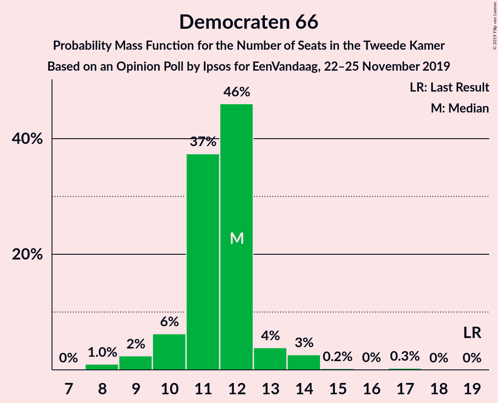
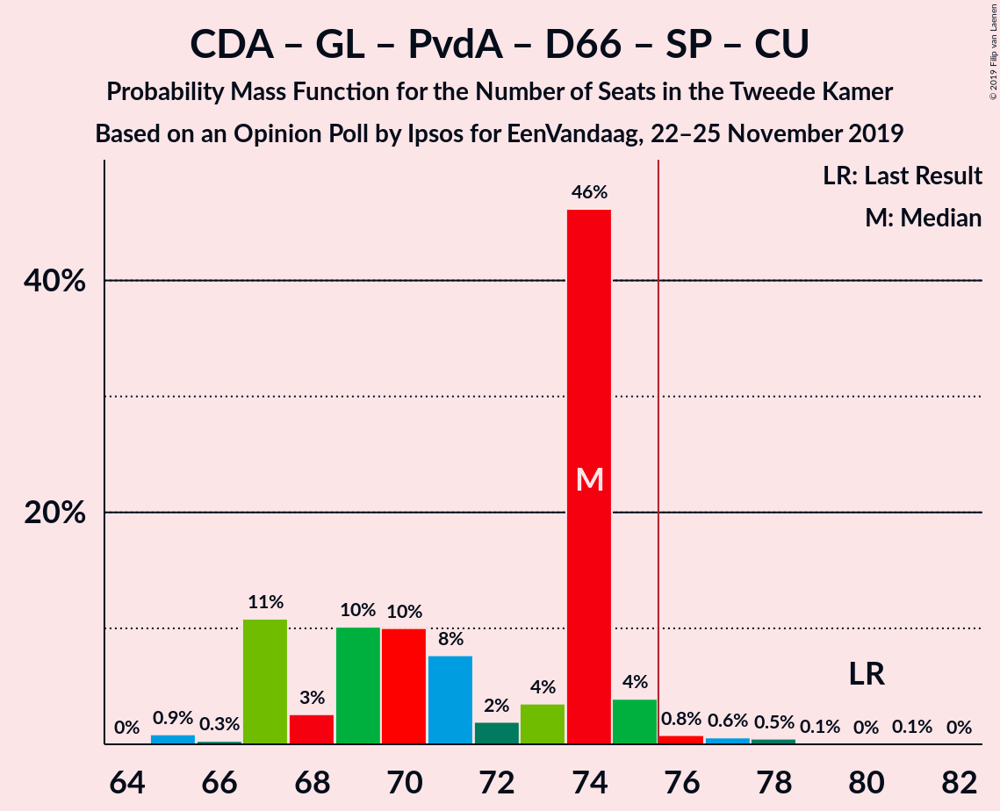

# Opinion Poll by Ipsos for EenVandaag, 22–25 November 2019

<a href="#voting-intentions">Voting Intentions</a> | <a href="#seats">Seats</a> | <a href="#coalitions">Coalitions</a> | <a href="#technical-information">Technical Information</a>

## Voting Intentions

### Confidence Intervals

| Party | Last Result | Poll Result | 80% Confidence Interval | 90% Confidence Interval | 95% Confidence Interval | 99% Confidence Interval |
|:-----:|:-----------:|:-----------:|:-----------------------:|:-----------------------:|:-----------------------:|:-----------------------:|
| Volkspartij voor Vrijheid en Democratie | 21.3% | 17.2% | 15.7–18.8% |15.3–19.3% |15.0–19.6% |14.3–20.4% |
| Christen-Democratisch Appèl | 12.4% | 12.0% | 10.8–13.4% |10.4–13.8% |10.1–14.1% |9.6–14.8% |
| Partij voor de Vrijheid | 13.1% | 11.7% | 10.5–13.1% |10.1–13.5% |9.8–13.8% |9.3–14.5% |
| GroenLinks | 9.1% | 10.5% | 9.4–11.8% |9.0–12.2% |8.8–12.6% |8.2–13.2% |
| Forum voor Democratie | 1.8% | 9.1% | 8.1–10.4% |7.8–10.8% |7.5–11.1% |7.0–11.7% |
| Partij van de Arbeid | 5.7% | 8.8% | 7.8–10.1% |7.5–10.4% |7.2–10.7% |6.8–11.4% |
| Democraten 66 | 12.2% | 7.7% | 6.7–8.8% |6.4–9.2% |6.2–9.5% |5.7–10.1% |
| 50Plus | 3.1% | 5.6% | 4.8–6.6% |4.5–6.9% |4.3–7.2% |4.0–7.7% |
| Socialistische Partij | 9.1% | 5.1% | 4.3–6.1% |4.1–6.4% |3.9–6.6% |3.6–7.1% |
| Partij voor de Dieren | 3.2% | 4.0% | 3.3–4.9% |3.1–5.2% |3.0–5.4% |2.7–5.9% |
| ChristenUnie | 3.4% | 3.6% | 3.0–4.5% |2.8–4.8% |2.7–5.0% |2.4–5.4% |
| Staatkundig Gereformeerde Partij | 2.1% | 2.3% | 1.8–3.0% |1.6–3.2% |1.5–3.4% |1.3–3.7% |
| DENK | 2.1% | 1.6% | 1.2–2.2% |1.1–2.4% |1.0–2.5% |0.8–2.9% |

*Note:* The poll result column reflects the actual value used in the calculations. Published results may vary slightly, and in addition be rounded to fewer digits.

## Seats

### Confidence Intervals

| Party | Last Result | Median | 80% Confidence Interval | 90% Confidence Interval | 95% Confidence Interval | 99% Confidence Interval |
|:-----:|:-----------:|:------:|:-----------------------:|:-----------------------:|:-----------------------:|:-----------------------:|
| <a href="#volkspartij-voor-vrijheid-en-democratie">Volkspartij voor Vrijheid en Democratie</a> | 33 | 25 | 24–29 |24–29 |23–30 |22–30 |
| <a href="#christen-democratisch-appèl">Christen-Democratisch Appèl</a> | 19 | 20 | 17–20 |16–21 |16–21 |14–24 |
| <a href="#partij-voor-de-vrijheid">Partij voor de Vrijheid</a> | 20 | 16 | 16–20 |16–20 |15–21 |14–21 |
| <a href="#groenlinks">GroenLinks</a> | 14 | 17 | 13–18 |13–18 |13–18 |12–20 |
| <a href="#forum-voor-democratie">Forum voor Democratie</a> | 2 | 15 | 13–16 |12–16 |12–17 |11–18 |
| <a href="#partij-van-de-arbeid">Partij van de Arbeid</a> | 9 | 14 | 11–14 |11–15 |11–16 |10–17 |
| <a href="#democraten-66">Democraten 66</a> | 19 | 12 | 11–12 |10–13 |9–14 |8–15 |
| <a href="#50plus">50Plus</a> | 4 | 9 | 7–11 |6–11 |6–11 |6–11 |
| <a href="#socialistische-partij">Socialistische Partij</a> | 14 | 7 | 7–9 |6–9 |6–10 |5–10 |
| <a href="#partij-voor-de-dieren">Partij voor de Dieren</a> | 5 | 5 | 5–7 |4–7 |4–7 |3–10 |
| <a href="#christenunie">ChristenUnie</a> | 5 | 4 | 4–6 |4–6 |3–6 |3–7 |
| <a href="#staatkundig-gereformeerde-partij">Staatkundig Gereformeerde Partij</a> | 3 | 4 | 2–4 |2–4 |2–4 |2–5 |
| <a href="#denk">DENK</a> | 3 | 1 | 1–3 |1–3 |1–4 |1–4 |

### Volkspartij voor Vrijheid en Democratie

*For a full overview of the results for this party, see the [Volkspartij voor Vrijheid en Democratie](party-volkspartijvoorvrijheidendemocratie.html) page.*

| Number of Seats | Probability | Accumulated | Special Marks |
|:---------------:|:-----------:|:-----------:|:-------------:|
| 21 | 0.2% | 100% |  |
| 22 | 1.4% | 99.7% |  |
| 23 | 1.4% | 98% |  |
| 24 | 7% | 97% |  |
| 25 | 51% | 90% | Median |
| 26 | 6% | 39% |  |
| 27 | 10% | 33% |  |
| 28 | 12% | 22% |  |
| 29 | 6% | 10% |  |
| 30 | 4% | 4% |  |
| 31 | 0.2% | 0.3% |  |
| 32 | 0% | 0.1% |  |
| 33 | 0% | 0.1% | Last Result |
| 34 | 0% | 0% |  |

### Christen-Democratisch Appèl

*For a full overview of the results for this party, see the [Christen-Democratisch Appèl](party-christen-democratischappèl.html) page.*

| Number of Seats | Probability | Accumulated | Special Marks |
|:---------------:|:-----------:|:-----------:|:-------------:|
| 13 | 0.5% | 100% |  |
| 14 | 0.2% | 99.5% |  |
| 15 | 0.7% | 99.3% |  |
| 16 | 5% | 98.6% |  |
| 17 | 17% | 94% |  |
| 18 | 5% | 77% |  |
| 19 | 17% | 71% | Last Result |
| 20 | 48% | 55% | Median |
| 21 | 5% | 6% |  |
| 22 | 0.2% | 2% |  |
| 23 | 1.1% | 2% |  |
| 24 | 0.5% | 0.5% |  |
| 25 | 0% | 0% |  |

### Partij voor de Vrijheid

*For a full overview of the results for this party, see the [Partij voor de Vrijheid](party-partijvoordevrijheid.html) page.*

| Number of Seats | Probability | Accumulated | Special Marks |
|:---------------:|:-----------:|:-----------:|:-------------:|
| 14 | 1.2% | 100% |  |
| 15 | 2% | 98.8% |  |
| 16 | 49% | 97% | Median |
| 17 | 10% | 48% |  |
| 18 | 7% | 38% |  |
| 19 | 16% | 31% |  |
| 20 | 11% | 15% | Last Result |
| 21 | 3% | 4% |  |
| 22 | 0.3% | 0.5% |  |
| 23 | 0.1% | 0.1% |  |
| 24 | 0% | 0% |  |

### GroenLinks

*For a full overview of the results for this party, see the [GroenLinks](party-groenlinks.html) page.*

| Number of Seats | Probability | Accumulated | Special Marks |
|:---------------:|:-----------:|:-----------:|:-------------:|
| 11 | 0.1% | 100% |  |
| 12 | 0.6% | 99.9% |  |
| 13 | 10% | 99.3% |  |
| 14 | 9% | 89% | Last Result |
| 15 | 15% | 80% |  |
| 16 | 4% | 66% |  |
| 17 | 52% | 62% | Median |
| 18 | 9% | 11% |  |
| 19 | 0.8% | 1.5% |  |
| 20 | 0.6% | 0.7% |  |
| 21 | 0.1% | 0.1% |  |
| 22 | 0% | 0% |  |

### Forum voor Democratie

*For a full overview of the results for this party, see the [Forum voor Democratie](party-forumvoordemocratie.html) page.*

| Number of Seats | Probability | Accumulated | Special Marks |
|:---------------:|:-----------:|:-----------:|:-------------:|
| 2 | 0% | 100% | Last Result |
| 3 | 0% | 100% |  |
| 4 | 0% | 100% |  |
| 5 | 0% | 100% |  |
| 6 | 0% | 100% |  |
| 7 | 0% | 100% |  |
| 8 | 0% | 100% |  |
| 9 | 0% | 100% |  |
| 10 | 0.3% | 100% |  |
| 11 | 1.0% | 99.7% |  |
| 12 | 5% | 98.7% |  |
| 13 | 8% | 94% |  |
| 14 | 16% | 86% |  |
| 15 | 58% | 70% | Median |
| 16 | 8% | 12% |  |
| 17 | 3% | 4% |  |
| 18 | 0.4% | 0.6% |  |
| 19 | 0.1% | 0.2% |  |
| 20 | 0.1% | 0.1% |  |
| 21 | 0% | 0% |  |

### Partij van de Arbeid

*For a full overview of the results for this party, see the [Partij van de Arbeid](party-partijvandearbeid.html) page.*

| Number of Seats | Probability | Accumulated | Special Marks |
|:---------------:|:-----------:|:-----------:|:-------------:|
| 9 | 0.2% | 100% | Last Result |
| 10 | 1.3% | 99.8% |  |
| 11 | 15% | 98.5% |  |
| 12 | 6% | 84% |  |
| 13 | 22% | 78% |  |
| 14 | 49% | 56% | Median |
| 15 | 4% | 7% |  |
| 16 | 2% | 3% |  |
| 17 | 0.7% | 0.9% |  |
| 18 | 0.1% | 0.1% |  |
| 19 | 0% | 0% |  |

### Democraten 66

*For a full overview of the results for this party, see the [Democraten 66](party-democraten66.html) page.*

| Number of Seats | Probability | Accumulated | Special Marks |
|:---------------:|:-----------:|:-----------:|:-------------:|
| 8 | 1.0% | 100% |  |
| 9 | 2% | 99.0% |  |
| 10 | 6% | 97% |  |
| 11 | 37% | 90% |  |
| 12 | 46% | 53% | Median |
| 13 | 4% | 7% |  |
| 14 | 3% | 3% |  |
| 15 | 0.2% | 0.5% |  |
| 16 | 0% | 0.3% |  |
| 17 | 0.3% | 0.3% |  |
| 18 | 0% | 0% |  |
| 19 | 0% | 0% | Last Result |

### 50Plus

*For a full overview of the results for this party, see the [50Plus](party-50plus.html) page.*

| Number of Seats | Probability | Accumulated | Special Marks |
|:---------------:|:-----------:|:-----------:|:-------------:|
| 4 | 0% | 100% | Last Result |
| 5 | 0% | 100% |  |
| 6 | 8% | 100% |  |
| 7 | 7% | 92% |  |
| 8 | 16% | 85% |  |
| 9 | 54% | 69% | Median |
| 10 | 3% | 15% |  |
| 11 | 12% | 12% |  |
| 12 | 0.1% | 0.1% |  |
| 13 | 0% | 0% |  |

### Socialistische Partij

*For a full overview of the results for this party, see the [Socialistische Partij](party-socialistischepartij.html) page.*

| Number of Seats | Probability | Accumulated | Special Marks |
|:---------------:|:-----------:|:-----------:|:-------------:|
| 5 | 2% | 100% |  |
| 6 | 6% | 98% |  |
| 7 | 64% | 92% | Median |
| 8 | 12% | 28% |  |
| 9 | 12% | 16% |  |
| 10 | 4% | 4% |  |
| 11 | 0.2% | 0.3% |  |
| 12 | 0% | 0% |  |
| 13 | 0% | 0% |  |
| 14 | 0% | 0% | Last Result |

### Partij voor de Dieren

*For a full overview of the results for this party, see the [Partij voor de Dieren](party-partijvoordedieren.html) page.*

| Number of Seats | Probability | Accumulated | Special Marks |
|:---------------:|:-----------:|:-----------:|:-------------:|
| 3 | 0.5% | 100% |  |
| 4 | 5% | 99.5% |  |
| 5 | 69% | 94% | Last Result, Median |
| 6 | 13% | 25% |  |
| 7 | 10% | 12% |  |
| 8 | 1.0% | 2% |  |
| 9 | 0.2% | 0.8% |  |
| 10 | 0.5% | 0.6% |  |
| 11 | 0.1% | 0.1% |  |
| 12 | 0% | 0% |  |

### ChristenUnie

*For a full overview of the results for this party, see the [ChristenUnie](party-christenunie.html) page.*

| Number of Seats | Probability | Accumulated | Special Marks |
|:---------------:|:-----------:|:-----------:|:-------------:|
| 3 | 5% | 100% |  |
| 4 | 59% | 95% | Median |
| 5 | 13% | 36% | Last Result |
| 6 | 21% | 23% |  |
| 7 | 2% | 2% |  |
| 8 | 0.3% | 0.5% |  |
| 9 | 0.2% | 0.2% |  |
| 10 | 0% | 0% |  |

### Staatkundig Gereformeerde Partij

*For a full overview of the results for this party, see the [Staatkundig Gereformeerde Partij](party-staatkundiggereformeerdepartij.html) page.*

| Number of Seats | Probability | Accumulated | Special Marks |
|:---------------:|:-----------:|:-----------:|:-------------:|
| 1 | 0.1% | 100% |  |
| 2 | 14% | 99.9% |  |
| 3 | 25% | 86% | Last Result |
| 4 | 60% | 61% | Median |
| 5 | 1.3% | 2% |  |
| 6 | 0.3% | 0.3% |  |
| 7 | 0% | 0% |  |

### DENK

*For a full overview of the results for this party, see the [DENK](party-denk.html) page.*

| Number of Seats | Probability | Accumulated | Special Marks |
|:---------------:|:-----------:|:-----------:|:-------------:|
| 1 | 61% | 100% | Median |
| 2 | 15% | 39% |  |
| 3 | 20% | 24% | Last Result |
| 4 | 5% | 5% |  |
| 5 | 0% | 0% |  |

## Coalitions

### Confidence Intervals

| Coalition | Last Result | Median | Majority? | 80% Confidence Interval | 90% Confidence Interval | 95% Confidence Interval | 99% Confidence Interval |
|:---------:|:-----------:|:------:|:---------:|:-----------------------:|:-----------------------:|:-----------------------:|:-----------------------:|
| Volkspartij voor Vrijheid en Democratie – Christen-Democratisch Appèl – Partij voor de Vrijheid – Forum voor Democratie – Staatkundig Gereformeerde Partij | 77 | 80 | 98% | 79–82 | 77–83 | 76–84 | 72–85 |
| Volkspartij voor Vrijheid en Democratie – Christen-Democratisch Appèl – Partij voor de Vrijheid – Forum voor Democratie | 74 | 76 | 90% | 76–80 | 74–80 | 73–81 | 70–83 |
| Volkspartij voor Vrijheid en Democratie – Christen-Democratisch Appèl – GroenLinks – Democraten 66 – ChristenUnie | 90 | 78 | 79% | 75–80 | 74–80 | 72–81 | 70–82 |
| Volkspartij voor Vrijheid en Democratie – Christen-Democratisch Appèl – Partij van de Arbeid – Democraten 66 – ChristenUnie | 85 | 75 | 11% | 72–76 | 71–78 | 70–78 | 68–80 |
| Christen-Democratisch Appèl – GroenLinks – Partij van de Arbeid – Democraten 66 – Socialistische Partij – ChristenUnie | 80 | 74 | 2% | 67–74 | 67–75 | 67–75 | 65–78 |
| Volkspartij voor Vrijheid en Democratie – Christen-Democratisch Appèl – Forum voor Democratie – 50Plus – Staatkundig Gereformeerde Partij | 61 | 73 | 2% | 69–73 | 67–74 | 65–75 | 64–76 |
| Volkspartij voor Vrijheid en Democratie – Christen-Democratisch Appèl – Forum voor Democratie – 50Plus | 58 | 69 | 0% | 66–70 | 63–71 | 61–71 | 61–74 |
| Christen-Democratisch Appèl – GroenLinks – Partij van de Arbeid – Democraten 66 – ChristenUnie | 66 | 66 | 0% | 59–67 | 58–67 | 58–68 | 58–71 |
| Volkspartij voor Vrijheid en Democratie – Christen-Democratisch Appèl – Partij voor de Vrijheid | 72 | 61 | 0% | 61–65 | 59–67 | 58–68 | 57–68 |
| Volkspartij voor Vrijheid en Democratie – Christen-Democratisch Appèl – Forum voor Democratie – Staatkundig Gereformeerde Partij | 57 | 64 | 0% | 60–64 | 59–66 | 58–67 | 56–68 |
| Volkspartij voor Vrijheid en Democratie – Christen-Democratisch Appèl – Democraten 66 – ChristenUnie | 76 | 61 | 0% | 59–62 | 58–65 | 57–67 | 56–67 |
| Volkspartij voor Vrijheid en Democratie – Christen-Democratisch Appèl – Forum voor Democratie | 54 | 60 | 0% | 57–61 | 55–63 | 55–64 | 53–66 |
| Volkspartij voor Vrijheid en Democratie – Christen-Democratisch Appèl – Partij van de Arbeid | 61 | 59 | 0% | 56–59 | 55–62 | 54–62 | 52–65 |
| Volkspartij voor Vrijheid en Democratie – Christen-Democratisch Appèl – Democraten 66 | 71 | 57 | 0% | 54–57 | 53–59 | 52–62 | 50–62 |
| Volkspartij voor Vrijheid en Democratie – Partij van de Arbeid – Democraten 66 | 61 | 51 | 0% | 49–52 | 48–53 | 47–55 | 45–57 |
| Volkspartij voor Vrijheid en Democratie – Christen-Democratisch Appèl | 52 | 45 | 0% | 43–46 | 42–48 | 41–51 | 39–51 |
| Christen-Democratisch Appèl – Partij van de Arbeid – Democraten 66 | 47 | 44 | 0% | 39–46 | 39–46 | 39–47 | 38–49 |
| Volkspartij voor Vrijheid en Democratie – Partij van de Arbeid | 42 | 39 | 0% | 38–41 | 37–42 | 36–43 | 34–45 |
| Christen-Democratisch Appèl – Partij van de Arbeid – ChristenUnie | 33 | 38 | 0% | 34–38 | 33–39 | 33–41 | 32–43 |
| Christen-Democratisch Appèl – Partij van de Arbeid | 28 | 33 | 0% | 28–34 | 28–34 | 28–36 | 27–38 |
| Christen-Democratisch Appèl – Democraten 66 | 38 | 32 | 0% | 28–32 | 27–32 | 26–33 | 24–35 |

### Volkspartij voor Vrijheid en Democratie – Christen-Democratisch Appèl – Partij voor de Vrijheid – Forum voor Democratie – Staatkundig Gereformeerde Partij

| Number of Seats | Probability | Accumulated | Special Marks |
|:---------------:|:-----------:|:-----------:|:-------------:|
| 71 | 0% | 100% |  |
| 72 | 0.6% | 99.9% |  |
| 73 | 0.1% | 99.3% |  |
| 74 | 0.5% | 99.3% |  |
| 75 | 0.5% | 98.7% |  |
| 76 | 1.2% | 98% | Majority |
| 77 | 3% | 97% | Last Result |
| 78 | 2% | 94% |  |
| 79 | 4% | 92% |  |
| 80 | 51% | 88% | Median |
| 81 | 9% | 38% |  |
| 82 | 22% | 29% |  |
| 83 | 2% | 7% |  |
| 84 | 4% | 4% |  |
| 85 | 0.7% | 0.9% |  |
| 86 | 0.1% | 0.2% |  |
| 87 | 0.1% | 0.1% |  |
| 88 | 0% | 0% |  |

### Volkspartij voor Vrijheid en Democratie – Christen-Democratisch Appèl – Partij voor de Vrijheid – Forum voor Democratie

| Number of Seats | Probability | Accumulated | Special Marks |
|:---------------:|:-----------:|:-----------:|:-------------:|
| 68 | 0.1% | 100% |  |
| 69 | 0.2% | 99.8% |  |
| 70 | 0.5% | 99.7% |  |
| 71 | 0.4% | 99.2% |  |
| 72 | 0.6% | 98.7% |  |
| 73 | 1.0% | 98% |  |
| 74 | 4% | 97% | Last Result |
| 75 | 3% | 93% |  |
| 76 | 47% | 90% | Median, Majority |
| 77 | 11% | 43% |  |
| 78 | 6% | 32% |  |
| 79 | 11% | 26% |  |
| 80 | 10% | 15% |  |
| 81 | 4% | 5% |  |
| 82 | 0.2% | 0.9% |  |
| 83 | 0.7% | 0.7% |  |
| 84 | 0% | 0% |  |

### Volkspartij voor Vrijheid en Democratie – Christen-Democratisch Appèl – GroenLinks – Democraten 66 – ChristenUnie

| Number of Seats | Probability | Accumulated | Special Marks |
|:---------------:|:-----------:|:-----------:|:-------------:|
| 68 | 0.1% | 100% |  |
| 69 | 0% | 99.9% |  |
| 70 | 1.0% | 99.8% |  |
| 71 | 0.2% | 98.8% |  |
| 72 | 1.3% | 98.6% |  |
| 73 | 1.0% | 97% |  |
| 74 | 2% | 96% |  |
| 75 | 15% | 94% |  |
| 76 | 16% | 79% | Majority |
| 77 | 4% | 63% |  |
| 78 | 47% | 59% | Median |
| 79 | 2% | 13% |  |
| 80 | 5% | 10% |  |
| 81 | 4% | 5% |  |
| 82 | 0.6% | 1.0% |  |
| 83 | 0.1% | 0.3% |  |
| 84 | 0.1% | 0.2% |  |
| 85 | 0% | 0.1% |  |
| 86 | 0.1% | 0.1% |  |
| 87 | 0% | 0% |  |
| 88 | 0% | 0% |  |
| 89 | 0% | 0% |  |
| 90 | 0% | 0% | Last Result |

### Volkspartij voor Vrijheid en Democratie – Christen-Democratisch Appèl – Partij van de Arbeid – Democraten 66 – ChristenUnie

| Number of Seats | Probability | Accumulated | Special Marks |
|:---------------:|:-----------:|:-----------:|:-------------:|
| 65 | 0.2% | 100% |  |
| 66 | 0.1% | 99.8% |  |
| 67 | 0.2% | 99.7% |  |
| 68 | 1.0% | 99.6% |  |
| 69 | 0.2% | 98.6% |  |
| 70 | 3% | 98% |  |
| 71 | 3% | 95% |  |
| 72 | 6% | 92% |  |
| 73 | 15% | 86% |  |
| 74 | 11% | 71% |  |
| 75 | 50% | 60% | Median |
| 76 | 2% | 11% | Majority |
| 77 | 1.5% | 9% |  |
| 78 | 5% | 8% |  |
| 79 | 1.1% | 2% |  |
| 80 | 0.6% | 1.1% |  |
| 81 | 0.4% | 0.4% |  |
| 82 | 0% | 0.1% |  |
| 83 | 0% | 0% |  |
| 84 | 0% | 0% |  |
| 85 | 0% | 0% | Last Result |

### Christen-Democratisch Appèl – GroenLinks – Partij van de Arbeid – Democraten 66 – Socialistische Partij – ChristenUnie

| Number of Seats | Probability | Accumulated | Special Marks |
|:---------------:|:-----------:|:-----------:|:-------------:|
| 65 | 0.9% | 100% |  |
| 66 | 0.3% | 99.1% |  |
| 67 | 11% | 98.8% |  |
| 68 | 3% | 88% |  |
| 69 | 10% | 85% |  |
| 70 | 10% | 75% |  |
| 71 | 8% | 65% |  |
| 72 | 2% | 58% |  |
| 73 | 4% | 56% |  |
| 74 | 46% | 52% | Median |
| 75 | 4% | 6% |  |
| 76 | 0.8% | 2% | Majority |
| 77 | 0.6% | 1.3% |  |
| 78 | 0.5% | 0.7% |  |
| 79 | 0.1% | 0.2% |  |
| 80 | 0% | 0.1% | Last Result |
| 81 | 0.1% | 0.1% |  |
| 82 | 0% | 0% |  |

### Volkspartij voor Vrijheid en Democratie – Christen-Democratisch Appèl – Forum voor Democratie – 50Plus – Staatkundig Gereformeerde Partij

| Number of Seats | Probability | Accumulated | Special Marks |
|:---------------:|:-----------:|:-----------:|:-------------:|
| 61 | 0% | 100% | Last Result |
| 62 | 0.1% | 100% |  |
| 63 | 0.2% | 99.9% |  |
| 64 | 0.5% | 99.7% |  |
| 65 | 3% | 99.2% |  |
| 66 | 0.9% | 96% |  |
| 67 | 2% | 95% |  |
| 68 | 3% | 94% |  |
| 69 | 3% | 91% |  |
| 70 | 9% | 88% |  |
| 71 | 10% | 79% |  |
| 72 | 6% | 68% |  |
| 73 | 53% | 63% | Median |
| 74 | 6% | 10% |  |
| 75 | 1.1% | 3% |  |
| 76 | 2% | 2% | Majority |
| 77 | 0.1% | 0.3% |  |
| 78 | 0.1% | 0.2% |  |
| 79 | 0.1% | 0.1% |  |
| 80 | 0% | 0% |  |

### Volkspartij voor Vrijheid en Democratie – Christen-Democratisch Appèl – Forum voor Democratie – 50Plus

| Number of Seats | Probability | Accumulated | Special Marks |
|:---------------:|:-----------:|:-----------:|:-------------:|
| 58 | 0% | 100% | Last Result |
| 59 | 0.1% | 100% |  |
| 60 | 0.2% | 99.9% |  |
| 61 | 2% | 99.7% |  |
| 62 | 2% | 97% |  |
| 63 | 1.3% | 96% |  |
| 64 | 2% | 95% |  |
| 65 | 2% | 93% |  |
| 66 | 9% | 91% |  |
| 67 | 3% | 82% |  |
| 68 | 4% | 79% |  |
| 69 | 56% | 75% | Median |
| 70 | 12% | 19% |  |
| 71 | 5% | 7% |  |
| 72 | 2% | 2% |  |
| 73 | 0.2% | 0.9% |  |
| 74 | 0.6% | 0.7% |  |
| 75 | 0.1% | 0.1% |  |
| 76 | 0% | 0% | Majority |

### Christen-Democratisch Appèl – GroenLinks – Partij van de Arbeid – Democraten 66 – ChristenUnie

| Number of Seats | Probability | Accumulated | Special Marks |
|:---------------:|:-----------:|:-----------:|:-------------:|
| 57 | 0.2% | 100% |  |
| 58 | 9% | 99.8% |  |
| 59 | 2% | 91% |  |
| 60 | 2% | 89% |  |
| 61 | 3% | 87% |  |
| 62 | 15% | 85% |  |
| 63 | 5% | 69% |  |
| 64 | 8% | 65% |  |
| 65 | 6% | 57% |  |
| 66 | 2% | 51% | Last Result |
| 67 | 46% | 49% | Median |
| 68 | 0.7% | 3% |  |
| 69 | 1.4% | 2% |  |
| 70 | 0.1% | 0.7% |  |
| 71 | 0.3% | 0.6% |  |
| 72 | 0.3% | 0.3% |  |
| 73 | 0% | 0% |  |

### Volkspartij voor Vrijheid en Democratie – Christen-Democratisch Appèl – Partij voor de Vrijheid

| Number of Seats | Probability | Accumulated | Special Marks |
|:---------------:|:-----------:|:-----------:|:-------------:|
| 55 | 0.1% | 100% |  |
| 56 | 0.2% | 99.8% |  |
| 57 | 1.2% | 99.7% |  |
| 58 | 1.3% | 98% |  |
| 59 | 3% | 97% |  |
| 60 | 3% | 95% |  |
| 61 | 50% | 91% | Median |
| 62 | 6% | 41% |  |
| 63 | 3% | 35% |  |
| 64 | 7% | 32% |  |
| 65 | 19% | 25% |  |
| 66 | 0.2% | 6% |  |
| 67 | 3% | 6% |  |
| 68 | 3% | 3% |  |
| 69 | 0.1% | 0.1% |  |
| 70 | 0% | 0% |  |
| 71 | 0% | 0% |  |
| 72 | 0% | 0% | Last Result |

### Volkspartij voor Vrijheid en Democratie – Christen-Democratisch Appèl – Forum voor Democratie – Staatkundig Gereformeerde Partij

| Number of Seats | Probability | Accumulated | Special Marks |
|:---------------:|:-----------:|:-----------:|:-------------:|
| 54 | 0% | 100% |  |
| 55 | 0.1% | 99.9% |  |
| 56 | 0.4% | 99.8% |  |
| 57 | 0.9% | 99.4% | Last Result |
| 58 | 2% | 98.5% |  |
| 59 | 4% | 97% |  |
| 60 | 4% | 92% |  |
| 61 | 2% | 88% |  |
| 62 | 15% | 86% |  |
| 63 | 12% | 72% |  |
| 64 | 50% | 59% | Median |
| 65 | 4% | 10% |  |
| 66 | 0.9% | 6% |  |
| 67 | 4% | 5% |  |
| 68 | 0.6% | 0.8% |  |
| 69 | 0% | 0.1% |  |
| 70 | 0% | 0.1% |  |
| 71 | 0.1% | 0.1% |  |
| 72 | 0% | 0% |  |

### Volkspartij voor Vrijheid en Democratie – Christen-Democratisch Appèl – Democraten 66 – ChristenUnie

| Number of Seats | Probability | Accumulated | Special Marks |
|:---------------:|:-----------:|:-----------:|:-------------:|
| 53 | 0.2% | 100% |  |
| 54 | 0.1% | 99.8% |  |
| 55 | 0.3% | 99.8% |  |
| 56 | 2% | 99.5% |  |
| 57 | 0.5% | 98% |  |
| 58 | 6% | 97% |  |
| 59 | 5% | 91% |  |
| 60 | 8% | 86% |  |
| 61 | 53% | 78% | Median |
| 62 | 15% | 25% |  |
| 63 | 2% | 10% |  |
| 64 | 2% | 8% |  |
| 65 | 1.2% | 6% |  |
| 66 | 0.5% | 4% |  |
| 67 | 4% | 4% |  |
| 68 | 0.1% | 0.2% |  |
| 69 | 0% | 0.1% |  |
| 70 | 0% | 0% |  |
| 71 | 0% | 0% |  |
| 72 | 0% | 0% |  |
| 73 | 0% | 0% |  |
| 74 | 0% | 0% |  |
| 75 | 0% | 0% |  |
| 76 | 0% | 0% | Last Result, Majority |

### Volkspartij voor Vrijheid en Democratie – Christen-Democratisch Appèl – Forum voor Democratie

| Number of Seats | Probability | Accumulated | Special Marks |
|:---------------:|:-----------:|:-----------:|:-------------:|
| 50 | 0% | 100% |  |
| 51 | 0% | 99.9% |  |
| 52 | 0.2% | 99.9% |  |
| 53 | 0.4% | 99.8% |  |
| 54 | 1.2% | 99.4% | Last Result |
| 55 | 4% | 98% |  |
| 56 | 3% | 95% |  |
| 57 | 3% | 91% |  |
| 58 | 5% | 88% |  |
| 59 | 12% | 83% |  |
| 60 | 52% | 72% | Median |
| 61 | 14% | 20% |  |
| 62 | 0.4% | 6% |  |
| 63 | 1.5% | 6% |  |
| 64 | 3% | 4% |  |
| 65 | 0.1% | 0.7% |  |
| 66 | 0.6% | 0.6% |  |
| 67 | 0.1% | 0.1% |  |
| 68 | 0% | 0% |  |

### Volkspartij voor Vrijheid en Democratie – Christen-Democratisch Appèl – Partij van de Arbeid

| Number of Seats | Probability | Accumulated | Special Marks |
|:---------------:|:-----------:|:-----------:|:-------------:|
| 50 | 0.1% | 100% |  |
| 51 | 0.2% | 99.9% |  |
| 52 | 0.2% | 99.7% |  |
| 53 | 2% | 99.5% |  |
| 54 | 2% | 98% |  |
| 55 | 4% | 95% |  |
| 56 | 16% | 92% |  |
| 57 | 5% | 76% |  |
| 58 | 5% | 71% |  |
| 59 | 57% | 66% | Median |
| 60 | 0.9% | 9% |  |
| 61 | 3% | 8% | Last Result |
| 62 | 4% | 6% |  |
| 63 | 0.7% | 2% |  |
| 64 | 0.3% | 0.9% |  |
| 65 | 0.6% | 0.6% |  |
| 66 | 0% | 0% |  |

### Volkspartij voor Vrijheid en Democratie – Christen-Democratisch Appèl – Democraten 66

| Number of Seats | Probability | Accumulated | Special Marks |
|:---------------:|:-----------:|:-----------:|:-------------:|
| 48 | 0.1% | 100% |  |
| 49 | 0.2% | 99.9% |  |
| 50 | 0.3% | 99.7% |  |
| 51 | 1.0% | 99.4% |  |
| 52 | 2% | 98% |  |
| 53 | 2% | 96% |  |
| 54 | 7% | 94% |  |
| 55 | 5% | 87% |  |
| 56 | 19% | 82% |  |
| 57 | 53% | 63% | Median |
| 58 | 3% | 9% |  |
| 59 | 2% | 6% |  |
| 60 | 0.5% | 5% |  |
| 61 | 0.2% | 4% |  |
| 62 | 4% | 4% |  |
| 63 | 0.1% | 0.1% |  |
| 64 | 0% | 0% |  |
| 65 | 0% | 0% |  |
| 66 | 0% | 0% |  |
| 67 | 0% | 0% |  |
| 68 | 0% | 0% |  |
| 69 | 0% | 0% |  |
| 70 | 0% | 0% |  |
| 71 | 0% | 0% | Last Result |

### Volkspartij voor Vrijheid en Democratie – Partij van de Arbeid – Democraten 66

| Number of Seats | Probability | Accumulated | Special Marks |
|:---------------:|:-----------:|:-----------:|:-------------:|
| 44 | 0.3% | 100% |  |
| 45 | 1.0% | 99.6% |  |
| 46 | 0.8% | 98.6% |  |
| 47 | 1.1% | 98% |  |
| 48 | 4% | 97% |  |
| 49 | 11% | 93% |  |
| 50 | 11% | 82% |  |
| 51 | 54% | 70% | Median |
| 52 | 10% | 17% |  |
| 53 | 1.2% | 6% |  |
| 54 | 2% | 5% |  |
| 55 | 2% | 3% |  |
| 56 | 0.2% | 1.0% |  |
| 57 | 0.4% | 0.8% |  |
| 58 | 0.3% | 0.4% |  |
| 59 | 0% | 0% |  |
| 60 | 0% | 0% |  |
| 61 | 0% | 0% | Last Result |

### Volkspartij voor Vrijheid en Democratie – Christen-Democratisch Appèl

| Number of Seats | Probability | Accumulated | Special Marks |
|:---------------:|:-----------:|:-----------:|:-------------:|
| 37 | 0.1% | 100% |  |
| 38 | 0.2% | 99.9% |  |
| 39 | 0.6% | 99.7% |  |
| 40 | 0.9% | 99.1% |  |
| 41 | 2% | 98% |  |
| 42 | 3% | 96% |  |
| 43 | 8% | 93% |  |
| 44 | 6% | 85% |  |
| 45 | 57% | 79% | Median |
| 46 | 14% | 22% |  |
| 47 | 2% | 8% |  |
| 48 | 1.3% | 6% |  |
| 49 | 0.4% | 5% |  |
| 50 | 0.9% | 4% |  |
| 51 | 3% | 3% |  |
| 52 | 0% | 0% | Last Result |

### Christen-Democratisch Appèl – Partij van de Arbeid – Democraten 66

| Number of Seats | Probability | Accumulated | Special Marks |
|:---------------:|:-----------:|:-----------:|:-------------:|
| 35 | 0.2% | 100% |  |
| 36 | 0% | 99.8% |  |
| 37 | 0.2% | 99.8% |  |
| 38 | 0.4% | 99.6% |  |
| 39 | 11% | 99.2% |  |
| 40 | 8% | 89% |  |
| 41 | 4% | 81% |  |
| 42 | 3% | 77% |  |
| 43 | 16% | 75% |  |
| 44 | 9% | 59% |  |
| 45 | 2% | 49% |  |
| 46 | 44% | 48% | Median |
| 47 | 2% | 3% | Last Result |
| 48 | 0.6% | 1.3% |  |
| 49 | 0.4% | 0.7% |  |
| 50 | 0.3% | 0.4% |  |
| 51 | 0% | 0% |  |

### Volkspartij voor Vrijheid en Democratie – Partij van de Arbeid

| Number of Seats | Probability | Accumulated | Special Marks |
|:---------------:|:-----------:|:-----------:|:-------------:|
| 33 | 0.1% | 100% |  |
| 34 | 1.1% | 99.9% |  |
| 35 | 0.8% | 98.9% |  |
| 36 | 1.4% | 98% |  |
| 37 | 6% | 97% |  |
| 38 | 11% | 91% |  |
| 39 | 55% | 80% | Median |
| 40 | 11% | 25% |  |
| 41 | 4% | 14% |  |
| 42 | 5% | 10% | Last Result |
| 43 | 2% | 4% |  |
| 44 | 2% | 2% |  |
| 45 | 0.7% | 0.7% |  |
| 46 | 0% | 0.1% |  |
| 47 | 0% | 0.1% |  |
| 48 | 0% | 0% |  |

### Christen-Democratisch Appèl – Partij van de Arbeid – ChristenUnie

| Number of Seats | Probability | Accumulated | Special Marks |
|:---------------:|:-----------:|:-----------:|:-------------:|
| 30 | 0.1% | 100% |  |
| 31 | 0.4% | 99.9% |  |
| 32 | 1.0% | 99.6% |  |
| 33 | 7% | 98.6% | Last Result |
| 34 | 10% | 92% |  |
| 35 | 3% | 82% |  |
| 36 | 15% | 79% |  |
| 37 | 11% | 64% |  |
| 38 | 45% | 53% | Median |
| 39 | 4% | 8% |  |
| 40 | 2% | 5% |  |
| 41 | 0.9% | 3% |  |
| 42 | 1.1% | 2% |  |
| 43 | 0.8% | 1.1% |  |
| 44 | 0.3% | 0.3% |  |
| 45 | 0% | 0% |  |

### Christen-Democratisch Appèl – Partij van de Arbeid

| Number of Seats | Probability | Accumulated | Special Marks |
|:---------------:|:-----------:|:-----------:|:-------------:|
| 26 | 0.4% | 100% |  |
| 27 | 2% | 99.6% |  |
| 28 | 10% | 98% | Last Result |
| 29 | 2% | 88% |  |
| 30 | 10% | 86% |  |
| 31 | 4% | 76% |  |
| 32 | 15% | 72% |  |
| 33 | 8% | 56% |  |
| 34 | 45% | 48% | Median |
| 35 | 0.9% | 4% |  |
| 36 | 2% | 3% |  |
| 37 | 0.2% | 0.8% |  |
| 38 | 0.6% | 0.6% |  |
| 39 | 0% | 0% |  |

### Christen-Democratisch Appèl – Democraten 66

| Number of Seats | Probability | Accumulated | Special Marks |
|:---------------:|:-----------:|:-----------:|:-------------:|
| 24 | 0.6% | 100% |  |
| 25 | 0.4% | 99.4% |  |
| 26 | 2% | 99.0% |  |
| 27 | 5% | 97% |  |
| 28 | 11% | 92% |  |
| 29 | 8% | 80% |  |
| 30 | 17% | 73% |  |
| 31 | 5% | 56% |  |
| 32 | 48% | 51% | Median |
| 33 | 0.9% | 3% |  |
| 34 | 1.2% | 2% |  |
| 35 | 0.7% | 1.0% |  |
| 36 | 0.3% | 0.3% |  |
| 37 | 0% | 0% |  |
| 38 | 0% | 0% | Last Result |

## Technical Information

### Opinion Poll

+ **Polling firm:** Ipsos
+ **Commissioner(s):** EenVandaag
+ **Fieldwork period:** 22–25 November 2019

### Calculations

+ **Sample size:** 1018
+ **Simulations done:** 1,048,576
+ **Error estimate:** 2.13%

