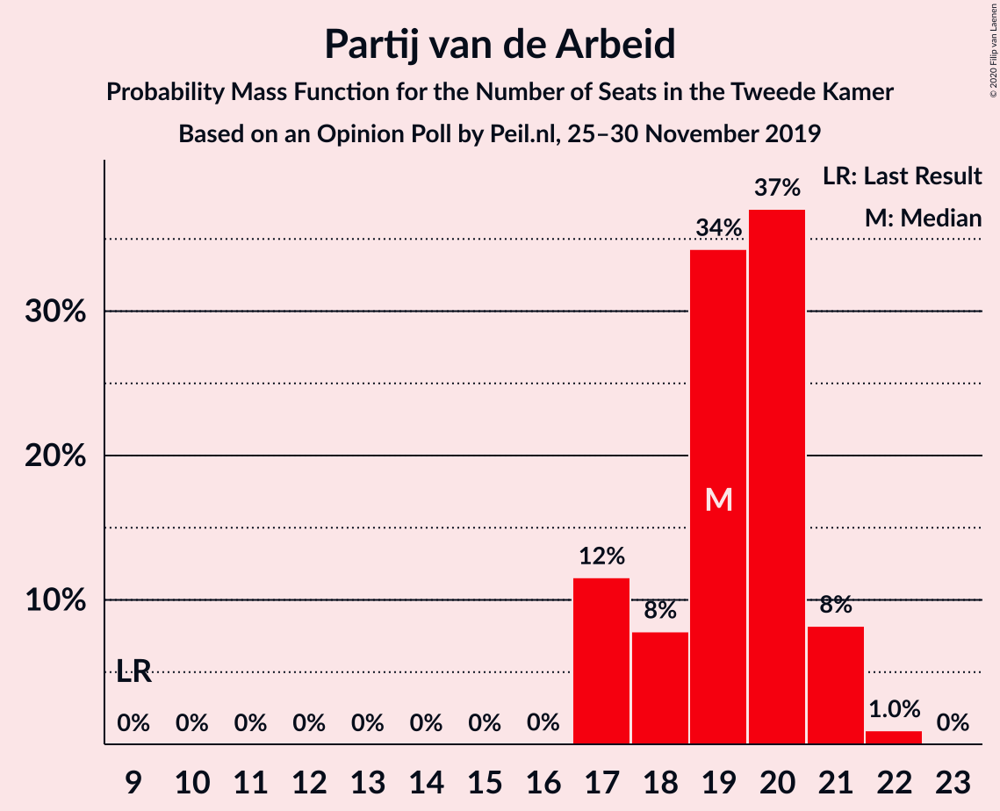
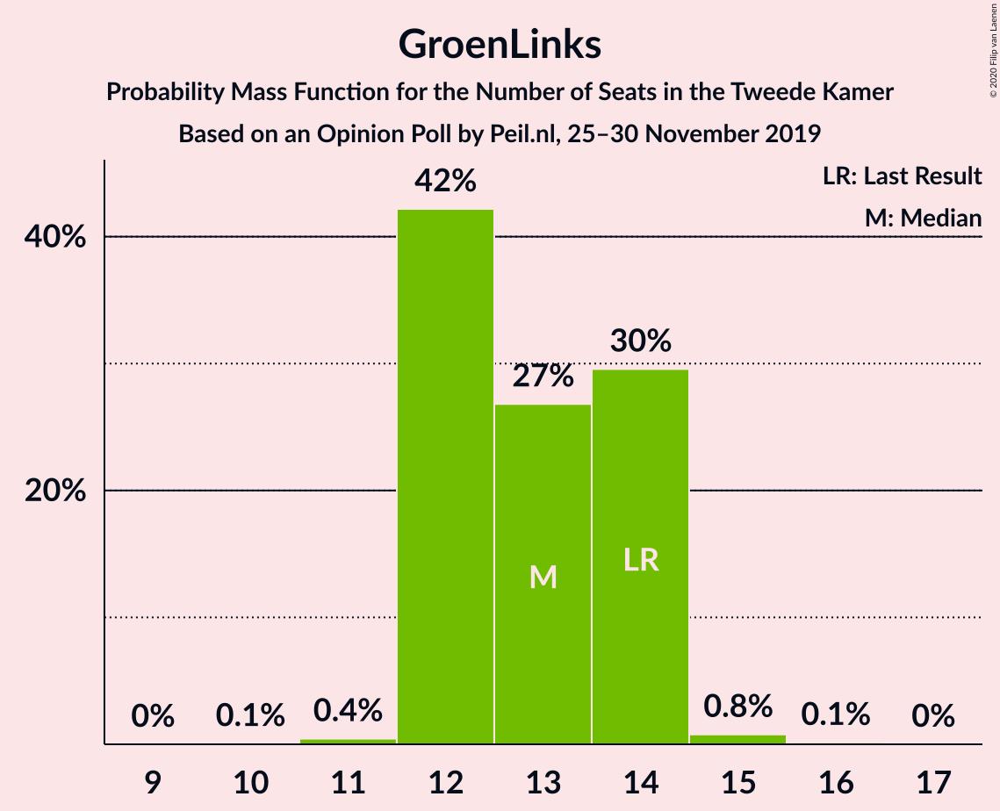
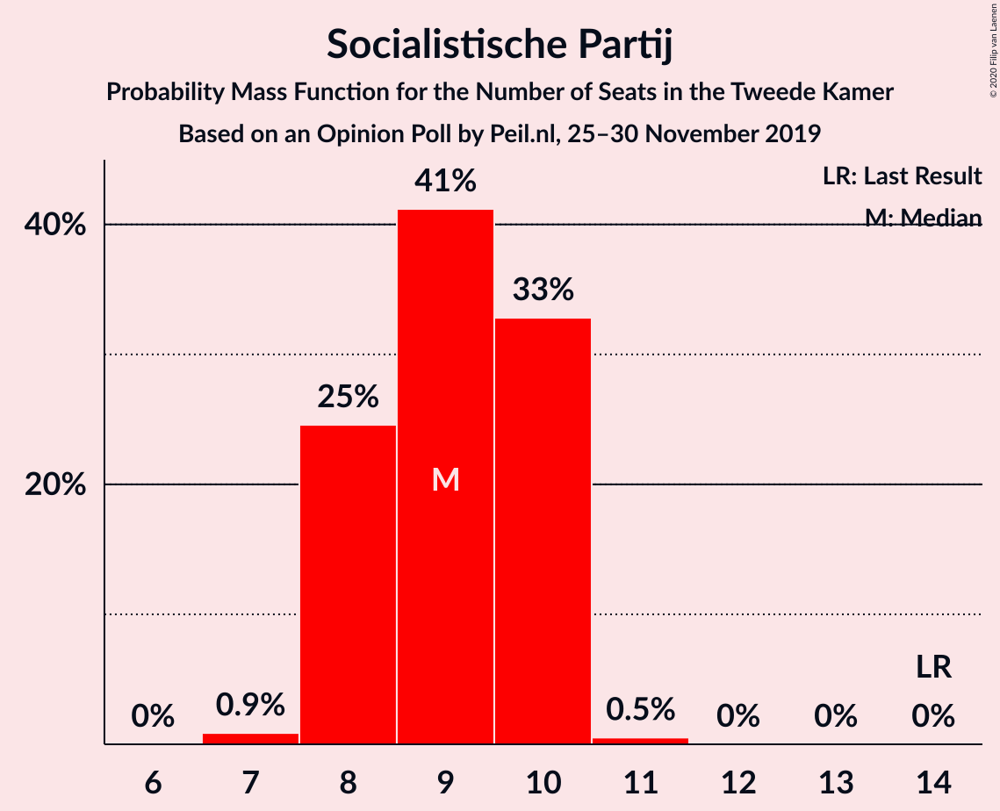
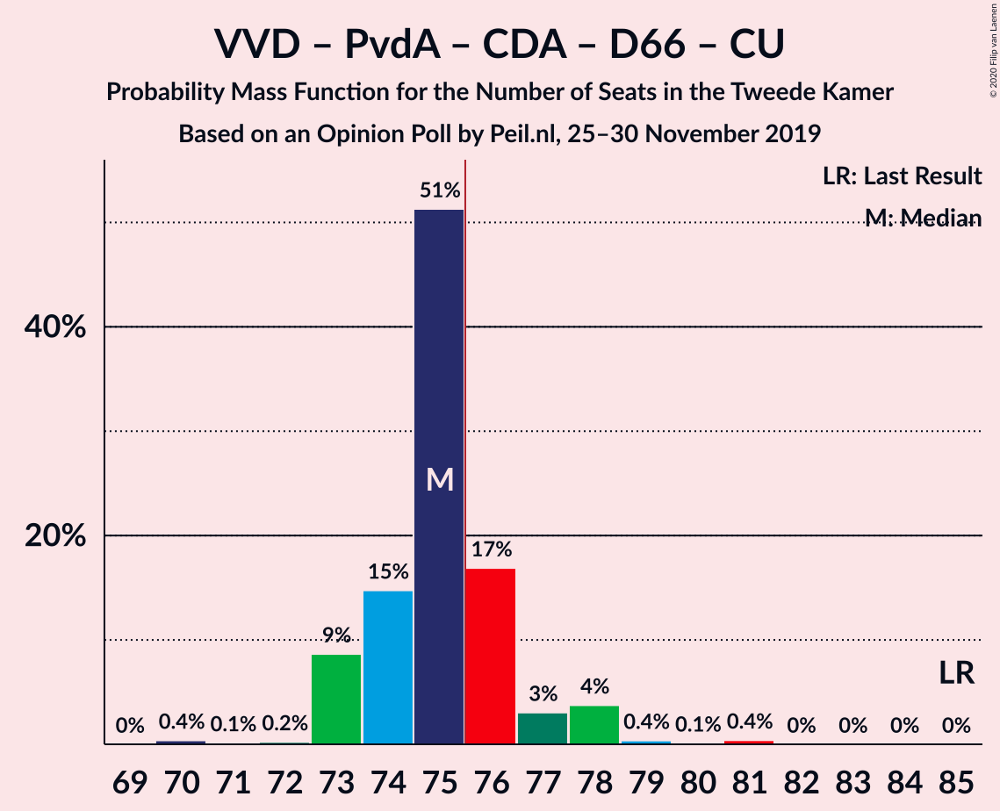
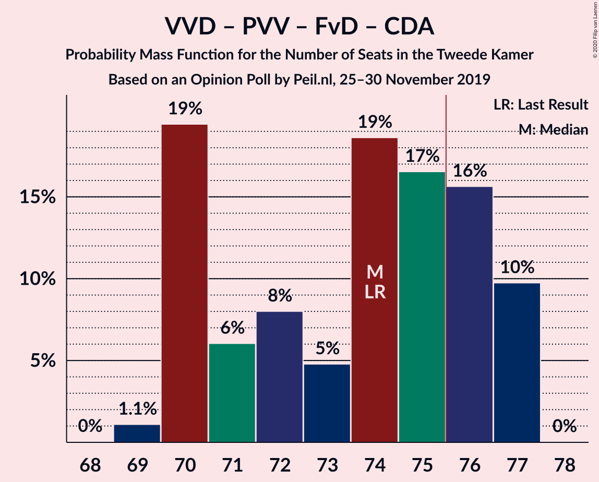
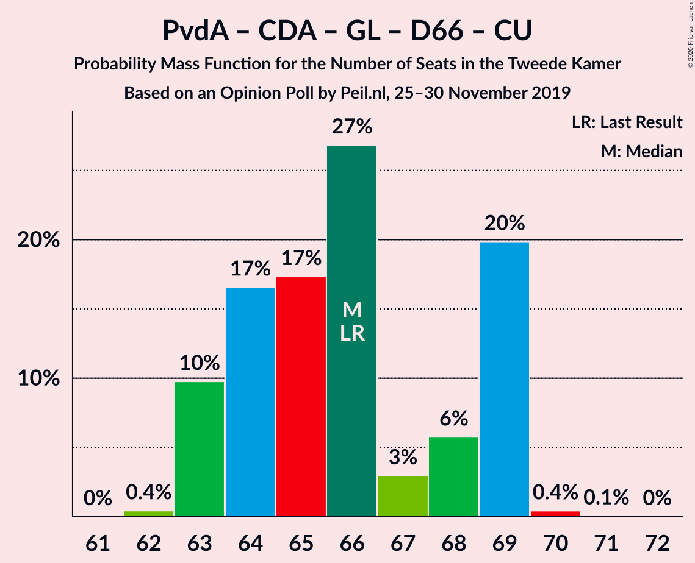
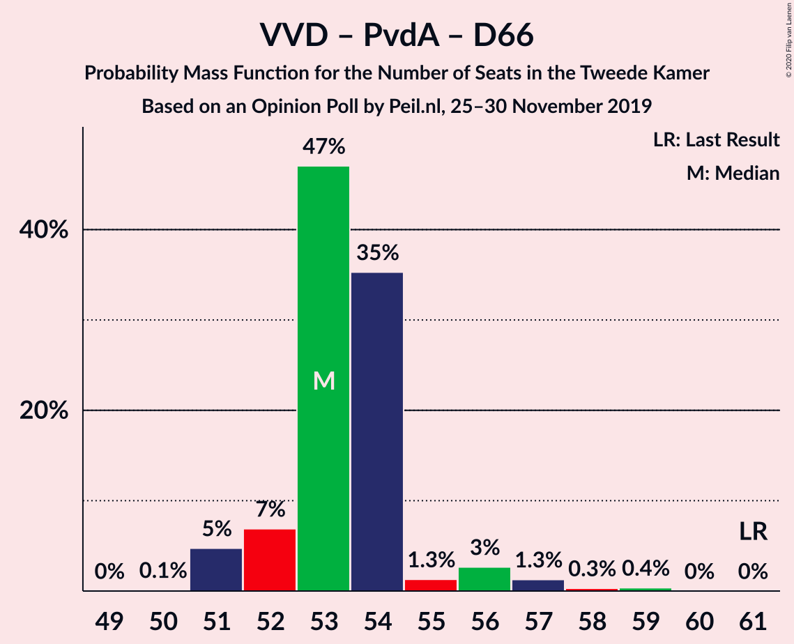

# Opinion Poll by Peil.nl, 25–30 November 2019

<a href="#voting-intentions">Voting Intentions</a> | <a href="#seats">Seats</a> | <a href="#coalitions">Coalitions</a> | <a href="#technical-information">Technical Information</a>

## Voting Intentions

### Confidence Intervals

| Party | Last Result | Poll Result | 80% Confidence Interval | 90% Confidence Interval | 95% Confidence Interval | 99% Confidence Interval |
|:-----:|:-----------:|:-----------:|:-----------------------:|:-----------------------:|:-----------------------:|:-----------------------:|
| Volkspartij voor Vrijheid en Democratie | 21.3% | 14.7% | 13.9–15.5% |13.6–15.8% |13.4–16.0% |13.1–16.4% |
| Partij van de Arbeid | 5.7% | 12.7% | 11.9–13.5% |11.7–13.7% |11.5–13.9% |11.2–14.3% |
| Partij voor de Vrijheid | 13.1% | 12.0% | 11.3–12.8% |11.1–13.0% |10.9–13.2% |10.5–13.6% |
| Forum voor Democratie | 1.8% | 11.3% | 10.6–12.1% |10.4–12.3% |10.2–12.5% |9.9–12.9% |
| Christen-Democratisch Appèl | 12.4% | 10.0% | 9.3–10.7% |9.1–10.9% |9.0–11.1% |8.7–11.5% |
| GroenLinks | 9.1% | 8.7% | 8.0–9.4% |7.8–9.6% |7.7–9.7% |7.4–10.1% |
| Democraten 66 | 12.2% | 8.0% | 7.4–8.7% |7.2–8.9% |7.1–9.0% |6.8–9.4% |
| Socialistische Partij | 9.1% | 6.0% | 5.5–6.6% |5.3–6.8% |5.2–6.9% |5.0–7.2% |
| ChristenUnie | 3.4% | 4.7% | 4.2–5.2% |4.1–5.3% |4.0–5.5% |3.7–5.8% |
| 50Plus | 3.1% | 4.7% | 4.2–5.2% |4.1–5.3% |4.0–5.5% |3.7–5.8% |
| Partij voor de Dieren | 3.2% | 3.3% | 2.9–3.8% |2.8–3.9% |2.7–4.0% |2.6–4.3% |
| DENK | 2.1% | 2.0% | 1.7–2.4% |1.6–2.5% |1.6–2.6% |1.4–2.8% |
| Staatkundig Gereformeerde Partij | 2.1% | 1.3% | 1.1–1.6% |1.0–1.7% |1.0–1.8% |0.9–2.0% |

*Note:* The poll result column reflects the actual value used in the calculations. Published results may vary slightly, and in addition be rounded to fewer digits.

## Seats

### Confidence Intervals

| Party | Last Result | Median | 80% Confidence Interval | 90% Confidence Interval | 95% Confidence Interval | 99% Confidence Interval |
|:-----:|:-----------:|:------:|:-----------------------:|:-----------------------:|:-----------------------:|:-----------------------:|
| <a href="#volkspartij-voor-vrijheid-en-democratie">Volkspartij voor Vrijheid en Democratie</a> | 33 | 22 | 22–23 |21–23 |21–25 |21–25 |
| <a href="#partij-van-de-arbeid">Partij van de Arbeid</a> | 9 | 21 | 20–21 |19–21 |19–21 |17–22 |
| <a href="#partij-voor-de-vrijheid">Partij voor de Vrijheid</a> | 20 | 19 | 18–19 |18–19 |17–19 |16–20 |
| <a href="#forum-voor-democratie">Forum voor Democratie</a> | 2 | 19 | 15–19 |15–19 |15–19 |15–19 |
| <a href="#christen-democratisch-appèl">Christen-Democratisch Appèl</a> | 19 | 14 | 14–15 |14–15 |13–16 |13–17 |
| <a href="#groenlinks">GroenLinks</a> | 14 | 13 | 12–13 |12–14 |12–14 |11–15 |
| <a href="#democraten-66">Democraten 66</a> | 19 | 11 | 11 |11–12 |11–13 |10–13 |
| <a href="#socialistische-partij">Socialistische Partij</a> | 14 | 8 | 8–10 |8–10 |7–10 |7–11 |
| <a href="#christenunie">ChristenUnie</a> | 5 | 7 | 7 |6–7 |6–7 |6–8 |
| <a href="#50plus">50Plus</a> | 4 | 7 | 7–8 |6–9 |6–9 |6–9 |
| <a href="#partij-voor-de-dieren">Partij voor de Dieren</a> | 5 | 4 | 4–6 |4–6 |4–6 |4–6 |
| <a href="#denk">DENK</a> | 3 | 3 | 3 |3 |2–3 |2–4 |
| <a href="#staatkundig-gereformeerde-partij">Staatkundig Gereformeerde Partij</a> | 3 | 1 | 1–2 |1–2 |1–2 |1–2 |

### Volkspartij voor Vrijheid en Democratie

*For a full overview of the results for this party, see the [Volkspartij voor Vrijheid en Democratie](party-volkspartijvoorvrijheidendemocratie.html) page.*

| Number of Seats | Probability | Accumulated | Special Marks |
|:---------------:|:-----------:|:-----------:|:-------------:|
| 20 | 0.2% | 100% |  |
| 21 | 7% | 99.8% |  |
| 22 | 73% | 92% | Median |
| 23 | 15% | 19% |  |
| 24 | 2% | 5% |  |
| 25 | 3% | 3% |  |
| 26 | 0% | 0% |  |
| 27 | 0% | 0% |  |
| 28 | 0% | 0% |  |
| 29 | 0% | 0% |  |
| 30 | 0% | 0% |  |
| 31 | 0% | 0% |  |
| 32 | 0% | 0% |  |
| 33 | 0% | 0% | Last Result |

### Partij van de Arbeid

*For a full overview of the results for this party, see the [Partij van de Arbeid](party-partijvandearbeid.html) page.*

| Number of Seats | Probability | Accumulated | Special Marks |
|:---------------:|:-----------:|:-----------:|:-------------:|
| 9 | 0% | 100% | Last Result |
| 10 | 0% | 100% |  |
| 11 | 0% | 100% |  |
| 12 | 0% | 100% |  |
| 13 | 0% | 100% |  |
| 14 | 0% | 100% |  |
| 15 | 0% | 100% |  |
| 16 | 0.2% | 100% |  |
| 17 | 0.8% | 99.8% |  |
| 18 | 0.6% | 99.0% |  |
| 19 | 7% | 98% |  |
| 20 | 18% | 91% |  |
| 21 | 72% | 72% | Median |
| 22 | 0.7% | 0.8% |  |
| 23 | 0% | 0% |  |

### Partij voor de Vrijheid

*For a full overview of the results for this party, see the [Partij voor de Vrijheid](party-partijvoordevrijheid.html) page.*

| Number of Seats | Probability | Accumulated | Special Marks |
|:---------------:|:-----------:|:-----------:|:-------------:|
| 16 | 2% | 100% |  |
| 17 | 0.7% | 98% |  |
| 18 | 21% | 97% |  |
| 19 | 73% | 76% | Median |
| 20 | 2% | 2% | Last Result |
| 21 | 0% | 0.2% |  |
| 22 | 0.1% | 0.1% |  |
| 23 | 0% | 0% |  |

### Forum voor Democratie

*For a full overview of the results for this party, see the [Forum voor Democratie](party-forumvoordemocratie.html) page.*

| Number of Seats | Probability | Accumulated | Special Marks |
|:---------------:|:-----------:|:-----------:|:-------------:|
| 2 | 0% | 100% | Last Result |
| 3 | 0% | 100% |  |
| 4 | 0% | 100% |  |
| 5 | 0% | 100% |  |
| 6 | 0% | 100% |  |
| 7 | 0% | 100% |  |
| 8 | 0% | 100% |  |
| 9 | 0% | 100% |  |
| 10 | 0% | 100% |  |
| 11 | 0% | 100% |  |
| 12 | 0% | 100% |  |
| 13 | 0% | 100% |  |
| 14 | 0% | 100% |  |
| 15 | 13% | 100% |  |
| 16 | 3% | 87% |  |
| 17 | 6% | 84% |  |
| 18 | 1.1% | 78% |  |
| 19 | 77% | 77% | Median |
| 20 | 0.1% | 0.1% |  |
| 21 | 0% | 0% |  |

### Christen-Democratisch Appèl

*For a full overview of the results for this party, see the [Christen-Democratisch Appèl](party-christen-democratischappèl.html) page.*

| Number of Seats | Probability | Accumulated | Special Marks |
|:---------------:|:-----------:|:-----------:|:-------------:|
| 13 | 5% | 100% |  |
| 14 | 75% | 95% | Median |
| 15 | 16% | 20% |  |
| 16 | 3% | 4% |  |
| 17 | 1.1% | 1.1% |  |
| 18 | 0% | 0% |  |
| 19 | 0% | 0% | Last Result |

### GroenLinks

*For a full overview of the results for this party, see the [GroenLinks](party-groenlinks.html) page.*

| Number of Seats | Probability | Accumulated | Special Marks |
|:---------------:|:-----------:|:-----------:|:-------------:|
| 11 | 0.6% | 100% |  |
| 12 | 15% | 99.4% |  |
| 13 | 79% | 85% | Median |
| 14 | 4% | 6% | Last Result |
| 15 | 2% | 2% |  |
| 16 | 0.1% | 0.1% |  |
| 17 | 0% | 0% |  |

### Democraten 66

*For a full overview of the results for this party, see the [Democraten 66](party-democraten66.html) page.*

| Number of Seats | Probability | Accumulated | Special Marks |
|:---------------:|:-----------:|:-----------:|:-------------:|
| 10 | 1.2% | 100% |  |
| 11 | 91% | 98.8% | Median |
| 12 | 3% | 8% |  |
| 13 | 4% | 4% |  |
| 14 | 0.1% | 0.3% |  |
| 15 | 0.3% | 0.3% |  |
| 16 | 0% | 0% |  |
| 17 | 0% | 0% |  |
| 18 | 0% | 0% |  |
| 19 | 0% | 0% | Last Result |

### Socialistische Partij

*For a full overview of the results for this party, see the [Socialistische Partij](party-socialistischepartij.html) page.*

| Number of Seats | Probability | Accumulated | Special Marks |
|:---------------:|:-----------:|:-----------:|:-------------:|
| 7 | 3% | 100% |  |
| 8 | 72% | 97% | Median |
| 9 | 4% | 25% |  |
| 10 | 19% | 20% |  |
| 11 | 2% | 2% |  |
| 12 | 0% | 0% |  |
| 13 | 0% | 0% |  |
| 14 | 0% | 0% | Last Result |

### ChristenUnie

*For a full overview of the results for this party, see the [ChristenUnie](party-christenunie.html) page.*

| Number of Seats | Probability | Accumulated | Special Marks |
|:---------------:|:-----------:|:-----------:|:-------------:|
| 5 | 0.3% | 100% | Last Result |
| 6 | 8% | 99.7% |  |
| 7 | 90% | 92% | Median |
| 8 | 2% | 2% |  |
| 9 | 0% | 0% |  |

### 50Plus

*For a full overview of the results for this party, see the [50Plus](party-50plus.html) page.*

| Number of Seats | Probability | Accumulated | Special Marks |
|:---------------:|:-----------:|:-----------:|:-------------:|
| 4 | 0% | 100% | Last Result |
| 5 | 0.3% | 100% |  |
| 6 | 5% | 99.7% |  |
| 7 | 76% | 95% | Median |
| 8 | 13% | 19% |  |
| 9 | 6% | 6% |  |
| 10 | 0% | 0% |  |

### Partij voor de Dieren

*For a full overview of the results for this party, see the [Partij voor de Dieren](party-partijvoordedieren.html) page.*

| Number of Seats | Probability | Accumulated | Special Marks |
|:---------------:|:-----------:|:-----------:|:-------------:|
| 3 | 0.2% | 100% |  |
| 4 | 77% | 99.8% | Median |
| 5 | 7% | 23% | Last Result |
| 6 | 16% | 16% |  |
| 7 | 0% | 0% |  |

### DENK

*For a full overview of the results for this party, see the [DENK](party-denk.html) page.*

| Number of Seats | Probability | Accumulated | Special Marks |
|:---------------:|:-----------:|:-----------:|:-------------:|
| 2 | 3% | 100% |  |
| 3 | 95% | 97% | Last Result, Median |
| 4 | 2% | 2% |  |
| 5 | 0% | 0% |  |

### Staatkundig Gereformeerde Partij

*For a full overview of the results for this party, see the [Staatkundig Gereformeerde Partij](party-staatkundiggereformeerdepartij.html) page.*

| Number of Seats | Probability | Accumulated | Special Marks |
|:---------------:|:-----------:|:-----------:|:-------------:|
| 1 | 75% | 100% | Median |
| 2 | 25% | 25% |  |
| 3 | 0.1% | 0.1% | Last Result |
| 4 | 0% | 0% |  |

## Coalitions

### Confidence Intervals

| Coalition | Last Result | Median | Majority? | 80% Confidence Interval | 90% Confidence Interval | 95% Confidence Interval | 99% Confidence Interval |
|:---------:|:-----------:|:------:|:---------:|:-----------------------:|:-----------------------:|:-----------------------:|:-----------------------:|
| Volkspartij voor Vrijheid en Democratie – Partij van de Arbeid – Christen-Democratisch Appèl – Democraten 66 – ChristenUnie | 85 | 75 | 20% | 75–76 | 73–77 | 70–79 | 70–79 |
| Partij van de Arbeid – Christen-Democratisch Appèl – GroenLinks – Democraten 66 – Socialistische Partij – ChristenUnie | 80 | 74 | 6% | 74–75 | 73–76 | 72–77 | 72–77 |
| Volkspartij voor Vrijheid en Democratie – Partij voor de Vrijheid – Forum voor Democratie – Christen-Democratisch Appèl – Staatkundig Gereformeerde Partij | 77 | 75 | 3% | 73–75 | 73–75 | 73–76 | 73–78 |
| Volkspartij voor Vrijheid en Democratie – Partij voor de Vrijheid – Forum voor Democratie – Christen-Democratisch Appèl | 74 | 74 | 1.2% | 71–74 | 71–74 | 71–74 | 71–76 |
| Volkspartij voor Vrijheid en Democratie – Christen-Democratisch Appèl – GroenLinks – Democraten 66 – ChristenUnie | 90 | 67 | 0% | 67–68 | 66–71 | 64–73 | 64–73 |
| Partij van de Arbeid – Christen-Democratisch Appèl – GroenLinks – Democraten 66 – ChristenUnie | 66 | 66 | 0% | 65–66 | 64–68 | 62–68 | 62–69 |
| Volkspartij voor Vrijheid en Democratie – Forum voor Democratie – Christen-Democratisch Appèl – 50Plus – Staatkundig Gereformeerde Partij | 61 | 63 | 0% | 63–64 | 63–64 | 61–64 | 60–67 |
| Volkspartij voor Vrijheid en Democratie – Forum voor Democratie – Christen-Democratisch Appèl – 50Plus | 58 | 62 | 0% | 61–62 | 61–62 | 59–63 | 59–65 |
| Volkspartij voor Vrijheid en Democratie – Partij van de Arbeid – Christen-Democratisch Appèl | 61 | 57 | 0% | 57–58 | 54–58 | 53–59 | 53–60 |
| Volkspartij voor Vrijheid en Democratie – Christen-Democratisch Appèl – Democraten 66 – ChristenUnie | 76 | 54 | 0% | 54–56 | 53–58 | 51–59 | 51–59 |
| Volkspartij voor Vrijheid en Democratie – Forum voor Democratie – Christen-Democratisch Appèl – Staatkundig Gereformeerde Partij | 57 | 56 | 0% | 55–56 | 55–57 | 55–58 | 54–60 |
| Volkspartij voor Vrijheid en Democratie – Partij van de Arbeid – Democraten 66 | 61 | 54 | 0% | 54 | 51–55 | 51–58 | 51–58 |
| Volkspartij voor Vrijheid en Democratie – Partij voor de Vrijheid – Christen-Democratisch Appèl | 72 | 55 | 0% | 55–56 | 52–57 | 52–57 | 52–59 |
| Volkspartij voor Vrijheid en Democratie – Forum voor Democratie – Christen-Democratisch Appèl | 54 | 55 | 0% | 53–55 | 53–55 | 53–56 | 53–58 |
| Volkspartij voor Vrijheid en Democratie – Christen-Democratisch Appèl – Democraten 66 | 71 | 47 | 0% | 47–49 | 47–51 | 45–52 | 45–52 |
| Partij van de Arbeid – Christen-Democratisch Appèl – Democraten 66 | 47 | 46 | 0% | 46 | 43–47 | 43–47 | 43–51 |
| Volkspartij voor Vrijheid en Democratie – Partij van de Arbeid | 42 | 43 | 0% | 43 | 40–43 | 40–45 | 40–45 |
| Partij van de Arbeid – Christen-Democratisch Appèl – ChristenUnie | 33 | 42 | 0% | 41–42 | 39–42 | 38–42 | 38–45 |
| Volkspartij voor Vrijheid en Democratie – Christen-Democratisch Appèl | 52 | 36 | 0% | 36–38 | 36–39 | 34–39 | 34–40 |
| Partij van de Arbeid – Christen-Democratisch Appèl | 28 | 35 | 0% | 34–35 | 32–35 | 32–35 | 32–38 |
| Christen-Democratisch Appèl – Democraten 66 | 38 | 25 | 0% | 25–26 | 25–27 | 24–28 | 24–29 |

### Volkspartij voor Vrijheid en Democratie – Partij van de Arbeid – Christen-Democratisch Appèl – Democraten 66 – ChristenUnie

| Number of Seats | Probability | Accumulated | Special Marks |
|:---------------:|:-----------:|:-----------:|:-------------:|
| 70 | 5% | 100% |  |
| 71 | 0% | 95% |  |
| 72 | 0.1% | 95% |  |
| 73 | 0.5% | 95% |  |
| 74 | 3% | 95% |  |
| 75 | 72% | 92% | Median |
| 76 | 14% | 20% | Majority |
| 77 | 2% | 6% |  |
| 78 | 1.3% | 4% |  |
| 79 | 3% | 3% |  |
| 80 | 0.1% | 0.1% |  |
| 81 | 0% | 0% |  |
| 82 | 0% | 0% |  |
| 83 | 0% | 0% |  |
| 84 | 0% | 0% |  |
| 85 | 0% | 0% | Last Result |

### Partij van de Arbeid – Christen-Democratisch Appèl – GroenLinks – Democraten 66 – Socialistische Partij – ChristenUnie

| Number of Seats | Probability | Accumulated | Special Marks |
|:---------------:|:-----------:|:-----------:|:-------------:|
| 72 | 5% | 100% |  |
| 73 | 1.1% | 95% |  |
| 74 | 71% | 94% | Median |
| 75 | 17% | 23% |  |
| 76 | 2% | 6% | Majority |
| 77 | 3% | 4% |  |
| 78 | 0.2% | 0.3% |  |
| 79 | 0% | 0.1% |  |
| 80 | 0% | 0% | Last Result |

### Volkspartij voor Vrijheid en Democratie – Partij voor de Vrijheid – Forum voor Democratie – Christen-Democratisch Appèl – Staatkundig Gereformeerde Partij

| Number of Seats | Probability | Accumulated | Special Marks |
|:---------------:|:-----------:|:-----------:|:-------------:|
| 71 | 0.1% | 100% |  |
| 72 | 0.1% | 99.9% |  |
| 73 | 20% | 99.7% |  |
| 74 | 2% | 80% |  |
| 75 | 75% | 78% | Median |
| 76 | 0.8% | 3% | Majority |
| 77 | 1.0% | 2% | Last Result |
| 78 | 0.7% | 0.8% |  |
| 79 | 0% | 0% |  |

### Volkspartij voor Vrijheid en Democratie – Partij voor de Vrijheid – Forum voor Democratie – Christen-Democratisch Appèl

| Number of Seats | Probability | Accumulated | Special Marks |
|:---------------:|:-----------:|:-----------:|:-------------:|
| 69 | 0.1% | 100% |  |
| 70 | 0% | 99.9% |  |
| 71 | 19% | 99.8% |  |
| 72 | 1.5% | 81% |  |
| 73 | 6% | 80% |  |
| 74 | 72% | 74% | Last Result, Median |
| 75 | 0.7% | 2% |  |
| 76 | 1.1% | 1.2% | Majority |
| 77 | 0.1% | 0.1% |  |
| 78 | 0% | 0% |  |

### Volkspartij voor Vrijheid en Democratie – Christen-Democratisch Appèl – GroenLinks – Democraten 66 – ChristenUnie

| Number of Seats | Probability | Accumulated | Special Marks |
|:---------------:|:-----------:|:-----------:|:-------------:|
| 64 | 5% | 100% |  |
| 65 | 0% | 95% |  |
| 66 | 0.2% | 95% |  |
| 67 | 72% | 95% | Median |
| 68 | 14% | 23% |  |
| 69 | 2% | 9% |  |
| 70 | 1.0% | 7% |  |
| 71 | 3% | 6% |  |
| 72 | 0.3% | 3% |  |
| 73 | 3% | 3% |  |
| 74 | 0% | 0% |  |
| 75 | 0% | 0% |  |
| 76 | 0% | 0% | Majority |
| 77 | 0% | 0% |  |
| 78 | 0% | 0% |  |
| 79 | 0% | 0% |  |
| 80 | 0% | 0% |  |
| 81 | 0% | 0% |  |
| 82 | 0% | 0% |  |
| 83 | 0% | 0% |  |
| 84 | 0% | 0% |  |
| 85 | 0% | 0% |  |
| 86 | 0% | 0% |  |
| 87 | 0% | 0% |  |
| 88 | 0% | 0% |  |
| 89 | 0% | 0% |  |
| 90 | 0% | 0% | Last Result |

### Partij van de Arbeid – Christen-Democratisch Appèl – GroenLinks – Democraten 66 – ChristenUnie

| Number of Seats | Probability | Accumulated | Special Marks |
|:---------------:|:-----------:|:-----------:|:-------------:|
| 62 | 5% | 100% |  |
| 63 | 0.1% | 95% |  |
| 64 | 1.2% | 95% |  |
| 65 | 13% | 94% |  |
| 66 | 74% | 81% | Last Result, Median |
| 67 | 0.8% | 6% |  |
| 68 | 5% | 6% |  |
| 69 | 0.7% | 0.7% |  |
| 70 | 0% | 0.1% |  |
| 71 | 0% | 0% |  |

### Volkspartij voor Vrijheid en Democratie – Forum voor Democratie – Christen-Democratisch Appèl – 50Plus – Staatkundig Gereformeerde Partij

| Number of Seats | Probability | Accumulated | Special Marks |
|:---------------:|:-----------:|:-----------:|:-------------:|
| 59 | 0.1% | 100% |  |
| 60 | 2% | 99.9% |  |
| 61 | 0.9% | 98% | Last Result |
| 62 | 0.2% | 97% |  |
| 63 | 85% | 97% | Median |
| 64 | 9% | 12% |  |
| 65 | 2% | 2% |  |
| 66 | 0.3% | 0.8% |  |
| 67 | 0% | 0.5% |  |
| 68 | 0.4% | 0.5% |  |
| 69 | 0% | 0% |  |

### Volkspartij voor Vrijheid en Democratie – Forum voor Democratie – Christen-Democratisch Appèl – 50Plus

| Number of Seats | Probability | Accumulated | Special Marks |
|:---------------:|:-----------:|:-----------:|:-------------:|
| 58 | 0.2% | 100% | Last Result |
| 59 | 2% | 99.8% |  |
| 60 | 0.2% | 97% |  |
| 61 | 13% | 97% |  |
| 62 | 81% | 84% | Median |
| 63 | 2% | 3% |  |
| 64 | 0.3% | 0.8% |  |
| 65 | 0.1% | 0.6% |  |
| 66 | 0.5% | 0.5% |  |
| 67 | 0% | 0% |  |

### Volkspartij voor Vrijheid en Democratie – Partij van de Arbeid – Christen-Democratisch Appèl

| Number of Seats | Probability | Accumulated | Special Marks |
|:---------------:|:-----------:|:-----------:|:-------------:|
| 53 | 5% | 100% |  |
| 54 | 0.4% | 95% |  |
| 55 | 0.7% | 95% |  |
| 56 | 2% | 94% |  |
| 57 | 72% | 92% | Median |
| 58 | 14% | 19% |  |
| 59 | 4% | 5% |  |
| 60 | 0.5% | 0.7% |  |
| 61 | 0.1% | 0.1% | Last Result |
| 62 | 0% | 0% |  |

### Volkspartij voor Vrijheid en Democratie – Christen-Democratisch Appèl – Democraten 66 – ChristenUnie

| Number of Seats | Probability | Accumulated | Special Marks |
|:---------------:|:-----------:|:-----------:|:-------------:|
| 51 | 5% | 100% |  |
| 52 | 0% | 95% |  |
| 53 | 0.4% | 95% |  |
| 54 | 73% | 95% | Median |
| 55 | 1.4% | 22% |  |
| 56 | 14% | 21% |  |
| 57 | 2% | 7% |  |
| 58 | 2% | 5% |  |
| 59 | 3% | 3% |  |
| 60 | 0.1% | 0.1% |  |
| 61 | 0% | 0% |  |
| 62 | 0% | 0% |  |
| 63 | 0% | 0% |  |
| 64 | 0% | 0% |  |
| 65 | 0% | 0% |  |
| 66 | 0% | 0% |  |
| 67 | 0% | 0% |  |
| 68 | 0% | 0% |  |
| 69 | 0% | 0% |  |
| 70 | 0% | 0% |  |
| 71 | 0% | 0% |  |
| 72 | 0% | 0% |  |
| 73 | 0% | 0% |  |
| 74 | 0% | 0% |  |
| 75 | 0% | 0% |  |
| 76 | 0% | 0% | Last Result, Majority |

### Volkspartij voor Vrijheid en Democratie – Forum voor Democratie – Christen-Democratisch Appèl – Staatkundig Gereformeerde Partij

| Number of Seats | Probability | Accumulated | Special Marks |
|:---------------:|:-----------:|:-----------:|:-------------:|
| 53 | 0.1% | 100% |  |
| 54 | 2% | 99.9% |  |
| 55 | 19% | 98% |  |
| 56 | 71% | 78% | Median |
| 57 | 4% | 7% | Last Result |
| 58 | 0.6% | 3% |  |
| 59 | 2% | 2% |  |
| 60 | 0% | 0.5% |  |
| 61 | 0.5% | 0.5% |  |
| 62 | 0% | 0% |  |

### Volkspartij voor Vrijheid en Democratie – Partij van de Arbeid – Democraten 66

| Number of Seats | Probability | Accumulated | Special Marks |
|:---------------:|:-----------:|:-----------:|:-------------:|
| 50 | 0.1% | 100% |  |
| 51 | 6% | 99.9% |  |
| 52 | 2% | 94% |  |
| 53 | 2% | 92% |  |
| 54 | 84% | 90% | Median |
| 55 | 2% | 6% |  |
| 56 | 0.6% | 4% |  |
| 57 | 0% | 3% |  |
| 58 | 3% | 3% |  |
| 59 | 0% | 0% |  |
| 60 | 0% | 0% |  |
| 61 | 0% | 0% | Last Result |

### Volkspartij voor Vrijheid en Democratie – Partij voor de Vrijheid – Christen-Democratisch Appèl

| Number of Seats | Probability | Accumulated | Special Marks |
|:---------------:|:-----------:|:-----------:|:-------------:|
| 52 | 5% | 100% |  |
| 53 | 0.1% | 95% |  |
| 54 | 1.2% | 95% |  |
| 55 | 72% | 94% | Median |
| 56 | 17% | 22% |  |
| 57 | 4% | 5% |  |
| 58 | 0.1% | 0.9% |  |
| 59 | 0.7% | 0.8% |  |
| 60 | 0.1% | 0.1% |  |
| 61 | 0% | 0% |  |
| 62 | 0% | 0% |  |
| 63 | 0% | 0% |  |
| 64 | 0% | 0% |  |
| 65 | 0% | 0% |  |
| 66 | 0% | 0% |  |
| 67 | 0% | 0% |  |
| 68 | 0% | 0% |  |
| 69 | 0% | 0% |  |
| 70 | 0% | 0% |  |
| 71 | 0% | 0% |  |
| 72 | 0% | 0% | Last Result |

### Volkspartij voor Vrijheid en Democratie – Forum voor Democratie – Christen-Democratisch Appèl

| Number of Seats | Probability | Accumulated | Special Marks |
|:---------------:|:-----------:|:-----------:|:-------------:|
| 51 | 0.1% | 100% |  |
| 52 | 0% | 99.9% |  |
| 53 | 21% | 99.9% |  |
| 54 | 0.3% | 79% | Last Result |
| 55 | 74% | 78% | Median |
| 56 | 1.5% | 4% |  |
| 57 | 2% | 2% |  |
| 58 | 0.1% | 0.5% |  |
| 59 | 0.4% | 0.5% |  |
| 60 | 0% | 0% |  |

### Volkspartij voor Vrijheid en Democratie – Christen-Democratisch Appèl – Democraten 66

| Number of Seats | Probability | Accumulated | Special Marks |
|:---------------:|:-----------:|:-----------:|:-------------:|
| 45 | 5% | 100% |  |
| 46 | 0.1% | 95% |  |
| 47 | 73% | 95% | Median |
| 48 | 1.4% | 22% |  |
| 49 | 15% | 21% |  |
| 50 | 0.7% | 6% |  |
| 51 | 1.2% | 6% |  |
| 52 | 4% | 4% |  |
| 53 | 0.1% | 0.1% |  |
| 54 | 0% | 0% |  |
| 55 | 0% | 0% |  |
| 56 | 0% | 0% |  |
| 57 | 0% | 0% |  |
| 58 | 0% | 0% |  |
| 59 | 0% | 0% |  |
| 60 | 0% | 0% |  |
| 61 | 0% | 0% |  |
| 62 | 0% | 0% |  |
| 63 | 0% | 0% |  |
| 64 | 0% | 0% |  |
| 65 | 0% | 0% |  |
| 66 | 0% | 0% |  |
| 67 | 0% | 0% |  |
| 68 | 0% | 0% |  |
| 69 | 0% | 0% |  |
| 70 | 0% | 0% |  |
| 71 | 0% | 0% | Last Result |

### Partij van de Arbeid – Christen-Democratisch Appèl – Democraten 66

| Number of Seats | Probability | Accumulated | Special Marks |
|:---------------:|:-----------:|:-----------:|:-------------:|
| 42 | 0% | 100% |  |
| 43 | 5% | 99.9% |  |
| 44 | 0.6% | 95% |  |
| 45 | 2% | 94% |  |
| 46 | 86% | 92% | Median |
| 47 | 4% | 6% | Last Result |
| 48 | 1.1% | 2% |  |
| 49 | 0.3% | 1.0% |  |
| 50 | 0.1% | 0.6% |  |
| 51 | 0.5% | 0.5% |  |
| 52 | 0% | 0% |  |

### Volkspartij voor Vrijheid en Democratie – Partij van de Arbeid

| Number of Seats | Probability | Accumulated | Special Marks |
|:---------------:|:-----------:|:-----------:|:-------------:|
| 38 | 0.3% | 100% |  |
| 39 | 0.2% | 99.7% |  |
| 40 | 6% | 99.6% |  |
| 41 | 2% | 93% |  |
| 42 | 0.2% | 91% | Last Result |
| 43 | 88% | 91% | Median |
| 44 | 0% | 3% |  |
| 45 | 3% | 3% |  |
| 46 | 0% | 0% |  |

### Partij van de Arbeid – Christen-Democratisch Appèl – ChristenUnie

| Number of Seats | Probability | Accumulated | Special Marks |
|:---------------:|:-----------:|:-----------:|:-------------:|
| 33 | 0% | 100% | Last Result |
| 34 | 0% | 100% |  |
| 35 | 0% | 100% |  |
| 36 | 0% | 100% |  |
| 37 | 0% | 100% |  |
| 38 | 5% | 100% |  |
| 39 | 0.3% | 95% |  |
| 40 | 2% | 95% |  |
| 41 | 5% | 93% |  |
| 42 | 87% | 88% | Median |
| 43 | 0.7% | 1.5% |  |
| 44 | 0.3% | 0.8% |  |
| 45 | 0.5% | 0.5% |  |
| 46 | 0% | 0% |  |

### Volkspartij voor Vrijheid en Democratie – Christen-Democratisch Appèl

| Number of Seats | Probability | Accumulated | Special Marks |
|:---------------:|:-----------:|:-----------:|:-------------:|
| 34 | 5% | 100% |  |
| 35 | 0% | 95% |  |
| 36 | 74% | 95% | Median |
| 37 | 0.6% | 21% |  |
| 38 | 15% | 20% |  |
| 39 | 3% | 5% |  |
| 40 | 2% | 2% |  |
| 41 | 0.1% | 0.1% |  |
| 42 | 0% | 0% |  |
| 43 | 0% | 0% |  |
| 44 | 0% | 0% |  |
| 45 | 0% | 0% |  |
| 46 | 0% | 0% |  |
| 47 | 0% | 0% |  |
| 48 | 0% | 0% |  |
| 49 | 0% | 0% |  |
| 50 | 0% | 0% |  |
| 51 | 0% | 0% |  |
| 52 | 0% | 0% | Last Result |

### Partij van de Arbeid – Christen-Democratisch Appèl

| Number of Seats | Probability | Accumulated | Special Marks |
|:---------------:|:-----------:|:-----------:|:-------------:|
| 28 | 0% | 100% | Last Result |
| 29 | 0% | 100% |  |
| 30 | 0% | 100% |  |
| 31 | 0.1% | 100% |  |
| 32 | 5% | 99.9% |  |
| 33 | 0.7% | 95% |  |
| 34 | 4% | 94% |  |
| 35 | 88% | 90% | Median |
| 36 | 0.4% | 1.2% |  |
| 37 | 0.1% | 0.8% |  |
| 38 | 0.1% | 0.6% |  |
| 39 | 0.5% | 0.5% |  |
| 40 | 0% | 0% |  |

### Christen-Democratisch Appèl – Democraten 66

| Number of Seats | Probability | Accumulated | Special Marks |
|:---------------:|:-----------:|:-----------:|:-------------:|
| 24 | 5% | 100% |  |
| 25 | 72% | 95% | Median |
| 26 | 16% | 23% |  |
| 27 | 4% | 7% |  |
| 28 | 2% | 4% |  |
| 29 | 1.4% | 2% |  |
| 30 | 0.1% | 0.1% |  |
| 31 | 0% | 0% |  |
| 32 | 0% | 0% |  |
| 33 | 0% | 0% |  |
| 34 | 0% | 0% |  |
| 35 | 0% | 0% |  |
| 36 | 0% | 0% |  |
| 37 | 0% | 0% |  |
| 38 | 0% | 0% | Last Result |

## Technical Information

### Opinion Poll

+ **Polling firm:** Peil.nl
+ **Commissioner(s):** —
+ **Fieldwork period:** 25–30 November 2019

### Calculations

+ **Sample size:** 3000
+ **Simulations done:** 131,072
+ **Error estimate:** 1.66%

