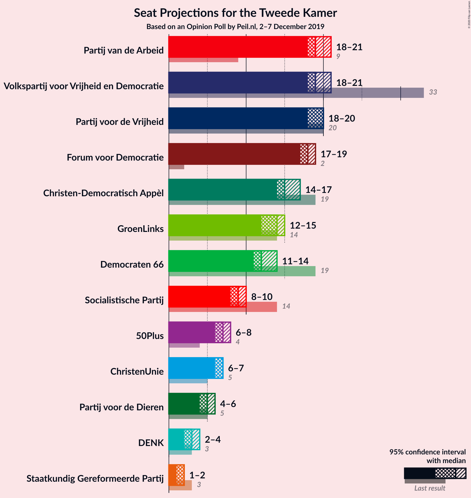
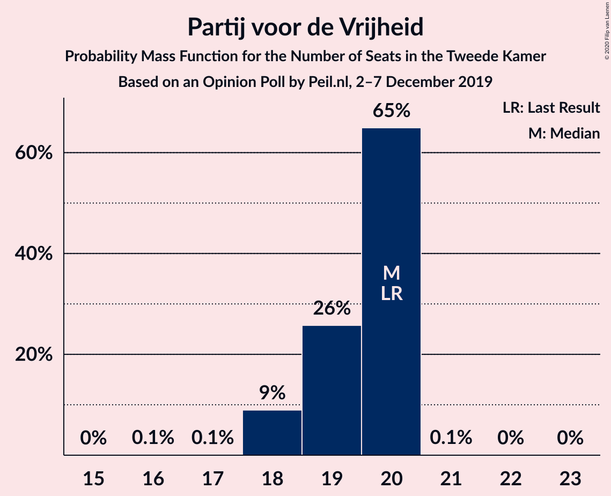
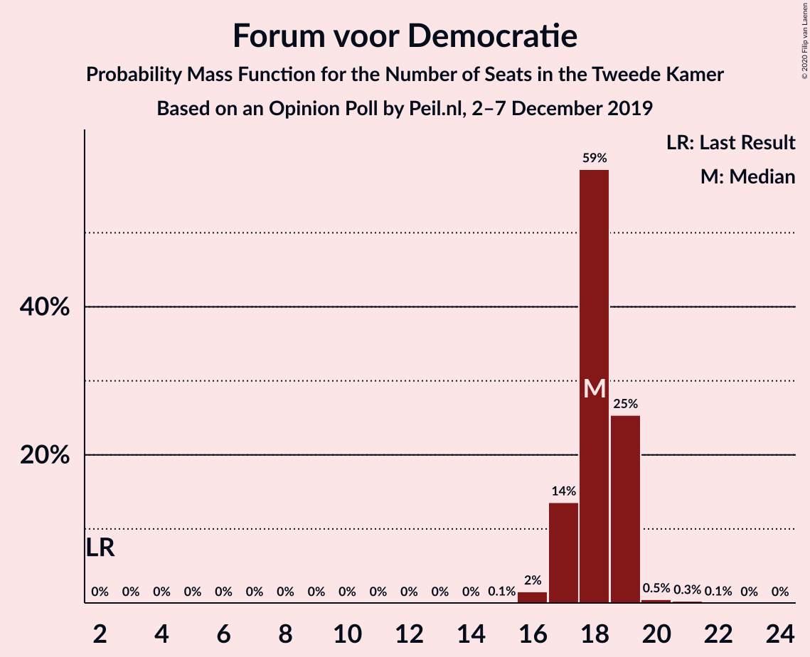
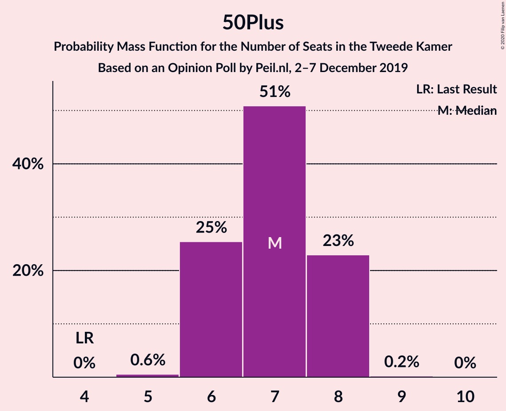
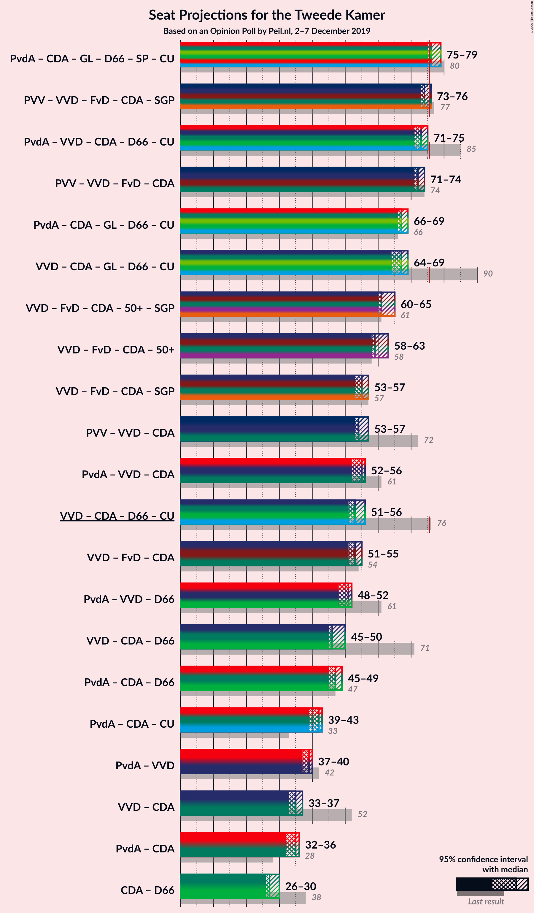
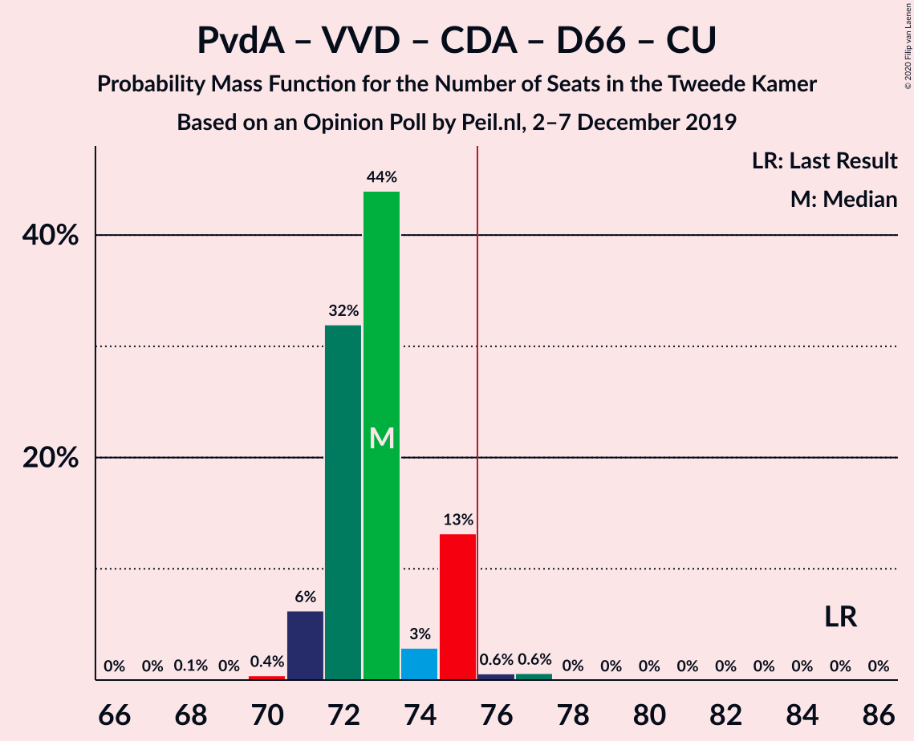
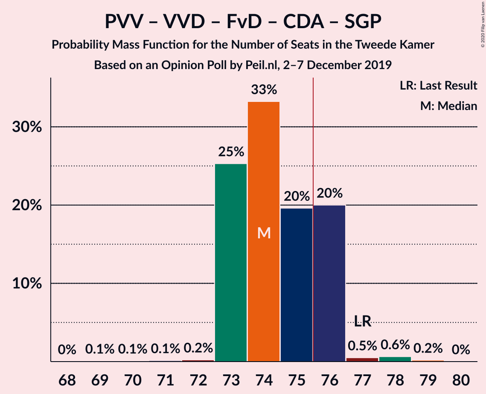
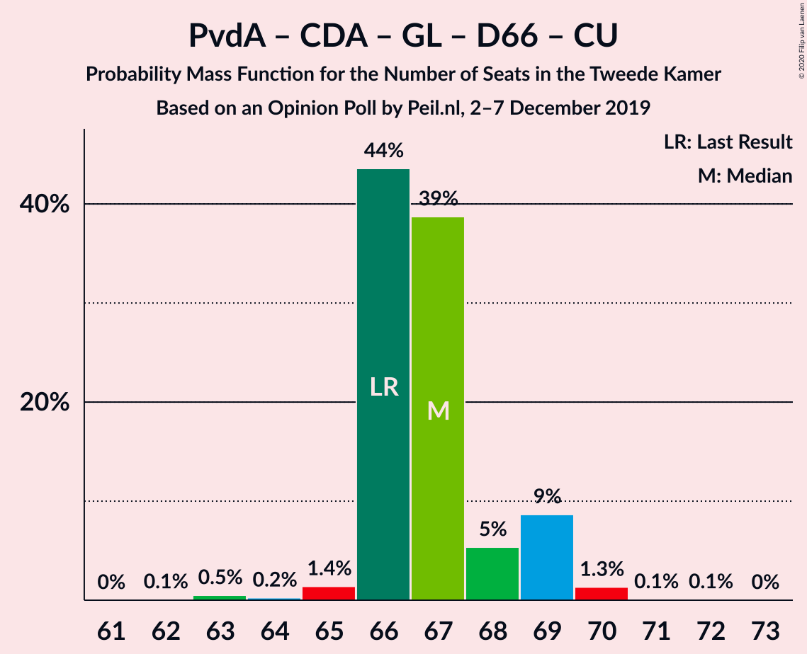

# Opinion Poll by Peil.nl, 2–7 December 2019

<a href="#voting-intentions">Voting Intentions</a> | <a href="#seats">Seats</a> | <a href="#coalitions">Coalitions</a> | <a href="#technical-information">Technical Information</a>

## Voting Intentions

### Confidence Intervals

| Party | Last Result | Poll Result | 80% Confidence Interval | 90% Confidence Interval | 95% Confidence Interval | 99% Confidence Interval |
|:-----:|:-----------:|:-----------:|:-----------------------:|:-----------------------:|:-----------------------:|:-----------------------:|
| Volkspartij voor Vrijheid en Democratie | 21.3% | 12.7% | 11.9–13.5% |11.7–13.7% |11.5–13.9% |11.2–14.3% |
| Partij voor de Vrijheid | 13.1% | 12.7% | 11.9–13.5% |11.7–13.7% |11.5–13.9% |11.2–14.3% |
| Partij van de Arbeid | 5.7% | 12.7% | 11.9–13.5% |11.7–13.7% |11.5–13.9% |11.2–14.3% |
| Forum voor Democratie | 1.8% | 12.0% | 11.3–12.8% |11.1–13.0% |10.9–13.2% |10.5–13.6% |
| Christen-Democratisch Appèl | 12.4% | 10.7% | 10.0–11.4% |9.8–11.6% |9.6–11.8% |9.3–12.2% |
| GroenLinks | 9.1% | 8.7% | 8.0–9.4% |7.8–9.6% |7.7–9.7% |7.4–10.1% |
| Democraten 66 | 12.2% | 8.0% | 7.4–8.7% |7.2–8.9% |7.1–9.0% |6.8–9.4% |
| Socialistische Partij | 9.1% | 6.0% | 5.5–6.6% |5.3–6.8% |5.2–6.9% |5.0–7.2% |
| ChristenUnie | 3.4% | 4.7% | 4.2–5.2% |4.1–5.3% |4.0–5.5% |3.7–5.8% |
| 50Plus | 3.1% | 4.7% | 4.2–5.2% |4.1–5.3% |4.0–5.5% |3.7–5.8% |
| Partij voor de Dieren | 3.2% | 3.3% | 2.9–3.8% |2.8–3.9% |2.7–4.0% |2.6–4.3% |
| DENK | 2.1% | 2.0% | 1.7–2.4% |1.6–2.5% |1.6–2.6% |1.4–2.8% |
| Staatkundig Gereformeerde Partij | 2.1% | 1.3% | 1.1–1.6% |1.0–1.7% |1.0–1.8% |0.9–2.0% |

*Note:* The poll result column reflects the actual value used in the calculations. Published results may vary slightly, and in addition be rounded to fewer digits.

## Seats

### Confidence Intervals

| Party | Last Result | Median | 80% Confidence Interval | 90% Confidence Interval | 95% Confidence Interval | 99% Confidence Interval |
|:-----:|:-----------:|:------:|:-----------------------:|:-----------------------:|:-----------------------:|:-----------------------:|
| <a href="#volkspartij-voor-vrijheid-en-democratie">Volkspartij voor Vrijheid en Democratie</a> | 33 | 18 | 18–20 |18–23 |18–23 |18–23 |
| <a href="#partij-voor-de-vrijheid">Partij voor de Vrijheid</a> | 20 | 18 | 18 |18–20 |18–20 |16–20 |
| <a href="#partij-van-de-arbeid">Partij van de Arbeid</a> | 9 | 18 | 18–20 |18–23 |18–23 |18–23 |
| <a href="#forum-voor-democratie">Forum voor Democratie</a> | 2 | 19 | 18–19 |17–19 |17–19 |17–20 |
| <a href="#christen-democratisch-appèl">Christen-Democratisch Appèl</a> | 19 | 15 | 15–16 |15–17 |15–17 |14–17 |
| <a href="#groenlinks">GroenLinks</a> | 14 | 15 | 14–15 |13–15 |13–15 |12–15 |
| <a href="#democraten-66">Democraten 66</a> | 19 | 11 | 11 |11–12 |11–12 |11–14 |
| <a href="#socialistische-partij">Socialistische Partij</a> | 14 | 8 | 8–9 |8–9 |8–9 |8–10 |
| <a href="#christenunie">ChristenUnie</a> | 5 | 8 | 7–8 |6–8 |6–8 |6–8 |
| <a href="#50plus">50Plus</a> | 4 | 7 | 7 |6–7 |6–7 |6–8 |
| <a href="#partij-voor-de-dieren">Partij voor de Dieren</a> | 5 | 6 | 4–6 |3–6 |3–6 |3–7 |
| <a href="#denk">DENK</a> | 3 | 5 | 2–5 |2–5 |2–5 |1–5 |
| <a href="#staatkundig-gereformeerde-partij">Staatkundig Gereformeerde Partij</a> | 3 | 2 | 1–2 |0–2 |0–2 |0–2 |

### Volkspartij voor Vrijheid en Democratie

*For a full overview of the results for this party, see the [Volkspartij voor Vrijheid en Democratie](party-volkspartijvoorvrijheidendemocratie.html) page.*

| Number of Seats | Probability | Accumulated | Special Marks |
|:---------------:|:-----------:|:-----------:|:-------------:|
| 17 | 0.1% | 100% |  |
| 18 | 86% | 99.9% | Median |
| 19 | 2% | 14% |  |
| 20 | 6% | 12% |  |
| 21 | 0.1% | 6% |  |
| 22 | 0% | 6% |  |
| 23 | 6% | 6% |  |
| 24 | 0% | 0% |  |
| 25 | 0% | 0% |  |
| 26 | 0% | 0% |  |
| 27 | 0% | 0% |  |
| 28 | 0% | 0% |  |
| 29 | 0% | 0% |  |
| 30 | 0% | 0% |  |
| 31 | 0% | 0% |  |
| 32 | 0% | 0% |  |
| 33 | 0% | 0% | Last Result |

### Partij voor de Vrijheid

*For a full overview of the results for this party, see the [Partij voor de Vrijheid](party-partijvoordevrijheid.html) page.*

| Number of Seats | Probability | Accumulated | Special Marks |
|:---------------:|:-----------:|:-----------:|:-------------:|
| 16 | 1.1% | 100% |  |
| 17 | 0.1% | 98.9% |  |
| 18 | 92% | 98.8% | Median |
| 19 | 0.1% | 7% |  |
| 20 | 7% | 7% | Last Result |
| 21 | 0.1% | 0.1% |  |
| 22 | 0% | 0% |  |

### Partij van de Arbeid

*For a full overview of the results for this party, see the [Partij van de Arbeid](party-partijvandearbeid.html) page.*

| Number of Seats | Probability | Accumulated | Special Marks |
|:---------------:|:-----------:|:-----------:|:-------------:|
| 9 | 0% | 100% | Last Result |
| 10 | 0% | 100% |  |
| 11 | 0% | 100% |  |
| 12 | 0% | 100% |  |
| 13 | 0% | 100% |  |
| 14 | 0% | 100% |  |
| 15 | 0% | 100% |  |
| 16 | 0% | 100% |  |
| 17 | 0.2% | 100% |  |
| 18 | 86% | 99.8% | Median |
| 19 | 0% | 14% |  |
| 20 | 6% | 14% |  |
| 21 | 2% | 8% |  |
| 22 | 0.1% | 6% |  |
| 23 | 6% | 6% |  |
| 24 | 0% | 0% |  |

### Forum voor Democratie

*For a full overview of the results for this party, see the [Forum voor Democratie](party-forumvoordemocratie.html) page.*

| Number of Seats | Probability | Accumulated | Special Marks |
|:---------------:|:-----------:|:-----------:|:-------------:|
| 2 | 0% | 100% | Last Result |
| 3 | 0% | 100% |  |
| 4 | 0% | 100% |  |
| 5 | 0% | 100% |  |
| 6 | 0% | 100% |  |
| 7 | 0% | 100% |  |
| 8 | 0% | 100% |  |
| 9 | 0% | 100% |  |
| 10 | 0% | 100% |  |
| 11 | 0% | 100% |  |
| 12 | 0% | 100% |  |
| 13 | 0% | 100% |  |
| 14 | 0% | 100% |  |
| 15 | 0.1% | 100% |  |
| 16 | 0.1% | 99.9% |  |
| 17 | 6% | 99.8% |  |
| 18 | 7% | 94% |  |
| 19 | 86% | 87% | Median |
| 20 | 1.1% | 1.2% |  |
| 21 | 0% | 0% |  |

### Christen-Democratisch Appèl

*For a full overview of the results for this party, see the [Christen-Democratisch Appèl](party-christen-democratischappèl.html) page.*

| Number of Seats | Probability | Accumulated | Special Marks |
|:---------------:|:-----------:|:-----------:|:-------------:|
| 14 | 0.7% | 100% |  |
| 15 | 87% | 99.3% | Median |
| 16 | 6% | 12% |  |
| 17 | 6% | 6% |  |
| 18 | 0% | 0.2% |  |
| 19 | 0% | 0.2% | Last Result |
| 20 | 0.2% | 0.2% |  |
| 21 | 0% | 0% |  |

### GroenLinks

*For a full overview of the results for this party, see the [GroenLinks](party-groenlinks.html) page.*

| Number of Seats | Probability | Accumulated | Special Marks |
|:---------------:|:-----------:|:-----------:|:-------------:|
| 12 | 1.2% | 100% |  |
| 13 | 7% | 98.8% |  |
| 14 | 6% | 92% | Last Result |
| 15 | 86% | 86% | Median |
| 16 | 0.1% | 0.1% |  |
| 17 | 0% | 0% |  |

### Democraten 66

*For a full overview of the results for this party, see the [Democraten 66](party-democraten66.html) page.*

| Number of Seats | Probability | Accumulated | Special Marks |
|:---------------:|:-----------:|:-----------:|:-------------:|
| 10 | 0.1% | 100% |  |
| 11 | 92% | 99.8% | Median |
| 12 | 7% | 8% |  |
| 13 | 0% | 1.2% |  |
| 14 | 1.2% | 1.2% |  |
| 15 | 0% | 0% |  |
| 16 | 0% | 0% |  |
| 17 | 0% | 0% |  |
| 18 | 0% | 0% |  |
| 19 | 0% | 0% | Last Result |

### Socialistische Partij

*For a full overview of the results for this party, see the [Socialistische Partij](party-socialistischepartij.html) page.*

| Number of Seats | Probability | Accumulated | Special Marks |
|:---------------:|:-----------:|:-----------:|:-------------:|
| 7 | 0% | 100% |  |
| 8 | 86% | 99.9% | Median |
| 9 | 13% | 14% |  |
| 10 | 0.7% | 0.8% |  |
| 11 | 0% | 0% |  |
| 12 | 0% | 0% |  |
| 13 | 0% | 0% |  |
| 14 | 0% | 0% | Last Result |

### ChristenUnie

*For a full overview of the results for this party, see the [ChristenUnie](party-christenunie.html) page.*

| Number of Seats | Probability | Accumulated | Special Marks |
|:---------------:|:-----------:|:-----------:|:-------------:|
| 5 | 0.3% | 100% | Last Result |
| 6 | 6% | 99.7% |  |
| 7 | 7% | 94% |  |
| 8 | 87% | 87% | Median |
| 9 | 0.1% | 0.2% |  |
| 10 | 0.1% | 0.1% |  |
| 11 | 0% | 0% |  |

### 50Plus

*For a full overview of the results for this party, see the [50Plus](party-50plus.html) page.*

| Number of Seats | Probability | Accumulated | Special Marks |
|:---------------:|:-----------:|:-----------:|:-------------:|
| 4 | 0% | 100% | Last Result |
| 5 | 0% | 100% |  |
| 6 | 6% | 100% |  |
| 7 | 92% | 94% | Median |
| 8 | 1.3% | 1.3% |  |
| 9 | 0% | 0% |  |

### Partij voor de Dieren

*For a full overview of the results for this party, see the [Partij voor de Dieren](party-partijvoordedieren.html) page.*

| Number of Seats | Probability | Accumulated | Special Marks |
|:---------------:|:-----------:|:-----------:|:-------------:|
| 3 | 7% | 100% |  |
| 4 | 6% | 93% |  |
| 5 | 0.3% | 87% | Last Result |
| 6 | 86% | 86% | Median |
| 7 | 0.5% | 0.5% |  |
| 8 | 0% | 0% |  |

### DENK

*For a full overview of the results for this party, see the [DENK](party-denk.html) page.*

| Number of Seats | Probability | Accumulated | Special Marks |
|:---------------:|:-----------:|:-----------:|:-------------:|
| 1 | 0.6% | 100% |  |
| 2 | 12% | 99.4% |  |
| 3 | 1.2% | 87% | Last Result |
| 4 | 0.3% | 86% |  |
| 5 | 86% | 86% | Median |
| 6 | 0% | 0% |  |

### Staatkundig Gereformeerde Partij

*For a full overview of the results for this party, see the [Staatkundig Gereformeerde Partij](party-staatkundiggereformeerdepartij.html) page.*

| Number of Seats | Probability | Accumulated | Special Marks |
|:---------------:|:-----------:|:-----------:|:-------------:|
| 0 | 6% | 100% |  |
| 1 | 7% | 94% |  |
| 2 | 87% | 87% | Median |
| 3 | 0% | 0% | Last Result |

## Coalitions

### Confidence Intervals

| Coalition | Last Result | Median | Majority? | 80% Confidence Interval | 90% Confidence Interval | 95% Confidence Interval | 99% Confidence Interval |
|:---------:|:-----------:|:------:|:---------:|:-----------------------:|:-----------------------:|:-----------------------:|:-----------------------:|
| Partij van de Arbeid – Christen-Democratisch Appèl – GroenLinks – Democraten 66 – Socialistische Partij – ChristenUnie | 80 | 75 | 14% | 75–77 | 75–80 | 75–80 | 75–80 |
| Partij van de Arbeid – Volkspartij voor Vrijheid en Democratie – Christen-Democratisch Appèl – Democraten 66 – ChristenUnie | 85 | 70 | 7% | 70–75 | 70–80 | 70–80 | 70–80 |
| Partij voor de Vrijheid – Volkspartij voor Vrijheid en Democratie – Forum voor Democratie – Christen-Democratisch Appèl – Staatkundig Gereformeerde Partij | 77 | 72 | 6% | 72–74 | 72–76 | 72–76 | 72–76 |
| Partij voor de Vrijheid – Volkspartij voor Vrijheid en Democratie – Forum voor Democratie – Christen-Democratisch Appèl | 74 | 70 | 0% | 70–74 | 70–75 | 70–75 | 70–75 |
| Partij van de Arbeid – Christen-Democratisch Appèl – GroenLinks – Democraten 66 – ChristenUnie | 66 | 67 | 0% | 67–68 | 67–71 | 67–71 | 67–71 |
| Volkspartij voor Vrijheid en Democratie – Christen-Democratisch Appèl – GroenLinks – Democraten 66 – ChristenUnie | 90 | 67 | 0% | 67–68 | 67–71 | 67–71 | 65–71 |
| Volkspartij voor Vrijheid en Democratie – Forum voor Democratie – Christen-Democratisch Appèl – 50Plus – Staatkundig Gereformeerde Partij | 61 | 61 | 0% | 61 | 61–64 | 61–64 | 59–64 |
| Volkspartij voor Vrijheid en Democratie – Forum voor Democratie – Christen-Democratisch Appèl – 50Plus | 58 | 59 | 0% | 59–61 | 59–63 | 59–63 | 58–63 |
| Partij van de Arbeid – Volkspartij voor Vrijheid en Democratie – Christen-Democratisch Appèl | 61 | 51 | 0% | 51–56 | 51–63 | 51–63 | 51–63 |
| Volkspartij voor Vrijheid en Democratie – Forum voor Democratie – Christen-Democratisch Appèl – Staatkundig Gereformeerde Partij | 57 | 54 | 0% | 54 | 54–58 | 54–58 | 52–58 |
| Partij voor de Vrijheid – Volkspartij voor Vrijheid en Democratie – Christen-Democratisch Appèl | 72 | 51 | 0% | 51–56 | 51–58 | 51–58 | 50–58 |
| Volkspartij voor Vrijheid en Democratie – Christen-Democratisch Appèl – Democraten 66 – ChristenUnie | 76 | 52 | 0% | 52–55 | 52–57 | 52–57 | 52–57 |
| Volkspartij voor Vrijheid en Democratie – Forum voor Democratie – Christen-Democratisch Appèl | 54 | 52 | 0% | 52–54 | 52–57 | 52–57 | 51–57 |
| Partij van de Arbeid – Volkspartij voor Vrijheid en Democratie – Democraten 66 | 61 | 47 | 0% | 47–52 | 47–57 | 47–57 | 47–57 |
| Partij van de Arbeid – Christen-Democratisch Appèl – Democraten 66 | 47 | 44 | 0% | 44–48 | 44–51 | 44–51 | 44–51 |
| Volkspartij voor Vrijheid en Democratie – Christen-Democratisch Appèl – Democraten 66 | 71 | 44 | 0% | 44–48 | 44–51 | 44–51 | 44–51 |
| Partij van de Arbeid – Christen-Democratisch Appèl – ChristenUnie | 33 | 41 | 0% | 41–43 | 41–46 | 41–46 | 41–46 |
| Partij van de Arbeid – Volkspartij voor Vrijheid en Democratie | 42 | 36 | 0% | 36–40 | 36–46 | 36–46 | 36–46 |
| Partij van de Arbeid – Christen-Democratisch Appèl | 28 | 33 | 0% | 33–36 | 33–40 | 33–40 | 33–40 |
| Volkspartij voor Vrijheid en Democratie – Christen-Democratisch Appèl | 52 | 33 | 0% | 33–36 | 33–40 | 33–40 | 33–40 |
| Christen-Democratisch Appèl – Democraten 66 | 38 | 26 | 0% | 26–28 | 26–28 | 26–28 | 26–29 |

### Partij van de Arbeid – Christen-Democratisch Appèl – GroenLinks – Democraten 66 – Socialistische Partij – ChristenUnie

| Number of Seats | Probability | Accumulated | Special Marks |
|:---------------:|:-----------:|:-----------:|:-------------:|
| 74 | 0.1% | 100% |  |
| 75 | 86% | 99.8% | Median |
| 76 | 0% | 14% | Majority |
| 77 | 7% | 14% |  |
| 78 | 0.2% | 7% |  |
| 79 | 1.2% | 7% |  |
| 80 | 6% | 6% | Last Result |
| 81 | 0% | 0% |  |

### Partij van de Arbeid – Volkspartij voor Vrijheid en Democratie – Christen-Democratisch Appèl – Democraten 66 – ChristenUnie

| Number of Seats | Probability | Accumulated | Special Marks |
|:---------------:|:-----------:|:-----------:|:-------------:|
| 70 | 86% | 100% | Median |
| 71 | 0% | 14% |  |
| 72 | 0% | 14% |  |
| 73 | 0.8% | 14% |  |
| 74 | 0% | 13% |  |
| 75 | 6% | 13% |  |
| 76 | 0% | 7% | Majority |
| 77 | 1.1% | 7% |  |
| 78 | 0% | 6% |  |
| 79 | 0% | 6% |  |
| 80 | 6% | 6% |  |
| 81 | 0% | 0% |  |
| 82 | 0% | 0% |  |
| 83 | 0% | 0% |  |
| 84 | 0% | 0% |  |
| 85 | 0% | 0% | Last Result |

### Partij voor de Vrijheid – Volkspartij voor Vrijheid en Democratie – Forum voor Democratie – Christen-Democratisch Appèl – Staatkundig Gereformeerde Partij

| Number of Seats | Probability | Accumulated | Special Marks |
|:---------------:|:-----------:|:-----------:|:-------------:|
| 71 | 0.1% | 100% |  |
| 72 | 87% | 99.9% | Median |
| 73 | 0.1% | 13% |  |
| 74 | 6% | 13% |  |
| 75 | 0.1% | 6% |  |
| 76 | 6% | 6% | Majority |
| 77 | 0% | 0% | Last Result |

### Partij voor de Vrijheid – Volkspartij voor Vrijheid en Democratie – Forum voor Democratie – Christen-Democratisch Appèl

| Number of Seats | Probability | Accumulated | Special Marks |
|:---------------:|:-----------:|:-----------:|:-------------:|
| 69 | 0.1% | 100% |  |
| 70 | 87% | 99.9% | Median |
| 71 | 0.6% | 13% |  |
| 72 | 0% | 13% |  |
| 73 | 0.1% | 12% |  |
| 74 | 6% | 12% | Last Result |
| 75 | 6% | 6% |  |
| 76 | 0% | 0% | Majority |

### Partij van de Arbeid – Christen-Democratisch Appèl – GroenLinks – Democraten 66 – ChristenUnie

| Number of Seats | Probability | Accumulated | Special Marks |
|:---------------:|:-----------:|:-----------:|:-------------:|
| 63 | 0.1% | 100% |  |
| 64 | 0% | 99.9% |  |
| 65 | 0.1% | 99.9% |  |
| 66 | 0% | 99.8% | Last Result |
| 67 | 86% | 99.8% | Median |
| 68 | 6% | 14% |  |
| 69 | 0.2% | 7% |  |
| 70 | 1.2% | 7% |  |
| 71 | 6% | 6% |  |
| 72 | 0% | 0% |  |

### Volkspartij voor Vrijheid en Democratie – Christen-Democratisch Appèl – GroenLinks – Democraten 66 – ChristenUnie

| Number of Seats | Probability | Accumulated | Special Marks |
|:---------------:|:-----------:|:-----------:|:-------------:|
| 62 | 0% | 100% |  |
| 63 | 0% | 99.9% |  |
| 64 | 0.1% | 99.9% |  |
| 65 | 0.6% | 99.9% |  |
| 66 | 0% | 99.3% |  |
| 67 | 86% | 99.3% | Median |
| 68 | 7% | 14% |  |
| 69 | 0.1% | 6% |  |
| 70 | 0.2% | 6% |  |
| 71 | 6% | 6% |  |
| 72 | 0% | 0% |  |
| 73 | 0% | 0% |  |
| 74 | 0% | 0% |  |
| 75 | 0% | 0% |  |
| 76 | 0% | 0% | Majority |
| 77 | 0% | 0% |  |
| 78 | 0% | 0% |  |
| 79 | 0% | 0% |  |
| 80 | 0% | 0% |  |
| 81 | 0% | 0% |  |
| 82 | 0% | 0% |  |
| 83 | 0% | 0% |  |
| 84 | 0% | 0% |  |
| 85 | 0% | 0% |  |
| 86 | 0% | 0% |  |
| 87 | 0% | 0% |  |
| 88 | 0% | 0% |  |
| 89 | 0% | 0% |  |
| 90 | 0% | 0% | Last Result |

### Volkspartij voor Vrijheid en Democratie – Forum voor Democratie – Christen-Democratisch Appèl – 50Plus – Staatkundig Gereformeerde Partij

| Number of Seats | Probability | Accumulated | Special Marks |
|:---------------:|:-----------:|:-----------:|:-------------:|
| 59 | 0.5% | 100% |  |
| 60 | 0.1% | 99.4% |  |
| 61 | 92% | 99.4% | Last Result, Median |
| 62 | 0.1% | 7% |  |
| 63 | 0% | 7% |  |
| 64 | 7% | 7% |  |
| 65 | 0% | 0.1% |  |
| 66 | 0% | 0.1% |  |
| 67 | 0.1% | 0.1% |  |
| 68 | 0% | 0% |  |

### Volkspartij voor Vrijheid en Democratie – Forum voor Democratie – Christen-Democratisch Appèl – 50Plus

| Number of Seats | Probability | Accumulated | Special Marks |
|:---------------:|:-----------:|:-----------:|:-------------:|
| 57 | 0% | 100% |  |
| 58 | 0.5% | 99.9% | Last Result |
| 59 | 86% | 99.4% | Median |
| 60 | 0.1% | 14% |  |
| 61 | 6% | 13% |  |
| 62 | 1.3% | 7% |  |
| 63 | 6% | 6% |  |
| 64 | 0% | 0.1% |  |
| 65 | 0% | 0.1% |  |
| 66 | 0% | 0% |  |

### Partij van de Arbeid – Volkspartij voor Vrijheid en Democratie – Christen-Democratisch Appèl

| Number of Seats | Probability | Accumulated | Special Marks |
|:---------------:|:-----------:|:-----------:|:-------------:|
| 51 | 86% | 100% | Median |
| 52 | 0% | 14% |  |
| 53 | 0.1% | 14% |  |
| 54 | 0.5% | 14% |  |
| 55 | 1.2% | 14% |  |
| 56 | 6% | 12% |  |
| 57 | 0.1% | 6% |  |
| 58 | 0% | 6% |  |
| 59 | 0% | 6% |  |
| 60 | 0% | 6% |  |
| 61 | 0% | 6% | Last Result |
| 62 | 0% | 6% |  |
| 63 | 6% | 6% |  |
| 64 | 0% | 0% |  |

### Volkspartij voor Vrijheid en Democratie – Forum voor Democratie – Christen-Democratisch Appèl – Staatkundig Gereformeerde Partij

| Number of Seats | Probability | Accumulated | Special Marks |
|:---------------:|:-----------:|:-----------:|:-------------:|
| 52 | 0.5% | 100% |  |
| 53 | 0.1% | 99.4% |  |
| 54 | 92% | 99.3% | Median |
| 55 | 0% | 7% |  |
| 56 | 1.1% | 7% |  |
| 57 | 0% | 6% | Last Result |
| 58 | 6% | 6% |  |
| 59 | 0% | 0.1% |  |
| 60 | 0% | 0% |  |

### Partij voor de Vrijheid – Volkspartij voor Vrijheid en Democratie – Christen-Democratisch Appèl

| Number of Seats | Probability | Accumulated | Special Marks |
|:---------------:|:-----------:|:-----------:|:-------------:|
| 50 | 1.1% | 100% |  |
| 51 | 86% | 98.9% | Median |
| 52 | 0.1% | 13% |  |
| 53 | 0.6% | 13% |  |
| 54 | 0.1% | 13% |  |
| 55 | 0% | 12% |  |
| 56 | 6% | 12% |  |
| 57 | 0.2% | 6% |  |
| 58 | 6% | 6% |  |
| 59 | 0% | 0% |  |
| 60 | 0% | 0% |  |
| 61 | 0% | 0% |  |
| 62 | 0% | 0% |  |
| 63 | 0% | 0% |  |
| 64 | 0% | 0% |  |
| 65 | 0% | 0% |  |
| 66 | 0% | 0% |  |
| 67 | 0% | 0% |  |
| 68 | 0% | 0% |  |
| 69 | 0% | 0% |  |
| 70 | 0% | 0% |  |
| 71 | 0% | 0% |  |
| 72 | 0% | 0% | Last Result |

### Volkspartij voor Vrijheid en Democratie – Christen-Democratisch Appèl – Democraten 66 – ChristenUnie

| Number of Seats | Probability | Accumulated | Special Marks |
|:---------------:|:-----------:|:-----------:|:-------------:|
| 48 | 0% | 100% |  |
| 49 | 0% | 99.9% |  |
| 50 | 0% | 99.9% |  |
| 51 | 0% | 99.9% |  |
| 52 | 86% | 99.9% | Median |
| 53 | 0.1% | 14% |  |
| 54 | 0% | 14% |  |
| 55 | 6% | 14% |  |
| 56 | 1.3% | 7% |  |
| 57 | 6% | 6% |  |
| 58 | 0% | 0.1% |  |
| 59 | 0% | 0% |  |
| 60 | 0% | 0% |  |
| 61 | 0% | 0% |  |
| 62 | 0% | 0% |  |
| 63 | 0% | 0% |  |
| 64 | 0% | 0% |  |
| 65 | 0% | 0% |  |
| 66 | 0% | 0% |  |
| 67 | 0% | 0% |  |
| 68 | 0% | 0% |  |
| 69 | 0% | 0% |  |
| 70 | 0% | 0% |  |
| 71 | 0% | 0% |  |
| 72 | 0% | 0% |  |
| 73 | 0% | 0% |  |
| 74 | 0% | 0% |  |
| 75 | 0% | 0% |  |
| 76 | 0% | 0% | Last Result, Majority |

### Volkspartij voor Vrijheid en Democratie – Forum voor Democratie – Christen-Democratisch Appèl

| Number of Seats | Probability | Accumulated | Special Marks |
|:---------------:|:-----------:|:-----------:|:-------------:|
| 50 | 0% | 100% |  |
| 51 | 0.6% | 99.9% |  |
| 52 | 86% | 99.4% | Median |
| 53 | 0% | 14% |  |
| 54 | 7% | 13% | Last Result |
| 55 | 0% | 6% |  |
| 56 | 0.2% | 6% |  |
| 57 | 6% | 6% |  |
| 58 | 0.1% | 0.1% |  |
| 59 | 0% | 0% |  |

### Partij van de Arbeid – Volkspartij voor Vrijheid en Democratie – Democraten 66

| Number of Seats | Probability | Accumulated | Special Marks |
|:---------------:|:-----------:|:-----------:|:-------------:|
| 47 | 86% | 100% | Median |
| 48 | 0.2% | 14% |  |
| 49 | 0.1% | 14% |  |
| 50 | 0.1% | 14% |  |
| 51 | 0% | 14% |  |
| 52 | 7% | 14% |  |
| 53 | 0% | 7% |  |
| 54 | 1.1% | 7% |  |
| 55 | 0.1% | 6% |  |
| 56 | 0% | 6% |  |
| 57 | 6% | 6% |  |
| 58 | 0% | 0% |  |
| 59 | 0% | 0% |  |
| 60 | 0% | 0% |  |
| 61 | 0% | 0% | Last Result |

### Partij van de Arbeid – Christen-Democratisch Appèl – Democraten 66

| Number of Seats | Probability | Accumulated | Special Marks |
|:---------------:|:-----------:|:-----------:|:-------------:|
| 42 | 0.1% | 100% |  |
| 43 | 0.1% | 99.9% |  |
| 44 | 86% | 99.9% | Median |
| 45 | 0% | 14% |  |
| 46 | 0% | 14% |  |
| 47 | 0.7% | 14% | Last Result |
| 48 | 6% | 13% |  |
| 49 | 0.2% | 7% |  |
| 50 | 1.1% | 7% |  |
| 51 | 6% | 6% |  |
| 52 | 0% | 0% |  |

### Volkspartij voor Vrijheid en Democratie – Christen-Democratisch Appèl – Democraten 66

| Number of Seats | Probability | Accumulated | Special Marks |
|:---------------:|:-----------:|:-----------:|:-------------:|
| 44 | 86% | 100% | Median |
| 45 | 0.6% | 14% |  |
| 46 | 0% | 14% |  |
| 47 | 0.1% | 14% |  |
| 48 | 7% | 14% |  |
| 49 | 0% | 6% |  |
| 50 | 0% | 6% |  |
| 51 | 6% | 6% |  |
| 52 | 0% | 0% |  |
| 53 | 0% | 0% |  |
| 54 | 0% | 0% |  |
| 55 | 0% | 0% |  |
| 56 | 0% | 0% |  |
| 57 | 0% | 0% |  |
| 58 | 0% | 0% |  |
| 59 | 0% | 0% |  |
| 60 | 0% | 0% |  |
| 61 | 0% | 0% |  |
| 62 | 0% | 0% |  |
| 63 | 0% | 0% |  |
| 64 | 0% | 0% |  |
| 65 | 0% | 0% |  |
| 66 | 0% | 0% |  |
| 67 | 0% | 0% |  |
| 68 | 0% | 0% |  |
| 69 | 0% | 0% |  |
| 70 | 0% | 0% |  |
| 71 | 0% | 0% | Last Result |

### Partij van de Arbeid – Christen-Democratisch Appèl – ChristenUnie

| Number of Seats | Probability | Accumulated | Special Marks |
|:---------------:|:-----------:|:-----------:|:-------------:|
| 33 | 0% | 100% | Last Result |
| 34 | 0% | 100% |  |
| 35 | 0% | 100% |  |
| 36 | 0% | 100% |  |
| 37 | 0% | 100% |  |
| 38 | 0% | 100% |  |
| 39 | 0% | 100% |  |
| 40 | 0% | 99.9% |  |
| 41 | 86% | 99.9% | Median |
| 42 | 0.8% | 14% |  |
| 43 | 6% | 13% |  |
| 44 | 1.1% | 7% |  |
| 45 | 0% | 6% |  |
| 46 | 6% | 6% |  |
| 47 | 0% | 0% |  |

### Partij van de Arbeid – Volkspartij voor Vrijheid en Democratie

| Number of Seats | Probability | Accumulated | Special Marks |
|:---------------:|:-----------:|:-----------:|:-------------:|
| 36 | 86% | 100% | Median |
| 37 | 0.1% | 14% |  |
| 38 | 0% | 14% |  |
| 39 | 0.1% | 14% |  |
| 40 | 8% | 14% |  |
| 41 | 0.1% | 6% |  |
| 42 | 0% | 6% | Last Result |
| 43 | 0.1% | 6% |  |
| 44 | 0% | 6% |  |
| 45 | 0% | 6% |  |
| 46 | 6% | 6% |  |
| 47 | 0% | 0% |  |

### Partij van de Arbeid – Christen-Democratisch Appèl

| Number of Seats | Probability | Accumulated | Special Marks |
|:---------------:|:-----------:|:-----------:|:-------------:|
| 28 | 0% | 100% | Last Result |
| 29 | 0% | 100% |  |
| 30 | 0% | 100% |  |
| 31 | 0% | 100% |  |
| 32 | 0.1% | 100% |  |
| 33 | 86% | 99.9% | Median |
| 34 | 0% | 14% |  |
| 35 | 0.6% | 14% |  |
| 36 | 7% | 14% |  |
| 37 | 0.2% | 6% |  |
| 38 | 0.1% | 6% |  |
| 39 | 0% | 6% |  |
| 40 | 6% | 6% |  |
| 41 | 0% | 0% |  |

### Volkspartij voor Vrijheid en Democratie – Christen-Democratisch Appèl

| Number of Seats | Probability | Accumulated | Special Marks |
|:---------------:|:-----------:|:-----------:|:-------------:|
| 33 | 86% | 100% | Median |
| 34 | 1.1% | 14% |  |
| 35 | 0.1% | 13% |  |
| 36 | 6% | 12% |  |
| 37 | 0.1% | 6% |  |
| 38 | 0% | 6% |  |
| 39 | 0.2% | 6% |  |
| 40 | 6% | 6% |  |
| 41 | 0% | 0% |  |
| 42 | 0% | 0% |  |
| 43 | 0% | 0% |  |
| 44 | 0% | 0% |  |
| 45 | 0% | 0% |  |
| 46 | 0% | 0% |  |
| 47 | 0% | 0% |  |
| 48 | 0% | 0% |  |
| 49 | 0% | 0% |  |
| 50 | 0% | 0% |  |
| 51 | 0% | 0% |  |
| 52 | 0% | 0% | Last Result |

### Christen-Democratisch Appèl – Democraten 66

| Number of Seats | Probability | Accumulated | Special Marks |
|:---------------:|:-----------:|:-----------:|:-------------:|
| 24 | 0.1% | 100% |  |
| 25 | 0.1% | 99.9% |  |
| 26 | 86% | 99.8% | Median |
| 27 | 0.1% | 14% |  |
| 28 | 12% | 13% |  |
| 29 | 1.1% | 1.3% |  |
| 30 | 0% | 0.2% |  |
| 31 | 0% | 0.2% |  |
| 32 | 0.2% | 0.2% |  |
| 33 | 0% | 0% |  |
| 34 | 0% | 0% |  |
| 35 | 0% | 0% |  |
| 36 | 0% | 0% |  |
| 37 | 0% | 0% |  |
| 38 | 0% | 0% | Last Result |

## Technical Information

### Opinion Poll

+ **Polling firm:** Peil.nl
+ **Commissioner(s):** —
+ **Fieldwork period:** 2–7 December 2019

### Calculations

+ **Sample size:** 3000
+ **Simulations done:** 1,024
+ **Error estimate:** 1.57%

