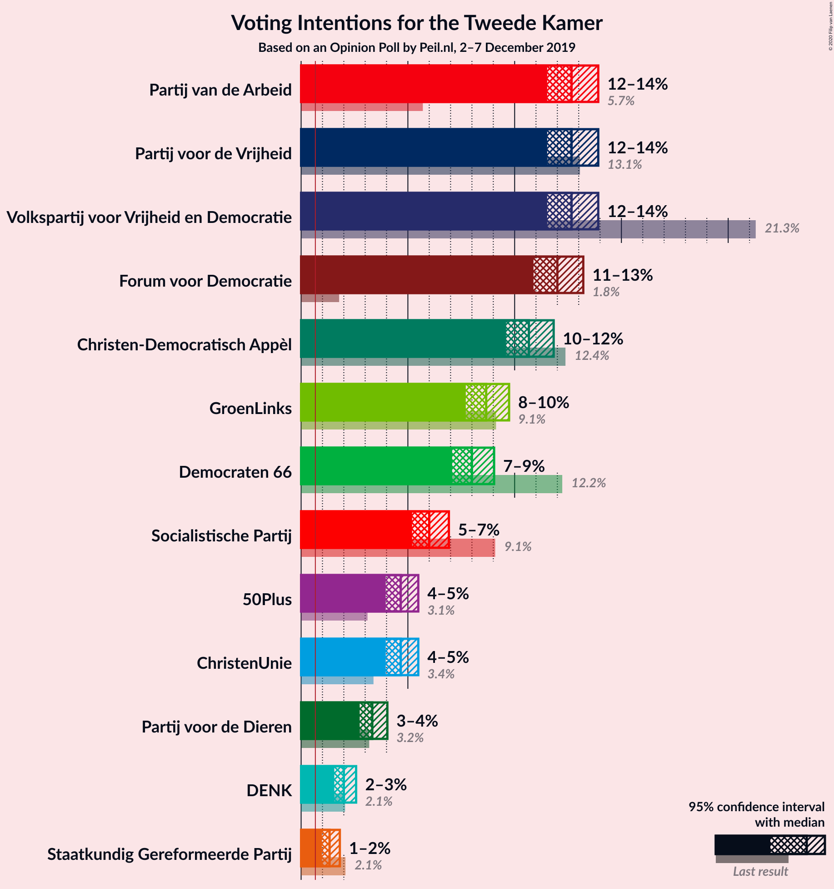
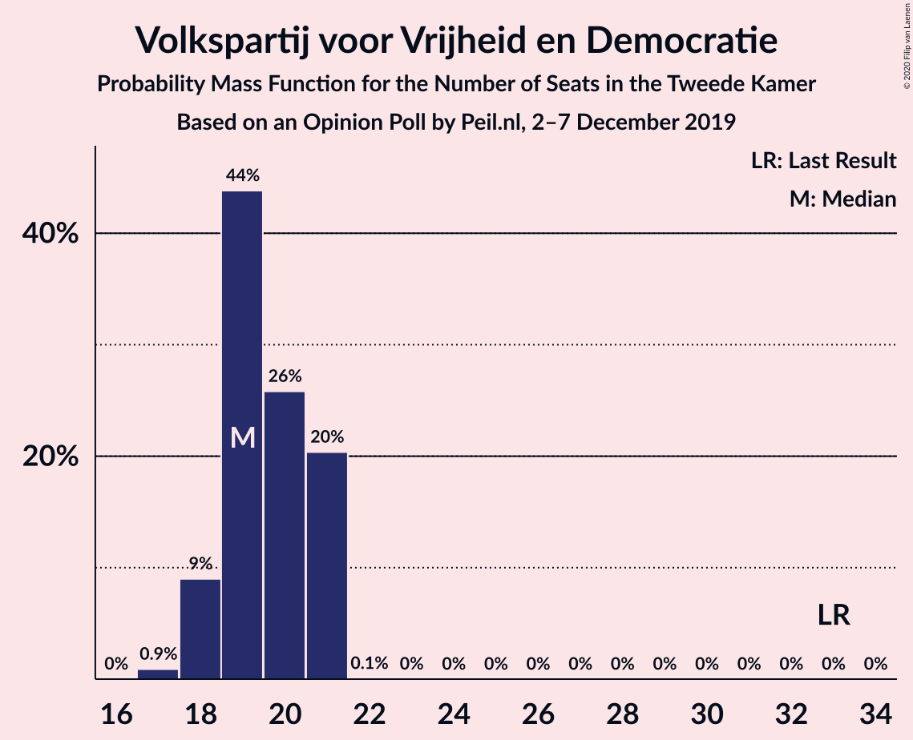
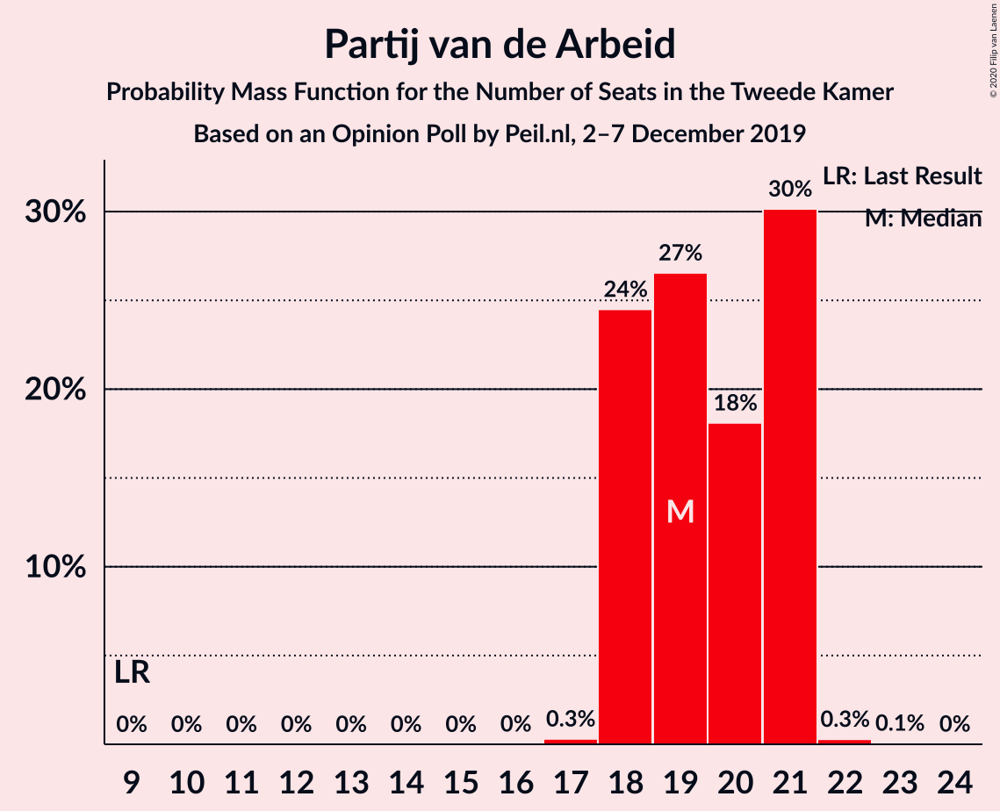
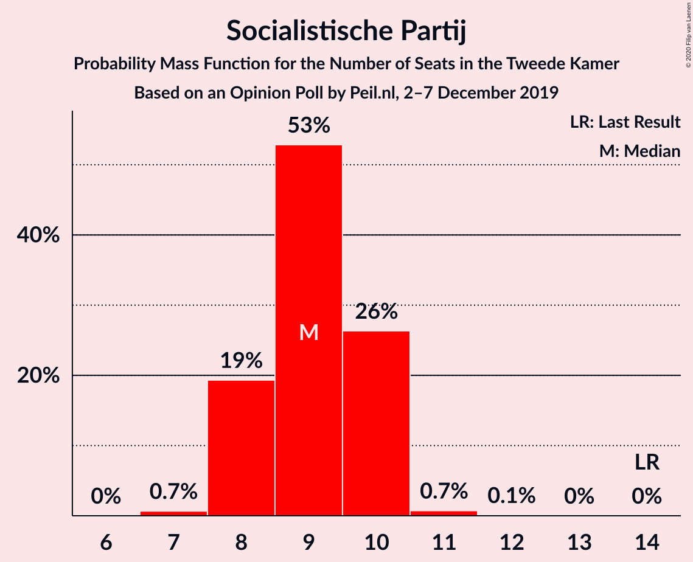
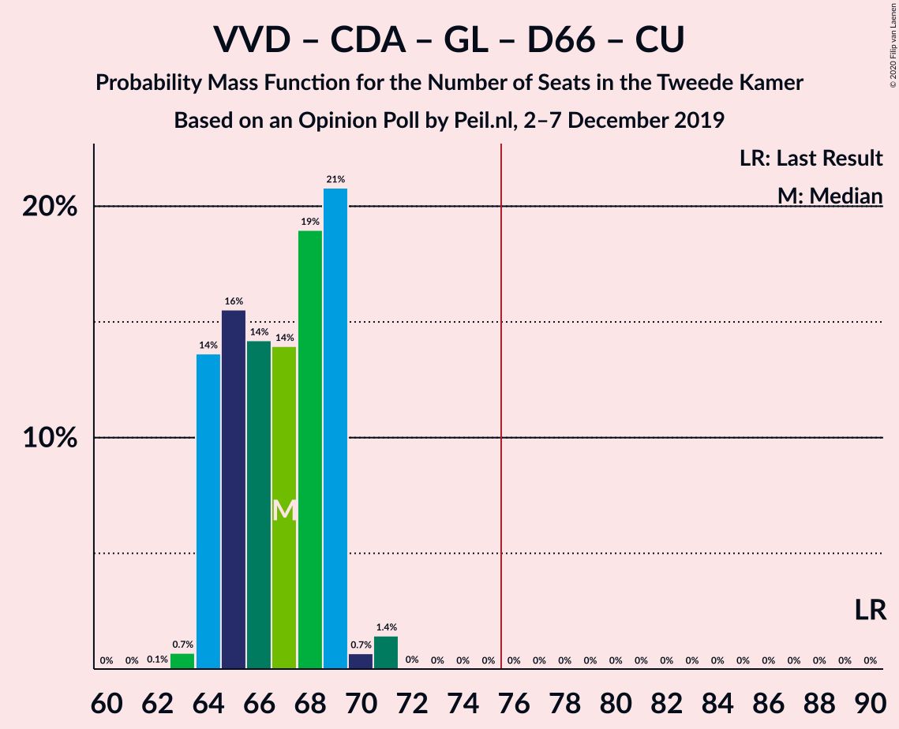
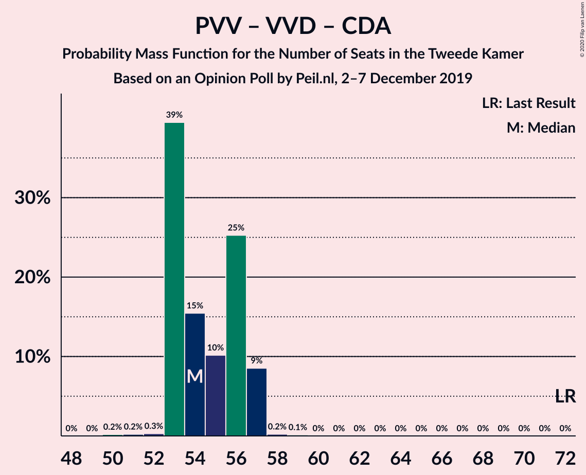

# Opinion Poll by Peil.nl, 2–7 December 2019

<a href="#voting-intentions">Voting Intentions</a> | <a href="#seats">Seats</a> | <a href="#coalitions">Coalitions</a> | <a href="#technical-information">Technical Information</a>

## Voting Intentions

### Confidence Intervals

| Party | Last Result | Poll Result | 80% Confidence Interval | 90% Confidence Interval | 95% Confidence Interval | 99% Confidence Interval |
|:-----:|:-----------:|:-----------:|:-----------------------:|:-----------------------:|:-----------------------:|:-----------------------:|
| Volkspartij voor Vrijheid en Democratie | 21.3% | 12.7% | 11.9–13.5% |11.7–13.7% |11.5–13.9% |11.2–14.3% |
| Partij voor de Vrijheid | 13.1% | 12.7% | 11.9–13.5% |11.7–13.7% |11.5–13.9% |11.2–14.3% |
| Partij van de Arbeid | 5.7% | 12.7% | 11.9–13.5% |11.7–13.7% |11.5–13.9% |11.2–14.3% |
| Forum voor Democratie | 1.8% | 12.0% | 11.3–12.8% |11.1–13.0% |10.9–13.2% |10.5–13.6% |
| Christen-Democratisch Appèl | 12.4% | 10.7% | 10.0–11.4% |9.8–11.6% |9.6–11.8% |9.3–12.2% |
| GroenLinks | 9.1% | 8.7% | 8.0–9.4% |7.8–9.6% |7.7–9.7% |7.4–10.1% |
| Democraten 66 | 12.2% | 8.0% | 7.4–8.7% |7.2–8.9% |7.1–9.0% |6.8–9.4% |
| Socialistische Partij | 9.1% | 6.0% | 5.5–6.6% |5.3–6.8% |5.2–6.9% |5.0–7.2% |
| ChristenUnie | 3.4% | 4.7% | 4.2–5.2% |4.1–5.3% |4.0–5.5% |3.7–5.8% |
| 50Plus | 3.1% | 4.7% | 4.2–5.2% |4.1–5.3% |4.0–5.5% |3.7–5.8% |
| Partij voor de Dieren | 3.2% | 3.3% | 2.9–3.8% |2.8–3.9% |2.7–4.0% |2.6–4.3% |
| DENK | 2.1% | 2.0% | 1.7–2.4% |1.6–2.5% |1.6–2.6% |1.4–2.8% |
| Staatkundig Gereformeerde Partij | 2.1% | 1.3% | 1.1–1.6% |1.0–1.7% |1.0–1.8% |0.9–2.0% |

*Note:* The poll result column reflects the actual value used in the calculations. Published results may vary slightly, and in addition be rounded to fewer digits.

## Seats

### Confidence Intervals

| Party | Last Result | Median | 80% Confidence Interval | 90% Confidence Interval | 95% Confidence Interval | 99% Confidence Interval |
|:-----:|:-----------:|:------:|:-----------------------:|:-----------------------:|:-----------------------:|:-----------------------:|
| <a href="#volkspartij-voor-vrijheid-en-democratie">Volkspartij voor Vrijheid en Democratie</a> | 33 | 19 | 18–21 |17–21 |17–21 |17–22 |
| <a href="#partij-voor-de-vrijheid">Partij voor de Vrijheid</a> | 20 | 19 | 18–20 |17–20 |16–20 |16–21 |
| <a href="#partij-van-de-arbeid">Partij van de Arbeid</a> | 9 | 19 | 18–21 |18–21 |17–22 |16–23 |
| <a href="#forum-voor-democratie">Forum voor Democratie</a> | 2 | 19 | 17–22 |17–22 |16–22 |16–22 |
| <a href="#christen-democratisch-appèl">Christen-Democratisch Appèl</a> | 19 | 15 | 14–17 |14–18 |14–18 |13–19 |
| <a href="#groenlinks">GroenLinks</a> | 14 | 13 | 11–14 |11–16 |11–16 |11–16 |
| <a href="#democraten-66">Democraten 66</a> | 19 | 12 | 11–14 |10–14 |10–14 |10–15 |
| <a href="#socialistische-partij">Socialistische Partij</a> | 14 | 8 | 8–10 |7–10 |7–11 |7–11 |
| <a href="#christenunie">ChristenUnie</a> | 5 | 7 | 6–8 |5–8 |5–9 |5–9 |
| <a href="#50plus">50Plus</a> | 4 | 7 | 6–8 |6–9 |6–9 |5–9 |
| <a href="#partij-voor-de-dieren">Partij voor de Dieren</a> | 5 | 5 | 4–6 |4–6 |4–6 |4–6 |
| <a href="#denk">DENK</a> | 3 | 3 | 2–4 |2–4 |2–4 |2–4 |
| <a href="#staatkundig-gereformeerde-partij">Staatkundig Gereformeerde Partij</a> | 3 | 2 | 1–2 |1–2 |1–2 |0–2 |

### Volkspartij voor Vrijheid en Democratie

*For a full overview of the results for this party, see the [Volkspartij voor Vrijheid en Democratie](party-volkspartijvoorvrijheidendemocratie.html) page.*

| Number of Seats | Probability | Accumulated | Special Marks |
|:---------------:|:-----------:|:-----------:|:-------------:|
| 16 | 0.1% | 100% |  |
| 17 | 7% | 99.8% |  |
| 18 | 32% | 93% |  |
| 19 | 21% | 61% | Median |
| 20 | 30% | 40% |  |
| 21 | 9% | 10% |  |
| 22 | 1.4% | 2% |  |
| 23 | 0.2% | 0.2% |  |
| 24 | 0% | 0% |  |
| 25 | 0% | 0% |  |
| 26 | 0% | 0% |  |
| 27 | 0% | 0% |  |
| 28 | 0% | 0% |  |
| 29 | 0% | 0% |  |
| 30 | 0% | 0% |  |
| 31 | 0% | 0% |  |
| 32 | 0% | 0% |  |
| 33 | 0% | 0% | Last Result |

### Partij voor de Vrijheid

*For a full overview of the results for this party, see the [Partij voor de Vrijheid](party-partijvoordevrijheid.html) page.*

| Number of Seats | Probability | Accumulated | Special Marks |
|:---------------:|:-----------:|:-----------:|:-------------:|
| 16 | 4% | 100% |  |
| 17 | 0.8% | 96% |  |
| 18 | 32% | 95% |  |
| 19 | 14% | 63% | Median |
| 20 | 47% | 48% | Last Result |
| 21 | 1.4% | 2% |  |
| 22 | 0.2% | 0.3% |  |
| 23 | 0.1% | 0.1% |  |
| 24 | 0% | 0% |  |

### Partij van de Arbeid

*For a full overview of the results for this party, see the [Partij van de Arbeid](party-partijvandearbeid.html) page.*

| Number of Seats | Probability | Accumulated | Special Marks |
|:---------------:|:-----------:|:-----------:|:-------------:|
| 9 | 0% | 100% | Last Result |
| 10 | 0% | 100% |  |
| 11 | 0% | 100% |  |
| 12 | 0% | 100% |  |
| 13 | 0% | 100% |  |
| 14 | 0% | 100% |  |
| 15 | 0% | 100% |  |
| 16 | 0.7% | 100% |  |
| 17 | 2% | 99.3% |  |
| 18 | 16% | 97% |  |
| 19 | 37% | 81% | Median |
| 20 | 18% | 44% |  |
| 21 | 21% | 26% |  |
| 22 | 4% | 5% |  |
| 23 | 0.6% | 0.6% |  |
| 24 | 0% | 0% |  |

### Forum voor Democratie

*For a full overview of the results for this party, see the [Forum voor Democratie](party-forumvoordemocratie.html) page.*

| Number of Seats | Probability | Accumulated | Special Marks |
|:---------------:|:-----------:|:-----------:|:-------------:|
| 2 | 0% | 100% | Last Result |
| 3 | 0% | 100% |  |
| 4 | 0% | 100% |  |
| 5 | 0% | 100% |  |
| 6 | 0% | 100% |  |
| 7 | 0% | 100% |  |
| 8 | 0% | 100% |  |
| 9 | 0% | 100% |  |
| 10 | 0% | 100% |  |
| 11 | 0% | 100% |  |
| 12 | 0% | 100% |  |
| 13 | 0% | 100% |  |
| 14 | 0% | 100% |  |
| 15 | 0.1% | 100% |  |
| 16 | 3% | 99.9% |  |
| 17 | 10% | 97% |  |
| 18 | 33% | 87% |  |
| 19 | 29% | 54% | Median |
| 20 | 7% | 24% |  |
| 21 | 6% | 17% |  |
| 22 | 11% | 11% |  |
| 23 | 0% | 0% |  |

### Christen-Democratisch Appèl

*For a full overview of the results for this party, see the [Christen-Democratisch Appèl](party-christen-democratischappèl.html) page.*

| Number of Seats | Probability | Accumulated | Special Marks |
|:---------------:|:-----------:|:-----------:|:-------------:|
| 13 | 0.7% | 100% |  |
| 14 | 17% | 99.3% |  |
| 15 | 34% | 82% | Median |
| 16 | 15% | 48% |  |
| 17 | 24% | 34% |  |
| 18 | 9% | 9% |  |
| 19 | 0.5% | 0.7% | Last Result |
| 20 | 0.2% | 0.2% |  |
| 21 | 0% | 0% |  |

### GroenLinks

*For a full overview of the results for this party, see the [GroenLinks](party-groenlinks.html) page.*

| Number of Seats | Probability | Accumulated | Special Marks |
|:---------------:|:-----------:|:-----------:|:-------------:|
| 11 | 15% | 100% |  |
| 12 | 29% | 85% |  |
| 13 | 26% | 56% | Median |
| 14 | 21% | 30% | Last Result |
| 15 | 2% | 9% |  |
| 16 | 7% | 7% |  |
| 17 | 0% | 0% |  |

### Democraten 66

*For a full overview of the results for this party, see the [Democraten 66](party-democraten66.html) page.*

| Number of Seats | Probability | Accumulated | Special Marks |
|:---------------:|:-----------:|:-----------:|:-------------:|
| 10 | 7% | 100% |  |
| 11 | 18% | 93% |  |
| 12 | 38% | 75% | Median |
| 13 | 26% | 37% |  |
| 14 | 11% | 11% |  |
| 15 | 0.6% | 0.6% |  |
| 16 | 0% | 0% |  |
| 17 | 0% | 0% |  |
| 18 | 0% | 0% |  |
| 19 | 0% | 0% | Last Result |

### Socialistische Partij

*For a full overview of the results for this party, see the [Socialistische Partij](party-socialistischepartij.html) page.*

| Number of Seats | Probability | Accumulated | Special Marks |
|:---------------:|:-----------:|:-----------:|:-------------:|
| 6 | 0.1% | 100% |  |
| 7 | 9% | 99.9% |  |
| 8 | 41% | 91% | Median |
| 9 | 34% | 50% |  |
| 10 | 13% | 16% |  |
| 11 | 4% | 4% |  |
| 12 | 0% | 0% |  |
| 13 | 0% | 0% |  |
| 14 | 0% | 0% | Last Result |

### ChristenUnie

*For a full overview of the results for this party, see the [ChristenUnie](party-christenunie.html) page.*

| Number of Seats | Probability | Accumulated | Special Marks |
|:---------------:|:-----------:|:-----------:|:-------------:|
| 5 | 9% | 100% | Last Result |
| 6 | 15% | 91% |  |
| 7 | 62% | 76% | Median |
| 8 | 11% | 14% |  |
| 9 | 3% | 3% |  |
| 10 | 0% | 0% |  |

### 50Plus

*For a full overview of the results for this party, see the [50Plus](party-50plus.html) page.*

| Number of Seats | Probability | Accumulated | Special Marks |
|:---------------:|:-----------:|:-----------:|:-------------:|
| 4 | 0% | 100% | Last Result |
| 5 | 1.1% | 100% |  |
| 6 | 28% | 98.9% |  |
| 7 | 43% | 70% | Median |
| 8 | 22% | 28% |  |
| 9 | 6% | 6% |  |
| 10 | 0% | 0% |  |

### Partij voor de Dieren

*For a full overview of the results for this party, see the [Partij voor de Dieren](party-partijvoordedieren.html) page.*

| Number of Seats | Probability | Accumulated | Special Marks |
|:---------------:|:-----------:|:-----------:|:-------------:|
| 3 | 0.2% | 100% |  |
| 4 | 24% | 99.8% |  |
| 5 | 37% | 76% | Last Result, Median |
| 6 | 38% | 39% |  |
| 7 | 0.2% | 0.2% |  |
| 8 | 0% | 0% |  |

### DENK

*For a full overview of the results for this party, see the [DENK](party-denk.html) page.*

| Number of Seats | Probability | Accumulated | Special Marks |
|:---------------:|:-----------:|:-----------:|:-------------:|
| 2 | 24% | 100% |  |
| 3 | 51% | 76% | Last Result, Median |
| 4 | 24% | 24% |  |
| 5 | 0% | 0% |  |

### Staatkundig Gereformeerde Partij

*For a full overview of the results for this party, see the [Staatkundig Gereformeerde Partij](party-staatkundiggereformeerdepartij.html) page.*

| Number of Seats | Probability | Accumulated | Special Marks |
|:---------------:|:-----------:|:-----------:|:-------------:|
| 0 | 0.5% | 100% |  |
| 1 | 38% | 99.5% |  |
| 2 | 61% | 61% | Median |
| 3 | 0.4% | 0.4% | Last Result |
| 4 | 0% | 0% |  |

## Coalitions

### Confidence Intervals

| Coalition | Last Result | Median | Majority? | 80% Confidence Interval | 90% Confidence Interval | 95% Confidence Interval | 99% Confidence Interval |
|:---------:|:-----------:|:------:|:---------:|:-----------------------:|:-----------------------:|:-----------------------:|:-----------------------:|
| Partij van de Arbeid – Christen-Democratisch Appèl – GroenLinks – Democraten 66 – Socialistische Partij – ChristenUnie | 80 | 76 | 64% | 72–79 | 71–80 | 71–80 | 71–80 |
| Partij voor de Vrijheid – Volkspartij voor Vrijheid en Democratie – Forum voor Democratie – Christen-Democratisch Appèl – Staatkundig Gereformeerde Partij | 77 | 74 | 20% | 72–77 | 71–78 | 71–79 | 71–79 |
| Partij van de Arbeid – Volkspartij voor Vrijheid en Democratie – Christen-Democratisch Appèl – Democraten 66 – ChristenUnie | 85 | 73 | 8% | 71–75 | 71–76 | 70–77 | 68–78 |
| Partij voor de Vrijheid – Volkspartij voor Vrijheid en Democratie – Forum voor Democratie – Christen-Democratisch Appèl | 74 | 73 | 6% | 70–75 | 69–76 | 69–77 | 69–77 |
| Volkspartij voor Vrijheid en Democratie – Christen-Democratisch Appèl – GroenLinks – Democraten 66 – ChristenUnie | 90 | 67 | 0% | 64–70 | 63–71 | 63–72 | 63–72 |
| Partij van de Arbeid – Christen-Democratisch Appèl – GroenLinks – Democraten 66 – ChristenUnie | 66 | 68 | 0% | 63–70 | 62–72 | 62–72 | 62–72 |
| Volkspartij voor Vrijheid en Democratie – Forum voor Democratie – Christen-Democratisch Appèl – 50Plus – Staatkundig Gereformeerde Partij | 61 | 62 | 0% | 60–66 | 60–66 | 60–67 | 59–67 |
| Volkspartij voor Vrijheid en Democratie – Forum voor Democratie – Christen-Democratisch Appèl – 50Plus | 58 | 60 | 0% | 59–64 | 59–64 | 59–65 | 57–65 |
| Volkspartij voor Vrijheid en Democratie – Forum voor Democratie – Christen-Democratisch Appèl – Staatkundig Gereformeerde Partij | 57 | 55 | 0% | 53–59 | 53–59 | 53–60 | 51–60 |
| Partij van de Arbeid – Volkspartij voor Vrijheid en Democratie – Christen-Democratisch Appèl | 61 | 54 | 0% | 52–56 | 52–58 | 52–59 | 49–59 |
| Volkspartij voor Vrijheid en Democratie – Christen-Democratisch Appèl – Democraten 66 – ChristenUnie | 76 | 54 | 0% | 52–56 | 51–56 | 51–58 | 51–58 |
| Volkspartij voor Vrijheid en Democratie – Forum voor Democratie – Christen-Democratisch Appèl | 54 | 53 | 0% | 51–57 | 51–57 | 51–58 | 50–58 |
| Partij voor de Vrijheid – Volkspartij voor Vrijheid en Democratie – Christen-Democratisch Appèl | 72 | 54 | 0% | 52–56 | 51–57 | 51–57 | 51–58 |
| Partij van de Arbeid – Volkspartij voor Vrijheid en Democratie – Democraten 66 | 61 | 51 | 0% | 48–53 | 48–54 | 48–54 | 44–55 |
| Volkspartij voor Vrijheid en Democratie – Christen-Democratisch Appèl – Democraten 66 | 71 | 47 | 0% | 45–49 | 45–51 | 45–51 | 44–51 |
| Partij van de Arbeid – Christen-Democratisch Appèl – Democraten 66 | 47 | 48 | 0% | 44–49 | 44–50 | 44–50 | 43–51 |
| Partij van de Arbeid – Christen-Democratisch Appèl – ChristenUnie | 33 | 43 | 0% | 40–44 | 40–44 | 40–44 | 38–46 |
| Partij van de Arbeid – Volkspartij voor Vrijheid en Democratie | 42 | 39 | 0% | 36–40 | 36–42 | 36–42 | 33–43 |
| Partij van de Arbeid – Christen-Democratisch Appèl | 28 | 36 | 0% | 33–37 | 33–38 | 33–38 | 32–40 |
| Volkspartij voor Vrijheid en Democratie – Christen-Democratisch Appèl | 52 | 34 | 0% | 33–37 | 33–38 | 33–38 | 32–38 |
| Christen-Democratisch Appèl – Democraten 66 | 38 | 28 | 0% | 25–30 | 25–30 | 25–31 | 24–32 |

### Partij van de Arbeid – Christen-Democratisch Appèl – GroenLinks – Democraten 66 – Socialistische Partij – ChristenUnie

| Number of Seats | Probability | Accumulated | Special Marks |
|:---------------:|:-----------:|:-----------:|:-------------:|
| 71 | 10% | 100% |  |
| 72 | 5% | 90% |  |
| 73 | 0.5% | 85% |  |
| 74 | 10% | 85% | Median |
| 75 | 11% | 75% |  |
| 76 | 22% | 64% | Majority |
| 77 | 26% | 42% |  |
| 78 | 6% | 16% |  |
| 79 | 1.4% | 10% |  |
| 80 | 9% | 9% | Last Result |
| 81 | 0.1% | 0.1% |  |
| 82 | 0% | 0% |  |

### Partij voor de Vrijheid – Volkspartij voor Vrijheid en Democratie – Forum voor Democratie – Christen-Democratisch Appèl – Staatkundig Gereformeerde Partij

| Number of Seats | Probability | Accumulated | Special Marks |
|:---------------:|:-----------:|:-----------:|:-------------:|
| 70 | 0.1% | 100% |  |
| 71 | 8% | 99.9% |  |
| 72 | 3% | 92% |  |
| 73 | 19% | 88% |  |
| 74 | 26% | 69% | Median |
| 75 | 23% | 43% |  |
| 76 | 5% | 20% | Majority |
| 77 | 9% | 15% | Last Result |
| 78 | 3% | 6% |  |
| 79 | 3% | 3% |  |
| 80 | 0% | 0% |  |

### Partij van de Arbeid – Volkspartij voor Vrijheid en Democratie – Christen-Democratisch Appèl – Democraten 66 – ChristenUnie

| Number of Seats | Probability | Accumulated | Special Marks |
|:---------------:|:-----------:|:-----------:|:-------------:|
| 68 | 0.6% | 100% |  |
| 69 | 1.3% | 99.4% |  |
| 70 | 1.3% | 98% |  |
| 71 | 13% | 97% |  |
| 72 | 8% | 84% | Median |
| 73 | 33% | 75% |  |
| 74 | 17% | 42% |  |
| 75 | 17% | 25% |  |
| 76 | 3% | 8% | Majority |
| 77 | 3% | 5% |  |
| 78 | 1.3% | 1.3% |  |
| 79 | 0% | 0% |  |
| 80 | 0% | 0% |  |
| 81 | 0% | 0% |  |
| 82 | 0% | 0% |  |
| 83 | 0% | 0% |  |
| 84 | 0% | 0% |  |
| 85 | 0% | 0% | Last Result |

### Partij voor de Vrijheid – Volkspartij voor Vrijheid en Democratie – Forum voor Democratie – Christen-Democratisch Appèl

| Number of Seats | Probability | Accumulated | Special Marks |
|:---------------:|:-----------:|:-----------:|:-------------:|
| 68 | 0.1% | 100% |  |
| 69 | 8% | 99.9% |  |
| 70 | 2% | 92% |  |
| 71 | 6% | 90% |  |
| 72 | 26% | 83% | Median |
| 73 | 28% | 57% |  |
| 74 | 13% | 29% | Last Result |
| 75 | 9% | 15% |  |
| 76 | 3% | 6% | Majority |
| 77 | 3% | 3% |  |
| 78 | 0% | 0% |  |

### Volkspartij voor Vrijheid en Democratie – Christen-Democratisch Appèl – GroenLinks – Democraten 66 – ChristenUnie

| Number of Seats | Probability | Accumulated | Special Marks |
|:---------------:|:-----------:|:-----------:|:-------------:|
| 62 | 0.1% | 100% |  |
| 63 | 10% | 99.9% |  |
| 64 | 10% | 90% |  |
| 65 | 10% | 80% |  |
| 66 | 18% | 70% | Median |
| 67 | 22% | 52% |  |
| 68 | 5% | 30% |  |
| 69 | 13% | 25% |  |
| 70 | 2% | 11% |  |
| 71 | 7% | 9% |  |
| 72 | 2% | 3% |  |
| 73 | 0.2% | 0.3% |  |
| 74 | 0% | 0% |  |
| 75 | 0% | 0% |  |
| 76 | 0% | 0% | Majority |
| 77 | 0% | 0% |  |
| 78 | 0% | 0% |  |
| 79 | 0% | 0% |  |
| 80 | 0% | 0% |  |
| 81 | 0% | 0% |  |
| 82 | 0% | 0% |  |
| 83 | 0% | 0% |  |
| 84 | 0% | 0% |  |
| 85 | 0% | 0% |  |
| 86 | 0% | 0% |  |
| 87 | 0% | 0% |  |
| 88 | 0% | 0% |  |
| 89 | 0% | 0% |  |
| 90 | 0% | 0% | Last Result |

### Partij van de Arbeid – Christen-Democratisch Appèl – GroenLinks – Democraten 66 – ChristenUnie

| Number of Seats | Probability | Accumulated | Special Marks |
|:---------------:|:-----------:|:-----------:|:-------------:|
| 62 | 10% | 100% |  |
| 63 | 1.4% | 90% |  |
| 64 | 1.0% | 89% |  |
| 65 | 14% | 88% |  |
| 66 | 6% | 74% | Last Result, Median |
| 67 | 13% | 68% |  |
| 68 | 32% | 55% |  |
| 69 | 12% | 23% |  |
| 70 | 2% | 11% |  |
| 71 | 0.2% | 9% |  |
| 72 | 9% | 9% |  |
| 73 | 0% | 0% |  |

### Volkspartij voor Vrijheid en Democratie – Forum voor Democratie – Christen-Democratisch Appèl – 50Plus – Staatkundig Gereformeerde Partij

| Number of Seats | Probability | Accumulated | Special Marks |
|:---------------:|:-----------:|:-----------:|:-------------:|
| 58 | 0.4% | 100% |  |
| 59 | 1.4% | 99.5% |  |
| 60 | 21% | 98% |  |
| 61 | 19% | 77% | Last Result |
| 62 | 14% | 58% | Median |
| 63 | 18% | 44% |  |
| 64 | 8% | 26% |  |
| 65 | 6% | 17% |  |
| 66 | 8% | 11% |  |
| 67 | 3% | 3% |  |
| 68 | 0% | 0.1% |  |
| 69 | 0% | 0% |  |

### Volkspartij voor Vrijheid en Democratie – Forum voor Democratie – Christen-Democratisch Appèl – 50Plus

| Number of Seats | Probability | Accumulated | Special Marks |
|:---------------:|:-----------:|:-----------:|:-------------:|
| 56 | 0.4% | 100% |  |
| 57 | 0.4% | 99.6% |  |
| 58 | 1.3% | 99.2% | Last Result |
| 59 | 36% | 98% |  |
| 60 | 17% | 62% | Median |
| 61 | 17% | 46% |  |
| 62 | 7% | 29% |  |
| 63 | 8% | 22% |  |
| 64 | 11% | 15% |  |
| 65 | 3% | 3% |  |
| 66 | 0% | 0% |  |

### Volkspartij voor Vrijheid en Democratie – Forum voor Democratie – Christen-Democratisch Appèl – Staatkundig Gereformeerde Partij

| Number of Seats | Probability | Accumulated | Special Marks |
|:---------------:|:-----------:|:-----------:|:-------------:|
| 51 | 0.6% | 100% |  |
| 52 | 2% | 99.4% |  |
| 53 | 27% | 98% |  |
| 54 | 12% | 71% |  |
| 55 | 17% | 59% | Median |
| 56 | 13% | 42% |  |
| 57 | 11% | 29% | Last Result |
| 58 | 6% | 18% |  |
| 59 | 9% | 12% |  |
| 60 | 3% | 3% |  |
| 61 | 0% | 0% |  |

### Partij van de Arbeid – Volkspartij voor Vrijheid en Democratie – Christen-Democratisch Appèl

| Number of Seats | Probability | Accumulated | Special Marks |
|:---------------:|:-----------:|:-----------:|:-------------:|
| 49 | 0.6% | 100% |  |
| 50 | 0.1% | 99.4% |  |
| 51 | 1.3% | 99.3% |  |
| 52 | 8% | 98% |  |
| 53 | 28% | 90% | Median |
| 54 | 13% | 62% |  |
| 55 | 29% | 49% |  |
| 56 | 13% | 20% |  |
| 57 | 1.1% | 7% |  |
| 58 | 2% | 6% |  |
| 59 | 4% | 4% |  |
| 60 | 0% | 0% |  |
| 61 | 0% | 0% | Last Result |

### Volkspartij voor Vrijheid en Democratie – Christen-Democratisch Appèl – Democraten 66 – ChristenUnie

| Number of Seats | Probability | Accumulated | Special Marks |
|:---------------:|:-----------:|:-----------:|:-------------:|
| 50 | 0.3% | 100% |  |
| 51 | 8% | 99.7% |  |
| 52 | 17% | 91% |  |
| 53 | 8% | 74% | Median |
| 54 | 35% | 66% |  |
| 55 | 19% | 30% |  |
| 56 | 7% | 11% |  |
| 57 | 0.7% | 5% |  |
| 58 | 4% | 4% |  |
| 59 | 0% | 0.3% |  |
| 60 | 0.3% | 0.3% |  |
| 61 | 0% | 0% |  |
| 62 | 0% | 0% |  |
| 63 | 0% | 0% |  |
| 64 | 0% | 0% |  |
| 65 | 0% | 0% |  |
| 66 | 0% | 0% |  |
| 67 | 0% | 0% |  |
| 68 | 0% | 0% |  |
| 69 | 0% | 0% |  |
| 70 | 0% | 0% |  |
| 71 | 0% | 0% |  |
| 72 | 0% | 0% |  |
| 73 | 0% | 0% |  |
| 74 | 0% | 0% |  |
| 75 | 0% | 0% |  |
| 76 | 0% | 0% | Last Result, Majority |

### Volkspartij voor Vrijheid en Democratie – Forum voor Democratie – Christen-Democratisch Appèl

| Number of Seats | Probability | Accumulated | Special Marks |
|:---------------:|:-----------:|:-----------:|:-------------:|
| 49 | 0.1% | 100% |  |
| 50 | 1.2% | 99.9% |  |
| 51 | 12% | 98.7% |  |
| 52 | 17% | 86% |  |
| 53 | 26% | 70% | Median |
| 54 | 13% | 44% | Last Result |
| 55 | 8% | 31% |  |
| 56 | 7% | 23% |  |
| 57 | 12% | 15% |  |
| 58 | 4% | 4% |  |
| 59 | 0% | 0% |  |

### Partij voor de Vrijheid – Volkspartij voor Vrijheid en Democratie – Christen-Democratisch Appèl

| Number of Seats | Probability | Accumulated | Special Marks |
|:---------------:|:-----------:|:-----------:|:-------------:|
| 50 | 0.1% | 100% |  |
| 51 | 9% | 99.9% |  |
| 52 | 6% | 91% |  |
| 53 | 16% | 85% | Median |
| 54 | 50% | 69% |  |
| 55 | 5% | 19% |  |
| 56 | 8% | 14% |  |
| 57 | 5% | 6% |  |
| 58 | 0.7% | 0.8% |  |
| 59 | 0% | 0.1% |  |
| 60 | 0% | 0% |  |
| 61 | 0% | 0% |  |
| 62 | 0% | 0% |  |
| 63 | 0% | 0% |  |
| 64 | 0% | 0% |  |
| 65 | 0% | 0% |  |
| 66 | 0% | 0% |  |
| 67 | 0% | 0% |  |
| 68 | 0% | 0% |  |
| 69 | 0% | 0% |  |
| 70 | 0% | 0% |  |
| 71 | 0% | 0% |  |
| 72 | 0% | 0% | Last Result |

### Partij van de Arbeid – Volkspartij voor Vrijheid en Democratie – Democraten 66

| Number of Seats | Probability | Accumulated | Special Marks |
|:---------------:|:-----------:|:-----------:|:-------------:|
| 44 | 0.6% | 100% |  |
| 45 | 0% | 99.4% |  |
| 46 | 0.4% | 99.4% |  |
| 47 | 0.3% | 99.0% |  |
| 48 | 10% | 98.7% |  |
| 49 | 20% | 88% |  |
| 50 | 16% | 68% | Median |
| 51 | 14% | 52% |  |
| 52 | 12% | 38% |  |
| 53 | 20% | 26% |  |
| 54 | 4% | 6% |  |
| 55 | 2% | 2% |  |
| 56 | 0.1% | 0.1% |  |
| 57 | 0% | 0% |  |
| 58 | 0% | 0% |  |
| 59 | 0% | 0% |  |
| 60 | 0% | 0% |  |
| 61 | 0% | 0% | Last Result |

### Volkspartij voor Vrijheid en Democratie – Christen-Democratisch Appèl – Democraten 66

| Number of Seats | Probability | Accumulated | Special Marks |
|:---------------:|:-----------:|:-----------:|:-------------:|
| 44 | 2% | 100% |  |
| 45 | 23% | 98% |  |
| 46 | 3% | 74% | Median |
| 47 | 45% | 72% |  |
| 48 | 15% | 27% |  |
| 49 | 3% | 12% |  |
| 50 | 4% | 9% |  |
| 51 | 5% | 6% |  |
| 52 | 0.1% | 0.3% |  |
| 53 | 0.2% | 0.2% |  |
| 54 | 0% | 0% |  |
| 55 | 0% | 0% |  |
| 56 | 0% | 0% |  |
| 57 | 0% | 0% |  |
| 58 | 0% | 0% |  |
| 59 | 0% | 0% |  |
| 60 | 0% | 0% |  |
| 61 | 0% | 0% |  |
| 62 | 0% | 0% |  |
| 63 | 0% | 0% |  |
| 64 | 0% | 0% |  |
| 65 | 0% | 0% |  |
| 66 | 0% | 0% |  |
| 67 | 0% | 0% |  |
| 68 | 0% | 0% |  |
| 69 | 0% | 0% |  |
| 70 | 0% | 0% |  |
| 71 | 0% | 0% | Last Result |

### Partij van de Arbeid – Christen-Democratisch Appèl – Democraten 66

| Number of Seats | Probability | Accumulated | Special Marks |
|:---------------:|:-----------:|:-----------:|:-------------:|
| 43 | 2% | 100% |  |
| 44 | 12% | 98% |  |
| 45 | 6% | 86% |  |
| 46 | 3% | 81% | Median |
| 47 | 17% | 78% | Last Result |
| 48 | 28% | 61% |  |
| 49 | 27% | 33% |  |
| 50 | 5% | 6% |  |
| 51 | 1.1% | 1.2% |  |
| 52 | 0% | 0% |  |

### Partij van de Arbeid – Christen-Democratisch Appèl – ChristenUnie

| Number of Seats | Probability | Accumulated | Special Marks |
|:---------------:|:-----------:|:-----------:|:-------------:|
| 33 | 0% | 100% | Last Result |
| 34 | 0% | 100% |  |
| 35 | 0% | 100% |  |
| 36 | 0% | 100% |  |
| 37 | 0.1% | 100% |  |
| 38 | 0.5% | 99.9% |  |
| 39 | 1.5% | 99.4% |  |
| 40 | 16% | 98% |  |
| 41 | 25% | 82% | Median |
| 42 | 4% | 57% |  |
| 43 | 37% | 54% |  |
| 44 | 14% | 16% |  |
| 45 | 1.2% | 2% |  |
| 46 | 0.5% | 0.9% |  |
| 47 | 0.4% | 0.4% |  |
| 48 | 0% | 0% |  |

### Partij van de Arbeid – Volkspartij voor Vrijheid en Democratie

| Number of Seats | Probability | Accumulated | Special Marks |
|:---------------:|:-----------:|:-----------:|:-------------:|
| 33 | 0.6% | 100% |  |
| 34 | 0.1% | 99.4% |  |
| 35 | 0.1% | 99.3% |  |
| 36 | 13% | 99.3% |  |
| 37 | 23% | 86% |  |
| 38 | 3% | 62% | Median |
| 39 | 21% | 59% |  |
| 40 | 29% | 38% |  |
| 41 | 4% | 9% |  |
| 42 | 4% | 5% | Last Result |
| 43 | 0.8% | 0.8% |  |
| 44 | 0% | 0% |  |

### Partij van de Arbeid – Christen-Democratisch Appèl

| Number of Seats | Probability | Accumulated | Special Marks |
|:---------------:|:-----------:|:-----------:|:-------------:|
| 28 | 0% | 100% | Last Result |
| 29 | 0% | 100% |  |
| 30 | 0.1% | 100% |  |
| 31 | 0% | 99.9% |  |
| 32 | 1.3% | 99.9% |  |
| 33 | 14% | 98.6% |  |
| 34 | 17% | 85% | Median |
| 35 | 17% | 68% |  |
| 36 | 35% | 51% |  |
| 37 | 11% | 16% |  |
| 38 | 3% | 5% |  |
| 39 | 1.1% | 2% |  |
| 40 | 0.7% | 0.7% |  |
| 41 | 0% | 0% |  |

### Volkspartij voor Vrijheid en Democratie – Christen-Democratisch Appèl

| Number of Seats | Probability | Accumulated | Special Marks |
|:---------------:|:-----------:|:-----------:|:-------------:|
| 31 | 0.1% | 100% |  |
| 32 | 0.9% | 99.9% |  |
| 33 | 14% | 99.0% |  |
| 34 | 37% | 85% | Median |
| 35 | 20% | 48% |  |
| 36 | 15% | 27% |  |
| 37 | 3% | 12% |  |
| 38 | 9% | 9% |  |
| 39 | 0.3% | 0.3% |  |
| 40 | 0% | 0% |  |
| 41 | 0% | 0% |  |
| 42 | 0% | 0% |  |
| 43 | 0% | 0% |  |
| 44 | 0% | 0% |  |
| 45 | 0% | 0% |  |
| 46 | 0% | 0% |  |
| 47 | 0% | 0% |  |
| 48 | 0% | 0% |  |
| 49 | 0% | 0% |  |
| 50 | 0% | 0% |  |
| 51 | 0% | 0% |  |
| 52 | 0% | 0% | Last Result |

### Christen-Democratisch Appèl – Democraten 66

| Number of Seats | Probability | Accumulated | Special Marks |
|:---------------:|:-----------:|:-----------:|:-------------:|
| 24 | 1.2% | 100% |  |
| 25 | 13% | 98.8% |  |
| 26 | 7% | 86% |  |
| 27 | 11% | 79% | Median |
| 28 | 27% | 68% |  |
| 29 | 25% | 41% |  |
| 30 | 11% | 15% |  |
| 31 | 3% | 4% |  |
| 32 | 0.7% | 0.7% |  |
| 33 | 0% | 0% |  |
| 34 | 0% | 0% |  |
| 35 | 0% | 0% |  |
| 36 | 0% | 0% |  |
| 37 | 0% | 0% |  |
| 38 | 0% | 0% | Last Result |

## Technical Information

### Opinion Poll

+ **Polling firm:** Peil.nl
+ **Commissioner(s):** —
+ **Fieldwork period:** 2–7 December 2019

### Calculations

+ **Sample size:** 3000
+ **Simulations done:** 131,072
+ **Error estimate:** 1.13%

