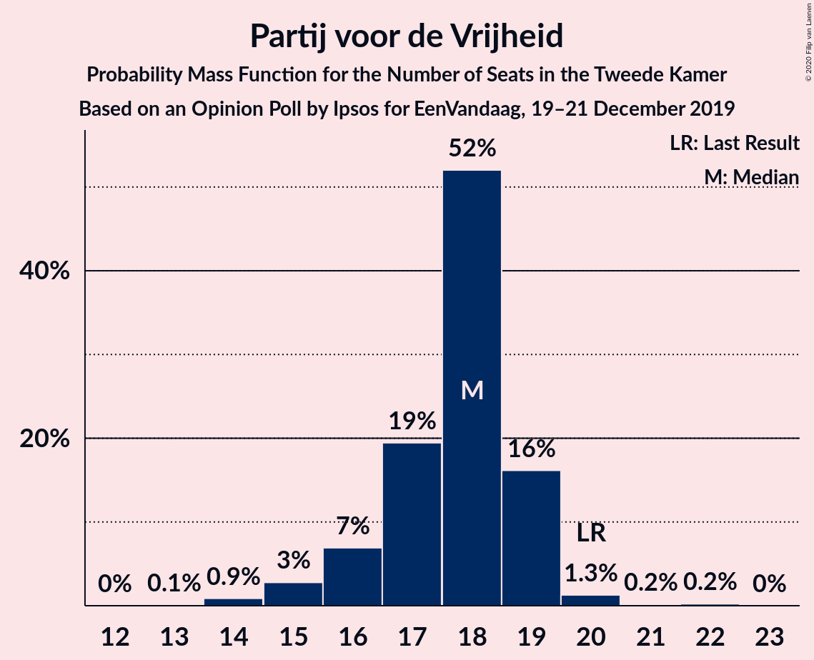
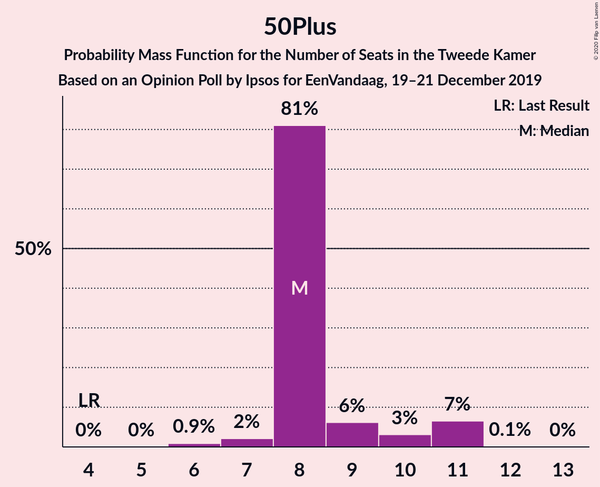
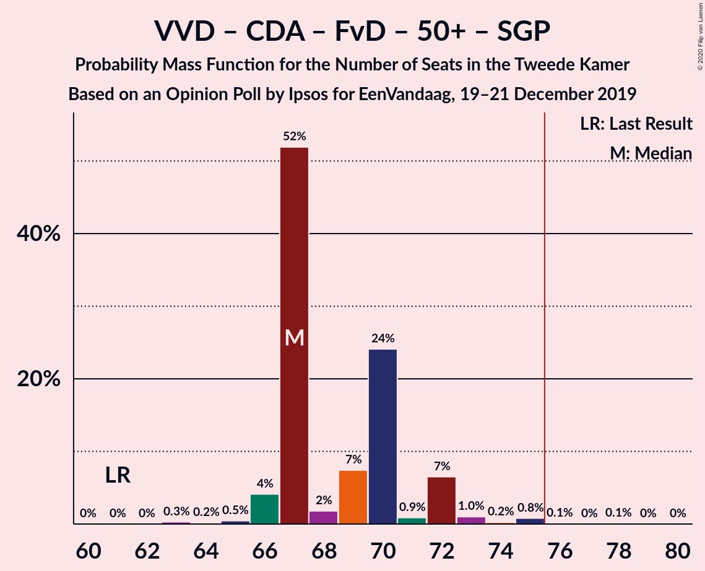
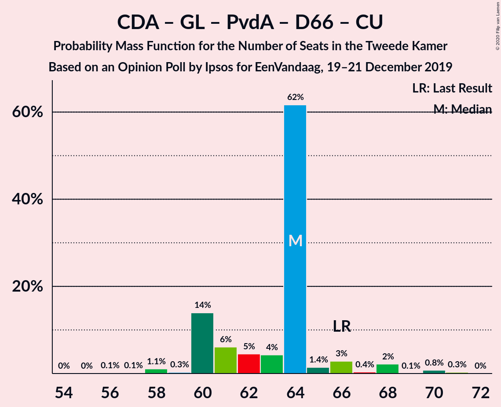
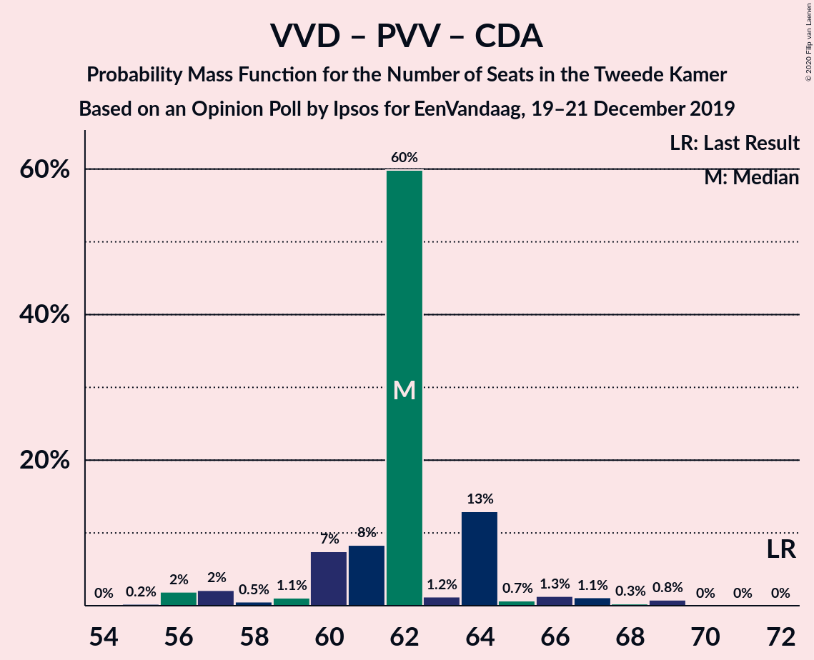
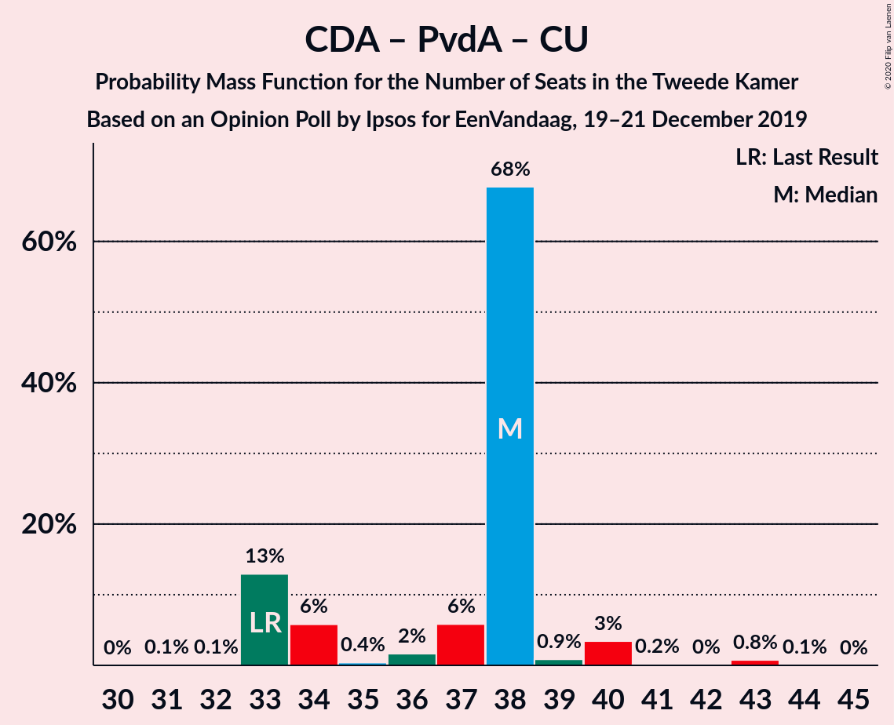

# Opinion Poll by Ipsos for EenVandaag, 19–21 December 2019

<a href="#voting-intentions">Voting Intentions</a> | <a href="#seats">Seats</a> | <a href="#coalitions">Coalitions</a> | <a href="#technical-information">Technical Information</a>

## Voting Intentions

### Confidence Intervals

| Party | Last Result | Poll Result | 80% Confidence Interval | 90% Confidence Interval | 95% Confidence Interval | 99% Confidence Interval |
|:-----:|:-----------:|:-----------:|:-----------------------:|:-----------------------:|:-----------------------:|:-----------------------:|
| Volkspartij voor Vrijheid en Democratie | 21.3% | 17.7% | 16.3–19.3% |15.9–19.8% |15.5–20.2% |14.9–21.0% |
| Partij voor de Vrijheid | 13.1% | 11.4% | 10.2–12.7% |9.9–13.1% |9.6–13.5% |9.1–14.1% |
| Christen-Democratisch Appèl | 12.4% | 11.0% | 9.8–12.3% |9.5–12.7% |9.3–13.0% |8.7–13.7% |
| GroenLinks | 9.1% | 10.3% | 9.2–11.6% |8.9–12.0% |8.6–12.3% |8.1–13.0% |
| Partij van de Arbeid | 5.7% | 9.7% | 8.6–10.9% |8.3–11.3% |8.0–11.6% |7.5–12.3% |
| Forum voor Democratie | 1.8% | 9.1% | 8.1–10.3% |7.8–10.7% |7.5–11.0% |7.0–11.6% |
| Democraten 66 | 12.2% | 7.2% | 6.3–8.3% |6.0–8.7% |5.8–8.9% |5.4–9.5% |
| 50Plus | 3.1% | 6.0% | 5.1–7.0% |4.9–7.3% |4.7–7.6% |4.3–8.1% |
| Socialistische Partij | 9.1% | 5.6% | 4.8–6.6% |4.6–6.9% |4.4–7.2% |4.0–7.7% |
| ChristenUnie | 3.4% | 4.0% | 3.3–4.9% |3.1–5.1% |3.0–5.3% |2.7–5.8% |
| Partij voor de Dieren | 3.2% | 3.7% | 3.0–4.6% |2.9–4.8% |2.7–5.0% |2.4–5.5% |
| Staatkundig Gereformeerde Partij | 2.1% | 2.0% | 1.5–2.7% |1.4–2.9% |1.3–3.0% |1.1–3.4% |
| DENK | 2.1% | 1.4% | 1.1–2.0% |0.9–2.2% |0.9–2.3% |0.7–2.7% |

*Note:* The poll result column reflects the actual value used in the calculations. Published results may vary slightly, and in addition be rounded to fewer digits.

## Seats

### Confidence Intervals

| Party | Last Result | Median | 80% Confidence Interval | 90% Confidence Interval | 95% Confidence Interval | 99% Confidence Interval |
|:-----:|:-----------:|:------:|:-----------------------:|:-----------------------:|:-----------------------:|:-----------------------:|
| <a href="#volkspartij-voor-vrijheid-en-democratie">Volkspartij voor Vrijheid en Democratie</a> | 33 | 29 | 26–29 |25–30 |25–30 |24–32 |
| <a href="#partij-voor-de-vrijheid">Partij voor de Vrijheid</a> | 20 | 18 | 17–18 |16–18 |15–19 |14–20 |
| <a href="#christen-democratisch-appèl">Christen-Democratisch Appèl</a> | 19 | 15 | 15–18 |15–18 |15–18 |14–21 |
| <a href="#groenlinks">GroenLinks</a> | 14 | 14 | 14–16 |14–18 |14–18 |12–18 |
| <a href="#partij-van-de-arbeid">Partij van de Arbeid</a> | 9 | 17 | 14–17 |13–17 |13–17 |12–17 |
| <a href="#forum-voor-democratie">Forum voor Democratie</a> | 2 | 13 | 12–14 |12–16 |12–16 |12–16 |
| <a href="#democraten-66">Democraten 66</a> | 19 | 12 | 9–12 |9–12 |9–13 |8–14 |
| <a href="#50plus">50Plus</a> | 4 | 8 | 8–9 |8–11 |8–11 |7–11 |
| <a href="#socialistische-partij">Socialistische Partij</a> | 14 | 9 | 8–10 |8–10 |7–10 |6–10 |
| <a href="#christenunie">ChristenUnie</a> | 5 | 6 | 5–6 |5–7 |5–8 |4–8 |
| <a href="#partij-voor-de-dieren">Partij voor de Dieren</a> | 5 | 4 | 4–6 |4–6 |4–6 |4–7 |
| <a href="#staatkundig-gereformeerde-partij">Staatkundig Gereformeerde Partij</a> | 3 | 2 | 2–3 |2–3 |2–3 |2–4 |
| <a href="#denk">DENK</a> | 3 | 2 | 2 |2–3 |1–3 |0–3 |

### Volkspartij voor Vrijheid en Democratie

*For a full overview of the results for this party, see the [Volkspartij voor Vrijheid en Democratie](party-volkspartijvoorvrijheidendemocratie.html) page.*

| Number of Seats | Probability | Accumulated | Special Marks |
|:---------------:|:-----------:|:-----------:|:-------------:|
| 23 | 0.4% | 100% |  |
| 24 | 0.2% | 99.6% |  |
| 25 | 8% | 99.4% |  |
| 26 | 3% | 91% |  |
| 27 | 2% | 88% |  |
| 28 | 0.3% | 86% |  |
| 29 | 79% | 86% | Median |
| 30 | 4% | 7% |  |
| 31 | 1.1% | 2% |  |
| 32 | 1.1% | 1.2% |  |
| 33 | 0.1% | 0.1% | Last Result |
| 34 | 0% | 0% |  |

### Partij voor de Vrijheid

*For a full overview of the results for this party, see the [Partij voor de Vrijheid](party-partijvoordevrijheid.html) page.*

| Number of Seats | Probability | Accumulated | Special Marks |
|:---------------:|:-----------:|:-----------:|:-------------:|
| 13 | 0.1% | 100% |  |
| 14 | 0.6% | 99.9% |  |
| 15 | 3% | 99.3% |  |
| 16 | 5% | 97% |  |
| 17 | 21% | 91% |  |
| 18 | 67% | 71% | Median |
| 19 | 2% | 4% |  |
| 20 | 2% | 2% | Last Result |
| 21 | 0.1% | 0.3% |  |
| 22 | 0.3% | 0.3% |  |
| 23 | 0% | 0% |  |

### Christen-Democratisch Appèl

*For a full overview of the results for this party, see the [Christen-Democratisch Appèl](party-christen-democratischappèl.html) page.*

| Number of Seats | Probability | Accumulated | Special Marks |
|:---------------:|:-----------:|:-----------:|:-------------:|
| 12 | 0.1% | 100% |  |
| 13 | 0.1% | 99.9% |  |
| 14 | 0.8% | 99.8% |  |
| 15 | 63% | 99.0% | Median |
| 16 | 10% | 36% |  |
| 17 | 0.8% | 26% |  |
| 18 | 23% | 25% |  |
| 19 | 0.6% | 2% | Last Result |
| 20 | 1.3% | 2% |  |
| 21 | 0.1% | 0.5% |  |
| 22 | 0.4% | 0.4% |  |
| 23 | 0% | 0% |  |

### GroenLinks

*For a full overview of the results for this party, see the [GroenLinks](party-groenlinks.html) page.*

| Number of Seats | Probability | Accumulated | Special Marks |
|:---------------:|:-----------:|:-----------:|:-------------:|
| 12 | 0.8% | 100% |  |
| 13 | 0.3% | 99.2% |  |
| 14 | 74% | 98.9% | Last Result, Median |
| 15 | 3% | 25% |  |
| 16 | 16% | 22% |  |
| 17 | 2% | 7% |  |
| 18 | 5% | 5% |  |
| 19 | 0.4% | 0.4% |  |
| 20 | 0% | 0% |  |

### Partij van de Arbeid

*For a full overview of the results for this party, see the [Partij van de Arbeid](party-partijvandearbeid.html) page.*

| Number of Seats | Probability | Accumulated | Special Marks |
|:---------------:|:-----------:|:-----------:|:-------------:|
| 9 | 0% | 100% | Last Result |
| 10 | 0% | 100% |  |
| 11 | 0% | 100% |  |
| 12 | 1.1% | 99.9% |  |
| 13 | 8% | 98.8% |  |
| 14 | 18% | 90% |  |
| 15 | 8% | 73% |  |
| 16 | 3% | 64% |  |
| 17 | 61% | 62% | Median |
| 18 | 0.1% | 0.2% |  |
| 19 | 0.1% | 0.1% |  |
| 20 | 0% | 0% |  |

### Forum voor Democratie

*For a full overview of the results for this party, see the [Forum voor Democratie](party-forumvoordemocratie.html) page.*

| Number of Seats | Probability | Accumulated | Special Marks |
|:---------------:|:-----------:|:-----------:|:-------------:|
| 2 | 0% | 100% | Last Result |
| 3 | 0% | 100% |  |
| 4 | 0% | 100% |  |
| 5 | 0% | 100% |  |
| 6 | 0% | 100% |  |
| 7 | 0% | 100% |  |
| 8 | 0% | 100% |  |
| 9 | 0% | 100% |  |
| 10 | 0% | 100% |  |
| 11 | 0.4% | 100% |  |
| 12 | 22% | 99.6% |  |
| 13 | 66% | 78% | Median |
| 14 | 2% | 12% |  |
| 15 | 0.3% | 9% |  |
| 16 | 9% | 9% |  |
| 17 | 0% | 0.2% |  |
| 18 | 0.2% | 0.2% |  |
| 19 | 0% | 0% |  |

### Democraten 66

*For a full overview of the results for this party, see the [Democraten 66](party-democraten66.html) page.*

| Number of Seats | Probability | Accumulated | Special Marks |
|:---------------:|:-----------:|:-----------:|:-------------:|
| 7 | 0% | 100% |  |
| 8 | 1.3% | 99.9% |  |
| 9 | 10% | 98.6% |  |
| 10 | 18% | 89% |  |
| 11 | 4% | 71% |  |
| 12 | 63% | 67% | Median |
| 13 | 2% | 5% |  |
| 14 | 2% | 2% |  |
| 15 | 0% | 0% |  |
| 16 | 0% | 0% |  |
| 17 | 0% | 0% |  |
| 18 | 0% | 0% |  |
| 19 | 0% | 0% | Last Result |

### 50Plus

*For a full overview of the results for this party, see the [50Plus](party-50plus.html) page.*

| Number of Seats | Probability | Accumulated | Special Marks |
|:---------------:|:-----------:|:-----------:|:-------------:|
| 4 | 0% | 100% | Last Result |
| 5 | 0% | 100% |  |
| 6 | 0% | 100% |  |
| 7 | 0.8% | 99.9% |  |
| 8 | 83% | 99.1% | Median |
| 9 | 7% | 16% |  |
| 10 | 0.9% | 9% |  |
| 11 | 8% | 8% |  |
| 12 | 0% | 0.1% |  |
| 13 | 0% | 0% |  |

### Socialistische Partij

*For a full overview of the results for this party, see the [Socialistische Partij](party-socialistischepartij.html) page.*

| Number of Seats | Probability | Accumulated | Special Marks |
|:---------------:|:-----------:|:-----------:|:-------------:|
| 5 | 0.1% | 100% |  |
| 6 | 2% | 99.9% |  |
| 7 | 3% | 98% |  |
| 8 | 7% | 96% |  |
| 9 | 75% | 89% | Median |
| 10 | 14% | 14% |  |
| 11 | 0.3% | 0.3% |  |
| 12 | 0% | 0% |  |
| 13 | 0% | 0% |  |
| 14 | 0% | 0% | Last Result |

### ChristenUnie

*For a full overview of the results for this party, see the [ChristenUnie](party-christenunie.html) page.*

| Number of Seats | Probability | Accumulated | Special Marks |
|:---------------:|:-----------:|:-----------:|:-------------:|
| 3 | 0.2% | 100% |  |
| 4 | 0.4% | 99.8% |  |
| 5 | 17% | 99.5% | Last Result |
| 6 | 76% | 83% | Median |
| 7 | 3% | 7% |  |
| 8 | 4% | 4% |  |
| 9 | 0% | 0% |  |

### Partij voor de Dieren

*For a full overview of the results for this party, see the [Partij voor de Dieren](party-partijvoordedieren.html) page.*

| Number of Seats | Probability | Accumulated | Special Marks |
|:---------------:|:-----------:|:-----------:|:-------------:|
| 3 | 0.4% | 100% |  |
| 4 | 77% | 99.6% | Median |
| 5 | 3% | 22% | Last Result |
| 6 | 18% | 19% |  |
| 7 | 2% | 2% |  |
| 8 | 0% | 0.1% |  |
| 9 | 0% | 0% |  |

### Staatkundig Gereformeerde Partij

*For a full overview of the results for this party, see the [Staatkundig Gereformeerde Partij](party-staatkundiggereformeerdepartij.html) page.*

| Number of Seats | Probability | Accumulated | Special Marks |
|:---------------:|:-----------:|:-----------:|:-------------:|
| 2 | 75% | 100% | Median |
| 3 | 24% | 25% | Last Result |
| 4 | 0.6% | 0.9% |  |
| 5 | 0.3% | 0.3% |  |
| 6 | 0% | 0% |  |

### DENK

*For a full overview of the results for this party, see the [DENK](party-denk.html) page.*

| Number of Seats | Probability | Accumulated | Special Marks |
|:---------------:|:-----------:|:-----------:|:-------------:|
| 0 | 0.7% | 100% |  |
| 1 | 4% | 99.3% |  |
| 2 | 88% | 95% | Median |
| 3 | 7% | 7% | Last Result |
| 4 | 0.1% | 0.1% |  |
| 5 | 0% | 0% |  |

## Coalitions

### Confidence Intervals

| Coalition | Last Result | Median | Majority? | 80% Confidence Interval | 90% Confidence Interval | 95% Confidence Interval | 99% Confidence Interval |
|:---------:|:-----------:|:------:|:---------:|:-----------------------:|:-----------------------:|:-----------------------:|:-----------------------:|
| Volkspartij voor Vrijheid en Democratie – Partij voor de Vrijheid – Christen-Democratisch Appèl – Forum voor Democratie – Staatkundig Gereformeerde Partij | 77 | 77 | 97% | 77–79 | 76–80 | 73–82 | 72–83 |
| Volkspartij voor Vrijheid en Democratie – Christen-Democratisch Appèl – GroenLinks – Democraten 66 – ChristenUnie | 90 | 76 | 90% | 76–79 | 71–79 | 71–80 | 71–81 |
| Volkspartij voor Vrijheid en Democratie – Christen-Democratisch Appèl – Partij van de Arbeid – Democraten 66 – ChristenUnie | 85 | 79 | 83% | 73–79 | 72–79 | 72–79 | 71–80 |
| Volkspartij voor Vrijheid en Democratie – Partij voor de Vrijheid – Christen-Democratisch Appèl – Forum voor Democratie | 74 | 75 | 29% | 75–76 | 73–78 | 70–79 | 69–81 |
| Christen-Democratisch Appèl – GroenLinks – Partij van de Arbeid – Democraten 66 – Socialistische Partij – ChristenUnie | 80 | 73 | 1.2% | 70–74 | 70–74 | 69–75 | 66–76 |
| Volkspartij voor Vrijheid en Democratie – Christen-Democratisch Appèl – Forum voor Democratie – 50Plus – Staatkundig Gereformeerde Partij | 61 | 67 | 0.2% | 67–72 | 67–72 | 66–73 | 65–75 |
| Volkspartij voor Vrijheid en Democratie – Christen-Democratisch Appèl – Forum voor Democratie – 50Plus | 58 | 65 | 0% | 65–70 | 65–70 | 63–70 | 61–73 |
| Christen-Democratisch Appèl – GroenLinks – Partij van de Arbeid – Democraten 66 – ChristenUnie | 66 | 64 | 0% | 61–64 | 61–65 | 61–66 | 58–68 |
| Volkspartij voor Vrijheid en Democratie – Partij voor de Vrijheid – Christen-Democratisch Appèl | 72 | 62 | 0% | 60–64 | 60–64 | 57–66 | 57–69 |
| Volkspartij voor Vrijheid en Democratie – Christen-Democratisch Appèl – Democraten 66 – ChristenUnie | 76 | 62 | 0% | 60–63 | 57–65 | 57–65 | 56–67 |
| Volkspartij voor Vrijheid en Democratie – Christen-Democratisch Appèl – Forum voor Democratie – Staatkundig Gereformeerde Partij | 57 | 59 | 0% | 59–62 | 59–62 | 58–64 | 56–67 |
| Volkspartij voor Vrijheid en Democratie – Christen-Democratisch Appèl – Partij van de Arbeid | 61 | 61 | 0% | 58–61 | 58–61 | 56–61 | 54–64 |
| Volkspartij voor Vrijheid en Democratie – Christen-Democratisch Appèl – Forum voor Democratie | 54 | 57 | 0% | 57–59 | 57–59 | 55–61 | 54–64 |
| Volkspartij voor Vrijheid en Democratie – Christen-Democratisch Appèl – Democraten 66 | 71 | 56 | 0% | 54–57 | 52–57 | 52–58 | 50–61 |
| Volkspartij voor Vrijheid en Democratie – Partij van de Arbeid – Democraten 66 | 61 | 58 | 0% | 51–58 | 49–58 | 49–58 | 49–58 |
| Volkspartij voor Vrijheid en Democratie – Christen-Democratisch Appèl | 52 | 44 | 0% | 43–47 | 43–47 | 42–48 | 40–51 |
| Volkspartij voor Vrijheid en Democratie – Partij van de Arbeid | 42 | 46 | 0% | 40–46 | 40–46 | 40–46 | 38–46 |
| Christen-Democratisch Appèl – Partij van de Arbeid – Democraten 66 | 47 | 44 | 0% | 41–44 | 39–44 | 39–45 | 37–46 |
| Christen-Democratisch Appèl – Partij van de Arbeid – ChristenUnie | 33 | 38 | 0% | 37–38 | 34–38 | 34–39 | 34–40 |
| Christen-Democratisch Appèl – Partij van de Arbeid | 28 | 32 | 0% | 30–33 | 29–33 | 29–33 | 27–35 |
| Christen-Democratisch Appèl – Democraten 66 | 38 | 27 | 0% | 27–28 | 26–29 | 25–30 | 23–31 |

### Volkspartij voor Vrijheid en Democratie – Partij voor de Vrijheid – Christen-Democratisch Appèl – Forum voor Democratie – Staatkundig Gereformeerde Partij

| Number of Seats | Probability | Accumulated | Special Marks |
|:---------------:|:-----------:|:-----------:|:-------------:|
| 71 | 0.3% | 100% |  |
| 72 | 0.5% | 99.7% |  |
| 73 | 2% | 99.2% |  |
| 74 | 0.2% | 97% |  |
| 75 | 0.4% | 97% |  |
| 76 | 5% | 97% | Majority |
| 77 | 62% | 92% | Last Result, Median |
| 78 | 8% | 30% |  |
| 79 | 16% | 22% |  |
| 80 | 1.0% | 5% |  |
| 81 | 2% | 4% |  |
| 82 | 1.2% | 3% |  |
| 83 | 1.1% | 1.3% |  |
| 84 | 0.1% | 0.2% |  |
| 85 | 0.1% | 0.1% |  |
| 86 | 0% | 0% |  |

### Volkspartij voor Vrijheid en Democratie – Christen-Democratisch Appèl – GroenLinks – Democraten 66 – ChristenUnie

| Number of Seats | Probability | Accumulated | Special Marks |
|:---------------:|:-----------:|:-----------:|:-------------:|
| 70 | 0.2% | 100% |  |
| 71 | 8% | 99.8% |  |
| 72 | 0.6% | 92% |  |
| 73 | 0.4% | 92% |  |
| 74 | 0.5% | 91% |  |
| 75 | 0.3% | 91% |  |
| 76 | 64% | 90% | Median, Majority |
| 77 | 1.0% | 26% |  |
| 78 | 5% | 25% |  |
| 79 | 17% | 20% |  |
| 80 | 0.7% | 3% |  |
| 81 | 2% | 2% |  |
| 82 | 0.4% | 0.5% |  |
| 83 | 0.1% | 0.1% |  |
| 84 | 0% | 0% |  |
| 85 | 0% | 0% |  |
| 86 | 0% | 0% |  |
| 87 | 0% | 0% |  |
| 88 | 0% | 0% |  |
| 89 | 0% | 0% |  |
| 90 | 0% | 0% | Last Result |

### Volkspartij voor Vrijheid en Democratie – Christen-Democratisch Appèl – Partij van de Arbeid – Democraten 66 – ChristenUnie

| Number of Seats | Probability | Accumulated | Special Marks |
|:---------------:|:-----------:|:-----------:|:-------------:|
| 70 | 0.3% | 100% |  |
| 71 | 0.3% | 99.7% |  |
| 72 | 8% | 99.4% |  |
| 73 | 5% | 91% |  |
| 74 | 3% | 86% |  |
| 75 | 0.3% | 83% |  |
| 76 | 0.3% | 83% | Majority |
| 77 | 15% | 83% |  |
| 78 | 0.1% | 68% |  |
| 79 | 66% | 68% | Median |
| 80 | 2% | 2% |  |
| 81 | 0% | 0.2% |  |
| 82 | 0.1% | 0.2% |  |
| 83 | 0.1% | 0.1% |  |
| 84 | 0% | 0% |  |
| 85 | 0% | 0% | Last Result |

### Volkspartij voor Vrijheid en Democratie – Partij voor de Vrijheid – Christen-Democratisch Appèl – Forum voor Democratie

| Number of Seats | Probability | Accumulated | Special Marks |
|:---------------:|:-----------:|:-----------:|:-------------:|
| 68 | 0.2% | 100% |  |
| 69 | 0.7% | 99.7% |  |
| 70 | 2% | 99.1% |  |
| 71 | 0.1% | 97% |  |
| 72 | 0.3% | 97% |  |
| 73 | 5% | 97% |  |
| 74 | 1.2% | 92% | Last Result |
| 75 | 62% | 91% | Median |
| 76 | 23% | 29% | Majority |
| 77 | 0.9% | 6% |  |
| 78 | 1.4% | 5% |  |
| 79 | 2% | 4% |  |
| 80 | 0.4% | 2% |  |
| 81 | 1.2% | 1.3% |  |
| 82 | 0.1% | 0.1% |  |
| 83 | 0% | 0% |  |

### Christen-Democratisch Appèl – GroenLinks – Partij van de Arbeid – Democraten 66 – Socialistische Partij – ChristenUnie

| Number of Seats | Probability | Accumulated | Special Marks |
|:---------------:|:-----------:|:-----------:|:-------------:|
| 62 | 0.1% | 100% |  |
| 63 | 0% | 99.9% |  |
| 64 | 0% | 99.9% |  |
| 65 | 0.1% | 99.9% |  |
| 66 | 1.0% | 99.8% |  |
| 67 | 0.1% | 98.8% |  |
| 68 | 0.9% | 98.7% |  |
| 69 | 0.6% | 98% |  |
| 70 | 14% | 97% |  |
| 71 | 2% | 84% |  |
| 72 | 3% | 82% |  |
| 73 | 62% | 79% | Median |
| 74 | 13% | 17% |  |
| 75 | 3% | 4% |  |
| 76 | 0.9% | 1.2% | Majority |
| 77 | 0.1% | 0.3% |  |
| 78 | 0.1% | 0.2% |  |
| 79 | 0.1% | 0.1% |  |
| 80 | 0% | 0% | Last Result |

### Volkspartij voor Vrijheid en Democratie – Christen-Democratisch Appèl – Forum voor Democratie – 50Plus – Staatkundig Gereformeerde Partij

| Number of Seats | Probability | Accumulated | Special Marks |
|:---------------:|:-----------:|:-----------:|:-------------:|
| 61 | 0% | 100% | Last Result |
| 62 | 0% | 100% |  |
| 63 | 0.3% | 100% |  |
| 64 | 0% | 99.6% |  |
| 65 | 0.5% | 99.6% |  |
| 66 | 3% | 99.1% |  |
| 67 | 62% | 96% | Median |
| 68 | 2% | 34% |  |
| 69 | 8% | 33% |  |
| 70 | 13% | 25% |  |
| 71 | 1.1% | 12% |  |
| 72 | 8% | 11% |  |
| 73 | 1.2% | 3% |  |
| 74 | 0.2% | 1.4% |  |
| 75 | 1.0% | 1.2% |  |
| 76 | 0.1% | 0.2% | Majority |
| 77 | 0% | 0.1% |  |
| 78 | 0.1% | 0.1% |  |
| 79 | 0% | 0% |  |

### Volkspartij voor Vrijheid en Democratie – Christen-Democratisch Appèl – Forum voor Democratie – 50Plus

| Number of Seats | Probability | Accumulated | Special Marks |
|:---------------:|:-----------:|:-----------:|:-------------:|
| 58 | 0% | 100% | Last Result |
| 59 | 0% | 100% |  |
| 60 | 0.2% | 100% |  |
| 61 | 0.3% | 99.8% |  |
| 62 | 0.1% | 99.5% |  |
| 63 | 3% | 99.4% |  |
| 64 | 0.8% | 96% |  |
| 65 | 62% | 96% | Median |
| 66 | 8% | 34% |  |
| 67 | 13% | 25% |  |
| 68 | 0.3% | 12% |  |
| 69 | 1.1% | 12% |  |
| 70 | 8% | 11% |  |
| 71 | 1.1% | 2% |  |
| 72 | 0.6% | 1.2% |  |
| 73 | 0.4% | 0.6% |  |
| 74 | 0% | 0.1% |  |
| 75 | 0.1% | 0.1% |  |
| 76 | 0% | 0% | Majority |

### Christen-Democratisch Appèl – GroenLinks – Partij van de Arbeid – Democraten 66 – ChristenUnie

| Number of Seats | Probability | Accumulated | Special Marks |
|:---------------:|:-----------:|:-----------:|:-------------:|
| 56 | 0.1% | 100% |  |
| 57 | 0% | 99.9% |  |
| 58 | 1.3% | 99.9% |  |
| 59 | 0.3% | 98.5% |  |
| 60 | 0.5% | 98% |  |
| 61 | 8% | 98% |  |
| 62 | 5% | 90% |  |
| 63 | 4% | 85% |  |
| 64 | 75% | 80% | Median |
| 65 | 2% | 6% |  |
| 66 | 3% | 4% | Last Result |
| 67 | 0.3% | 1.3% |  |
| 68 | 0.8% | 1.0% |  |
| 69 | 0% | 0.2% |  |
| 70 | 0.1% | 0.1% |  |
| 71 | 0% | 0% |  |

### Volkspartij voor Vrijheid en Democratie – Partij voor de Vrijheid – Christen-Democratisch Appèl

| Number of Seats | Probability | Accumulated | Special Marks |
|:---------------:|:-----------:|:-----------:|:-------------:|
| 55 | 0.3% | 100% |  |
| 56 | 0.1% | 99.7% |  |
| 57 | 3% | 99.6% |  |
| 58 | 0.1% | 97% |  |
| 59 | 0.2% | 97% |  |
| 60 | 9% | 97% |  |
| 61 | 5% | 88% |  |
| 62 | 61% | 83% | Median |
| 63 | 1.4% | 22% |  |
| 64 | 17% | 20% |  |
| 65 | 0.8% | 4% |  |
| 66 | 1.5% | 3% |  |
| 67 | 0% | 1.4% |  |
| 68 | 0.4% | 1.4% |  |
| 69 | 1.1% | 1.1% |  |
| 70 | 0% | 0% |  |
| 71 | 0% | 0% |  |
| 72 | 0% | 0% | Last Result |

### Volkspartij voor Vrijheid en Democratie – Christen-Democratisch Appèl – Democraten 66 – ChristenUnie

| Number of Seats | Probability | Accumulated | Special Marks |
|:---------------:|:-----------:|:-----------:|:-------------:|
| 55 | 0.3% | 100% |  |
| 56 | 0.2% | 99.7% |  |
| 57 | 8% | 99.5% |  |
| 58 | 0.2% | 91% |  |
| 59 | 1.0% | 91% |  |
| 60 | 5% | 90% |  |
| 61 | 3% | 85% |  |
| 62 | 62% | 82% | Median |
| 63 | 13% | 20% |  |
| 64 | 0.7% | 7% |  |
| 65 | 4% | 6% |  |
| 66 | 0.4% | 2% |  |
| 67 | 2% | 2% |  |
| 68 | 0% | 0% |  |
| 69 | 0% | 0% |  |
| 70 | 0% | 0% |  |
| 71 | 0% | 0% |  |
| 72 | 0% | 0% |  |
| 73 | 0% | 0% |  |
| 74 | 0% | 0% |  |
| 75 | 0% | 0% |  |
| 76 | 0% | 0% | Last Result, Majority |

### Volkspartij voor Vrijheid en Democratie – Christen-Democratisch Appèl – Forum voor Democratie – Staatkundig Gereformeerde Partij

| Number of Seats | Probability | Accumulated | Special Marks |
|:---------------:|:-----------:|:-----------:|:-------------:|
| 54 | 0% | 100% |  |
| 55 | 0.2% | 99.9% |  |
| 56 | 0.6% | 99.7% |  |
| 57 | 0.9% | 99.1% | Last Result |
| 58 | 2% | 98% |  |
| 59 | 61% | 96% | Median |
| 60 | 6% | 34% |  |
| 61 | 12% | 29% |  |
| 62 | 14% | 17% |  |
| 63 | 0.6% | 3% |  |
| 64 | 0.1% | 3% |  |
| 65 | 1.1% | 2% |  |
| 66 | 0.5% | 1.3% |  |
| 67 | 0.7% | 0.8% |  |
| 68 | 0.1% | 0.1% |  |
| 69 | 0% | 0% |  |

### Volkspartij voor Vrijheid en Democratie – Christen-Democratisch Appèl – Partij van de Arbeid

| Number of Seats | Probability | Accumulated | Special Marks |
|:---------------:|:-----------:|:-----------:|:-------------:|
| 53 | 0.4% | 100% |  |
| 54 | 0.5% | 99.6% |  |
| 55 | 0.3% | 99.1% |  |
| 56 | 2% | 98.8% |  |
| 57 | 0.6% | 97% |  |
| 58 | 14% | 96% |  |
| 59 | 1.2% | 82% |  |
| 60 | 3% | 81% |  |
| 61 | 76% | 78% | Last Result, Median |
| 62 | 0.1% | 2% |  |
| 63 | 0.1% | 2% |  |
| 64 | 2% | 2% |  |
| 65 | 0.3% | 0.4% |  |
| 66 | 0% | 0% |  |

### Volkspartij voor Vrijheid en Democratie – Christen-Democratisch Appèl – Forum voor Democratie

| Number of Seats | Probability | Accumulated | Special Marks |
|:---------------:|:-----------:|:-----------:|:-------------:|
| 51 | 0.1% | 100% |  |
| 52 | 0.3% | 99.8% |  |
| 53 | 0.1% | 99.6% |  |
| 54 | 0.7% | 99.5% | Last Result |
| 55 | 3% | 98.8% |  |
| 56 | 0.3% | 96% |  |
| 57 | 66% | 96% | Median |
| 58 | 4% | 29% |  |
| 59 | 21% | 25% |  |
| 60 | 1.4% | 4% |  |
| 61 | 0.5% | 3% |  |
| 62 | 0.2% | 2% |  |
| 63 | 1.1% | 2% |  |
| 64 | 1.0% | 1.1% |  |
| 65 | 0.1% | 0.1% |  |
| 66 | 0% | 0% |  |

### Volkspartij voor Vrijheid en Democratie – Christen-Democratisch Appèl – Democraten 66

| Number of Seats | Probability | Accumulated | Special Marks |
|:---------------:|:-----------:|:-----------:|:-------------:|
| 48 | 0.2% | 100% |  |
| 49 | 0.2% | 99.7% |  |
| 50 | 0.4% | 99.6% |  |
| 51 | 0.1% | 99.2% |  |
| 52 | 8% | 99.1% |  |
| 53 | 0.2% | 91% |  |
| 54 | 2% | 91% |  |
| 55 | 6% | 89% |  |
| 56 | 65% | 84% | Median |
| 57 | 16% | 19% |  |
| 58 | 1.1% | 4% |  |
| 59 | 0.2% | 2% |  |
| 60 | 1.3% | 2% |  |
| 61 | 0.9% | 1.0% |  |
| 62 | 0% | 0% |  |
| 63 | 0% | 0% |  |
| 64 | 0% | 0% |  |
| 65 | 0% | 0% |  |
| 66 | 0% | 0% |  |
| 67 | 0% | 0% |  |
| 68 | 0% | 0% |  |
| 69 | 0% | 0% |  |
| 70 | 0% | 0% |  |
| 71 | 0% | 0% | Last Result |

### Volkspartij voor Vrijheid en Democratie – Partij van de Arbeid – Democraten 66

| Number of Seats | Probability | Accumulated | Special Marks |
|:---------------:|:-----------:|:-----------:|:-------------:|
| 47 | 0.3% | 100% |  |
| 48 | 0.1% | 99.7% |  |
| 49 | 8% | 99.6% |  |
| 50 | 1.1% | 91% |  |
| 51 | 0.7% | 90% |  |
| 52 | 5% | 90% |  |
| 53 | 15% | 85% |  |
| 54 | 2% | 70% |  |
| 55 | 3% | 68% |  |
| 56 | 3% | 64% |  |
| 57 | 0.2% | 62% |  |
| 58 | 61% | 61% | Median |
| 59 | 0% | 0% |  |
| 60 | 0% | 0% |  |
| 61 | 0% | 0% | Last Result |

### Volkspartij voor Vrijheid en Democratie – Christen-Democratisch Appèl

| Number of Seats | Probability | Accumulated | Special Marks |
|:---------------:|:-----------:|:-----------:|:-------------:|
| 38 | 0% | 100% |  |
| 39 | 0.4% | 99.9% |  |
| 40 | 0.4% | 99.6% |  |
| 41 | 0.6% | 99.2% |  |
| 42 | 2% | 98.6% |  |
| 43 | 8% | 96% |  |
| 44 | 63% | 88% | Median |
| 45 | 5% | 25% |  |
| 46 | 3% | 19% |  |
| 47 | 14% | 16% |  |
| 48 | 1.2% | 3% |  |
| 49 | 0.2% | 2% |  |
| 50 | 0% | 1.4% |  |
| 51 | 1.1% | 1.4% |  |
| 52 | 0.3% | 0.4% | Last Result |
| 53 | 0% | 0% |  |

### Volkspartij voor Vrijheid en Democratie – Partij van de Arbeid

| Number of Seats | Probability | Accumulated | Special Marks |
|:---------------:|:-----------:|:-----------:|:-------------:|
| 36 | 0% | 100% |  |
| 37 | 0.1% | 99.9% |  |
| 38 | 2% | 99.8% |  |
| 39 | 0.5% | 98% |  |
| 40 | 8% | 98% |  |
| 41 | 1.3% | 89% |  |
| 42 | 6% | 88% | Last Result |
| 43 | 15% | 82% |  |
| 44 | 4% | 67% |  |
| 45 | 0.6% | 63% |  |
| 46 | 62% | 62% | Median |
| 47 | 0% | 0.1% |  |
| 48 | 0% | 0% |  |

### Christen-Democratisch Appèl – Partij van de Arbeid – Democraten 66

| Number of Seats | Probability | Accumulated | Special Marks |
|:---------------:|:-----------:|:-----------:|:-------------:|
| 37 | 2% | 100% |  |
| 38 | 0.1% | 98% |  |
| 39 | 5% | 98% |  |
| 40 | 0.3% | 94% |  |
| 41 | 4% | 93% |  |
| 42 | 23% | 89% |  |
| 43 | 0.4% | 66% |  |
| 44 | 63% | 66% | Median |
| 45 | 1.1% | 3% |  |
| 46 | 2% | 2% |  |
| 47 | 0.1% | 0.3% | Last Result |
| 48 | 0.2% | 0.2% |  |
| 49 | 0% | 0.1% |  |
| 50 | 0.1% | 0.1% |  |
| 51 | 0% | 0% |  |

### Christen-Democratisch Appèl – Partij van de Arbeid – ChristenUnie

| Number of Seats | Probability | Accumulated | Special Marks |
|:---------------:|:-----------:|:-----------:|:-------------:|
| 31 | 0.1% | 100% |  |
| 32 | 0% | 99.9% |  |
| 33 | 0.2% | 99.9% | Last Result |
| 34 | 6% | 99.6% |  |
| 35 | 0.5% | 93% |  |
| 36 | 1.5% | 93% |  |
| 37 | 3% | 91% |  |
| 38 | 85% | 88% | Median |
| 39 | 1.0% | 3% |  |
| 40 | 2% | 2% |  |
| 41 | 0.1% | 0.3% |  |
| 42 | 0% | 0.2% |  |
| 43 | 0% | 0.2% |  |
| 44 | 0.2% | 0.2% |  |
| 45 | 0% | 0% |  |

### Christen-Democratisch Appèl – Partij van de Arbeid

| Number of Seats | Probability | Accumulated | Special Marks |
|:---------------:|:-----------:|:-----------:|:-------------:|
| 26 | 0.1% | 100% |  |
| 27 | 0.7% | 99.9% |  |
| 28 | 0.2% | 99.2% | Last Result |
| 29 | 6% | 99.0% |  |
| 30 | 4% | 93% |  |
| 31 | 2% | 88% |  |
| 32 | 76% | 87% | Median |
| 33 | 9% | 10% |  |
| 34 | 0.1% | 1.2% |  |
| 35 | 0.8% | 1.1% |  |
| 36 | 0.1% | 0.3% |  |
| 37 | 0.1% | 0.1% |  |
| 38 | 0.1% | 0.1% |  |
| 39 | 0% | 0% |  |

### Christen-Democratisch Appèl – Democraten 66

| Number of Seats | Probability | Accumulated | Special Marks |
|:---------------:|:-----------:|:-----------:|:-------------:|
| 23 | 1.3% | 100% |  |
| 24 | 0.5% | 98.7% |  |
| 25 | 0.8% | 98% |  |
| 26 | 4% | 97% |  |
| 27 | 72% | 93% | Median |
| 28 | 13% | 21% |  |
| 29 | 3% | 7% |  |
| 30 | 3% | 5% |  |
| 31 | 2% | 2% |  |
| 32 | 0.3% | 0.4% |  |
| 33 | 0% | 0.1% |  |
| 34 | 0.1% | 0.1% |  |
| 35 | 0% | 0% |  |
| 36 | 0% | 0% |  |
| 37 | 0% | 0% |  |
| 38 | 0% | 0% | Last Result |

## Technical Information

### Opinion Poll

+ **Polling firm:** Ipsos
+ **Commissioner(s):** EenVandaag
+ **Fieldwork period:** 19–21 December 2019

### Calculations

+ **Sample size:** 1054
+ **Simulations done:** 524,288
+ **Error estimate:** 2.18%

