# Opinion Poll by Peil.nl, 16–21 December 2019

<a href="#voting-intentions">Voting Intentions</a> | <a href="#seats">Seats</a> | <a href="#coalitions">Coalitions</a> | <a href="#technical-information">Technical Information</a>

## Voting Intentions

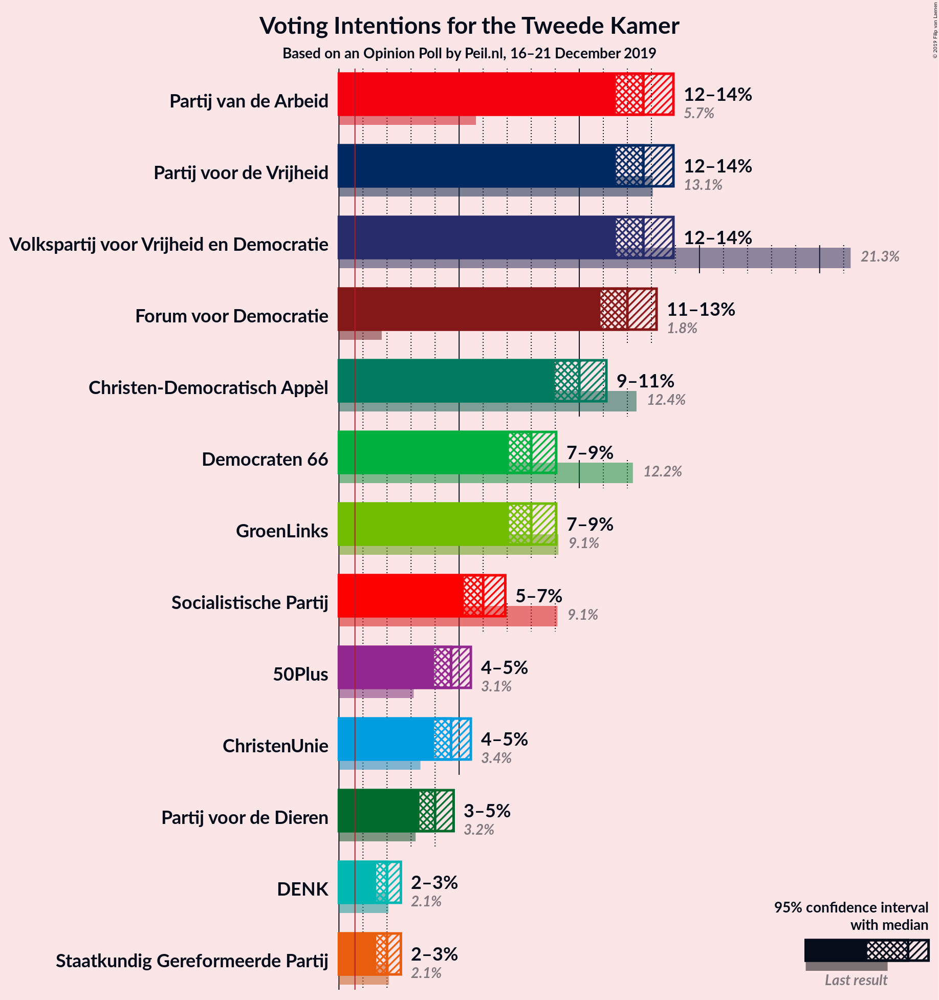

### Confidence Intervals

| Party | Last Result | Poll Result | 80% Confidence Interval | 90% Confidence Interval | 95% Confidence Interval | 99% Confidence Interval |
|:-----:|:-----------:|:-----------:|:-----------------------:|:-----------------------:|:-----------------------:|:-----------------------:|
| Volkspartij voor Vrijheid en Democratie | 21.3% | 12.7% | 11.9–13.5% |11.7–13.7% |11.5–13.9% |11.2–14.3% |
| Partij voor de Vrijheid | 13.1% | 12.7% | 11.9–13.5% |11.7–13.7% |11.5–13.9% |11.2–14.3% |
| Partij van de Arbeid | 5.7% | 12.7% | 11.9–13.5% |11.7–13.7% |11.5–13.9% |11.2–14.3% |
| Forum voor Democratie | 1.8% | 12.0% | 11.3–12.8% |11.1–13.0% |10.9–13.2% |10.5–13.6% |
| Christen-Democratisch Appèl | 12.4% | 10.0% | 9.3–10.7% |9.1–10.9% |9.0–11.1% |8.7–11.5% |
| Democraten 66 | 12.2% | 8.0% | 7.4–8.7% |7.2–8.9% |7.1–9.0% |6.8–9.4% |
| GroenLinks | 9.1% | 8.0% | 7.4–8.7% |7.2–8.9% |7.1–9.0% |6.8–9.4% |
| Socialistische Partij | 9.1% | 6.0% | 5.5–6.6% |5.3–6.8% |5.2–6.9% |5.0–7.2% |
| ChristenUnie | 3.4% | 4.7% | 4.2–5.2% |4.1–5.3% |4.0–5.5% |3.7–5.8% |
| 50Plus | 3.1% | 4.7% | 4.2–5.2% |4.1–5.3% |4.0–5.5% |3.7–5.8% |
| Partij voor de Dieren | 3.2% | 4.0% | 3.6–4.5% |3.4–4.6% |3.4–4.8% |3.2–5.0% |
| Staatkundig Gereformeerde Partij | 2.1% | 2.0% | 1.7–2.4% |1.6–2.5% |1.6–2.6% |1.4–2.8% |
| DENK | 2.1% | 2.0% | 1.7–2.4% |1.6–2.5% |1.6–2.6% |1.4–2.8% |

*Note:* The poll result column reflects the actual value used in the calculations. Published results may vary slightly, and in addition be rounded to fewer digits.

## Seats

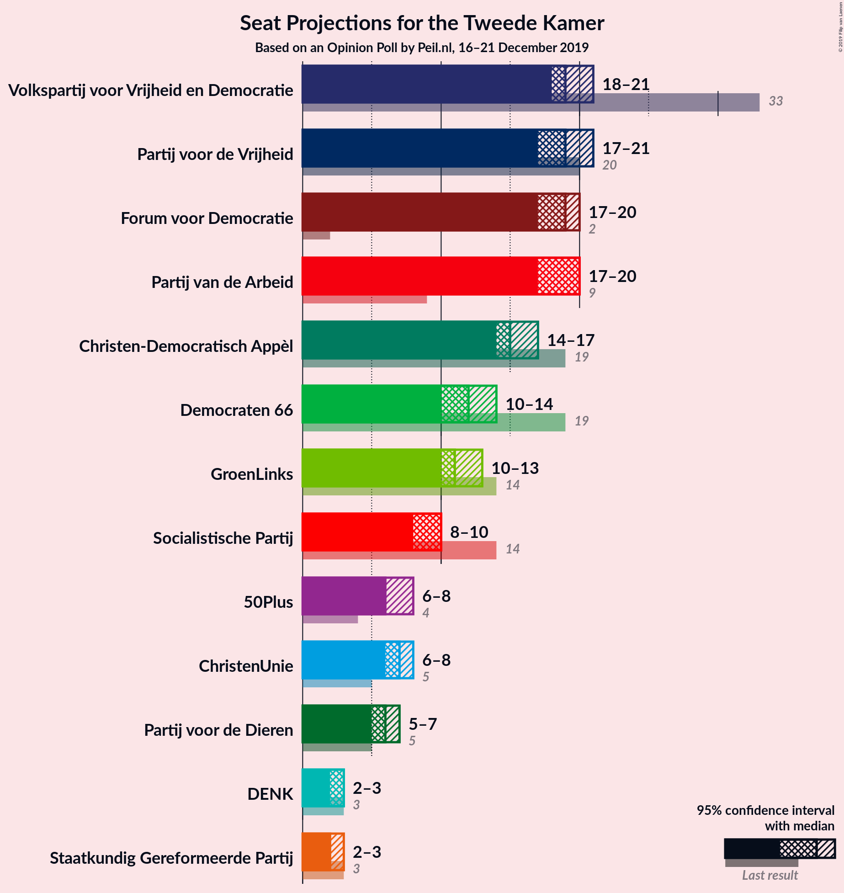

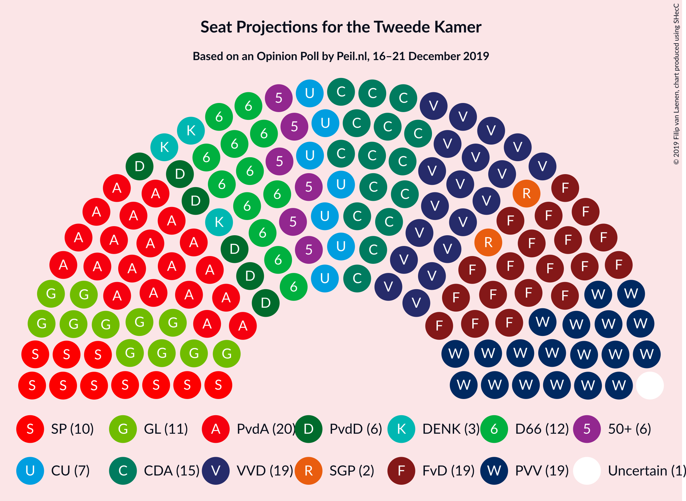

### Confidence Intervals

| Party | Last Result | Median | 80% Confidence Interval | 90% Confidence Interval | 95% Confidence Interval | 99% Confidence Interval |
|:-----:|:-----------:|:------:|:-----------------------:|:-----------------------:|:-----------------------:|:-----------------------:|
| <a href="#volkspartij-voor-vrijheid-en-democratie">Volkspartij voor Vrijheid en Democratie</a> | 33 | 19 | 19–20 |18–21 |18–21 |17–22 |
| <a href="#partij-voor-de-vrijheid">Partij voor de Vrijheid</a> | 20 | 19 | 19–20 |18–21 |17–21 |16–21 |
| <a href="#partij-van-de-arbeid">Partij van de Arbeid</a> | 9 | 20 | 19–20 |18–20 |17–20 |17–22 |
| <a href="#forum-voor-democratie">Forum voor Democratie</a> | 2 | 19 | 18–19 |17–19 |17–20 |16–21 |
| <a href="#christen-democratisch-appèl">Christen-Democratisch Appèl</a> | 19 | 15 | 14–15 |14–16 |14–17 |13–17 |
| <a href="#democraten-66">Democraten 66</a> | 19 | 12 | 12–14 |11–14 |10–14 |10–14 |
| <a href="#groenlinks">GroenLinks</a> | 14 | 11 | 11–12 |11–12 |10–13 |10–13 |
| <a href="#socialistische-partij">Socialistische Partij</a> | 14 | 10 | 8–10 |8–10 |8–10 |7–11 |
| <a href="#christenunie">ChristenUnie</a> | 5 | 7 | 6–7 |6–8 |6–8 |6–8 |
| <a href="#50plus">50Plus</a> | 4 | 6 | 6–7 |6–7 |6–8 |6–8 |
| <a href="#partij-voor-de-dieren">Partij voor de Dieren</a> | 5 | 6 | 6 |5–7 |5–7 |5–8 |
| <a href="#staatkundig-gereformeerde-partij">Staatkundig Gereformeerde Partij</a> | 3 | 2 | 2–3 |2–3 |2–3 |2–4 |
| <a href="#denk">DENK</a> | 3 | 3 | 2–3 |2–3 |2–3 |2–4 |

### Volkspartij voor Vrijheid en Democratie

*For a full overview of the results for this party, see the [Volkspartij voor Vrijheid en Democratie](party-volkspartijvoorvrijheidendemocratie.html) page.*

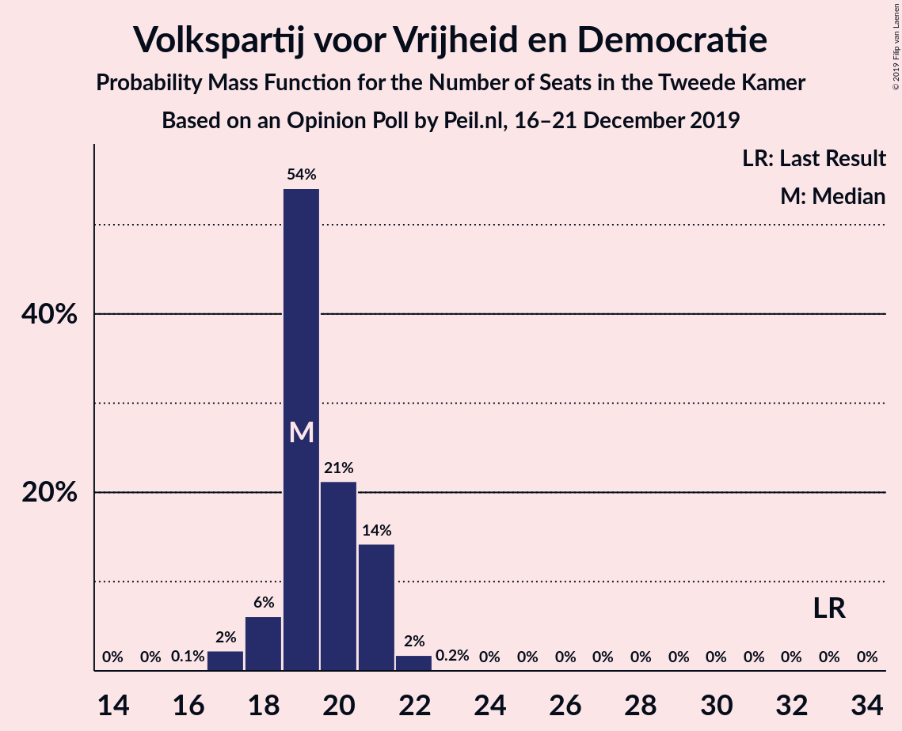

| Number of Seats | Probability | Accumulated | Special Marks |
|:---------------:|:-----------:|:-----------:|:-------------:|
| 17 | 1.0% | 100% |  |
| 18 | 4% | 98.9% |  |
| 19 | 81% | 95% | Median |
| 20 | 7% | 13% |  |
| 21 | 4% | 6% |  |
| 22 | 2% | 2% |  |
| 23 | 0% | 0% |  |
| 24 | 0% | 0% |  |
| 25 | 0% | 0% |  |
| 26 | 0% | 0% |  |
| 27 | 0% | 0% |  |
| 28 | 0% | 0% |  |
| 29 | 0% | 0% |  |
| 30 | 0% | 0% |  |
| 31 | 0% | 0% |  |
| 32 | 0% | 0% |  |
| 33 | 0% | 0% | Last Result |

### Partij voor de Vrijheid

*For a full overview of the results for this party, see the [Partij voor de Vrijheid](party-partijvoordevrijheid.html) page.*

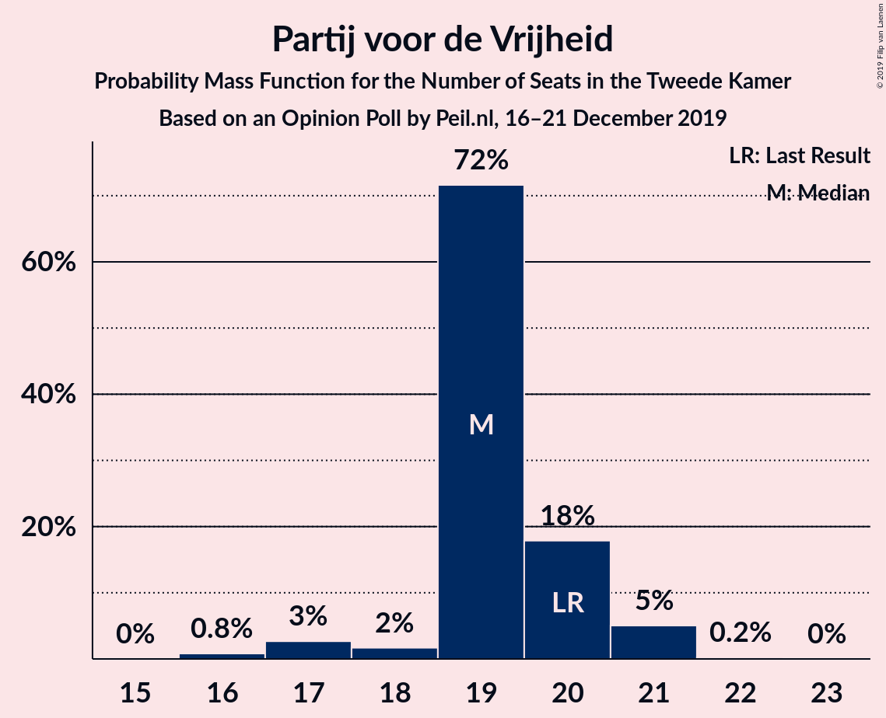

| Number of Seats | Probability | Accumulated | Special Marks |
|:---------------:|:-----------:|:-----------:|:-------------:|
| 16 | 0.8% | 100% |  |
| 17 | 3% | 99.2% |  |
| 18 | 2% | 97% |  |
| 19 | 72% | 95% | Median |
| 20 | 18% | 23% | Last Result |
| 21 | 5% | 5% |  |
| 22 | 0.2% | 0.3% |  |
| 23 | 0% | 0% |  |

### Partij van de Arbeid

*For a full overview of the results for this party, see the [Partij van de Arbeid](party-partijvandearbeid.html) page.*

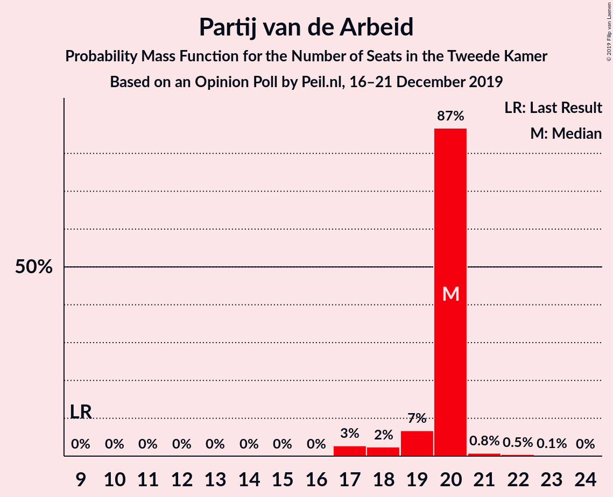

| Number of Seats | Probability | Accumulated | Special Marks |
|:---------------:|:-----------:|:-----------:|:-------------:|
| 9 | 0% | 100% | Last Result |
| 10 | 0% | 100% |  |
| 11 | 0% | 100% |  |
| 12 | 0% | 100% |  |
| 13 | 0% | 100% |  |
| 14 | 0% | 100% |  |
| 15 | 0% | 100% |  |
| 16 | 0% | 100% |  |
| 17 | 3% | 100% |  |
| 18 | 2% | 97% |  |
| 19 | 7% | 95% |  |
| 20 | 87% | 88% | Median |
| 21 | 0.8% | 1.3% |  |
| 22 | 0.5% | 0.5% |  |
| 23 | 0.1% | 0.1% |  |
| 24 | 0% | 0% |  |

### Forum voor Democratie

*For a full overview of the results for this party, see the [Forum voor Democratie](party-forumvoordemocratie.html) page.*

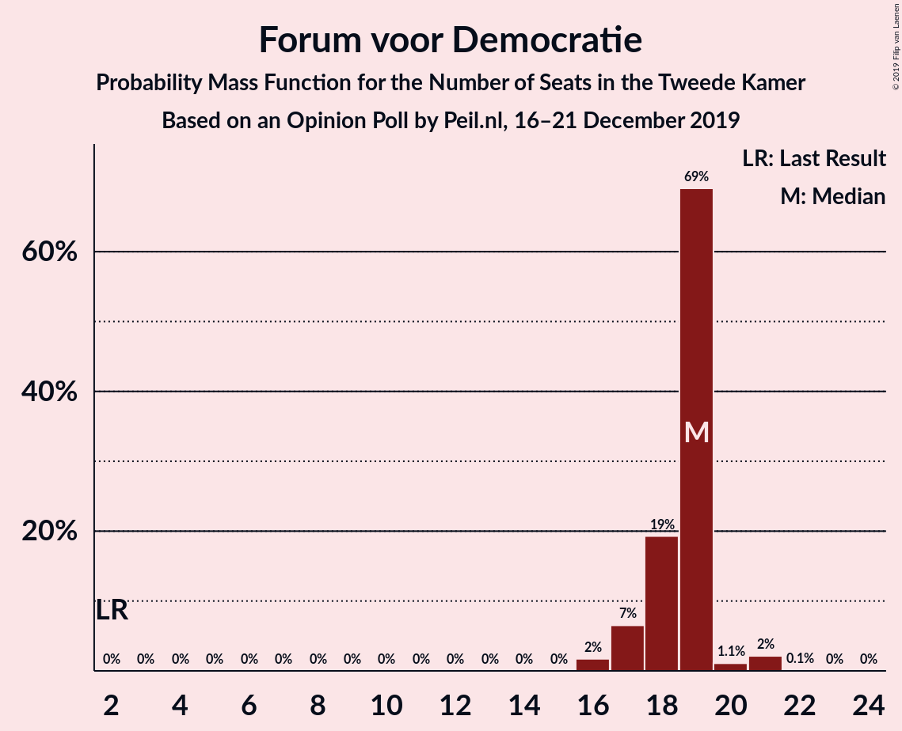

| Number of Seats | Probability | Accumulated | Special Marks |
|:---------------:|:-----------:|:-----------:|:-------------:|
| 2 | 0% | 100% | Last Result |
| 3 | 0% | 100% |  |
| 4 | 0% | 100% |  |
| 5 | 0% | 100% |  |
| 6 | 0% | 100% |  |
| 7 | 0% | 100% |  |
| 8 | 0% | 100% |  |
| 9 | 0% | 100% |  |
| 10 | 0% | 100% |  |
| 11 | 0% | 100% |  |
| 12 | 0% | 100% |  |
| 13 | 0% | 100% |  |
| 14 | 0% | 100% |  |
| 15 | 0% | 100% |  |
| 16 | 2% | 100% |  |
| 17 | 7% | 98% |  |
| 18 | 19% | 92% |  |
| 19 | 69% | 72% | Median |
| 20 | 1.1% | 3% |  |
| 21 | 2% | 2% |  |
| 22 | 0.1% | 0.1% |  |
| 23 | 0% | 0% |  |

### Christen-Democratisch Appèl

*For a full overview of the results for this party, see the [Christen-Democratisch Appèl](party-christen-democratischappèl.html) page.*

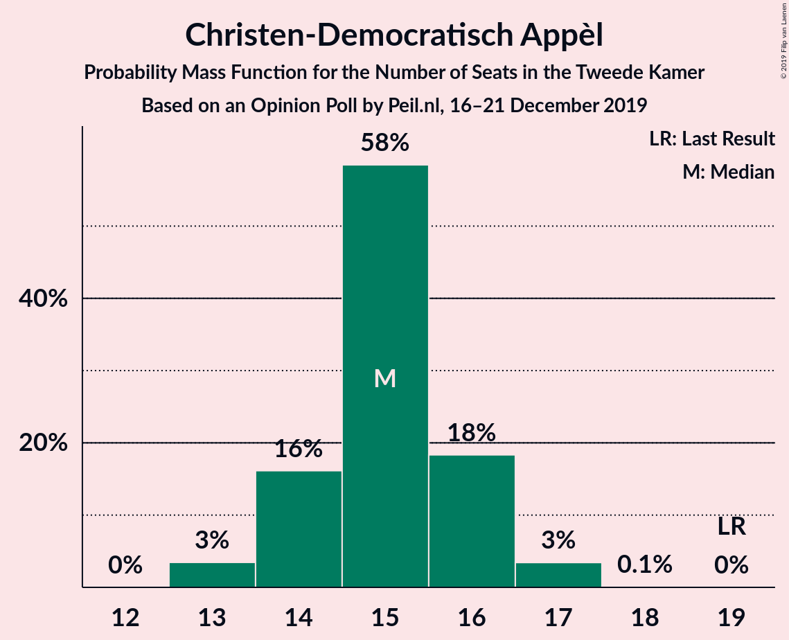

| Number of Seats | Probability | Accumulated | Special Marks |
|:---------------:|:-----------:|:-----------:|:-------------:|
| 13 | 2% | 100% |  |
| 14 | 16% | 98% |  |
| 15 | 73% | 82% | Median |
| 16 | 6% | 10% |  |
| 17 | 4% | 4% |  |
| 18 | 0.1% | 0.1% |  |
| 19 | 0% | 0% | Last Result |

### Democraten 66

*For a full overview of the results for this party, see the [Democraten 66](party-democraten66.html) page.*

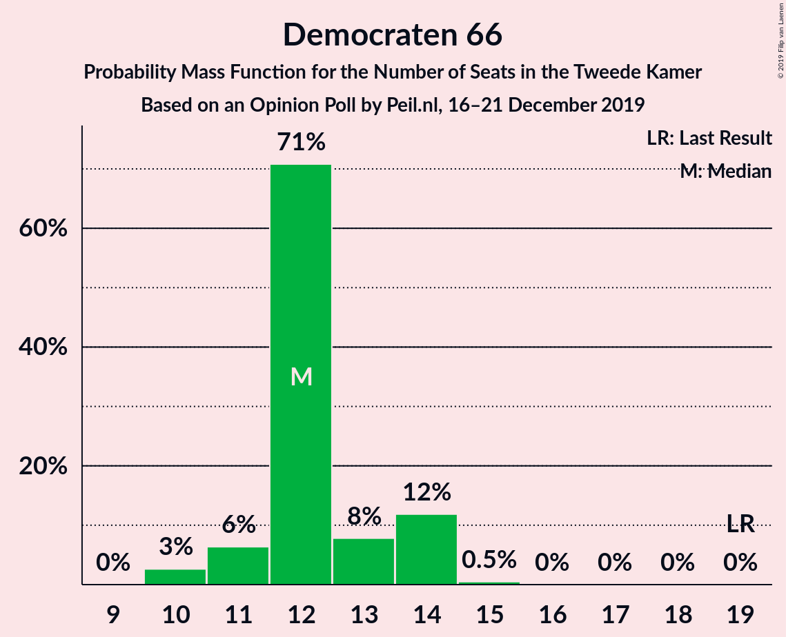

| Number of Seats | Probability | Accumulated | Special Marks |
|:---------------:|:-----------:|:-----------:|:-------------:|
| 10 | 3% | 100% |  |
| 11 | 6% | 97% |  |
| 12 | 71% | 91% | Median |
| 13 | 8% | 20% |  |
| 14 | 12% | 12% |  |
| 15 | 0.5% | 0.5% |  |
| 16 | 0% | 0% |  |
| 17 | 0% | 0% |  |
| 18 | 0% | 0% |  |
| 19 | 0% | 0% | Last Result |

### GroenLinks

*For a full overview of the results for this party, see the [GroenLinks](party-groenlinks.html) page.*

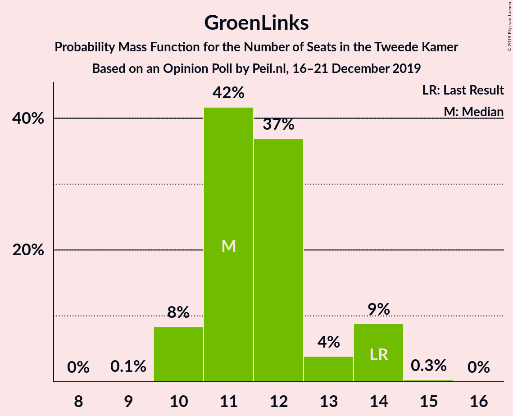

| Number of Seats | Probability | Accumulated | Special Marks |
|:---------------:|:-----------:|:-----------:|:-------------:|
| 9 | 0.2% | 100% |  |
| 10 | 4% | 99.8% |  |
| 11 | 70% | 96% | Median |
| 12 | 22% | 26% |  |
| 13 | 4% | 4% |  |
| 14 | 0.2% | 0.4% | Last Result |
| 15 | 0.2% | 0.2% |  |
| 16 | 0% | 0% |  |

### Socialistische Partij

*For a full overview of the results for this party, see the [Socialistische Partij](party-socialistischepartij.html) page.*

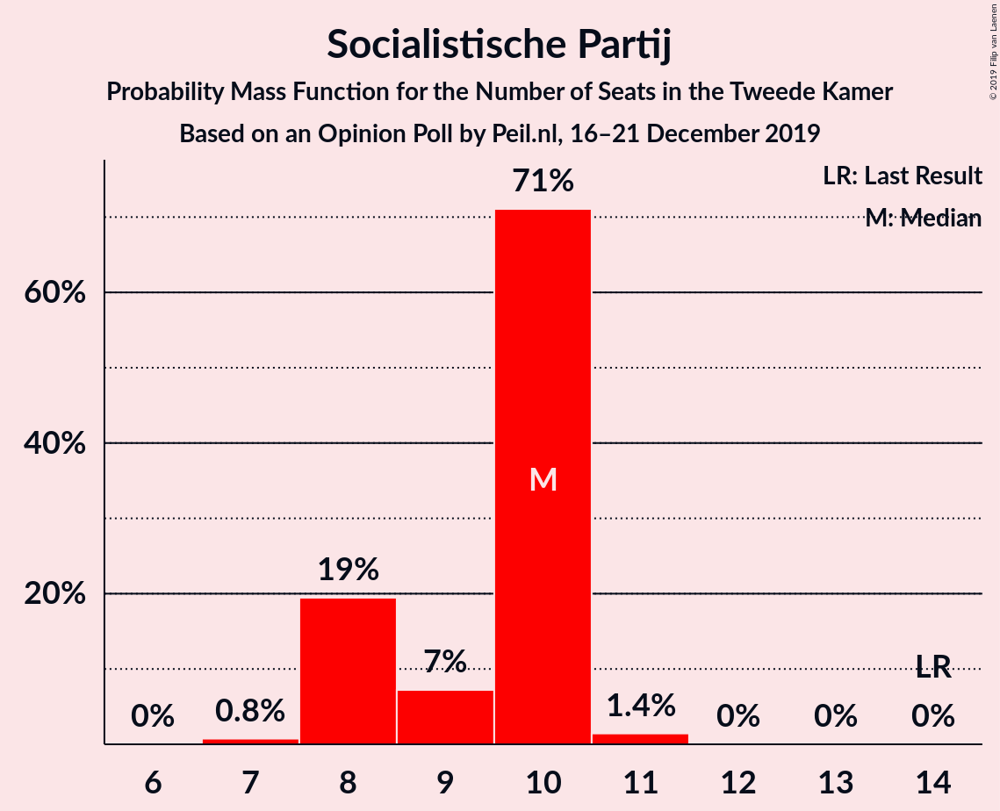

| Number of Seats | Probability | Accumulated | Special Marks |
|:---------------:|:-----------:|:-----------:|:-------------:|
| 7 | 0.8% | 100% |  |
| 8 | 19% | 99.2% |  |
| 9 | 7% | 80% |  |
| 10 | 71% | 73% | Median |
| 11 | 1.4% | 1.5% |  |
| 12 | 0% | 0% |  |
| 13 | 0% | 0% |  |
| 14 | 0% | 0% | Last Result |

### ChristenUnie

*For a full overview of the results for this party, see the [ChristenUnie](party-christenunie.html) page.*

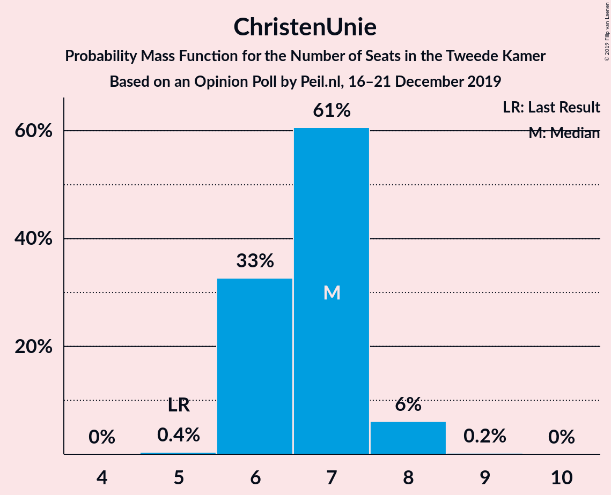

| Number of Seats | Probability | Accumulated | Special Marks |
|:---------------:|:-----------:|:-----------:|:-------------:|
| 5 | 0.4% | 100% | Last Result |
| 6 | 20% | 99.6% |  |
| 7 | 73% | 80% | Median |
| 8 | 7% | 7% |  |
| 9 | 0.2% | 0.2% |  |
| 10 | 0% | 0% |  |

### 50Plus

*For a full overview of the results for this party, see the [50Plus](party-50plus.html) page.*

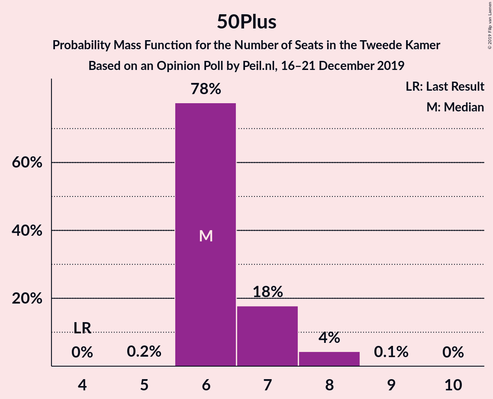

| Number of Seats | Probability | Accumulated | Special Marks |
|:---------------:|:-----------:|:-----------:|:-------------:|
| 4 | 0% | 100% | Last Result |
| 5 | 0.2% | 100% |  |
| 6 | 78% | 99.8% | Median |
| 7 | 18% | 22% |  |
| 8 | 4% | 4% |  |
| 9 | 0.1% | 0.1% |  |
| 10 | 0% | 0% |  |

### Partij voor de Dieren

*For a full overview of the results for this party, see the [Partij voor de Dieren](party-partijvoordedieren.html) page.*

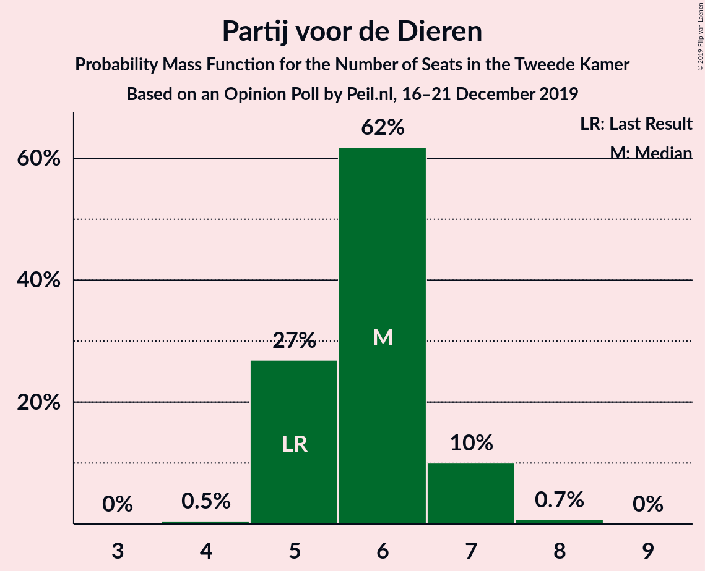

| Number of Seats | Probability | Accumulated | Special Marks |
|:---------------:|:-----------:|:-----------:|:-------------:|
| 4 | 0.4% | 100% |  |
| 5 | 9% | 99.6% | Last Result |
| 6 | 84% | 91% | Median |
| 7 | 6% | 7% |  |
| 8 | 1.0% | 1.0% |  |
| 9 | 0% | 0% |  |

### Staatkundig Gereformeerde Partij

*For a full overview of the results for this party, see the [Staatkundig Gereformeerde Partij](party-staatkundiggereformeerdepartij.html) page.*

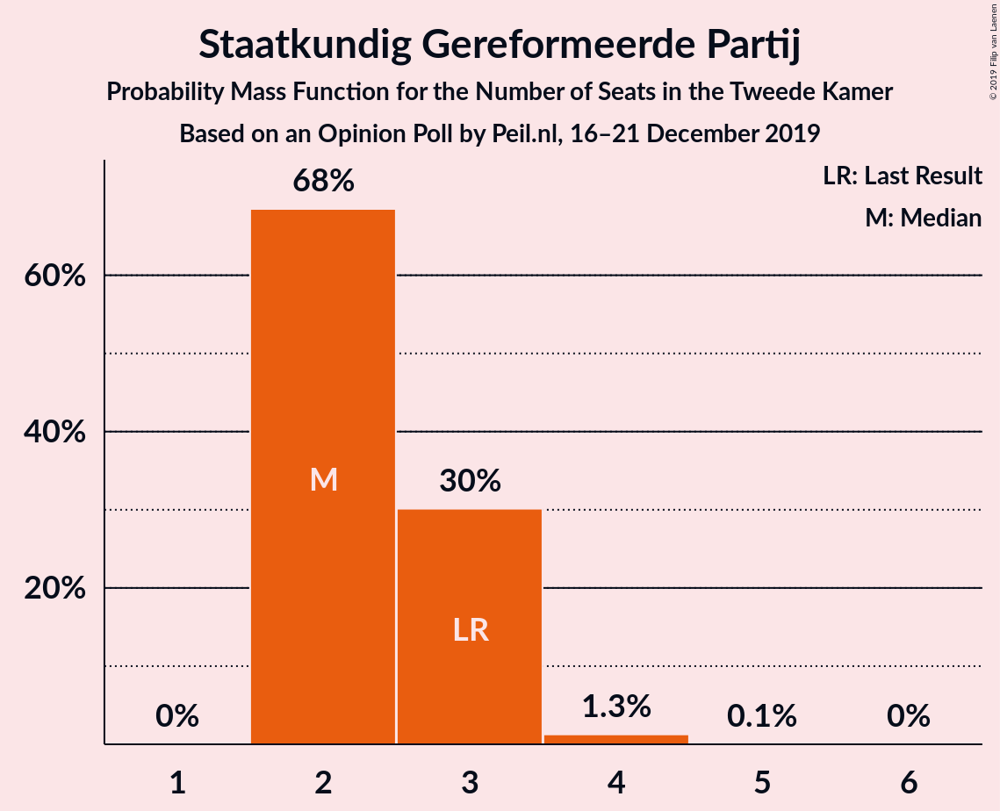

| Number of Seats | Probability | Accumulated | Special Marks |
|:---------------:|:-----------:|:-----------:|:-------------:|
| 2 | 68% | 100% | Median |
| 3 | 30% | 31% | Last Result |
| 4 | 1.3% | 1.3% |  |
| 5 | 0.1% | 0.1% |  |
| 6 | 0% | 0% |  |

### DENK

*For a full overview of the results for this party, see the [DENK](party-denk.html) page.*

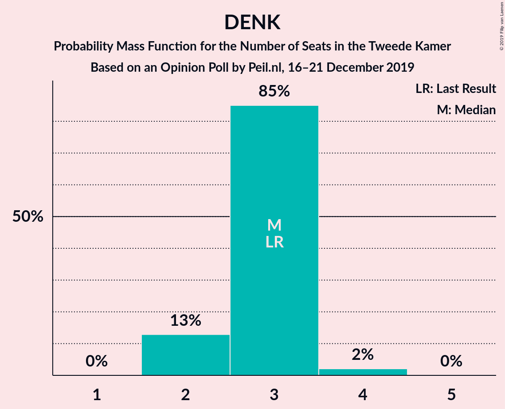

| Number of Seats | Probability | Accumulated | Special Marks |
|:---------------:|:-----------:|:-----------:|:-------------:|
| 2 | 13% | 100% |  |
| 3 | 85% | 87% | Last Result, Median |
| 4 | 2% | 2% |  |
| 5 | 0% | 0% |  |

## Coalitions

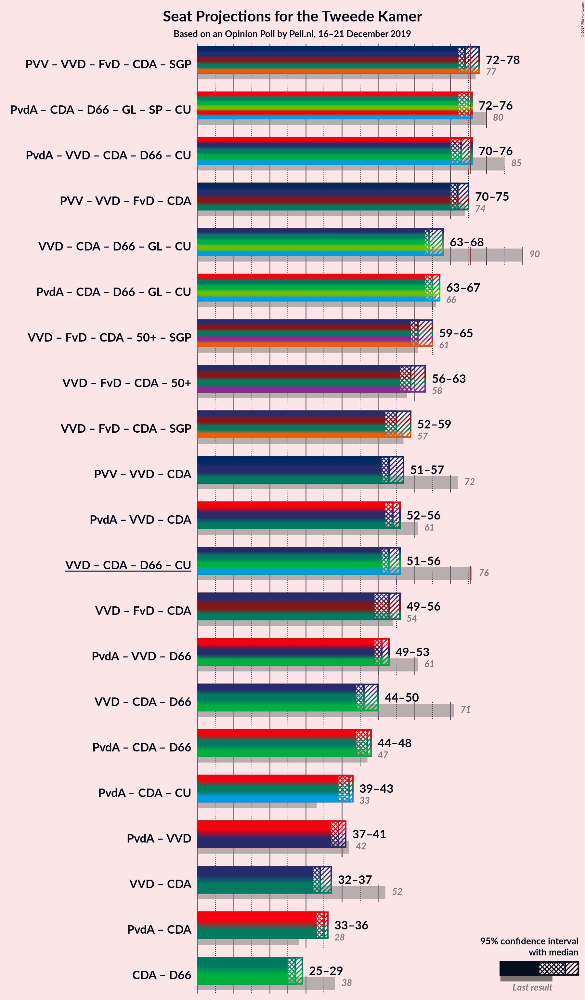

### Confidence Intervals

| Coalition | Last Result | Median | Majority? | 80% Confidence Interval | 90% Confidence Interval | 95% Confidence Interval | 99% Confidence Interval |
|:---------:|:-----------:|:------:|:---------:|:-----------------------:|:-----------------------:|:-----------------------:|:-----------------------:|
| Partij voor de Vrijheid – Volkspartij voor Vrijheid en Democratie – Forum voor Democratie – Christen-Democratisch Appèl – Staatkundig Gereformeerde Partij | 77 | 74 | 14% | 74–76 | 72–78 | 72–78 | 71–78 |
| Partij van de Arbeid – Christen-Democratisch Appèl – Democraten 66 – GroenLinks – Socialistische Partij – ChristenUnie | 80 | 75 | 5% | 74–75 | 73–75 | 72–76 | 70–77 |
| Partij van de Arbeid – Volkspartij voor Vrijheid en Democratie – Christen-Democratisch Appèl – Democraten 66 – ChristenUnie | 85 | 73 | 3% | 72–74 | 71–75 | 70–76 | 69–77 |
| Partij voor de Vrijheid – Volkspartij voor Vrijheid en Democratie – Forum voor Democratie – Christen-Democratisch Appèl | 74 | 72 | 2% | 71–73 | 70–75 | 70–75 | 68–76 |
| Volkspartij voor Vrijheid en Democratie – Christen-Democratisch Appèl – Democraten 66 – GroenLinks – ChristenUnie | 90 | 64 | 0% | 64–66 | 63–67 | 63–68 | 60–70 |
| Partij van de Arbeid – Christen-Democratisch Appèl – Democraten 66 – GroenLinks – ChristenUnie | 66 | 65 | 0% | 64–66 | 64–67 | 63–67 | 61–69 |
| Volkspartij voor Vrijheid en Democratie – Forum voor Democratie – Christen-Democratisch Appèl – 50Plus – Staatkundig Gereformeerde Partij | 61 | 61 | 0% | 60–63 | 60–65 | 59–65 | 59–66 |
| Volkspartij voor Vrijheid en Democratie – Forum voor Democratie – Christen-Democratisch Appèl – 50Plus | 58 | 59 | 0% | 57–60 | 57–62 | 56–63 | 56–63 |
| Volkspartij voor Vrijheid en Democratie – Forum voor Democratie – Christen-Democratisch Appèl – Staatkundig Gereformeerde Partij | 57 | 55 | 0% | 54–56 | 54–58 | 52–59 | 52–59 |
| Partij voor de Vrijheid – Volkspartij voor Vrijheid en Democratie – Christen-Democratisch Appèl | 72 | 53 | 0% | 53–55 | 52–56 | 51–57 | 50–57 |
| Partij van de Arbeid – Volkspartij voor Vrijheid en Democratie – Christen-Democratisch Appèl | 61 | 54 | 0% | 53–55 | 52–56 | 52–56 | 50–58 |
| Volkspartij voor Vrijheid en Democratie – Christen-Democratisch Appèl – Democraten 66 – ChristenUnie | 76 | 53 | 0% | 53–55 | 52–55 | 51–56 | 49–57 |
| Volkspartij voor Vrijheid en Democratie – Forum voor Democratie – Christen-Democratisch Appèl | 54 | 53 | 0% | 51–53 | 51–55 | 49–56 | 49–57 |
| Partij van de Arbeid – Volkspartij voor Vrijheid en Democratie – Democraten 66 | 61 | 51 | 0% | 50–53 | 50–53 | 49–53 | 48–54 |
| Volkspartij voor Vrijheid en Democratie – Christen-Democratisch Appèl – Democraten 66 | 71 | 46 | 0% | 46–48 | 44–48 | 44–50 | 42–51 |
| Partij van de Arbeid – Christen-Democratisch Appèl – Democraten 66 | 47 | 47 | 0% | 46–48 | 45–48 | 44–48 | 44–49 |
| Partij van de Arbeid – Christen-Democratisch Appèl – ChristenUnie | 33 | 42 | 0% | 40–42 | 40–43 | 39–43 | 38–44 |
| Partij van de Arbeid – Volkspartij voor Vrijheid en Democratie | 42 | 39 | 0% | 38–40 | 38–40 | 37–41 | 35–42 |
| Volkspartij voor Vrijheid en Democratie – Christen-Democratisch Appèl | 52 | 34 | 0% | 33–35 | 33–36 | 32–37 | 30–38 |
| Partij van de Arbeid – Christen-Democratisch Appèl | 28 | 35 | 0% | 34–35 | 33–36 | 33–36 | 32–37 |
| Christen-Democratisch Appèl – Democraten 66 | 38 | 27 | 0% | 26–28 | 26–29 | 25–29 | 24–30 |

### Partij voor de Vrijheid – Volkspartij voor Vrijheid en Democratie – Forum voor Democratie – Christen-Democratisch Appèl – Staatkundig Gereformeerde Partij

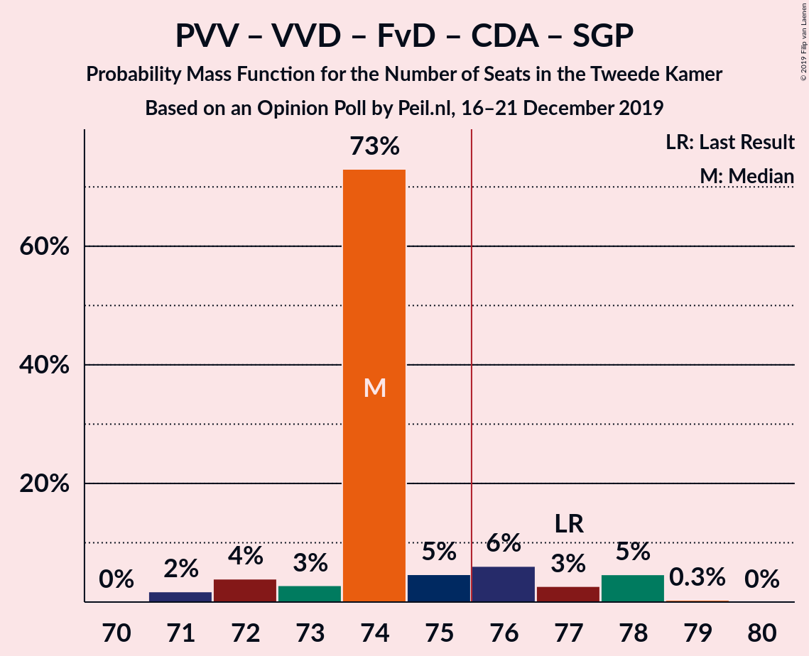

| Number of Seats | Probability | Accumulated | Special Marks |
|:---------------:|:-----------:|:-----------:|:-------------:|
| 71 | 2% | 100% |  |
| 72 | 4% | 98% |  |
| 73 | 3% | 94% |  |
| 74 | 73% | 91% | Median |
| 75 | 5% | 18% |  |
| 76 | 6% | 14% | Majority |
| 77 | 3% | 8% | Last Result |
| 78 | 5% | 5% |  |
| 79 | 0.3% | 0.4% |  |
| 80 | 0% | 0% |  |

### Partij van de Arbeid – Christen-Democratisch Appèl – Democraten 66 – GroenLinks – Socialistische Partij – ChristenUnie

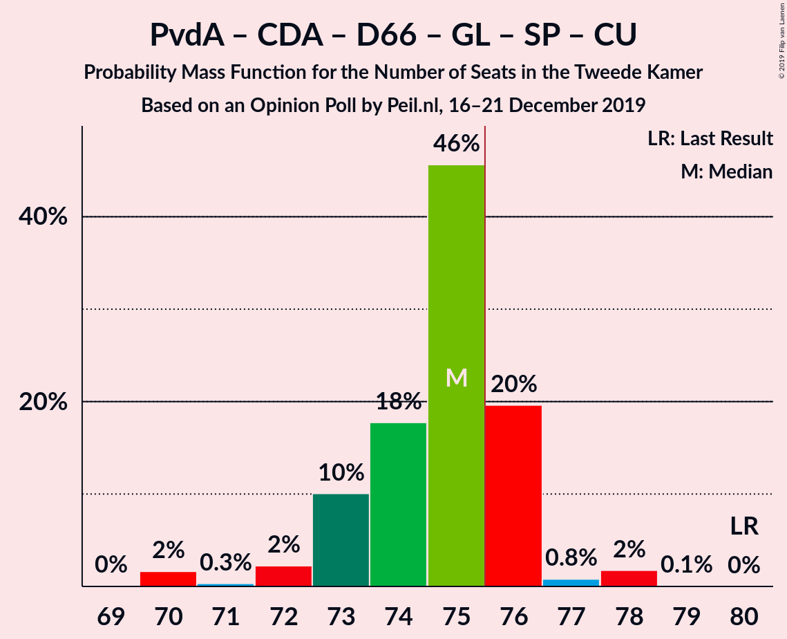

| Number of Seats | Probability | Accumulated | Special Marks |
|:---------------:|:-----------:|:-----------:|:-------------:|
| 70 | 0.8% | 100% |  |
| 71 | 0.3% | 99.2% |  |
| 72 | 2% | 98.9% |  |
| 73 | 6% | 97% |  |
| 74 | 18% | 90% |  |
| 75 | 68% | 73% | Median |
| 76 | 4% | 5% | Majority |
| 77 | 1.2% | 1.5% |  |
| 78 | 0.1% | 0.2% |  |
| 79 | 0.1% | 0.1% |  |
| 80 | 0% | 0% | Last Result |

### Partij van de Arbeid – Volkspartij voor Vrijheid en Democratie – Christen-Democratisch Appèl – Democraten 66 – ChristenUnie

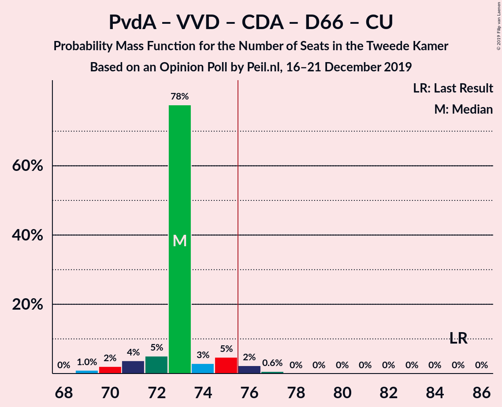

| Number of Seats | Probability | Accumulated | Special Marks |
|:---------------:|:-----------:|:-----------:|:-------------:|
| 68 | 0% | 100% |  |
| 69 | 1.0% | 99.9% |  |
| 70 | 2% | 99.0% |  |
| 71 | 4% | 97% |  |
| 72 | 5% | 93% |  |
| 73 | 78% | 88% | Median |
| 74 | 3% | 11% |  |
| 75 | 5% | 8% |  |
| 76 | 2% | 3% | Majority |
| 77 | 0.6% | 0.6% |  |
| 78 | 0% | 0% |  |
| 79 | 0% | 0% |  |
| 80 | 0% | 0% |  |
| 81 | 0% | 0% |  |
| 82 | 0% | 0% |  |
| 83 | 0% | 0% |  |
| 84 | 0% | 0% |  |
| 85 | 0% | 0% | Last Result |

### Partij voor de Vrijheid – Volkspartij voor Vrijheid en Democratie – Forum voor Democratie – Christen-Democratisch Appèl

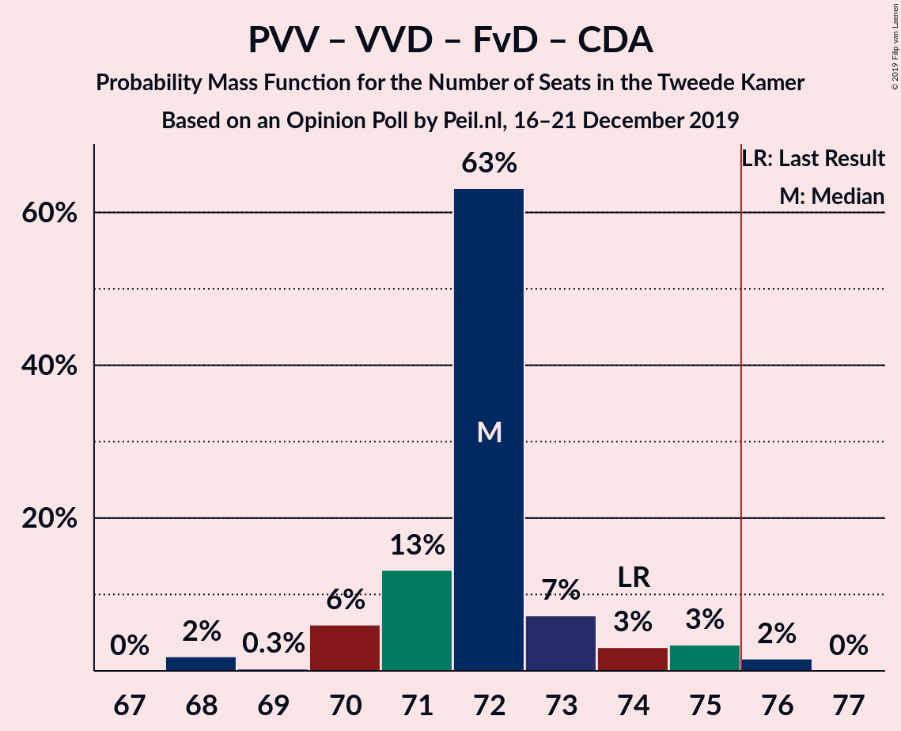

| Number of Seats | Probability | Accumulated | Special Marks |
|:---------------:|:-----------:|:-----------:|:-------------:|
| 68 | 2% | 100% |  |
| 69 | 0.3% | 98% |  |
| 70 | 6% | 98% |  |
| 71 | 13% | 92% |  |
| 72 | 63% | 79% | Median |
| 73 | 7% | 15% |  |
| 74 | 3% | 8% | Last Result |
| 75 | 3% | 5% |  |
| 76 | 2% | 2% | Majority |
| 77 | 0% | 0% |  |

### Volkspartij voor Vrijheid en Democratie – Christen-Democratisch Appèl – Democraten 66 – GroenLinks – ChristenUnie

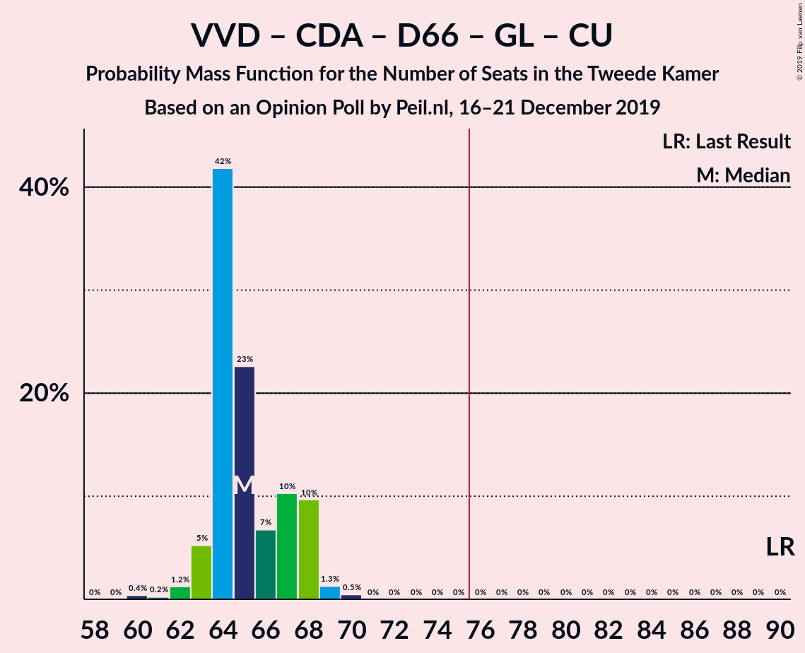

| Number of Seats | Probability | Accumulated | Special Marks |
|:---------------:|:-----------:|:-----------:|:-------------:|
| 60 | 0.6% | 100% |  |
| 61 | 0.2% | 99.4% |  |
| 62 | 1.4% | 99.1% |  |
| 63 | 4% | 98% |  |
| 64 | 64% | 94% | Median |
| 65 | 18% | 30% |  |
| 66 | 6% | 12% |  |
| 67 | 3% | 6% |  |
| 68 | 1.4% | 3% |  |
| 69 | 1.2% | 2% |  |
| 70 | 0.5% | 0.5% |  |
| 71 | 0% | 0% |  |
| 72 | 0% | 0% |  |
| 73 | 0% | 0% |  |
| 74 | 0% | 0% |  |
| 75 | 0% | 0% |  |
| 76 | 0% | 0% | Majority |
| 77 | 0% | 0% |  |
| 78 | 0% | 0% |  |
| 79 | 0% | 0% |  |
| 80 | 0% | 0% |  |
| 81 | 0% | 0% |  |
| 82 | 0% | 0% |  |
| 83 | 0% | 0% |  |
| 84 | 0% | 0% |  |
| 85 | 0% | 0% |  |
| 86 | 0% | 0% |  |
| 87 | 0% | 0% |  |
| 88 | 0% | 0% |  |
| 89 | 0% | 0% |  |
| 90 | 0% | 0% | Last Result |

### Partij van de Arbeid – Christen-Democratisch Appèl – Democraten 66 – GroenLinks – ChristenUnie

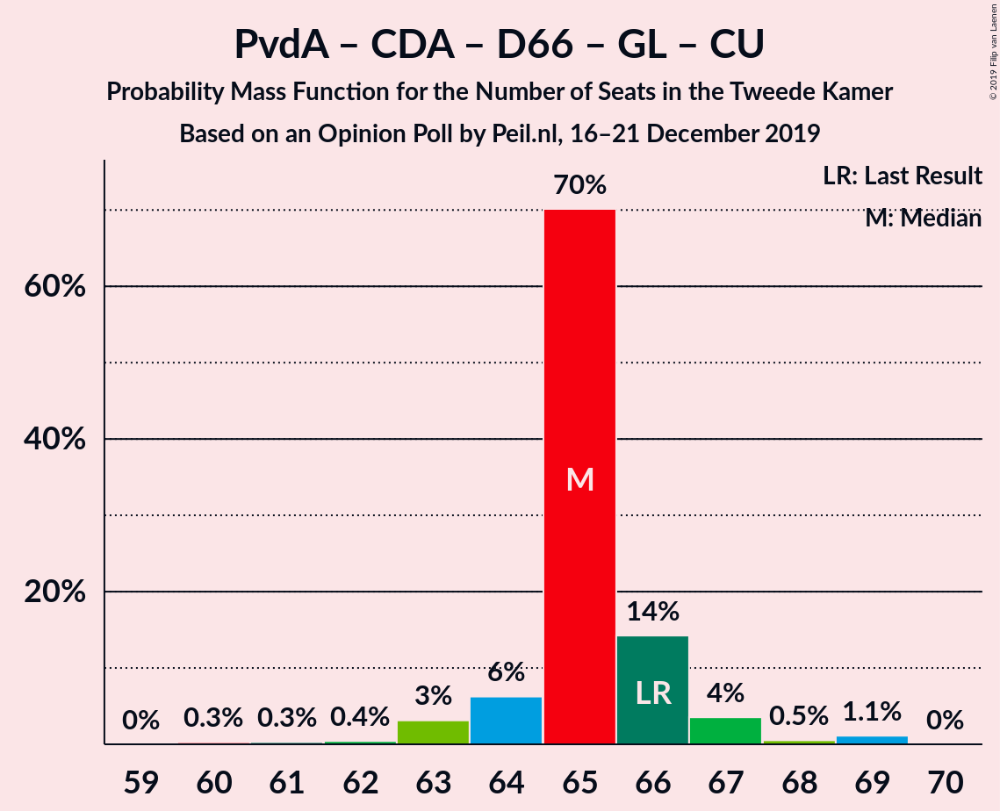

| Number of Seats | Probability | Accumulated | Special Marks |
|:---------------:|:-----------:|:-----------:|:-------------:|
| 60 | 0.3% | 100% |  |
| 61 | 0.3% | 99.7% |  |
| 62 | 0.4% | 99.4% |  |
| 63 | 3% | 99.0% |  |
| 64 | 6% | 96% |  |
| 65 | 70% | 90% | Median |
| 66 | 14% | 19% | Last Result |
| 67 | 4% | 5% |  |
| 68 | 0.5% | 2% |  |
| 69 | 1.1% | 1.1% |  |
| 70 | 0% | 0% |  |

### Volkspartij voor Vrijheid en Democratie – Forum voor Democratie – Christen-Democratisch Appèl – 50Plus – Staatkundig Gereformeerde Partij

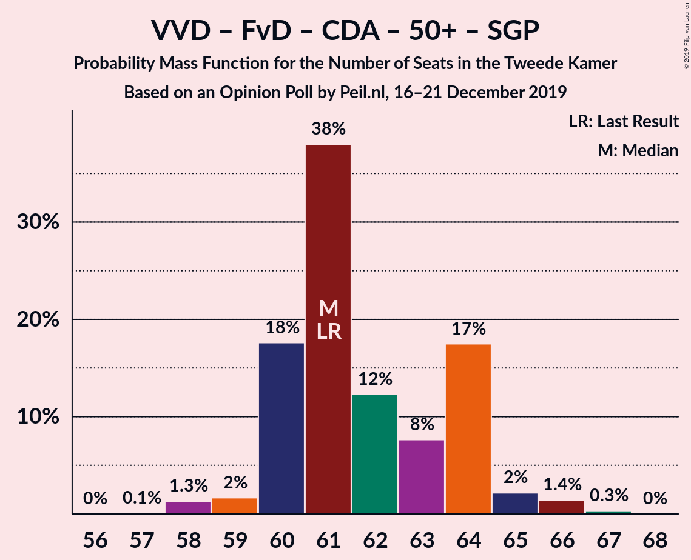

| Number of Seats | Probability | Accumulated | Special Marks |
|:---------------:|:-----------:|:-----------:|:-------------:|
| 58 | 0.1% | 100% |  |
| 59 | 3% | 99.9% |  |
| 60 | 11% | 97% |  |
| 61 | 64% | 87% | Last Result, Median |
| 62 | 9% | 22% |  |
| 63 | 4% | 13% |  |
| 64 | 4% | 9% |  |
| 65 | 3% | 5% |  |
| 66 | 2% | 2% |  |
| 67 | 0% | 0.1% |  |
| 68 | 0% | 0% |  |

### Volkspartij voor Vrijheid en Democratie – Forum voor Democratie – Christen-Democratisch Appèl – 50Plus

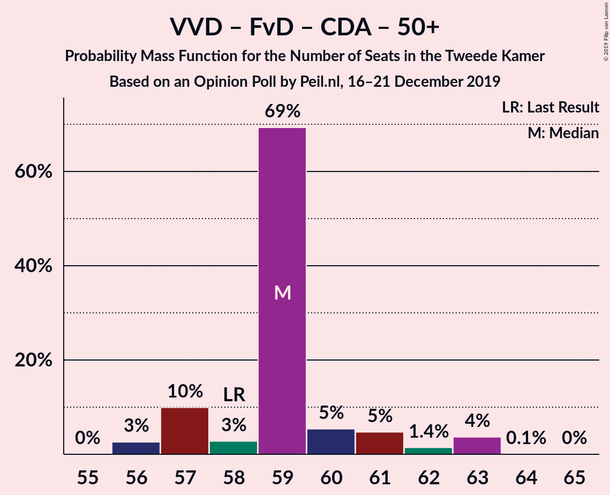

| Number of Seats | Probability | Accumulated | Special Marks |
|:---------------:|:-----------:|:-----------:|:-------------:|
| 55 | 0% | 100% |  |
| 56 | 3% | 99.9% |  |
| 57 | 10% | 97% |  |
| 58 | 3% | 87% | Last Result |
| 59 | 69% | 85% | Median |
| 60 | 5% | 15% |  |
| 61 | 5% | 10% |  |
| 62 | 1.4% | 5% |  |
| 63 | 4% | 4% |  |
| 64 | 0.1% | 0.1% |  |
| 65 | 0% | 0% |  |

### Volkspartij voor Vrijheid en Democratie – Forum voor Democratie – Christen-Democratisch Appèl – Staatkundig Gereformeerde Partij

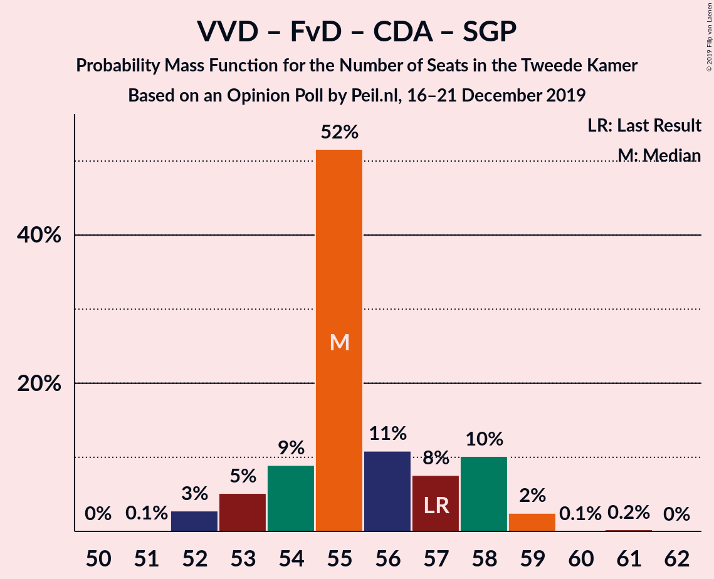

| Number of Seats | Probability | Accumulated | Special Marks |
|:---------------:|:-----------:|:-----------:|:-------------:|
| 51 | 0% | 100% |  |
| 52 | 2% | 99.9% |  |
| 53 | 2% | 97% |  |
| 54 | 14% | 95% |  |
| 55 | 64% | 81% | Median |
| 56 | 9% | 17% |  |
| 57 | 3% | 9% | Last Result |
| 58 | 2% | 6% |  |
| 59 | 4% | 4% |  |
| 60 | 0.1% | 0.1% |  |
| 61 | 0% | 0% |  |

### Partij voor de Vrijheid – Volkspartij voor Vrijheid en Democratie – Christen-Democratisch Appèl

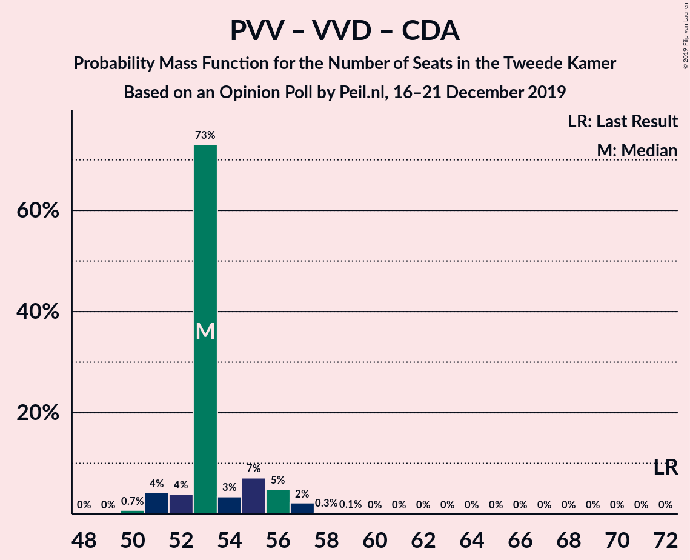

| Number of Seats | Probability | Accumulated | Special Marks |
|:---------------:|:-----------:|:-----------:|:-------------:|
| 50 | 0.7% | 100% |  |
| 51 | 4% | 99.2% |  |
| 52 | 4% | 95% |  |
| 53 | 73% | 91% | Median |
| 54 | 3% | 18% |  |
| 55 | 7% | 15% |  |
| 56 | 5% | 7% |  |
| 57 | 2% | 3% |  |
| 58 | 0.3% | 0.4% |  |
| 59 | 0.1% | 0.1% |  |
| 60 | 0% | 0% |  |
| 61 | 0% | 0% |  |
| 62 | 0% | 0% |  |
| 63 | 0% | 0% |  |
| 64 | 0% | 0% |  |
| 65 | 0% | 0% |  |
| 66 | 0% | 0% |  |
| 67 | 0% | 0% |  |
| 68 | 0% | 0% |  |
| 69 | 0% | 0% |  |
| 70 | 0% | 0% |  |
| 71 | 0% | 0% |  |
| 72 | 0% | 0% | Last Result |

### Partij van de Arbeid – Volkspartij voor Vrijheid en Democratie – Christen-Democratisch Appèl

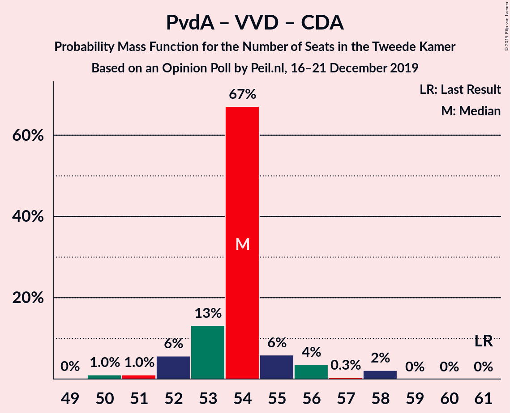

| Number of Seats | Probability | Accumulated | Special Marks |
|:---------------:|:-----------:|:-----------:|:-------------:|
| 50 | 1.0% | 100% |  |
| 51 | 1.0% | 99.0% |  |
| 52 | 6% | 98% |  |
| 53 | 13% | 92% |  |
| 54 | 67% | 79% | Median |
| 55 | 6% | 12% |  |
| 56 | 4% | 6% |  |
| 57 | 0.3% | 2% |  |
| 58 | 2% | 2% |  |
| 59 | 0% | 0% |  |
| 60 | 0% | 0% |  |
| 61 | 0% | 0% | Last Result |

### Volkspartij voor Vrijheid en Democratie – Christen-Democratisch Appèl – Democraten 66 – ChristenUnie

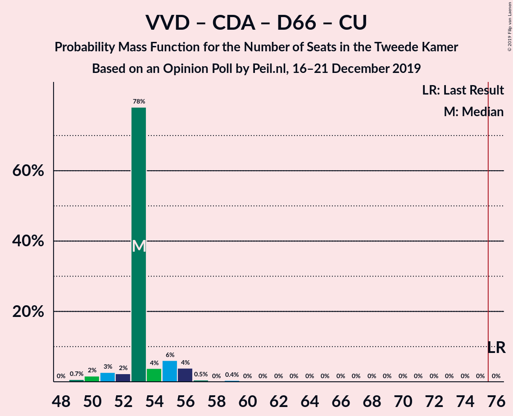

| Number of Seats | Probability | Accumulated | Special Marks |
|:---------------:|:-----------:|:-----------:|:-------------:|
| 49 | 0.7% | 100% |  |
| 50 | 2% | 99.3% |  |
| 51 | 3% | 98% |  |
| 52 | 2% | 95% |  |
| 53 | 78% | 93% | Median |
| 54 | 4% | 15% |  |
| 55 | 6% | 11% |  |
| 56 | 4% | 5% |  |
| 57 | 0.5% | 0.9% |  |
| 58 | 0% | 0.4% |  |
| 59 | 0.4% | 0.4% |  |
| 60 | 0% | 0% |  |
| 61 | 0% | 0% |  |
| 62 | 0% | 0% |  |
| 63 | 0% | 0% |  |
| 64 | 0% | 0% |  |
| 65 | 0% | 0% |  |
| 66 | 0% | 0% |  |
| 67 | 0% | 0% |  |
| 68 | 0% | 0% |  |
| 69 | 0% | 0% |  |
| 70 | 0% | 0% |  |
| 71 | 0% | 0% |  |
| 72 | 0% | 0% |  |
| 73 | 0% | 0% |  |
| 74 | 0% | 0% |  |
| 75 | 0% | 0% |  |
| 76 | 0% | 0% | Last Result, Majority |

### Volkspartij voor Vrijheid en Democratie – Forum voor Democratie – Christen-Democratisch Appèl

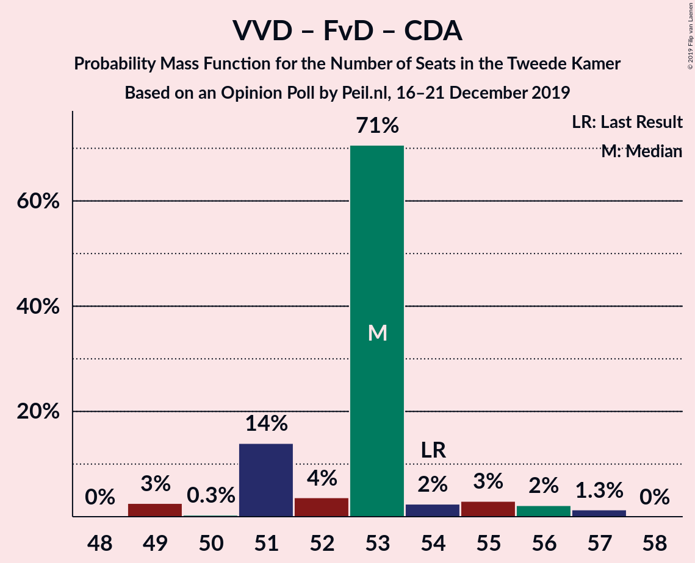

| Number of Seats | Probability | Accumulated | Special Marks |
|:---------------:|:-----------:|:-----------:|:-------------:|
| 49 | 3% | 100% |  |
| 50 | 0.3% | 97% |  |
| 51 | 14% | 97% |  |
| 52 | 4% | 83% |  |
| 53 | 71% | 79% | Median |
| 54 | 2% | 9% | Last Result |
| 55 | 3% | 6% |  |
| 56 | 2% | 3% |  |
| 57 | 1.3% | 1.3% |  |
| 58 | 0% | 0% |  |

### Partij van de Arbeid – Volkspartij voor Vrijheid en Democratie – Democraten 66

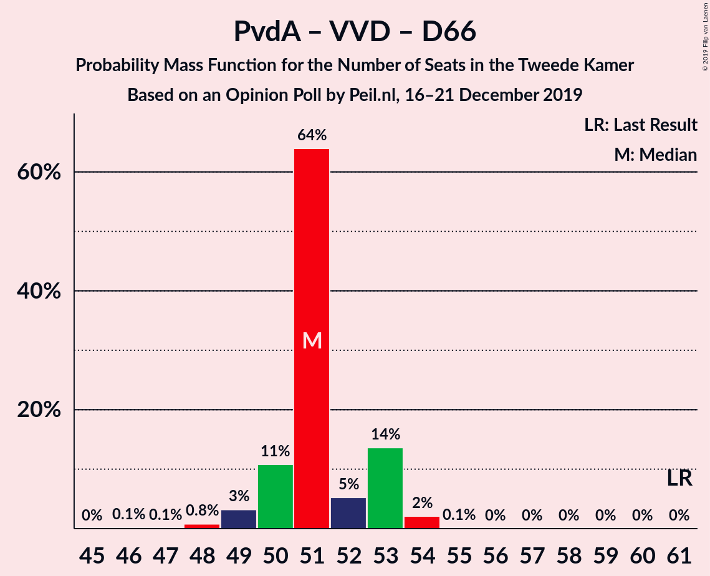

| Number of Seats | Probability | Accumulated | Special Marks |
|:---------------:|:-----------:|:-----------:|:-------------:|
| 46 | 0.1% | 100% |  |
| 47 | 0.1% | 99.8% |  |
| 48 | 0.8% | 99.8% |  |
| 49 | 3% | 99.0% |  |
| 50 | 11% | 96% |  |
| 51 | 64% | 85% | Median |
| 52 | 5% | 21% |  |
| 53 | 14% | 16% |  |
| 54 | 2% | 2% |  |
| 55 | 0.1% | 0.1% |  |
| 56 | 0% | 0% |  |
| 57 | 0% | 0% |  |
| 58 | 0% | 0% |  |
| 59 | 0% | 0% |  |
| 60 | 0% | 0% |  |
| 61 | 0% | 0% | Last Result |

### Volkspartij voor Vrijheid en Democratie – Christen-Democratisch Appèl – Democraten 66

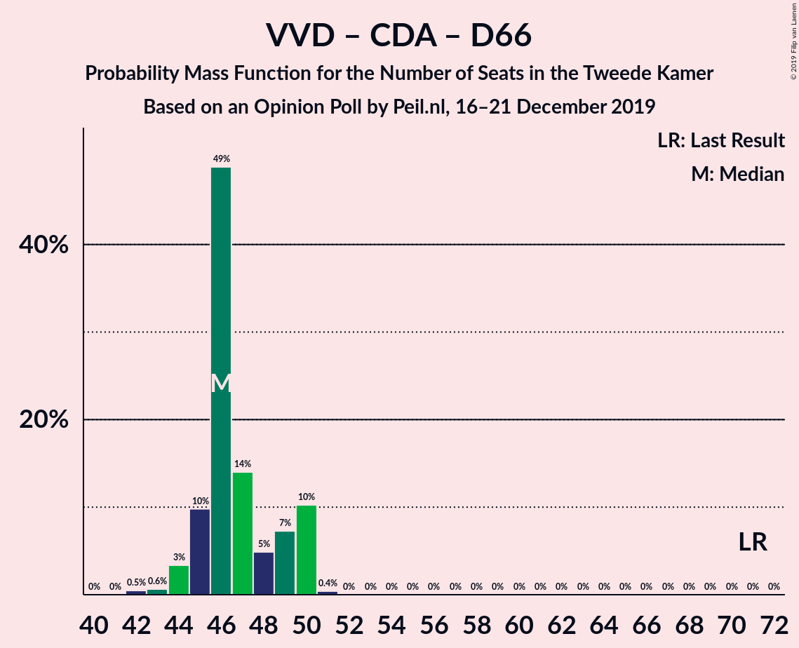

| Number of Seats | Probability | Accumulated | Special Marks |
|:---------------:|:-----------:|:-----------:|:-------------:|
| 42 | 0.6% | 100% |  |
| 43 | 0.1% | 99.4% |  |
| 44 | 4% | 99.2% |  |
| 45 | 4% | 95% |  |
| 46 | 64% | 91% | Median |
| 47 | 16% | 27% |  |
| 48 | 7% | 11% |  |
| 49 | 2% | 5% |  |
| 50 | 2% | 3% |  |
| 51 | 0.7% | 0.7% |  |
| 52 | 0% | 0% |  |
| 53 | 0% | 0% |  |
| 54 | 0% | 0% |  |
| 55 | 0% | 0% |  |
| 56 | 0% | 0% |  |
| 57 | 0% | 0% |  |
| 58 | 0% | 0% |  |
| 59 | 0% | 0% |  |
| 60 | 0% | 0% |  |
| 61 | 0% | 0% |  |
| 62 | 0% | 0% |  |
| 63 | 0% | 0% |  |
| 64 | 0% | 0% |  |
| 65 | 0% | 0% |  |
| 66 | 0% | 0% |  |
| 67 | 0% | 0% |  |
| 68 | 0% | 0% |  |
| 69 | 0% | 0% |  |
| 70 | 0% | 0% |  |
| 71 | 0% | 0% | Last Result |

### Partij van de Arbeid – Christen-Democratisch Appèl – Democraten 66

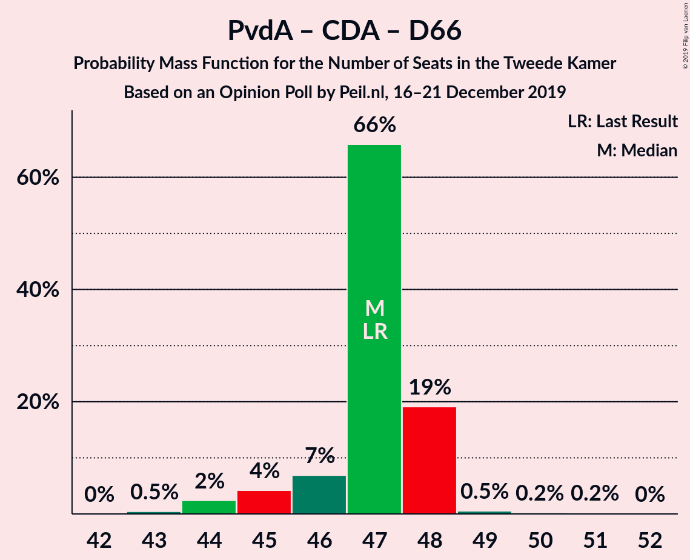

| Number of Seats | Probability | Accumulated | Special Marks |
|:---------------:|:-----------:|:-----------:|:-------------:|
| 43 | 0.5% | 100% |  |
| 44 | 2% | 99.5% |  |
| 45 | 4% | 97% |  |
| 46 | 7% | 93% |  |
| 47 | 66% | 86% | Last Result, Median |
| 48 | 19% | 20% |  |
| 49 | 0.5% | 1.0% |  |
| 50 | 0.2% | 0.5% |  |
| 51 | 0.2% | 0.2% |  |
| 52 | 0% | 0% |  |

### Partij van de Arbeid – Christen-Democratisch Appèl – ChristenUnie

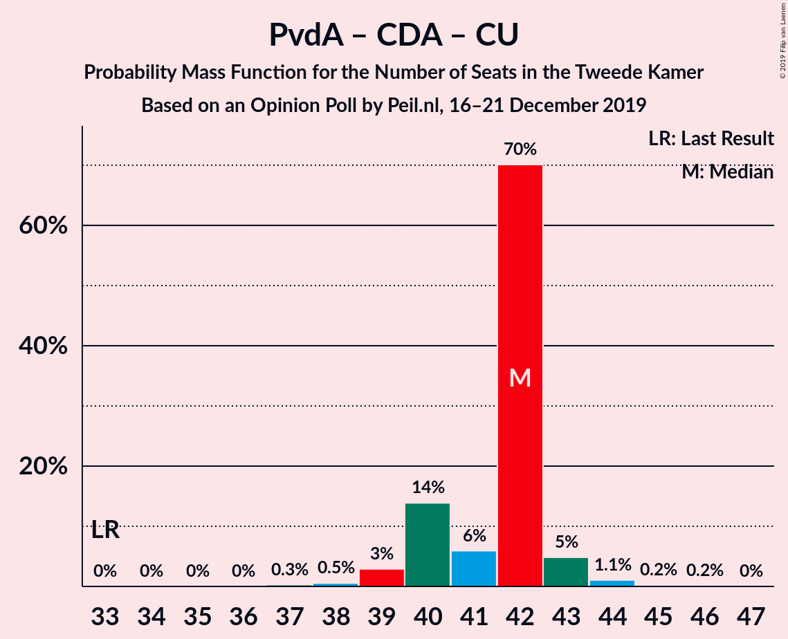

| Number of Seats | Probability | Accumulated | Special Marks |
|:---------------:|:-----------:|:-----------:|:-------------:|
| 33 | 0% | 100% | Last Result |
| 34 | 0% | 100% |  |
| 35 | 0% | 100% |  |
| 36 | 0% | 100% |  |
| 37 | 0.3% | 100% |  |
| 38 | 0.5% | 99.7% |  |
| 39 | 3% | 99.2% |  |
| 40 | 14% | 96% |  |
| 41 | 6% | 82% |  |
| 42 | 70% | 76% | Median |
| 43 | 5% | 6% |  |
| 44 | 1.1% | 1.5% |  |
| 45 | 0.2% | 0.4% |  |
| 46 | 0.2% | 0.2% |  |
| 47 | 0% | 0% |  |

### Partij van de Arbeid – Volkspartij voor Vrijheid en Democratie

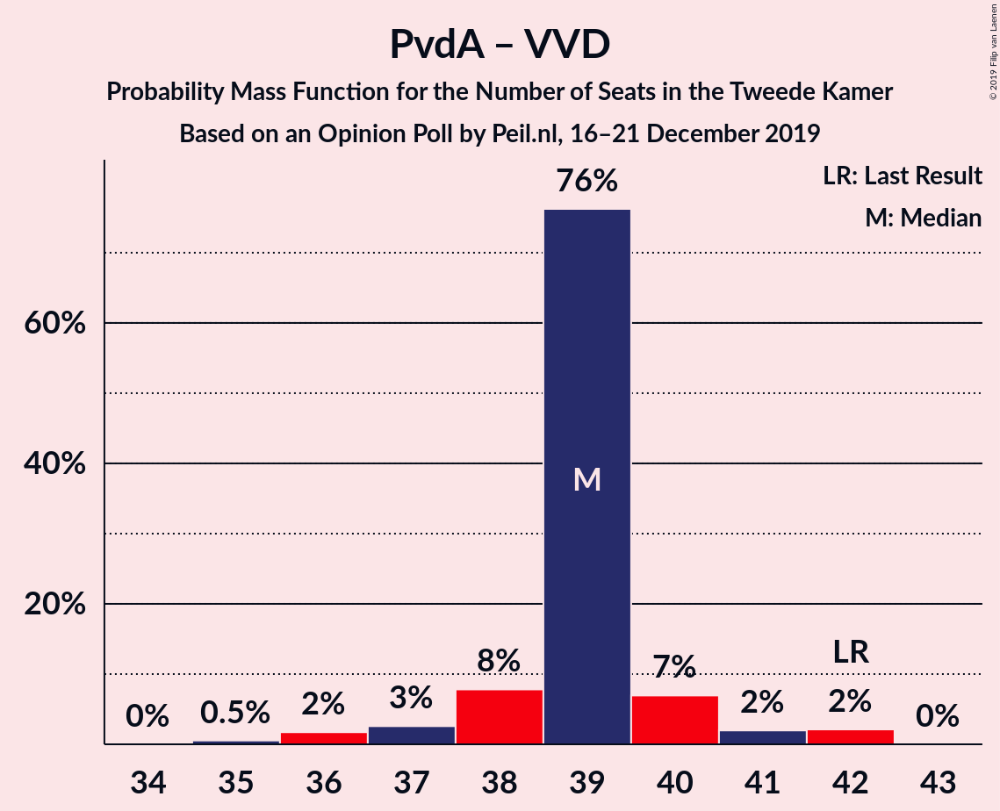

| Number of Seats | Probability | Accumulated | Special Marks |
|:---------------:|:-----------:|:-----------:|:-------------:|
| 35 | 0.5% | 100% |  |
| 36 | 2% | 99.4% |  |
| 37 | 3% | 98% |  |
| 38 | 8% | 95% |  |
| 39 | 76% | 87% | Median |
| 40 | 7% | 11% |  |
| 41 | 2% | 4% |  |
| 42 | 2% | 2% | Last Result |
| 43 | 0% | 0% |  |

### Volkspartij voor Vrijheid en Democratie – Christen-Democratisch Appèl

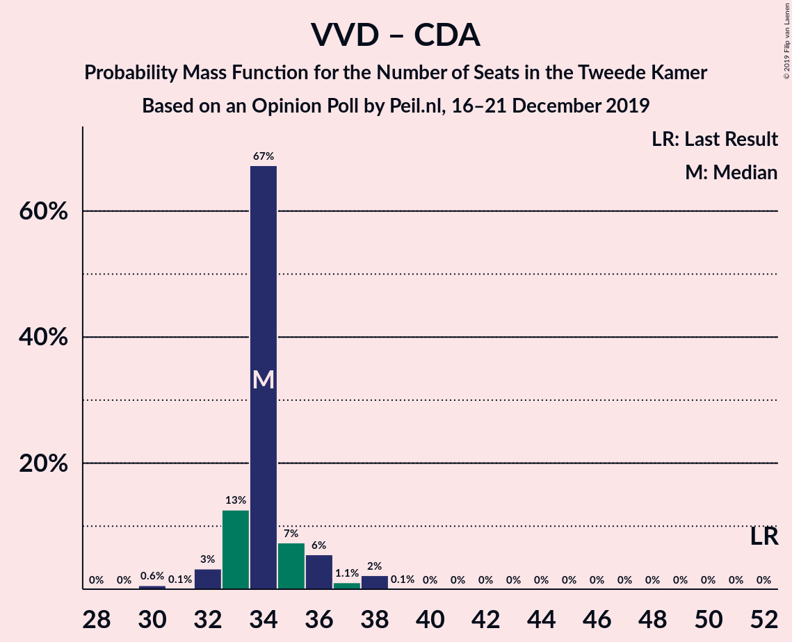

| Number of Seats | Probability | Accumulated | Special Marks |
|:---------------:|:-----------:|:-----------:|:-------------:|
| 30 | 0.6% | 100% |  |
| 31 | 0.1% | 99.4% |  |
| 32 | 3% | 99.3% |  |
| 33 | 13% | 96% |  |
| 34 | 67% | 83% | Median |
| 35 | 7% | 16% |  |
| 36 | 6% | 9% |  |
| 37 | 1.1% | 3% |  |
| 38 | 2% | 2% |  |
| 39 | 0.1% | 0.1% |  |
| 40 | 0% | 0% |  |
| 41 | 0% | 0% |  |
| 42 | 0% | 0% |  |
| 43 | 0% | 0% |  |
| 44 | 0% | 0% |  |
| 45 | 0% | 0% |  |
| 46 | 0% | 0% |  |
| 47 | 0% | 0% |  |
| 48 | 0% | 0% |  |
| 49 | 0% | 0% |  |
| 50 | 0% | 0% |  |
| 51 | 0% | 0% |  |
| 52 | 0% | 0% | Last Result |

### Partij van de Arbeid – Christen-Democratisch Appèl

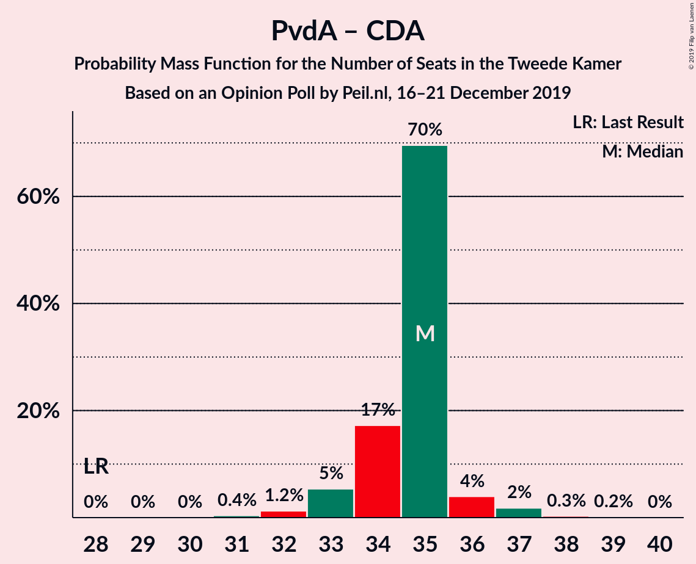

| Number of Seats | Probability | Accumulated | Special Marks |
|:---------------:|:-----------:|:-----------:|:-------------:|
| 28 | 0% | 100% | Last Result |
| 29 | 0% | 100% |  |
| 30 | 0% | 100% |  |
| 31 | 0.4% | 100% |  |
| 32 | 1.2% | 99.6% |  |
| 33 | 5% | 98% |  |
| 34 | 17% | 93% |  |
| 35 | 70% | 76% | Median |
| 36 | 4% | 6% |  |
| 37 | 2% | 2% |  |
| 38 | 0.3% | 0.5% |  |
| 39 | 0.2% | 0.2% |  |
| 40 | 0% | 0% |  |

### Christen-Democratisch Appèl – Democraten 66

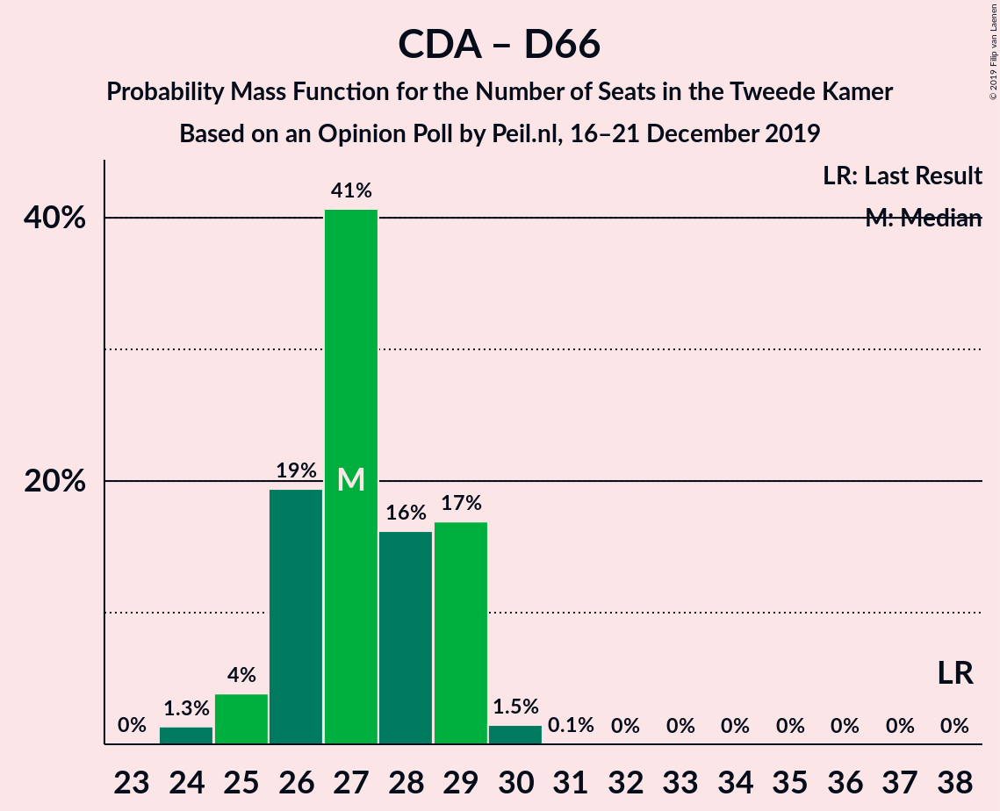

| Number of Seats | Probability | Accumulated | Special Marks |
|:---------------:|:-----------:|:-----------:|:-------------:|
| 24 | 2% | 100% |  |
| 25 | 3% | 98% |  |
| 26 | 6% | 96% |  |
| 27 | 65% | 89% | Median |
| 28 | 19% | 25% |  |
| 29 | 3% | 5% |  |
| 30 | 2% | 2% |  |
| 31 | 0% | 0% |  |
| 32 | 0% | 0% |  |
| 33 | 0% | 0% |  |
| 34 | 0% | 0% |  |
| 35 | 0% | 0% |  |
| 36 | 0% | 0% |  |
| 37 | 0% | 0% |  |
| 38 | 0% | 0% | Last Result |

## Technical Information

### Opinion Poll

+ **Polling firm:** Peil.nl
+ **Commissioner(s):** —
+ **Fieldwork period:** 16–21 December 2019

### Calculations

+ **Sample size:** 3000
+ **Simulations done:** 524,288
+ **Error estimate:** 1.36%

