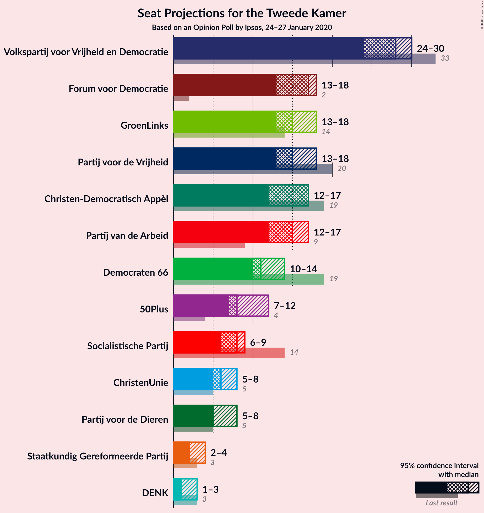
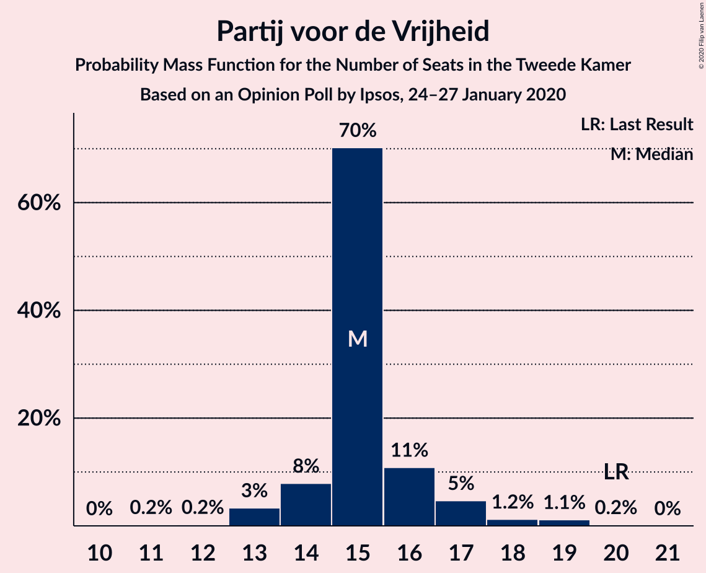
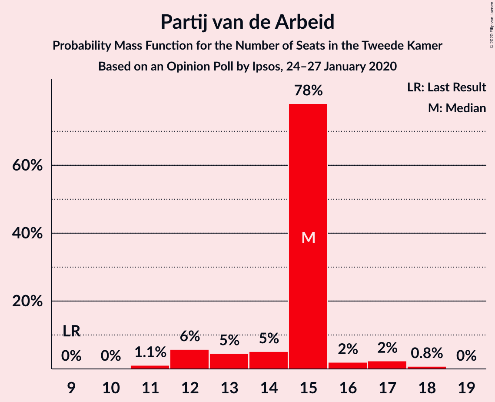
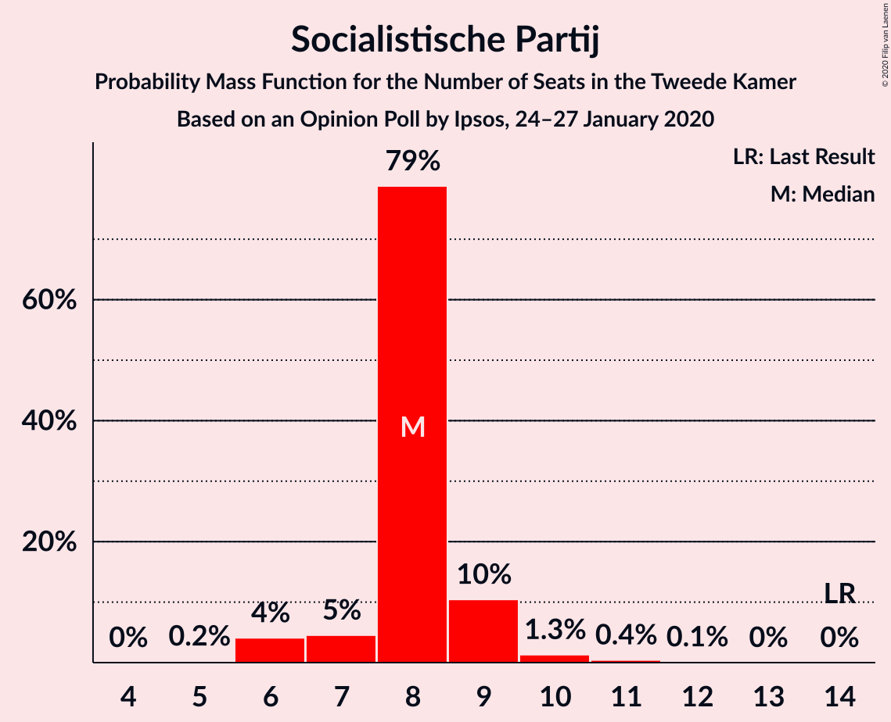
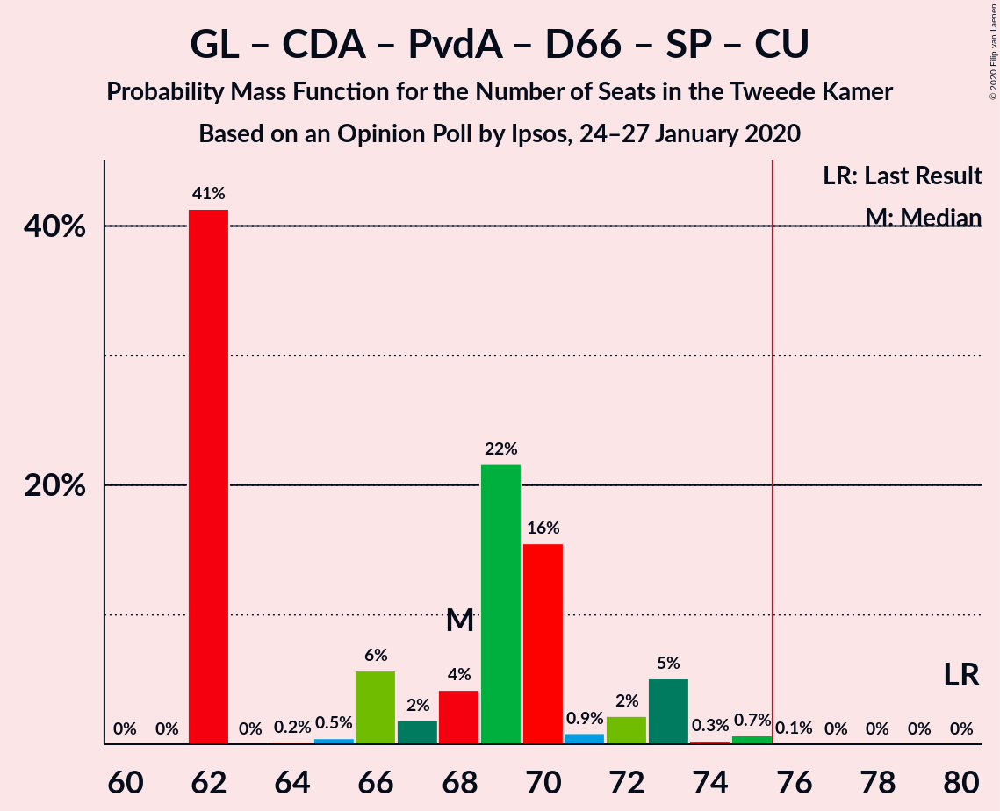
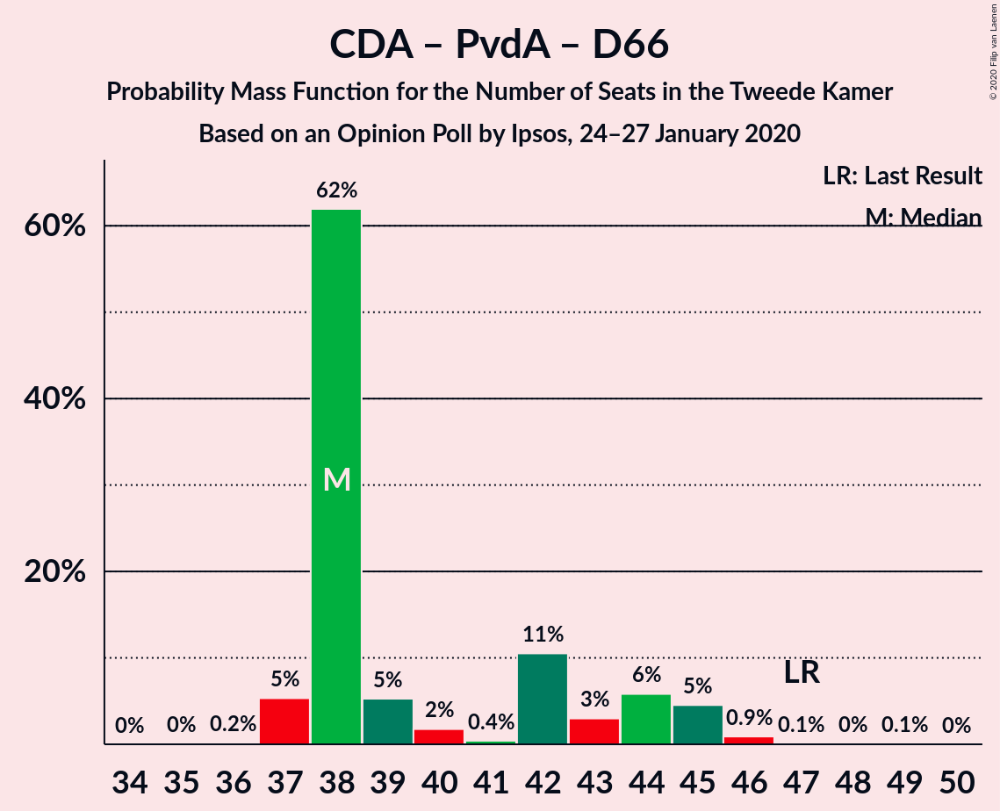
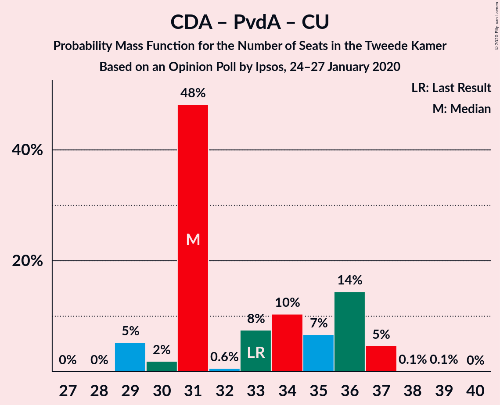

# Opinion Poll by Ipsos, 24–27 January 2020

<a href="#voting-intentions">Voting Intentions</a> | <a href="#seats">Seats</a> | <a href="#coalitions">Coalitions</a> | <a href="#technical-information">Technical Information</a>

## Voting Intentions

### Confidence Intervals

| Party | Last Result | Poll Result | 80% Confidence Interval | 90% Confidence Interval | 95% Confidence Interval | 99% Confidence Interval |
|:-----:|:-----------:|:-----------:|:-----------------------:|:-----------------------:|:-----------------------:|:-----------------------:|
| Volkspartij voor Vrijheid en Democratie | 21.3% | 18.7% | 17.2–20.3% |16.8–20.8% |16.4–21.2% |15.8–22.0% |
| Partij voor de Vrijheid | 13.1% | 10.7% | 9.6–12.0% |9.3–12.4% |9.0–12.7% |8.5–13.4% |
| Forum voor Democratie | 1.8% | 10.7% | 9.6–12.0% |9.3–12.4% |9.0–12.7% |8.5–13.4% |
| GroenLinks | 9.1% | 10.0% | 8.9–11.2% |8.6–11.6% |8.3–11.9% |7.8–12.6% |
| Christen-Democratisch Appèl | 12.4% | 9.3% | 8.2–10.5% |7.9–10.9% |7.7–11.2% |7.2–11.8% |
| Partij van de Arbeid | 5.7% | 9.3% | 8.2–10.5% |7.9–10.9% |7.7–11.2% |7.2–11.8% |
| Democraten 66 | 12.2% | 8.7% | 7.7–10.0% |7.4–10.3% |7.2–10.6% |6.7–11.2% |
| 50Plus | 3.1% | 6.0% | 5.1–7.0% |4.9–7.3% |4.7–7.6% |4.3–8.1% |
| Socialistische Partij | 9.1% | 5.3% | 4.5–6.3% |4.3–6.6% |4.1–6.8% |3.8–7.3% |
| ChristenUnie | 3.4% | 4.0% | 3.3–4.9% |3.1–5.1% |3.0–5.3% |2.7–5.8% |
| Partij voor de Dieren | 3.2% | 4.0% | 3.3–4.9% |3.1–5.1% |3.0–5.3% |2.7–5.8% |
| Staatkundig Gereformeerde Partij | 2.1% | 2.0% | 1.5–2.7% |1.4–2.9% |1.3–3.0% |1.1–3.4% |
| DENK | 2.1% | 1.3% | 1.0–1.9% |0.9–2.1% |0.8–2.2% |0.7–2.5% |

*Note:* The poll result column reflects the actual value used in the calculations. Published results may vary slightly, and in addition be rounded to fewer digits.

## Seats

### Confidence Intervals

| Party | Last Result | Median | 80% Confidence Interval | 90% Confidence Interval | 95% Confidence Interval | 99% Confidence Interval |
|:-----:|:-----------:|:------:|:-----------------------:|:-----------------------:|:-----------------------:|:-----------------------:|
| <a href="#volkspartij-voor-vrijheid-en-democratie">Volkspartij voor Vrijheid en Democratie</a> | 33 | 30 | 26–30 |25–31 |25–31 |23–33 |
| <a href="#partij-voor-de-vrijheid">Partij voor de Vrijheid</a> | 20 | 17 | 15–18 |14–20 |13–20 |13–20 |
| <a href="#forum-voor-democratie">Forum voor Democratie</a> | 2 | 17 | 14–21 |14–21 |14–21 |13–21 |
| <a href="#groenlinks">GroenLinks</a> | 14 | 14 | 12–16 |12–16 |12–16 |11–19 |
| <a href="#christen-democratisch-appèl">Christen-Democratisch Appèl</a> | 19 | 14 | 11–15 |11–16 |11–17 |11–17 |
| <a href="#partij-van-de-arbeid">Partij van de Arbeid</a> | 9 | 13 | 12–15 |12–18 |12–18 |11–18 |
| <a href="#democraten-66">Democraten 66</a> | 19 | 12 | 10–14 |10–15 |10–16 |10–17 |
| <a href="#50plus">50Plus</a> | 4 | 9 | 8–11 |8–11 |7–14 |6–14 |
| <a href="#socialistische-partij">Socialistische Partij</a> | 14 | 7 | 6–9 |6–10 |6–10 |5–10 |
| <a href="#christenunie">ChristenUnie</a> | 5 | 5 | 5–8 |5–8 |4–8 |4–8 |
| <a href="#partij-voor-de-dieren">Partij voor de Dieren</a> | 5 | 7 | 5–7 |4–8 |4–8 |4–8 |
| <a href="#staatkundig-gereformeerde-partij">Staatkundig Gereformeerde Partij</a> | 3 | 2 | 2–4 |2–4 |2–4 |2–4 |
| <a href="#denk">DENK</a> | 3 | 2 | 1–2 |1–2 |1–3 |1–3 |

### Volkspartij voor Vrijheid en Democratie

*For a full overview of the results for this party, see the [Volkspartij voor Vrijheid en Democratie](party-volkspartijvoorvrijheidendemocratie.html) page.*

| Number of Seats | Probability | Accumulated | Special Marks |
|:---------------:|:-----------:|:-----------:|:-------------:|
| 23 | 0.7% | 100% |  |
| 24 | 1.1% | 99.3% |  |
| 25 | 4% | 98% |  |
| 26 | 9% | 94% |  |
| 27 | 12% | 85% |  |
| 28 | 6% | 73% |  |
| 29 | 16% | 67% |  |
| 30 | 42% | 51% | Median |
| 31 | 7% | 9% |  |
| 32 | 1.0% | 2% |  |
| 33 | 0.2% | 0.6% | Last Result |
| 34 | 0% | 0.4% |  |
| 35 | 0.2% | 0.3% |  |
| 36 | 0.1% | 0.1% |  |
| 37 | 0% | 0% |  |

### Partij voor de Vrijheid

*For a full overview of the results for this party, see the [Partij voor de Vrijheid](party-partijvoordevrijheid.html) page.*

| Number of Seats | Probability | Accumulated | Special Marks |
|:---------------:|:-----------:|:-----------:|:-------------:|
| 11 | 0.1% | 100% |  |
| 12 | 0% | 99.9% |  |
| 13 | 4% | 99.9% |  |
| 14 | 2% | 96% |  |
| 15 | 7% | 93% |  |
| 16 | 25% | 86% |  |
| 17 | 47% | 61% | Median |
| 18 | 9% | 15% |  |
| 19 | 0.2% | 6% |  |
| 20 | 5% | 5% | Last Result |
| 21 | 0.1% | 0.1% |  |
| 22 | 0% | 0% |  |

### Forum voor Democratie

*For a full overview of the results for this party, see the [Forum voor Democratie](party-forumvoordemocratie.html) page.*

| Number of Seats | Probability | Accumulated | Special Marks |
|:---------------:|:-----------:|:-----------:|:-------------:|
| 2 | 0% | 100% | Last Result |
| 3 | 0% | 100% |  |
| 4 | 0% | 100% |  |
| 5 | 0% | 100% |  |
| 6 | 0% | 100% |  |
| 7 | 0% | 100% |  |
| 8 | 0% | 100% |  |
| 9 | 0% | 100% |  |
| 10 | 0% | 100% |  |
| 11 | 0% | 100% |  |
| 12 | 0.1% | 100% |  |
| 13 | 0.6% | 99.9% |  |
| 14 | 21% | 99.3% |  |
| 15 | 1.4% | 79% |  |
| 16 | 6% | 77% |  |
| 17 | 25% | 71% | Median |
| 18 | 3% | 46% |  |
| 19 | 0.4% | 43% |  |
| 20 | 1.1% | 42% |  |
| 21 | 41% | 41% |  |
| 22 | 0% | 0% |  |

### GroenLinks

*For a full overview of the results for this party, see the [GroenLinks](party-groenlinks.html) page.*

| Number of Seats | Probability | Accumulated | Special Marks |
|:---------------:|:-----------:|:-----------:|:-------------:|
| 11 | 2% | 100% |  |
| 12 | 47% | 98% |  |
| 13 | 0.4% | 51% |  |
| 14 | 8% | 51% | Last Result, Median |
| 15 | 15% | 43% |  |
| 16 | 26% | 28% |  |
| 17 | 0.8% | 2% |  |
| 18 | 0.2% | 0.8% |  |
| 19 | 0.5% | 0.6% |  |
| 20 | 0.1% | 0.1% |  |
| 21 | 0% | 0% |  |

### Christen-Democratisch Appèl

*For a full overview of the results for this party, see the [Christen-Democratisch Appèl](party-christen-democratischappèl.html) page.*

| Number of Seats | Probability | Accumulated | Special Marks |
|:---------------:|:-----------:|:-----------:|:-------------:|
| 10 | 0.5% | 100% |  |
| 11 | 13% | 99.5% |  |
| 12 | 4% | 86% |  |
| 13 | 5% | 82% |  |
| 14 | 62% | 77% | Median |
| 15 | 9% | 15% |  |
| 16 | 0.9% | 6% |  |
| 17 | 5% | 5% |  |
| 18 | 0.1% | 0.1% |  |
| 19 | 0% | 0% | Last Result |

### Partij van de Arbeid

*For a full overview of the results for this party, see the [Partij van de Arbeid](party-partijvandearbeid.html) page.*

| Number of Seats | Probability | Accumulated | Special Marks |
|:---------------:|:-----------:|:-----------:|:-------------:|
| 9 | 0.1% | 100% | Last Result |
| 10 | 0.2% | 99.9% |  |
| 11 | 0.6% | 99.8% |  |
| 12 | 48% | 99.1% |  |
| 13 | 6% | 51% | Median |
| 14 | 33% | 44% |  |
| 15 | 2% | 12% |  |
| 16 | 2% | 10% |  |
| 17 | 0.2% | 8% |  |
| 18 | 8% | 8% |  |
| 19 | 0% | 0% |  |

### Democraten 66

*For a full overview of the results for this party, see the [Democraten 66](party-democraten66.html) page.*

| Number of Seats | Probability | Accumulated | Special Marks |
|:---------------:|:-----------:|:-----------:|:-------------:|
| 10 | 14% | 100% |  |
| 11 | 0.5% | 86% |  |
| 12 | 53% | 86% | Median |
| 13 | 14% | 32% |  |
| 14 | 9% | 18% |  |
| 15 | 5% | 9% |  |
| 16 | 2% | 3% |  |
| 17 | 0.9% | 1.0% |  |
| 18 | 0% | 0.1% |  |
| 19 | 0.1% | 0.1% | Last Result |
| 20 | 0% | 0% |  |

### 50Plus

*For a full overview of the results for this party, see the [50Plus](party-50plus.html) page.*

| Number of Seats | Probability | Accumulated | Special Marks |
|:---------------:|:-----------:|:-----------:|:-------------:|
| 4 | 0% | 100% | Last Result |
| 5 | 0% | 100% |  |
| 6 | 2% | 100% |  |
| 7 | 0.5% | 98% |  |
| 8 | 11% | 97% |  |
| 9 | 60% | 87% | Median |
| 10 | 7% | 27% |  |
| 11 | 15% | 20% |  |
| 12 | 0.4% | 4% |  |
| 13 | 0.3% | 4% |  |
| 14 | 4% | 4% |  |
| 15 | 0% | 0% |  |

### Socialistische Partij

*For a full overview of the results for this party, see the [Socialistische Partij](party-socialistischepartij.html) page.*

| Number of Seats | Probability | Accumulated | Special Marks |
|:---------------:|:-----------:|:-----------:|:-------------:|
| 4 | 0.1% | 100% |  |
| 5 | 0.4% | 99.9% |  |
| 6 | 13% | 99.5% |  |
| 7 | 49% | 87% | Median |
| 8 | 8% | 37% |  |
| 9 | 21% | 30% |  |
| 10 | 8% | 9% |  |
| 11 | 0.4% | 0.5% |  |
| 12 | 0.1% | 0.1% |  |
| 13 | 0% | 0% |  |
| 14 | 0% | 0% | Last Result |

### ChristenUnie

*For a full overview of the results for this party, see the [ChristenUnie](party-christenunie.html) page.*

| Number of Seats | Probability | Accumulated | Special Marks |
|:---------------:|:-----------:|:-----------:|:-------------:|
| 4 | 4% | 100% |  |
| 5 | 63% | 96% | Last Result, Median |
| 6 | 15% | 33% |  |
| 7 | 3% | 18% |  |
| 8 | 14% | 14% |  |
| 9 | 0% | 0% |  |

### Partij voor de Dieren

*For a full overview of the results for this party, see the [Partij voor de Dieren](party-partijvoordedieren.html) page.*

| Number of Seats | Probability | Accumulated | Special Marks |
|:---------------:|:-----------:|:-----------:|:-------------:|
| 3 | 0.5% | 100% |  |
| 4 | 8% | 99.5% |  |
| 5 | 9% | 91% | Last Result |
| 6 | 17% | 82% |  |
| 7 | 56% | 66% | Median |
| 8 | 9% | 9% |  |
| 9 | 0.1% | 0.1% |  |
| 10 | 0% | 0% |  |

### Staatkundig Gereformeerde Partij

*For a full overview of the results for this party, see the [Staatkundig Gereformeerde Partij](party-staatkundiggereformeerdepartij.html) page.*

| Number of Seats | Probability | Accumulated | Special Marks |
|:---------------:|:-----------:|:-----------:|:-------------:|
| 1 | 0.4% | 100% |  |
| 2 | 55% | 99.6% | Median |
| 3 | 22% | 45% | Last Result |
| 4 | 22% | 23% |  |
| 5 | 0.3% | 0.3% |  |
| 6 | 0.1% | 0.1% |  |
| 7 | 0% | 0% |  |

### DENK

*For a full overview of the results for this party, see the [DENK](party-denk.html) page.*

| Number of Seats | Probability | Accumulated | Special Marks |
|:---------------:|:-----------:|:-----------:|:-------------:|
| 0 | 0.1% | 100% |  |
| 1 | 33% | 99.9% |  |
| 2 | 64% | 67% | Median |
| 3 | 3% | 3% | Last Result |
| 4 | 0.3% | 0.3% |  |
| 5 | 0% | 0% |  |

## Coalitions

### Confidence Intervals

| Coalition | Last Result | Median | Majority? | 80% Confidence Interval | 90% Confidence Interval | 95% Confidence Interval | 99% Confidence Interval |
|:---------:|:-----------:|:------:|:---------:|:-----------------------:|:-----------------------:|:-----------------------:|:-----------------------:|
| Volkspartij voor Vrijheid en Democratie – Forum voor Democratie – Partij voor de Vrijheid – Christen-Democratisch Appèl – Staatkundig Gereformeerde Partij | 77 | 79 | 86% | 74–84 | 73–84 | 73–84 | 73–84 |
| Volkspartij voor Vrijheid en Democratie – Forum voor Democratie – Partij voor de Vrijheid – Christen-Democratisch Appèl | 74 | 76 | 58% | 72–82 | 70–82 | 70–82 | 70–82 |
| Volkspartij voor Vrijheid en Democratie – GroenLinks – Christen-Democratisch Appèl – Democraten 66 – ChristenUnie | 90 | 73 | 29% | 73–77 | 71–78 | 71–79 | 71–84 |
| Volkspartij voor Vrijheid en Democratie – Christen-Democratisch Appèl – Partij van de Arbeid – Democraten 66 – ChristenUnie | 85 | 73 | 21% | 70–77 | 70–78 | 70–79 | 70–81 |
| Volkspartij voor Vrijheid en Democratie – Forum voor Democratie – Christen-Democratisch Appèl – 50Plus – Staatkundig Gereformeerde Partij | 61 | 72 | 47% | 68–76 | 67–76 | 67–76 | 66–77 |
| Volkspartij voor Vrijheid en Democratie – Forum voor Democratie – Christen-Democratisch Appèl – 50Plus | 58 | 69 | 0% | 65–74 | 63–74 | 63–74 | 63–74 |
| GroenLinks – Christen-Democratisch Appèl – Partij van de Arbeid – Democraten 66 – Socialistische Partij – ChristenUnie | 80 | 68 | 0.1% | 62–70 | 62–73 | 62–73 | 62–75 |
| Volkspartij voor Vrijheid en Democratie – Forum voor Democratie – Christen-Democratisch Appèl – Staatkundig Gereformeerde Partij | 57 | 62 | 0% | 57–67 | 57–67 | 57–67 | 56–68 |
| GroenLinks – Christen-Democratisch Appèl – Partij van de Arbeid – Democraten 66 – ChristenUnie | 66 | 59 | 0% | 55–63 | 55–66 | 55–67 | 55–67 |
| Volkspartij voor Vrijheid en Democratie – Christen-Democratisch Appèl – Democraten 66 – ChristenUnie | 76 | 61 | 0% | 57–63 | 55–64 | 55–65 | 55–69 |
| Volkspartij voor Vrijheid en Democratie – Forum voor Democratie – Christen-Democratisch Appèl | 54 | 59 | 0% | 54–65 | 53–65 | 53–65 | 53–65 |
| Volkspartij voor Vrijheid en Democratie – Partij voor de Vrijheid – Christen-Democratisch Appèl | 72 | 59 | 0% | 56–61 | 53–61 | 53–61 | 53–64 |
| Volkspartij voor Vrijheid en Democratie – Christen-Democratisch Appèl – Partij van de Arbeid | 61 | 56 | 0% | 53–57 | 52–58 | 52–60 | 51–65 |
| Volkspartij voor Vrijheid en Democratie – Christen-Democratisch Appèl – Democraten 66 | 71 | 56 | 0% | 52–57 | 50–57 | 50–60 | 50–61 |
| Volkspartij voor Vrijheid en Democratie – Partij van de Arbeid – Democraten 66 | 61 | 54 | 0% | 53–57 | 51–59 | 51–59 | 50–63 |
| Volkspartij voor Vrijheid en Democratie – Partij van de Arbeid | 42 | 42 | 0% | 39–44 | 39–45 | 39–46 | 37–48 |
| Volkspartij voor Vrijheid en Democratie – Christen-Democratisch Appèl | 52 | 43 | 0% | 39–44 | 37–44 | 37–46 | 37–49 |
| Christen-Democratisch Appèl – Partij van de Arbeid – Democraten 66 | 47 | 38 | 0% | 38–44 | 37–45 | 37–45 | 37–46 |
| Christen-Democratisch Appèl – Partij van de Arbeid – ChristenUnie | 33 | 31 | 0% | 31–36 | 29–36 | 29–37 | 29–37 |
| Christen-Democratisch Appèl – Democraten 66 | 38 | 26 | 0% | 24–30 | 24–30 | 24–31 | 23–32 |
| Christen-Democratisch Appèl – Partij van de Arbeid | 28 | 26 | 0% | 26–29 | 24–31 | 24–31 | 24–33 |

### Volkspartij voor Vrijheid en Democratie – Forum voor Democratie – Partij voor de Vrijheid – Christen-Democratisch Appèl – Staatkundig Gereformeerde Partij

| Number of Seats | Probability | Accumulated | Special Marks |
|:---------------:|:-----------:|:-----------:|:-------------:|
| 72 | 0.4% | 100% |  |
| 73 | 8% | 99.5% |  |
| 74 | 2% | 91% |  |
| 75 | 4% | 90% |  |
| 76 | 2% | 86% | Majority |
| 77 | 24% | 84% | Last Result |
| 78 | 8% | 60% |  |
| 79 | 7% | 52% |  |
| 80 | 0.7% | 45% | Median |
| 81 | 1.0% | 44% |  |
| 82 | 2% | 43% |  |
| 83 | 0.2% | 42% |  |
| 84 | 41% | 42% |  |
| 85 | 0.1% | 0.3% |  |
| 86 | 0.2% | 0.2% |  |
| 87 | 0% | 0% |  |

### Volkspartij voor Vrijheid en Democratie – Forum voor Democratie – Partij voor de Vrijheid – Christen-Democratisch Appèl

| Number of Seats | Probability | Accumulated | Special Marks |
|:---------------:|:-----------:|:-----------:|:-------------:|
| 68 | 0.2% | 100% |  |
| 69 | 0.1% | 99.7% |  |
| 70 | 9% | 99.7% |  |
| 71 | 0.9% | 91% |  |
| 72 | 0.5% | 90% |  |
| 73 | 23% | 90% |  |
| 74 | 6% | 66% | Last Result |
| 75 | 2% | 60% |  |
| 76 | 13% | 58% | Majority |
| 77 | 0.4% | 45% |  |
| 78 | 3% | 45% | Median |
| 79 | 0.2% | 42% |  |
| 80 | 0.3% | 42% |  |
| 81 | 0% | 42% |  |
| 82 | 41% | 42% |  |
| 83 | 0.1% | 0.2% |  |
| 84 | 0% | 0% |  |

### Volkspartij voor Vrijheid en Democratie – GroenLinks – Christen-Democratisch Appèl – Democraten 66 – ChristenUnie

| Number of Seats | Probability | Accumulated | Special Marks |
|:---------------:|:-----------:|:-----------:|:-------------:|
| 70 | 0.2% | 100% |  |
| 71 | 8% | 99.7% |  |
| 72 | 1.0% | 92% |  |
| 73 | 48% | 91% |  |
| 74 | 7% | 43% |  |
| 75 | 7% | 36% | Median |
| 76 | 18% | 29% | Majority |
| 77 | 2% | 11% |  |
| 78 | 6% | 9% |  |
| 79 | 2% | 3% |  |
| 80 | 0.2% | 2% |  |
| 81 | 0.4% | 1.3% |  |
| 82 | 0.3% | 0.9% |  |
| 83 | 0% | 0.6% |  |
| 84 | 0% | 0.5% |  |
| 85 | 0.5% | 0.5% |  |
| 86 | 0% | 0% |  |
| 87 | 0% | 0% |  |
| 88 | 0% | 0% |  |
| 89 | 0% | 0% |  |
| 90 | 0% | 0% | Last Result |

### Volkspartij voor Vrijheid en Democratie – Christen-Democratisch Appèl – Partij van de Arbeid – Democraten 66 – ChristenUnie

| Number of Seats | Probability | Accumulated | Special Marks |
|:---------------:|:-----------:|:-----------:|:-------------:|
| 68 | 0% | 100% |  |
| 69 | 0.1% | 99.9% |  |
| 70 | 12% | 99.9% |  |
| 71 | 0.4% | 88% |  |
| 72 | 2% | 88% |  |
| 73 | 50% | 86% |  |
| 74 | 0.4% | 37% | Median |
| 75 | 15% | 36% |  |
| 76 | 10% | 21% | Majority |
| 77 | 5% | 11% |  |
| 78 | 3% | 6% |  |
| 79 | 0.2% | 3% |  |
| 80 | 0.8% | 2% |  |
| 81 | 1.5% | 2% |  |
| 82 | 0.1% | 0.1% |  |
| 83 | 0% | 0% |  |
| 84 | 0% | 0% |  |
| 85 | 0% | 0% | Last Result |

### Volkspartij voor Vrijheid en Democratie – Forum voor Democratie – Christen-Democratisch Appèl – 50Plus – Staatkundig Gereformeerde Partij

| Number of Seats | Probability | Accumulated | Special Marks |
|:---------------:|:-----------:|:-----------:|:-------------:|
| 61 | 0% | 100% | Last Result |
| 62 | 0% | 100% |  |
| 63 | 0.1% | 100% |  |
| 64 | 0% | 99.9% |  |
| 65 | 0.3% | 99.9% |  |
| 66 | 1.5% | 99.6% |  |
| 67 | 5% | 98% |  |
| 68 | 10% | 93% |  |
| 69 | 6% | 82% |  |
| 70 | 19% | 77% |  |
| 71 | 2% | 58% |  |
| 72 | 8% | 56% | Median |
| 73 | 0.3% | 48% |  |
| 74 | 0.4% | 48% |  |
| 75 | 1.0% | 48% |  |
| 76 | 45% | 47% | Majority |
| 77 | 2% | 2% |  |
| 78 | 0% | 0% |  |

### Volkspartij voor Vrijheid en Democratie – Forum voor Democratie – Christen-Democratisch Appèl – 50Plus

| Number of Seats | Probability | Accumulated | Special Marks |
|:---------------:|:-----------:|:-----------:|:-------------:|
| 58 | 0% | 100% | Last Result |
| 59 | 0% | 100% |  |
| 60 | 0% | 100% |  |
| 61 | 0% | 99.9% |  |
| 62 | 0.4% | 99.9% |  |
| 63 | 5% | 99.6% |  |
| 64 | 2% | 94% |  |
| 65 | 9% | 92% |  |
| 66 | 15% | 83% |  |
| 67 | 10% | 68% |  |
| 68 | 0.6% | 58% |  |
| 69 | 9% | 58% |  |
| 70 | 0.6% | 49% | Median |
| 71 | 0.3% | 48% |  |
| 72 | 0.8% | 48% |  |
| 73 | 2% | 47% |  |
| 74 | 45% | 45% |  |
| 75 | 0% | 0% |  |

### GroenLinks – Christen-Democratisch Appèl – Partij van de Arbeid – Democraten 66 – Socialistische Partij – ChristenUnie

| Number of Seats | Probability | Accumulated | Special Marks |
|:---------------:|:-----------:|:-----------:|:-------------:|
| 62 | 41% | 100% |  |
| 63 | 0% | 59% |  |
| 64 | 0.2% | 59% |  |
| 65 | 0.5% | 58% | Median |
| 66 | 6% | 58% |  |
| 67 | 2% | 52% |  |
| 68 | 4% | 50% |  |
| 69 | 22% | 46% |  |
| 70 | 16% | 25% |  |
| 71 | 0.9% | 9% |  |
| 72 | 2% | 8% |  |
| 73 | 5% | 6% |  |
| 74 | 0.3% | 1.1% |  |
| 75 | 0.7% | 0.8% |  |
| 76 | 0.1% | 0.1% | Majority |
| 77 | 0% | 0% |  |
| 78 | 0% | 0% |  |
| 79 | 0% | 0% |  |
| 80 | 0% | 0% | Last Result |

### Volkspartij voor Vrijheid en Democratie – Forum voor Democratie – Christen-Democratisch Appèl – Staatkundig Gereformeerde Partij

| Number of Seats | Probability | Accumulated | Special Marks |
|:---------------:|:-----------:|:-----------:|:-------------:|
| 55 | 0.1% | 100% |  |
| 56 | 0.4% | 99.9% |  |
| 57 | 13% | 99.5% | Last Result |
| 58 | 0.9% | 86% |  |
| 59 | 1.1% | 85% |  |
| 60 | 2% | 84% |  |
| 61 | 27% | 82% |  |
| 62 | 9% | 55% |  |
| 63 | 0.3% | 46% | Median |
| 64 | 0.8% | 45% |  |
| 65 | 0.3% | 45% |  |
| 66 | 1.2% | 44% |  |
| 67 | 41% | 43% |  |
| 68 | 2% | 2% |  |
| 69 | 0% | 0.1% |  |
| 70 | 0% | 0.1% |  |
| 71 | 0.1% | 0.1% |  |
| 72 | 0% | 0% |  |

### GroenLinks – Christen-Democratisch Appèl – Partij van de Arbeid – Democraten 66 – ChristenUnie

| Number of Seats | Probability | Accumulated | Special Marks |
|:---------------:|:-----------:|:-----------:|:-------------:|
| 55 | 41% | 100% |  |
| 56 | 0.1% | 59% |  |
| 57 | 0.3% | 59% |  |
| 58 | 7% | 58% | Median |
| 59 | 11% | 51% |  |
| 60 | 2% | 40% |  |
| 61 | 14% | 38% |  |
| 62 | 7% | 25% |  |
| 63 | 10% | 17% |  |
| 64 | 0.3% | 7% |  |
| 65 | 1.5% | 7% |  |
| 66 | 0.2% | 5% | Last Result |
| 67 | 4% | 5% |  |
| 68 | 0.3% | 0.4% |  |
| 69 | 0% | 0% |  |

### Volkspartij voor Vrijheid en Democratie – Christen-Democratisch Appèl – Democraten 66 – ChristenUnie

| Number of Seats | Probability | Accumulated | Special Marks |
|:---------------:|:-----------:|:-----------:|:-------------:|
| 55 | 8% | 100% |  |
| 56 | 0.1% | 92% |  |
| 57 | 5% | 92% |  |
| 58 | 9% | 87% |  |
| 59 | 0.4% | 78% |  |
| 60 | 0.4% | 78% |  |
| 61 | 57% | 77% | Median |
| 62 | 8% | 20% |  |
| 63 | 6% | 11% |  |
| 64 | 3% | 6% |  |
| 65 | 2% | 3% |  |
| 66 | 0.4% | 1.1% |  |
| 67 | 0.1% | 0.7% |  |
| 68 | 0% | 0.6% |  |
| 69 | 0.6% | 0.6% |  |
| 70 | 0% | 0% |  |
| 71 | 0% | 0% |  |
| 72 | 0% | 0% |  |
| 73 | 0% | 0% |  |
| 74 | 0% | 0% |  |
| 75 | 0% | 0% |  |
| 76 | 0% | 0% | Last Result, Majority |

### Volkspartij voor Vrijheid en Democratie – Forum voor Democratie – Christen-Democratisch Appèl

| Number of Seats | Probability | Accumulated | Special Marks |
|:---------------:|:-----------:|:-----------:|:-------------:|
| 52 | 0% | 100% |  |
| 53 | 5% | 99.9% |  |
| 54 | 9% | 94% | Last Result |
| 55 | 0.3% | 86% |  |
| 56 | 0.4% | 85% |  |
| 57 | 15% | 85% |  |
| 58 | 9% | 70% |  |
| 59 | 11% | 60% |  |
| 60 | 4% | 49% |  |
| 61 | 0.1% | 45% | Median |
| 62 | 0.7% | 45% |  |
| 63 | 0.9% | 44% |  |
| 64 | 2% | 43% |  |
| 65 | 41% | 41% |  |
| 66 | 0% | 0.1% |  |
| 67 | 0% | 0.1% |  |
| 68 | 0.1% | 0.1% |  |
| 69 | 0% | 0% |  |

### Volkspartij voor Vrijheid en Democratie – Partij voor de Vrijheid – Christen-Democratisch Appèl

| Number of Seats | Probability | Accumulated | Special Marks |
|:---------------:|:-----------:|:-----------:|:-------------:|
| 52 | 0% | 100% |  |
| 53 | 8% | 99.9% |  |
| 54 | 0.7% | 92% |  |
| 55 | 1.0% | 91% |  |
| 56 | 0.7% | 90% |  |
| 57 | 10% | 90% |  |
| 58 | 2% | 80% |  |
| 59 | 33% | 78% |  |
| 60 | 2% | 45% |  |
| 61 | 41% | 43% | Median |
| 62 | 0.2% | 2% |  |
| 63 | 0.2% | 1.4% |  |
| 64 | 1.1% | 1.2% |  |
| 65 | 0.1% | 0.1% |  |
| 66 | 0% | 0% |  |
| 67 | 0% | 0% |  |
| 68 | 0% | 0% |  |
| 69 | 0% | 0% |  |
| 70 | 0% | 0% |  |
| 71 | 0% | 0% |  |
| 72 | 0% | 0% | Last Result |

### Volkspartij voor Vrijheid en Democratie – Christen-Democratisch Appèl – Partij van de Arbeid

| Number of Seats | Probability | Accumulated | Special Marks |
|:---------------:|:-----------:|:-----------:|:-------------:|
| 49 | 0.1% | 100% |  |
| 50 | 0.2% | 99.9% |  |
| 51 | 0.3% | 99.8% |  |
| 52 | 6% | 99.5% |  |
| 53 | 8% | 94% |  |
| 54 | 0.9% | 86% |  |
| 55 | 10% | 85% |  |
| 56 | 51% | 75% |  |
| 57 | 16% | 24% | Median |
| 58 | 4% | 8% |  |
| 59 | 0.9% | 4% |  |
| 60 | 2% | 3% |  |
| 61 | 0.3% | 1.2% | Last Result |
| 62 | 0.1% | 0.9% |  |
| 63 | 0% | 0.8% |  |
| 64 | 0.1% | 0.7% |  |
| 65 | 0.6% | 0.7% |  |
| 66 | 0% | 0% |  |

### Volkspartij voor Vrijheid en Democratie – Christen-Democratisch Appèl – Democraten 66

| Number of Seats | Probability | Accumulated | Special Marks |
|:---------------:|:-----------:|:-----------:|:-------------:|
| 49 | 0% | 100% |  |
| 50 | 8% | 99.9% |  |
| 51 | 0.7% | 92% |  |
| 52 | 6% | 91% |  |
| 53 | 22% | 86% |  |
| 54 | 0.1% | 64% |  |
| 55 | 1.5% | 64% |  |
| 56 | 50% | 62% | Median |
| 57 | 8% | 12% |  |
| 58 | 0.4% | 5% |  |
| 59 | 0.3% | 4% |  |
| 60 | 3% | 4% |  |
| 61 | 1.3% | 2% |  |
| 62 | 0.2% | 0.2% |  |
| 63 | 0% | 0% |  |
| 64 | 0% | 0% |  |
| 65 | 0% | 0% |  |
| 66 | 0% | 0% |  |
| 67 | 0% | 0% |  |
| 68 | 0% | 0% |  |
| 69 | 0% | 0% |  |
| 70 | 0% | 0% |  |
| 71 | 0% | 0% | Last Result |

### Volkspartij voor Vrijheid en Democratie – Partij van de Arbeid – Democraten 66

| Number of Seats | Probability | Accumulated | Special Marks |
|:---------------:|:-----------:|:-----------:|:-------------:|
| 48 | 0.1% | 100% |  |
| 49 | 0.1% | 99.9% |  |
| 50 | 0.6% | 99.9% |  |
| 51 | 7% | 99.2% |  |
| 52 | 1.2% | 93% |  |
| 53 | 18% | 91% |  |
| 54 | 47% | 74% |  |
| 55 | 0.9% | 26% | Median |
| 56 | 6% | 25% |  |
| 57 | 12% | 19% |  |
| 58 | 1.0% | 7% |  |
| 59 | 4% | 6% |  |
| 60 | 0.8% | 2% |  |
| 61 | 0.2% | 1.4% | Last Result |
| 62 | 0.3% | 1.2% |  |
| 63 | 0.8% | 0.9% |  |
| 64 | 0.1% | 0.1% |  |
| 65 | 0% | 0% |  |

### Volkspartij voor Vrijheid en Democratie – Partij van de Arbeid

| Number of Seats | Probability | Accumulated | Special Marks |
|:---------------:|:-----------:|:-----------:|:-------------:|
| 36 | 0.1% | 100% |  |
| 37 | 0.6% | 99.9% |  |
| 38 | 1.2% | 99.3% |  |
| 39 | 11% | 98% |  |
| 40 | 1.4% | 87% |  |
| 41 | 11% | 86% |  |
| 42 | 42% | 75% | Last Result |
| 43 | 15% | 33% | Median |
| 44 | 8% | 18% |  |
| 45 | 7% | 10% |  |
| 46 | 1.4% | 3% |  |
| 47 | 0.2% | 1.3% |  |
| 48 | 0.7% | 1.0% |  |
| 49 | 0.2% | 0.4% |  |
| 50 | 0% | 0.1% |  |
| 51 | 0.1% | 0.1% |  |
| 52 | 0% | 0% |  |

### Volkspartij voor Vrijheid en Democratie – Christen-Democratisch Appèl

| Number of Seats | Probability | Accumulated | Special Marks |
|:---------------:|:-----------:|:-----------:|:-------------:|
| 36 | 0.1% | 100% |  |
| 37 | 8% | 99.8% |  |
| 38 | 1.0% | 92% |  |
| 39 | 7% | 91% |  |
| 40 | 0.7% | 84% |  |
| 41 | 8% | 84% |  |
| 42 | 10% | 75% |  |
| 43 | 17% | 66% |  |
| 44 | 45% | 49% | Median |
| 45 | 0.6% | 4% |  |
| 46 | 2% | 3% |  |
| 47 | 0.4% | 1.3% |  |
| 48 | 0.2% | 1.0% |  |
| 49 | 0.7% | 0.8% |  |
| 50 | 0.1% | 0.1% |  |
| 51 | 0% | 0% |  |
| 52 | 0% | 0% | Last Result |

### Christen-Democratisch Appèl – Partij van de Arbeid – Democraten 66

| Number of Seats | Probability | Accumulated | Special Marks |
|:---------------:|:-----------:|:-----------:|:-------------:|
| 34 | 0% | 100% |  |
| 35 | 0% | 99.9% |  |
| 36 | 0.2% | 99.9% |  |
| 37 | 5% | 99.7% |  |
| 38 | 62% | 94% |  |
| 39 | 5% | 32% | Median |
| 40 | 2% | 27% |  |
| 41 | 0.4% | 25% |  |
| 42 | 11% | 25% |  |
| 43 | 3% | 14% |  |
| 44 | 6% | 11% |  |
| 45 | 5% | 6% |  |
| 46 | 0.9% | 1.1% |  |
| 47 | 0.1% | 0.2% | Last Result |
| 48 | 0% | 0.1% |  |
| 49 | 0.1% | 0.1% |  |
| 50 | 0% | 0% |  |

### Christen-Democratisch Appèl – Partij van de Arbeid – ChristenUnie

| Number of Seats | Probability | Accumulated | Special Marks |
|:---------------:|:-----------:|:-----------:|:-------------:|
| 27 | 0% | 100% |  |
| 28 | 0% | 99.9% |  |
| 29 | 5% | 99.9% |  |
| 30 | 2% | 95% |  |
| 31 | 48% | 93% |  |
| 32 | 0.6% | 45% | Median |
| 33 | 8% | 44% | Last Result |
| 34 | 10% | 36% |  |
| 35 | 7% | 26% |  |
| 36 | 14% | 19% |  |
| 37 | 5% | 5% |  |
| 38 | 0.1% | 0.2% |  |
| 39 | 0.1% | 0.1% |  |
| 40 | 0% | 0% |  |

### Christen-Democratisch Appèl – Democraten 66

| Number of Seats | Probability | Accumulated | Special Marks |
|:---------------:|:-----------:|:-----------:|:-------------:|
| 22 | 0.1% | 100% |  |
| 23 | 0.6% | 99.9% |  |
| 24 | 27% | 99.3% |  |
| 25 | 4% | 72% |  |
| 26 | 50% | 68% | Median |
| 27 | 0.8% | 18% |  |
| 28 | 2% | 17% |  |
| 29 | 4% | 15% |  |
| 30 | 6% | 11% |  |
| 31 | 4% | 5% |  |
| 32 | 0.5% | 0.7% |  |
| 33 | 0.2% | 0.2% |  |
| 34 | 0% | 0% |  |
| 35 | 0% | 0% |  |
| 36 | 0% | 0% |  |
| 37 | 0% | 0% |  |
| 38 | 0% | 0% | Last Result |

### Christen-Democratisch Appèl – Partij van de Arbeid

| Number of Seats | Probability | Accumulated | Special Marks |
|:---------------:|:-----------:|:-----------:|:-------------:|
| 21 | 0% | 100% |  |
| 22 | 0% | 99.9% |  |
| 23 | 0.1% | 99.9% |  |
| 24 | 5% | 99.9% |  |
| 25 | 0.9% | 95% |  |
| 26 | 51% | 94% |  |
| 27 | 5% | 43% | Median |
| 28 | 16% | 38% | Last Result |
| 29 | 17% | 22% |  |
| 30 | 0.2% | 5% |  |
| 31 | 4% | 5% |  |
| 32 | 0.2% | 1.0% |  |
| 33 | 0.7% | 0.8% |  |
| 34 | 0% | 0% |  |

## Technical Information

### Opinion Poll

+ **Polling firm:** Ipsos
+ **Commissioner(s):** —
+ **Fieldwork period:** 24–27 January 2020

### Calculations

+ **Sample size:** 1054
+ **Simulations done:** 524,288
+ **Error estimate:** 4.02%

