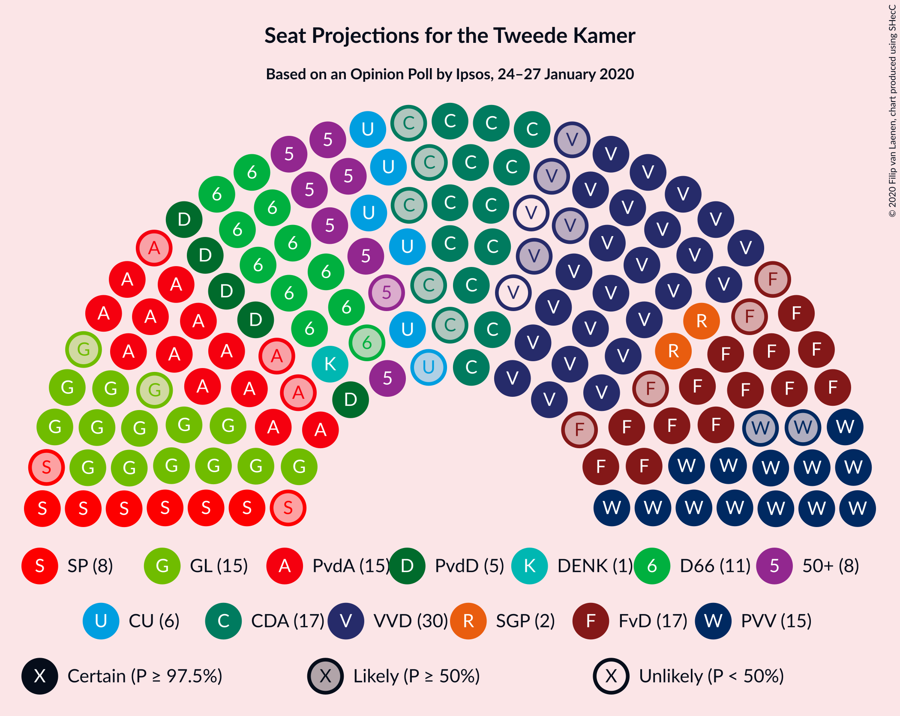
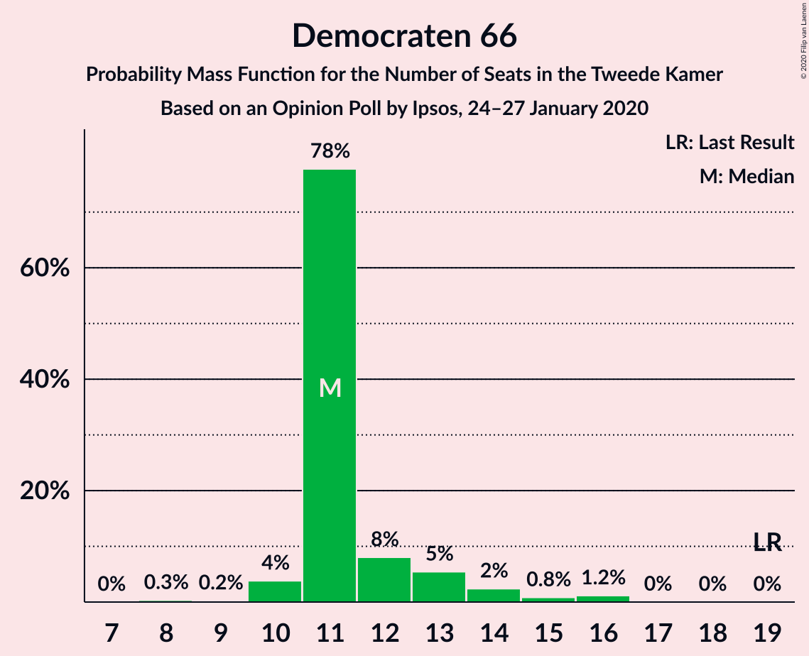
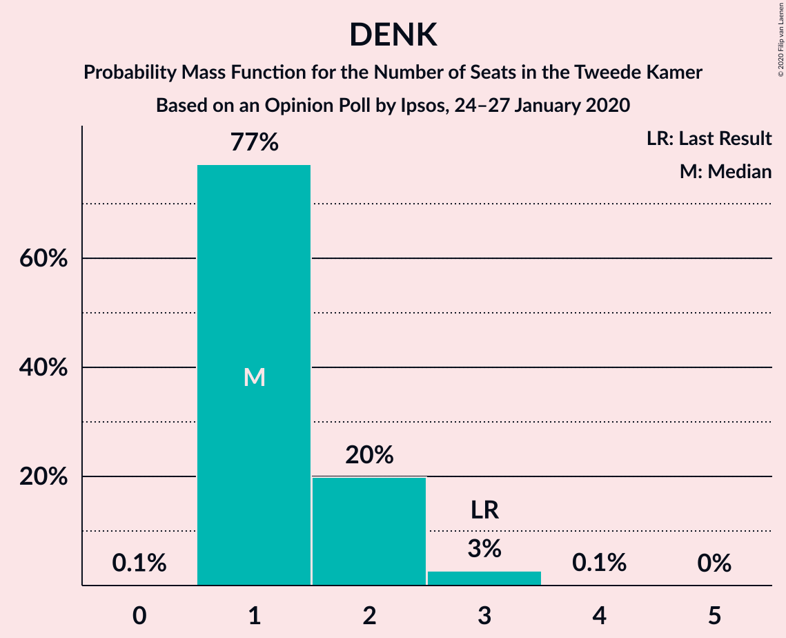
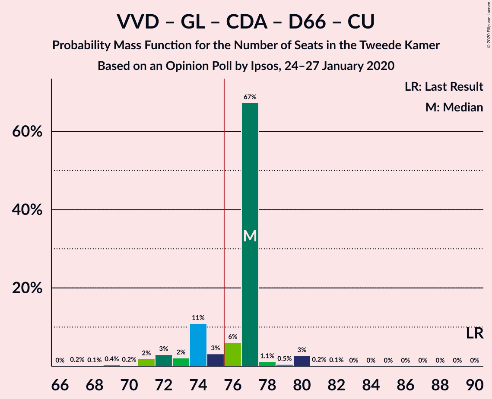
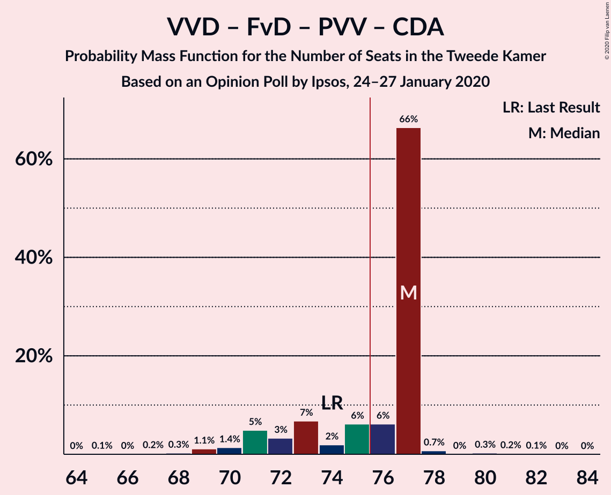
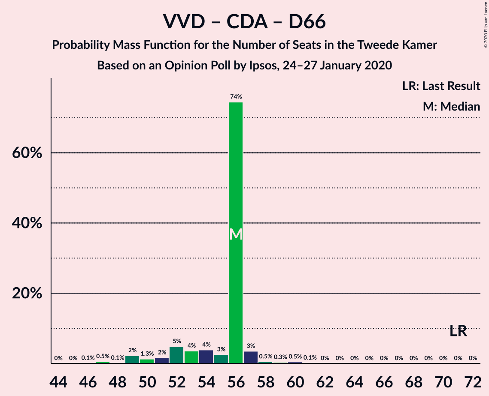

# Opinion Poll by Ipsos, 24–27 January 2020

<a href="#voting-intentions">Voting Intentions</a> | <a href="#seats">Seats</a> | <a href="#coalitions">Coalitions</a> | <a href="#technical-information">Technical Information</a>

## Voting Intentions

### Confidence Intervals

| Party | Last Result | Poll Result | 80% Confidence Interval | 90% Confidence Interval | 95% Confidence Interval | 99% Confidence Interval |
|:-----:|:-----------:|:-----------:|:-----------------------:|:-----------------------:|:-----------------------:|:-----------------------:|
| Volkspartij voor Vrijheid en Democratie | 21.3% | 18.1% | 16.6–19.7% |16.2–20.1% |15.9–20.5% |15.2–21.3% |
| Forum voor Democratie | 1.8% | 10.6% | 9.5–12.0% |9.2–12.3% |8.9–12.7% |8.4–13.3% |
| Partij voor de Vrijheid | 13.1% | 10.3% | 9.1–11.6% |8.8–11.9% |8.6–12.3% |8.1–12.9% |
| GroenLinks | 9.1% | 9.9% | 8.8–11.2% |8.5–11.5% |8.2–11.8% |7.7–12.5% |
| Partij van de Arbeid | 5.7% | 9.4% | 8.3–10.7% |8.0–11.0% |7.8–11.3% |7.3–12.0% |
| Christen-Democratisch Appèl | 12.4% | 9.2% | 8.2–10.5% |7.9–10.8% |7.6–11.1% |7.1–11.8% |
| Democraten 66 | 12.2% | 8.1% | 7.1–9.3% |6.8–9.6% |6.6–9.9% |6.1–10.5% |
| 50Plus | 3.1% | 6.1% | 5.2–7.1% |5.0–7.4% |4.8–7.7% |4.4–8.2% |
| Socialistische Partij | 9.1% | 5.5% | 4.7–6.5% |4.5–6.8% |4.3–7.1% |3.9–7.6% |
| Partij voor de Dieren | 3.2% | 4.3% | 3.6–5.2% |3.4–5.5% |3.2–5.7% |2.9–6.2% |
| ChristenUnie | 3.4% | 4.2% | 3.5–5.1% |3.3–5.3% |3.1–5.6% |2.8–6.0% |
| Staatkundig Gereformeerde Partij | 2.1% | 2.0% | 1.5–2.7% |1.4–2.9% |1.3–3.0% |1.1–3.4% |
| DENK | 2.1% | 1.3% | 1.0–1.9% |0.9–2.1% |0.8–2.2% |0.7–2.5% |

*Note:* The poll result column reflects the actual value used in the calculations. Published results may vary slightly, and in addition be rounded to fewer digits.

## Seats

### Confidence Intervals

| Party | Last Result | Median | 80% Confidence Interval | 90% Confidence Interval | 95% Confidence Interval | 99% Confidence Interval |
|:-----:|:-----------:|:------:|:-----------------------:|:-----------------------:|:-----------------------:|:-----------------------:|
| <a href="#volkspartij-voor-vrijheid-en-democratie">Volkspartij voor Vrijheid en Democratie</a> | 33 | 30 | 24–30 |24–30 |24–30 |24–30 |
| <a href="#forum-voor-democratie">Forum voor Democratie</a> | 2 | 18 | 18 |18 |14–18 |13–18 |
| <a href="#partij-voor-de-vrijheid">Partij voor de Vrijheid</a> | 20 | 13 | 13–19 |13–19 |13–19 |12–20 |
| <a href="#groenlinks">GroenLinks</a> | 14 | 18 | 16–18 |16–18 |15–18 |14–18 |
| <a href="#partij-van-de-arbeid">Partij van de Arbeid</a> | 9 | 13 | 13–14 |13–14 |13–14 |11–17 |
| <a href="#christen-democratisch-appèl">Christen-Democratisch Appèl</a> | 19 | 12 | 12 |12 |12–15 |12–18 |
| <a href="#democraten-66">Democraten 66</a> | 19 | 11 | 11 |11 |11–13 |11–15 |
| <a href="#50plus">50Plus</a> | 4 | 8 | 8–9 |8–9 |8–10 |8–13 |
| <a href="#socialistische-partij">Socialistische Partij</a> | 14 | 9 | 9–10 |9–10 |7–10 |7–10 |
| <a href="#partij-voor-de-dieren">Partij voor de Dieren</a> | 5 | 7 | 7 |7 |6–7 |5–8 |
| <a href="#christenunie">ChristenUnie</a> | 5 | 5 | 4–5 |4–5 |4–7 |4–8 |
| <a href="#staatkundig-gereformeerde-partij">Staatkundig Gereformeerde Partij</a> | 3 | 3 | 3 |3 |3 |2–3 |
| <a href="#denk">DENK</a> | 3 | 2 | 1–2 |1–2 |1–2 |1–3 |

### Volkspartij voor Vrijheid en Democratie

*For a full overview of the results for this party, see the [Volkspartij voor Vrijheid en Democratie](party-volkspartijvoorvrijheidendemocratie.html) page.*

| Number of Seats | Probability | Accumulated | Special Marks |
|:---------------:|:-----------:|:-----------:|:-------------:|
| 23 | 0% | 100% |  |
| 24 | 14% | 99.9% |  |
| 25 | 0% | 86% |  |
| 26 | 0.1% | 86% |  |
| 27 | 2% | 86% |  |
| 28 | 2% | 84% |  |
| 29 | 0% | 82% |  |
| 30 | 82% | 82% | Median |
| 31 | 0% | 0% |  |
| 32 | 0% | 0% |  |
| 33 | 0% | 0% | Last Result |

### Forum voor Democratie

*For a full overview of the results for this party, see the [Forum voor Democratie](party-forumvoordemocratie.html) page.*

| Number of Seats | Probability | Accumulated | Special Marks |
|:---------------:|:-----------:|:-----------:|:-------------:|
| 2 | 0% | 100% | Last Result |
| 3 | 0% | 100% |  |
| 4 | 0% | 100% |  |
| 5 | 0% | 100% |  |
| 6 | 0% | 100% |  |
| 7 | 0% | 100% |  |
| 8 | 0% | 100% |  |
| 9 | 0% | 100% |  |
| 10 | 0% | 100% |  |
| 11 | 0% | 100% |  |
| 12 | 0% | 100% |  |
| 13 | 1.4% | 100% |  |
| 14 | 3% | 98.6% |  |
| 15 | 0.1% | 95% |  |
| 16 | 0.1% | 95% |  |
| 17 | 0.1% | 95% |  |
| 18 | 95% | 95% | Median |
| 19 | 0% | 0% |  |

### Partij voor de Vrijheid

*For a full overview of the results for this party, see the [Partij voor de Vrijheid](party-partijvoordevrijheid.html) page.*

| Number of Seats | Probability | Accumulated | Special Marks |
|:---------------:|:-----------:|:-----------:|:-------------:|
| 12 | 0.9% | 100% |  |
| 13 | 82% | 99.1% | Median |
| 14 | 0.2% | 18% |  |
| 15 | 1.0% | 17% |  |
| 16 | 0% | 16% |  |
| 17 | 0.4% | 16% |  |
| 18 | 0% | 16% |  |
| 19 | 15% | 16% |  |
| 20 | 0.5% | 0.5% | Last Result |
| 21 | 0% | 0% |  |

### GroenLinks

*For a full overview of the results for this party, see the [GroenLinks](party-groenlinks.html) page.*

| Number of Seats | Probability | Accumulated | Special Marks |
|:---------------:|:-----------:|:-----------:|:-------------:|
| 12 | 0.1% | 100% |  |
| 13 | 0% | 99.9% |  |
| 14 | 2% | 99.9% | Last Result |
| 15 | 2% | 98% |  |
| 16 | 14% | 95% |  |
| 17 | 0.1% | 82% |  |
| 18 | 82% | 82% | Median |
| 19 | 0% | 0% |  |

### Partij van de Arbeid

*For a full overview of the results for this party, see the [Partij van de Arbeid](party-partijvandearbeid.html) page.*

| Number of Seats | Probability | Accumulated | Special Marks |
|:---------------:|:-----------:|:-----------:|:-------------:|
| 9 | 0% | 100% | Last Result |
| 10 | 0% | 100% |  |
| 11 | 2% | 100% |  |
| 12 | 0.1% | 98% |  |
| 13 | 82% | 98% | Median |
| 14 | 15% | 16% |  |
| 15 | 0.4% | 1.4% |  |
| 16 | 0% | 1.0% |  |
| 17 | 1.0% | 1.0% |  |
| 18 | 0% | 0% |  |

### Christen-Democratisch Appèl

*For a full overview of the results for this party, see the [Christen-Democratisch Appèl](party-christen-democratischappèl.html) page.*

| Number of Seats | Probability | Accumulated | Special Marks |
|:---------------:|:-----------:|:-----------:|:-------------:|
| 11 | 0.1% | 100% |  |
| 12 | 95% | 99.9% | Median |
| 13 | 0.5% | 5% |  |
| 14 | 1.2% | 4% |  |
| 15 | 1.0% | 3% |  |
| 16 | 0% | 2% |  |
| 17 | 0% | 2% |  |
| 18 | 2% | 2% |  |
| 19 | 0% | 0% | Last Result |

### Democraten 66

*For a full overview of the results for this party, see the [Democraten 66](party-democraten66.html) page.*

| Number of Seats | Probability | Accumulated | Special Marks |
|:---------------:|:-----------:|:-----------:|:-------------:|
| 11 | 96% | 100% | Median |
| 12 | 0.3% | 4% |  |
| 13 | 2% | 3% |  |
| 14 | 0% | 1.0% |  |
| 15 | 0.9% | 1.0% |  |
| 16 | 0% | 0% |  |
| 17 | 0% | 0% |  |
| 18 | 0% | 0% |  |
| 19 | 0% | 0% | Last Result |

### 50Plus

*For a full overview of the results for this party, see the [50Plus](party-50plus.html) page.*

| Number of Seats | Probability | Accumulated | Special Marks |
|:---------------:|:-----------:|:-----------:|:-------------:|
| 4 | 0% | 100% | Last Result |
| 5 | 0% | 100% |  |
| 6 | 0% | 100% |  |
| 7 | 0% | 100% |  |
| 8 | 84% | 99.9% | Median |
| 9 | 13% | 16% |  |
| 10 | 1.4% | 3% |  |
| 11 | 0.5% | 1.5% |  |
| 12 | 0% | 1.0% |  |
| 13 | 0.9% | 0.9% |  |
| 14 | 0% | 0% |  |

### Socialistische Partij

*For a full overview of the results for this party, see the [Socialistische Partij](party-socialistischepartij.html) page.*

| Number of Seats | Probability | Accumulated | Special Marks |
|:---------------:|:-----------:|:-----------:|:-------------:|
| 5 | 0.1% | 100% |  |
| 6 | 0% | 99.9% |  |
| 7 | 3% | 99.9% |  |
| 8 | 1.1% | 97% |  |
| 9 | 83% | 96% | Median |
| 10 | 13% | 13% |  |
| 11 | 0.1% | 0.1% |  |
| 12 | 0% | 0% |  |
| 13 | 0% | 0% |  |
| 14 | 0% | 0% | Last Result |

### Partij voor de Dieren

*For a full overview of the results for this party, see the [Partij voor de Dieren](party-partijvoordedieren.html) page.*

| Number of Seats | Probability | Accumulated | Special Marks |
|:---------------:|:-----------:|:-----------:|:-------------:|
| 5 | 2% | 100% | Last Result |
| 6 | 1.4% | 98% |  |
| 7 | 96% | 96% | Median |
| 8 | 0.7% | 0.7% |  |
| 9 | 0% | 0% |  |

### ChristenUnie

*For a full overview of the results for this party, see the [ChristenUnie](party-christenunie.html) page.*

| Number of Seats | Probability | Accumulated | Special Marks |
|:---------------:|:-----------:|:-----------:|:-------------:|
| 4 | 14% | 100% |  |
| 5 | 83% | 86% | Last Result, Median |
| 6 | 0.1% | 3% |  |
| 7 | 2% | 3% |  |
| 8 | 0.9% | 1.0% |  |
| 9 | 0% | 0% |  |

### Staatkundig Gereformeerde Partij

*For a full overview of the results for this party, see the [Staatkundig Gereformeerde Partij](party-staatkundiggereformeerdepartij.html) page.*

| Number of Seats | Probability | Accumulated | Special Marks |
|:---------------:|:-----------:|:-----------:|:-------------:|
| 1 | 0.3% | 100% |  |
| 2 | 2% | 99.7% |  |
| 3 | 98% | 98% | Last Result, Median |
| 4 | 0.1% | 0.2% |  |
| 5 | 0.1% | 0.1% |  |
| 6 | 0% | 0% |  |

### DENK

*For a full overview of the results for this party, see the [DENK](party-denk.html) page.*

| Number of Seats | Probability | Accumulated | Special Marks |
|:---------------:|:-----------:|:-----------:|:-------------:|
| 0 | 0.3% | 100% |  |
| 1 | 16% | 99.7% |  |
| 2 | 82% | 84% | Median |
| 3 | 2% | 2% | Last Result |
| 4 | 0% | 0% |  |

## Coalitions

### Confidence Intervals

| Coalition | Last Result | Median | Majority? | 80% Confidence Interval | 90% Confidence Interval | 95% Confidence Interval | 99% Confidence Interval |
|:---------:|:-----------:|:------:|:---------:|:-----------------------:|:-----------------------:|:-----------------------:|:-----------------------:|
| Volkspartij voor Vrijheid en Democratie – GroenLinks – Christen-Democratisch Appèl – Democraten 66 – ChristenUnie | 90 | 76 | 85% | 67–76 | 67–76 | 67–79 | 67–80 |
| Volkspartij voor Vrijheid en Democratie – Forum voor Democratie – Partij voor de Vrijheid – Christen-Democratisch Appèl – Staatkundig Gereformeerde Partij | 77 | 76 | 97% | 76 | 76 | 74–78 | 69–81 |
| Volkspartij voor Vrijheid en Democratie – Forum voor Democratie – Partij voor de Vrijheid – Christen-Democratisch Appèl | 74 | 73 | 3% | 73 | 73 | 72–76 | 67–78 |
| Volkspartij voor Vrijheid en Democratie – Partij van de Arbeid – Christen-Democratisch Appèl – Democraten 66 – ChristenUnie | 85 | 71 | 3% | 65–71 | 65–71 | 65–76 | 65–79 |
| GroenLinks – Partij van de Arbeid – Christen-Democratisch Appèl – Democraten 66 – Socialistische Partij – ChristenUnie | 80 | 68 | 0% | 67–68 | 67–68 | 67–71 | 66–74 |
| Volkspartij voor Vrijheid en Democratie – Forum voor Democratie – Christen-Democratisch Appèl – 50Plus – Staatkundig Gereformeerde Partij | 61 | 71 | 0% | 66–71 | 66–71 | 66–71 | 64–72 |
| Volkspartij voor Vrijheid en Democratie – Forum voor Democratie – Christen-Democratisch Appèl – 50Plus | 58 | 68 | 0% | 63–68 | 63–68 | 63–68 | 61–70 |
| Volkspartij voor Vrijheid en Democratie – Christen-Democratisch Appèl – Democraten 66 – ChristenUnie | 76 | 58 | 0% | 51–58 | 51–58 | 51–65 | 51–65 |
| GroenLinks – Partij van de Arbeid – Christen-Democratisch Appèl – Democraten 66 – ChristenUnie | 66 | 59 | 0% | 57–59 | 57–59 | 57–64 | 57–65 |
| Volkspartij voor Vrijheid en Democratie – Forum voor Democratie – Christen-Democratisch Appèl – Staatkundig Gereformeerde Partij | 57 | 63 | 0% | 57–63 | 57–63 | 57–63 | 53–63 |
| Volkspartij voor Vrijheid en Democratie – Forum voor Democratie – Christen-Democratisch Appèl | 54 | 60 | 0% | 54–60 | 54–60 | 54–60 | 50–60 |
| Volkspartij voor Vrijheid en Democratie – Partij voor de Vrijheid – Christen-Democratisch Appèl | 72 | 55 | 0% | 55 | 55 | 55–59 | 54–64 |
| Volkspartij voor Vrijheid en Democratie – Christen-Democratisch Appèl – Democraten 66 | 71 | 53 | 0% | 47–53 | 47–53 | 47–57 | 47–58 |
| Volkspartij voor Vrijheid en Democratie – Partij van de Arbeid – Christen-Democratisch Appèl | 61 | 55 | 0% | 50–55 | 50–55 | 50–56 | 50–60 |
| Volkspartij voor Vrijheid en Democratie – Partij van de Arbeid – Democraten 66 | 61 | 54 | 0% | 49–54 | 49–54 | 49–54 | 49–57 |
| Volkspartij voor Vrijheid en Democratie – Partij van de Arbeid | 42 | 43 | 0% | 38–43 | 38–43 | 38–43 | 38–45 |
| Volkspartij voor Vrijheid en Democratie – Christen-Democratisch Appèl | 52 | 42 | 0% | 36–42 | 36–42 | 36–43 | 36–45 |
| Partij van de Arbeid – Christen-Democratisch Appèl – Democraten 66 | 47 | 36 | 0% | 36–37 | 36–38 | 36–42 | 36–43 |
| Partij van de Arbeid – Christen-Democratisch Appèl – ChristenUnie | 33 | 30 | 0% | 30 | 30–32 | 30–36 | 30–36 |
| Partij van de Arbeid – Christen-Democratisch Appèl | 28 | 25 | 0% | 25–26 | 25–26 | 25–29 | 25–32 |
| Christen-Democratisch Appèl – Democraten 66 | 38 | 23 | 0% | 23 | 23–24 | 23–29 | 23–31 |

### Volkspartij voor Vrijheid en Democratie – GroenLinks – Christen-Democratisch Appèl – Democraten 66 – ChristenUnie

| Number of Seats | Probability | Accumulated | Special Marks |
|:---------------:|:-----------:|:-----------:|:-------------:|
| 67 | 14% | 100% |  |
| 68 | 0% | 86% |  |
| 69 | 0% | 86% |  |
| 70 | 0% | 86% |  |
| 71 | 0.1% | 86% |  |
| 72 | 0.9% | 86% |  |
| 73 | 0% | 85% |  |
| 74 | 0% | 85% |  |
| 75 | 0.3% | 85% |  |
| 76 | 82% | 85% | Median, Majority |
| 77 | 0% | 3% |  |
| 78 | 0.1% | 3% |  |
| 79 | 0.9% | 3% |  |
| 80 | 2% | 2% |  |
| 81 | 0% | 0.1% |  |
| 82 | 0% | 0% |  |
| 83 | 0% | 0% |  |
| 84 | 0% | 0% |  |
| 85 | 0% | 0% |  |
| 86 | 0% | 0% |  |
| 87 | 0% | 0% |  |
| 88 | 0% | 0% |  |
| 89 | 0% | 0% |  |
| 90 | 0% | 0% | Last Result |

### Volkspartij voor Vrijheid en Democratie – Forum voor Democratie – Partij voor de Vrijheid – Christen-Democratisch Appèl – Staatkundig Gereformeerde Partij

| Number of Seats | Probability | Accumulated | Special Marks |
|:---------------:|:-----------:|:-----------:|:-------------:|
| 69 | 0.9% | 100% |  |
| 70 | 0% | 99.1% |  |
| 71 | 0.1% | 99.1% |  |
| 72 | 0.1% | 99.0% |  |
| 73 | 0.5% | 99.0% |  |
| 74 | 1.0% | 98% |  |
| 75 | 0% | 97% |  |
| 76 | 95% | 97% | Median, Majority |
| 77 | 0.1% | 3% | Last Result |
| 78 | 0.3% | 3% |  |
| 79 | 0% | 2% |  |
| 80 | 0% | 2% |  |
| 81 | 2% | 2% |  |
| 82 | 0% | 0% |  |

### Volkspartij voor Vrijheid en Democratie – Forum voor Democratie – Partij voor de Vrijheid – Christen-Democratisch Appèl

| Number of Seats | Probability | Accumulated | Special Marks |
|:---------------:|:-----------:|:-----------:|:-------------:|
| 66 | 0.1% | 100% |  |
| 67 | 0.9% | 99.9% |  |
| 68 | 0.1% | 99.1% |  |
| 69 | 0% | 99.0% |  |
| 70 | 0.5% | 99.0% |  |
| 71 | 0% | 98% |  |
| 72 | 1.0% | 98% |  |
| 73 | 95% | 97% | Median |
| 74 | 0% | 3% | Last Result |
| 75 | 0% | 3% |  |
| 76 | 0.1% | 3% | Majority |
| 77 | 0.3% | 2% |  |
| 78 | 2% | 2% |  |
| 79 | 0% | 0% |  |

### Volkspartij voor Vrijheid en Democratie – Partij van de Arbeid – Christen-Democratisch Appèl – Democraten 66 – ChristenUnie

| Number of Seats | Probability | Accumulated | Special Marks |
|:---------------:|:-----------:|:-----------:|:-------------:|
| 65 | 13% | 100% |  |
| 66 | 0% | 87% |  |
| 67 | 0.5% | 87% |  |
| 68 | 0% | 86% |  |
| 69 | 0.1% | 86% |  |
| 70 | 0% | 86% |  |
| 71 | 82% | 86% | Median |
| 72 | 0.1% | 5% |  |
| 73 | 0% | 4% |  |
| 74 | 0.3% | 4% |  |
| 75 | 0.9% | 4% |  |
| 76 | 2% | 3% | Majority |
| 77 | 0% | 1.0% |  |
| 78 | 0.1% | 1.0% |  |
| 79 | 0.9% | 0.9% |  |
| 80 | 0% | 0% |  |
| 81 | 0% | 0% |  |
| 82 | 0% | 0% |  |
| 83 | 0% | 0% |  |
| 84 | 0% | 0% |  |
| 85 | 0% | 0% | Last Result |

### GroenLinks – Partij van de Arbeid – Christen-Democratisch Appèl – Democraten 66 – Socialistische Partij – ChristenUnie

| Number of Seats | Probability | Accumulated | Special Marks |
|:---------------:|:-----------:|:-----------:|:-------------:|
| 64 | 0% | 100% |  |
| 65 | 0% | 99.9% |  |
| 66 | 0.5% | 99.9% |  |
| 67 | 13% | 99.4% |  |
| 68 | 82% | 86% | Median |
| 69 | 1.2% | 5% |  |
| 70 | 0% | 3% |  |
| 71 | 2% | 3% |  |
| 72 | 0.1% | 1.1% |  |
| 73 | 0% | 0.9% |  |
| 74 | 0.9% | 0.9% |  |
| 75 | 0% | 0% |  |
| 76 | 0% | 0% | Majority |
| 77 | 0% | 0% |  |
| 78 | 0% | 0% |  |
| 79 | 0% | 0% |  |
| 80 | 0% | 0% | Last Result |

### Volkspartij voor Vrijheid en Democratie – Forum voor Democratie – Christen-Democratisch Appèl – 50Plus – Staatkundig Gereformeerde Partij

| Number of Seats | Probability | Accumulated | Special Marks |
|:---------------:|:-----------:|:-----------:|:-------------:|
| 61 | 0% | 100% | Last Result |
| 62 | 0% | 100% |  |
| 63 | 0% | 100% |  |
| 64 | 0.6% | 99.9% |  |
| 65 | 0% | 99.3% |  |
| 66 | 13% | 99.3% |  |
| 67 | 0.9% | 86% |  |
| 68 | 0% | 85% |  |
| 69 | 0% | 85% |  |
| 70 | 2% | 85% |  |
| 71 | 82% | 83% | Median |
| 72 | 0.9% | 1.1% |  |
| 73 | 0.1% | 0.2% |  |
| 74 | 0% | 0.1% |  |
| 75 | 0.1% | 0.1% |  |
| 76 | 0% | 0% | Majority |

### Volkspartij voor Vrijheid en Democratie – Forum voor Democratie – Christen-Democratisch Appèl – 50Plus

| Number of Seats | Probability | Accumulated | Special Marks |
|:---------------:|:-----------:|:-----------:|:-------------:|
| 58 | 0% | 100% | Last Result |
| 59 | 0.1% | 100% |  |
| 60 | 0% | 99.9% |  |
| 61 | 0.5% | 99.9% |  |
| 62 | 0% | 99.4% |  |
| 63 | 13% | 99.4% |  |
| 64 | 0% | 86% |  |
| 65 | 0.9% | 86% |  |
| 66 | 0% | 85% |  |
| 67 | 2% | 85% |  |
| 68 | 82% | 83% | Median |
| 69 | 0.1% | 1.4% |  |
| 70 | 1.2% | 1.3% |  |
| 71 | 0% | 0.1% |  |
| 72 | 0.1% | 0.1% |  |
| 73 | 0% | 0% |  |

### Volkspartij voor Vrijheid en Democratie – Christen-Democratisch Appèl – Democraten 66 – ChristenUnie

| Number of Seats | Probability | Accumulated | Special Marks |
|:---------------:|:-----------:|:-----------:|:-------------:|
| 51 | 13% | 100% |  |
| 52 | 0% | 87% |  |
| 53 | 0.5% | 87% |  |
| 54 | 0.1% | 86% |  |
| 55 | 0.1% | 86% |  |
| 56 | 0% | 86% |  |
| 57 | 0% | 86% |  |
| 58 | 83% | 86% | Median |
| 59 | 0.3% | 4% |  |
| 60 | 0.1% | 3% |  |
| 61 | 0% | 3% |  |
| 62 | 0% | 3% |  |
| 63 | 0% | 3% |  |
| 64 | 0% | 3% |  |
| 65 | 3% | 3% |  |
| 66 | 0% | 0.1% |  |
| 67 | 0% | 0% |  |
| 68 | 0% | 0% |  |
| 69 | 0% | 0% |  |
| 70 | 0% | 0% |  |
| 71 | 0% | 0% |  |
| 72 | 0% | 0% |  |
| 73 | 0% | 0% |  |
| 74 | 0% | 0% |  |
| 75 | 0% | 0% |  |
| 76 | 0% | 0% | Last Result, Majority |

### GroenLinks – Partij van de Arbeid – Christen-Democratisch Appèl – Democraten 66 – ChristenUnie

| Number of Seats | Probability | Accumulated | Special Marks |
|:---------------:|:-----------:|:-----------:|:-------------:|
| 57 | 14% | 100% |  |
| 58 | 0% | 86% |  |
| 59 | 82% | 86% | Median |
| 60 | 0% | 5% |  |
| 61 | 1.0% | 5% |  |
| 62 | 0.4% | 4% |  |
| 63 | 0% | 3% |  |
| 64 | 2% | 3% |  |
| 65 | 0.9% | 0.9% |  |
| 66 | 0% | 0% | Last Result |

### Volkspartij voor Vrijheid en Democratie – Forum voor Democratie – Christen-Democratisch Appèl – Staatkundig Gereformeerde Partij

| Number of Seats | Probability | Accumulated | Special Marks |
|:---------------:|:-----------:|:-----------:|:-------------:|
| 53 | 0.5% | 100% |  |
| 54 | 0.1% | 99.5% |  |
| 55 | 0.1% | 99.4% |  |
| 56 | 0.1% | 99.4% |  |
| 57 | 14% | 99.3% | Last Result |
| 58 | 0% | 85% |  |
| 59 | 0.9% | 85% |  |
| 60 | 0% | 84% |  |
| 61 | 0.3% | 84% |  |
| 62 | 2% | 84% |  |
| 63 | 82% | 82% | Median |
| 64 | 0% | 0.1% |  |
| 65 | 0% | 0.1% |  |
| 66 | 0% | 0% |  |

### Volkspartij voor Vrijheid en Democratie – Forum voor Democratie – Christen-Democratisch Appèl

| Number of Seats | Probability | Accumulated | Special Marks |
|:---------------:|:-----------:|:-----------:|:-------------:|
| 49 | 0.1% | 100% |  |
| 50 | 0.5% | 99.9% |  |
| 51 | 0% | 99.4% |  |
| 52 | 0% | 99.4% |  |
| 53 | 0% | 99.4% |  |
| 54 | 13% | 99.3% | Last Result |
| 55 | 0.9% | 86% |  |
| 56 | 0% | 85% |  |
| 57 | 1.0% | 85% |  |
| 58 | 0% | 84% |  |
| 59 | 2% | 84% |  |
| 60 | 82% | 82% | Median |
| 61 | 0% | 0.1% |  |
| 62 | 0% | 0.1% |  |
| 63 | 0% | 0% |  |

### Volkspartij voor Vrijheid en Democratie – Partij voor de Vrijheid – Christen-Democratisch Appèl

| Number of Seats | Probability | Accumulated | Special Marks |
|:---------------:|:-----------:|:-----------:|:-------------:|
| 52 | 0.2% | 100% |  |
| 53 | 0% | 99.8% |  |
| 54 | 0.9% | 99.8% |  |
| 55 | 95% | 99.0% | Median |
| 56 | 0% | 4% |  |
| 57 | 0.5% | 4% |  |
| 58 | 1.0% | 4% |  |
| 59 | 0.4% | 3% |  |
| 60 | 0% | 2% |  |
| 61 | 0% | 2% |  |
| 62 | 0% | 2% |  |
| 63 | 0% | 2% |  |
| 64 | 2% | 2% |  |
| 65 | 0% | 0% |  |
| 66 | 0% | 0% |  |
| 67 | 0% | 0% |  |
| 68 | 0% | 0% |  |
| 69 | 0% | 0% |  |
| 70 | 0% | 0% |  |
| 71 | 0% | 0% |  |
| 72 | 0% | 0% | Last Result |

### Volkspartij voor Vrijheid en Democratie – Christen-Democratisch Appèl – Democraten 66

| Number of Seats | Probability | Accumulated | Special Marks |
|:---------------:|:-----------:|:-----------:|:-------------:|
| 46 | 0.1% | 100% |  |
| 47 | 13% | 99.9% |  |
| 48 | 0.6% | 87% |  |
| 49 | 0% | 86% |  |
| 50 | 0% | 86% |  |
| 51 | 0% | 86% |  |
| 52 | 0% | 86% |  |
| 53 | 82% | 86% | Median |
| 54 | 1.2% | 4% |  |
| 55 | 0.1% | 3% |  |
| 56 | 0% | 3% |  |
| 57 | 0.9% | 3% |  |
| 58 | 2% | 2% |  |
| 59 | 0% | 0.1% |  |
| 60 | 0% | 0% |  |
| 61 | 0% | 0% |  |
| 62 | 0% | 0% |  |
| 63 | 0% | 0% |  |
| 64 | 0% | 0% |  |
| 65 | 0% | 0% |  |
| 66 | 0% | 0% |  |
| 67 | 0% | 0% |  |
| 68 | 0% | 0% |  |
| 69 | 0% | 0% |  |
| 70 | 0% | 0% |  |
| 71 | 0% | 0% | Last Result |

### Volkspartij voor Vrijheid en Democratie – Partij van de Arbeid – Christen-Democratisch Appèl

| Number of Seats | Probability | Accumulated | Special Marks |
|:---------------:|:-----------:|:-----------:|:-------------:|
| 50 | 13% | 100% |  |
| 51 | 0.5% | 87% |  |
| 52 | 0.1% | 86% |  |
| 53 | 0% | 86% |  |
| 54 | 0% | 86% |  |
| 55 | 82% | 86% | Median |
| 56 | 3% | 4% |  |
| 57 | 0.3% | 1.3% |  |
| 58 | 0% | 1.0% |  |
| 59 | 0% | 0.9% |  |
| 60 | 0.9% | 0.9% |  |
| 61 | 0% | 0% | Last Result |

### Volkspartij voor Vrijheid en Democratie – Partij van de Arbeid – Democraten 66

| Number of Seats | Probability | Accumulated | Special Marks |
|:---------------:|:-----------:|:-----------:|:-------------:|
| 49 | 14% | 100% |  |
| 50 | 0.1% | 86% |  |
| 51 | 2% | 86% |  |
| 52 | 0% | 84% |  |
| 53 | 0.1% | 84% |  |
| 54 | 82% | 84% | Median |
| 55 | 0.3% | 2% |  |
| 56 | 1.0% | 2% |  |
| 57 | 0.9% | 0.9% |  |
| 58 | 0% | 0% |  |
| 59 | 0% | 0% |  |
| 60 | 0% | 0% |  |
| 61 | 0% | 0% | Last Result |

### Volkspartij voor Vrijheid en Democratie – Partij van de Arbeid

| Number of Seats | Probability | Accumulated | Special Marks |
|:---------------:|:-----------:|:-----------:|:-------------:|
| 38 | 16% | 100% |  |
| 39 | 0.1% | 84% |  |
| 40 | 0.1% | 84% |  |
| 41 | 0.1% | 84% |  |
| 42 | 0.9% | 84% | Last Result |
| 43 | 82% | 83% | Median |
| 44 | 0% | 1.0% |  |
| 45 | 0.9% | 1.0% |  |
| 46 | 0% | 0% |  |

### Volkspartij voor Vrijheid en Democratie – Christen-Democratisch Appèl

| Number of Seats | Probability | Accumulated | Special Marks |
|:---------------:|:-----------:|:-----------:|:-------------:|
| 35 | 0.1% | 100% |  |
| 36 | 13% | 99.9% |  |
| 37 | 0.5% | 87% |  |
| 38 | 0% | 86% |  |
| 39 | 0% | 86% |  |
| 40 | 0% | 86% |  |
| 41 | 0.1% | 86% |  |
| 42 | 83% | 86% | Median |
| 43 | 0.9% | 3% |  |
| 44 | 0.1% | 2% |  |
| 45 | 2% | 2% |  |
| 46 | 0% | 0% |  |
| 47 | 0% | 0% |  |
| 48 | 0% | 0% |  |
| 49 | 0% | 0% |  |
| 50 | 0% | 0% |  |
| 51 | 0% | 0% |  |
| 52 | 0% | 0% | Last Result |

### Partij van de Arbeid – Christen-Democratisch Appèl – Democraten 66

| Number of Seats | Probability | Accumulated | Special Marks |
|:---------------:|:-----------:|:-----------:|:-------------:|
| 36 | 82% | 100% | Median |
| 37 | 13% | 18% |  |
| 38 | 0.5% | 5% |  |
| 39 | 0% | 5% |  |
| 40 | 0% | 5% |  |
| 41 | 0.4% | 5% |  |
| 42 | 2% | 4% |  |
| 43 | 2% | 2% |  |
| 44 | 0% | 0% |  |
| 45 | 0% | 0% |  |
| 46 | 0% | 0% |  |
| 47 | 0% | 0% | Last Result |

### Partij van de Arbeid – Christen-Democratisch Appèl – ChristenUnie

| Number of Seats | Probability | Accumulated | Special Marks |
|:---------------:|:-----------:|:-----------:|:-------------:|
| 30 | 95% | 100% | Median |
| 31 | 0% | 5% |  |
| 32 | 0.5% | 5% |  |
| 33 | 0.1% | 5% | Last Result |
| 34 | 0.4% | 5% |  |
| 35 | 0.1% | 4% |  |
| 36 | 4% | 4% |  |
| 37 | 0% | 0% |  |

### Partij van de Arbeid – Christen-Democratisch Appèl

| Number of Seats | Probability | Accumulated | Special Marks |
|:---------------:|:-----------:|:-----------:|:-------------:|
| 24 | 0% | 100% |  |
| 25 | 82% | 99.9% | Median |
| 26 | 13% | 18% |  |
| 27 | 0.5% | 5% |  |
| 28 | 0.9% | 4% | Last Result |
| 29 | 3% | 4% |  |
| 30 | 0.1% | 1.0% |  |
| 31 | 0% | 0.9% |  |
| 32 | 0.9% | 0.9% |  |
| 33 | 0% | 0% |  |

### Christen-Democratisch Appèl – Democraten 66

| Number of Seats | Probability | Accumulated | Special Marks |
|:---------------:|:-----------:|:-----------:|:-------------:|
| 22 | 0.1% | 100% |  |
| 23 | 95% | 99.9% | Median |
| 24 | 0.6% | 5% |  |
| 25 | 0.1% | 5% |  |
| 26 | 1.2% | 4% |  |
| 27 | 0% | 3% |  |
| 28 | 0% | 3% |  |
| 29 | 1.0% | 3% |  |
| 30 | 0.1% | 2% |  |
| 31 | 2% | 2% |  |
| 32 | 0% | 0% |  |
| 33 | 0% | 0% |  |
| 34 | 0% | 0% |  |
| 35 | 0% | 0% |  |
| 36 | 0% | 0% |  |
| 37 | 0% | 0% |  |
| 38 | 0% | 0% | Last Result |

## Technical Information

### Opinion Poll

+ **Polling firm:** Ipsos
+ **Commissioner(s):** —
+ **Fieldwork period:** 24–27 January 2020

### Calculations

+ **Sample size:** 1052
+ **Simulations done:** 16,384
+ **Error estimate:** 4.07%

