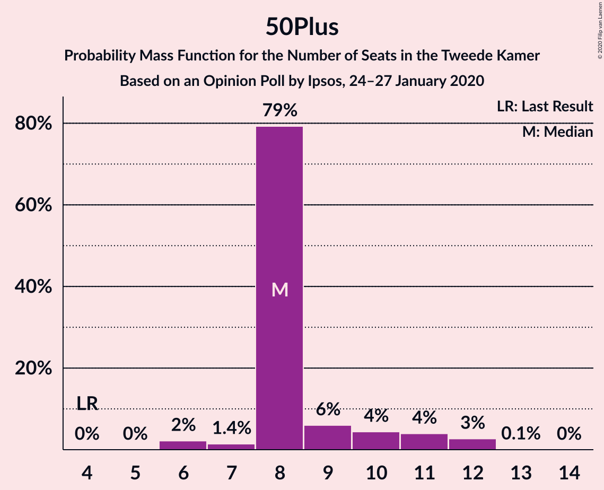
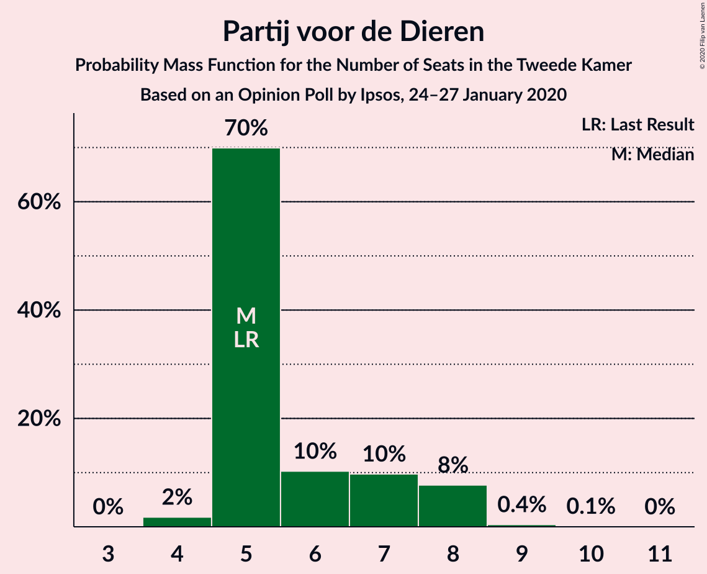
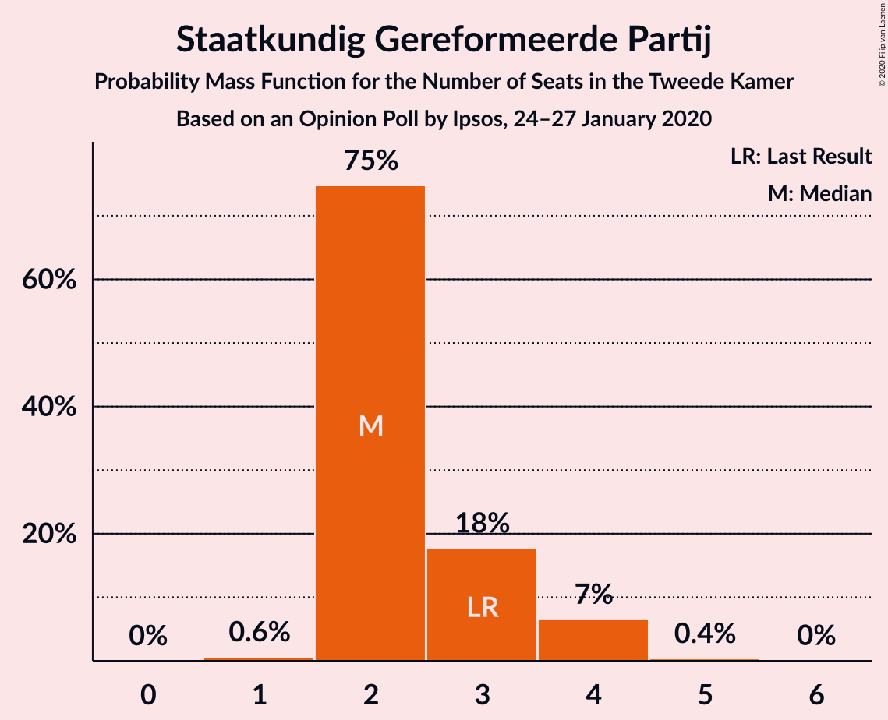
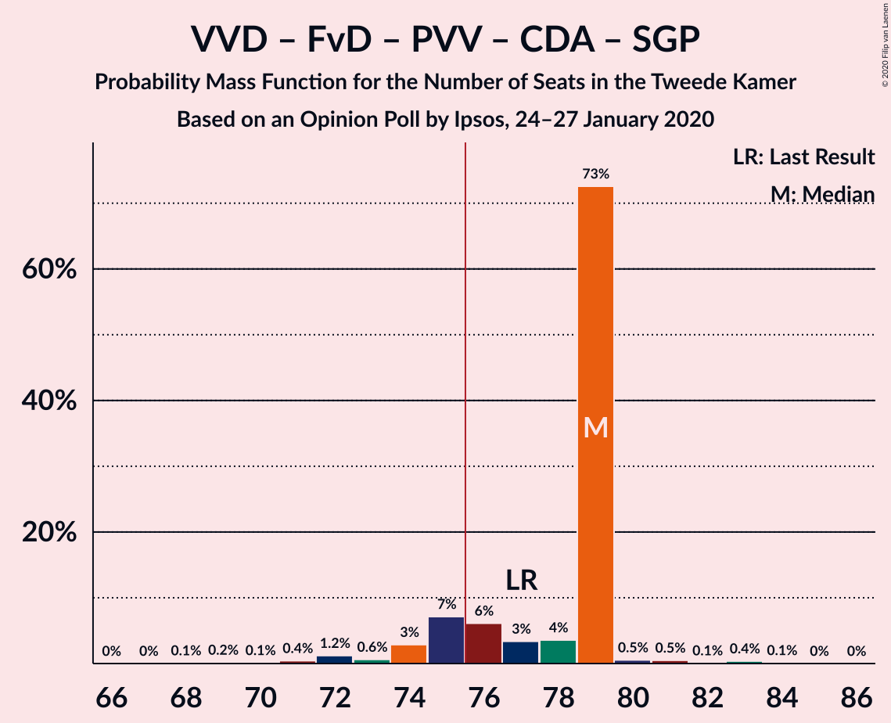
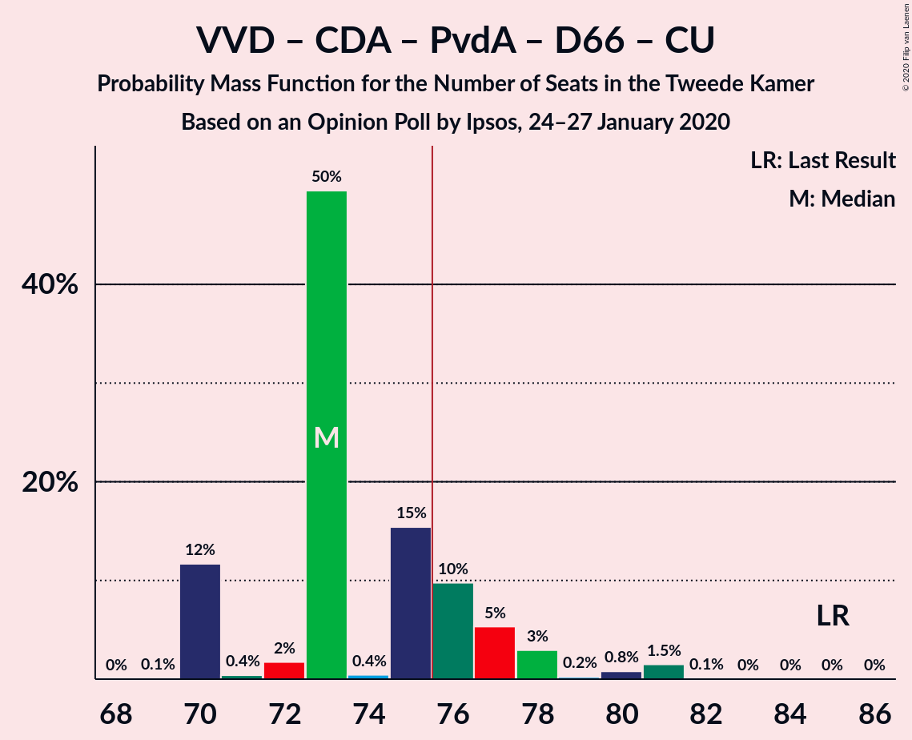
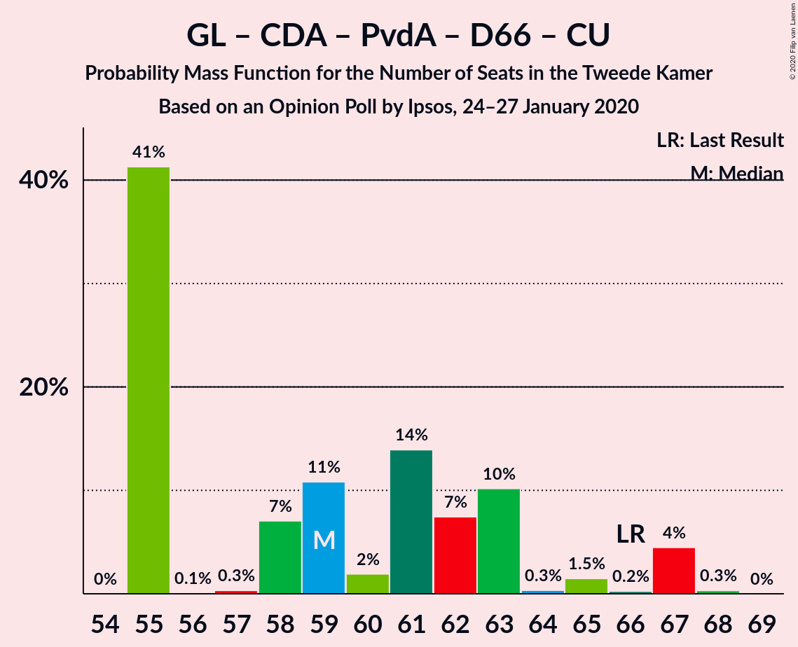
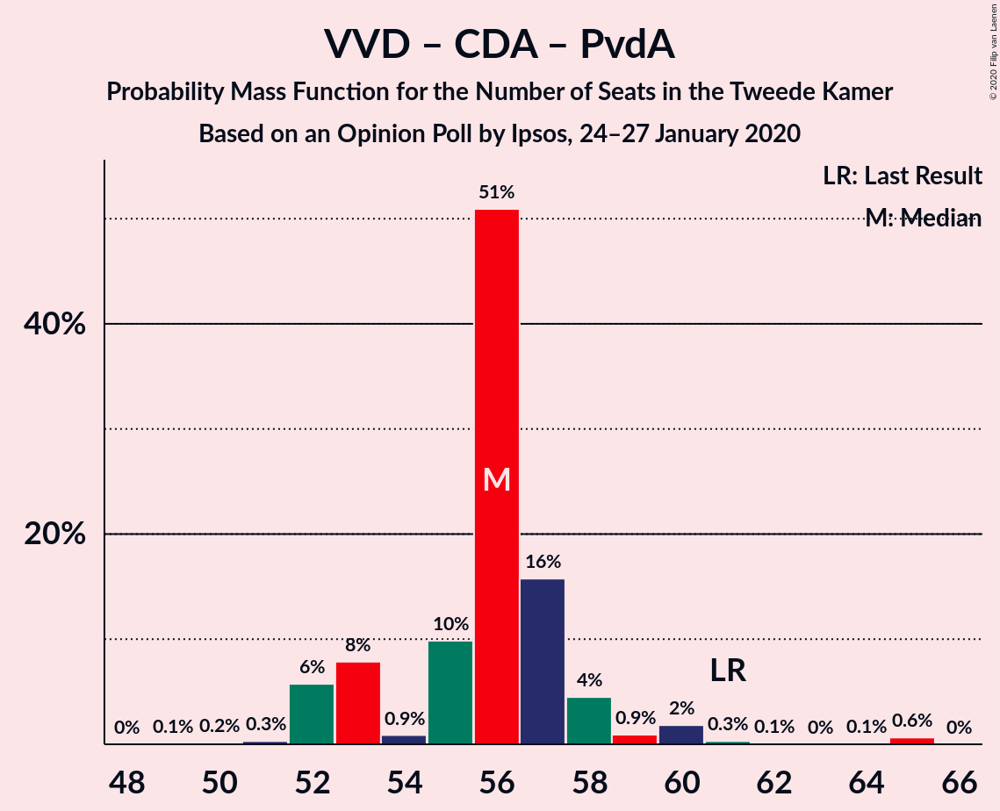

# Opinion Poll by Ipsos, 24–27 January 2020

<a href="#voting-intentions">Voting Intentions</a> | <a href="#seats">Seats</a> | <a href="#coalitions">Coalitions</a> | <a href="#technical-information">Technical Information</a>

## Voting Intentions

### Confidence Intervals

| Party | Last Result | Poll Result | 80% Confidence Interval | 90% Confidence Interval | 95% Confidence Interval | 99% Confidence Interval |
|:-----:|:-----------:|:-----------:|:-----------------------:|:-----------------------:|:-----------------------:|:-----------------------:|
| Volkspartij voor Vrijheid en Democratie | 21.3% | 18.7% | 17.2–20.3% |16.8–20.8% |16.4–21.2% |15.8–22.0% |
| Partij voor de Vrijheid | 13.1% | 10.7% | 9.6–12.0% |9.3–12.4% |9.0–12.7% |8.5–13.4% |
| Forum voor Democratie | 1.8% | 10.7% | 9.6–12.0% |9.3–12.4% |9.0–12.7% |8.5–13.4% |
| GroenLinks | 9.1% | 10.0% | 8.9–11.2% |8.6–11.6% |8.3–11.9% |7.8–12.6% |
| Christen-Democratisch Appèl | 12.4% | 9.3% | 8.2–10.5% |7.9–10.9% |7.7–11.2% |7.2–11.8% |
| Partij van de Arbeid | 5.7% | 9.3% | 8.2–10.5% |7.9–10.9% |7.7–11.2% |7.2–11.8% |
| Democraten 66 | 12.2% | 8.7% | 7.7–10.0% |7.4–10.3% |7.2–10.6% |6.7–11.2% |
| 50Plus | 3.1% | 6.0% | 5.1–7.0% |4.9–7.3% |4.7–7.6% |4.3–8.1% |
| Socialistische Partij | 9.1% | 5.3% | 4.5–6.3% |4.3–6.6% |4.1–6.8% |3.8–7.3% |
| ChristenUnie | 3.4% | 4.0% | 3.3–4.9% |3.1–5.1% |3.0–5.3% |2.7–5.8% |
| Partij voor de Dieren | 3.2% | 4.0% | 3.3–4.9% |3.1–5.1% |3.0–5.3% |2.7–5.8% |
| Staatkundig Gereformeerde Partij | 2.1% | 2.0% | 1.5–2.7% |1.4–2.9% |1.3–3.0% |1.1–3.4% |
| DENK | 2.1% | 1.3% | 1.0–1.9% |0.9–2.1% |0.8–2.2% |0.7–2.5% |

*Note:* The poll result column reflects the actual value used in the calculations. Published results may vary slightly, and in addition be rounded to fewer digits.

## Seats

### Confidence Intervals

| Party | Last Result | Median | 80% Confidence Interval | 90% Confidence Interval | 95% Confidence Interval | 99% Confidence Interval |
|:-----:|:-----------:|:------:|:-----------------------:|:-----------------------:|:-----------------------:|:-----------------------:|
| <a href="#volkspartij-voor-vrijheid-en-democratie">Volkspartij voor Vrijheid en Democratie</a> | 33 | 29 | 26–29 |26–29 |26–29 |24–31 |
| <a href="#partij-voor-de-vrijheid">Partij voor de Vrijheid</a> | 20 | 16 | 16–17 |16–17 |16–17 |15–19 |
| <a href="#forum-voor-democratie">Forum voor Democratie</a> | 2 | 14 | 14–17 |14–17 |14–17 |14–19 |
| <a href="#groenlinks">GroenLinks</a> | 14 | 15 | 12–16 |12–16 |12–16 |12–17 |
| <a href="#christen-democratisch-appèl">Christen-Democratisch Appèl</a> | 19 | 14 | 11–15 |11–15 |11–15 |11–16 |
| <a href="#partij-van-de-arbeid">Partij van de Arbeid</a> | 9 | 14 | 14–18 |14–18 |14–18 |12–18 |
| <a href="#democraten-66">Democraten 66</a> | 19 | 10 | 10–15 |10–15 |10–15 |10–17 |
| <a href="#50plus">50Plus</a> | 4 | 9 | 8–11 |8–11 |8–11 |8–12 |
| <a href="#socialistische-partij">Socialistische Partij</a> | 14 | 9 | 6–9 |6–9 |6–9 |6–9 |
| <a href="#christenunie">ChristenUnie</a> | 5 | 8 | 5–8 |5–8 |5–8 |4–8 |
| <a href="#partij-voor-de-dieren">Partij voor de Dieren</a> | 5 | 7 | 6–8 |6–8 |6–8 |4–8 |
| <a href="#staatkundig-gereformeerde-partij">Staatkundig Gereformeerde Partij</a> | 3 | 4 | 2–4 |2–4 |2–4 |2–4 |
| <a href="#denk">DENK</a> | 3 | 1 | 1–2 |1–2 |1–2 |1–3 |

### Volkspartij voor Vrijheid en Democratie

*For a full overview of the results for this party, see the [Volkspartij voor Vrijheid en Democratie](party-volkspartijvoorvrijheidendemocratie.html) page.*

| Number of Seats | Probability | Accumulated | Special Marks |
|:---------------:|:-----------:|:-----------:|:-------------:|
| 23 | 0.1% | 100% |  |
| 24 | 0.4% | 99.9% |  |
| 25 | 0.2% | 99.5% |  |
| 26 | 29% | 99.3% |  |
| 27 | 18% | 70% |  |
| 28 | 0.7% | 52% |  |
| 29 | 50% | 51% | Median |
| 30 | 0.2% | 0.7% |  |
| 31 | 0.4% | 0.5% |  |
| 32 | 0% | 0.1% |  |
| 33 | 0% | 0.1% | Last Result |
| 34 | 0% | 0% |  |

### Partij voor de Vrijheid

*For a full overview of the results for this party, see the [Partij voor de Vrijheid](party-partijvoordevrijheid.html) page.*

| Number of Seats | Probability | Accumulated | Special Marks |
|:---------------:|:-----------:|:-----------:|:-------------:|
| 13 | 0.2% | 100% |  |
| 14 | 0.2% | 99.8% |  |
| 15 | 1.4% | 99.6% |  |
| 16 | 79% | 98% | Median |
| 17 | 19% | 20% |  |
| 18 | 0.3% | 0.9% |  |
| 19 | 0.6% | 0.7% |  |
| 20 | 0% | 0.1% | Last Result |
| 21 | 0% | 0% |  |

### Forum voor Democratie

*For a full overview of the results for this party, see the [Forum voor Democratie](party-forumvoordemocratie.html) page.*

| Number of Seats | Probability | Accumulated | Special Marks |
|:---------------:|:-----------:|:-----------:|:-------------:|
| 2 | 0% | 100% | Last Result |
| 3 | 0% | 100% |  |
| 4 | 0% | 100% |  |
| 5 | 0% | 100% |  |
| 6 | 0% | 100% |  |
| 7 | 0% | 100% |  |
| 8 | 0% | 100% |  |
| 9 | 0% | 100% |  |
| 10 | 0% | 100% |  |
| 11 | 0% | 100% |  |
| 12 | 0% | 100% |  |
| 13 | 0.2% | 100% |  |
| 14 | 50% | 99.8% | Median |
| 15 | 0.5% | 50% |  |
| 16 | 0.6% | 49% |  |
| 17 | 47% | 48% |  |
| 18 | 0.7% | 1.2% |  |
| 19 | 0.4% | 0.5% |  |
| 20 | 0.1% | 0.1% |  |
| 21 | 0% | 0% |  |

### GroenLinks

*For a full overview of the results for this party, see the [GroenLinks](party-groenlinks.html) page.*

| Number of Seats | Probability | Accumulated | Special Marks |
|:---------------:|:-----------:|:-----------:|:-------------:|
| 11 | 0.3% | 100% |  |
| 12 | 18% | 99.7% |  |
| 13 | 0.3% | 81% |  |
| 14 | 0.5% | 81% | Last Result |
| 15 | 51% | 80% | Median |
| 16 | 29% | 29% |  |
| 17 | 0.5% | 0.8% |  |
| 18 | 0.2% | 0.3% |  |
| 19 | 0% | 0.1% |  |
| 20 | 0% | 0% |  |

### Christen-Democratisch Appèl

*For a full overview of the results for this party, see the [Christen-Democratisch Appèl](party-christen-democratischappèl.html) page.*

| Number of Seats | Probability | Accumulated | Special Marks |
|:---------------:|:-----------:|:-----------:|:-------------:|
| 11 | 29% | 100% |  |
| 12 | 1.2% | 71% |  |
| 13 | 0.2% | 70% |  |
| 14 | 51% | 70% | Median |
| 15 | 19% | 19% |  |
| 16 | 0.5% | 0.6% |  |
| 17 | 0.1% | 0.1% |  |
| 18 | 0% | 0% |  |
| 19 | 0% | 0% | Last Result |

### Partij van de Arbeid

*For a full overview of the results for this party, see the [Partij van de Arbeid](party-partijvandearbeid.html) page.*

| Number of Seats | Probability | Accumulated | Special Marks |
|:---------------:|:-----------:|:-----------:|:-------------:|
| 9 | 0.2% | 100% | Last Result |
| 10 | 0% | 99.8% |  |
| 11 | 0.1% | 99.7% |  |
| 12 | 0.3% | 99.6% |  |
| 13 | 0.5% | 99.4% |  |
| 14 | 70% | 98.9% | Median |
| 15 | 0.2% | 29% |  |
| 16 | 0.4% | 29% |  |
| 17 | 0.2% | 29% |  |
| 18 | 28% | 28% |  |
| 19 | 0% | 0% |  |

### Democraten 66

*For a full overview of the results for this party, see the [Democraten 66](party-democraten66.html) page.*

| Number of Seats | Probability | Accumulated | Special Marks |
|:---------------:|:-----------:|:-----------:|:-------------:|
| 10 | 51% | 100% | Median |
| 11 | 0.2% | 49% |  |
| 12 | 0.4% | 49% |  |
| 13 | 29% | 49% |  |
| 14 | 0.4% | 20% |  |
| 15 | 19% | 19% |  |
| 16 | 0.1% | 0.7% |  |
| 17 | 0.4% | 0.6% |  |
| 18 | 0% | 0.2% |  |
| 19 | 0.2% | 0.2% | Last Result |
| 20 | 0% | 0% |  |

### 50Plus

*For a full overview of the results for this party, see the [50Plus](party-50plus.html) page.*

| Number of Seats | Probability | Accumulated | Special Marks |
|:---------------:|:-----------:|:-----------:|:-------------:|
| 4 | 0% | 100% | Last Result |
| 5 | 0% | 100% |  |
| 6 | 0.1% | 100% |  |
| 7 | 0.3% | 99.9% |  |
| 8 | 19% | 99.6% |  |
| 9 | 51% | 80% | Median |
| 10 | 0.3% | 30% |  |
| 11 | 28% | 29% |  |
| 12 | 0.9% | 0.9% |  |
| 13 | 0% | 0% |  |

### Socialistische Partij

*For a full overview of the results for this party, see the [Socialistische Partij](party-socialistischepartij.html) page.*

| Number of Seats | Probability | Accumulated | Special Marks |
|:---------------:|:-----------:|:-----------:|:-------------:|
| 6 | 29% | 100% |  |
| 7 | 19% | 71% |  |
| 8 | 0.5% | 52% |  |
| 9 | 51% | 51% | Median |
| 10 | 0.1% | 0.3% |  |
| 11 | 0.2% | 0.2% |  |
| 12 | 0% | 0% |  |
| 13 | 0% | 0% |  |
| 14 | 0% | 0% | Last Result |

### ChristenUnie

*For a full overview of the results for this party, see the [ChristenUnie](party-christenunie.html) page.*

| Number of Seats | Probability | Accumulated | Special Marks |
|:---------------:|:-----------:|:-----------:|:-------------:|
| 4 | 1.0% | 100% |  |
| 5 | 29% | 99.0% | Last Result |
| 6 | 19% | 70% |  |
| 7 | 0.4% | 51% |  |
| 8 | 51% | 51% | Median |
| 9 | 0% | 0.1% |  |
| 10 | 0.1% | 0.1% |  |
| 11 | 0% | 0% |  |

### Partij voor de Dieren

*For a full overview of the results for this party, see the [Partij voor de Dieren](party-partijvoordedieren.html) page.*

| Number of Seats | Probability | Accumulated | Special Marks |
|:---------------:|:-----------:|:-----------:|:-------------:|
| 3 | 0.1% | 100% |  |
| 4 | 0.4% | 99.9% |  |
| 5 | 0.7% | 99.5% | Last Result |
| 6 | 29% | 98.8% |  |
| 7 | 52% | 70% | Median |
| 8 | 18% | 19% |  |
| 9 | 0% | 0% |  |

### Staatkundig Gereformeerde Partij

*For a full overview of the results for this party, see the [Staatkundig Gereformeerde Partij](party-staatkundiggereformeerdepartij.html) page.*

| Number of Seats | Probability | Accumulated | Special Marks |
|:---------------:|:-----------:|:-----------:|:-------------:|
| 1 | 0.2% | 100% |  |
| 2 | 19% | 99.8% |  |
| 3 | 30% | 81% | Last Result |
| 4 | 51% | 51% | Median |
| 5 | 0% | 0% |  |

### DENK

*For a full overview of the results for this party, see the [DENK](party-denk.html) page.*

| Number of Seats | Probability | Accumulated | Special Marks |
|:---------------:|:-----------:|:-----------:|:-------------:|
| 0 | 0.1% | 100% |  |
| 1 | 52% | 99.9% | Median |
| 2 | 48% | 48% |  |
| 3 | 0.4% | 0.6% | Last Result |
| 4 | 0.1% | 0.2% |  |
| 5 | 0.1% | 0.1% |  |
| 6 | 0% | 0% |  |

## Coalitions

### Confidence Intervals

| Coalition | Last Result | Median | Majority? | 80% Confidence Interval | 90% Confidence Interval | 95% Confidence Interval | 99% Confidence Interval |
|:---------:|:-----------:|:------:|:---------:|:-----------------------:|:-----------------------:|:-----------------------:|:-----------------------:|
| Volkspartij voor Vrijheid en Democratie – Forum voor Democratie – Partij voor de Vrijheid – Christen-Democratisch Appèl – Staatkundig Gereformeerde Partij | 77 | 77 | 70% | 73–78 | 73–78 | 73–78 | 73–79 |
| Volkspartij voor Vrijheid en Democratie – Christen-Democratisch Appèl – Partij van de Arbeid – Democraten 66 – ChristenUnie | 85 | 75 | 19% | 73–77 | 73–77 | 73–77 | 71–79 |
| Volkspartij voor Vrijheid en Democratie – GroenLinks – Christen-Democratisch Appèl – Democraten 66 – ChristenUnie | 90 | 76 | 52% | 71–76 | 71–76 | 71–76 | 71–79 |
| Volkspartij voor Vrijheid en Democratie – Forum voor Democratie – Partij voor de Vrijheid – Christen-Democratisch Appèl | 74 | 73 | 19% | 70–76 | 70–76 | 70–76 | 70–76 |
| GroenLinks – Christen-Democratisch Appèl – Partij van de Arbeid – Democraten 66 – Socialistische Partij – ChristenUnie | 80 | 70 | 0.1% | 69–70 | 69–70 | 69–70 | 65–74 |
| Volkspartij voor Vrijheid en Democratie – Forum voor Democratie – Christen-Democratisch Appèl – 50Plus – Staatkundig Gereformeerde Partij | 61 | 70 | 0.2% | 68–70 | 68–70 | 68–70 | 66–73 |
| Volkspartij voor Vrijheid en Democratie – Forum voor Democratie – Christen-Democratisch Appèl – 50Plus | 58 | 66 | 0% | 65–67 | 65–67 | 65–67 | 65–70 |
| GroenLinks – Christen-Democratisch Appèl – Partij van de Arbeid – Democraten 66 – ChristenUnie | 66 | 61 | 0% | 61–63 | 61–63 | 61–63 | 57–65 |
| Volkspartij voor Vrijheid en Democratie – Christen-Democratisch Appèl – Democraten 66 – ChristenUnie | 76 | 61 | 0% | 55–63 | 55–63 | 55–63 | 55–65 |
| Volkspartij voor Vrijheid en Democratie – Forum voor Democratie – Christen-Democratisch Appèl – Staatkundig Gereformeerde Partij | 57 | 61 | 0% | 57–61 | 57–61 | 57–61 | 56–64 |
| Volkspartij voor Vrijheid en Democratie – Forum voor Democratie – Christen-Democratisch Appèl | 54 | 57 | 0% | 54–59 | 54–59 | 54–59 | 54–60 |
| Volkspartij voor Vrijheid en Democratie – Partij voor de Vrijheid – Christen-Democratisch Appèl | 72 | 59 | 0% | 53–59 | 53–59 | 53–59 | 53–59 |
| Volkspartij voor Vrijheid en Democratie – Christen-Democratisch Appèl – Partij van de Arbeid | 61 | 57 | 0% | 55–57 | 55–57 | 55–57 | 50–59 |
| Volkspartij voor Vrijheid en Democratie – Partij van de Arbeid – Democraten 66 | 61 | 53 | 0% | 53–57 | 53–57 | 53–57 | 51–59 |
| Volkspartij voor Vrijheid en Democratie – Christen-Democratisch Appèl – Democraten 66 | 71 | 53 | 0% | 50–57 | 50–57 | 50–57 | 50–59 |
| Volkspartij voor Vrijheid en Democratie – Partij van de Arbeid | 42 | 43 | 0% | 41–44 | 41–44 | 41–44 | 38–45 |
| Christen-Democratisch Appèl – Partij van de Arbeid – Democraten 66 | 47 | 38 | 0% | 38–44 | 38–44 | 38–44 | 36–47 |
| Volkspartij voor Vrijheid en Democratie – Christen-Democratisch Appèl | 52 | 43 | 0% | 37–43 | 37–43 | 37–43 | 37–44 |
| Christen-Democratisch Appèl – Partij van de Arbeid – ChristenUnie | 33 | 36 | 0% | 34–36 | 34–36 | 34–36 | 30–36 |
| Christen-Democratisch Appèl – Democraten 66 | 38 | 24 | 0% | 24–30 | 24–30 | 24–30 | 24–33 |
| Christen-Democratisch Appèl – Partij van de Arbeid | 28 | 28 | 0% | 28–29 | 28–29 | 28–29 | 25–32 |

### Volkspartij voor Vrijheid en Democratie – Forum voor Democratie – Partij voor de Vrijheid – Christen-Democratisch Appèl – Staatkundig Gereformeerde Partij

| Number of Seats | Probability | Accumulated | Special Marks |
|:---------------:|:-----------:|:-----------:|:-------------:|
| 72 | 0.1% | 100% |  |
| 73 | 29% | 99.9% |  |
| 74 | 0.3% | 71% |  |
| 75 | 0.7% | 71% |  |
| 76 | 0.1% | 70% | Majority |
| 77 | 51% | 70% | Last Result, Median |
| 78 | 18% | 19% |  |
| 79 | 0.4% | 0.9% |  |
| 80 | 0.1% | 0.5% |  |
| 81 | 0.1% | 0.4% |  |
| 82 | 0.2% | 0.3% |  |
| 83 | 0.1% | 0.1% |  |
| 84 | 0% | 0.1% |  |
| 85 | 0% | 0% |  |

### Volkspartij voor Vrijheid en Democratie – Christen-Democratisch Appèl – Partij van de Arbeid – Democraten 66 – ChristenUnie

| Number of Seats | Probability | Accumulated | Special Marks |
|:---------------:|:-----------:|:-----------:|:-------------:|
| 66 | 0.1% | 100% |  |
| 67 | 0% | 99.9% |  |
| 68 | 0% | 99.9% |  |
| 69 | 0.2% | 99.9% |  |
| 70 | 0% | 99.7% |  |
| 71 | 0.4% | 99.7% |  |
| 72 | 0.5% | 99.3% |  |
| 73 | 28% | 98.8% |  |
| 74 | 0.7% | 70% |  |
| 75 | 50% | 70% | Median |
| 76 | 0.1% | 19% | Majority |
| 77 | 19% | 19% |  |
| 78 | 0.2% | 0.8% |  |
| 79 | 0.2% | 0.6% |  |
| 80 | 0% | 0.4% |  |
| 81 | 0.4% | 0.4% |  |
| 82 | 0% | 0% |  |
| 83 | 0% | 0% |  |
| 84 | 0% | 0% |  |
| 85 | 0% | 0% | Last Result |

### Volkspartij voor Vrijheid en Democratie – GroenLinks – Christen-Democratisch Appèl – Democraten 66 – ChristenUnie

| Number of Seats | Probability | Accumulated | Special Marks |
|:---------------:|:-----------:|:-----------:|:-------------:|
| 66 | 0.1% | 100% |  |
| 67 | 0% | 99.9% |  |
| 68 | 0% | 99.9% |  |
| 69 | 0% | 99.9% |  |
| 70 | 0% | 99.9% |  |
| 71 | 28% | 99.9% |  |
| 72 | 0% | 71% |  |
| 73 | 0.4% | 71% |  |
| 74 | 0.3% | 71% |  |
| 75 | 19% | 71% |  |
| 76 | 51% | 52% | Median, Majority |
| 77 | 0.1% | 0.8% |  |
| 78 | 0.1% | 0.7% |  |
| 79 | 0.3% | 0.6% |  |
| 80 | 0.2% | 0.3% |  |
| 81 | 0% | 0.1% |  |
| 82 | 0.1% | 0.1% |  |
| 83 | 0% | 0.1% |  |
| 84 | 0% | 0% |  |
| 85 | 0% | 0% |  |
| 86 | 0% | 0% |  |
| 87 | 0% | 0% |  |
| 88 | 0% | 0% |  |
| 89 | 0% | 0% |  |
| 90 | 0% | 0% | Last Result |

### Volkspartij voor Vrijheid en Democratie – Forum voor Democratie – Partij voor de Vrijheid – Christen-Democratisch Appèl

| Number of Seats | Probability | Accumulated | Special Marks |
|:---------------:|:-----------:|:-----------:|:-------------:|
| 69 | 0.1% | 100% |  |
| 70 | 28% | 99.9% |  |
| 71 | 0.3% | 71% |  |
| 72 | 0.4% | 71% |  |
| 73 | 51% | 71% | Median |
| 74 | 0.4% | 20% | Last Result |
| 75 | 0.5% | 20% |  |
| 76 | 19% | 19% | Majority |
| 77 | 0% | 0.5% |  |
| 78 | 0.3% | 0.4% |  |
| 79 | 0.1% | 0.2% |  |
| 80 | 0% | 0.1% |  |
| 81 | 0% | 0.1% |  |
| 82 | 0% | 0% |  |

### GroenLinks – Christen-Democratisch Appèl – Partij van de Arbeid – Democraten 66 – Socialistische Partij – ChristenUnie

| Number of Seats | Probability | Accumulated | Special Marks |
|:---------------:|:-----------:|:-----------:|:-------------:|
| 62 | 0.2% | 100% |  |
| 63 | 0% | 99.8% |  |
| 64 | 0.3% | 99.8% |  |
| 65 | 0% | 99.5% |  |
| 66 | 0.1% | 99.5% |  |
| 67 | 0.3% | 99.4% |  |
| 68 | 0.2% | 99.1% |  |
| 69 | 47% | 98.8% |  |
| 70 | 50% | 52% | Median |
| 71 | 0.1% | 1.4% |  |
| 72 | 0.1% | 1.2% |  |
| 73 | 0.6% | 1.2% |  |
| 74 | 0.5% | 0.6% |  |
| 75 | 0% | 0.1% |  |
| 76 | 0.1% | 0.1% | Majority |
| 77 | 0% | 0% |  |
| 78 | 0% | 0% |  |
| 79 | 0% | 0% |  |
| 80 | 0% | 0% | Last Result |

### Volkspartij voor Vrijheid en Democratie – Forum voor Democratie – Christen-Democratisch Appèl – 50Plus – Staatkundig Gereformeerde Partij

| Number of Seats | Probability | Accumulated | Special Marks |
|:---------------:|:-----------:|:-----------:|:-------------:|
| 61 | 0% | 100% | Last Result |
| 62 | 0% | 100% |  |
| 63 | 0% | 100% |  |
| 64 | 0% | 100% |  |
| 65 | 0.1% | 99.9% |  |
| 66 | 0.3% | 99.8% |  |
| 67 | 0.1% | 99.5% |  |
| 68 | 29% | 99.3% |  |
| 69 | 19% | 71% |  |
| 70 | 51% | 52% | Median |
| 71 | 0.4% | 1.3% |  |
| 72 | 0.1% | 0.9% |  |
| 73 | 0.3% | 0.8% |  |
| 74 | 0.3% | 0.5% |  |
| 75 | 0% | 0.2% |  |
| 76 | 0.2% | 0.2% | Majority |
| 77 | 0% | 0% |  |

### Volkspartij voor Vrijheid en Democratie – Forum voor Democratie – Christen-Democratisch Appèl – 50Plus

| Number of Seats | Probability | Accumulated | Special Marks |
|:---------------:|:-----------:|:-----------:|:-------------:|
| 58 | 0% | 100% | Last Result |
| 59 | 0% | 100% |  |
| 60 | 0% | 100% |  |
| 61 | 0% | 100% |  |
| 62 | 0.1% | 99.9% |  |
| 63 | 0% | 99.8% |  |
| 64 | 0.1% | 99.7% |  |
| 65 | 29% | 99.6% |  |
| 66 | 51% | 71% | Median |
| 67 | 19% | 20% |  |
| 68 | 0.4% | 1.3% |  |
| 69 | 0.3% | 0.9% |  |
| 70 | 0.2% | 0.6% |  |
| 71 | 0.2% | 0.3% |  |
| 72 | 0.1% | 0.2% |  |
| 73 | 0% | 0.1% |  |
| 74 | 0% | 0.1% |  |
| 75 | 0% | 0% |  |

### GroenLinks – Christen-Democratisch Appèl – Partij van de Arbeid – Democraten 66 – ChristenUnie

| Number of Seats | Probability | Accumulated | Special Marks |
|:---------------:|:-----------:|:-----------:|:-------------:|
| 56 | 0.2% | 100% |  |
| 57 | 0.3% | 99.8% |  |
| 58 | 0.1% | 99.5% |  |
| 59 | 0% | 99.4% |  |
| 60 | 0.5% | 99.3% |  |
| 61 | 50% | 98.8% | Median |
| 62 | 19% | 48% |  |
| 63 | 29% | 30% |  |
| 64 | 0.5% | 1.1% |  |
| 65 | 0.1% | 0.6% |  |
| 66 | 0.2% | 0.5% | Last Result |
| 67 | 0.2% | 0.3% |  |
| 68 | 0.1% | 0.1% |  |
| 69 | 0% | 0% |  |

### Volkspartij voor Vrijheid en Democratie – Christen-Democratisch Appèl – Democraten 66 – ChristenUnie

| Number of Seats | Probability | Accumulated | Special Marks |
|:---------------:|:-----------:|:-----------:|:-------------:|
| 51 | 0.1% | 100% |  |
| 52 | 0% | 99.9% |  |
| 53 | 0% | 99.9% |  |
| 54 | 0% | 99.9% |  |
| 55 | 28% | 99.9% |  |
| 56 | 0.2% | 72% |  |
| 57 | 0.5% | 71% |  |
| 58 | 0.5% | 71% |  |
| 59 | 0% | 70% |  |
| 60 | 0.2% | 70% |  |
| 61 | 51% | 70% | Median |
| 62 | 0.2% | 20% |  |
| 63 | 19% | 19% |  |
| 64 | 0.3% | 0.8% |  |
| 65 | 0.3% | 0.5% |  |
| 66 | 0% | 0.2% |  |
| 67 | 0.1% | 0.2% |  |
| 68 | 0% | 0% |  |
| 69 | 0% | 0% |  |
| 70 | 0% | 0% |  |
| 71 | 0% | 0% |  |
| 72 | 0% | 0% |  |
| 73 | 0% | 0% |  |
| 74 | 0% | 0% |  |
| 75 | 0% | 0% |  |
| 76 | 0% | 0% | Last Result, Majority |

### Volkspartij voor Vrijheid en Democratie – Forum voor Democratie – Christen-Democratisch Appèl – Staatkundig Gereformeerde Partij

| Number of Seats | Probability | Accumulated | Special Marks |
|:---------------:|:-----------:|:-----------:|:-------------:|
| 56 | 0.5% | 100% |  |
| 57 | 28% | 99.5% | Last Result |
| 58 | 0.4% | 71% |  |
| 59 | 0.3% | 71% |  |
| 60 | 0.3% | 70% |  |
| 61 | 69% | 70% | Median |
| 62 | 0.5% | 1.3% |  |
| 63 | 0.1% | 0.8% |  |
| 64 | 0.5% | 0.7% |  |
| 65 | 0.1% | 0.3% |  |
| 66 | 0% | 0.2% |  |
| 67 | 0% | 0.1% |  |
| 68 | 0% | 0.1% |  |
| 69 | 0.1% | 0.1% |  |
| 70 | 0% | 0% |  |

### Volkspartij voor Vrijheid en Democratie – Forum voor Democratie – Christen-Democratisch Appèl

| Number of Seats | Probability | Accumulated | Special Marks |
|:---------------:|:-----------:|:-----------:|:-------------:|
| 53 | 0.1% | 100% |  |
| 54 | 29% | 99.9% | Last Result |
| 55 | 0.1% | 71% |  |
| 56 | 0.5% | 71% |  |
| 57 | 50% | 71% | Median |
| 58 | 0.3% | 20% |  |
| 59 | 19% | 20% |  |
| 60 | 0.5% | 0.8% |  |
| 61 | 0.1% | 0.3% |  |
| 62 | 0.1% | 0.3% |  |
| 63 | 0% | 0.2% |  |
| 64 | 0% | 0.1% |  |
| 65 | 0.1% | 0.1% |  |
| 66 | 0% | 0% |  |

### Volkspartij voor Vrijheid en Democratie – Partij voor de Vrijheid – Christen-Democratisch Appèl

| Number of Seats | Probability | Accumulated | Special Marks |
|:---------------:|:-----------:|:-----------:|:-------------:|
| 51 | 0.1% | 100% |  |
| 52 | 0% | 99.9% |  |
| 53 | 28% | 99.9% |  |
| 54 | 0% | 71% |  |
| 55 | 1.1% | 71% |  |
| 56 | 0.2% | 70% |  |
| 57 | 0% | 70% |  |
| 58 | 0.4% | 70% |  |
| 59 | 69% | 70% | Median |
| 60 | 0.2% | 0.5% |  |
| 61 | 0.1% | 0.3% |  |
| 62 | 0.1% | 0.2% |  |
| 63 | 0% | 0.1% |  |
| 64 | 0% | 0.1% |  |
| 65 | 0% | 0.1% |  |
| 66 | 0% | 0% |  |
| 67 | 0% | 0% |  |
| 68 | 0% | 0% |  |
| 69 | 0% | 0% |  |
| 70 | 0% | 0% |  |
| 71 | 0% | 0% |  |
| 72 | 0% | 0% | Last Result |

### Volkspartij voor Vrijheid en Democratie – Christen-Democratisch Appèl – Partij van de Arbeid

| Number of Seats | Probability | Accumulated | Special Marks |
|:---------------:|:-----------:|:-----------:|:-------------:|
| 49 | 0.2% | 100% |  |
| 50 | 0.5% | 99.8% |  |
| 51 | 0.1% | 99.3% |  |
| 52 | 0% | 99.2% |  |
| 53 | 0.4% | 99.2% |  |
| 54 | 0.4% | 98.8% |  |
| 55 | 28% | 98% |  |
| 56 | 19% | 70% |  |
| 57 | 51% | 52% | Median |
| 58 | 0.2% | 0.8% |  |
| 59 | 0.1% | 0.5% |  |
| 60 | 0.4% | 0.4% |  |
| 61 | 0% | 0% | Last Result |

### Volkspartij voor Vrijheid en Democratie – Partij van de Arbeid – Democraten 66

| Number of Seats | Probability | Accumulated | Special Marks |
|:---------------:|:-----------:|:-----------:|:-------------:|
| 49 | 0% | 100% |  |
| 50 | 0.3% | 99.9% |  |
| 51 | 0.2% | 99.7% |  |
| 52 | 0.4% | 99.4% |  |
| 53 | 50% | 99.0% | Median |
| 54 | 0.6% | 49% |  |
| 55 | 0.3% | 48% |  |
| 56 | 19% | 48% |  |
| 57 | 28% | 29% |  |
| 58 | 0.1% | 0.8% |  |
| 59 | 0.3% | 0.7% |  |
| 60 | 0% | 0.5% |  |
| 61 | 0.4% | 0.4% | Last Result |
| 62 | 0% | 0% |  |

### Volkspartij voor Vrijheid en Democratie – Christen-Democratisch Appèl – Democraten 66

| Number of Seats | Probability | Accumulated | Special Marks |
|:---------------:|:-----------:|:-----------:|:-------------:|
| 47 | 0.1% | 100% |  |
| 48 | 0% | 99.9% |  |
| 49 | 0% | 99.9% |  |
| 50 | 29% | 99.9% |  |
| 51 | 0.2% | 71% |  |
| 52 | 0.2% | 71% |  |
| 53 | 51% | 71% | Median |
| 54 | 0.1% | 20% |  |
| 55 | 0% | 20% |  |
| 56 | 0.3% | 20% |  |
| 57 | 18% | 19% |  |
| 58 | 0% | 0.8% |  |
| 59 | 0.2% | 0.7% |  |
| 60 | 0.1% | 0.5% |  |
| 61 | 0.3% | 0.4% |  |
| 62 | 0% | 0.1% |  |
| 63 | 0% | 0.1% |  |
| 64 | 0% | 0% |  |
| 65 | 0% | 0% |  |
| 66 | 0% | 0% |  |
| 67 | 0% | 0% |  |
| 68 | 0% | 0% |  |
| 69 | 0% | 0% |  |
| 70 | 0% | 0% |  |
| 71 | 0% | 0% | Last Result |

### Volkspartij voor Vrijheid en Democratie – Partij van de Arbeid

| Number of Seats | Probability | Accumulated | Special Marks |
|:---------------:|:-----------:|:-----------:|:-------------:|
| 36 | 0% | 100% |  |
| 37 | 0% | 99.9% |  |
| 38 | 0.7% | 99.9% |  |
| 39 | 0.1% | 99.2% |  |
| 40 | 0.3% | 99.0% |  |
| 41 | 19% | 98.7% |  |
| 42 | 0.1% | 80% | Last Result |
| 43 | 51% | 80% | Median |
| 44 | 29% | 29% |  |
| 45 | 0.3% | 0.5% |  |
| 46 | 0.1% | 0.2% |  |
| 47 | 0.1% | 0.1% |  |
| 48 | 0% | 0% |  |

### Christen-Democratisch Appèl – Partij van de Arbeid – Democraten 66

| Number of Seats | Probability | Accumulated | Special Marks |
|:---------------:|:-----------:|:-----------:|:-------------:|
| 33 | 0.2% | 100% |  |
| 34 | 0% | 99.8% |  |
| 35 | 0% | 99.8% |  |
| 36 | 0.4% | 99.8% |  |
| 37 | 0% | 99.4% |  |
| 38 | 51% | 99.4% | Median |
| 39 | 0.2% | 49% |  |
| 40 | 0.7% | 49% |  |
| 41 | 0.1% | 48% |  |
| 42 | 28% | 48% |  |
| 43 | 0% | 19% |  |
| 44 | 19% | 19% |  |
| 45 | 0% | 0.6% |  |
| 46 | 0% | 0.6% |  |
| 47 | 0.2% | 0.5% | Last Result |
| 48 | 0% | 0.3% |  |
| 49 | 0.3% | 0.3% |  |
| 50 | 0% | 0% |  |

### Volkspartij voor Vrijheid en Democratie – Christen-Democratisch Appèl

| Number of Seats | Probability | Accumulated | Special Marks |
|:---------------:|:-----------:|:-----------:|:-------------:|
| 34 | 0.1% | 100% |  |
| 35 | 0% | 99.9% |  |
| 36 | 0.4% | 99.9% |  |
| 37 | 28% | 99.5% |  |
| 38 | 0% | 71% |  |
| 39 | 0.1% | 71% |  |
| 40 | 0.9% | 71% |  |
| 41 | 0.4% | 70% |  |
| 42 | 19% | 70% |  |
| 43 | 51% | 51% | Median |
| 44 | 0.4% | 0.6% |  |
| 45 | 0.1% | 0.2% |  |
| 46 | 0% | 0.1% |  |
| 47 | 0% | 0.1% |  |
| 48 | 0.1% | 0.1% |  |
| 49 | 0% | 0% |  |
| 50 | 0% | 0% |  |
| 51 | 0% | 0% |  |
| 52 | 0% | 0% | Last Result |

### Christen-Democratisch Appèl – Partij van de Arbeid – ChristenUnie

| Number of Seats | Probability | Accumulated | Special Marks |
|:---------------:|:-----------:|:-----------:|:-------------:|
| 26 | 0.1% | 100% |  |
| 27 | 0% | 99.9% |  |
| 28 | 0.2% | 99.9% |  |
| 29 | 0.1% | 99.7% |  |
| 30 | 0.4% | 99.7% |  |
| 31 | 0.1% | 99.3% |  |
| 32 | 0% | 99.1% |  |
| 33 | 0.7% | 99.1% | Last Result |
| 34 | 29% | 98% |  |
| 35 | 19% | 70% |  |
| 36 | 51% | 51% | Median |
| 37 | 0.1% | 0.3% |  |
| 38 | 0.2% | 0.3% |  |
| 39 | 0% | 0.1% |  |
| 40 | 0% | 0.1% |  |
| 41 | 0% | 0% |  |

### Christen-Democratisch Appèl – Democraten 66

| Number of Seats | Probability | Accumulated | Special Marks |
|:---------------:|:-----------:|:-----------:|:-------------:|
| 22 | 0.3% | 100% |  |
| 23 | 0% | 99.7% |  |
| 24 | 79% | 99.7% | Median |
| 25 | 0.3% | 21% |  |
| 26 | 0.7% | 21% |  |
| 27 | 0.5% | 20% |  |
| 28 | 0% | 19% |  |
| 29 | 0.2% | 19% |  |
| 30 | 19% | 19% |  |
| 31 | 0% | 0.6% |  |
| 32 | 0% | 0.6% |  |
| 33 | 0.5% | 0.6% |  |
| 34 | 0% | 0% |  |
| 35 | 0% | 0% |  |
| 36 | 0% | 0% |  |
| 37 | 0% | 0% |  |
| 38 | 0% | 0% | Last Result |

### Christen-Democratisch Appèl – Partij van de Arbeid

| Number of Seats | Probability | Accumulated | Special Marks |
|:---------------:|:-----------:|:-----------:|:-------------:|
| 20 | 0.1% | 100% |  |
| 21 | 0.2% | 99.9% |  |
| 22 | 0% | 99.8% |  |
| 23 | 0% | 99.8% |  |
| 24 | 0% | 99.7% |  |
| 25 | 0.4% | 99.7% |  |
| 26 | 0.9% | 99.3% |  |
| 27 | 0.2% | 98% |  |
| 28 | 51% | 98% | Last Result, Median |
| 29 | 47% | 48% |  |
| 30 | 0.2% | 0.9% |  |
| 31 | 0.2% | 0.7% |  |
| 32 | 0.3% | 0.5% |  |
| 33 | 0.1% | 0.2% |  |
| 34 | 0% | 0% |  |

## Technical Information

### Opinion Poll

+ **Polling firm:** Ipsos
+ **Commissioner(s):** —
+ **Fieldwork period:** 24–27 January 2020

### Calculations

+ **Sample size:** 1054
+ **Simulations done:** 131,072
+ **Error estimate:** 3.16%

