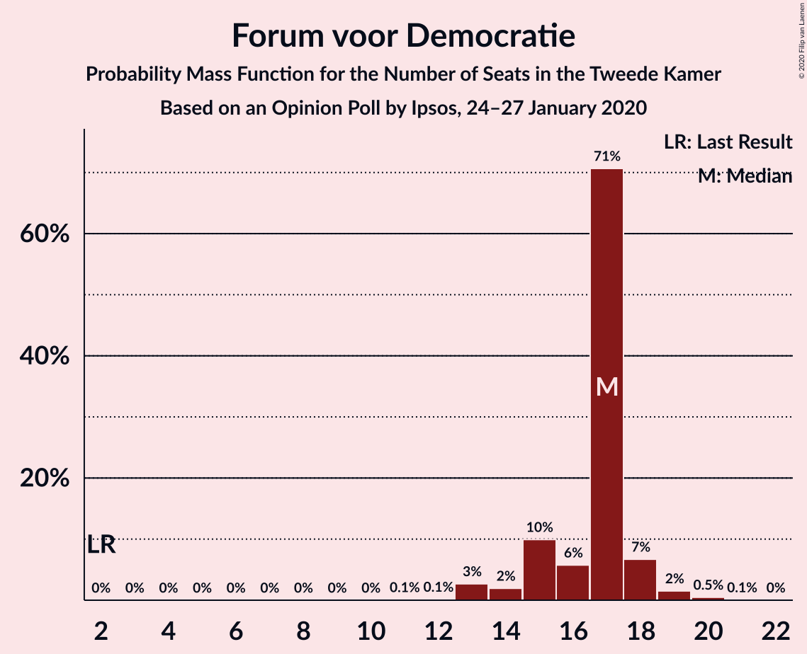
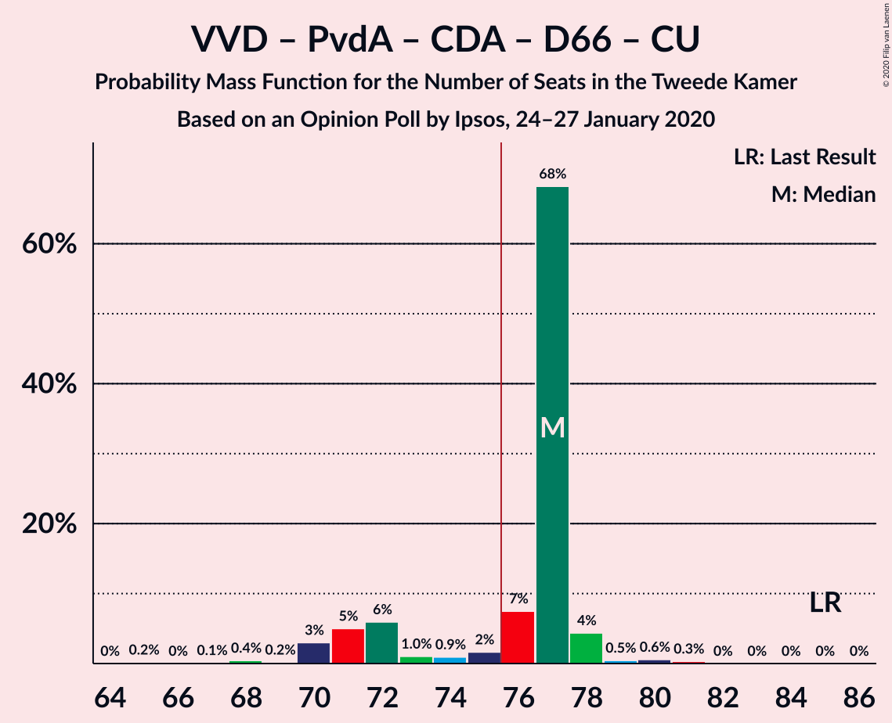
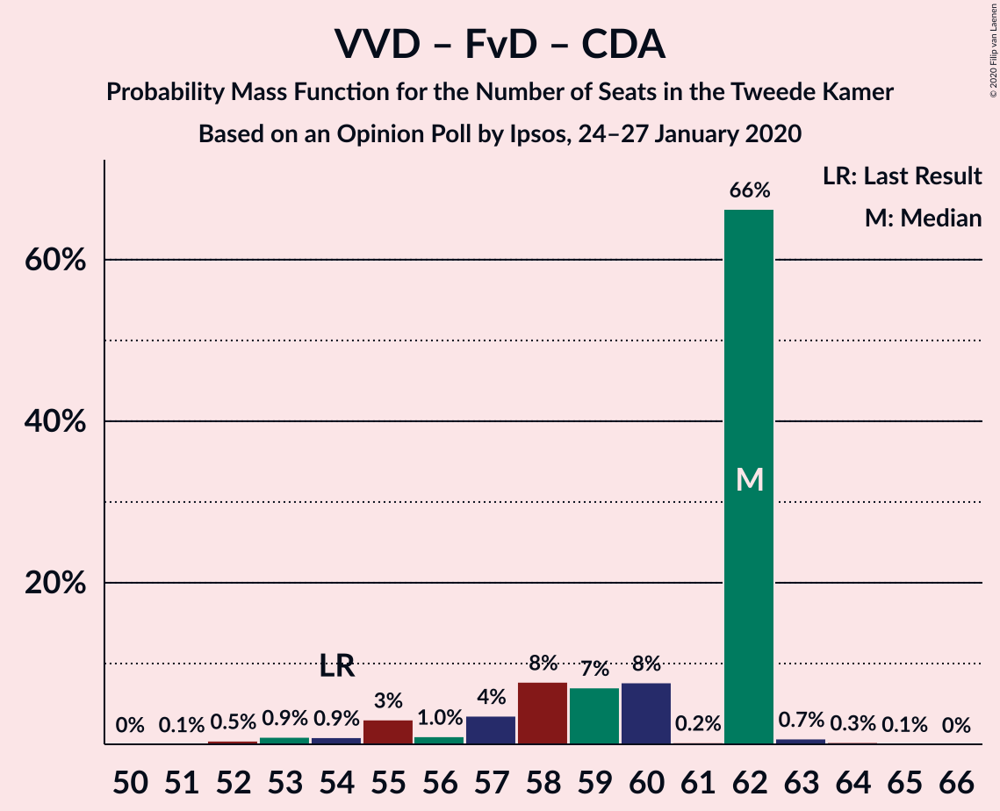
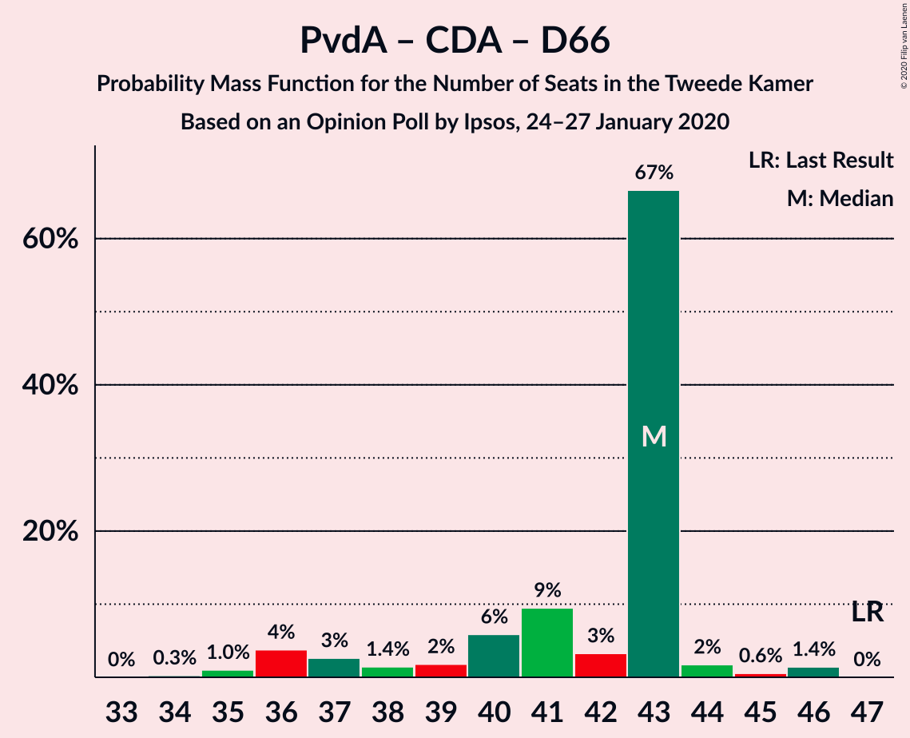

# Opinion Poll by Ipsos, 24–27 January 2020

<a href="#voting-intentions">Voting Intentions</a> | <a href="#seats">Seats</a> | <a href="#coalitions">Coalitions</a> | <a href="#technical-information">Technical Information</a>

## Voting Intentions

### Confidence Intervals

| Party | Last Result | Poll Result | 80% Confidence Interval | 90% Confidence Interval | 95% Confidence Interval | 99% Confidence Interval |
|:-----:|:-----------:|:-----------:|:-----------------------:|:-----------------------:|:-----------------------:|:-----------------------:|
| Volkspartij voor Vrijheid en Democratie | 21.3% | 18.1% | 16.6–19.7% |16.2–20.1% |15.9–20.5% |15.2–21.3% |
| Forum voor Democratie | 1.8% | 10.6% | 9.5–12.0% |9.2–12.3% |8.9–12.7% |8.4–13.3% |
| Partij voor de Vrijheid | 13.1% | 10.3% | 9.1–11.6% |8.8–11.9% |8.6–12.3% |8.1–12.9% |
| GroenLinks | 9.1% | 9.9% | 8.8–11.2% |8.5–11.5% |8.2–11.8% |7.7–12.5% |
| Partij van de Arbeid | 5.7% | 9.4% | 8.3–10.7% |8.0–11.0% |7.8–11.3% |7.3–12.0% |
| Christen-Democratisch Appèl | 12.4% | 9.2% | 8.2–10.5% |7.9–10.8% |7.6–11.1% |7.1–11.8% |
| Democraten 66 | 12.2% | 8.1% | 7.1–9.3% |6.8–9.6% |6.6–9.9% |6.1–10.5% |
| 50Plus | 3.1% | 6.1% | 5.2–7.1% |5.0–7.4% |4.8–7.7% |4.4–8.2% |
| Socialistische Partij | 9.1% | 5.5% | 4.7–6.5% |4.5–6.8% |4.3–7.1% |3.9–7.6% |
| Partij voor de Dieren | 3.2% | 4.3% | 3.6–5.2% |3.4–5.5% |3.2–5.7% |2.9–6.2% |
| ChristenUnie | 3.4% | 4.2% | 3.5–5.1% |3.3–5.3% |3.1–5.6% |2.8–6.0% |
| Staatkundig Gereformeerde Partij | 2.1% | 2.0% | 1.5–2.7% |1.4–2.9% |1.3–3.0% |1.1–3.4% |
| DENK | 2.1% | 1.3% | 1.0–1.9% |0.9–2.1% |0.8–2.2% |0.7–2.5% |

*Note:* The poll result column reflects the actual value used in the calculations. Published results may vary slightly, and in addition be rounded to fewer digits.

## Seats

### Confidence Intervals

| Party | Last Result | Median | 80% Confidence Interval | 90% Confidence Interval | 95% Confidence Interval | 99% Confidence Interval |
|:-----:|:-----------:|:------:|:-----------------------:|:-----------------------:|:-----------------------:|:-----------------------:|
| <a href="#volkspartij-voor-vrijheid-en-democratie">Volkspartij voor Vrijheid en Democratie</a> | 33 | 30 | 26–30 |25–30 |24–30 |24–31 |
| <a href="#forum-voor-democratie">Forum voor Democratie</a> | 2 | 15 | 13–18 |13–19 |13–19 |13–19 |
| <a href="#partij-voor-de-vrijheid">Partij voor de Vrijheid</a> | 20 | 14 | 13–16 |13–18 |13–19 |11–19 |
| <a href="#groenlinks">GroenLinks</a> | 14 | 16 | 13–18 |13–18 |13–18 |13–19 |
| <a href="#partij-van-de-arbeid">Partij van de Arbeid</a> | 9 | 15 | 12–16 |12–17 |12–17 |11–17 |
| <a href="#christen-democratisch-appèl">Christen-Democratisch Appèl</a> | 19 | 14 | 12–14 |11–14 |10–16 |10–18 |
| <a href="#democraten-66">Democraten 66</a> | 19 | 12 | 11–13 |11–13 |11–14 |10–16 |
| <a href="#50plus">50Plus</a> | 4 | 9 | 8–11 |8–11 |7–11 |7–12 |
| <a href="#socialistische-partij">Socialistische Partij</a> | 14 | 9 | 8–9 |7–9 |6–10 |6–11 |
| <a href="#partij-voor-de-dieren">Partij voor de Dieren</a> | 5 | 7 | 6–7 |5–7 |5–8 |4–9 |
| <a href="#christenunie">ChristenUnie</a> | 5 | 7 | 5–8 |5–8 |4–8 |4–8 |
| <a href="#staatkundig-gereformeerde-partij">Staatkundig Gereformeerde Partij</a> | 3 | 3 | 2–4 |2–4 |2–4 |1–4 |
| <a href="#denk">DENK</a> | 3 | 1 | 1–2 |1–2 |1–3 |1–3 |

### Volkspartij voor Vrijheid en Democratie

*For a full overview of the results for this party, see the [Volkspartij voor Vrijheid en Democratie](party-volkspartijvoorvrijheidendemocratie.html) page.*

| Number of Seats | Probability | Accumulated | Special Marks |
|:---------------:|:-----------:|:-----------:|:-------------:|
| 22 | 0.1% | 100% |  |
| 23 | 0.2% | 99.9% |  |
| 24 | 3% | 99.7% |  |
| 25 | 6% | 96% |  |
| 26 | 3% | 91% |  |
| 27 | 14% | 88% |  |
| 28 | 2% | 74% |  |
| 29 | 0.9% | 72% |  |
| 30 | 69% | 71% | Median |
| 31 | 2% | 2% |  |
| 32 | 0.1% | 0.1% |  |
| 33 | 0% | 0% | Last Result |

### Forum voor Democratie

*For a full overview of the results for this party, see the [Forum voor Democratie](party-forumvoordemocratie.html) page.*

| Number of Seats | Probability | Accumulated | Special Marks |
|:---------------:|:-----------:|:-----------:|:-------------:|
| 2 | 0% | 100% | Last Result |
| 3 | 0% | 100% |  |
| 4 | 0% | 100% |  |
| 5 | 0% | 100% |  |
| 6 | 0% | 100% |  |
| 7 | 0% | 100% |  |
| 8 | 0% | 100% |  |
| 9 | 0% | 100% |  |
| 10 | 0% | 100% |  |
| 11 | 0% | 100% |  |
| 12 | 0.1% | 100% |  |
| 13 | 39% | 99.9% |  |
| 14 | 3% | 61% |  |
| 15 | 11% | 58% | Median |
| 16 | 6% | 46% |  |
| 17 | 7% | 40% |  |
| 18 | 24% | 33% |  |
| 19 | 9% | 9% |  |
| 20 | 0.2% | 0.3% |  |
| 21 | 0% | 0% |  |

### Partij voor de Vrijheid

*For a full overview of the results for this party, see the [Partij voor de Vrijheid](party-partijvoordevrijheid.html) page.*

| Number of Seats | Probability | Accumulated | Special Marks |
|:---------------:|:-----------:|:-----------:|:-------------:|
| 11 | 1.2% | 100% |  |
| 12 | 0.4% | 98.8% |  |
| 13 | 21% | 98% |  |
| 14 | 50% | 77% | Median |
| 15 | 14% | 27% |  |
| 16 | 4% | 13% |  |
| 17 | 0.8% | 9% |  |
| 18 | 4% | 8% |  |
| 19 | 4% | 4% |  |
| 20 | 0.4% | 0.4% | Last Result |
| 21 | 0% | 0% |  |

### GroenLinks

*For a full overview of the results for this party, see the [GroenLinks](party-groenlinks.html) page.*

| Number of Seats | Probability | Accumulated | Special Marks |
|:---------------:|:-----------:|:-----------:|:-------------:|
| 11 | 0.1% | 100% |  |
| 12 | 0.4% | 99.9% |  |
| 13 | 41% | 99.5% |  |
| 14 | 2% | 58% | Last Result |
| 15 | 2% | 56% |  |
| 16 | 15% | 54% | Median |
| 17 | 0.1% | 39% |  |
| 18 | 37% | 39% |  |
| 19 | 2% | 2% |  |
| 20 | 0% | 0.1% |  |
| 21 | 0% | 0% |  |

### Partij van de Arbeid

*For a full overview of the results for this party, see the [Partij van de Arbeid](party-partijvandearbeid.html) page.*

| Number of Seats | Probability | Accumulated | Special Marks |
|:---------------:|:-----------:|:-----------:|:-------------:|
| 9 | 0% | 100% | Last Result |
| 10 | 0% | 100% |  |
| 11 | 1.1% | 100% |  |
| 12 | 14% | 98.9% |  |
| 13 | 30% | 85% |  |
| 14 | 5% | 56% |  |
| 15 | 40% | 51% | Median |
| 16 | 2% | 11% |  |
| 17 | 9% | 9% |  |
| 18 | 0.1% | 0.2% |  |
| 19 | 0.1% | 0.1% |  |
| 20 | 0% | 0% |  |

### Christen-Democratisch Appèl

*For a full overview of the results for this party, see the [Christen-Democratisch Appèl](party-christen-democratischappèl.html) page.*

| Number of Seats | Probability | Accumulated | Special Marks |
|:---------------:|:-----------:|:-----------:|:-------------:|
| 10 | 4% | 100% |  |
| 11 | 0.7% | 96% |  |
| 12 | 32% | 95% |  |
| 13 | 2% | 62% |  |
| 14 | 55% | 60% | Median |
| 15 | 1.3% | 5% |  |
| 16 | 2% | 3% |  |
| 17 | 0% | 2% |  |
| 18 | 2% | 2% |  |
| 19 | 0% | 0% | Last Result |

### Democraten 66

*For a full overview of the results for this party, see the [Democraten 66](party-democraten66.html) page.*

| Number of Seats | Probability | Accumulated | Special Marks |
|:---------------:|:-----------:|:-----------:|:-------------:|
| 9 | 0.1% | 100% |  |
| 10 | 1.3% | 99.8% |  |
| 11 | 45% | 98.5% |  |
| 12 | 43% | 54% | Median |
| 13 | 8% | 11% |  |
| 14 | 0.3% | 3% |  |
| 15 | 0.9% | 2% |  |
| 16 | 2% | 2% |  |
| 17 | 0% | 0% |  |
| 18 | 0% | 0% |  |
| 19 | 0% | 0% | Last Result |

### 50Plus

*For a full overview of the results for this party, see the [50Plus](party-50plus.html) page.*

| Number of Seats | Probability | Accumulated | Special Marks |
|:---------------:|:-----------:|:-----------:|:-------------:|
| 4 | 0% | 100% | Last Result |
| 5 | 0% | 100% |  |
| 6 | 0.1% | 100% |  |
| 7 | 4% | 99.9% |  |
| 8 | 22% | 96% |  |
| 9 | 49% | 75% | Median |
| 10 | 14% | 26% |  |
| 11 | 9% | 11% |  |
| 12 | 2% | 2% |  |
| 13 | 0.3% | 0.3% |  |
| 14 | 0% | 0% |  |

### Socialistische Partij

*For a full overview of the results for this party, see the [Socialistische Partij](party-socialistischepartij.html) page.*

| Number of Seats | Probability | Accumulated | Special Marks |
|:---------------:|:-----------:|:-----------:|:-------------:|
| 5 | 0.1% | 100% |  |
| 6 | 4% | 99.9% |  |
| 7 | 2% | 96% |  |
| 8 | 28% | 94% |  |
| 9 | 61% | 66% | Median |
| 10 | 4% | 5% |  |
| 11 | 0.7% | 0.7% |  |
| 12 | 0% | 0% |  |
| 13 | 0% | 0% |  |
| 14 | 0% | 0% | Last Result |

### Partij voor de Dieren

*For a full overview of the results for this party, see the [Partij voor de Dieren](party-partijvoordedieren.html) page.*

| Number of Seats | Probability | Accumulated | Special Marks |
|:---------------:|:-----------:|:-----------:|:-------------:|
| 4 | 1.4% | 100% |  |
| 5 | 8% | 98.6% | Last Result |
| 6 | 24% | 90% |  |
| 7 | 63% | 66% | Median |
| 8 | 2% | 3% |  |
| 9 | 1.2% | 1.3% |  |
| 10 | 0% | 0% |  |

### ChristenUnie

*For a full overview of the results for this party, see the [ChristenUnie](party-christenunie.html) page.*

| Number of Seats | Probability | Accumulated | Special Marks |
|:---------------:|:-----------:|:-----------:|:-------------:|
| 4 | 4% | 100% |  |
| 5 | 38% | 96% | Last Result |
| 6 | 6% | 59% |  |
| 7 | 41% | 52% | Median |
| 8 | 11% | 11% |  |
| 9 | 0.4% | 0.4% |  |
| 10 | 0% | 0% |  |

### Staatkundig Gereformeerde Partij

*For a full overview of the results for this party, see the [Staatkundig Gereformeerde Partij](party-staatkundiggereformeerdepartij.html) page.*

| Number of Seats | Probability | Accumulated | Special Marks |
|:---------------:|:-----------:|:-----------:|:-------------:|
| 1 | 1.1% | 100% |  |
| 2 | 28% | 98.9% |  |
| 3 | 27% | 71% | Last Result, Median |
| 4 | 43% | 43% |  |
| 5 | 0.3% | 0.3% |  |
| 6 | 0% | 0% |  |

### DENK

*For a full overview of the results for this party, see the [DENK](party-denk.html) page.*

| Number of Seats | Probability | Accumulated | Special Marks |
|:---------------:|:-----------:|:-----------:|:-------------:|
| 0 | 0.3% | 100% |  |
| 1 | 71% | 99.7% | Median |
| 2 | 27% | 29% |  |
| 3 | 3% | 3% | Last Result |
| 4 | 0% | 0% |  |

## Coalitions

### Confidence Intervals

| Coalition | Last Result | Median | Majority? | 80% Confidence Interval | 90% Confidence Interval | 95% Confidence Interval | 99% Confidence Interval |
|:---------:|:-----------:|:------:|:---------:|:-----------------------:|:-----------------------:|:-----------------------:|:-----------------------:|
| Volkspartij voor Vrijheid en Democratie – Forum voor Democratie – Partij voor de Vrijheid – Christen-Democratisch Appèl – Staatkundig Gereformeerde Partij | 77 | 75 | 42% | 74–76 | 72–76 | 70–79 | 69–81 |
| Volkspartij voor Vrijheid en Democratie – GroenLinks – Christen-Democratisch Appèl – Democraten 66 – ChristenUnie | 90 | 76 | 79% | 72–78 | 71–78 | 67–78 | 67–81 |
| Volkspartij voor Vrijheid en Democratie – Partij van de Arbeid – Christen-Democratisch Appèl – Democraten 66 – ChristenUnie | 85 | 73 | 47% | 71–78 | 70–78 | 65–78 | 65–79 |
| Volkspartij voor Vrijheid en Democratie – Forum voor Democratie – Partij voor de Vrijheid – Christen-Democratisch Appèl | 74 | 72 | 1.2% | 71–74 | 70–74 | 68–75 | 67–78 |
| GroenLinks – Partij van de Arbeid – Christen-Democratisch Appèl – Democraten 66 – Socialistische Partij – ChristenUnie | 80 | 70 | 2% | 68–71 | 67–73 | 66–73 | 64–77 |
| Volkspartij voor Vrijheid en Democratie – Forum voor Democratie – Christen-Democratisch Appèl – 50Plus – Staatkundig Gereformeerde Partij | 61 | 70 | 0.1% | 67–71 | 66–71 | 63–73 | 63–74 |
| Volkspartij voor Vrijheid en Democratie – Forum voor Democratie – Christen-Democratisch Appèl – 50Plus | 58 | 66 | 0% | 64–69 | 63–69 | 61–70 | 61–70 |
| GroenLinks – Partij van de Arbeid – Christen-Democratisch Appèl – Democraten 66 – ChristenUnie | 66 | 61 | 0% | 59–63 | 58–66 | 57–67 | 56–68 |
| Volkspartij voor Vrijheid en Democratie – Forum voor Democratie – Christen-Democratisch Appèl – Staatkundig Gereformeerde Partij | 57 | 61 | 0% | 57–63 | 56–63 | 54–64 | 54–65 |
| Volkspartij voor Vrijheid en Democratie – Christen-Democratisch Appèl – Democraten 66 – ChristenUnie | 76 | 60 | 0% | 58–63 | 53–63 | 51–64 | 51–65 |
| Volkspartij voor Vrijheid en Democratie – Forum voor Democratie – Christen-Democratisch Appèl | 54 | 57 | 0% | 54–60 | 54–60 | 52–60 | 52–62 |
| Volkspartij voor Vrijheid en Democratie – Partij voor de Vrijheid – Christen-Democratisch Appèl | 72 | 58 | 0% | 53–59 | 53–59 | 53–59 | 51–64 |
| Volkspartij voor Vrijheid en Democratie – Partij van de Arbeid – Christen-Democratisch Appèl | 61 | 56 | 0% | 52–59 | 52–59 | 50–59 | 50–60 |
| Volkspartij voor Vrijheid en Democratie – Partij van de Arbeid – Democraten 66 | 61 | 54 | 0% | 51–57 | 50–57 | 49–57 | 49–59 |
| Volkspartij voor Vrijheid en Democratie – Christen-Democratisch Appèl – Democraten 66 | 71 | 55 | 0% | 50–56 | 47–56 | 47–57 | 47–59 |
| Volkspartij voor Vrijheid en Democratie – Partij van de Arbeid | 42 | 43 | 0% | 40–45 | 38–45 | 38–45 | 37–45 |
| Partij van de Arbeid – Christen-Democratisch Appèl – Democraten 66 | 47 | 40 | 0% | 36–41 | 36–43 | 36–44 | 36–44 |
| Volkspartij voor Vrijheid en Democratie – Christen-Democratisch Appèl | 52 | 44 | 0% | 38–44 | 36–44 | 35–44 | 35–45 |
| Partij van de Arbeid – Christen-Democratisch Appèl – ChristenUnie | 33 | 34 | 0% | 30–36 | 30–36 | 30–36 | 29–38 |
| Partij van de Arbeid – Christen-Democratisch Appèl | 28 | 27 | 0% | 25–29 | 25–30 | 25–31 | 24–32 |
| Christen-Democratisch Appèl – Democraten 66 | 38 | 26 | 0% | 23–27 | 23–28 | 22–29 | 22–31 |

### Volkspartij voor Vrijheid en Democratie – Forum voor Democratie – Partij voor de Vrijheid – Christen-Democratisch Appèl – Staatkundig Gereformeerde Partij

| Number of Seats | Probability | Accumulated | Special Marks |
|:---------------:|:-----------:|:-----------:|:-------------:|
| 69 | 2% | 100% |  |
| 70 | 1.2% | 98% |  |
| 71 | 0.5% | 97% |  |
| 72 | 5% | 97% |  |
| 73 | 0.3% | 92% |  |
| 74 | 9% | 91% |  |
| 75 | 40% | 82% |  |
| 76 | 37% | 42% | Median, Majority |
| 77 | 0.5% | 5% | Last Result |
| 78 | 0.7% | 4% |  |
| 79 | 2% | 3% |  |
| 80 | 0% | 0.9% |  |
| 81 | 0.5% | 0.9% |  |
| 82 | 0.3% | 0.3% |  |
| 83 | 0% | 0.1% |  |
| 84 | 0% | 0.1% |  |
| 85 | 0% | 0% |  |

### Volkspartij voor Vrijheid en Democratie – GroenLinks – Christen-Democratisch Appèl – Democraten 66 – ChristenUnie

| Number of Seats | Probability | Accumulated | Special Marks |
|:---------------:|:-----------:|:-----------:|:-------------:|
| 67 | 3% | 100% |  |
| 68 | 0% | 97% |  |
| 69 | 1.5% | 97% |  |
| 70 | 0.3% | 95% |  |
| 71 | 5% | 95% |  |
| 72 | 0.5% | 91% |  |
| 73 | 0.7% | 90% |  |
| 74 | 9% | 89% |  |
| 75 | 1.1% | 80% |  |
| 76 | 59% | 79% | Majority |
| 77 | 5% | 20% |  |
| 78 | 13% | 15% |  |
| 79 | 0.3% | 2% | Median |
| 80 | 0.5% | 2% |  |
| 81 | 1.1% | 1.2% |  |
| 82 | 0% | 0% |  |
| 83 | 0% | 0% |  |
| 84 | 0% | 0% |  |
| 85 | 0% | 0% |  |
| 86 | 0% | 0% |  |
| 87 | 0% | 0% |  |
| 88 | 0% | 0% |  |
| 89 | 0% | 0% |  |
| 90 | 0% | 0% | Last Result |

### Volkspartij voor Vrijheid en Democratie – Partij van de Arbeid – Christen-Democratisch Appèl – Democraten 66 – ChristenUnie

| Number of Seats | Probability | Accumulated | Special Marks |
|:---------------:|:-----------:|:-----------:|:-------------:|
| 65 | 3% | 100% |  |
| 66 | 0% | 97% |  |
| 67 | 0.3% | 97% |  |
| 68 | 0.4% | 97% |  |
| 69 | 0.3% | 96% |  |
| 70 | 4% | 96% |  |
| 71 | 29% | 92% |  |
| 72 | 12% | 63% |  |
| 73 | 1.4% | 51% |  |
| 74 | 0.2% | 49% |  |
| 75 | 3% | 49% |  |
| 76 | 6% | 47% | Majority |
| 77 | 0.1% | 41% |  |
| 78 | 40% | 41% | Median |
| 79 | 0.5% | 0.6% |  |
| 80 | 0% | 0.1% |  |
| 81 | 0% | 0% |  |
| 82 | 0% | 0% |  |
| 83 | 0% | 0% |  |
| 84 | 0% | 0% |  |
| 85 | 0% | 0% | Last Result |

### Volkspartij voor Vrijheid en Democratie – Forum voor Democratie – Partij voor de Vrijheid – Christen-Democratisch Appèl

| Number of Seats | Probability | Accumulated | Special Marks |
|:---------------:|:-----------:|:-----------:|:-------------:|
| 67 | 2% | 100% |  |
| 68 | 2% | 98% |  |
| 69 | 0.4% | 96% |  |
| 70 | 5% | 96% |  |
| 71 | 39% | 91% |  |
| 72 | 10% | 52% |  |
| 73 | 26% | 42% | Median |
| 74 | 13% | 16% | Last Result |
| 75 | 2% | 4% |  |
| 76 | 0.1% | 1.2% | Majority |
| 77 | 0.3% | 1.1% |  |
| 78 | 0.8% | 0.8% |  |
| 79 | 0% | 0.1% |  |
| 80 | 0% | 0.1% |  |
| 81 | 0% | 0% |  |

### GroenLinks – Partij van de Arbeid – Christen-Democratisch Appèl – Democraten 66 – Socialistische Partij – ChristenUnie

| Number of Seats | Probability | Accumulated | Special Marks |
|:---------------:|:-----------:|:-----------:|:-------------:|
| 62 | 0% | 100% |  |
| 63 | 0.2% | 99.9% |  |
| 64 | 0.3% | 99.7% |  |
| 65 | 0.1% | 99.4% |  |
| 66 | 2% | 99.3% |  |
| 67 | 4% | 97% |  |
| 68 | 39% | 94% |  |
| 69 | 2% | 55% |  |
| 70 | 39% | 53% |  |
| 71 | 7% | 14% |  |
| 72 | 0.3% | 7% |  |
| 73 | 4% | 7% | Median |
| 74 | 0.2% | 2% |  |
| 75 | 0.3% | 2% |  |
| 76 | 0% | 2% | Majority |
| 77 | 1.5% | 1.5% |  |
| 78 | 0% | 0% |  |
| 79 | 0% | 0% |  |
| 80 | 0% | 0% | Last Result |

### Volkspartij voor Vrijheid en Democratie – Forum voor Democratie – Christen-Democratisch Appèl – 50Plus – Staatkundig Gereformeerde Partij

| Number of Seats | Probability | Accumulated | Special Marks |
|:---------------:|:-----------:|:-----------:|:-------------:|
| 61 | 0% | 100% | Last Result |
| 62 | 0% | 100% |  |
| 63 | 4% | 100% |  |
| 64 | 0.2% | 96% |  |
| 65 | 0% | 95% |  |
| 66 | 5% | 95% |  |
| 67 | 4% | 91% |  |
| 68 | 2% | 87% |  |
| 69 | 0.2% | 85% |  |
| 70 | 40% | 84% |  |
| 71 | 40% | 44% | Median |
| 72 | 0.8% | 5% |  |
| 73 | 3% | 4% |  |
| 74 | 0.9% | 1.1% |  |
| 75 | 0.1% | 0.2% |  |
| 76 | 0.1% | 0.1% | Majority |
| 77 | 0% | 0% |  |

### Volkspartij voor Vrijheid en Democratie – Forum voor Democratie – Christen-Democratisch Appèl – 50Plus

| Number of Seats | Probability | Accumulated | Special Marks |
|:---------------:|:-----------:|:-----------:|:-------------:|
| 58 | 0% | 100% | Last Result |
| 59 | 0% | 100% |  |
| 60 | 0% | 99.9% |  |
| 61 | 5% | 99.9% |  |
| 62 | 0.2% | 95% |  |
| 63 | 3% | 95% |  |
| 64 | 5% | 92% |  |
| 65 | 0.5% | 87% |  |
| 66 | 41% | 86% |  |
| 67 | 1.0% | 46% |  |
| 68 | 20% | 45% | Median |
| 69 | 22% | 25% |  |
| 70 | 3% | 3% |  |
| 71 | 0% | 0.2% |  |
| 72 | 0% | 0.2% |  |
| 73 | 0.1% | 0.1% |  |
| 74 | 0% | 0% |  |

### GroenLinks – Partij van de Arbeid – Christen-Democratisch Appèl – Democraten 66 – ChristenUnie

| Number of Seats | Probability | Accumulated | Special Marks |
|:---------------:|:-----------:|:-----------:|:-------------:|
| 55 | 0.1% | 100% |  |
| 56 | 0.5% | 99.9% |  |
| 57 | 3% | 99.4% |  |
| 58 | 2% | 96% |  |
| 59 | 19% | 94% |  |
| 60 | 21% | 75% |  |
| 61 | 41% | 54% |  |
| 62 | 1.5% | 14% |  |
| 63 | 5% | 12% |  |
| 64 | 0.8% | 7% | Median |
| 65 | 0.6% | 6% |  |
| 66 | 1.1% | 6% | Last Result |
| 67 | 3% | 5% |  |
| 68 | 1.5% | 1.5% |  |
| 69 | 0% | 0% |  |

### Volkspartij voor Vrijheid en Democratie – Forum voor Democratie – Christen-Democratisch Appèl – Staatkundig Gereformeerde Partij

| Number of Seats | Probability | Accumulated | Special Marks |
|:---------------:|:-----------:|:-----------:|:-------------:|
| 53 | 0.1% | 100% |  |
| 54 | 4% | 99.9% |  |
| 55 | 0.5% | 96% |  |
| 56 | 3% | 95% |  |
| 57 | 3% | 92% | Last Result |
| 58 | 0.5% | 89% |  |
| 59 | 0.4% | 88% |  |
| 60 | 13% | 88% |  |
| 61 | 50% | 75% |  |
| 62 | 2% | 25% | Median |
| 63 | 19% | 23% |  |
| 64 | 3% | 4% |  |
| 65 | 1.1% | 1.3% |  |
| 66 | 0% | 0.1% |  |
| 67 | 0% | 0.1% |  |
| 68 | 0% | 0.1% |  |
| 69 | 0% | 0% |  |

### Volkspartij voor Vrijheid en Democratie – Christen-Democratisch Appèl – Democraten 66 – ChristenUnie

| Number of Seats | Probability | Accumulated | Special Marks |
|:---------------:|:-----------:|:-----------:|:-------------:|
| 51 | 3% | 100% |  |
| 52 | 0% | 97% |  |
| 53 | 4% | 97% |  |
| 54 | 1.3% | 93% |  |
| 55 | 0.4% | 91% |  |
| 56 | 0.4% | 91% |  |
| 57 | 0.5% | 91% |  |
| 58 | 29% | 90% |  |
| 59 | 5% | 62% |  |
| 60 | 12% | 56% |  |
| 61 | 0.8% | 44% |  |
| 62 | 0.8% | 43% |  |
| 63 | 39% | 43% | Median |
| 64 | 2% | 4% |  |
| 65 | 2% | 2% |  |
| 66 | 0.2% | 0.2% |  |
| 67 | 0% | 0% |  |
| 68 | 0% | 0% |  |
| 69 | 0% | 0% |  |
| 70 | 0% | 0% |  |
| 71 | 0% | 0% |  |
| 72 | 0% | 0% |  |
| 73 | 0% | 0% |  |
| 74 | 0% | 0% |  |
| 75 | 0% | 0% |  |
| 76 | 0% | 0% | Last Result, Majority |

### Volkspartij voor Vrijheid en Democratie – Forum voor Democratie – Christen-Democratisch Appèl

| Number of Seats | Probability | Accumulated | Special Marks |
|:---------------:|:-----------:|:-----------:|:-------------:|
| 50 | 0.1% | 100% |  |
| 51 | 0% | 99.9% |  |
| 52 | 4% | 99.8% |  |
| 53 | 0.5% | 96% |  |
| 54 | 6% | 95% | Last Result |
| 55 | 0.3% | 89% |  |
| 56 | 0.3% | 88% |  |
| 57 | 43% | 88% |  |
| 58 | 10% | 46% |  |
| 59 | 12% | 35% | Median |
| 60 | 21% | 23% |  |
| 61 | 1.0% | 2% |  |
| 62 | 1.0% | 1.1% |  |
| 63 | 0% | 0.1% |  |
| 64 | 0% | 0.1% |  |
| 65 | 0.1% | 0.1% |  |
| 66 | 0% | 0% |  |

### Volkspartij voor Vrijheid en Democratie – Partij voor de Vrijheid – Christen-Democratisch Appèl

| Number of Seats | Probability | Accumulated | Special Marks |
|:---------------:|:-----------:|:-----------:|:-------------:|
| 51 | 0.7% | 100% |  |
| 52 | 1.2% | 99.3% |  |
| 53 | 15% | 98% |  |
| 54 | 1.2% | 83% |  |
| 55 | 23% | 82% |  |
| 56 | 0.2% | 59% |  |
| 57 | 4% | 59% |  |
| 58 | 41% | 54% | Median |
| 59 | 12% | 14% |  |
| 60 | 0.7% | 2% |  |
| 61 | 0.2% | 0.9% |  |
| 62 | 0.1% | 0.6% |  |
| 63 | 0% | 0.6% |  |
| 64 | 0.5% | 0.5% |  |
| 65 | 0% | 0% |  |
| 66 | 0% | 0% |  |
| 67 | 0% | 0% |  |
| 68 | 0% | 0% |  |
| 69 | 0% | 0% |  |
| 70 | 0% | 0% |  |
| 71 | 0% | 0% |  |
| 72 | 0% | 0% | Last Result |

### Volkspartij voor Vrijheid en Democratie – Partij van de Arbeid – Christen-Democratisch Appèl

| Number of Seats | Probability | Accumulated | Special Marks |
|:---------------:|:-----------:|:-----------:|:-------------:|
| 49 | 0.1% | 100% |  |
| 50 | 3% | 99.9% |  |
| 51 | 0.6% | 97% |  |
| 52 | 14% | 96% |  |
| 53 | 1.0% | 82% |  |
| 54 | 0.3% | 81% |  |
| 55 | 22% | 81% |  |
| 56 | 14% | 59% |  |
| 57 | 1.3% | 45% |  |
| 58 | 4% | 44% |  |
| 59 | 39% | 40% | Median |
| 60 | 0.3% | 0.8% |  |
| 61 | 0.4% | 0.5% | Last Result |
| 62 | 0.1% | 0.1% |  |
| 63 | 0% | 0% |  |

### Volkspartij voor Vrijheid en Democratie – Partij van de Arbeid – Democraten 66

| Number of Seats | Probability | Accumulated | Special Marks |
|:---------------:|:-----------:|:-----------:|:-------------:|
| 46 | 0.1% | 100% |  |
| 47 | 0.2% | 99.9% |  |
| 48 | 0% | 99.7% |  |
| 49 | 5% | 99.7% |  |
| 50 | 0.4% | 95% |  |
| 51 | 10% | 95% |  |
| 52 | 0.1% | 85% |  |
| 53 | 13% | 85% |  |
| 54 | 24% | 72% |  |
| 55 | 2% | 48% |  |
| 56 | 0.7% | 46% |  |
| 57 | 43% | 45% | Median |
| 58 | 0.3% | 2% |  |
| 59 | 2% | 2% |  |
| 60 | 0% | 0.1% |  |
| 61 | 0% | 0% | Last Result |

### Volkspartij voor Vrijheid en Democratie – Christen-Democratisch Appèl – Democraten 66

| Number of Seats | Probability | Accumulated | Special Marks |
|:---------------:|:-----------:|:-----------:|:-------------:|
| 46 | 0% | 100% |  |
| 47 | 7% | 99.9% |  |
| 48 | 0.3% | 93% |  |
| 49 | 1.3% | 93% |  |
| 50 | 10% | 91% |  |
| 51 | 0.6% | 81% |  |
| 52 | 0.7% | 81% |  |
| 53 | 20% | 80% |  |
| 54 | 4% | 60% |  |
| 55 | 12% | 55% |  |
| 56 | 39% | 43% | Median |
| 57 | 2% | 4% |  |
| 58 | 0.7% | 2% |  |
| 59 | 2% | 2% |  |
| 60 | 0% | 0% |  |
| 61 | 0% | 0% |  |
| 62 | 0% | 0% |  |
| 63 | 0% | 0% |  |
| 64 | 0% | 0% |  |
| 65 | 0% | 0% |  |
| 66 | 0% | 0% |  |
| 67 | 0% | 0% |  |
| 68 | 0% | 0% |  |
| 69 | 0% | 0% |  |
| 70 | 0% | 0% |  |
| 71 | 0% | 0% | Last Result |

### Volkspartij voor Vrijheid en Democratie – Partij van de Arbeid

| Number of Seats | Probability | Accumulated | Special Marks |
|:---------------:|:-----------:|:-----------:|:-------------:|
| 36 | 0.2% | 100% |  |
| 37 | 0.3% | 99.8% |  |
| 38 | 5% | 99.5% |  |
| 39 | 0.7% | 95% |  |
| 40 | 9% | 94% |  |
| 41 | 1.3% | 85% |  |
| 42 | 19% | 83% | Last Result |
| 43 | 21% | 64% |  |
| 44 | 4% | 43% |  |
| 45 | 39% | 40% | Median |
| 46 | 0% | 0.2% |  |
| 47 | 0.1% | 0.2% |  |
| 48 | 0.1% | 0.1% |  |
| 49 | 0% | 0% |  |

### Partij van de Arbeid – Christen-Democratisch Appèl – Democraten 66

| Number of Seats | Probability | Accumulated | Special Marks |
|:---------------:|:-----------:|:-----------:|:-------------:|
| 35 | 0% | 100% |  |
| 36 | 28% | 99.9% |  |
| 37 | 15% | 72% |  |
| 38 | 1.4% | 57% |  |
| 39 | 5% | 56% |  |
| 40 | 2% | 51% |  |
| 41 | 41% | 49% | Median |
| 42 | 2% | 8% |  |
| 43 | 2% | 6% |  |
| 44 | 4% | 4% |  |
| 45 | 0% | 0.4% |  |
| 46 | 0.3% | 0.3% |  |
| 47 | 0% | 0% | Last Result |

### Volkspartij voor Vrijheid en Democratie – Christen-Democratisch Appèl

| Number of Seats | Probability | Accumulated | Special Marks |
|:---------------:|:-----------:|:-----------:|:-------------:|
| 35 | 4% | 100% |  |
| 36 | 3% | 96% |  |
| 37 | 1.0% | 93% |  |
| 38 | 2% | 92% |  |
| 39 | 9% | 90% |  |
| 40 | 2% | 81% |  |
| 41 | 3% | 78% |  |
| 42 | 19% | 75% |  |
| 43 | 2% | 56% |  |
| 44 | 53% | 54% | Median |
| 45 | 0.8% | 0.9% |  |
| 46 | 0% | 0.1% |  |
| 47 | 0% | 0.1% |  |
| 48 | 0% | 0.1% |  |
| 49 | 0% | 0% |  |
| 50 | 0% | 0% |  |
| 51 | 0% | 0% |  |
| 52 | 0% | 0% | Last Result |

### Partij van de Arbeid – Christen-Democratisch Appèl – ChristenUnie

| Number of Seats | Probability | Accumulated | Special Marks |
|:---------------:|:-----------:|:-----------:|:-------------:|
| 28 | 0.2% | 100% |  |
| 29 | 2% | 99.8% |  |
| 30 | 22% | 98% |  |
| 31 | 11% | 76% |  |
| 32 | 1.0% | 65% |  |
| 33 | 14% | 64% | Last Result |
| 34 | 1.0% | 51% |  |
| 35 | 3% | 50% |  |
| 36 | 45% | 47% | Median |
| 37 | 1.0% | 2% |  |
| 38 | 0.4% | 0.6% |  |
| 39 | 0.1% | 0.2% |  |
| 40 | 0.1% | 0.1% |  |
| 41 | 0% | 0% |  |

### Partij van de Arbeid – Christen-Democratisch Appèl

| Number of Seats | Probability | Accumulated | Special Marks |
|:---------------:|:-----------:|:-----------:|:-------------:|
| 24 | 2% | 100% |  |
| 25 | 29% | 98% |  |
| 26 | 14% | 70% |  |
| 27 | 5% | 55% |  |
| 28 | 0.4% | 50% | Last Result |
| 29 | 41% | 49% | Median |
| 30 | 4% | 8% |  |
| 31 | 3% | 4% |  |
| 32 | 0.3% | 0.7% |  |
| 33 | 0.3% | 0.4% |  |
| 34 | 0.1% | 0.1% |  |
| 35 | 0% | 0% |  |

### Christen-Democratisch Appèl – Democraten 66

| Number of Seats | Probability | Accumulated | Special Marks |
|:---------------:|:-----------:|:-----------:|:-------------:|
| 21 | 0.1% | 100% |  |
| 22 | 4% | 99.9% |  |
| 23 | 31% | 96% |  |
| 24 | 2% | 64% |  |
| 25 | 12% | 63% |  |
| 26 | 40% | 51% | Median |
| 27 | 5% | 10% |  |
| 28 | 2% | 5% |  |
| 29 | 3% | 3% |  |
| 30 | 0.1% | 0.6% |  |
| 31 | 0.5% | 0.5% |  |
| 32 | 0% | 0% |  |
| 33 | 0% | 0% |  |
| 34 | 0% | 0% |  |
| 35 | 0% | 0% |  |
| 36 | 0% | 0% |  |
| 37 | 0% | 0% |  |
| 38 | 0% | 0% | Last Result |

## Technical Information

### Opinion Poll

+ **Polling firm:** Ipsos
+ **Commissioner(s):** —
+ **Fieldwork period:** 24–27 January 2020

### Calculations

+ **Sample size:** 1052
+ **Simulations done:** 131,072
+ **Error estimate:** 3.16%

