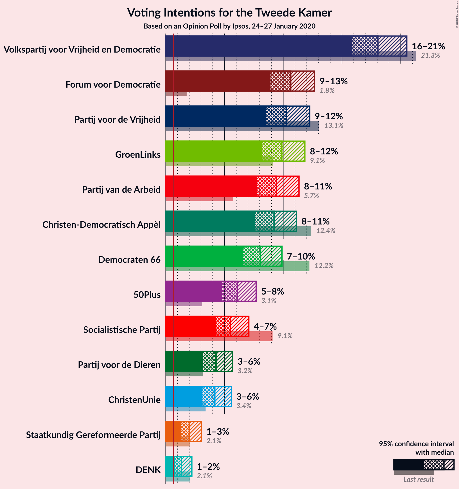
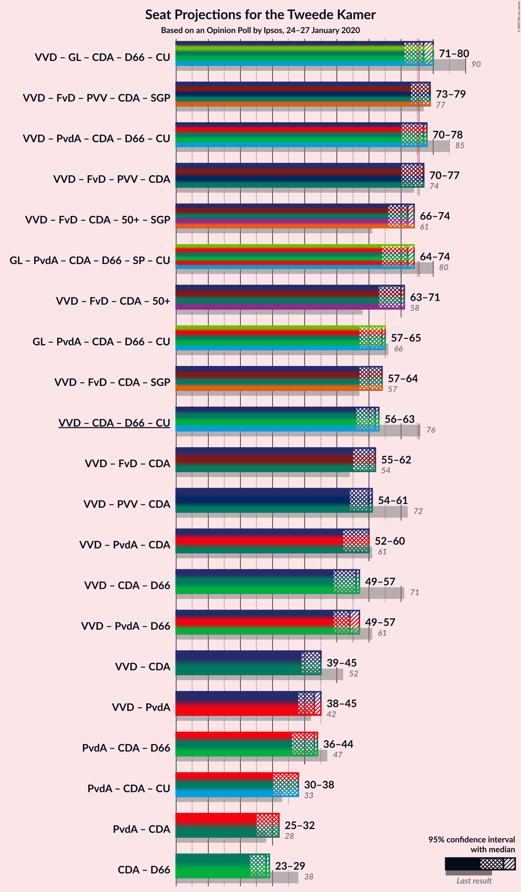
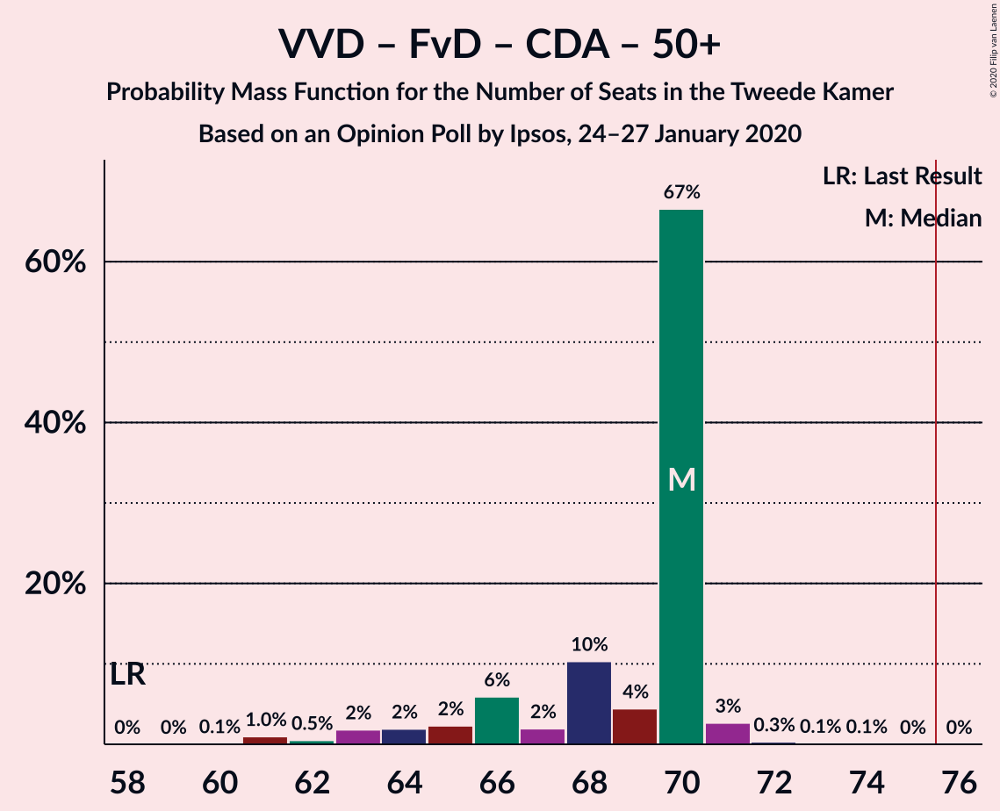
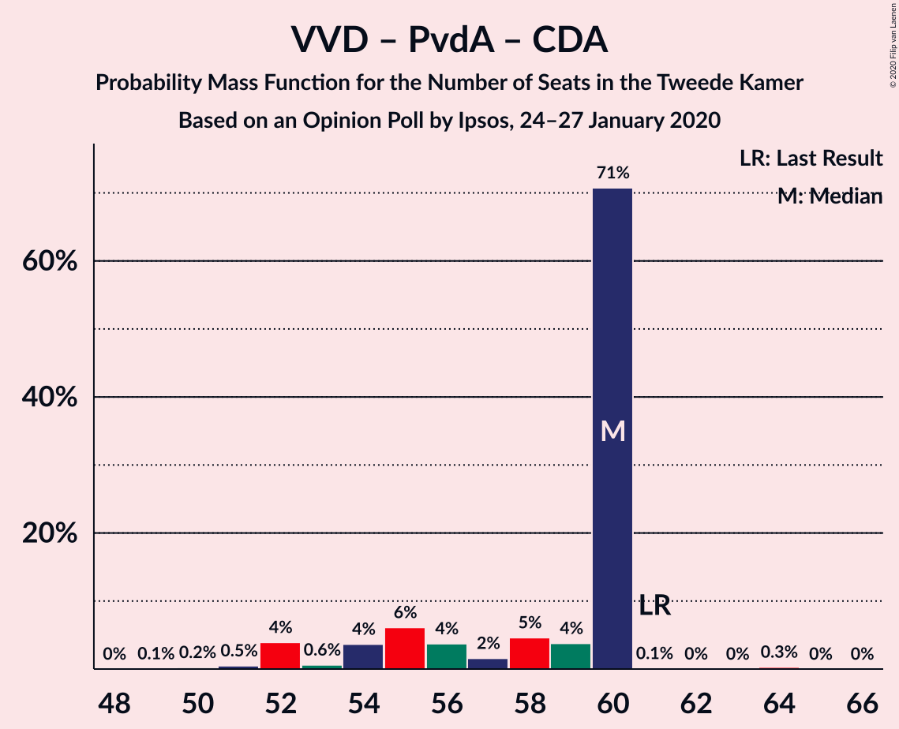

# Opinion Poll by Ipsos, 24–27 January 2020

<a href="#voting-intentions">Voting Intentions</a> | <a href="#seats">Seats</a> | <a href="#coalitions">Coalitions</a> | <a href="#technical-information">Technical Information</a>

## Voting Intentions

### Confidence Intervals

| Party | Last Result | Poll Result | 80% Confidence Interval | 90% Confidence Interval | 95% Confidence Interval | 99% Confidence Interval |
|:-----:|:-----------:|:-----------:|:-----------------------:|:-----------------------:|:-----------------------:|:-----------------------:|
| Volkspartij voor Vrijheid en Democratie | 21.3% | 18.1% | 16.6–19.7% |16.2–20.1% |15.9–20.5% |15.2–21.3% |
| Forum voor Democratie | 1.8% | 10.6% | 9.5–12.0% |9.2–12.3% |8.9–12.7% |8.4–13.3% |
| Partij voor de Vrijheid | 13.1% | 10.3% | 9.1–11.6% |8.8–11.9% |8.6–12.3% |8.1–12.9% |
| GroenLinks | 9.1% | 9.9% | 8.8–11.2% |8.5–11.5% |8.2–11.8% |7.7–12.5% |
| Partij van de Arbeid | 5.7% | 9.4% | 8.3–10.7% |8.0–11.0% |7.8–11.3% |7.3–12.0% |
| Christen-Democratisch Appèl | 12.4% | 9.2% | 8.2–10.5% |7.9–10.8% |7.6–11.1% |7.1–11.8% |
| Democraten 66 | 12.2% | 8.1% | 7.1–9.3% |6.8–9.6% |6.6–9.9% |6.1–10.5% |
| 50Plus | 3.1% | 6.1% | 5.2–7.1% |5.0–7.4% |4.8–7.7% |4.4–8.2% |
| Socialistische Partij | 9.1% | 5.5% | 4.7–6.5% |4.5–6.8% |4.3–7.1% |3.9–7.6% |
| Partij voor de Dieren | 3.2% | 4.3% | 3.6–5.2% |3.4–5.5% |3.2–5.7% |2.9–6.2% |
| ChristenUnie | 3.4% | 4.2% | 3.5–5.1% |3.3–5.3% |3.1–5.6% |2.8–6.0% |
| Staatkundig Gereformeerde Partij | 2.1% | 2.0% | 1.5–2.7% |1.4–2.9% |1.3–3.0% |1.1–3.4% |
| DENK | 2.1% | 1.3% | 1.0–1.9% |0.9–2.1% |0.8–2.2% |0.7–2.5% |

*Note:* The poll result column reflects the actual value used in the calculations. Published results may vary slightly, and in addition be rounded to fewer digits.

## Seats

### Confidence Intervals

| Party | Last Result | Median | 80% Confidence Interval | 90% Confidence Interval | 95% Confidence Interval | 99% Confidence Interval |
|:-----:|:-----------:|:------:|:-----------------------:|:-----------------------:|:-----------------------:|:-----------------------:|
| <a href="#volkspartij-voor-vrijheid-en-democratie">Volkspartij voor Vrijheid en Democratie</a> | 33 | 28 | 27–30 |26–30 |24–30 |24–32 |
| <a href="#forum-voor-democratie">Forum voor Democratie</a> | 2 | 17 | 15–17 |15–18 |13–18 |13–20 |
| <a href="#partij-voor-de-vrijheid">Partij voor de Vrijheid</a> | 20 | 15 | 14–16 |14–17 |13–18 |13–19 |
| <a href="#groenlinks">GroenLinks</a> | 14 | 15 | 13–16 |13–17 |13–18 |12–18 |
| <a href="#partij-van-de-arbeid">Partij van de Arbeid</a> | 9 | 15 | 13–15 |12–16 |12–17 |11–18 |
| <a href="#christen-democratisch-appèl">Christen-Democratisch Appèl</a> | 19 | 17 | 13–17 |12–17 |12–17 |11–17 |
| <a href="#democraten-66">Democraten 66</a> | 19 | 11 | 11–12 |11–13 |10–14 |9–16 |
| <a href="#50plus">50Plus</a> | 4 | 8 | 8–10 |8–11 |7–12 |6–12 |
| <a href="#socialistische-partij">Socialistische Partij</a> | 14 | 8 | 8–9 |7–9 |6–9 |6–11 |
| <a href="#partij-voor-de-dieren">Partij voor de Dieren</a> | 5 | 5 | 5–7 |5–8 |5–8 |4–9 |
| <a href="#christenunie">ChristenUnie</a> | 5 | 6 | 5–6 |5–7 |5–8 |4–8 |
| <a href="#staatkundig-gereformeerde-partij">Staatkundig Gereformeerde Partij</a> | 3 | 2 | 2–3 |2–4 |2–4 |1–4 |
| <a href="#denk">DENK</a> | 3 | 1 | 1–2 |1–2 |1–3 |1–3 |

### Volkspartij voor Vrijheid en Democratie

*For a full overview of the results for this party, see the [Volkspartij voor Vrijheid en Democratie](party-volkspartijvoorvrijheidendemocratie.html) page.*

| Number of Seats | Probability | Accumulated | Special Marks |
|:---------------:|:-----------:|:-----------:|:-------------:|
| 22 | 0.1% | 100% |  |
| 23 | 0.1% | 99.9% |  |
| 24 | 3% | 99.8% |  |
| 25 | 2% | 97% |  |
| 26 | 4% | 95% |  |
| 27 | 4% | 91% |  |
| 28 | 70% | 87% | Median |
| 29 | 4% | 17% |  |
| 30 | 12% | 14% |  |
| 31 | 0.6% | 1.2% |  |
| 32 | 0.5% | 0.6% |  |
| 33 | 0% | 0.1% | Last Result |
| 34 | 0.1% | 0.1% |  |
| 35 | 0% | 0% |  |

### Forum voor Democratie

*For a full overview of the results for this party, see the [Forum voor Democratie](party-forumvoordemocratie.html) page.*

| Number of Seats | Probability | Accumulated | Special Marks |
|:---------------:|:-----------:|:-----------:|:-------------:|
| 2 | 0% | 100% | Last Result |
| 3 | 0% | 100% |  |
| 4 | 0% | 100% |  |
| 5 | 0% | 100% |  |
| 6 | 0% | 100% |  |
| 7 | 0% | 100% |  |
| 8 | 0% | 100% |  |
| 9 | 0% | 100% |  |
| 10 | 0% | 100% |  |
| 11 | 0.1% | 100% |  |
| 12 | 0.1% | 99.9% |  |
| 13 | 3% | 99.8% |  |
| 14 | 2% | 97% |  |
| 15 | 10% | 95% |  |
| 16 | 6% | 85% |  |
| 17 | 71% | 79% | Median |
| 18 | 7% | 9% |  |
| 19 | 2% | 2% |  |
| 20 | 0.5% | 0.6% |  |
| 21 | 0.1% | 0.1% |  |
| 22 | 0% | 0% |  |

### Partij voor de Vrijheid

*For a full overview of the results for this party, see the [Partij voor de Vrijheid](party-partijvoordevrijheid.html) page.*

| Number of Seats | Probability | Accumulated | Special Marks |
|:---------------:|:-----------:|:-----------:|:-------------:|
| 11 | 0.2% | 100% |  |
| 12 | 0.2% | 99.8% |  |
| 13 | 3% | 99.5% |  |
| 14 | 8% | 96% |  |
| 15 | 70% | 88% | Median |
| 16 | 11% | 18% |  |
| 17 | 5% | 7% |  |
| 18 | 1.2% | 3% |  |
| 19 | 1.1% | 1.4% |  |
| 20 | 0.2% | 0.2% | Last Result |
| 21 | 0% | 0% |  |

### GroenLinks

*For a full overview of the results for this party, see the [GroenLinks](party-groenlinks.html) page.*

| Number of Seats | Probability | Accumulated | Special Marks |
|:---------------:|:-----------:|:-----------:|:-------------:|
| 11 | 0.4% | 100% |  |
| 12 | 2% | 99.5% |  |
| 13 | 10% | 98% |  |
| 14 | 4% | 88% | Last Result |
| 15 | 68% | 84% | Median |
| 16 | 8% | 16% |  |
| 17 | 5% | 8% |  |
| 18 | 3% | 3% |  |
| 19 | 0.3% | 0.5% |  |
| 20 | 0.1% | 0.2% |  |
| 21 | 0.1% | 0.1% |  |
| 22 | 0% | 0% |  |

### Partij van de Arbeid

*For a full overview of the results for this party, see the [Partij van de Arbeid](party-partijvandearbeid.html) page.*

| Number of Seats | Probability | Accumulated | Special Marks |
|:---------------:|:-----------:|:-----------:|:-------------:|
| 9 | 0% | 100% | Last Result |
| 10 | 0% | 100% |  |
| 11 | 1.1% | 100% |  |
| 12 | 6% | 98.9% |  |
| 13 | 5% | 93% |  |
| 14 | 5% | 89% |  |
| 15 | 78% | 83% | Median |
| 16 | 2% | 5% |  |
| 17 | 2% | 3% |  |
| 18 | 0.8% | 0.8% |  |
| 19 | 0% | 0% |  |

### Christen-Democratisch Appèl

*For a full overview of the results for this party, see the [Christen-Democratisch Appèl](party-christen-democratischappèl.html) page.*

| Number of Seats | Probability | Accumulated | Special Marks |
|:---------------:|:-----------:|:-----------:|:-------------:|
| 10 | 0.3% | 100% |  |
| 11 | 0.5% | 99.7% |  |
| 12 | 5% | 99.2% |  |
| 13 | 5% | 94% |  |
| 14 | 9% | 89% |  |
| 15 | 11% | 80% |  |
| 16 | 4% | 69% |  |
| 17 | 66% | 66% | Median |
| 18 | 0.1% | 0.2% |  |
| 19 | 0% | 0% | Last Result |

### Democraten 66

*For a full overview of the results for this party, see the [Democraten 66](party-democraten66.html) page.*

| Number of Seats | Probability | Accumulated | Special Marks |
|:---------------:|:-----------:|:-----------:|:-------------:|
| 8 | 0.3% | 100% |  |
| 9 | 0.2% | 99.7% |  |
| 10 | 4% | 99.4% |  |
| 11 | 78% | 96% | Median |
| 12 | 8% | 18% |  |
| 13 | 5% | 10% |  |
| 14 | 2% | 4% |  |
| 15 | 0.8% | 2% |  |
| 16 | 1.2% | 1.2% |  |
| 17 | 0% | 0% |  |
| 18 | 0% | 0% |  |
| 19 | 0% | 0% | Last Result |

### 50Plus

*For a full overview of the results for this party, see the [50Plus](party-50plus.html) page.*

| Number of Seats | Probability | Accumulated | Special Marks |
|:---------------:|:-----------:|:-----------:|:-------------:|
| 4 | 0% | 100% | Last Result |
| 5 | 0% | 100% |  |
| 6 | 2% | 100% |  |
| 7 | 1.4% | 98% |  |
| 8 | 79% | 96% | Median |
| 9 | 6% | 17% |  |
| 10 | 4% | 11% |  |
| 11 | 4% | 7% |  |
| 12 | 3% | 3% |  |
| 13 | 0.1% | 0.1% |  |
| 14 | 0% | 0% |  |

### Socialistische Partij

*For a full overview of the results for this party, see the [Socialistische Partij](party-socialistischepartij.html) page.*

| Number of Seats | Probability | Accumulated | Special Marks |
|:---------------:|:-----------:|:-----------:|:-------------:|
| 5 | 0.2% | 100% |  |
| 6 | 4% | 99.8% |  |
| 7 | 5% | 96% |  |
| 8 | 79% | 91% | Median |
| 9 | 10% | 12% |  |
| 10 | 1.3% | 2% |  |
| 11 | 0.4% | 0.6% |  |
| 12 | 0.1% | 0.1% |  |
| 13 | 0% | 0% |  |
| 14 | 0% | 0% | Last Result |

### Partij voor de Dieren

*For a full overview of the results for this party, see the [Partij voor de Dieren](party-partijvoordedieren.html) page.*

| Number of Seats | Probability | Accumulated | Special Marks |
|:---------------:|:-----------:|:-----------:|:-------------:|
| 4 | 2% | 100% |  |
| 5 | 70% | 98% | Last Result, Median |
| 6 | 10% | 28% |  |
| 7 | 10% | 18% |  |
| 8 | 8% | 8% |  |
| 9 | 0.4% | 0.5% |  |
| 10 | 0.1% | 0.1% |  |
| 11 | 0% | 0% |  |

### ChristenUnie

*For a full overview of the results for this party, see the [ChristenUnie](party-christenunie.html) page.*

| Number of Seats | Probability | Accumulated | Special Marks |
|:---------------:|:-----------:|:-----------:|:-------------:|
| 4 | 0.9% | 100% |  |
| 5 | 14% | 99.1% | Last Result |
| 6 | 76% | 85% | Median |
| 7 | 7% | 10% |  |
| 8 | 3% | 3% |  |
| 9 | 0.4% | 0.5% |  |
| 10 | 0.1% | 0.1% |  |
| 11 | 0% | 0% |  |

### Staatkundig Gereformeerde Partij

*For a full overview of the results for this party, see the [Staatkundig Gereformeerde Partij](party-staatkundiggereformeerdepartij.html) page.*

| Number of Seats | Probability | Accumulated | Special Marks |
|:---------------:|:-----------:|:-----------:|:-------------:|
| 1 | 0.6% | 100% |  |
| 2 | 75% | 99.4% | Median |
| 3 | 18% | 25% | Last Result |
| 4 | 7% | 7% |  |
| 5 | 0.4% | 0.4% |  |
| 6 | 0% | 0% |  |

### DENK

*For a full overview of the results for this party, see the [DENK](party-denk.html) page.*

| Number of Seats | Probability | Accumulated | Special Marks |
|:---------------:|:-----------:|:-----------:|:-------------:|
| 0 | 0.1% | 100% |  |
| 1 | 77% | 99.9% | Median |
| 2 | 20% | 23% |  |
| 3 | 3% | 3% | Last Result |
| 4 | 0.1% | 0.1% |  |
| 5 | 0% | 0% |  |

## Coalitions

### Confidence Intervals

| Coalition | Last Result | Median | Majority? | 80% Confidence Interval | 90% Confidence Interval | 95% Confidence Interval | 99% Confidence Interval |
|:---------:|:-----------:|:------:|:---------:|:-----------------------:|:-----------------------:|:-----------------------:|:-----------------------:|
| Volkspartij voor Vrijheid en Democratie – GroenLinks – Christen-Democratisch Appèl – Democraten 66 – ChristenUnie | 90 | 77 | 78% | 74–77 | 72–77 | 71–80 | 69–80 |
| Volkspartij voor Vrijheid en Democratie – Forum voor Democratie – Partij voor de Vrijheid – Christen-Democratisch Appèl – Staatkundig Gereformeerde Partij | 77 | 79 | 87% | 75–79 | 74–79 | 73–79 | 71–83 |
| Volkspartij voor Vrijheid en Democratie – Partij van de Arbeid – Christen-Democratisch Appèl – Democraten 66 – ChristenUnie | 85 | 77 | 81% | 72–77 | 71–78 | 70–78 | 68–80 |
| Volkspartij voor Vrijheid en Democratie – Forum voor Democratie – Partij voor de Vrijheid – Christen-Democratisch Appèl | 74 | 77 | 74% | 72–77 | 71–77 | 70–77 | 68–80 |
| Volkspartij voor Vrijheid en Democratie – Forum voor Democratie – Christen-Democratisch Appèl – 50Plus – Staatkundig Gereformeerde Partij | 61 | 72 | 0.2% | 69–72 | 67–72 | 66–74 | 64–75 |
| GroenLinks – Partij van de Arbeid – Christen-Democratisch Appèl – Democraten 66 – Socialistische Partij – ChristenUnie | 80 | 72 | 0.2% | 67–72 | 66–72 | 64–74 | 64–75 |
| Volkspartij voor Vrijheid en Democratie – Forum voor Democratie – Christen-Democratisch Appèl – 50Plus | 58 | 70 | 0% | 66–70 | 64–70 | 63–71 | 61–72 |
| GroenLinks – Partij van de Arbeid – Christen-Democratisch Appèl – Democraten 66 – ChristenUnie | 66 | 64 | 0% | 59–64 | 58–64 | 57–65 | 56–67 |
| Volkspartij voor Vrijheid en Democratie – Forum voor Democratie – Christen-Democratisch Appèl – Staatkundig Gereformeerde Partij | 57 | 64 | 0% | 60–64 | 58–64 | 57–64 | 55–65 |
| Volkspartij voor Vrijheid en Democratie – Christen-Democratisch Appèl – Democraten 66 – ChristenUnie | 76 | 62 | 0% | 58–62 | 57–63 | 56–63 | 53–65 |
| Volkspartij voor Vrijheid en Democratie – Forum voor Democratie – Christen-Democratisch Appèl | 54 | 62 | 0% | 58–62 | 55–62 | 55–62 | 52–63 |
| Volkspartij voor Vrijheid en Democratie – Partij voor de Vrijheid – Christen-Democratisch Appèl | 72 | 60 | 0% | 56–60 | 55–61 | 54–61 | 52–62 |
| Volkspartij voor Vrijheid en Democratie – Partij van de Arbeid – Christen-Democratisch Appèl | 61 | 60 | 0% | 55–60 | 53–60 | 52–60 | 51–60 |
| Volkspartij voor Vrijheid en Democratie – Christen-Democratisch Appèl – Democraten 66 | 71 | 56 | 0% | 52–56 | 51–56 | 49–57 | 47–60 |
| Volkspartij voor Vrijheid en Democratie – Partij van de Arbeid – Democraten 66 | 61 | 54 | 0% | 53–56 | 51–57 | 49–57 | 48–59 |
| Volkspartij voor Vrijheid en Democratie – Christen-Democratisch Appèl | 52 | 45 | 0% | 41–45 | 40–45 | 39–45 | 36–46 |
| Volkspartij voor Vrijheid en Democratie – Partij van de Arbeid | 42 | 43 | 0% | 41–43 | 40–45 | 38–45 | 36–46 |
| Partij van de Arbeid – Christen-Democratisch Appèl – Democraten 66 | 47 | 43 | 0% | 39–43 | 36–43 | 36–44 | 35–46 |
| Partij van de Arbeid – Christen-Democratisch Appèl – ChristenUnie | 33 | 38 | 0% | 33–38 | 31–38 | 30–38 | 30–39 |
| Partij van de Arbeid – Christen-Democratisch Appèl | 28 | 32 | 0% | 27–32 | 25–32 | 25–32 | 23–32 |
| Christen-Democratisch Appèl – Democraten 66 | 38 | 28 | 0% | 25–28 | 24–28 | 23–29 | 22–30 |

### Volkspartij voor Vrijheid en Democratie – GroenLinks – Christen-Democratisch Appèl – Democraten 66 – ChristenUnie

| Number of Seats | Probability | Accumulated | Special Marks |
|:---------------:|:-----------:|:-----------:|:-------------:|
| 67 | 0.2% | 100% |  |
| 68 | 0.1% | 99.8% |  |
| 69 | 0.4% | 99.7% |  |
| 70 | 0.2% | 99.3% |  |
| 71 | 2% | 99.1% |  |
| 72 | 3% | 97% |  |
| 73 | 2% | 94% |  |
| 74 | 11% | 92% |  |
| 75 | 3% | 81% |  |
| 76 | 6% | 78% | Majority |
| 77 | 67% | 72% | Median |
| 78 | 1.1% | 5% |  |
| 79 | 0.5% | 4% |  |
| 80 | 3% | 3% |  |
| 81 | 0.2% | 0.3% |  |
| 82 | 0.1% | 0.1% |  |
| 83 | 0% | 0% |  |
| 84 | 0% | 0% |  |
| 85 | 0% | 0% |  |
| 86 | 0% | 0% |  |
| 87 | 0% | 0% |  |
| 88 | 0% | 0% |  |
| 89 | 0% | 0% |  |
| 90 | 0% | 0% | Last Result |

### Volkspartij voor Vrijheid en Democratie – Forum voor Democratie – Partij voor de Vrijheid – Christen-Democratisch Appèl – Staatkundig Gereformeerde Partij

| Number of Seats | Probability | Accumulated | Special Marks |
|:---------------:|:-----------:|:-----------:|:-------------:|
| 68 | 0.1% | 100% |  |
| 69 | 0.2% | 99.9% |  |
| 70 | 0.1% | 99.7% |  |
| 71 | 0.4% | 99.6% |  |
| 72 | 1.2% | 99.2% |  |
| 73 | 0.6% | 98% |  |
| 74 | 3% | 97% |  |
| 75 | 7% | 94% |  |
| 76 | 6% | 87% | Majority |
| 77 | 3% | 81% | Last Result |
| 78 | 4% | 78% |  |
| 79 | 73% | 74% | Median |
| 80 | 0.5% | 2% |  |
| 81 | 0.5% | 1.1% |  |
| 82 | 0.1% | 0.6% |  |
| 83 | 0.4% | 0.5% |  |
| 84 | 0.1% | 0.1% |  |
| 85 | 0% | 0% |  |

### Volkspartij voor Vrijheid en Democratie – Partij van de Arbeid – Christen-Democratisch Appèl – Democraten 66 – ChristenUnie

| Number of Seats | Probability | Accumulated | Special Marks |
|:---------------:|:-----------:|:-----------:|:-------------:|
| 65 | 0.2% | 100% |  |
| 66 | 0% | 99.8% |  |
| 67 | 0.1% | 99.8% |  |
| 68 | 0.4% | 99.7% |  |
| 69 | 0.2% | 99.2% |  |
| 70 | 3% | 99.1% |  |
| 71 | 5% | 96% |  |
| 72 | 6% | 91% |  |
| 73 | 1.0% | 85% |  |
| 74 | 0.9% | 84% |  |
| 75 | 2% | 83% |  |
| 76 | 7% | 81% | Majority |
| 77 | 68% | 74% | Median |
| 78 | 4% | 6% |  |
| 79 | 0.5% | 1.4% |  |
| 80 | 0.6% | 0.9% |  |
| 81 | 0.3% | 0.3% |  |
| 82 | 0% | 0% |  |
| 83 | 0% | 0% |  |
| 84 | 0% | 0% |  |
| 85 | 0% | 0% | Last Result |

### Volkspartij voor Vrijheid en Democratie – Forum voor Democratie – Partij voor de Vrijheid – Christen-Democratisch Appèl

| Number of Seats | Probability | Accumulated | Special Marks |
|:---------------:|:-----------:|:-----------:|:-------------:|
| 65 | 0.1% | 100% |  |
| 66 | 0% | 99.9% |  |
| 67 | 0.2% | 99.9% |  |
| 68 | 0.3% | 99.7% |  |
| 69 | 1.1% | 99.4% |  |
| 70 | 1.4% | 98% |  |
| 71 | 5% | 97% |  |
| 72 | 3% | 92% |  |
| 73 | 7% | 89% |  |
| 74 | 2% | 82% | Last Result |
| 75 | 6% | 80% |  |
| 76 | 6% | 74% | Majority |
| 77 | 66% | 68% | Median |
| 78 | 0.7% | 1.3% |  |
| 79 | 0% | 0.6% |  |
| 80 | 0.3% | 0.5% |  |
| 81 | 0.2% | 0.3% |  |
| 82 | 0.1% | 0.1% |  |
| 83 | 0% | 0% |  |

### Volkspartij voor Vrijheid en Democratie – Forum voor Democratie – Christen-Democratisch Appèl – 50Plus – Staatkundig Gereformeerde Partij

| Number of Seats | Probability | Accumulated | Special Marks |
|:---------------:|:-----------:|:-----------:|:-------------:|
| 61 | 0% | 100% | Last Result |
| 62 | 0% | 100% |  |
| 63 | 0.3% | 99.9% |  |
| 64 | 0.8% | 99.6% |  |
| 65 | 0.4% | 98.8% |  |
| 66 | 2% | 98% |  |
| 67 | 1.4% | 96% |  |
| 68 | 4% | 95% |  |
| 69 | 2% | 90% |  |
| 70 | 6% | 88% |  |
| 71 | 9% | 82% |  |
| 72 | 68% | 73% | Median |
| 73 | 2% | 5% |  |
| 74 | 2% | 3% |  |
| 75 | 0.6% | 0.8% |  |
| 76 | 0.2% | 0.2% | Majority |
| 77 | 0% | 0% |  |

### GroenLinks – Partij van de Arbeid – Christen-Democratisch Appèl – Democraten 66 – Socialistische Partij – ChristenUnie

| Number of Seats | Probability | Accumulated | Special Marks |
|:---------------:|:-----------:|:-----------:|:-------------:|
| 62 | 0% | 100% |  |
| 63 | 0.3% | 99.9% |  |
| 64 | 3% | 99.7% |  |
| 65 | 0.8% | 97% |  |
| 66 | 2% | 96% |  |
| 67 | 7% | 94% |  |
| 68 | 3% | 87% |  |
| 69 | 2% | 84% |  |
| 70 | 4% | 82% |  |
| 71 | 8% | 78% |  |
| 72 | 66% | 70% | Median |
| 73 | 0.7% | 4% |  |
| 74 | 2% | 3% |  |
| 75 | 0.8% | 1.0% |  |
| 76 | 0.1% | 0.2% | Majority |
| 77 | 0.1% | 0.1% |  |
| 78 | 0% | 0% |  |
| 79 | 0% | 0% |  |
| 80 | 0% | 0% | Last Result |

### Volkspartij voor Vrijheid en Democratie – Forum voor Democratie – Christen-Democratisch Appèl – 50Plus

| Number of Seats | Probability | Accumulated | Special Marks |
|:---------------:|:-----------:|:-----------:|:-------------:|
| 58 | 0% | 100% | Last Result |
| 59 | 0% | 100% |  |
| 60 | 0.1% | 100% |  |
| 61 | 1.0% | 99.9% |  |
| 62 | 0.5% | 98.9% |  |
| 63 | 2% | 98% |  |
| 64 | 2% | 97% |  |
| 65 | 2% | 95% |  |
| 66 | 6% | 92% |  |
| 67 | 2% | 86% |  |
| 68 | 10% | 85% |  |
| 69 | 4% | 74% |  |
| 70 | 67% | 70% | Median |
| 71 | 3% | 3% |  |
| 72 | 0.3% | 0.5% |  |
| 73 | 0.1% | 0.2% |  |
| 74 | 0.1% | 0.1% |  |
| 75 | 0% | 0% |  |

### GroenLinks – Partij van de Arbeid – Christen-Democratisch Appèl – Democraten 66 – ChristenUnie

| Number of Seats | Probability | Accumulated | Special Marks |
|:---------------:|:-----------:|:-----------:|:-------------:|
| 54 | 0% | 100% |  |
| 55 | 0% | 99.9% |  |
| 56 | 0.8% | 99.9% |  |
| 57 | 3% | 99.1% |  |
| 58 | 2% | 97% |  |
| 59 | 7% | 94% |  |
| 60 | 3% | 87% |  |
| 61 | 3% | 84% |  |
| 62 | 4% | 81% |  |
| 63 | 5% | 76% |  |
| 64 | 67% | 71% | Median |
| 65 | 2% | 4% |  |
| 66 | 0.7% | 2% | Last Result |
| 67 | 0.9% | 1.2% |  |
| 68 | 0.2% | 0.3% |  |
| 69 | 0% | 0% |  |

### Volkspartij voor Vrijheid en Democratie – Forum voor Democratie – Christen-Democratisch Appèl – Staatkundig Gereformeerde Partij

| Number of Seats | Probability | Accumulated | Special Marks |
|:---------------:|:-----------:|:-----------:|:-------------:|
| 53 | 0% | 100% |  |
| 54 | 0.3% | 99.9% |  |
| 55 | 0.3% | 99.6% |  |
| 56 | 1.0% | 99.3% |  |
| 57 | 0.9% | 98% | Last Result |
| 58 | 3% | 97% |  |
| 59 | 1.4% | 95% |  |
| 60 | 5% | 93% |  |
| 61 | 6% | 88% |  |
| 62 | 7% | 82% |  |
| 63 | 7% | 75% |  |
| 64 | 66% | 68% | Median |
| 65 | 1.5% | 2% |  |
| 66 | 0.1% | 0.5% |  |
| 67 | 0.3% | 0.3% |  |
| 68 | 0% | 0% |  |

### Volkspartij voor Vrijheid en Democratie – Christen-Democratisch Appèl – Democraten 66 – ChristenUnie

| Number of Seats | Probability | Accumulated | Special Marks |
|:---------------:|:-----------:|:-----------:|:-------------:|
| 51 | 0.2% | 100% |  |
| 52 | 0.1% | 99.8% |  |
| 53 | 0.3% | 99.7% |  |
| 54 | 0.5% | 99.5% |  |
| 55 | 0.6% | 98.9% |  |
| 56 | 2% | 98% |  |
| 57 | 3% | 97% |  |
| 58 | 6% | 94% |  |
| 59 | 3% | 88% |  |
| 60 | 3% | 85% |  |
| 61 | 7% | 82% |  |
| 62 | 67% | 75% | Median |
| 63 | 5% | 7% |  |
| 64 | 0.3% | 2% |  |
| 65 | 1.4% | 2% |  |
| 66 | 0.1% | 0.2% |  |
| 67 | 0.1% | 0.1% |  |
| 68 | 0% | 0% |  |
| 69 | 0% | 0% |  |
| 70 | 0% | 0% |  |
| 71 | 0% | 0% |  |
| 72 | 0% | 0% |  |
| 73 | 0% | 0% |  |
| 74 | 0% | 0% |  |
| 75 | 0% | 0% |  |
| 76 | 0% | 0% | Last Result, Majority |

### Volkspartij voor Vrijheid en Democratie – Forum voor Democratie – Christen-Democratisch Appèl

| Number of Seats | Probability | Accumulated | Special Marks |
|:---------------:|:-----------:|:-----------:|:-------------:|
| 51 | 0.1% | 100% |  |
| 52 | 0.5% | 99.9% |  |
| 53 | 0.9% | 99.4% |  |
| 54 | 0.9% | 98.5% | Last Result |
| 55 | 3% | 98% |  |
| 56 | 1.0% | 95% |  |
| 57 | 4% | 94% |  |
| 58 | 8% | 90% |  |
| 59 | 7% | 82% |  |
| 60 | 8% | 75% |  |
| 61 | 0.2% | 68% |  |
| 62 | 66% | 67% | Median |
| 63 | 0.7% | 1.1% |  |
| 64 | 0.3% | 0.4% |  |
| 65 | 0.1% | 0.1% |  |
| 66 | 0% | 0% |  |

### Volkspartij voor Vrijheid en Democratie – Partij voor de Vrijheid – Christen-Democratisch Appèl

| Number of Seats | Probability | Accumulated | Special Marks |
|:---------------:|:-----------:|:-----------:|:-------------:|
| 50 | 0.1% | 100% |  |
| 51 | 0.1% | 99.8% |  |
| 52 | 0.3% | 99.7% |  |
| 53 | 1.2% | 99.4% |  |
| 54 | 3% | 98% |  |
| 55 | 3% | 96% |  |
| 56 | 5% | 92% |  |
| 57 | 5% | 87% |  |
| 58 | 5% | 82% |  |
| 59 | 3% | 77% |  |
| 60 | 66% | 73% | Median |
| 61 | 7% | 8% |  |
| 62 | 0.4% | 0.8% |  |
| 63 | 0.2% | 0.4% |  |
| 64 | 0.1% | 0.2% |  |
| 65 | 0.1% | 0.2% |  |
| 66 | 0% | 0% |  |
| 67 | 0% | 0% |  |
| 68 | 0% | 0% |  |
| 69 | 0% | 0% |  |
| 70 | 0% | 0% |  |
| 71 | 0% | 0% |  |
| 72 | 0% | 0% | Last Result |

### Volkspartij voor Vrijheid en Democratie – Partij van de Arbeid – Christen-Democratisch Appèl

| Number of Seats | Probability | Accumulated | Special Marks |
|:---------------:|:-----------:|:-----------:|:-------------:|
| 49 | 0.1% | 100% |  |
| 50 | 0.2% | 99.9% |  |
| 51 | 0.5% | 99.7% |  |
| 52 | 4% | 99.2% |  |
| 53 | 0.6% | 95% |  |
| 54 | 4% | 95% |  |
| 55 | 6% | 91% |  |
| 56 | 4% | 85% |  |
| 57 | 2% | 81% |  |
| 58 | 5% | 80% |  |
| 59 | 4% | 75% |  |
| 60 | 71% | 71% | Median |
| 61 | 0.1% | 0.4% | Last Result |
| 62 | 0% | 0.3% |  |
| 63 | 0% | 0.3% |  |
| 64 | 0.3% | 0.3% |  |
| 65 | 0% | 0% |  |

### Volkspartij voor Vrijheid en Democratie – Christen-Democratisch Appèl – Democraten 66

| Number of Seats | Probability | Accumulated | Special Marks |
|:---------------:|:-----------:|:-----------:|:-------------:|
| 46 | 0.1% | 100% |  |
| 47 | 0.5% | 99.9% |  |
| 48 | 0.1% | 99.4% |  |
| 49 | 2% | 99.3% |  |
| 50 | 1.3% | 97% |  |
| 51 | 2% | 96% |  |
| 52 | 5% | 94% |  |
| 53 | 4% | 89% |  |
| 54 | 4% | 86% |  |
| 55 | 3% | 82% |  |
| 56 | 74% | 79% | Median |
| 57 | 3% | 5% |  |
| 58 | 0.5% | 1.4% |  |
| 59 | 0.3% | 0.9% |  |
| 60 | 0.5% | 0.6% |  |
| 61 | 0.1% | 0.2% |  |
| 62 | 0% | 0% |  |
| 63 | 0% | 0% |  |
| 64 | 0% | 0% |  |
| 65 | 0% | 0% |  |
| 66 | 0% | 0% |  |
| 67 | 0% | 0% |  |
| 68 | 0% | 0% |  |
| 69 | 0% | 0% |  |
| 70 | 0% | 0% |  |
| 71 | 0% | 0% | Last Result |

### Volkspartij voor Vrijheid en Democratie – Partij van de Arbeid – Democraten 66

| Number of Seats | Probability | Accumulated | Special Marks |
|:---------------:|:-----------:|:-----------:|:-------------:|
| 47 | 0.1% | 100% |  |
| 48 | 2% | 99.9% |  |
| 49 | 0.3% | 98% |  |
| 50 | 0.6% | 97% |  |
| 51 | 3% | 97% |  |
| 52 | 2% | 93% |  |
| 53 | 5% | 91% |  |
| 54 | 69% | 86% | Median |
| 55 | 1.4% | 17% |  |
| 56 | 9% | 16% |  |
| 57 | 5% | 7% |  |
| 58 | 0.3% | 2% |  |
| 59 | 1.0% | 1.4% |  |
| 60 | 0% | 0.4% |  |
| 61 | 0.3% | 0.3% | Last Result |
| 62 | 0% | 0% |  |

### Volkspartij voor Vrijheid en Democratie – Christen-Democratisch Appèl

| Number of Seats | Probability | Accumulated | Special Marks |
|:---------------:|:-----------:|:-----------:|:-------------:|
| 35 | 0.3% | 100% |  |
| 36 | 0.3% | 99.7% |  |
| 37 | 0.4% | 99.4% |  |
| 38 | 0.3% | 99.0% |  |
| 39 | 4% | 98.7% |  |
| 40 | 5% | 95% |  |
| 41 | 6% | 90% |  |
| 42 | 3% | 84% |  |
| 43 | 3% | 82% |  |
| 44 | 6% | 78% |  |
| 45 | 71% | 72% | Median |
| 46 | 0.8% | 1.1% |  |
| 47 | 0.1% | 0.2% |  |
| 48 | 0.2% | 0.2% |  |
| 49 | 0% | 0% |  |
| 50 | 0% | 0% |  |
| 51 | 0% | 0% |  |
| 52 | 0% | 0% | Last Result |

### Volkspartij voor Vrijheid en Democratie – Partij van de Arbeid

| Number of Seats | Probability | Accumulated | Special Marks |
|:---------------:|:-----------:|:-----------:|:-------------:|
| 36 | 2% | 100% |  |
| 37 | 0.2% | 98% |  |
| 38 | 0.5% | 98% |  |
| 39 | 0.7% | 97% |  |
| 40 | 3% | 96% |  |
| 41 | 4% | 94% |  |
| 42 | 6% | 89% | Last Result |
| 43 | 73% | 83% | Median |
| 44 | 2% | 10% |  |
| 45 | 8% | 8% |  |
| 46 | 0.1% | 0.5% |  |
| 47 | 0% | 0.4% |  |
| 48 | 0% | 0.3% |  |
| 49 | 0% | 0.3% |  |
| 50 | 0.3% | 0.3% |  |
| 51 | 0% | 0% |  |

### Partij van de Arbeid – Christen-Democratisch Appèl – Democraten 66

| Number of Seats | Probability | Accumulated | Special Marks |
|:---------------:|:-----------:|:-----------:|:-------------:|
| 34 | 0.3% | 100% |  |
| 35 | 1.0% | 99.7% |  |
| 36 | 4% | 98.7% |  |
| 37 | 3% | 95% |  |
| 38 | 1.4% | 92% |  |
| 39 | 2% | 91% |  |
| 40 | 6% | 89% |  |
| 41 | 9% | 83% |  |
| 42 | 3% | 74% |  |
| 43 | 67% | 70% | Median |
| 44 | 2% | 4% |  |
| 45 | 0.6% | 2% |  |
| 46 | 1.4% | 1.5% |  |
| 47 | 0% | 0% | Last Result |

### Partij van de Arbeid – Christen-Democratisch Appèl – ChristenUnie

| Number of Seats | Probability | Accumulated | Special Marks |
|:---------------:|:-----------:|:-----------:|:-------------:|
| 28 | 0% | 100% |  |
| 29 | 0.2% | 99.9% |  |
| 30 | 4% | 99.7% |  |
| 31 | 1.4% | 95% |  |
| 32 | 2% | 94% |  |
| 33 | 4% | 92% | Last Result |
| 34 | 4% | 88% |  |
| 35 | 9% | 84% |  |
| 36 | 5% | 75% |  |
| 37 | 3% | 71% |  |
| 38 | 67% | 68% | Median |
| 39 | 0.7% | 0.8% |  |
| 40 | 0% | 0.1% |  |
| 41 | 0.1% | 0.1% |  |
| 42 | 0% | 0% |  |

### Partij van de Arbeid – Christen-Democratisch Appèl

| Number of Seats | Probability | Accumulated | Special Marks |
|:---------------:|:-----------:|:-----------:|:-------------:|
| 23 | 0.7% | 100% |  |
| 24 | 0.6% | 99.2% |  |
| 25 | 4% | 98.7% |  |
| 26 | 4% | 95% |  |
| 27 | 3% | 91% |  |
| 28 | 5% | 88% | Last Result |
| 29 | 6% | 84% |  |
| 30 | 9% | 78% |  |
| 31 | 1.0% | 69% |  |
| 32 | 67% | 68% | Median |
| 33 | 0.2% | 0.2% |  |
| 34 | 0% | 0% |  |

### Christen-Democratisch Appèl – Democraten 66

| Number of Seats | Probability | Accumulated | Special Marks |
|:---------------:|:-----------:|:-----------:|:-------------:|
| 21 | 0.5% | 100% |  |
| 22 | 1.2% | 99.5% |  |
| 23 | 2% | 98% |  |
| 24 | 6% | 96% |  |
| 25 | 3% | 90% |  |
| 26 | 10% | 87% |  |
| 27 | 3% | 76% |  |
| 28 | 70% | 74% | Median |
| 29 | 3% | 4% |  |
| 30 | 0.8% | 1.1% |  |
| 31 | 0.2% | 0.3% |  |
| 32 | 0.1% | 0.1% |  |
| 33 | 0% | 0% |  |
| 34 | 0% | 0% |  |
| 35 | 0% | 0% |  |
| 36 | 0% | 0% |  |
| 37 | 0% | 0% |  |
| 38 | 0% | 0% | Last Result |

## Technical Information

### Opinion Poll

+ **Polling firm:** Ipsos
+ **Commissioner(s):** —
+ **Fieldwork period:** 24–27 January 2020

### Calculations

+ **Sample size:** 1052
+ **Simulations done:** 1,048,576
+ **Error estimate:** 1.77%

