# Opinion Poll by Peil.nl, 18–23 February 2020

<a href="#voting-intentions">Voting Intentions</a> | <a href="#seats">Seats</a> | <a href="#coalitions">Coalitions</a> | <a href="#technical-information">Technical Information</a>

## Voting Intentions

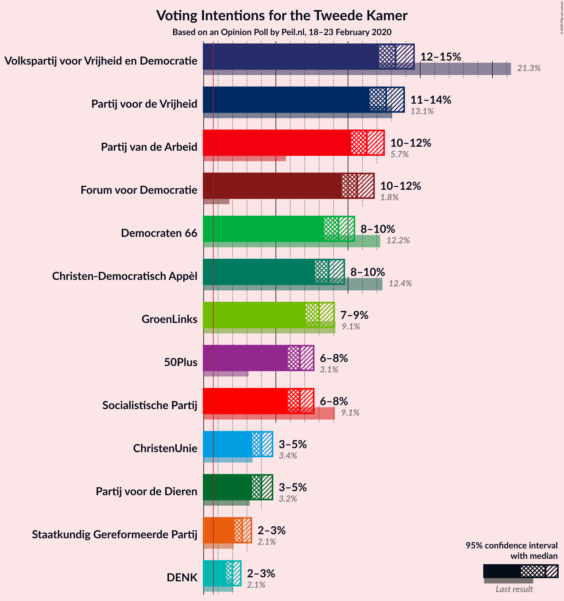

### Confidence Intervals

| Party | Last Result | Poll Result | 80% Confidence Interval | 90% Confidence Interval | 95% Confidence Interval | 99% Confidence Interval |
|:-----:|:-----------:|:-----------:|:-----------------------:|:-----------------------:|:-----------------------:|:-----------------------:|
| Volkspartij voor Vrijheid en Democratie | 21.3% | 13.3% | 12.5–14.1% |12.3–14.4% |12.1–14.6% |11.8–15.0% |
| Partij voor de Vrijheid | 13.1% | 12.6% | 11.9–13.4% |11.7–13.7% |11.5–13.9% |11.1–14.3% |
| Partij van de Arbeid | 5.7% | 11.3% | 10.6–12.1% |10.4–12.3% |10.2–12.5% |9.9–12.9% |
| Forum voor Democratie | 1.8% | 10.6% | 9.9–11.4% |9.7–11.6% |9.6–11.8% |9.3–12.2% |
| Democraten 66 | 12.2% | 9.3% | 8.7–10.1% |8.5–10.3% |8.3–10.4% |8.0–10.8% |
| Christen-Democratisch Appèl | 12.4% | 8.7% | 8.0–9.4% |7.8–9.6% |7.7–9.7% |7.4–10.1% |
| GroenLinks | 9.1% | 8.0% | 7.4–8.7% |7.2–8.9% |7.1–9.0% |6.8–9.4% |
| Socialistische Partij | 9.1% | 6.7% | 6.1–7.3% |6.0–7.5% |5.8–7.6% |5.6–7.9% |
| 50Plus | 3.1% | 6.7% | 6.1–7.3% |6.0–7.5% |5.8–7.6% |5.6–7.9% |
| ChristenUnie | 3.4% | 4.0% | 3.6–4.5% |3.4–4.6% |3.4–4.8% |3.2–5.0% |
| Partij voor de Dieren | 3.2% | 4.0% | 3.6–4.5% |3.4–4.6% |3.4–4.8% |3.2–5.0% |
| Staatkundig Gereformeerde Partij | 2.1% | 2.7% | 2.3–3.1% |2.2–3.2% |2.1–3.3% |2.0–3.5% |
| DENK | 2.1% | 2.0% | 1.7–2.4% |1.6–2.5% |1.6–2.6% |1.4–2.8% |

*Note:* The poll result column reflects the actual value used in the calculations. Published results may vary slightly, and in addition be rounded to fewer digits.

## Seats

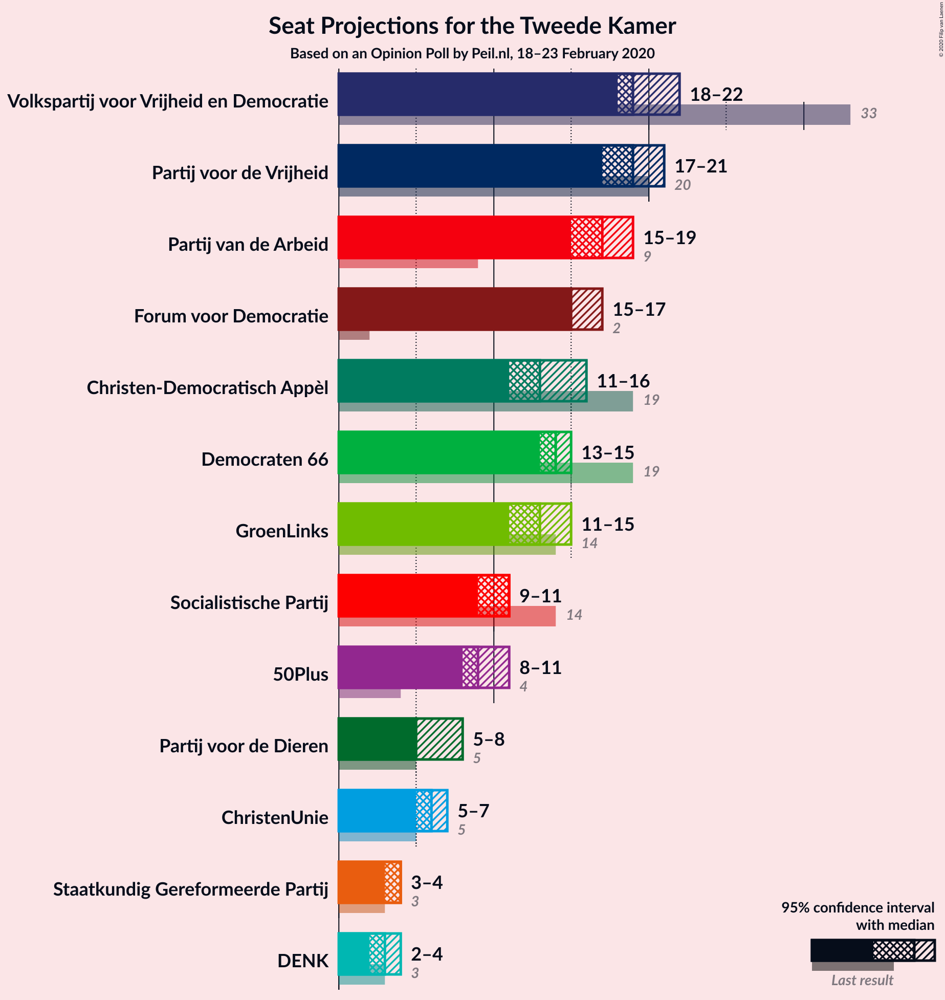

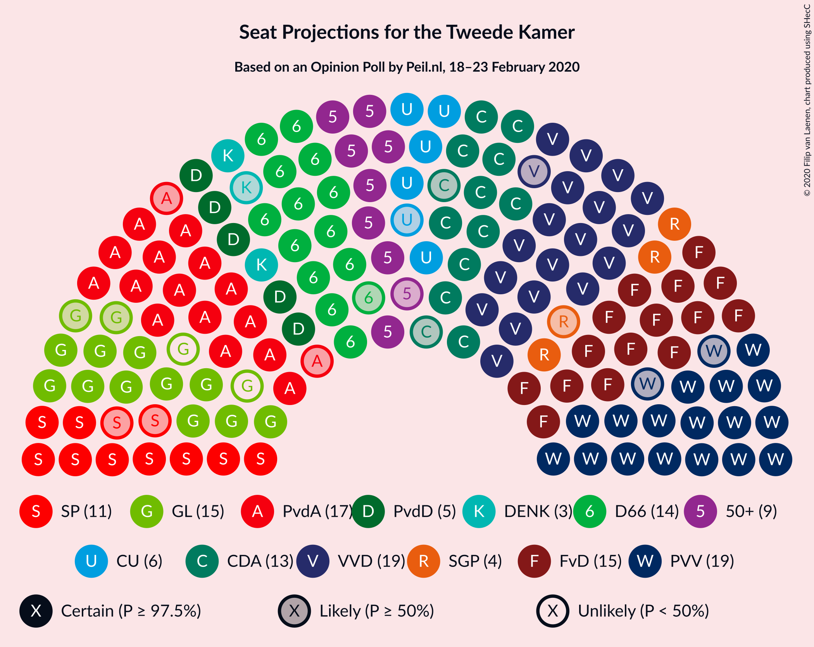

### Confidence Intervals

| Party | Last Result | Median | 80% Confidence Interval | 90% Confidence Interval | 95% Confidence Interval | 99% Confidence Interval |
|:-----:|:-----------:|:------:|:-----------------------:|:-----------------------:|:-----------------------:|:-----------------------:|
| <a href="#volkspartij-voor-vrijheid-en-democratie">Volkspartij voor Vrijheid en Democratie</a> | 33 | 19 | 18–22 |18–22 |18–22 |18–22 |
| <a href="#partij-voor-de-vrijheid">Partij voor de Vrijheid</a> | 20 | 19 | 17–20 |17–21 |17–21 |16–21 |
| <a href="#partij-van-de-arbeid">Partij van de Arbeid</a> | 9 | 17 | 17–18 |17–19 |15–19 |14–19 |
| <a href="#forum-voor-democratie">Forum voor Democratie</a> | 2 | 15 | 15–17 |15–17 |15–17 |15–18 |
| <a href="#democraten-66">Democraten 66</a> | 19 | 14 | 14 |13–14 |13–15 |13–16 |
| <a href="#christen-democratisch-appèl">Christen-Democratisch Appèl</a> | 19 | 13 | 12–14 |11–14 |11–16 |10–16 |
| <a href="#groenlinks">GroenLinks</a> | 14 | 13 | 11–15 |11–15 |11–15 |11–15 |
| <a href="#socialistische-partij">Socialistische Partij</a> | 14 | 11 | 10–11 |10–11 |9–11 |8–11 |
| <a href="#50plus">50Plus</a> | 4 | 9 | 9–11 |8–11 |8–11 |8–11 |
| <a href="#christenunie">ChristenUnie</a> | 5 | 6 | 5–6 |5–6 |5–7 |5–7 |
| <a href="#partij-voor-de-dieren">Partij voor de Dieren</a> | 5 | 5 | 5–7 |5–8 |5–8 |5–8 |
| <a href="#staatkundig-gereformeerde-partij">Staatkundig Gereformeerde Partij</a> | 3 | 4 | 3–4 |3–4 |3–4 |3–5 |
| <a href="#denk">DENK</a> | 3 | 3 | 2–4 |2–4 |2–4 |2–4 |

### Volkspartij voor Vrijheid en Democratie

*For a full overview of the results for this party, see the [Volkspartij voor Vrijheid en Democratie](party-volkspartijvoorvrijheidendemocratie.html) page.*

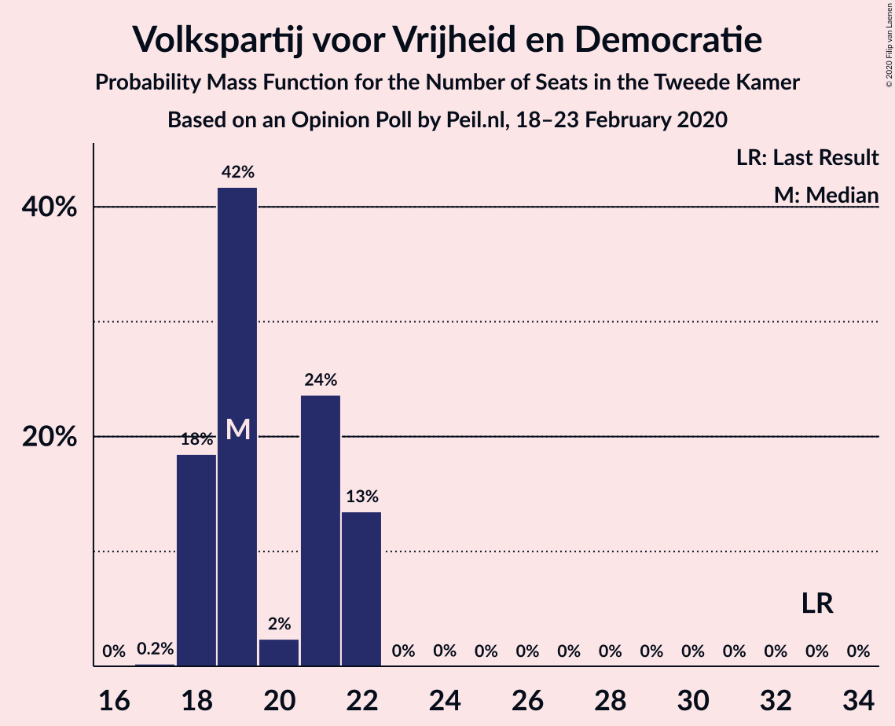

| Number of Seats | Probability | Accumulated | Special Marks |
|:---------------:|:-----------:|:-----------:|:-------------:|
| 17 | 0.2% | 100% |  |
| 18 | 18% | 99.8% |  |
| 19 | 42% | 81% | Median |
| 20 | 2% | 40% |  |
| 21 | 24% | 37% |  |
| 22 | 13% | 14% |  |
| 23 | 0% | 0.1% |  |
| 24 | 0% | 0% |  |
| 25 | 0% | 0% |  |
| 26 | 0% | 0% |  |
| 27 | 0% | 0% |  |
| 28 | 0% | 0% |  |
| 29 | 0% | 0% |  |
| 30 | 0% | 0% |  |
| 31 | 0% | 0% |  |
| 32 | 0% | 0% |  |
| 33 | 0% | 0% | Last Result |

### Partij voor de Vrijheid

*For a full overview of the results for this party, see the [Partij voor de Vrijheid](party-partijvoordevrijheid.html) page.*

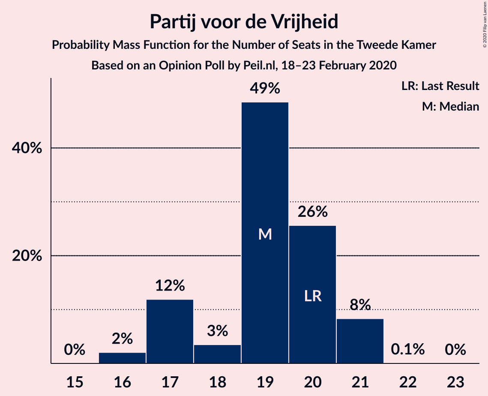

| Number of Seats | Probability | Accumulated | Special Marks |
|:---------------:|:-----------:|:-----------:|:-------------:|
| 16 | 2% | 100% |  |
| 17 | 12% | 98% |  |
| 18 | 3% | 86% |  |
| 19 | 49% | 83% | Median |
| 20 | 26% | 34% | Last Result |
| 21 | 8% | 8% |  |
| 22 | 0.1% | 0.1% |  |
| 23 | 0% | 0% |  |

### Partij van de Arbeid

*For a full overview of the results for this party, see the [Partij van de Arbeid](party-partijvandearbeid.html) page.*

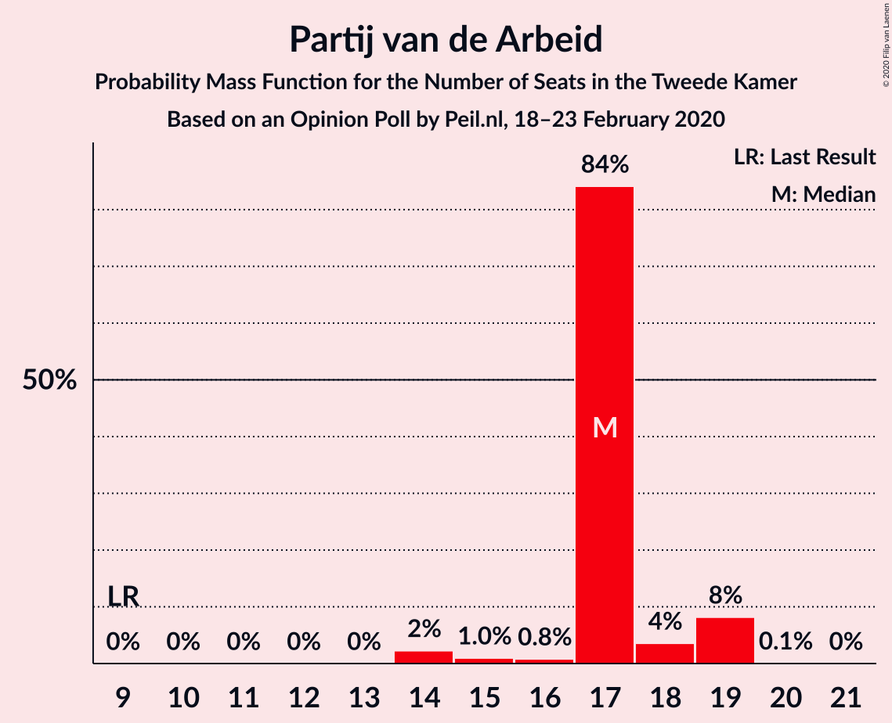

| Number of Seats | Probability | Accumulated | Special Marks |
|:---------------:|:-----------:|:-----------:|:-------------:|
| 9 | 0% | 100% | Last Result |
| 10 | 0% | 100% |  |
| 11 | 0% | 100% |  |
| 12 | 0% | 100% |  |
| 13 | 0% | 100% |  |
| 14 | 2% | 100% |  |
| 15 | 1.0% | 98% |  |
| 16 | 0.8% | 97% |  |
| 17 | 84% | 96% | Median |
| 18 | 4% | 12% |  |
| 19 | 8% | 8% |  |
| 20 | 0.1% | 0.1% |  |
| 21 | 0% | 0% |  |

### Forum voor Democratie

*For a full overview of the results for this party, see the [Forum voor Democratie](party-forumvoordemocratie.html) page.*

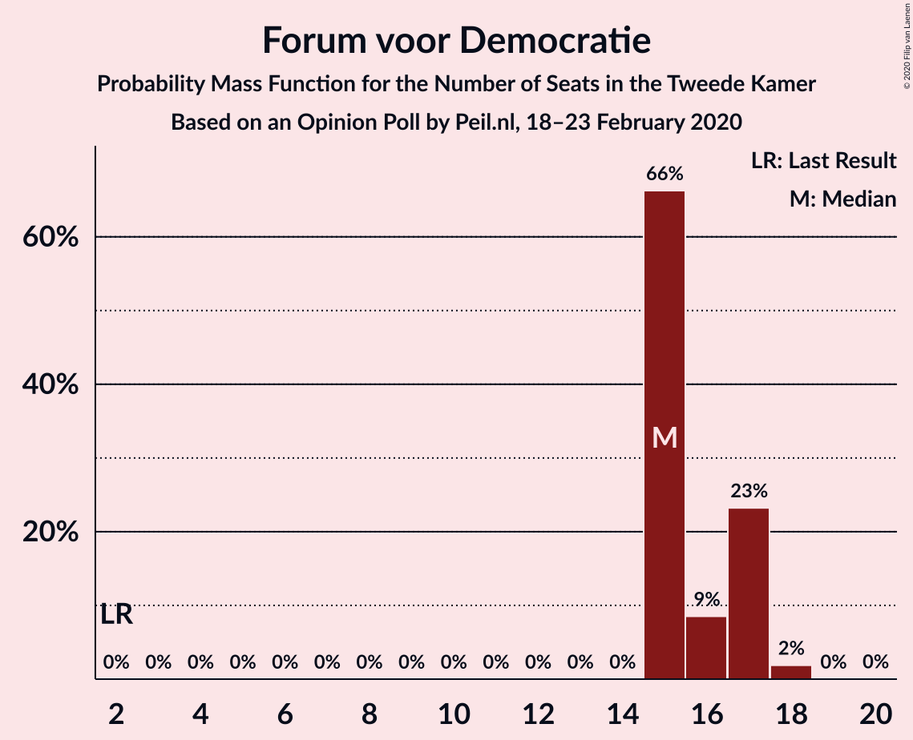

| Number of Seats | Probability | Accumulated | Special Marks |
|:---------------:|:-----------:|:-----------:|:-------------:|
| 2 | 0% | 100% | Last Result |
| 3 | 0% | 100% |  |
| 4 | 0% | 100% |  |
| 5 | 0% | 100% |  |
| 6 | 0% | 100% |  |
| 7 | 0% | 100% |  |
| 8 | 0% | 100% |  |
| 9 | 0% | 100% |  |
| 10 | 0% | 100% |  |
| 11 | 0% | 100% |  |
| 12 | 0% | 100% |  |
| 13 | 0% | 100% |  |
| 14 | 0% | 100% |  |
| 15 | 66% | 100% | Median |
| 16 | 9% | 34% |  |
| 17 | 23% | 25% |  |
| 18 | 2% | 2% |  |
| 19 | 0% | 0.1% |  |
| 20 | 0% | 0% |  |

### Democraten 66

*For a full overview of the results for this party, see the [Democraten 66](party-democraten66.html) page.*

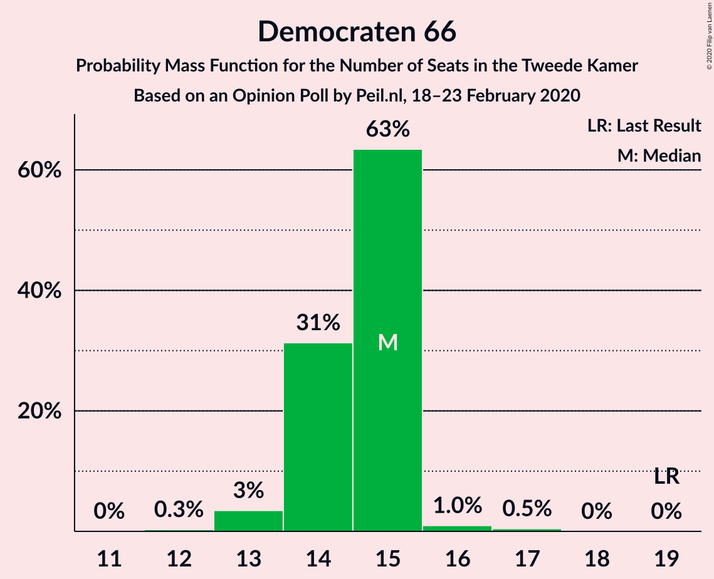

| Number of Seats | Probability | Accumulated | Special Marks |
|:---------------:|:-----------:|:-----------:|:-------------:|
| 12 | 0.2% | 100% |  |
| 13 | 9% | 99.8% |  |
| 14 | 86% | 91% | Median |
| 15 | 4% | 5% |  |
| 16 | 0.7% | 0.7% |  |
| 17 | 0.1% | 0.1% |  |
| 18 | 0% | 0% |  |
| 19 | 0% | 0% | Last Result |

### Christen-Democratisch Appèl

*For a full overview of the results for this party, see the [Christen-Democratisch Appèl](party-christen-democratischappèl.html) page.*

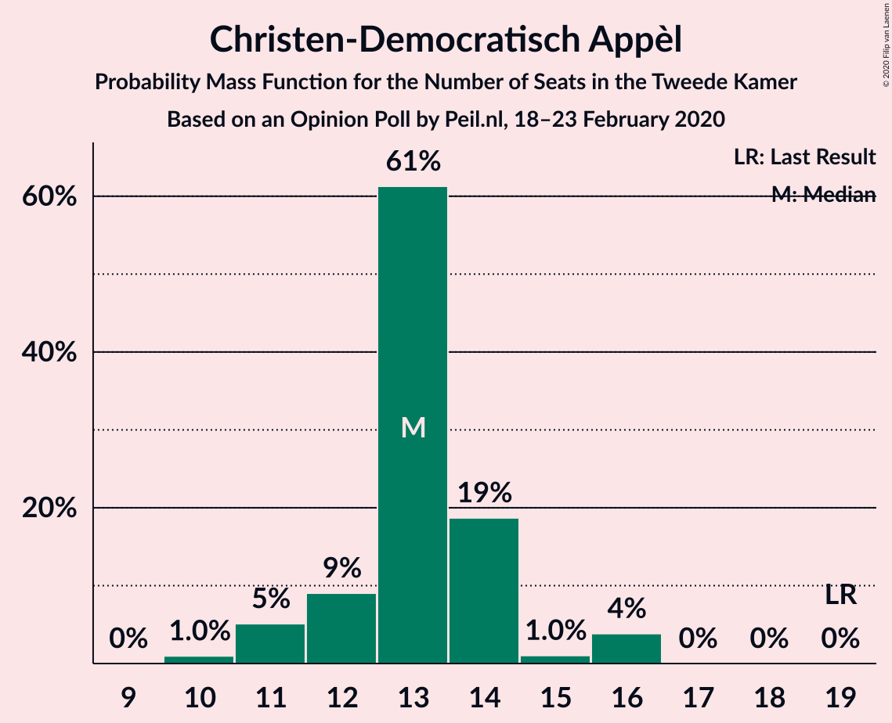

| Number of Seats | Probability | Accumulated | Special Marks |
|:---------------:|:-----------:|:-----------:|:-------------:|
| 10 | 1.0% | 100% |  |
| 11 | 5% | 99.0% |  |
| 12 | 9% | 94% |  |
| 13 | 61% | 85% | Median |
| 14 | 19% | 24% |  |
| 15 | 1.0% | 5% |  |
| 16 | 4% | 4% |  |
| 17 | 0% | 0% |  |
| 18 | 0% | 0% |  |
| 19 | 0% | 0% | Last Result |

### GroenLinks

*For a full overview of the results for this party, see the [GroenLinks](party-groenlinks.html) page.*

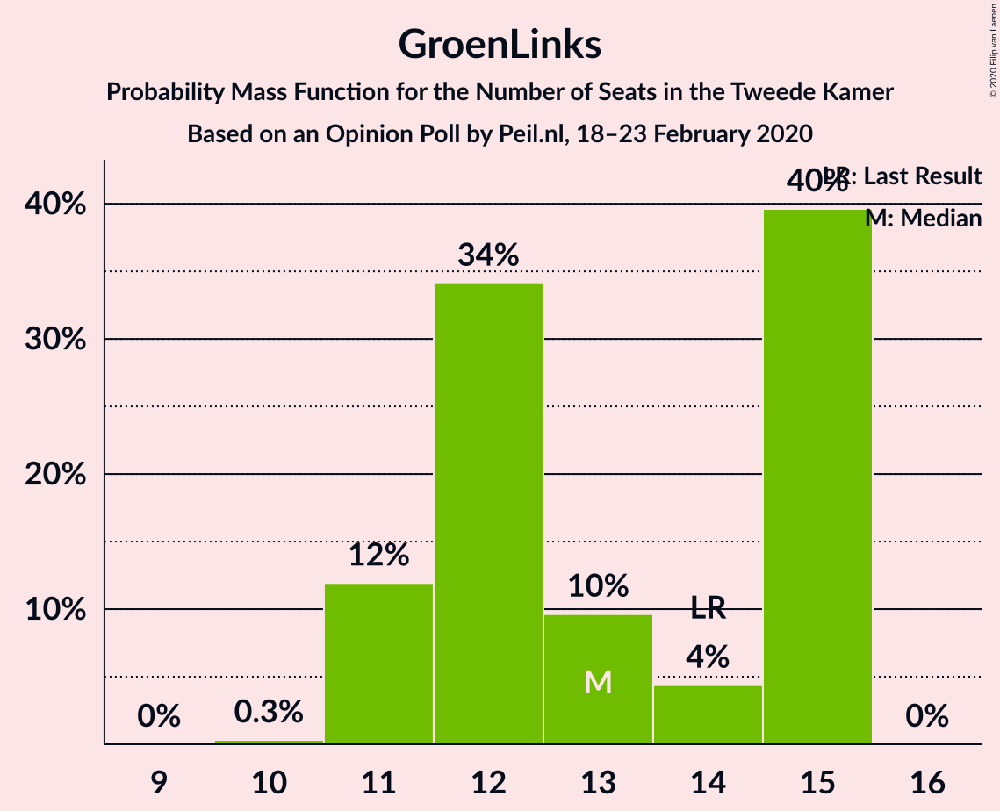

| Number of Seats | Probability | Accumulated | Special Marks |
|:---------------:|:-----------:|:-----------:|:-------------:|
| 10 | 0.3% | 100% |  |
| 11 | 12% | 99.7% |  |
| 12 | 34% | 88% |  |
| 13 | 10% | 54% | Median |
| 14 | 4% | 44% | Last Result |
| 15 | 40% | 40% |  |
| 16 | 0% | 0% |  |

### Socialistische Partij

*For a full overview of the results for this party, see the [Socialistische Partij](party-socialistischepartij.html) page.*

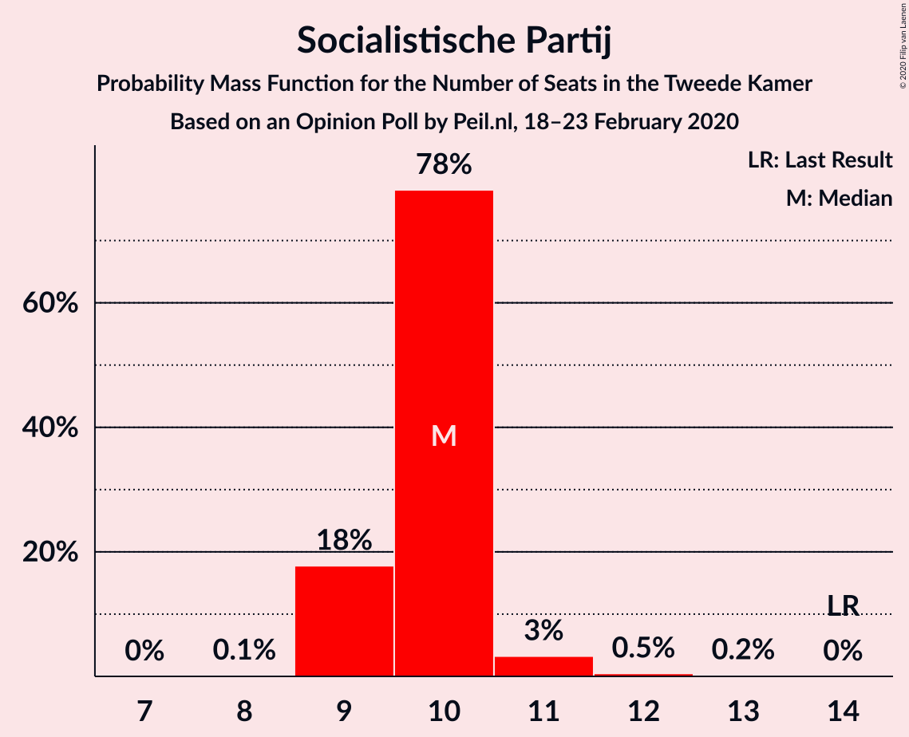

| Number of Seats | Probability | Accumulated | Special Marks |
|:---------------:|:-----------:|:-----------:|:-------------:|
| 8 | 2% | 100% |  |
| 9 | 1.3% | 98% |  |
| 10 | 21% | 97% |  |
| 11 | 75% | 76% | Median |
| 12 | 0.2% | 0.2% |  |
| 13 | 0% | 0% |  |
| 14 | 0% | 0% | Last Result |

### 50Plus

*For a full overview of the results for this party, see the [50Plus](party-50plus.html) page.*

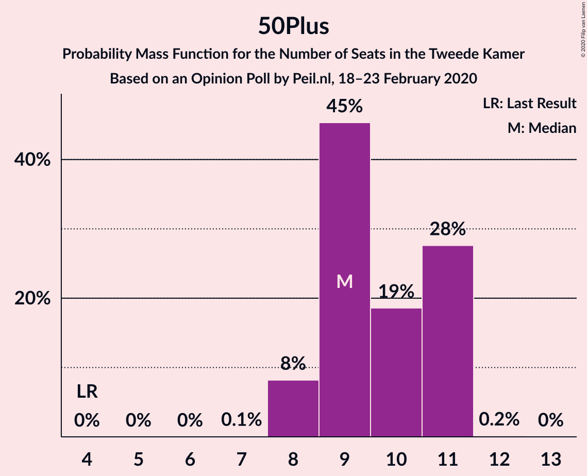

| Number of Seats | Probability | Accumulated | Special Marks |
|:---------------:|:-----------:|:-----------:|:-------------:|
| 4 | 0% | 100% | Last Result |
| 5 | 0% | 100% |  |
| 6 | 0% | 100% |  |
| 7 | 0.1% | 100% |  |
| 8 | 8% | 99.9% |  |
| 9 | 45% | 92% | Median |
| 10 | 19% | 46% |  |
| 11 | 28% | 28% |  |
| 12 | 0.2% | 0.2% |  |
| 13 | 0% | 0% |  |

### ChristenUnie

*For a full overview of the results for this party, see the [ChristenUnie](party-christenunie.html) page.*

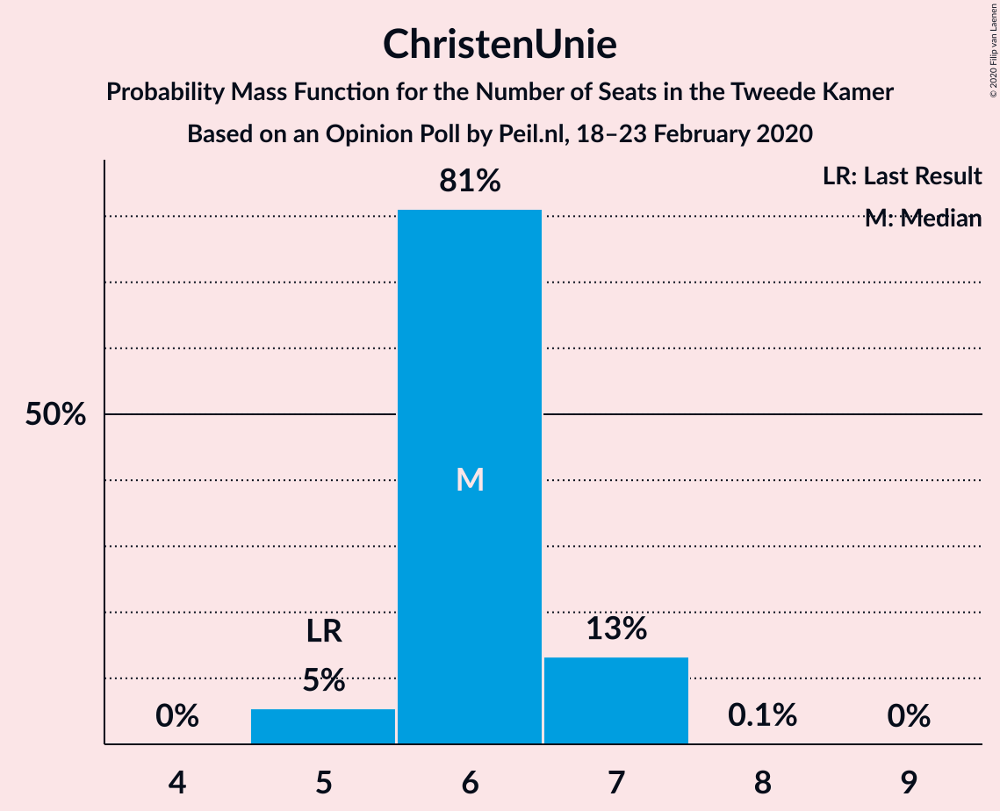

| Number of Seats | Probability | Accumulated | Special Marks |
|:---------------:|:-----------:|:-----------:|:-------------:|
| 5 | 37% | 100% | Last Result |
| 6 | 61% | 63% | Median |
| 7 | 3% | 3% |  |
| 8 | 0% | 0% |  |

### Partij voor de Dieren

*For a full overview of the results for this party, see the [Partij voor de Dieren](party-partijvoordedieren.html) page.*

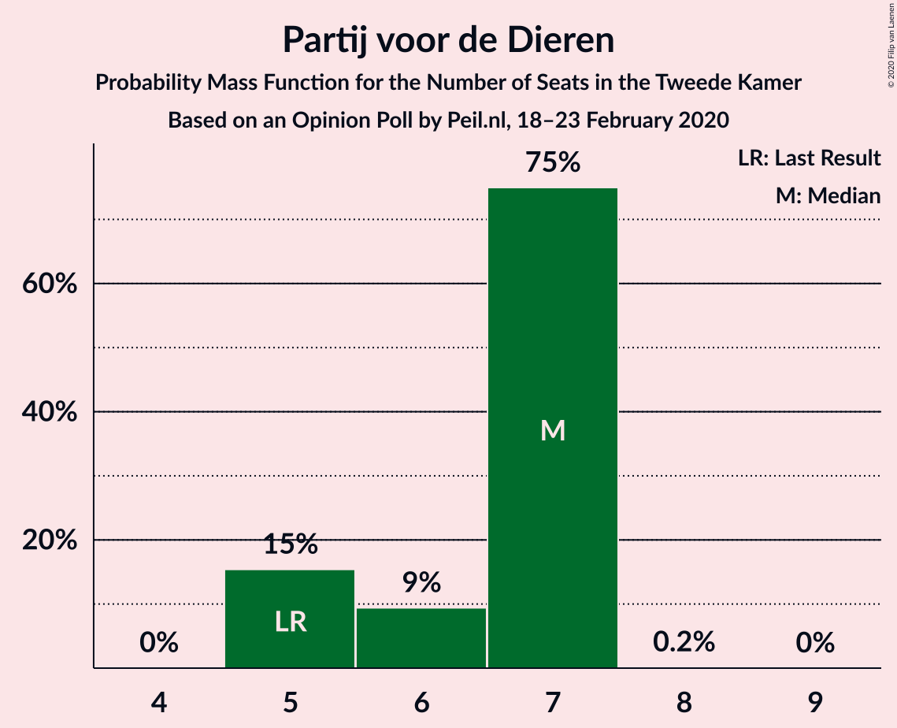

| Number of Seats | Probability | Accumulated | Special Marks |
|:---------------:|:-----------:|:-----------:|:-------------:|
| 5 | 59% | 100% | Last Result, Median |
| 6 | 31% | 41% |  |
| 7 | 3% | 10% |  |
| 8 | 7% | 7% |  |
| 9 | 0% | 0% |  |

### Staatkundig Gereformeerde Partij

*For a full overview of the results for this party, see the [Staatkundig Gereformeerde Partij](party-staatkundiggereformeerdepartij.html) page.*

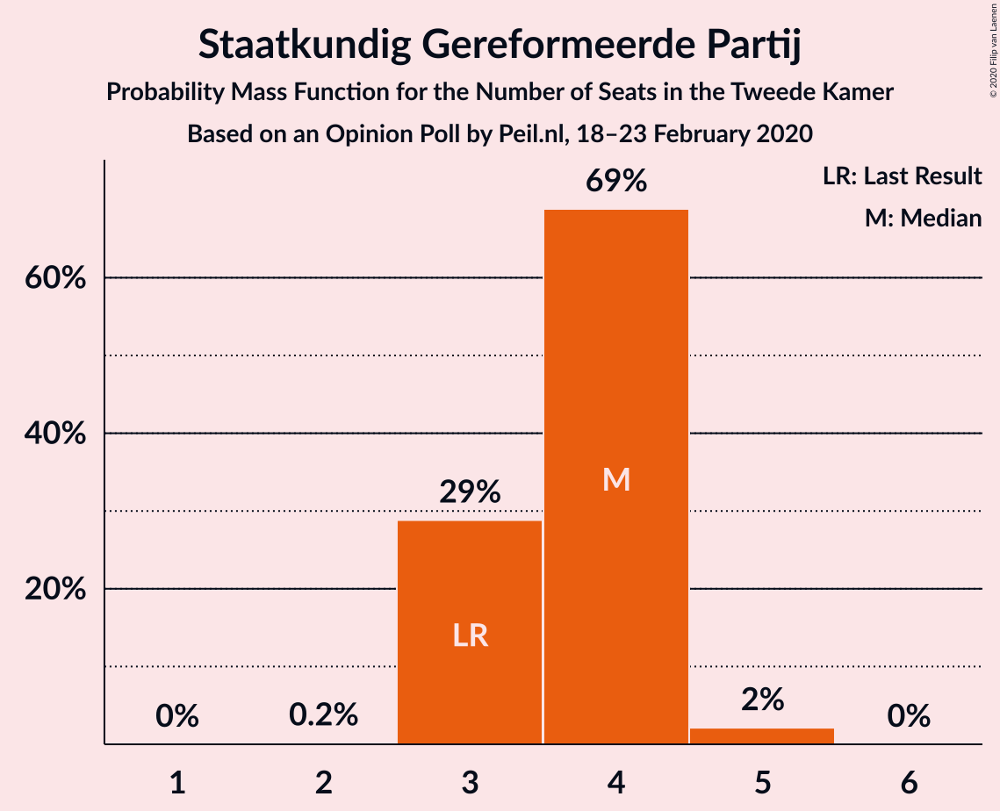

| Number of Seats | Probability | Accumulated | Special Marks |
|:---------------:|:-----------:|:-----------:|:-------------:|
| 2 | 0.2% | 100% |  |
| 3 | 29% | 99.8% | Last Result |
| 4 | 69% | 71% | Median |
| 5 | 2% | 2% |  |
| 6 | 0% | 0% |  |

### DENK

*For a full overview of the results for this party, see the [DENK](party-denk.html) page.*

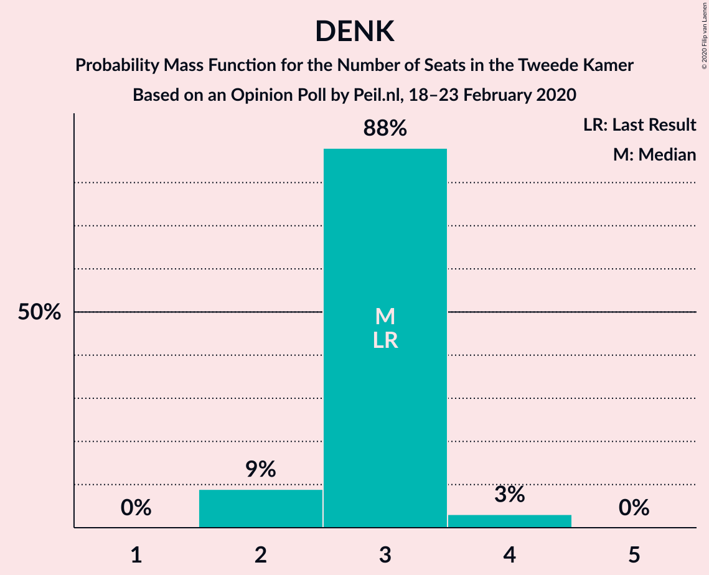

| Number of Seats | Probability | Accumulated | Special Marks |
|:---------------:|:-----------:|:-----------:|:-------------:|
| 2 | 30% | 100% |  |
| 3 | 59% | 70% | Last Result, Median |
| 4 | 12% | 12% |  |
| 5 | 0% | 0% |  |

## Coalitions

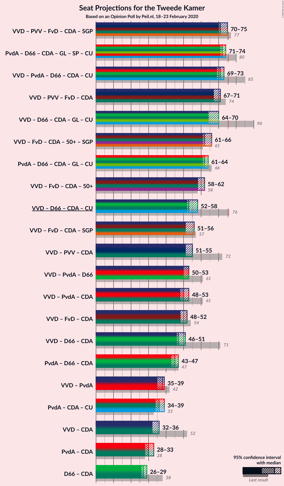

### Confidence Intervals

| Coalition | Last Result | Median | Majority? | 80% Confidence Interval | 90% Confidence Interval | 95% Confidence Interval | 99% Confidence Interval |
|:---------:|:-----------:|:------:|:---------:|:-----------------------:|:-----------------------:|:-----------------------:|:-----------------------:|
| Partij van de Arbeid – Democraten 66 – Christen-Democratisch Appèl – GroenLinks – Socialistische Partij – ChristenUnie | 80 | 73 | 42% | 70–76 | 69–76 | 69–76 | 68–76 |
| Volkspartij voor Vrijheid en Democratie – Partij voor de Vrijheid – Forum voor Democratie – Christen-Democratisch Appèl – Staatkundig Gereformeerde Partij | 77 | 70 | 2% | 70–74 | 70–74 | 70–75 | 70–76 |
| Volkspartij voor Vrijheid en Democratie – Partij van de Arbeid – Democraten 66 – Christen-Democratisch Appèl – ChristenUnie | 85 | 69 | 0.9% | 68–72 | 68–72 | 68–75 | 66–76 |
| Volkspartij voor Vrijheid en Democratie – Partij voor de Vrijheid – Forum voor Democratie – Christen-Democratisch Appèl | 74 | 67 | 0% | 66–71 | 66–71 | 66–71 | 66–72 |
| Volkspartij voor Vrijheid en Democratie – Democraten 66 – Christen-Democratisch Appèl – GroenLinks – ChristenUnie | 90 | 67 | 0% | 63–67 | 63–67 | 63–69 | 63–69 |
| Partij van de Arbeid – Democraten 66 – Christen-Democratisch Appèl – GroenLinks – ChristenUnie | 66 | 63 | 0% | 61–65 | 59–65 | 59–66 | 58–66 |
| Volkspartij voor Vrijheid en Democratie – Forum voor Democratie – Christen-Democratisch Appèl – 50Plus – Staatkundig Gereformeerde Partij | 61 | 61 | 0% | 60–64 | 60–64 | 59–65 | 59–66 |
| Volkspartij voor Vrijheid en Democratie – Forum voor Democratie – Christen-Democratisch Appèl – 50Plus | 58 | 58 | 0% | 56–60 | 56–61 | 56–62 | 56–62 |
| Volkspartij voor Vrijheid en Democratie – Democraten 66 – Christen-Democratisch Appèl – ChristenUnie | 76 | 52 | 0% | 51–55 | 51–55 | 51–57 | 51–58 |
| Volkspartij voor Vrijheid en Democratie – Forum voor Democratie – Christen-Democratisch Appèl – Staatkundig Gereformeerde Partij | 57 | 52 | 0% | 51–53 | 51–54 | 50–55 | 50–56 |
| Volkspartij voor Vrijheid en Democratie – Partij voor de Vrijheid – Christen-Democratisch Appèl | 72 | 52 | 0% | 51–55 | 51–55 | 50–55 | 50–55 |
| Volkspartij voor Vrijheid en Democratie – Partij van de Arbeid – Christen-Democratisch Appèl | 61 | 49 | 0% | 49–53 | 49–53 | 49–54 | 47–55 |
| Volkspartij voor Vrijheid en Democratie – Partij van de Arbeid – Democraten 66 | 61 | 50 | 0% | 49–53 | 49–53 | 49–53 | 48–54 |
| Volkspartij voor Vrijheid en Democratie – Forum voor Democratie – Christen-Democratisch Appèl | 54 | 48 | 0% | 47–50 | 47–51 | 47–52 | 47–52 |
| Volkspartij voor Vrijheid en Democratie – Democraten 66 – Christen-Democratisch Appèl | 71 | 46 | 0% | 46–49 | 46–50 | 46–51 | 45–51 |
| Partij van de Arbeid – Democraten 66 – Christen-Democratisch Appèl | 47 | 44 | 0% | 43–45 | 42–45 | 42–48 | 39–48 |
| Volkspartij voor Vrijheid en Democratie – Partij van de Arbeid | 42 | 36 | 0% | 35–39 | 35–40 | 35–40 | 33–40 |
| Partij van de Arbeid – Christen-Democratisch Appèl – ChristenUnie | 33 | 36 | 0% | 34–37 | 34–37 | 34–40 | 32–40 |
| Volkspartij voor Vrijheid en Democratie – Christen-Democratisch Appèl | 52 | 32 | 0% | 32–35 | 32–35 | 32–36 | 32–37 |
| Partij van de Arbeid – Christen-Democratisch Appèl | 28 | 30 | 0% | 29–32 | 28–32 | 28–33 | 26–34 |
| Democraten 66 – Christen-Democratisch Appèl | 38 | 27 | 0% | 26–28 | 25–29 | 25–30 | 24–31 |

### Partij van de Arbeid – Democraten 66 – Christen-Democratisch Appèl – GroenLinks – Socialistische Partij – ChristenUnie

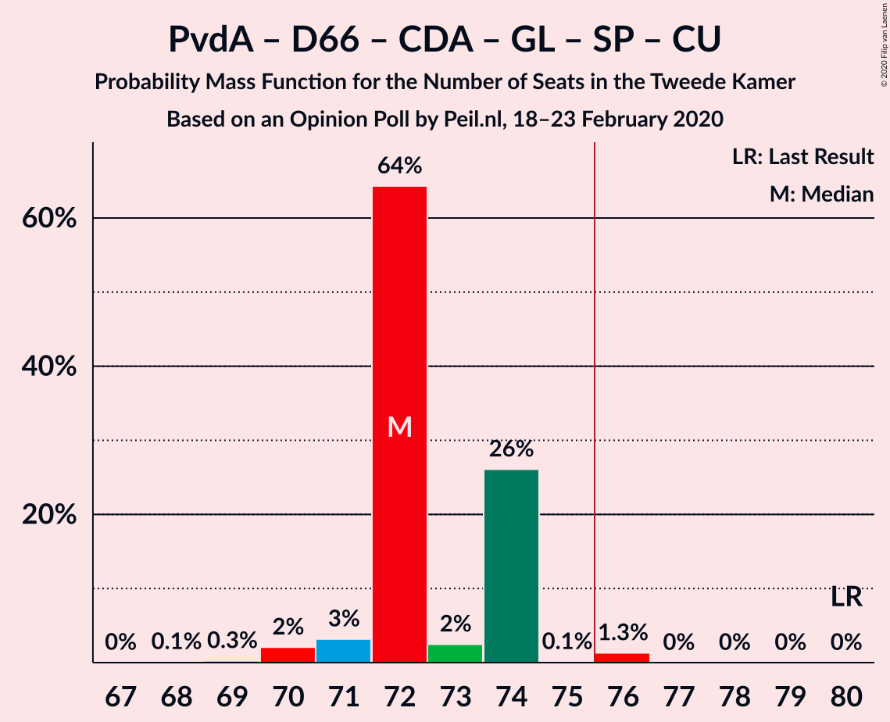

| Number of Seats | Probability | Accumulated | Special Marks |
|:---------------:|:-----------:|:-----------:|:-------------:|
| 67 | 0.1% | 100% |  |
| 68 | 1.0% | 99.9% |  |
| 69 | 8% | 99.0% |  |
| 70 | 3% | 91% |  |
| 71 | 3% | 89% |  |
| 72 | 0.5% | 86% |  |
| 73 | 42% | 86% |  |
| 74 | 0.3% | 43% | Median |
| 75 | 1.2% | 43% |  |
| 76 | 42% | 42% | Majority |
| 77 | 0% | 0% |  |
| 78 | 0% | 0% |  |
| 79 | 0% | 0% |  |
| 80 | 0% | 0% | Last Result |

### Volkspartij voor Vrijheid en Democratie – Partij voor de Vrijheid – Forum voor Democratie – Christen-Democratisch Appèl – Staatkundig Gereformeerde Partij

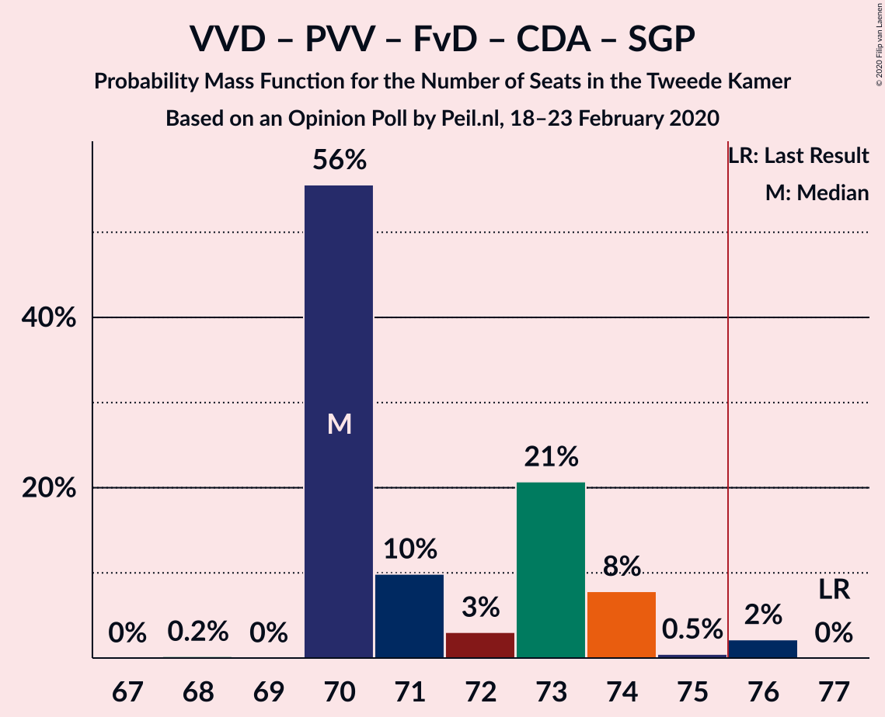

| Number of Seats | Probability | Accumulated | Special Marks |
|:---------------:|:-----------:|:-----------:|:-------------:|
| 68 | 0.2% | 100% |  |
| 69 | 0% | 99.8% |  |
| 70 | 56% | 99.7% | Median |
| 71 | 10% | 44% |  |
| 72 | 3% | 34% |  |
| 73 | 21% | 31% |  |
| 74 | 8% | 11% |  |
| 75 | 0.5% | 3% |  |
| 76 | 2% | 2% | Majority |
| 77 | 0% | 0% | Last Result |

### Volkspartij voor Vrijheid en Democratie – Partij van de Arbeid – Democraten 66 – Christen-Democratisch Appèl – ChristenUnie

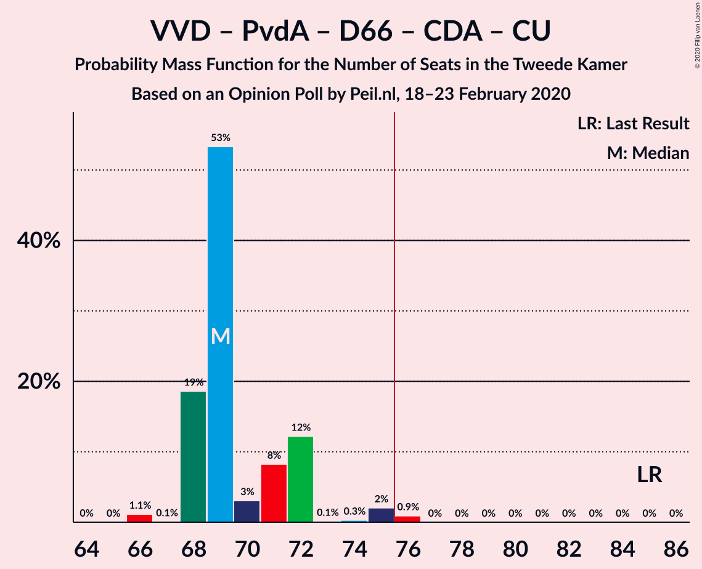

| Number of Seats | Probability | Accumulated | Special Marks |
|:---------------:|:-----------:|:-----------:|:-------------:|
| 66 | 1.1% | 100% |  |
| 67 | 0.1% | 98.8% |  |
| 68 | 19% | 98.8% |  |
| 69 | 53% | 80% | Median |
| 70 | 3% | 27% |  |
| 71 | 8% | 24% |  |
| 72 | 12% | 16% |  |
| 73 | 0.1% | 3% |  |
| 74 | 0.3% | 3% |  |
| 75 | 2% | 3% |  |
| 76 | 0.9% | 0.9% | Majority |
| 77 | 0% | 0% |  |
| 78 | 0% | 0% |  |
| 79 | 0% | 0% |  |
| 80 | 0% | 0% |  |
| 81 | 0% | 0% |  |
| 82 | 0% | 0% |  |
| 83 | 0% | 0% |  |
| 84 | 0% | 0% |  |
| 85 | 0% | 0% | Last Result |

### Volkspartij voor Vrijheid en Democratie – Partij voor de Vrijheid – Forum voor Democratie – Christen-Democratisch Appèl

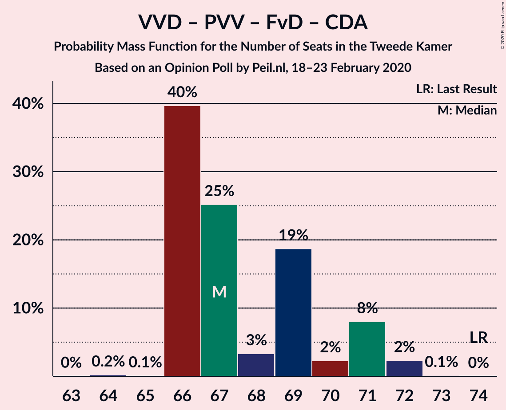

| Number of Seats | Probability | Accumulated | Special Marks |
|:---------------:|:-----------:|:-----------:|:-------------:|
| 64 | 0.2% | 100% |  |
| 65 | 0.1% | 99.8% |  |
| 66 | 40% | 99.7% | Median |
| 67 | 25% | 60% |  |
| 68 | 3% | 35% |  |
| 69 | 19% | 31% |  |
| 70 | 2% | 13% |  |
| 71 | 8% | 10% |  |
| 72 | 2% | 2% |  |
| 73 | 0.1% | 0.1% |  |
| 74 | 0% | 0% | Last Result |

### Volkspartij voor Vrijheid en Democratie – Democraten 66 – Christen-Democratisch Appèl – GroenLinks – ChristenUnie

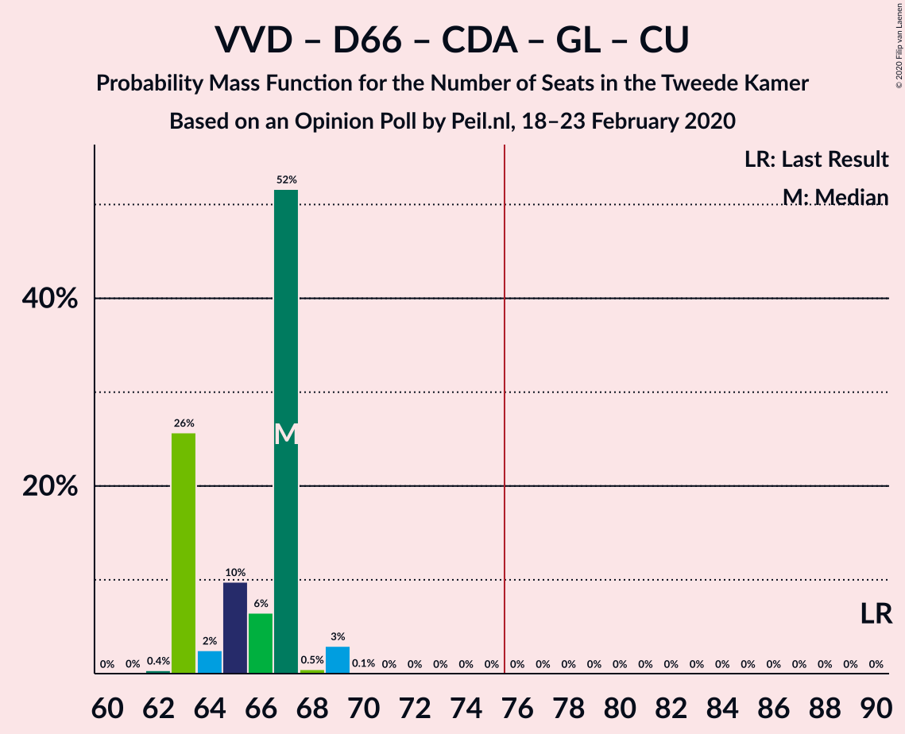

| Number of Seats | Probability | Accumulated | Special Marks |
|:---------------:|:-----------:|:-----------:|:-------------:|
| 62 | 0.4% | 100% |  |
| 63 | 26% | 99.6% |  |
| 64 | 2% | 74% |  |
| 65 | 10% | 71% | Median |
| 66 | 6% | 62% |  |
| 67 | 52% | 55% |  |
| 68 | 0.5% | 4% |  |
| 69 | 3% | 3% |  |
| 70 | 0.1% | 0.1% |  |
| 71 | 0% | 0% |  |
| 72 | 0% | 0% |  |
| 73 | 0% | 0% |  |
| 74 | 0% | 0% |  |
| 75 | 0% | 0% |  |
| 76 | 0% | 0% | Majority |
| 77 | 0% | 0% |  |
| 78 | 0% | 0% |  |
| 79 | 0% | 0% |  |
| 80 | 0% | 0% |  |
| 81 | 0% | 0% |  |
| 82 | 0% | 0% |  |
| 83 | 0% | 0% |  |
| 84 | 0% | 0% |  |
| 85 | 0% | 0% |  |
| 86 | 0% | 0% |  |
| 87 | 0% | 0% |  |
| 88 | 0% | 0% |  |
| 89 | 0% | 0% |  |
| 90 | 0% | 0% | Last Result |

### Partij van de Arbeid – Democraten 66 – Christen-Democratisch Appèl – GroenLinks – ChristenUnie

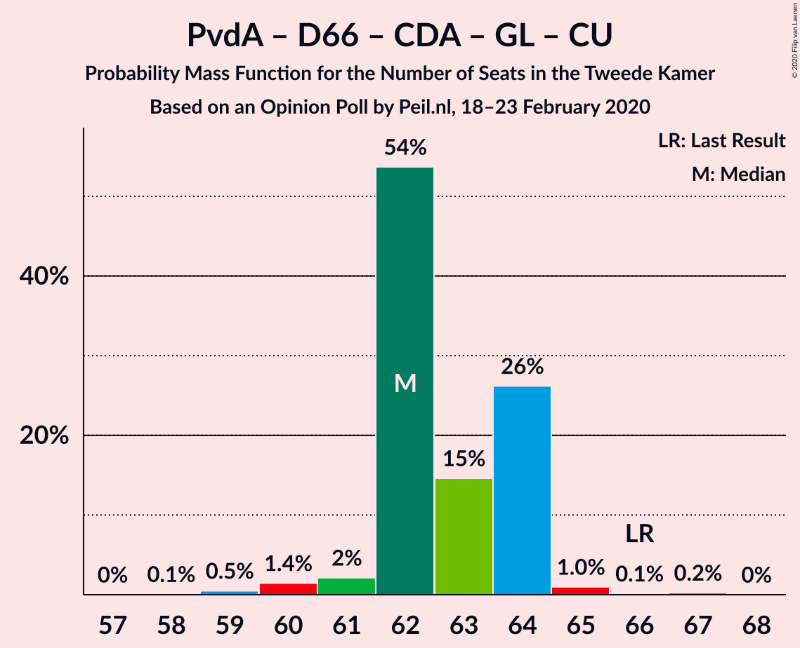

| Number of Seats | Probability | Accumulated | Special Marks |
|:---------------:|:-----------:|:-----------:|:-------------:|
| 58 | 1.0% | 100% |  |
| 59 | 9% | 99.0% |  |
| 60 | 0.3% | 90% |  |
| 61 | 2% | 90% |  |
| 62 | 36% | 88% |  |
| 63 | 8% | 52% | Median |
| 64 | 0.4% | 43% |  |
| 65 | 40% | 43% |  |
| 66 | 3% | 3% | Last Result |
| 67 | 0% | 0% |  |

### Volkspartij voor Vrijheid en Democratie – Forum voor Democratie – Christen-Democratisch Appèl – 50Plus – Staatkundig Gereformeerde Partij

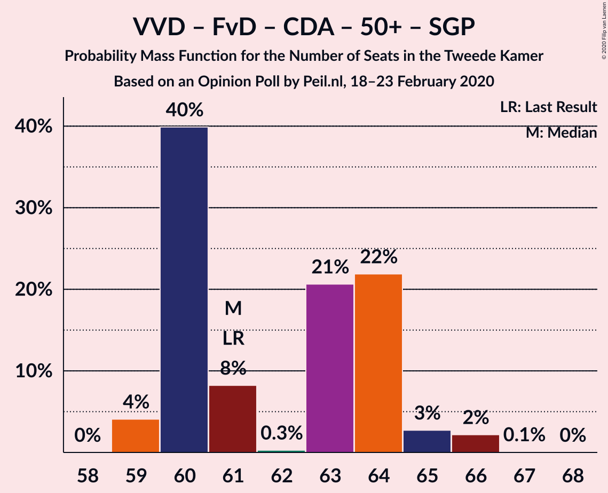

| Number of Seats | Probability | Accumulated | Special Marks |
|:---------------:|:-----------:|:-----------:|:-------------:|
| 59 | 4% | 100% |  |
| 60 | 40% | 96% | Median |
| 61 | 8% | 56% | Last Result |
| 62 | 0.3% | 48% |  |
| 63 | 21% | 48% |  |
| 64 | 22% | 27% |  |
| 65 | 3% | 5% |  |
| 66 | 2% | 2% |  |
| 67 | 0.1% | 0.1% |  |
| 68 | 0% | 0% |  |

### Volkspartij voor Vrijheid en Democratie – Forum voor Democratie – Christen-Democratisch Appèl – 50Plus

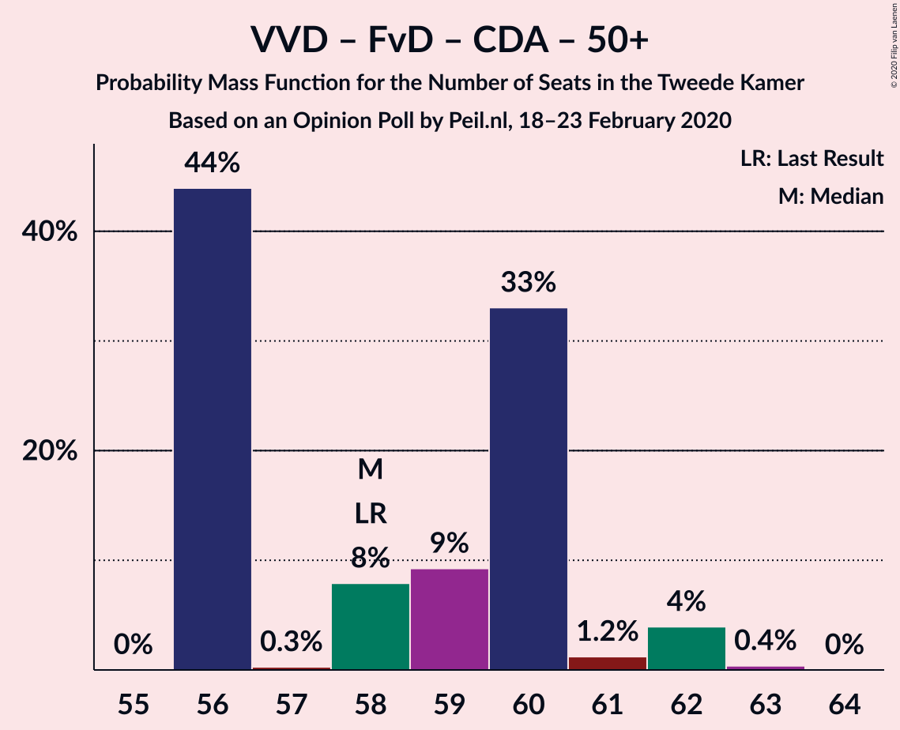

| Number of Seats | Probability | Accumulated | Special Marks |
|:---------------:|:-----------:|:-----------:|:-------------:|
| 56 | 44% | 100% | Median |
| 57 | 0.3% | 56% |  |
| 58 | 8% | 56% | Last Result |
| 59 | 9% | 48% |  |
| 60 | 33% | 39% |  |
| 61 | 1.2% | 6% |  |
| 62 | 4% | 4% |  |
| 63 | 0.4% | 0.4% |  |
| 64 | 0% | 0% |  |

### Volkspartij voor Vrijheid en Democratie – Democraten 66 – Christen-Democratisch Appèl – ChristenUnie

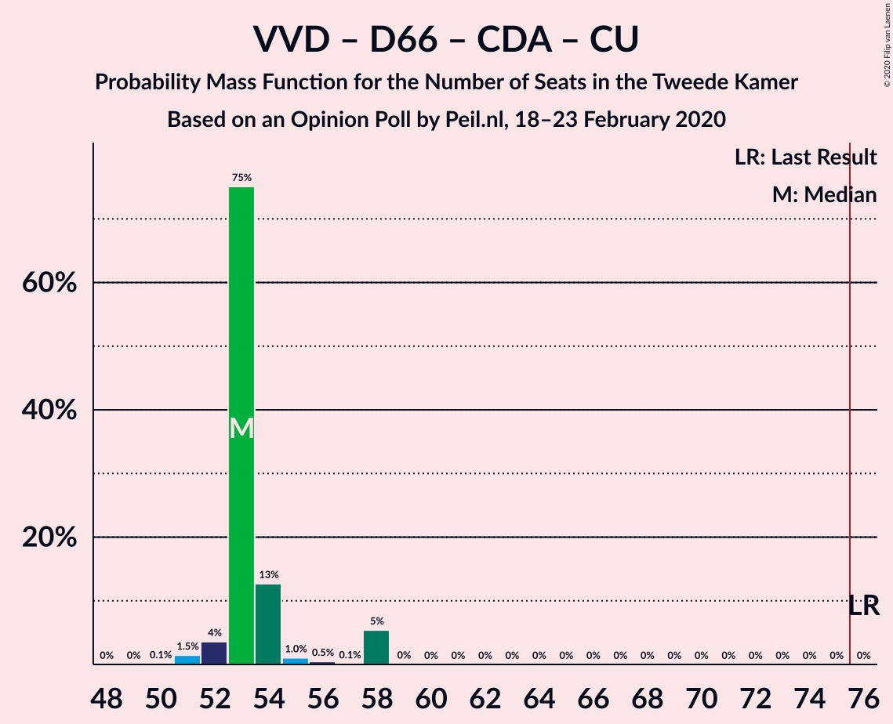

| Number of Seats | Probability | Accumulated | Special Marks |
|:---------------:|:-----------:|:-----------:|:-------------:|
| 49 | 0.3% | 100% |  |
| 50 | 0.1% | 99.7% |  |
| 51 | 20% | 99.6% |  |
| 52 | 59% | 80% | Median |
| 53 | 3% | 21% |  |
| 54 | 0.5% | 18% |  |
| 55 | 14% | 18% |  |
| 56 | 0.3% | 3% |  |
| 57 | 2% | 3% |  |
| 58 | 1.0% | 1.0% |  |
| 59 | 0% | 0% |  |
| 60 | 0% | 0% |  |
| 61 | 0% | 0% |  |
| 62 | 0% | 0% |  |
| 63 | 0% | 0% |  |
| 64 | 0% | 0% |  |
| 65 | 0% | 0% |  |
| 66 | 0% | 0% |  |
| 67 | 0% | 0% |  |
| 68 | 0% | 0% |  |
| 69 | 0% | 0% |  |
| 70 | 0% | 0% |  |
| 71 | 0% | 0% |  |
| 72 | 0% | 0% |  |
| 73 | 0% | 0% |  |
| 74 | 0% | 0% |  |
| 75 | 0% | 0% |  |
| 76 | 0% | 0% | Last Result, Majority |

### Volkspartij voor Vrijheid en Democratie – Forum voor Democratie – Christen-Democratisch Appèl – Staatkundig Gereformeerde Partij

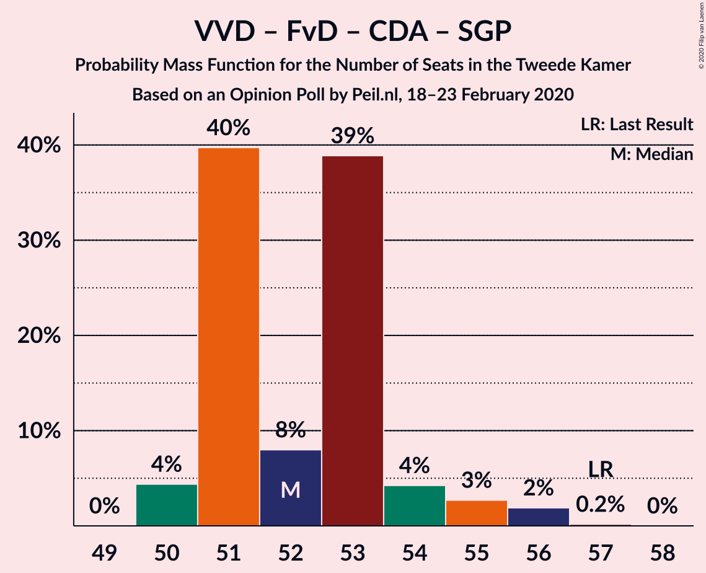

| Number of Seats | Probability | Accumulated | Special Marks |
|:---------------:|:-----------:|:-----------:|:-------------:|
| 50 | 4% | 100% |  |
| 51 | 40% | 96% | Median |
| 52 | 8% | 56% |  |
| 53 | 39% | 48% |  |
| 54 | 4% | 9% |  |
| 55 | 3% | 5% |  |
| 56 | 2% | 2% |  |
| 57 | 0.2% | 0.2% | Last Result |
| 58 | 0% | 0% |  |

### Volkspartij voor Vrijheid en Democratie – Partij voor de Vrijheid – Christen-Democratisch Appèl

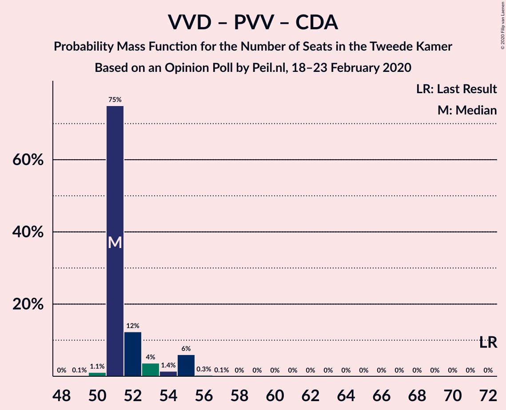

| Number of Seats | Probability | Accumulated | Special Marks |
|:---------------:|:-----------:|:-----------:|:-------------:|
| 48 | 0.3% | 100% |  |
| 49 | 0% | 99.7% |  |
| 50 | 3% | 99.7% |  |
| 51 | 40% | 97% | Median |
| 52 | 43% | 57% |  |
| 53 | 3% | 14% |  |
| 54 | 0.2% | 11% |  |
| 55 | 11% | 11% |  |
| 56 | 0% | 0.2% |  |
| 57 | 0% | 0.2% |  |
| 58 | 0.1% | 0.1% |  |
| 59 | 0% | 0% |  |
| 60 | 0% | 0% |  |
| 61 | 0% | 0% |  |
| 62 | 0% | 0% |  |
| 63 | 0% | 0% |  |
| 64 | 0% | 0% |  |
| 65 | 0% | 0% |  |
| 66 | 0% | 0% |  |
| 67 | 0% | 0% |  |
| 68 | 0% | 0% |  |
| 69 | 0% | 0% |  |
| 70 | 0% | 0% |  |
| 71 | 0% | 0% |  |
| 72 | 0% | 0% | Last Result |

### Volkspartij voor Vrijheid en Democratie – Partij van de Arbeid – Christen-Democratisch Appèl

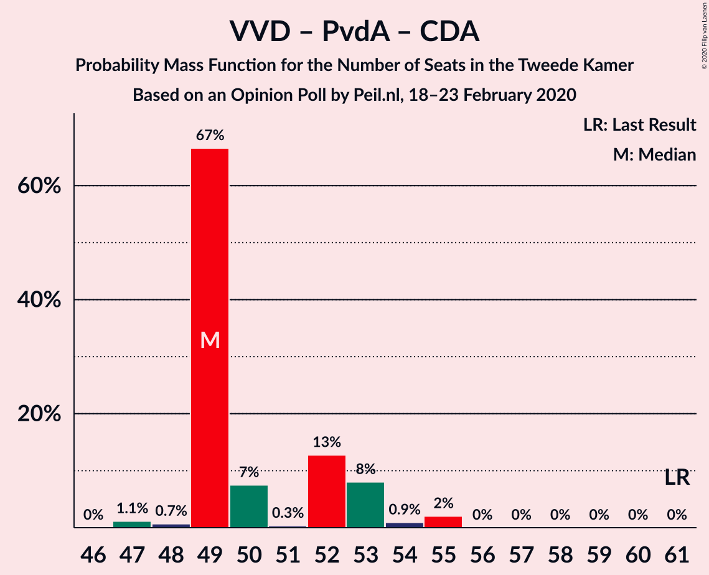

| Number of Seats | Probability | Accumulated | Special Marks |
|:---------------:|:-----------:|:-----------:|:-------------:|
| 47 | 1.1% | 100% |  |
| 48 | 0.7% | 98.8% |  |
| 49 | 67% | 98% | Median |
| 50 | 7% | 32% |  |
| 51 | 0.3% | 24% |  |
| 52 | 13% | 24% |  |
| 53 | 8% | 11% |  |
| 54 | 0.9% | 3% |  |
| 55 | 2% | 2% |  |
| 56 | 0% | 0% |  |
| 57 | 0% | 0% |  |
| 58 | 0% | 0% |  |
| 59 | 0% | 0% |  |
| 60 | 0% | 0% |  |
| 61 | 0% | 0% | Last Result |

### Volkspartij voor Vrijheid en Democratie – Partij van de Arbeid – Democraten 66

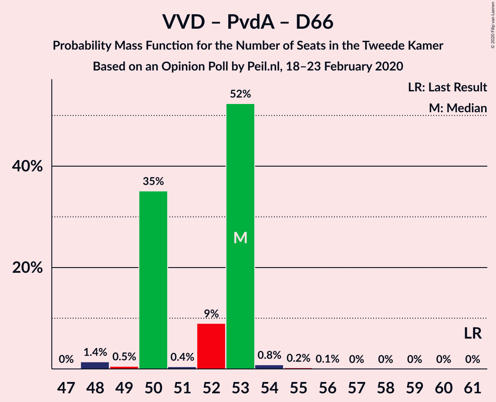

| Number of Seats | Probability | Accumulated | Special Marks |
|:---------------:|:-----------:|:-----------:|:-------------:|
| 48 | 2% | 100% |  |
| 49 | 19% | 98% |  |
| 50 | 40% | 79% | Median |
| 51 | 2% | 39% |  |
| 52 | 12% | 36% |  |
| 53 | 22% | 24% |  |
| 54 | 2% | 2% |  |
| 55 | 0.2% | 0.2% |  |
| 56 | 0% | 0% |  |
| 57 | 0% | 0% |  |
| 58 | 0% | 0% |  |
| 59 | 0% | 0% |  |
| 60 | 0% | 0% |  |
| 61 | 0% | 0% | Last Result |

### Volkspartij voor Vrijheid en Democratie – Forum voor Democratie – Christen-Democratisch Appèl

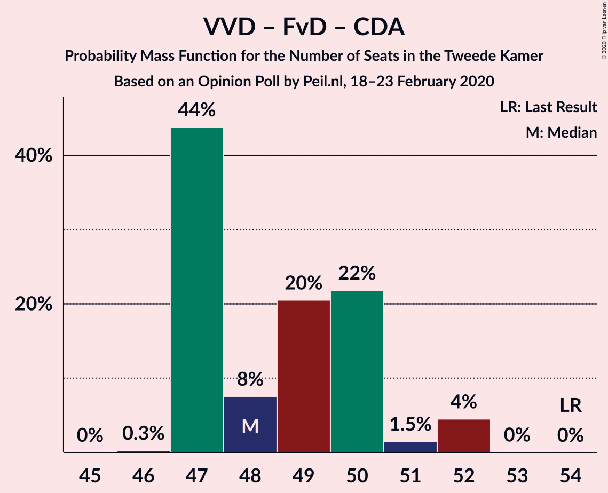

| Number of Seats | Probability | Accumulated | Special Marks |
|:---------------:|:-----------:|:-----------:|:-------------:|
| 46 | 0.3% | 100% |  |
| 47 | 44% | 99.7% | Median |
| 48 | 8% | 56% |  |
| 49 | 20% | 48% |  |
| 50 | 22% | 28% |  |
| 51 | 1.5% | 6% |  |
| 52 | 4% | 5% |  |
| 53 | 0% | 0% |  |
| 54 | 0% | 0% | Last Result |

### Volkspartij voor Vrijheid en Democratie – Democraten 66 – Christen-Democratisch Appèl

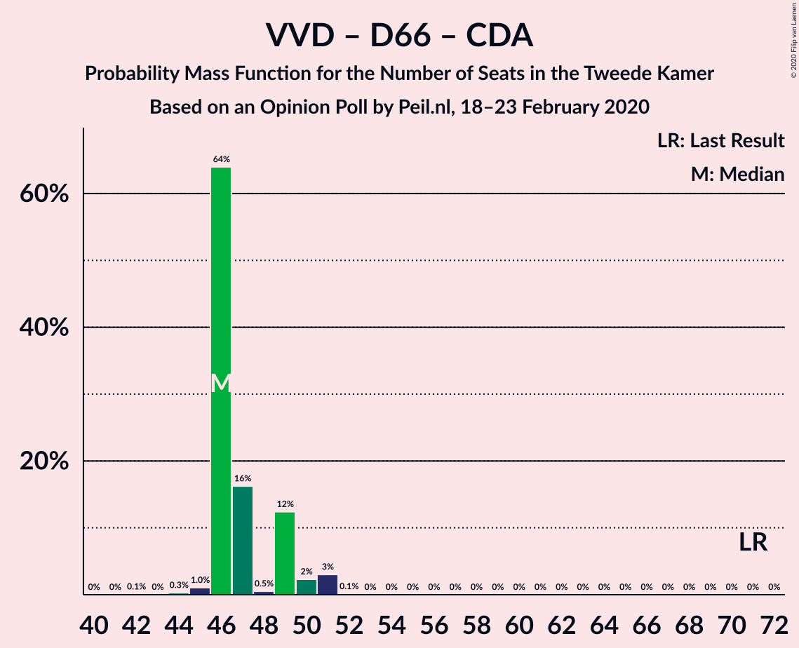

| Number of Seats | Probability | Accumulated | Special Marks |
|:---------------:|:-----------:|:-----------:|:-------------:|
| 42 | 0.1% | 100% |  |
| 43 | 0% | 99.9% |  |
| 44 | 0.3% | 99.9% |  |
| 45 | 1.0% | 99.6% |  |
| 46 | 64% | 98.6% | Median |
| 47 | 16% | 35% |  |
| 48 | 0.5% | 18% |  |
| 49 | 12% | 18% |  |
| 50 | 2% | 5% |  |
| 51 | 3% | 3% |  |
| 52 | 0.1% | 0.1% |  |
| 53 | 0% | 0% |  |
| 54 | 0% | 0% |  |
| 55 | 0% | 0% |  |
| 56 | 0% | 0% |  |
| 57 | 0% | 0% |  |
| 58 | 0% | 0% |  |
| 59 | 0% | 0% |  |
| 60 | 0% | 0% |  |
| 61 | 0% | 0% |  |
| 62 | 0% | 0% |  |
| 63 | 0% | 0% |  |
| 64 | 0% | 0% |  |
| 65 | 0% | 0% |  |
| 66 | 0% | 0% |  |
| 67 | 0% | 0% |  |
| 68 | 0% | 0% |  |
| 69 | 0% | 0% |  |
| 70 | 0% | 0% |  |
| 71 | 0% | 0% | Last Result |

### Partij van de Arbeid – Democraten 66 – Christen-Democratisch Appèl

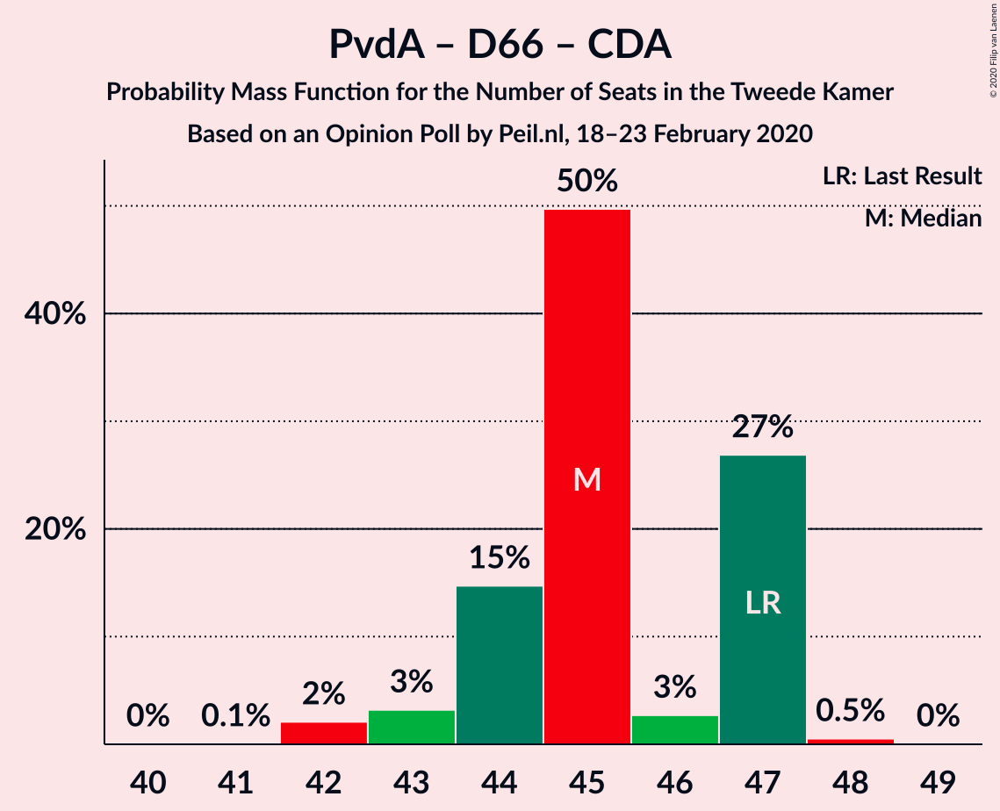

| Number of Seats | Probability | Accumulated | Special Marks |
|:---------------:|:-----------:|:-----------:|:-------------:|
| 39 | 0.9% | 100% |  |
| 40 | 0% | 99.1% |  |
| 41 | 0.2% | 99.1% |  |
| 42 | 5% | 98.9% |  |
| 43 | 10% | 94% |  |
| 44 | 52% | 84% | Median |
| 45 | 29% | 32% |  |
| 46 | 0.5% | 4% |  |
| 47 | 0.1% | 3% | Last Result |
| 48 | 3% | 3% |  |
| 49 | 0% | 0% |  |

### Volkspartij voor Vrijheid en Democratie – Partij van de Arbeid

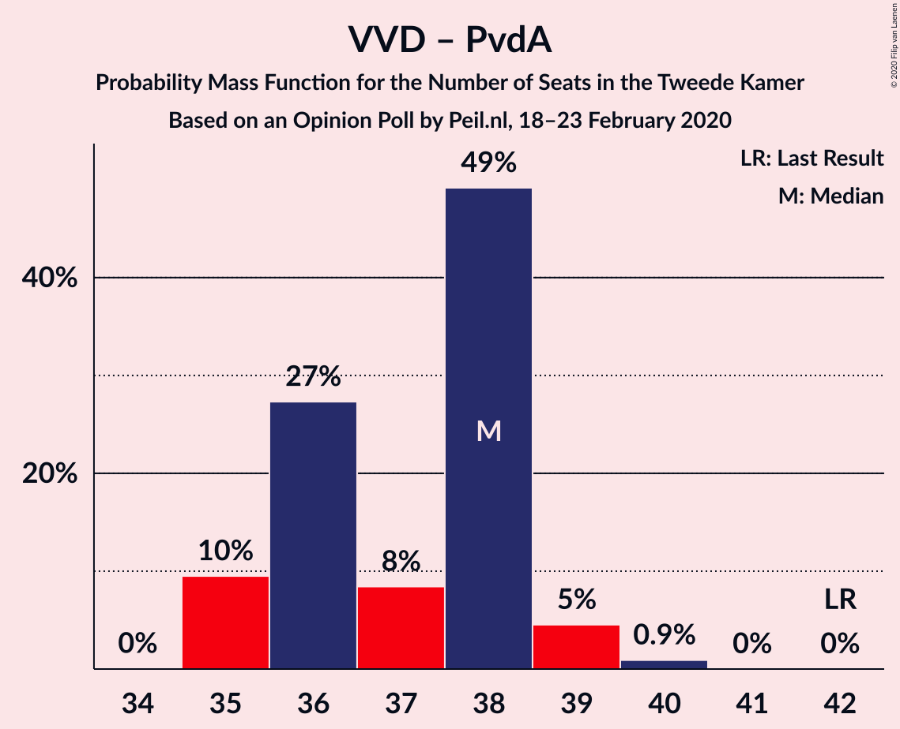

| Number of Seats | Probability | Accumulated | Special Marks |
|:---------------:|:-----------:|:-----------:|:-------------:|
| 33 | 2% | 100% |  |
| 34 | 0.2% | 98% |  |
| 35 | 19% | 98% |  |
| 36 | 41% | 79% | Median |
| 37 | 2% | 38% |  |
| 38 | 12% | 36% |  |
| 39 | 16% | 24% |  |
| 40 | 8% | 8% |  |
| 41 | 0% | 0% |  |
| 42 | 0% | 0% | Last Result |

### Partij van de Arbeid – Christen-Democratisch Appèl – ChristenUnie

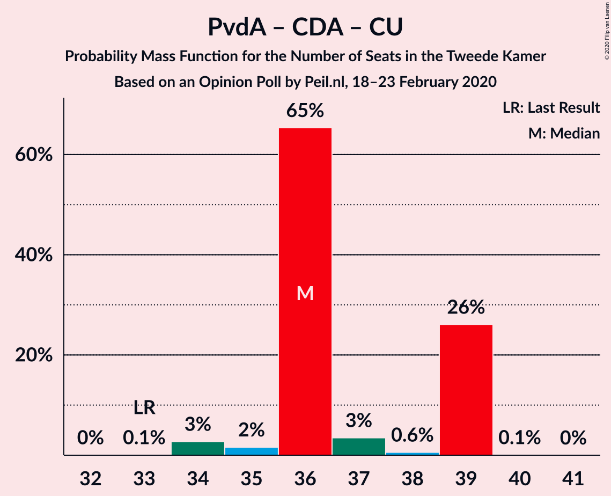

| Number of Seats | Probability | Accumulated | Special Marks |
|:---------------:|:-----------:|:-----------:|:-------------:|
| 32 | 1.4% | 100% |  |
| 33 | 0.9% | 98.6% | Last Result |
| 34 | 12% | 98% |  |
| 35 | 2% | 86% |  |
| 36 | 72% | 84% | Median |
| 37 | 9% | 12% |  |
| 38 | 0% | 3% |  |
| 39 | 0.1% | 3% |  |
| 40 | 3% | 3% |  |
| 41 | 0% | 0% |  |

### Volkspartij voor Vrijheid en Democratie – Christen-Democratisch Appèl

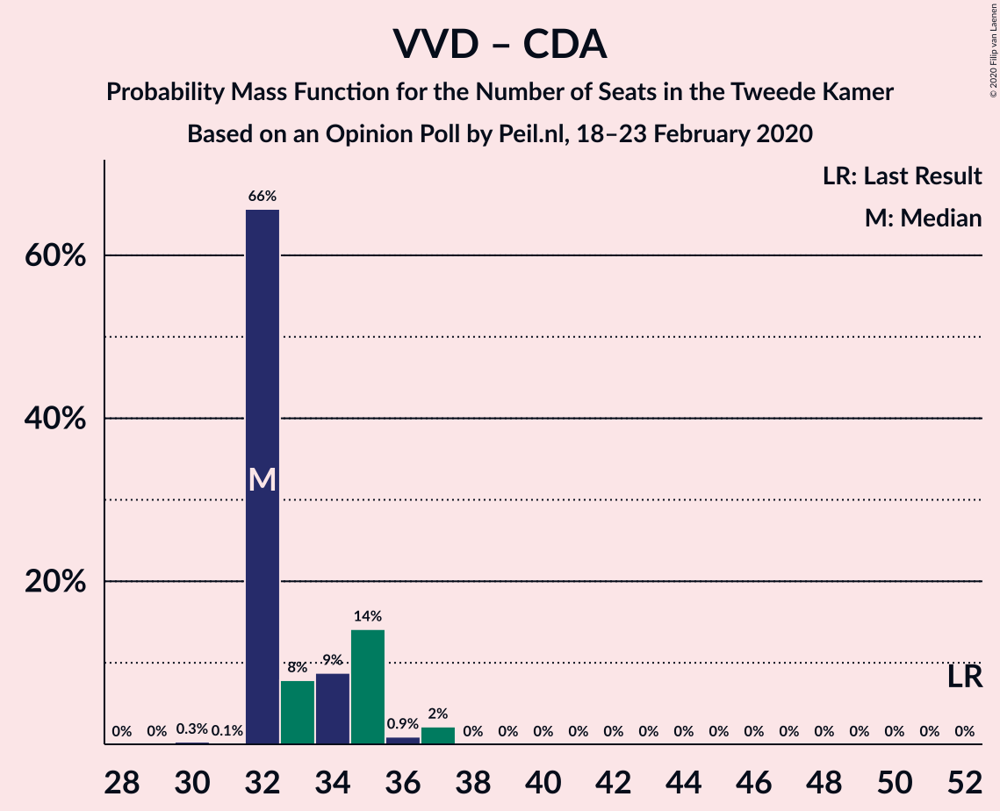

| Number of Seats | Probability | Accumulated | Special Marks |
|:---------------:|:-----------:|:-----------:|:-------------:|
| 30 | 0.3% | 100% |  |
| 31 | 0.1% | 99.7% |  |
| 32 | 66% | 99.6% | Median |
| 33 | 8% | 34% |  |
| 34 | 9% | 26% |  |
| 35 | 14% | 17% |  |
| 36 | 0.9% | 3% |  |
| 37 | 2% | 2% |  |
| 38 | 0% | 0% |  |
| 39 | 0% | 0% |  |
| 40 | 0% | 0% |  |
| 41 | 0% | 0% |  |
| 42 | 0% | 0% |  |
| 43 | 0% | 0% |  |
| 44 | 0% | 0% |  |
| 45 | 0% | 0% |  |
| 46 | 0% | 0% |  |
| 47 | 0% | 0% |  |
| 48 | 0% | 0% |  |
| 49 | 0% | 0% |  |
| 50 | 0% | 0% |  |
| 51 | 0% | 0% |  |
| 52 | 0% | 0% | Last Result |

### Partij van de Arbeid – Christen-Democratisch Appèl

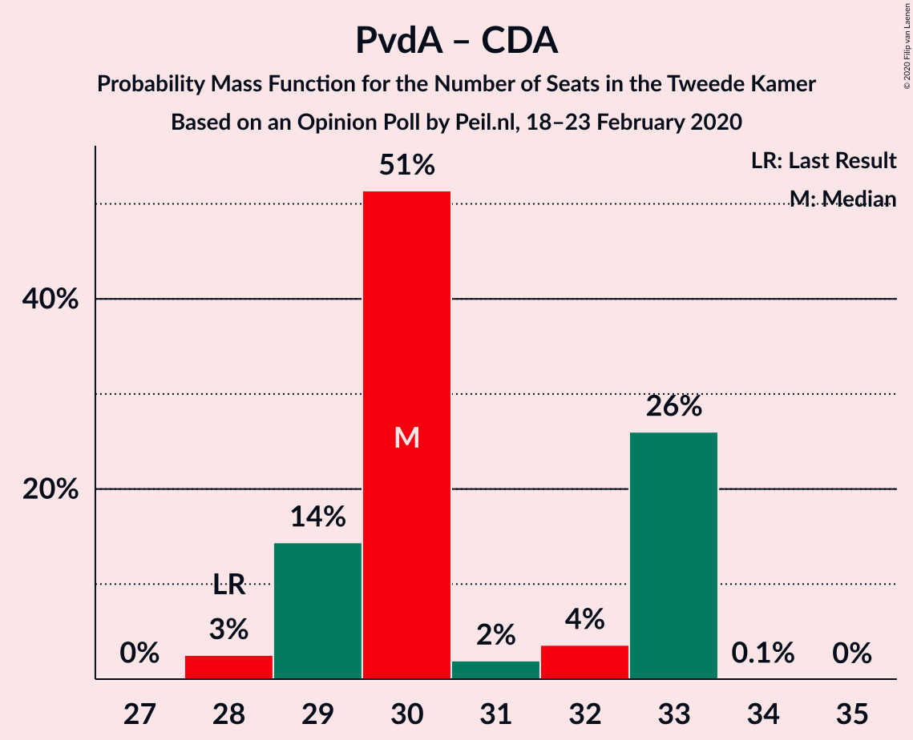

| Number of Seats | Probability | Accumulated | Special Marks |
|:---------------:|:-----------:|:-----------:|:-------------:|
| 26 | 1.0% | 100% |  |
| 27 | 1.3% | 99.0% |  |
| 28 | 4% | 98% | Last Result |
| 29 | 9% | 94% |  |
| 30 | 54% | 84% | Median |
| 31 | 19% | 30% |  |
| 32 | 8% | 11% |  |
| 33 | 1.0% | 3% |  |
| 34 | 2% | 2% |  |
| 35 | 0% | 0% |  |

### Democraten 66 – Christen-Democratisch Appèl

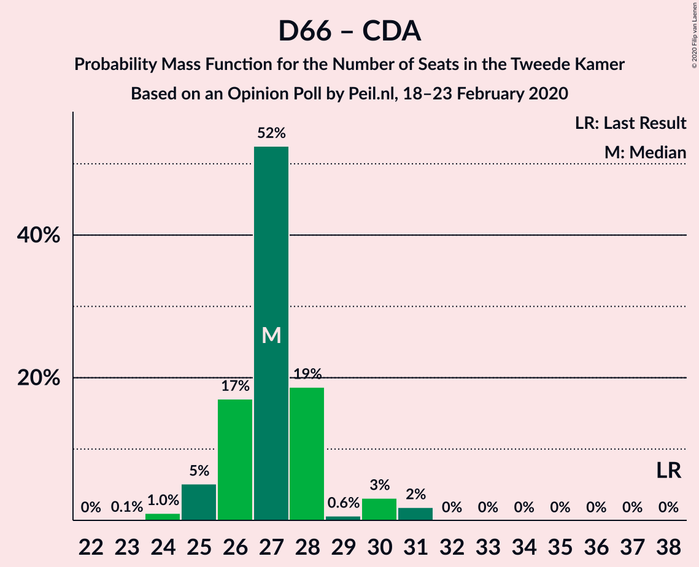

| Number of Seats | Probability | Accumulated | Special Marks |
|:---------------:|:-----------:|:-----------:|:-------------:|
| 23 | 0.1% | 100% |  |
| 24 | 1.0% | 99.9% |  |
| 25 | 5% | 98.9% |  |
| 26 | 17% | 94% |  |
| 27 | 52% | 77% | Median |
| 28 | 19% | 24% |  |
| 29 | 0.6% | 6% |  |
| 30 | 3% | 5% |  |
| 31 | 2% | 2% |  |
| 32 | 0% | 0% |  |
| 33 | 0% | 0% |  |
| 34 | 0% | 0% |  |
| 35 | 0% | 0% |  |
| 36 | 0% | 0% |  |
| 37 | 0% | 0% |  |
| 38 | 0% | 0% | Last Result |

## Technical Information

### Opinion Poll

+ **Polling firm:** Peil.nl
+ **Commissioner(s):** —
+ **Fieldwork period:** 18–23 February 2020

### Calculations

+ **Sample size:** 3000
+ **Simulations done:** 131,072
+ **Error estimate:** 1.40%

