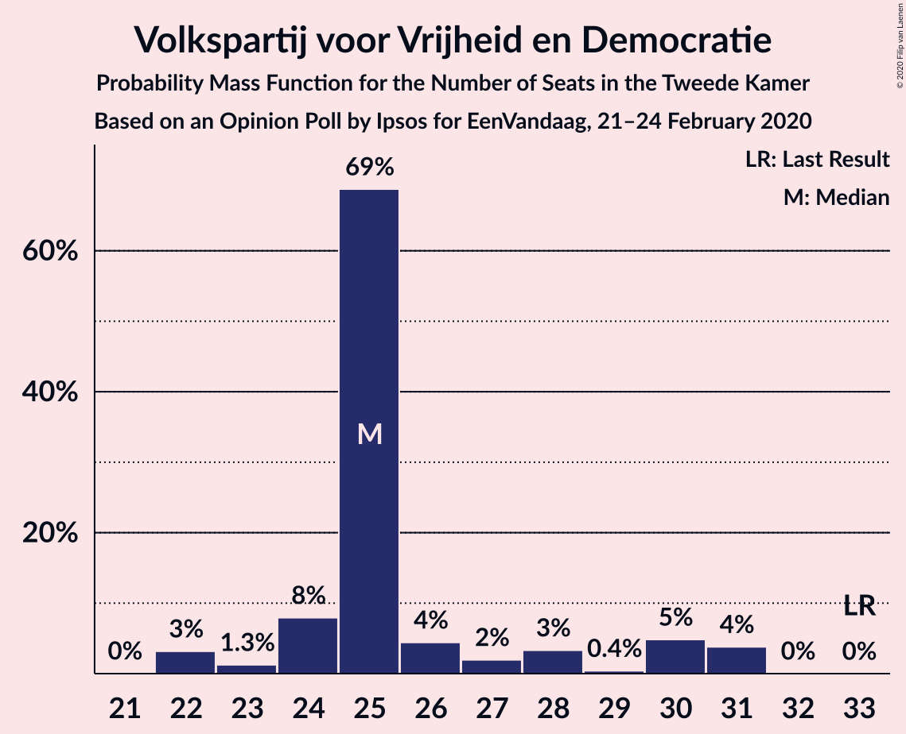
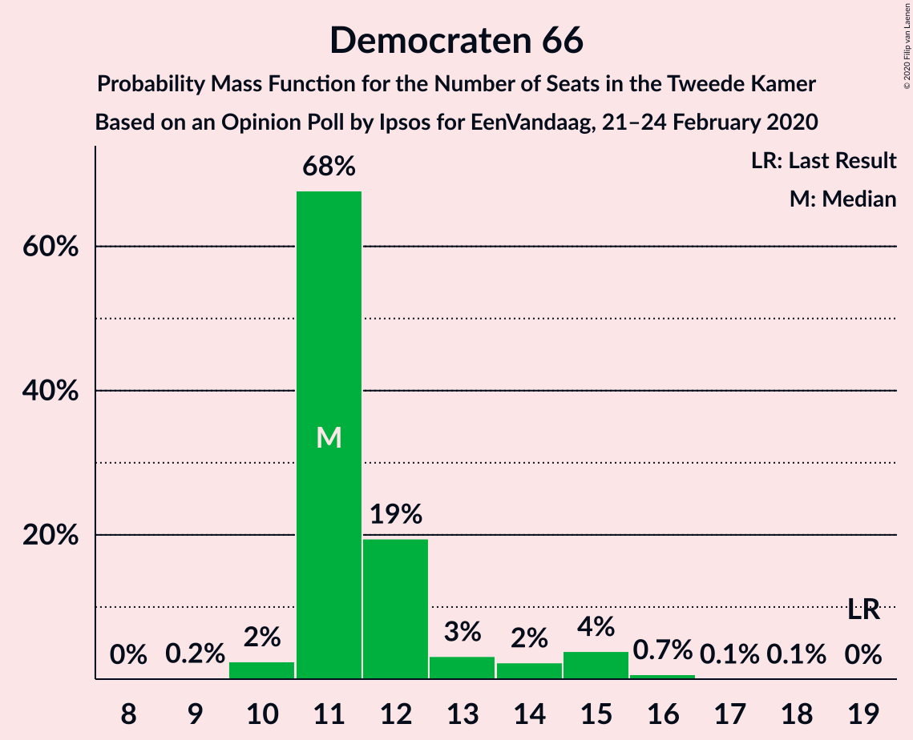
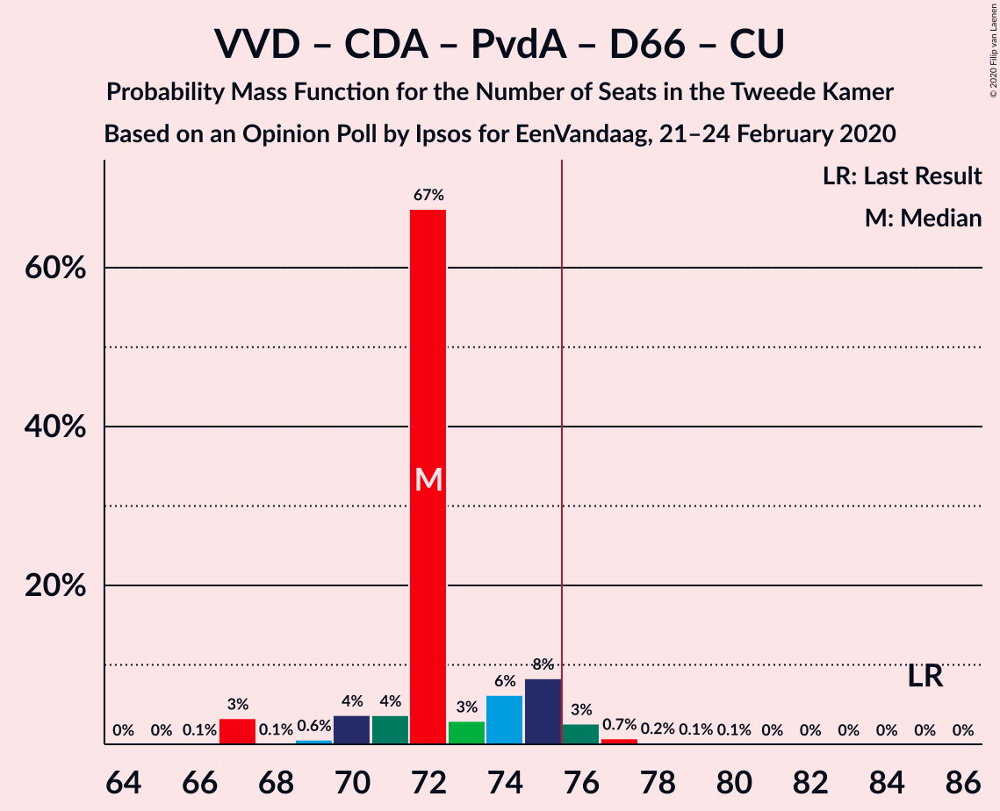
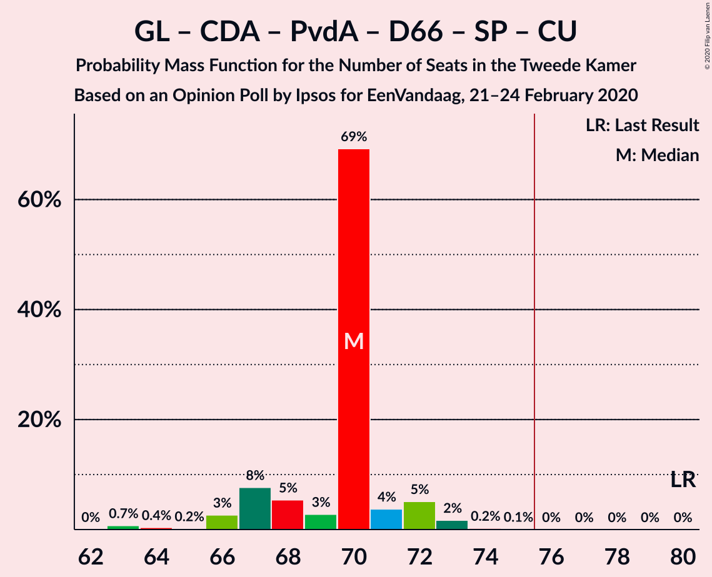
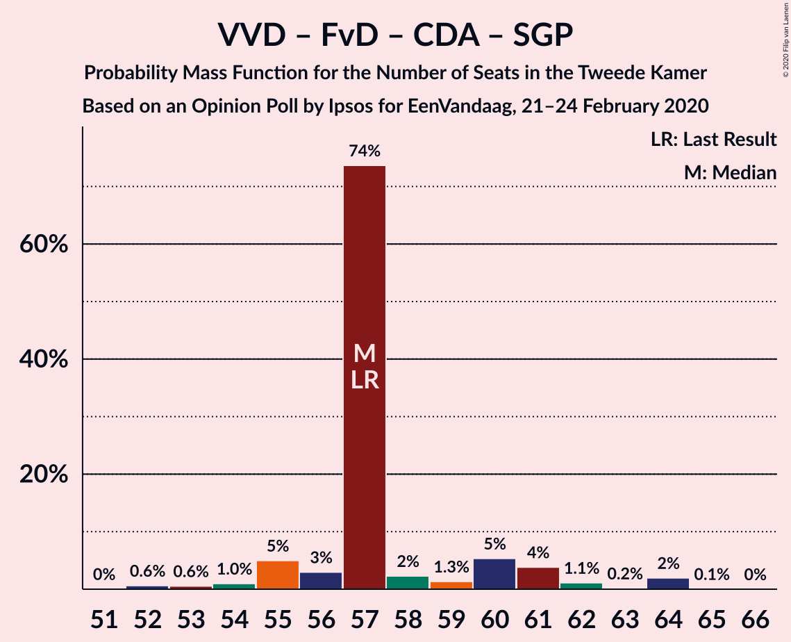
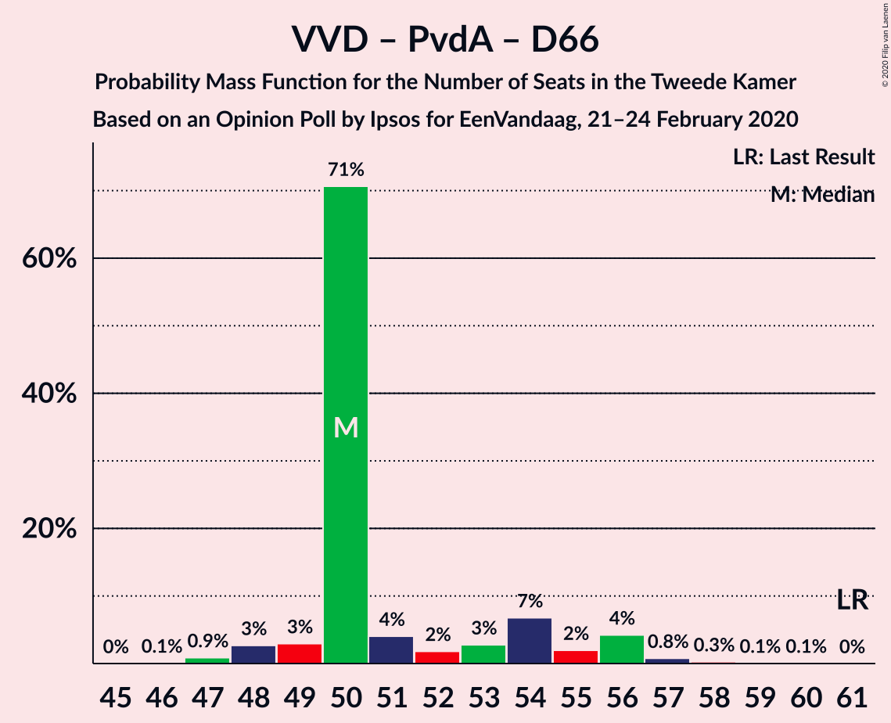

# Opinion Poll by Ipsos for EenVandaag, 21–24 February 2020

<a href="#voting-intentions">Voting Intentions</a> | <a href="#seats">Seats</a> | <a href="#coalitions">Coalitions</a> | <a href="#technical-information">Technical Information</a>

## Voting Intentions

### Confidence Intervals

| Party | Last Result | Poll Result | 80% Confidence Interval | 90% Confidence Interval | 95% Confidence Interval | 99% Confidence Interval |
|:-----:|:-----------:|:-----------:|:-----------------------:|:-----------------------:|:-----------------------:|:-----------------------:|
| Volkspartij voor Vrijheid en Democratie | 21.3% | 17.1% | 15.6–18.7% |15.2–19.1% |14.9–19.5% |14.2–20.3% |
| Partij voor de Vrijheid | 13.1% | 11.8% | 10.6–13.2% |10.3–13.6% |10.0–14.0% |9.4–14.6% |
| Forum voor Democratie | 1.8% | 9.8% | 8.7–11.1% |8.4–11.4% |8.1–11.8% |7.6–12.4% |
| GroenLinks | 9.1% | 9.6% | 8.5–10.9% |8.2–11.2% |7.9–11.6% |7.5–12.2% |
| Christen-Democratisch Appèl | 12.4% | 9.3% | 8.2–10.6% |7.9–10.9% |7.7–11.2% |7.2–11.9% |
| Partij van de Arbeid | 5.7% | 9.2% | 8.1–10.5% |7.8–10.8% |7.6–11.1% |7.1–11.8% |
| Democraten 66 | 12.2% | 8.3% | 7.3–9.6% |7.0–9.9% |6.8–10.2% |6.3–10.8% |
| 50Plus | 3.1% | 6.8% | 5.9–7.9% |5.6–8.2% |5.4–8.5% |5.0–9.1% |
| Socialistische Partij | 9.1% | 4.9% | 4.2–5.9% |4.0–6.2% |3.8–6.4% |3.4–7.0% |
| ChristenUnie | 3.4% | 4.3% | 3.6–5.2% |3.4–5.5% |3.2–5.7% |2.9–6.2% |
| Partij voor de Dieren | 3.2% | 3.9% | 3.2–4.8% |3.0–5.0% |2.9–5.2% |2.6–5.7% |
| Staatkundig Gereformeerde Partij | 2.1% | 1.9% | 1.5–2.6% |1.4–2.8% |1.2–3.0% |1.1–3.3% |
| DENK | 2.1% | 1.6% | 1.2–2.2% |1.1–2.3% |1.0–2.5% |0.8–2.9% |

*Note:* The poll result column reflects the actual value used in the calculations. Published results may vary slightly, and in addition be rounded to fewer digits.

## Seats

### Confidence Intervals

| Party | Last Result | Median | 80% Confidence Interval | 90% Confidence Interval | 95% Confidence Interval | 99% Confidence Interval |
|:-----:|:-----------:|:------:|:-----------------------:|:-----------------------:|:-----------------------:|:-----------------------:|
| <a href="#volkspartij-voor-vrijheid-en-democratie">Volkspartij voor Vrijheid en Democratie</a> | 33 | 24 | 22–28 |22–28 |22–28 |22–30 |
| <a href="#partij-voor-de-vrijheid">Partij voor de Vrijheid</a> | 20 | 19 | 17–20 |15–20 |15–20 |15–22 |
| <a href="#forum-voor-democratie">Forum voor Democratie</a> | 2 | 16 | 15–18 |13–18 |12–18 |12–19 |
| <a href="#groenlinks">GroenLinks</a> | 14 | 14 | 13–16 |11–16 |11–16 |11–17 |
| <a href="#christen-democratisch-appèl">Christen-Democratisch Appèl</a> | 19 | 15 | 12–17 |12–17 |12–17 |11–19 |
| <a href="#partij-van-de-arbeid">Partij van de Arbeid</a> | 9 | 14 | 13–16 |12–16 |12–16 |10–18 |
| <a href="#democraten-66">Democraten 66</a> | 19 | 12 | 10–15 |10–16 |10–16 |10–17 |
| <a href="#50plus">50Plus</a> | 4 | 9 | 8–10 |8–11 |8–11 |7–14 |
| <a href="#socialistische-partij">Socialistische Partij</a> | 14 | 8 | 6–9 |6–9 |6–9 |5–10 |
| <a href="#christenunie">ChristenUnie</a> | 5 | 6 | 5–7 |5–7 |5–7 |4–8 |
| <a href="#partij-voor-de-dieren">Partij voor de Dieren</a> | 5 | 5 | 4–6 |4–7 |4–7 |3–8 |
| <a href="#staatkundig-gereformeerde-partij">Staatkundig Gereformeerde Partij</a> | 3 | 3 | 2–4 |2–4 |2–4 |1–4 |
| <a href="#denk">DENK</a> | 3 | 2 | 2–3 |1–3 |1–3 |1–4 |

### Volkspartij voor Vrijheid en Democratie

*For a full overview of the results for this party, see the [Volkspartij voor Vrijheid en Democratie](party-volkspartijvoorvrijheidendemocratie.html) page.*

| Number of Seats | Probability | Accumulated | Special Marks |
|:---------------:|:-----------:|:-----------:|:-------------:|
| 21 | 0.2% | 100% |  |
| 22 | 20% | 99.8% |  |
| 23 | 6% | 79% |  |
| 24 | 32% | 73% | Median |
| 25 | 11% | 41% |  |
| 26 | 5% | 30% |  |
| 27 | 2% | 25% |  |
| 28 | 20% | 22% |  |
| 29 | 2% | 2% |  |
| 30 | 0.6% | 0.8% |  |
| 31 | 0% | 0.1% |  |
| 32 | 0.1% | 0.1% |  |
| 33 | 0% | 0% | Last Result |

### Partij voor de Vrijheid

*For a full overview of the results for this party, see the [Partij voor de Vrijheid](party-partijvoordevrijheid.html) page.*

| Number of Seats | Probability | Accumulated | Special Marks |
|:---------------:|:-----------:|:-----------:|:-------------:|
| 13 | 0.1% | 100% |  |
| 14 | 0.4% | 99.9% |  |
| 15 | 6% | 99.5% |  |
| 16 | 2% | 93% |  |
| 17 | 4% | 91% |  |
| 18 | 28% | 87% |  |
| 19 | 36% | 60% | Median |
| 20 | 22% | 23% | Last Result |
| 21 | 1.1% | 2% |  |
| 22 | 0.6% | 0.8% |  |
| 23 | 0.2% | 0.2% |  |
| 24 | 0% | 0% |  |

### Forum voor Democratie

*For a full overview of the results for this party, see the [Forum voor Democratie](party-forumvoordemocratie.html) page.*

| Number of Seats | Probability | Accumulated | Special Marks |
|:---------------:|:-----------:|:-----------:|:-------------:|
| 2 | 0% | 100% | Last Result |
| 3 | 0% | 100% |  |
| 4 | 0% | 100% |  |
| 5 | 0% | 100% |  |
| 6 | 0% | 100% |  |
| 7 | 0% | 100% |  |
| 8 | 0% | 100% |  |
| 9 | 0% | 100% |  |
| 10 | 0% | 100% |  |
| 11 | 0.3% | 100% |  |
| 12 | 3% | 99.6% |  |
| 13 | 2% | 97% |  |
| 14 | 4% | 95% |  |
| 15 | 26% | 90% |  |
| 16 | 25% | 64% | Median |
| 17 | 13% | 39% |  |
| 18 | 24% | 25% |  |
| 19 | 1.0% | 1.2% |  |
| 20 | 0.1% | 0.2% |  |
| 21 | 0% | 0% |  |

### GroenLinks

*For a full overview of the results for this party, see the [GroenLinks](party-groenlinks.html) page.*

| Number of Seats | Probability | Accumulated | Special Marks |
|:---------------:|:-----------:|:-----------:|:-------------:|
| 9 | 0.1% | 100% |  |
| 10 | 0.1% | 99.9% |  |
| 11 | 5% | 99.8% |  |
| 12 | 3% | 95% |  |
| 13 | 16% | 92% |  |
| 14 | 44% | 76% | Last Result, Median |
| 15 | 8% | 32% |  |
| 16 | 23% | 24% |  |
| 17 | 0.5% | 0.9% |  |
| 18 | 0.1% | 0.4% |  |
| 19 | 0.2% | 0.2% |  |
| 20 | 0% | 0% |  |

### Christen-Democratisch Appèl

*For a full overview of the results for this party, see the [Christen-Democratisch Appèl](party-christen-democratischappèl.html) page.*

| Number of Seats | Probability | Accumulated | Special Marks |
|:---------------:|:-----------:|:-----------:|:-------------:|
| 10 | 0.1% | 100% |  |
| 11 | 0.7% | 99.9% |  |
| 12 | 24% | 99.2% |  |
| 13 | 4% | 75% |  |
| 14 | 12% | 71% |  |
| 15 | 40% | 59% | Median |
| 16 | 3% | 19% |  |
| 17 | 15% | 16% |  |
| 18 | 0.1% | 1.0% |  |
| 19 | 0.8% | 0.8% | Last Result |
| 20 | 0% | 0% |  |

### Partij van de Arbeid

*For a full overview of the results for this party, see the [Partij van de Arbeid](party-partijvandearbeid.html) page.*

| Number of Seats | Probability | Accumulated | Special Marks |
|:---------------:|:-----------:|:-----------:|:-------------:|
| 9 | 0% | 100% | Last Result |
| 10 | 1.0% | 100% |  |
| 11 | 0.8% | 99.0% |  |
| 12 | 4% | 98% |  |
| 13 | 16% | 94% |  |
| 14 | 52% | 78% | Median |
| 15 | 13% | 26% |  |
| 16 | 12% | 13% |  |
| 17 | 0.5% | 2% |  |
| 18 | 1.2% | 1.2% |  |
| 19 | 0% | 0% |  |

### Democraten 66

*For a full overview of the results for this party, see the [Democraten 66](party-democraten66.html) page.*

| Number of Seats | Probability | Accumulated | Special Marks |
|:---------------:|:-----------:|:-----------:|:-------------:|
| 9 | 0.3% | 100% |  |
| 10 | 16% | 99.7% |  |
| 11 | 5% | 83% |  |
| 12 | 45% | 78% | Median |
| 13 | 20% | 33% |  |
| 14 | 1.1% | 13% |  |
| 15 | 6% | 12% |  |
| 16 | 4% | 5% |  |
| 17 | 0.3% | 0.8% |  |
| 18 | 0.4% | 0.5% |  |
| 19 | 0% | 0% | Last Result |

### 50Plus

*For a full overview of the results for this party, see the [50Plus](party-50plus.html) page.*

| Number of Seats | Probability | Accumulated | Special Marks |
|:---------------:|:-----------:|:-----------:|:-------------:|
| 4 | 0% | 100% | Last Result |
| 5 | 0% | 100% |  |
| 6 | 0% | 100% |  |
| 7 | 0.7% | 100% |  |
| 8 | 18% | 99.3% |  |
| 9 | 32% | 81% | Median |
| 10 | 42% | 50% |  |
| 11 | 7% | 8% |  |
| 12 | 0.3% | 0.9% |  |
| 13 | 0.1% | 0.6% |  |
| 14 | 0.5% | 0.5% |  |
| 15 | 0% | 0% |  |

### Socialistische Partij

*For a full overview of the results for this party, see the [Socialistische Partij](party-socialistischepartij.html) page.*

| Number of Seats | Probability | Accumulated | Special Marks |
|:---------------:|:-----------:|:-----------:|:-------------:|
| 4 | 0% | 100% |  |
| 5 | 2% | 99.9% |  |
| 6 | 29% | 98% |  |
| 7 | 6% | 69% |  |
| 8 | 44% | 63% | Median |
| 9 | 17% | 19% |  |
| 10 | 2% | 2% |  |
| 11 | 0.2% | 0.3% |  |
| 12 | 0.1% | 0.1% |  |
| 13 | 0% | 0% |  |
| 14 | 0% | 0% | Last Result |

### ChristenUnie

*For a full overview of the results for this party, see the [ChristenUnie](party-christenunie.html) page.*

| Number of Seats | Probability | Accumulated | Special Marks |
|:---------------:|:-----------:|:-----------:|:-------------:|
| 4 | 0.6% | 100% |  |
| 5 | 37% | 99.4% | Last Result |
| 6 | 35% | 63% | Median |
| 7 | 27% | 28% |  |
| 8 | 1.2% | 1.4% |  |
| 9 | 0.2% | 0.3% |  |
| 10 | 0.1% | 0.1% |  |
| 11 | 0% | 0% |  |

### Partij voor de Dieren

*For a full overview of the results for this party, see the [Partij voor de Dieren](party-partijvoordedieren.html) page.*

| Number of Seats | Probability | Accumulated | Special Marks |
|:---------------:|:-----------:|:-----------:|:-------------:|
| 3 | 0.6% | 100% |  |
| 4 | 32% | 99.4% |  |
| 5 | 25% | 68% | Last Result, Median |
| 6 | 34% | 43% |  |
| 7 | 7% | 8% |  |
| 8 | 0.9% | 1.1% |  |
| 9 | 0.2% | 0.2% |  |
| 10 | 0% | 0% |  |

### Staatkundig Gereformeerde Partij

*For a full overview of the results for this party, see the [Staatkundig Gereformeerde Partij](party-staatkundiggereformeerdepartij.html) page.*

| Number of Seats | Probability | Accumulated | Special Marks |
|:---------------:|:-----------:|:-----------:|:-------------:|
| 1 | 0.5% | 100% |  |
| 2 | 23% | 99.5% |  |
| 3 | 40% | 76% | Last Result, Median |
| 4 | 36% | 36% |  |
| 5 | 0.4% | 0.4% |  |
| 6 | 0% | 0% |  |

### DENK

*For a full overview of the results for this party, see the [DENK](party-denk.html) page.*

| Number of Seats | Probability | Accumulated | Special Marks |
|:---------------:|:-----------:|:-----------:|:-------------:|
| 1 | 8% | 100% |  |
| 2 | 50% | 92% | Median |
| 3 | 41% | 42% | Last Result |
| 4 | 1.0% | 1.1% |  |
| 5 | 0% | 0% |  |

## Coalitions

### Confidence Intervals

| Coalition | Last Result | Median | Majority? | 80% Confidence Interval | 90% Confidence Interval | 95% Confidence Interval | 99% Confidence Interval |
|:---------:|:-----------:|:------:|:---------:|:-----------------------:|:-----------------------:|:-----------------------:|:-----------------------:|
| Volkspartij voor Vrijheid en Democratie – Partij voor de Vrijheid – Forum voor Democratie – Christen-Democratisch Appèl – Staatkundig Gereformeerde Partij | 77 | 76 | 66% | 75–83 | 72–83 | 72–83 | 71–83 |
| Volkspartij voor Vrijheid en Democratie – Partij voor de Vrijheid – Forum voor Democratie – Christen-Democratisch Appèl | 74 | 72 | 21% | 72–79 | 70–79 | 69–79 | 67–80 |
| Volkspartij voor Vrijheid en Democratie – Christen-Democratisch Appèl – Partij van de Arbeid – Democraten 66 – ChristenUnie | 85 | 71 | 10% | 67–75 | 67–77 | 67–77 | 67–79 |
| Volkspartij voor Vrijheid en Democratie – GroenLinks – Christen-Democratisch Appèl – Democraten 66 – ChristenUnie | 90 | 71 | 5% | 69–75 | 69–75 | 66–76 | 66–80 |
| Volkspartij voor Vrijheid en Democratie – Forum voor Democratie – Christen-Democratisch Appèl – 50Plus – Staatkundig Gereformeerde Partij | 61 | 67 | 0.1% | 65–74 | 65–74 | 62–74 | 62–74 |
| GroenLinks – Christen-Democratisch Appèl – Partij van de Arbeid – Democraten 66 – Socialistische Partij – ChristenUnie | 80 | 68 | 0.1% | 66–72 | 64–72 | 63–73 | 63–74 |
| Volkspartij voor Vrijheid en Democratie – Forum voor Democratie – Christen-Democratisch Appèl – 50Plus | 58 | 63 | 0% | 63–70 | 62–70 | 59–70 | 59–71 |
| GroenLinks – Christen-Democratisch Appèl – Partij van de Arbeid – Democraten 66 – ChristenUnie | 66 | 61 | 0% | 59–63 | 56–66 | 56–66 | 55–67 |
| Volkspartij voor Vrijheid en Democratie – Partij voor de Vrijheid – Christen-Democratisch Appèl | 72 | 57 | 0% | 54–64 | 54–64 | 54–64 | 52–64 |
| Volkspartij voor Vrijheid en Democratie – Forum voor Democratie – Christen-Democratisch Appèl – Staatkundig Gereformeerde Partij | 57 | 57 | 0% | 56–64 | 55–64 | 52–64 | 52–64 |
| Volkspartij voor Vrijheid en Democratie – Christen-Democratisch Appèl – Democraten 66 – ChristenUnie | 76 | 58 | 0% | 53–61 | 53–61 | 53–61 | 53–66 |
| Volkspartij voor Vrijheid en Democratie – Forum voor Democratie – Christen-Democratisch Appèl | 54 | 54 | 0% | 53–60 | 52–60 | 49–60 | 49–62 |
| Volkspartij voor Vrijheid en Democratie – Christen-Democratisch Appèl – Partij van de Arbeid | 61 | 51 | 0% | 50–58 | 50–59 | 50–59 | 49–61 |
| Volkspartij voor Vrijheid en Democratie – Partij van de Arbeid – Democraten 66 | 61 | 51 | 0% | 48–55 | 48–57 | 48–57 | 46–59 |
| Volkspartij voor Vrijheid en Democratie – Christen-Democratisch Appèl – Democraten 66 | 71 | 52 | 0% | 48–55 | 48–56 | 48–56 | 48–59 |
| Christen-Democratisch Appèl – Partij van de Arbeid – Democraten 66 | 47 | 40 | 0% | 38–44 | 38–45 | 38–45 | 36–47 |
| Volkspartij voor Vrijheid en Democratie – Christen-Democratisch Appèl | 52 | 38 | 0% | 36–45 | 36–45 | 36–45 | 35–46 |
| Volkspartij voor Vrijheid en Democratie – Partij van de Arbeid | 42 | 38 | 0% | 36–42 | 36–44 | 36–44 | 35–45 |
| Christen-Democratisch Appèl – Partij van de Arbeid – ChristenUnie | 33 | 36 | 0% | 31–36 | 31–37 | 31–38 | 30–40 |
| Christen-Democratisch Appèl – Partij van de Arbeid | 28 | 29 | 0% | 26–31 | 26–31 | 26–32 | 24–35 |
| Christen-Democratisch Appèl – Democraten 66 | 38 | 27 | 0% | 24–29 | 24–31 | 24–31 | 24–32 |

### Volkspartij voor Vrijheid en Democratie – Partij voor de Vrijheid – Forum voor Democratie – Christen-Democratisch Appèl – Staatkundig Gereformeerde Partij

| Number of Seats | Probability | Accumulated | Special Marks |
|:---------------:|:-----------:|:-----------:|:-------------:|
| 68 | 0.3% | 100% |  |
| 69 | 0% | 99.7% |  |
| 70 | 0.1% | 99.6% |  |
| 71 | 0.1% | 99.6% |  |
| 72 | 5% | 99.4% |  |
| 73 | 3% | 95% |  |
| 74 | 0.8% | 92% |  |
| 75 | 25% | 91% |  |
| 76 | 24% | 66% | Majority |
| 77 | 18% | 42% | Last Result, Median |
| 78 | 3% | 24% |  |
| 79 | 1.0% | 21% |  |
| 80 | 5% | 20% |  |
| 81 | 0.2% | 15% |  |
| 82 | 0.8% | 15% |  |
| 83 | 14% | 14% |  |
| 84 | 0% | 0.1% |  |
| 85 | 0% | 0% |  |

### Volkspartij voor Vrijheid en Democratie – Partij voor de Vrijheid – Forum voor Democratie – Christen-Democratisch Appèl

| Number of Seats | Probability | Accumulated | Special Marks |
|:---------------:|:-----------:|:-----------:|:-------------:|
| 65 | 0% | 100% |  |
| 66 | 0.3% | 99.9% |  |
| 67 | 0.2% | 99.7% |  |
| 68 | 0.3% | 99.5% |  |
| 69 | 4% | 99.2% |  |
| 70 | 3% | 95% |  |
| 71 | 0.9% | 92% |  |
| 72 | 42% | 92% |  |
| 73 | 7% | 49% |  |
| 74 | 0.9% | 43% | Last Result, Median |
| 75 | 20% | 42% |  |
| 76 | 4% | 21% | Majority |
| 77 | 1.0% | 17% |  |
| 78 | 1.2% | 16% |  |
| 79 | 14% | 15% |  |
| 80 | 0.8% | 0.9% |  |
| 81 | 0% | 0.1% |  |
| 82 | 0% | 0.1% |  |
| 83 | 0% | 0% |  |

### Volkspartij voor Vrijheid en Democratie – Christen-Democratisch Appèl – Partij van de Arbeid – Democraten 66 – ChristenUnie

| Number of Seats | Probability | Accumulated | Special Marks |
|:---------------:|:-----------:|:-----------:|:-------------:|
| 64 | 0.1% | 100% |  |
| 65 | 0% | 99.9% |  |
| 66 | 0% | 99.9% |  |
| 67 | 23% | 99.9% |  |
| 68 | 0.2% | 76% |  |
| 69 | 2% | 76% |  |
| 70 | 19% | 75% |  |
| 71 | 7% | 56% | Median |
| 72 | 8% | 49% |  |
| 73 | 3% | 41% |  |
| 74 | 26% | 38% |  |
| 75 | 2% | 12% |  |
| 76 | 3% | 10% | Majority |
| 77 | 5% | 7% |  |
| 78 | 0.7% | 2% |  |
| 79 | 0.8% | 1.1% |  |
| 80 | 0.3% | 0.3% |  |
| 81 | 0% | 0% |  |
| 82 | 0% | 0% |  |
| 83 | 0% | 0% |  |
| 84 | 0% | 0% |  |
| 85 | 0% | 0% | Last Result |

### Volkspartij voor Vrijheid en Democratie – GroenLinks – Christen-Democratisch Appèl – Democraten 66 – ChristenUnie

| Number of Seats | Probability | Accumulated | Special Marks |
|:---------------:|:-----------:|:-----------:|:-------------:|
| 66 | 3% | 100% |  |
| 67 | 0.1% | 97% |  |
| 68 | 2% | 97% |  |
| 69 | 24% | 95% |  |
| 70 | 19% | 71% |  |
| 71 | 3% | 52% | Median |
| 72 | 20% | 49% |  |
| 73 | 2% | 29% |  |
| 74 | 3% | 27% |  |
| 75 | 19% | 24% |  |
| 76 | 3% | 5% | Majority |
| 77 | 0.6% | 2% |  |
| 78 | 0.4% | 2% |  |
| 79 | 0.6% | 1.2% |  |
| 80 | 0.5% | 0.6% |  |
| 81 | 0.1% | 0.1% |  |
| 82 | 0% | 0% |  |
| 83 | 0% | 0% |  |
| 84 | 0% | 0% |  |
| 85 | 0% | 0% |  |
| 86 | 0% | 0% |  |
| 87 | 0% | 0% |  |
| 88 | 0% | 0% |  |
| 89 | 0% | 0% |  |
| 90 | 0% | 0% | Last Result |

### Volkspartij voor Vrijheid en Democratie – Forum voor Democratie – Christen-Democratisch Appèl – 50Plus – Staatkundig Gereformeerde Partij

| Number of Seats | Probability | Accumulated | Special Marks |
|:---------------:|:-----------:|:-----------:|:-------------:|
| 60 | 0.3% | 100% |  |
| 61 | 0.1% | 99.7% | Last Result |
| 62 | 3% | 99.6% |  |
| 63 | 2% | 97% |  |
| 64 | 0.3% | 96% |  |
| 65 | 12% | 95% |  |
| 66 | 23% | 83% |  |
| 67 | 27% | 60% | Median |
| 68 | 5% | 33% |  |
| 69 | 5% | 28% |  |
| 70 | 5% | 23% |  |
| 71 | 3% | 18% |  |
| 72 | 0.7% | 15% |  |
| 73 | 0.4% | 15% |  |
| 74 | 14% | 14% |  |
| 75 | 0.3% | 0.4% |  |
| 76 | 0% | 0.1% | Majority |
| 77 | 0.1% | 0.1% |  |
| 78 | 0% | 0% |  |

### GroenLinks – Christen-Democratisch Appèl – Partij van de Arbeid – Democraten 66 – Socialistische Partij – ChristenUnie

| Number of Seats | Probability | Accumulated | Special Marks |
|:---------------:|:-----------:|:-----------:|:-------------:|
| 61 | 0% | 100% |  |
| 62 | 0.1% | 99.9% |  |
| 63 | 5% | 99.8% |  |
| 64 | 2% | 95% |  |
| 65 | 0.5% | 94% |  |
| 66 | 18% | 93% |  |
| 67 | 25% | 75% |  |
| 68 | 1.5% | 51% |  |
| 69 | 6% | 49% | Median |
| 70 | 19% | 43% |  |
| 71 | 11% | 24% |  |
| 72 | 8% | 13% |  |
| 73 | 4% | 4% |  |
| 74 | 0.4% | 0.6% |  |
| 75 | 0.1% | 0.2% |  |
| 76 | 0.1% | 0.1% | Majority |
| 77 | 0% | 0% |  |
| 78 | 0% | 0% |  |
| 79 | 0% | 0% |  |
| 80 | 0% | 0% | Last Result |

### Volkspartij voor Vrijheid en Democratie – Forum voor Democratie – Christen-Democratisch Appèl – 50Plus

| Number of Seats | Probability | Accumulated | Special Marks |
|:---------------:|:-----------:|:-----------:|:-------------:|
| 58 | 0.3% | 100% | Last Result |
| 59 | 2% | 99.7% |  |
| 60 | 2% | 97% |  |
| 61 | 0.5% | 96% |  |
| 62 | 2% | 95% |  |
| 63 | 51% | 93% |  |
| 64 | 8% | 42% | Median |
| 65 | 5% | 34% |  |
| 66 | 5% | 29% |  |
| 67 | 0.8% | 24% |  |
| 68 | 7% | 23% |  |
| 69 | 2% | 16% |  |
| 70 | 14% | 15% |  |
| 71 | 0.4% | 0.8% |  |
| 72 | 0% | 0.4% |  |
| 73 | 0.3% | 0.4% |  |
| 74 | 0.1% | 0.1% |  |
| 75 | 0% | 0% |  |

### GroenLinks – Christen-Democratisch Appèl – Partij van de Arbeid – Democraten 66 – ChristenUnie

| Number of Seats | Probability | Accumulated | Special Marks |
|:---------------:|:-----------:|:-----------:|:-------------:|
| 55 | 1.4% | 100% |  |
| 56 | 4% | 98.6% |  |
| 57 | 0.5% | 94% |  |
| 58 | 2% | 94% |  |
| 59 | 23% | 92% |  |
| 60 | 19% | 69% |  |
| 61 | 0.3% | 50% | Median |
| 62 | 30% | 50% |  |
| 63 | 12% | 20% |  |
| 64 | 2% | 8% |  |
| 65 | 0.9% | 6% |  |
| 66 | 3% | 5% | Last Result |
| 67 | 2% | 2% |  |
| 68 | 0.1% | 0.1% |  |
| 69 | 0% | 0.1% |  |
| 70 | 0% | 0% |  |

### Volkspartij voor Vrijheid en Democratie – Partij voor de Vrijheid – Christen-Democratisch Appèl

| Number of Seats | Probability | Accumulated | Special Marks |
|:---------------:|:-----------:|:-----------:|:-------------:|
| 51 | 0.2% | 100% |  |
| 52 | 0.5% | 99.8% |  |
| 53 | 0.3% | 99.3% |  |
| 54 | 23% | 99.0% |  |
| 55 | 2% | 76% |  |
| 56 | 19% | 74% |  |
| 57 | 11% | 54% |  |
| 58 | 9% | 43% | Median |
| 59 | 5% | 34% |  |
| 60 | 13% | 29% |  |
| 61 | 0.6% | 16% |  |
| 62 | 0.2% | 15% |  |
| 63 | 0.6% | 15% |  |
| 64 | 14% | 15% |  |
| 65 | 0.2% | 0.4% |  |
| 66 | 0% | 0.2% |  |
| 67 | 0.2% | 0.2% |  |
| 68 | 0% | 0% |  |
| 69 | 0% | 0% |  |
| 70 | 0% | 0% |  |
| 71 | 0% | 0% |  |
| 72 | 0% | 0% | Last Result |

### Volkspartij voor Vrijheid en Democratie – Forum voor Democratie – Christen-Democratisch Appèl – Staatkundig Gereformeerde Partij

| Number of Seats | Probability | Accumulated | Special Marks |
|:---------------:|:-----------:|:-----------:|:-------------:|
| 51 | 0.3% | 100% |  |
| 52 | 2% | 99.6% |  |
| 53 | 0.1% | 97% |  |
| 54 | 0.2% | 97% |  |
| 55 | 2% | 97% |  |
| 56 | 6% | 95% |  |
| 57 | 54% | 88% | Last Result |
| 58 | 6% | 34% | Median |
| 59 | 2% | 29% |  |
| 60 | 5% | 27% |  |
| 61 | 0.2% | 22% |  |
| 62 | 7% | 22% |  |
| 63 | 0.2% | 15% |  |
| 64 | 14% | 15% |  |
| 65 | 0.4% | 0.5% |  |
| 66 | 0.1% | 0.1% |  |
| 67 | 0% | 0% |  |

### Volkspartij voor Vrijheid en Democratie – Christen-Democratisch Appèl – Democraten 66 – ChristenUnie

| Number of Seats | Probability | Accumulated | Special Marks |
|:---------------:|:-----------:|:-----------:|:-------------:|
| 53 | 23% | 100% |  |
| 54 | 0.2% | 77% |  |
| 55 | 5% | 77% |  |
| 56 | 19% | 72% |  |
| 57 | 2% | 53% | Median |
| 58 | 8% | 52% |  |
| 59 | 17% | 44% |  |
| 60 | 3% | 27% |  |
| 61 | 21% | 24% |  |
| 62 | 0.4% | 2% |  |
| 63 | 0.5% | 2% |  |
| 64 | 1.0% | 2% |  |
| 65 | 0% | 0.6% |  |
| 66 | 0.5% | 0.6% |  |
| 67 | 0.1% | 0.1% |  |
| 68 | 0% | 0% |  |
| 69 | 0% | 0% |  |
| 70 | 0% | 0% |  |
| 71 | 0% | 0% |  |
| 72 | 0% | 0% |  |
| 73 | 0% | 0% |  |
| 74 | 0% | 0% |  |
| 75 | 0% | 0% |  |
| 76 | 0% | 0% | Last Result, Majority |

### Volkspartij voor Vrijheid en Democratie – Forum voor Democratie – Christen-Democratisch Appèl

| Number of Seats | Probability | Accumulated | Special Marks |
|:---------------:|:-----------:|:-----------:|:-------------:|
| 49 | 3% | 100% |  |
| 50 | 0.1% | 97% |  |
| 51 | 0.2% | 97% |  |
| 52 | 2% | 97% |  |
| 53 | 24% | 95% |  |
| 54 | 26% | 71% | Last Result |
| 55 | 13% | 45% | Median |
| 56 | 8% | 32% |  |
| 57 | 1.3% | 24% |  |
| 58 | 1.3% | 23% |  |
| 59 | 1.2% | 21% |  |
| 60 | 20% | 20% |  |
| 61 | 0.2% | 0.7% |  |
| 62 | 0.1% | 0.5% |  |
| 63 | 0.5% | 0.5% |  |
| 64 | 0% | 0% |  |

### Volkspartij voor Vrijheid en Democratie – Christen-Democratisch Appèl – Partij van de Arbeid

| Number of Seats | Probability | Accumulated | Special Marks |
|:---------------:|:-----------:|:-----------:|:-------------:|
| 46 | 0% | 100% |  |
| 47 | 0.1% | 99.9% |  |
| 48 | 0.1% | 99.9% |  |
| 49 | 0.3% | 99.8% |  |
| 50 | 24% | 99.5% |  |
| 51 | 29% | 76% |  |
| 52 | 2% | 47% |  |
| 53 | 1.2% | 44% | Median |
| 54 | 1.4% | 43% |  |
| 55 | 18% | 42% |  |
| 56 | 2% | 24% |  |
| 57 | 0.6% | 22% |  |
| 58 | 14% | 21% |  |
| 59 | 6% | 7% |  |
| 60 | 0.2% | 0.8% |  |
| 61 | 0.1% | 0.6% | Last Result |
| 62 | 0.4% | 0.5% |  |
| 63 | 0.1% | 0.1% |  |
| 64 | 0% | 0% |  |

### Volkspartij voor Vrijheid en Democratie – Partij van de Arbeid – Democraten 66

| Number of Seats | Probability | Accumulated | Special Marks |
|:---------------:|:-----------:|:-----------:|:-------------:|
| 44 | 0% | 100% |  |
| 45 | 0% | 99.9% |  |
| 46 | 0.5% | 99.9% |  |
| 47 | 0.6% | 99.4% |  |
| 48 | 18% | 98.8% |  |
| 49 | 4% | 81% |  |
| 50 | 25% | 77% | Median |
| 51 | 15% | 52% |  |
| 52 | 9% | 36% |  |
| 53 | 15% | 27% |  |
| 54 | 0.5% | 12% |  |
| 55 | 5% | 12% |  |
| 56 | 0.9% | 7% |  |
| 57 | 4% | 6% |  |
| 58 | 0.8% | 1.4% |  |
| 59 | 0.3% | 0.6% |  |
| 60 | 0.3% | 0.3% |  |
| 61 | 0% | 0% | Last Result |

### Volkspartij voor Vrijheid en Democratie – Christen-Democratisch Appèl – Democraten 66

| Number of Seats | Probability | Accumulated | Special Marks |
|:---------------:|:-----------:|:-----------:|:-------------:|
| 46 | 0.1% | 100% |  |
| 47 | 0.3% | 99.9% |  |
| 48 | 23% | 99.6% |  |
| 49 | 18% | 77% |  |
| 50 | 5% | 59% |  |
| 51 | 3% | 53% | Median |
| 52 | 11% | 51% |  |
| 53 | 15% | 40% |  |
| 54 | 2% | 25% |  |
| 55 | 15% | 23% |  |
| 56 | 6% | 9% |  |
| 57 | 0.6% | 2% |  |
| 58 | 0.6% | 1.5% |  |
| 59 | 0.7% | 0.9% |  |
| 60 | 0% | 0.1% |  |
| 61 | 0.1% | 0.1% |  |
| 62 | 0% | 0% |  |
| 63 | 0% | 0% |  |
| 64 | 0% | 0% |  |
| 65 | 0% | 0% |  |
| 66 | 0% | 0% |  |
| 67 | 0% | 0% |  |
| 68 | 0% | 0% |  |
| 69 | 0% | 0% |  |
| 70 | 0% | 0% |  |
| 71 | 0% | 0% | Last Result |

### Christen-Democratisch Appèl – Partij van de Arbeid – Democraten 66

| Number of Seats | Probability | Accumulated | Special Marks |
|:---------------:|:-----------:|:-----------:|:-------------:|
| 34 | 0.1% | 100% |  |
| 35 | 0.1% | 99.9% |  |
| 36 | 1.0% | 99.9% |  |
| 37 | 0.7% | 98.9% |  |
| 38 | 24% | 98% |  |
| 39 | 2% | 74% |  |
| 40 | 23% | 72% |  |
| 41 | 18% | 49% | Median |
| 42 | 0.4% | 31% |  |
| 43 | 17% | 31% |  |
| 44 | 7% | 14% |  |
| 45 | 5% | 7% |  |
| 46 | 0.4% | 2% |  |
| 47 | 2% | 2% | Last Result |
| 48 | 0% | 0% |  |

### Volkspartij voor Vrijheid en Democratie – Christen-Democratisch Appèl

| Number of Seats | Probability | Accumulated | Special Marks |
|:---------------:|:-----------:|:-----------:|:-------------:|
| 34 | 0.1% | 100% |  |
| 35 | 0.7% | 99.9% |  |
| 36 | 23% | 99.2% |  |
| 37 | 25% | 76% |  |
| 38 | 2% | 51% |  |
| 39 | 9% | 48% | Median |
| 40 | 14% | 40% |  |
| 41 | 3% | 26% |  |
| 42 | 2% | 23% |  |
| 43 | 6% | 21% |  |
| 44 | 0.4% | 15% |  |
| 45 | 14% | 15% |  |
| 46 | 0.4% | 0.7% |  |
| 47 | 0.3% | 0.4% |  |
| 48 | 0.1% | 0.1% |  |
| 49 | 0% | 0% |  |
| 50 | 0% | 0% |  |
| 51 | 0% | 0% |  |
| 52 | 0% | 0% | Last Result |

### Volkspartij voor Vrijheid en Democratie – Partij van de Arbeid

| Number of Seats | Probability | Accumulated | Special Marks |
|:---------------:|:-----------:|:-----------:|:-------------:|
| 33 | 0.1% | 100% |  |
| 34 | 0.1% | 99.9% |  |
| 35 | 0.5% | 99.8% |  |
| 36 | 24% | 99.3% |  |
| 37 | 6% | 75% |  |
| 38 | 26% | 69% | Median |
| 39 | 3% | 44% |  |
| 40 | 13% | 41% |  |
| 41 | 15% | 28% |  |
| 42 | 5% | 13% | Last Result |
| 43 | 0.7% | 7% |  |
| 44 | 5% | 6% |  |
| 45 | 1.2% | 2% |  |
| 46 | 0.3% | 0.3% |  |
| 47 | 0% | 0% |  |

### Christen-Democratisch Appèl – Partij van de Arbeid – ChristenUnie

| Number of Seats | Probability | Accumulated | Special Marks |
|:---------------:|:-----------:|:-----------:|:-------------:|
| 29 | 0.1% | 100% |  |
| 30 | 1.0% | 99.9% |  |
| 31 | 24% | 98.9% |  |
| 32 | 2% | 75% |  |
| 33 | 2% | 74% | Last Result |
| 34 | 13% | 72% |  |
| 35 | 4% | 58% | Median |
| 36 | 48% | 54% |  |
| 37 | 2% | 6% |  |
| 38 | 2% | 4% |  |
| 39 | 0.2% | 2% |  |
| 40 | 1.3% | 2% |  |
| 41 | 0.2% | 0.3% |  |
| 42 | 0.1% | 0.1% |  |
| 43 | 0% | 0% |  |

### Christen-Democratisch Appèl – Partij van de Arbeid

| Number of Seats | Probability | Accumulated | Special Marks |
|:---------------:|:-----------:|:-----------:|:-------------:|
| 22 | 0% | 100% |  |
| 23 | 0.1% | 99.9% |  |
| 24 | 2% | 99.8% |  |
| 25 | 0.5% | 98% |  |
| 26 | 24% | 98% |  |
| 27 | 5% | 73% |  |
| 28 | 8% | 69% | Last Result |
| 29 | 24% | 61% | Median |
| 30 | 27% | 37% |  |
| 31 | 8% | 11% |  |
| 32 | 1.0% | 3% |  |
| 33 | 0.6% | 2% |  |
| 34 | 0% | 1.0% |  |
| 35 | 0.9% | 0.9% |  |
| 36 | 0% | 0% |  |

### Christen-Democratisch Appèl – Democraten 66

| Number of Seats | Probability | Accumulated | Special Marks |
|:---------------:|:-----------:|:-----------:|:-------------:|
| 23 | 0.2% | 100% |  |
| 24 | 28% | 99.7% |  |
| 25 | 2% | 72% |  |
| 26 | 4% | 70% |  |
| 27 | 35% | 67% | Median |
| 28 | 20% | 32% |  |
| 29 | 6% | 12% |  |
| 30 | 0.4% | 6% |  |
| 31 | 3% | 6% |  |
| 32 | 2% | 2% |  |
| 33 | 0.2% | 0.2% |  |
| 34 | 0% | 0% |  |
| 35 | 0% | 0% |  |
| 36 | 0% | 0% |  |
| 37 | 0% | 0% |  |
| 38 | 0% | 0% | Last Result |

## Technical Information

### Opinion Poll

+ **Polling firm:** Ipsos
+ **Commissioner(s):** EenVandaag
+ **Fieldwork period:** 21–24 February 2020

### Calculations

+ **Sample size:** 1031
+ **Simulations done:** 524,288
+ **Error estimate:** 1.63%

