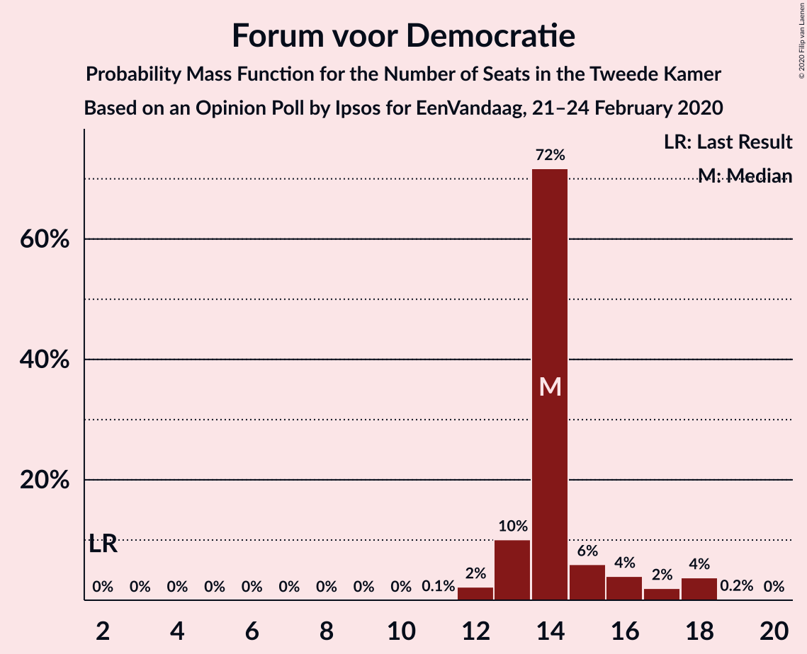
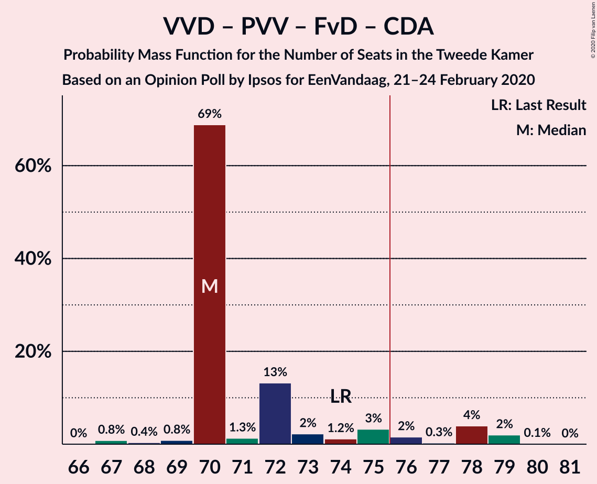
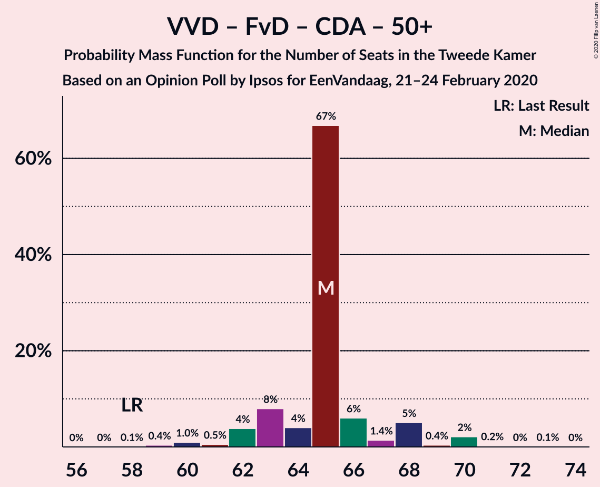
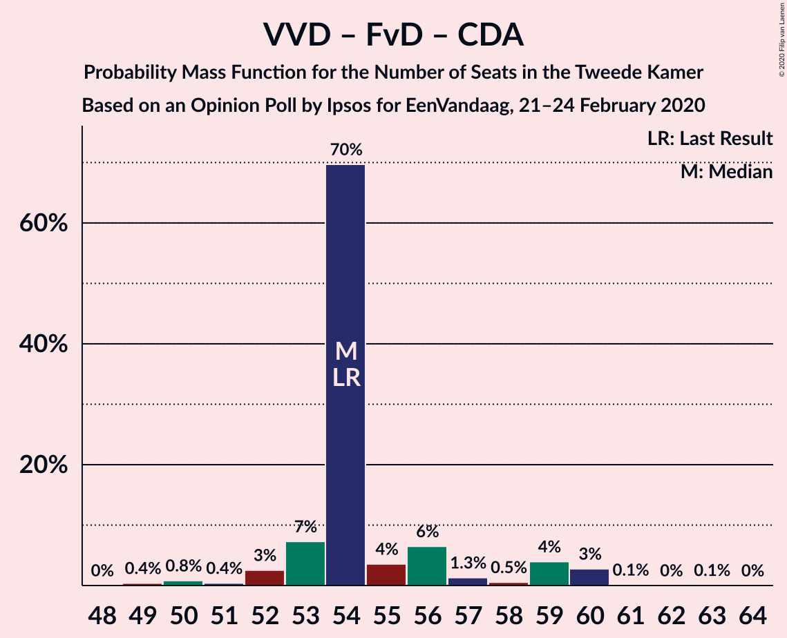
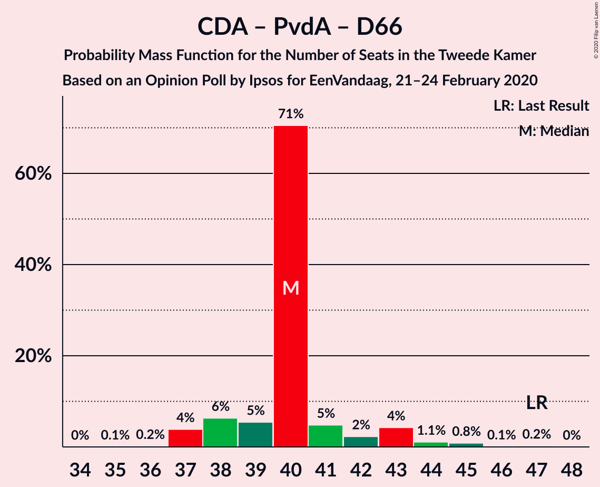

# Opinion Poll by Ipsos for EenVandaag, 21–24 February 2020

<a href="#voting-intentions">Voting Intentions</a> | <a href="#seats">Seats</a> | <a href="#coalitions">Coalitions</a> | <a href="#technical-information">Technical Information</a>

## Voting Intentions

### Confidence Intervals

| Party | Last Result | Poll Result | 80% Confidence Interval | 90% Confidence Interval | 95% Confidence Interval | 99% Confidence Interval |
|:-----:|:-----------:|:-----------:|:-----------------------:|:-----------------------:|:-----------------------:|:-----------------------:|
| Volkspartij voor Vrijheid en Democratie | 21.3% | 17.1% | 15.6–18.7% |15.2–19.1% |14.9–19.5% |14.2–20.3% |
| Partij voor de Vrijheid | 13.1% | 11.8% | 10.6–13.2% |10.3–13.6% |10.0–14.0% |9.4–14.6% |
| Forum voor Democratie | 1.8% | 9.8% | 8.7–11.1% |8.4–11.4% |8.1–11.8% |7.6–12.4% |
| GroenLinks | 9.1% | 9.6% | 8.5–10.9% |8.2–11.2% |7.9–11.6% |7.5–12.2% |
| Christen-Democratisch Appèl | 12.4% | 9.3% | 8.2–10.6% |7.9–10.9% |7.7–11.2% |7.2–11.9% |
| Partij van de Arbeid | 5.7% | 9.2% | 8.1–10.5% |7.8–10.8% |7.6–11.1% |7.1–11.8% |
| Democraten 66 | 12.2% | 8.3% | 7.3–9.6% |7.0–9.9% |6.8–10.2% |6.3–10.8% |
| 50Plus | 3.1% | 6.8% | 5.9–7.9% |5.6–8.2% |5.4–8.5% |5.0–9.1% |
| Socialistische Partij | 9.1% | 4.9% | 4.2–5.9% |4.0–6.2% |3.8–6.4% |3.4–7.0% |
| ChristenUnie | 3.4% | 4.3% | 3.6–5.2% |3.4–5.5% |3.2–5.7% |2.9–6.2% |
| Partij voor de Dieren | 3.2% | 3.9% | 3.2–4.8% |3.0–5.0% |2.9–5.2% |2.6–5.7% |
| Staatkundig Gereformeerde Partij | 2.1% | 1.9% | 1.5–2.6% |1.4–2.8% |1.2–3.0% |1.1–3.3% |
| DENK | 2.1% | 1.6% | 1.2–2.2% |1.1–2.3% |1.0–2.5% |0.8–2.9% |

*Note:* The poll result column reflects the actual value used in the calculations. Published results may vary slightly, and in addition be rounded to fewer digits.

## Seats

### Confidence Intervals

| Party | Last Result | Median | 80% Confidence Interval | 90% Confidence Interval | 95% Confidence Interval | 99% Confidence Interval |
|:-----:|:-----------:|:------:|:-----------------------:|:-----------------------:|:-----------------------:|:-----------------------:|
| <a href="#volkspartij-voor-vrijheid-en-democratie">Volkspartij voor Vrijheid en Democratie</a> | 33 | 21 | 21–26 |21–26 |21–27 |21–28 |
| <a href="#partij-voor-de-vrijheid">Partij voor de Vrijheid</a> | 20 | 17 | 17–20 |17–22 |16–24 |15–24 |
| <a href="#forum-voor-democratie">Forum voor Democratie</a> | 2 | 18 | 13–18 |12–18 |12–18 |12–18 |
| <a href="#groenlinks">GroenLinks</a> | 14 | 18 | 14–18 |14–18 |12–18 |10–18 |
| <a href="#christen-democratisch-appèl">Christen-Democratisch Appèl</a> | 19 | 14 | 13–17 |12–17 |12–18 |10–18 |
| <a href="#partij-van-de-arbeid">Partij van de Arbeid</a> | 9 | 12 | 11–15 |11–16 |11–16 |9–17 |
| <a href="#democraten-66">Democraten 66</a> | 19 | 13 | 10–14 |10–16 |10–16 |10–17 |
| <a href="#50plus">50Plus</a> | 4 | 10 | 9–13 |9–13 |8–13 |8–15 |
| <a href="#socialistische-partij">Socialistische Partij</a> | 14 | 9 | 7–9 |5–11 |5–12 |5–12 |
| <a href="#christenunie">ChristenUnie</a> | 5 | 7 | 6–10 |5–10 |4–10 |4–10 |
| <a href="#partij-voor-de-dieren">Partij voor de Dieren</a> | 5 | 4 | 4–7 |4–7 |4–7 |3–7 |
| <a href="#staatkundig-gereformeerde-partij">Staatkundig Gereformeerde Partij</a> | 3 | 3 | 2–3 |2–3 |2–3 |1–4 |
| <a href="#denk">DENK</a> | 3 | 2 | 2 |1–3 |1–3 |1–3 |

### Volkspartij voor Vrijheid en Democratie

*For a full overview of the results for this party, see the [Volkspartij voor Vrijheid en Democratie](party-volkspartijvoorvrijheidendemocratie.html) page.*

| Number of Seats | Probability | Accumulated | Special Marks |
|:---------------:|:-----------:|:-----------:|:-------------:|
| 19 | 0.1% | 100% |  |
| 20 | 0.4% | 99.9% |  |
| 21 | 63% | 99.6% | Median |
| 22 | 5% | 37% |  |
| 23 | 15% | 32% |  |
| 24 | 1.4% | 16% |  |
| 25 | 0.3% | 15% |  |
| 26 | 11% | 15% |  |
| 27 | 3% | 4% |  |
| 28 | 0.4% | 0.7% |  |
| 29 | 0.1% | 0.3% |  |
| 30 | 0.1% | 0.2% |  |
| 31 | 0% | 0% |  |
| 32 | 0% | 0% |  |
| 33 | 0% | 0% | Last Result |

### Partij voor de Vrijheid

*For a full overview of the results for this party, see the [Partij voor de Vrijheid](party-partijvoordevrijheid.html) page.*

| Number of Seats | Probability | Accumulated | Special Marks |
|:---------------:|:-----------:|:-----------:|:-------------:|
| 14 | 0% | 100% |  |
| 15 | 1.1% | 99.9% |  |
| 16 | 3% | 98.9% |  |
| 17 | 74% | 96% | Median |
| 18 | 3% | 22% |  |
| 19 | 7% | 19% |  |
| 20 | 5% | 12% | Last Result |
| 21 | 1.3% | 7% |  |
| 22 | 0.9% | 6% |  |
| 23 | 0.5% | 5% |  |
| 24 | 4% | 4% |  |
| 25 | 0% | 0% |  |

### Forum voor Democratie

*For a full overview of the results for this party, see the [Forum voor Democratie](party-forumvoordemocratie.html) page.*

| Number of Seats | Probability | Accumulated | Special Marks |
|:---------------:|:-----------:|:-----------:|:-------------:|
| 2 | 0% | 100% | Last Result |
| 3 | 0% | 100% |  |
| 4 | 0% | 100% |  |
| 5 | 0% | 100% |  |
| 6 | 0% | 100% |  |
| 7 | 0% | 100% |  |
| 8 | 0% | 100% |  |
| 9 | 0% | 100% |  |
| 10 | 0.1% | 100% |  |
| 11 | 0% | 99.9% |  |
| 12 | 8% | 99.9% |  |
| 13 | 3% | 92% |  |
| 14 | 9% | 90% |  |
| 15 | 19% | 81% |  |
| 16 | 1.2% | 62% |  |
| 17 | 1.5% | 61% |  |
| 18 | 59% | 59% | Median |
| 19 | 0.2% | 0.2% |  |
| 20 | 0% | 0% |  |

### GroenLinks

*For a full overview of the results for this party, see the [GroenLinks](party-groenlinks.html) page.*

| Number of Seats | Probability | Accumulated | Special Marks |
|:---------------:|:-----------:|:-----------:|:-------------:|
| 9 | 0.1% | 100% |  |
| 10 | 0.6% | 99.9% |  |
| 11 | 1.2% | 99.3% |  |
| 12 | 0.7% | 98% |  |
| 13 | 0.5% | 97% |  |
| 14 | 20% | 97% | Last Result |
| 15 | 16% | 77% |  |
| 16 | 0.8% | 62% |  |
| 17 | 0.6% | 61% |  |
| 18 | 60% | 60% | Median |
| 19 | 0.1% | 0.1% |  |
| 20 | 0% | 0% |  |

### Christen-Democratisch Appèl

*For a full overview of the results for this party, see the [Christen-Democratisch Appèl](party-christen-democratischappèl.html) page.*

| Number of Seats | Probability | Accumulated | Special Marks |
|:---------------:|:-----------:|:-----------:|:-------------:|
| 10 | 1.0% | 100% |  |
| 11 | 0.1% | 99.0% |  |
| 12 | 5% | 98.9% |  |
| 13 | 9% | 94% |  |
| 14 | 62% | 85% | Median |
| 15 | 5% | 23% |  |
| 16 | 0.9% | 18% |  |
| 17 | 14% | 17% |  |
| 18 | 3% | 3% |  |
| 19 | 0% | 0% | Last Result |

### Partij van de Arbeid

*For a full overview of the results for this party, see the [Partij van de Arbeid](party-partijvandearbeid.html) page.*

| Number of Seats | Probability | Accumulated | Special Marks |
|:---------------:|:-----------:|:-----------:|:-------------:|
| 9 | 1.1% | 100% | Last Result |
| 10 | 0% | 98.9% |  |
| 11 | 9% | 98.9% |  |
| 12 | 63% | 90% | Median |
| 13 | 0.7% | 26% |  |
| 14 | 5% | 26% |  |
| 15 | 15% | 21% |  |
| 16 | 5% | 6% |  |
| 17 | 1.4% | 2% |  |
| 18 | 0% | 0.1% |  |
| 19 | 0% | 0.1% |  |
| 20 | 0.1% | 0.1% |  |
| 21 | 0% | 0% |  |

### Democraten 66

*For a full overview of the results for this party, see the [Democraten 66](party-democraten66.html) page.*

| Number of Seats | Probability | Accumulated | Special Marks |
|:---------------:|:-----------:|:-----------:|:-------------:|
| 9 | 0.2% | 100% |  |
| 10 | 15% | 99.8% |  |
| 11 | 8% | 84% |  |
| 12 | 5% | 76% |  |
| 13 | 61% | 71% | Median |
| 14 | 1.4% | 11% |  |
| 15 | 2% | 9% |  |
| 16 | 7% | 7% |  |
| 17 | 0.5% | 0.7% |  |
| 18 | 0.2% | 0.2% |  |
| 19 | 0% | 0% | Last Result |

### 50Plus

*For a full overview of the results for this party, see the [50Plus](party-50plus.html) page.*

| Number of Seats | Probability | Accumulated | Special Marks |
|:---------------:|:-----------:|:-----------:|:-------------:|
| 4 | 0% | 100% | Last Result |
| 5 | 0% | 100% |  |
| 6 | 0% | 100% |  |
| 7 | 0.1% | 100% |  |
| 8 | 4% | 99.8% |  |
| 9 | 23% | 96% |  |
| 10 | 61% | 73% | Median |
| 11 | 0.4% | 12% |  |
| 12 | 1.5% | 12% |  |
| 13 | 9% | 10% |  |
| 14 | 0.2% | 1.0% |  |
| 15 | 0.8% | 0.8% |  |
| 16 | 0% | 0% |  |

### Socialistische Partij

*For a full overview of the results for this party, see the [Socialistische Partij](party-socialistischepartij.html) page.*

| Number of Seats | Probability | Accumulated | Special Marks |
|:---------------:|:-----------:|:-----------:|:-------------:|
| 4 | 0.1% | 100% |  |
| 5 | 8% | 99.9% |  |
| 6 | 0.7% | 92% |  |
| 7 | 14% | 91% |  |
| 8 | 9% | 77% |  |
| 9 | 60% | 68% | Median |
| 10 | 2% | 8% |  |
| 11 | 2% | 6% |  |
| 12 | 4% | 4% |  |
| 13 | 0% | 0% |  |
| 14 | 0% | 0% | Last Result |

### ChristenUnie

*For a full overview of the results for this party, see the [ChristenUnie](party-christenunie.html) page.*

| Number of Seats | Probability | Accumulated | Special Marks |
|:---------------:|:-----------:|:-----------:|:-------------:|
| 4 | 3% | 100% |  |
| 5 | 4% | 97% | Last Result |
| 6 | 8% | 93% |  |
| 7 | 61% | 85% | Median |
| 8 | 2% | 24% |  |
| 9 | 2% | 22% |  |
| 10 | 20% | 20% |  |
| 11 | 0% | 0% |  |

### Partij voor de Dieren

*For a full overview of the results for this party, see the [Partij voor de Dieren](party-partijvoordedieren.html) page.*

| Number of Seats | Probability | Accumulated | Special Marks |
|:---------------:|:-----------:|:-----------:|:-------------:|
| 3 | 1.1% | 100% |  |
| 4 | 62% | 98.9% | Median |
| 5 | 6% | 37% | Last Result |
| 6 | 4% | 31% |  |
| 7 | 27% | 27% |  |
| 8 | 0.1% | 0.2% |  |
| 9 | 0.1% | 0.1% |  |
| 10 | 0% | 0% |  |

### Staatkundig Gereformeerde Partij

*For a full overview of the results for this party, see the [Staatkundig Gereformeerde Partij](party-staatkundiggereformeerdepartij.html) page.*

| Number of Seats | Probability | Accumulated | Special Marks |
|:---------------:|:-----------:|:-----------:|:-------------:|
| 1 | 2% | 100% |  |
| 2 | 25% | 98% |  |
| 3 | 72% | 73% | Last Result, Median |
| 4 | 1.2% | 1.4% |  |
| 5 | 0.2% | 0.2% |  |
| 6 | 0% | 0% |  |

### DENK

*For a full overview of the results for this party, see the [DENK](party-denk.html) page.*

| Number of Seats | Probability | Accumulated | Special Marks |
|:---------------:|:-----------:|:-----------:|:-------------:|
| 0 | 0.1% | 100% |  |
| 1 | 8% | 99.9% |  |
| 2 | 86% | 92% | Median |
| 3 | 5% | 6% | Last Result |
| 4 | 0.2% | 0.4% |  |
| 5 | 0.3% | 0.3% |  |
| 6 | 0% | 0% |  |

## Coalitions

### Confidence Intervals

| Coalition | Last Result | Median | Majority? | 80% Confidence Interval | 90% Confidence Interval | 95% Confidence Interval | 99% Confidence Interval |
|:---------:|:-----------:|:------:|:---------:|:-----------------------:|:-----------------------:|:-----------------------:|:-----------------------:|
| Volkspartij voor Vrijheid en Democratie – GroenLinks – Christen-Democratisch Appèl – Democraten 66 – ChristenUnie | 90 | 73 | 8% | 71–74 | 68–80 | 66–80 | 66–80 |
| Volkspartij voor Vrijheid en Democratie – Partij voor de Vrijheid – Forum voor Democratie – Christen-Democratisch Appèl – Staatkundig Gereformeerde Partij | 77 | 73 | 7% | 73–74 | 72–77 | 72–77 | 70–79 |
| Volkspartij voor Vrijheid en Democratie – Christen-Democratisch Appèl – Partij van de Arbeid – Democraten 66 – ChristenUnie | 85 | 67 | 8% | 67–75 | 67–76 | 67–76 | 66–77 |
| Volkspartij voor Vrijheid en Democratie – Partij voor de Vrijheid – Forum voor Democratie – Christen-Democratisch Appèl | 74 | 70 | 0.9% | 70–72 | 70–74 | 69–74 | 67–77 |
| GroenLinks – Christen-Democratisch Appèl – Partij van de Arbeid – Democraten 66 – Socialistische Partij – ChristenUnie | 80 | 73 | 0.1% | 70–73 | 68–73 | 68–73 | 64–73 |
| Volkspartij voor Vrijheid en Democratie – Forum voor Democratie – Christen-Democratisch Appèl – 50Plus – Staatkundig Gereformeerde Partij | 61 | 66 | 0% | 63–66 | 63–69 | 63–70 | 61–71 |
| Volkspartij voor Vrijheid en Democratie – Forum voor Democratie – Christen-Democratisch Appèl – 50Plus | 58 | 63 | 0% | 61–64 | 60–67 | 60–69 | 59–69 |
| GroenLinks – Christen-Democratisch Appèl – Partij van de Arbeid – Democraten 66 – ChristenUnie | 66 | 64 | 0% | 60–66 | 58–66 | 56–66 | 55–66 |
| Volkspartij voor Vrijheid en Democratie – Christen-Democratisch Appèl – Democraten 66 – ChristenUnie | 76 | 55 | 0% | 55–60 | 52–65 | 52–65 | 51–65 |
| Volkspartij voor Vrijheid en Democratie – Partij voor de Vrijheid – Christen-Democratisch Appèl | 72 | 52 | 0% | 52–58 | 52–59 | 52–60 | 52–61 |
| Volkspartij voor Vrijheid en Democratie – Forum voor Democratie – Christen-Democratisch Appèl – Staatkundig Gereformeerde Partij | 57 | 56 | 0% | 54–57 | 52–57 | 50–57 | 50–58 |
| Volkspartij voor Vrijheid en Democratie – Forum voor Democratie – Christen-Democratisch Appèl | 54 | 53 | 0% | 51–55 | 49–55 | 48–56 | 48–56 |
| Volkspartij voor Vrijheid en Democratie – Christen-Democratisch Appèl – Partij van de Arbeid | 61 | 47 | 0% | 47–55 | 47–55 | 47–55 | 46–59 |
| Volkspartij voor Vrijheid en Democratie – Christen-Democratisch Appèl – Democraten 66 | 71 | 48 | 0% | 48–53 | 47–55 | 46–55 | 45–55 |
| Volkspartij voor Vrijheid en Democratie – Partij van de Arbeid – Democraten 66 | 61 | 46 | 0% | 46–53 | 46–53 | 46–54 | 46–58 |
| Christen-Democratisch Appèl – Partij van de Arbeid – Democraten 66 | 47 | 39 | 0% | 39–42 | 38–43 | 37–43 | 35–44 |
| Volkspartij voor Vrijheid en Democratie – Christen-Democratisch Appèl | 52 | 35 | 0% | 35–40 | 34–41 | 34–42 | 33–42 |
| Christen-Democratisch Appèl – Partij van de Arbeid – ChristenUnie | 33 | 33 | 0% | 33–42 | 32–42 | 31–42 | 28–42 |
| Volkspartij voor Vrijheid en Democratie – Partij van de Arbeid | 42 | 33 | 0% | 33–38 | 33–38 | 33–40 | 32–44 |
| Christen-Democratisch Appèl – Partij van de Arbeid | 28 | 26 | 0% | 26–32 | 24–32 | 24–32 | 23–33 |
| Christen-Democratisch Appèl – Democraten 66 | 38 | 27 | 0% | 26–29 | 24–29 | 24–29 | 21–30 |

### Volkspartij voor Vrijheid en Democratie – GroenLinks – Christen-Democratisch Appèl – Democraten 66 – ChristenUnie

| Number of Seats | Probability | Accumulated | Special Marks |
|:---------------:|:-----------:|:-----------:|:-------------:|
| 65 | 0.4% | 100% |  |
| 66 | 4% | 99.6% |  |
| 67 | 0.1% | 95% |  |
| 68 | 0.2% | 95% |  |
| 69 | 1.4% | 95% |  |
| 70 | 1.4% | 94% |  |
| 71 | 4% | 92% |  |
| 72 | 6% | 89% |  |
| 73 | 59% | 83% | Median |
| 74 | 15% | 24% |  |
| 75 | 1.0% | 9% |  |
| 76 | 0.1% | 8% | Majority |
| 77 | 0.1% | 8% |  |
| 78 | 0% | 8% |  |
| 79 | 0.8% | 7% |  |
| 80 | 7% | 7% |  |
| 81 | 0% | 0% |  |
| 82 | 0% | 0% |  |
| 83 | 0% | 0% |  |
| 84 | 0% | 0% |  |
| 85 | 0% | 0% |  |
| 86 | 0% | 0% |  |
| 87 | 0% | 0% |  |
| 88 | 0% | 0% |  |
| 89 | 0% | 0% |  |
| 90 | 0% | 0% | Last Result |

### Volkspartij voor Vrijheid en Democratie – Partij voor de Vrijheid – Forum voor Democratie – Christen-Democratisch Appèl – Staatkundig Gereformeerde Partij

| Number of Seats | Probability | Accumulated | Special Marks |
|:---------------:|:-----------:|:-----------:|:-------------:|
| 67 | 0.1% | 100% |  |
| 68 | 0% | 99.9% |  |
| 69 | 0.2% | 99.9% |  |
| 70 | 0.6% | 99.7% |  |
| 71 | 0.9% | 99.1% |  |
| 72 | 4% | 98% |  |
| 73 | 66% | 94% | Median |
| 74 | 19% | 28% |  |
| 75 | 3% | 9% |  |
| 76 | 1.2% | 7% | Majority |
| 77 | 4% | 6% | Last Result |
| 78 | 0.9% | 1.5% |  |
| 79 | 0.3% | 0.6% |  |
| 80 | 0.2% | 0.4% |  |
| 81 | 0.1% | 0.2% |  |
| 82 | 0.1% | 0.1% |  |
| 83 | 0% | 0% |  |

### Volkspartij voor Vrijheid en Democratie – Christen-Democratisch Appèl – Partij van de Arbeid – Democraten 66 – ChristenUnie

| Number of Seats | Probability | Accumulated | Special Marks |
|:---------------:|:-----------:|:-----------:|:-------------:|
| 62 | 0.3% | 100% |  |
| 63 | 0% | 99.7% |  |
| 64 | 0% | 99.7% |  |
| 65 | 0% | 99.7% |  |
| 66 | 2% | 99.7% |  |
| 67 | 60% | 98% | Median |
| 68 | 7% | 39% |  |
| 69 | 4% | 32% |  |
| 70 | 3% | 28% |  |
| 71 | 0.3% | 25% |  |
| 72 | 0.4% | 25% |  |
| 73 | 0.2% | 24% |  |
| 74 | 0.2% | 24% |  |
| 75 | 15% | 24% |  |
| 76 | 7% | 8% | Majority |
| 77 | 2% | 2% |  |
| 78 | 0% | 0.1% |  |
| 79 | 0.1% | 0.1% |  |
| 80 | 0% | 0% |  |
| 81 | 0% | 0% |  |
| 82 | 0% | 0% |  |
| 83 | 0% | 0% |  |
| 84 | 0% | 0% |  |
| 85 | 0% | 0% | Last Result |

### Volkspartij voor Vrijheid en Democratie – Partij voor de Vrijheid – Forum voor Democratie – Christen-Democratisch Appèl

| Number of Seats | Probability | Accumulated | Special Marks |
|:---------------:|:-----------:|:-----------:|:-------------:|
| 65 | 0.1% | 100% |  |
| 66 | 0.3% | 99.9% |  |
| 67 | 0.2% | 99.6% |  |
| 68 | 0.4% | 99.4% |  |
| 69 | 2% | 99.0% |  |
| 70 | 69% | 97% | Median |
| 71 | 0.5% | 28% |  |
| 72 | 19% | 28% |  |
| 73 | 1.1% | 9% |  |
| 74 | 6% | 8% | Last Result |
| 75 | 1.3% | 2% |  |
| 76 | 0.2% | 0.9% | Majority |
| 77 | 0.6% | 0.8% |  |
| 78 | 0.1% | 0.2% |  |
| 79 | 0% | 0.1% |  |
| 80 | 0.1% | 0.1% |  |
| 81 | 0% | 0% |  |

### GroenLinks – Christen-Democratisch Appèl – Partij van de Arbeid – Democraten 66 – Socialistische Partij – ChristenUnie

| Number of Seats | Probability | Accumulated | Special Marks |
|:---------------:|:-----------:|:-----------:|:-------------:|
| 61 | 0.1% | 100% |  |
| 62 | 0% | 99.8% |  |
| 63 | 0.2% | 99.8% |  |
| 64 | 0.3% | 99.6% |  |
| 65 | 0.1% | 99.2% |  |
| 66 | 1.0% | 99.1% |  |
| 67 | 0.4% | 98% |  |
| 68 | 7% | 98% |  |
| 69 | 0.3% | 91% |  |
| 70 | 10% | 90% |  |
| 71 | 1.1% | 80% |  |
| 72 | 5% | 79% |  |
| 73 | 73% | 74% | Median |
| 74 | 0% | 0.2% |  |
| 75 | 0% | 0.1% |  |
| 76 | 0.1% | 0.1% | Majority |
| 77 | 0% | 0% |  |
| 78 | 0% | 0% |  |
| 79 | 0% | 0% |  |
| 80 | 0% | 0% | Last Result |

### Volkspartij voor Vrijheid en Democratie – Forum voor Democratie – Christen-Democratisch Appèl – 50Plus – Staatkundig Gereformeerde Partij

| Number of Seats | Probability | Accumulated | Special Marks |
|:---------------:|:-----------:|:-----------:|:-------------:|
| 61 | 0.6% | 100% | Last Result |
| 62 | 0.4% | 99.4% |  |
| 63 | 11% | 99.0% |  |
| 64 | 2% | 88% |  |
| 65 | 5% | 86% |  |
| 66 | 73% | 82% | Median |
| 67 | 1.4% | 8% |  |
| 68 | 1.3% | 7% |  |
| 69 | 3% | 6% |  |
| 70 | 2% | 3% |  |
| 71 | 1.0% | 1.1% |  |
| 72 | 0.1% | 0.1% |  |
| 73 | 0% | 0% |  |

### Volkspartij voor Vrijheid en Democratie – Forum voor Democratie – Christen-Democratisch Appèl – 50Plus

| Number of Seats | Probability | Accumulated | Special Marks |
|:---------------:|:-----------:|:-----------:|:-------------:|
| 57 | 0.1% | 100% |  |
| 58 | 0.3% | 99.9% | Last Result |
| 59 | 0.5% | 99.6% |  |
| 60 | 7% | 99.1% |  |
| 61 | 4% | 92% |  |
| 62 | 5% | 87% |  |
| 63 | 60% | 83% | Median |
| 64 | 16% | 23% |  |
| 65 | 0.8% | 7% |  |
| 66 | 0.9% | 6% |  |
| 67 | 3% | 5% |  |
| 68 | 0.1% | 3% |  |
| 69 | 3% | 3% |  |
| 70 | 0% | 0% |  |

### GroenLinks – Christen-Democratisch Appèl – Partij van de Arbeid – Democraten 66 – ChristenUnie

| Number of Seats | Probability | Accumulated | Special Marks |
|:---------------:|:-----------:|:-----------:|:-------------:|
| 54 | 0.5% | 100% |  |
| 55 | 0.3% | 99.5% |  |
| 56 | 2% | 99.3% |  |
| 57 | 0% | 97% |  |
| 58 | 3% | 97% |  |
| 59 | 0.1% | 95% |  |
| 60 | 7% | 95% |  |
| 61 | 2% | 88% |  |
| 62 | 1.0% | 86% |  |
| 63 | 2% | 85% |  |
| 64 | 63% | 84% | Median |
| 65 | 7% | 21% |  |
| 66 | 14% | 14% | Last Result |
| 67 | 0.2% | 0.2% |  |
| 68 | 0% | 0.1% |  |
| 69 | 0% | 0% |  |

### Volkspartij voor Vrijheid en Democratie – Christen-Democratisch Appèl – Democraten 66 – ChristenUnie

| Number of Seats | Probability | Accumulated | Special Marks |
|:---------------:|:-----------:|:-----------:|:-------------:|
| 49 | 0.3% | 100% |  |
| 50 | 0% | 99.7% |  |
| 51 | 1.0% | 99.7% |  |
| 52 | 5% | 98.6% |  |
| 53 | 0% | 94% |  |
| 54 | 0.3% | 94% |  |
| 55 | 60% | 94% | Median |
| 56 | 4% | 34% |  |
| 57 | 5% | 30% |  |
| 58 | 0.8% | 26% |  |
| 59 | 0.4% | 25% |  |
| 60 | 16% | 25% |  |
| 61 | 0% | 9% |  |
| 62 | 0.1% | 9% |  |
| 63 | 1.1% | 9% |  |
| 64 | 0.8% | 7% |  |
| 65 | 7% | 7% |  |
| 66 | 0% | 0% |  |
| 67 | 0% | 0% |  |
| 68 | 0% | 0% |  |
| 69 | 0% | 0% |  |
| 70 | 0% | 0% |  |
| 71 | 0% | 0% |  |
| 72 | 0% | 0% |  |
| 73 | 0% | 0% |  |
| 74 | 0% | 0% |  |
| 75 | 0% | 0% |  |
| 76 | 0% | 0% | Last Result, Majority |

### Volkspartij voor Vrijheid en Democratie – Partij voor de Vrijheid – Christen-Democratisch Appèl

| Number of Seats | Probability | Accumulated | Special Marks |
|:---------------:|:-----------:|:-----------:|:-------------:|
| 50 | 0.4% | 100% |  |
| 51 | 0.1% | 99.6% |  |
| 52 | 59% | 99.5% | Median |
| 53 | 0.5% | 40% |  |
| 54 | 2% | 40% |  |
| 55 | 0.7% | 38% |  |
| 56 | 0.1% | 38% |  |
| 57 | 18% | 38% |  |
| 58 | 11% | 19% |  |
| 59 | 5% | 8% |  |
| 60 | 2% | 4% |  |
| 61 | 2% | 2% |  |
| 62 | 0.1% | 0.2% |  |
| 63 | 0.1% | 0.1% |  |
| 64 | 0% | 0% |  |
| 65 | 0% | 0% |  |
| 66 | 0% | 0% |  |
| 67 | 0% | 0% |  |
| 68 | 0% | 0% |  |
| 69 | 0% | 0% |  |
| 70 | 0% | 0% |  |
| 71 | 0% | 0% |  |
| 72 | 0% | 0% | Last Result |

### Volkspartij voor Vrijheid en Democratie – Forum voor Democratie – Christen-Democratisch Appèl – Staatkundig Gereformeerde Partij

| Number of Seats | Probability | Accumulated | Special Marks |
|:---------------:|:-----------:|:-----------:|:-------------:|
| 48 | 0.1% | 100% |  |
| 49 | 0.3% | 99.9% |  |
| 50 | 4% | 99.6% |  |
| 51 | 0.1% | 95% |  |
| 52 | 0.3% | 95% |  |
| 53 | 0.2% | 95% |  |
| 54 | 7% | 95% |  |
| 55 | 3% | 87% |  |
| 56 | 65% | 85% | Median |
| 57 | 19% | 20% | Last Result |
| 58 | 1.0% | 1.5% |  |
| 59 | 0.2% | 0.5% |  |
| 60 | 0% | 0.3% |  |
| 61 | 0.2% | 0.3% |  |
| 62 | 0% | 0.1% |  |
| 63 | 0% | 0.1% |  |
| 64 | 0.1% | 0.1% |  |
| 65 | 0% | 0% |  |

### Volkspartij voor Vrijheid en Democratie – Forum voor Democratie – Christen-Democratisch Appèl

| Number of Seats | Probability | Accumulated | Special Marks |
|:---------------:|:-----------:|:-----------:|:-------------:|
| 45 | 0.1% | 100% |  |
| 46 | 0% | 99.9% |  |
| 47 | 0.3% | 99.9% |  |
| 48 | 4% | 99.6% |  |
| 49 | 0.4% | 95% |  |
| 50 | 0.5% | 95% |  |
| 51 | 7% | 94% |  |
| 52 | 2% | 88% |  |
| 53 | 61% | 85% | Median |
| 54 | 7% | 25% | Last Result |
| 55 | 14% | 17% |  |
| 56 | 2% | 3% |  |
| 57 | 0.2% | 0.3% |  |
| 58 | 0.1% | 0.2% |  |
| 59 | 0% | 0.1% |  |
| 60 | 0% | 0.1% |  |
| 61 | 0% | 0.1% |  |
| 62 | 0.1% | 0.1% |  |
| 63 | 0% | 0% |  |

### Volkspartij voor Vrijheid en Democratie – Christen-Democratisch Appèl – Partij van de Arbeid

| Number of Seats | Probability | Accumulated | Special Marks |
|:---------------:|:-----------:|:-----------:|:-------------:|
| 45 | 0.3% | 100% |  |
| 46 | 0.3% | 99.7% |  |
| 47 | 60% | 99.4% | Median |
| 48 | 1.0% | 39% |  |
| 49 | 0.3% | 38% |  |
| 50 | 12% | 38% |  |
| 51 | 0.9% | 26% |  |
| 52 | 1.2% | 25% |  |
| 53 | 8% | 24% |  |
| 54 | 0.1% | 16% |  |
| 55 | 14% | 16% |  |
| 56 | 0.8% | 2% |  |
| 57 | 0.1% | 1.0% |  |
| 58 | 0.1% | 0.9% |  |
| 59 | 0.8% | 0.8% |  |
| 60 | 0% | 0% |  |
| 61 | 0% | 0% | Last Result |

### Volkspartij voor Vrijheid en Democratie – Christen-Democratisch Appèl – Democraten 66

| Number of Seats | Probability | Accumulated | Special Marks |
|:---------------:|:-----------:|:-----------:|:-------------:|
| 44 | 0.1% | 100% |  |
| 45 | 0.4% | 99.9% |  |
| 46 | 4% | 99.5% |  |
| 47 | 1.4% | 95% |  |
| 48 | 60% | 94% | Median |
| 49 | 0.7% | 34% |  |
| 50 | 17% | 33% |  |
| 51 | 0.4% | 16% |  |
| 52 | 4% | 16% |  |
| 53 | 3% | 12% |  |
| 54 | 1.1% | 9% |  |
| 55 | 8% | 8% |  |
| 56 | 0.2% | 0.3% |  |
| 57 | 0.1% | 0.1% |  |
| 58 | 0% | 0% |  |
| 59 | 0% | 0% |  |
| 60 | 0% | 0% |  |
| 61 | 0% | 0% |  |
| 62 | 0% | 0% |  |
| 63 | 0% | 0% |  |
| 64 | 0% | 0% |  |
| 65 | 0% | 0% |  |
| 66 | 0% | 0% |  |
| 67 | 0% | 0% |  |
| 68 | 0% | 0% |  |
| 69 | 0% | 0% |  |
| 70 | 0% | 0% |  |
| 71 | 0% | 0% | Last Result |

### Volkspartij voor Vrijheid en Democratie – Partij van de Arbeid – Democraten 66

| Number of Seats | Probability | Accumulated | Special Marks |
|:---------------:|:-----------:|:-----------:|:-------------:|
| 45 | 0.4% | 100% |  |
| 46 | 64% | 99.6% | Median |
| 47 | 0.4% | 36% |  |
| 48 | 15% | 35% |  |
| 49 | 4% | 20% |  |
| 50 | 5% | 16% |  |
| 51 | 0% | 11% |  |
| 52 | 0.1% | 11% |  |
| 53 | 8% | 11% |  |
| 54 | 1.0% | 3% |  |
| 55 | 1.1% | 2% |  |
| 56 | 0.2% | 0.9% |  |
| 57 | 0.1% | 0.7% |  |
| 58 | 0.6% | 0.7% |  |
| 59 | 0.1% | 0.1% |  |
| 60 | 0% | 0% |  |
| 61 | 0% | 0% | Last Result |

### Christen-Democratisch Appèl – Partij van de Arbeid – Democraten 66

| Number of Seats | Probability | Accumulated | Special Marks |
|:---------------:|:-----------:|:-----------:|:-------------:|
| 32 | 0.3% | 100% |  |
| 33 | 0% | 99.7% |  |
| 34 | 0.1% | 99.7% |  |
| 35 | 0.3% | 99.5% |  |
| 36 | 0.4% | 99.2% |  |
| 37 | 2% | 98.8% |  |
| 38 | 3% | 96% |  |
| 39 | 61% | 93% | Median |
| 40 | 12% | 32% |  |
| 41 | 0.2% | 20% |  |
| 42 | 15% | 20% |  |
| 43 | 4% | 5% |  |
| 44 | 0.9% | 1.1% |  |
| 45 | 0.2% | 0.3% |  |
| 46 | 0.1% | 0.1% |  |
| 47 | 0% | 0% | Last Result |

### Volkspartij voor Vrijheid en Democratie – Christen-Democratisch Appèl

| Number of Seats | Probability | Accumulated | Special Marks |
|:---------------:|:-----------:|:-----------:|:-------------:|
| 32 | 0.3% | 100% |  |
| 33 | 0.3% | 99.7% |  |
| 34 | 5% | 99.4% |  |
| 35 | 60% | 94% | Median |
| 36 | 0.1% | 35% |  |
| 37 | 1.3% | 35% |  |
| 38 | 1.0% | 33% |  |
| 39 | 12% | 32% |  |
| 40 | 15% | 20% |  |
| 41 | 3% | 5% |  |
| 42 | 2% | 3% |  |
| 43 | 0.1% | 0.2% |  |
| 44 | 0% | 0.1% |  |
| 45 | 0.1% | 0.1% |  |
| 46 | 0% | 0% |  |
| 47 | 0% | 0% |  |
| 48 | 0% | 0% |  |
| 49 | 0% | 0% |  |
| 50 | 0% | 0% |  |
| 51 | 0% | 0% |  |
| 52 | 0% | 0% | Last Result |

### Christen-Democratisch Appèl – Partij van de Arbeid – ChristenUnie

| Number of Seats | Probability | Accumulated | Special Marks |
|:---------------:|:-----------:|:-----------:|:-------------:|
| 27 | 0.3% | 100% |  |
| 28 | 0.3% | 99.7% |  |
| 29 | 0% | 99.4% |  |
| 30 | 2% | 99.4% |  |
| 31 | 0.3% | 98% |  |
| 32 | 4% | 97% |  |
| 33 | 62% | 93% | Last Result, Median |
| 34 | 12% | 31% |  |
| 35 | 0.2% | 20% |  |
| 36 | 2% | 20% |  |
| 37 | 0% | 18% |  |
| 38 | 4% | 18% |  |
| 39 | 0.2% | 14% |  |
| 40 | 0% | 14% |  |
| 41 | 0% | 14% |  |
| 42 | 14% | 14% |  |
| 43 | 0% | 0% |  |

### Volkspartij voor Vrijheid en Democratie – Partij van de Arbeid

| Number of Seats | Probability | Accumulated | Special Marks |
|:---------------:|:-----------:|:-----------:|:-------------:|
| 32 | 0.6% | 100% |  |
| 33 | 60% | 99.4% | Median |
| 34 | 0.1% | 39% |  |
| 35 | 4% | 39% |  |
| 36 | 0.8% | 35% |  |
| 37 | 7% | 35% |  |
| 38 | 24% | 28% |  |
| 39 | 0.3% | 3% |  |
| 40 | 1.3% | 3% |  |
| 41 | 0.2% | 2% |  |
| 42 | 0% | 2% | Last Result |
| 43 | 1.1% | 2% |  |
| 44 | 0.6% | 0.6% |  |
| 45 | 0% | 0% |  |

### Christen-Democratisch Appèl – Partij van de Arbeid

| Number of Seats | Probability | Accumulated | Special Marks |
|:---------------:|:-----------:|:-----------:|:-------------:|
| 22 | 0.4% | 100% |  |
| 23 | 0.4% | 99.6% |  |
| 24 | 9% | 99.2% |  |
| 25 | 0.3% | 91% |  |
| 26 | 62% | 90% | Median |
| 27 | 3% | 28% |  |
| 28 | 5% | 25% | Last Result |
| 29 | 2% | 20% |  |
| 30 | 0.1% | 18% |  |
| 31 | 0.1% | 18% |  |
| 32 | 17% | 18% |  |
| 33 | 0.8% | 0.8% |  |
| 34 | 0% | 0% |  |

### Christen-Democratisch Appèl – Democraten 66

| Number of Seats | Probability | Accumulated | Special Marks |
|:---------------:|:-----------:|:-----------:|:-------------:|
| 20 | 0.3% | 100% |  |
| 21 | 0.2% | 99.7% |  |
| 22 | 0.1% | 99.5% |  |
| 23 | 0.3% | 99.4% |  |
| 24 | 6% | 99.1% |  |
| 25 | 0.2% | 93% |  |
| 26 | 5% | 93% |  |
| 27 | 74% | 88% | Median |
| 28 | 3% | 14% |  |
| 29 | 10% | 11% |  |
| 30 | 0.2% | 0.6% |  |
| 31 | 0.3% | 0.4% |  |
| 32 | 0.1% | 0.1% |  |
| 33 | 0% | 0% |  |
| 34 | 0% | 0% |  |
| 35 | 0% | 0% |  |
| 36 | 0% | 0% |  |
| 37 | 0% | 0% |  |
| 38 | 0% | 0% | Last Result |

## Technical Information

### Opinion Poll

+ **Polling firm:** Ipsos
+ **Commissioner(s):** EenVandaag
+ **Fieldwork period:** 21–24 February 2020

### Calculations

+ **Sample size:** 1031
+ **Simulations done:** 16,384
+ **Error estimate:** 3.38%

