# Opinion Poll by Peil.nl, 1–6 March 2020

<a href="#voting-intentions">Voting Intentions</a> | <a href="#seats">Seats</a> | <a href="#coalitions">Coalitions</a> | <a href="#technical-information">Technical Information</a>

## Voting Intentions

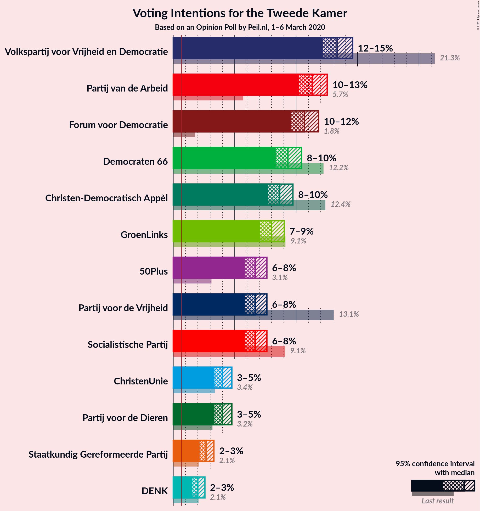

### Confidence Intervals

| Party | Last Result | Poll Result | 80% Confidence Interval | 90% Confidence Interval | 95% Confidence Interval | 99% Confidence Interval |
|:-----:|:-----------:|:-----------:|:-----------------------:|:-----------------------:|:-----------------------:|:-----------------------:|
| Volkspartij voor Vrijheid en Democratie | 21.3% | 13.3% | 12.6–14.2% |12.3–14.4% |12.2–14.6% |11.8–15.0% |
| Partij van de Arbeid | 5.7% | 11.3% | 10.6–12.1% |10.4–12.3% |10.2–12.5% |9.9–12.9% |
| Forum voor Democratie | 1.8% | 10.7% | 10.0–11.4% |9.8–11.6% |9.6–11.8% |9.3–12.2% |
| Democraten 66 | 12.2% | 9.3% | 8.7–10.1% |8.5–10.3% |8.3–10.4% |8.0–10.8% |
| Christen-Democratisch Appèl | 12.4% | 8.7% | 8.0–9.4% |7.8–9.6% |7.7–9.7% |7.4–10.1% |
| GroenLinks | 9.1% | 8.0% | 7.4–8.7% |7.2–8.9% |7.1–9.0% |6.8–9.4% |
| Partij voor de Vrijheid | 13.1% | 6.7% | 6.1–7.3% |6.0–7.5% |5.8–7.6% |5.6–7.9% |
| Socialistische Partij | 9.1% | 6.7% | 6.1–7.3% |6.0–7.5% |5.8–7.6% |5.6–7.9% |
| 50Plus | 3.1% | 6.7% | 6.1–7.3% |6.0–7.5% |5.8–7.6% |5.6–7.9% |
| ChristenUnie | 3.4% | 4.0% | 3.6–4.5% |3.4–4.6% |3.4–4.8% |3.2–5.0% |
| Partij voor de Dieren | 3.2% | 4.0% | 3.6–4.5% |3.4–4.6% |3.4–4.8% |3.2–5.0% |
| Staatkundig Gereformeerde Partij | 2.1% | 2.7% | 2.3–3.1% |2.2–3.2% |2.1–3.3% |2.0–3.5% |
| DENK | 2.1% | 2.0% | 1.7–2.4% |1.6–2.5% |1.6–2.6% |1.4–2.8% |

*Note:* The poll result column reflects the actual value used in the calculations. Published results may vary slightly, and in addition be rounded to fewer digits.

## Seats

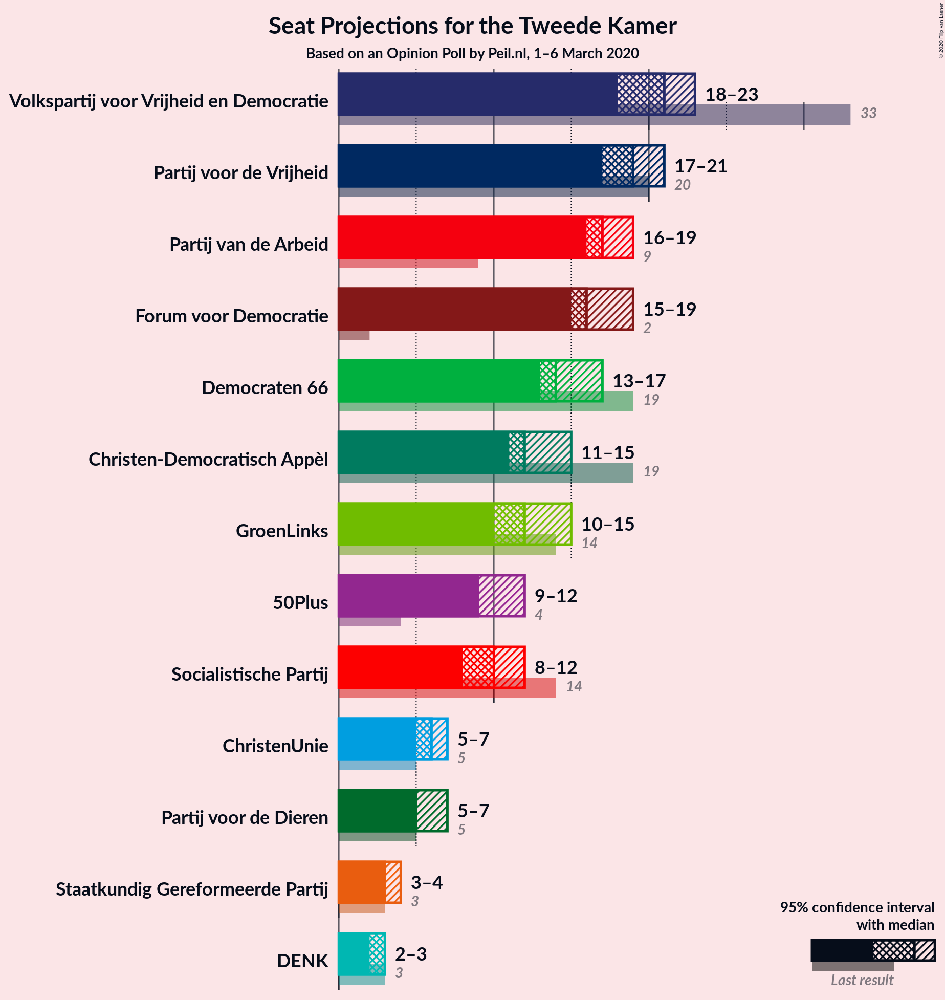

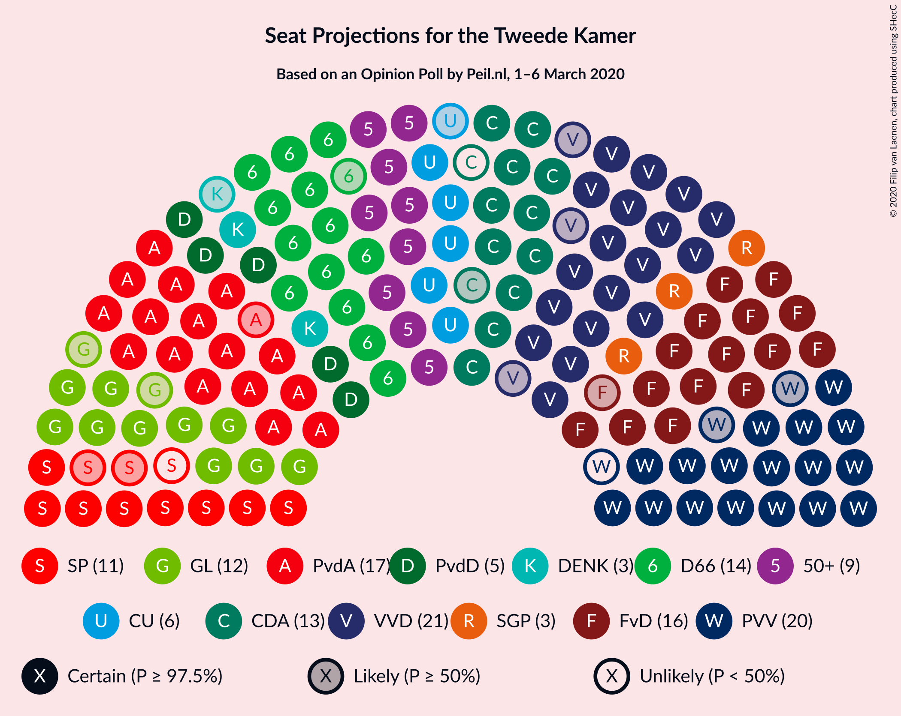

### Confidence Intervals

| Party | Last Result | Median | 80% Confidence Interval | 90% Confidence Interval | 95% Confidence Interval | 99% Confidence Interval |
|:-----:|:-----------:|:------:|:-----------------------:|:-----------------------:|:-----------------------:|:-----------------------:|
| <a href="#volkspartij-voor-vrijheid-en-democratie">Volkspartij voor Vrijheid en Democratie</a> | 33 | 21 | 20–22 |19–23 |19–23 |19–23 |
| <a href="#partij-van-de-arbeid">Partij van de Arbeid</a> | 9 | 18 | 15–19 |15–19 |15–19 |15–20 |
| <a href="#forum-voor-democratie">Forum voor Democratie</a> | 2 | 16 | 14–19 |14–19 |14–19 |14–19 |
| <a href="#democraten-66">Democraten 66</a> | 19 | 14 | 13–15 |13–16 |12–16 |12–16 |
| <a href="#christen-democratisch-appèl">Christen-Democratisch Appèl</a> | 19 | 13 | 12–15 |12–15 |12–15 |11–15 |
| <a href="#groenlinks">GroenLinks</a> | 14 | 12 | 11–13 |10–13 |10–14 |10–15 |
| <a href="#partij-voor-de-vrijheid">Partij voor de Vrijheid</a> | 20 | 10 | 9–11 |8–11 |8–11 |8–12 |
| <a href="#socialistische-partij">Socialistische Partij</a> | 14 | 10 | 9–11 |9–11 |8–11 |8–13 |
| <a href="#50plus">50Plus</a> | 4 | 9 | 8–10 |8–11 |8–11 |8–12 |
| <a href="#christenunie">ChristenUnie</a> | 5 | 6 | 5–7 |5–7 |5–7 |4–8 |
| <a href="#partij-voor-de-dieren">Partij voor de Dieren</a> | 5 | 6 | 5–6 |5–6 |5–6 |4–7 |
| <a href="#staatkundig-gereformeerde-partij">Staatkundig Gereformeerde Partij</a> | 3 | 4 | 3–4 |3–4 |2–4 |2–5 |
| <a href="#denk">DENK</a> | 3 | 2 | 2–4 |2–4 |2–4 |2–4 |

### Volkspartij voor Vrijheid en Democratie

*For a full overview of the results for this party, see the [Volkspartij voor Vrijheid en Democratie](party-volkspartijvoorvrijheidendemocratie.html) page.*

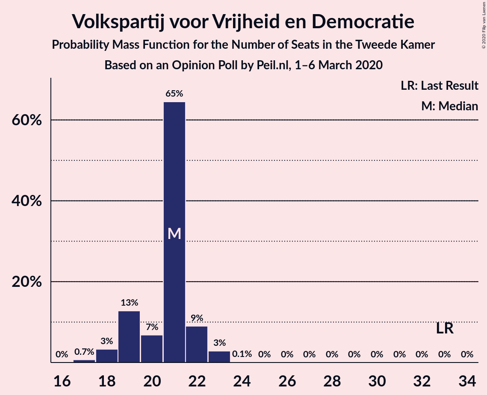

| Number of Seats | Probability | Accumulated | Special Marks |
|:---------------:|:-----------:|:-----------:|:-------------:|
| 17 | 0.1% | 100% |  |
| 18 | 0.4% | 99.9% |  |
| 19 | 8% | 99.5% |  |
| 20 | 35% | 91% |  |
| 21 | 40% | 56% | Median |
| 22 | 9% | 16% |  |
| 23 | 7% | 7% |  |
| 24 | 0% | 0% |  |
| 25 | 0% | 0% |  |
| 26 | 0% | 0% |  |
| 27 | 0% | 0% |  |
| 28 | 0% | 0% |  |
| 29 | 0% | 0% |  |
| 30 | 0% | 0% |  |
| 31 | 0% | 0% |  |
| 32 | 0% | 0% |  |
| 33 | 0% | 0% | Last Result |

### Partij van de Arbeid

*For a full overview of the results for this party, see the [Partij van de Arbeid](party-partijvandearbeid.html) page.*

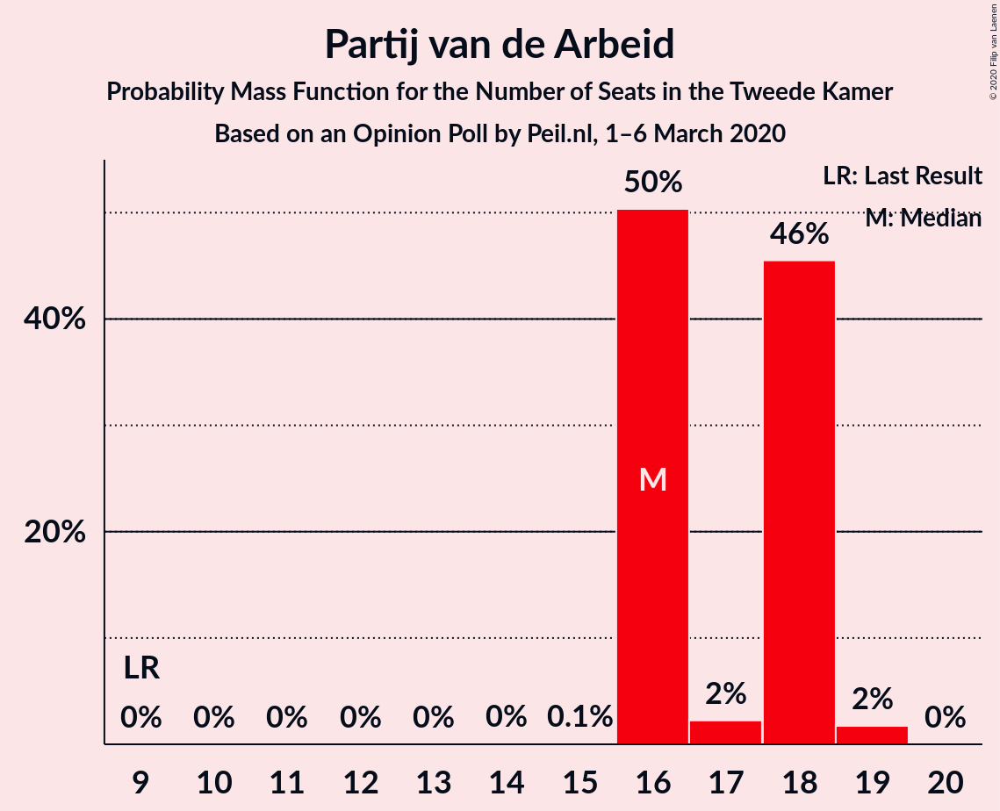

| Number of Seats | Probability | Accumulated | Special Marks |
|:---------------:|:-----------:|:-----------:|:-------------:|
| 9 | 0% | 100% | Last Result |
| 10 | 0% | 100% |  |
| 11 | 0% | 100% |  |
| 12 | 0% | 100% |  |
| 13 | 0% | 100% |  |
| 14 | 0% | 100% |  |
| 15 | 13% | 100% |  |
| 16 | 6% | 87% |  |
| 17 | 11% | 82% |  |
| 18 | 23% | 71% | Median |
| 19 | 47% | 48% |  |
| 20 | 0.3% | 0.6% |  |
| 21 | 0.3% | 0.3% |  |
| 22 | 0% | 0% |  |

### Forum voor Democratie

*For a full overview of the results for this party, see the [Forum voor Democratie](party-forumvoordemocratie.html) page.*

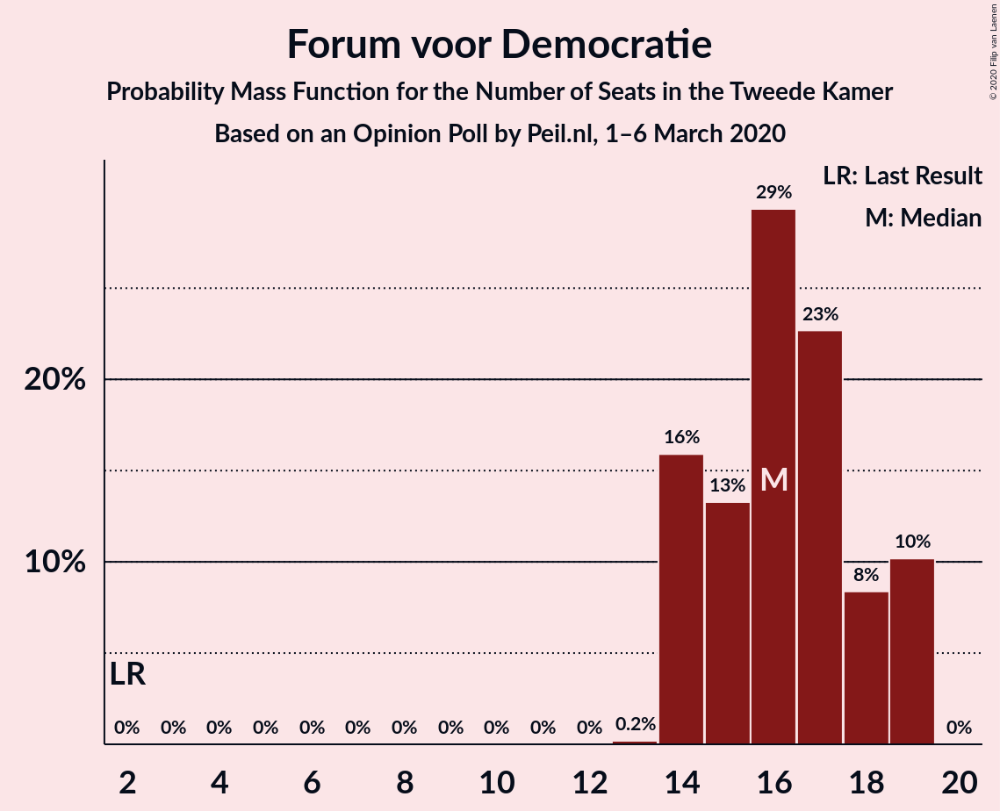

| Number of Seats | Probability | Accumulated | Special Marks |
|:---------------:|:-----------:|:-----------:|:-------------:|
| 2 | 0% | 100% | Last Result |
| 3 | 0% | 100% |  |
| 4 | 0% | 100% |  |
| 5 | 0% | 100% |  |
| 6 | 0% | 100% |  |
| 7 | 0% | 100% |  |
| 8 | 0% | 100% |  |
| 9 | 0% | 100% |  |
| 10 | 0% | 100% |  |
| 11 | 0% | 100% |  |
| 12 | 0% | 100% |  |
| 13 | 0.2% | 100% |  |
| 14 | 16% | 99.8% |  |
| 15 | 13% | 84% |  |
| 16 | 29% | 71% | Median |
| 17 | 23% | 41% |  |
| 18 | 8% | 19% |  |
| 19 | 10% | 10% |  |
| 20 | 0% | 0% |  |

### Democraten 66

*For a full overview of the results for this party, see the [Democraten 66](party-democraten66.html) page.*

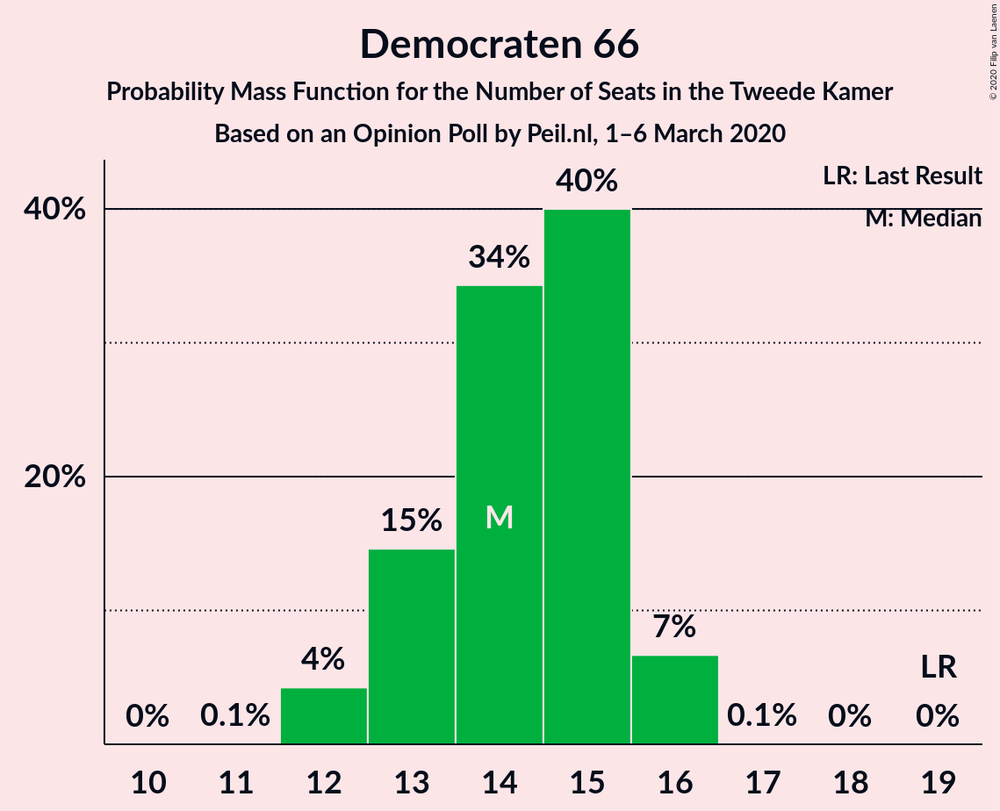

| Number of Seats | Probability | Accumulated | Special Marks |
|:---------------:|:-----------:|:-----------:|:-------------:|
| 11 | 0.1% | 100% |  |
| 12 | 4% | 99.9% |  |
| 13 | 15% | 96% |  |
| 14 | 34% | 81% | Median |
| 15 | 40% | 47% |  |
| 16 | 7% | 7% |  |
| 17 | 0.1% | 0.1% |  |
| 18 | 0% | 0% |  |
| 19 | 0% | 0% | Last Result |

### Christen-Democratisch Appèl

*For a full overview of the results for this party, see the [Christen-Democratisch Appèl](party-christen-democratischappèl.html) page.*

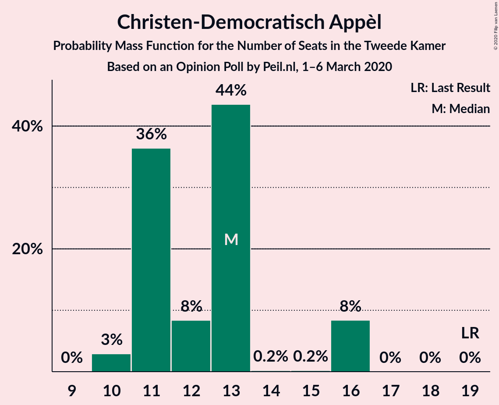

| Number of Seats | Probability | Accumulated | Special Marks |
|:---------------:|:-----------:|:-----------:|:-------------:|
| 10 | 0.1% | 100% |  |
| 11 | 1.0% | 99.9% |  |
| 12 | 28% | 98.9% |  |
| 13 | 26% | 70% | Median |
| 14 | 27% | 45% |  |
| 15 | 18% | 18% |  |
| 16 | 0% | 0.1% |  |
| 17 | 0% | 0% |  |
| 18 | 0% | 0% |  |
| 19 | 0% | 0% | Last Result |

### GroenLinks

*For a full overview of the results for this party, see the [GroenLinks](party-groenlinks.html) page.*

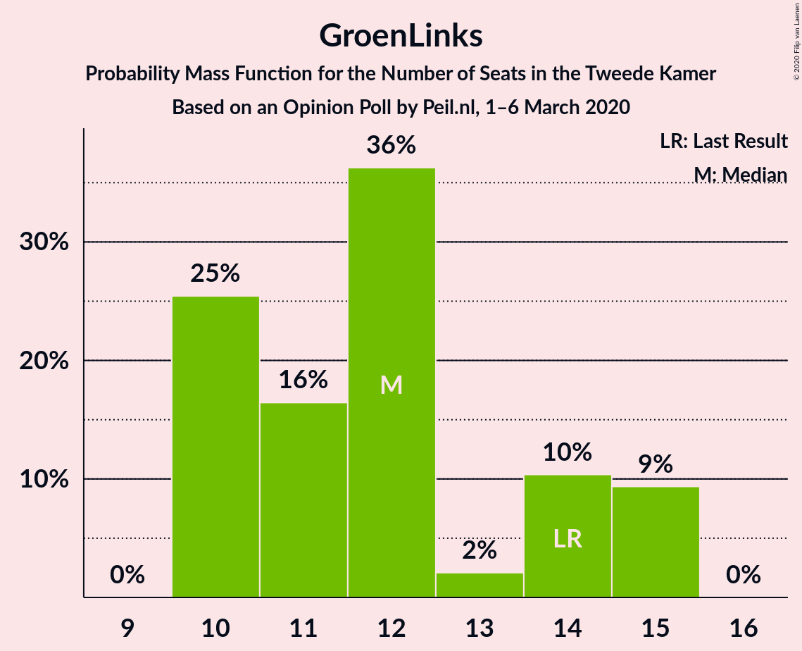

| Number of Seats | Probability | Accumulated | Special Marks |
|:---------------:|:-----------:|:-----------:|:-------------:|
| 10 | 6% | 100% |  |
| 11 | 10% | 94% |  |
| 12 | 71% | 84% | Median |
| 13 | 10% | 13% |  |
| 14 | 2% | 3% | Last Result |
| 15 | 0.5% | 0.5% |  |
| 16 | 0% | 0% |  |

### Partij voor de Vrijheid

*For a full overview of the results for this party, see the [Partij voor de Vrijheid](party-partijvoordevrijheid.html) page.*

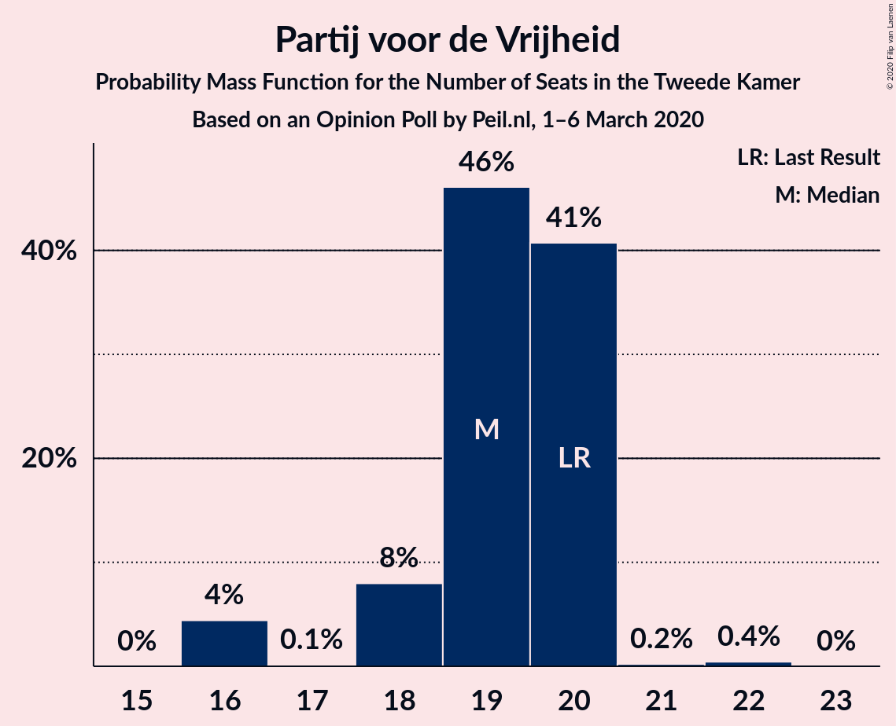

| Number of Seats | Probability | Accumulated | Special Marks |
|:---------------:|:-----------:|:-----------:|:-------------:|
| 8 | 8% | 100% |  |
| 9 | 34% | 92% |  |
| 10 | 38% | 57% | Median |
| 11 | 18% | 19% |  |
| 12 | 1.4% | 1.4% |  |
| 13 | 0% | 0% |  |
| 14 | 0% | 0% |  |
| 15 | 0% | 0% |  |
| 16 | 0% | 0% |  |
| 17 | 0% | 0% |  |
| 18 | 0% | 0% |  |
| 19 | 0% | 0% |  |
| 20 | 0% | 0% | Last Result |

### Socialistische Partij

*For a full overview of the results for this party, see the [Socialistische Partij](party-socialistischepartij.html) page.*

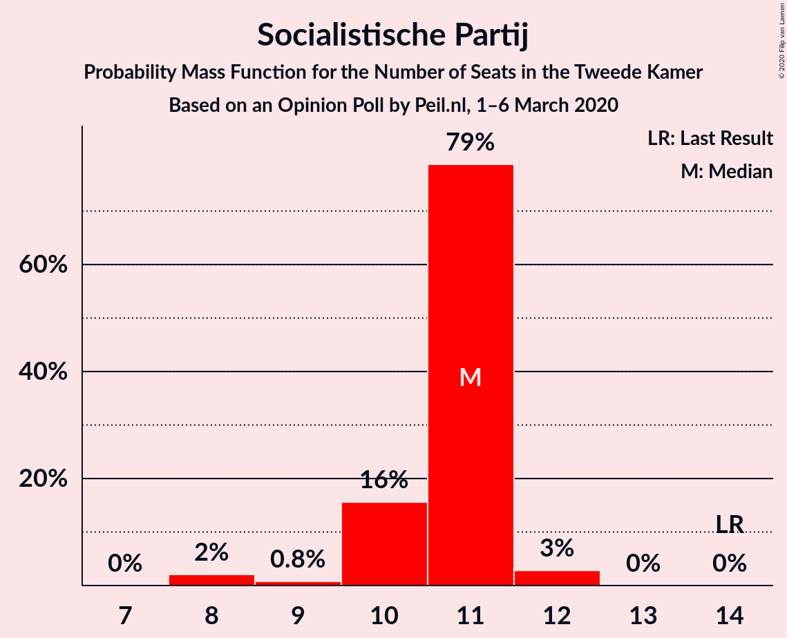

| Number of Seats | Probability | Accumulated | Special Marks |
|:---------------:|:-----------:|:-----------:|:-------------:|
| 8 | 4% | 100% |  |
| 9 | 36% | 96% |  |
| 10 | 29% | 61% | Median |
| 11 | 30% | 32% |  |
| 12 | 0.8% | 1.3% |  |
| 13 | 0.5% | 0.5% |  |
| 14 | 0% | 0% | Last Result |

### 50Plus

*For a full overview of the results for this party, see the [50Plus](party-50plus.html) page.*

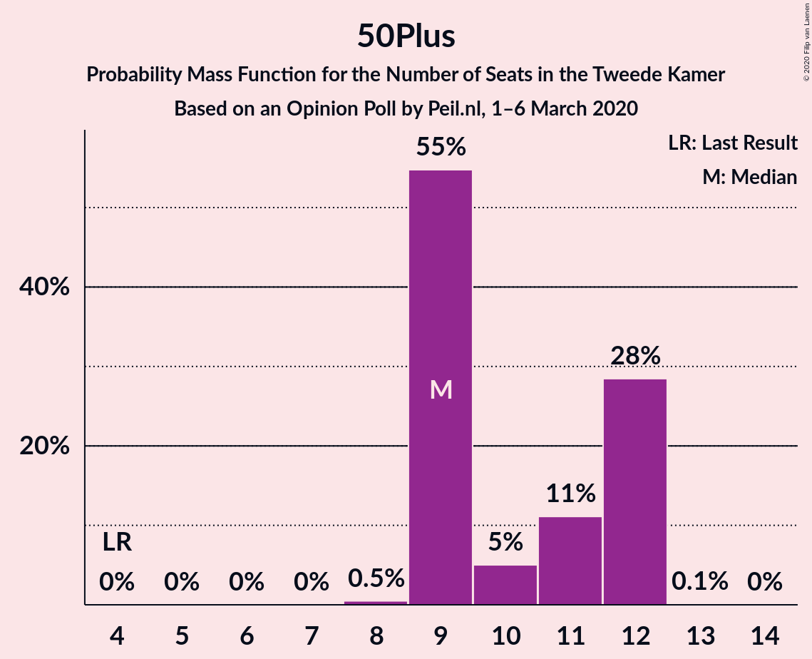

| Number of Seats | Probability | Accumulated | Special Marks |
|:---------------:|:-----------:|:-----------:|:-------------:|
| 4 | 0% | 100% | Last Result |
| 5 | 0% | 100% |  |
| 6 | 0% | 100% |  |
| 7 | 0% | 100% |  |
| 8 | 29% | 100% |  |
| 9 | 23% | 71% | Median |
| 10 | 42% | 48% |  |
| 11 | 5% | 6% |  |
| 12 | 2% | 2% |  |
| 13 | 0% | 0% |  |

### ChristenUnie

*For a full overview of the results for this party, see the [ChristenUnie](party-christenunie.html) page.*

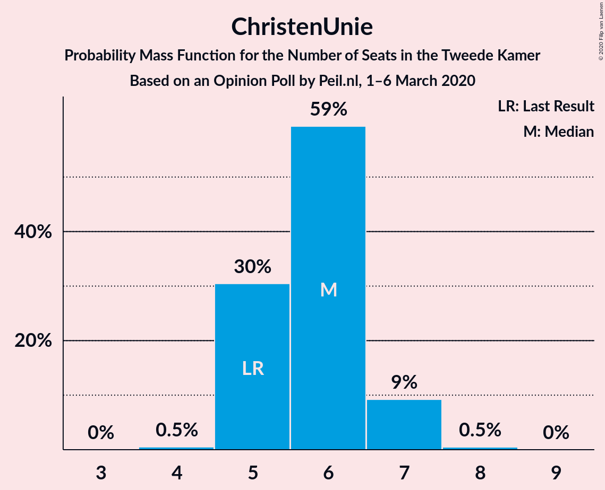

| Number of Seats | Probability | Accumulated | Special Marks |
|:---------------:|:-----------:|:-----------:|:-------------:|
| 4 | 2% | 100% |  |
| 5 | 32% | 98% | Last Result |
| 6 | 48% | 65% | Median |
| 7 | 17% | 17% |  |
| 8 | 0.5% | 0.5% |  |
| 9 | 0% | 0% |  |

### Partij voor de Dieren

*For a full overview of the results for this party, see the [Partij voor de Dieren](party-partijvoordedieren.html) page.*

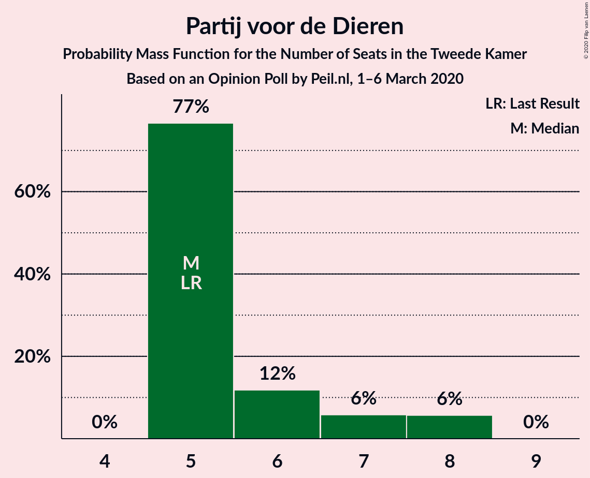

| Number of Seats | Probability | Accumulated | Special Marks |
|:---------------:|:-----------:|:-----------:|:-------------:|
| 4 | 0.6% | 100% |  |
| 5 | 44% | 99.4% | Last Result |
| 6 | 54% | 55% | Median |
| 7 | 2% | 2% |  |
| 8 | 0.1% | 0.2% |  |
| 9 | 0% | 0% |  |

### Staatkundig Gereformeerde Partij

*For a full overview of the results for this party, see the [Staatkundig Gereformeerde Partij](party-staatkundiggereformeerdepartij.html) page.*

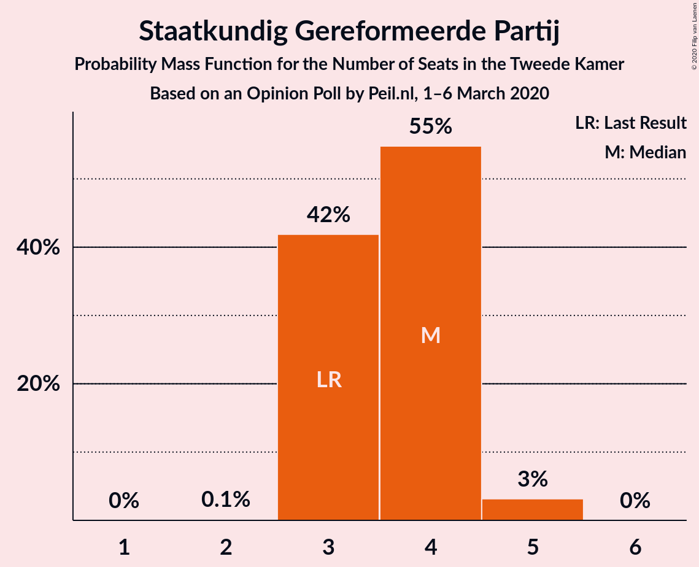

| Number of Seats | Probability | Accumulated | Special Marks |
|:---------------:|:-----------:|:-----------:|:-------------:|
| 2 | 5% | 100% |  |
| 3 | 34% | 95% | Last Result |
| 4 | 60% | 62% | Median |
| 5 | 2% | 2% |  |
| 6 | 0% | 0% |  |

### DENK

*For a full overview of the results for this party, see the [DENK](party-denk.html) page.*

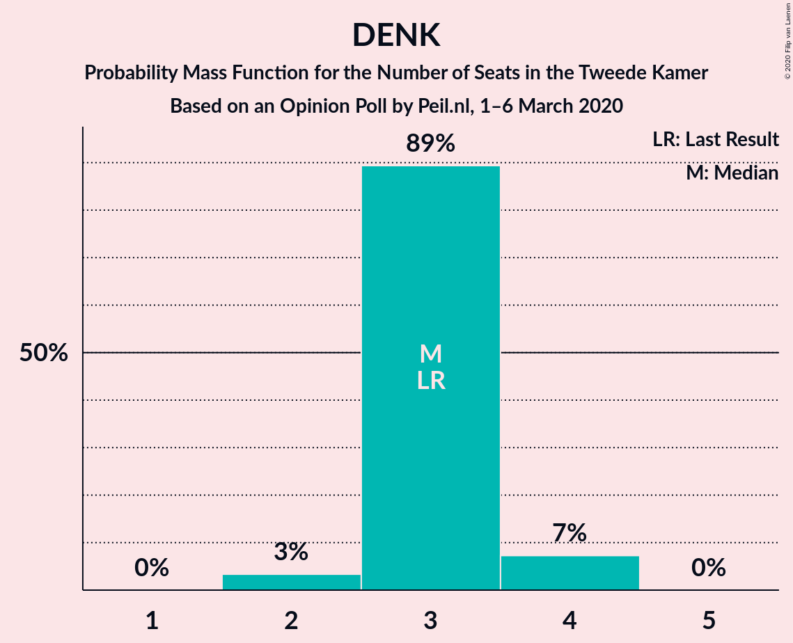

| Number of Seats | Probability | Accumulated | Special Marks |
|:---------------:|:-----------:|:-----------:|:-------------:|
| 2 | 58% | 100% | Median |
| 3 | 29% | 42% | Last Result |
| 4 | 13% | 13% |  |
| 5 | 0% | 0% |  |

## Coalitions

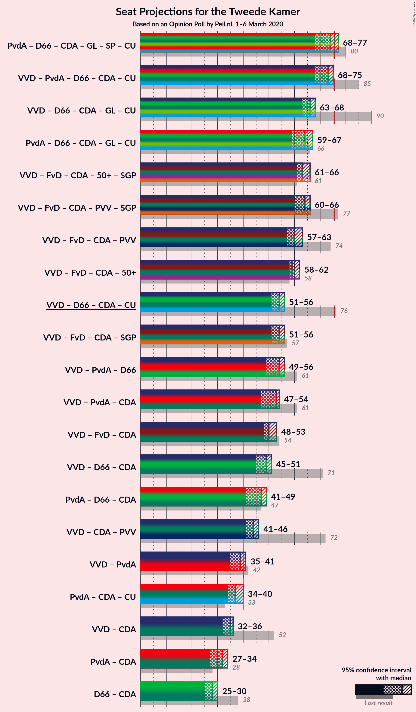

### Confidence Intervals

| Coalition | Last Result | Median | Majority? | 80% Confidence Interval | 90% Confidence Interval | 95% Confidence Interval | 99% Confidence Interval |
|:---------:|:-----------:|:------:|:---------:|:-----------------------:|:-----------------------:|:-----------------------:|:-----------------------:|
| Partij van de Arbeid – Democraten 66 – Christen-Democratisch Appèl – GroenLinks – Socialistische Partij – ChristenUnie | 80 | 74 | 14% | 71–77 | 69–77 | 68–77 | 68–77 |
| Volkspartij voor Vrijheid en Democratie – Partij van de Arbeid – Democraten 66 – Christen-Democratisch Appèl – ChristenUnie | 85 | 73 | 0% | 69–75 | 69–75 | 68–75 | 67–75 |
| Volkspartij voor Vrijheid en Democratie – Democraten 66 – Christen-Democratisch Appèl – GroenLinks – ChristenUnie | 90 | 66 | 0% | 63–68 | 63–68 | 63–68 | 62–70 |
| Partij van de Arbeid – Democraten 66 – Christen-Democratisch Appèl – GroenLinks – ChristenUnie | 66 | 64 | 0% | 61–67 | 60–67 | 59–67 | 58–67 |
| Volkspartij voor Vrijheid en Democratie – Forum voor Democratie – Christen-Democratisch Appèl – 50Plus – Staatkundig Gereformeerde Partij | 61 | 63 | 0% | 61–65 | 61–65 | 61–66 | 60–68 |
| Volkspartij voor Vrijheid en Democratie – Forum voor Democratie – Christen-Democratisch Appèl – Partij voor de Vrijheid – Staatkundig Gereformeerde Partij | 77 | 64 | 0% | 60–65 | 60–65 | 60–66 | 59–67 |
| Volkspartij voor Vrijheid en Democratie – Forum voor Democratie – Christen-Democratisch Appèl – Partij voor de Vrijheid | 74 | 60 | 0% | 57–62 | 57–63 | 57–63 | 55–63 |
| Volkspartij voor Vrijheid en Democratie – Forum voor Democratie – Christen-Democratisch Appèl – 50Plus | 58 | 59 | 0% | 58–61 | 58–62 | 58–62 | 56–64 |
| Volkspartij voor Vrijheid en Democratie – Democraten 66 – Christen-Democratisch Appèl – ChristenUnie | 76 | 54 | 0% | 51–56 | 51–56 | 51–56 | 50–57 |
| Volkspartij voor Vrijheid en Democratie – Forum voor Democratie – Christen-Democratisch Appèl – Staatkundig Gereformeerde Partij | 57 | 54 | 0% | 51–56 | 51–56 | 51–56 | 50–58 |
| Volkspartij voor Vrijheid en Democratie – Partij van de Arbeid – Democraten 66 | 61 | 54 | 0% | 50–55 | 49–55 | 49–56 | 48–56 |
| Volkspartij voor Vrijheid en Democratie – Partij van de Arbeid – Christen-Democratisch Appèl | 61 | 53 | 0% | 47–54 | 47–54 | 47–54 | 47–54 |
| Volkspartij voor Vrijheid en Democratie – Forum voor Democratie – Christen-Democratisch Appèl | 54 | 50 | 0% | 48–52 | 48–52 | 48–53 | 46–54 |
| Volkspartij voor Vrijheid en Democratie – Democraten 66 – Christen-Democratisch Appèl | 71 | 49 | 0% | 46–50 | 45–51 | 45–51 | 44–52 |
| Partij van de Arbeid – Democraten 66 – Christen-Democratisch Appèl | 47 | 47 | 0% | 42–49 | 42–49 | 41–49 | 41–49 |
| Volkspartij voor Vrijheid en Democratie – Christen-Democratisch Appèl – Partij voor de Vrijheid | 72 | 44 | 0% | 42–45 | 42–46 | 41–46 | 40–47 |
| Volkspartij voor Vrijheid en Democratie – Partij van de Arbeid | 42 | 39 | 0% | 35–40 | 35–41 | 35–41 | 35–41 |
| Partij van de Arbeid – Christen-Democratisch Appèl – ChristenUnie | 33 | 37 | 0% | 34–40 | 34–40 | 34–40 | 33–40 |
| Volkspartij voor Vrijheid en Democratie – Christen-Democratisch Appèl | 52 | 35 | 0% | 32–35 | 32–36 | 32–36 | 31–36 |
| Partij van de Arbeid – Christen-Democratisch Appèl | 28 | 32 | 0% | 27–34 | 27–34 | 27–34 | 27–34 |
| Democraten 66 – Christen-Democratisch Appèl | 38 | 28 | 0% | 26–30 | 25–30 | 25–30 | 25–31 |

### Partij van de Arbeid – Democraten 66 – Christen-Democratisch Appèl – GroenLinks – Socialistische Partij – ChristenUnie

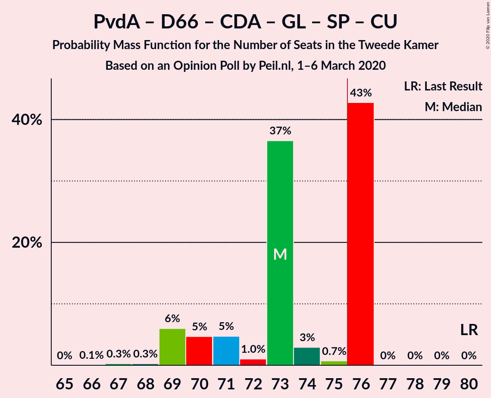

| Number of Seats | Probability | Accumulated | Special Marks |
|:---------------:|:-----------:|:-----------:|:-------------:|
| 68 | 3% | 100% |  |
| 69 | 5% | 97% |  |
| 70 | 0.5% | 92% |  |
| 71 | 18% | 91% |  |
| 72 | 15% | 74% |  |
| 73 | 8% | 59% | Median |
| 74 | 22% | 51% |  |
| 75 | 14% | 28% |  |
| 76 | 2% | 14% | Majority |
| 77 | 12% | 12% |  |
| 78 | 0% | 0% |  |
| 79 | 0% | 0% |  |
| 80 | 0% | 0% | Last Result |

### Volkspartij voor Vrijheid en Democratie – Partij van de Arbeid – Democraten 66 – Christen-Democratisch Appèl – ChristenUnie

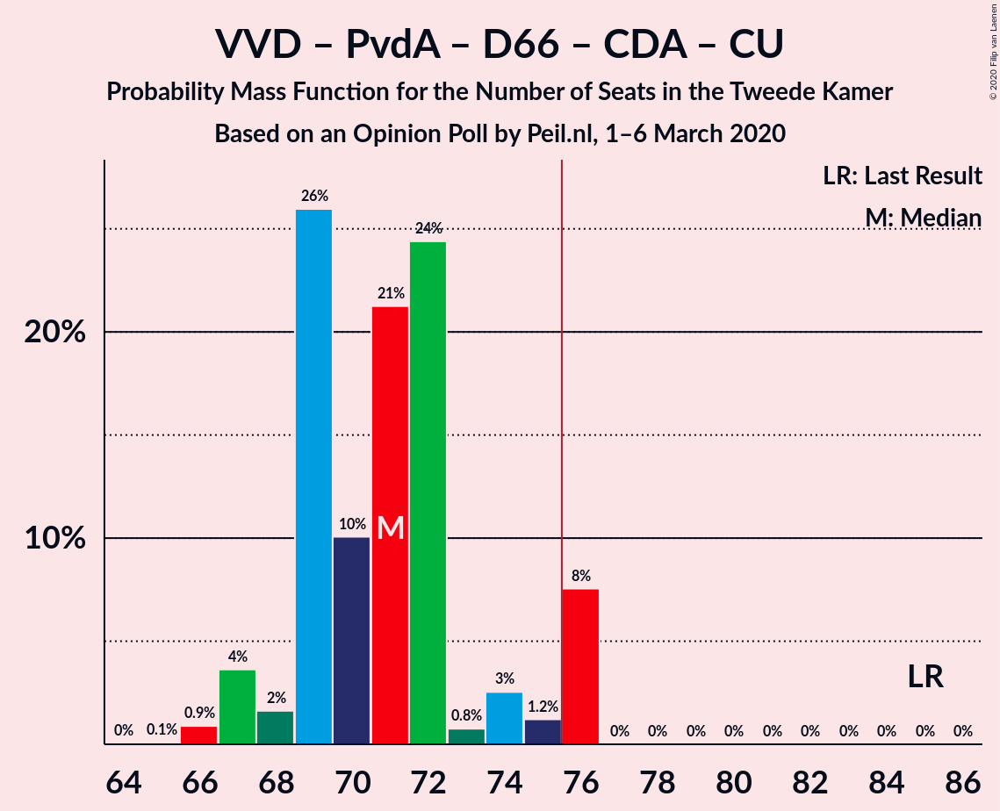

| Number of Seats | Probability | Accumulated | Special Marks |
|:---------------:|:-----------:|:-----------:|:-------------:|
| 65 | 0% | 100% |  |
| 66 | 0.1% | 99.9% |  |
| 67 | 1.1% | 99.8% |  |
| 68 | 2% | 98.7% |  |
| 69 | 23% | 96% |  |
| 70 | 6% | 74% |  |
| 71 | 1.5% | 68% |  |
| 72 | 14% | 66% | Median |
| 73 | 18% | 53% |  |
| 74 | 23% | 35% |  |
| 75 | 12% | 12% |  |
| 76 | 0% | 0% | Majority |
| 77 | 0% | 0% |  |
| 78 | 0% | 0% |  |
| 79 | 0% | 0% |  |
| 80 | 0% | 0% |  |
| 81 | 0% | 0% |  |
| 82 | 0% | 0% |  |
| 83 | 0% | 0% |  |
| 84 | 0% | 0% |  |
| 85 | 0% | 0% | Last Result |

### Volkspartij voor Vrijheid en Democratie – Democraten 66 – Christen-Democratisch Appèl – GroenLinks – ChristenUnie

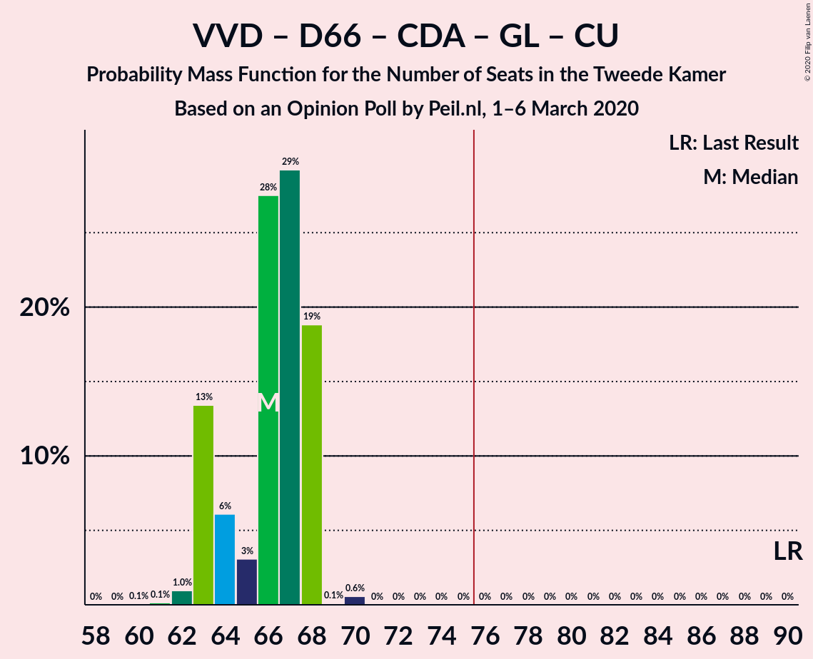

| Number of Seats | Probability | Accumulated | Special Marks |
|:---------------:|:-----------:|:-----------:|:-------------:|
| 60 | 0.1% | 100% |  |
| 61 | 0.1% | 99.9% |  |
| 62 | 1.0% | 99.8% |  |
| 63 | 13% | 98.8% |  |
| 64 | 6% | 85% |  |
| 65 | 3% | 79% |  |
| 66 | 28% | 76% | Median |
| 67 | 29% | 49% |  |
| 68 | 19% | 19% |  |
| 69 | 0.1% | 0.7% |  |
| 70 | 0.6% | 0.6% |  |
| 71 | 0% | 0% |  |
| 72 | 0% | 0% |  |
| 73 | 0% | 0% |  |
| 74 | 0% | 0% |  |
| 75 | 0% | 0% |  |
| 76 | 0% | 0% | Majority |
| 77 | 0% | 0% |  |
| 78 | 0% | 0% |  |
| 79 | 0% | 0% |  |
| 80 | 0% | 0% |  |
| 81 | 0% | 0% |  |
| 82 | 0% | 0% |  |
| 83 | 0% | 0% |  |
| 84 | 0% | 0% |  |
| 85 | 0% | 0% |  |
| 86 | 0% | 0% |  |
| 87 | 0% | 0% |  |
| 88 | 0% | 0% |  |
| 89 | 0% | 0% |  |
| 90 | 0% | 0% | Last Result |

### Partij van de Arbeid – Democraten 66 – Christen-Democratisch Appèl – GroenLinks – ChristenUnie

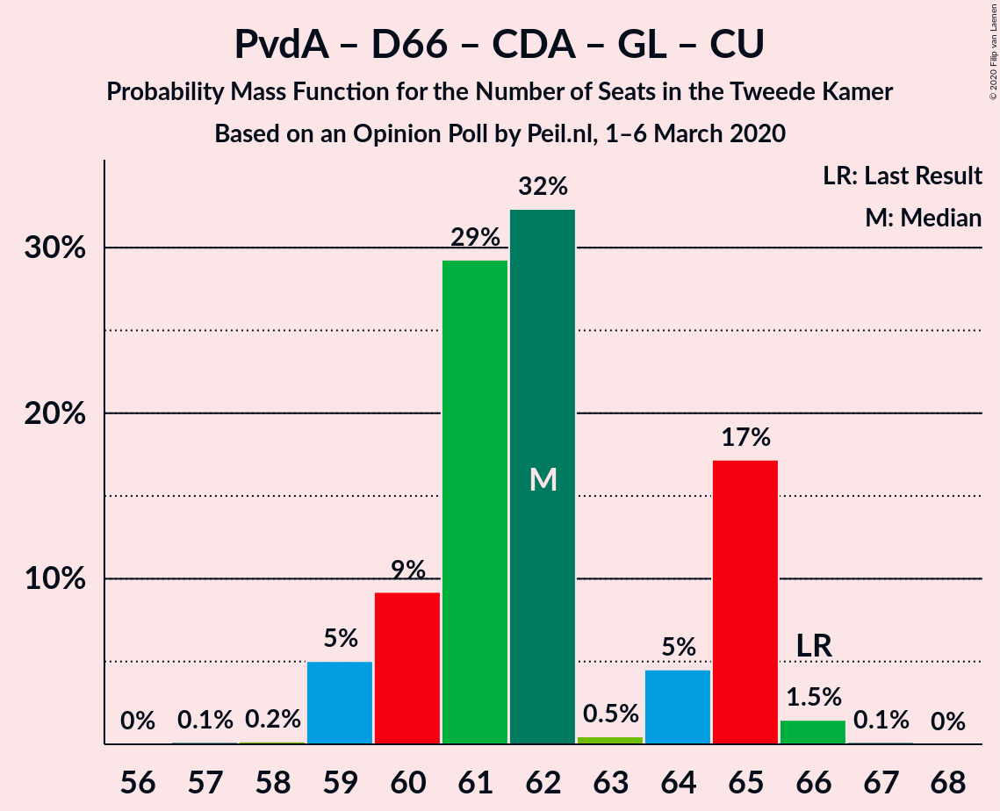

| Number of Seats | Probability | Accumulated | Special Marks |
|:---------------:|:-----------:|:-----------:|:-------------:|
| 58 | 2% | 100% |  |
| 59 | 2% | 98% |  |
| 60 | 3% | 95% |  |
| 61 | 24% | 93% |  |
| 62 | 12% | 69% |  |
| 63 | 4% | 58% | Median |
| 64 | 19% | 53% |  |
| 65 | 20% | 34% |  |
| 66 | 0.3% | 14% | Last Result |
| 67 | 14% | 14% |  |
| 68 | 0% | 0% |  |

### Volkspartij voor Vrijheid en Democratie – Forum voor Democratie – Christen-Democratisch Appèl – 50Plus – Staatkundig Gereformeerde Partij

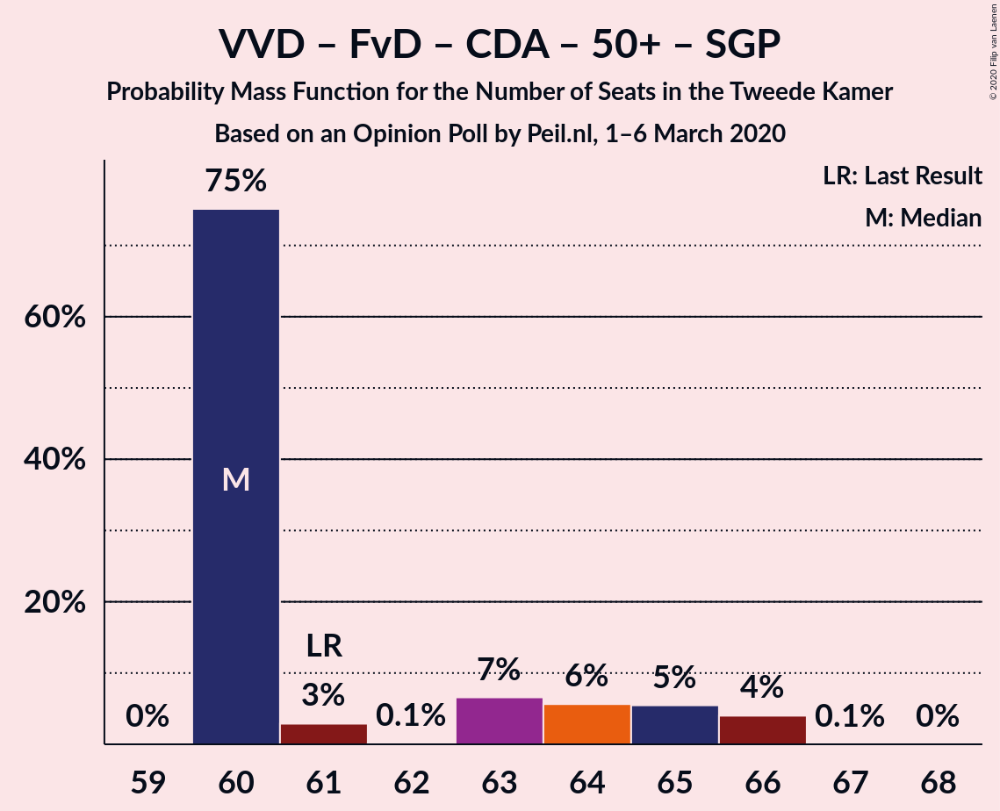

| Number of Seats | Probability | Accumulated | Special Marks |
|:---------------:|:-----------:|:-----------:|:-------------:|
| 59 | 0.3% | 100% |  |
| 60 | 0.6% | 99.7% |  |
| 61 | 13% | 99.1% | Last Result |
| 62 | 28% | 87% |  |
| 63 | 12% | 59% | Median |
| 64 | 29% | 47% |  |
| 65 | 14% | 18% |  |
| 66 | 2% | 3% |  |
| 67 | 0.1% | 1.5% |  |
| 68 | 1.3% | 1.4% |  |
| 69 | 0% | 0% |  |

### Volkspartij voor Vrijheid en Democratie – Forum voor Democratie – Christen-Democratisch Appèl – Partij voor de Vrijheid – Staatkundig Gereformeerde Partij

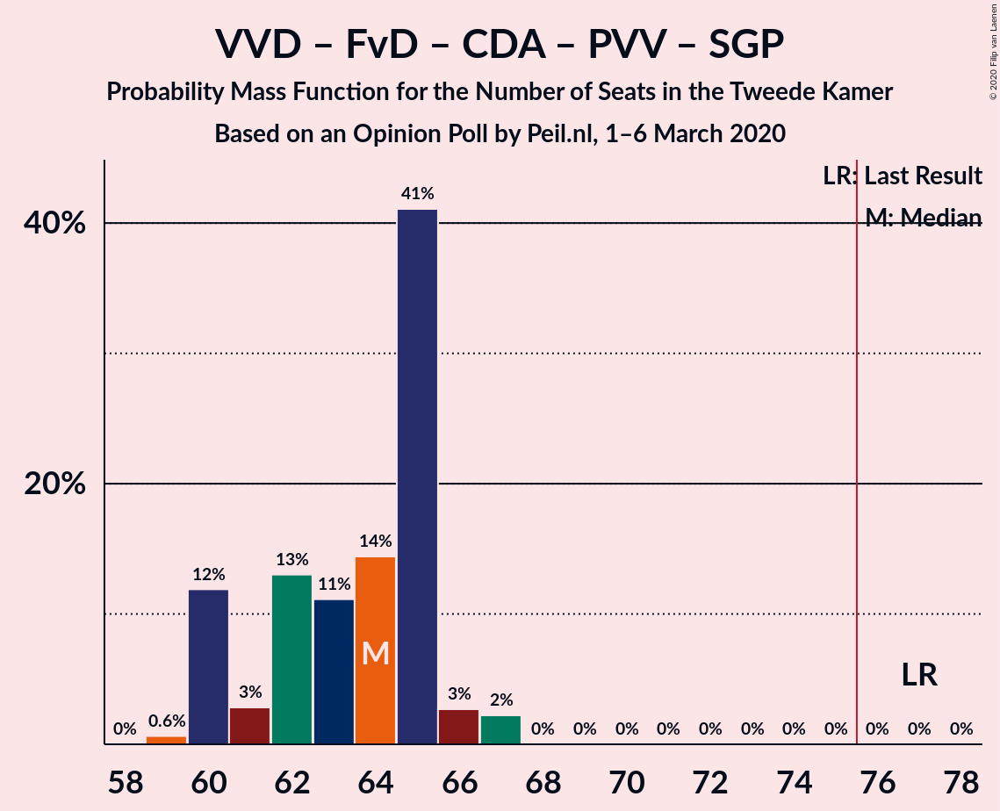

| Number of Seats | Probability | Accumulated | Special Marks |
|:---------------:|:-----------:|:-----------:|:-------------:|
| 59 | 0.6% | 100% |  |
| 60 | 12% | 99.4% |  |
| 61 | 3% | 87% |  |
| 62 | 13% | 85% |  |
| 63 | 11% | 72% |  |
| 64 | 14% | 60% | Median |
| 65 | 41% | 46% |  |
| 66 | 3% | 5% |  |
| 67 | 2% | 2% |  |
| 68 | 0% | 0% |  |
| 69 | 0% | 0% |  |
| 70 | 0% | 0% |  |
| 71 | 0% | 0% |  |
| 72 | 0% | 0% |  |
| 73 | 0% | 0% |  |
| 74 | 0% | 0% |  |
| 75 | 0% | 0% |  |
| 76 | 0% | 0% | Majority |
| 77 | 0% | 0% | Last Result |

### Volkspartij voor Vrijheid en Democratie – Forum voor Democratie – Christen-Democratisch Appèl – Partij voor de Vrijheid

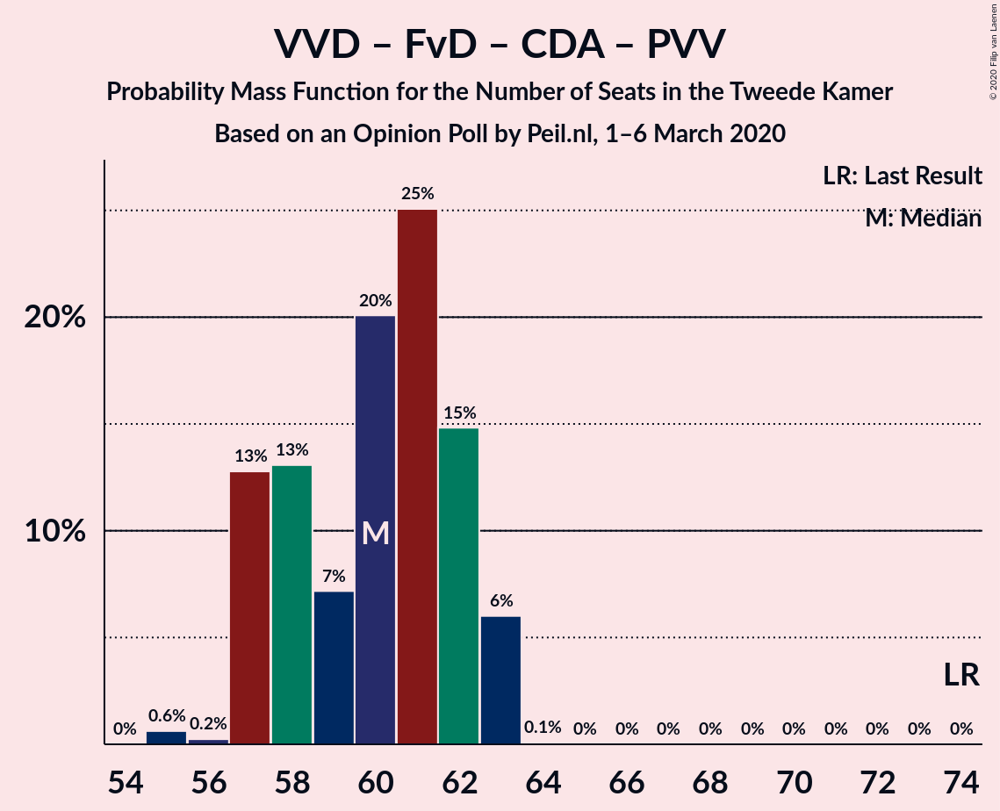

| Number of Seats | Probability | Accumulated | Special Marks |
|:---------------:|:-----------:|:-----------:|:-------------:|
| 55 | 0.6% | 100% |  |
| 56 | 0.2% | 99.4% |  |
| 57 | 13% | 99.1% |  |
| 58 | 13% | 86% |  |
| 59 | 7% | 73% |  |
| 60 | 20% | 66% | Median |
| 61 | 25% | 46% |  |
| 62 | 15% | 21% |  |
| 63 | 6% | 6% |  |
| 64 | 0.1% | 0.1% |  |
| 65 | 0% | 0% |  |
| 66 | 0% | 0% |  |
| 67 | 0% | 0% |  |
| 68 | 0% | 0% |  |
| 69 | 0% | 0% |  |
| 70 | 0% | 0% |  |
| 71 | 0% | 0% |  |
| 72 | 0% | 0% |  |
| 73 | 0% | 0% |  |
| 74 | 0% | 0% | Last Result |

### Volkspartij voor Vrijheid en Democratie – Forum voor Democratie – Christen-Democratisch Appèl – 50Plus

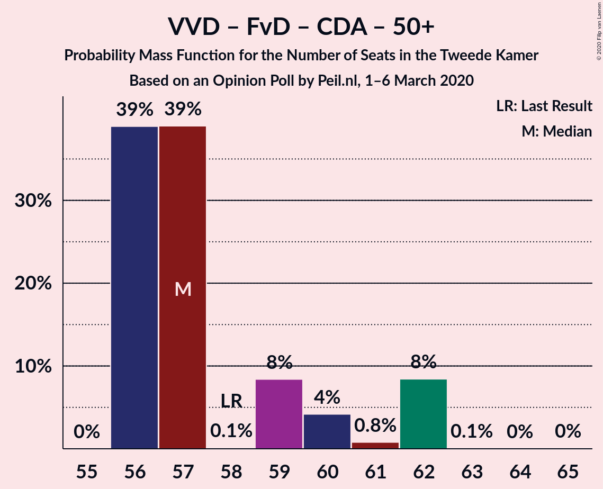

| Number of Seats | Probability | Accumulated | Special Marks |
|:---------------:|:-----------:|:-----------:|:-------------:|
| 55 | 0.2% | 100% |  |
| 56 | 0.7% | 99.8% |  |
| 57 | 1.3% | 99.1% |  |
| 58 | 22% | 98% | Last Result |
| 59 | 28% | 76% | Median |
| 60 | 26% | 49% |  |
| 61 | 14% | 22% |  |
| 62 | 5% | 8% |  |
| 63 | 1.0% | 2% |  |
| 64 | 1.3% | 1.4% |  |
| 65 | 0.1% | 0.1% |  |
| 66 | 0% | 0% |  |

### Volkspartij voor Vrijheid en Democratie – Democraten 66 – Christen-Democratisch Appèl – ChristenUnie

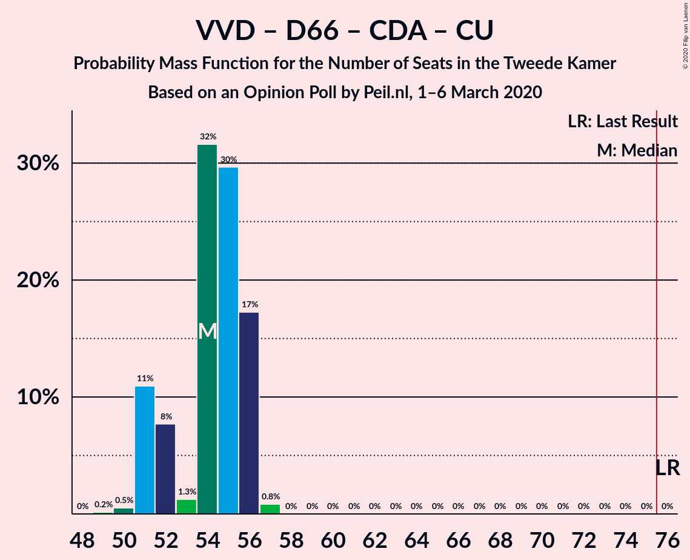

| Number of Seats | Probability | Accumulated | Special Marks |
|:---------------:|:-----------:|:-----------:|:-------------:|
| 49 | 0.2% | 100% |  |
| 50 | 0.5% | 99.8% |  |
| 51 | 11% | 99.3% |  |
| 52 | 8% | 88% |  |
| 53 | 1.3% | 81% |  |
| 54 | 32% | 79% | Median |
| 55 | 30% | 48% |  |
| 56 | 17% | 18% |  |
| 57 | 0.8% | 0.9% |  |
| 58 | 0% | 0% |  |
| 59 | 0% | 0% |  |
| 60 | 0% | 0% |  |
| 61 | 0% | 0% |  |
| 62 | 0% | 0% |  |
| 63 | 0% | 0% |  |
| 64 | 0% | 0% |  |
| 65 | 0% | 0% |  |
| 66 | 0% | 0% |  |
| 67 | 0% | 0% |  |
| 68 | 0% | 0% |  |
| 69 | 0% | 0% |  |
| 70 | 0% | 0% |  |
| 71 | 0% | 0% |  |
| 72 | 0% | 0% |  |
| 73 | 0% | 0% |  |
| 74 | 0% | 0% |  |
| 75 | 0% | 0% |  |
| 76 | 0% | 0% | Last Result, Majority |

### Volkspartij voor Vrijheid en Democratie – Forum voor Democratie – Christen-Democratisch Appèl – Staatkundig Gereformeerde Partij

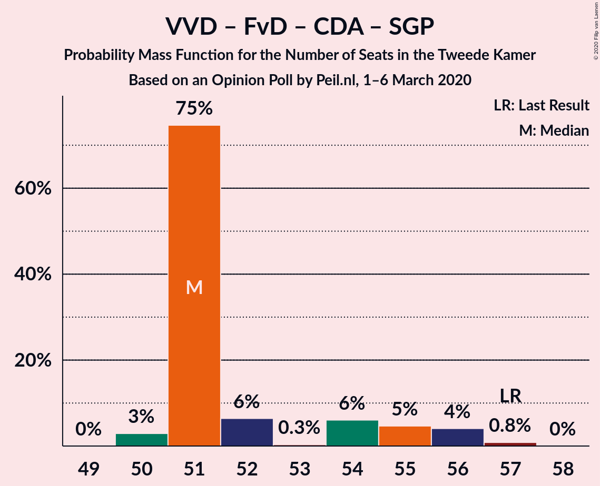

| Number of Seats | Probability | Accumulated | Special Marks |
|:---------------:|:-----------:|:-----------:|:-------------:|
| 49 | 0.2% | 100% |  |
| 50 | 0.7% | 99.8% |  |
| 51 | 12% | 99.1% |  |
| 52 | 15% | 87% |  |
| 53 | 5% | 71% |  |
| 54 | 30% | 67% | Median |
| 55 | 14% | 37% |  |
| 56 | 22% | 23% |  |
| 57 | 0.1% | 1.2% | Last Result |
| 58 | 1.1% | 1.1% |  |
| 59 | 0% | 0% |  |

### Volkspartij voor Vrijheid en Democratie – Partij van de Arbeid – Democraten 66

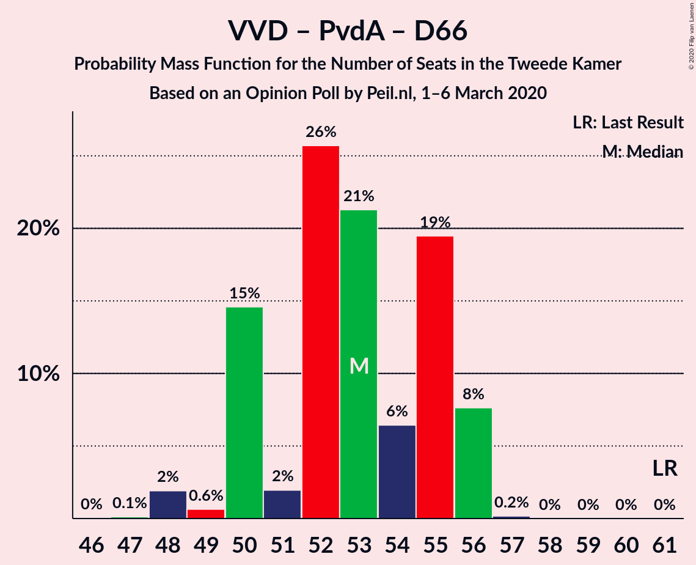

| Number of Seats | Probability | Accumulated | Special Marks |
|:---------------:|:-----------:|:-----------:|:-------------:|
| 47 | 0.1% | 100% |  |
| 48 | 2% | 99.9% |  |
| 49 | 4% | 98% |  |
| 50 | 11% | 94% |  |
| 51 | 6% | 83% |  |
| 52 | 19% | 77% |  |
| 53 | 3% | 59% | Median |
| 54 | 37% | 55% |  |
| 55 | 14% | 18% |  |
| 56 | 4% | 4% |  |
| 57 | 0% | 0% |  |
| 58 | 0% | 0% |  |
| 59 | 0% | 0% |  |
| 60 | 0% | 0% |  |
| 61 | 0% | 0% | Last Result |

### Volkspartij voor Vrijheid en Democratie – Partij van de Arbeid – Christen-Democratisch Appèl

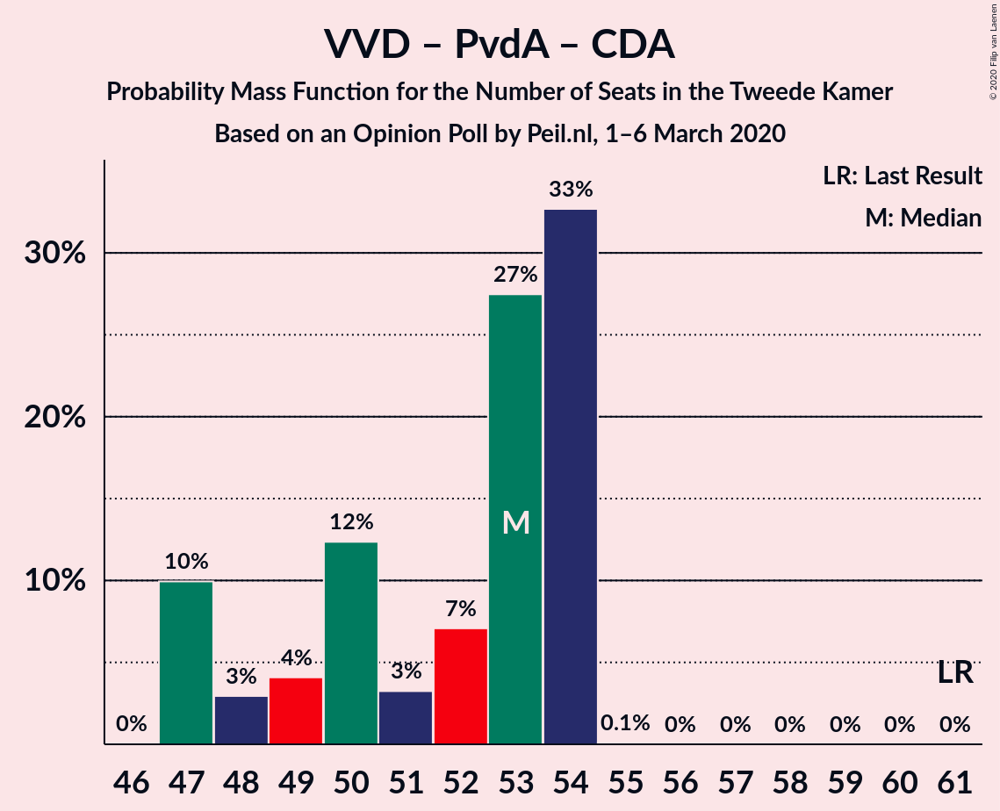

| Number of Seats | Probability | Accumulated | Special Marks |
|:---------------:|:-----------:|:-----------:|:-------------:|
| 46 | 0% | 100% |  |
| 47 | 10% | 99.9% |  |
| 48 | 3% | 90% |  |
| 49 | 4% | 87% |  |
| 50 | 12% | 83% |  |
| 51 | 3% | 71% |  |
| 52 | 7% | 67% | Median |
| 53 | 27% | 60% |  |
| 54 | 33% | 33% |  |
| 55 | 0.1% | 0.1% |  |
| 56 | 0% | 0% |  |
| 57 | 0% | 0% |  |
| 58 | 0% | 0% |  |
| 59 | 0% | 0% |  |
| 60 | 0% | 0% |  |
| 61 | 0% | 0% | Last Result |

### Volkspartij voor Vrijheid en Democratie – Forum voor Democratie – Christen-Democratisch Appèl

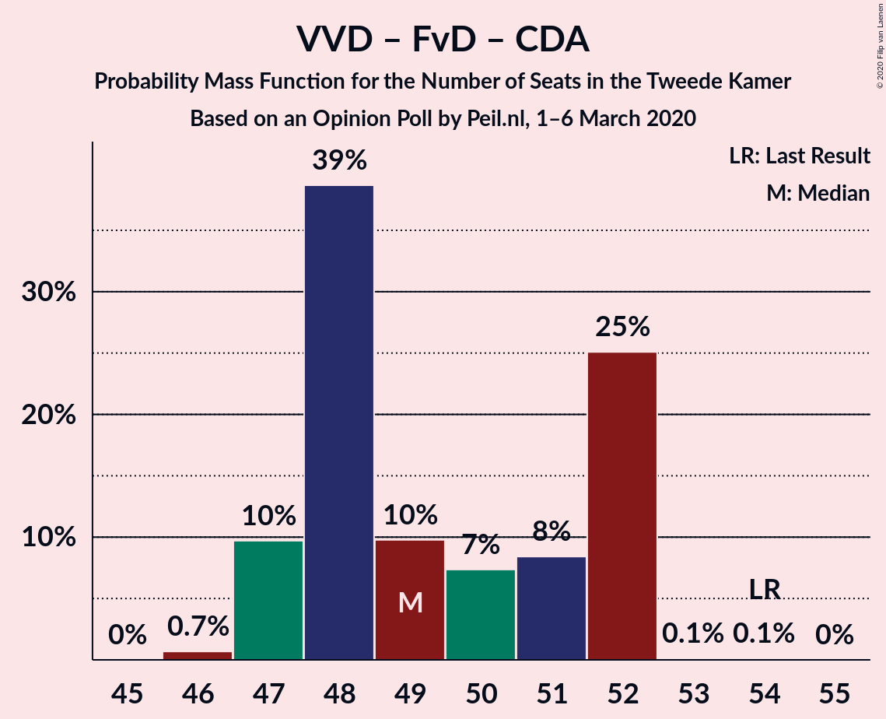

| Number of Seats | Probability | Accumulated | Special Marks |
|:---------------:|:-----------:|:-----------:|:-------------:|
| 46 | 0.9% | 100% |  |
| 47 | 1.3% | 99.1% |  |
| 48 | 22% | 98% |  |
| 49 | 3% | 76% |  |
| 50 | 24% | 73% | Median |
| 51 | 21% | 49% |  |
| 52 | 24% | 28% |  |
| 53 | 3% | 4% |  |
| 54 | 1.1% | 1.2% | Last Result |
| 55 | 0% | 0% |  |

### Volkspartij voor Vrijheid en Democratie – Democraten 66 – Christen-Democratisch Appèl

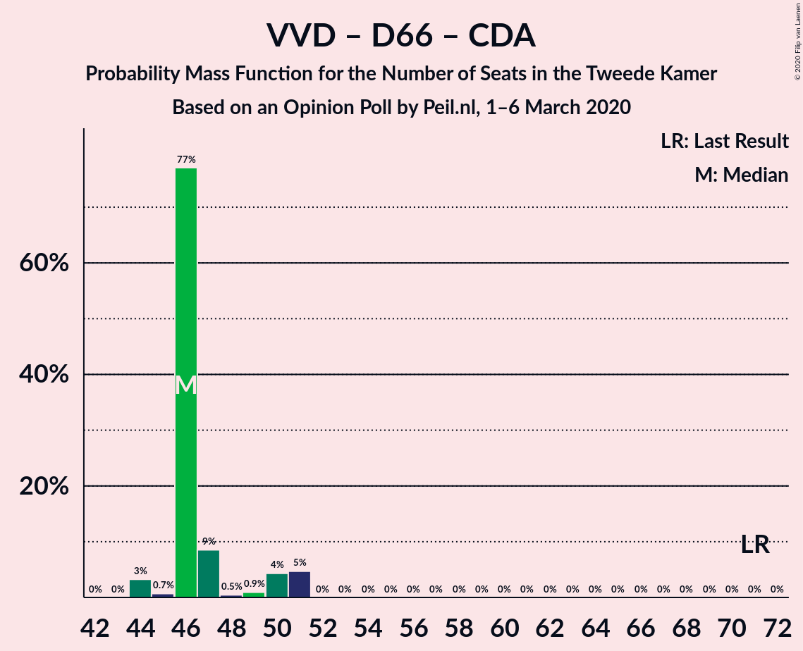

| Number of Seats | Probability | Accumulated | Special Marks |
|:---------------:|:-----------:|:-----------:|:-------------:|
| 42 | 0.1% | 100% |  |
| 43 | 0.1% | 99.9% |  |
| 44 | 0.8% | 99.8% |  |
| 45 | 4% | 99.0% |  |
| 46 | 12% | 95% |  |
| 47 | 15% | 83% |  |
| 48 | 9% | 68% | Median |
| 49 | 35% | 59% |  |
| 50 | 18% | 24% |  |
| 51 | 5% | 6% |  |
| 52 | 0.6% | 0.6% |  |
| 53 | 0% | 0% |  |
| 54 | 0% | 0% |  |
| 55 | 0% | 0% |  |
| 56 | 0% | 0% |  |
| 57 | 0% | 0% |  |
| 58 | 0% | 0% |  |
| 59 | 0% | 0% |  |
| 60 | 0% | 0% |  |
| 61 | 0% | 0% |  |
| 62 | 0% | 0% |  |
| 63 | 0% | 0% |  |
| 64 | 0% | 0% |  |
| 65 | 0% | 0% |  |
| 66 | 0% | 0% |  |
| 67 | 0% | 0% |  |
| 68 | 0% | 0% |  |
| 69 | 0% | 0% |  |
| 70 | 0% | 0% |  |
| 71 | 0% | 0% | Last Result |

### Partij van de Arbeid – Democraten 66 – Christen-Democratisch Appèl

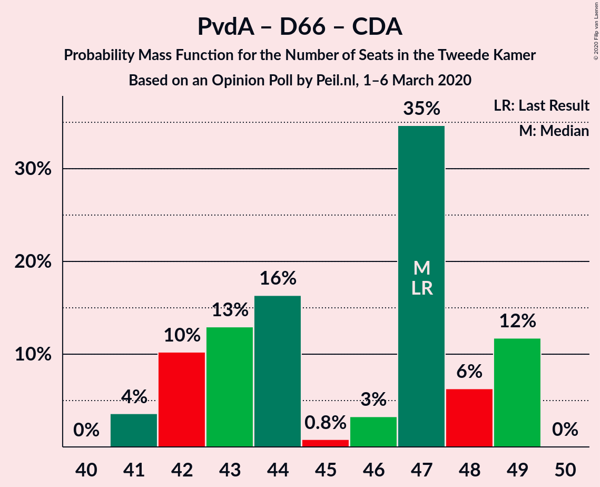

| Number of Seats | Probability | Accumulated | Special Marks |
|:---------------:|:-----------:|:-----------:|:-------------:|
| 40 | 0% | 100% |  |
| 41 | 4% | 99.9% |  |
| 42 | 10% | 96% |  |
| 43 | 13% | 86% |  |
| 44 | 16% | 73% |  |
| 45 | 0.8% | 57% | Median |
| 46 | 3% | 56% |  |
| 47 | 35% | 53% | Last Result |
| 48 | 6% | 18% |  |
| 49 | 12% | 12% |  |
| 50 | 0% | 0% |  |

### Volkspartij voor Vrijheid en Democratie – Christen-Democratisch Appèl – Partij voor de Vrijheid

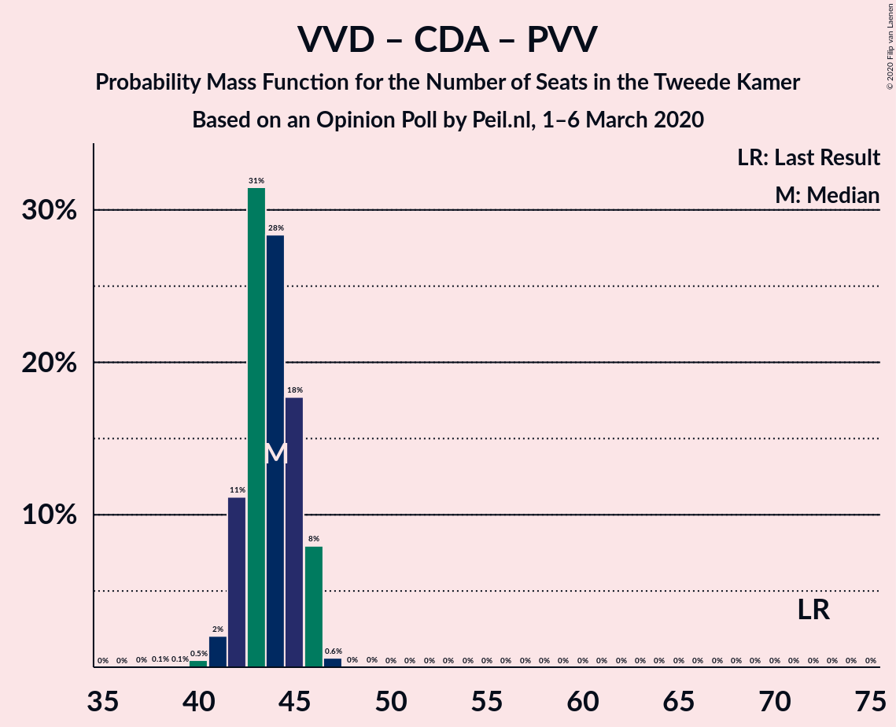

| Number of Seats | Probability | Accumulated | Special Marks |
|:---------------:|:-----------:|:-----------:|:-------------:|
| 38 | 0.1% | 100% |  |
| 39 | 0.1% | 99.9% |  |
| 40 | 0.5% | 99.9% |  |
| 41 | 2% | 99.4% |  |
| 42 | 11% | 97% |  |
| 43 | 31% | 86% |  |
| 44 | 28% | 55% | Median |
| 45 | 18% | 26% |  |
| 46 | 8% | 9% |  |
| 47 | 0.6% | 0.6% |  |
| 48 | 0% | 0% |  |
| 49 | 0% | 0% |  |
| 50 | 0% | 0% |  |
| 51 | 0% | 0% |  |
| 52 | 0% | 0% |  |
| 53 | 0% | 0% |  |
| 54 | 0% | 0% |  |
| 55 | 0% | 0% |  |
| 56 | 0% | 0% |  |
| 57 | 0% | 0% |  |
| 58 | 0% | 0% |  |
| 59 | 0% | 0% |  |
| 60 | 0% | 0% |  |
| 61 | 0% | 0% |  |
| 62 | 0% | 0% |  |
| 63 | 0% | 0% |  |
| 64 | 0% | 0% |  |
| 65 | 0% | 0% |  |
| 66 | 0% | 0% |  |
| 67 | 0% | 0% |  |
| 68 | 0% | 0% |  |
| 69 | 0% | 0% |  |
| 70 | 0% | 0% |  |
| 71 | 0% | 0% |  |
| 72 | 0% | 0% | Last Result |

### Volkspartij voor Vrijheid en Democratie – Partij van de Arbeid

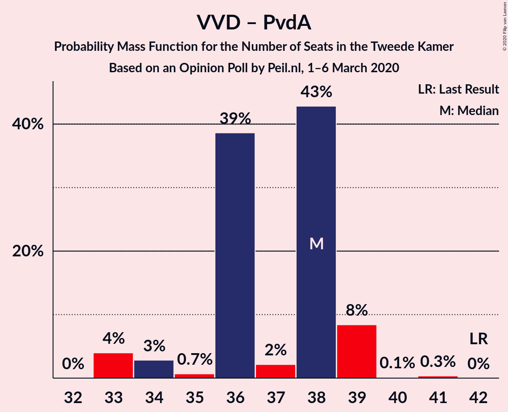

| Number of Seats | Probability | Accumulated | Special Marks |
|:---------------:|:-----------:|:-----------:|:-------------:|
| 34 | 0.4% | 100% |  |
| 35 | 11% | 99.5% |  |
| 36 | 6% | 88% |  |
| 37 | 4% | 83% |  |
| 38 | 20% | 79% |  |
| 39 | 16% | 60% | Median |
| 40 | 37% | 43% |  |
| 41 | 6% | 6% |  |
| 42 | 0% | 0.1% | Last Result |
| 43 | 0% | 0% |  |

### Partij van de Arbeid – Christen-Democratisch Appèl – ChristenUnie

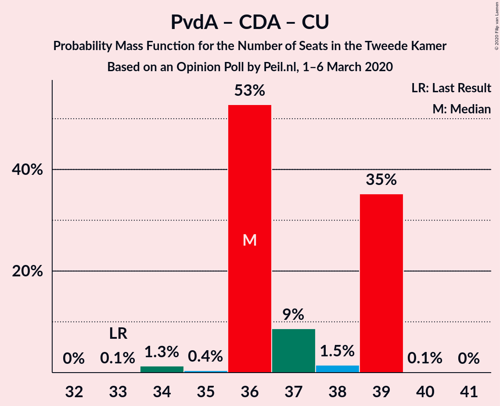

| Number of Seats | Probability | Accumulated | Special Marks |
|:---------------:|:-----------:|:-----------:|:-------------:|
| 32 | 0.2% | 100% |  |
| 33 | 2% | 99.8% | Last Result |
| 34 | 13% | 98% |  |
| 35 | 12% | 85% |  |
| 36 | 11% | 73% |  |
| 37 | 24% | 62% | Median |
| 38 | 3% | 38% |  |
| 39 | 23% | 35% |  |
| 40 | 12% | 12% |  |
| 41 | 0% | 0% |  |

### Volkspartij voor Vrijheid en Democratie – Christen-Democratisch Appèl

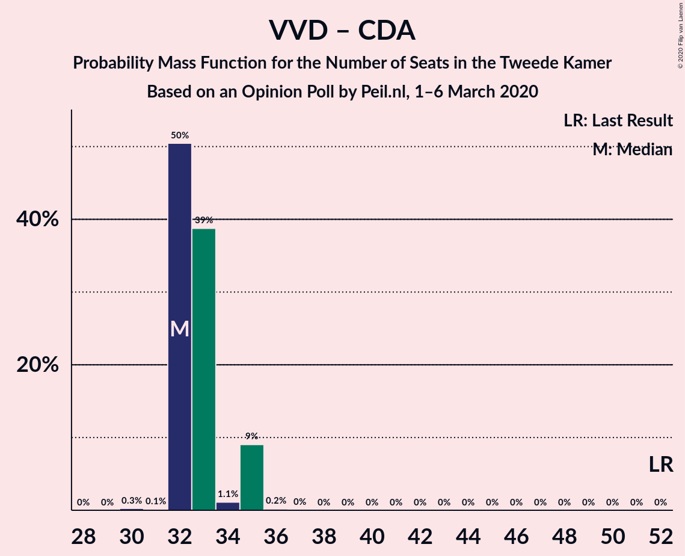

| Number of Seats | Probability | Accumulated | Special Marks |
|:---------------:|:-----------:|:-----------:|:-------------:|
| 29 | 0.1% | 100% |  |
| 30 | 0.1% | 99.9% |  |
| 31 | 2% | 99.8% |  |
| 32 | 23% | 98% |  |
| 33 | 3% | 75% |  |
| 34 | 21% | 72% | Median |
| 35 | 43% | 51% |  |
| 36 | 8% | 8% |  |
| 37 | 0.1% | 0.1% |  |
| 38 | 0% | 0% |  |
| 39 | 0% | 0% |  |
| 40 | 0% | 0% |  |
| 41 | 0% | 0% |  |
| 42 | 0% | 0% |  |
| 43 | 0% | 0% |  |
| 44 | 0% | 0% |  |
| 45 | 0% | 0% |  |
| 46 | 0% | 0% |  |
| 47 | 0% | 0% |  |
| 48 | 0% | 0% |  |
| 49 | 0% | 0% |  |
| 50 | 0% | 0% |  |
| 51 | 0% | 0% |  |
| 52 | 0% | 0% | Last Result |

### Partij van de Arbeid – Christen-Democratisch Appèl

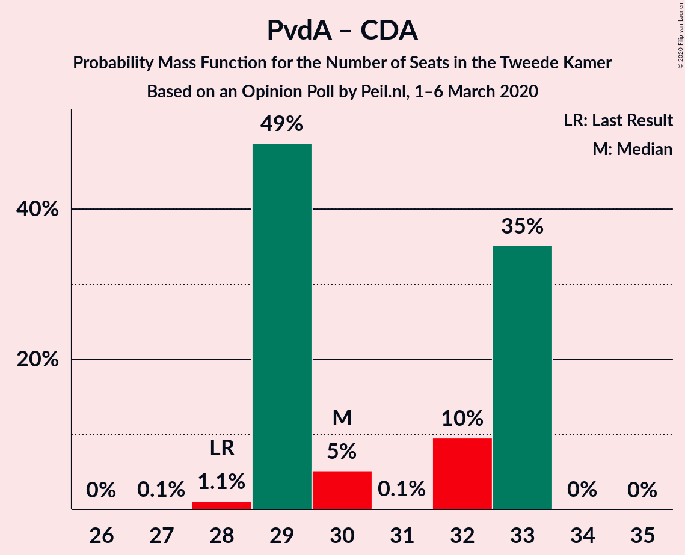

| Number of Seats | Probability | Accumulated | Special Marks |
|:---------------:|:-----------:|:-----------:|:-------------:|
| 27 | 10% | 100% |  |
| 28 | 5% | 90% | Last Result |
| 29 | 1.4% | 85% |  |
| 30 | 25% | 83% |  |
| 31 | 1.0% | 58% | Median |
| 32 | 22% | 57% |  |
| 33 | 23% | 35% |  |
| 34 | 12% | 12% |  |
| 35 | 0% | 0% |  |

### Democraten 66 – Christen-Democratisch Appèl

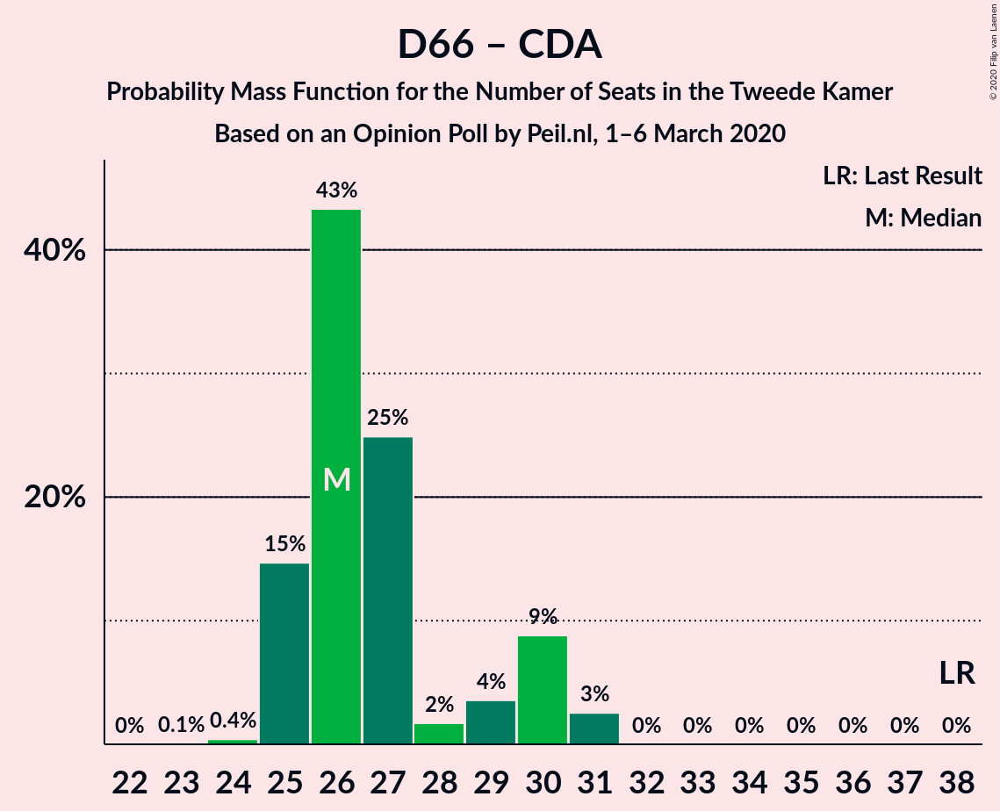

| Number of Seats | Probability | Accumulated | Special Marks |
|:---------------:|:-----------:|:-----------:|:-------------:|
| 24 | 0.2% | 100% |  |
| 25 | 9% | 99.7% |  |
| 26 | 19% | 90% |  |
| 27 | 11% | 71% | Median |
| 28 | 36% | 60% |  |
| 29 | 8% | 24% |  |
| 30 | 16% | 16% |  |
| 31 | 0.6% | 0.6% |  |
| 32 | 0% | 0% |  |
| 33 | 0% | 0% |  |
| 34 | 0% | 0% |  |
| 35 | 0% | 0% |  |
| 36 | 0% | 0% |  |
| 37 | 0% | 0% |  |
| 38 | 0% | 0% | Last Result |

## Technical Information

### Opinion Poll

+ **Polling firm:** Peil.nl
+ **Commissioner(s):** —
+ **Fieldwork period:** 1–6 March 2020

### Calculations

+ **Sample size:** 3000
+ **Simulations done:** 131,072
+ **Error estimate:** 0.90%

