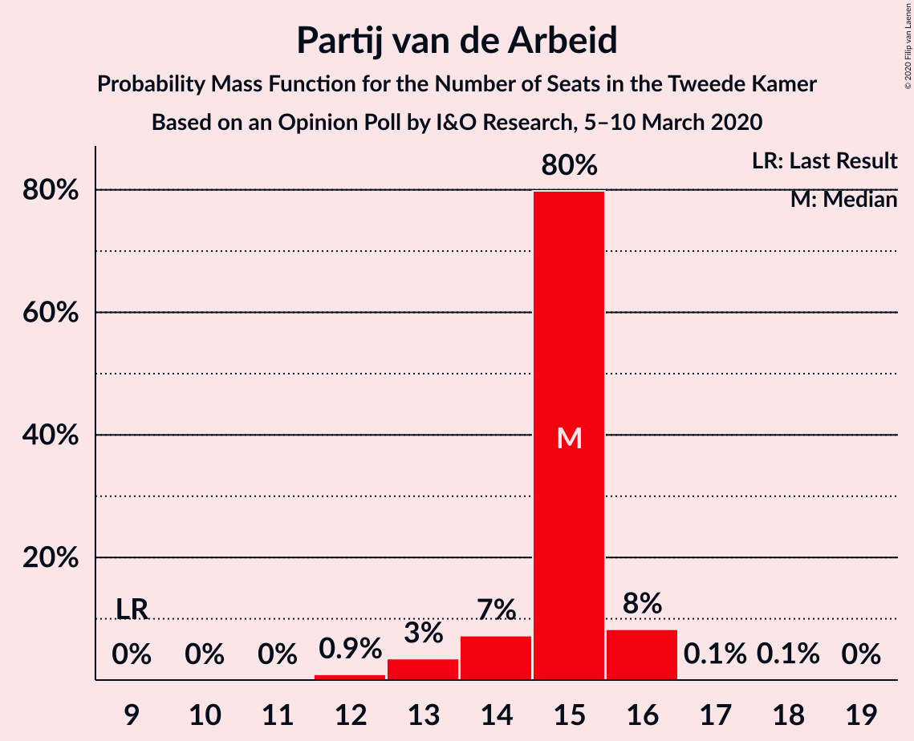
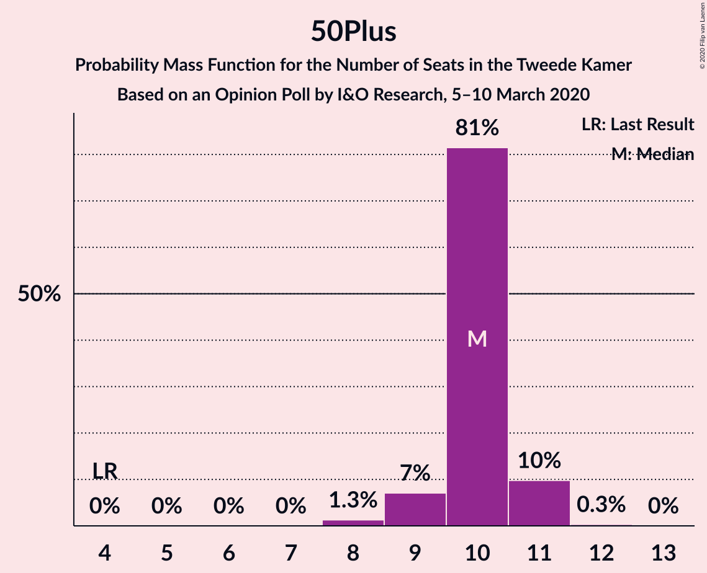
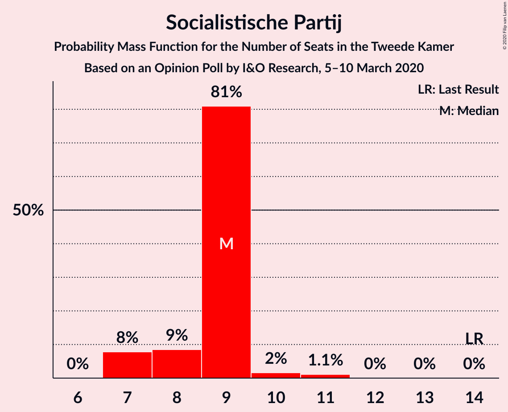
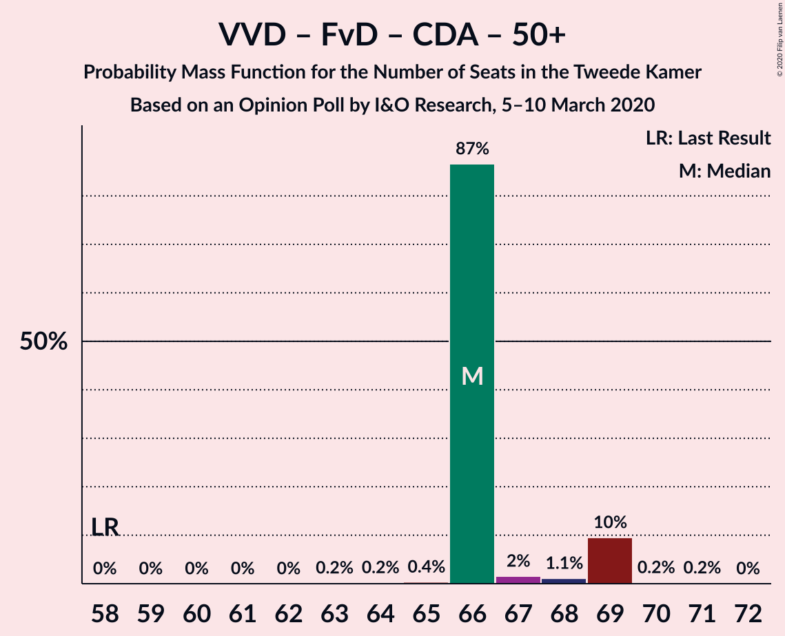
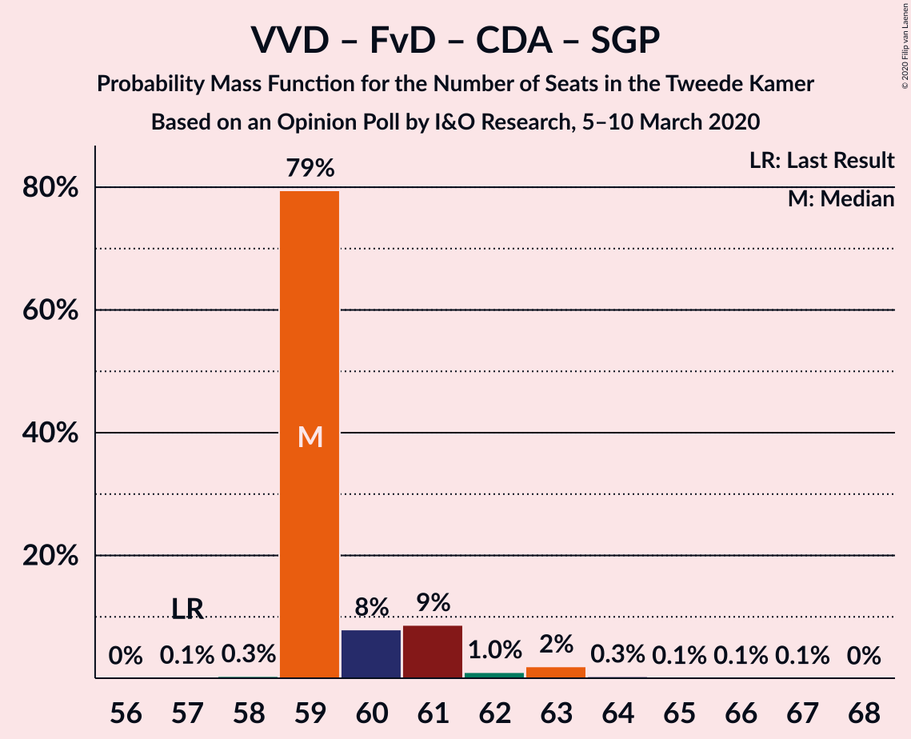
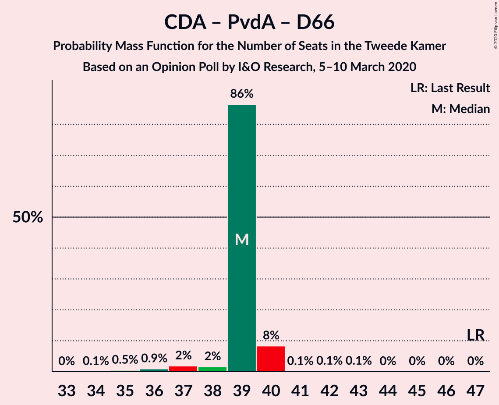
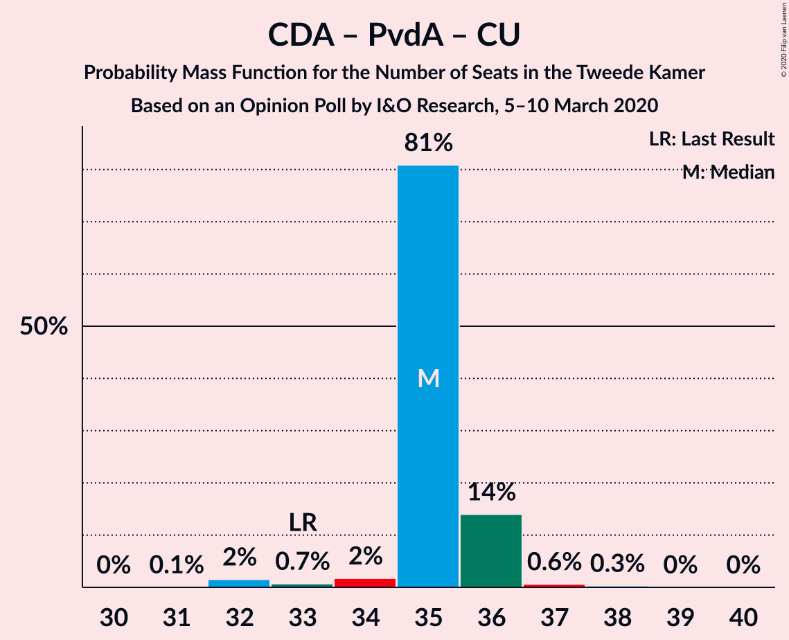

# Opinion Poll by I&O Research, 5–10 March 2020

<a href="#voting-intentions">Voting Intentions</a> | <a href="#seats">Seats</a> | <a href="#coalitions">Coalitions</a> | <a href="#technical-information">Technical Information</a>

## Voting Intentions

### Confidence Intervals

| Party | Last Result | Poll Result | 80% Confidence Interval | 90% Confidence Interval | 95% Confidence Interval | 99% Confidence Interval |
|:-----:|:-----------:|:-----------:|:-----------------------:|:-----------------------:|:-----------------------:|:-----------------------:|
| Volkspartij voor Vrijheid en Democratie | 21.3% | 18.0% | 16.9–19.1% |16.7–19.4% |16.4–19.7% |15.9–20.2% |
| GroenLinks | 9.1% | 11.1% | 10.3–12.0% |10.0–12.3% |9.8–12.5% |9.5–12.9% |
| Partij voor de Vrijheid | 13.1% | 11.0% | 10.2–11.9% |10.0–12.2% |9.8–12.4% |9.4–12.8% |
| Forum voor Democratie | 1.8% | 9.8% | 9.0–10.7% |8.8–10.9% |8.6–11.1% |8.3–11.6% |
| Christen-Democratisch Appèl | 12.4% | 9.6% | 8.8–10.5% |8.6–10.7% |8.4–10.9% |8.1–11.3% |
| Partij van de Arbeid | 5.7% | 9.5% | 8.7–10.3% |8.5–10.6% |8.3–10.8% |8.0–11.2% |
| 50Plus | 3.1% | 6.6% | 6.0–7.3% |5.8–7.5% |5.6–7.7% |5.3–8.1% |
| Democraten 66 | 12.2% | 6.5% | 5.9–7.3% |5.7–7.5% |5.5–7.6% |5.3–8.0% |
| Socialistische Partij | 9.1% | 6.0% | 5.4–6.7% |5.2–6.9% |5.1–7.1% |4.8–7.5% |
| ChristenUnie | 3.4% | 4.1% | 3.6–4.7% |3.4–4.9% |3.3–5.0% |3.1–5.3% |
| Partij voor de Dieren | 3.2% | 4.0% | 3.5–4.6% |3.4–4.8% |3.2–4.9% |3.0–5.2% |
| Staatkundig Gereformeerde Partij | 2.1% | 2.6% | 2.2–3.1% |2.1–3.3% |2.0–3.4% |1.8–3.6% |
| DENK | 2.1% | 0.9% | 0.7–1.2% |0.6–1.3% |0.6–1.4% |0.5–1.6% |

*Note:* The poll result column reflects the actual value used in the calculations. Published results may vary slightly, and in addition be rounded to fewer digits.

## Seats

### Confidence Intervals

| Party | Last Result | Median | 80% Confidence Interval | 90% Confidence Interval | 95% Confidence Interval | 99% Confidence Interval |
|:-----:|:-----------:|:------:|:-----------------------:|:-----------------------:|:-----------------------:|:-----------------------:|
| <a href="#volkspartij-voor-vrijheid-en-democratie">Volkspartij voor Vrijheid en Democratie</a> | 33 | 28 | 26–29 |25–30 |25–33 |24–33 |
| <a href="#groenlinks">GroenLinks</a> | 14 | 16 | 15–18 |15–18 |15–19 |15–19 |
| <a href="#partij-voor-de-vrijheid">Partij voor de Vrijheid</a> | 20 | 18 | 16–19 |14–19 |14–19 |14–19 |
| <a href="#forum-voor-democratie">Forum voor Democratie</a> | 2 | 15 | 13–17 |13–17 |13–17 |13–17 |
| <a href="#christen-democratisch-appèl">Christen-Democratisch Appèl</a> | 19 | 15 | 13–17 |12–17 |12–17 |12–18 |
| <a href="#partij-van-de-arbeid">Partij van de Arbeid</a> | 9 | 14 | 12–16 |12–16 |12–17 |12–17 |
| <a href="#50plus">50Plus</a> | 4 | 10 | 8–12 |8–12 |8–12 |8–13 |
| <a href="#democraten-66">Democraten 66</a> | 19 | 10 | 9–11 |8–11 |8–11 |7–12 |
| <a href="#socialistische-partij">Socialistische Partij</a> | 14 | 8 | 8–10 |8–10 |8–10 |7–11 |
| <a href="#christenunie">ChristenUnie</a> | 5 | 6 | 5–8 |5–8 |5–8 |4–8 |
| <a href="#partij-voor-de-dieren">Partij voor de Dieren</a> | 5 | 6 | 5–7 |4–7 |4–7 |4–8 |
| <a href="#staatkundig-gereformeerde-partij">Staatkundig Gereformeerde Partij</a> | 3 | 4 | 3–4 |3–4 |3–5 |2–6 |
| <a href="#denk">DENK</a> | 3 | 1 | 0–1 |0–2 |0–2 |0–2 |

### Volkspartij voor Vrijheid en Democratie

*For a full overview of the results for this party, see the [Volkspartij voor Vrijheid en Democratie](party-volkspartijvoorvrijheidendemocratie.html) page.*

| Number of Seats | Probability | Accumulated | Special Marks |
|:---------------:|:-----------:|:-----------:|:-------------:|
| 24 | 1.1% | 100% |  |
| 25 | 6% | 98.9% |  |
| 26 | 12% | 93% |  |
| 27 | 23% | 81% |  |
| 28 | 31% | 58% | Median |
| 29 | 22% | 27% |  |
| 30 | 0.9% | 5% |  |
| 31 | 0.6% | 4% |  |
| 32 | 1.0% | 4% |  |
| 33 | 3% | 3% | Last Result |
| 34 | 0% | 0% |  |

### GroenLinks

*For a full overview of the results for this party, see the [GroenLinks](party-groenlinks.html) page.*

| Number of Seats | Probability | Accumulated | Special Marks |
|:---------------:|:-----------:|:-----------:|:-------------:|
| 14 | 0.3% | 100% | Last Result |
| 15 | 12% | 99.7% |  |
| 16 | 66% | 88% | Median |
| 17 | 3% | 22% |  |
| 18 | 15% | 18% |  |
| 19 | 3% | 3% |  |
| 20 | 0.2% | 0.2% |  |
| 21 | 0% | 0% |  |

### Partij voor de Vrijheid

*For a full overview of the results for this party, see the [Partij voor de Vrijheid](party-partijvoordevrijheid.html) page.*

| Number of Seats | Probability | Accumulated | Special Marks |
|:---------------:|:-----------:|:-----------:|:-------------:|
| 13 | 0.1% | 100% |  |
| 14 | 7% | 99.9% |  |
| 15 | 1.5% | 93% |  |
| 16 | 21% | 91% |  |
| 17 | 15% | 70% |  |
| 18 | 33% | 55% | Median |
| 19 | 21% | 21% |  |
| 20 | 0.1% | 0.1% | Last Result |
| 21 | 0% | 0% |  |

### Forum voor Democratie

*For a full overview of the results for this party, see the [Forum voor Democratie](party-forumvoordemocratie.html) page.*

| Number of Seats | Probability | Accumulated | Special Marks |
|:---------------:|:-----------:|:-----------:|:-------------:|
| 2 | 0% | 100% | Last Result |
| 3 | 0% | 100% |  |
| 4 | 0% | 100% |  |
| 5 | 0% | 100% |  |
| 6 | 0% | 100% |  |
| 7 | 0% | 100% |  |
| 8 | 0% | 100% |  |
| 9 | 0% | 100% |  |
| 10 | 0% | 100% |  |
| 11 | 0.1% | 100% |  |
| 12 | 0.2% | 99.9% |  |
| 13 | 28% | 99.8% |  |
| 14 | 3% | 71% |  |
| 15 | 21% | 68% | Median |
| 16 | 24% | 47% |  |
| 17 | 23% | 23% |  |
| 18 | 0.1% | 0.1% |  |
| 19 | 0.1% | 0.1% |  |
| 20 | 0% | 0% |  |

### Christen-Democratisch Appèl

*For a full overview of the results for this party, see the [Christen-Democratisch Appèl](party-christen-democratischappèl.html) page.*

| Number of Seats | Probability | Accumulated | Special Marks |
|:---------------:|:-----------:|:-----------:|:-------------:|
| 12 | 10% | 100% |  |
| 13 | 37% | 90% |  |
| 14 | 2% | 53% |  |
| 15 | 22% | 51% | Median |
| 16 | 12% | 29% |  |
| 17 | 16% | 17% |  |
| 18 | 0.6% | 0.6% |  |
| 19 | 0% | 0% | Last Result |

### Partij van de Arbeid

*For a full overview of the results for this party, see the [Partij van de Arbeid](party-partijvandearbeid.html) page.*

| Number of Seats | Probability | Accumulated | Special Marks |
|:---------------:|:-----------:|:-----------:|:-------------:|
| 9 | 0% | 100% | Last Result |
| 10 | 0% | 100% |  |
| 11 | 0.1% | 100% |  |
| 12 | 12% | 99.9% |  |
| 13 | 20% | 88% |  |
| 14 | 35% | 68% | Median |
| 15 | 3% | 33% |  |
| 16 | 26% | 30% |  |
| 17 | 4% | 4% |  |
| 18 | 0.1% | 0.1% |  |
| 19 | 0% | 0% |  |

### 50Plus

*For a full overview of the results for this party, see the [50Plus](party-50plus.html) page.*

| Number of Seats | Probability | Accumulated | Special Marks |
|:---------------:|:-----------:|:-----------:|:-------------:|
| 4 | 0% | 100% | Last Result |
| 5 | 0% | 100% |  |
| 6 | 0% | 100% |  |
| 7 | 0.1% | 100% |  |
| 8 | 15% | 99.9% |  |
| 9 | 12% | 85% |  |
| 10 | 38% | 72% | Median |
| 11 | 23% | 34% |  |
| 12 | 10% | 11% |  |
| 13 | 1.2% | 1.4% |  |
| 14 | 0.2% | 0.2% |  |
| 15 | 0% | 0% |  |

### Democraten 66

*For a full overview of the results for this party, see the [Democraten 66](party-democraten66.html) page.*

| Number of Seats | Probability | Accumulated | Special Marks |
|:---------------:|:-----------:|:-----------:|:-------------:|
| 7 | 2% | 100% |  |
| 8 | 5% | 98% |  |
| 9 | 39% | 93% |  |
| 10 | 35% | 54% | Median |
| 11 | 18% | 20% |  |
| 12 | 2% | 2% |  |
| 13 | 0% | 0.1% |  |
| 14 | 0% | 0% |  |
| 15 | 0% | 0% |  |
| 16 | 0% | 0% |  |
| 17 | 0% | 0% |  |
| 18 | 0% | 0% |  |
| 19 | 0% | 0% | Last Result |

### Socialistische Partij

*For a full overview of the results for this party, see the [Socialistische Partij](party-socialistischepartij.html) page.*

| Number of Seats | Probability | Accumulated | Special Marks |
|:---------------:|:-----------:|:-----------:|:-------------:|
| 7 | 0.9% | 100% |  |
| 8 | 56% | 99.1% | Median |
| 9 | 31% | 43% |  |
| 10 | 12% | 12% |  |
| 11 | 0.5% | 0.5% |  |
| 12 | 0% | 0% |  |
| 13 | 0% | 0% |  |
| 14 | 0% | 0% | Last Result |

### ChristenUnie

*For a full overview of the results for this party, see the [ChristenUnie](party-christenunie.html) page.*

| Number of Seats | Probability | Accumulated | Special Marks |
|:---------------:|:-----------:|:-----------:|:-------------:|
| 4 | 2% | 100% |  |
| 5 | 31% | 98% | Last Result |
| 6 | 32% | 68% | Median |
| 7 | 14% | 36% |  |
| 8 | 21% | 21% |  |
| 9 | 0.1% | 0.1% |  |
| 10 | 0% | 0% |  |

### Partij voor de Dieren

*For a full overview of the results for this party, see the [Partij voor de Dieren](party-partijvoordedieren.html) page.*

| Number of Seats | Probability | Accumulated | Special Marks |
|:---------------:|:-----------:|:-----------:|:-------------:|
| 4 | 9% | 100% |  |
| 5 | 28% | 91% | Last Result |
| 6 | 30% | 63% | Median |
| 7 | 33% | 33% |  |
| 8 | 0.5% | 0.5% |  |
| 9 | 0% | 0% |  |

### Staatkundig Gereformeerde Partij

*For a full overview of the results for this party, see the [Staatkundig Gereformeerde Partij](party-staatkundiggereformeerdepartij.html) page.*

| Number of Seats | Probability | Accumulated | Special Marks |
|:---------------:|:-----------:|:-----------:|:-------------:|
| 2 | 0.6% | 100% |  |
| 3 | 47% | 99.4% | Last Result |
| 4 | 48% | 52% | Median |
| 5 | 4% | 5% |  |
| 6 | 0.9% | 0.9% |  |
| 7 | 0% | 0% |  |

### DENK

*For a full overview of the results for this party, see the [DENK](party-denk.html) page.*

| Number of Seats | Probability | Accumulated | Special Marks |
|:---------------:|:-----------:|:-----------:|:-------------:|
| 0 | 18% | 100% |  |
| 1 | 77% | 82% | Median |
| 2 | 5% | 5% |  |
| 3 | 0.1% | 0.1% | Last Result |
| 4 | 0% | 0% |  |

## Coalitions

### Confidence Intervals

| Coalition | Last Result | Median | Majority? | 80% Confidence Interval | 90% Confidence Interval | 95% Confidence Interval | 99% Confidence Interval |
|:---------:|:-----------:|:------:|:---------:|:-----------------------:|:-----------------------:|:-----------------------:|:-----------------------:|
| Volkspartij voor Vrijheid en Democratie – Partij voor de Vrijheid – Forum voor Democratie – Christen-Democratisch Appèl – Staatkundig Gereformeerde Partij | 77 | 78 | 96% | 76–82 | 76–82 | 75–82 | 73–82 |
| Volkspartij voor Vrijheid en Democratie – Partij voor de Vrijheid – Forum voor Democratie – Christen-Democratisch Appèl | 74 | 75 | 35% | 72–78 | 72–78 | 71–78 | 68–78 |
| Volkspartij voor Vrijheid en Democratie – GroenLinks – Christen-Democratisch Appèl – Democraten 66 – ChristenUnie | 90 | 75 | 36% | 71–77 | 71–78 | 70–78 | 70–80 |
| Volkspartij voor Vrijheid en Democratie – Christen-Democratisch Appèl – Partij van de Arbeid – Democraten 66 – ChristenUnie | 85 | 73 | 15% | 68–76 | 67–76 | 67–76 | 67–76 |
| Volkspartij voor Vrijheid en Democratie – Forum voor Democratie – Christen-Democratisch Appèl – 50Plus – Staatkundig Gereformeerde Partij | 61 | 70 | 0.1% | 68–74 | 68–74 | 68–74 | 67–74 |
| GroenLinks – Christen-Democratisch Appèl – Partij van de Arbeid – Democraten 66 – Socialistische Partij – ChristenUnie | 80 | 69 | 0.4% | 67–72 | 67–72 | 67–72 | 66–75 |
| Volkspartij voor Vrijheid en Democratie – Forum voor Democratie – Christen-Democratisch Appèl – 50Plus | 58 | 67 | 0% | 64–70 | 64–70 | 64–70 | 64–71 |
| Volkspartij voor Vrijheid en Democratie – Forum voor Democratie – Christen-Democratisch Appèl – Staatkundig Gereformeerde Partij | 57 | 60 | 0% | 57–66 | 57–66 | 57–66 | 57–66 |
| GroenLinks – Christen-Democratisch Appèl – Partij van de Arbeid – Democraten 66 – ChristenUnie | 66 | 61 | 0% | 58–63 | 58–63 | 58–64 | 57–66 |
| Volkspartij voor Vrijheid en Democratie – Partij voor de Vrijheid – Christen-Democratisch Appèl | 72 | 59 | 0% | 58–62 | 58–62 | 57–62 | 54–63 |
| Volkspartij voor Vrijheid en Democratie – Forum voor Democratie – Christen-Democratisch Appèl | 54 | 57 | 0% | 54–62 | 54–62 | 54–62 | 52–62 |
| Volkspartij voor Vrijheid en Democratie – Christen-Democratisch Appèl – Partij van de Arbeid | 61 | 56 | 0% | 53–62 | 53–62 | 53–62 | 51–62 |
| Volkspartij voor Vrijheid en Democratie – Christen-Democratisch Appèl – Democraten 66 – ChristenUnie | 76 | 59 | 0% | 54–61 | 53–61 | 53–61 | 53–62 |
| Volkspartij voor Vrijheid en Democratie – Partij van de Arbeid – Democraten 66 | 61 | 52 | 0% | 47–54 | 47–54 | 47–56 | 47–56 |
| Volkspartij voor Vrijheid en Democratie – Christen-Democratisch Appèl – Democraten 66 | 71 | 51 | 0% | 48–55 | 48–55 | 48–55 | 47–57 |
| Volkspartij voor Vrijheid en Democratie – Partij van de Arbeid | 42 | 42 | 0% | 38–45 | 38–45 | 38–47 | 38–47 |
| Volkspartij voor Vrijheid en Democratie – Christen-Democratisch Appèl | 52 | 41 | 0% | 39–46 | 39–46 | 39–46 | 38–47 |
| Christen-Democratisch Appèl – Partij van de Arbeid – Democraten 66 | 47 | 38 | 0% | 35–42 | 35–42 | 35–42 | 35–45 |
| Christen-Democratisch Appèl – Partij van de Arbeid – ChristenUnie | 33 | 35 | 0% | 31–38 | 31–38 | 31–38 | 31–39 |
| Christen-Democratisch Appèl – Partij van de Arbeid | 28 | 28 | 0% | 26–33 | 26–33 | 26–33 | 25–33 |
| Christen-Democratisch Appèl – Democraten 66 | 38 | 23 | 0% | 21–27 | 21–27 | 21–27 | 21–29 |

### Volkspartij voor Vrijheid en Democratie – Partij voor de Vrijheid – Forum voor Democratie – Christen-Democratisch Appèl – Staatkundig Gereformeerde Partij

| Number of Seats | Probability | Accumulated | Special Marks |
|:---------------:|:-----------:|:-----------:|:-------------:|
| 72 | 0.1% | 100% |  |
| 73 | 2% | 99.9% |  |
| 74 | 0.6% | 98% |  |
| 75 | 2% | 98% |  |
| 76 | 38% | 96% | Majority |
| 77 | 2% | 58% | Last Result |
| 78 | 11% | 56% |  |
| 79 | 21% | 45% |  |
| 80 | 2% | 24% | Median |
| 81 | 8% | 22% |  |
| 82 | 14% | 14% |  |
| 83 | 0% | 0% |  |

### Volkspartij voor Vrijheid en Democratie – Partij voor de Vrijheid – Forum voor Democratie – Christen-Democratisch Appèl

| Number of Seats | Probability | Accumulated | Special Marks |
|:---------------:|:-----------:|:-----------:|:-------------:|
| 68 | 1.2% | 100% |  |
| 69 | 0.3% | 98.8% |  |
| 70 | 0.3% | 98.5% |  |
| 71 | 2% | 98% |  |
| 72 | 23% | 97% |  |
| 73 | 17% | 74% |  |
| 74 | 3% | 56% | Last Result |
| 75 | 19% | 53% |  |
| 76 | 12% | 35% | Median, Majority |
| 77 | 0.1% | 22% |  |
| 78 | 22% | 22% |  |
| 79 | 0% | 0% |  |

### Volkspartij voor Vrijheid en Democratie – GroenLinks – Christen-Democratisch Appèl – Democraten 66 – ChristenUnie

| Number of Seats | Probability | Accumulated | Special Marks |
|:---------------:|:-----------:|:-----------:|:-------------:|
| 69 | 0.3% | 100% |  |
| 70 | 4% | 99.7% |  |
| 71 | 19% | 96% |  |
| 72 | 0.5% | 76% |  |
| 73 | 12% | 76% |  |
| 74 | 4% | 64% |  |
| 75 | 24% | 60% | Median |
| 76 | 15% | 36% | Majority |
| 77 | 15% | 21% |  |
| 78 | 4% | 5% |  |
| 79 | 0.4% | 1.4% |  |
| 80 | 0.6% | 1.1% |  |
| 81 | 0.4% | 0.5% |  |
| 82 | 0% | 0% |  |
| 83 | 0% | 0% |  |
| 84 | 0% | 0% |  |
| 85 | 0% | 0% |  |
| 86 | 0% | 0% |  |
| 87 | 0% | 0% |  |
| 88 | 0% | 0% |  |
| 89 | 0% | 0% |  |
| 90 | 0% | 0% | Last Result |

### Volkspartij voor Vrijheid en Democratie – Christen-Democratisch Appèl – Partij van de Arbeid – Democraten 66 – ChristenUnie

| Number of Seats | Probability | Accumulated | Special Marks |
|:---------------:|:-----------:|:-----------:|:-------------:|
| 67 | 10% | 100% |  |
| 68 | 1.2% | 90% |  |
| 69 | 11% | 89% |  |
| 70 | 2% | 78% |  |
| 71 | 5% | 76% |  |
| 72 | 14% | 71% |  |
| 73 | 21% | 56% | Median |
| 74 | 19% | 36% |  |
| 75 | 1.4% | 17% |  |
| 76 | 15% | 15% | Majority |
| 77 | 0.4% | 0.4% |  |
| 78 | 0% | 0% |  |
| 79 | 0% | 0% |  |
| 80 | 0% | 0% |  |
| 81 | 0% | 0% |  |
| 82 | 0% | 0% |  |
| 83 | 0% | 0% |  |
| 84 | 0% | 0% |  |
| 85 | 0% | 0% | Last Result |

### Volkspartij voor Vrijheid en Democratie – Forum voor Democratie – Christen-Democratisch Appèl – 50Plus – Staatkundig Gereformeerde Partij

| Number of Seats | Probability | Accumulated | Special Marks |
|:---------------:|:-----------:|:-----------:|:-------------:|
| 61 | 0% | 100% | Last Result |
| 62 | 0% | 100% |  |
| 63 | 0% | 100% |  |
| 64 | 0% | 100% |  |
| 65 | 0% | 100% |  |
| 66 | 0.4% | 99.9% |  |
| 67 | 0.4% | 99.6% |  |
| 68 | 21% | 99.2% |  |
| 69 | 21% | 78% |  |
| 70 | 9% | 57% |  |
| 71 | 2% | 48% |  |
| 72 | 5% | 47% | Median |
| 73 | 25% | 42% |  |
| 74 | 16% | 16% |  |
| 75 | 0.4% | 0.4% |  |
| 76 | 0% | 0.1% | Majority |
| 77 | 0% | 0% |  |

### GroenLinks – Christen-Democratisch Appèl – Partij van de Arbeid – Democraten 66 – Socialistische Partij – ChristenUnie

| Number of Seats | Probability | Accumulated | Special Marks |
|:---------------:|:-----------:|:-----------:|:-------------:|
| 64 | 0.3% | 100% |  |
| 65 | 0.1% | 99.7% |  |
| 66 | 0.7% | 99.7% |  |
| 67 | 19% | 99.0% |  |
| 68 | 14% | 80% |  |
| 69 | 22% | 66% | Median |
| 70 | 14% | 44% |  |
| 71 | 12% | 30% |  |
| 72 | 17% | 18% |  |
| 73 | 0.2% | 2% |  |
| 74 | 0.2% | 2% |  |
| 75 | 1.0% | 1.4% |  |
| 76 | 0.3% | 0.4% | Majority |
| 77 | 0% | 0% |  |
| 78 | 0% | 0% |  |
| 79 | 0% | 0% |  |
| 80 | 0% | 0% | Last Result |

### Volkspartij voor Vrijheid en Democratie – Forum voor Democratie – Christen-Democratisch Appèl – 50Plus

| Number of Seats | Probability | Accumulated | Special Marks |
|:---------------:|:-----------:|:-----------:|:-------------:|
| 58 | 0% | 100% | Last Result |
| 59 | 0% | 100% |  |
| 60 | 0% | 100% |  |
| 61 | 0% | 100% |  |
| 62 | 0.1% | 100% |  |
| 63 | 0.4% | 99.9% |  |
| 64 | 21% | 99.5% |  |
| 65 | 5% | 79% |  |
| 66 | 20% | 73% |  |
| 67 | 6% | 53% |  |
| 68 | 0.6% | 47% | Median |
| 69 | 14% | 46% |  |
| 70 | 31% | 32% |  |
| 71 | 0.8% | 0.9% |  |
| 72 | 0.1% | 0.2% |  |
| 73 | 0% | 0% |  |

### Volkspartij voor Vrijheid en Democratie – Forum voor Democratie – Christen-Democratisch Appèl – Staatkundig Gereformeerde Partij

| Number of Seats | Probability | Accumulated | Special Marks |
|:---------------:|:-----------:|:-----------:|:-------------:|
| 55 | 0% | 100% |  |
| 56 | 0.1% | 99.9% |  |
| 57 | 11% | 99.9% | Last Result |
| 58 | 22% | 88% |  |
| 59 | 2% | 67% |  |
| 60 | 16% | 65% |  |
| 61 | 4% | 49% |  |
| 62 | 20% | 45% | Median |
| 63 | 9% | 25% |  |
| 64 | 0.7% | 15% |  |
| 65 | 0.2% | 15% |  |
| 66 | 14% | 14% |  |
| 67 | 0% | 0% |  |

### GroenLinks – Christen-Democratisch Appèl – Partij van de Arbeid – Democraten 66 – ChristenUnie

| Number of Seats | Probability | Accumulated | Special Marks |
|:---------------:|:-----------:|:-----------:|:-------------:|
| 56 | 0.4% | 100% |  |
| 57 | 0.3% | 99.6% |  |
| 58 | 10% | 99.4% |  |
| 59 | 14% | 90% |  |
| 60 | 12% | 76% |  |
| 61 | 31% | 64% | Median |
| 62 | 14% | 33% |  |
| 63 | 16% | 19% |  |
| 64 | 1.2% | 3% |  |
| 65 | 0.2% | 2% |  |
| 66 | 1.3% | 1.4% | Last Result |
| 67 | 0% | 0% |  |

### Volkspartij voor Vrijheid en Democratie – Partij voor de Vrijheid – Christen-Democratisch Appèl

| Number of Seats | Probability | Accumulated | Special Marks |
|:---------------:|:-----------:|:-----------:|:-------------:|
| 54 | 1.4% | 100% |  |
| 55 | 0.5% | 98.6% |  |
| 56 | 0.1% | 98% |  |
| 57 | 2% | 98% |  |
| 58 | 32% | 96% |  |
| 59 | 32% | 64% |  |
| 60 | 4% | 32% |  |
| 61 | 2% | 28% | Median |
| 62 | 25% | 26% |  |
| 63 | 0.8% | 1.0% |  |
| 64 | 0.1% | 0.2% |  |
| 65 | 0.2% | 0.2% |  |
| 66 | 0% | 0% |  |
| 67 | 0% | 0% |  |
| 68 | 0% | 0% |  |
| 69 | 0% | 0% |  |
| 70 | 0% | 0% |  |
| 71 | 0% | 0% |  |
| 72 | 0% | 0% | Last Result |

### Volkspartij voor Vrijheid en Democratie – Forum voor Democratie – Christen-Democratisch Appèl

| Number of Seats | Probability | Accumulated | Special Marks |
|:---------------:|:-----------:|:-----------:|:-------------:|
| 51 | 0.1% | 100% |  |
| 52 | 1.2% | 99.9% |  |
| 53 | 0.1% | 98.7% |  |
| 54 | 31% | 98.6% | Last Result |
| 55 | 4% | 67% |  |
| 56 | 2% | 64% |  |
| 57 | 15% | 62% |  |
| 58 | 12% | 47% | Median |
| 59 | 12% | 35% |  |
| 60 | 9% | 23% |  |
| 61 | 0.3% | 15% |  |
| 62 | 14% | 14% |  |
| 63 | 0% | 0% |  |

### Volkspartij voor Vrijheid en Democratie – Christen-Democratisch Appèl – Partij van de Arbeid

| Number of Seats | Probability | Accumulated | Special Marks |
|:---------------:|:-----------:|:-----------:|:-------------:|
| 51 | 0.6% | 100% |  |
| 52 | 0.3% | 99.4% |  |
| 53 | 21% | 99.0% |  |
| 54 | 0.7% | 79% |  |
| 55 | 22% | 78% |  |
| 56 | 15% | 56% |  |
| 57 | 21% | 41% | Median |
| 58 | 0.9% | 20% |  |
| 59 | 1.3% | 19% |  |
| 60 | 3% | 18% |  |
| 61 | 0.5% | 15% | Last Result |
| 62 | 14% | 14% |  |
| 63 | 0% | 0% |  |

### Volkspartij voor Vrijheid en Democratie – Christen-Democratisch Appèl – Democraten 66 – ChristenUnie

| Number of Seats | Probability | Accumulated | Special Marks |
|:---------------:|:-----------:|:-----------:|:-------------:|
| 52 | 0.2% | 100% |  |
| 53 | 9% | 99.8% |  |
| 54 | 6% | 90% |  |
| 55 | 0.4% | 85% |  |
| 56 | 11% | 84% |  |
| 57 | 14% | 74% |  |
| 58 | 1.3% | 60% |  |
| 59 | 25% | 58% | Median |
| 60 | 17% | 34% |  |
| 61 | 15% | 17% |  |
| 62 | 1.4% | 2% |  |
| 63 | 0% | 0.4% |  |
| 64 | 0.4% | 0.4% |  |
| 65 | 0% | 0% |  |
| 66 | 0% | 0% |  |
| 67 | 0% | 0% |  |
| 68 | 0% | 0% |  |
| 69 | 0% | 0% |  |
| 70 | 0% | 0% |  |
| 71 | 0% | 0% |  |
| 72 | 0% | 0% |  |
| 73 | 0% | 0% |  |
| 74 | 0% | 0% |  |
| 75 | 0% | 0% |  |
| 76 | 0% | 0% | Last Result, Majority |

### Volkspartij voor Vrijheid en Democratie – Partij van de Arbeid – Democraten 66

| Number of Seats | Probability | Accumulated | Special Marks |
|:---------------:|:-----------:|:-----------:|:-------------:|
| 46 | 0.1% | 100% |  |
| 47 | 11% | 99.9% |  |
| 48 | 1.0% | 89% |  |
| 49 | 2% | 88% |  |
| 50 | 16% | 86% |  |
| 51 | 2% | 70% |  |
| 52 | 30% | 68% | Median |
| 53 | 18% | 38% |  |
| 54 | 15% | 20% |  |
| 55 | 0.8% | 4% |  |
| 56 | 3% | 3% |  |
| 57 | 0.1% | 0.1% |  |
| 58 | 0% | 0% |  |
| 59 | 0% | 0% |  |
| 60 | 0% | 0% |  |
| 61 | 0% | 0% | Last Result |

### Volkspartij voor Vrijheid en Democratie – Christen-Democratisch Appèl – Democraten 66

| Number of Seats | Probability | Accumulated | Special Marks |
|:---------------:|:-----------:|:-----------:|:-------------:|
| 47 | 1.4% | 100% |  |
| 48 | 13% | 98.6% |  |
| 49 | 2% | 85% |  |
| 50 | 22% | 84% |  |
| 51 | 20% | 61% |  |
| 52 | 3% | 41% |  |
| 53 | 3% | 38% | Median |
| 54 | 0.5% | 36% |  |
| 55 | 34% | 35% |  |
| 56 | 0.4% | 1.5% |  |
| 57 | 1.1% | 1.1% |  |
| 58 | 0% | 0% |  |
| 59 | 0% | 0% |  |
| 60 | 0% | 0% |  |
| 61 | 0% | 0% |  |
| 62 | 0% | 0% |  |
| 63 | 0% | 0% |  |
| 64 | 0% | 0% |  |
| 65 | 0% | 0% |  |
| 66 | 0% | 0% |  |
| 67 | 0% | 0% |  |
| 68 | 0% | 0% |  |
| 69 | 0% | 0% |  |
| 70 | 0% | 0% |  |
| 71 | 0% | 0% | Last Result |

### Volkspartij voor Vrijheid en Democratie – Partij van de Arbeid

| Number of Seats | Probability | Accumulated | Special Marks |
|:---------------:|:-----------:|:-----------:|:-------------:|
| 37 | 0.1% | 100% |  |
| 38 | 10% | 99.9% |  |
| 39 | 0.4% | 90% |  |
| 40 | 9% | 89% |  |
| 41 | 18% | 81% |  |
| 42 | 32% | 63% | Last Result, Median |
| 43 | 12% | 31% |  |
| 44 | 0.5% | 19% |  |
| 45 | 15% | 19% |  |
| 46 | 0.7% | 4% |  |
| 47 | 3% | 3% |  |
| 48 | 0.1% | 0.1% |  |
| 49 | 0% | 0% |  |

### Volkspartij voor Vrijheid en Democratie – Christen-Democratisch Appèl

| Number of Seats | Probability | Accumulated | Special Marks |
|:---------------:|:-----------:|:-----------:|:-------------:|
| 38 | 2% | 100% |  |
| 39 | 10% | 98% |  |
| 40 | 14% | 88% |  |
| 41 | 32% | 74% |  |
| 42 | 3% | 41% |  |
| 43 | 3% | 39% | Median |
| 44 | 16% | 36% |  |
| 45 | 0.5% | 19% |  |
| 46 | 18% | 19% |  |
| 47 | 0.4% | 0.6% |  |
| 48 | 0.2% | 0.2% |  |
| 49 | 0% | 0% |  |
| 50 | 0% | 0% |  |
| 51 | 0% | 0% |  |
| 52 | 0% | 0% | Last Result |

### Christen-Democratisch Appèl – Partij van de Arbeid – Democraten 66

| Number of Seats | Probability | Accumulated | Special Marks |
|:---------------:|:-----------:|:-----------:|:-------------:|
| 33 | 0.3% | 100% |  |
| 34 | 0% | 99.7% |  |
| 35 | 10% | 99.6% |  |
| 36 | 16% | 90% |  |
| 37 | 22% | 74% |  |
| 38 | 2% | 52% |  |
| 39 | 19% | 50% | Median |
| 40 | 14% | 31% |  |
| 41 | 2% | 17% |  |
| 42 | 14% | 16% |  |
| 43 | 0.1% | 1.1% |  |
| 44 | 0% | 1.0% |  |
| 45 | 1.0% | 1.0% |  |
| 46 | 0% | 0% |  |
| 47 | 0% | 0% | Last Result |

### Christen-Democratisch Appèl – Partij van de Arbeid – ChristenUnie

| Number of Seats | Probability | Accumulated | Special Marks |
|:---------------:|:-----------:|:-----------:|:-------------:|
| 30 | 0.1% | 100% |  |
| 31 | 11% | 99.9% |  |
| 32 | 4% | 89% |  |
| 33 | 1.3% | 85% | Last Result |
| 34 | 18% | 84% |  |
| 35 | 43% | 66% | Median |
| 36 | 2% | 23% |  |
| 37 | 0.9% | 20% |  |
| 38 | 18% | 20% |  |
| 39 | 2% | 2% |  |
| 40 | 0% | 0% |  |

### Christen-Democratisch Appèl – Partij van de Arbeid

| Number of Seats | Probability | Accumulated | Special Marks |
|:---------------:|:-----------:|:-----------:|:-------------:|
| 24 | 0.1% | 100% |  |
| 25 | 1.1% | 99.9% |  |
| 26 | 10% | 98.8% |  |
| 27 | 34% | 89% |  |
| 28 | 10% | 55% | Last Result |
| 29 | 21% | 45% | Median |
| 30 | 3% | 24% |  |
| 31 | 2% | 21% |  |
| 32 | 4% | 19% |  |
| 33 | 15% | 15% |  |
| 34 | 0% | 0% |  |

### Christen-Democratisch Appèl – Democraten 66

| Number of Seats | Probability | Accumulated | Special Marks |
|:---------------:|:-----------:|:-----------:|:-------------:|
| 20 | 0.1% | 100% |  |
| 21 | 10% | 99.9% |  |
| 22 | 5% | 90% |  |
| 23 | 37% | 85% |  |
| 24 | 12% | 48% |  |
| 25 | 2% | 36% | Median |
| 26 | 23% | 34% |  |
| 27 | 8% | 11% |  |
| 28 | 0.8% | 2% |  |
| 29 | 2% | 2% |  |
| 30 | 0% | 0% |  |
| 31 | 0% | 0% |  |
| 32 | 0% | 0% |  |
| 33 | 0% | 0% |  |
| 34 | 0% | 0% |  |
| 35 | 0% | 0% |  |
| 36 | 0% | 0% |  |
| 37 | 0% | 0% |  |
| 38 | 0% | 0% | Last Result |

## Technical Information

### Opinion Poll

+ **Polling firm:** I&O Research
+ **Commissioner(s):** —
+ **Fieldwork period:** 5–10 March 2020

### Calculations

+ **Sample size:** 2180
+ **Simulations done:** 131,072
+ **Error estimate:** 2.42%

