# Opinion Poll by I&O Research, 5–10 March 2020

<a href="#voting-intentions">Voting Intentions</a> | <a href="#seats">Seats</a> | <a href="#coalitions">Coalitions</a> | <a href="#technical-information">Technical Information</a>

## Voting Intentions

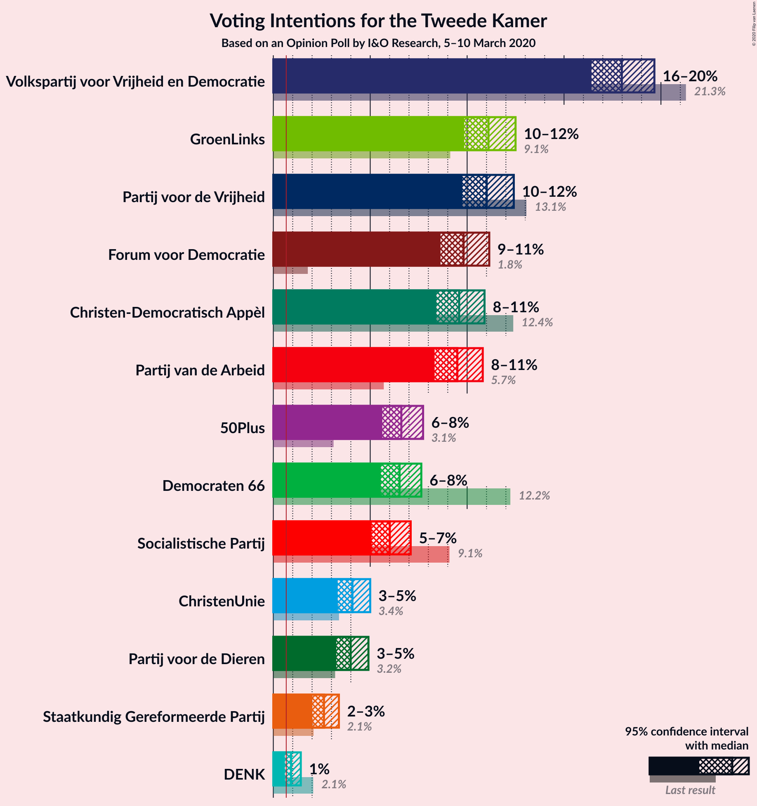

### Confidence Intervals

| Party | Last Result | Poll Result | 80% Confidence Interval | 90% Confidence Interval | 95% Confidence Interval | 99% Confidence Interval |
|:-----:|:-----------:|:-----------:|:-----------------------:|:-----------------------:|:-----------------------:|:-----------------------:|
| Volkspartij voor Vrijheid en Democratie | 21.3% | 18.0% | 16.9–19.1% |16.7–19.4% |16.4–19.7% |15.9–20.2% |
| GroenLinks | 9.1% | 11.1% | 10.3–12.0% |10.0–12.3% |9.8–12.5% |9.5–12.9% |
| Partij voor de Vrijheid | 13.1% | 11.0% | 10.2–11.9% |10.0–12.2% |9.8–12.4% |9.4–12.8% |
| Forum voor Democratie | 1.8% | 9.8% | 9.0–10.7% |8.8–10.9% |8.6–11.1% |8.3–11.6% |
| Christen-Democratisch Appèl | 12.4% | 9.6% | 8.8–10.5% |8.6–10.7% |8.4–10.9% |8.1–11.3% |
| Partij van de Arbeid | 5.7% | 9.5% | 8.7–10.3% |8.5–10.6% |8.3–10.8% |8.0–11.2% |
| 50Plus | 3.1% | 6.6% | 6.0–7.3% |5.8–7.5% |5.6–7.7% |5.3–8.1% |
| Democraten 66 | 12.2% | 6.5% | 5.9–7.3% |5.7–7.5% |5.5–7.6% |5.3–8.0% |
| Socialistische Partij | 9.1% | 6.0% | 5.4–6.7% |5.2–6.9% |5.1–7.1% |4.8–7.5% |
| ChristenUnie | 3.4% | 4.1% | 3.6–4.7% |3.4–4.9% |3.3–5.0% |3.1–5.3% |
| Partij voor de Dieren | 3.2% | 4.0% | 3.5–4.6% |3.4–4.8% |3.2–4.9% |3.0–5.2% |
| Staatkundig Gereformeerde Partij | 2.1% | 2.6% | 2.2–3.1% |2.1–3.3% |2.0–3.4% |1.8–3.6% |
| DENK | 2.1% | 0.9% | 0.7–1.2% |0.6–1.3% |0.6–1.4% |0.5–1.6% |

*Note:* The poll result column reflects the actual value used in the calculations. Published results may vary slightly, and in addition be rounded to fewer digits.

## Seats

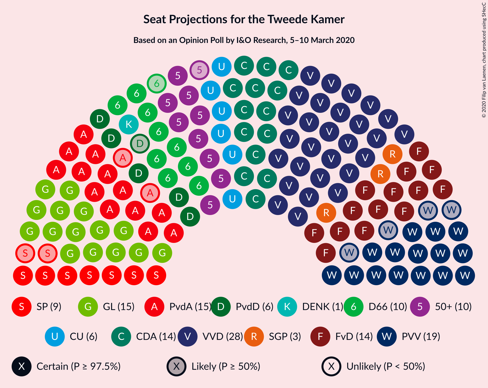

### Confidence Intervals

| Party | Last Result | Median | 80% Confidence Interval | 90% Confidence Interval | 95% Confidence Interval | 99% Confidence Interval |
|:-----:|:-----------:|:------:|:-----------------------:|:-----------------------:|:-----------------------:|:-----------------------:|
| <a href="#volkspartij-voor-vrijheid-en-democratie">Volkspartij voor Vrijheid en Democratie</a> | 33 | 28 | 28 |28 |27–29 |26–31 |
| <a href="#groenlinks">GroenLinks</a> | 14 | 17 | 17 |16–17 |15–17 |14–18 |
| <a href="#partij-voor-de-vrijheid">Partij voor de Vrijheid</a> | 20 | 15 | 15–16 |15–17 |15–18 |15–19 |
| <a href="#forum-voor-democratie">Forum voor Democratie</a> | 2 | 16 | 14–16 |14–16 |14–16 |13–17 |
| <a href="#christen-democratisch-appèl">Christen-Democratisch Appèl</a> | 19 | 14 | 14–15 |14–15 |13–15 |12–17 |
| <a href="#partij-van-de-arbeid">Partij van de Arbeid</a> | 9 | 16 | 13–16 |13–16 |13–16 |12–16 |
| <a href="#50plus">50Plus</a> | 4 | 11 | 10–11 |10–11 |9–11 |8–12 |
| <a href="#democraten-66">Democraten 66</a> | 19 | 10 | 10 |10 |9–11 |8–12 |
| <a href="#socialistische-partij">Socialistische Partij</a> | 14 | 7 | 7–10 |7–11 |7–11 |7–11 |
| <a href="#christenunie">ChristenUnie</a> | 5 | 6 | 6 |6 |5–6 |4–8 |
| <a href="#partij-voor-de-dieren">Partij voor de Dieren</a> | 5 | 6 | 5–6 |5–6 |5–6 |4–7 |
| <a href="#staatkundig-gereformeerde-partij">Staatkundig Gereformeerde Partij</a> | 3 | 3 | 3 |3–4 |3–4 |3–4 |
| <a href="#denk">DENK</a> | 3 | 1 | 1 |1–2 |1–2 |0–2 |

### Volkspartij voor Vrijheid en Democratie

*For a full overview of the results for this party, see the [Volkspartij voor Vrijheid en Democratie](party-volkspartijvoorvrijheidendemocratie.html) page.*

| Number of Seats | Probability | Accumulated | Special Marks |
|:---------------:|:-----------:|:-----------:|:-------------:|
| 24 | 0.1% | 100% |  |
| 25 | 0.2% | 99.9% |  |
| 26 | 0.5% | 99.7% |  |
| 27 | 3% | 99.2% |  |
| 28 | 92% | 96% | Median |
| 29 | 1.1% | 3% |  |
| 30 | 1.4% | 2% |  |
| 31 | 0.9% | 1.0% |  |
| 32 | 0% | 0.1% |  |
| 33 | 0.1% | 0.1% | Last Result |
| 34 | 0% | 0% |  |

### GroenLinks

*For a full overview of the results for this party, see the [GroenLinks](party-groenlinks.html) page.*

| Number of Seats | Probability | Accumulated | Special Marks |
|:---------------:|:-----------:|:-----------:|:-------------:|
| 14 | 1.1% | 100% | Last Result |
| 15 | 2% | 98.9% |  |
| 16 | 5% | 97% |  |
| 17 | 91% | 92% | Median |
| 18 | 0.6% | 1.0% |  |
| 19 | 0.4% | 0.4% |  |
| 20 | 0% | 0% |  |

### Partij voor de Vrijheid

*For a full overview of the results for this party, see the [Partij voor de Vrijheid](party-partijvoordevrijheid.html) page.*

| Number of Seats | Probability | Accumulated | Special Marks |
|:---------------:|:-----------:|:-----------:|:-------------:|
| 14 | 0.3% | 100% |  |
| 15 | 80% | 99.7% | Median |
| 16 | 12% | 19% |  |
| 17 | 2% | 7% |  |
| 18 | 4% | 4% |  |
| 19 | 0.8% | 0.8% |  |
| 20 | 0% | 0% | Last Result |

### Forum voor Democratie

*For a full overview of the results for this party, see the [Forum voor Democratie](party-forumvoordemocratie.html) page.*

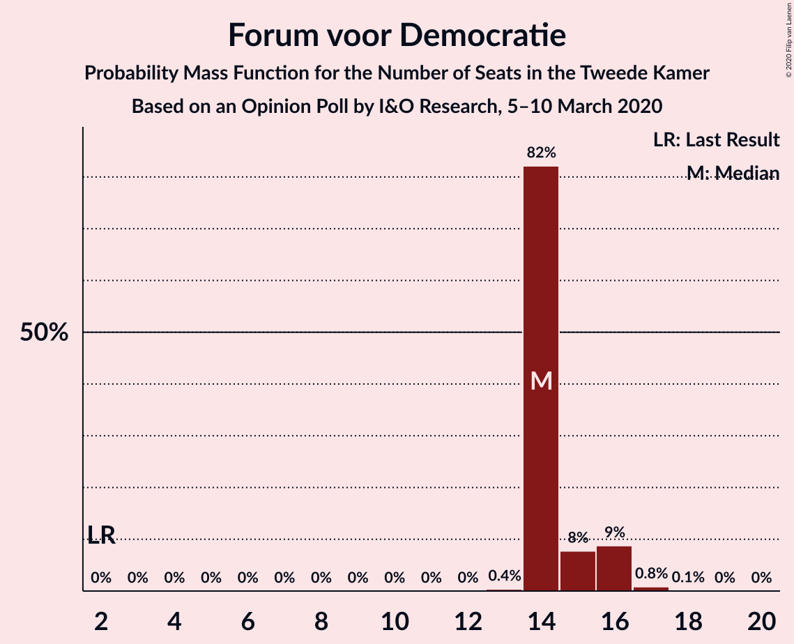

| Number of Seats | Probability | Accumulated | Special Marks |
|:---------------:|:-----------:|:-----------:|:-------------:|
| 2 | 0% | 100% | Last Result |
| 3 | 0% | 100% |  |
| 4 | 0% | 100% |  |
| 5 | 0% | 100% |  |
| 6 | 0% | 100% |  |
| 7 | 0% | 100% |  |
| 8 | 0% | 100% |  |
| 9 | 0% | 100% |  |
| 10 | 0% | 100% |  |
| 11 | 0% | 100% |  |
| 12 | 0% | 100% |  |
| 13 | 1.0% | 100% |  |
| 14 | 11% | 98.9% |  |
| 15 | 2% | 88% |  |
| 16 | 83% | 85% | Median |
| 17 | 2% | 2% |  |
| 18 | 0% | 0% |  |

### Christen-Democratisch Appèl

*For a full overview of the results for this party, see the [Christen-Democratisch Appèl](party-christen-democratischappèl.html) page.*

| Number of Seats | Probability | Accumulated | Special Marks |
|:---------------:|:-----------:|:-----------:|:-------------:|
| 12 | 1.1% | 100% |  |
| 13 | 1.4% | 98.9% |  |
| 14 | 81% | 97% | Median |
| 15 | 16% | 17% |  |
| 16 | 0.5% | 1.2% |  |
| 17 | 0.6% | 0.7% |  |
| 18 | 0.1% | 0.1% |  |
| 19 | 0% | 0% | Last Result |

### Partij van de Arbeid

*For a full overview of the results for this party, see the [Partij van de Arbeid](party-partijvandearbeid.html) page.*

| Number of Seats | Probability | Accumulated | Special Marks |
|:---------------:|:-----------:|:-----------:|:-------------:|
| 9 | 0% | 100% | Last Result |
| 10 | 0% | 100% |  |
| 11 | 0% | 100% |  |
| 12 | 0.5% | 100% |  |
| 13 | 13% | 99.5% |  |
| 14 | 2% | 86% |  |
| 15 | 0.8% | 84% |  |
| 16 | 83% | 83% | Median |
| 17 | 0.3% | 0.3% |  |
| 18 | 0% | 0% |  |

### 50Plus

*For a full overview of the results for this party, see the [50Plus](party-50plus.html) page.*

| Number of Seats | Probability | Accumulated | Special Marks |
|:---------------:|:-----------:|:-----------:|:-------------:|
| 4 | 0% | 100% | Last Result |
| 5 | 0% | 100% |  |
| 6 | 0% | 100% |  |
| 7 | 0% | 100% |  |
| 8 | 2% | 100% |  |
| 9 | 0.6% | 98% |  |
| 10 | 13% | 97% |  |
| 11 | 82% | 84% | Median |
| 12 | 2% | 2% |  |
| 13 | 0% | 0.1% |  |
| 14 | 0% | 0% |  |

### Democraten 66

*For a full overview of the results for this party, see the [Democraten 66](party-democraten66.html) page.*

| Number of Seats | Probability | Accumulated | Special Marks |
|:---------------:|:-----------:|:-----------:|:-------------:|
| 7 | 0.1% | 100% |  |
| 8 | 0.5% | 99.9% |  |
| 9 | 3% | 99.4% |  |
| 10 | 91% | 96% | Median |
| 11 | 3% | 5% |  |
| 12 | 2% | 2% |  |
| 13 | 0% | 0% |  |
| 14 | 0% | 0% |  |
| 15 | 0% | 0% |  |
| 16 | 0% | 0% |  |
| 17 | 0% | 0% |  |
| 18 | 0% | 0% |  |
| 19 | 0% | 0% | Last Result |

### Socialistische Partij

*For a full overview of the results for this party, see the [Socialistische Partij](party-socialistischepartij.html) page.*

| Number of Seats | Probability | Accumulated | Special Marks |
|:---------------:|:-----------:|:-----------:|:-------------:|
| 7 | 81% | 100% | Median |
| 8 | 5% | 19% |  |
| 9 | 3% | 14% |  |
| 10 | 2% | 11% |  |
| 11 | 10% | 10% |  |
| 12 | 0% | 0% |  |
| 13 | 0% | 0% |  |
| 14 | 0% | 0% | Last Result |

### ChristenUnie

*For a full overview of the results for this party, see the [ChristenUnie](party-christenunie.html) page.*

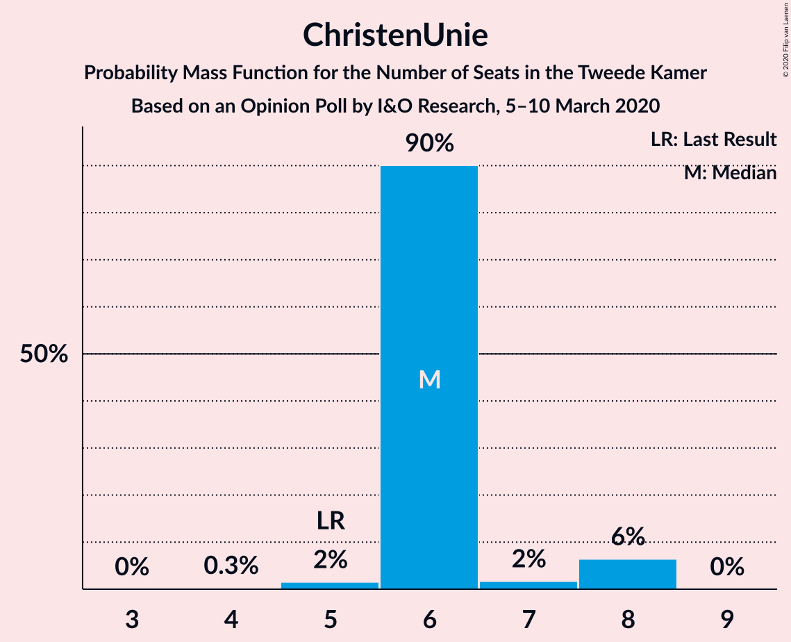

| Number of Seats | Probability | Accumulated | Special Marks |
|:---------------:|:-----------:|:-----------:|:-------------:|
| 4 | 2% | 100% |  |
| 5 | 2% | 98% | Last Result |
| 6 | 94% | 96% | Median |
| 7 | 0.6% | 1.5% |  |
| 8 | 0.9% | 0.9% |  |
| 9 | 0% | 0% |  |

### Partij voor de Dieren

*For a full overview of the results for this party, see the [Partij voor de Dieren](party-partijvoordedieren.html) page.*

| Number of Seats | Probability | Accumulated | Special Marks |
|:---------------:|:-----------:|:-----------:|:-------------:|
| 4 | 2% | 100% |  |
| 5 | 13% | 98% | Last Result |
| 6 | 84% | 86% | Median |
| 7 | 1.3% | 1.3% |  |
| 8 | 0% | 0% |  |

### Staatkundig Gereformeerde Partij

*For a full overview of the results for this party, see the [Staatkundig Gereformeerde Partij](party-staatkundiggereformeerdepartij.html) page.*

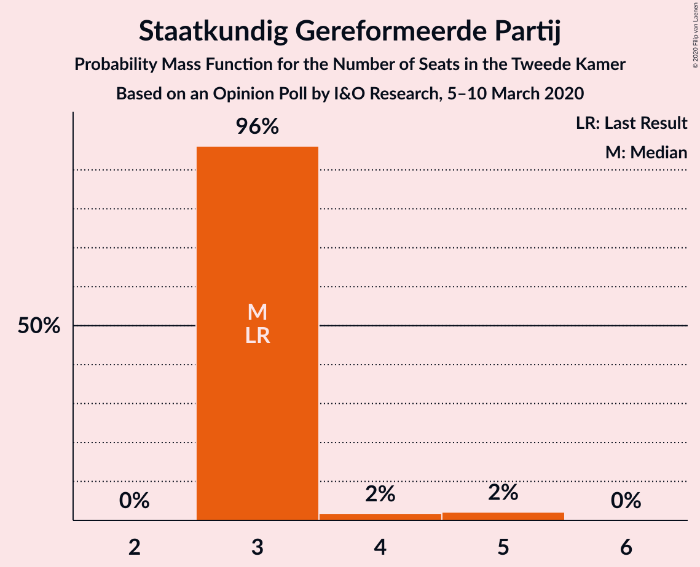

| Number of Seats | Probability | Accumulated | Special Marks |
|:---------------:|:-----------:|:-----------:|:-------------:|
| 3 | 93% | 100% | Last Result, Median |
| 4 | 6% | 7% |  |
| 5 | 0.2% | 0.2% |  |
| 6 | 0% | 0% |  |

### DENK

*For a full overview of the results for this party, see the [DENK](party-denk.html) page.*

| Number of Seats | Probability | Accumulated | Special Marks |
|:---------------:|:-----------:|:-----------:|:-------------:|
| 0 | 1.2% | 100% |  |
| 1 | 89% | 98.8% | Median |
| 2 | 10% | 10% |  |
| 3 | 0% | 0% | Last Result |

## Coalitions

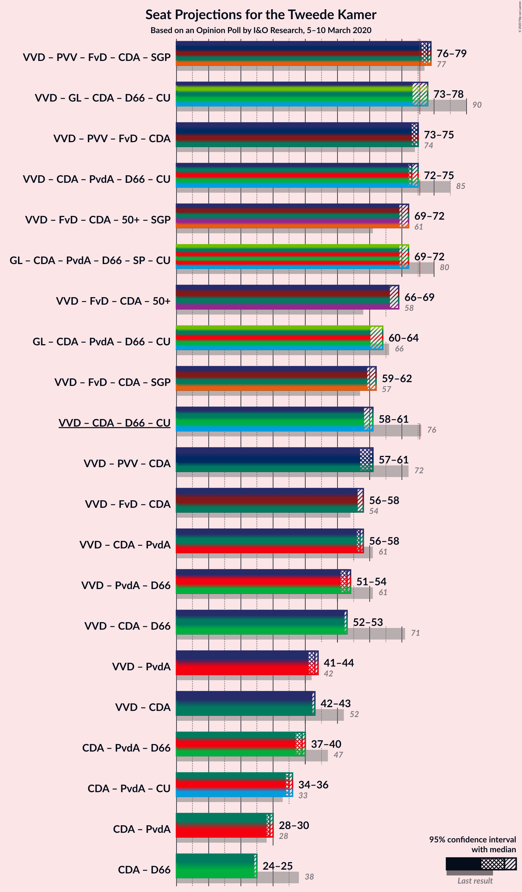

### Confidence Intervals

| Coalition | Last Result | Median | Majority? | 80% Confidence Interval | 90% Confidence Interval | 95% Confidence Interval | 99% Confidence Interval |
|:---------:|:-----------:|:------:|:---------:|:-----------------------:|:-----------------------:|:-----------------------:|:-----------------------:|
| Volkspartij voor Vrijheid en Democratie – Partij voor de Vrijheid – Forum voor Democratie – Christen-Democratisch Appèl – Staatkundig Gereformeerde Partij | 77 | 76 | 99.7% | 76 | 76–78 | 76–81 | 76–82 |
| Volkspartij voor Vrijheid en Democratie – Partij voor de Vrijheid – Forum voor Democratie – Christen-Democratisch Appèl | 74 | 73 | 4% | 73 | 73–75 | 73–77 | 72–78 |
| Volkspartij voor Vrijheid en Democratie – GroenLinks – Christen-Democratisch Appèl – Democraten 66 – ChristenUnie | 90 | 75 | 14% | 75–76 | 75–76 | 72–77 | 71–78 |
| Volkspartij voor Vrijheid en Democratie – Christen-Democratisch Appèl – Partij van de Arbeid – Democraten 66 – ChristenUnie | 85 | 74 | 1.1% | 72–74 | 72–74 | 72–75 | 69–76 |
| Volkspartij voor Vrijheid en Democratie – Forum voor Democratie – Christen-Democratisch Appèl – 50Plus – Staatkundig Gereformeerde Partij | 61 | 72 | 0% | 70–72 | 70–72 | 70–73 | 68–74 |
| GroenLinks – Christen-Democratisch Appèl – Partij van de Arbeid – Democraten 66 – Socialistische Partij – ChristenUnie | 80 | 70 | 0% | 70–72 | 69–72 | 68–72 | 67–72 |
| Volkspartij voor Vrijheid en Democratie – Forum voor Democratie – Christen-Democratisch Appèl – 50Plus | 58 | 69 | 0% | 67–69 | 67–69 | 67–69 | 64–70 |
| GroenLinks – Christen-Democratisch Appèl – Partij van de Arbeid – Democraten 66 – ChristenUnie | 66 | 63 | 0% | 61–63 | 60–63 | 60–63 | 58–63 |
| Volkspartij voor Vrijheid en Democratie – Forum voor Democratie – Christen-Democratisch Appèl – Staatkundig Gereformeerde Partij | 57 | 61 | 0% | 60–61 | 60–62 | 60–63 | 58–66 |
| Volkspartij voor Vrijheid en Democratie – Partij voor de Vrijheid – Christen-Democratisch Appèl | 72 | 57 | 0% | 57–59 | 57–60 | 57–61 | 57–63 |
| Volkspartij voor Vrijheid en Democratie – Forum voor Democratie – Christen-Democratisch Appèl | 54 | 58 | 0% | 57–58 | 57–59 | 57–60 | 54–62 |
| Volkspartij voor Vrijheid en Democratie – Christen-Democratisch Appèl – Democraten 66 – ChristenUnie | 76 | 58 | 0% | 58–59 | 58–59 | 56–60 | 54–62 |
| Volkspartij voor Vrijheid en Democratie – Christen-Democratisch Appèl – Partij van de Arbeid | 61 | 58 | 0% | 56–58 | 56–58 | 55–58 | 53–62 |
| Volkspartij voor Vrijheid en Democratie – Christen-Democratisch Appèl – Democraten 66 | 71 | 52 | 0% | 52–53 | 52–53 | 51–55 | 48–56 |
| Volkspartij voor Vrijheid en Democratie – Partij van de Arbeid – Democraten 66 | 61 | 54 | 0% | 51–54 | 51–54 | 51–54 | 49–56 |
| Volkspartij voor Vrijheid en Democratie – Christen-Democratisch Appèl | 52 | 42 | 0% | 42–43 | 42–43 | 42–44 | 40–46 |
| Volkspartij voor Vrijheid en Democratie – Partij van de Arbeid | 42 | 44 | 0% | 41–44 | 41–44 | 41–44 | 40–46 |
| Christen-Democratisch Appèl – Partij van de Arbeid – Democraten 66 | 47 | 40 | 0% | 38–40 | 38–40 | 38–40 | 35–42 |
| Christen-Democratisch Appèl – Partij van de Arbeid – ChristenUnie | 33 | 36 | 0% | 34–36 | 34–36 | 34–36 | 31–38 |
| Christen-Democratisch Appèl – Partij van de Arbeid | 28 | 30 | 0% | 28–30 | 28–30 | 27–30 | 26–33 |
| Christen-Democratisch Appèl – Democraten 66 | 38 | 24 | 0% | 24–25 | 24–26 | 23–26 | 21–27 |

### Volkspartij voor Vrijheid en Democratie – Partij voor de Vrijheid – Forum voor Democratie – Christen-Democratisch Appèl – Staatkundig Gereformeerde Partij

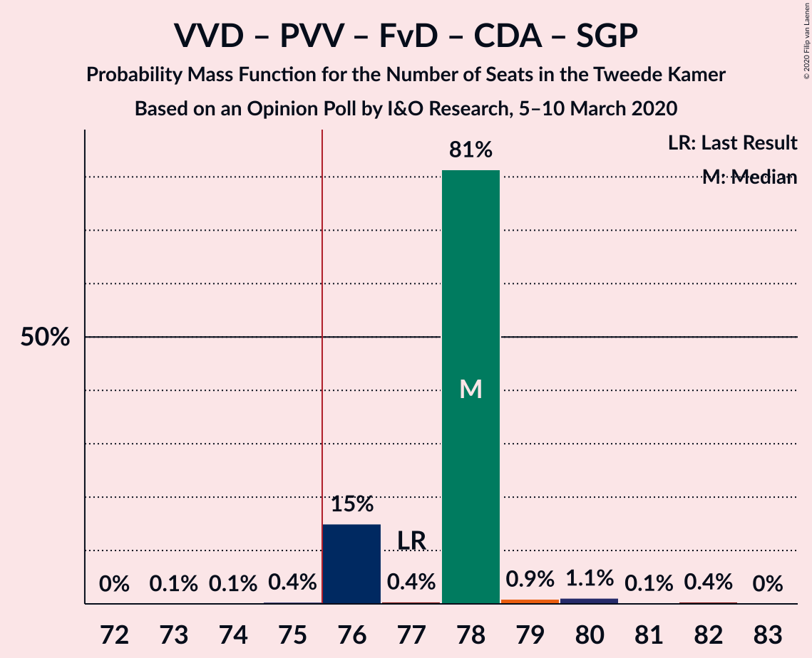

| Number of Seats | Probability | Accumulated | Special Marks |
|:---------------:|:-----------:|:-----------:|:-------------:|
| 73 | 0.1% | 100% |  |
| 74 | 0.1% | 99.9% |  |
| 75 | 0.1% | 99.8% |  |
| 76 | 91% | 99.7% | Median, Majority |
| 77 | 0.1% | 9% | Last Result |
| 78 | 4% | 9% |  |
| 79 | 1.0% | 5% |  |
| 80 | 1.2% | 4% |  |
| 81 | 0.7% | 3% |  |
| 82 | 2% | 2% |  |
| 83 | 0% | 0% |  |

### Volkspartij voor Vrijheid en Democratie – Partij voor de Vrijheid – Forum voor Democratie – Christen-Democratisch Appèl

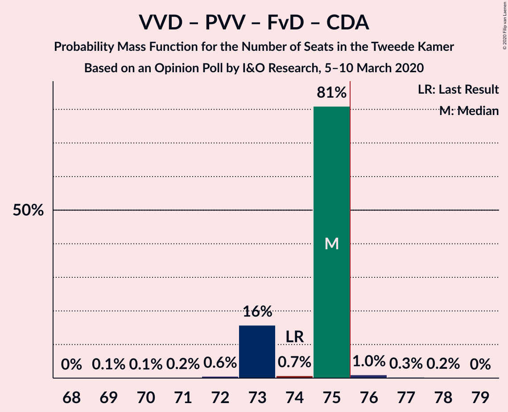

| Number of Seats | Probability | Accumulated | Special Marks |
|:---------------:|:-----------:|:-----------:|:-------------:|
| 69 | 0% | 100% |  |
| 70 | 0% | 99.9% |  |
| 71 | 0.2% | 99.9% |  |
| 72 | 0.8% | 99.7% |  |
| 73 | 90% | 98.9% | Median |
| 74 | 2% | 9% | Last Result |
| 75 | 3% | 7% |  |
| 76 | 2% | 4% | Majority |
| 77 | 0.4% | 3% |  |
| 78 | 2% | 2% |  |
| 79 | 0% | 0% |  |

### Volkspartij voor Vrijheid en Democratie – GroenLinks – Christen-Democratisch Appèl – Democraten 66 – ChristenUnie

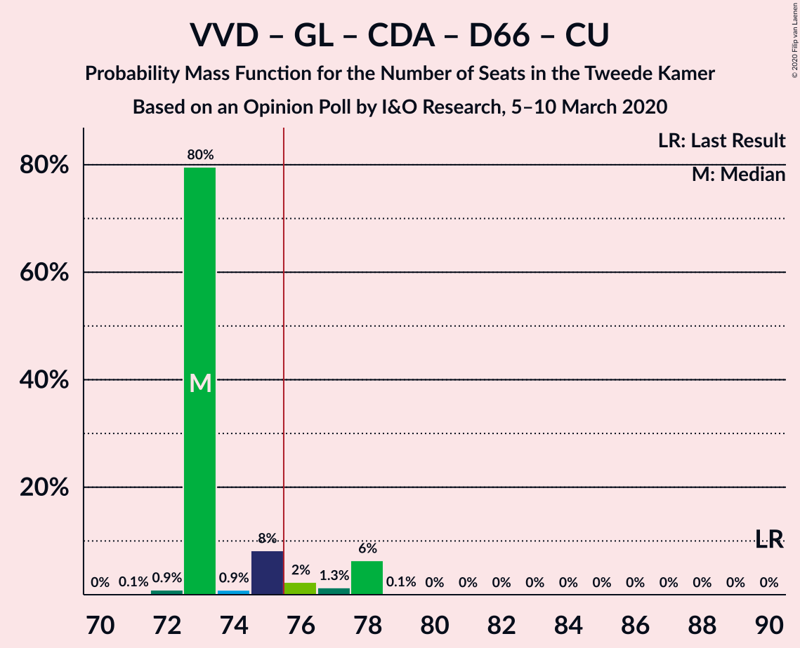

| Number of Seats | Probability | Accumulated | Special Marks |
|:---------------:|:-----------:|:-----------:|:-------------:|
| 70 | 0.2% | 100% |  |
| 71 | 0.7% | 99.8% |  |
| 72 | 3% | 99.1% |  |
| 73 | 0.8% | 96% |  |
| 74 | 0.2% | 96% |  |
| 75 | 81% | 96% | Median |
| 76 | 12% | 14% | Majority |
| 77 | 2% | 3% |  |
| 78 | 0.7% | 0.7% |  |
| 79 | 0% | 0.1% |  |
| 80 | 0% | 0% |  |
| 81 | 0% | 0% |  |
| 82 | 0% | 0% |  |
| 83 | 0% | 0% |  |
| 84 | 0% | 0% |  |
| 85 | 0% | 0% |  |
| 86 | 0% | 0% |  |
| 87 | 0% | 0% |  |
| 88 | 0% | 0% |  |
| 89 | 0% | 0% |  |
| 90 | 0% | 0% | Last Result |

### Volkspartij voor Vrijheid en Democratie – Christen-Democratisch Appèl – Partij van de Arbeid – Democraten 66 – ChristenUnie

| Number of Seats | Probability | Accumulated | Special Marks |
|:---------------:|:-----------:|:-----------:|:-------------:|
| 67 | 0.4% | 100% |  |
| 68 | 0.1% | 99.6% |  |
| 69 | 0.7% | 99.6% |  |
| 70 | 0.1% | 98.9% |  |
| 71 | 0.2% | 98.8% |  |
| 72 | 13% | 98.5% |  |
| 73 | 2% | 86% |  |
| 74 | 81% | 84% | Median |
| 75 | 1.5% | 3% |  |
| 76 | 1.1% | 1.1% | Majority |
| 77 | 0% | 0% |  |
| 78 | 0% | 0% |  |
| 79 | 0% | 0% |  |
| 80 | 0% | 0% |  |
| 81 | 0% | 0% |  |
| 82 | 0% | 0% |  |
| 83 | 0% | 0% |  |
| 84 | 0% | 0% |  |
| 85 | 0% | 0% | Last Result |

### Volkspartij voor Vrijheid en Democratie – Forum voor Democratie – Christen-Democratisch Appèl – 50Plus – Staatkundig Gereformeerde Partij

| Number of Seats | Probability | Accumulated | Special Marks |
|:---------------:|:-----------:|:-----------:|:-------------:|
| 61 | 0% | 100% | Last Result |
| 62 | 0% | 100% |  |
| 63 | 0% | 100% |  |
| 64 | 0% | 100% |  |
| 65 | 0% | 100% |  |
| 66 | 0% | 100% |  |
| 67 | 0% | 100% |  |
| 68 | 0.9% | 99.9% |  |
| 69 | 0.8% | 99.1% |  |
| 70 | 10% | 98% |  |
| 71 | 0.1% | 88% |  |
| 72 | 84% | 88% | Median |
| 73 | 4% | 5% |  |
| 74 | 0.6% | 1.0% |  |
| 75 | 0.4% | 0.4% |  |
| 76 | 0% | 0% | Majority |

### GroenLinks – Christen-Democratisch Appèl – Partij van de Arbeid – Democraten 66 – Socialistische Partij – ChristenUnie

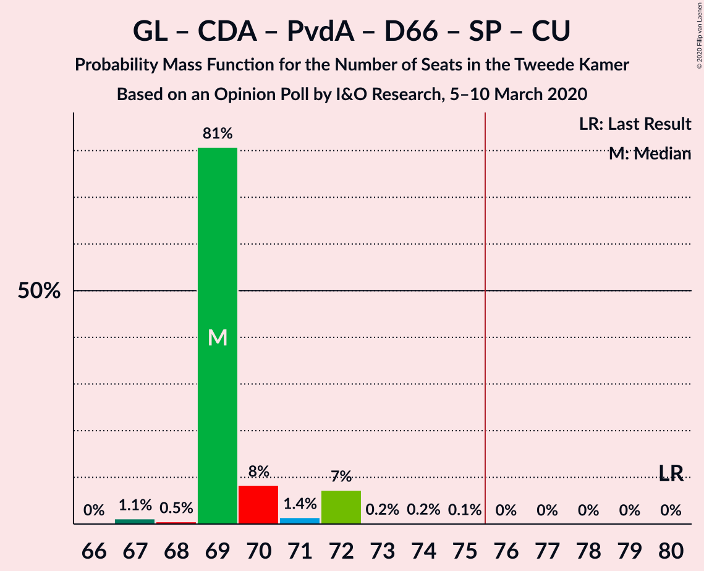

| Number of Seats | Probability | Accumulated | Special Marks |
|:---------------:|:-----------:|:-----------:|:-------------:|
| 64 | 0.3% | 100% |  |
| 65 | 0% | 99.7% |  |
| 66 | 0% | 99.7% |  |
| 67 | 0.7% | 99.6% |  |
| 68 | 3% | 98.9% |  |
| 69 | 2% | 96% |  |
| 70 | 81% | 93% | Median |
| 71 | 2% | 12% |  |
| 72 | 10% | 10% |  |
| 73 | 0% | 0.2% |  |
| 74 | 0% | 0.2% |  |
| 75 | 0.1% | 0.2% |  |
| 76 | 0% | 0% | Majority |
| 77 | 0% | 0% |  |
| 78 | 0% | 0% |  |
| 79 | 0% | 0% |  |
| 80 | 0% | 0% | Last Result |

### Volkspartij voor Vrijheid en Democratie – Forum voor Democratie – Christen-Democratisch Appèl – 50Plus

| Number of Seats | Probability | Accumulated | Special Marks |
|:---------------:|:-----------:|:-----------:|:-------------:|
| 58 | 0% | 100% | Last Result |
| 59 | 0% | 100% |  |
| 60 | 0% | 100% |  |
| 61 | 0% | 100% |  |
| 62 | 0% | 100% |  |
| 63 | 0% | 100% |  |
| 64 | 0.8% | 100% |  |
| 65 | 0.3% | 99.2% |  |
| 66 | 0.7% | 98.9% |  |
| 67 | 10% | 98% |  |
| 68 | 1.4% | 88% |  |
| 69 | 85% | 87% | Median |
| 70 | 1.2% | 2% |  |
| 71 | 0.4% | 0.4% |  |
| 72 | 0% | 0% |  |

### GroenLinks – Christen-Democratisch Appèl – Partij van de Arbeid – Democraten 66 – ChristenUnie

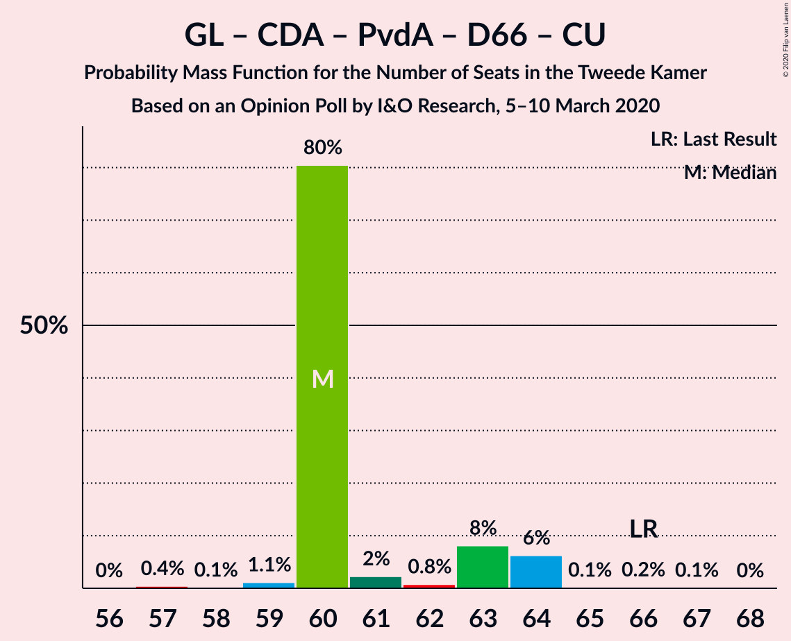

| Number of Seats | Probability | Accumulated | Special Marks |
|:---------------:|:-----------:|:-----------:|:-------------:|
| 55 | 0.3% | 100% |  |
| 56 | 0% | 99.7% |  |
| 57 | 0% | 99.7% |  |
| 58 | 0.4% | 99.7% |  |
| 59 | 2% | 99.3% |  |
| 60 | 3% | 98% |  |
| 61 | 11% | 94% |  |
| 62 | 3% | 84% |  |
| 63 | 81% | 81% | Median |
| 64 | 0.1% | 0.2% |  |
| 65 | 0% | 0.2% |  |
| 66 | 0.2% | 0.2% | Last Result |
| 67 | 0% | 0% |  |

### Volkspartij voor Vrijheid en Democratie – Forum voor Democratie – Christen-Democratisch Appèl – Staatkundig Gereformeerde Partij

| Number of Seats | Probability | Accumulated | Special Marks |
|:---------------:|:-----------:|:-----------:|:-------------:|
| 57 | 0.4% | 100% | Last Result |
| 58 | 0.9% | 99.5% |  |
| 59 | 0.1% | 98.7% |  |
| 60 | 10% | 98.6% |  |
| 61 | 82% | 88% | Median |
| 62 | 4% | 7% |  |
| 63 | 0.6% | 3% |  |
| 64 | 2% | 2% |  |
| 65 | 0.1% | 0.6% |  |
| 66 | 0.5% | 0.5% |  |
| 67 | 0% | 0% |  |

### Volkspartij voor Vrijheid en Democratie – Partij voor de Vrijheid – Christen-Democratisch Appèl

| Number of Seats | Probability | Accumulated | Special Marks |
|:---------------:|:-----------:|:-----------:|:-------------:|
| 54 | 0.1% | 100% |  |
| 55 | 0% | 99.9% |  |
| 56 | 0% | 99.9% |  |
| 57 | 80% | 99.9% | Median |
| 58 | 3% | 19% |  |
| 59 | 11% | 17% |  |
| 60 | 3% | 6% |  |
| 61 | 0.2% | 3% |  |
| 62 | 1.0% | 2% |  |
| 63 | 1.4% | 1.4% |  |
| 64 | 0% | 0% |  |
| 65 | 0% | 0% |  |
| 66 | 0% | 0% |  |
| 67 | 0% | 0% |  |
| 68 | 0% | 0% |  |
| 69 | 0% | 0% |  |
| 70 | 0% | 0% |  |
| 71 | 0% | 0% |  |
| 72 | 0% | 0% | Last Result |

### Volkspartij voor Vrijheid en Democratie – Forum voor Democratie – Christen-Democratisch Appèl

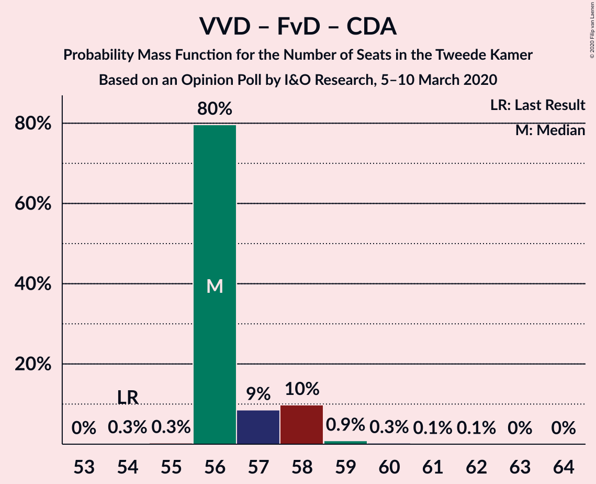

| Number of Seats | Probability | Accumulated | Special Marks |
|:---------------:|:-----------:|:-----------:|:-------------:|
| 52 | 0% | 100% |  |
| 53 | 0% | 99.9% |  |
| 54 | 1.1% | 99.9% | Last Result |
| 55 | 0.3% | 98.8% |  |
| 56 | 0.1% | 98.5% |  |
| 57 | 12% | 98% |  |
| 58 | 82% | 87% | Median |
| 59 | 2% | 5% |  |
| 60 | 2% | 3% |  |
| 61 | 0.1% | 0.6% |  |
| 62 | 0.5% | 0.5% |  |
| 63 | 0% | 0% |  |

### Volkspartij voor Vrijheid en Democratie – Christen-Democratisch Appèl – Democraten 66 – ChristenUnie

| Number of Seats | Probability | Accumulated | Special Marks |
|:---------------:|:-----------:|:-----------:|:-------------:|
| 53 | 0.4% | 100% |  |
| 54 | 0.2% | 99.6% |  |
| 55 | 0.1% | 99.4% |  |
| 56 | 2% | 99.4% |  |
| 57 | 0.8% | 97% |  |
| 58 | 81% | 96% | Median |
| 59 | 10% | 15% |  |
| 60 | 2% | 4% |  |
| 61 | 1.0% | 2% |  |
| 62 | 1.4% | 1.5% |  |
| 63 | 0.1% | 0.1% |  |
| 64 | 0% | 0% |  |
| 65 | 0% | 0% |  |
| 66 | 0% | 0% |  |
| 67 | 0% | 0% |  |
| 68 | 0% | 0% |  |
| 69 | 0% | 0% |  |
| 70 | 0% | 0% |  |
| 71 | 0% | 0% |  |
| 72 | 0% | 0% |  |
| 73 | 0% | 0% |  |
| 74 | 0% | 0% |  |
| 75 | 0% | 0% |  |
| 76 | 0% | 0% | Last Result, Majority |

### Volkspartij voor Vrijheid en Democratie – Christen-Democratisch Appèl – Partij van de Arbeid

| Number of Seats | Probability | Accumulated | Special Marks |
|:---------------:|:-----------:|:-----------:|:-------------:|
| 52 | 0% | 100% |  |
| 53 | 0.7% | 99.9% |  |
| 54 | 0% | 99.2% |  |
| 55 | 2% | 99.2% |  |
| 56 | 11% | 97% |  |
| 57 | 0.8% | 86% |  |
| 58 | 82% | 85% | Median |
| 59 | 2% | 2% |  |
| 60 | 0.1% | 0.7% |  |
| 61 | 0% | 0.5% | Last Result |
| 62 | 0.5% | 0.5% |  |
| 63 | 0% | 0% |  |

### Volkspartij voor Vrijheid en Democratie – Christen-Democratisch Appèl – Democraten 66

| Number of Seats | Probability | Accumulated | Special Marks |
|:---------------:|:-----------:|:-----------:|:-------------:|
| 47 | 0.1% | 100% |  |
| 48 | 0.5% | 99.9% |  |
| 49 | 0.1% | 99.4% |  |
| 50 | 0.8% | 99.4% |  |
| 51 | 1.1% | 98.5% |  |
| 52 | 82% | 97% | Median |
| 53 | 11% | 15% |  |
| 54 | 1.4% | 5% |  |
| 55 | 2% | 3% |  |
| 56 | 1.3% | 1.5% |  |
| 57 | 0.1% | 0.1% |  |
| 58 | 0% | 0% |  |
| 59 | 0% | 0% |  |
| 60 | 0% | 0% |  |
| 61 | 0% | 0% |  |
| 62 | 0% | 0% |  |
| 63 | 0% | 0% |  |
| 64 | 0% | 0% |  |
| 65 | 0% | 0% |  |
| 66 | 0% | 0% |  |
| 67 | 0% | 0% |  |
| 68 | 0% | 0% |  |
| 69 | 0% | 0% |  |
| 70 | 0% | 0% |  |
| 71 | 0% | 0% | Last Result |

### Volkspartij voor Vrijheid en Democratie – Partij van de Arbeid – Democraten 66

| Number of Seats | Probability | Accumulated | Special Marks |
|:---------------:|:-----------:|:-----------:|:-------------:|
| 47 | 0.4% | 100% |  |
| 48 | 0.1% | 99.6% |  |
| 49 | 0.1% | 99.5% |  |
| 50 | 0.6% | 99.4% |  |
| 51 | 10% | 98.8% |  |
| 52 | 4% | 89% |  |
| 53 | 3% | 85% |  |
| 54 | 82% | 83% | Median |
| 55 | 0% | 0.6% |  |
| 56 | 0.1% | 0.6% |  |
| 57 | 0% | 0.5% |  |
| 58 | 0.4% | 0.4% |  |
| 59 | 0% | 0% |  |
| 60 | 0% | 0% |  |
| 61 | 0% | 0% | Last Result |

### Volkspartij voor Vrijheid en Democratie – Christen-Democratisch Appèl

| Number of Seats | Probability | Accumulated | Special Marks |
|:---------------:|:-----------:|:-----------:|:-------------:|
| 38 | 0.1% | 100% |  |
| 39 | 0.4% | 99.9% |  |
| 40 | 0.5% | 99.5% |  |
| 41 | 1.3% | 99.0% |  |
| 42 | 83% | 98% | Median |
| 43 | 12% | 15% |  |
| 44 | 0.6% | 3% |  |
| 45 | 1.4% | 2% |  |
| 46 | 0.7% | 0.8% |  |
| 47 | 0% | 0% |  |
| 48 | 0% | 0% |  |
| 49 | 0% | 0% |  |
| 50 | 0% | 0% |  |
| 51 | 0% | 0% |  |
| 52 | 0% | 0% | Last Result |

### Volkspartij voor Vrijheid en Democratie – Partij van de Arbeid

| Number of Seats | Probability | Accumulated | Special Marks |
|:---------------:|:-----------:|:-----------:|:-------------:|
| 38 | 0.4% | 100% |  |
| 39 | 0.1% | 99.6% |  |
| 40 | 2% | 99.6% |  |
| 41 | 11% | 98% |  |
| 42 | 1.2% | 87% | Last Result |
| 43 | 2% | 86% |  |
| 44 | 82% | 84% | Median |
| 45 | 0.6% | 1.2% |  |
| 46 | 0.5% | 0.6% |  |
| 47 | 0.1% | 0.1% |  |
| 48 | 0% | 0% |  |

### Christen-Democratisch Appèl – Partij van de Arbeid – Democraten 66

| Number of Seats | Probability | Accumulated | Special Marks |
|:---------------:|:-----------:|:-----------:|:-------------:|
| 34 | 0.3% | 100% |  |
| 35 | 0.4% | 99.7% |  |
| 36 | 0.6% | 99.3% |  |
| 37 | 1.1% | 98.7% |  |
| 38 | 10% | 98% |  |
| 39 | 2% | 88% |  |
| 40 | 85% | 85% | Median |
| 41 | 0.1% | 0.8% |  |
| 42 | 0.6% | 0.7% |  |
| 43 | 0% | 0% |  |
| 44 | 0% | 0% |  |
| 45 | 0% | 0% |  |
| 46 | 0% | 0% |  |
| 47 | 0% | 0% | Last Result |

### Christen-Democratisch Appèl – Partij van de Arbeid – ChristenUnie

| Number of Seats | Probability | Accumulated | Special Marks |
|:---------------:|:-----------:|:-----------:|:-------------:|
| 29 | 0.3% | 100% |  |
| 30 | 0% | 99.7% |  |
| 31 | 0.4% | 99.7% |  |
| 32 | 0.2% | 99.3% |  |
| 33 | 0.6% | 99.1% | Last Result |
| 34 | 14% | 98% |  |
| 35 | 3% | 85% |  |
| 36 | 80% | 81% | Median |
| 37 | 0.1% | 1.0% |  |
| 38 | 0.7% | 0.9% |  |
| 39 | 0.1% | 0.2% |  |
| 40 | 0.1% | 0.1% |  |
| 41 | 0% | 0% |  |

### Christen-Democratisch Appèl – Partij van de Arbeid

| Number of Seats | Probability | Accumulated | Special Marks |
|:---------------:|:-----------:|:-----------:|:-------------:|
| 25 | 0.4% | 100% |  |
| 26 | 0.4% | 99.6% |  |
| 27 | 2% | 99.3% |  |
| 28 | 12% | 97% | Last Result |
| 29 | 2% | 85% |  |
| 30 | 80% | 83% | Median |
| 31 | 2% | 2% |  |
| 32 | 0.3% | 0.9% |  |
| 33 | 0.5% | 0.6% |  |
| 34 | 0% | 0% |  |

### Christen-Democratisch Appèl – Democraten 66

| Number of Seats | Probability | Accumulated | Special Marks |
|:---------------:|:-----------:|:-----------:|:-------------:|
| 21 | 0.7% | 100% |  |
| 22 | 0.4% | 99.3% |  |
| 23 | 1.4% | 98.9% |  |
| 24 | 83% | 97% | Median |
| 25 | 10% | 15% |  |
| 26 | 3% | 5% |  |
| 27 | 2% | 2% |  |
| 28 | 0% | 0.1% |  |
| 29 | 0.1% | 0.1% |  |
| 30 | 0% | 0% |  |
| 31 | 0% | 0% |  |
| 32 | 0% | 0% |  |
| 33 | 0% | 0% |  |
| 34 | 0% | 0% |  |
| 35 | 0% | 0% |  |
| 36 | 0% | 0% |  |
| 37 | 0% | 0% |  |
| 38 | 0% | 0% | Last Result |

## Technical Information

### Opinion Poll

+ **Polling firm:** I&O Research
+ **Commissioner(s):** —
+ **Fieldwork period:** 5–10 March 2020

### Calculations

+ **Sample size:** 2180
+ **Simulations done:** 262,144
+ **Error estimate:** 2.10%

