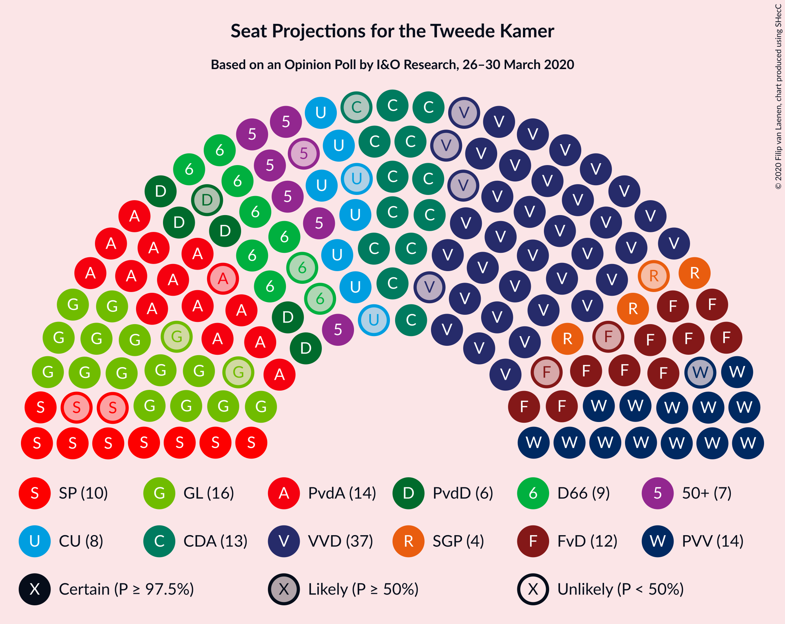
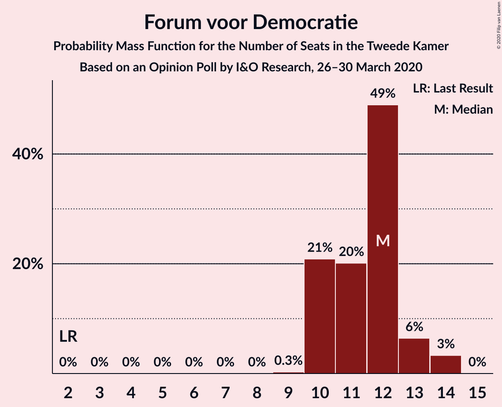
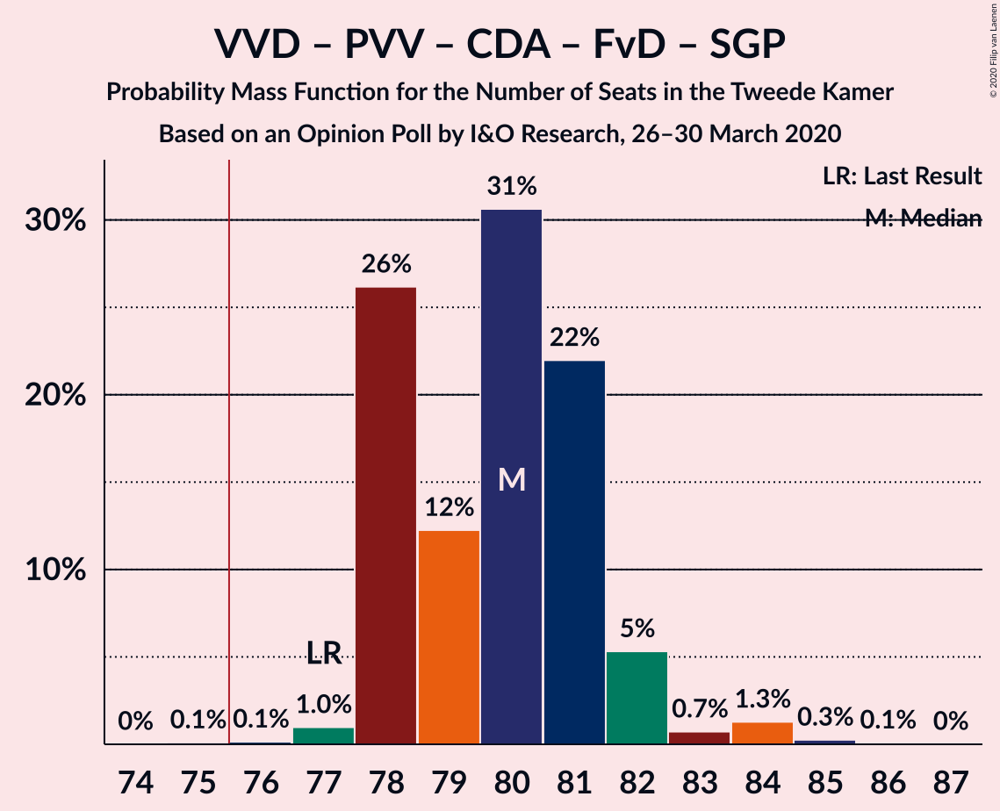
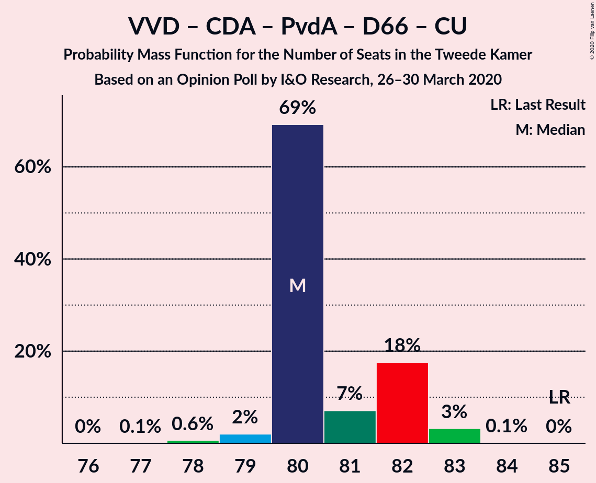
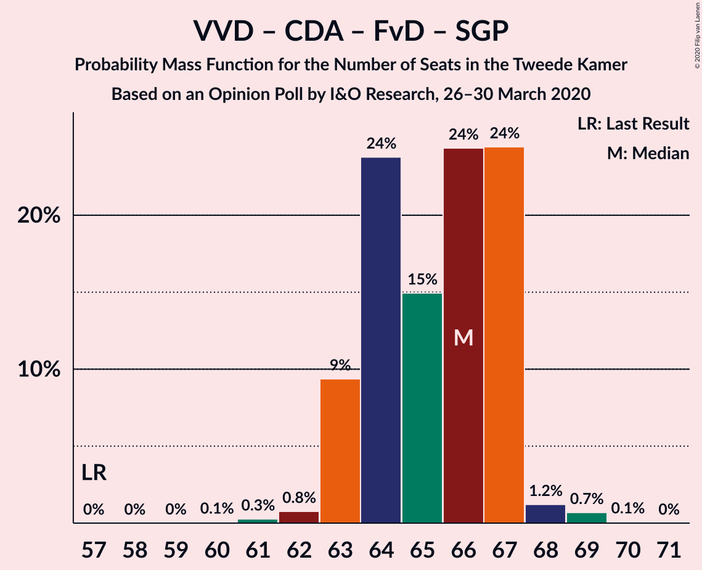
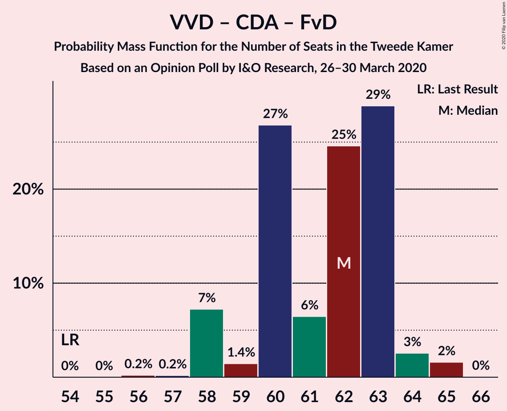
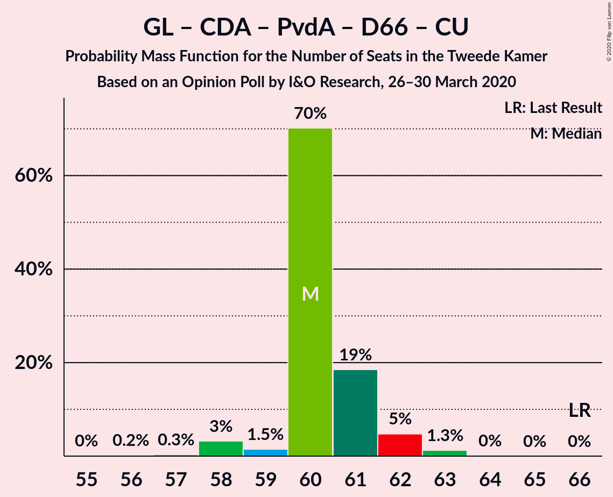
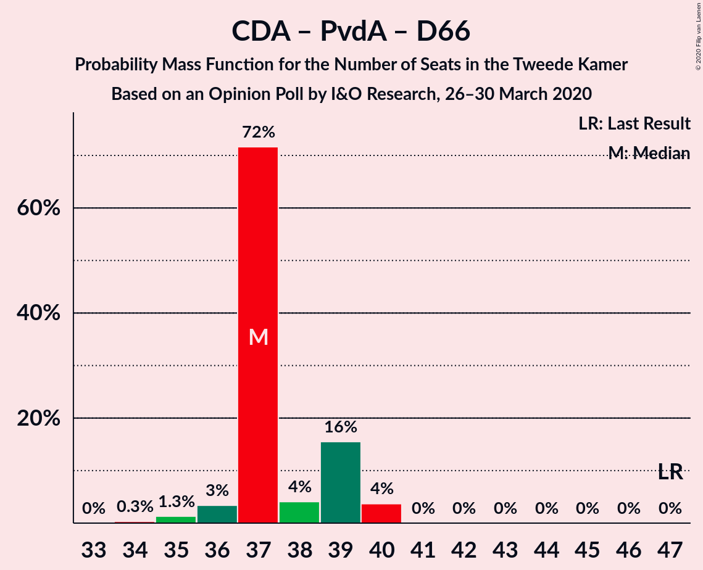

# Opinion Poll by I&O Research, 26–30 March 2020

<a href="#voting-intentions">Voting Intentions</a> | <a href="#seats">Seats</a> | <a href="#coalitions">Coalitions</a> | <a href="#technical-information">Technical Information</a>

## Voting Intentions

### Confidence Intervals

| Party | Last Result | Poll Result | 80% Confidence Interval | 90% Confidence Interval | 95% Confidence Interval | 99% Confidence Interval |
|:-----:|:-----------:|:-----------:|:-----------------------:|:-----------------------:|:-----------------------:|:-----------------------:|
| Volkspartij voor Vrijheid en Democratie | 21.3% | 24.0% | 22.8–25.1% |22.5–25.5% |22.3–25.7% |21.7–26.3% |
| GroenLinks | 9.1% | 10.6% | 9.8–11.5% |9.6–11.7% |9.4–11.9% |9.1–12.4% |
| Partij voor de Vrijheid | 13.1% | 10.0% | 9.2–10.8% |9.0–11.1% |8.8–11.3% |8.5–11.7% |
| Christen-Democratisch Appèl | 12.4% | 9.3% | 8.6–10.1% |8.4–10.4% |8.2–10.6% |7.8–11.0% |
| Partij van de Arbeid | 5.7% | 9.3% | 8.6–10.1% |8.4–10.4% |8.2–10.6% |7.8–11.0% |
| Forum voor Democratie | 1.8% | 8.0% | 7.3–8.7% |7.1–9.0% |7.0–9.2% |6.6–9.5% |
| Democraten 66 | 12.2% | 6.0% | 5.4–6.7% |5.2–6.9% |5.1–7.0% |4.8–7.4% |
| Socialistische Partij | 9.1% | 6.0% | 5.4–6.7% |5.2–6.9% |5.1–7.0% |4.8–7.4% |
| ChristenUnie | 3.4% | 4.7% | 4.1–5.3% |4.0–5.4% |3.9–5.6% |3.6–5.9% |
| 50Plus | 3.1% | 4.7% | 4.1–5.3% |4.0–5.4% |3.9–5.6% |3.6–5.9% |
| Partij voor de Dieren | 3.2% | 4.0% | 3.5–4.6% |3.4–4.8% |3.3–4.9% |3.1–5.2% |
| Staatkundig Gereformeerde Partij | 2.1% | 2.6% | 2.3–3.1% |2.1–3.3% |2.1–3.4% |1.9–3.6% |
| DENK | 2.1% | 0.7% | 0.5–1.0% |0.5–1.0% |0.4–1.1% |0.4–1.3% |

*Note:* The poll result column reflects the actual value used in the calculations. Published results may vary slightly, and in addition be rounded to fewer digits.

## Seats

### Confidence Intervals

| Party | Last Result | Median | 80% Confidence Interval | 90% Confidence Interval | 95% Confidence Interval | 99% Confidence Interval |
|:-----:|:-----------:|:------:|:-----------------------:|:-----------------------:|:-----------------------:|:-----------------------:|
| <a href="#volkspartij-voor-vrijheid-en-democratie">Volkspartij voor Vrijheid en Democratie</a> | 33 | 37 | 36–37 |35–37 |35–39 |35–40 |
| <a href="#groenlinks">GroenLinks</a> | 14 | 17 | 15–17 |15–17 |15–17 |15–18 |
| <a href="#partij-voor-de-vrijheid">Partij voor de Vrijheid</a> | 20 | 14 | 14–16 |14–16 |14–17 |13–17 |
| <a href="#christen-democratisch-appèl">Christen-Democratisch Appèl</a> | 19 | 15 | 14–15 |14–15 |13–15 |12–15 |
| <a href="#partij-van-de-arbeid">Partij van de Arbeid</a> | 9 | 14 | 14–15 |14–15 |13–16 |12–16 |
| <a href="#forum-voor-democratie">Forum voor Democratie</a> | 2 | 12 | 12 |12 |11–13 |10–13 |
| <a href="#democraten-66">Democraten 66</a> | 19 | 8 | 8–9 |8–10 |8–10 |7–10 |
| <a href="#socialistische-partij">Socialistische Partij</a> | 14 | 10 | 9–10 |8–10 |8–10 |7–10 |
| <a href="#christenunie">ChristenUnie</a> | 5 | 6 | 6–7 |6–8 |6–8 |6–9 |
| <a href="#50plus">50Plus</a> | 4 | 7 | 7 |6–7 |6–8 |6–8 |
| <a href="#partij-voor-de-dieren">Partij voor de Dieren</a> | 5 | 6 | 5–6 |5–6 |5–6 |5–7 |
| <a href="#staatkundig-gereformeerde-partij">Staatkundig Gereformeerde Partij</a> | 3 | 3 | 3 |3–4 |3–4 |3–5 |
| <a href="#denk">DENK</a> | 3 | 1 | 0–1 |0–1 |0–1 |0–1 |

### Volkspartij voor Vrijheid en Democratie

*For a full overview of the results for this party, see the [Volkspartij voor Vrijheid en Democratie](party-volkspartijvoorvrijheidendemocratie.html) page.*

| Number of Seats | Probability | Accumulated | Special Marks |
|:---------------:|:-----------:|:-----------:|:-------------:|
| 33 | 0.1% | 100% | Last Result |
| 34 | 0.2% | 99.9% |  |
| 35 | 6% | 99.8% |  |
| 36 | 19% | 94% |  |
| 37 | 70% | 75% | Median |
| 38 | 0.7% | 5% |  |
| 39 | 2% | 4% |  |
| 40 | 2% | 2% |  |
| 41 | 0.1% | 0.1% |  |
| 42 | 0% | 0% |  |

### GroenLinks

*For a full overview of the results for this party, see the [GroenLinks](party-groenlinks.html) page.*

| Number of Seats | Probability | Accumulated | Special Marks |
|:---------------:|:-----------:|:-----------:|:-------------:|
| 13 | 0.1% | 100% |  |
| 14 | 0.4% | 99.9% | Last Result |
| 15 | 20% | 99.6% |  |
| 16 | 9% | 79% |  |
| 17 | 69% | 71% | Median |
| 18 | 2% | 2% |  |
| 19 | 0.1% | 0.1% |  |
| 20 | 0% | 0% |  |

### Partij voor de Vrijheid

*For a full overview of the results for this party, see the [Partij voor de Vrijheid](party-partijvoordevrijheid.html) page.*

| Number of Seats | Probability | Accumulated | Special Marks |
|:---------------:|:-----------:|:-----------:|:-------------:|
| 13 | 2% | 100% |  |
| 14 | 69% | 98% | Median |
| 15 | 3% | 28% |  |
| 16 | 22% | 26% |  |
| 17 | 4% | 4% |  |
| 18 | 0.4% | 0.4% |  |
| 19 | 0% | 0% |  |
| 20 | 0% | 0% | Last Result |

### Christen-Democratisch Appèl

*For a full overview of the results for this party, see the [Christen-Democratisch Appèl](party-christen-democratischappèl.html) page.*

| Number of Seats | Probability | Accumulated | Special Marks |
|:---------------:|:-----------:|:-----------:|:-------------:|
| 12 | 1.1% | 100% |  |
| 13 | 4% | 98.9% |  |
| 14 | 6% | 95% |  |
| 15 | 89% | 89% | Median |
| 16 | 0.3% | 0.3% |  |
| 17 | 0% | 0% |  |
| 18 | 0% | 0% |  |
| 19 | 0% | 0% | Last Result |

### Partij van de Arbeid

*For a full overview of the results for this party, see the [Partij van de Arbeid](party-partijvandearbeid.html) page.*

| Number of Seats | Probability | Accumulated | Special Marks |
|:---------------:|:-----------:|:-----------:|:-------------:|
| 9 | 0% | 100% | Last Result |
| 10 | 0% | 100% |  |
| 11 | 0% | 100% |  |
| 12 | 1.1% | 100% |  |
| 13 | 2% | 98.9% |  |
| 14 | 74% | 97% | Median |
| 15 | 20% | 23% |  |
| 16 | 3% | 3% |  |
| 17 | 0% | 0% |  |

### Forum voor Democratie

*For a full overview of the results for this party, see the [Forum voor Democratie](party-forumvoordemocratie.html) page.*

| Number of Seats | Probability | Accumulated | Special Marks |
|:---------------:|:-----------:|:-----------:|:-------------:|
| 2 | 0% | 100% | Last Result |
| 3 | 0% | 100% |  |
| 4 | 0% | 100% |  |
| 5 | 0% | 100% |  |
| 6 | 0% | 100% |  |
| 7 | 0% | 100% |  |
| 8 | 0% | 100% |  |
| 9 | 0% | 100% |  |
| 10 | 1.0% | 100% |  |
| 11 | 4% | 99.0% |  |
| 12 | 91% | 95% | Median |
| 13 | 4% | 4% |  |
| 14 | 0.2% | 0.3% |  |
| 15 | 0% | 0.1% |  |
| 16 | 0.1% | 0.1% |  |
| 17 | 0% | 0% |  |

### Democraten 66

*For a full overview of the results for this party, see the [Democraten 66](party-democraten66.html) page.*

| Number of Seats | Probability | Accumulated | Special Marks |
|:---------------:|:-----------:|:-----------:|:-------------:|
| 7 | 0.5% | 100% |  |
| 8 | 73% | 99.5% | Median |
| 9 | 19% | 27% |  |
| 10 | 8% | 8% |  |
| 11 | 0.1% | 0.1% |  |
| 12 | 0% | 0% |  |
| 13 | 0% | 0% |  |
| 14 | 0% | 0% |  |
| 15 | 0% | 0% |  |
| 16 | 0% | 0% |  |
| 17 | 0% | 0% |  |
| 18 | 0% | 0% |  |
| 19 | 0% | 0% | Last Result |

### Socialistische Partij

*For a full overview of the results for this party, see the [Socialistische Partij](party-socialistischepartij.html) page.*

| Number of Seats | Probability | Accumulated | Special Marks |
|:---------------:|:-----------:|:-----------:|:-------------:|
| 7 | 2% | 100% |  |
| 8 | 5% | 98% |  |
| 9 | 5% | 93% |  |
| 10 | 89% | 89% | Median |
| 11 | 0% | 0% |  |
| 12 | 0% | 0% |  |
| 13 | 0% | 0% |  |
| 14 | 0% | 0% | Last Result |

### ChristenUnie

*For a full overview of the results for this party, see the [ChristenUnie](party-christenunie.html) page.*

| Number of Seats | Probability | Accumulated | Special Marks |
|:---------------:|:-----------:|:-----------:|:-------------:|
| 5 | 0.2% | 100% | Last Result |
| 6 | 76% | 99.8% | Median |
| 7 | 19% | 24% |  |
| 8 | 3% | 5% |  |
| 9 | 2% | 2% |  |
| 10 | 0% | 0% |  |

### 50Plus

*For a full overview of the results for this party, see the [50Plus](party-50plus.html) page.*

| Number of Seats | Probability | Accumulated | Special Marks |
|:---------------:|:-----------:|:-----------:|:-------------:|
| 4 | 0% | 100% | Last Result |
| 5 | 0.1% | 100% |  |
| 6 | 5% | 99.9% |  |
| 7 | 90% | 95% | Median |
| 8 | 5% | 5% |  |
| 9 | 0.1% | 0.1% |  |
| 10 | 0% | 0% |  |

### Partij voor de Dieren

*For a full overview of the results for this party, see the [Partij voor de Dieren](party-partijvoordedieren.html) page.*

| Number of Seats | Probability | Accumulated | Special Marks |
|:---------------:|:-----------:|:-----------:|:-------------:|
| 4 | 0.4% | 100% |  |
| 5 | 23% | 99.6% | Last Result |
| 6 | 76% | 76% | Median |
| 7 | 0.4% | 0.8% |  |
| 8 | 0.3% | 0.3% |  |
| 9 | 0% | 0% |  |

### Staatkundig Gereformeerde Partij

*For a full overview of the results for this party, see the [Staatkundig Gereformeerde Partij](party-staatkundiggereformeerdepartij.html) page.*

| Number of Seats | Probability | Accumulated | Special Marks |
|:---------------:|:-----------:|:-----------:|:-------------:|
| 2 | 0.1% | 100% |  |
| 3 | 91% | 99.9% | Last Result, Median |
| 4 | 8% | 9% |  |
| 5 | 0.8% | 0.8% |  |
| 6 | 0% | 0% |  |

### DENK

*For a full overview of the results for this party, see the [DENK](party-denk.html) page.*

| Number of Seats | Probability | Accumulated | Special Marks |
|:---------------:|:-----------:|:-----------:|:-------------:|
| 0 | 23% | 100% |  |
| 1 | 77% | 77% | Median |
| 2 | 0% | 0% |  |
| 3 | 0% | 0% | Last Result |

## Coalitions

### Confidence Intervals

| Coalition | Last Result | Median | Majority? | 80% Confidence Interval | 90% Confidence Interval | 95% Confidence Interval | 99% Confidence Interval |
|:---------:|:-----------:|:------:|:---------:|:-----------------------:|:-----------------------:|:-----------------------:|:-----------------------:|
| Volkspartij voor Vrijheid en Democratie – GroenLinks – Christen-Democratisch Appèl – Democraten 66 – ChristenUnie | 90 | 83 | 100% | 82–83 | 81–84 | 80–85 | 80–87 |
| Volkspartij voor Vrijheid en Democratie – Partij voor de Vrijheid – Christen-Democratisch Appèl – Forum voor Democratie – Staatkundig Gereformeerde Partij | 77 | 81 | 100% | 81–82 | 81–82 | 80–83 | 79–86 |
| Volkspartij voor Vrijheid en Democratie – Christen-Democratisch Appèl – Partij van de Arbeid – Democraten 66 – ChristenUnie | 85 | 80 | 100% | 80–82 | 80–82 | 79–83 | 78–83 |
| Volkspartij voor Vrijheid en Democratie – Partij voor de Vrijheid – Christen-Democratisch Appèl – Forum voor Democratie | 74 | 78 | 99.8% | 78–79 | 78–79 | 76–79 | 76–82 |
| Volkspartij voor Vrijheid en Democratie – Christen-Democratisch Appèl – Forum voor Democratie – 50Plus – Staatkundig Gereformeerde Partij | 61 | 74 | 3% | 73–74 | 72–75 | 71–76 | 69–77 |
| Volkspartij voor Vrijheid en Democratie – Christen-Democratisch Appèl – Forum voor Democratie – 50Plus | 58 | 71 | 0% | 70–71 | 68–71 | 68–73 | 66–73 |
| GroenLinks – Christen-Democratisch Appèl – Partij van de Arbeid – Democraten 66 – Socialistische Partij – ChristenUnie | 80 | 70 | 0% | 70–71 | 69–71 | 67–72 | 66–72 |
| Volkspartij voor Vrijheid en Democratie – Christen-Democratisch Appèl – Democraten 66 – ChristenUnie | 76 | 66 | 0% | 66–67 | 66–67 | 65–69 | 64–70 |
| Volkspartij voor Vrijheid en Democratie – Christen-Democratisch Appèl – Forum voor Democratie – Staatkundig Gereformeerde Partij | 57 | 67 | 0% | 66–67 | 65–67 | 65–68 | 62–69 |
| Volkspartij voor Vrijheid en Democratie – Partij voor de Vrijheid – Christen-Democratisch Appèl | 72 | 66 | 0% | 66–67 | 66–67 | 65–68 | 63–69 |
| Volkspartij voor Vrijheid en Democratie – Christen-Democratisch Appèl – Partij van de Arbeid | 61 | 66 | 0% | 65–66 | 64–66 | 64–67 | 62–68 |
| Volkspartij voor Vrijheid en Democratie – Christen-Democratisch Appèl – Forum voor Democratie | 54 | 64 | 0% | 63–64 | 62–64 | 61–65 | 59–65 |
| Volkspartij voor Vrijheid en Democratie – Partij van de Arbeid – Democraten 66 | 61 | 59 | 0% | 59–60 | 59–61 | 59–62 | 57–63 |
| GroenLinks – Christen-Democratisch Appèl – Partij van de Arbeid – Democraten 66 – ChristenUnie | 66 | 60 | 0% | 60–61 | 59–62 | 58–62 | 57–63 |
| Volkspartij voor Vrijheid en Democratie – Christen-Democratisch Appèl – Democraten 66 | 71 | 60 | 0% | 60 | 59–60 | 57–62 | 57–64 |
| Volkspartij voor Vrijheid en Democratie – Partij van de Arbeid | 42 | 51 | 0% | 51 | 50–51 | 50–53 | 48–54 |
| Volkspartij voor Vrijheid en Democratie – Christen-Democratisch Appèl | 52 | 52 | 0% | 50–52 | 50–52 | 49–53 | 48–54 |
| Christen-Democratisch Appèl – Partij van de Arbeid – Democraten 66 | 47 | 37 | 0% | 37–39 | 36–39 | 36–40 | 35–40 |
| Christen-Democratisch Appèl – Partij van de Arbeid – ChristenUnie | 33 | 35 | 0% | 35–37 | 34–37 | 33–37 | 32–38 |
| Christen-Democratisch Appèl – Partij van de Arbeid | 28 | 29 | 0% | 29–30 | 27–30 | 27–30 | 26–30 |
| Christen-Democratisch Appèl – Democraten 66 | 38 | 23 | 0% | 23–24 | 22–24 | 22–25 | 21–25 |

### Volkspartij voor Vrijheid en Democratie – GroenLinks – Christen-Democratisch Appèl – Democraten 66 – ChristenUnie

| Number of Seats | Probability | Accumulated | Special Marks |
|:---------------:|:-----------:|:-----------:|:-------------:|
| 79 | 0% | 100% |  |
| 80 | 3% | 99.9% |  |
| 81 | 2% | 97% |  |
| 82 | 19% | 95% |  |
| 83 | 70% | 76% | Median |
| 84 | 1.3% | 6% |  |
| 85 | 4% | 4% |  |
| 86 | 0.1% | 0.6% |  |
| 87 | 0.5% | 0.5% |  |
| 88 | 0% | 0% |  |
| 89 | 0% | 0% |  |
| 90 | 0% | 0% | Last Result |

### Volkspartij voor Vrijheid en Democratie – Partij voor de Vrijheid – Christen-Democratisch Appèl – Forum voor Democratie – Staatkundig Gereformeerde Partij

| Number of Seats | Probability | Accumulated | Special Marks |
|:---------------:|:-----------:|:-----------:|:-------------:|
| 77 | 0% | 100% | Last Result |
| 78 | 0.1% | 100% |  |
| 79 | 1.0% | 99.9% |  |
| 80 | 2% | 98.9% |  |
| 81 | 73% | 97% | Median |
| 82 | 20% | 24% |  |
| 83 | 3% | 4% |  |
| 84 | 0.3% | 1.0% |  |
| 85 | 0.1% | 0.7% |  |
| 86 | 0.6% | 0.7% |  |
| 87 | 0.1% | 0.1% |  |
| 88 | 0% | 0% |  |

### Volkspartij voor Vrijheid en Democratie – Christen-Democratisch Appèl – Partij van de Arbeid – Democraten 66 – ChristenUnie

| Number of Seats | Probability | Accumulated | Special Marks |
|:---------------:|:-----------:|:-----------:|:-------------:|
| 77 | 0.1% | 100% |  |
| 78 | 0.6% | 99.9% |  |
| 79 | 2% | 99.3% |  |
| 80 | 69% | 97% | Median |
| 81 | 7% | 28% |  |
| 82 | 18% | 21% |  |
| 83 | 3% | 3% |  |
| 84 | 0.1% | 0.2% |  |
| 85 | 0% | 0% | Last Result |

### Volkspartij voor Vrijheid en Democratie – Partij voor de Vrijheid – Christen-Democratisch Appèl – Forum voor Democratie

| Number of Seats | Probability | Accumulated | Special Marks |
|:---------------:|:-----------:|:-----------:|:-------------:|
| 74 | 0.1% | 100% | Last Result |
| 75 | 0.1% | 99.9% |  |
| 76 | 3% | 99.8% | Majority |
| 77 | 0.7% | 97% |  |
| 78 | 75% | 96% | Median |
| 79 | 19% | 21% |  |
| 80 | 1.3% | 2% |  |
| 81 | 0.1% | 0.8% |  |
| 82 | 0.5% | 0.6% |  |
| 83 | 0.1% | 0.1% |  |
| 84 | 0% | 0% |  |

### Volkspartij voor Vrijheid en Democratie – Christen-Democratisch Appèl – Forum voor Democratie – 50Plus – Staatkundig Gereformeerde Partij

| Number of Seats | Probability | Accumulated | Special Marks |
|:---------------:|:-----------:|:-----------:|:-------------:|
| 61 | 0% | 100% | Last Result |
| 62 | 0% | 100% |  |
| 63 | 0% | 100% |  |
| 64 | 0% | 100% |  |
| 65 | 0% | 100% |  |
| 66 | 0% | 100% |  |
| 67 | 0% | 100% |  |
| 68 | 0% | 100% |  |
| 69 | 1.0% | 100% |  |
| 70 | 0% | 99.0% |  |
| 71 | 4% | 99.0% |  |
| 72 | 3% | 95% |  |
| 73 | 17% | 92% |  |
| 74 | 70% | 75% | Median |
| 75 | 2% | 5% |  |
| 76 | 2% | 3% | Majority |
| 77 | 1.2% | 1.3% |  |
| 78 | 0% | 0.1% |  |
| 79 | 0.1% | 0.1% |  |
| 80 | 0% | 0% |  |

### Volkspartij voor Vrijheid en Democratie – Christen-Democratisch Appèl – Forum voor Democratie – 50Plus

| Number of Seats | Probability | Accumulated | Special Marks |
|:---------------:|:-----------:|:-----------:|:-------------:|
| 58 | 0% | 100% | Last Result |
| 59 | 0% | 100% |  |
| 60 | 0% | 100% |  |
| 61 | 0% | 100% |  |
| 62 | 0% | 100% |  |
| 63 | 0% | 100% |  |
| 64 | 0% | 100% |  |
| 65 | 0% | 100% |  |
| 66 | 1.0% | 100% |  |
| 67 | 0.4% | 99.0% |  |
| 68 | 6% | 98.6% |  |
| 69 | 0.9% | 92% |  |
| 70 | 17% | 91% |  |
| 71 | 71% | 74% | Median |
| 72 | 0.3% | 3% |  |
| 73 | 2% | 3% |  |
| 74 | 0.1% | 0.1% |  |
| 75 | 0% | 0% |  |

### GroenLinks – Christen-Democratisch Appèl – Partij van de Arbeid – Democraten 66 – Socialistische Partij – ChristenUnie

| Number of Seats | Probability | Accumulated | Special Marks |
|:---------------:|:-----------:|:-----------:|:-------------:|
| 63 | 0.1% | 100% |  |
| 64 | 0.1% | 99.9% |  |
| 65 | 0.1% | 99.8% |  |
| 66 | 2% | 99.7% |  |
| 67 | 1.4% | 98% |  |
| 68 | 0.6% | 96% |  |
| 69 | 5% | 96% |  |
| 70 | 70% | 90% | Median |
| 71 | 16% | 20% |  |
| 72 | 4% | 4% |  |
| 73 | 0% | 0% |  |
| 74 | 0% | 0% |  |
| 75 | 0% | 0% |  |
| 76 | 0% | 0% | Majority |
| 77 | 0% | 0% |  |
| 78 | 0% | 0% |  |
| 79 | 0% | 0% |  |
| 80 | 0% | 0% | Last Result |

### Volkspartij voor Vrijheid en Democratie – Christen-Democratisch Appèl – Democraten 66 – ChristenUnie

| Number of Seats | Probability | Accumulated | Special Marks |
|:---------------:|:-----------:|:-----------:|:-------------:|
| 62 | 0.1% | 100% |  |
| 63 | 0.1% | 99.9% |  |
| 64 | 0.6% | 99.9% |  |
| 65 | 4% | 99.3% |  |
| 66 | 72% | 95% | Median |
| 67 | 18% | 23% |  |
| 68 | 0.6% | 5% |  |
| 69 | 2% | 4% |  |
| 70 | 2% | 2% |  |
| 71 | 0% | 0% |  |
| 72 | 0% | 0% |  |
| 73 | 0% | 0% |  |
| 74 | 0% | 0% |  |
| 75 | 0% | 0% |  |
| 76 | 0% | 0% | Last Result, Majority |

### Volkspartij voor Vrijheid en Democratie – Christen-Democratisch Appèl – Forum voor Democratie – Staatkundig Gereformeerde Partij

| Number of Seats | Probability | Accumulated | Special Marks |
|:---------------:|:-----------:|:-----------:|:-------------:|
| 57 | 0% | 100% | Last Result |
| 58 | 0% | 100% |  |
| 59 | 0% | 100% |  |
| 60 | 0% | 100% |  |
| 61 | 0% | 100% |  |
| 62 | 0.9% | 100% |  |
| 63 | 0.1% | 99.1% |  |
| 64 | 0.2% | 99.0% |  |
| 65 | 7% | 98.9% |  |
| 66 | 17% | 92% |  |
| 67 | 71% | 75% | Median |
| 68 | 3% | 4% |  |
| 69 | 1.2% | 1.5% |  |
| 70 | 0.1% | 0.3% |  |
| 71 | 0.1% | 0.2% |  |
| 72 | 0.1% | 0.1% |  |
| 73 | 0% | 0% |  |

### Volkspartij voor Vrijheid en Democratie – Partij voor de Vrijheid – Christen-Democratisch Appèl

| Number of Seats | Probability | Accumulated | Special Marks |
|:---------------:|:-----------:|:-----------:|:-------------:|
| 62 | 0.1% | 100% |  |
| 63 | 1.3% | 99.9% |  |
| 64 | 0.2% | 98.6% |  |
| 65 | 2% | 98% |  |
| 66 | 77% | 96% | Median |
| 67 | 17% | 20% |  |
| 68 | 0.9% | 3% |  |
| 69 | 2% | 2% |  |
| 70 | 0.4% | 0.5% |  |
| 71 | 0.1% | 0.1% |  |
| 72 | 0% | 0% | Last Result |

### Volkspartij voor Vrijheid en Democratie – Christen-Democratisch Appèl – Partij van de Arbeid

| Number of Seats | Probability | Accumulated | Special Marks |
|:---------------:|:-----------:|:-----------:|:-------------:|
| 61 | 0.4% | 100% | Last Result |
| 62 | 0.1% | 99.6% |  |
| 63 | 1.2% | 99.4% |  |
| 64 | 3% | 98% |  |
| 65 | 7% | 95% |  |
| 66 | 85% | 88% | Median |
| 67 | 2% | 3% |  |
| 68 | 0.9% | 1.0% |  |
| 69 | 0.1% | 0.1% |  |
| 70 | 0.1% | 0.1% |  |
| 71 | 0% | 0% |  |

### Volkspartij voor Vrijheid en Democratie – Christen-Democratisch Appèl – Forum voor Democratie

| Number of Seats | Probability | Accumulated | Special Marks |
|:---------------:|:-----------:|:-----------:|:-------------:|
| 54 | 0% | 100% | Last Result |
| 55 | 0% | 100% |  |
| 56 | 0% | 100% |  |
| 57 | 0% | 100% |  |
| 58 | 0% | 100% |  |
| 59 | 1.0% | 100% |  |
| 60 | 0.4% | 99.0% |  |
| 61 | 3% | 98.6% |  |
| 62 | 5% | 96% |  |
| 63 | 19% | 91% |  |
| 64 | 69% | 72% | Median |
| 65 | 3% | 4% |  |
| 66 | 0.2% | 0.3% |  |
| 67 | 0.1% | 0.1% |  |
| 68 | 0% | 0% |  |

### Volkspartij voor Vrijheid en Democratie – Partij van de Arbeid – Democraten 66

| Number of Seats | Probability | Accumulated | Special Marks |
|:---------------:|:-----------:|:-----------:|:-------------:|
| 56 | 0.2% | 100% |  |
| 57 | 0.3% | 99.7% |  |
| 58 | 0.7% | 99.4% |  |
| 59 | 71% | 98.7% | Median |
| 60 | 22% | 27% |  |
| 61 | 3% | 5% | Last Result |
| 62 | 1.4% | 3% |  |
| 63 | 1.1% | 1.2% |  |
| 64 | 0.1% | 0.1% |  |
| 65 | 0% | 0% |  |

### GroenLinks – Christen-Democratisch Appèl – Partij van de Arbeid – Democraten 66 – ChristenUnie

| Number of Seats | Probability | Accumulated | Special Marks |
|:---------------:|:-----------:|:-----------:|:-------------:|
| 56 | 0.2% | 100% |  |
| 57 | 0.3% | 99.8% |  |
| 58 | 3% | 99.5% |  |
| 59 | 1.5% | 96% |  |
| 60 | 70% | 95% | Median |
| 61 | 19% | 25% |  |
| 62 | 5% | 6% |  |
| 63 | 1.3% | 1.3% |  |
| 64 | 0% | 0.1% |  |
| 65 | 0% | 0% |  |
| 66 | 0% | 0% | Last Result |

### Volkspartij voor Vrijheid en Democratie – Christen-Democratisch Appèl – Democraten 66

| Number of Seats | Probability | Accumulated | Special Marks |
|:---------------:|:-----------:|:-----------:|:-------------:|
| 56 | 0.1% | 100% |  |
| 57 | 3% | 99.9% |  |
| 58 | 1.3% | 97% |  |
| 59 | 3% | 96% |  |
| 60 | 89% | 93% | Median |
| 61 | 2% | 4% |  |
| 62 | 1.1% | 3% |  |
| 63 | 0.6% | 2% |  |
| 64 | 1.1% | 1.1% |  |
| 65 | 0% | 0% |  |
| 66 | 0% | 0% |  |
| 67 | 0% | 0% |  |
| 68 | 0% | 0% |  |
| 69 | 0% | 0% |  |
| 70 | 0% | 0% |  |
| 71 | 0% | 0% | Last Result |

### Volkspartij voor Vrijheid en Democratie – Partij van de Arbeid

| Number of Seats | Probability | Accumulated | Special Marks |
|:---------------:|:-----------:|:-----------:|:-------------:|
| 42 | 0% | 100% | Last Result |
| 43 | 0% | 100% |  |
| 44 | 0% | 100% |  |
| 45 | 0% | 100% |  |
| 46 | 0% | 100% |  |
| 47 | 0.1% | 100% |  |
| 48 | 0.6% | 99.9% |  |
| 49 | 0.5% | 99.3% |  |
| 50 | 5% | 98.8% |  |
| 51 | 90% | 94% | Median |
| 52 | 0.6% | 4% |  |
| 53 | 3% | 4% |  |
| 54 | 0.5% | 0.6% |  |
| 55 | 0.1% | 0.1% |  |
| 56 | 0.1% | 0.1% |  |
| 57 | 0% | 0% |  |

### Volkspartij voor Vrijheid en Democratie – Christen-Democratisch Appèl

| Number of Seats | Probability | Accumulated | Special Marks |
|:---------------:|:-----------:|:-----------:|:-------------:|
| 47 | 0.1% | 100% |  |
| 48 | 1.0% | 99.9% |  |
| 49 | 3% | 98.9% |  |
| 50 | 7% | 96% |  |
| 51 | 16% | 89% |  |
| 52 | 70% | 73% | Last Result, Median |
| 53 | 1.0% | 3% |  |
| 54 | 2% | 2% |  |
| 55 | 0.1% | 0.1% |  |
| 56 | 0% | 0% |  |

### Christen-Democratisch Appèl – Partij van de Arbeid – Democraten 66

| Number of Seats | Probability | Accumulated | Special Marks |
|:---------------:|:-----------:|:-----------:|:-------------:|
| 34 | 0.3% | 100% |  |
| 35 | 1.3% | 99.7% |  |
| 36 | 3% | 98% |  |
| 37 | 72% | 95% | Median |
| 38 | 4% | 23% |  |
| 39 | 16% | 19% |  |
| 40 | 4% | 4% |  |
| 41 | 0% | 0% |  |
| 42 | 0% | 0% |  |
| 43 | 0% | 0% |  |
| 44 | 0% | 0% |  |
| 45 | 0% | 0% |  |
| 46 | 0% | 0% |  |
| 47 | 0% | 0% | Last Result |

### Christen-Democratisch Appèl – Partij van de Arbeid – ChristenUnie

| Number of Seats | Probability | Accumulated | Special Marks |
|:---------------:|:-----------:|:-----------:|:-------------:|
| 32 | 0.5% | 100% |  |
| 33 | 4% | 99.4% | Last Result |
| 34 | 1.0% | 95% |  |
| 35 | 69% | 94% | Median |
| 36 | 6% | 26% |  |
| 37 | 17% | 20% |  |
| 38 | 2% | 2% |  |
| 39 | 0% | 0% |  |

### Christen-Democratisch Appèl – Partij van de Arbeid

| Number of Seats | Probability | Accumulated | Special Marks |
|:---------------:|:-----------:|:-----------:|:-------------:|
| 25 | 0.4% | 100% |  |
| 26 | 0.8% | 99.6% |  |
| 27 | 6% | 98.8% |  |
| 28 | 2% | 93% | Last Result |
| 29 | 69% | 91% | Median |
| 30 | 22% | 22% |  |
| 31 | 0% | 0.1% |  |
| 32 | 0% | 0% |  |

### Christen-Democratisch Appèl – Democraten 66

| Number of Seats | Probability | Accumulated | Special Marks |
|:---------------:|:-----------:|:-----------:|:-------------:|
| 20 | 0.2% | 100% |  |
| 21 | 0.9% | 99.8% |  |
| 22 | 7% | 98.8% |  |
| 23 | 70% | 92% | Median |
| 24 | 19% | 23% |  |
| 25 | 4% | 4% |  |
| 26 | 0% | 0% |  |
| 27 | 0% | 0% |  |
| 28 | 0% | 0% |  |
| 29 | 0% | 0% |  |
| 30 | 0% | 0% |  |
| 31 | 0% | 0% |  |
| 32 | 0% | 0% |  |
| 33 | 0% | 0% |  |
| 34 | 0% | 0% |  |
| 35 | 0% | 0% |  |
| 36 | 0% | 0% |  |
| 37 | 0% | 0% |  |
| 38 | 0% | 0% | Last Result |

## Technical Information

### Opinion Poll

+ **Polling firm:** I&O Research
+ **Commissioner(s):** —
+ **Fieldwork period:** 26–30 March 2020

### Calculations

+ **Sample size:** 2342
+ **Simulations done:** 1,048,576
+ **Error estimate:** 1.68%

