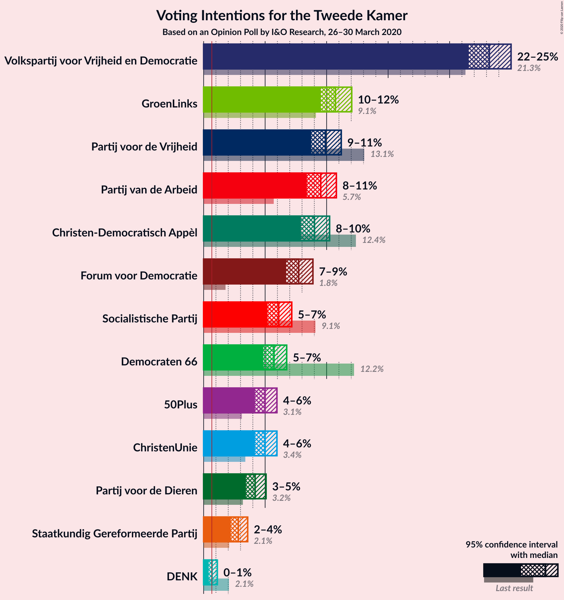
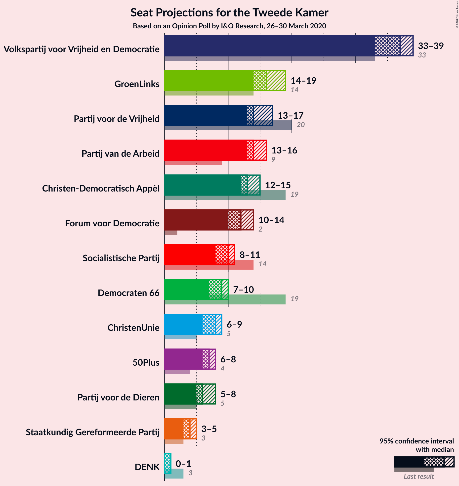
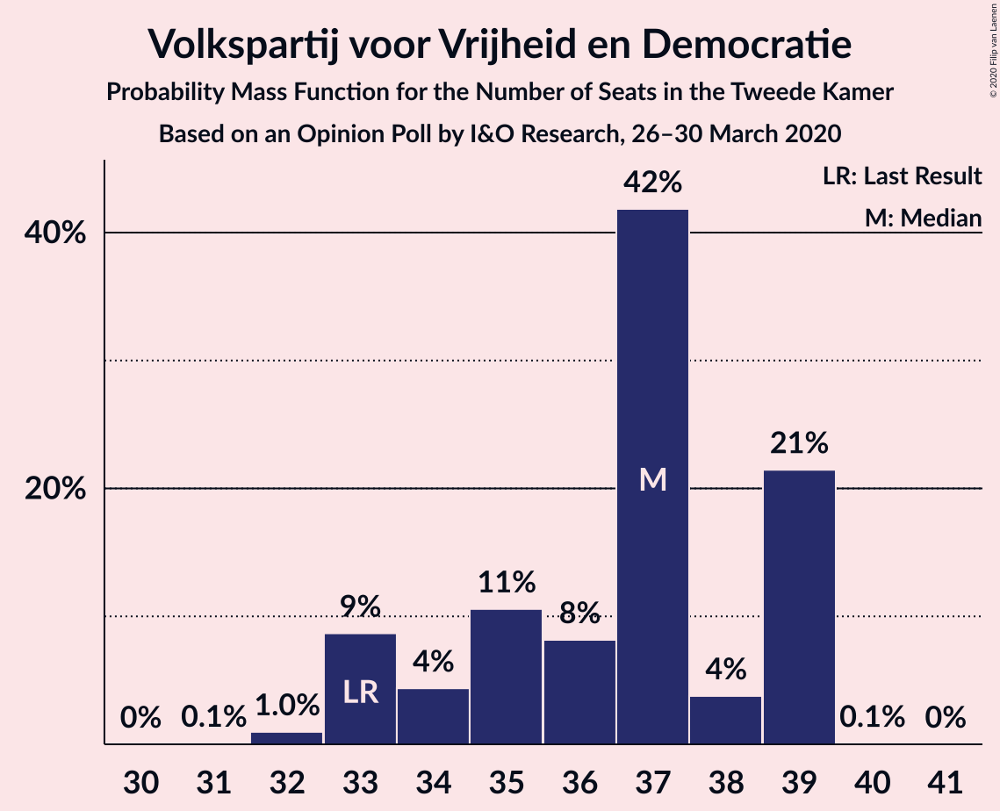
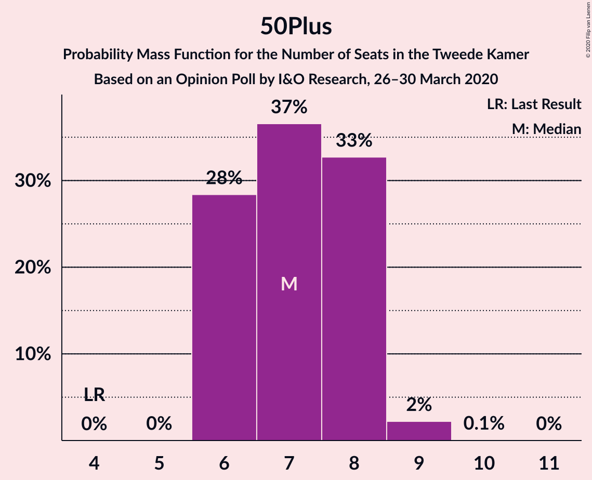
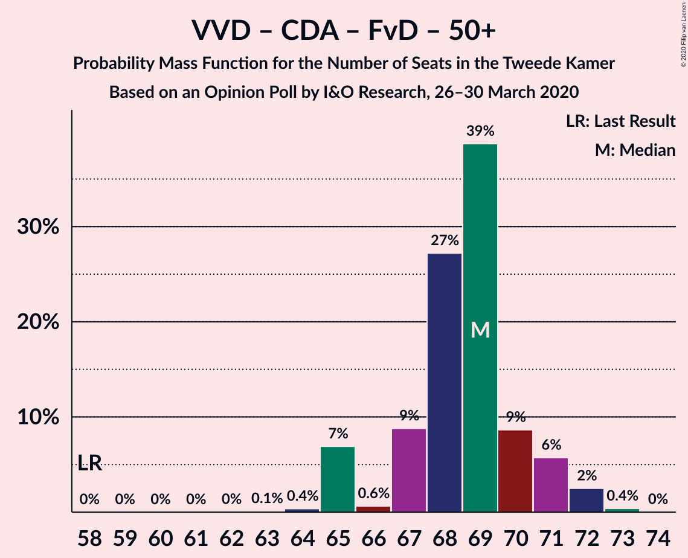
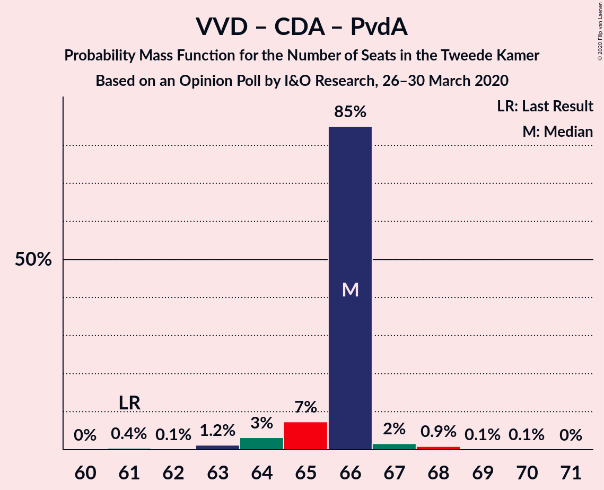
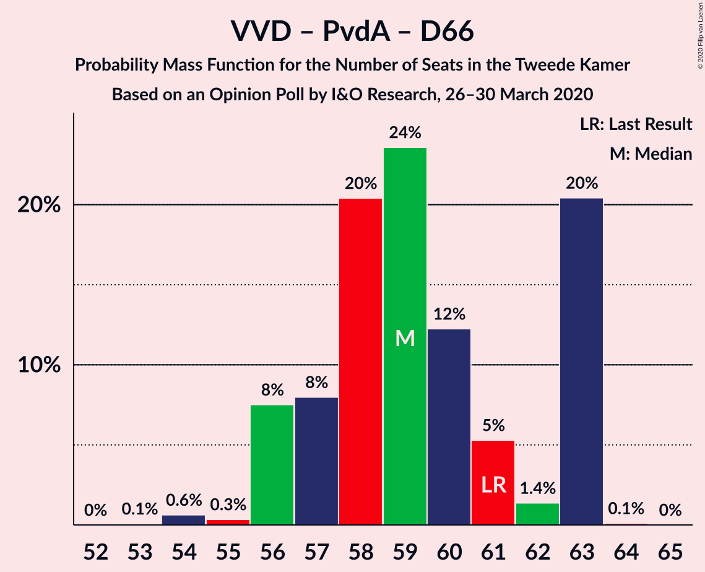
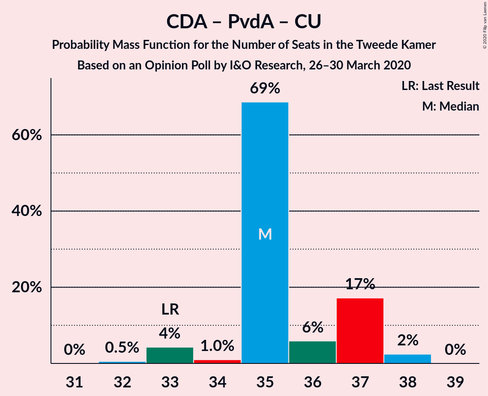

# Opinion Poll by I&O Research, 26–30 March 2020

<a href="#voting-intentions">Voting Intentions</a> | <a href="#seats">Seats</a> | <a href="#coalitions">Coalitions</a> | <a href="#technical-information">Technical Information</a>

## Voting Intentions

### Confidence Intervals

| Party | Last Result | Poll Result | 80% Confidence Interval | 90% Confidence Interval | 95% Confidence Interval | 99% Confidence Interval |
|:-----:|:-----------:|:-----------:|:-----------------------:|:-----------------------:|:-----------------------:|:-----------------------:|
| Volkspartij voor Vrijheid en Democratie | 21.3% | 24.0% | 22.8–25.1% |22.5–25.5% |22.3–25.7% |21.7–26.3% |
| GroenLinks | 9.1% | 10.6% | 9.8–11.5% |9.6–11.7% |9.4–11.9% |9.1–12.4% |
| Partij voor de Vrijheid | 13.1% | 10.0% | 9.2–10.8% |9.0–11.1% |8.8–11.3% |8.5–11.7% |
| Christen-Democratisch Appèl | 12.4% | 9.3% | 8.6–10.1% |8.4–10.4% |8.2–10.6% |7.8–11.0% |
| Partij van de Arbeid | 5.7% | 9.3% | 8.6–10.1% |8.4–10.4% |8.2–10.6% |7.8–11.0% |
| Forum voor Democratie | 1.8% | 8.0% | 7.3–8.7% |7.1–9.0% |7.0–9.2% |6.6–9.5% |
| Democraten 66 | 12.2% | 6.0% | 5.4–6.7% |5.2–6.9% |5.1–7.0% |4.8–7.4% |
| Socialistische Partij | 9.1% | 6.0% | 5.4–6.7% |5.2–6.9% |5.1–7.0% |4.8–7.4% |
| ChristenUnie | 3.4% | 4.7% | 4.1–5.3% |4.0–5.4% |3.9–5.6% |3.6–5.9% |
| 50Plus | 3.1% | 4.7% | 4.1–5.3% |4.0–5.4% |3.9–5.6% |3.6–5.9% |
| Partij voor de Dieren | 3.2% | 4.0% | 3.5–4.6% |3.4–4.8% |3.3–4.9% |3.1–5.2% |
| Staatkundig Gereformeerde Partij | 2.1% | 2.6% | 2.3–3.1% |2.1–3.3% |2.1–3.4% |1.9–3.6% |
| DENK | 2.1% | 0.7% | 0.5–1.0% |0.5–1.0% |0.4–1.1% |0.4–1.3% |

*Note:* The poll result column reflects the actual value used in the calculations. Published results may vary slightly, and in addition be rounded to fewer digits.

## Seats

### Confidence Intervals

| Party | Last Result | Median | 80% Confidence Interval | 90% Confidence Interval | 95% Confidence Interval | 99% Confidence Interval |
|:-----:|:-----------:|:------:|:-----------------------:|:-----------------------:|:-----------------------:|:-----------------------:|
| <a href="#volkspartij-voor-vrijheid-en-democratie">Volkspartij voor Vrijheid en Democratie</a> | 33 | 36 | 36–40 |36–40 |34–41 |33–41 |
| <a href="#groenlinks">GroenLinks</a> | 14 | 16 | 14–17 |14–17 |14–17 |14–17 |
| <a href="#partij-voor-de-vrijheid">Partij voor de Vrijheid</a> | 20 | 13 | 13–17 |13–17 |13–17 |13–18 |
| <a href="#christen-democratisch-appèl">Christen-Democratisch Appèl</a> | 19 | 14 | 13–15 |13–15 |13–15 |13–15 |
| <a href="#partij-van-de-arbeid">Partij van de Arbeid</a> | 9 | 14 | 14 |14 |14–15 |13–15 |
| <a href="#forum-voor-democratie">Forum voor Democratie</a> | 2 | 13 | 10–13 |10–13 |10–13 |10–14 |
| <a href="#democraten-66">Democraten 66</a> | 19 | 10 | 8–10 |8–10 |8–10 |7–11 |
| <a href="#socialistische-partij">Socialistische Partij</a> | 14 | 7 | 7–9 |7–9 |7–9 |7–10 |
| <a href="#christenunie">ChristenUnie</a> | 5 | 9 | 7–9 |6–9 |6–9 |6–9 |
| <a href="#50plus">50Plus</a> | 4 | 7 | 7–8 |6–8 |6–8 |6–8 |
| <a href="#partij-voor-de-dieren">Partij voor de Dieren</a> | 5 | 6 | 5–6 |5–6 |5–6 |5–8 |
| <a href="#staatkundig-gereformeerde-partij">Staatkundig Gereformeerde Partij</a> | 3 | 4 | 3–4 |3–4 |3–4 |3–5 |
| <a href="#denk">DENK</a> | 3 | 1 | 0–1 |0–1 |0–1 |0–1 |

### Volkspartij voor Vrijheid en Democratie

*For a full overview of the results for this party, see the [Volkspartij voor Vrijheid en Democratie](party-volkspartijvoorvrijheidendemocratie.html) page.*

| Number of Seats | Probability | Accumulated | Special Marks |
|:---------------:|:-----------:|:-----------:|:-------------:|
| 33 | 2% | 100% | Last Result |
| 34 | 1.0% | 98% |  |
| 35 | 0.4% | 97% |  |
| 36 | 60% | 97% | Median |
| 37 | 11% | 37% |  |
| 38 | 0.5% | 26% |  |
| 39 | 1.3% | 26% |  |
| 40 | 22% | 25% |  |
| 41 | 3% | 3% |  |
| 42 | 0% | 0% |  |

### GroenLinks

*For a full overview of the results for this party, see the [GroenLinks](party-groenlinks.html) page.*

| Number of Seats | Probability | Accumulated | Special Marks |
|:---------------:|:-----------:|:-----------:|:-------------:|
| 13 | 0.1% | 100% |  |
| 14 | 13% | 99.9% | Last Result |
| 15 | 0.6% | 86% |  |
| 16 | 61% | 86% | Median |
| 17 | 24% | 25% |  |
| 18 | 0.1% | 0.4% |  |
| 19 | 0.1% | 0.3% |  |
| 20 | 0.1% | 0.1% |  |
| 21 | 0% | 0% |  |

### Partij voor de Vrijheid

*For a full overview of the results for this party, see the [Partij voor de Vrijheid](party-partijvoordevrijheid.html) page.*

| Number of Seats | Probability | Accumulated | Special Marks |
|:---------------:|:-----------:|:-----------:|:-------------:|
| 13 | 60% | 100% | Median |
| 14 | 22% | 40% |  |
| 15 | 2% | 19% |  |
| 16 | 5% | 17% |  |
| 17 | 11% | 12% |  |
| 18 | 1.2% | 1.2% |  |
| 19 | 0% | 0% |  |
| 20 | 0% | 0% | Last Result |

### Christen-Democratisch Appèl

*For a full overview of the results for this party, see the [Christen-Democratisch Appèl](party-christen-democratischappèl.html) page.*

| Number of Seats | Probability | Accumulated | Special Marks |
|:---------------:|:-----------:|:-----------:|:-------------:|
| 11 | 0.1% | 100% |  |
| 12 | 0.1% | 99.9% |  |
| 13 | 23% | 99.8% |  |
| 14 | 64% | 76% | Median |
| 15 | 12% | 12% |  |
| 16 | 0.2% | 0.2% |  |
| 17 | 0% | 0% |  |
| 18 | 0% | 0% |  |
| 19 | 0% | 0% | Last Result |

### Partij van de Arbeid

*For a full overview of the results for this party, see the [Partij van de Arbeid](party-partijvandearbeid.html) page.*

| Number of Seats | Probability | Accumulated | Special Marks |
|:---------------:|:-----------:|:-----------:|:-------------:|
| 9 | 0% | 100% | Last Result |
| 10 | 0% | 100% |  |
| 11 | 0% | 100% |  |
| 12 | 0.1% | 100% |  |
| 13 | 1.2% | 99.9% |  |
| 14 | 94% | 98.7% | Median |
| 15 | 4% | 4% |  |
| 16 | 0.3% | 0.3% |  |
| 17 | 0% | 0% |  |

### Forum voor Democratie

*For a full overview of the results for this party, see the [Forum voor Democratie](party-forumvoordemocratie.html) page.*

| Number of Seats | Probability | Accumulated | Special Marks |
|:---------------:|:-----------:|:-----------:|:-------------:|
| 2 | 0% | 100% | Last Result |
| 3 | 0% | 100% |  |
| 4 | 0% | 100% |  |
| 5 | 0% | 100% |  |
| 6 | 0% | 100% |  |
| 7 | 0% | 100% |  |
| 8 | 0% | 100% |  |
| 9 | 0% | 100% |  |
| 10 | 12% | 100% |  |
| 11 | 2% | 88% |  |
| 12 | 25% | 87% |  |
| 13 | 60% | 62% | Median |
| 14 | 2% | 2% |  |
| 15 | 0.1% | 0.1% |  |
| 16 | 0% | 0% |  |

### Democraten 66

*For a full overview of the results for this party, see the [Democraten 66](party-democraten66.html) page.*

| Number of Seats | Probability | Accumulated | Special Marks |
|:---------------:|:-----------:|:-----------:|:-------------:|
| 7 | 2% | 100% |  |
| 8 | 26% | 98% |  |
| 9 | 11% | 72% |  |
| 10 | 60% | 61% | Median |
| 11 | 1.3% | 1.4% |  |
| 12 | 0.1% | 0.1% |  |
| 13 | 0% | 0% |  |
| 14 | 0% | 0% |  |
| 15 | 0% | 0% |  |
| 16 | 0% | 0% |  |
| 17 | 0% | 0% |  |
| 18 | 0% | 0% |  |
| 19 | 0% | 0% | Last Result |

### Socialistische Partij

*For a full overview of the results for this party, see the [Socialistische Partij](party-socialistischepartij.html) page.*

| Number of Seats | Probability | Accumulated | Special Marks |
|:---------------:|:-----------:|:-----------:|:-------------:|
| 7 | 61% | 100% | Median |
| 8 | 2% | 39% |  |
| 9 | 37% | 37% |  |
| 10 | 0.8% | 0.9% |  |
| 11 | 0.1% | 0.1% |  |
| 12 | 0% | 0% |  |
| 13 | 0% | 0% |  |
| 14 | 0% | 0% | Last Result |

### ChristenUnie

*For a full overview of the results for this party, see the [ChristenUnie](party-christenunie.html) page.*

| Number of Seats | Probability | Accumulated | Special Marks |
|:---------------:|:-----------:|:-----------:|:-------------:|
| 5 | 0.3% | 100% | Last Result |
| 6 | 5% | 99.7% |  |
| 7 | 23% | 95% |  |
| 8 | 12% | 72% |  |
| 9 | 61% | 61% | Median |
| 10 | 0% | 0% |  |

### 50Plus

*For a full overview of the results for this party, see the [50Plus](party-50plus.html) page.*

| Number of Seats | Probability | Accumulated | Special Marks |
|:---------------:|:-----------:|:-----------:|:-------------:|
| 4 | 0% | 100% | Last Result |
| 5 | 0% | 100% |  |
| 6 | 5% | 100% |  |
| 7 | 72% | 94% | Median |
| 8 | 22% | 22% |  |
| 9 | 0.2% | 0.2% |  |
| 10 | 0% | 0% |  |

### Partij voor de Dieren

*For a full overview of the results for this party, see the [Partij voor de Dieren](party-partijvoordedieren.html) page.*

| Number of Seats | Probability | Accumulated | Special Marks |
|:---------------:|:-----------:|:-----------:|:-------------:|
| 4 | 0.1% | 100% |  |
| 5 | 26% | 99.9% | Last Result |
| 6 | 72% | 73% | Median |
| 7 | 1.2% | 2% |  |
| 8 | 0.7% | 0.7% |  |
| 9 | 0% | 0% |  |

### Staatkundig Gereformeerde Partij

*For a full overview of the results for this party, see the [Staatkundig Gereformeerde Partij](party-staatkundiggereformeerdepartij.html) page.*

| Number of Seats | Probability | Accumulated | Special Marks |
|:---------------:|:-----------:|:-----------:|:-------------:|
| 2 | 0.1% | 100% |  |
| 3 | 32% | 99.9% | Last Result |
| 4 | 65% | 67% | Median |
| 5 | 2% | 2% |  |
| 6 | 0% | 0% |  |

### DENK

*For a full overview of the results for this party, see the [DENK](party-denk.html) page.*

| Number of Seats | Probability | Accumulated | Special Marks |
|:---------------:|:-----------:|:-----------:|:-------------:|
| 0 | 27% | 100% |  |
| 1 | 73% | 73% | Median |
| 2 | 0.1% | 0.1% |  |
| 3 | 0% | 0% | Last Result |

## Coalitions

### Confidence Intervals

| Coalition | Last Result | Median | Majority? | 80% Confidence Interval | 90% Confidence Interval | 95% Confidence Interval | 99% Confidence Interval |
|:---------:|:-----------:|:------:|:---------:|:-----------------------:|:-----------------------:|:-----------------------:|:-----------------------:|
| Volkspartij voor Vrijheid en Democratie – Partij voor de Vrijheid – Christen-Democratisch Appèl – Forum voor Democratie – Staatkundig Gereformeerde Partij | 77 | 80 | 100% | 80–82 | 80–83 | 80–87 | 79–87 |
| Volkspartij voor Vrijheid en Democratie – GroenLinks – Christen-Democratisch Appèl – Democraten 66 – ChristenUnie | 90 | 85 | 100% | 83–85 | 83–85 | 82–85 | 80–85 |
| Volkspartij voor Vrijheid en Democratie – Christen-Democratisch Appèl – Partij van de Arbeid – Democraten 66 – ChristenUnie | 85 | 83 | 99.9% | 82–83 | 81–83 | 80–84 | 77–84 |
| Volkspartij voor Vrijheid en Democratie – Partij voor de Vrijheid – Christen-Democratisch Appèl – Forum voor Democratie | 74 | 76 | 99.1% | 76–79 | 76–79 | 76–83 | 75–83 |
| Volkspartij voor Vrijheid en Democratie – Christen-Democratisch Appèl – Forum voor Democratie – 50Plus – Staatkundig Gereformeerde Partij | 61 | 74 | 25% | 72–76 | 72–76 | 72–77 | 71–77 |
| Volkspartij voor Vrijheid en Democratie – Christen-Democratisch Appèl – Forum voor Democratie – 50Plus | 58 | 70 | 0% | 69–73 | 69–73 | 68–73 | 66–73 |
| Volkspartij voor Vrijheid en Democratie – Christen-Democratisch Appèl – Forum voor Democratie – Staatkundig Gereformeerde Partij | 57 | 67 | 0% | 65–68 | 65–68 | 65–71 | 63–71 |
| Volkspartij voor Vrijheid en Democratie – Partij voor de Vrijheid – Christen-Democratisch Appèl | 72 | 63 | 0% | 63–69 | 63–69 | 63–71 | 62–71 |
| GroenLinks – Christen-Democratisch Appèl – Partij van de Arbeid – Democraten 66 – Socialistische Partij – ChristenUnie | 80 | 70 | 0% | 68–70 | 67–70 | 66–70 | 66–71 |
| Volkspartij voor Vrijheid en Democratie – Christen-Democratisch Appèl – Partij van de Arbeid | 61 | 64 | 0% | 64–67 | 64–67 | 63–70 | 61–70 |
| Volkspartij voor Vrijheid en Democratie – Christen-Democratisch Appèl – Democraten 66 – ChristenUnie | 76 | 69 | 0% | 68–69 | 67–69 | 65–69 | 63–69 |
| Volkspartij voor Vrijheid en Democratie – Christen-Democratisch Appèl – Forum voor Democratie | 54 | 63 | 0% | 62–65 | 62–65 | 61–67 | 59–67 |
| Volkspartij voor Vrijheid en Democratie – Partij van de Arbeid – Democraten 66 | 61 | 60 | 0% | 60–62 | 60–62 | 58–64 | 55–64 |
| Volkspartij voor Vrijheid en Democratie – Christen-Democratisch Appèl – Democraten 66 | 71 | 60 | 0% | 60–61 | 59–61 | 58–63 | 57–63 |
| GroenLinks – Christen-Democratisch Appèl – Partij van de Arbeid – Democraten 66 – ChristenUnie | 66 | 63 | 0% | 59–63 | 59–63 | 57–63 | 57–64 |
| Volkspartij voor Vrijheid en Democratie – Partij van de Arbeid | 42 | 50 | 0% | 50–54 | 50–54 | 48–56 | 47–56 |
| Volkspartij voor Vrijheid en Democratie – Christen-Democratisch Appèl | 52 | 50 | 0% | 50–53 | 50–53 | 49–55 | 47–55 |
| Christen-Democratisch Appèl – Partij van de Arbeid – Democraten 66 | 47 | 38 | 0% | 35–38 | 35–38 | 35–38 | 34–39 |
| Christen-Democratisch Appèl – Partij van de Arbeid – ChristenUnie | 33 | 37 | 0% | 34–37 | 34–37 | 34–37 | 33–37 |
| Christen-Democratisch Appèl – Partij van de Arbeid | 28 | 28 | 0% | 27–29 | 27–29 | 27–29 | 27–30 |
| Christen-Democratisch Appèl – Democraten 66 | 38 | 24 | 0% | 21–24 | 21–24 | 21–24 | 20–25 |

### Volkspartij voor Vrijheid en Democratie – Partij voor de Vrijheid – Christen-Democratisch Appèl – Forum voor Democratie – Staatkundig Gereformeerde Partij

| Number of Seats | Probability | Accumulated | Special Marks |
|:---------------:|:-----------:|:-----------:|:-------------:|
| 77 | 0.2% | 100% | Last Result |
| 78 | 0.2% | 99.8% |  |
| 79 | 0.6% | 99.6% |  |
| 80 | 61% | 99.1% | Median |
| 81 | 0.1% | 39% |  |
| 82 | 33% | 38% |  |
| 83 | 1.5% | 5% |  |
| 84 | 0.6% | 4% |  |
| 85 | 0.1% | 3% |  |
| 86 | 0.1% | 3% |  |
| 87 | 3% | 3% |  |
| 88 | 0% | 0% |  |

### Volkspartij voor Vrijheid en Democratie – GroenLinks – Christen-Democratisch Appèl – Democraten 66 – ChristenUnie

| Number of Seats | Probability | Accumulated | Special Marks |
|:---------------:|:-----------:|:-----------:|:-------------:|
| 78 | 0.5% | 100% |  |
| 79 | 0% | 99.5% |  |
| 80 | 0.9% | 99.5% |  |
| 81 | 0.4% | 98.6% |  |
| 82 | 1.1% | 98% |  |
| 83 | 15% | 97% |  |
| 84 | 0.5% | 82% |  |
| 85 | 81% | 81% | Median |
| 86 | 0.2% | 0.2% |  |
| 87 | 0% | 0% |  |
| 88 | 0% | 0% |  |
| 89 | 0% | 0% |  |
| 90 | 0% | 0% | Last Result |

### Volkspartij voor Vrijheid en Democratie – Christen-Democratisch Appèl – Partij van de Arbeid – Democraten 66 – ChristenUnie

| Number of Seats | Probability | Accumulated | Special Marks |
|:---------------:|:-----------:|:-----------:|:-------------:|
| 75 | 0.1% | 100% |  |
| 76 | 0% | 99.9% | Majority |
| 77 | 0.6% | 99.9% |  |
| 78 | 1.5% | 99.4% |  |
| 79 | 0.3% | 98% |  |
| 80 | 1.2% | 98% |  |
| 81 | 2% | 96% |  |
| 82 | 22% | 95% |  |
| 83 | 70% | 73% | Median |
| 84 | 3% | 3% |  |
| 85 | 0.1% | 0.1% | Last Result |
| 86 | 0% | 0% |  |

### Volkspartij voor Vrijheid en Democratie – Partij voor de Vrijheid – Christen-Democratisch Appèl – Forum voor Democratie

| Number of Seats | Probability | Accumulated | Special Marks |
|:---------------:|:-----------:|:-----------:|:-------------:|
| 73 | 0.1% | 100% |  |
| 74 | 0% | 99.8% | Last Result |
| 75 | 0.7% | 99.8% |  |
| 76 | 61% | 99.1% | Median, Majority |
| 77 | 0.1% | 39% |  |
| 78 | 2% | 38% |  |
| 79 | 33% | 36% |  |
| 80 | 0.2% | 4% |  |
| 81 | 0.1% | 3% |  |
| 82 | 0% | 3% |  |
| 83 | 3% | 3% |  |
| 84 | 0% | 0% |  |

### Volkspartij voor Vrijheid en Democratie – Christen-Democratisch Appèl – Forum voor Democratie – 50Plus – Staatkundig Gereformeerde Partij

| Number of Seats | Probability | Accumulated | Special Marks |
|:---------------:|:-----------:|:-----------:|:-------------:|
| 61 | 0% | 100% | Last Result |
| 62 | 0% | 100% |  |
| 63 | 0% | 100% |  |
| 64 | 0% | 100% |  |
| 65 | 0% | 100% |  |
| 66 | 0% | 100% |  |
| 67 | 0% | 100% |  |
| 68 | 0% | 100% |  |
| 69 | 0.1% | 100% |  |
| 70 | 0.1% | 99.9% |  |
| 71 | 2% | 99.8% |  |
| 72 | 12% | 98% |  |
| 73 | 1.2% | 86% |  |
| 74 | 60% | 85% | Median |
| 75 | 0.6% | 25% |  |
| 76 | 22% | 25% | Majority |
| 77 | 3% | 3% |  |
| 78 | 0.1% | 0.1% |  |
| 79 | 0% | 0% |  |

### Volkspartij voor Vrijheid en Democratie – Christen-Democratisch Appèl – Forum voor Democratie – 50Plus

| Number of Seats | Probability | Accumulated | Special Marks |
|:---------------:|:-----------:|:-----------:|:-------------:|
| 58 | 0% | 100% | Last Result |
| 59 | 0% | 100% |  |
| 60 | 0% | 100% |  |
| 61 | 0% | 100% |  |
| 62 | 0% | 100% |  |
| 63 | 0% | 100% |  |
| 64 | 0% | 100% |  |
| 65 | 0.1% | 100% |  |
| 66 | 1.0% | 99.9% |  |
| 67 | 0.9% | 98.9% |  |
| 68 | 1.3% | 98% |  |
| 69 | 12% | 97% |  |
| 70 | 59% | 85% | Median |
| 71 | 0.5% | 25% |  |
| 72 | 0.4% | 25% |  |
| 73 | 24% | 24% |  |
| 74 | 0.1% | 0.1% |  |
| 75 | 0% | 0% |  |

### Volkspartij voor Vrijheid en Democratie – Christen-Democratisch Appèl – Forum voor Democratie – Staatkundig Gereformeerde Partij

| Number of Seats | Probability | Accumulated | Special Marks |
|:---------------:|:-----------:|:-----------:|:-------------:|
| 57 | 0% | 100% | Last Result |
| 58 | 0% | 100% |  |
| 59 | 0% | 100% |  |
| 60 | 0% | 100% |  |
| 61 | 0% | 100% |  |
| 62 | 0.1% | 100% |  |
| 63 | 0.5% | 99.9% |  |
| 64 | 0.1% | 99.4% |  |
| 65 | 13% | 99.3% |  |
| 66 | 1.5% | 87% |  |
| 67 | 59% | 85% | Median |
| 68 | 22% | 26% |  |
| 69 | 0.2% | 3% |  |
| 70 | 0.2% | 3% |  |
| 71 | 3% | 3% |  |
| 72 | 0% | 0% |  |

### Volkspartij voor Vrijheid en Democratie – Partij voor de Vrijheid – Christen-Democratisch Appèl

| Number of Seats | Probability | Accumulated | Special Marks |
|:---------------:|:-----------:|:-----------:|:-------------:|
| 62 | 1.3% | 100% |  |
| 63 | 60% | 98.6% | Median |
| 64 | 0.4% | 39% |  |
| 65 | 0.5% | 39% |  |
| 66 | 0.7% | 38% |  |
| 67 | 22% | 37% |  |
| 68 | 1.5% | 15% |  |
| 69 | 10% | 14% |  |
| 70 | 0.1% | 3% |  |
| 71 | 3% | 3% |  |
| 72 | 0% | 0% | Last Result |

### GroenLinks – Christen-Democratisch Appèl – Partij van de Arbeid – Democraten 66 – Socialistische Partij – ChristenUnie

| Number of Seats | Probability | Accumulated | Special Marks |
|:---------------:|:-----------:|:-----------:|:-------------:|
| 65 | 0.1% | 100% |  |
| 66 | 4% | 99.9% |  |
| 67 | 0.9% | 96% |  |
| 68 | 22% | 95% |  |
| 69 | 11% | 73% |  |
| 70 | 60% | 62% | Median |
| 71 | 2% | 2% |  |
| 72 | 0.1% | 0.3% |  |
| 73 | 0.1% | 0.2% |  |
| 74 | 0% | 0% |  |
| 75 | 0% | 0% |  |
| 76 | 0% | 0% | Majority |
| 77 | 0% | 0% |  |
| 78 | 0% | 0% |  |
| 79 | 0% | 0% |  |
| 80 | 0% | 0% | Last Result |

### Volkspartij voor Vrijheid en Democratie – Christen-Democratisch Appèl – Partij van de Arbeid

| Number of Seats | Probability | Accumulated | Special Marks |
|:---------------:|:-----------:|:-----------:|:-------------:|
| 61 | 1.2% | 100% | Last Result |
| 62 | 1.1% | 98.7% |  |
| 63 | 0.5% | 98% |  |
| 64 | 60% | 97% | Median |
| 65 | 0.7% | 37% |  |
| 66 | 12% | 36% |  |
| 67 | 22% | 25% |  |
| 68 | 0.3% | 3% |  |
| 69 | 0.1% | 3% |  |
| 70 | 3% | 3% |  |
| 71 | 0% | 0% |  |

### Volkspartij voor Vrijheid en Democratie – Christen-Democratisch Appèl – Democraten 66 – ChristenUnie

| Number of Seats | Probability | Accumulated | Special Marks |
|:---------------:|:-----------:|:-----------:|:-------------:|
| 61 | 0.1% | 100% |  |
| 62 | 0% | 99.9% |  |
| 63 | 1.0% | 99.9% |  |
| 64 | 0.3% | 99.0% |  |
| 65 | 1.3% | 98.7% |  |
| 66 | 1.2% | 97% |  |
| 67 | 2% | 96% |  |
| 68 | 22% | 94% |  |
| 69 | 72% | 73% | Median |
| 70 | 0.1% | 0.2% |  |
| 71 | 0.1% | 0.1% |  |
| 72 | 0% | 0% |  |
| 73 | 0% | 0% |  |
| 74 | 0% | 0% |  |
| 75 | 0% | 0% |  |
| 76 | 0% | 0% | Last Result, Majority |

### Volkspartij voor Vrijheid en Democratie – Christen-Democratisch Appèl – Forum voor Democratie

| Number of Seats | Probability | Accumulated | Special Marks |
|:---------------:|:-----------:|:-----------:|:-------------:|
| 54 | 0% | 100% | Last Result |
| 55 | 0% | 100% |  |
| 56 | 0% | 100% |  |
| 57 | 0% | 100% |  |
| 58 | 0.1% | 100% |  |
| 59 | 0.5% | 99.9% |  |
| 60 | 1.1% | 99.4% |  |
| 61 | 2% | 98% |  |
| 62 | 11% | 97% |  |
| 63 | 60% | 85% | Median |
| 64 | 0.2% | 25% |  |
| 65 | 22% | 25% |  |
| 66 | 0.2% | 3% |  |
| 67 | 3% | 3% |  |
| 68 | 0% | 0% |  |

### Volkspartij voor Vrijheid en Democratie – Partij van de Arbeid – Democraten 66

| Number of Seats | Probability | Accumulated | Special Marks |
|:---------------:|:-----------:|:-----------:|:-------------:|
| 55 | 1.0% | 100% |  |
| 56 | 0.1% | 99.0% |  |
| 57 | 0.5% | 98.9% |  |
| 58 | 2% | 98% |  |
| 59 | 0.1% | 96% |  |
| 60 | 71% | 96% | Median |
| 61 | 0.3% | 25% | Last Result |
| 62 | 22% | 25% |  |
| 63 | 0.3% | 3% |  |
| 64 | 3% | 3% |  |
| 65 | 0% | 0% |  |

### Volkspartij voor Vrijheid en Democratie – Christen-Democratisch Appèl – Democraten 66

| Number of Seats | Probability | Accumulated | Special Marks |
|:---------------:|:-----------:|:-----------:|:-------------:|
| 55 | 0.1% | 100% |  |
| 56 | 0% | 99.9% |  |
| 57 | 2% | 99.9% |  |
| 58 | 1.5% | 98% |  |
| 59 | 2% | 96% |  |
| 60 | 60% | 95% | Median |
| 61 | 32% | 35% |  |
| 62 | 0.2% | 3% |  |
| 63 | 3% | 3% |  |
| 64 | 0% | 0% |  |
| 65 | 0% | 0% |  |
| 66 | 0% | 0% |  |
| 67 | 0% | 0% |  |
| 68 | 0% | 0% |  |
| 69 | 0% | 0% |  |
| 70 | 0% | 0% |  |
| 71 | 0% | 0% | Last Result |

### GroenLinks – Christen-Democratisch Appèl – Partij van de Arbeid – Democraten 66 – ChristenUnie

| Number of Seats | Probability | Accumulated | Special Marks |
|:---------------:|:-----------:|:-----------:|:-------------:|
| 56 | 0% | 100% |  |
| 57 | 4% | 99.9% |  |
| 58 | 1.1% | 96% |  |
| 59 | 22% | 95% |  |
| 60 | 11% | 73% |  |
| 61 | 1.2% | 62% |  |
| 62 | 0.1% | 61% |  |
| 63 | 59% | 61% | Median |
| 64 | 1.2% | 1.3% |  |
| 65 | 0.1% | 0.1% |  |
| 66 | 0% | 0% | Last Result |

### Volkspartij voor Vrijheid en Democratie – Partij van de Arbeid

| Number of Seats | Probability | Accumulated | Special Marks |
|:---------------:|:-----------:|:-----------:|:-------------:|
| 42 | 0% | 100% | Last Result |
| 43 | 0% | 100% |  |
| 44 | 0% | 100% |  |
| 45 | 0% | 100% |  |
| 46 | 0% | 100% |  |
| 47 | 2% | 100% |  |
| 48 | 0.4% | 98% |  |
| 49 | 0.2% | 97% |  |
| 50 | 60% | 97% | Median |
| 51 | 11% | 38% |  |
| 52 | 0.5% | 26% |  |
| 53 | 1.0% | 26% |  |
| 54 | 22% | 25% |  |
| 55 | 0.1% | 3% |  |
| 56 | 3% | 3% |  |
| 57 | 0% | 0% |  |

### Volkspartij voor Vrijheid en Democratie – Christen-Democratisch Appèl

| Number of Seats | Probability | Accumulated | Special Marks |
|:---------------:|:-----------:|:-----------:|:-------------:|
| 47 | 1.2% | 100% |  |
| 48 | 0.6% | 98.7% |  |
| 49 | 1.2% | 98% |  |
| 50 | 60% | 97% | Median |
| 51 | 0.7% | 37% |  |
| 52 | 11% | 36% | Last Result |
| 53 | 22% | 25% |  |
| 54 | 0% | 3% |  |
| 55 | 3% | 3% |  |
| 56 | 0% | 0% |  |

### Christen-Democratisch Appèl – Partij van de Arbeid – Democraten 66

| Number of Seats | Probability | Accumulated | Special Marks |
|:---------------:|:-----------:|:-----------:|:-------------:|
| 34 | 2% | 100% |  |
| 35 | 22% | 98% |  |
| 36 | 1.2% | 77% |  |
| 37 | 4% | 75% |  |
| 38 | 70% | 72% | Median |
| 39 | 2% | 2% |  |
| 40 | 0.3% | 0.3% |  |
| 41 | 0% | 0.1% |  |
| 42 | 0% | 0% |  |
| 43 | 0% | 0% |  |
| 44 | 0% | 0% |  |
| 45 | 0% | 0% |  |
| 46 | 0% | 0% |  |
| 47 | 0% | 0% | Last Result |

### Christen-Democratisch Appèl – Partij van de Arbeid – ChristenUnie

| Number of Seats | Probability | Accumulated | Special Marks |
|:---------------:|:-----------:|:-----------:|:-------------:|
| 32 | 0.1% | 100% |  |
| 33 | 0.6% | 99.8% | Last Result |
| 34 | 23% | 99.3% |  |
| 35 | 4% | 76% |  |
| 36 | 2% | 73% |  |
| 37 | 71% | 71% | Median |
| 38 | 0.1% | 0.1% |  |
| 39 | 0% | 0% |  |

### Christen-Democratisch Appèl – Partij van de Arbeid

| Number of Seats | Probability | Accumulated | Special Marks |
|:---------------:|:-----------:|:-----------:|:-------------:|
| 25 | 0.2% | 100% |  |
| 26 | 0.2% | 99.8% |  |
| 27 | 23% | 99.7% |  |
| 28 | 62% | 76% | Last Result, Median |
| 29 | 14% | 15% |  |
| 30 | 0.9% | 1.0% |  |
| 31 | 0% | 0.1% |  |
| 32 | 0% | 0% |  |

### Christen-Democratisch Appèl – Democraten 66

| Number of Seats | Probability | Accumulated | Special Marks |
|:---------------:|:-----------:|:-----------:|:-------------:|
| 20 | 2% | 100% |  |
| 21 | 22% | 98% |  |
| 22 | 3% | 76% |  |
| 23 | 1.5% | 73% |  |
| 24 | 70% | 72% | Median |
| 25 | 1.4% | 1.4% |  |
| 26 | 0.1% | 0.1% |  |
| 27 | 0% | 0% |  |
| 28 | 0% | 0% |  |
| 29 | 0% | 0% |  |
| 30 | 0% | 0% |  |
| 31 | 0% | 0% |  |
| 32 | 0% | 0% |  |
| 33 | 0% | 0% |  |
| 34 | 0% | 0% |  |
| 35 | 0% | 0% |  |
| 36 | 0% | 0% |  |
| 37 | 0% | 0% |  |
| 38 | 0% | 0% | Last Result |

## Technical Information

### Opinion Poll

+ **Polling firm:** I&O Research
+ **Commissioner(s):** —
+ **Fieldwork period:** 26–30 March 2020

### Calculations

+ **Sample size:** 2342
+ **Simulations done:** 131,072
+ **Error estimate:** 3.41%

