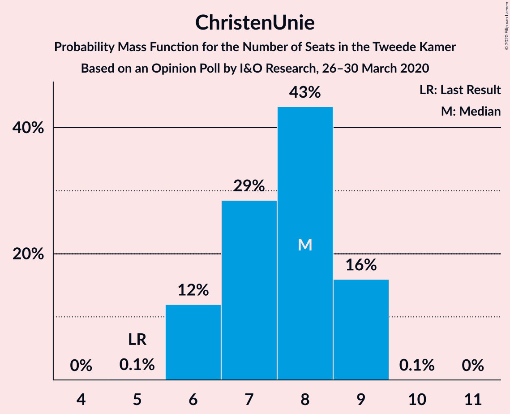
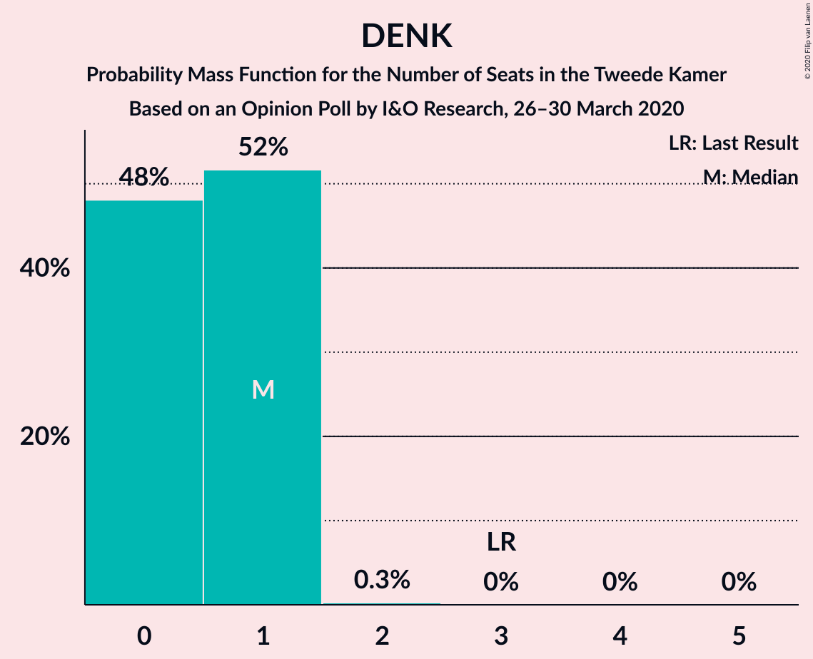
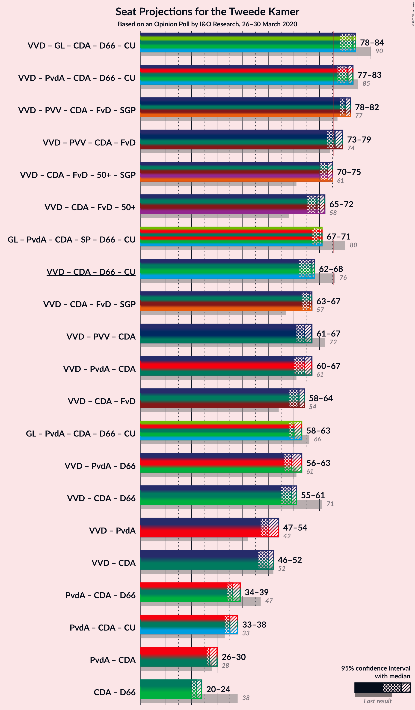
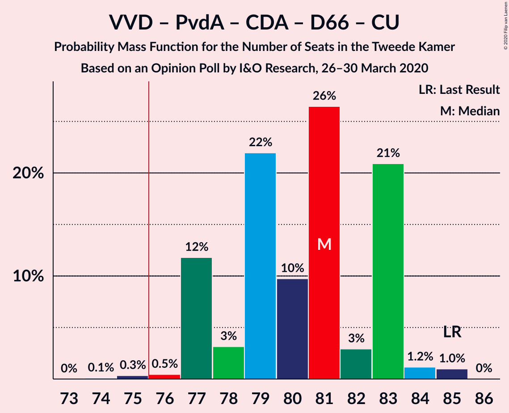
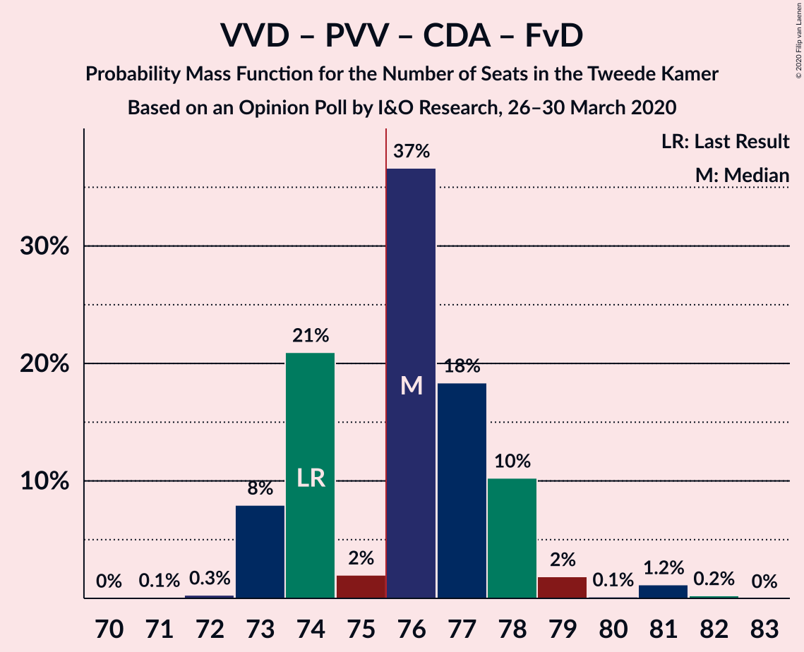
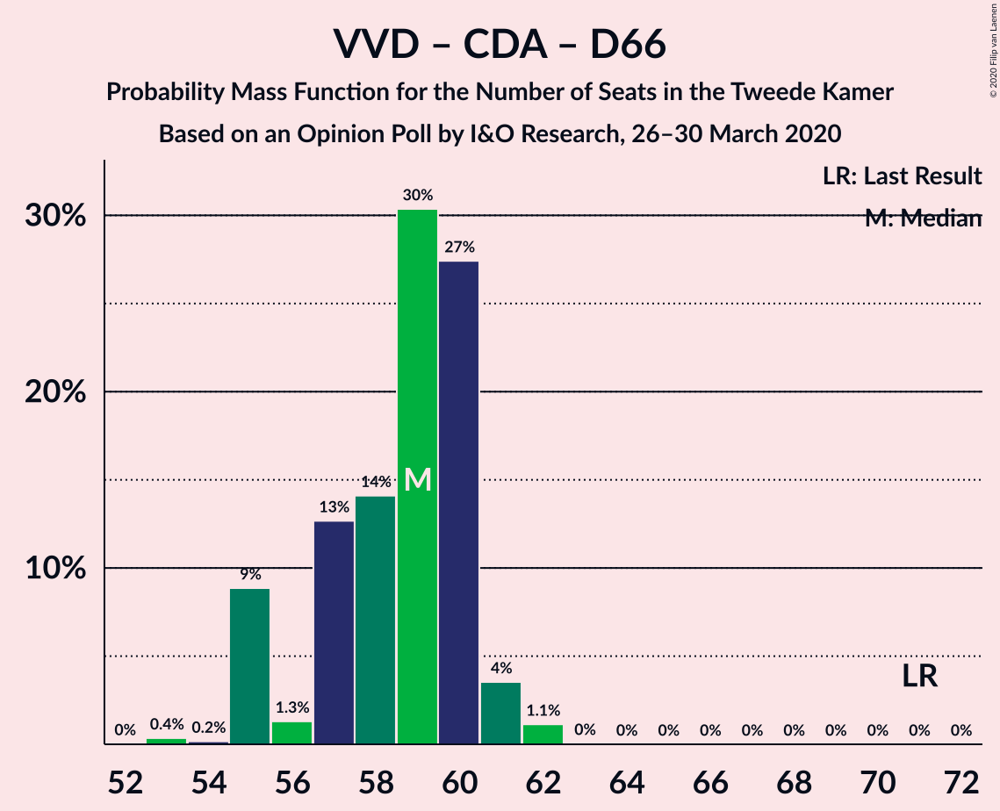

# Opinion Poll by I&O Research, 26–30 March 2020

<a href="#voting-intentions">Voting Intentions</a> | <a href="#seats">Seats</a> | <a href="#coalitions">Coalitions</a> | <a href="#technical-information">Technical Information</a>

## Voting Intentions

### Confidence Intervals

| Party | Last Result | Poll Result | 80% Confidence Interval | 90% Confidence Interval | 95% Confidence Interval | 99% Confidence Interval |
|:-----:|:-----------:|:-----------:|:-----------------------:|:-----------------------:|:-----------------------:|:-----------------------:|
| Volkspartij voor Vrijheid en Democratie | 21.3% | 23.2% | 22.1–24.4% |21.8–24.7% |21.6–25.0% |21.0–25.5% |
| GroenLinks | 9.1% | 10.7% | 9.9–11.6% |9.7–11.8% |9.5–12.0% |9.2–12.5% |
| Partij voor de Vrijheid | 13.1% | 9.9% | 9.1–10.7% |8.9–11.0% |8.7–11.2% |8.4–11.6% |
| Partij van de Arbeid | 5.7% | 9.5% | 8.8–10.3% |8.6–10.6% |8.4–10.8% |8.0–11.2% |
| Christen-Democratisch Appèl | 12.4% | 9.0% | 8.3–9.8% |8.1–10.0% |7.9–10.2% |7.6–10.6% |
| Forum voor Democratie | 1.8% | 7.7% | 7.1–8.5% |6.9–8.7% |6.7–8.9% |6.4–9.3% |
| Socialistische Partij | 9.1% | 6.1% | 5.5–6.8% |5.3–7.0% |5.2–7.2% |4.9–7.5% |
| Democraten 66 | 12.2% | 5.7% | 5.1–6.4% |5.0–6.6% |4.8–6.8% |4.6–7.1% |
| ChristenUnie | 3.4% | 5.0% | 4.5–5.6% |4.3–5.8% |4.2–6.0% |3.9–6.3% |
| 50Plus | 3.1% | 5.0% | 4.5–5.6% |4.3–5.8% |4.2–6.0% |3.9–6.3% |
| Partij voor de Dieren | 3.2% | 4.2% | 3.7–4.8% |3.6–4.9% |3.4–5.1% |3.2–5.4% |
| Staatkundig Gereformeerde Partij | 2.1% | 2.8% | 2.4–3.3% |2.3–3.5% |2.2–3.6% |2.0–3.8% |
| DENK | 2.1% | 0.7% | 0.5–1.0% |0.5–1.0% |0.4–1.1% |0.4–1.3% |

*Note:* The poll result column reflects the actual value used in the calculations. Published results may vary slightly, and in addition be rounded to fewer digits.

## Seats

### Confidence Intervals

| Party | Last Result | Median | 80% Confidence Interval | 90% Confidence Interval | 95% Confidence Interval | 99% Confidence Interval |
|:-----:|:-----------:|:------:|:-----------------------:|:-----------------------:|:-----------------------:|:-----------------------:|
| <a href="#volkspartij-voor-vrijheid-en-democratie">Volkspartij voor Vrijheid en Democratie</a> | 33 | 37 | 33–39 |33–39 |33–39 |33–39 |
| <a href="#groenlinks">GroenLinks</a> | 14 | 16 | 15–19 |14–19 |14–19 |13–19 |
| <a href="#partij-voor-de-vrijheid">Partij voor de Vrijheid</a> | 20 | 14 | 13–16 |13–17 |13–17 |13–18 |
| <a href="#partij-van-de-arbeid">Partij van de Arbeid</a> | 9 | 14 | 14–15 |13–15 |13–16 |12–16 |
| <a href="#christen-democratisch-appèl">Christen-Democratisch Appèl</a> | 19 | 13 | 12–15 |12–15 |12–15 |12–16 |
| <a href="#forum-voor-democratie">Forum voor Democratie</a> | 2 | 12 | 11–12 |11–13 |11–13 |10–14 |
| <a href="#socialistische-partij">Socialistische Partij</a> | 14 | 9 | 8–11 |8–11 |8–11 |7–11 |
| <a href="#democraten-66">Democraten 66</a> | 19 | 9 | 7–9 |7–9 |7–10 |7–11 |
| <a href="#christenunie">ChristenUnie</a> | 5 | 8 | 7–9 |6–9 |6–9 |6–9 |
| <a href="#50plus">50Plus</a> | 4 | 7 | 6–7 |6–8 |6–8 |6–8 |
| <a href="#partij-voor-de-dieren">Partij voor de Dieren</a> | 5 | 6 | 5–7 |5–7 |5–7 |5–7 |
| <a href="#staatkundig-gereformeerde-partij">Staatkundig Gereformeerde Partij</a> | 3 | 4 | 3–5 |3–5 |3–5 |3–5 |
| <a href="#denk">DENK</a> | 3 | 0 | 0–1 |0–1 |0–1 |0–1 |

### Volkspartij voor Vrijheid en Democratie

*For a full overview of the results for this party, see the [Volkspartij voor Vrijheid en Democratie](party-volkspartijvoorvrijheidendemocratie.html) page.*

| Number of Seats | Probability | Accumulated | Special Marks |
|:---------------:|:-----------:|:-----------:|:-------------:|
| 32 | 0.2% | 100% |  |
| 33 | 10% | 99.8% | Last Result |
| 34 | 4% | 89% |  |
| 35 | 16% | 86% |  |
| 36 | 8% | 70% |  |
| 37 | 30% | 63% | Median |
| 38 | 0.4% | 32% |  |
| 39 | 32% | 32% |  |
| 40 | 0% | 0% |  |

### GroenLinks

*For a full overview of the results for this party, see the [GroenLinks](party-groenlinks.html) page.*

| Number of Seats | Probability | Accumulated | Special Marks |
|:---------------:|:-----------:|:-----------:|:-------------:|
| 13 | 2% | 100% |  |
| 14 | 4% | 98% | Last Result |
| 15 | 13% | 95% |  |
| 16 | 62% | 81% | Median |
| 17 | 2% | 19% |  |
| 18 | 0.9% | 17% |  |
| 19 | 16% | 16% |  |
| 20 | 0% | 0% |  |

### Partij voor de Vrijheid

*For a full overview of the results for this party, see the [Partij voor de Vrijheid](party-partijvoordevrijheid.html) page.*

| Number of Seats | Probability | Accumulated | Special Marks |
|:---------------:|:-----------:|:-----------:|:-------------:|
| 12 | 0.1% | 100% |  |
| 13 | 32% | 99.9% |  |
| 14 | 18% | 67% | Median |
| 15 | 34% | 49% |  |
| 16 | 6% | 15% |  |
| 17 | 9% | 10% |  |
| 18 | 0.3% | 0.5% |  |
| 19 | 0.2% | 0.2% |  |
| 20 | 0% | 0% | Last Result |

### Partij van de Arbeid

*For a full overview of the results for this party, see the [Partij van de Arbeid](party-partijvandearbeid.html) page.*

| Number of Seats | Probability | Accumulated | Special Marks |
|:---------------:|:-----------:|:-----------:|:-------------:|
| 9 | 0% | 100% | Last Result |
| 10 | 0% | 100% |  |
| 11 | 0% | 100% |  |
| 12 | 0.7% | 100% |  |
| 13 | 6% | 99.3% |  |
| 14 | 45% | 93% | Median |
| 15 | 44% | 49% |  |
| 16 | 4% | 4% |  |
| 17 | 0.2% | 0.3% |  |
| 18 | 0.1% | 0.1% |  |
| 19 | 0% | 0% |  |

### Christen-Democratisch Appèl

*For a full overview of the results for this party, see the [Christen-Democratisch Appèl](party-christen-democratischappèl.html) page.*

| Number of Seats | Probability | Accumulated | Special Marks |
|:---------------:|:-----------:|:-----------:|:-------------:|
| 11 | 0.1% | 100% |  |
| 12 | 32% | 99.9% |  |
| 13 | 24% | 68% | Median |
| 14 | 32% | 43% |  |
| 15 | 10% | 11% |  |
| 16 | 0.7% | 0.7% |  |
| 17 | 0% | 0% |  |
| 18 | 0% | 0% |  |
| 19 | 0% | 0% | Last Result |

### Forum voor Democratie

*For a full overview of the results for this party, see the [Forum voor Democratie](party-forumvoordemocratie.html) page.*

| Number of Seats | Probability | Accumulated | Special Marks |
|:---------------:|:-----------:|:-----------:|:-------------:|
| 2 | 0% | 100% | Last Result |
| 3 | 0% | 100% |  |
| 4 | 0% | 100% |  |
| 5 | 0% | 100% |  |
| 6 | 0% | 100% |  |
| 7 | 0% | 100% |  |
| 8 | 0% | 100% |  |
| 9 | 0.1% | 100% |  |
| 10 | 1.4% | 99.9% |  |
| 11 | 27% | 98% |  |
| 12 | 62% | 72% | Median |
| 13 | 8% | 10% |  |
| 14 | 2% | 2% |  |
| 15 | 0% | 0% |  |

### Socialistische Partij

*For a full overview of the results for this party, see the [Socialistische Partij](party-socialistischepartij.html) page.*

| Number of Seats | Probability | Accumulated | Special Marks |
|:---------------:|:-----------:|:-----------:|:-------------:|
| 6 | 0.1% | 100% |  |
| 7 | 2% | 99.9% |  |
| 8 | 16% | 98% |  |
| 9 | 35% | 82% | Median |
| 10 | 36% | 47% |  |
| 11 | 11% | 11% |  |
| 12 | 0.1% | 0.1% |  |
| 13 | 0% | 0% |  |
| 14 | 0% | 0% | Last Result |

### Democraten 66

*For a full overview of the results for this party, see the [Democraten 66](party-democraten66.html) page.*

| Number of Seats | Probability | Accumulated | Special Marks |
|:---------------:|:-----------:|:-----------:|:-------------:|
| 7 | 16% | 100% |  |
| 8 | 18% | 84% |  |
| 9 | 64% | 67% | Median |
| 10 | 0.6% | 3% |  |
| 11 | 2% | 2% |  |
| 12 | 0% | 0% |  |
| 13 | 0% | 0% |  |
| 14 | 0% | 0% |  |
| 15 | 0% | 0% |  |
| 16 | 0% | 0% |  |
| 17 | 0% | 0% |  |
| 18 | 0% | 0% |  |
| 19 | 0% | 0% | Last Result |

### ChristenUnie

*For a full overview of the results for this party, see the [ChristenUnie](party-christenunie.html) page.*

| Number of Seats | Probability | Accumulated | Special Marks |
|:---------------:|:-----------:|:-----------:|:-------------:|
| 5 | 0.2% | 100% | Last Result |
| 6 | 7% | 99.8% |  |
| 7 | 9% | 92% |  |
| 8 | 62% | 83% | Median |
| 9 | 21% | 21% |  |
| 10 | 0.1% | 0.1% |  |
| 11 | 0% | 0% |  |

### 50Plus

*For a full overview of the results for this party, see the [50Plus](party-50plus.html) page.*

| Number of Seats | Probability | Accumulated | Special Marks |
|:---------------:|:-----------:|:-----------:|:-------------:|
| 4 | 0% | 100% | Last Result |
| 5 | 0% | 100% |  |
| 6 | 43% | 100% |  |
| 7 | 49% | 57% | Median |
| 8 | 7% | 8% |  |
| 9 | 0.4% | 0.4% |  |
| 10 | 0% | 0.1% |  |
| 11 | 0% | 0% |  |

### Partij voor de Dieren

*For a full overview of the results for this party, see the [Partij voor de Dieren](party-partijvoordedieren.html) page.*

| Number of Seats | Probability | Accumulated | Special Marks |
|:---------------:|:-----------:|:-----------:|:-------------:|
| 4 | 0.4% | 100% |  |
| 5 | 10% | 99.6% | Last Result |
| 6 | 67% | 90% | Median |
| 7 | 22% | 22% |  |
| 8 | 0.5% | 0.5% |  |
| 9 | 0% | 0% |  |

### Staatkundig Gereformeerde Partij

*For a full overview of the results for this party, see the [Staatkundig Gereformeerde Partij](party-staatkundiggereformeerdepartij.html) page.*

| Number of Seats | Probability | Accumulated | Special Marks |
|:---------------:|:-----------:|:-----------:|:-------------:|
| 3 | 20% | 100% | Last Result |
| 4 | 67% | 79% | Median |
| 5 | 12% | 12% |  |
| 6 | 0.1% | 0.1% |  |
| 7 | 0% | 0% |  |

### DENK

*For a full overview of the results for this party, see the [DENK](party-denk.html) page.*

| Number of Seats | Probability | Accumulated | Special Marks |
|:---------------:|:-----------:|:-----------:|:-------------:|
| 0 | 57% | 100% | Median |
| 1 | 43% | 43% |  |
| 2 | 0.2% | 0.2% |  |
| 3 | 0% | 0% | Last Result |

## Coalitions

### Confidence Intervals

| Coalition | Last Result | Median | Majority? | 80% Confidence Interval | 90% Confidence Interval | 95% Confidence Interval | 99% Confidence Interval |
|:---------:|:-----------:|:------:|:---------:|:-----------------------:|:-----------------------:|:-----------------------:|:-----------------------:|
| Volkspartij voor Vrijheid en Democratie – GroenLinks – Christen-Democratisch Appèl – Democraten 66 – ChristenUnie | 90 | 83 | 100% | 81–84 | 80–84 | 79–84 | 78–85 |
| Volkspartij voor Vrijheid en Democratie – Partij voor de Vrijheid – Christen-Democratisch Appèl – Forum voor Democratie – Staatkundig Gereformeerde Partij | 77 | 80 | 100% | 78–81 | 78–82 | 78–83 | 77–85 |
| Volkspartij voor Vrijheid en Democratie – Partij van de Arbeid – Christen-Democratisch Appèl – Democraten 66 – ChristenUnie | 85 | 81 | 99.8% | 77–83 | 77–83 | 77–83 | 77–84 |
| Volkspartij voor Vrijheid en Democratie – Partij voor de Vrijheid – Christen-Democratisch Appèl – Forum voor Democratie | 74 | 76 | 87% | 73–78 | 73–78 | 73–79 | 73–81 |
| Volkspartij voor Vrijheid en Democratie – Christen-Democratisch Appèl – Forum voor Democratie – 50Plus – Staatkundig Gereformeerde Partij | 61 | 73 | 0.7% | 70–73 | 70–74 | 70–74 | 70–76 |
| GroenLinks – Partij van de Arbeid – Christen-Democratisch Appèl – Socialistische Partij – Democraten 66 – ChristenUnie | 80 | 70 | 0% | 69–71 | 68–71 | 68–71 | 66–73 |
| Volkspartij voor Vrijheid en Democratie – Christen-Democratisch Appèl – Forum voor Democratie – 50Plus | 58 | 69 | 0% | 65–70 | 65–70 | 65–70 | 65–72 |
| Volkspartij voor Vrijheid en Democratie – Christen-Democratisch Appèl – Democraten 66 – ChristenUnie | 76 | 67 | 0% | 63–68 | 63–68 | 63–68 | 62–69 |
| Volkspartij voor Vrijheid en Democratie – Christen-Democratisch Appèl – Forum voor Democratie – Staatkundig Gereformeerde Partij | 57 | 66 | 0% | 63–67 | 63–67 | 63–67 | 63–69 |
| Volkspartij voor Vrijheid en Democratie – Partij voor de Vrijheid – Christen-Democratisch Appèl | 72 | 64 | 0% | 61–66 | 61–67 | 61–67 | 61–68 |
| Volkspartij voor Vrijheid en Democratie – Partij van de Arbeid – Christen-Democratisch Appèl | 61 | 65 | 0% | 60–66 | 60–66 | 60–66 | 60–67 |
| Volkspartij voor Vrijheid en Democratie – Christen-Democratisch Appèl – Forum voor Democratie | 54 | 62 | 0% | 58–63 | 58–63 | 58–64 | 58–65 |
| GroenLinks – Partij van de Arbeid – Christen-Democratisch Appèl – Democraten 66 – ChristenUnie | 66 | 60 | 0% | 60–63 | 59–63 | 58–63 | 58–64 |
| Volkspartij voor Vrijheid en Democratie – Partij van de Arbeid – Democraten 66 | 61 | 59 | 0% | 56–63 | 56–63 | 56–63 | 56–63 |
| Volkspartij voor Vrijheid en Democratie – Christen-Democratisch Appèl – Democraten 66 | 71 | 59 | 0% | 55–60 | 55–60 | 55–60 | 55–61 |
| Volkspartij voor Vrijheid en Democratie – Partij van de Arbeid | 42 | 51 | 0% | 47–54 | 47–54 | 47–54 | 47–54 |
| Volkspartij voor Vrijheid en Democratie – Christen-Democratisch Appèl | 52 | 51 | 0% | 46–51 | 46–51 | 46–52 | 46–52 |
| Partij van de Arbeid – Christen-Democratisch Appèl – Democraten 66 | 47 | 36 | 0% | 35–38 | 35–39 | 35–39 | 35–40 |
| Partij van de Arbeid – Christen-Democratisch Appèl – ChristenUnie | 33 | 35 | 0% | 35–37 | 34–38 | 34–38 | 33–39 |
| Partij van de Arbeid – Christen-Democratisch Appèl | 28 | 27 | 0% | 27–29 | 27–30 | 27–30 | 26–32 |
| Christen-Democratisch Appèl – Democraten 66 | 38 | 22 | 0% | 21–23 | 21–24 | 21–24 | 21–25 |

### Volkspartij voor Vrijheid en Democratie – GroenLinks – Christen-Democratisch Appèl – Democraten 66 – ChristenUnie

| Number of Seats | Probability | Accumulated | Special Marks |
|:---------------:|:-----------:|:-----------:|:-------------:|
| 77 | 0% | 100% |  |
| 78 | 0.5% | 99.9% |  |
| 79 | 4% | 99.4% |  |
| 80 | 5% | 96% |  |
| 81 | 6% | 91% |  |
| 82 | 18% | 84% |  |
| 83 | 31% | 66% | Median |
| 84 | 34% | 35% |  |
| 85 | 1.0% | 1.3% |  |
| 86 | 0.2% | 0.3% |  |
| 87 | 0.1% | 0.1% |  |
| 88 | 0% | 0% |  |
| 89 | 0% | 0% |  |
| 90 | 0% | 0% | Last Result |

### Volkspartij voor Vrijheid en Democratie – Partij voor de Vrijheid – Christen-Democratisch Appèl – Forum voor Democratie – Staatkundig Gereformeerde Partij

| Number of Seats | Probability | Accumulated | Special Marks |
|:---------------:|:-----------:|:-----------:|:-------------:|
| 76 | 0.1% | 100% | Majority |
| 77 | 0.3% | 99.8% | Last Result |
| 78 | 11% | 99.5% |  |
| 79 | 15% | 88% |  |
| 80 | 39% | 74% | Median |
| 81 | 27% | 35% |  |
| 82 | 5% | 8% |  |
| 83 | 0.4% | 3% |  |
| 84 | 2% | 2% |  |
| 85 | 0.4% | 0.5% |  |
| 86 | 0.1% | 0.1% |  |
| 87 | 0% | 0% |  |

### Volkspartij voor Vrijheid en Democratie – Partij van de Arbeid – Christen-Democratisch Appèl – Democraten 66 – ChristenUnie

| Number of Seats | Probability | Accumulated | Special Marks |
|:---------------:|:-----------:|:-----------:|:-------------:|
| 74 | 0.1% | 100% |  |
| 75 | 0.1% | 99.9% |  |
| 76 | 0.2% | 99.8% | Majority |
| 77 | 16% | 99.6% |  |
| 78 | 1.1% | 83% |  |
| 79 | 0.6% | 82% |  |
| 80 | 8% | 82% |  |
| 81 | 37% | 74% | Median |
| 82 | 2% | 36% |  |
| 83 | 32% | 34% |  |
| 84 | 2% | 2% |  |
| 85 | 0.1% | 0.1% | Last Result |
| 86 | 0% | 0% |  |

### Volkspartij voor Vrijheid en Democratie – Partij voor de Vrijheid – Christen-Democratisch Appèl – Forum voor Democratie

| Number of Seats | Probability | Accumulated | Special Marks |
|:---------------:|:-----------:|:-----------:|:-------------:|
| 71 | 0.1% | 100% |  |
| 72 | 0.1% | 99.9% |  |
| 73 | 11% | 99.8% |  |
| 74 | 1.0% | 89% | Last Result |
| 75 | 1.4% | 88% |  |
| 76 | 52% | 87% | Median, Majority |
| 77 | 23% | 35% |  |
| 78 | 10% | 12% |  |
| 79 | 0.3% | 3% |  |
| 80 | 0.1% | 2% |  |
| 81 | 2% | 2% |  |
| 82 | 0.4% | 0.4% |  |
| 83 | 0% | 0% |  |

### Volkspartij voor Vrijheid en Democratie – Christen-Democratisch Appèl – Forum voor Democratie – 50Plus – Staatkundig Gereformeerde Partij

| Number of Seats | Probability | Accumulated | Special Marks |
|:---------------:|:-----------:|:-----------:|:-------------:|
| 61 | 0% | 100% | Last Result |
| 62 | 0% | 100% |  |
| 63 | 0% | 100% |  |
| 64 | 0% | 100% |  |
| 65 | 0% | 100% |  |
| 66 | 0% | 100% |  |
| 67 | 0% | 100% |  |
| 68 | 0.2% | 100% |  |
| 69 | 0% | 99.7% |  |
| 70 | 14% | 99.7% |  |
| 71 | 17% | 86% |  |
| 72 | 1.0% | 69% |  |
| 73 | 61% | 68% | Median |
| 74 | 5% | 7% |  |
| 75 | 2% | 2% |  |
| 76 | 0.4% | 0.7% | Majority |
| 77 | 0.2% | 0.2% |  |
| 78 | 0% | 0% |  |

### GroenLinks – Partij van de Arbeid – Christen-Democratisch Appèl – Socialistische Partij – Democraten 66 – ChristenUnie

| Number of Seats | Probability | Accumulated | Special Marks |
|:---------------:|:-----------:|:-----------:|:-------------:|
| 65 | 0.1% | 100% |  |
| 66 | 0.5% | 99.8% |  |
| 67 | 0.4% | 99.4% |  |
| 68 | 7% | 98.9% |  |
| 69 | 21% | 91% | Median |
| 70 | 47% | 70% |  |
| 71 | 22% | 23% |  |
| 72 | 0.4% | 1.4% |  |
| 73 | 0.5% | 1.0% |  |
| 74 | 0.2% | 0.5% |  |
| 75 | 0.3% | 0.3% |  |
| 76 | 0% | 0% | Majority |
| 77 | 0% | 0% |  |
| 78 | 0% | 0% |  |
| 79 | 0% | 0% |  |
| 80 | 0% | 0% | Last Result |

### Volkspartij voor Vrijheid en Democratie – Christen-Democratisch Appèl – Forum voor Democratie – 50Plus

| Number of Seats | Probability | Accumulated | Special Marks |
|:---------------:|:-----------:|:-----------:|:-------------:|
| 58 | 0% | 100% | Last Result |
| 59 | 0% | 100% |  |
| 60 | 0% | 100% |  |
| 61 | 0% | 100% |  |
| 62 | 0% | 100% |  |
| 63 | 0.1% | 100% |  |
| 64 | 0.2% | 99.9% |  |
| 65 | 10% | 99.7% |  |
| 66 | 0.5% | 89% |  |
| 67 | 9% | 89% |  |
| 68 | 12% | 79% |  |
| 69 | 57% | 68% | Median |
| 70 | 9% | 11% |  |
| 71 | 0.3% | 2% |  |
| 72 | 2% | 2% |  |
| 73 | 0.1% | 0.1% |  |
| 74 | 0% | 0% |  |

### Volkspartij voor Vrijheid en Democratie – Christen-Democratisch Appèl – Democraten 66 – ChristenUnie

| Number of Seats | Probability | Accumulated | Special Marks |
|:---------------:|:-----------:|:-----------:|:-------------:|
| 60 | 0% | 100% |  |
| 61 | 0.1% | 99.9% |  |
| 62 | 0.6% | 99.9% |  |
| 63 | 16% | 99.3% |  |
| 64 | 4% | 83% |  |
| 65 | 4% | 79% |  |
| 66 | 7% | 76% |  |
| 67 | 31% | 69% | Median |
| 68 | 37% | 38% |  |
| 69 | 2% | 2% |  |
| 70 | 0.1% | 0.1% |  |
| 71 | 0% | 0% |  |
| 72 | 0% | 0% |  |
| 73 | 0% | 0% |  |
| 74 | 0% | 0% |  |
| 75 | 0% | 0% |  |
| 76 | 0% | 0% | Last Result, Majority |

### Volkspartij voor Vrijheid en Democratie – Christen-Democratisch Appèl – Forum voor Democratie – Staatkundig Gereformeerde Partij

| Number of Seats | Probability | Accumulated | Special Marks |
|:---------------:|:-----------:|:-----------:|:-------------:|
| 57 | 0% | 100% | Last Result |
| 58 | 0% | 100% |  |
| 59 | 0% | 100% |  |
| 60 | 0.1% | 100% |  |
| 61 | 0.2% | 99.9% |  |
| 62 | 0.2% | 99.8% |  |
| 63 | 14% | 99.6% |  |
| 64 | 7% | 86% |  |
| 65 | 15% | 79% |  |
| 66 | 28% | 64% | Median |
| 67 | 34% | 36% |  |
| 68 | 2% | 2% |  |
| 69 | 0.4% | 0.5% |  |
| 70 | 0.1% | 0.1% |  |
| 71 | 0% | 0% |  |

### Volkspartij voor Vrijheid en Democratie – Partij voor de Vrijheid – Christen-Democratisch Appèl

| Number of Seats | Probability | Accumulated | Special Marks |
|:---------------:|:-----------:|:-----------:|:-------------:|
| 59 | 0% | 100% |  |
| 60 | 0.1% | 99.9% |  |
| 61 | 11% | 99.8% |  |
| 62 | 0.3% | 89% |  |
| 63 | 7% | 89% |  |
| 64 | 48% | 82% | Median |
| 65 | 0.6% | 34% |  |
| 66 | 26% | 33% |  |
| 67 | 7% | 8% |  |
| 68 | 0.3% | 0.8% |  |
| 69 | 0% | 0.5% |  |
| 70 | 0.4% | 0.4% |  |
| 71 | 0% | 0% |  |
| 72 | 0% | 0% | Last Result |

### Volkspartij voor Vrijheid en Democratie – Partij van de Arbeid – Christen-Democratisch Appèl

| Number of Seats | Probability | Accumulated | Special Marks |
|:---------------:|:-----------:|:-----------:|:-------------:|
| 57 | 0.1% | 100% |  |
| 58 | 0% | 99.9% |  |
| 59 | 0.1% | 99.9% |  |
| 60 | 11% | 99.8% |  |
| 61 | 0.7% | 89% | Last Result |
| 62 | 0.2% | 89% |  |
| 63 | 8% | 88% |  |
| 64 | 24% | 80% | Median |
| 65 | 19% | 56% |  |
| 66 | 34% | 36% |  |
| 67 | 2% | 2% |  |
| 68 | 0% | 0.1% |  |
| 69 | 0% | 0% |  |

### Volkspartij voor Vrijheid en Democratie – Christen-Democratisch Appèl – Forum voor Democratie

| Number of Seats | Probability | Accumulated | Special Marks |
|:---------------:|:-----------:|:-----------:|:-------------:|
| 54 | 0% | 100% | Last Result |
| 55 | 0% | 100% |  |
| 56 | 0.1% | 100% |  |
| 57 | 0.1% | 99.9% |  |
| 58 | 11% | 99.8% |  |
| 59 | 0.7% | 89% |  |
| 60 | 9% | 89% |  |
| 61 | 5% | 79% |  |
| 62 | 34% | 74% | Median |
| 63 | 38% | 40% |  |
| 64 | 0.6% | 3% |  |
| 65 | 2% | 2% |  |
| 66 | 0% | 0% |  |

### GroenLinks – Partij van de Arbeid – Christen-Democratisch Appèl – Democraten 66 – ChristenUnie

| Number of Seats | Probability | Accumulated | Special Marks |
|:---------------:|:-----------:|:-----------:|:-------------:|
| 56 | 0% | 100% |  |
| 57 | 0.4% | 99.9% |  |
| 58 | 2% | 99.5% |  |
| 59 | 4% | 97% |  |
| 60 | 64% | 93% | Median |
| 61 | 13% | 29% |  |
| 62 | 5% | 16% |  |
| 63 | 11% | 11% |  |
| 64 | 0.2% | 0.6% |  |
| 65 | 0.3% | 0.4% |  |
| 66 | 0.1% | 0.1% | Last Result |
| 67 | 0% | 0% |  |

### Volkspartij voor Vrijheid en Democratie – Partij van de Arbeid – Democraten 66

| Number of Seats | Probability | Accumulated | Special Marks |
|:---------------:|:-----------:|:-----------:|:-------------:|
| 53 | 0.1% | 100% |  |
| 54 | 0% | 99.9% |  |
| 55 | 0.2% | 99.9% |  |
| 56 | 11% | 99.6% |  |
| 57 | 6% | 89% |  |
| 58 | 29% | 83% |  |
| 59 | 4% | 54% |  |
| 60 | 13% | 49% | Median |
| 61 | 4% | 36% | Last Result |
| 62 | 0.5% | 32% |  |
| 63 | 32% | 32% |  |
| 64 | 0% | 0% |  |

### Volkspartij voor Vrijheid en Democratie – Christen-Democratisch Appèl – Democraten 66

| Number of Seats | Probability | Accumulated | Special Marks |
|:---------------:|:-----------:|:-----------:|:-------------:|
| 53 | 0% | 100% |  |
| 54 | 0.2% | 99.9% |  |
| 55 | 11% | 99.7% |  |
| 56 | 0.7% | 89% |  |
| 57 | 14% | 88% |  |
| 58 | 19% | 74% |  |
| 59 | 14% | 55% | Median |
| 60 | 39% | 41% |  |
| 61 | 2% | 2% |  |
| 62 | 0.2% | 0.2% |  |
| 63 | 0% | 0% |  |
| 64 | 0% | 0% |  |
| 65 | 0% | 0% |  |
| 66 | 0% | 0% |  |
| 67 | 0% | 0% |  |
| 68 | 0% | 0% |  |
| 69 | 0% | 0% |  |
| 70 | 0% | 0% |  |
| 71 | 0% | 0% | Last Result |

### Volkspartij voor Vrijheid en Democratie – Partij van de Arbeid

| Number of Seats | Probability | Accumulated | Special Marks |
|:---------------:|:-----------:|:-----------:|:-------------:|
| 42 | 0% | 100% | Last Result |
| 43 | 0% | 100% |  |
| 44 | 0.1% | 100% |  |
| 45 | 0% | 99.9% |  |
| 46 | 0% | 99.9% |  |
| 47 | 11% | 99.8% |  |
| 48 | 0.5% | 89% |  |
| 49 | 11% | 89% |  |
| 50 | 15% | 78% |  |
| 51 | 27% | 63% | Median |
| 52 | 3% | 36% |  |
| 53 | 0.3% | 32% |  |
| 54 | 32% | 32% |  |
| 55 | 0% | 0% |  |

### Volkspartij voor Vrijheid en Democratie – Christen-Democratisch Appèl

| Number of Seats | Probability | Accumulated | Special Marks |
|:---------------:|:-----------:|:-----------:|:-------------:|
| 44 | 0.1% | 100% |  |
| 45 | 0.2% | 99.9% |  |
| 46 | 11% | 99.8% |  |
| 47 | 0.1% | 89% |  |
| 48 | 4% | 89% |  |
| 49 | 14% | 85% |  |
| 50 | 15% | 71% | Median |
| 51 | 54% | 57% |  |
| 52 | 3% | 3% | Last Result |
| 53 | 0.2% | 0.2% |  |
| 54 | 0% | 0% |  |

### Partij van de Arbeid – Christen-Democratisch Appèl – Democraten 66

| Number of Seats | Probability | Accumulated | Special Marks |
|:---------------:|:-----------:|:-----------:|:-------------:|
| 33 | 0% | 100% |  |
| 34 | 0.3% | 99.9% |  |
| 35 | 16% | 99.6% |  |
| 36 | 60% | 83% | Median |
| 37 | 13% | 24% |  |
| 38 | 6% | 11% |  |
| 39 | 5% | 6% |  |
| 40 | 0.5% | 1.0% |  |
| 41 | 0.5% | 0.5% |  |
| 42 | 0% | 0% |  |
| 43 | 0% | 0% |  |
| 44 | 0% | 0% |  |
| 45 | 0% | 0% |  |
| 46 | 0% | 0% |  |
| 47 | 0% | 0% | Last Result |

### Partij van de Arbeid – Christen-Democratisch Appèl – ChristenUnie

| Number of Seats | Probability | Accumulated | Special Marks |
|:---------------:|:-----------:|:-----------:|:-------------:|
| 32 | 0.1% | 100% |  |
| 33 | 1.0% | 99.9% | Last Result |
| 34 | 9% | 98.9% |  |
| 35 | 53% | 90% | Median |
| 36 | 6% | 37% |  |
| 37 | 23% | 31% |  |
| 38 | 8% | 8% |  |
| 39 | 0.3% | 0.6% |  |
| 40 | 0.1% | 0.2% |  |
| 41 | 0.1% | 0.1% |  |
| 42 | 0% | 0% |  |

### Partij van de Arbeid – Christen-Democratisch Appèl

| Number of Seats | Probability | Accumulated | Special Marks |
|:---------------:|:-----------:|:-----------:|:-------------:|
| 25 | 0.2% | 100% |  |
| 26 | 0.8% | 99.8% |  |
| 27 | 56% | 98.9% | Median |
| 28 | 26% | 43% | Last Result |
| 29 | 7% | 17% |  |
| 30 | 8% | 9% |  |
| 31 | 0.4% | 1.0% |  |
| 32 | 0.6% | 0.6% |  |
| 33 | 0% | 0% |  |

### Christen-Democratisch Appèl – Democraten 66

| Number of Seats | Probability | Accumulated | Special Marks |
|:---------------:|:-----------:|:-----------:|:-------------:|
| 19 | 0.1% | 100% |  |
| 20 | 0.4% | 99.9% |  |
| 21 | 47% | 99.5% |  |
| 22 | 36% | 52% | Median |
| 23 | 7% | 17% |  |
| 24 | 9% | 9% |  |
| 25 | 0.5% | 0.6% |  |
| 26 | 0.1% | 0.1% |  |
| 27 | 0% | 0% |  |
| 28 | 0% | 0% |  |
| 29 | 0% | 0% |  |
| 30 | 0% | 0% |  |
| 31 | 0% | 0% |  |
| 32 | 0% | 0% |  |
| 33 | 0% | 0% |  |
| 34 | 0% | 0% |  |
| 35 | 0% | 0% |  |
| 36 | 0% | 0% |  |
| 37 | 0% | 0% |  |
| 38 | 0% | 0% | Last Result |

## Technical Information

### Opinion Poll

+ **Polling firm:** I&O Research
+ **Commissioner(s):** —
+ **Fieldwork period:** 26–30 March 2020

### Calculations

+ **Sample size:** 2342
+ **Simulations done:** 524,288
+ **Error estimate:** 3.64%

