# Opinion Poll by Ipsos for EenVandaag, 27–30 March 2020

<a href="#voting-intentions">Voting Intentions</a> | <a href="#seats">Seats</a> | <a href="#coalitions">Coalitions</a> | <a href="#technical-information">Technical Information</a>

## Voting Intentions

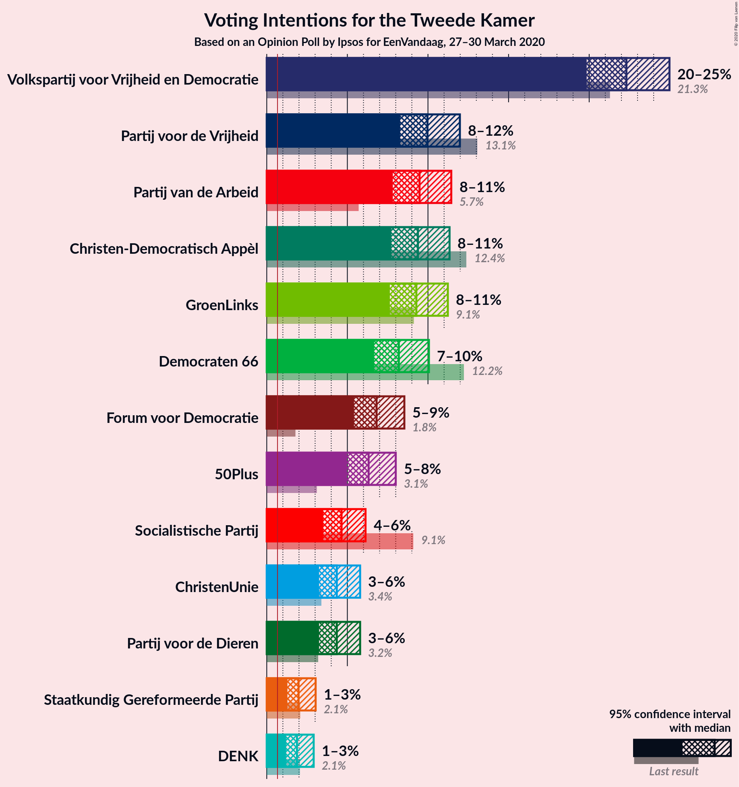

### Confidence Intervals

| Party | Last Result | Poll Result | 80% Confidence Interval | 90% Confidence Interval | 95% Confidence Interval | 99% Confidence Interval |
|:-----:|:-----------:|:-----------:|:-----------------------:|:-----------------------:|:-----------------------:|:-----------------------:|
| Volkspartij voor Vrijheid en Democratie | 21.3% | 22.3% | 20.7–24.1% |20.2–24.6% |19.8–25.0% |19.1–25.8% |
| Partij voor de Vrijheid | 13.1% | 10.0% | 8.9–11.3% |8.5–11.6% |8.3–12.0% |7.8–12.6% |
| Partij van de Arbeid | 5.7% | 9.5% | 8.4–10.8% |8.1–11.1% |7.8–11.4% |7.3–12.1% |
| Christen-Democratisch Appèl | 12.4% | 9.4% | 8.3–10.7% |8.0–11.0% |7.7–11.3% |7.2–12.0% |
| GroenLinks | 9.1% | 9.3% | 8.2–10.5% |7.9–10.9% |7.6–11.2% |7.1–11.9% |
| Democraten 66 | 12.2% | 8.2% | 7.2–9.4% |6.9–9.8% |6.7–10.1% |6.2–10.7% |
| Forum voor Democratie | 1.8% | 6.8% | 5.9–7.9% |5.6–8.3% |5.4–8.5% |5.0–9.1% |
| 50Plus | 3.1% | 6.3% | 5.4–7.4% |5.2–7.7% |5.0–8.0% |4.6–8.6% |
| Socialistische Partij | 9.1% | 4.6% | 3.9–5.6% |3.7–5.9% |3.5–6.1% |3.2–6.6% |
| ChristenUnie | 3.4% | 4.3% | 3.6–5.3% |3.4–5.5% |3.2–5.8% |2.9–6.3% |
| Partij voor de Dieren | 3.2% | 4.3% | 3.6–5.3% |3.4–5.5% |3.2–5.8% |2.9–6.3% |
| Staatkundig Gereformeerde Partij | 2.1% | 2.0% | 1.5–2.7% |1.4–2.9% |1.3–3.0% |1.1–3.4% |
| DENK | 2.1% | 1.9% | 1.4–2.6% |1.3–2.7% |1.2–2.9% |1.0–3.3% |

*Note:* The poll result column reflects the actual value used in the calculations. Published results may vary slightly, and in addition be rounded to fewer digits.

## Seats

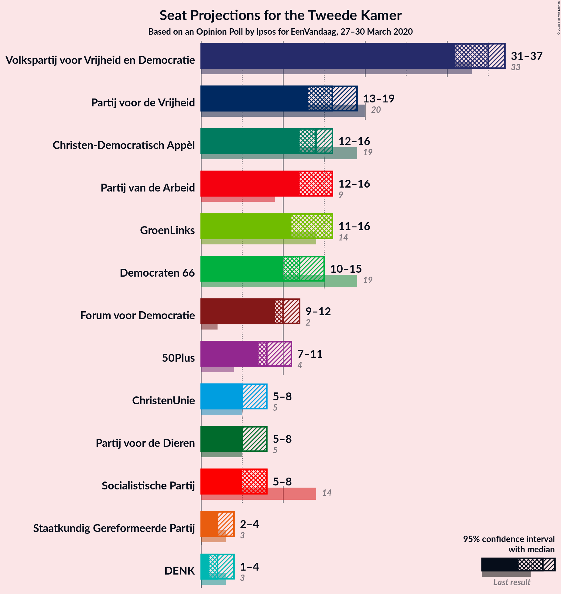

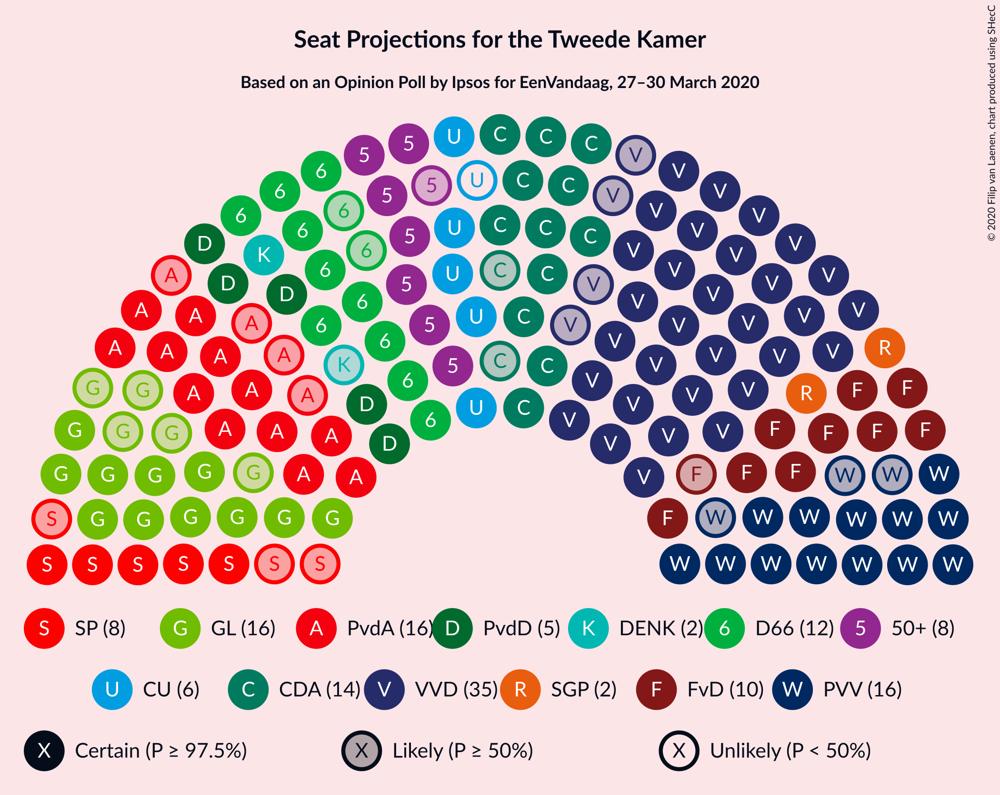

### Confidence Intervals

| Party | Last Result | Median | 80% Confidence Interval | 90% Confidence Interval | 95% Confidence Interval | 99% Confidence Interval |
|:-----:|:-----------:|:------:|:-----------------------:|:-----------------------:|:-----------------------:|:-----------------------:|
| <a href="#volkspartij-voor-vrijheid-en-democratie">Volkspartij voor Vrijheid en Democratie</a> | 33 | 35 | 33–36 |31–37 |31–37 |30–40 |
| <a href="#partij-voor-de-vrijheid">Partij voor de Vrijheid</a> | 20 | 16 | 14–16 |13–18 |13–19 |12–19 |
| <a href="#partij-van-de-arbeid">Partij van de Arbeid</a> | 9 | 16 | 13–16 |13–16 |12–16 |11–17 |
| <a href="#christen-democratisch-appèl">Christen-Democratisch Appèl</a> | 19 | 14 | 12–16 |12–16 |12–16 |11–17 |
| <a href="#groenlinks">GroenLinks</a> | 14 | 16 | 13–16 |12–16 |11–16 |11–17 |
| <a href="#democraten-66">Democraten 66</a> | 19 | 12 | 12–14 |11–15 |10–15 |10–16 |
| <a href="#forum-voor-democratie">Forum voor Democratie</a> | 2 | 10 | 10–11 |9–12 |9–12 |8–13 |
| <a href="#50plus">50Plus</a> | 4 | 8 | 8–10 |7–10 |7–11 |6–12 |
| <a href="#socialistische-partij">Socialistische Partij</a> | 14 | 8 | 6–8 |5–8 |5–8 |5–9 |
| <a href="#christenunie">ChristenUnie</a> | 5 | 5 | 5–7 |5–7 |5–8 |4–8 |
| <a href="#partij-voor-de-dieren">Partij voor de Dieren</a> | 5 | 5 | 5–7 |5–8 |5–8 |4–8 |
| <a href="#staatkundig-gereformeerde-partij">Staatkundig Gereformeerde Partij</a> | 3 | 2 | 2–3 |2–4 |2–4 |2–4 |
| <a href="#denk">DENK</a> | 3 | 2 | 2–3 |1–4 |1–4 |1–5 |

### Volkspartij voor Vrijheid en Democratie

*For a full overview of the results for this party, see the [Volkspartij voor Vrijheid en Democratie](party-volkspartijvoorvrijheidendemocratie.html) page.*

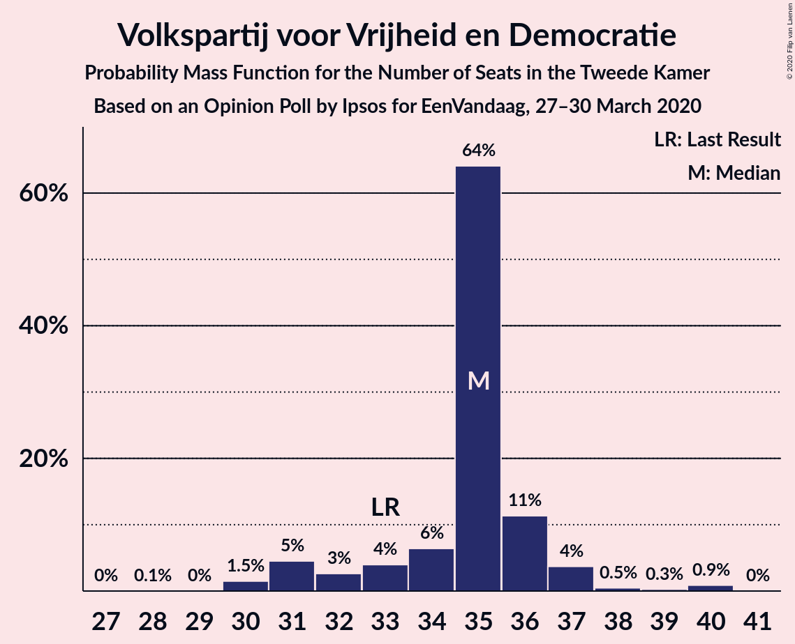

| Number of Seats | Probability | Accumulated | Special Marks |
|:---------------:|:-----------:|:-----------:|:-------------:|
| 28 | 0.1% | 100% |  |
| 29 | 0% | 99.9% |  |
| 30 | 1.5% | 99.9% |  |
| 31 | 5% | 98% |  |
| 32 | 3% | 94% |  |
| 33 | 4% | 91% | Last Result |
| 34 | 6% | 87% |  |
| 35 | 64% | 81% | Median |
| 36 | 11% | 17% |  |
| 37 | 4% | 5% |  |
| 38 | 0.5% | 2% |  |
| 39 | 0.3% | 1.2% |  |
| 40 | 0.9% | 0.9% |  |
| 41 | 0% | 0% |  |

### Partij voor de Vrijheid

*For a full overview of the results for this party, see the [Partij voor de Vrijheid](party-partijvoordevrijheid.html) page.*

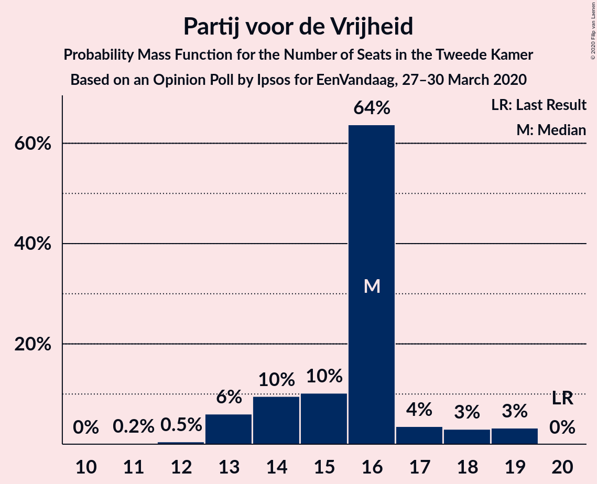

| Number of Seats | Probability | Accumulated | Special Marks |
|:---------------:|:-----------:|:-----------:|:-------------:|
| 11 | 0.2% | 100% |  |
| 12 | 0.5% | 99.8% |  |
| 13 | 6% | 99.3% |  |
| 14 | 10% | 93% |  |
| 15 | 10% | 84% |  |
| 16 | 64% | 74% | Median |
| 17 | 4% | 10% |  |
| 18 | 3% | 6% |  |
| 19 | 3% | 3% |  |
| 20 | 0% | 0% | Last Result |

### Partij van de Arbeid

*For a full overview of the results for this party, see the [Partij van de Arbeid](party-partijvandearbeid.html) page.*

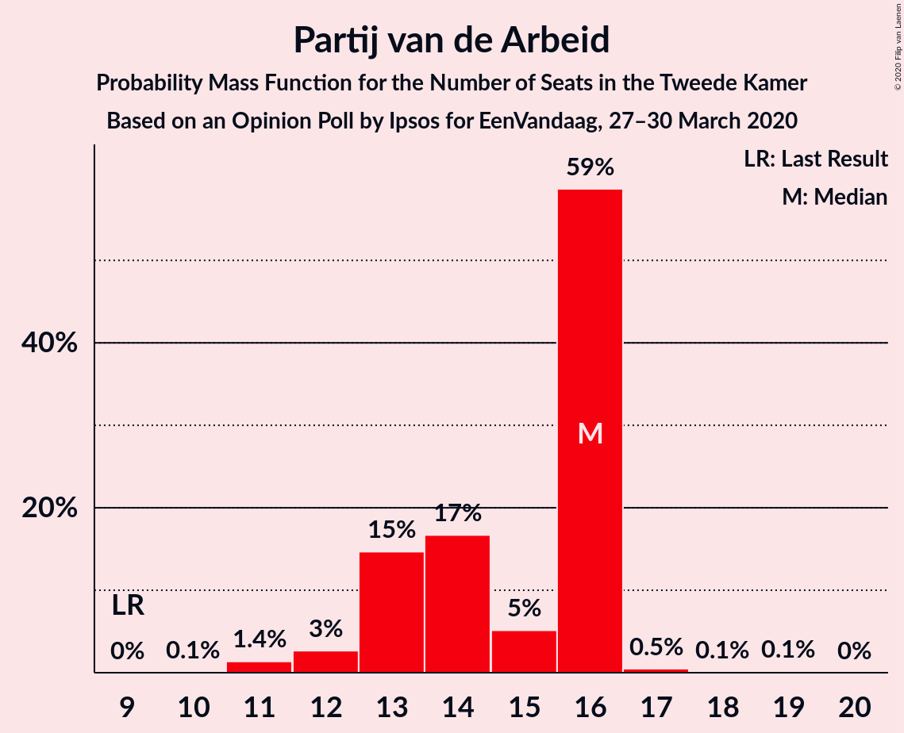

| Number of Seats | Probability | Accumulated | Special Marks |
|:---------------:|:-----------:|:-----------:|:-------------:|
| 9 | 0% | 100% | Last Result |
| 10 | 0.1% | 100% |  |
| 11 | 1.4% | 99.9% |  |
| 12 | 3% | 98.6% |  |
| 13 | 15% | 96% |  |
| 14 | 17% | 81% |  |
| 15 | 5% | 65% |  |
| 16 | 59% | 59% | Median |
| 17 | 0.5% | 0.7% |  |
| 18 | 0.1% | 0.2% |  |
| 19 | 0.1% | 0.1% |  |
| 20 | 0% | 0% |  |

### Christen-Democratisch Appèl

*For a full overview of the results for this party, see the [Christen-Democratisch Appèl](party-christen-democratischappèl.html) page.*

| Number of Seats | Probability | Accumulated | Special Marks |
|:---------------:|:-----------:|:-----------:|:-------------:|
| 10 | 0.1% | 100% |  |
| 11 | 0.4% | 99.8% |  |
| 12 | 11% | 99.4% |  |
| 13 | 4% | 89% |  |
| 14 | 67% | 85% | Median |
| 15 | 4% | 18% |  |
| 16 | 12% | 14% |  |
| 17 | 2% | 2% |  |
| 18 | 0.1% | 0.2% |  |
| 19 | 0% | 0% | Last Result |

### GroenLinks

*For a full overview of the results for this party, see the [GroenLinks](party-groenlinks.html) page.*

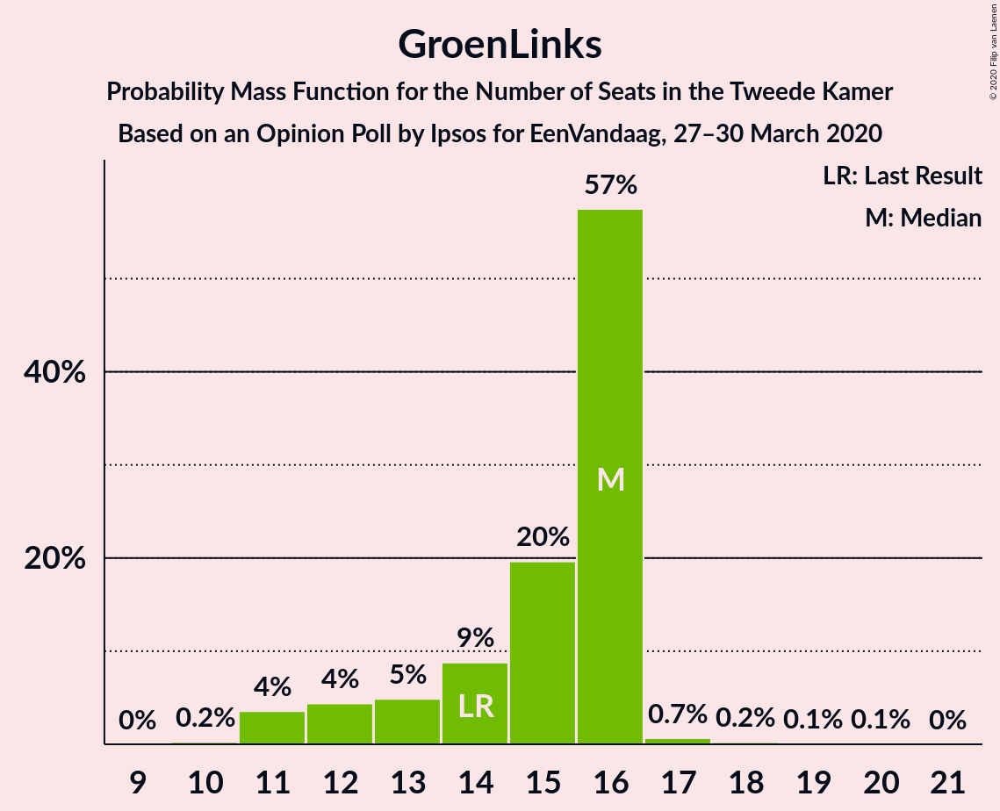

| Number of Seats | Probability | Accumulated | Special Marks |
|:---------------:|:-----------:|:-----------:|:-------------:|
| 10 | 0.2% | 100% |  |
| 11 | 4% | 99.7% |  |
| 12 | 4% | 96% |  |
| 13 | 5% | 92% |  |
| 14 | 9% | 87% | Last Result |
| 15 | 20% | 78% |  |
| 16 | 57% | 59% | Median |
| 17 | 0.7% | 1.0% |  |
| 18 | 0.2% | 0.4% |  |
| 19 | 0.1% | 0.1% |  |
| 20 | 0.1% | 0.1% |  |
| 21 | 0% | 0% |  |

### Democraten 66

*For a full overview of the results for this party, see the [Democraten 66](party-democraten66.html) page.*

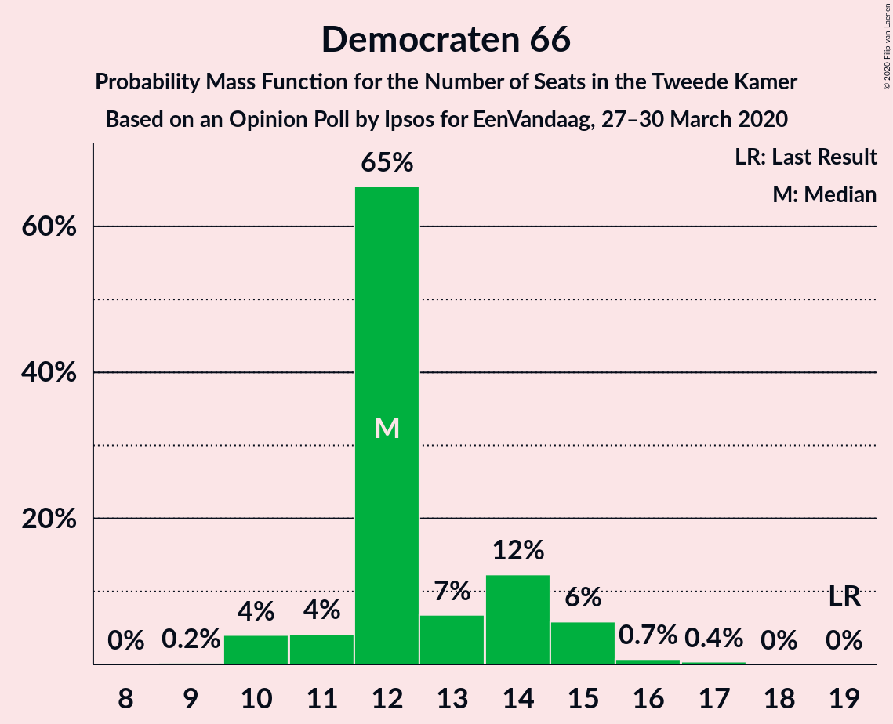

| Number of Seats | Probability | Accumulated | Special Marks |
|:---------------:|:-----------:|:-----------:|:-------------:|
| 9 | 0.2% | 100% |  |
| 10 | 4% | 99.8% |  |
| 11 | 4% | 96% |  |
| 12 | 65% | 92% | Median |
| 13 | 7% | 26% |  |
| 14 | 12% | 19% |  |
| 15 | 6% | 7% |  |
| 16 | 0.7% | 1.1% |  |
| 17 | 0.4% | 0.4% |  |
| 18 | 0% | 0% |  |
| 19 | 0% | 0% | Last Result |

### Forum voor Democratie

*For a full overview of the results for this party, see the [Forum voor Democratie](party-forumvoordemocratie.html) page.*

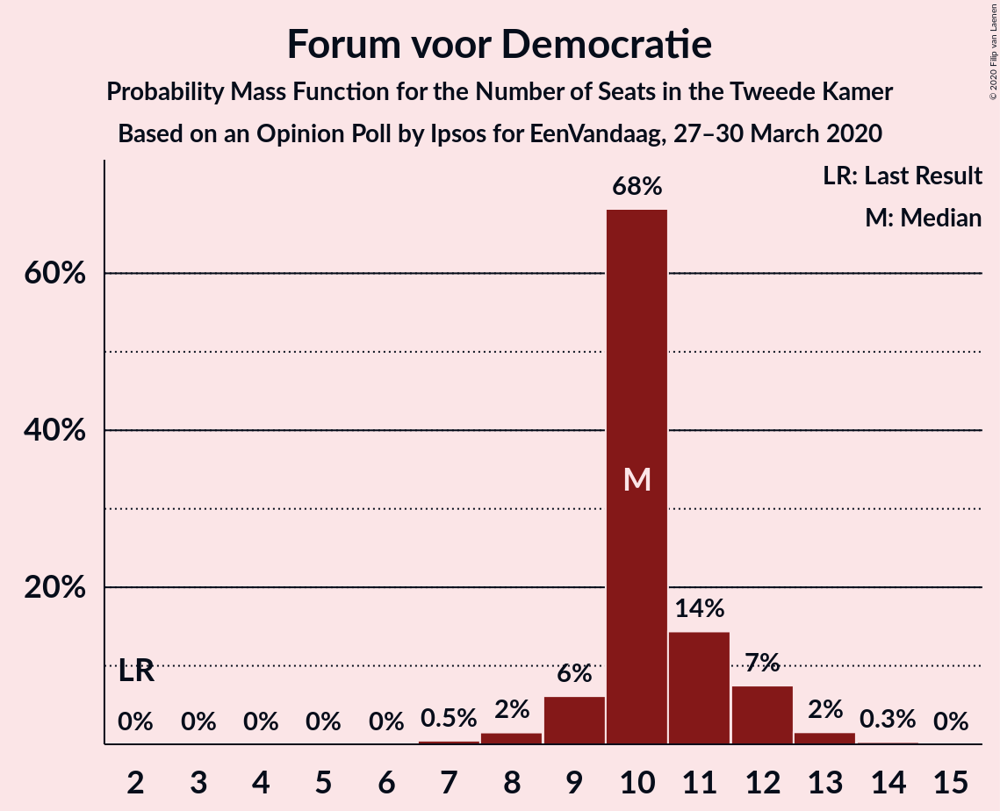

| Number of Seats | Probability | Accumulated | Special Marks |
|:---------------:|:-----------:|:-----------:|:-------------:|
| 2 | 0% | 100% | Last Result |
| 3 | 0% | 100% |  |
| 4 | 0% | 100% |  |
| 5 | 0% | 100% |  |
| 6 | 0% | 100% |  |
| 7 | 0.5% | 100% |  |
| 8 | 2% | 99.5% |  |
| 9 | 6% | 98% |  |
| 10 | 68% | 92% | Median |
| 11 | 14% | 24% |  |
| 12 | 7% | 9% |  |
| 13 | 2% | 2% |  |
| 14 | 0.3% | 0.3% |  |
| 15 | 0% | 0% |  |

### 50Plus

*For a full overview of the results for this party, see the [50Plus](party-50plus.html) page.*

| Number of Seats | Probability | Accumulated | Special Marks |
|:---------------:|:-----------:|:-----------:|:-------------:|
| 4 | 0% | 100% | Last Result |
| 5 | 0% | 100% |  |
| 6 | 1.1% | 100% |  |
| 7 | 6% | 98.9% |  |
| 8 | 64% | 93% | Median |
| 9 | 17% | 29% |  |
| 10 | 7% | 12% |  |
| 11 | 3% | 5% |  |
| 12 | 2% | 2% |  |
| 13 | 0.1% | 0.1% |  |
| 14 | 0% | 0% |  |

### Socialistische Partij

*For a full overview of the results for this party, see the [Socialistische Partij](party-socialistischepartij.html) page.*

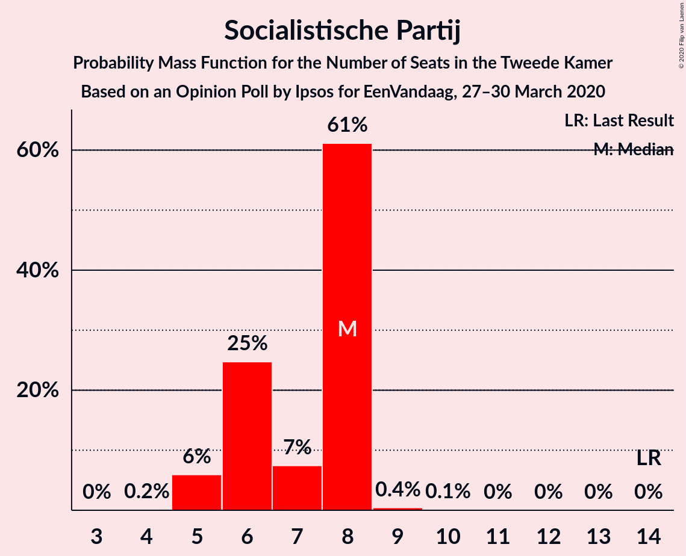

| Number of Seats | Probability | Accumulated | Special Marks |
|:---------------:|:-----------:|:-----------:|:-------------:|
| 4 | 0.2% | 100% |  |
| 5 | 6% | 99.8% |  |
| 6 | 25% | 94% |  |
| 7 | 7% | 69% |  |
| 8 | 61% | 62% | Median |
| 9 | 0.4% | 0.6% |  |
| 10 | 0.1% | 0.1% |  |
| 11 | 0% | 0% |  |
| 12 | 0% | 0% |  |
| 13 | 0% | 0% |  |
| 14 | 0% | 0% | Last Result |

### ChristenUnie

*For a full overview of the results for this party, see the [ChristenUnie](party-christenunie.html) page.*

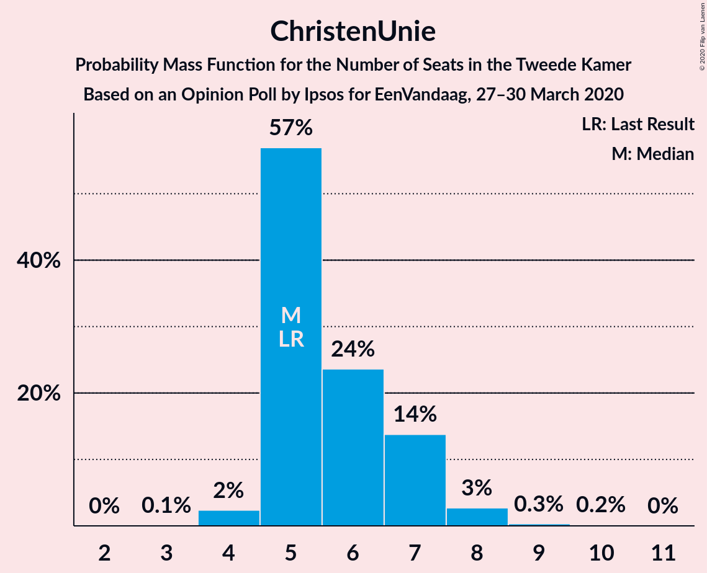

| Number of Seats | Probability | Accumulated | Special Marks |
|:---------------:|:-----------:|:-----------:|:-------------:|
| 3 | 0.1% | 100% |  |
| 4 | 2% | 99.9% |  |
| 5 | 57% | 98% | Last Result, Median |
| 6 | 24% | 41% |  |
| 7 | 14% | 17% |  |
| 8 | 3% | 3% |  |
| 9 | 0.3% | 0.5% |  |
| 10 | 0.2% | 0.2% |  |
| 11 | 0% | 0% |  |

### Partij voor de Dieren

*For a full overview of the results for this party, see the [Partij voor de Dieren](party-partijvoordedieren.html) page.*

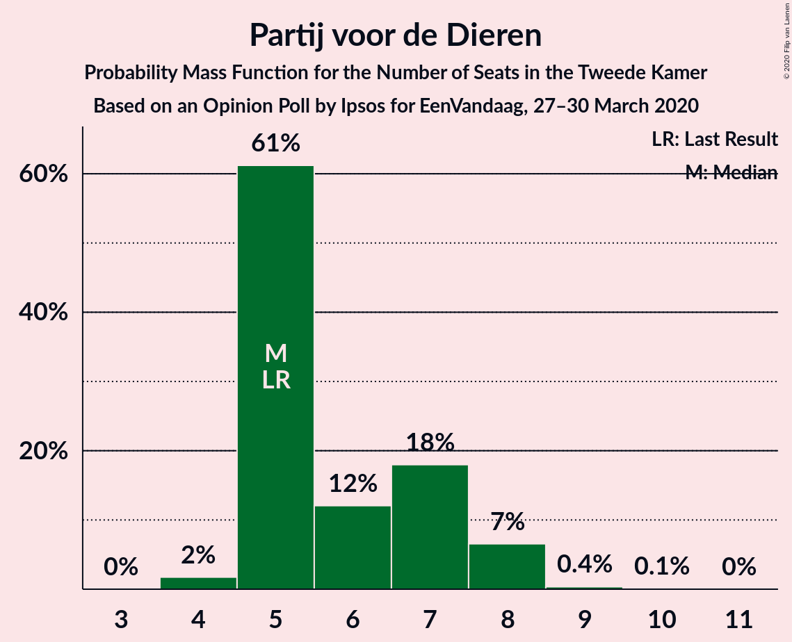

| Number of Seats | Probability | Accumulated | Special Marks |
|:---------------:|:-----------:|:-----------:|:-------------:|
| 4 | 2% | 100% |  |
| 5 | 61% | 98% | Last Result, Median |
| 6 | 12% | 37% |  |
| 7 | 18% | 25% |  |
| 8 | 7% | 7% |  |
| 9 | 0.4% | 0.4% |  |
| 10 | 0.1% | 0.1% |  |
| 11 | 0% | 0% |  |

### Staatkundig Gereformeerde Partij

*For a full overview of the results for this party, see the [Staatkundig Gereformeerde Partij](party-staatkundiggereformeerdepartij.html) page.*

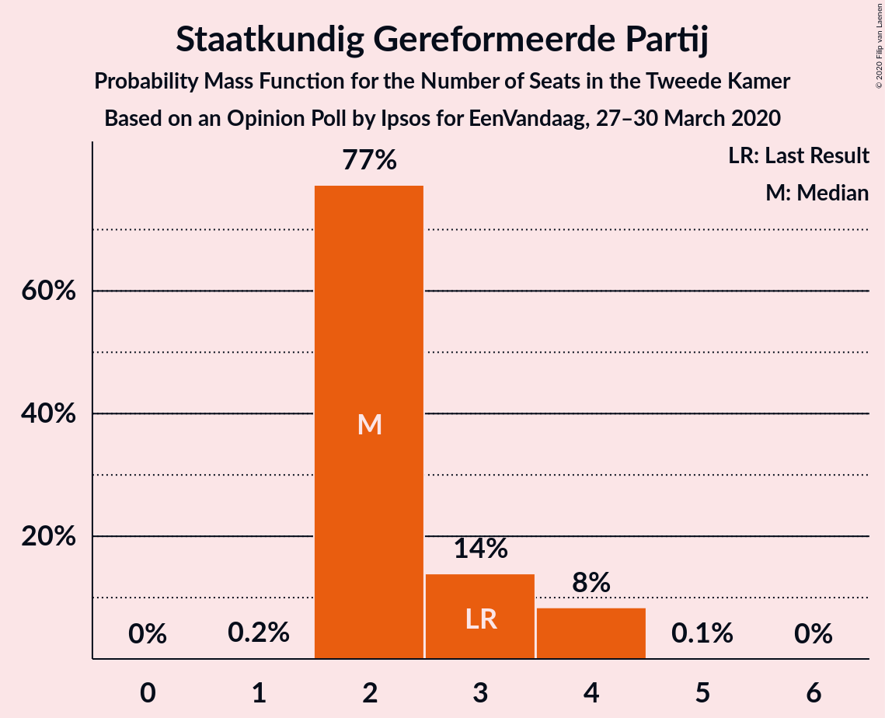

| Number of Seats | Probability | Accumulated | Special Marks |
|:---------------:|:-----------:|:-----------:|:-------------:|
| 1 | 0.2% | 100% |  |
| 2 | 77% | 99.8% | Median |
| 3 | 14% | 22% | Last Result |
| 4 | 8% | 9% |  |
| 5 | 0.1% | 0.2% |  |
| 6 | 0% | 0% |  |

### DENK

*For a full overview of the results for this party, see the [DENK](party-denk.html) page.*

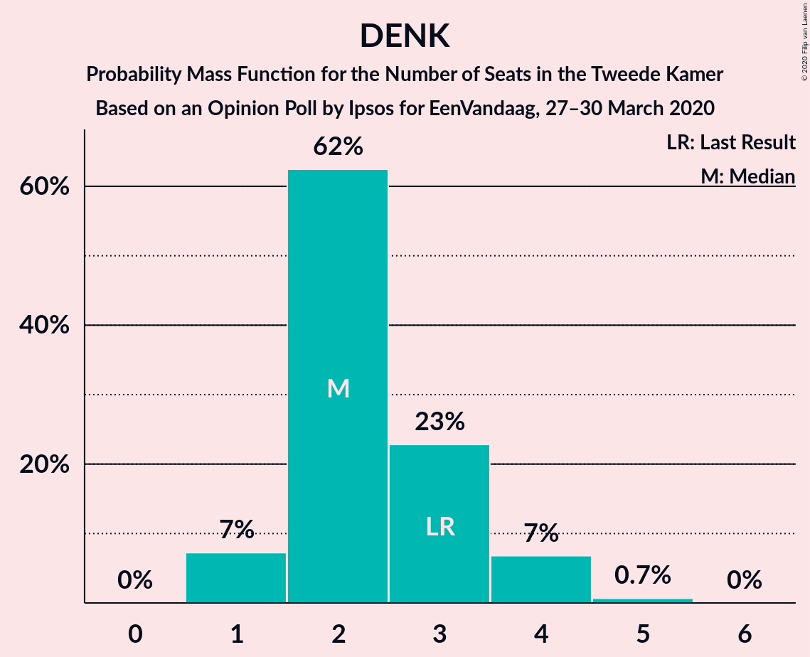

| Number of Seats | Probability | Accumulated | Special Marks |
|:---------------:|:-----------:|:-----------:|:-------------:|
| 1 | 7% | 100% |  |
| 2 | 62% | 93% | Median |
| 3 | 23% | 30% | Last Result |
| 4 | 7% | 7% |  |
| 5 | 0.7% | 0.7% |  |
| 6 | 0% | 0% |  |

## Coalitions

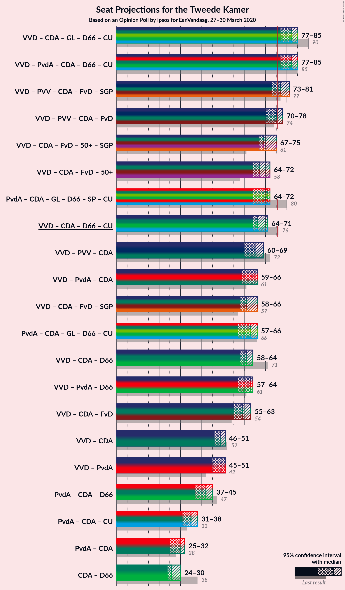

### Confidence Intervals

| Coalition | Last Result | Median | Majority? | 80% Confidence Interval | 90% Confidence Interval | 95% Confidence Interval | 99% Confidence Interval |
|:---------:|:-----------:|:------:|:---------:|:-----------------------:|:-----------------------:|:-----------------------:|:-----------------------:|
| Volkspartij voor Vrijheid en Democratie – Christen-Democratisch Appèl – GroenLinks – Democraten 66 – ChristenUnie | 90 | 82 | 99.5% | 80–84 | 78–85 | 77–85 | 76–86 |
| Volkspartij voor Vrijheid en Democratie – Partij van de Arbeid – Christen-Democratisch Appèl – Democraten 66 – ChristenUnie | 85 | 82 | 99.7% | 80–84 | 78–85 | 77–85 | 76–87 |
| Volkspartij voor Vrijheid en Democratie – Partij voor de Vrijheid – Christen-Democratisch Appèl – Forum voor Democratie – Staatkundig Gereformeerde Partij | 77 | 77 | 93% | 76–80 | 74–81 | 73–81 | 71–82 |
| Volkspartij voor Vrijheid en Democratie – Partij voor de Vrijheid – Christen-Democratisch Appèl – Forum voor Democratie | 74 | 75 | 14% | 73–77 | 71–78 | 70–78 | 68–80 |
| Volkspartij voor Vrijheid en Democratie – Christen-Democratisch Appèl – Forum voor Democratie – 50Plus – Staatkundig Gereformeerde Partij | 61 | 69 | 0.7% | 68–73 | 68–75 | 67–75 | 65–76 |
| Volkspartij voor Vrijheid en Democratie – Christen-Democratisch Appèl – Forum voor Democratie – 50Plus | 58 | 67 | 0.1% | 66–71 | 65–71 | 64–72 | 62–73 |
| Partij van de Arbeid – Christen-Democratisch Appèl – GroenLinks – Democraten 66 – Socialistische Partij – ChristenUnie | 80 | 71 | 0% | 66–71 | 65–71 | 64–72 | 62–74 |
| Volkspartij voor Vrijheid en Democratie – Christen-Democratisch Appèl – Democraten 66 – ChristenUnie | 76 | 66 | 0% | 66–70 | 64–71 | 64–71 | 62–72 |
| Volkspartij voor Vrijheid en Democratie – Partij voor de Vrijheid – Christen-Democratisch Appèl | 72 | 65 | 0% | 62–66 | 60–68 | 60–69 | 59–69 |
| Volkspartij voor Vrijheid en Democratie – Partij van de Arbeid – Christen-Democratisch Appèl | 61 | 65 | 0% | 61–65 | 60–65 | 59–66 | 58–67 |
| Volkspartij voor Vrijheid en Democratie – Christen-Democratisch Appèl – Forum voor Democratie – Staatkundig Gereformeerde Partij | 57 | 61 | 0% | 60–64 | 59–65 | 58–66 | 56–67 |
| Partij van de Arbeid – Christen-Democratisch Appèl – GroenLinks – Democraten 66 – ChristenUnie | 66 | 63 | 0% | 59–64 | 58–64 | 57–66 | 55–68 |
| Volkspartij voor Vrijheid en Democratie – Christen-Democratisch Appèl – Democraten 66 | 71 | 61 | 0% | 60–63 | 59–64 | 58–64 | 55–64 |
| Volkspartij voor Vrijheid en Democratie – Partij van de Arbeid – Democraten 66 | 61 | 63 | 0% | 59–63 | 59–64 | 57–64 | 56–65 |
| Volkspartij voor Vrijheid en Democratie – Christen-Democratisch Appèl – Forum voor Democratie | 54 | 59 | 0% | 58–61 | 57–62 | 55–63 | 53–65 |
| Volkspartij voor Vrijheid en Democratie – Christen-Democratisch Appèl | 52 | 49 | 0% | 47–51 | 46–51 | 46–51 | 43–54 |
| Volkspartij voor Vrijheid en Democratie – Partij van de Arbeid | 42 | 51 | 0% | 47–51 | 46–51 | 45–51 | 44–53 |
| Partij van de Arbeid – Christen-Democratisch Appèl – Democraten 66 | 47 | 42 | 0% | 39–43 | 38–44 | 37–45 | 36–46 |
| Partij van de Arbeid – Christen-Democratisch Appèl – ChristenUnie | 33 | 35 | 0% | 31–36 | 31–37 | 31–38 | 30–40 |
| Partij van de Arbeid – Christen-Democratisch Appèl | 28 | 30 | 0% | 25–30 | 25–31 | 25–32 | 25–33 |
| Christen-Democratisch Appèl – Democraten 66 | 38 | 26 | 0% | 26–29 | 25–29 | 24–30 | 23–31 |

### Volkspartij voor Vrijheid en Democratie – Christen-Democratisch Appèl – GroenLinks – Democraten 66 – ChristenUnie

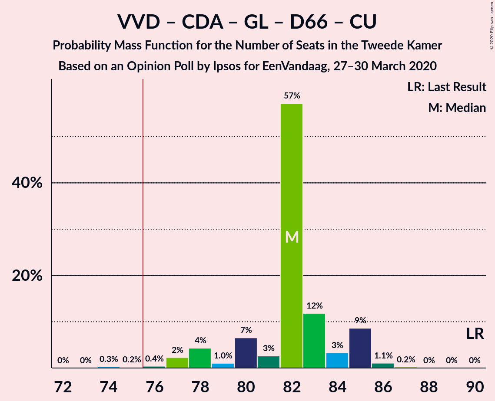

| Number of Seats | Probability | Accumulated | Special Marks |
|:---------------:|:-----------:|:-----------:|:-------------:|
| 73 | 0% | 100% |  |
| 74 | 0.3% | 99.9% |  |
| 75 | 0.2% | 99.7% |  |
| 76 | 0.4% | 99.5% | Majority |
| 77 | 2% | 99.1% |  |
| 78 | 4% | 97% |  |
| 79 | 1.0% | 93% |  |
| 80 | 7% | 91% |  |
| 81 | 3% | 85% |  |
| 82 | 57% | 82% | Median |
| 83 | 12% | 25% |  |
| 84 | 3% | 13% |  |
| 85 | 9% | 10% |  |
| 86 | 1.1% | 1.4% |  |
| 87 | 0.2% | 0.3% |  |
| 88 | 0% | 0.1% |  |
| 89 | 0% | 0% |  |
| 90 | 0% | 0% | Last Result |

### Volkspartij voor Vrijheid en Democratie – Partij van de Arbeid – Christen-Democratisch Appèl – Democraten 66 – ChristenUnie

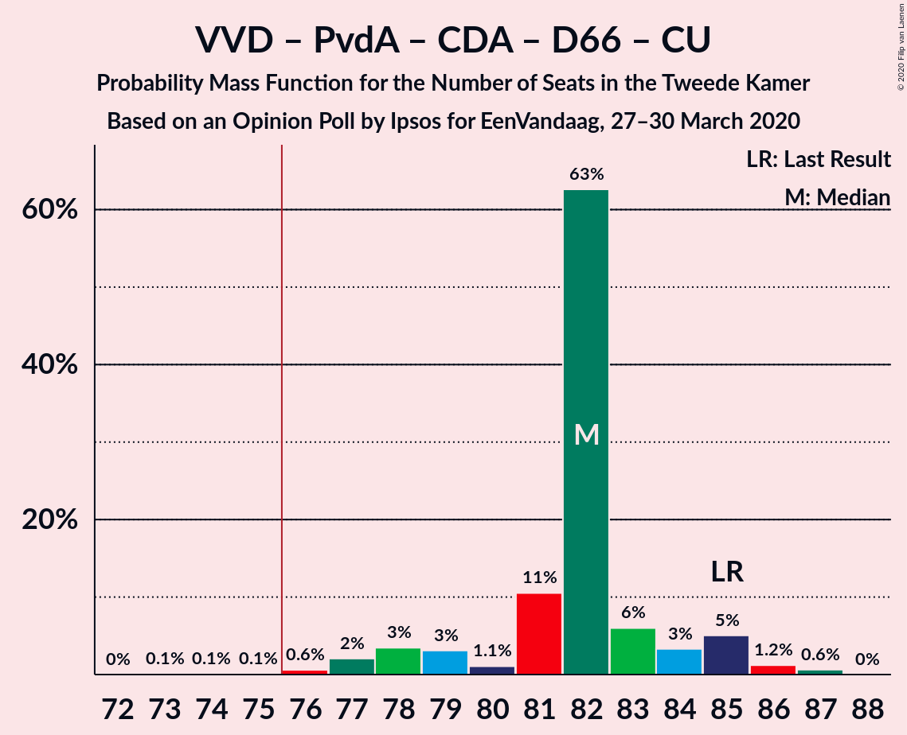

| Number of Seats | Probability | Accumulated | Special Marks |
|:---------------:|:-----------:|:-----------:|:-------------:|
| 73 | 0.1% | 100% |  |
| 74 | 0.1% | 99.9% |  |
| 75 | 0.1% | 99.8% |  |
| 76 | 0.6% | 99.7% | Majority |
| 77 | 2% | 99.1% |  |
| 78 | 3% | 97% |  |
| 79 | 3% | 94% |  |
| 80 | 1.1% | 90% |  |
| 81 | 11% | 89% |  |
| 82 | 63% | 79% | Median |
| 83 | 6% | 16% |  |
| 84 | 3% | 10% |  |
| 85 | 5% | 7% | Last Result |
| 86 | 1.2% | 2% |  |
| 87 | 0.6% | 0.7% |  |
| 88 | 0% | 0% |  |

### Volkspartij voor Vrijheid en Democratie – Partij voor de Vrijheid – Christen-Democratisch Appèl – Forum voor Democratie – Staatkundig Gereformeerde Partij

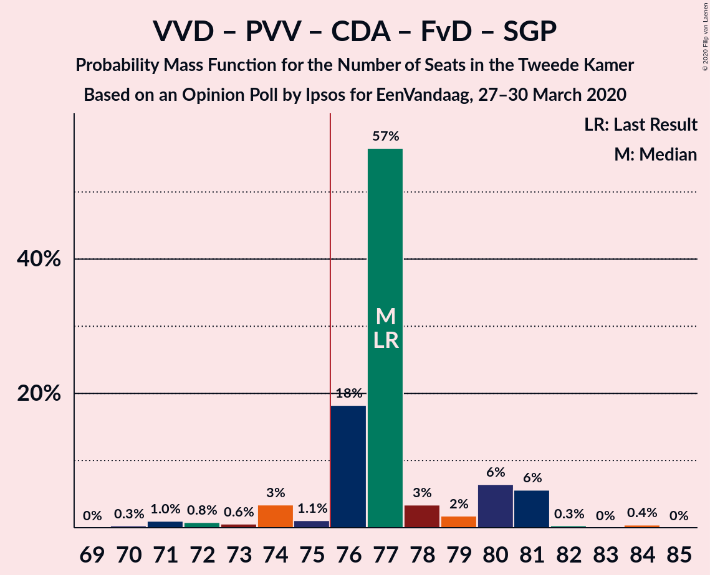

| Number of Seats | Probability | Accumulated | Special Marks |
|:---------------:|:-----------:|:-----------:|:-------------:|
| 69 | 0% | 100% |  |
| 70 | 0.3% | 99.9% |  |
| 71 | 1.0% | 99.6% |  |
| 72 | 0.8% | 98.7% |  |
| 73 | 0.6% | 98% |  |
| 74 | 3% | 97% |  |
| 75 | 1.1% | 94% |  |
| 76 | 18% | 93% | Majority |
| 77 | 57% | 75% | Last Result, Median |
| 78 | 3% | 18% |  |
| 79 | 2% | 15% |  |
| 80 | 6% | 13% |  |
| 81 | 6% | 6% |  |
| 82 | 0.3% | 0.8% |  |
| 83 | 0% | 0.5% |  |
| 84 | 0.4% | 0.4% |  |
| 85 | 0% | 0% |  |

### Volkspartij voor Vrijheid en Democratie – Partij voor de Vrijheid – Christen-Democratisch Appèl – Forum voor Democratie

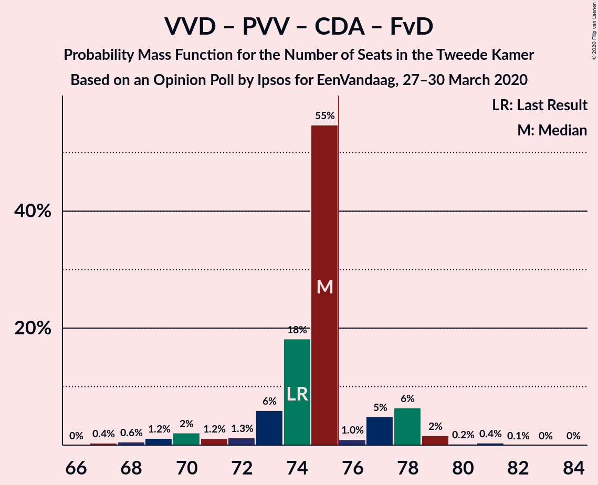

| Number of Seats | Probability | Accumulated | Special Marks |
|:---------------:|:-----------:|:-----------:|:-------------:|
| 67 | 0.4% | 100% |  |
| 68 | 0.6% | 99.6% |  |
| 69 | 1.2% | 99.1% |  |
| 70 | 2% | 98% |  |
| 71 | 1.2% | 96% |  |
| 72 | 1.3% | 95% |  |
| 73 | 6% | 93% |  |
| 74 | 18% | 87% | Last Result |
| 75 | 55% | 69% | Median |
| 76 | 1.0% | 14% | Majority |
| 77 | 5% | 14% |  |
| 78 | 6% | 9% |  |
| 79 | 2% | 2% |  |
| 80 | 0.2% | 0.6% |  |
| 81 | 0.4% | 0.4% |  |
| 82 | 0.1% | 0.1% |  |
| 83 | 0% | 0% |  |

### Volkspartij voor Vrijheid en Democratie – Christen-Democratisch Appèl – Forum voor Democratie – 50Plus – Staatkundig Gereformeerde Partij

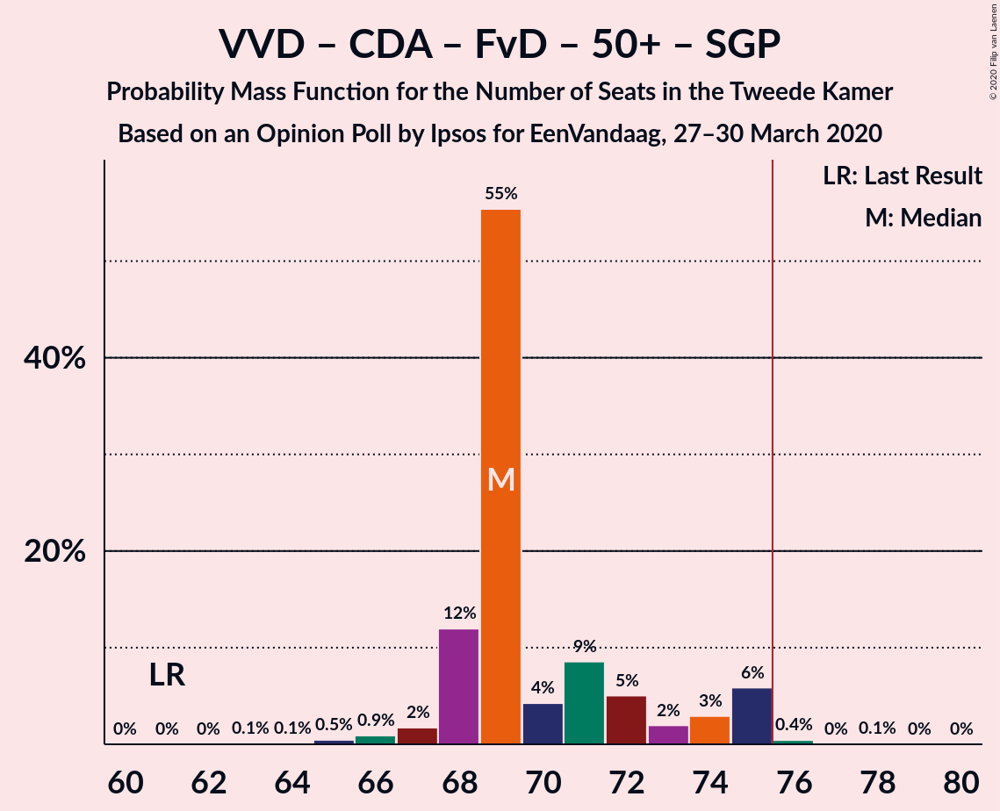

| Number of Seats | Probability | Accumulated | Special Marks |
|:---------------:|:-----------:|:-----------:|:-------------:|
| 61 | 0% | 100% | Last Result |
| 62 | 0% | 100% |  |
| 63 | 0.1% | 100% |  |
| 64 | 0.1% | 99.9% |  |
| 65 | 0.5% | 99.8% |  |
| 66 | 0.9% | 99.4% |  |
| 67 | 2% | 98% |  |
| 68 | 12% | 97% |  |
| 69 | 55% | 85% | Median |
| 70 | 4% | 29% |  |
| 71 | 9% | 25% |  |
| 72 | 5% | 17% |  |
| 73 | 2% | 11% |  |
| 74 | 3% | 9% |  |
| 75 | 6% | 7% |  |
| 76 | 0.4% | 0.7% | Majority |
| 77 | 0% | 0.2% |  |
| 78 | 0.1% | 0.2% |  |
| 79 | 0% | 0.1% |  |
| 80 | 0% | 0% |  |

### Volkspartij voor Vrijheid en Democratie – Christen-Democratisch Appèl – Forum voor Democratie – 50Plus

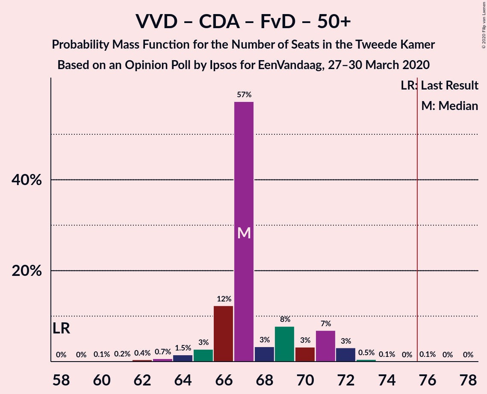

| Number of Seats | Probability | Accumulated | Special Marks |
|:---------------:|:-----------:|:-----------:|:-------------:|
| 58 | 0% | 100% | Last Result |
| 59 | 0% | 100% |  |
| 60 | 0.1% | 100% |  |
| 61 | 0.2% | 99.9% |  |
| 62 | 0.4% | 99.7% |  |
| 63 | 0.7% | 99.3% |  |
| 64 | 1.5% | 98.7% |  |
| 65 | 3% | 97% |  |
| 66 | 12% | 94% |  |
| 67 | 57% | 82% | Median |
| 68 | 3% | 25% |  |
| 69 | 8% | 22% |  |
| 70 | 3% | 14% |  |
| 71 | 7% | 11% |  |
| 72 | 3% | 4% |  |
| 73 | 0.5% | 0.7% |  |
| 74 | 0.1% | 0.3% |  |
| 75 | 0% | 0.1% |  |
| 76 | 0.1% | 0.1% | Majority |
| 77 | 0% | 0% |  |

### Partij van de Arbeid – Christen-Democratisch Appèl – GroenLinks – Democraten 66 – Socialistische Partij – ChristenUnie

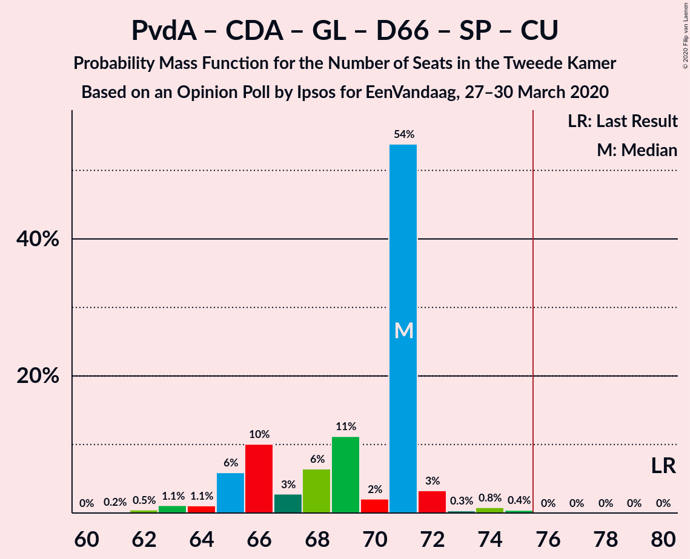

| Number of Seats | Probability | Accumulated | Special Marks |
|:---------------:|:-----------:|:-----------:|:-------------:|
| 61 | 0.2% | 100% |  |
| 62 | 0.5% | 99.8% |  |
| 63 | 1.1% | 99.3% |  |
| 64 | 1.1% | 98% |  |
| 65 | 6% | 97% |  |
| 66 | 10% | 91% |  |
| 67 | 3% | 81% |  |
| 68 | 6% | 78% |  |
| 69 | 11% | 72% |  |
| 70 | 2% | 61% |  |
| 71 | 54% | 59% | Median |
| 72 | 3% | 5% |  |
| 73 | 0.3% | 2% |  |
| 74 | 0.8% | 1.2% |  |
| 75 | 0.4% | 0.4% |  |
| 76 | 0% | 0% | Majority |
| 77 | 0% | 0% |  |
| 78 | 0% | 0% |  |
| 79 | 0% | 0% |  |
| 80 | 0% | 0% | Last Result |

### Volkspartij voor Vrijheid en Democratie – Christen-Democratisch Appèl – Democraten 66 – ChristenUnie

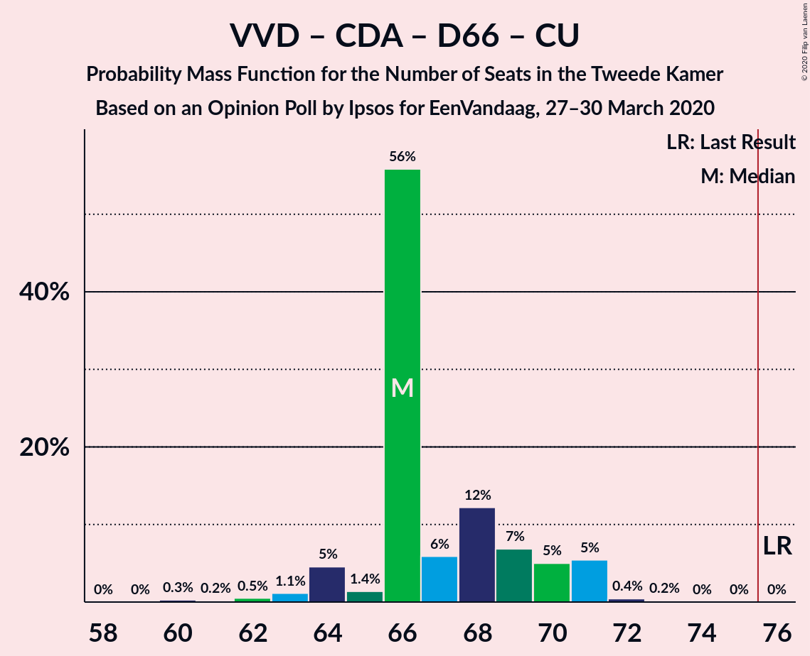

| Number of Seats | Probability | Accumulated | Special Marks |
|:---------------:|:-----------:|:-----------:|:-------------:|
| 60 | 0.3% | 100% |  |
| 61 | 0.2% | 99.7% |  |
| 62 | 0.5% | 99.5% |  |
| 63 | 1.1% | 99.0% |  |
| 64 | 5% | 98% |  |
| 65 | 1.4% | 93% |  |
| 66 | 56% | 92% | Median |
| 67 | 6% | 36% |  |
| 68 | 12% | 30% |  |
| 69 | 7% | 18% |  |
| 70 | 5% | 11% |  |
| 71 | 5% | 6% |  |
| 72 | 0.4% | 0.7% |  |
| 73 | 0.2% | 0.2% |  |
| 74 | 0% | 0.1% |  |
| 75 | 0% | 0% |  |
| 76 | 0% | 0% | Last Result, Majority |

### Volkspartij voor Vrijheid en Democratie – Partij voor de Vrijheid – Christen-Democratisch Appèl

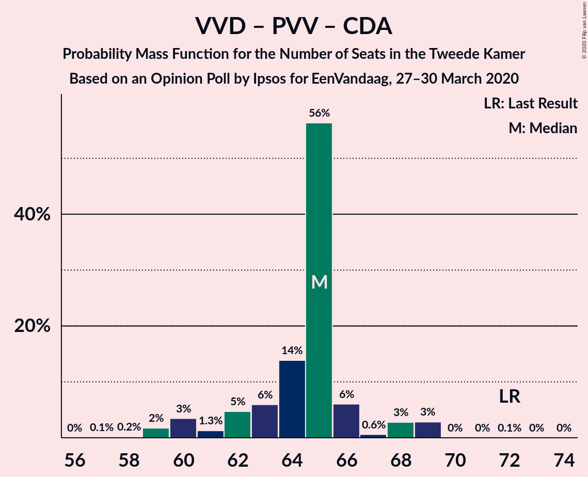

| Number of Seats | Probability | Accumulated | Special Marks |
|:---------------:|:-----------:|:-----------:|:-------------:|
| 57 | 0.1% | 100% |  |
| 58 | 0.2% | 99.9% |  |
| 59 | 2% | 99.7% |  |
| 60 | 3% | 98% |  |
| 61 | 1.3% | 94% |  |
| 62 | 5% | 93% |  |
| 63 | 6% | 89% |  |
| 64 | 14% | 83% |  |
| 65 | 56% | 69% | Median |
| 66 | 6% | 12% |  |
| 67 | 0.6% | 6% |  |
| 68 | 3% | 6% |  |
| 69 | 3% | 3% |  |
| 70 | 0% | 0.1% |  |
| 71 | 0% | 0.1% |  |
| 72 | 0.1% | 0.1% | Last Result |
| 73 | 0% | 0% |  |

### Volkspartij voor Vrijheid en Democratie – Partij van de Arbeid – Christen-Democratisch Appèl

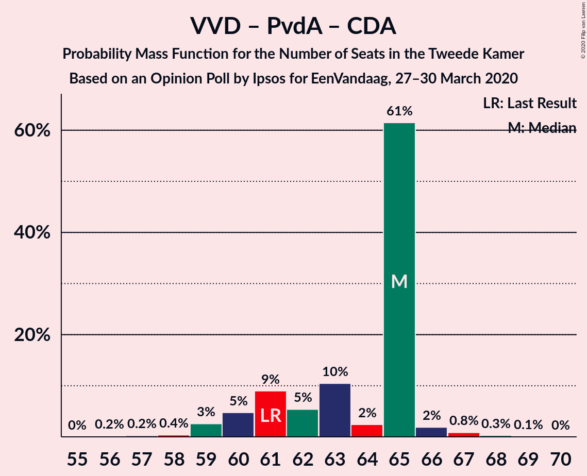

| Number of Seats | Probability | Accumulated | Special Marks |
|:---------------:|:-----------:|:-----------:|:-------------:|
| 56 | 0.2% | 100% |  |
| 57 | 0.2% | 99.8% |  |
| 58 | 0.4% | 99.6% |  |
| 59 | 3% | 99.2% |  |
| 60 | 5% | 97% |  |
| 61 | 9% | 92% | Last Result |
| 62 | 5% | 83% |  |
| 63 | 10% | 77% |  |
| 64 | 2% | 67% |  |
| 65 | 61% | 65% | Median |
| 66 | 2% | 3% |  |
| 67 | 0.8% | 1.2% |  |
| 68 | 0.3% | 0.4% |  |
| 69 | 0.1% | 0.1% |  |
| 70 | 0% | 0% |  |

### Volkspartij voor Vrijheid en Democratie – Christen-Democratisch Appèl – Forum voor Democratie – Staatkundig Gereformeerde Partij

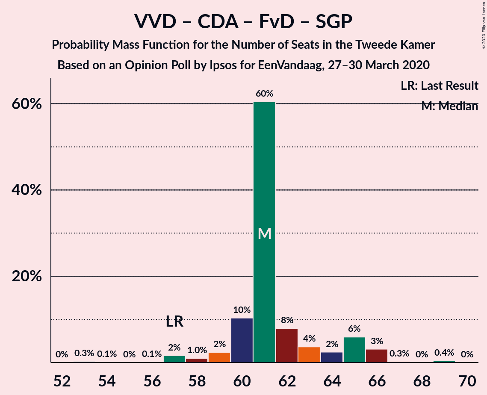

| Number of Seats | Probability | Accumulated | Special Marks |
|:---------------:|:-----------:|:-----------:|:-------------:|
| 53 | 0.3% | 100% |  |
| 54 | 0.1% | 99.7% |  |
| 55 | 0% | 99.6% |  |
| 56 | 0.1% | 99.6% |  |
| 57 | 2% | 99.5% | Last Result |
| 58 | 1.0% | 98% |  |
| 59 | 2% | 97% |  |
| 60 | 10% | 95% |  |
| 61 | 60% | 84% | Median |
| 62 | 8% | 24% |  |
| 63 | 4% | 16% |  |
| 64 | 2% | 12% |  |
| 65 | 6% | 10% |  |
| 66 | 3% | 4% |  |
| 67 | 0.3% | 0.7% |  |
| 68 | 0% | 0.5% |  |
| 69 | 0.4% | 0.4% |  |
| 70 | 0% | 0% |  |

### Partij van de Arbeid – Christen-Democratisch Appèl – GroenLinks – Democraten 66 – ChristenUnie

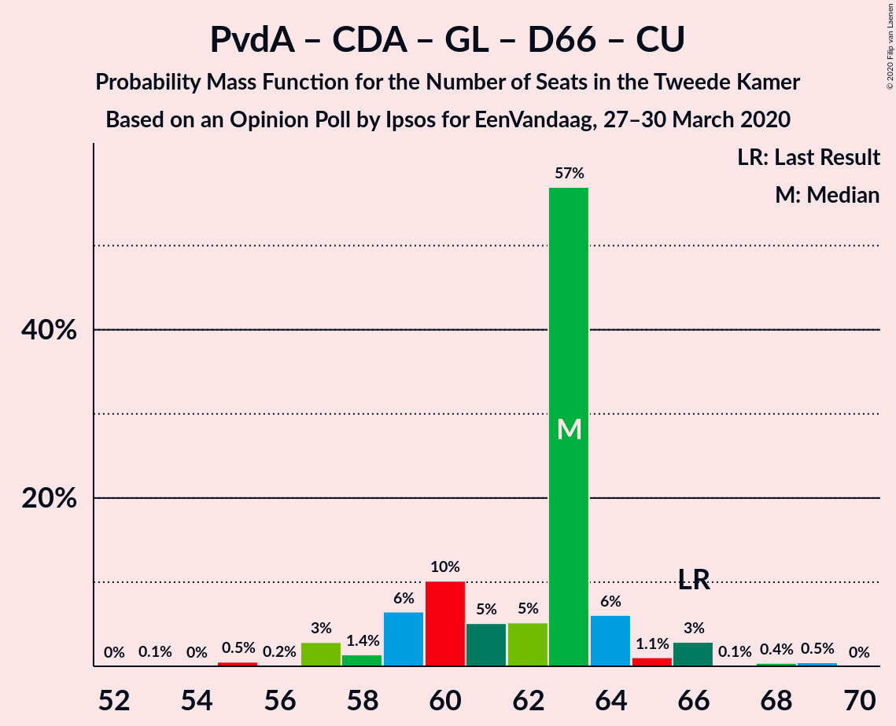

| Number of Seats | Probability | Accumulated | Special Marks |
|:---------------:|:-----------:|:-----------:|:-------------:|
| 53 | 0.1% | 100% |  |
| 54 | 0% | 99.9% |  |
| 55 | 0.5% | 99.9% |  |
| 56 | 0.2% | 99.4% |  |
| 57 | 3% | 99.2% |  |
| 58 | 1.4% | 96% |  |
| 59 | 6% | 95% |  |
| 60 | 10% | 88% |  |
| 61 | 5% | 78% |  |
| 62 | 5% | 73% |  |
| 63 | 57% | 68% | Median |
| 64 | 6% | 11% |  |
| 65 | 1.1% | 5% |  |
| 66 | 3% | 4% | Last Result |
| 67 | 0.1% | 1.0% |  |
| 68 | 0.4% | 0.9% |  |
| 69 | 0.5% | 0.5% |  |
| 70 | 0% | 0% |  |

### Volkspartij voor Vrijheid en Democratie – Christen-Democratisch Appèl – Democraten 66

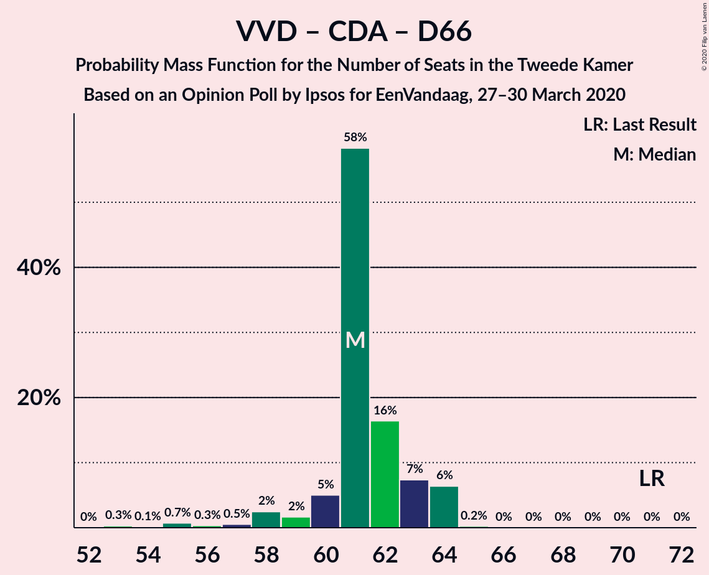

| Number of Seats | Probability | Accumulated | Special Marks |
|:---------------:|:-----------:|:-----------:|:-------------:|
| 53 | 0.3% | 100% |  |
| 54 | 0.1% | 99.7% |  |
| 55 | 0.7% | 99.6% |  |
| 56 | 0.3% | 98.8% |  |
| 57 | 0.5% | 98.5% |  |
| 58 | 2% | 98% |  |
| 59 | 2% | 96% |  |
| 60 | 5% | 94% |  |
| 61 | 58% | 89% | Median |
| 62 | 16% | 31% |  |
| 63 | 7% | 14% |  |
| 64 | 6% | 7% |  |
| 65 | 0.2% | 0.3% |  |
| 66 | 0% | 0.1% |  |
| 67 | 0% | 0.1% |  |
| 68 | 0% | 0% |  |
| 69 | 0% | 0% |  |
| 70 | 0% | 0% |  |
| 71 | 0% | 0% | Last Result |

### Volkspartij voor Vrijheid en Democratie – Partij van de Arbeid – Democraten 66

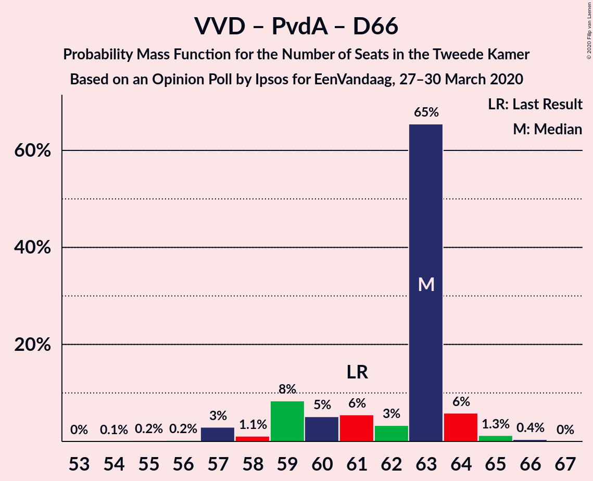

| Number of Seats | Probability | Accumulated | Special Marks |
|:---------------:|:-----------:|:-----------:|:-------------:|
| 53 | 0% | 100% |  |
| 54 | 0.1% | 99.9% |  |
| 55 | 0.2% | 99.9% |  |
| 56 | 0.2% | 99.7% |  |
| 57 | 3% | 99.4% |  |
| 58 | 1.1% | 96% |  |
| 59 | 8% | 95% |  |
| 60 | 5% | 87% |  |
| 61 | 6% | 82% | Last Result |
| 62 | 3% | 76% |  |
| 63 | 65% | 73% | Median |
| 64 | 6% | 8% |  |
| 65 | 1.3% | 2% |  |
| 66 | 0.4% | 0.4% |  |
| 67 | 0% | 0% |  |

### Volkspartij voor Vrijheid en Democratie – Christen-Democratisch Appèl – Forum voor Democratie

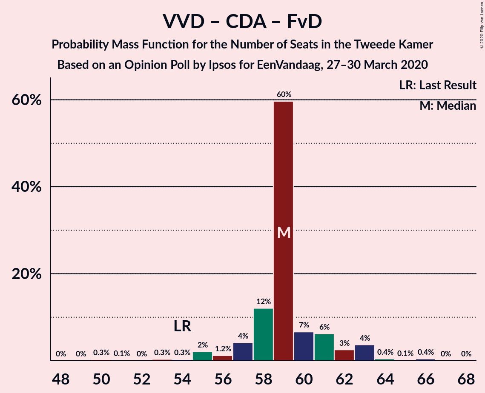

| Number of Seats | Probability | Accumulated | Special Marks |
|:---------------:|:-----------:|:-----------:|:-------------:|
| 50 | 0.3% | 100% |  |
| 51 | 0.1% | 99.7% |  |
| 52 | 0% | 99.6% |  |
| 53 | 0.3% | 99.6% |  |
| 54 | 0.3% | 99.3% | Last Result |
| 55 | 2% | 99.0% |  |
| 56 | 1.2% | 97% |  |
| 57 | 4% | 96% |  |
| 58 | 12% | 92% |  |
| 59 | 60% | 80% | Median |
| 60 | 7% | 20% |  |
| 61 | 6% | 13% |  |
| 62 | 3% | 7% |  |
| 63 | 4% | 5% |  |
| 64 | 0.4% | 1.0% |  |
| 65 | 0.1% | 0.6% |  |
| 66 | 0.4% | 0.4% |  |
| 67 | 0% | 0% |  |

### Volkspartij voor Vrijheid en Democratie – Christen-Democratisch Appèl

| Number of Seats | Probability | Accumulated | Special Marks |
|:---------------:|:-----------:|:-----------:|:-------------:|
| 42 | 0.4% | 100% |  |
| 43 | 0.2% | 99.5% |  |
| 44 | 0.9% | 99.4% |  |
| 45 | 0.6% | 98% |  |
| 46 | 4% | 98% |  |
| 47 | 6% | 94% |  |
| 48 | 11% | 88% |  |
| 49 | 60% | 77% | Median |
| 50 | 7% | 17% |  |
| 51 | 9% | 10% |  |
| 52 | 0.8% | 2% | Last Result |
| 53 | 0.2% | 0.8% |  |
| 54 | 0.5% | 0.5% |  |
| 55 | 0% | 0% |  |

### Volkspartij voor Vrijheid en Democratie – Partij van de Arbeid

| Number of Seats | Probability | Accumulated | Special Marks |
|:---------------:|:-----------:|:-----------:|:-------------:|
| 41 | 0.1% | 100% |  |
| 42 | 0.1% | 99.9% | Last Result |
| 43 | 0.2% | 99.9% |  |
| 44 | 1.4% | 99.7% |  |
| 45 | 2% | 98% |  |
| 46 | 6% | 97% |  |
| 47 | 5% | 91% |  |
| 48 | 3% | 86% |  |
| 49 | 22% | 83% |  |
| 50 | 2% | 61% |  |
| 51 | 57% | 58% | Median |
| 52 | 0.2% | 2% |  |
| 53 | 1.3% | 2% |  |
| 54 | 0.3% | 0.3% |  |
| 55 | 0% | 0% |  |

### Partij van de Arbeid – Christen-Democratisch Appèl – Democraten 66

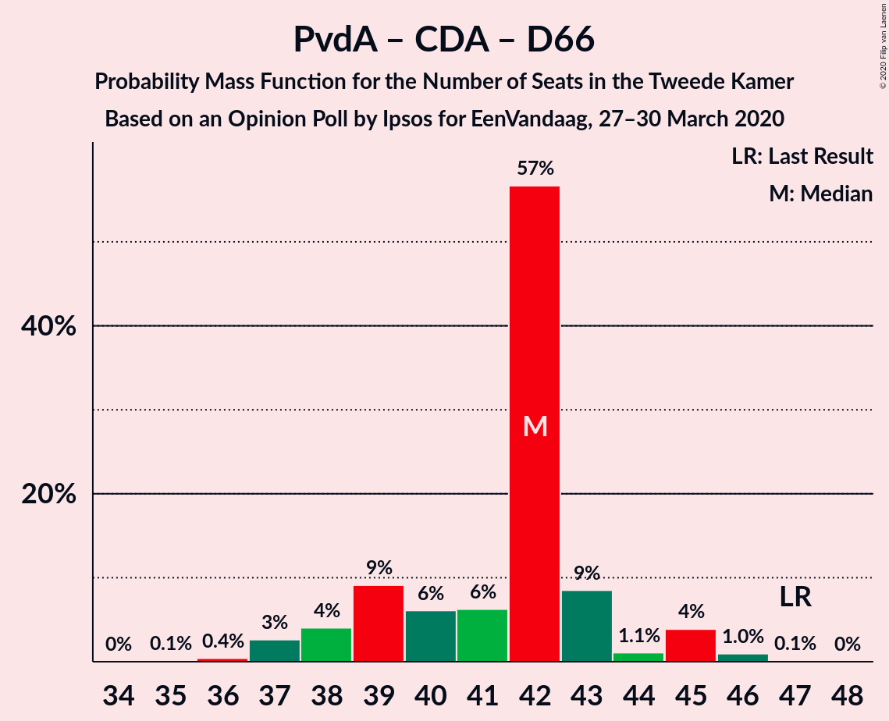

| Number of Seats | Probability | Accumulated | Special Marks |
|:---------------:|:-----------:|:-----------:|:-------------:|
| 35 | 0.1% | 100% |  |
| 36 | 0.4% | 99.8% |  |
| 37 | 3% | 99.4% |  |
| 38 | 4% | 97% |  |
| 39 | 9% | 93% |  |
| 40 | 6% | 84% |  |
| 41 | 6% | 78% |  |
| 42 | 57% | 71% | Median |
| 43 | 9% | 15% |  |
| 44 | 1.1% | 6% |  |
| 45 | 4% | 5% |  |
| 46 | 1.0% | 1.1% |  |
| 47 | 0.1% | 0.1% | Last Result |
| 48 | 0% | 0% |  |

### Partij van de Arbeid – Christen-Democratisch Appèl – ChristenUnie

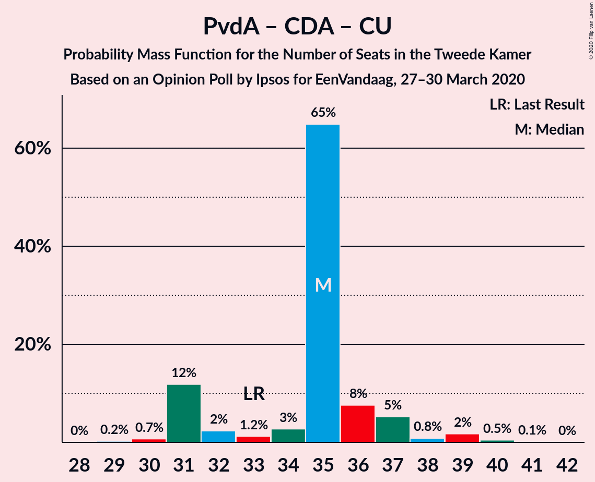

| Number of Seats | Probability | Accumulated | Special Marks |
|:---------------:|:-----------:|:-----------:|:-------------:|
| 29 | 0.2% | 100% |  |
| 30 | 0.7% | 99.7% |  |
| 31 | 12% | 99.0% |  |
| 32 | 2% | 87% |  |
| 33 | 1.2% | 85% | Last Result |
| 34 | 3% | 84% |  |
| 35 | 65% | 81% | Median |
| 36 | 8% | 16% |  |
| 37 | 5% | 8% |  |
| 38 | 0.8% | 3% |  |
| 39 | 2% | 2% |  |
| 40 | 0.5% | 0.6% |  |
| 41 | 0.1% | 0.1% |  |
| 42 | 0% | 0% |  |

### Partij van de Arbeid – Christen-Democratisch Appèl

| Number of Seats | Probability | Accumulated | Special Marks |
|:---------------:|:-----------:|:-----------:|:-------------:|
| 23 | 0% | 100% |  |
| 24 | 0.4% | 99.9% |  |
| 25 | 12% | 99.5% |  |
| 26 | 1.2% | 87% |  |
| 27 | 3% | 86% |  |
| 28 | 10% | 83% | Last Result |
| 29 | 7% | 73% |  |
| 30 | 59% | 66% | Median |
| 31 | 3% | 7% |  |
| 32 | 2% | 3% |  |
| 33 | 1.5% | 2% |  |
| 34 | 0% | 0.1% |  |
| 35 | 0% | 0% |  |

### Christen-Democratisch Appèl – Democraten 66

| Number of Seats | Probability | Accumulated | Special Marks |
|:---------------:|:-----------:|:-----------:|:-------------:|
| 20 | 0.1% | 100% |  |
| 21 | 0.1% | 99.9% |  |
| 22 | 0.1% | 99.8% |  |
| 23 | 1.0% | 99.7% |  |
| 24 | 4% | 98.7% |  |
| 25 | 1.3% | 95% |  |
| 26 | 68% | 94% | Median |
| 27 | 7% | 25% |  |
| 28 | 7% | 19% |  |
| 29 | 7% | 12% |  |
| 30 | 4% | 4% |  |
| 31 | 0.6% | 0.7% |  |
| 32 | 0.1% | 0.1% |  |
| 33 | 0% | 0% |  |
| 34 | 0% | 0% |  |
| 35 | 0% | 0% |  |
| 36 | 0% | 0% |  |
| 37 | 0% | 0% |  |
| 38 | 0% | 0% | Last Result |

## Technical Information

### Opinion Poll

+ **Polling firm:** Ipsos
+ **Commissioner(s):** EenVandaag
+ **Fieldwork period:** 27–30 March 2020

### Calculations

+ **Sample size:** 1013
+ **Simulations done:** 1,048,576
+ **Error estimate:** 2.12%

