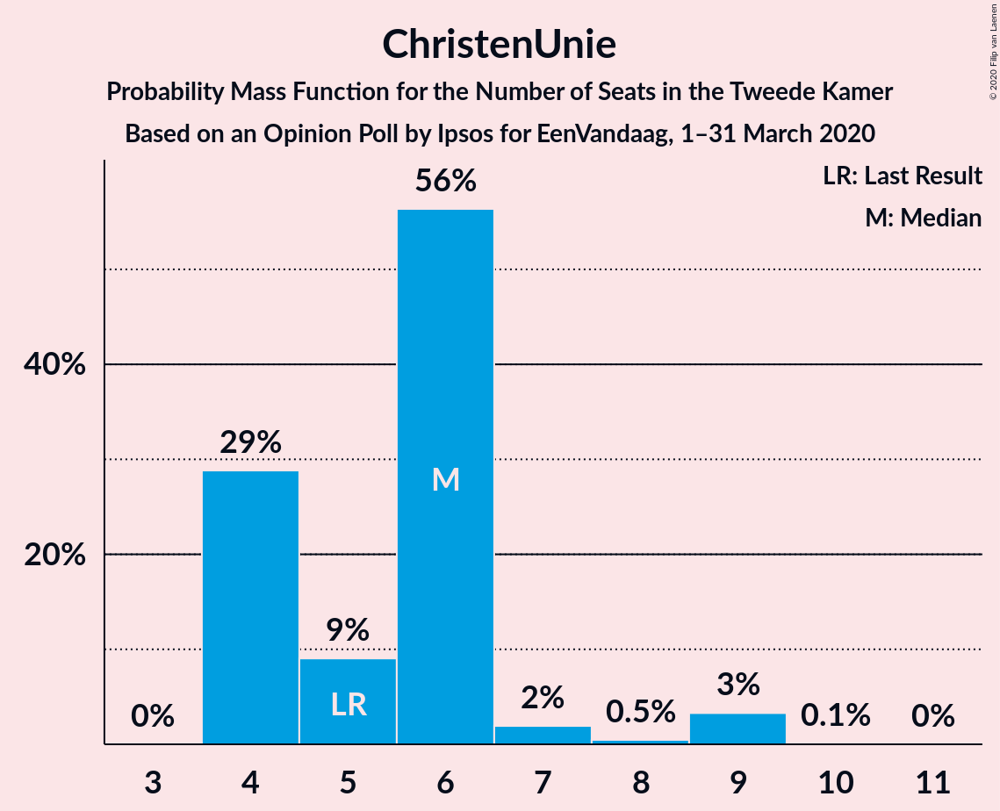
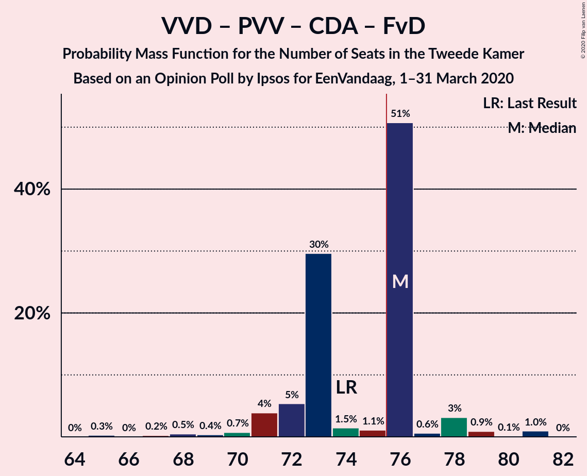

# Opinion Poll by Ipsos for EenVandaag, 1–31 March 2020

<a href="#voting-intentions">Voting Intentions</a> | <a href="#seats">Seats</a> | <a href="#coalitions">Coalitions</a> | <a href="#technical-information">Technical Information</a>

## Voting Intentions

### Confidence Intervals

| Party | Last Result | Poll Result | 80% Confidence Interval | 90% Confidence Interval | 95% Confidence Interval | 99% Confidence Interval |
|:-----:|:-----------:|:-----------:|:-----------------------:|:-----------------------:|:-----------------------:|:-----------------------:|
| Volkspartij voor Vrijheid en Democratie | 21.3% | 22.3% | 20.7–24.1% |20.2–24.6% |19.8–25.0% |19.1–25.8% |
| Partij voor de Vrijheid | 13.1% | 10.0% | 8.9–11.3% |8.6–11.7% |8.3–12.0% |7.8–12.7% |
| Partij van de Arbeid | 5.7% | 9.5% | 8.4–10.8% |8.1–11.2% |7.8–11.5% |7.3–12.1% |
| Christen-Democratisch Appèl | 12.4% | 9.4% | 8.3–10.7% |8.0–11.1% |7.7–11.4% |7.2–12.0% |
| GroenLinks | 9.1% | 9.3% | 8.2–10.6% |7.9–10.9% |7.7–11.3% |7.2–11.9% |
| Democraten 66 | 12.2% | 8.2% | 7.2–9.4% |6.9–9.8% |6.6–10.1% |6.2–10.7% |
| Forum voor Democratie | 1.8% | 6.8% | 5.9–7.9% |5.6–8.3% |5.4–8.5% |5.0–9.1% |
| 50Plus | 3.1% | 6.3% | 5.4–7.4% |5.2–7.7% |5.0–8.0% |4.6–8.6% |
| Socialistische Partij | 9.1% | 4.6% | 3.9–5.6% |3.6–5.9% |3.5–6.1% |3.1–6.6% |
| ChristenUnie | 3.4% | 4.3% | 3.6–5.2% |3.4–5.5% |3.2–5.7% |2.9–6.2% |
| Partij voor de Dieren | 3.2% | 4.3% | 3.6–5.2% |3.4–5.5% |3.2–5.7% |2.9–6.2% |
| Staatkundig Gereformeerde Partij | 2.1% | 2.0% | 1.5–2.7% |1.4–2.9% |1.3–3.1% |1.1–3.4% |
| DENK | 2.1% | 1.9% | 1.4–2.6% |1.3–2.8% |1.2–3.0% |1.0–3.3% |

*Note:* The poll result column reflects the actual value used in the calculations. Published results may vary slightly, and in addition be rounded to fewer digits.

## Seats

### Confidence Intervals

| Party | Last Result | Median | 80% Confidence Interval | 90% Confidence Interval | 95% Confidence Interval | 99% Confidence Interval |
|:-----:|:-----------:|:------:|:-----------------------:|:-----------------------:|:-----------------------:|:-----------------------:|
| <a href="#volkspartij-voor-vrijheid-en-democratie">Volkspartij voor Vrijheid en Democratie</a> | 33 | 34 | 31–38 |31–38 |31–38 |29–39 |
| <a href="#partij-voor-de-vrijheid">Partij voor de Vrijheid</a> | 20 | 15 | 14–16 |13–17 |13–18 |12–19 |
| <a href="#partij-van-de-arbeid">Partij van de Arbeid</a> | 9 | 15 | 13–17 |12–17 |12–17 |11–18 |
| <a href="#christen-democratisch-appèl">Christen-Democratisch Appèl</a> | 19 | 15 | 13–16 |13–16 |12–16 |11–17 |
| <a href="#groenlinks">GroenLinks</a> | 14 | 13 | 11–17 |11–17 |11–17 |11–17 |
| <a href="#democraten-66">Democraten 66</a> | 19 | 12 | 11–14 |11–15 |11–17 |8–17 |
| <a href="#forum-voor-democratie">Forum voor Democratie</a> | 2 | 11 | 9–11 |9–12 |9–12 |9–13 |
| <a href="#50plus">50Plus</a> | 4 | 8 | 8–11 |8–11 |8–11 |7–13 |
| <a href="#socialistische-partij">Socialistische Partij</a> | 14 | 7 | 6–7 |5–8 |5–9 |5–10 |
| <a href="#christenunie">ChristenUnie</a> | 5 | 6 | 4–6 |4–7 |4–9 |4–9 |
| <a href="#partij-voor-de-dieren">Partij voor de Dieren</a> | 5 | 6 | 6 |5–7 |5–8 |4–9 |
| <a href="#staatkundig-gereformeerde-partij">Staatkundig Gereformeerde Partij</a> | 3 | 3 | 1–4 |1–4 |1–4 |1–4 |
| <a href="#denk">DENK</a> | 3 | 3 | 2–4 |2–4 |2–4 |1–4 |

### Volkspartij voor Vrijheid en Democratie

*For a full overview of the results for this party, see the [Volkspartij voor Vrijheid en Democratie](party-volkspartijvoorvrijheidendemocratie.html) page.*

| Number of Seats | Probability | Accumulated | Special Marks |
|:---------------:|:-----------:|:-----------:|:-------------:|
| 29 | 0.9% | 100% |  |
| 30 | 0.4% | 99.0% |  |
| 31 | 28% | 98.6% |  |
| 32 | 5% | 70% |  |
| 33 | 4% | 65% | Last Result |
| 34 | 45% | 61% | Median |
| 35 | 0.9% | 16% |  |
| 36 | 0.3% | 15% |  |
| 37 | 1.1% | 15% |  |
| 38 | 12% | 13% |  |
| 39 | 2% | 2% |  |
| 40 | 0% | 0% |  |

### Partij voor de Vrijheid

*For a full overview of the results for this party, see the [Partij voor de Vrijheid](party-partijvoordevrijheid.html) page.*

| Number of Seats | Probability | Accumulated | Special Marks |
|:---------------:|:-----------:|:-----------:|:-------------:|
| 11 | 0.4% | 100% |  |
| 12 | 0.6% | 99.6% |  |
| 13 | 5% | 99.1% |  |
| 14 | 12% | 94% |  |
| 15 | 42% | 81% | Median |
| 16 | 30% | 40% |  |
| 17 | 4% | 9% |  |
| 18 | 4% | 5% |  |
| 19 | 0.4% | 0.7% |  |
| 20 | 0.3% | 0.3% | Last Result |
| 21 | 0% | 0% |  |

### Partij van de Arbeid

*For a full overview of the results for this party, see the [Partij van de Arbeid](party-partijvandearbeid.html) page.*

| Number of Seats | Probability | Accumulated | Special Marks |
|:---------------:|:-----------:|:-----------:|:-------------:|
| 9 | 0% | 100% | Last Result |
| 10 | 0.3% | 100% |  |
| 11 | 1.4% | 99.7% |  |
| 12 | 7% | 98% |  |
| 13 | 39% | 91% |  |
| 14 | 1.0% | 52% |  |
| 15 | 2% | 51% | Median |
| 16 | 5% | 49% |  |
| 17 | 44% | 45% |  |
| 18 | 0.3% | 0.8% |  |
| 19 | 0.4% | 0.5% |  |
| 20 | 0% | 0% |  |

### Christen-Democratisch Appèl

*For a full overview of the results for this party, see the [Christen-Democratisch Appèl](party-christen-democratischappèl.html) page.*

| Number of Seats | Probability | Accumulated | Special Marks |
|:---------------:|:-----------:|:-----------:|:-------------:|
| 10 | 0.1% | 100% |  |
| 11 | 1.4% | 99.9% |  |
| 12 | 2% | 98.6% |  |
| 13 | 12% | 97% |  |
| 14 | 10% | 85% |  |
| 15 | 31% | 75% | Median |
| 16 | 43% | 45% |  |
| 17 | 1.1% | 1.4% |  |
| 18 | 0.2% | 0.3% |  |
| 19 | 0.1% | 0.1% | Last Result |
| 20 | 0% | 0% |  |

### GroenLinks

*For a full overview of the results for this party, see the [GroenLinks](party-groenlinks.html) page.*

| Number of Seats | Probability | Accumulated | Special Marks |
|:---------------:|:-----------:|:-----------:|:-------------:|
| 9 | 0.1% | 100% |  |
| 10 | 0.2% | 99.9% |  |
| 11 | 41% | 99.7% |  |
| 12 | 1.0% | 59% |  |
| 13 | 9% | 58% | Median |
| 14 | 8% | 49% | Last Result |
| 15 | 5% | 41% |  |
| 16 | 1.0% | 37% |  |
| 17 | 35% | 36% |  |
| 18 | 0.2% | 0.2% |  |
| 19 | 0% | 0% |  |

### Democraten 66

*For a full overview of the results for this party, see the [Democraten 66](party-democraten66.html) page.*

| Number of Seats | Probability | Accumulated | Special Marks |
|:---------------:|:-----------:|:-----------:|:-------------:|
| 8 | 0.7% | 100% |  |
| 9 | 0.5% | 99.3% |  |
| 10 | 0.6% | 98.8% |  |
| 11 | 18% | 98% |  |
| 12 | 42% | 80% | Median |
| 13 | 27% | 38% |  |
| 14 | 6% | 11% |  |
| 15 | 0.9% | 5% |  |
| 16 | 0.3% | 4% |  |
| 17 | 4% | 4% |  |
| 18 | 0% | 0% |  |
| 19 | 0% | 0% | Last Result |

### Forum voor Democratie

*For a full overview of the results for this party, see the [Forum voor Democratie](party-forumvoordemocratie.html) page.*

| Number of Seats | Probability | Accumulated | Special Marks |
|:---------------:|:-----------:|:-----------:|:-------------:|
| 2 | 0% | 100% | Last Result |
| 3 | 0% | 100% |  |
| 4 | 0% | 100% |  |
| 5 | 0% | 100% |  |
| 6 | 0% | 100% |  |
| 7 | 0.1% | 100% |  |
| 8 | 0.4% | 99.9% |  |
| 9 | 11% | 99.5% |  |
| 10 | 1.4% | 88% |  |
| 11 | 82% | 87% | Median |
| 12 | 4% | 5% |  |
| 13 | 1.1% | 1.2% |  |
| 14 | 0% | 0% |  |

### 50Plus

*For a full overview of the results for this party, see the [50Plus](party-50plus.html) page.*

| Number of Seats | Probability | Accumulated | Special Marks |
|:---------------:|:-----------:|:-----------:|:-------------:|
| 4 | 0% | 100% | Last Result |
| 5 | 0% | 100% |  |
| 6 | 0.1% | 100% |  |
| 7 | 0.7% | 99.9% |  |
| 8 | 57% | 99.2% | Median |
| 9 | 7% | 42% |  |
| 10 | 8% | 35% |  |
| 11 | 25% | 28% |  |
| 12 | 1.5% | 2% |  |
| 13 | 0.5% | 0.6% |  |
| 14 | 0.1% | 0.1% |  |
| 15 | 0% | 0% |  |

### Socialistische Partij

*For a full overview of the results for this party, see the [Socialistische Partij](party-socialistischepartij.html) page.*

| Number of Seats | Probability | Accumulated | Special Marks |
|:---------------:|:-----------:|:-----------:|:-------------:|
| 4 | 0.1% | 100% |  |
| 5 | 6% | 99.9% |  |
| 6 | 44% | 94% |  |
| 7 | 45% | 50% | Median |
| 8 | 1.1% | 6% |  |
| 9 | 4% | 5% |  |
| 10 | 0.6% | 0.7% |  |
| 11 | 0% | 0% |  |
| 12 | 0% | 0% |  |
| 13 | 0% | 0% |  |
| 14 | 0% | 0% | Last Result |

### ChristenUnie

*For a full overview of the results for this party, see the [ChristenUnie](party-christenunie.html) page.*

| Number of Seats | Probability | Accumulated | Special Marks |
|:---------------:|:-----------:|:-----------:|:-------------:|
| 4 | 29% | 100% |  |
| 5 | 9% | 71% | Last Result |
| 6 | 56% | 62% | Median |
| 7 | 2% | 6% |  |
| 8 | 0.5% | 4% |  |
| 9 | 3% | 3% |  |
| 10 | 0.1% | 0.1% |  |
| 11 | 0% | 0% |  |

### Partij voor de Dieren

*For a full overview of the results for this party, see the [Partij voor de Dieren](party-partijvoordedieren.html) page.*

| Number of Seats | Probability | Accumulated | Special Marks |
|:---------------:|:-----------:|:-----------:|:-------------:|
| 4 | 1.0% | 100% |  |
| 5 | 6% | 99.0% | Last Result |
| 6 | 87% | 93% | Median |
| 7 | 3% | 6% |  |
| 8 | 1.3% | 4% |  |
| 9 | 2% | 2% |  |
| 10 | 0.4% | 0.4% |  |
| 11 | 0% | 0% |  |

### Staatkundig Gereformeerde Partij

*For a full overview of the results for this party, see the [Staatkundig Gereformeerde Partij](party-staatkundiggereformeerdepartij.html) page.*

| Number of Seats | Probability | Accumulated | Special Marks |
|:---------------:|:-----------:|:-----------:|:-------------:|
| 1 | 11% | 100% |  |
| 2 | 8% | 89% |  |
| 3 | 71% | 81% | Last Result, Median |
| 4 | 10% | 10% |  |
| 5 | 0.2% | 0.4% |  |
| 6 | 0.2% | 0.2% |  |
| 7 | 0% | 0% |  |

### DENK

*For a full overview of the results for this party, see the [DENK](party-denk.html) page.*

| Number of Seats | Probability | Accumulated | Special Marks |
|:---------------:|:-----------:|:-----------:|:-------------:|
| 1 | 1.1% | 100% |  |
| 2 | 32% | 98.9% |  |
| 3 | 18% | 67% | Last Result, Median |
| 4 | 49% | 49% |  |
| 5 | 0.2% | 0.2% |  |
| 6 | 0% | 0% |  |

## Coalitions

### Confidence Intervals

| Coalition | Last Result | Median | Majority? | 80% Confidence Interval | 90% Confidence Interval | 95% Confidence Interval | 99% Confidence Interval |
|:---------:|:-----------:|:------:|:---------:|:-----------------------:|:-----------------------:|:-----------------------:|:-----------------------:|
| Volkspartij voor Vrijheid en Democratie – Christen-Democratisch Appèl – GroenLinks – Democraten 66 – ChristenUnie | 90 | 80 | 99.6% | 79–85 | 77–85 | 77–85 | 76–86 |
| Volkspartij voor Vrijheid en Democratie – Partij van de Arbeid – Christen-Democratisch Appèl – Democraten 66 – ChristenUnie | 85 | 82 | 98.8% | 76–85 | 76–85 | 76–85 | 74–86 |
| Volkspartij voor Vrijheid en Democratie – Partij voor de Vrijheid – Christen-Democratisch Appèl – Forum voor Democratie – Staatkundig Gereformeerde Partij | 77 | 77 | 92% | 76–79 | 74–80 | 74–80 | 69–84 |
| Volkspartij voor Vrijheid en Democratie – Partij voor de Vrijheid – Christen-Democratisch Appèl – Forum voor Democratie | 74 | 76 | 56% | 72–76 | 71–78 | 71–78 | 67–81 |
| Volkspartij voor Vrijheid en Democratie – Christen-Democratisch Appèl – Forum voor Democratie – 50Plus – Staatkundig Gereformeerde Partij | 61 | 71 | 2% | 69–72 | 68–73 | 66–75 | 65–77 |
| Volkspartij voor Vrijheid en Democratie – Christen-Democratisch Appèl – Forum voor Democratie – 50Plus | 58 | 69 | 0.2% | 67–70 | 65–70 | 63–72 | 63–74 |
| Partij van de Arbeid – Christen-Democratisch Appèl – GroenLinks – Democraten 66 – Socialistische Partij – ChristenUnie | 80 | 68 | 0.1% | 67–69 | 66–70 | 65–71 | 61–73 |
| Volkspartij voor Vrijheid en Democratie – Christen-Democratisch Appèl – Democraten 66 – ChristenUnie | 76 | 68 | 0% | 63–68 | 63–69 | 63–70 | 62–73 |
| Volkspartij voor Vrijheid en Democratie – Partij voor de Vrijheid – Christen-Democratisch Appèl | 72 | 65 | 0% | 62–65 | 61–66 | 60–67 | 57–70 |
| Volkspartij voor Vrijheid en Democratie – Partij van de Arbeid – Christen-Democratisch Appèl | 61 | 64 | 0% | 59–67 | 59–67 | 59–67 | 56–69 |
| Volkspartij voor Vrijheid en Democratie – Christen-Democratisch Appèl – Forum voor Democratie – Staatkundig Gereformeerde Partij | 57 | 63 | 0% | 60–64 | 58–64 | 58–65 | 56–67 |
| Volkspartij voor Vrijheid en Democratie – Partij van de Arbeid – Democraten 66 | 61 | 62 | 0% | 57–63 | 57–65 | 56–65 | 53–67 |
| Partij van de Arbeid – Christen-Democratisch Appèl – GroenLinks – Democraten 66 – ChristenUnie | 66 | 62 | 0% | 60–62 | 58–64 | 57–64 | 55–67 |
| Volkspartij voor Vrijheid en Democratie – Christen-Democratisch Appèl – Democraten 66 | 71 | 62 | 0% | 59–62 | 57–64 | 57–64 | 56–67 |
| Volkspartij voor Vrijheid en Democratie – Christen-Democratisch Appèl – Forum voor Democratie | 54 | 61 | 0% | 56–62 | 56–62 | 55–63 | 54–64 |
| Volkspartij voor Vrijheid en Democratie – Christen-Democratisch Appèl | 52 | 50 | 0% | 46–51 | 46–51 | 45–52 | 43–54 |
| Volkspartij voor Vrijheid en Democratie – Partij van de Arbeid | 42 | 51 | 0% | 44–51 | 44–51 | 44–51 | 41–54 |
| Partij van de Arbeid – Christen-Democratisch Appèl – Democraten 66 | 47 | 42 | 0% | 37–45 | 37–45 | 37–45 | 35–46 |
| Partij van de Arbeid – Christen-Democratisch Appèl – ChristenUnie | 33 | 35 | 0% | 32–39 | 31–39 | 31–40 | 30–40 |
| Partij van de Arbeid – Christen-Democratisch Appèl | 28 | 29 | 0% | 26–33 | 26–33 | 25–33 | 24–33 |
| Christen-Democratisch Appèl – Democraten 66 | 38 | 28 | 0% | 24–28 | 24–30 | 24–31 | 23–31 |

### Volkspartij voor Vrijheid en Democratie – Christen-Democratisch Appèl – GroenLinks – Democraten 66 – ChristenUnie

| Number of Seats | Probability | Accumulated | Special Marks |
|:---------------:|:-----------:|:-----------:|:-------------:|
| 72 | 0.2% | 100% |  |
| 73 | 0% | 99.8% |  |
| 74 | 0.1% | 99.8% |  |
| 75 | 0.1% | 99.7% |  |
| 76 | 2% | 99.6% | Majority |
| 77 | 4% | 98% |  |
| 78 | 0.4% | 94% |  |
| 79 | 44% | 94% |  |
| 80 | 26% | 50% | Median |
| 81 | 5% | 24% |  |
| 82 | 1.3% | 19% |  |
| 83 | 5% | 17% |  |
| 84 | 0.7% | 13% |  |
| 85 | 11% | 12% |  |
| 86 | 1.1% | 1.3% |  |
| 87 | 0.1% | 0.2% |  |
| 88 | 0.1% | 0.1% |  |
| 89 | 0% | 0% |  |
| 90 | 0% | 0% | Last Result |

### Volkspartij voor Vrijheid en Democratie – Partij van de Arbeid – Christen-Democratisch Appèl – Democraten 66 – ChristenUnie

| Number of Seats | Probability | Accumulated | Special Marks |
|:---------------:|:-----------:|:-----------:|:-------------:|
| 74 | 0.8% | 100% |  |
| 75 | 0.4% | 99.2% |  |
| 76 | 25% | 98.8% | Majority |
| 77 | 3% | 74% |  |
| 78 | 2% | 71% |  |
| 79 | 0.4% | 69% |  |
| 80 | 2% | 68% |  |
| 81 | 15% | 66% |  |
| 82 | 3% | 51% | Median |
| 83 | 5% | 47% |  |
| 84 | 1.1% | 42% |  |
| 85 | 40% | 41% | Last Result |
| 86 | 0.9% | 1.2% |  |
| 87 | 0.2% | 0.3% |  |
| 88 | 0.1% | 0.1% |  |
| 89 | 0% | 0% |  |

### Volkspartij voor Vrijheid en Democratie – Partij voor de Vrijheid – Christen-Democratisch Appèl – Forum voor Democratie – Staatkundig Gereformeerde Partij

| Number of Seats | Probability | Accumulated | Special Marks |
|:---------------:|:-----------:|:-----------:|:-------------:|
| 69 | 0.6% | 100% |  |
| 70 | 0.1% | 99.4% |  |
| 71 | 0.5% | 99.3% |  |
| 72 | 0.2% | 98.8% |  |
| 73 | 0.8% | 98.6% |  |
| 74 | 4% | 98% |  |
| 75 | 2% | 93% |  |
| 76 | 29% | 92% | Majority |
| 77 | 15% | 62% | Last Result |
| 78 | 1.2% | 47% | Median |
| 79 | 41% | 46% |  |
| 80 | 3% | 6% |  |
| 81 | 1.1% | 2% |  |
| 82 | 0.1% | 1.2% |  |
| 83 | 0.1% | 1.1% |  |
| 84 | 1.0% | 1.0% |  |
| 85 | 0% | 0% |  |

### Volkspartij voor Vrijheid en Democratie – Partij voor de Vrijheid – Christen-Democratisch Appèl – Forum voor Democratie

| Number of Seats | Probability | Accumulated | Special Marks |
|:---------------:|:-----------:|:-----------:|:-------------:|
| 65 | 0.3% | 100% |  |
| 66 | 0% | 99.7% |  |
| 67 | 0.2% | 99.7% |  |
| 68 | 0.5% | 99.5% |  |
| 69 | 0.4% | 99.0% |  |
| 70 | 0.7% | 98.6% |  |
| 71 | 4% | 98% |  |
| 72 | 5% | 94% |  |
| 73 | 30% | 89% |  |
| 74 | 1.5% | 59% | Last Result |
| 75 | 1.1% | 58% | Median |
| 76 | 51% | 56% | Majority |
| 77 | 0.6% | 6% |  |
| 78 | 3% | 5% |  |
| 79 | 0.9% | 2% |  |
| 80 | 0.1% | 1.1% |  |
| 81 | 1.0% | 1.0% |  |
| 82 | 0% | 0% |  |

### Volkspartij voor Vrijheid en Democratie – Christen-Democratisch Appèl – Forum voor Democratie – 50Plus – Staatkundig Gereformeerde Partij

| Number of Seats | Probability | Accumulated | Special Marks |
|:---------------:|:-----------:|:-----------:|:-------------:|
| 61 | 0% | 100% | Last Result |
| 62 | 0% | 100% |  |
| 63 | 0% | 100% |  |
| 64 | 0.1% | 100% |  |
| 65 | 0.4% | 99.9% |  |
| 66 | 3% | 99.5% |  |
| 67 | 0.5% | 96% |  |
| 68 | 0.9% | 96% |  |
| 69 | 6% | 95% |  |
| 70 | 4% | 89% |  |
| 71 | 35% | 84% | Median |
| 72 | 41% | 49% |  |
| 73 | 5% | 8% |  |
| 74 | 0.4% | 3% |  |
| 75 | 1.0% | 3% |  |
| 76 | 1.0% | 2% | Majority |
| 77 | 0.3% | 0.6% |  |
| 78 | 0.1% | 0.3% |  |
| 79 | 0.2% | 0.2% |  |
| 80 | 0% | 0% |  |

### Volkspartij voor Vrijheid en Democratie – Christen-Democratisch Appèl – Forum voor Democratie – 50Plus

| Number of Seats | Probability | Accumulated | Special Marks |
|:---------------:|:-----------:|:-----------:|:-------------:|
| 58 | 0% | 100% | Last Result |
| 59 | 0% | 100% |  |
| 60 | 0% | 100% |  |
| 61 | 0% | 100% |  |
| 62 | 0.2% | 100% |  |
| 63 | 4% | 99.8% |  |
| 64 | 0.7% | 96% |  |
| 65 | 5% | 95% |  |
| 66 | 0.4% | 90% |  |
| 67 | 2% | 90% |  |
| 68 | 29% | 88% | Median |
| 69 | 45% | 59% |  |
| 70 | 11% | 14% |  |
| 71 | 1.4% | 4% |  |
| 72 | 0.4% | 3% |  |
| 73 | 1.5% | 2% |  |
| 74 | 0.2% | 0.6% |  |
| 75 | 0.3% | 0.5% |  |
| 76 | 0.2% | 0.2% | Majority |
| 77 | 0% | 0% |  |

### Partij van de Arbeid – Christen-Democratisch Appèl – GroenLinks – Democraten 66 – Socialistische Partij – ChristenUnie

| Number of Seats | Probability | Accumulated | Special Marks |
|:---------------:|:-----------:|:-----------:|:-------------:|
| 59 | 0.2% | 100% |  |
| 60 | 0.1% | 99.8% |  |
| 61 | 1.1% | 99.7% |  |
| 62 | 0.1% | 98.6% |  |
| 63 | 0.3% | 98.5% |  |
| 64 | 0.2% | 98% |  |
| 65 | 2% | 98% |  |
| 66 | 3% | 96% |  |
| 67 | 14% | 93% |  |
| 68 | 41% | 79% | Median |
| 69 | 33% | 38% |  |
| 70 | 1.1% | 5% |  |
| 71 | 3% | 4% |  |
| 72 | 0.5% | 1.1% |  |
| 73 | 0.4% | 0.6% |  |
| 74 | 0.1% | 0.2% |  |
| 75 | 0% | 0.1% |  |
| 76 | 0.1% | 0.1% | Majority |
| 77 | 0% | 0% |  |
| 78 | 0% | 0% |  |
| 79 | 0% | 0% |  |
| 80 | 0% | 0% | Last Result |

### Volkspartij voor Vrijheid en Democratie – Christen-Democratisch Appèl – Democraten 66 – ChristenUnie

| Number of Seats | Probability | Accumulated | Special Marks |
|:---------------:|:-----------:|:-----------:|:-------------:|
| 58 | 0.1% | 100% |  |
| 59 | 0% | 99.9% |  |
| 60 | 0% | 99.9% |  |
| 61 | 0.2% | 99.9% |  |
| 62 | 2% | 99.7% |  |
| 63 | 25% | 98% |  |
| 64 | 4% | 73% |  |
| 65 | 1.1% | 69% |  |
| 66 | 9% | 68% |  |
| 67 | 0.8% | 60% | Median |
| 68 | 52% | 59% |  |
| 69 | 4% | 7% |  |
| 70 | 0.6% | 3% |  |
| 71 | 0.8% | 2% |  |
| 72 | 0.4% | 1.3% |  |
| 73 | 0.6% | 0.8% |  |
| 74 | 0% | 0.2% |  |
| 75 | 0.1% | 0.1% |  |
| 76 | 0% | 0% | Last Result, Majority |

### Volkspartij voor Vrijheid en Democratie – Partij voor de Vrijheid – Christen-Democratisch Appèl

| Number of Seats | Probability | Accumulated | Special Marks |
|:---------------:|:-----------:|:-----------:|:-------------:|
| 56 | 0.3% | 100% |  |
| 57 | 0.5% | 99.7% |  |
| 58 | 0.2% | 99.2% |  |
| 59 | 0.3% | 99.0% |  |
| 60 | 2% | 98.6% |  |
| 61 | 4% | 97% |  |
| 62 | 28% | 92% |  |
| 63 | 2% | 65% |  |
| 64 | 5% | 63% | Median |
| 65 | 52% | 58% |  |
| 66 | 3% | 6% |  |
| 67 | 0.5% | 3% |  |
| 68 | 0.7% | 2% |  |
| 69 | 0.2% | 1.4% |  |
| 70 | 1.0% | 1.2% |  |
| 71 | 0.1% | 0.3% |  |
| 72 | 0.2% | 0.2% | Last Result |
| 73 | 0% | 0% |  |

### Volkspartij voor Vrijheid en Democratie – Partij van de Arbeid – Christen-Democratisch Appèl

| Number of Seats | Probability | Accumulated | Special Marks |
|:---------------:|:-----------:|:-----------:|:-------------:|
| 55 | 0% | 100% |  |
| 56 | 0.8% | 99.9% |  |
| 57 | 0.1% | 99.1% |  |
| 58 | 1.0% | 99.1% |  |
| 59 | 29% | 98% |  |
| 60 | 0.8% | 69% |  |
| 61 | 4% | 68% | Last Result |
| 62 | 5% | 64% |  |
| 63 | 1.1% | 59% |  |
| 64 | 12% | 58% | Median |
| 65 | 5% | 46% |  |
| 66 | 0.3% | 41% |  |
| 67 | 40% | 41% |  |
| 68 | 0.5% | 1.1% |  |
| 69 | 0.5% | 0.6% |  |
| 70 | 0.1% | 0.1% |  |
| 71 | 0% | 0% |  |

### Volkspartij voor Vrijheid en Democratie – Christen-Democratisch Appèl – Forum voor Democratie – Staatkundig Gereformeerde Partij

| Number of Seats | Probability | Accumulated | Special Marks |
|:---------------:|:-----------:|:-----------:|:-------------:|
| 54 | 0.1% | 100% |  |
| 55 | 0.3% | 99.9% |  |
| 56 | 0.4% | 99.6% |  |
| 57 | 0.4% | 99.2% | Last Result |
| 58 | 4% | 98.8% |  |
| 59 | 2% | 95% |  |
| 60 | 30% | 93% |  |
| 61 | 2% | 63% |  |
| 62 | 4% | 62% |  |
| 63 | 14% | 58% | Median |
| 64 | 41% | 44% |  |
| 65 | 0.8% | 3% |  |
| 66 | 2% | 2% |  |
| 67 | 0.3% | 0.6% |  |
| 68 | 0.1% | 0.3% |  |
| 69 | 0.2% | 0.3% |  |
| 70 | 0% | 0% |  |

### Volkspartij voor Vrijheid en Democratie – Partij van de Arbeid – Democraten 66

| Number of Seats | Probability | Accumulated | Special Marks |
|:---------------:|:-----------:|:-----------:|:-------------:|
| 53 | 0.8% | 100% |  |
| 54 | 0.1% | 99.2% |  |
| 55 | 0.4% | 99.1% |  |
| 56 | 3% | 98.7% |  |
| 57 | 26% | 96% |  |
| 58 | 4% | 70% |  |
| 59 | 0.9% | 66% |  |
| 60 | 1.1% | 66% |  |
| 61 | 3% | 64% | Last Result, Median |
| 62 | 15% | 62% |  |
| 63 | 41% | 47% |  |
| 64 | 1.5% | 7% |  |
| 65 | 4% | 5% |  |
| 66 | 0.7% | 1.2% |  |
| 67 | 0.4% | 0.5% |  |
| 68 | 0.1% | 0.1% |  |
| 69 | 0.1% | 0.1% |  |
| 70 | 0% | 0% |  |

### Partij van de Arbeid – Christen-Democratisch Appèl – GroenLinks – Democraten 66 – ChristenUnie

| Number of Seats | Probability | Accumulated | Special Marks |
|:---------------:|:-----------:|:-----------:|:-------------:|
| 54 | 0.2% | 100% |  |
| 55 | 1.1% | 99.7% |  |
| 56 | 1.0% | 98.6% |  |
| 57 | 0.2% | 98% |  |
| 58 | 4% | 97% |  |
| 59 | 2% | 93% |  |
| 60 | 12% | 91% |  |
| 61 | 1.4% | 79% | Median |
| 62 | 69% | 78% |  |
| 63 | 0.4% | 9% |  |
| 64 | 7% | 8% |  |
| 65 | 0.3% | 1.0% |  |
| 66 | 0% | 0.7% | Last Result |
| 67 | 0.5% | 0.7% |  |
| 68 | 0.1% | 0.1% |  |
| 69 | 0.1% | 0.1% |  |
| 70 | 0% | 0% |  |

### Volkspartij voor Vrijheid en Democratie – Christen-Democratisch Appèl – Democraten 66

| Number of Seats | Probability | Accumulated | Special Marks |
|:---------------:|:-----------:|:-----------:|:-------------:|
| 53 | 0.1% | 100% |  |
| 54 | 0% | 99.9% |  |
| 55 | 0.1% | 99.9% |  |
| 56 | 1.5% | 99.8% |  |
| 57 | 4% | 98% |  |
| 58 | 0.8% | 94% |  |
| 59 | 29% | 94% |  |
| 60 | 1.2% | 65% |  |
| 61 | 2% | 64% | Median |
| 62 | 55% | 62% |  |
| 63 | 0.3% | 7% |  |
| 64 | 5% | 7% |  |
| 65 | 0.6% | 2% |  |
| 66 | 0.6% | 1.4% |  |
| 67 | 0.6% | 0.8% |  |
| 68 | 0.1% | 0.2% |  |
| 69 | 0% | 0% |  |
| 70 | 0% | 0% |  |
| 71 | 0% | 0% | Last Result |

### Volkspartij voor Vrijheid en Democratie – Christen-Democratisch Appèl – Forum voor Democratie

| Number of Seats | Probability | Accumulated | Special Marks |
|:---------------:|:-----------:|:-----------:|:-------------:|
| 51 | 0.1% | 100% |  |
| 52 | 0.3% | 99.9% |  |
| 53 | 0% | 99.6% |  |
| 54 | 0.9% | 99.6% | Last Result |
| 55 | 4% | 98.7% |  |
| 56 | 5% | 95% |  |
| 57 | 26% | 90% |  |
| 58 | 1.4% | 64% |  |
| 59 | 5% | 62% |  |
| 60 | 4% | 57% | Median |
| 61 | 40% | 53% |  |
| 62 | 11% | 13% |  |
| 63 | 1.4% | 3% |  |
| 64 | 0.7% | 1.1% |  |
| 65 | 0.2% | 0.4% |  |
| 66 | 0.2% | 0.2% |  |
| 67 | 0% | 0% |  |

### Volkspartij voor Vrijheid en Democratie – Christen-Democratisch Appèl

| Number of Seats | Probability | Accumulated | Special Marks |
|:---------------:|:-----------:|:-----------:|:-------------:|
| 41 | 0.1% | 100% |  |
| 42 | 0% | 99.9% |  |
| 43 | 0.6% | 99.8% |  |
| 44 | 1.3% | 99.2% |  |
| 45 | 1.1% | 98% |  |
| 46 | 28% | 97% |  |
| 47 | 5% | 69% |  |
| 48 | 8% | 64% |  |
| 49 | 1.3% | 56% | Median |
| 50 | 41% | 55% |  |
| 51 | 11% | 14% |  |
| 52 | 1.2% | 3% | Last Result |
| 53 | 0.9% | 1.5% |  |
| 54 | 0.4% | 0.5% |  |
| 55 | 0.1% | 0.1% |  |
| 56 | 0% | 0% |  |

### Volkspartij voor Vrijheid en Democratie – Partij van de Arbeid

| Number of Seats | Probability | Accumulated | Special Marks |
|:---------------:|:-----------:|:-----------:|:-------------:|
| 41 | 0.8% | 100% |  |
| 42 | 0% | 99.2% | Last Result |
| 43 | 0.3% | 99.1% |  |
| 44 | 25% | 98.9% |  |
| 45 | 8% | 74% |  |
| 46 | 1.0% | 66% |  |
| 47 | 4% | 65% |  |
| 48 | 1.0% | 61% |  |
| 49 | 1.4% | 60% | Median |
| 50 | 2% | 59% |  |
| 51 | 55% | 56% |  |
| 52 | 0.4% | 1.4% |  |
| 53 | 0.2% | 1.1% |  |
| 54 | 0.4% | 0.8% |  |
| 55 | 0.4% | 0.5% |  |
| 56 | 0.1% | 0.1% |  |
| 57 | 0% | 0% |  |

### Partij van de Arbeid – Christen-Democratisch Appèl – Democraten 66

| Number of Seats | Probability | Accumulated | Special Marks |
|:---------------:|:-----------:|:-----------:|:-------------:|
| 34 | 0.3% | 100% |  |
| 35 | 2% | 99.7% |  |
| 36 | 0% | 98% |  |
| 37 | 11% | 98% |  |
| 38 | 1.2% | 87% |  |
| 39 | 2% | 86% |  |
| 40 | 4% | 84% |  |
| 41 | 26% | 80% |  |
| 42 | 5% | 54% | Median |
| 43 | 5% | 50% |  |
| 44 | 0.4% | 45% |  |
| 45 | 44% | 45% |  |
| 46 | 0.6% | 0.9% |  |
| 47 | 0.3% | 0.3% | Last Result |
| 48 | 0% | 0% |  |

### Partij van de Arbeid – Christen-Democratisch Appèl – ChristenUnie

| Number of Seats | Probability | Accumulated | Special Marks |
|:---------------:|:-----------:|:-----------:|:-------------:|
| 29 | 0.1% | 100% |  |
| 30 | 2% | 99.9% |  |
| 31 | 6% | 98% |  |
| 32 | 36% | 93% |  |
| 33 | 2% | 57% | Last Result |
| 34 | 3% | 54% |  |
| 35 | 5% | 51% |  |
| 36 | 1.2% | 46% | Median |
| 37 | 0.5% | 45% |  |
| 38 | 1.2% | 45% |  |
| 39 | 40% | 44% |  |
| 40 | 3% | 3% |  |
| 41 | 0% | 0% |  |

### Partij van de Arbeid – Christen-Democratisch Appèl

| Number of Seats | Probability | Accumulated | Special Marks |
|:---------------:|:-----------:|:-----------:|:-------------:|
| 23 | 0.3% | 100% |  |
| 24 | 2% | 99.7% |  |
| 25 | 1.3% | 98% |  |
| 26 | 15% | 97% |  |
| 27 | 2% | 82% |  |
| 28 | 26% | 80% | Last Result |
| 29 | 4% | 53% |  |
| 30 | 1.1% | 50% | Median |
| 31 | 7% | 48% |  |
| 32 | 0.2% | 41% |  |
| 33 | 41% | 41% |  |
| 34 | 0.2% | 0.3% |  |
| 35 | 0% | 0% |  |

### Christen-Democratisch Appèl – Democraten 66

| Number of Seats | Probability | Accumulated | Special Marks |
|:---------------:|:-----------:|:-----------:|:-------------:|
| 22 | 0.1% | 100% |  |
| 23 | 2% | 99.8% |  |
| 24 | 12% | 98% |  |
| 25 | 1.3% | 86% |  |
| 26 | 4% | 85% |  |
| 27 | 6% | 81% | Median |
| 28 | 69% | 75% |  |
| 29 | 0.4% | 6% |  |
| 30 | 1.3% | 5% |  |
| 31 | 4% | 4% |  |
| 32 | 0.2% | 0.3% |  |
| 33 | 0% | 0.1% |  |
| 34 | 0% | 0% |  |
| 35 | 0% | 0% |  |
| 36 | 0% | 0% |  |
| 37 | 0% | 0% |  |
| 38 | 0% | 0% | Last Result |

## Technical Information

### Opinion Poll

+ **Polling firm:** Ipsos
+ **Commissioner(s):** EenVandaag
+ **Fieldwork period:** 1–31 March 2020

### Calculations

+ **Sample size:** 1000
+ **Simulations done:** 262,144
+ **Error estimate:** 3.44%

