# Opinion Poll by Ipsos for EenVandaag, 24–26 April 2020

<a href="#voting-intentions">Voting Intentions</a> | <a href="#seats">Seats</a> | <a href="#coalitions">Coalitions</a> | <a href="#technical-information">Technical Information</a>

## Voting Intentions

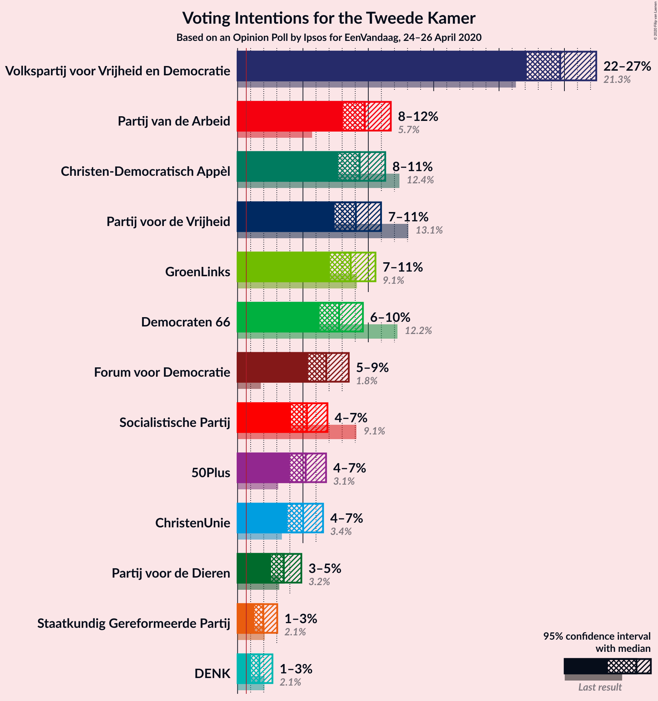

### Confidence Intervals

| Party | Last Result | Poll Result | 80% Confidence Interval | 90% Confidence Interval | 95% Confidence Interval | 99% Confidence Interval |
|:-----:|:-----------:|:-----------:|:-----------------------:|:-----------------------:|:-----------------------:|:-----------------------:|
| Volkspartij voor Vrijheid en Democratie | 21.3% | 24.7% | 23.0–26.5% |22.5–27.0% |22.1–27.4% |21.3–28.3% |
| Partij van de Arbeid | 5.7% | 9.7% | 8.6–11.0% |8.3–11.4% |8.1–11.7% |7.6–12.4% |
| Christen-Democratisch Appèl | 12.4% | 9.3% | 8.3–10.6% |8.0–11.0% |7.7–11.3% |7.2–11.9% |
| Partij voor de Vrijheid | 13.1% | 9.0% | 8.0–10.3% |7.7–10.7% |7.4–11.0% |7.0–11.6% |
| GroenLinks | 9.1% | 8.7% | 7.6–9.9% |7.3–10.2% |7.1–10.5% |6.6–11.2% |
| Democraten 66 | 12.2% | 7.8% | 6.8–8.9% |6.5–9.3% |6.3–9.6% |5.8–10.2% |
| Forum voor Democratie | 1.8% | 6.8% | 5.9–7.9% |5.6–8.2% |5.4–8.5% |5.0–9.1% |
| Socialistische Partij | 9.1% | 5.3% | 4.5–6.3% |4.3–6.6% |4.1–6.9% |3.7–7.4% |
| 50Plus | 3.1% | 5.2% | 4.4–6.2% |4.2–6.5% |4.0–6.8% |3.7–7.3% |
| ChristenUnie | 3.4% | 5.0% | 4.2–6.0% |4.0–6.3% |3.8–6.5% |3.5–7.0% |
| Partij voor de Dieren | 3.2% | 3.5% | 2.9–4.4% |2.7–4.6% |2.6–4.9% |2.3–5.3% |
| Staatkundig Gereformeerde Partij | 2.1% | 2.0% | 1.5–2.7% |1.4–2.9% |1.3–3.0% |1.1–3.4% |
| DENK | 2.1% | 1.7% | 1.2–2.3% |1.1–2.5% |1.0–2.7% |0.9–3.0% |

*Note:* The poll result column reflects the actual value used in the calculations. Published results may vary slightly, and in addition be rounded to fewer digits.

## Seats

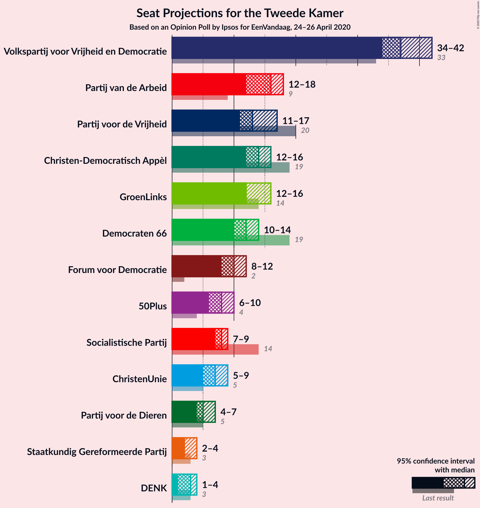

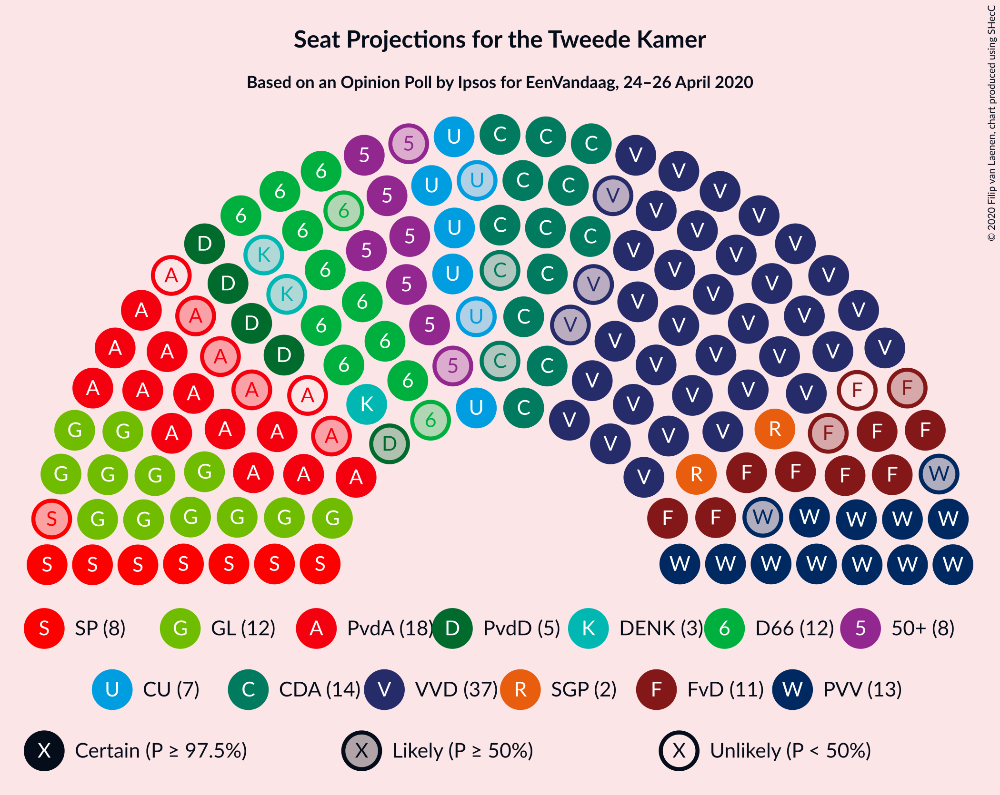

### Confidence Intervals

| Party | Last Result | Median | 80% Confidence Interval | 90% Confidence Interval | 95% Confidence Interval | 99% Confidence Interval |
|:-----:|:-----------:|:------:|:-----------------------:|:-----------------------:|:-----------------------:|:-----------------------:|
| <a href="#volkspartij-voor-vrijheid-en-democratie">Volkspartij voor Vrijheid en Democratie</a> | 33 | 37 | 37–42 |36–42 |36–42 |33–45 |
| <a href="#partij-van-de-arbeid">Partij van de Arbeid</a> | 9 | 15 | 15 |14–17 |13–18 |11–20 |
| <a href="#christen-democratisch-appèl">Christen-Democratisch Appèl</a> | 19 | 14 | 12–14 |12–15 |12–15 |10–17 |
| <a href="#partij-voor-de-vrijheid">Partij voor de Vrijheid</a> | 20 | 14 | 12–17 |12–17 |11–17 |11–17 |
| <a href="#groenlinks">GroenLinks</a> | 14 | 12 | 12–13 |12–13 |12–14 |11–16 |
| <a href="#democraten-66">Democraten 66</a> | 19 | 12 | 10–12 |10–12 |10–12 |9–16 |
| <a href="#forum-voor-democratie">Forum voor Democratie</a> | 2 | 10 | 9–11 |8–11 |8–12 |8–13 |
| <a href="#socialistische-partij">Socialistische Partij</a> | 14 | 8 | 8 |8–9 |6–9 |5–11 |
| <a href="#50plus">50Plus</a> | 4 | 7 | 7–9 |7–9 |6–10 |5–10 |
| <a href="#christenunie">ChristenUnie</a> | 5 | 6 | 5–8 |5–9 |5–9 |4–10 |
| <a href="#partij-voor-de-dieren">Partij voor de Dieren</a> | 5 | 5 | 4–5 |4–6 |4–7 |3–9 |
| <a href="#staatkundig-gereformeerde-partij">Staatkundig Gereformeerde Partij</a> | 3 | 3 | 3–4 |2–4 |1–4 |1–4 |
| <a href="#denk">DENK</a> | 3 | 2 | 2–3 |2–3 |1–3 |1–4 |

### Volkspartij voor Vrijheid en Democratie

*For a full overview of the results for this party, see the [Volkspartij voor Vrijheid en Democratie](party-volkspartijvoorvrijheidendemocratie.html) page.*

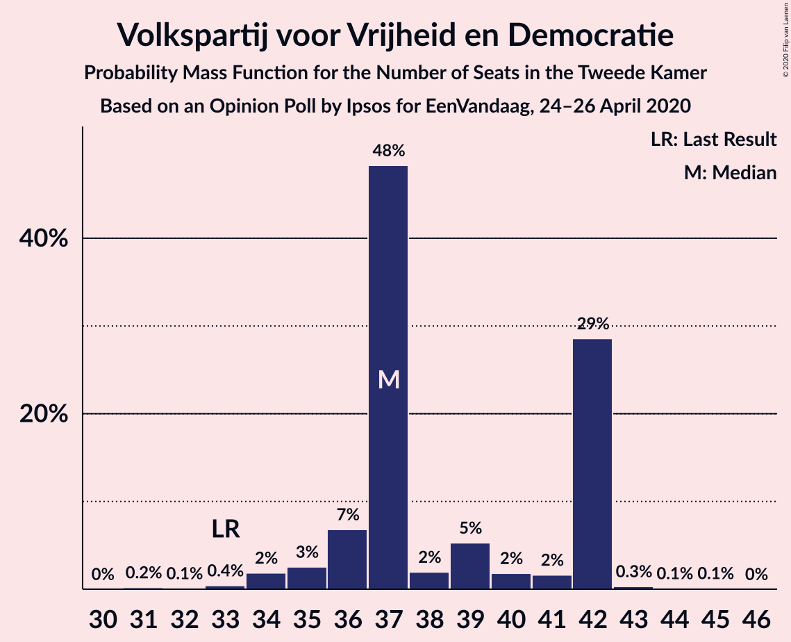

| Number of Seats | Probability | Accumulated | Special Marks |
|:---------------:|:-----------:|:-----------:|:-------------:|
| 32 | 0% | 100% |  |
| 33 | 0.8% | 99.9% | Last Result |
| 34 | 0.1% | 99.1% |  |
| 35 | 1.1% | 99.0% |  |
| 36 | 5% | 98% |  |
| 37 | 46% | 93% | Median |
| 38 | 2% | 46% |  |
| 39 | 5% | 44% |  |
| 40 | 1.3% | 39% |  |
| 41 | 0.3% | 38% |  |
| 42 | 37% | 38% |  |
| 43 | 0.4% | 1.0% |  |
| 44 | 0% | 0.5% |  |
| 45 | 0.5% | 0.5% |  |
| 46 | 0% | 0% |  |

### Partij van de Arbeid

*For a full overview of the results for this party, see the [Partij van de Arbeid](party-partijvandearbeid.html) page.*

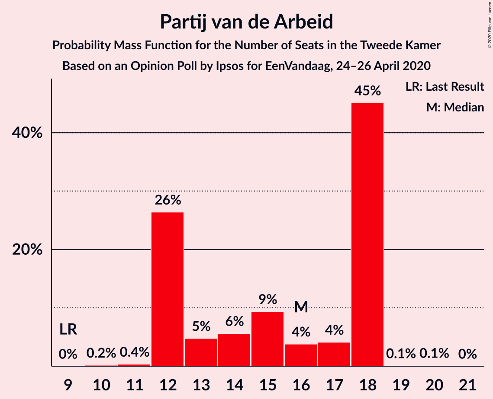

| Number of Seats | Probability | Accumulated | Special Marks |
|:---------------:|:-----------:|:-----------:|:-------------:|
| 9 | 0% | 100% | Last Result |
| 10 | 0% | 100% |  |
| 11 | 1.4% | 100% |  |
| 12 | 0.5% | 98.6% |  |
| 13 | 1.1% | 98% |  |
| 14 | 3% | 97% |  |
| 15 | 86% | 94% | Median |
| 16 | 2% | 8% |  |
| 17 | 3% | 7% |  |
| 18 | 1.0% | 3% |  |
| 19 | 0.5% | 2% |  |
| 20 | 2% | 2% |  |
| 21 | 0% | 0% |  |

### Christen-Democratisch Appèl

*For a full overview of the results for this party, see the [Christen-Democratisch Appèl](party-christen-democratischappèl.html) page.*

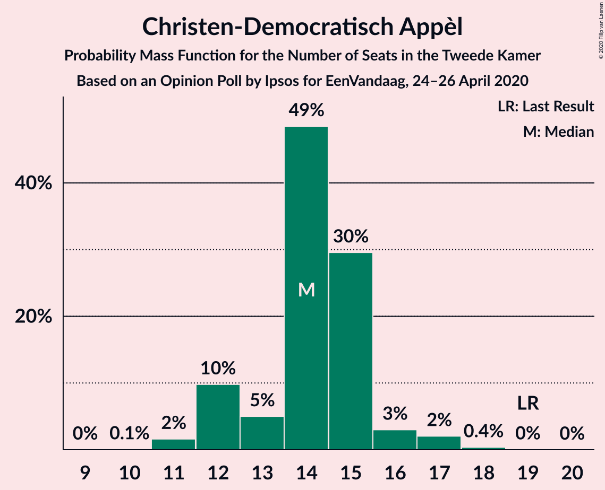

| Number of Seats | Probability | Accumulated | Special Marks |
|:---------------:|:-----------:|:-----------:|:-------------:|
| 9 | 0.1% | 100% |  |
| 10 | 0.4% | 99.9% |  |
| 11 | 0.4% | 99.5% |  |
| 12 | 38% | 99.1% |  |
| 13 | 3% | 61% |  |
| 14 | 53% | 58% | Median |
| 15 | 3% | 5% |  |
| 16 | 0.3% | 2% |  |
| 17 | 1.5% | 2% |  |
| 18 | 0.1% | 0.1% |  |
| 19 | 0% | 0% | Last Result |

### Partij voor de Vrijheid

*For a full overview of the results for this party, see the [Partij voor de Vrijheid](party-partijvoordevrijheid.html) page.*

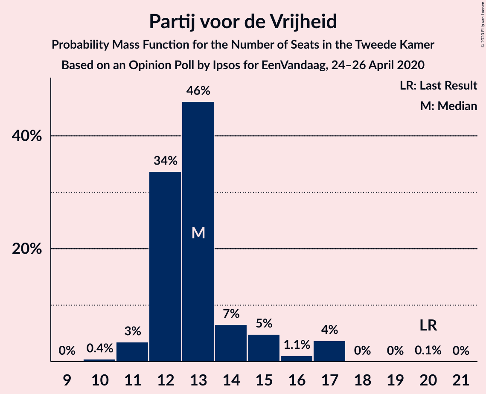

| Number of Seats | Probability | Accumulated | Special Marks |
|:---------------:|:-----------:|:-----------:|:-------------:|
| 9 | 0.1% | 100% |  |
| 10 | 0.1% | 99.9% |  |
| 11 | 4% | 99.8% |  |
| 12 | 38% | 95% |  |
| 13 | 1.4% | 57% |  |
| 14 | 6% | 56% | Median |
| 15 | 1.2% | 49% |  |
| 16 | 2% | 48% |  |
| 17 | 46% | 46% |  |
| 18 | 0% | 0% |  |
| 19 | 0% | 0% |  |
| 20 | 0% | 0% | Last Result |

### GroenLinks

*For a full overview of the results for this party, see the [GroenLinks](party-groenlinks.html) page.*

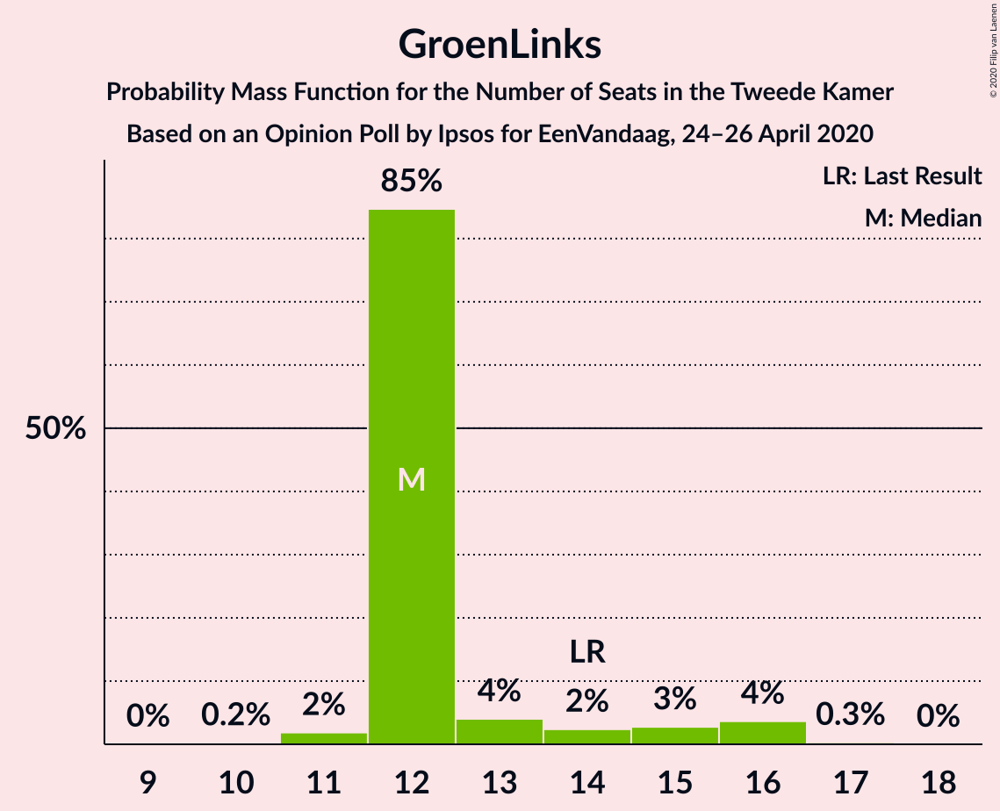

| Number of Seats | Probability | Accumulated | Special Marks |
|:---------------:|:-----------:|:-----------:|:-------------:|
| 10 | 0.4% | 100% |  |
| 11 | 1.5% | 99.6% |  |
| 12 | 87% | 98% | Median |
| 13 | 6% | 11% |  |
| 14 | 3% | 5% | Last Result |
| 15 | 2% | 2% |  |
| 16 | 0.3% | 0.7% |  |
| 17 | 0.4% | 0.5% |  |
| 18 | 0% | 0% |  |

### Democraten 66

*For a full overview of the results for this party, see the [Democraten 66](party-democraten66.html) page.*

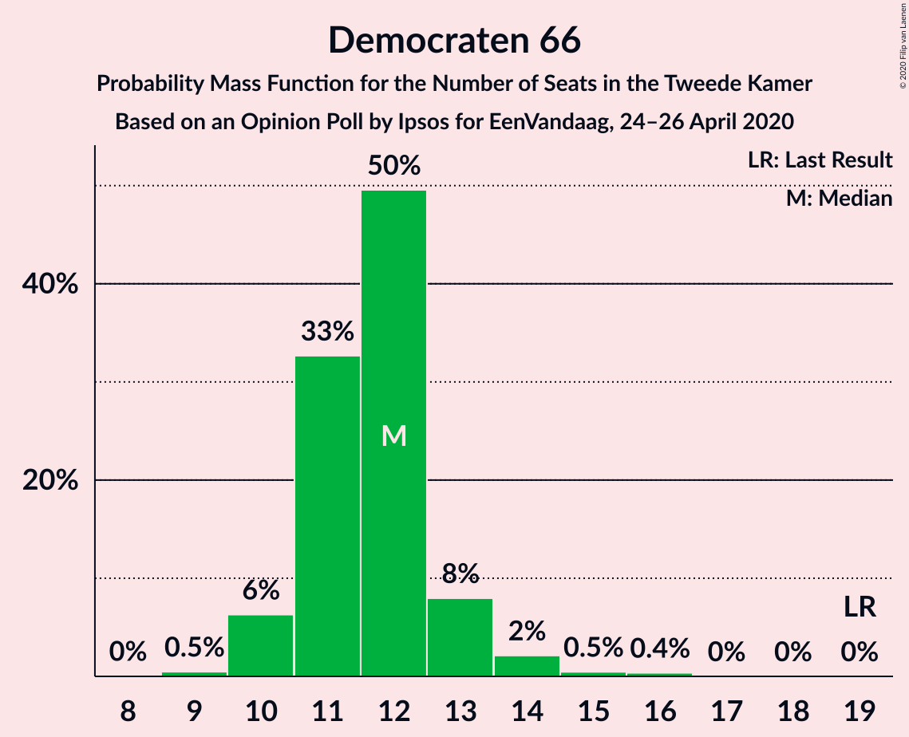

| Number of Seats | Probability | Accumulated | Special Marks |
|:---------------:|:-----------:|:-----------:|:-------------:|
| 8 | 0.2% | 100% |  |
| 9 | 1.0% | 99.8% |  |
| 10 | 38% | 98.8% |  |
| 11 | 9% | 61% |  |
| 12 | 49% | 52% | Median |
| 13 | 0.7% | 2% |  |
| 14 | 0.7% | 2% |  |
| 15 | 0.2% | 1.1% |  |
| 16 | 0.9% | 0.9% |  |
| 17 | 0% | 0% |  |
| 18 | 0% | 0% |  |
| 19 | 0% | 0% | Last Result |

### Forum voor Democratie

*For a full overview of the results for this party, see the [Forum voor Democratie](party-forumvoordemocratie.html) page.*

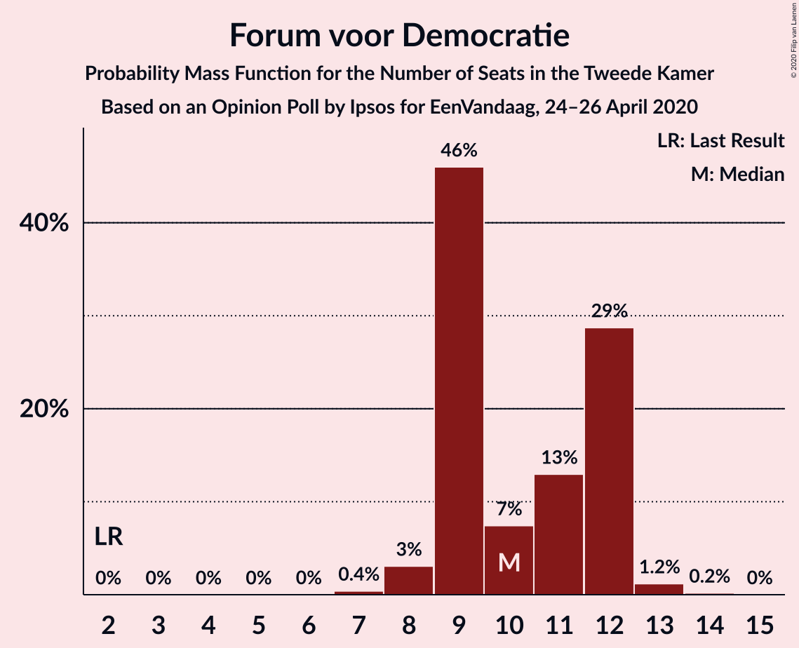

| Number of Seats | Probability | Accumulated | Special Marks |
|:---------------:|:-----------:|:-----------:|:-------------:|
| 2 | 0% | 100% | Last Result |
| 3 | 0% | 100% |  |
| 4 | 0% | 100% |  |
| 5 | 0% | 100% |  |
| 6 | 0% | 100% |  |
| 7 | 0.1% | 100% |  |
| 8 | 6% | 99.9% |  |
| 9 | 5% | 94% |  |
| 10 | 48% | 88% | Median |
| 11 | 38% | 41% |  |
| 12 | 2% | 3% |  |
| 13 | 0.9% | 1.1% |  |
| 14 | 0.1% | 0.2% |  |
| 15 | 0.1% | 0.1% |  |
| 16 | 0% | 0% |  |

### Socialistische Partij

*For a full overview of the results for this party, see the [Socialistische Partij](party-socialistischepartij.html) page.*

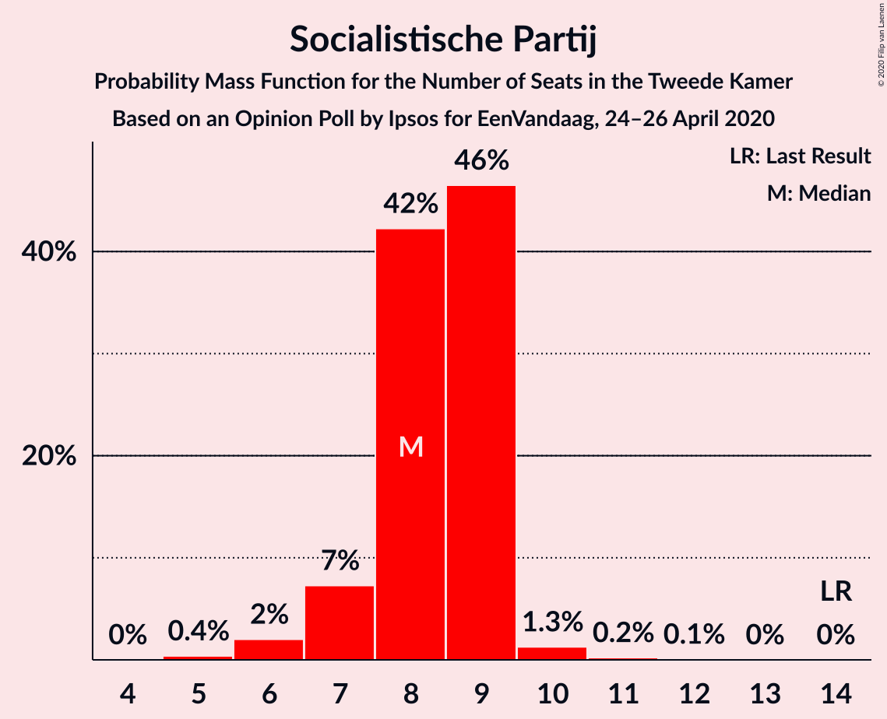

| Number of Seats | Probability | Accumulated | Special Marks |
|:---------------:|:-----------:|:-----------:|:-------------:|
| 5 | 1.4% | 100% |  |
| 6 | 2% | 98.6% |  |
| 7 | 1.3% | 97% |  |
| 8 | 87% | 95% | Median |
| 9 | 6% | 8% |  |
| 10 | 2% | 2% |  |
| 11 | 0.9% | 1.0% |  |
| 12 | 0% | 0% |  |
| 13 | 0% | 0% |  |
| 14 | 0% | 0% | Last Result |

### 50Plus

*For a full overview of the results for this party, see the [50Plus](party-50plus.html) page.*

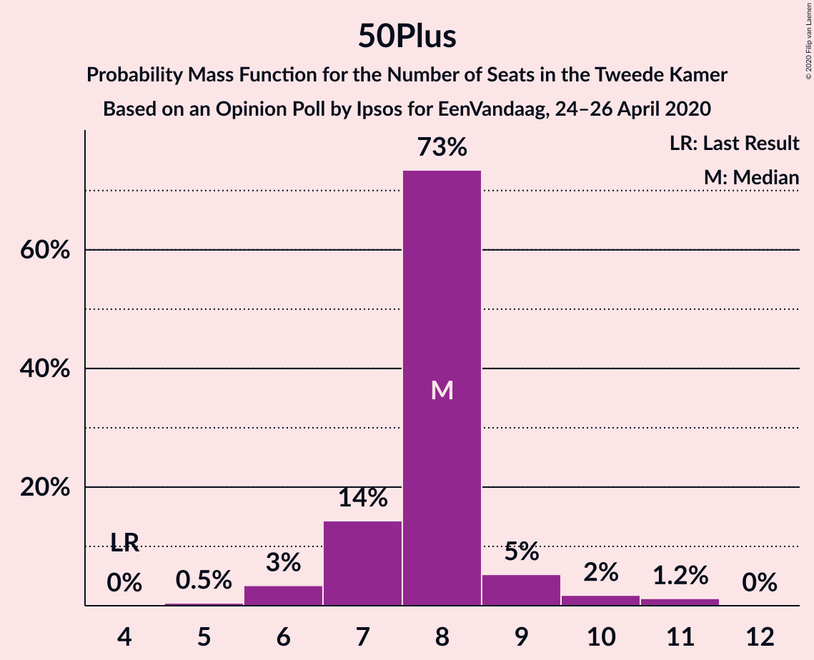

| Number of Seats | Probability | Accumulated | Special Marks |
|:---------------:|:-----------:|:-----------:|:-------------:|
| 4 | 0% | 100% | Last Result |
| 5 | 0.5% | 100% |  |
| 6 | 3% | 99.5% |  |
| 7 | 50% | 97% | Median |
| 8 | 5% | 47% |  |
| 9 | 38% | 42% |  |
| 10 | 3% | 4% |  |
| 11 | 0.2% | 0.2% |  |
| 12 | 0% | 0% |  |

### ChristenUnie

*For a full overview of the results for this party, see the [ChristenUnie](party-christenunie.html) page.*

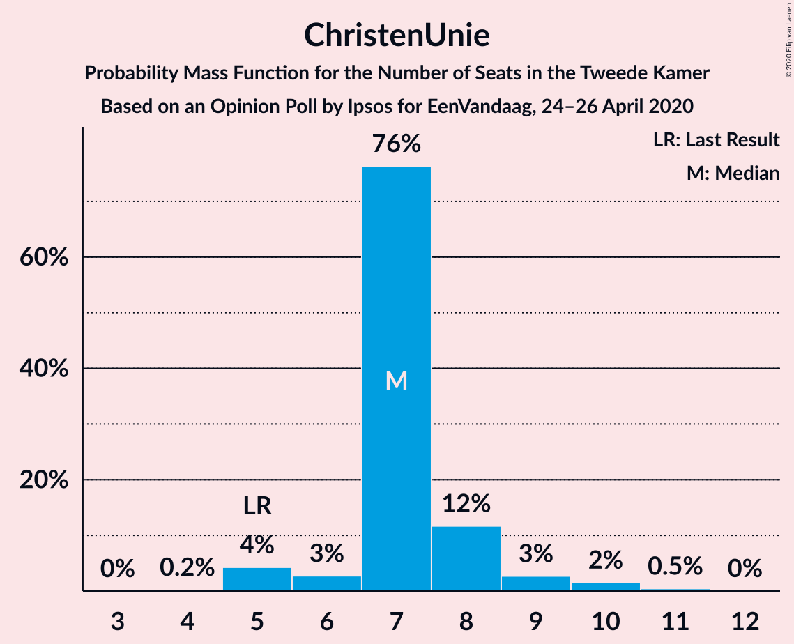

| Number of Seats | Probability | Accumulated | Special Marks |
|:---------------:|:-----------:|:-----------:|:-------------:|
| 4 | 2% | 100% |  |
| 5 | 46% | 98% | Last Result |
| 6 | 2% | 52% | Median |
| 7 | 39% | 50% |  |
| 8 | 5% | 11% |  |
| 9 | 5% | 6% |  |
| 10 | 0.7% | 0.8% |  |
| 11 | 0.1% | 0.1% |  |
| 12 | 0% | 0% |  |

### Partij voor de Dieren

*For a full overview of the results for this party, see the [Partij voor de Dieren](party-partijvoordedieren.html) page.*

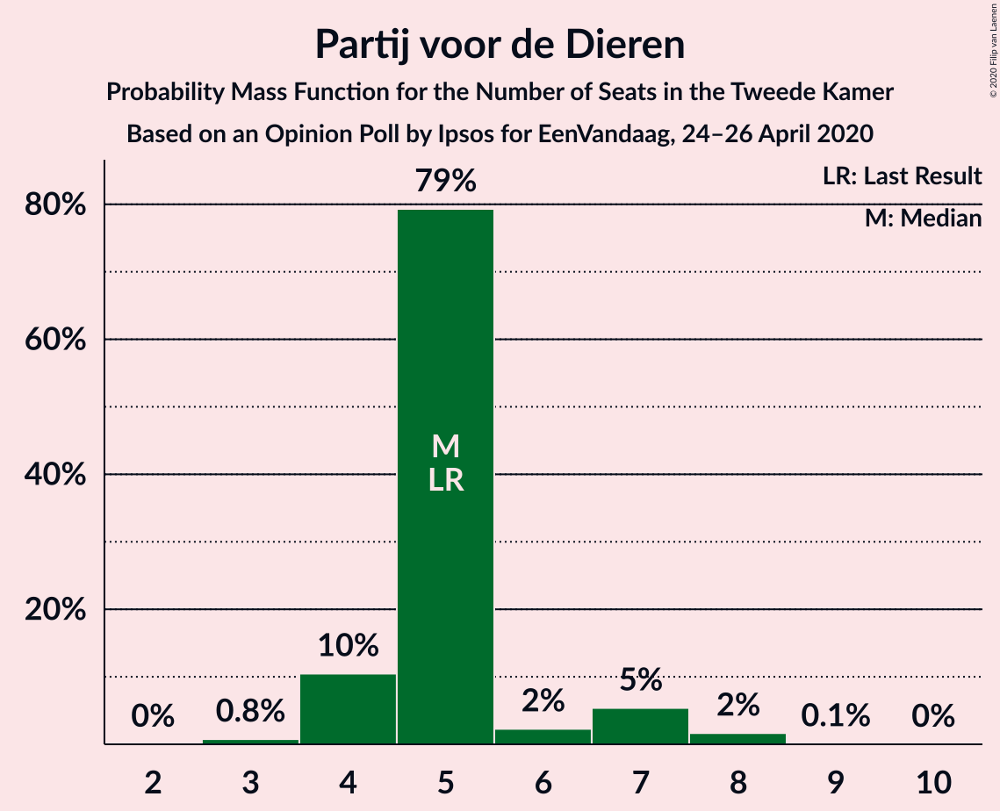

| Number of Seats | Probability | Accumulated | Special Marks |
|:---------------:|:-----------:|:-----------:|:-------------:|
| 3 | 0.6% | 100% |  |
| 4 | 41% | 99.4% |  |
| 5 | 51% | 58% | Last Result, Median |
| 6 | 4% | 7% |  |
| 7 | 2% | 4% |  |
| 8 | 0.3% | 1.4% |  |
| 9 | 1.0% | 1.1% |  |
| 10 | 0% | 0% |  |

### Staatkundig Gereformeerde Partij

*For a full overview of the results for this party, see the [Staatkundig Gereformeerde Partij](party-staatkundiggereformeerdepartij.html) page.*

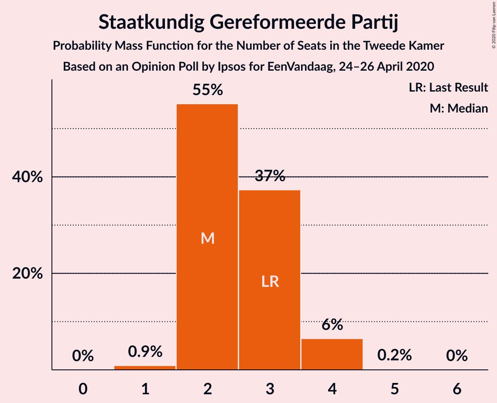

| Number of Seats | Probability | Accumulated | Special Marks |
|:---------------:|:-----------:|:-----------:|:-------------:|
| 1 | 3% | 100% |  |
| 2 | 3% | 97% |  |
| 3 | 45% | 94% | Last Result, Median |
| 4 | 49% | 49% |  |
| 5 | 0.3% | 0.4% |  |
| 6 | 0.1% | 0.1% |  |
| 7 | 0% | 0% |  |

### DENK

*For a full overview of the results for this party, see the [DENK](party-denk.html) page.*

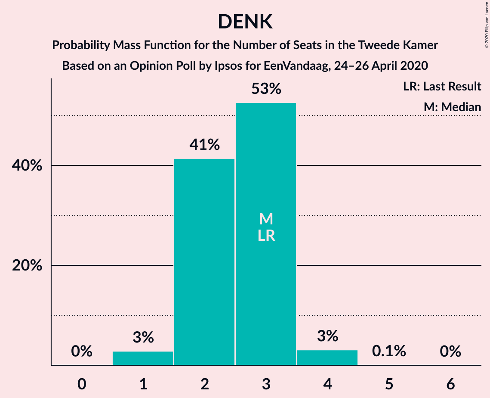

| Number of Seats | Probability | Accumulated | Special Marks |
|:---------------:|:-----------:|:-----------:|:-------------:|
| 1 | 3% | 100% |  |
| 2 | 56% | 97% | Median |
| 3 | 39% | 41% | Last Result |
| 4 | 1.1% | 1.4% |  |
| 5 | 0.3% | 0.3% |  |
| 6 | 0% | 0% |  |

## Coalitions

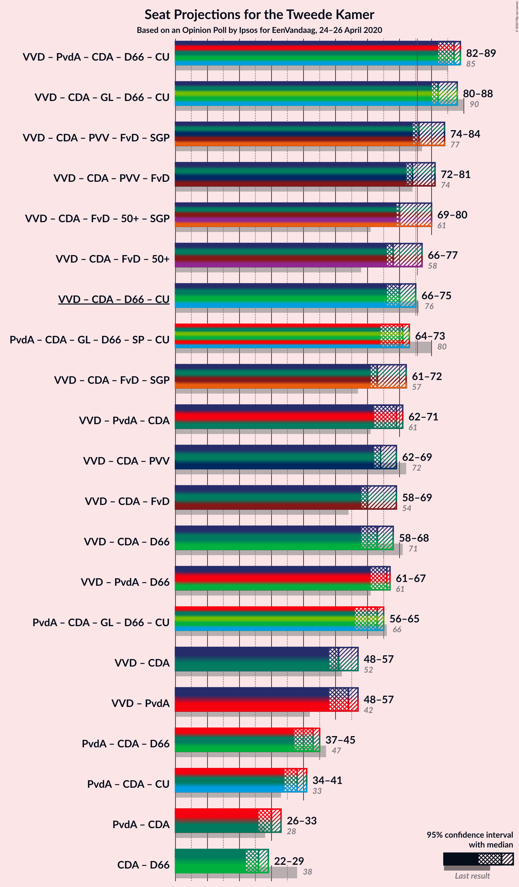

### Confidence Intervals

| Coalition | Last Result | Median | Majority? | 80% Confidence Interval | 90% Confidence Interval | 95% Confidence Interval | 99% Confidence Interval |
|:---------:|:-----------:|:------:|:---------:|:-----------------------:|:-----------------------:|:-----------------------:|:-----------------------:|
| Volkspartij voor Vrijheid en Democratie – Partij van de Arbeid – Christen-Democratisch Appèl – Democraten 66 – ChristenUnie | 85 | 84 | 100% | 83–86 | 83–88 | 83–91 | 79–92 |
| Volkspartij voor Vrijheid en Democratie – Christen-Democratisch Appèl – GroenLinks – Democraten 66 – ChristenUnie | 90 | 81 | 99.8% | 80–84 | 80–85 | 80–87 | 77–90 |
| Volkspartij voor Vrijheid en Democratie – Christen-Democratisch Appèl – Partij voor de Vrijheid – Forum voor Democratie – Staatkundig Gereformeerde Partij | 77 | 80 | 95% | 78–82 | 75–82 | 75–82 | 73–83 |
| Volkspartij voor Vrijheid en Democratie – Christen-Democratisch Appèl – Partij voor de Vrijheid – Forum voor Democratie | 74 | 77 | 90% | 75–78 | 72–78 | 71–78 | 70–80 |
| Volkspartij voor Vrijheid en Democratie – Christen-Democratisch Appèl – Forum voor Democratie – 50Plus – Staatkundig Gereformeerde Partij | 61 | 72 | 37% | 72–77 | 70–77 | 69–77 | 67–77 |
| Volkspartij voor Vrijheid en Democratie – Christen-Democratisch Appèl – Forum voor Democratie – 50Plus | 58 | 68 | 0.4% | 68–74 | 67–74 | 66–74 | 64–74 |
| Partij van de Arbeid – Christen-Democratisch Appèl – GroenLinks – Democraten 66 – Socialistische Partij – ChristenUnie | 80 | 66 | 0.1% | 64–69 | 64–72 | 64–74 | 63–74 |
| Volkspartij voor Vrijheid en Democratie – Christen-Democratisch Appèl – Democraten 66 – ChristenUnie | 76 | 69 | 0.6% | 68–71 | 68–72 | 68–73 | 64–78 |
| Volkspartij voor Vrijheid en Democratie – Partij van de Arbeid – Christen-Democratisch Appèl | 61 | 66 | 0% | 66–69 | 64–71 | 64–71 | 61–73 |
| Volkspartij voor Vrijheid en Democratie – Christen-Democratisch Appèl – Partij voor de Vrijheid | 72 | 68 | 0% | 65–68 | 62–68 | 61–69 | 60–72 |
| Volkspartij voor Vrijheid en Democratie – Partij van de Arbeid – Democraten 66 | 61 | 64 | 0% | 64–67 | 64–67 | 60–69 | 58–70 |
| Volkspartij voor Vrijheid en Democratie – Christen-Democratisch Appèl – Forum voor Democratie – Staatkundig Gereformeerde Partij | 57 | 65 | 0% | 64–68 | 62–68 | 62–68 | 59–70 |
| Volkspartij voor Vrijheid en Democratie – Christen-Democratisch Appèl – Democraten 66 | 71 | 63 | 0% | 63–64 | 62–65 | 61–65 | 58–70 |
| Volkspartij voor Vrijheid en Democratie – Christen-Democratisch Appèl – Forum voor Democratie | 54 | 61 | 0% | 61–65 | 60–65 | 59–65 | 57–67 |
| Partij van de Arbeid – Christen-Democratisch Appèl – GroenLinks – Democraten 66 – ChristenUnie | 66 | 58 | 0% | 56–61 | 56–63 | 56–65 | 55–66 |
| Volkspartij voor Vrijheid en Democratie – Partij van de Arbeid | 42 | 52 | 0% | 52–57 | 50–57 | 49–58 | 47–59 |
| Volkspartij voor Vrijheid en Democratie – Christen-Democratisch Appèl | 52 | 51 | 0% | 51–54 | 50–54 | 49–54 | 46–59 |
| Partij van de Arbeid – Christen-Democratisch Appèl – Democraten 66 | 47 | 41 | 0% | 37–41 | 37–43 | 37–44 | 37–44 |
| Partij van de Arbeid – Christen-Democratisch Appèl – ChristenUnie | 33 | 34 | 0% | 34–37 | 34–38 | 34–39 | 31–42 |
| Partij van de Arbeid – Christen-Democratisch Appèl | 28 | 29 | 0% | 27–29 | 27–32 | 27–32 | 25–33 |
| Christen-Democratisch Appèl – Democraten 66 | 38 | 26 | 0% | 22–26 | 22–26 | 22–28 | 22–30 |

### Volkspartij voor Vrijheid en Democratie – Partij van de Arbeid – Christen-Democratisch Appèl – Democraten 66 – ChristenUnie

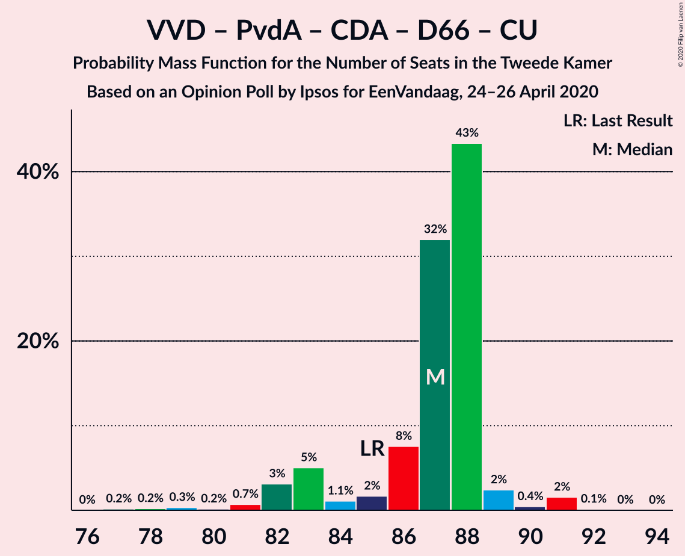

| Number of Seats | Probability | Accumulated | Special Marks |
|:---------------:|:-----------:|:-----------:|:-------------:|
| 78 | 0.4% | 100% |  |
| 79 | 0.2% | 99.5% |  |
| 80 | 0.2% | 99.3% |  |
| 81 | 0.1% | 99.2% |  |
| 82 | 0.6% | 99.1% |  |
| 83 | 47% | 98% |  |
| 84 | 2% | 52% | Median |
| 85 | 2% | 50% | Last Result |
| 86 | 39% | 48% |  |
| 87 | 3% | 8% |  |
| 88 | 2% | 5% |  |
| 89 | 1.1% | 4% |  |
| 90 | 0.1% | 3% |  |
| 91 | 2% | 3% |  |
| 92 | 0.5% | 0.5% |  |
| 93 | 0% | 0% |  |

### Volkspartij voor Vrijheid en Democratie – Christen-Democratisch Appèl – GroenLinks – Democraten 66 – ChristenUnie

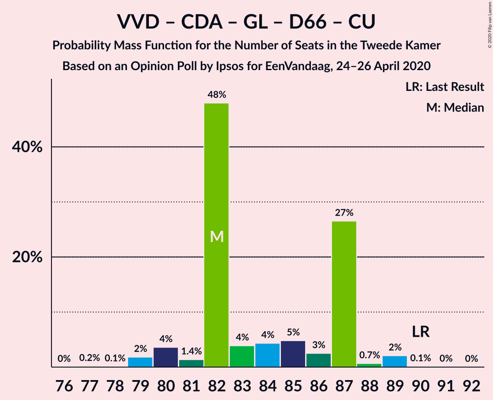

| Number of Seats | Probability | Accumulated | Special Marks |
|:---------------:|:-----------:|:-----------:|:-------------:|
| 75 | 0.2% | 100% |  |
| 76 | 0% | 99.8% | Majority |
| 77 | 0.4% | 99.8% |  |
| 78 | 0.2% | 99.4% |  |
| 79 | 0.1% | 99.2% |  |
| 80 | 46% | 99.2% |  |
| 81 | 3% | 53% | Median |
| 82 | 2% | 49% |  |
| 83 | 37% | 48% |  |
| 84 | 5% | 11% |  |
| 85 | 2% | 6% |  |
| 86 | 0.2% | 4% |  |
| 87 | 3% | 4% |  |
| 88 | 0.2% | 1.0% |  |
| 89 | 0.2% | 0.8% |  |
| 90 | 0.5% | 0.6% | Last Result |
| 91 | 0.1% | 0.1% |  |
| 92 | 0% | 0% |  |

### Volkspartij voor Vrijheid en Democratie – Christen-Democratisch Appèl – Partij voor de Vrijheid – Forum voor Democratie – Staatkundig Gereformeerde Partij

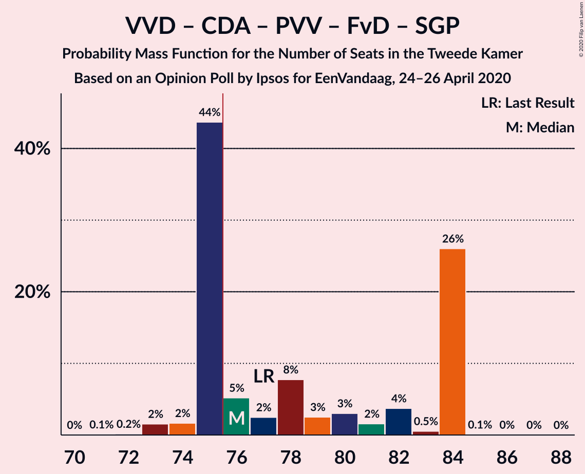

| Number of Seats | Probability | Accumulated | Special Marks |
|:---------------:|:-----------:|:-----------:|:-------------:|
| 72 | 0% | 100% |  |
| 73 | 2% | 99.9% |  |
| 74 | 0.3% | 98% |  |
| 75 | 3% | 98% |  |
| 76 | 2% | 95% | Majority |
| 77 | 2% | 93% | Last Result |
| 78 | 3% | 90% | Median |
| 79 | 3% | 88% |  |
| 80 | 37% | 85% |  |
| 81 | 1.2% | 48% |  |
| 82 | 46% | 47% |  |
| 83 | 0.5% | 0.8% |  |
| 84 | 0.3% | 0.3% |  |
| 85 | 0% | 0% |  |

### Volkspartij voor Vrijheid en Democratie – Christen-Democratisch Appèl – Partij voor de Vrijheid – Forum voor Democratie

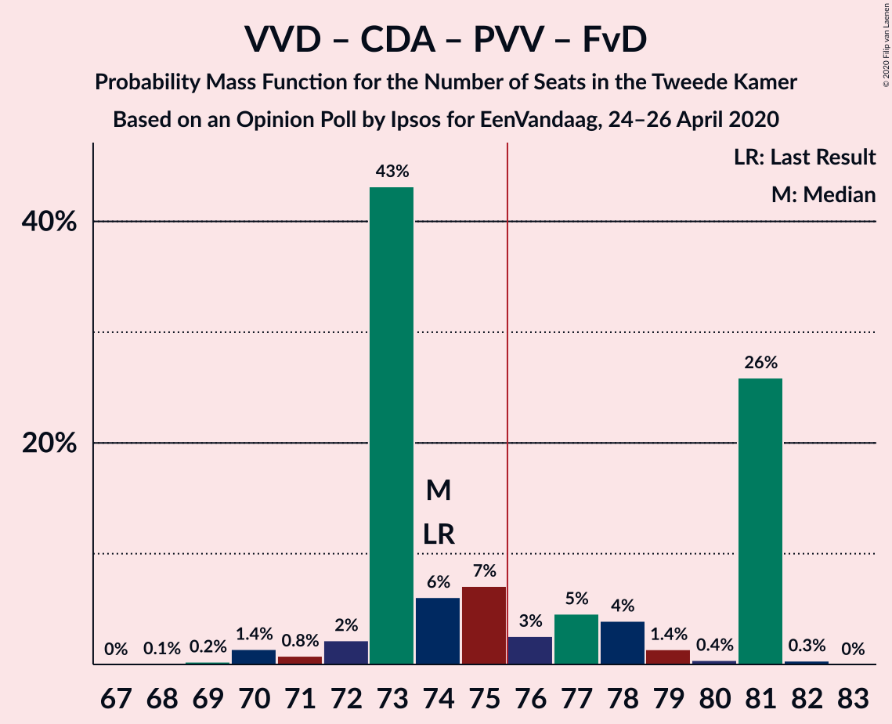

| Number of Seats | Probability | Accumulated | Special Marks |
|:---------------:|:-----------:|:-----------:|:-------------:|
| 69 | 0% | 100% |  |
| 70 | 1.5% | 99.9% |  |
| 71 | 3% | 98% |  |
| 72 | 1.1% | 96% |  |
| 73 | 2% | 95% |  |
| 74 | 2% | 93% | Last Result |
| 75 | 1.2% | 91% | Median |
| 76 | 3% | 90% | Majority |
| 77 | 39% | 87% |  |
| 78 | 46% | 48% |  |
| 79 | 0.2% | 2% |  |
| 80 | 0.9% | 1.4% |  |
| 81 | 0.5% | 0.5% |  |
| 82 | 0% | 0% |  |

### Volkspartij voor Vrijheid en Democratie – Christen-Democratisch Appèl – Forum voor Democratie – 50Plus – Staatkundig Gereformeerde Partij

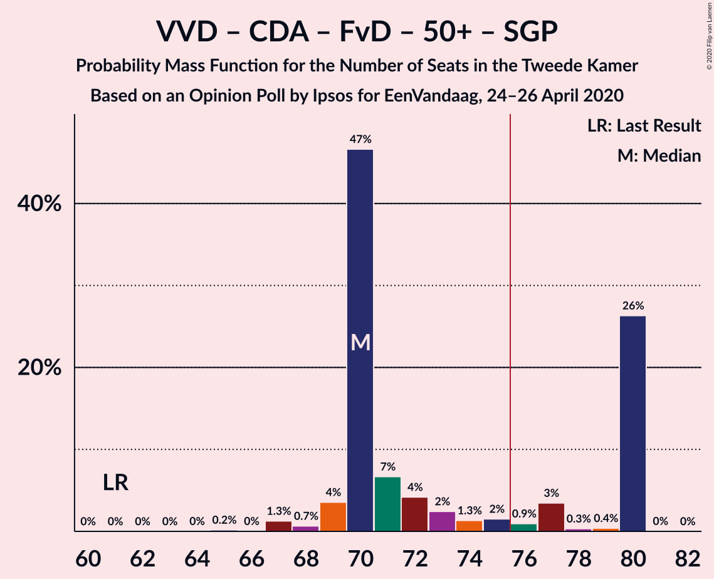

| Number of Seats | Probability | Accumulated | Special Marks |
|:---------------:|:-----------:|:-----------:|:-------------:|
| 61 | 0% | 100% | Last Result |
| 62 | 0% | 100% |  |
| 63 | 0% | 100% |  |
| 64 | 0% | 100% |  |
| 65 | 0% | 100% |  |
| 66 | 0% | 100% |  |
| 67 | 0.5% | 99.9% |  |
| 68 | 0.9% | 99.5% |  |
| 69 | 2% | 98.6% |  |
| 70 | 3% | 96% |  |
| 71 | 1.4% | 94% | Median |
| 72 | 49% | 92% |  |
| 73 | 3% | 43% |  |
| 74 | 1.0% | 40% |  |
| 75 | 2% | 39% |  |
| 76 | 0% | 37% | Majority |
| 77 | 37% | 37% |  |
| 78 | 0.1% | 0.4% |  |
| 79 | 0% | 0.3% |  |
| 80 | 0.3% | 0.3% |  |
| 81 | 0% | 0% |  |

### Volkspartij voor Vrijheid en Democratie – Christen-Democratisch Appèl – Forum voor Democratie – 50Plus

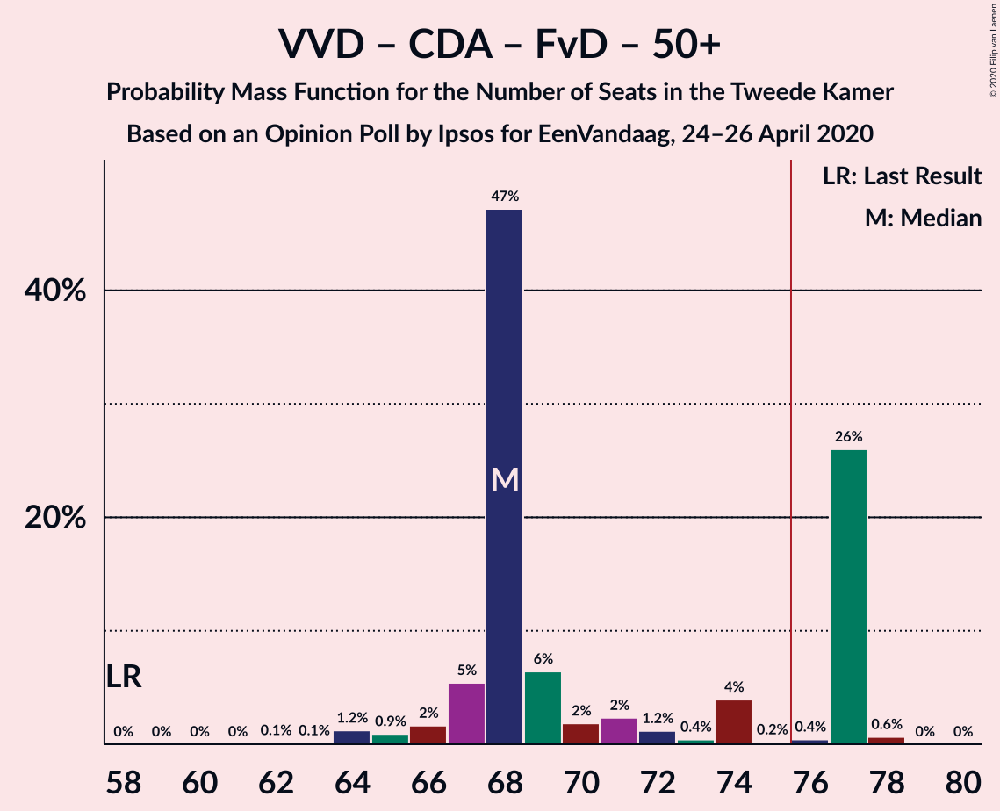

| Number of Seats | Probability | Accumulated | Special Marks |
|:---------------:|:-----------:|:-----------:|:-------------:|
| 58 | 0% | 100% | Last Result |
| 59 | 0% | 100% |  |
| 60 | 0% | 100% |  |
| 61 | 0% | 100% |  |
| 62 | 0% | 100% |  |
| 63 | 0% | 100% |  |
| 64 | 0.5% | 99.9% |  |
| 65 | 0.4% | 99.5% |  |
| 66 | 4% | 99.1% |  |
| 67 | 1.0% | 95% |  |
| 68 | 47% | 94% | Median |
| 69 | 2% | 47% |  |
| 70 | 3% | 45% |  |
| 71 | 2% | 42% |  |
| 72 | 2% | 40% |  |
| 73 | 0.1% | 38% |  |
| 74 | 37% | 38% |  |
| 75 | 0.1% | 0.4% |  |
| 76 | 0.3% | 0.4% | Majority |
| 77 | 0% | 0.1% |  |
| 78 | 0.1% | 0.1% |  |
| 79 | 0% | 0% |  |

### Partij van de Arbeid – Christen-Democratisch Appèl – GroenLinks – Democraten 66 – Socialistische Partij – ChristenUnie

| Number of Seats | Probability | Accumulated | Special Marks |
|:---------------:|:-----------:|:-----------:|:-------------:|
| 62 | 0% | 100% |  |
| 63 | 0.5% | 99.9% |  |
| 64 | 37% | 99.4% |  |
| 65 | 0.5% | 63% |  |
| 66 | 47% | 62% |  |
| 67 | 1.0% | 16% | Median |
| 68 | 4% | 15% |  |
| 69 | 1.2% | 10% |  |
| 70 | 4% | 9% |  |
| 71 | 0.1% | 6% |  |
| 72 | 2% | 6% |  |
| 73 | 0.5% | 3% |  |
| 74 | 3% | 3% |  |
| 75 | 0% | 0.1% |  |
| 76 | 0% | 0.1% | Majority |
| 77 | 0% | 0% |  |
| 78 | 0% | 0% |  |
| 79 | 0% | 0% |  |
| 80 | 0% | 0% | Last Result |

### Volkspartij voor Vrijheid en Democratie – Christen-Democratisch Appèl – Democraten 66 – ChristenUnie

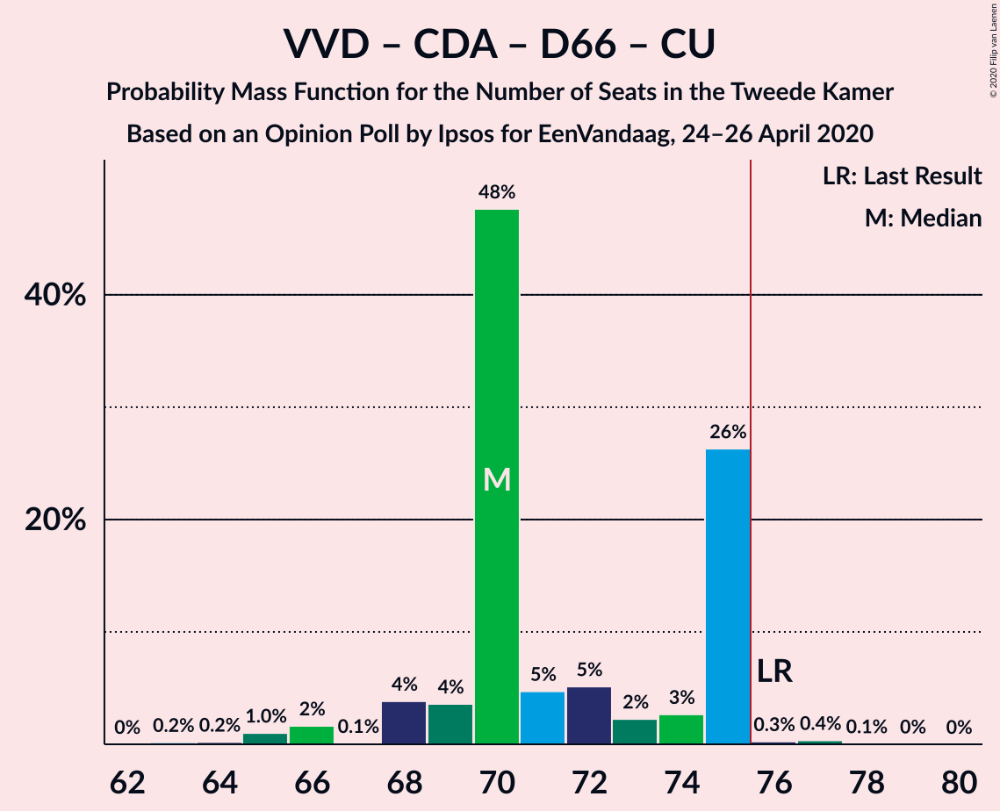

| Number of Seats | Probability | Accumulated | Special Marks |
|:---------------:|:-----------:|:-----------:|:-------------:|
| 64 | 0.7% | 100% |  |
| 65 | 0.3% | 99.2% |  |
| 66 | 0.2% | 98.9% |  |
| 67 | 0.1% | 98.7% |  |
| 68 | 46% | 98.6% |  |
| 69 | 4% | 52% | Median |
| 70 | 3% | 49% |  |
| 71 | 39% | 46% |  |
| 72 | 2% | 6% |  |
| 73 | 2% | 4% |  |
| 74 | 1.1% | 2% |  |
| 75 | 0.1% | 0.7% |  |
| 76 | 0.1% | 0.6% | Last Result, Majority |
| 77 | 0.1% | 0.6% |  |
| 78 | 0.5% | 0.5% |  |
| 79 | 0% | 0% |  |

### Volkspartij voor Vrijheid en Democratie – Partij van de Arbeid – Christen-Democratisch Appèl

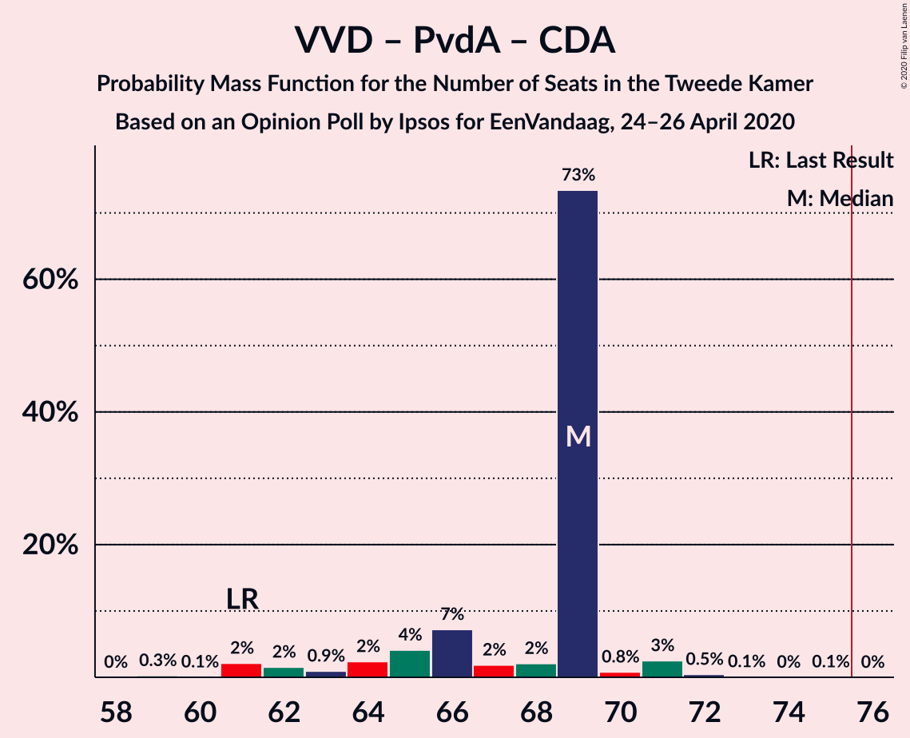

| Number of Seats | Probability | Accumulated | Special Marks |
|:---------------:|:-----------:|:-----------:|:-------------:|
| 59 | 0.4% | 100% |  |
| 60 | 0.1% | 99.6% |  |
| 61 | 0.5% | 99.5% | Last Result |
| 62 | 0.4% | 99.1% |  |
| 63 | 0.5% | 98.7% |  |
| 64 | 4% | 98% |  |
| 65 | 0.7% | 94% |  |
| 66 | 47% | 94% | Median |
| 67 | 0.3% | 46% |  |
| 68 | 2% | 46% |  |
| 69 | 37% | 44% |  |
| 70 | 1.1% | 7% |  |
| 71 | 5% | 6% |  |
| 72 | 0.1% | 0.6% |  |
| 73 | 0.5% | 0.5% |  |
| 74 | 0% | 0% |  |

### Volkspartij voor Vrijheid en Democratie – Christen-Democratisch Appèl – Partij voor de Vrijheid

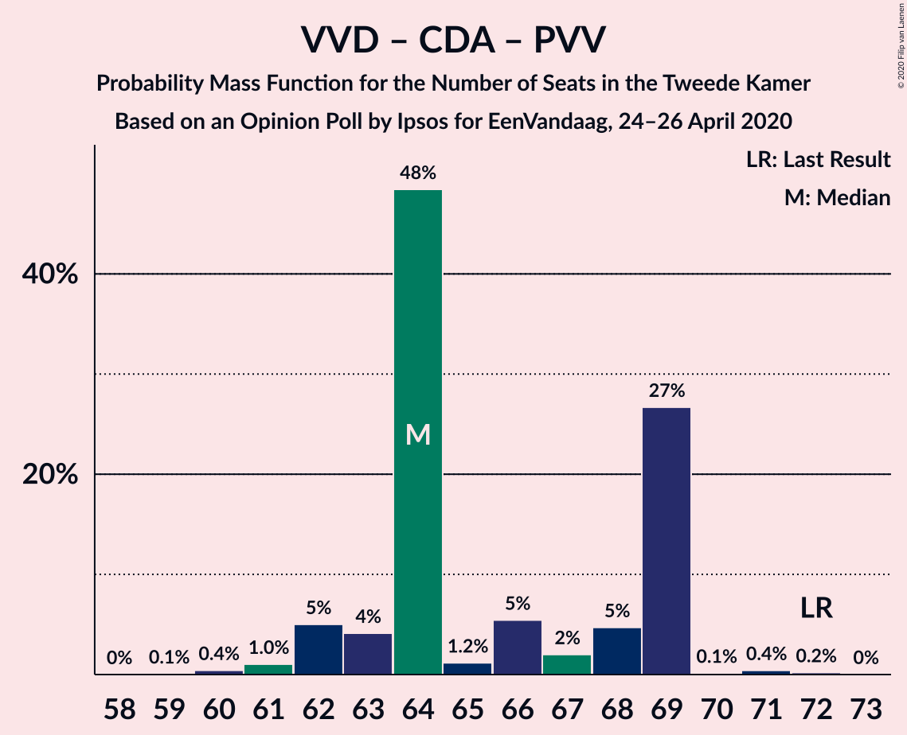

| Number of Seats | Probability | Accumulated | Special Marks |
|:---------------:|:-----------:|:-----------:|:-------------:|
| 59 | 0% | 100% |  |
| 60 | 2% | 99.9% |  |
| 61 | 1.4% | 98% |  |
| 62 | 2% | 97% |  |
| 63 | 1.2% | 95% |  |
| 64 | 2% | 93% |  |
| 65 | 2% | 92% | Median |
| 66 | 37% | 90% |  |
| 67 | 1.4% | 53% |  |
| 68 | 48% | 52% |  |
| 69 | 2% | 3% |  |
| 70 | 0.4% | 1.0% |  |
| 71 | 0% | 0.6% |  |
| 72 | 0.5% | 0.5% | Last Result |
| 73 | 0% | 0% |  |

### Volkspartij voor Vrijheid en Democratie – Partij van de Arbeid – Democraten 66

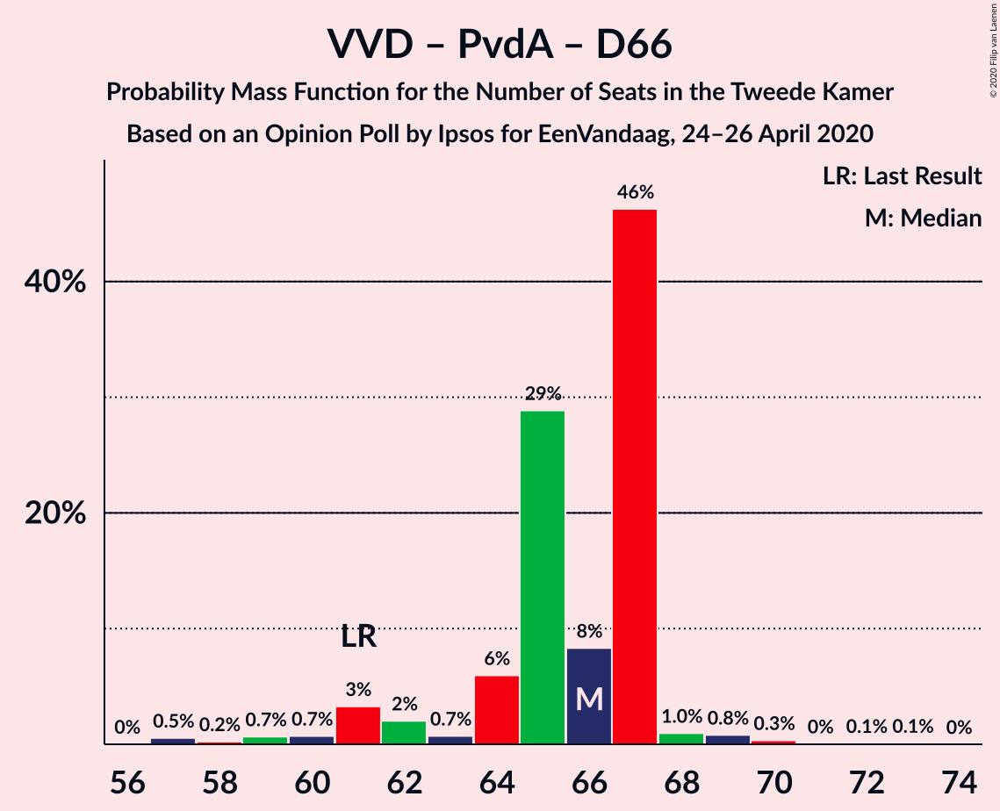

| Number of Seats | Probability | Accumulated | Special Marks |
|:---------------:|:-----------:|:-----------:|:-------------:|
| 56 | 0.1% | 100% |  |
| 57 | 0.1% | 99.9% |  |
| 58 | 2% | 99.9% |  |
| 59 | 0% | 98% |  |
| 60 | 0.8% | 98% |  |
| 61 | 0.1% | 97% | Last Result |
| 62 | 1.1% | 97% |  |
| 63 | 0.5% | 96% |  |
| 64 | 48% | 95% | Median |
| 65 | 3% | 48% |  |
| 66 | 1.2% | 44% |  |
| 67 | 39% | 43% |  |
| 68 | 1.2% | 4% |  |
| 69 | 2% | 3% |  |
| 70 | 0.5% | 0.6% |  |
| 71 | 0.1% | 0.1% |  |
| 72 | 0% | 0% |  |

### Volkspartij voor Vrijheid en Democratie – Christen-Democratisch Appèl – Forum voor Democratie – Staatkundig Gereformeerde Partij

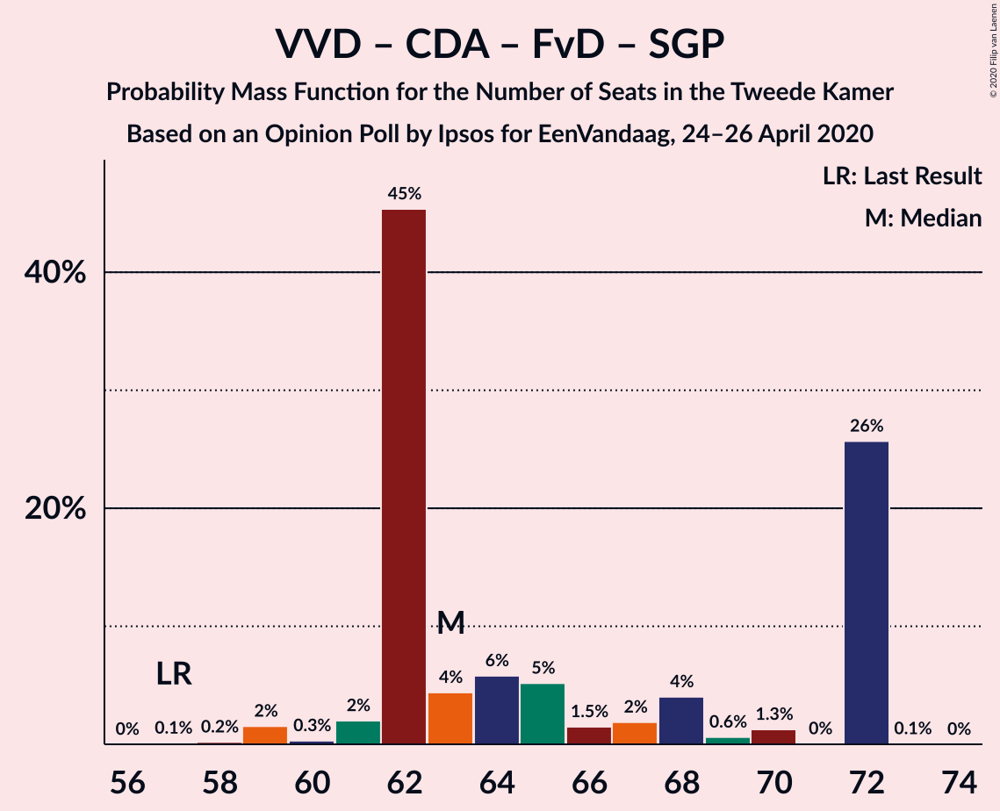

| Number of Seats | Probability | Accumulated | Special Marks |
|:---------------:|:-----------:|:-----------:|:-------------:|
| 57 | 0% | 100% | Last Result |
| 58 | 0% | 100% |  |
| 59 | 0.9% | 100% |  |
| 60 | 0.3% | 99.1% |  |
| 61 | 0.2% | 98.8% |  |
| 62 | 5% | 98.6% |  |
| 63 | 0.2% | 93% |  |
| 64 | 4% | 93% | Median |
| 65 | 51% | 90% |  |
| 66 | 0.3% | 39% |  |
| 67 | 0.8% | 39% |  |
| 68 | 37% | 38% |  |
| 69 | 0.1% | 1.0% |  |
| 70 | 0.6% | 0.9% |  |
| 71 | 0% | 0.3% |  |
| 72 | 0% | 0.3% |  |
| 73 | 0.3% | 0.3% |  |
| 74 | 0% | 0% |  |

### Volkspartij voor Vrijheid en Democratie – Christen-Democratisch Appèl – Democraten 66

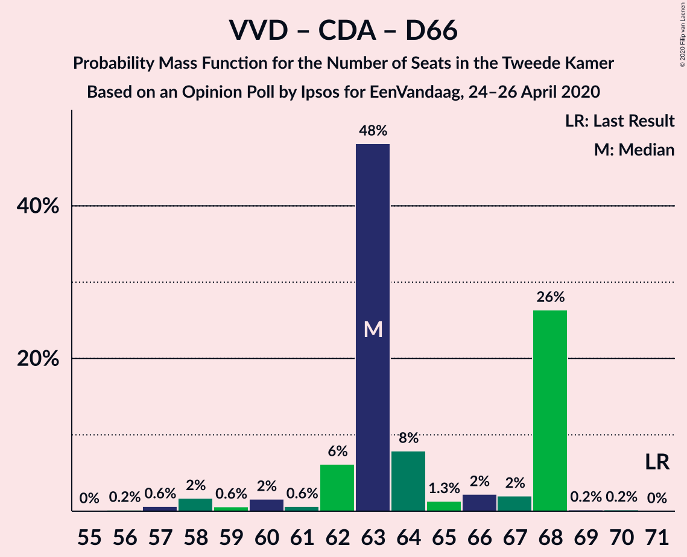

| Number of Seats | Probability | Accumulated | Special Marks |
|:---------------:|:-----------:|:-----------:|:-------------:|
| 56 | 0.4% | 100% |  |
| 57 | 0% | 99.6% |  |
| 58 | 0.6% | 99.5% |  |
| 59 | 0.4% | 99.0% |  |
| 60 | 0.7% | 98.5% |  |
| 61 | 1.1% | 98% |  |
| 62 | 5% | 97% |  |
| 63 | 47% | 92% | Median |
| 64 | 40% | 45% |  |
| 65 | 3% | 6% |  |
| 66 | 0.9% | 2% |  |
| 67 | 0.6% | 1.4% |  |
| 68 | 0.1% | 0.8% |  |
| 69 | 0% | 0.7% |  |
| 70 | 0.7% | 0.7% |  |
| 71 | 0% | 0% | Last Result |

### Volkspartij voor Vrijheid en Democratie – Christen-Democratisch Appèl – Forum voor Democratie

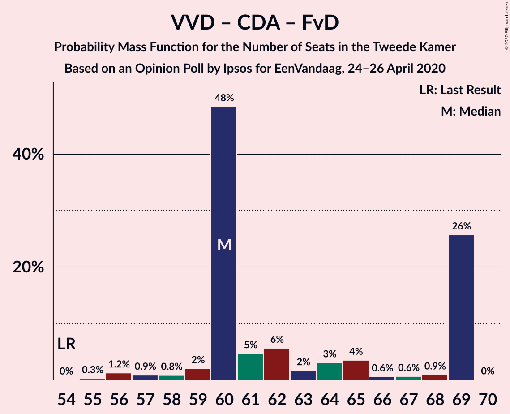

| Number of Seats | Probability | Accumulated | Special Marks |
|:---------------:|:-----------:|:-----------:|:-------------:|
| 54 | 0% | 100% | Last Result |
| 55 | 0% | 100% |  |
| 56 | 0.4% | 100% |  |
| 57 | 0.7% | 99.5% |  |
| 58 | 0.1% | 98.8% |  |
| 59 | 2% | 98.7% |  |
| 60 | 3% | 97% |  |
| 61 | 50% | 93% | Median |
| 62 | 4% | 44% |  |
| 63 | 0.9% | 39% |  |
| 64 | 0.4% | 38% |  |
| 65 | 37% | 38% |  |
| 66 | 0% | 1.4% |  |
| 67 | 1.0% | 1.4% |  |
| 68 | 0% | 0.3% |  |
| 69 | 0.3% | 0.3% |  |
| 70 | 0% | 0% |  |

### Partij van de Arbeid – Christen-Democratisch Appèl – GroenLinks – Democraten 66 – ChristenUnie

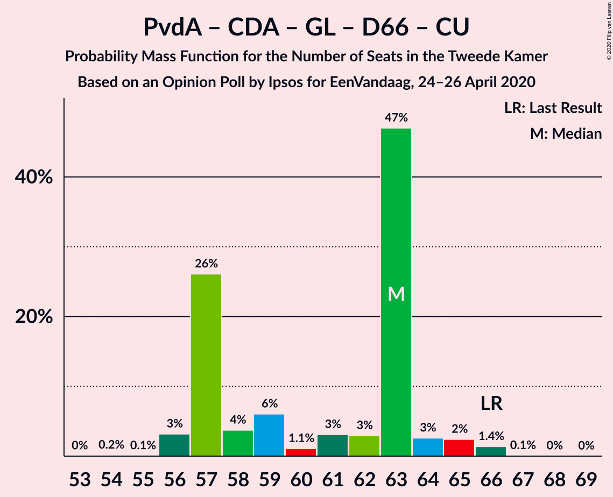

| Number of Seats | Probability | Accumulated | Special Marks |
|:---------------:|:-----------:|:-----------:|:-------------:|
| 54 | 0.5% | 100% |  |
| 55 | 0.1% | 99.5% |  |
| 56 | 36% | 99.4% |  |
| 57 | 0% | 63% |  |
| 58 | 47% | 63% |  |
| 59 | 4% | 16% | Median |
| 60 | 0.8% | 12% |  |
| 61 | 3% | 11% |  |
| 62 | 3% | 8% |  |
| 63 | 0.7% | 6% |  |
| 64 | 2% | 5% |  |
| 65 | 1.0% | 3% |  |
| 66 | 2% | 2% | Last Result |
| 67 | 0% | 0.1% |  |
| 68 | 0.1% | 0.1% |  |
| 69 | 0% | 0% |  |

### Volkspartij voor Vrijheid en Democratie – Partij van de Arbeid

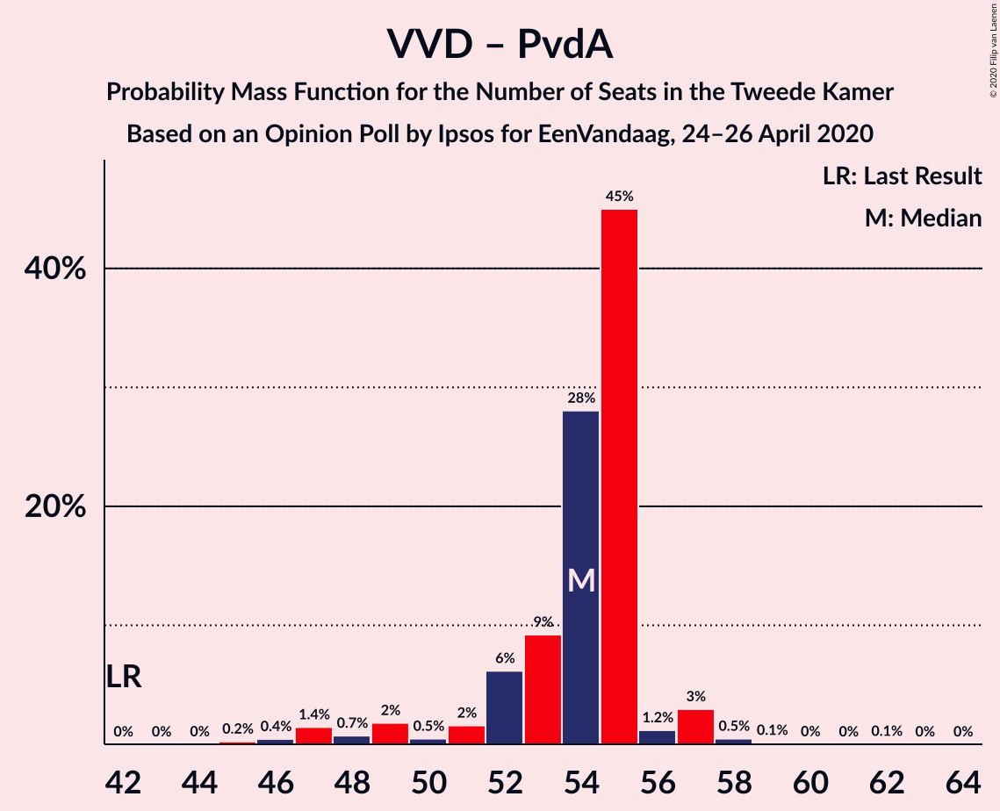

| Number of Seats | Probability | Accumulated | Special Marks |
|:---------------:|:-----------:|:-----------:|:-------------:|
| 42 | 0% | 100% | Last Result |
| 43 | 0% | 100% |  |
| 44 | 0% | 100% |  |
| 45 | 0% | 100% |  |
| 46 | 0.4% | 99.9% |  |
| 47 | 2% | 99.5% |  |
| 48 | 0.2% | 98% |  |
| 49 | 0.5% | 98% |  |
| 50 | 2% | 97% |  |
| 51 | 0.4% | 95% |  |
| 52 | 48% | 95% | Median |
| 53 | 1.0% | 47% |  |
| 54 | 2% | 46% |  |
| 55 | 0.6% | 44% |  |
| 56 | 2% | 43% |  |
| 57 | 37% | 41% |  |
| 58 | 3% | 4% |  |
| 59 | 0.5% | 0.6% |  |
| 60 | 0% | 0% |  |

### Volkspartij voor Vrijheid en Democratie – Christen-Democratisch Appèl

| Number of Seats | Probability | Accumulated | Special Marks |
|:---------------:|:-----------:|:-----------:|:-------------:|
| 46 | 0.8% | 100% |  |
| 47 | 0.5% | 99.1% |  |
| 48 | 0.2% | 98.6% |  |
| 49 | 1.2% | 98% |  |
| 50 | 4% | 97% |  |
| 51 | 49% | 94% | Median |
| 52 | 1.1% | 45% | Last Result |
| 53 | 3% | 44% |  |
| 54 | 39% | 41% |  |
| 55 | 0.6% | 2% |  |
| 56 | 0.7% | 1.4% |  |
| 57 | 0% | 0.6% |  |
| 58 | 0.1% | 0.6% |  |
| 59 | 0.5% | 0.5% |  |
| 60 | 0% | 0% |  |

### Partij van de Arbeid – Christen-Democratisch Appèl – Democraten 66

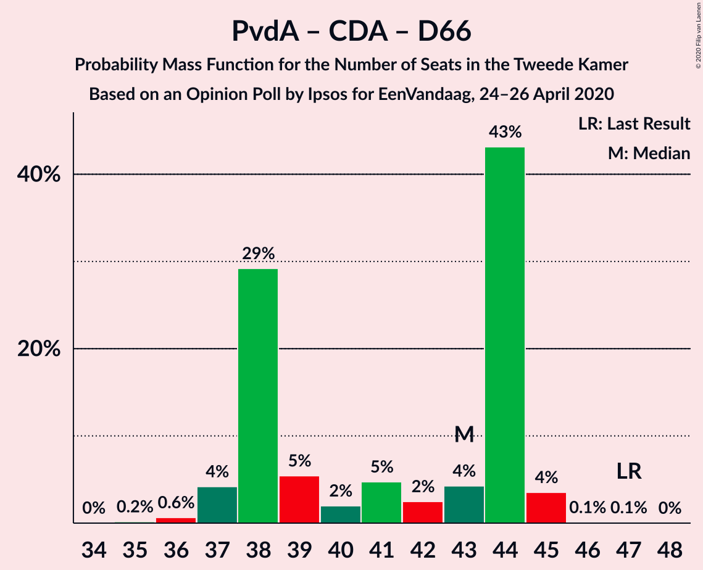

| Number of Seats | Probability | Accumulated | Special Marks |
|:---------------:|:-----------:|:-----------:|:-------------:|
| 34 | 0.1% | 100% |  |
| 35 | 0.1% | 99.9% |  |
| 36 | 0.3% | 99.9% |  |
| 37 | 37% | 99.5% |  |
| 38 | 0.6% | 62% |  |
| 39 | 3% | 62% |  |
| 40 | 3% | 58% |  |
| 41 | 47% | 55% | Median |
| 42 | 2% | 8% |  |
| 43 | 2% | 6% |  |
| 44 | 3% | 4% |  |
| 45 | 0% | 0.3% |  |
| 46 | 0% | 0.2% |  |
| 47 | 0.1% | 0.2% | Last Result |
| 48 | 0% | 0% |  |

### Partij van de Arbeid – Christen-Democratisch Appèl – ChristenUnie

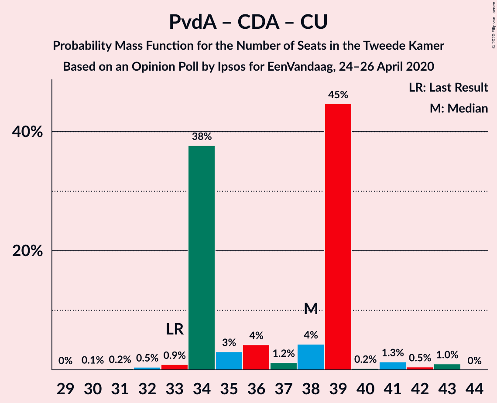

| Number of Seats | Probability | Accumulated | Special Marks |
|:---------------:|:-----------:|:-----------:|:-------------:|
| 30 | 0.2% | 100% |  |
| 31 | 0.3% | 99.8% |  |
| 32 | 0.1% | 99.5% |  |
| 33 | 0.7% | 99.4% | Last Result |
| 34 | 83% | 98.7% |  |
| 35 | 0.2% | 15% | Median |
| 36 | 4% | 15% |  |
| 37 | 5% | 11% |  |
| 38 | 2% | 6% |  |
| 39 | 2% | 4% |  |
| 40 | 0.1% | 2% |  |
| 41 | 0.1% | 2% |  |
| 42 | 2% | 2% |  |
| 43 | 0% | 0% |  |

### Partij van de Arbeid – Christen-Democratisch Appèl

| Number of Seats | Probability | Accumulated | Special Marks |
|:---------------:|:-----------:|:-----------:|:-------------:|
| 24 | 0.4% | 100% |  |
| 25 | 0.4% | 99.6% |  |
| 26 | 0.6% | 99.1% |  |
| 27 | 37% | 98.5% |  |
| 28 | 4% | 62% | Last Result |
| 29 | 50% | 58% | Median |
| 30 | 3% | 8% |  |
| 31 | 0.1% | 5% |  |
| 32 | 3% | 5% |  |
| 33 | 2% | 2% |  |
| 34 | 0% | 0.1% |  |
| 35 | 0% | 0.1% |  |
| 36 | 0% | 0% |  |

### Christen-Democratisch Appèl – Democraten 66

| Number of Seats | Probability | Accumulated | Special Marks |
|:---------------:|:-----------:|:-----------:|:-------------:|
| 20 | 0.4% | 100% |  |
| 21 | 0.1% | 99.6% |  |
| 22 | 38% | 99.5% |  |
| 23 | 0.9% | 62% |  |
| 24 | 2% | 61% |  |
| 25 | 3% | 58% |  |
| 26 | 51% | 55% | Median |
| 27 | 1.1% | 4% |  |
| 28 | 1.5% | 3% |  |
| 29 | 0.2% | 1.4% |  |
| 30 | 1.1% | 1.2% |  |
| 31 | 0.1% | 0.1% |  |
| 32 | 0% | 0% |  |
| 33 | 0% | 0% |  |
| 34 | 0% | 0% |  |
| 35 | 0% | 0% |  |
| 36 | 0% | 0% |  |
| 37 | 0% | 0% |  |
| 38 | 0% | 0% | Last Result |

## Technical Information

### Opinion Poll

+ **Polling firm:** Ipsos
+ **Commissioner(s):** EenVandaag
+ **Fieldwork period:** 24–26 April 2020

### Calculations

+ **Sample size:** 1017
+ **Simulations done:** 131,072
+ **Error estimate:** 1.45%

