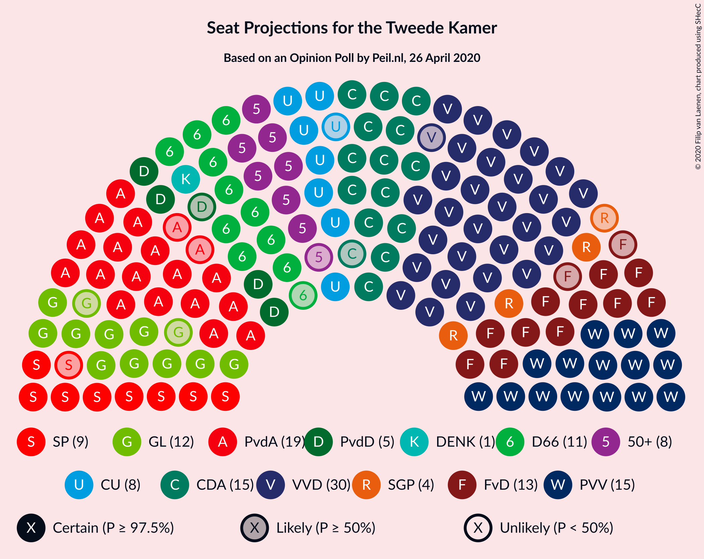
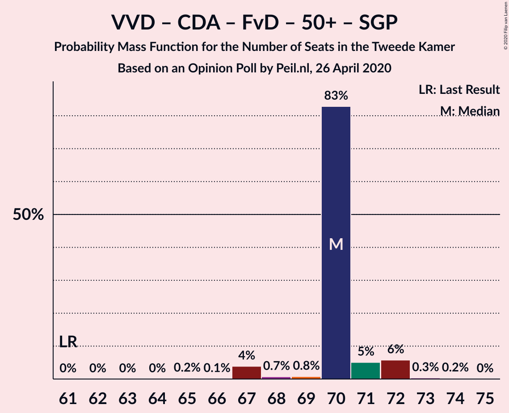

# Opinion Poll by Peil.nl, 26 April 2020

<a href="#voting-intentions">Voting Intentions</a> | <a href="#seats">Seats</a> | <a href="#coalitions">Coalitions</a> | <a href="#technical-information">Technical Information</a>

## Voting Intentions

### Confidence Intervals

| Party | Last Result | Poll Result | 80% Confidence Interval | 90% Confidence Interval | 95% Confidence Interval | 99% Confidence Interval |
|:-----:|:-----------:|:-----------:|:-----------------------:|:-----------------------:|:-----------------------:|:-----------------------:|
| Volkspartij voor Vrijheid en Democratie | 21.3% | 20.0% | 19.1–20.9% |18.8–21.2% |18.6–21.4% |18.1–21.9% |
| Partij van de Arbeid | 5.7% | 12.0% | 11.2–12.8% |11.0–13.0% |10.9–13.2% |10.5–13.6% |
| Partij voor de Vrijheid | 13.1% | 11.3% | 10.6–12.1% |10.4–12.3% |10.2–12.5% |9.9–12.9% |
| Christen-Democratisch Appèl | 12.4% | 10.0% | 9.3–10.7% |9.1–10.9% |9.0–11.1% |8.7–11.5% |
| Forum voor Democratie | 1.8% | 8.0% | 7.4–8.7% |7.2–8.9% |7.1–9.0% |6.8–9.4% |
| Democraten 66 | 12.2% | 7.3% | 6.8–8.0% |6.6–8.2% |6.4–8.3% |6.2–8.6% |
| GroenLinks | 9.1% | 7.3% | 6.8–8.0% |6.6–8.2% |6.4–8.3% |6.2–8.6% |
| Socialistische Partij | 9.1% | 6.0% | 5.5–6.6% |5.3–6.8% |5.2–6.9% |5.0–7.2% |
| ChristenUnie | 3.4% | 5.3% | 4.8–5.9% |4.7–6.1% |4.6–6.2% |4.4–6.5% |
| 50Plus | 3.1% | 5.3% | 4.8–5.9% |4.7–6.1% |4.6–6.2% |4.4–6.5% |
| Partij voor de Dieren | 3.2% | 3.3% | 2.9–3.8% |2.8–3.9% |2.7–4.0% |2.6–4.3% |
| Staatkundig Gereformeerde Partij | 2.1% | 2.7% | 2.3–3.1% |2.2–3.2% |2.1–3.3% |2.0–3.5% |
| DENK | 2.1% | 1.3% | 1.1–1.6% |1.0–1.7% |1.0–1.8% |0.9–2.0% |

*Note:* The poll result column reflects the actual value used in the calculations. Published results may vary slightly, and in addition be rounded to fewer digits.

## Seats

### Confidence Intervals

| Party | Last Result | Median | 80% Confidence Interval | 90% Confidence Interval | 95% Confidence Interval | 99% Confidence Interval |
|:-----:|:-----------:|:------:|:-----------------------:|:-----------------------:|:-----------------------:|:-----------------------:|
| <a href="#volkspartij-voor-vrijheid-en-democratie">Volkspartij voor Vrijheid en Democratie</a> | 33 | 31 | 28–32 |28–32 |28–34 |27–34 |
| <a href="#partij-van-de-arbeid">Partij van de Arbeid</a> | 9 | 20 | 17–20 |16–20 |16–20 |15–21 |
| <a href="#partij-voor-de-vrijheid">Partij voor de Vrijheid</a> | 20 | 17 | 16–18 |16–18 |16–19 |16–19 |
| <a href="#christen-democratisch-appèl">Christen-Democratisch Appèl</a> | 19 | 14 | 13–17 |13–17 |13–17 |13–17 |
| <a href="#forum-voor-democratie">Forum voor Democratie</a> | 2 | 12 | 10–13 |10–13 |10–13 |10–14 |
| <a href="#democraten-66">Democraten 66</a> | 19 | 11 | 10–12 |10–12 |9–12 |9–12 |
| <a href="#groenlinks">GroenLinks</a> | 14 | 11 | 11–13 |10–13 |10–13 |9–13 |
| <a href="#socialistische-partij">Socialistische Partij</a> | 14 | 10 | 8–11 |8–11 |8–11 |8–11 |
| <a href="#christenunie">ChristenUnie</a> | 5 | 7 | 7–8 |6–9 |6–9 |6–9 |
| <a href="#50plus">50Plus</a> | 4 | 8 | 7–9 |7–9 |7–9 |7–10 |
| <a href="#partij-voor-de-dieren">Partij voor de Dieren</a> | 5 | 5 | 4–6 |4–6 |3–6 |3–6 |
| <a href="#staatkundig-gereformeerde-partij">Staatkundig Gereformeerde Partij</a> | 3 | 4 | 3–5 |3–5 |3–5 |3–5 |
| <a href="#denk">DENK</a> | 3 | 1 | 1–2 |1–2 |1–2 |1–3 |

### Volkspartij voor Vrijheid en Democratie

*For a full overview of the results for this party, see the [Volkspartij voor Vrijheid en Democratie](party-volkspartijvoorvrijheidendemocratie.html) page.*

| Number of Seats | Probability | Accumulated | Special Marks |
|:---------------:|:-----------:|:-----------:|:-------------:|
| 27 | 2% | 100% |  |
| 28 | 30% | 98% |  |
| 29 | 9% | 68% |  |
| 30 | 4% | 59% |  |
| 31 | 35% | 55% | Median |
| 32 | 16% | 19% |  |
| 33 | 0.9% | 3% | Last Result |
| 34 | 3% | 3% |  |
| 35 | 0% | 0% |  |

### Partij van de Arbeid

*For a full overview of the results for this party, see the [Partij van de Arbeid](party-partijvandearbeid.html) page.*

| Number of Seats | Probability | Accumulated | Special Marks |
|:---------------:|:-----------:|:-----------:|:-------------:|
| 9 | 0% | 100% | Last Result |
| 10 | 0% | 100% |  |
| 11 | 0% | 100% |  |
| 12 | 0% | 100% |  |
| 13 | 0% | 100% |  |
| 14 | 0% | 100% |  |
| 15 | 1.2% | 100% |  |
| 16 | 4% | 98.8% |  |
| 17 | 16% | 95% |  |
| 18 | 25% | 79% |  |
| 19 | 2% | 54% |  |
| 20 | 50% | 52% | Median |
| 21 | 1.4% | 1.4% |  |
| 22 | 0% | 0% |  |

### Partij voor de Vrijheid

*For a full overview of the results for this party, see the [Partij voor de Vrijheid](party-partijvoordevrijheid.html) page.*

| Number of Seats | Probability | Accumulated | Special Marks |
|:---------------:|:-----------:|:-----------:|:-------------:|
| 14 | 0.1% | 100% |  |
| 15 | 0.3% | 99.9% |  |
| 16 | 10% | 99.6% |  |
| 17 | 67% | 90% | Median |
| 18 | 18% | 23% |  |
| 19 | 4% | 4% |  |
| 20 | 0.3% | 0.4% | Last Result |
| 21 | 0.1% | 0.1% |  |
| 22 | 0% | 0% |  |

### Christen-Democratisch Appèl

*For a full overview of the results for this party, see the [Christen-Democratisch Appèl](party-christen-democratischappèl.html) page.*

| Number of Seats | Probability | Accumulated | Special Marks |
|:---------------:|:-----------:|:-----------:|:-------------:|
| 13 | 34% | 100% |  |
| 14 | 20% | 66% | Median |
| 15 | 17% | 46% |  |
| 16 | 13% | 29% |  |
| 17 | 16% | 16% |  |
| 18 | 0.2% | 0.3% |  |
| 19 | 0.1% | 0.1% | Last Result |
| 20 | 0% | 0% |  |

### Forum voor Democratie

*For a full overview of the results for this party, see the [Forum voor Democratie](party-forumvoordemocratie.html) page.*

| Number of Seats | Probability | Accumulated | Special Marks |
|:---------------:|:-----------:|:-----------:|:-------------:|
| 2 | 0% | 100% | Last Result |
| 3 | 0% | 100% |  |
| 4 | 0% | 100% |  |
| 5 | 0% | 100% |  |
| 6 | 0% | 100% |  |
| 7 | 0% | 100% |  |
| 8 | 0% | 100% |  |
| 9 | 0% | 100% |  |
| 10 | 14% | 100% |  |
| 11 | 16% | 86% |  |
| 12 | 26% | 70% | Median |
| 13 | 44% | 44% |  |
| 14 | 0.7% | 0.8% |  |
| 15 | 0% | 0% |  |

### Democraten 66

*For a full overview of the results for this party, see the [Democraten 66](party-democraten66.html) page.*

| Number of Seats | Probability | Accumulated | Special Marks |
|:---------------:|:-----------:|:-----------:|:-------------:|
| 8 | 0.3% | 100% |  |
| 9 | 4% | 99.7% |  |
| 10 | 17% | 96% |  |
| 11 | 63% | 78% | Median |
| 12 | 15% | 15% |  |
| 13 | 0.4% | 0.5% |  |
| 14 | 0% | 0% |  |
| 15 | 0% | 0% |  |
| 16 | 0% | 0% |  |
| 17 | 0% | 0% |  |
| 18 | 0% | 0% |  |
| 19 | 0% | 0% | Last Result |

### GroenLinks

*For a full overview of the results for this party, see the [GroenLinks](party-groenlinks.html) page.*

| Number of Seats | Probability | Accumulated | Special Marks |
|:---------------:|:-----------:|:-----------:|:-------------:|
| 9 | 2% | 100% |  |
| 10 | 7% | 98% |  |
| 11 | 43% | 91% | Median |
| 12 | 38% | 48% |  |
| 13 | 10% | 10% |  |
| 14 | 0% | 0% | Last Result |

### Socialistische Partij

*For a full overview of the results for this party, see the [Socialistische Partij](party-socialistischepartij.html) page.*

| Number of Seats | Probability | Accumulated | Special Marks |
|:---------------:|:-----------:|:-----------:|:-------------:|
| 6 | 0.1% | 100% |  |
| 7 | 0.2% | 99.9% |  |
| 8 | 23% | 99.7% |  |
| 9 | 21% | 76% |  |
| 10 | 44% | 55% | Median |
| 11 | 11% | 11% |  |
| 12 | 0.1% | 0.1% |  |
| 13 | 0% | 0% |  |
| 14 | 0% | 0% | Last Result |

### ChristenUnie

*For a full overview of the results for this party, see the [ChristenUnie](party-christenunie.html) page.*

| Number of Seats | Probability | Accumulated | Special Marks |
|:---------------:|:-----------:|:-----------:|:-------------:|
| 5 | 0% | 100% | Last Result |
| 6 | 5% | 100% |  |
| 7 | 61% | 95% | Median |
| 8 | 29% | 34% |  |
| 9 | 5% | 5% |  |
| 10 | 0.5% | 0.5% |  |
| 11 | 0% | 0% |  |

### 50Plus

*For a full overview of the results for this party, see the [50Plus](party-50plus.html) page.*

| Number of Seats | Probability | Accumulated | Special Marks |
|:---------------:|:-----------:|:-----------:|:-------------:|
| 4 | 0% | 100% | Last Result |
| 5 | 0% | 100% |  |
| 6 | 0.3% | 100% |  |
| 7 | 19% | 99.7% |  |
| 8 | 46% | 81% | Median |
| 9 | 32% | 35% |  |
| 10 | 2% | 2% |  |
| 11 | 0.4% | 0.4% |  |
| 12 | 0% | 0% |  |

### Partij voor de Dieren

*For a full overview of the results for this party, see the [Partij voor de Dieren](party-partijvoordedieren.html) page.*

| Number of Seats | Probability | Accumulated | Special Marks |
|:---------------:|:-----------:|:-----------:|:-------------:|
| 3 | 4% | 100% |  |
| 4 | 33% | 96% |  |
| 5 | 47% | 63% | Last Result, Median |
| 6 | 17% | 17% |  |
| 7 | 0% | 0% |  |

### Staatkundig Gereformeerde Partij

*For a full overview of the results for this party, see the [Staatkundig Gereformeerde Partij](party-staatkundiggereformeerdepartij.html) page.*

| Number of Seats | Probability | Accumulated | Special Marks |
|:---------------:|:-----------:|:-----------:|:-------------:|
| 2 | 0.5% | 100% |  |
| 3 | 34% | 99.5% | Last Result |
| 4 | 29% | 66% | Median |
| 5 | 36% | 37% |  |
| 6 | 0% | 0% |  |

### DENK

*For a full overview of the results for this party, see the [DENK](party-denk.html) page.*

| Number of Seats | Probability | Accumulated | Special Marks |
|:---------------:|:-----------:|:-----------:|:-------------:|
| 1 | 71% | 100% | Median |
| 2 | 28% | 29% |  |
| 3 | 0.7% | 0.7% | Last Result |
| 4 | 0% | 0% |  |

## Coalitions

### Confidence Intervals

| Coalition | Last Result | Median | Majority? | 80% Confidence Interval | 90% Confidence Interval | 95% Confidence Interval | 99% Confidence Interval |
|:---------:|:-----------:|:------:|:---------:|:-----------------------:|:-----------------------:|:-----------------------:|:-----------------------:|
| Volkspartij voor Vrijheid en Democratie – Partij van de Arbeid – Christen-Democratisch Appèl – Democraten 66 – ChristenUnie | 85 | 81 | 100% | 79–85 | 79–85 | 79–86 | 79–86 |
| Volkspartij voor Vrijheid en Democratie – Partij voor de Vrijheid – Christen-Democratisch Appèl – Forum voor Democratie – Staatkundig Gereformeerde Partij | 77 | 77 | 99.8% | 76–80 | 76–80 | 76–81 | 76–82 |
| Volkspartij voor Vrijheid en Democratie – Christen-Democratisch Appèl – Democraten 66 – GroenLinks – ChristenUnie | 90 | 74 | 39% | 71–78 | 71–78 | 71–79 | 71–79 |
| Volkspartij voor Vrijheid en Democratie – Partij voor de Vrijheid – Christen-Democratisch Appèl – Forum voor Democratie | 74 | 74 | 33% | 71–76 | 71–77 | 71–77 | 71–78 |
| Partij van de Arbeid – Christen-Democratisch Appèl – Democraten 66 – GroenLinks – Socialistische Partij – ChristenUnie | 80 | 73 | 0.4% | 71–75 | 71–75 | 70–75 | 68–75 |
| Volkspartij voor Vrijheid en Democratie – Christen-Democratisch Appèl – Forum voor Democratie – 50Plus – Staatkundig Gereformeerde Partij | 61 | 68 | 0% | 67–71 | 67–72 | 67–73 | 65–74 |
| Volkspartij voor Vrijheid en Democratie – Christen-Democratisch Appèl – Forum voor Democratie – 50Plus | 58 | 65 | 0% | 62–67 | 62–68 | 62–69 | 62–70 |
| Volkspartij voor Vrijheid en Democratie – Partij van de Arbeid – Christen-Democratisch Appèl | 61 | 63 | 0% | 61–67 | 61–68 | 61–68 | 59–68 |
| Volkspartij voor Vrijheid en Democratie – Christen-Democratisch Appèl – Democraten 66 – ChristenUnie | 76 | 63 | 0% | 59–67 | 59–67 | 59–68 | 59–68 |
| Volkspartij voor Vrijheid en Democratie – Partij voor de Vrijheid – Christen-Democratisch Appèl | 72 | 62 | 0% | 58–66 | 58–66 | 58–66 | 58–67 |
| Partij van de Arbeid – Christen-Democratisch Appèl – Democraten 66 – GroenLinks – ChristenUnie | 66 | 63 | 0% | 60–65 | 60–65 | 60–65 | 60–67 |
| Volkspartij voor Vrijheid en Democratie – Christen-Democratisch Appèl – Forum voor Democratie – Staatkundig Gereformeerde Partij | 57 | 60 | 0% | 59–63 | 59–64 | 59–65 | 58–65 |
| Volkspartij voor Vrijheid en Democratie – Partij van de Arbeid – Democraten 66 | 61 | 59 | 0% | 58–62 | 58–62 | 57–63 | 56–64 |
| Volkspartij voor Vrijheid en Democratie – Christen-Democratisch Appèl – Forum voor Democratie | 54 | 57 | 0% | 54–60 | 54–60 | 54–61 | 54–61 |
| Volkspartij voor Vrijheid en Democratie – Christen-Democratisch Appèl – Democraten 66 | 71 | 56 | 0% | 52–59 | 52–59 | 52–61 | 52–61 |
| Volkspartij voor Vrijheid en Democratie – Partij van de Arbeid | 42 | 48 | 0% | 46–51 | 46–52 | 46–52 | 45–53 |
| Volkspartij voor Vrijheid en Democratie – Christen-Democratisch Appèl | 52 | 45 | 0% | 41–48 | 41–48 | 41–50 | 41–50 |
| Partij van de Arbeid – Christen-Democratisch Appèl – Democraten 66 | 47 | 44 | 0% | 42–46 | 41–46 | 41–46 | 40–47 |
| Partij van de Arbeid – Christen-Democratisch Appèl – ChristenUnie | 33 | 40 | 0% | 39–43 | 38–43 | 37–45 | 37–46 |
| Partij van de Arbeid – Christen-Democratisch Appèl | 28 | 33 | 0% | 32–36 | 30–36 | 29–36 | 29–37 |
| Christen-Democratisch Appèl – Democraten 66 | 38 | 25 | 0% | 24–28 | 24–28 | 24–28 | 23–29 |

### Volkspartij voor Vrijheid en Democratie – Partij van de Arbeid – Christen-Democratisch Appèl – Democraten 66 – ChristenUnie

| Number of Seats | Probability | Accumulated | Special Marks |
|:---------------:|:-----------:|:-----------:|:-------------:|
| 77 | 0.4% | 100% |  |
| 78 | 0% | 99.6% |  |
| 79 | 31% | 99.6% |  |
| 80 | 8% | 69% |  |
| 81 | 13% | 61% |  |
| 82 | 7% | 48% |  |
| 83 | 13% | 41% | Median |
| 84 | 10% | 28% |  |
| 85 | 15% | 18% | Last Result |
| 86 | 3% | 3% |  |
| 87 | 0% | 0% |  |

### Volkspartij voor Vrijheid en Democratie – Partij voor de Vrijheid – Christen-Democratisch Appèl – Forum voor Democratie – Staatkundig Gereformeerde Partij

| Number of Seats | Probability | Accumulated | Special Marks |
|:---------------:|:-----------:|:-----------:|:-------------:|
| 72 | 0.1% | 100% |  |
| 73 | 0% | 99.9% |  |
| 74 | 0.1% | 99.9% |  |
| 75 | 0.1% | 99.9% |  |
| 76 | 39% | 99.8% | Majority |
| 77 | 13% | 61% | Last Result |
| 78 | 6% | 49% | Median |
| 79 | 17% | 43% |  |
| 80 | 21% | 26% |  |
| 81 | 3% | 4% |  |
| 82 | 0.5% | 0.8% |  |
| 83 | 0.3% | 0.3% |  |
| 84 | 0% | 0% |  |

### Volkspartij voor Vrijheid en Democratie – Christen-Democratisch Appèl – Democraten 66 – GroenLinks – ChristenUnie

| Number of Seats | Probability | Accumulated | Special Marks |
|:---------------:|:-----------:|:-----------:|:-------------:|
| 70 | 0.3% | 100% |  |
| 71 | 29% | 99.7% |  |
| 72 | 0.5% | 70% |  |
| 73 | 4% | 70% |  |
| 74 | 22% | 66% | Median |
| 75 | 5% | 44% |  |
| 76 | 12% | 39% | Majority |
| 77 | 11% | 27% |  |
| 78 | 13% | 16% |  |
| 79 | 3% | 3% |  |
| 80 | 0.5% | 0.5% |  |
| 81 | 0% | 0% |  |
| 82 | 0% | 0% |  |
| 83 | 0% | 0% |  |
| 84 | 0% | 0% |  |
| 85 | 0% | 0% |  |
| 86 | 0% | 0% |  |
| 87 | 0% | 0% |  |
| 88 | 0% | 0% |  |
| 89 | 0% | 0% |  |
| 90 | 0% | 0% | Last Result |

### Volkspartij voor Vrijheid en Democratie – Partij voor de Vrijheid – Christen-Democratisch Appèl – Forum voor Democratie

| Number of Seats | Probability | Accumulated | Special Marks |
|:---------------:|:-----------:|:-----------:|:-------------:|
| 68 | 0.1% | 100% |  |
| 69 | 0% | 99.9% |  |
| 70 | 0.1% | 99.9% |  |
| 71 | 30% | 99.9% |  |
| 72 | 0.7% | 70% |  |
| 73 | 10% | 70% |  |
| 74 | 23% | 60% | Last Result, Median |
| 75 | 4% | 37% |  |
| 76 | 24% | 33% | Majority |
| 77 | 8% | 9% |  |
| 78 | 0.8% | 1.2% |  |
| 79 | 0.3% | 0.4% |  |
| 80 | 0% | 0% |  |

### Partij van de Arbeid – Christen-Democratisch Appèl – Democraten 66 – GroenLinks – Socialistische Partij – ChristenUnie

| Number of Seats | Probability | Accumulated | Special Marks |
|:---------------:|:-----------:|:-----------:|:-------------:|
| 66 | 0.1% | 100% |  |
| 67 | 0.2% | 99.9% |  |
| 68 | 0.2% | 99.7% |  |
| 69 | 1.1% | 99.5% |  |
| 70 | 1.0% | 98% |  |
| 71 | 22% | 97% |  |
| 72 | 18% | 76% |  |
| 73 | 45% | 57% | Median |
| 74 | 2% | 12% |  |
| 75 | 10% | 11% |  |
| 76 | 0.2% | 0.4% | Majority |
| 77 | 0.2% | 0.2% |  |
| 78 | 0% | 0% |  |
| 79 | 0% | 0% |  |
| 80 | 0% | 0% | Last Result |

### Volkspartij voor Vrijheid en Democratie – Christen-Democratisch Appèl – Forum voor Democratie – 50Plus – Staatkundig Gereformeerde Partij

| Number of Seats | Probability | Accumulated | Special Marks |
|:---------------:|:-----------:|:-----------:|:-------------:|
| 61 | 0% | 100% | Last Result |
| 62 | 0% | 100% |  |
| 63 | 0% | 100% |  |
| 64 | 0.4% | 100% |  |
| 65 | 0.1% | 99.6% |  |
| 66 | 0.3% | 99.5% |  |
| 67 | 41% | 99.2% |  |
| 68 | 15% | 58% |  |
| 69 | 1.1% | 43% | Median |
| 70 | 13% | 42% |  |
| 71 | 22% | 29% |  |
| 72 | 4% | 8% |  |
| 73 | 4% | 4% |  |
| 74 | 0.4% | 0.6% |  |
| 75 | 0.1% | 0.1% |  |
| 76 | 0% | 0% | Majority |

### Volkspartij voor Vrijheid en Democratie – Christen-Democratisch Appèl – Forum voor Democratie – 50Plus

| Number of Seats | Probability | Accumulated | Special Marks |
|:---------------:|:-----------:|:-----------:|:-------------:|
| 58 | 0% | 100% | Last Result |
| 59 | 0% | 100% |  |
| 60 | 0.4% | 100% |  |
| 61 | 0.1% | 99.6% |  |
| 62 | 30% | 99.5% |  |
| 63 | 0.4% | 70% |  |
| 64 | 16% | 69% |  |
| 65 | 11% | 53% | Median |
| 66 | 9% | 43% |  |
| 67 | 25% | 34% |  |
| 68 | 5% | 9% |  |
| 69 | 4% | 4% |  |
| 70 | 0.6% | 0.7% |  |
| 71 | 0.1% | 0.1% |  |
| 72 | 0% | 0% |  |

### Volkspartij voor Vrijheid en Democratie – Partij van de Arbeid – Christen-Democratisch Appèl

| Number of Seats | Probability | Accumulated | Special Marks |
|:---------------:|:-----------:|:-----------:|:-------------:|
| 59 | 1.0% | 100% |  |
| 60 | 0.7% | 98.9% |  |
| 61 | 42% | 98% | Last Result |
| 62 | 0.4% | 56% |  |
| 63 | 6% | 56% |  |
| 64 | 10% | 50% |  |
| 65 | 13% | 40% | Median |
| 66 | 15% | 26% |  |
| 67 | 6% | 12% |  |
| 68 | 6% | 6% |  |
| 69 | 0% | 0% |  |

### Volkspartij voor Vrijheid en Democratie – Christen-Democratisch Appèl – Democraten 66 – ChristenUnie

| Number of Seats | Probability | Accumulated | Special Marks |
|:---------------:|:-----------:|:-----------:|:-------------:|
| 59 | 30% | 100% |  |
| 60 | 0.6% | 70% |  |
| 61 | 1.4% | 70% |  |
| 62 | 0.4% | 68% |  |
| 63 | 18% | 68% | Median |
| 64 | 27% | 50% |  |
| 65 | 5% | 23% |  |
| 66 | 0.6% | 18% |  |
| 67 | 14% | 17% |  |
| 68 | 3% | 3% |  |
| 69 | 0% | 0.1% |  |
| 70 | 0.1% | 0.1% |  |
| 71 | 0% | 0% |  |
| 72 | 0% | 0% |  |
| 73 | 0% | 0% |  |
| 74 | 0% | 0% |  |
| 75 | 0% | 0% |  |
| 76 | 0% | 0% | Last Result, Majority |

### Volkspartij voor Vrijheid en Democratie – Partij voor de Vrijheid – Christen-Democratisch Appèl

| Number of Seats | Probability | Accumulated | Special Marks |
|:---------------:|:-----------:|:-----------:|:-------------:|
| 57 | 0.1% | 100% |  |
| 58 | 29% | 99.9% |  |
| 59 | 0.1% | 71% |  |
| 60 | 0.8% | 70% |  |
| 61 | 9% | 70% |  |
| 62 | 13% | 60% | Median |
| 63 | 20% | 47% |  |
| 64 | 9% | 27% |  |
| 65 | 3% | 18% |  |
| 66 | 15% | 16% |  |
| 67 | 0.6% | 0.6% |  |
| 68 | 0% | 0% |  |
| 69 | 0% | 0% |  |
| 70 | 0% | 0% |  |
| 71 | 0% | 0% |  |
| 72 | 0% | 0% | Last Result |

### Partij van de Arbeid – Christen-Democratisch Appèl – Democraten 66 – GroenLinks – ChristenUnie

| Number of Seats | Probability | Accumulated | Special Marks |
|:---------------:|:-----------:|:-----------:|:-------------:|
| 58 | 0.1% | 100% |  |
| 59 | 0.3% | 99.9% |  |
| 60 | 11% | 99.5% |  |
| 61 | 2% | 89% |  |
| 62 | 12% | 87% |  |
| 63 | 43% | 75% | Median |
| 64 | 8% | 31% |  |
| 65 | 21% | 24% |  |
| 66 | 0.8% | 2% | Last Result |
| 67 | 2% | 2% |  |
| 68 | 0% | 0% |  |

### Volkspartij voor Vrijheid en Democratie – Christen-Democratisch Appèl – Forum voor Democratie – Staatkundig Gereformeerde Partij

| Number of Seats | Probability | Accumulated | Special Marks |
|:---------------:|:-----------:|:-----------:|:-------------:|
| 56 | 0.1% | 100% |  |
| 57 | 0.4% | 99.9% | Last Result |
| 58 | 0.2% | 99.5% |  |
| 59 | 39% | 99.3% |  |
| 60 | 17% | 61% |  |
| 61 | 2% | 43% | Median |
| 62 | 27% | 41% |  |
| 63 | 8% | 14% |  |
| 64 | 3% | 6% |  |
| 65 | 3% | 3% |  |
| 66 | 0% | 0.1% |  |
| 67 | 0.1% | 0.1% |  |
| 68 | 0% | 0% |  |

### Volkspartij voor Vrijheid en Democratie – Partij van de Arbeid – Democraten 66

| Number of Seats | Probability | Accumulated | Special Marks |
|:---------------:|:-----------:|:-----------:|:-------------:|
| 55 | 0.2% | 100% |  |
| 56 | 2% | 99.8% |  |
| 57 | 2% | 98% |  |
| 58 | 16% | 96% |  |
| 59 | 33% | 80% |  |
| 60 | 18% | 48% |  |
| 61 | 12% | 29% | Last Result |
| 62 | 14% | 18% | Median |
| 63 | 3% | 4% |  |
| 64 | 0.4% | 0.8% |  |
| 65 | 0.4% | 0.4% |  |
| 66 | 0% | 0% |  |

### Volkspartij voor Vrijheid en Democratie – Christen-Democratisch Appèl – Forum voor Democratie

| Number of Seats | Probability | Accumulated | Special Marks |
|:---------------:|:-----------:|:-----------:|:-------------:|
| 52 | 0.1% | 100% |  |
| 53 | 0.4% | 99.9% |  |
| 54 | 30% | 99.5% | Last Result |
| 55 | 0.5% | 70% |  |
| 56 | 14% | 69% |  |
| 57 | 19% | 55% | Median |
| 58 | 15% | 36% |  |
| 59 | 9% | 21% |  |
| 60 | 8% | 11% |  |
| 61 | 3% | 3% |  |
| 62 | 0% | 0.2% |  |
| 63 | 0.1% | 0.1% |  |
| 64 | 0% | 0% |  |

### Volkspartij voor Vrijheid en Democratie – Christen-Democratisch Appèl – Democraten 66

| Number of Seats | Probability | Accumulated | Special Marks |
|:---------------:|:-----------:|:-----------:|:-------------:|
| 51 | 0.3% | 100% |  |
| 52 | 29% | 99.7% |  |
| 53 | 0.7% | 70% |  |
| 54 | 2% | 70% |  |
| 55 | 3% | 67% |  |
| 56 | 26% | 64% | Median |
| 57 | 17% | 38% |  |
| 58 | 4% | 21% |  |
| 59 | 14% | 17% |  |
| 60 | 0.3% | 3% |  |
| 61 | 2% | 3% |  |
| 62 | 0% | 0.1% |  |
| 63 | 0.1% | 0.1% |  |
| 64 | 0% | 0% |  |
| 65 | 0% | 0% |  |
| 66 | 0% | 0% |  |
| 67 | 0% | 0% |  |
| 68 | 0% | 0% |  |
| 69 | 0% | 0% |  |
| 70 | 0% | 0% |  |
| 71 | 0% | 0% | Last Result |

### Volkspartij voor Vrijheid en Democratie – Partij van de Arbeid

| Number of Seats | Probability | Accumulated | Special Marks |
|:---------------:|:-----------:|:-----------:|:-------------:|
| 42 | 0% | 100% | Last Result |
| 43 | 0% | 100% |  |
| 44 | 0% | 100% |  |
| 45 | 0.9% | 100% |  |
| 46 | 9% | 99.1% |  |
| 47 | 2% | 90% |  |
| 48 | 40% | 87% |  |
| 49 | 14% | 47% |  |
| 50 | 11% | 33% |  |
| 51 | 16% | 22% | Median |
| 52 | 6% | 6% |  |
| 53 | 0.6% | 0.6% |  |
| 54 | 0% | 0% |  |

### Volkspartij voor Vrijheid en Democratie – Christen-Democratisch Appèl

| Number of Seats | Probability | Accumulated | Special Marks |
|:---------------:|:-----------:|:-----------:|:-------------:|
| 41 | 30% | 100% |  |
| 42 | 0.3% | 70% |  |
| 43 | 0.1% | 70% |  |
| 44 | 11% | 70% |  |
| 45 | 16% | 58% | Median |
| 46 | 16% | 43% |  |
| 47 | 6% | 27% |  |
| 48 | 16% | 20% |  |
| 49 | 2% | 4% |  |
| 50 | 3% | 3% |  |
| 51 | 0% | 0% |  |
| 52 | 0% | 0% | Last Result |

### Partij van de Arbeid – Christen-Democratisch Appèl – Democraten 66

| Number of Seats | Probability | Accumulated | Special Marks |
|:---------------:|:-----------:|:-----------:|:-------------:|
| 39 | 0.2% | 100% |  |
| 40 | 0.9% | 99.8% |  |
| 41 | 5% | 98.9% |  |
| 42 | 7% | 94% |  |
| 43 | 9% | 88% |  |
| 44 | 38% | 78% |  |
| 45 | 16% | 40% | Median |
| 46 | 22% | 24% |  |
| 47 | 2% | 2% | Last Result |
| 48 | 0% | 0% |  |

### Partij van de Arbeid – Christen-Democratisch Appèl – ChristenUnie

| Number of Seats | Probability | Accumulated | Special Marks |
|:---------------:|:-----------:|:-----------:|:-------------:|
| 33 | 0% | 100% | Last Result |
| 34 | 0% | 100% |  |
| 35 | 0% | 100% |  |
| 36 | 0% | 100% |  |
| 37 | 4% | 100% |  |
| 38 | 1.0% | 96% |  |
| 39 | 13% | 95% |  |
| 40 | 40% | 82% |  |
| 41 | 14% | 41% | Median |
| 42 | 4% | 27% |  |
| 43 | 20% | 23% |  |
| 44 | 0.3% | 3% |  |
| 45 | 1.2% | 3% |  |
| 46 | 2% | 2% |  |
| 47 | 0% | 0% |  |

### Partij van de Arbeid – Christen-Democratisch Appèl

| Number of Seats | Probability | Accumulated | Special Marks |
|:---------------:|:-----------:|:-----------:|:-------------:|
| 28 | 0% | 100% | Last Result |
| 29 | 5% | 100% |  |
| 30 | 0.3% | 95% |  |
| 31 | 0.6% | 95% |  |
| 32 | 22% | 94% |  |
| 33 | 31% | 73% |  |
| 34 | 16% | 42% | Median |
| 35 | 15% | 26% |  |
| 36 | 9% | 11% |  |
| 37 | 1.4% | 1.5% |  |
| 38 | 0% | 0% |  |

### Christen-Democratisch Appèl – Democraten 66

| Number of Seats | Probability | Accumulated | Special Marks |
|:---------------:|:-----------:|:-----------:|:-------------:|
| 23 | 0.6% | 100% |  |
| 24 | 32% | 99.4% |  |
| 25 | 29% | 67% | Median |
| 26 | 10% | 38% |  |
| 27 | 14% | 28% |  |
| 28 | 13% | 14% |  |
| 29 | 0.5% | 0.5% |  |
| 30 | 0% | 0% |  |
| 31 | 0% | 0% |  |
| 32 | 0% | 0% |  |
| 33 | 0% | 0% |  |
| 34 | 0% | 0% |  |
| 35 | 0% | 0% |  |
| 36 | 0% | 0% |  |
| 37 | 0% | 0% |  |
| 38 | 0% | 0% | Last Result |

## Technical Information

### Opinion Poll

+ **Polling firm:** Peil.nl
+ **Commissioner(s):** —
+ **Fieldwork period:** 26 April 2020

### Calculations

+ **Sample size:** 3000
+ **Simulations done:** 131,072
+ **Error estimate:** 2.41%

