# Opinion Poll by Peil.nl, 1–2 May 2020

<a href="#voting-intentions">Voting Intentions</a> | <a href="#seats">Seats</a> | <a href="#coalitions">Coalitions</a> | <a href="#technical-information">Technical Information</a>

## Voting Intentions

### Confidence Intervals

| Party | Last Result | Poll Result | 80% Confidence Interval | 90% Confidence Interval | 95% Confidence Interval | 99% Confidence Interval |
|:-----:|:-----------:|:-----------:|:-----------------------:|:-----------------------:|:-----------------------:|:-----------------------:|
| Volkspartij voor Vrijheid en Democratie | 21.3% | 20.6% | 19.7–21.6% |19.4–21.9% |19.2–22.1% |18.7–22.6% |
| Partij voor de Vrijheid | 13.1% | 12.0% | 11.2–12.8% |11.0–13.0% |10.9–13.2% |10.5–13.6% |
| Partij van de Arbeid | 5.7% | 12.0% | 11.2–12.8% |11.0–13.0% |10.9–13.2% |10.5–13.6% |
| Christen-Democratisch Appèl | 12.4% | 10.6% | 9.9–11.4% |9.7–11.6% |9.6–11.8% |9.3–12.2% |
| GroenLinks | 9.1% | 8.0% | 7.4–8.6% |7.2–8.8% |7.0–9.0% |6.8–9.3% |
| Democraten 66 | 12.2% | 6.6% | 6.1–7.3% |5.9–7.4% |5.8–7.6% |5.5–7.9% |
| Socialistische Partij | 9.1% | 6.6% | 6.1–7.3% |5.9–7.4% |5.8–7.6% |5.5–7.9% |
| Forum voor Democratie | 1.8% | 6.6% | 6.1–7.3% |5.9–7.4% |5.8–7.6% |5.5–7.9% |
| ChristenUnie | 3.4% | 5.3% | 4.8–5.9% |4.7–6.0% |4.5–6.2% |4.3–6.4% |
| 50Plus | 3.1% | 4.0% | 3.6–4.5% |3.4–4.6% |3.4–4.8% |3.2–5.0% |
| Partij voor de Dieren | 3.2% | 3.3% | 2.9–3.8% |2.8–3.9% |2.7–4.0% |2.6–4.3% |
| Staatkundig Gereformeerde Partij | 2.1% | 2.7% | 2.3–3.1% |2.2–3.2% |2.1–3.3% |2.0–3.5% |
| DENK | 2.1% | 1.3% | 1.1–1.6% |1.0–1.7% |1.0–1.8% |0.9–2.0% |
| Partij voor de Toekomst | 0.0% | 0.2% | 0.1–0.3% |0.1–0.4% |0.1–0.4% |0.0–0.5% |

*Note:* The poll result column reflects the actual value used in the calculations. Published results may vary slightly, and in addition be rounded to fewer digits.

## Seats

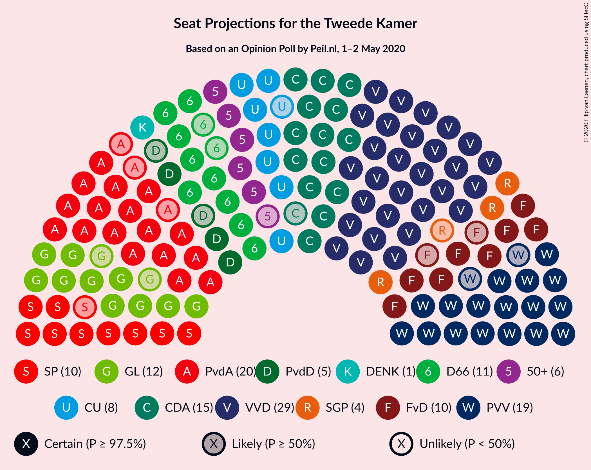

### Confidence Intervals

| Party | Last Result | Median | 80% Confidence Interval | 90% Confidence Interval | 95% Confidence Interval | 99% Confidence Interval |
|:-----:|:-----------:|:------:|:-----------------------:|:-----------------------:|:-----------------------:|:-----------------------:|
| <a href="#volkspartij-voor-vrijheid-en-democratie">Volkspartij voor Vrijheid en Democratie</a> | 33 | 30 | 29–32 |29–33 |29–33 |29–35 |
| <a href="#partij-voor-de-vrijheid">Partij voor de Vrijheid</a> | 20 | 19 | 17–21 |17–21 |17–21 |15–21 |
| <a href="#partij-van-de-arbeid">Partij van de Arbeid</a> | 9 | 20 | 17–20 |17–20 |17–20 |16–22 |
| <a href="#christen-democratisch-appèl">Christen-Democratisch Appèl</a> | 19 | 15 | 15–18 |15–18 |14–19 |14–19 |
| <a href="#groenlinks">GroenLinks</a> | 14 | 12 | 11–13 |10–13 |10–13 |10–14 |
| <a href="#democraten-66">Democraten 66</a> | 19 | 11 | 9–11 |9–11 |9–11 |8–12 |
| <a href="#socialistische-partij">Socialistische Partij</a> | 14 | 10 | 9–11 |9–11 |9–11 |8–11 |
| <a href="#forum-voor-democratie">Forum voor Democratie</a> | 2 | 10 | 9–11 |9–11 |8–11 |8–12 |
| <a href="#christenunie">ChristenUnie</a> | 5 | 8 | 7–8 |7–8 |7–9 |6–9 |
| <a href="#50plus">50Plus</a> | 4 | 6 | 6 |6–7 |5–7 |5–7 |
| <a href="#partij-voor-de-dieren">Partij voor de Dieren</a> | 5 | 5 | 4–5 |4–6 |3–6 |3–6 |
| <a href="#staatkundig-gereformeerde-partij">Staatkundig Gereformeerde Partij</a> | 3 | 4 | 3–4 |3–4 |3–4 |3–5 |
| <a href="#denk">DENK</a> | 3 | 1 | 1–2 |1–3 |1–3 |1–3 |
| <a href="#partij-voor-de-toekomst">Partij voor de Toekomst</a> | 0 | 0 | 0 |0 |0 |0 |

### Volkspartij voor Vrijheid en Democratie

*For a full overview of the results for this party, see the [Volkspartij voor Vrijheid en Democratie](party-volkspartijvoorvrijheidendemocratie.html) page.*

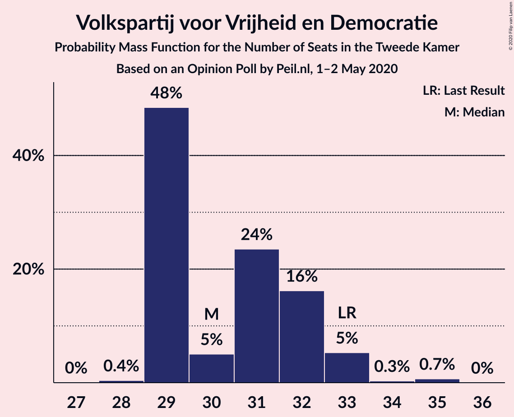

| Number of Seats | Probability | Accumulated | Special Marks |
|:---------------:|:-----------:|:-----------:|:-------------:|
| 28 | 0.4% | 100% |  |
| 29 | 48% | 99.6% |  |
| 30 | 5% | 51% | Median |
| 31 | 24% | 46% |  |
| 32 | 16% | 23% |  |
| 33 | 5% | 6% | Last Result |
| 34 | 0.3% | 1.0% |  |
| 35 | 0.7% | 0.7% |  |
| 36 | 0% | 0% |  |

### Partij voor de Vrijheid

*For a full overview of the results for this party, see the [Partij voor de Vrijheid](party-partijvoordevrijheid.html) page.*

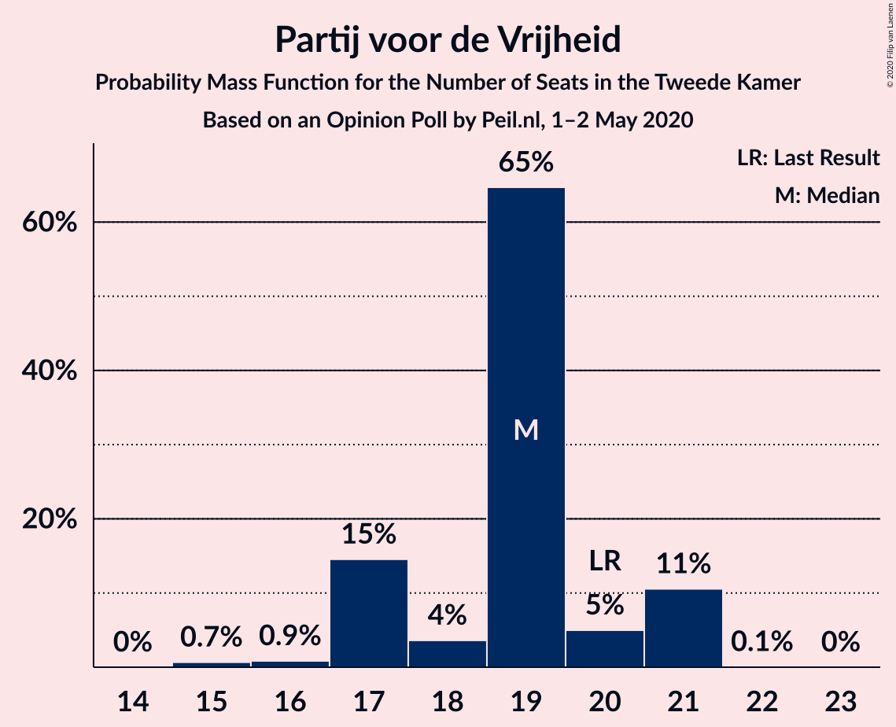

| Number of Seats | Probability | Accumulated | Special Marks |
|:---------------:|:-----------:|:-----------:|:-------------:|
| 15 | 0.7% | 100% |  |
| 16 | 0.9% | 99.3% |  |
| 17 | 15% | 98% |  |
| 18 | 4% | 84% |  |
| 19 | 65% | 80% | Median |
| 20 | 5% | 16% | Last Result |
| 21 | 11% | 11% |  |
| 22 | 0.1% | 0.1% |  |
| 23 | 0% | 0% |  |

### Partij van de Arbeid

*For a full overview of the results for this party, see the [Partij van de Arbeid](party-partijvandearbeid.html) page.*

| Number of Seats | Probability | Accumulated | Special Marks |
|:---------------:|:-----------:|:-----------:|:-------------:|
| 9 | 0% | 100% | Last Result |
| 10 | 0% | 100% |  |
| 11 | 0% | 100% |  |
| 12 | 0% | 100% |  |
| 13 | 0% | 100% |  |
| 14 | 0% | 100% |  |
| 15 | 0.1% | 100% |  |
| 16 | 0.8% | 99.9% |  |
| 17 | 21% | 99.1% |  |
| 18 | 19% | 78% |  |
| 19 | 7% | 59% |  |
| 20 | 51% | 52% | Median |
| 21 | 1.0% | 2% |  |
| 22 | 0.5% | 0.5% |  |
| 23 | 0% | 0% |  |

### Christen-Democratisch Appèl

*For a full overview of the results for this party, see the [Christen-Democratisch Appèl](party-christen-democratischappèl.html) page.*

| Number of Seats | Probability | Accumulated | Special Marks |
|:---------------:|:-----------:|:-----------:|:-------------:|
| 14 | 3% | 100% |  |
| 15 | 60% | 97% | Median |
| 16 | 11% | 37% |  |
| 17 | 15% | 26% |  |
| 18 | 6% | 11% |  |
| 19 | 5% | 5% | Last Result |
| 20 | 0% | 0% |  |

### GroenLinks

*For a full overview of the results for this party, see the [GroenLinks](party-groenlinks.html) page.*

| Number of Seats | Probability | Accumulated | Special Marks |
|:---------------:|:-----------:|:-----------:|:-------------:|
| 10 | 9% | 100% |  |
| 11 | 12% | 91% |  |
| 12 | 61% | 78% | Median |
| 13 | 15% | 17% |  |
| 14 | 2% | 2% | Last Result |
| 15 | 0.1% | 0.1% |  |
| 16 | 0% | 0% |  |

### Democraten 66

*For a full overview of the results for this party, see the [Democraten 66](party-democraten66.html) page.*

| Number of Seats | Probability | Accumulated | Special Marks |
|:---------------:|:-----------:|:-----------:|:-------------:|
| 7 | 0.1% | 100% |  |
| 8 | 0.8% | 99.9% |  |
| 9 | 22% | 99.1% |  |
| 10 | 25% | 77% |  |
| 11 | 51% | 52% | Median |
| 12 | 1.2% | 1.2% |  |
| 13 | 0% | 0% |  |
| 14 | 0% | 0% |  |
| 15 | 0% | 0% |  |
| 16 | 0% | 0% |  |
| 17 | 0% | 0% |  |
| 18 | 0% | 0% |  |
| 19 | 0% | 0% | Last Result |

### Socialistische Partij

*For a full overview of the results for this party, see the [Socialistische Partij](party-socialistischepartij.html) page.*

| Number of Seats | Probability | Accumulated | Special Marks |
|:---------------:|:-----------:|:-----------:|:-------------:|
| 8 | 1.4% | 100% |  |
| 9 | 10% | 98.6% |  |
| 10 | 76% | 89% | Median |
| 11 | 13% | 13% |  |
| 12 | 0.4% | 0.4% |  |
| 13 | 0% | 0% |  |
| 14 | 0% | 0% | Last Result |

### Forum voor Democratie

*For a full overview of the results for this party, see the [Forum voor Democratie](party-forumvoordemocratie.html) page.*

| Number of Seats | Probability | Accumulated | Special Marks |
|:---------------:|:-----------:|:-----------:|:-------------:|
| 2 | 0% | 100% | Last Result |
| 3 | 0% | 100% |  |
| 4 | 0% | 100% |  |
| 5 | 0% | 100% |  |
| 6 | 0% | 100% |  |
| 7 | 0% | 100% |  |
| 8 | 5% | 100% |  |
| 9 | 8% | 95% |  |
| 10 | 75% | 88% | Median |
| 11 | 11% | 13% |  |
| 12 | 2% | 2% |  |
| 13 | 0.2% | 0.2% |  |
| 14 | 0% | 0% |  |

### ChristenUnie

*For a full overview of the results for this party, see the [ChristenUnie](party-christenunie.html) page.*

| Number of Seats | Probability | Accumulated | Special Marks |
|:---------------:|:-----------:|:-----------:|:-------------:|
| 5 | 0% | 100% | Last Result |
| 6 | 2% | 100% |  |
| 7 | 11% | 98% |  |
| 8 | 84% | 87% | Median |
| 9 | 3% | 4% |  |
| 10 | 0.1% | 0.1% |  |
| 11 | 0% | 0% |  |

### 50Plus

*For a full overview of the results for this party, see the [50Plus](party-50plus.html) page.*

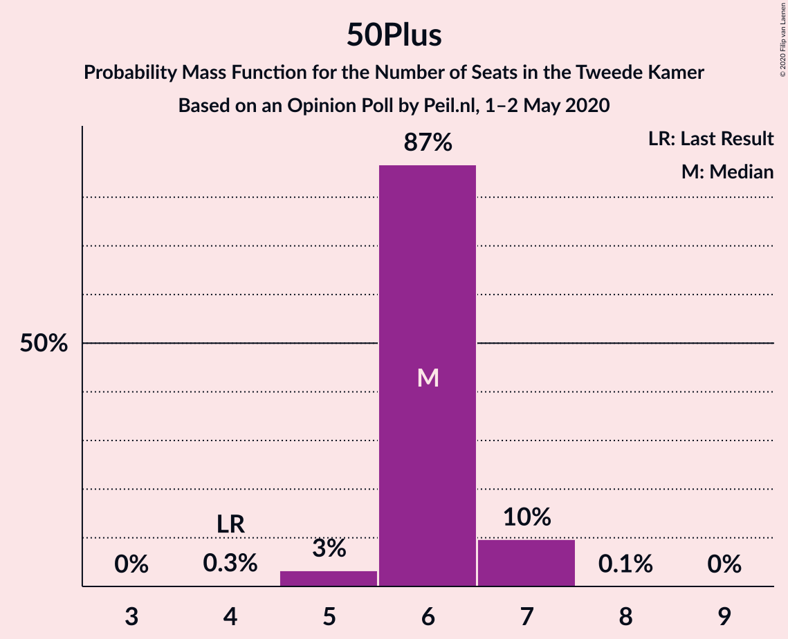

| Number of Seats | Probability | Accumulated | Special Marks |
|:---------------:|:-----------:|:-----------:|:-------------:|
| 4 | 0.3% | 100% | Last Result |
| 5 | 3% | 99.7% |  |
| 6 | 87% | 96% | Median |
| 7 | 10% | 10% |  |
| 8 | 0.1% | 0.1% |  |
| 9 | 0% | 0% |  |

### Partij voor de Dieren

*For a full overview of the results for this party, see the [Partij voor de Dieren](party-partijvoordedieren.html) page.*

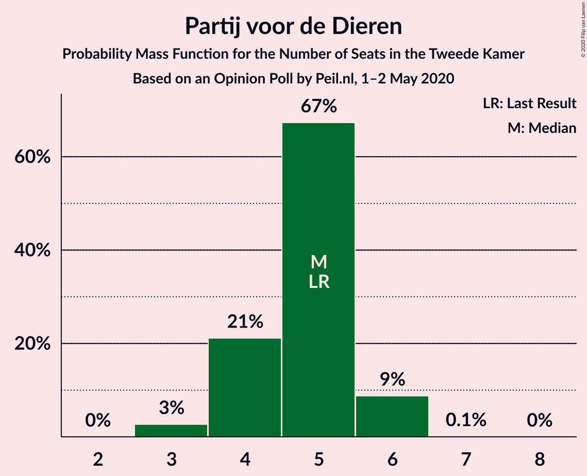

| Number of Seats | Probability | Accumulated | Special Marks |
|:---------------:|:-----------:|:-----------:|:-------------:|
| 3 | 3% | 100% |  |
| 4 | 21% | 97% |  |
| 5 | 67% | 76% | Last Result, Median |
| 6 | 9% | 9% |  |
| 7 | 0.1% | 0.1% |  |
| 8 | 0% | 0% |  |

### Staatkundig Gereformeerde Partij

*For a full overview of the results for this party, see the [Staatkundig Gereformeerde Partij](party-staatkundiggereformeerdepartij.html) page.*

| Number of Seats | Probability | Accumulated | Special Marks |
|:---------------:|:-----------:|:-----------:|:-------------:|
| 2 | 0.1% | 100% |  |
| 3 | 22% | 99.9% | Last Result |
| 4 | 76% | 78% | Median |
| 5 | 2% | 2% |  |
| 6 | 0% | 0% |  |

### DENK

*For a full overview of the results for this party, see the [DENK](party-denk.html) page.*

| Number of Seats | Probability | Accumulated | Special Marks |
|:---------------:|:-----------:|:-----------:|:-------------:|
| 1 | 64% | 100% | Median |
| 2 | 29% | 36% |  |
| 3 | 7% | 7% | Last Result |
| 4 | 0% | 0% |  |

### Partij voor de Toekomst

*For a full overview of the results for this party, see the [Partij voor de Toekomst](party-partijvoordetoekomst.html) page.*

| Number of Seats | Probability | Accumulated | Special Marks |
|:---------------:|:-----------:|:-----------:|:-------------:|
| 0 | 100% | 100% | Last Result, Median |

## Coalitions

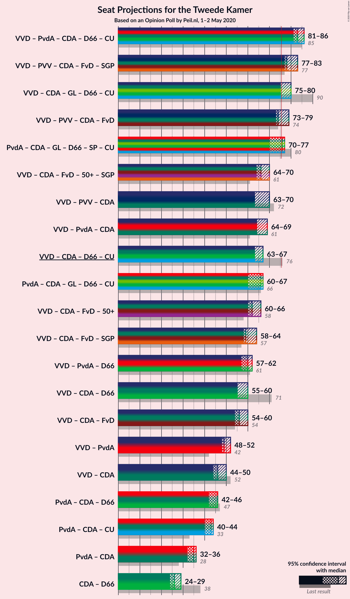

### Confidence Intervals

| Coalition | Last Result | Median | Majority? | 80% Confidence Interval | 90% Confidence Interval | 95% Confidence Interval | 99% Confidence Interval |
|:---------:|:-----------:|:------:|:---------:|:-----------------------:|:-----------------------:|:-----------------------:|:-----------------------:|
| Volkspartij voor Vrijheid en Democratie – Partij van de Arbeid – Christen-Democratisch Appèl – Democraten 66 – ChristenUnie | 85 | 83 | 100% | 82–84 | 82–86 | 81–86 | 81–88 |
| Volkspartij voor Vrijheid en Democratie – Partij voor de Vrijheid – Christen-Democratisch Appèl – Forum voor Democratie – Staatkundig Gereformeerde Partij | 77 | 78 | 99.8% | 77–82 | 77–83 | 77–83 | 76–84 |
| Volkspartij voor Vrijheid en Democratie – Christen-Democratisch Appèl – GroenLinks – Democraten 66 – ChristenUnie | 90 | 75 | 37% | 75–79 | 75–79 | 75–80 | 74–81 |
| Volkspartij voor Vrijheid en Democratie – Partij voor de Vrijheid – Christen-Democratisch Appèl – Forum voor Democratie | 74 | 74 | 39% | 73–78 | 73–79 | 73–79 | 73–80 |
| Partij van de Arbeid – Christen-Democratisch Appèl – GroenLinks – Democraten 66 – Socialistische Partij – ChristenUnie | 80 | 76 | 58% | 71–76 | 70–76 | 70–77 | 70–78 |
| Volkspartij voor Vrijheid en Democratie – Christen-Democratisch Appèl – Forum voor Democratie – 50Plus – Staatkundig Gereformeerde Partij | 61 | 66 | 0% | 64–69 | 64–70 | 64–70 | 63–71 |
| Volkspartij voor Vrijheid en Democratie – Partij voor de Vrijheid – Christen-Democratisch Appèl | 72 | 63 | 0% | 63–68 | 63–69 | 63–70 | 63–70 |
| Volkspartij voor Vrijheid en Democratie – Partij van de Arbeid – Christen-Democratisch Appèl | 61 | 64 | 0% | 64–67 | 64–69 | 64–69 | 63–70 |
| Volkspartij voor Vrijheid en Democratie – Christen-Democratisch Appèl – Democraten 66 – ChristenUnie | 76 | 63 | 0% | 63–67 | 63–67 | 63–67 | 62–69 |
| Partij van de Arbeid – Christen-Democratisch Appèl – GroenLinks – Democraten 66 – ChristenUnie | 66 | 66 | 0% | 62–66 | 60–66 | 60–67 | 60–68 |
| Volkspartij voor Vrijheid en Democratie – Christen-Democratisch Appèl – Forum voor Democratie – 50Plus | 58 | 62 | 0% | 60–65 | 60–66 | 60–66 | 60–67 |
| Volkspartij voor Vrijheid en Democratie – Christen-Democratisch Appèl – Forum voor Democratie – Staatkundig Gereformeerde Partij | 57 | 59 | 0% | 58–63 | 58–64 | 58–64 | 58–65 |
| Volkspartij voor Vrijheid en Democratie – Partij van de Arbeid – Democraten 66 | 61 | 60 | 0% | 58–61 | 57–61 | 57–62 | 57–64 |
| Volkspartij voor Vrijheid en Democratie – Christen-Democratisch Appèl – Democraten 66 | 71 | 55 | 0% | 55–59 | 55–60 | 55–60 | 55–61 |
| Volkspartij voor Vrijheid en Democratie – Christen-Democratisch Appèl – Forum voor Democratie | 54 | 56 | 0% | 54–59 | 54–60 | 54–60 | 54–61 |
| Volkspartij voor Vrijheid en Democratie – Partij van de Arbeid | 42 | 49 | 0% | 48–51 | 48–52 | 48–52 | 47–54 |
| Volkspartij voor Vrijheid en Democratie – Christen-Democratisch Appèl | 52 | 46 | 0% | 44–49 | 44–50 | 44–50 | 44–50 |
| Partij van de Arbeid – Christen-Democratisch Appèl – Democraten 66 | 47 | 46 | 0% | 42–46 | 42–46 | 42–46 | 41–48 |
| Partij van de Arbeid – Christen-Democratisch Appèl – ChristenUnie | 33 | 43 | 0% | 40–43 | 40–44 | 40–44 | 39–46 |
| Partij van de Arbeid – Christen-Democratisch Appèl | 28 | 35 | 0% | 33–36 | 32–36 | 32–36 | 32–38 |
| Christen-Democratisch Appèl – Democraten 66 | 38 | 26 | 0% | 25–27 | 25–29 | 24–29 | 23–29 |

### Volkspartij voor Vrijheid en Democratie – Partij van de Arbeid – Christen-Democratisch Appèl – Democraten 66 – ChristenUnie

| Number of Seats | Probability | Accumulated | Special Marks |
|:---------------:|:-----------:|:-----------:|:-------------:|
| 79 | 0.1% | 100% |  |
| 80 | 0.2% | 99.9% |  |
| 81 | 2% | 99.7% |  |
| 82 | 12% | 97% |  |
| 83 | 70% | 85% |  |
| 84 | 6% | 15% | Median |
| 85 | 3% | 9% | Last Result |
| 86 | 5% | 6% |  |
| 87 | 0.4% | 1.0% |  |
| 88 | 0.5% | 0.6% |  |
| 89 | 0% | 0.1% |  |
| 90 | 0% | 0% |  |

### Volkspartij voor Vrijheid en Democratie – Partij voor de Vrijheid – Christen-Democratisch Appèl – Forum voor Democratie – Staatkundig Gereformeerde Partij

| Number of Seats | Probability | Accumulated | Special Marks |
|:---------------:|:-----------:|:-----------:|:-------------:|
| 74 | 0.2% | 100% |  |
| 75 | 0% | 99.8% |  |
| 76 | 0.4% | 99.8% | Majority |
| 77 | 48% | 99.4% | Last Result |
| 78 | 9% | 51% | Median |
| 79 | 10% | 42% |  |
| 80 | 9% | 32% |  |
| 81 | 6% | 23% |  |
| 82 | 12% | 17% |  |
| 83 | 5% | 5% |  |
| 84 | 0.5% | 0.5% |  |
| 85 | 0% | 0% |  |

### Volkspartij voor Vrijheid en Democratie – Christen-Democratisch Appèl – GroenLinks – Democraten 66 – ChristenUnie

| Number of Seats | Probability | Accumulated | Special Marks |
|:---------------:|:-----------:|:-----------:|:-------------:|
| 73 | 0.1% | 100% |  |
| 74 | 2% | 99.9% |  |
| 75 | 61% | 98% |  |
| 76 | 3% | 37% | Median, Majority |
| 77 | 8% | 35% |  |
| 78 | 15% | 26% |  |
| 79 | 8% | 11% |  |
| 80 | 2% | 3% |  |
| 81 | 0.9% | 1.0% |  |
| 82 | 0.1% | 0.2% |  |
| 83 | 0% | 0.1% |  |
| 84 | 0% | 0% |  |
| 85 | 0% | 0% |  |
| 86 | 0% | 0% |  |
| 87 | 0% | 0% |  |
| 88 | 0% | 0% |  |
| 89 | 0% | 0% |  |
| 90 | 0% | 0% | Last Result |

### Volkspartij voor Vrijheid en Democratie – Partij voor de Vrijheid – Christen-Democratisch Appèl – Forum voor Democratie

| Number of Seats | Probability | Accumulated | Special Marks |
|:---------------:|:-----------:|:-----------:|:-------------:|
| 70 | 0.2% | 100% |  |
| 71 | 0% | 99.8% |  |
| 72 | 0.2% | 99.8% |  |
| 73 | 48% | 99.6% |  |
| 74 | 3% | 51% | Last Result, Median |
| 75 | 9% | 48% |  |
| 76 | 16% | 39% | Majority |
| 77 | 2% | 23% |  |
| 78 | 15% | 21% |  |
| 79 | 6% | 7% |  |
| 80 | 0.4% | 0.5% |  |
| 81 | 0.1% | 0.1% |  |
| 82 | 0% | 0% |  |

### Partij van de Arbeid – Christen-Democratisch Appèl – GroenLinks – Democraten 66 – Socialistische Partij – ChristenUnie

| Number of Seats | Probability | Accumulated | Special Marks |
|:---------------:|:-----------:|:-----------:|:-------------:|
| 68 | 0.1% | 100% |  |
| 69 | 0.1% | 99.9% |  |
| 70 | 8% | 99.8% |  |
| 71 | 3% | 92% |  |
| 72 | 3% | 89% |  |
| 73 | 9% | 86% |  |
| 74 | 7% | 77% |  |
| 75 | 12% | 70% |  |
| 76 | 54% | 58% | Median, Majority |
| 77 | 3% | 4% |  |
| 78 | 0.2% | 0.5% |  |
| 79 | 0.3% | 0.3% |  |
| 80 | 0% | 0% | Last Result |

### Volkspartij voor Vrijheid en Democratie – Christen-Democratisch Appèl – Forum voor Democratie – 50Plus – Staatkundig Gereformeerde Partij

| Number of Seats | Probability | Accumulated | Special Marks |
|:---------------:|:-----------:|:-----------:|:-------------:|
| 61 | 0% | 100% | Last Result |
| 62 | 0.2% | 100% |  |
| 63 | 0.3% | 99.8% |  |
| 64 | 49% | 99.4% |  |
| 65 | 0.2% | 50% | Median |
| 66 | 10% | 50% |  |
| 67 | 16% | 40% |  |
| 68 | 9% | 24% |  |
| 69 | 9% | 15% |  |
| 70 | 5% | 6% |  |
| 71 | 0.8% | 1.1% |  |
| 72 | 0.4% | 0.4% |  |
| 73 | 0% | 0% |  |

### Volkspartij voor Vrijheid en Democratie – Partij voor de Vrijheid – Christen-Democratisch Appèl

| Number of Seats | Probability | Accumulated | Special Marks |
|:---------------:|:-----------:|:-----------:|:-------------:|
| 59 | 0.2% | 100% |  |
| 60 | 0% | 99.8% |  |
| 61 | 0% | 99.8% |  |
| 62 | 0.2% | 99.8% |  |
| 63 | 50% | 99.6% |  |
| 64 | 1.5% | 50% | Median |
| 65 | 9% | 48% |  |
| 66 | 15% | 39% |  |
| 67 | 3% | 24% |  |
| 68 | 12% | 21% |  |
| 69 | 5% | 8% |  |
| 70 | 4% | 4% |  |
| 71 | 0% | 0% |  |
| 72 | 0% | 0% | Last Result |

### Volkspartij voor Vrijheid en Democratie – Partij van de Arbeid – Christen-Democratisch Appèl

| Number of Seats | Probability | Accumulated | Special Marks |
|:---------------:|:-----------:|:-----------:|:-------------:|
| 61 | 0% | 100% | Last Result |
| 62 | 0.2% | 100% |  |
| 63 | 0.8% | 99.8% |  |
| 64 | 58% | 99.0% |  |
| 65 | 12% | 41% | Median |
| 66 | 15% | 29% |  |
| 67 | 6% | 13% |  |
| 68 | 2% | 7% |  |
| 69 | 5% | 5% |  |
| 70 | 0.5% | 0.7% |  |
| 71 | 0.1% | 0.1% |  |
| 72 | 0% | 0% |  |

### Volkspartij voor Vrijheid en Democratie – Christen-Democratisch Appèl – Democraten 66 – ChristenUnie

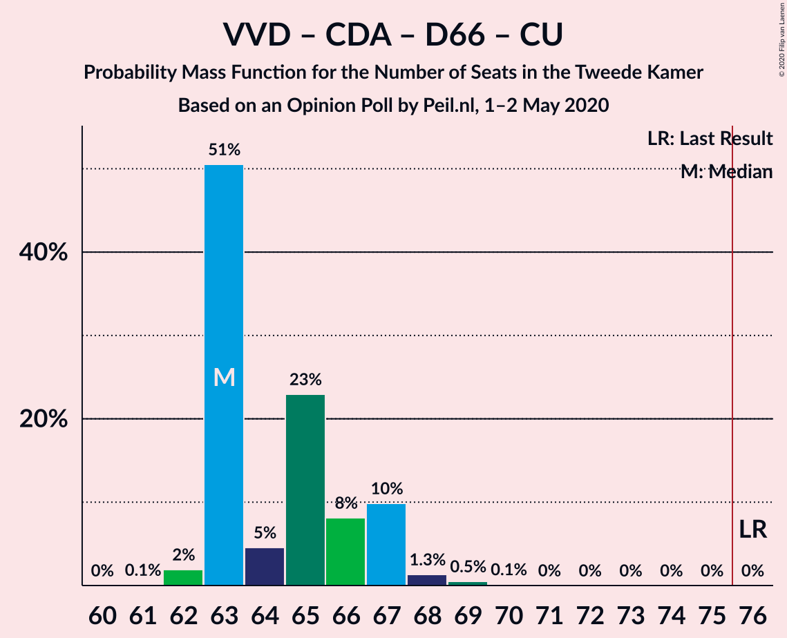

| Number of Seats | Probability | Accumulated | Special Marks |
|:---------------:|:-----------:|:-----------:|:-------------:|
| 61 | 0.1% | 100% |  |
| 62 | 2% | 99.9% |  |
| 63 | 51% | 98% |  |
| 64 | 5% | 47% | Median |
| 65 | 23% | 43% |  |
| 66 | 8% | 20% |  |
| 67 | 10% | 12% |  |
| 68 | 1.3% | 2% |  |
| 69 | 0.5% | 0.6% |  |
| 70 | 0.1% | 0.2% |  |
| 71 | 0% | 0% |  |
| 72 | 0% | 0% |  |
| 73 | 0% | 0% |  |
| 74 | 0% | 0% |  |
| 75 | 0% | 0% |  |
| 76 | 0% | 0% | Last Result, Majority |

### Partij van de Arbeid – Christen-Democratisch Appèl – GroenLinks – Democraten 66 – ChristenUnie

| Number of Seats | Probability | Accumulated | Special Marks |
|:---------------:|:-----------:|:-----------:|:-------------:|
| 59 | 0.2% | 100% |  |
| 60 | 8% | 99.8% |  |
| 61 | 0.7% | 92% |  |
| 62 | 3% | 91% |  |
| 63 | 6% | 87% |  |
| 64 | 15% | 82% |  |
| 65 | 14% | 67% |  |
| 66 | 50% | 53% | Last Result, Median |
| 67 | 3% | 3% |  |
| 68 | 0.6% | 0.6% |  |
| 69 | 0.1% | 0.1% |  |
| 70 | 0% | 0% |  |

### Volkspartij voor Vrijheid en Democratie – Christen-Democratisch Appèl – Forum voor Democratie – 50Plus

| Number of Seats | Probability | Accumulated | Special Marks |
|:---------------:|:-----------:|:-----------:|:-------------:|
| 58 | 0.1% | 100% | Last Result |
| 59 | 0.4% | 99.9% |  |
| 60 | 48% | 99.5% |  |
| 61 | 1.0% | 51% | Median |
| 62 | 3% | 50% |  |
| 63 | 20% | 48% |  |
| 64 | 6% | 28% |  |
| 65 | 15% | 22% |  |
| 66 | 6% | 7% |  |
| 67 | 0.8% | 1.2% |  |
| 68 | 0.4% | 0.4% |  |
| 69 | 0% | 0% |  |

### Volkspartij voor Vrijheid en Democratie – Christen-Democratisch Appèl – Forum voor Democratie – Staatkundig Gereformeerde Partij

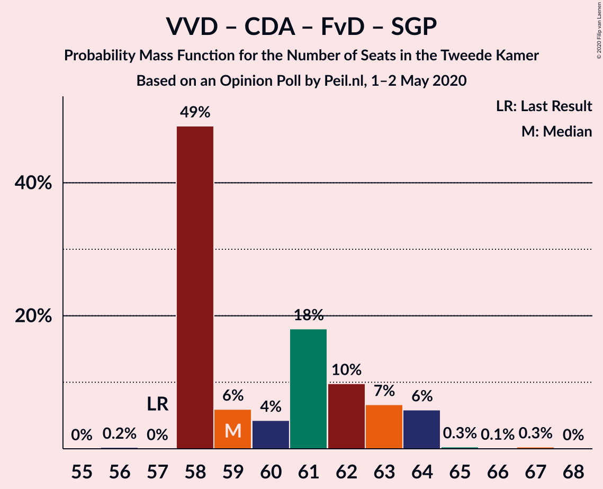

| Number of Seats | Probability | Accumulated | Special Marks |
|:---------------:|:-----------:|:-----------:|:-------------:|
| 56 | 0.2% | 100% |  |
| 57 | 0% | 99.8% | Last Result |
| 58 | 49% | 99.8% |  |
| 59 | 6% | 51% | Median |
| 60 | 4% | 45% |  |
| 61 | 18% | 41% |  |
| 62 | 10% | 23% |  |
| 63 | 7% | 13% |  |
| 64 | 6% | 6% |  |
| 65 | 0.3% | 0.6% |  |
| 66 | 0.1% | 0.4% |  |
| 67 | 0.3% | 0.3% |  |
| 68 | 0% | 0% |  |

### Volkspartij voor Vrijheid en Democratie – Partij van de Arbeid – Democraten 66

| Number of Seats | Probability | Accumulated | Special Marks |
|:---------------:|:-----------:|:-----------:|:-------------:|
| 56 | 0.3% | 100% |  |
| 57 | 7% | 99.7% |  |
| 58 | 14% | 93% |  |
| 59 | 19% | 79% |  |
| 60 | 49% | 60% |  |
| 61 | 7% | 11% | Last Result, Median |
| 62 | 2% | 4% |  |
| 63 | 0.9% | 2% |  |
| 64 | 0.6% | 0.6% |  |
| 65 | 0% | 0.1% |  |
| 66 | 0% | 0% |  |

### Volkspartij voor Vrijheid en Democratie – Christen-Democratisch Appèl – Democraten 66

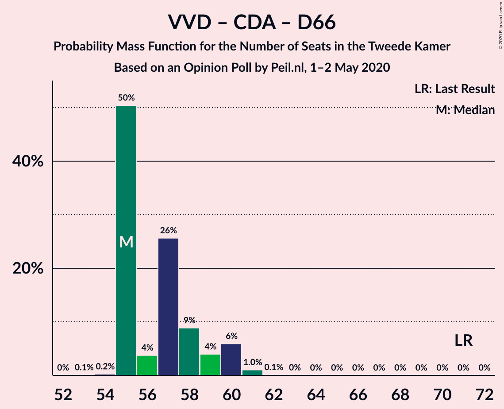

| Number of Seats | Probability | Accumulated | Special Marks |
|:---------------:|:-----------:|:-----------:|:-------------:|
| 53 | 0.1% | 100% |  |
| 54 | 0.2% | 99.9% |  |
| 55 | 50% | 99.7% |  |
| 56 | 4% | 49% | Median |
| 57 | 26% | 46% |  |
| 58 | 9% | 20% |  |
| 59 | 4% | 11% |  |
| 60 | 6% | 7% |  |
| 61 | 1.0% | 1.2% |  |
| 62 | 0.1% | 0.1% |  |
| 63 | 0% | 0% |  |
| 64 | 0% | 0% |  |
| 65 | 0% | 0% |  |
| 66 | 0% | 0% |  |
| 67 | 0% | 0% |  |
| 68 | 0% | 0% |  |
| 69 | 0% | 0% |  |
| 70 | 0% | 0% |  |
| 71 | 0% | 0% | Last Result |

### Volkspartij voor Vrijheid en Democratie – Christen-Democratisch Appèl – Forum voor Democratie

| Number of Seats | Probability | Accumulated | Special Marks |
|:---------------:|:-----------:|:-----------:|:-------------:|
| 53 | 0.3% | 100% |  |
| 54 | 48% | 99.7% | Last Result |
| 55 | 0.6% | 52% | Median |
| 56 | 8% | 51% |  |
| 57 | 14% | 43% |  |
| 58 | 9% | 29% |  |
| 59 | 13% | 20% |  |
| 60 | 6% | 7% |  |
| 61 | 0.2% | 0.7% |  |
| 62 | 0.1% | 0.4% |  |
| 63 | 0.3% | 0.3% |  |
| 64 | 0% | 0% |  |

### Volkspartij voor Vrijheid en Democratie – Partij van de Arbeid

| Number of Seats | Probability | Accumulated | Special Marks |
|:---------------:|:-----------:|:-----------:|:-------------:|
| 42 | 0% | 100% | Last Result |
| 43 | 0% | 100% |  |
| 44 | 0% | 100% |  |
| 45 | 0% | 100% |  |
| 46 | 0.2% | 100% |  |
| 47 | 0.4% | 99.8% |  |
| 48 | 15% | 99.4% |  |
| 49 | 71% | 85% |  |
| 50 | 3% | 14% | Median |
| 51 | 2% | 10% |  |
| 52 | 6% | 8% |  |
| 53 | 1.2% | 2% |  |
| 54 | 0.8% | 0.8% |  |
| 55 | 0.1% | 0.1% |  |
| 56 | 0% | 0% |  |

### Volkspartij voor Vrijheid en Democratie – Christen-Democratisch Appèl

| Number of Seats | Probability | Accumulated | Special Marks |
|:---------------:|:-----------:|:-----------:|:-------------:|
| 43 | 0.2% | 100% |  |
| 44 | 48% | 99.8% |  |
| 45 | 0.8% | 52% | Median |
| 46 | 5% | 51% |  |
| 47 | 20% | 46% |  |
| 48 | 8% | 26% |  |
| 49 | 9% | 18% |  |
| 50 | 9% | 10% |  |
| 51 | 0.3% | 0.4% |  |
| 52 | 0.1% | 0.1% | Last Result |
| 53 | 0% | 0% |  |

### Partij van de Arbeid – Christen-Democratisch Appèl – Democraten 66

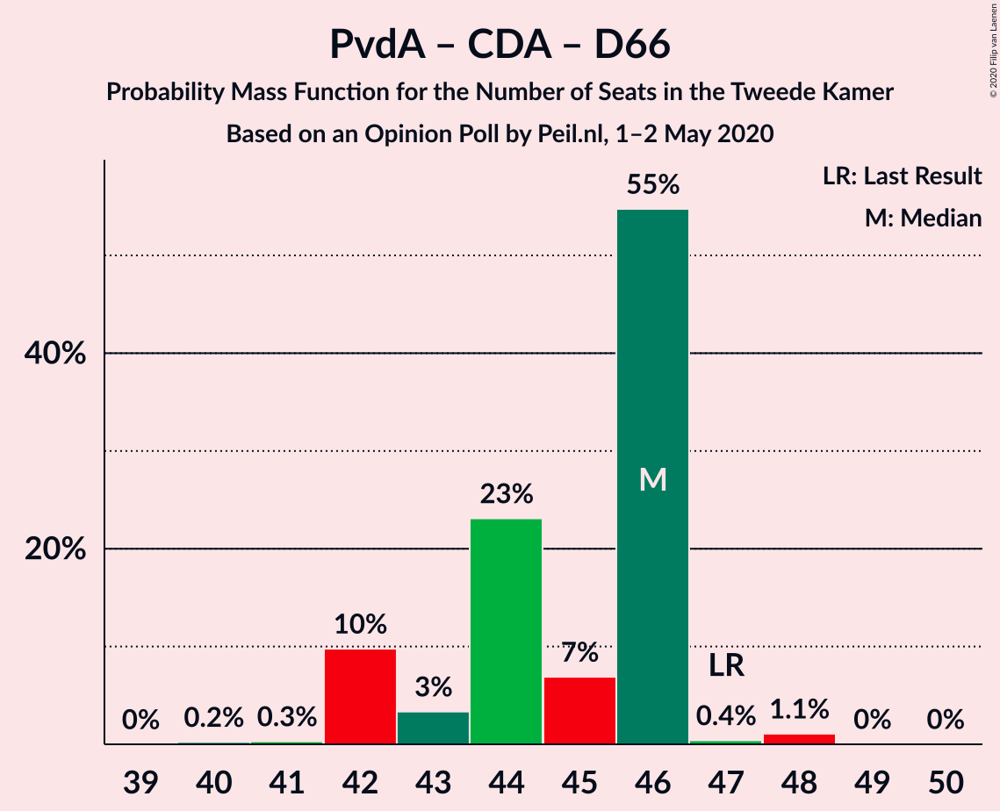

| Number of Seats | Probability | Accumulated | Special Marks |
|:---------------:|:-----------:|:-----------:|:-------------:|
| 40 | 0.2% | 100% |  |
| 41 | 0.3% | 99.8% |  |
| 42 | 10% | 99.5% |  |
| 43 | 3% | 90% |  |
| 44 | 23% | 86% |  |
| 45 | 7% | 63% |  |
| 46 | 55% | 56% | Median |
| 47 | 0.4% | 2% | Last Result |
| 48 | 1.1% | 1.1% |  |
| 49 | 0% | 0.1% |  |
| 50 | 0% | 0% |  |

### Partij van de Arbeid – Christen-Democratisch Appèl – ChristenUnie

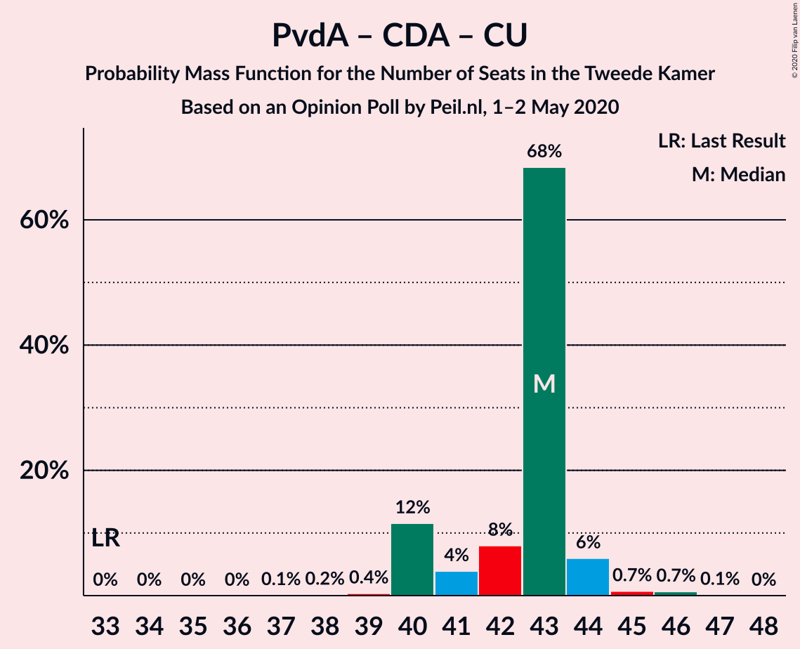

| Number of Seats | Probability | Accumulated | Special Marks |
|:---------------:|:-----------:|:-----------:|:-------------:|
| 33 | 0% | 100% | Last Result |
| 34 | 0% | 100% |  |
| 35 | 0% | 100% |  |
| 36 | 0% | 100% |  |
| 37 | 0.1% | 100% |  |
| 38 | 0.2% | 99.9% |  |
| 39 | 0.4% | 99.7% |  |
| 40 | 12% | 99.4% |  |
| 41 | 4% | 88% |  |
| 42 | 8% | 84% |  |
| 43 | 68% | 76% | Median |
| 44 | 6% | 8% |  |
| 45 | 0.7% | 2% |  |
| 46 | 0.7% | 0.8% |  |
| 47 | 0.1% | 0.2% |  |
| 48 | 0% | 0% |  |

### Partij van de Arbeid – Christen-Democratisch Appèl

| Number of Seats | Probability | Accumulated | Special Marks |
|:---------------:|:-----------:|:-----------:|:-------------:|
| 28 | 0% | 100% | Last Result |
| 29 | 0% | 100% |  |
| 30 | 0.1% | 100% |  |
| 31 | 0.2% | 99.9% |  |
| 32 | 9% | 99.7% |  |
| 33 | 4% | 91% |  |
| 34 | 11% | 87% |  |
| 35 | 65% | 76% | Median |
| 36 | 9% | 11% |  |
| 37 | 1.0% | 2% |  |
| 38 | 0.7% | 0.9% |  |
| 39 | 0.1% | 0.2% |  |
| 40 | 0% | 0% |  |

### Christen-Democratisch Appèl – Democraten 66

| Number of Seats | Probability | Accumulated | Special Marks |
|:---------------:|:-----------:|:-----------:|:-------------:|
| 22 | 0.1% | 100% |  |
| 23 | 2% | 99.9% |  |
| 24 | 2% | 98% |  |
| 25 | 12% | 97% |  |
| 26 | 69% | 85% | Median |
| 27 | 10% | 16% |  |
| 28 | 0.8% | 6% |  |
| 29 | 5% | 5% |  |
| 30 | 0% | 0% |  |
| 31 | 0% | 0% |  |
| 32 | 0% | 0% |  |
| 33 | 0% | 0% |  |
| 34 | 0% | 0% |  |
| 35 | 0% | 0% |  |
| 36 | 0% | 0% |  |
| 37 | 0% | 0% |  |
| 38 | 0% | 0% | Last Result |

## Technical Information

### Opinion Poll

+ **Polling firm:** Peil.nl
+ **Commissioner(s):** —
+ **Fieldwork period:** 1–2 May 2020

### Calculations

+ **Sample size:** 3000
+ **Simulations done:** 1,048,576
+ **Error estimate:** 1.66%

