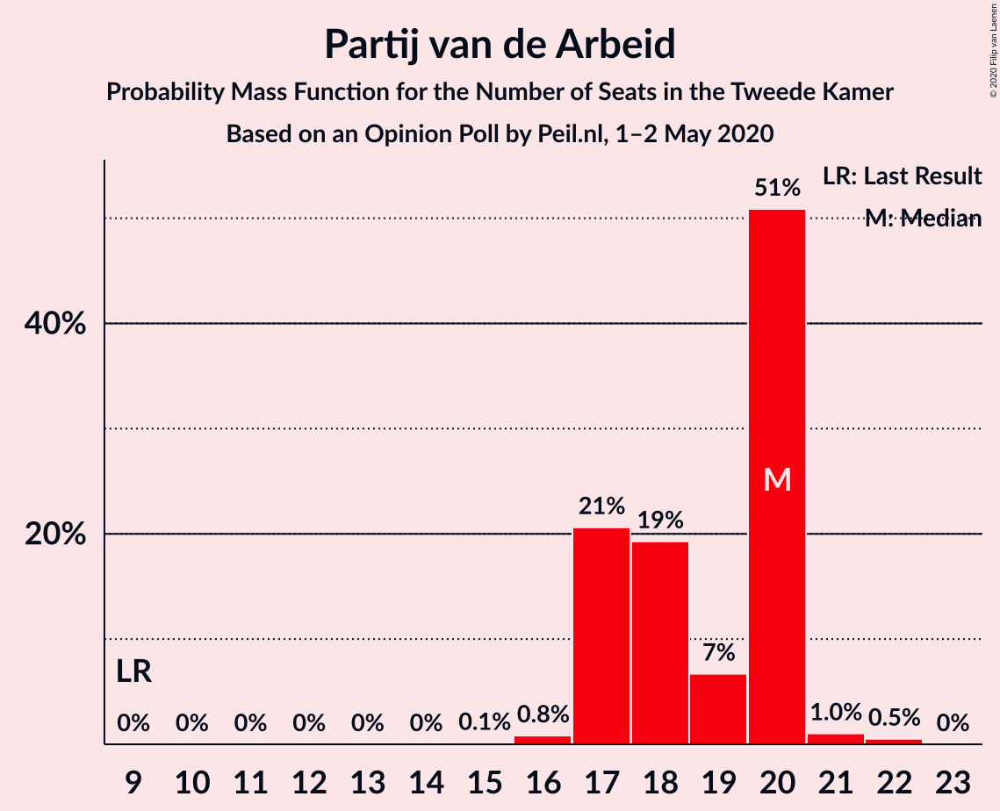
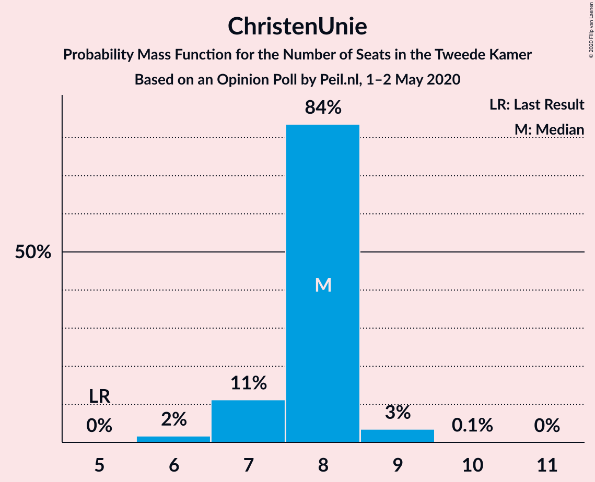
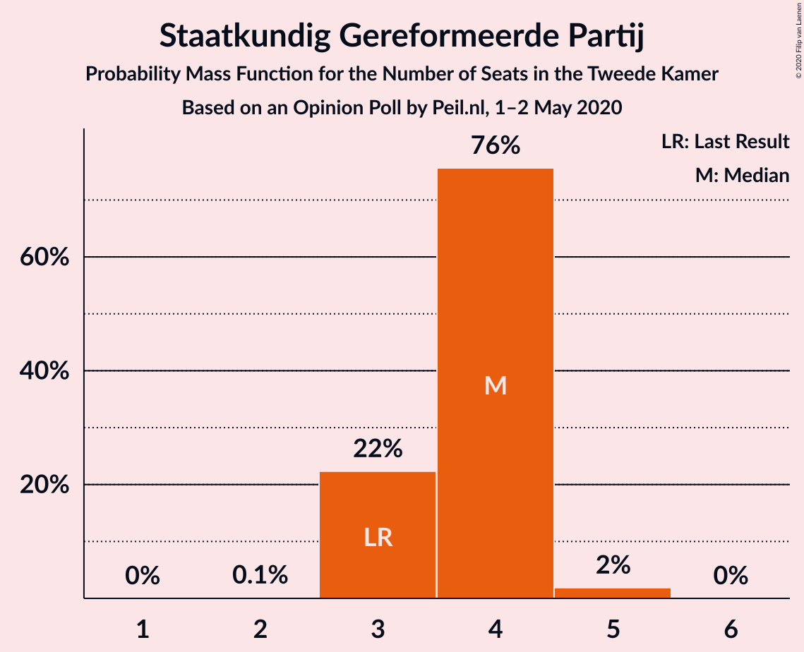
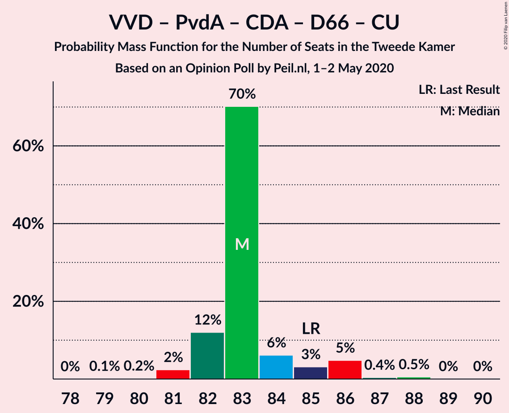
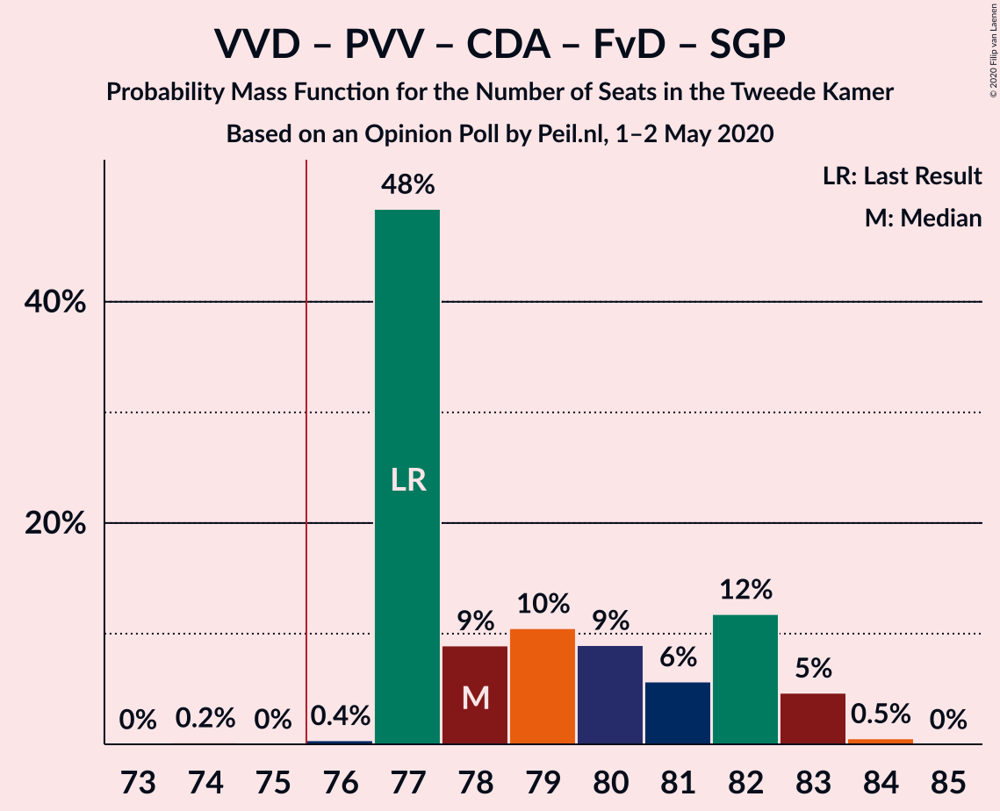
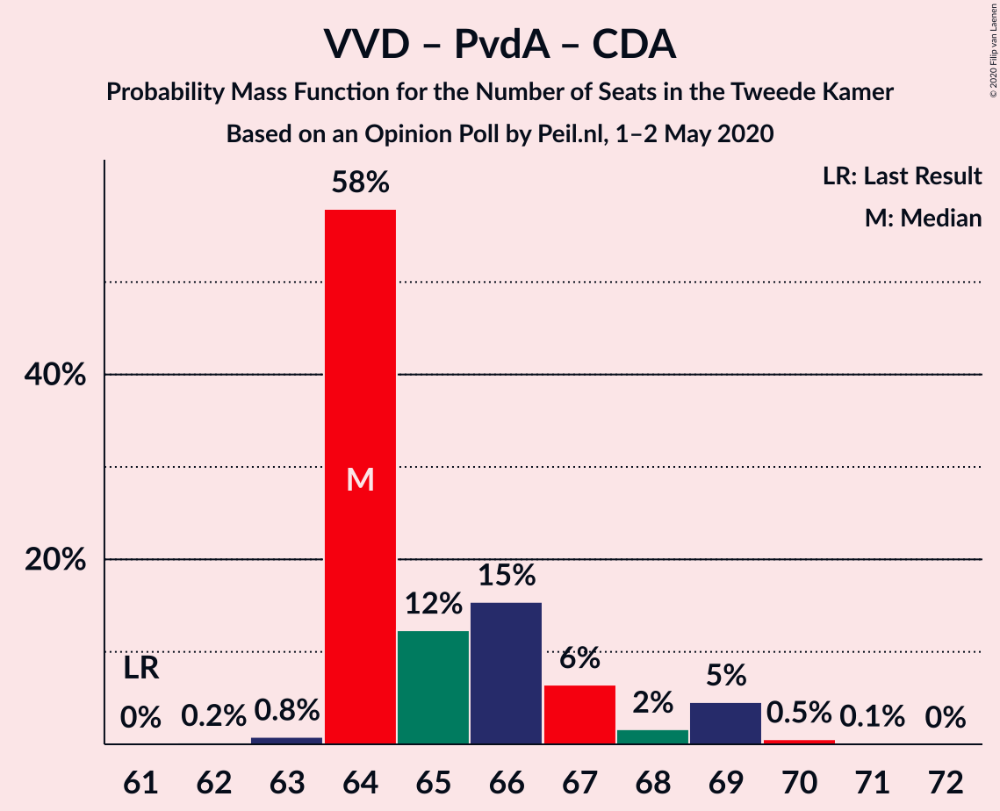
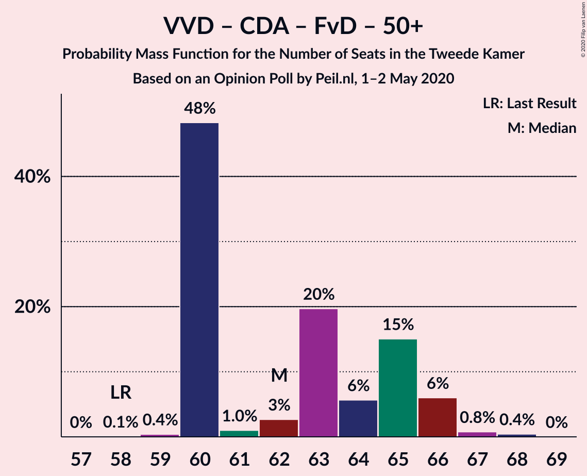
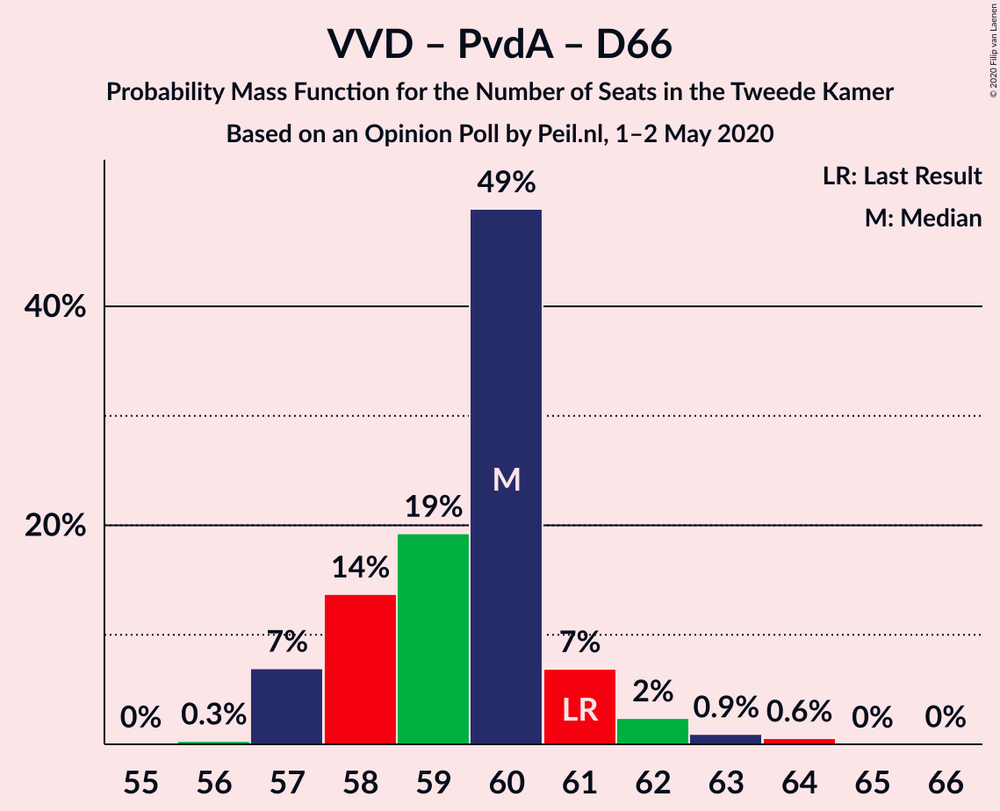
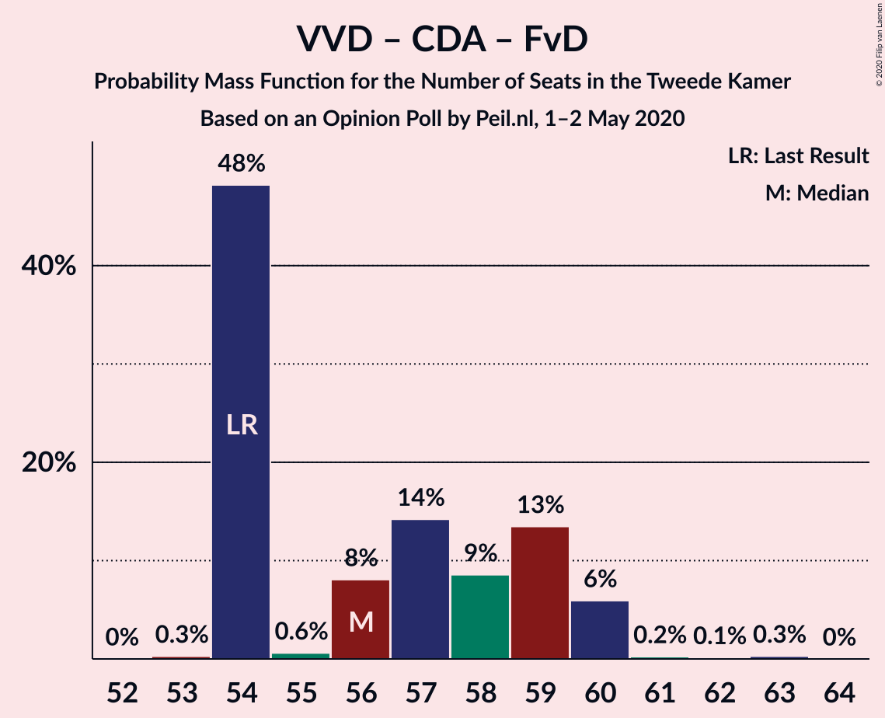

# Opinion Poll by Peil.nl, 1–2 May 2020

<a href="#voting-intentions">Voting Intentions</a> | <a href="#seats">Seats</a> | <a href="#coalitions">Coalitions</a> | <a href="#technical-information">Technical Information</a>

## Voting Intentions

### Confidence Intervals

| Party | Last Result | Poll Result | 80% Confidence Interval | 90% Confidence Interval | 95% Confidence Interval | 99% Confidence Interval |
|:-----:|:-----------:|:-----------:|:-----------------------:|:-----------------------:|:-----------------------:|:-----------------------:|
| Volkspartij voor Vrijheid en Democratie | 21.3% | 20.6% | 19.7–21.6% |19.4–21.9% |19.2–22.1% |18.7–22.6% |
| Partij voor de Vrijheid | 13.1% | 12.0% | 11.2–12.8% |11.0–13.0% |10.9–13.2% |10.5–13.6% |
| Partij van de Arbeid | 5.7% | 12.0% | 11.2–12.8% |11.0–13.0% |10.9–13.2% |10.5–13.6% |
| Christen-Democratisch Appèl | 12.4% | 10.6% | 9.9–11.4% |9.7–11.6% |9.6–11.8% |9.3–12.2% |
| GroenLinks | 9.1% | 8.0% | 7.4–8.6% |7.2–8.8% |7.0–9.0% |6.8–9.3% |
| Democraten 66 | 12.2% | 6.6% | 6.1–7.3% |5.9–7.4% |5.8–7.6% |5.5–7.9% |
| Socialistische Partij | 9.1% | 6.6% | 6.1–7.3% |5.9–7.4% |5.8–7.6% |5.5–7.9% |
| Forum voor Democratie | 1.8% | 6.6% | 6.1–7.3% |5.9–7.4% |5.8–7.6% |5.5–7.9% |
| ChristenUnie | 3.4% | 5.3% | 4.8–5.9% |4.7–6.0% |4.5–6.2% |4.3–6.4% |
| 50Plus | 3.1% | 4.0% | 3.6–4.5% |3.4–4.6% |3.4–4.8% |3.2–5.0% |
| Partij voor de Dieren | 3.2% | 3.3% | 2.9–3.8% |2.8–3.9% |2.7–4.0% |2.6–4.3% |
| Staatkundig Gereformeerde Partij | 2.1% | 2.7% | 2.3–3.1% |2.2–3.2% |2.1–3.3% |2.0–3.5% |
| DENK | 2.1% | 1.3% | 1.1–1.6% |1.0–1.7% |1.0–1.8% |0.9–2.0% |
| Partij voor de Toekomst | 0.0% | 0.2% | 0.1–0.3% |0.1–0.4% |0.1–0.4% |0.0–0.5% |

*Note:* The poll result column reflects the actual value used in the calculations. Published results may vary slightly, and in addition be rounded to fewer digits.

## Seats

### Confidence Intervals

| Party | Last Result | Median | 80% Confidence Interval | 90% Confidence Interval | 95% Confidence Interval | 99% Confidence Interval |
|:-----:|:-----------:|:------:|:-----------------------:|:-----------------------:|:-----------------------:|:-----------------------:|
| <a href="#volkspartij-voor-vrijheid-en-democratie">Volkspartij voor Vrijheid en Democratie</a> | 33 | 32 | 31–32 |31–32 |31–32 |30–35 |
| <a href="#partij-voor-de-vrijheid">Partij voor de Vrijheid</a> | 20 | 21 | 19–21 |19–21 |18–21 |17–21 |
| <a href="#partij-van-de-arbeid">Partij van de Arbeid</a> | 9 | 17 | 17–18 |17–18 |17–21 |17–21 |
| <a href="#christen-democratisch-appèl">Christen-Democratisch Appèl</a> | 19 | 15 | 15–16 |15–16 |15–16 |15–18 |
| <a href="#groenlinks">GroenLinks</a> | 14 | 10 | 10–12 |10–12 |10–12 |10–13 |
| <a href="#democraten-66">Democraten 66</a> | 19 | 10 | 10 |9–10 |8–10 |8–11 |
| <a href="#socialistische-partij">Socialistische Partij</a> | 14 | 10 | 9–10 |9–10 |9–10 |8–11 |
| <a href="#forum-voor-democratie">Forum voor Democratie</a> | 2 | 10 | 9–10 |9–10 |9–12 |8–12 |
| <a href="#christenunie">ChristenUnie</a> | 5 | 8 | 8 |8 |7–9 |7–9 |
| <a href="#50plus">50Plus</a> | 4 | 6 | 6–7 |6–7 |5–7 |5–7 |
| <a href="#partij-voor-de-dieren">Partij voor de Dieren</a> | 5 | 5 | 5–6 |4–6 |4–6 |4–6 |
| <a href="#staatkundig-gereformeerde-partij">Staatkundig Gereformeerde Partij</a> | 3 | 4 | 3–4 |3–4 |3–4 |3–4 |
| <a href="#denk">DENK</a> | 3 | 2 | 2 |2 |1–2 |1–2 |
| <a href="#partij-voor-de-toekomst">Partij voor de Toekomst</a> | 0 | 0 | 0 |0 |0 |0 |

### Volkspartij voor Vrijheid en Democratie

*For a full overview of the results for this party, see the [Volkspartij voor Vrijheid en Democratie](party-volkspartijvoorvrijheidendemocratie.html) page.*

| Number of Seats | Probability | Accumulated | Special Marks |
|:---------------:|:-----------:|:-----------:|:-------------:|
| 28 | 0% | 100% |  |
| 29 | 0% | 99.9% |  |
| 30 | 2% | 99.9% |  |
| 31 | 35% | 98% |  |
| 32 | 61% | 63% | Median |
| 33 | 0% | 2% | Last Result |
| 34 | 0% | 2% |  |
| 35 | 2% | 2% |  |
| 36 | 0% | 0% |  |

### Partij voor de Vrijheid

*For a full overview of the results for this party, see the [Partij voor de Vrijheid](party-partijvoordevrijheid.html) page.*

| Number of Seats | Probability | Accumulated | Special Marks |
|:---------------:|:-----------:|:-----------:|:-------------:|
| 16 | 0.4% | 100% |  |
| 17 | 2% | 99.6% |  |
| 18 | 0.5% | 98% |  |
| 19 | 37% | 97% |  |
| 20 | 2% | 60% | Last Result |
| 21 | 58% | 58% | Median |
| 22 | 0% | 0% |  |

### Partij van de Arbeid

*For a full overview of the results for this party, see the [Partij van de Arbeid](party-partijvandearbeid.html) page.*

| Number of Seats | Probability | Accumulated | Special Marks |
|:---------------:|:-----------:|:-----------:|:-------------:|
| 9 | 0% | 100% | Last Result |
| 10 | 0% | 100% |  |
| 11 | 0% | 100% |  |
| 12 | 0% | 100% |  |
| 13 | 0% | 100% |  |
| 14 | 0% | 100% |  |
| 15 | 0% | 100% |  |
| 16 | 0.1% | 100% |  |
| 17 | 58% | 99.9% | Median |
| 18 | 39% | 42% |  |
| 19 | 0.1% | 3% |  |
| 20 | 0.4% | 3% |  |
| 21 | 3% | 3% |  |
| 22 | 0% | 0% |  |

### Christen-Democratisch Appèl

*For a full overview of the results for this party, see the [Christen-Democratisch Appèl](party-christen-democratischappèl.html) page.*

| Number of Seats | Probability | Accumulated | Special Marks |
|:---------------:|:-----------:|:-----------:|:-------------:|
| 14 | 0% | 100% |  |
| 15 | 62% | 99.9% | Median |
| 16 | 37% | 38% |  |
| 17 | 0.3% | 0.9% |  |
| 18 | 0.6% | 0.6% |  |
| 19 | 0% | 0% | Last Result |

### GroenLinks

*For a full overview of the results for this party, see the [GroenLinks](party-groenlinks.html) page.*

| Number of Seats | Probability | Accumulated | Special Marks |
|:---------------:|:-----------:|:-----------:|:-------------:|
| 10 | 56% | 100% | Median |
| 11 | 3% | 43% |  |
| 12 | 39% | 41% |  |
| 13 | 2% | 2% |  |
| 14 | 0% | 0.1% | Last Result |
| 15 | 0% | 0% |  |

### Democraten 66

*For a full overview of the results for this party, see the [Democraten 66](party-democraten66.html) page.*

| Number of Seats | Probability | Accumulated | Special Marks |
|:---------------:|:-----------:|:-----------:|:-------------:|
| 8 | 3% | 100% |  |
| 9 | 2% | 97% |  |
| 10 | 93% | 95% | Median |
| 11 | 2% | 2% |  |
| 12 | 0.1% | 0.1% |  |
| 13 | 0% | 0% |  |
| 14 | 0% | 0% |  |
| 15 | 0% | 0% |  |
| 16 | 0% | 0% |  |
| 17 | 0% | 0% |  |
| 18 | 0% | 0% |  |
| 19 | 0% | 0% | Last Result |

### Socialistische Partij

*For a full overview of the results for this party, see the [Socialistische Partij](party-socialistischepartij.html) page.*

| Number of Seats | Probability | Accumulated | Special Marks |
|:---------------:|:-----------:|:-----------:|:-------------:|
| 8 | 2% | 100% |  |
| 9 | 38% | 98% |  |
| 10 | 58% | 60% | Median |
| 11 | 2% | 2% |  |
| 12 | 0.1% | 0.1% |  |
| 13 | 0% | 0% |  |
| 14 | 0% | 0% | Last Result |

### Forum voor Democratie

*For a full overview of the results for this party, see the [Forum voor Democratie](party-forumvoordemocratie.html) page.*

| Number of Seats | Probability | Accumulated | Special Marks |
|:---------------:|:-----------:|:-----------:|:-------------:|
| 2 | 0% | 100% | Last Result |
| 3 | 0% | 100% |  |
| 4 | 0% | 100% |  |
| 5 | 0% | 100% |  |
| 6 | 0% | 100% |  |
| 7 | 0% | 100% |  |
| 8 | 2% | 100% |  |
| 9 | 37% | 98% |  |
| 10 | 57% | 61% | Median |
| 11 | 0.1% | 4% |  |
| 12 | 4% | 4% |  |
| 13 | 0.4% | 0.4% |  |
| 14 | 0% | 0% |  |

### ChristenUnie

*For a full overview of the results for this party, see the [ChristenUnie](party-christenunie.html) page.*

| Number of Seats | Probability | Accumulated | Special Marks |
|:---------------:|:-----------:|:-----------:|:-------------:|
| 5 | 0% | 100% | Last Result |
| 6 | 0.1% | 100% |  |
| 7 | 3% | 99.9% |  |
| 8 | 93% | 97% | Median |
| 9 | 4% | 4% |  |
| 10 | 0.1% | 0.1% |  |
| 11 | 0% | 0% |  |

### 50Plus

*For a full overview of the results for this party, see the [50Plus](party-50plus.html) page.*

| Number of Seats | Probability | Accumulated | Special Marks |
|:---------------:|:-----------:|:-----------:|:-------------:|
| 4 | 0.3% | 100% | Last Result |
| 5 | 2% | 99.7% |  |
| 6 | 62% | 97% | Median |
| 7 | 35% | 35% |  |
| 8 | 0.1% | 0.1% |  |
| 9 | 0% | 0% |  |

### Partij voor de Dieren

*For a full overview of the results for this party, see the [Partij voor de Dieren](party-partijvoordedieren.html) page.*

| Number of Seats | Probability | Accumulated | Special Marks |
|:---------------:|:-----------:|:-----------:|:-------------:|
| 3 | 0.1% | 100% |  |
| 4 | 6% | 99.9% |  |
| 5 | 57% | 93% | Last Result, Median |
| 6 | 37% | 37% |  |
| 7 | 0.2% | 0.2% |  |
| 8 | 0% | 0% |  |

### Staatkundig Gereformeerde Partij

*For a full overview of the results for this party, see the [Staatkundig Gereformeerde Partij](party-staatkundiggereformeerdepartij.html) page.*

| Number of Seats | Probability | Accumulated | Special Marks |
|:---------------:|:-----------:|:-----------:|:-------------:|
| 2 | 0.3% | 100% |  |
| 3 | 39% | 99.7% | Last Result |
| 4 | 61% | 61% | Median |
| 5 | 0.1% | 0.1% |  |
| 6 | 0% | 0% |  |

### DENK

*For a full overview of the results for this party, see the [DENK](party-denk.html) page.*

| Number of Seats | Probability | Accumulated | Special Marks |
|:---------------:|:-----------:|:-----------:|:-------------:|
| 1 | 4% | 100% |  |
| 2 | 96% | 96% | Median |
| 3 | 0.1% | 0.1% | Last Result |
| 4 | 0% | 0% |  |

### Partij voor de Toekomst

*For a full overview of the results for this party, see the [Partij voor de Toekomst](party-partijvoordetoekomst.html) page.*

| Number of Seats | Probability | Accumulated | Special Marks |
|:---------------:|:-----------:|:-----------:|:-------------:|
| 0 | 100% | 100% | Last Result, Median |

## Coalitions

### Confidence Intervals

| Coalition | Last Result | Median | Majority? | 80% Confidence Interval | 90% Confidence Interval | 95% Confidence Interval | 99% Confidence Interval |
|:---------:|:-----------:|:------:|:---------:|:-----------------------:|:-----------------------:|:-----------------------:|:-----------------------:|
| Volkspartij voor Vrijheid en Democratie – Partij van de Arbeid – Christen-Democratisch Appèl – Democraten 66 – ChristenUnie | 85 | 82 | 100% | 82–83 | 82–84 | 82–86 | 81–87 |
| Volkspartij voor Vrijheid en Democratie – Partij voor de Vrijheid – Christen-Democratisch Appèl – Forum voor Democratie – Staatkundig Gereformeerde Partij | 77 | 82 | 100% | 78–82 | 78–82 | 78–82 | 78–84 |
| Volkspartij voor Vrijheid en Democratie – Christen-Democratisch Appèl – GroenLinks – Democraten 66 – ChristenUnie | 90 | 75 | 42% | 75–77 | 75–77 | 74–79 | 74–81 |
| Volkspartij voor Vrijheid en Democratie – Partij voor de Vrijheid – Christen-Democratisch Appèl – Forum voor Democratie | 74 | 78 | 63% | 75–78 | 75–78 | 75–78 | 75–80 |
| Partij van de Arbeid – Christen-Democratisch Appèl – GroenLinks – Democraten 66 – Socialistische Partij – ChristenUnie | 80 | 70 | 0.2% | 70–73 | 70–73 | 70–74 | 70–74 |
| Volkspartij voor Vrijheid en Democratie – Christen-Democratisch Appèl – Forum voor Democratie – 50Plus – Staatkundig Gereformeerde Partij | 61 | 67 | 0% | 66–67 | 66–67 | 66–70 | 64–72 |
| Volkspartij voor Vrijheid en Democratie – Partij voor de Vrijheid – Christen-Democratisch Appèl | 72 | 68 | 0% | 66–68 | 66–68 | 66–68 | 64–68 |
| Volkspartij voor Vrijheid en Democratie – Partij van de Arbeid – Christen-Democratisch Appèl | 61 | 64 | 0% | 64–65 | 64–68 | 64–68 | 63–69 |
| Volkspartij voor Vrijheid en Democratie – Christen-Democratisch Appèl – Democraten 66 – ChristenUnie | 76 | 65 | 0% | 65 | 65 | 63–66 | 63–69 |
| Volkspartij voor Vrijheid en Democratie – Christen-Democratisch Appèl – Forum voor Democratie – 50Plus | 58 | 63 | 0% | 63 | 63 | 62–66 | 61–68 |
| Partij van de Arbeid – Christen-Democratisch Appèl – GroenLinks – Democraten 66 – ChristenUnie | 66 | 60 | 0% | 60–64 | 60–64 | 60–64 | 60–64 |
| Volkspartij voor Vrijheid en Democratie – Christen-Democratisch Appèl – Forum voor Democratie – Staatkundig Gereformeerde Partij | 57 | 61 | 0% | 59–61 | 59–61 | 59–64 | 58–67 |
| Volkspartij voor Vrijheid en Democratie – Partij van de Arbeid – Democraten 66 | 61 | 59 | 0% | 59 | 59–61 | 59–62 | 58–62 |
| Volkspartij voor Vrijheid en Democratie – Christen-Democratisch Appèl – Forum voor Democratie | 54 | 57 | 0% | 56–57 | 56–57 | 56–60 | 55–63 |
| Volkspartij voor Vrijheid en Democratie – Christen-Democratisch Appèl – Democraten 66 | 71 | 57 | 0% | 57 | 57 | 55–59 | 55–60 |
| Volkspartij voor Vrijheid en Democratie – Partij van de Arbeid | 42 | 49 | 0% | 49 | 49–52 | 49–53 | 48–53 |
| Volkspartij voor Vrijheid en Democratie – Christen-Democratisch Appèl | 52 | 47 | 0% | 47 | 47 | 47–49 | 45–51 |
| Partij van de Arbeid – Christen-Democratisch Appèl – Democraten 66 | 47 | 42 | 0% | 42–44 | 42–44 | 42–44 | 42–45 |
| Partij van de Arbeid – Christen-Democratisch Appèl – ChristenUnie | 33 | 40 | 0% | 40–42 | 40–43 | 40–44 | 40–44 |
| Partij van de Arbeid – Christen-Democratisch Appèl | 28 | 32 | 0% | 32–34 | 32–34 | 32–36 | 32–36 |
| Christen-Democratisch Appèl – Democraten 66 | 38 | 25 | 0% | 25–26 | 25–26 | 23–26 | 23–28 |

### Volkspartij voor Vrijheid en Democratie – Partij van de Arbeid – Christen-Democratisch Appèl – Democraten 66 – ChristenUnie

| Number of Seats | Probability | Accumulated | Special Marks |
|:---------------:|:-----------:|:-----------:|:-------------:|
| 79 | 0.1% | 100% |  |
| 80 | 0% | 99.9% |  |
| 81 | 2% | 99.9% |  |
| 82 | 56% | 98% | Median |
| 83 | 37% | 42% |  |
| 84 | 3% | 5% |  |
| 85 | 0.2% | 3% | Last Result |
| 86 | 0.4% | 3% |  |
| 87 | 2% | 2% |  |
| 88 | 0% | 0% |  |

### Volkspartij voor Vrijheid en Democratie – Partij voor de Vrijheid – Christen-Democratisch Appèl – Forum voor Democratie – Staatkundig Gereformeerde Partij

| Number of Seats | Probability | Accumulated | Special Marks |
|:---------------:|:-----------:|:-----------:|:-------------:|
| 76 | 0.1% | 100% | Majority |
| 77 | 0.1% | 99.9% | Last Result |
| 78 | 37% | 99.8% |  |
| 79 | 2% | 63% |  |
| 80 | 0.1% | 61% |  |
| 81 | 3% | 61% |  |
| 82 | 56% | 58% | Median |
| 83 | 0% | 2% |  |
| 84 | 2% | 2% |  |
| 85 | 0% | 0% |  |

### Volkspartij voor Vrijheid en Democratie – Christen-Democratisch Appèl – GroenLinks – Democraten 66 – ChristenUnie

| Number of Seats | Probability | Accumulated | Special Marks |
|:---------------:|:-----------:|:-----------:|:-------------:|
| 73 | 0.1% | 100% |  |
| 74 | 3% | 99.9% |  |
| 75 | 56% | 97% | Median |
| 76 | 2% | 42% | Majority |
| 77 | 35% | 39% |  |
| 78 | 2% | 4% |  |
| 79 | 0.3% | 3% |  |
| 80 | 0.1% | 2% |  |
| 81 | 2% | 2% |  |
| 82 | 0.2% | 0.2% |  |
| 83 | 0% | 0% |  |
| 84 | 0% | 0% |  |
| 85 | 0% | 0% |  |
| 86 | 0% | 0% |  |
| 87 | 0% | 0% |  |
| 88 | 0% | 0% |  |
| 89 | 0% | 0% |  |
| 90 | 0% | 0% | Last Result |

### Volkspartij voor Vrijheid en Democratie – Partij voor de Vrijheid – Christen-Democratisch Appèl – Forum voor Democratie

| Number of Seats | Probability | Accumulated | Special Marks |
|:---------------:|:-----------:|:-----------:|:-------------:|
| 73 | 0.1% | 100% |  |
| 74 | 0.2% | 99.8% | Last Result |
| 75 | 36% | 99.7% |  |
| 76 | 2% | 63% | Majority |
| 77 | 3% | 61% |  |
| 78 | 56% | 58% | Median |
| 79 | 0.1% | 2% |  |
| 80 | 2% | 2% |  |
| 81 | 0.4% | 0.4% |  |
| 82 | 0% | 0% |  |

### Partij van de Arbeid – Christen-Democratisch Appèl – GroenLinks – Democraten 66 – Socialistische Partij – ChristenUnie

| Number of Seats | Probability | Accumulated | Special Marks |
|:---------------:|:-----------:|:-----------:|:-------------:|
| 70 | 56% | 100% | Median |
| 71 | 0.4% | 44% |  |
| 72 | 5% | 44% |  |
| 73 | 35% | 39% |  |
| 74 | 4% | 4% |  |
| 75 | 0.2% | 0.4% |  |
| 76 | 0% | 0.2% | Majority |
| 77 | 0% | 0.1% |  |
| 78 | 0% | 0.1% |  |
| 79 | 0.1% | 0.1% |  |
| 80 | 0% | 0% | Last Result |

### Volkspartij voor Vrijheid en Democratie – Christen-Democratisch Appèl – Forum voor Democratie – 50Plus – Staatkundig Gereformeerde Partij

| Number of Seats | Probability | Accumulated | Special Marks |
|:---------------:|:-----------:|:-----------:|:-------------:|
| 61 | 0% | 100% | Last Result |
| 62 | 0% | 100% |  |
| 63 | 0.1% | 100% |  |
| 64 | 2% | 99.9% |  |
| 65 | 0% | 98% |  |
| 66 | 39% | 98% |  |
| 67 | 56% | 59% | Median |
| 68 | 0.3% | 3% |  |
| 69 | 0.3% | 3% |  |
| 70 | 0.3% | 3% |  |
| 71 | 0.4% | 2% |  |
| 72 | 2% | 2% |  |
| 73 | 0% | 0% |  |

### Volkspartij voor Vrijheid en Democratie – Partij voor de Vrijheid – Christen-Democratisch Appèl

| Number of Seats | Probability | Accumulated | Special Marks |
|:---------------:|:-----------:|:-----------:|:-------------:|
| 63 | 0% | 100% |  |
| 64 | 2% | 99.9% |  |
| 65 | 0.2% | 98% |  |
| 66 | 35% | 98% |  |
| 67 | 2% | 63% |  |
| 68 | 61% | 61% | Median |
| 69 | 0.2% | 0.2% |  |
| 70 | 0% | 0% |  |
| 71 | 0% | 0% |  |
| 72 | 0% | 0% | Last Result |

### Volkspartij voor Vrijheid en Democratie – Partij van de Arbeid – Christen-Democratisch Appèl

| Number of Seats | Probability | Accumulated | Special Marks |
|:---------------:|:-----------:|:-----------:|:-------------:|
| 61 | 0% | 100% | Last Result |
| 62 | 0% | 100% |  |
| 63 | 2% | 100% |  |
| 64 | 58% | 98% | Median |
| 65 | 35% | 41% |  |
| 66 | 0.6% | 6% |  |
| 67 | 0.3% | 5% |  |
| 68 | 3% | 5% |  |
| 69 | 2% | 2% |  |
| 70 | 0.1% | 0.1% |  |
| 71 | 0% | 0% |  |

### Volkspartij voor Vrijheid en Democratie – Christen-Democratisch Appèl – Democraten 66 – ChristenUnie

| Number of Seats | Probability | Accumulated | Special Marks |
|:---------------:|:-----------:|:-----------:|:-------------:|
| 61 | 0.1% | 100% |  |
| 62 | 0% | 99.9% |  |
| 63 | 4% | 99.9% |  |
| 64 | 0% | 96% |  |
| 65 | 91% | 96% | Median |
| 66 | 2% | 5% |  |
| 67 | 0.2% | 2% |  |
| 68 | 0% | 2% |  |
| 69 | 2% | 2% |  |
| 70 | 0.2% | 0.2% |  |
| 71 | 0% | 0% |  |
| 72 | 0% | 0% |  |
| 73 | 0% | 0% |  |
| 74 | 0% | 0% |  |
| 75 | 0% | 0% |  |
| 76 | 0% | 0% | Last Result, Majority |

### Volkspartij voor Vrijheid en Democratie – Christen-Democratisch Appèl – Forum voor Democratie – 50Plus

| Number of Seats | Probability | Accumulated | Special Marks |
|:---------------:|:-----------:|:-----------:|:-------------:|
| 58 | 0% | 100% | Last Result |
| 59 | 0% | 100% |  |
| 60 | 0.1% | 100% |  |
| 61 | 2% | 99.9% |  |
| 62 | 3% | 98% |  |
| 63 | 92% | 96% | Median |
| 64 | 0.2% | 3% |  |
| 65 | 0.5% | 3% |  |
| 66 | 0.2% | 3% |  |
| 67 | 0.1% | 2% |  |
| 68 | 2% | 2% |  |
| 69 | 0% | 0% |  |

### Partij van de Arbeid – Christen-Democratisch Appèl – GroenLinks – Democraten 66 – ChristenUnie

| Number of Seats | Probability | Accumulated | Special Marks |
|:---------------:|:-----------:|:-----------:|:-------------:|
| 60 | 56% | 100% | Median |
| 61 | 0% | 44% |  |
| 62 | 0.5% | 44% |  |
| 63 | 4% | 44% |  |
| 64 | 39% | 39% |  |
| 65 | 0.2% | 0.4% |  |
| 66 | 0% | 0.2% | Last Result |
| 67 | 0% | 0.2% |  |
| 68 | 0.1% | 0.1% |  |
| 69 | 0% | 0% |  |

### Volkspartij voor Vrijheid en Democratie – Christen-Democratisch Appèl – Forum voor Democratie – Staatkundig Gereformeerde Partij

| Number of Seats | Probability | Accumulated | Special Marks |
|:---------------:|:-----------:|:-----------:|:-------------:|
| 57 | 0% | 100% | Last Result |
| 58 | 2% | 100% |  |
| 59 | 35% | 98% |  |
| 60 | 5% | 64% |  |
| 61 | 56% | 59% | Median |
| 62 | 0.4% | 3% |  |
| 63 | 0.1% | 3% |  |
| 64 | 0.1% | 3% |  |
| 65 | 0.6% | 2% |  |
| 66 | 0% | 2% |  |
| 67 | 2% | 2% |  |
| 68 | 0% | 0% |  |

### Volkspartij voor Vrijheid en Democratie – Partij van de Arbeid – Democraten 66

| Number of Seats | Probability | Accumulated | Special Marks |
|:---------------:|:-----------:|:-----------:|:-------------:|
| 56 | 0% | 100% |  |
| 57 | 0% | 99.9% |  |
| 58 | 0.7% | 99.9% |  |
| 59 | 94% | 99.2% | Median |
| 60 | 0.1% | 5% |  |
| 61 | 3% | 5% | Last Result |
| 62 | 2% | 3% |  |
| 63 | 0.5% | 0.5% |  |
| 64 | 0% | 0% |  |

### Volkspartij voor Vrijheid en Democratie – Christen-Democratisch Appèl – Forum voor Democratie

| Number of Seats | Probability | Accumulated | Special Marks |
|:---------------:|:-----------:|:-----------:|:-------------:|
| 54 | 0% | 100% | Last Result |
| 55 | 2% | 100% |  |
| 56 | 37% | 98% |  |
| 57 | 58% | 61% | Median |
| 58 | 0.7% | 3% |  |
| 59 | 0.1% | 3% |  |
| 60 | 0.2% | 3% |  |
| 61 | 0.1% | 2% |  |
| 62 | 0.4% | 2% |  |
| 63 | 2% | 2% |  |
| 64 | 0% | 0% |  |

### Volkspartij voor Vrijheid en Democratie – Christen-Democratisch Appèl – Democraten 66

| Number of Seats | Probability | Accumulated | Special Marks |
|:---------------:|:-----------:|:-----------:|:-------------:|
| 55 | 3% | 100% |  |
| 56 | 2% | 97% |  |
| 57 | 92% | 95% | Median |
| 58 | 0.1% | 3% |  |
| 59 | 0.7% | 3% |  |
| 60 | 2% | 2% |  |
| 61 | 0% | 0.2% |  |
| 62 | 0.1% | 0.2% |  |
| 63 | 0.1% | 0.1% |  |
| 64 | 0% | 0% |  |
| 65 | 0% | 0% |  |
| 66 | 0% | 0% |  |
| 67 | 0% | 0% |  |
| 68 | 0% | 0% |  |
| 69 | 0% | 0% |  |
| 70 | 0% | 0% |  |
| 71 | 0% | 0% | Last Result |

### Volkspartij voor Vrijheid en Democratie – Partij van de Arbeid

| Number of Seats | Probability | Accumulated | Special Marks |
|:---------------:|:-----------:|:-----------:|:-------------:|
| 42 | 0% | 100% | Last Result |
| 43 | 0% | 100% |  |
| 44 | 0% | 100% |  |
| 45 | 0% | 100% |  |
| 46 | 0% | 100% |  |
| 47 | 0% | 100% |  |
| 48 | 2% | 99.9% |  |
| 49 | 92% | 98% | Median |
| 50 | 0.4% | 6% |  |
| 51 | 0.1% | 5% |  |
| 52 | 0.5% | 5% |  |
| 53 | 5% | 5% |  |
| 54 | 0% | 0% |  |

### Volkspartij voor Vrijheid en Democratie – Christen-Democratisch Appèl

| Number of Seats | Probability | Accumulated | Special Marks |
|:---------------:|:-----------:|:-----------:|:-------------:|
| 45 | 2% | 100% |  |
| 46 | 0.2% | 98% |  |
| 47 | 95% | 98% | Median |
| 48 | 0.5% | 3% |  |
| 49 | 0.6% | 3% |  |
| 50 | 0.2% | 2% |  |
| 51 | 2% | 2% |  |
| 52 | 0.1% | 0.2% | Last Result |
| 53 | 0.1% | 0.1% |  |
| 54 | 0% | 0% |  |

### Partij van de Arbeid – Christen-Democratisch Appèl – Democraten 66

| Number of Seats | Probability | Accumulated | Special Marks |
|:---------------:|:-----------:|:-----------:|:-------------:|
| 41 | 0.1% | 100% |  |
| 42 | 58% | 99.9% | Median |
| 43 | 2% | 42% |  |
| 44 | 39% | 40% |  |
| 45 | 0.6% | 1.0% |  |
| 46 | 0.1% | 0.5% |  |
| 47 | 0.4% | 0.4% | Last Result |
| 48 | 0% | 0% |  |

### Partij van de Arbeid – Christen-Democratisch Appèl – ChristenUnie

| Number of Seats | Probability | Accumulated | Special Marks |
|:---------------:|:-----------:|:-----------:|:-------------:|
| 33 | 0% | 100% | Last Result |
| 34 | 0% | 100% |  |
| 35 | 0% | 100% |  |
| 36 | 0% | 100% |  |
| 37 | 0% | 100% |  |
| 38 | 0% | 100% |  |
| 39 | 0.1% | 100% |  |
| 40 | 58% | 99.9% | Median |
| 41 | 2% | 42% |  |
| 42 | 35% | 41% |  |
| 43 | 2% | 5% |  |
| 44 | 3% | 3% |  |
| 45 | 0.1% | 0.1% |  |
| 46 | 0.1% | 0.1% |  |
| 47 | 0% | 0% |  |

### Partij van de Arbeid – Christen-Democratisch Appèl

| Number of Seats | Probability | Accumulated | Special Marks |
|:---------------:|:-----------:|:-----------:|:-------------:|
| 28 | 0% | 100% | Last Result |
| 29 | 0% | 100% |  |
| 30 | 0% | 100% |  |
| 31 | 0% | 100% |  |
| 32 | 57% | 100% | Median |
| 33 | 2% | 43% |  |
| 34 | 37% | 41% |  |
| 35 | 0.7% | 4% |  |
| 36 | 3% | 3% |  |
| 37 | 0.1% | 0.1% |  |
| 38 | 0% | 0% |  |

### Christen-Democratisch Appèl – Democraten 66

| Number of Seats | Probability | Accumulated | Special Marks |
|:---------------:|:-----------:|:-----------:|:-------------:|
| 23 | 3% | 100% |  |
| 24 | 0.3% | 97% |  |
| 25 | 60% | 97% | Median |
| 26 | 36% | 37% |  |
| 27 | 0.4% | 1.0% |  |
| 28 | 0.6% | 0.6% |  |
| 29 | 0% | 0% |  |
| 30 | 0% | 0% |  |
| 31 | 0% | 0% |  |
| 32 | 0% | 0% |  |
| 33 | 0% | 0% |  |
| 34 | 0% | 0% |  |
| 35 | 0% | 0% |  |
| 36 | 0% | 0% |  |
| 37 | 0% | 0% |  |
| 38 | 0% | 0% | Last Result |

## Technical Information

### Opinion Poll

+ **Polling firm:** Peil.nl
+ **Commissioner(s):** —
+ **Fieldwork period:** 1–2 May 2020

### Calculations

+ **Sample size:** 3000
+ **Simulations done:** 131,072
+ **Error estimate:** 1.37%

