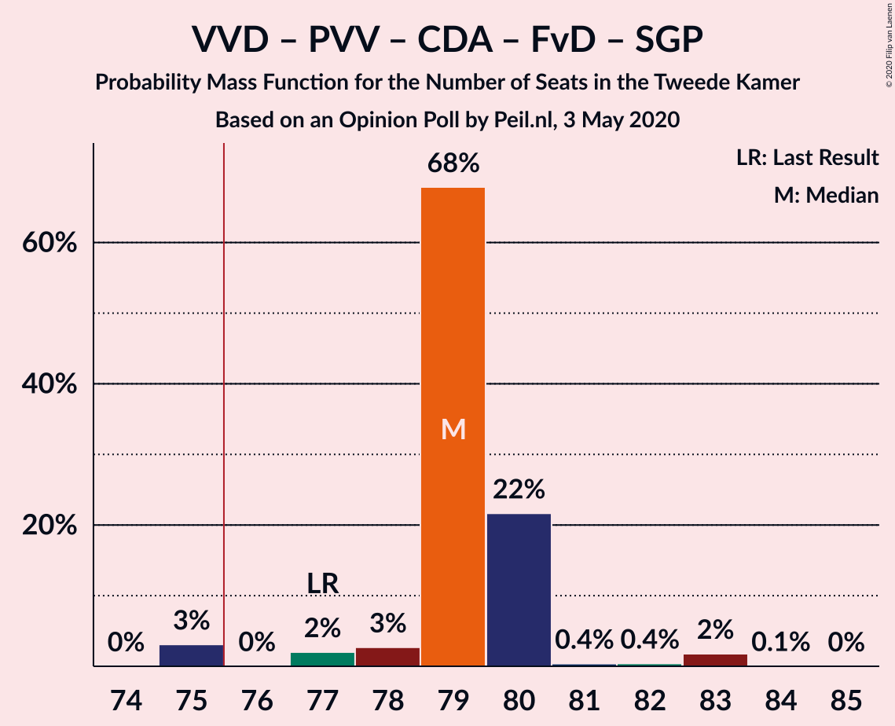

# Opinion Poll by Peil.nl, 3 May 2020

<a href="#voting-intentions">Voting Intentions</a> | <a href="#seats">Seats</a> | <a href="#coalitions">Coalitions</a> | <a href="#technical-information">Technical Information</a>

## Voting Intentions

### Confidence Intervals

| Party | Last Result | Poll Result | 80% Confidence Interval | 90% Confidence Interval | 95% Confidence Interval | 99% Confidence Interval |
|:-----:|:-----------:|:-----------:|:-----------------------:|:-----------------------:|:-----------------------:|:-----------------------:|
| Volkspartij voor Vrijheid en Democratie | 21.3% | 20.6% | 19.7–21.6% |19.4–21.9% |19.2–22.1% |18.8–22.6% |
| Partij voor de Vrijheid | 13.1% | 12.0% | 11.2–12.8% |11.0–13.0% |10.9–13.2% |10.5–13.6% |
| Partij van de Arbeid | 5.7% | 12.0% | 11.2–12.8% |11.0–13.0% |10.9–13.2% |10.5–13.6% |
| Christen-Democratisch Appèl | 12.4% | 10.6% | 9.9–11.4% |9.7–11.6% |9.6–11.8% |9.3–12.2% |
| GroenLinks | 9.1% | 8.0% | 7.4–8.7% |7.2–8.9% |7.1–9.0% |6.8–9.4% |
| Democraten 66 | 12.2% | 6.7% | 6.1–7.3% |6.0–7.5% |5.8–7.6% |5.6–7.9% |
| Socialistische Partij | 9.1% | 6.7% | 6.1–7.3% |6.0–7.5% |5.8–7.6% |5.6–7.9% |
| Forum voor Democratie | 1.8% | 6.7% | 6.1–7.3% |6.0–7.5% |5.8–7.6% |5.6–7.9% |
| ChristenUnie | 3.4% | 5.3% | 4.8–5.9% |4.7–6.1% |4.6–6.2% |4.4–6.5% |
| 50Plus | 3.1% | 4.0% | 3.6–4.5% |3.4–4.6% |3.4–4.8% |3.2–5.0% |
| Partij voor de Dieren | 3.2% | 3.3% | 2.9–3.8% |2.8–3.9% |2.7–4.0% |2.6–4.3% |
| Staatkundig Gereformeerde Partij | 2.1% | 2.7% | 2.3–3.1% |2.2–3.2% |2.1–3.3% |2.0–3.5% |
| DENK | 2.1% | 1.3% | 1.1–1.6% |1.0–1.7% |1.0–1.8% |0.9–2.0% |

*Note:* The poll result column reflects the actual value used in the calculations. Published results may vary slightly, and in addition be rounded to fewer digits.

## Seats

### Confidence Intervals

| Party | Last Result | Median | 80% Confidence Interval | 90% Confidence Interval | 95% Confidence Interval | 99% Confidence Interval |
|:-----:|:-----------:|:------:|:-----------------------:|:-----------------------:|:-----------------------:|:-----------------------:|
| <a href="#volkspartij-voor-vrijheid-en-democratie">Volkspartij voor Vrijheid en Democratie</a> | 33 | 30 | 30–33 |30–33 |29–33 |29–34 |
| <a href="#partij-voor-de-vrijheid">Partij voor de Vrijheid</a> | 20 | 20 | 17–20 |17–21 |16–21 |16–21 |
| <a href="#partij-van-de-arbeid">Partij van de Arbeid</a> | 9 | 19 | 17–19 |17–19 |17–19 |16–20 |
| <a href="#christen-democratisch-appèl">Christen-Democratisch Appèl</a> | 19 | 16 | 15–17 |14–17 |14–17 |14–18 |
| <a href="#groenlinks">GroenLinks</a> | 14 | 13 | 11–13 |11–13 |11–13 |10–13 |
| <a href="#democraten-66">Democraten 66</a> | 19 | 8 | 8–10 |8–11 |8–11 |8–12 |
| <a href="#socialistische-partij">Socialistische Partij</a> | 14 | 11 | 9–11 |9–12 |9–12 |8–12 |
| <a href="#forum-voor-democratie">Forum voor Democratie</a> | 2 | 9 | 9–10 |9–10 |9–11 |8–11 |
| <a href="#christenunie">ChristenUnie</a> | 5 | 8 | 8–9 |8–9 |7–9 |7–9 |
| <a href="#50plus">50Plus</a> | 4 | 6 | 6 |5–6 |5–7 |5–8 |
| <a href="#partij-voor-de-dieren">Partij voor de Dieren</a> | 5 | 5 | 5–6 |5–6 |4–6 |4–6 |
| <a href="#staatkundig-gereformeerde-partij">Staatkundig Gereformeerde Partij</a> | 3 | 4 | 3–4 |3–4 |3–4 |3–5 |
| <a href="#denk">DENK</a> | 3 | 1 | 1–2 |1–2 |1–2 |1–2 |

### Volkspartij voor Vrijheid en Democratie

*For a full overview of the results for this party, see the [Volkspartij voor Vrijheid en Democratie](party-volkspartijvoorvrijheidendemocratie.html) page.*

| Number of Seats | Probability | Accumulated | Special Marks |
|:---------------:|:-----------:|:-----------:|:-------------:|
| 28 | 0.4% | 100% |  |
| 29 | 3% | 99.6% |  |
| 30 | 65% | 97% | Median |
| 31 | 6% | 32% |  |
| 32 | 13% | 27% |  |
| 33 | 13% | 13% | Last Result |
| 34 | 0.1% | 0.5% |  |
| 35 | 0.4% | 0.4% |  |
| 36 | 0% | 0% |  |

### Partij voor de Vrijheid

*For a full overview of the results for this party, see the [Partij voor de Vrijheid](party-partijvoordevrijheid.html) page.*

| Number of Seats | Probability | Accumulated | Special Marks |
|:---------------:|:-----------:|:-----------:|:-------------:|
| 16 | 3% | 100% |  |
| 17 | 16% | 97% |  |
| 18 | 6% | 81% |  |
| 19 | 2% | 75% |  |
| 20 | 65% | 73% | Last Result, Median |
| 21 | 8% | 8% |  |
| 22 | 0% | 0% |  |

### Partij van de Arbeid

*For a full overview of the results for this party, see the [Partij van de Arbeid](party-partijvandearbeid.html) page.*

| Number of Seats | Probability | Accumulated | Special Marks |
|:---------------:|:-----------:|:-----------:|:-------------:|
| 9 | 0% | 100% | Last Result |
| 10 | 0% | 100% |  |
| 11 | 0% | 100% |  |
| 12 | 0% | 100% |  |
| 13 | 0% | 100% |  |
| 14 | 0% | 100% |  |
| 15 | 0% | 100% |  |
| 16 | 0.5% | 100% |  |
| 17 | 10% | 99.5% |  |
| 18 | 10% | 90% |  |
| 19 | 78% | 80% | Median |
| 20 | 2% | 2% |  |
| 21 | 0% | 0.2% |  |
| 22 | 0.2% | 0.2% |  |
| 23 | 0% | 0% |  |

### Christen-Democratisch Appèl

*For a full overview of the results for this party, see the [Christen-Democratisch Appèl](party-christen-democratischappèl.html) page.*

| Number of Seats | Probability | Accumulated | Special Marks |
|:---------------:|:-----------:|:-----------:|:-------------:|
| 13 | 0.1% | 100% |  |
| 14 | 8% | 99.9% |  |
| 15 | 3% | 92% |  |
| 16 | 68% | 88% | Median |
| 17 | 18% | 20% |  |
| 18 | 2% | 2% |  |
| 19 | 0% | 0.1% | Last Result |
| 20 | 0% | 0% |  |

### GroenLinks

*For a full overview of the results for this party, see the [GroenLinks](party-groenlinks.html) page.*

| Number of Seats | Probability | Accumulated | Special Marks |
|:---------------:|:-----------:|:-----------:|:-------------:|
| 10 | 1.4% | 100% |  |
| 11 | 10% | 98.6% |  |
| 12 | 11% | 88% |  |
| 13 | 77% | 77% | Median |
| 14 | 0.3% | 0.3% | Last Result |
| 15 | 0.1% | 0.1% |  |
| 16 | 0% | 0% |  |

### Democraten 66

*For a full overview of the results for this party, see the [Democraten 66](party-democraten66.html) page.*

| Number of Seats | Probability | Accumulated | Special Marks |
|:---------------:|:-----------:|:-----------:|:-------------:|
| 8 | 79% | 100% | Median |
| 9 | 3% | 21% |  |
| 10 | 12% | 18% |  |
| 11 | 5% | 6% |  |
| 12 | 0.4% | 0.5% |  |
| 13 | 0.2% | 0.2% |  |
| 14 | 0% | 0% |  |
| 15 | 0% | 0% |  |
| 16 | 0% | 0% |  |
| 17 | 0% | 0% |  |
| 18 | 0% | 0% |  |
| 19 | 0% | 0% | Last Result |

### Socialistische Partij

*For a full overview of the results for this party, see the [Socialistische Partij](party-socialistischepartij.html) page.*

| Number of Seats | Probability | Accumulated | Special Marks |
|:---------------:|:-----------:|:-----------:|:-------------:|
| 8 | 2% | 100% |  |
| 9 | 16% | 98% |  |
| 10 | 11% | 82% |  |
| 11 | 64% | 71% | Median |
| 12 | 7% | 7% |  |
| 13 | 0% | 0% |  |
| 14 | 0% | 0% | Last Result |

### Forum voor Democratie

*For a full overview of the results for this party, see the [Forum voor Democratie](party-forumvoordemocratie.html) page.*

| Number of Seats | Probability | Accumulated | Special Marks |
|:---------------:|:-----------:|:-----------:|:-------------:|
| 2 | 0% | 100% | Last Result |
| 3 | 0% | 100% |  |
| 4 | 0% | 100% |  |
| 5 | 0% | 100% |  |
| 6 | 0% | 100% |  |
| 7 | 0% | 100% |  |
| 8 | 2% | 100% |  |
| 9 | 78% | 98% | Median |
| 10 | 18% | 20% |  |
| 11 | 2% | 3% |  |
| 12 | 0.5% | 0.5% |  |
| 13 | 0% | 0% |  |

### ChristenUnie

*For a full overview of the results for this party, see the [ChristenUnie](party-christenunie.html) page.*

| Number of Seats | Probability | Accumulated | Special Marks |
|:---------------:|:-----------:|:-----------:|:-------------:|
| 5 | 0% | 100% | Last Result |
| 6 | 0.1% | 100% |  |
| 7 | 3% | 99.9% |  |
| 8 | 78% | 97% | Median |
| 9 | 19% | 19% |  |
| 10 | 0.5% | 0.5% |  |
| 11 | 0% | 0% |  |

### 50Plus

*For a full overview of the results for this party, see the [50Plus](party-50plus.html) page.*

| Number of Seats | Probability | Accumulated | Special Marks |
|:---------------:|:-----------:|:-----------:|:-------------:|
| 4 | 0.3% | 100% | Last Result |
| 5 | 8% | 99.7% |  |
| 6 | 88% | 91% | Median |
| 7 | 3% | 4% |  |
| 8 | 0.8% | 0.8% |  |
| 9 | 0% | 0% |  |

### Partij voor de Dieren

*For a full overview of the results for this party, see the [Partij voor de Dieren](party-partijvoordedieren.html) page.*

| Number of Seats | Probability | Accumulated | Special Marks |
|:---------------:|:-----------:|:-----------:|:-------------:|
| 3 | 0.1% | 100% |  |
| 4 | 3% | 99.9% |  |
| 5 | 78% | 97% | Last Result, Median |
| 6 | 19% | 19% |  |
| 7 | 0.1% | 0.1% |  |
| 8 | 0% | 0% |  |

### Staatkundig Gereformeerde Partij

*For a full overview of the results for this party, see the [Staatkundig Gereformeerde Partij](party-staatkundiggereformeerdepartij.html) page.*

| Number of Seats | Probability | Accumulated | Special Marks |
|:---------------:|:-----------:|:-----------:|:-------------:|
| 2 | 0.3% | 100% |  |
| 3 | 16% | 99.7% | Last Result |
| 4 | 82% | 83% | Median |
| 5 | 1.2% | 1.2% |  |
| 6 | 0% | 0% |  |

### DENK

*For a full overview of the results for this party, see the [DENK](party-denk.html) page.*

| Number of Seats | Probability | Accumulated | Special Marks |
|:---------------:|:-----------:|:-----------:|:-------------:|
| 1 | 81% | 100% | Median |
| 2 | 19% | 19% |  |
| 3 | 0.5% | 0.5% | Last Result |
| 4 | 0% | 0% |  |

## Coalitions

### Confidence Intervals

| Coalition | Last Result | Median | Majority? | 80% Confidence Interval | 90% Confidence Interval | 95% Confidence Interval | 99% Confidence Interval |
|:---------:|:-----------:|:------:|:---------:|:-----------------------:|:-----------------------:|:-----------------------:|:-----------------------:|
| Volkspartij voor Vrijheid en Democratie – Partij van de Arbeid – Christen-Democratisch Appèl – Democraten 66 – ChristenUnie | 85 | 81 | 100% | 81–85 | 81–85 | 81–86 | 81–86 |
| Volkspartij voor Vrijheid en Democratie – Partij voor de Vrijheid – Christen-Democratisch Appèl – Forum voor Democratie – Staatkundig Gereformeerde Partij | 77 | 79 | 97% | 79–80 | 77–80 | 75–81 | 75–83 |
| Volkspartij voor Vrijheid en Democratie – Christen-Democratisch Appèl – GroenLinks – Democraten 66 – ChristenUnie | 90 | 75 | 37% | 75–79 | 75–79 | 75–79 | 75–80 |
| Partij van de Arbeid – Christen-Democratisch Appèl – GroenLinks – Democraten 66 – Socialistische Partij – ChristenUnie | 80 | 75 | 5% | 73–75 | 71–76 | 71–79 | 71–79 |
| Volkspartij voor Vrijheid en Democratie – Partij voor de Vrijheid – Christen-Democratisch Appèl – Forum voor Democratie | 74 | 75 | 25% | 75–77 | 73–77 | 71–77 | 71–79 |
| Volkspartij voor Vrijheid en Democratie – Christen-Democratisch Appèl – Forum voor Democratie – 50Plus – Staatkundig Gereformeerde Partij | 61 | 65 | 0% | 65–69 | 65–69 | 65–69 | 64–69 |
| Volkspartij voor Vrijheid en Democratie – Partij van de Arbeid – Christen-Democratisch Appèl | 61 | 65 | 0% | 64–69 | 63–69 | 63–69 | 63–69 |
| Volkspartij voor Vrijheid en Democratie – Partij voor de Vrijheid – Christen-Democratisch Appèl | 72 | 66 | 0% | 65–67 | 64–67 | 62–68 | 62–70 |
| Volkspartij voor Vrijheid en Democratie – Christen-Democratisch Appèl – Democraten 66 – ChristenUnie | 76 | 62 | 0% | 62–66 | 62–66 | 62–67 | 62–68 |
| Partij van de Arbeid – Christen-Democratisch Appèl – GroenLinks – Democraten 66 – ChristenUnie | 66 | 64 | 0% | 63–65 | 61–66 | 61–67 | 61–68 |
| Volkspartij voor Vrijheid en Democratie – Christen-Democratisch Appèl – Forum voor Democratie – 50Plus | 58 | 61 | 0% | 61–66 | 61–66 | 61–66 | 61–66 |
| Volkspartij voor Vrijheid en Democratie – Christen-Democratisch Appèl – Forum voor Democratie – Staatkundig Gereformeerde Partij | 57 | 59 | 0% | 59–63 | 59–63 | 59–63 | 58–63 |
| Volkspartij voor Vrijheid en Democratie – Partij van de Arbeid – Democraten 66 | 61 | 57 | 0% | 57–60 | 57–60 | 57–61 | 57–62 |
| Volkspartij voor Vrijheid en Democratie – Christen-Democratisch Appèl – Forum voor Democratie | 54 | 55 | 0% | 55–60 | 55–60 | 55–60 | 54–60 |
| Volkspartij voor Vrijheid en Democratie – Christen-Democratisch Appèl – Democraten 66 | 71 | 54 | 0% | 54–58 | 54–58 | 54–59 | 54–59 |
| Volkspartij voor Vrijheid en Democratie – Partij van de Arbeid | 42 | 49 | 0% | 49–52 | 49–52 | 47–52 | 47–52 |
| Volkspartij voor Vrijheid en Democratie – Christen-Democratisch Appèl | 52 | 46 | 0% | 46–50 | 46–50 | 46–50 | 45–50 |
| Partij van de Arbeid – Christen-Democratisch Appèl – Democraten 66 | 47 | 43 | 0% | 42–44 | 41–46 | 41–47 | 41–47 |
| Partij van de Arbeid – Christen-Democratisch Appèl – ChristenUnie | 33 | 43 | 0% | 41–44 | 40–44 | 40–44 | 39–45 |
| Partij van de Arbeid – Christen-Democratisch Appèl | 28 | 35 | 0% | 33–36 | 31–36 | 31–36 | 31–37 |
| Christen-Democratisch Appèl – Democraten 66 | 38 | 24 | 0% | 24–25 | 24–27 | 24–28 | 24–28 |

### Volkspartij voor Vrijheid en Democratie – Partij van de Arbeid – Christen-Democratisch Appèl – Democraten 66 – ChristenUnie

| Number of Seats | Probability | Accumulated | Special Marks |
|:---------------:|:-----------:|:-----------:|:-------------:|
| 80 | 0.2% | 100% |  |
| 81 | 62% | 99.8% | Median |
| 82 | 15% | 38% |  |
| 83 | 0.4% | 23% |  |
| 84 | 4% | 23% |  |
| 85 | 16% | 19% | Last Result |
| 86 | 3% | 3% |  |
| 87 | 0.1% | 0.3% |  |
| 88 | 0.2% | 0.2% |  |
| 89 | 0% | 0% |  |

### Volkspartij voor Vrijheid en Democratie – Partij voor de Vrijheid – Christen-Democratisch Appèl – Forum voor Democratie – Staatkundig Gereformeerde Partij

| Number of Seats | Probability | Accumulated | Special Marks |
|:---------------:|:-----------:|:-----------:|:-------------:|
| 75 | 3% | 100% |  |
| 76 | 0% | 97% | Majority |
| 77 | 2% | 97% | Last Result |
| 78 | 3% | 95% |  |
| 79 | 68% | 92% | Median |
| 80 | 22% | 24% |  |
| 81 | 0.4% | 3% |  |
| 82 | 0.4% | 2% |  |
| 83 | 2% | 2% |  |
| 84 | 0.1% | 0.1% |  |
| 85 | 0% | 0% |  |

### Volkspartij voor Vrijheid en Democratie – Christen-Democratisch Appèl – GroenLinks – Democraten 66 – ChristenUnie

| Number of Seats | Probability | Accumulated | Special Marks |
|:---------------:|:-----------:|:-----------:|:-------------:|
| 74 | 0.4% | 100% |  |
| 75 | 62% | 99.6% | Median |
| 76 | 15% | 37% | Majority |
| 77 | 0.1% | 23% |  |
| 78 | 7% | 23% |  |
| 79 | 15% | 16% |  |
| 80 | 0.5% | 0.7% |  |
| 81 | 0.1% | 0.2% |  |
| 82 | 0.1% | 0.1% |  |
| 83 | 0% | 0% |  |
| 84 | 0% | 0% |  |
| 85 | 0% | 0% |  |
| 86 | 0% | 0% |  |
| 87 | 0% | 0% |  |
| 88 | 0% | 0% |  |
| 89 | 0% | 0% |  |
| 90 | 0% | 0% | Last Result |

### Partij van de Arbeid – Christen-Democratisch Appèl – GroenLinks – Democraten 66 – Socialistische Partij – ChristenUnie

| Number of Seats | Probability | Accumulated | Special Marks |
|:---------------:|:-----------:|:-----------:|:-------------:|
| 69 | 0.1% | 100% |  |
| 70 | 0% | 99.9% |  |
| 71 | 9% | 99.9% |  |
| 72 | 0% | 91% |  |
| 73 | 3% | 91% |  |
| 74 | 13% | 88% |  |
| 75 | 70% | 75% | Median |
| 76 | 2% | 5% | Majority |
| 77 | 0.3% | 3% |  |
| 78 | 0% | 3% |  |
| 79 | 3% | 3% |  |
| 80 | 0.1% | 0.1% | Last Result |
| 81 | 0% | 0% |  |

### Volkspartij voor Vrijheid en Democratie – Partij voor de Vrijheid – Christen-Democratisch Appèl – Forum voor Democratie

| Number of Seats | Probability | Accumulated | Special Marks |
|:---------------:|:-----------:|:-----------:|:-------------:|
| 70 | 0.1% | 100% |  |
| 71 | 3% | 99.9% |  |
| 72 | 0.4% | 97% |  |
| 73 | 2% | 97% |  |
| 74 | 0.7% | 95% | Last Result |
| 75 | 69% | 94% | Median |
| 76 | 10% | 25% | Majority |
| 77 | 13% | 15% |  |
| 78 | 0.4% | 2% |  |
| 79 | 2% | 2% |  |
| 80 | 0% | 0% |  |

### Volkspartij voor Vrijheid en Democratie – Christen-Democratisch Appèl – Forum voor Democratie – 50Plus – Staatkundig Gereformeerde Partij

| Number of Seats | Probability | Accumulated | Special Marks |
|:---------------:|:-----------:|:-----------:|:-------------:|
| 61 | 0% | 100% | Last Result |
| 62 | 0.3% | 100% |  |
| 63 | 0% | 99.7% |  |
| 64 | 0.6% | 99.7% |  |
| 65 | 74% | 99.1% | Median |
| 66 | 6% | 25% |  |
| 67 | 0.4% | 18% |  |
| 68 | 4% | 18% |  |
| 69 | 13% | 13% |  |
| 70 | 0.2% | 0.4% |  |
| 71 | 0.1% | 0.2% |  |
| 72 | 0% | 0.1% |  |
| 73 | 0% | 0% |  |

### Volkspartij voor Vrijheid en Democratie – Partij van de Arbeid – Christen-Democratisch Appèl

| Number of Seats | Probability | Accumulated | Special Marks |
|:---------------:|:-----------:|:-----------:|:-------------:|
| 61 | 0.3% | 100% | Last Result |
| 62 | 0% | 99.7% |  |
| 63 | 9% | 99.7% |  |
| 64 | 4% | 91% |  |
| 65 | 67% | 87% | Median |
| 66 | 3% | 20% |  |
| 67 | 0.3% | 16% |  |
| 68 | 2% | 16% |  |
| 69 | 14% | 14% |  |
| 70 | 0.1% | 0.1% |  |
| 71 | 0% | 0.1% |  |
| 72 | 0% | 0% |  |

### Volkspartij voor Vrijheid en Democratie – Partij voor de Vrijheid – Christen-Democratisch Appèl

| Number of Seats | Probability | Accumulated | Special Marks |
|:---------------:|:-----------:|:-----------:|:-------------:|
| 60 | 0.1% | 100% |  |
| 61 | 0% | 99.9% |  |
| 62 | 3% | 99.9% |  |
| 63 | 0.5% | 97% |  |
| 64 | 4% | 97% |  |
| 65 | 5% | 93% |  |
| 66 | 63% | 87% | Median |
| 67 | 21% | 25% |  |
| 68 | 1.4% | 3% |  |
| 69 | 0.2% | 2% |  |
| 70 | 2% | 2% |  |
| 71 | 0% | 0% |  |
| 72 | 0% | 0% | Last Result |

### Volkspartij voor Vrijheid en Democratie – Christen-Democratisch Appèl – Democraten 66 – ChristenUnie

| Number of Seats | Probability | Accumulated | Special Marks |
|:---------------:|:-----------:|:-----------:|:-------------:|
| 62 | 62% | 100% | Median |
| 63 | 0.8% | 38% |  |
| 64 | 5% | 37% |  |
| 65 | 9% | 32% |  |
| 66 | 18% | 23% |  |
| 67 | 4% | 4% |  |
| 68 | 0.3% | 0.5% |  |
| 69 | 0.2% | 0.2% |  |
| 70 | 0% | 0% |  |
| 71 | 0% | 0% |  |
| 72 | 0% | 0% |  |
| 73 | 0% | 0% |  |
| 74 | 0% | 0% |  |
| 75 | 0% | 0% |  |
| 76 | 0% | 0% | Last Result, Majority |

### Partij van de Arbeid – Christen-Democratisch Appèl – GroenLinks – Democraten 66 – ChristenUnie

| Number of Seats | Probability | Accumulated | Special Marks |
|:---------------:|:-----------:|:-----------:|:-------------:|
| 60 | 0.1% | 100% |  |
| 61 | 9% | 99.9% |  |
| 62 | 0.2% | 91% |  |
| 63 | 5% | 91% |  |
| 64 | 65% | 86% | Median |
| 65 | 14% | 20% |  |
| 66 | 0.8% | 6% | Last Result |
| 67 | 3% | 5% |  |
| 68 | 2% | 2% |  |
| 69 | 0% | 0.1% |  |
| 70 | 0.1% | 0.1% |  |
| 71 | 0% | 0% |  |

### Volkspartij voor Vrijheid en Democratie – Christen-Democratisch Appèl – Forum voor Democratie – 50Plus

| Number of Seats | Probability | Accumulated | Special Marks |
|:---------------:|:-----------:|:-----------:|:-------------:|
| 58 | 0% | 100% | Last Result |
| 59 | 0.4% | 100% |  |
| 60 | 0% | 99.6% |  |
| 61 | 75% | 99.6% | Median |
| 62 | 5% | 25% |  |
| 63 | 2% | 20% |  |
| 64 | 3% | 18% |  |
| 65 | 2% | 15% |  |
| 66 | 13% | 13% |  |
| 67 | 0.2% | 0.2% |  |
| 68 | 0% | 0% |  |

### Volkspartij voor Vrijheid en Democratie – Christen-Democratisch Appèl – Forum voor Democratie – Staatkundig Gereformeerde Partij

| Number of Seats | Probability | Accumulated | Special Marks |
|:---------------:|:-----------:|:-----------:|:-------------:|
| 55 | 0.3% | 100% |  |
| 56 | 0% | 99.7% |  |
| 57 | 0.1% | 99.7% | Last Result |
| 58 | 0.4% | 99.6% |  |
| 59 | 73% | 99.2% | Median |
| 60 | 4% | 26% |  |
| 61 | 7% | 22% |  |
| 62 | 0.7% | 16% |  |
| 63 | 15% | 15% |  |
| 64 | 0.1% | 0.3% |  |
| 65 | 0.1% | 0.2% |  |
| 66 | 0% | 0.2% |  |
| 67 | 0.1% | 0.1% |  |
| 68 | 0% | 0% |  |

### Volkspartij voor Vrijheid en Democratie – Partij van de Arbeid – Democraten 66

| Number of Seats | Probability | Accumulated | Special Marks |
|:---------------:|:-----------:|:-----------:|:-------------:|
| 56 | 0.5% | 100% |  |
| 57 | 67% | 99.5% | Median |
| 58 | 3% | 33% |  |
| 59 | 11% | 30% |  |
| 60 | 15% | 19% |  |
| 61 | 2% | 3% | Last Result |
| 62 | 1.2% | 2% |  |
| 63 | 0.3% | 0.4% |  |
| 64 | 0.1% | 0.1% |  |
| 65 | 0% | 0% |  |

### Volkspartij voor Vrijheid en Democratie – Christen-Democratisch Appèl – Forum voor Democratie

| Number of Seats | Probability | Accumulated | Special Marks |
|:---------------:|:-----------:|:-----------:|:-------------:|
| 52 | 0.3% | 100% |  |
| 53 | 0% | 99.7% |  |
| 54 | 0.3% | 99.7% | Last Result |
| 55 | 74% | 99.4% | Median |
| 56 | 2% | 26% |  |
| 57 | 6% | 24% |  |
| 58 | 3% | 18% |  |
| 59 | 2% | 15% |  |
| 60 | 13% | 13% |  |
| 61 | 0.1% | 0.2% |  |
| 62 | 0% | 0.2% |  |
| 63 | 0.1% | 0.1% |  |
| 64 | 0% | 0% |  |

### Volkspartij voor Vrijheid en Democratie – Christen-Democratisch Appèl – Democraten 66

| Number of Seats | Probability | Accumulated | Special Marks |
|:---------------:|:-----------:|:-----------:|:-------------:|
| 54 | 62% | 100% | Median |
| 55 | 5% | 38% |  |
| 56 | 9% | 32% |  |
| 57 | 5% | 24% |  |
| 58 | 15% | 19% |  |
| 59 | 3% | 4% |  |
| 60 | 0.1% | 0.4% |  |
| 61 | 0.1% | 0.3% |  |
| 62 | 0.1% | 0.1% |  |
| 63 | 0% | 0% |  |
| 64 | 0% | 0% |  |
| 65 | 0% | 0% |  |
| 66 | 0% | 0% |  |
| 67 | 0% | 0% |  |
| 68 | 0% | 0% |  |
| 69 | 0% | 0% |  |
| 70 | 0% | 0% |  |
| 71 | 0% | 0% | Last Result |

### Volkspartij voor Vrijheid en Democratie – Partij van de Arbeid

| Number of Seats | Probability | Accumulated | Special Marks |
|:---------------:|:-----------:|:-----------:|:-------------:|
| 42 | 0% | 100% | Last Result |
| 43 | 0% | 100% |  |
| 44 | 0% | 100% |  |
| 45 | 0% | 100% |  |
| 46 | 0.3% | 100% |  |
| 47 | 3% | 99.7% |  |
| 48 | 0.5% | 96% |  |
| 49 | 78% | 96% | Median |
| 50 | 2% | 18% |  |
| 51 | 2% | 16% |  |
| 52 | 14% | 14% |  |
| 53 | 0.1% | 0.4% |  |
| 54 | 0.4% | 0.4% |  |
| 55 | 0% | 0% |  |

### Volkspartij voor Vrijheid en Democratie – Christen-Democratisch Appèl

| Number of Seats | Probability | Accumulated | Special Marks |
|:---------------:|:-----------:|:-----------:|:-------------:|
| 44 | 0.4% | 100% |  |
| 45 | 0.3% | 99.6% |  |
| 46 | 74% | 99.3% | Median |
| 47 | 8% | 25% |  |
| 48 | 0.3% | 17% |  |
| 49 | 2% | 16% |  |
| 50 | 14% | 15% |  |
| 51 | 0.2% | 0.2% |  |
| 52 | 0% | 0.1% | Last Result |
| 53 | 0% | 0% |  |

### Partij van de Arbeid – Christen-Democratisch Appèl – Democraten 66

| Number of Seats | Probability | Accumulated | Special Marks |
|:---------------:|:-----------:|:-----------:|:-------------:|
| 40 | 0.2% | 100% |  |
| 41 | 8% | 99.8% |  |
| 42 | 5% | 92% |  |
| 43 | 64% | 87% | Median |
| 44 | 14% | 23% |  |
| 45 | 2% | 9% |  |
| 46 | 3% | 6% |  |
| 47 | 3% | 3% | Last Result |
| 48 | 0.2% | 0.2% |  |
| 49 | 0% | 0% |  |

### Partij van de Arbeid – Christen-Democratisch Appèl – ChristenUnie

| Number of Seats | Probability | Accumulated | Special Marks |
|:---------------:|:-----------:|:-----------:|:-------------:|
| 33 | 0% | 100% | Last Result |
| 34 | 0% | 100% |  |
| 35 | 0% | 100% |  |
| 36 | 0% | 100% |  |
| 37 | 0% | 100% |  |
| 38 | 0% | 100% |  |
| 39 | 0.8% | 99.9% |  |
| 40 | 9% | 99.2% |  |
| 41 | 0.5% | 90% |  |
| 42 | 0.6% | 90% |  |
| 43 | 69% | 89% | Median |
| 44 | 18% | 20% |  |
| 45 | 2% | 2% |  |
| 46 | 0.2% | 0.3% |  |
| 47 | 0.1% | 0.1% |  |
| 48 | 0% | 0% |  |

### Partij van de Arbeid – Christen-Democratisch Appèl

| Number of Seats | Probability | Accumulated | Special Marks |
|:---------------:|:-----------:|:-----------:|:-------------:|
| 28 | 0% | 100% | Last Result |
| 29 | 0% | 100% |  |
| 30 | 0.1% | 100% |  |
| 31 | 9% | 99.9% |  |
| 32 | 0.8% | 91% |  |
| 33 | 0.8% | 90% |  |
| 34 | 6% | 90% |  |
| 35 | 66% | 83% | Median |
| 36 | 16% | 18% |  |
| 37 | 1.3% | 1.4% |  |
| 38 | 0.1% | 0.2% |  |
| 39 | 0% | 0% |  |

### Christen-Democratisch Appèl – Democraten 66

| Number of Seats | Probability | Accumulated | Special Marks |
|:---------------:|:-----------:|:-----------:|:-------------:|
| 22 | 0.1% | 100% |  |
| 23 | 0% | 99.9% |  |
| 24 | 75% | 99.8% | Median |
| 25 | 15% | 25% |  |
| 26 | 2% | 10% |  |
| 27 | 4% | 8% |  |
| 28 | 4% | 5% |  |
| 29 | 0.1% | 0.2% |  |
| 30 | 0.1% | 0.1% |  |
| 31 | 0% | 0% |  |
| 32 | 0% | 0% |  |
| 33 | 0% | 0% |  |
| 34 | 0% | 0% |  |
| 35 | 0% | 0% |  |
| 36 | 0% | 0% |  |
| 37 | 0% | 0% |  |
| 38 | 0% | 0% | Last Result |

## Technical Information

### Opinion Poll

+ **Polling firm:** Peil.nl
+ **Commissioner(s):** —
+ **Fieldwork period:** 3 May 2020

### Calculations

+ **Sample size:** 3000
+ **Simulations done:** 131,072
+ **Error estimate:** 1.45%

