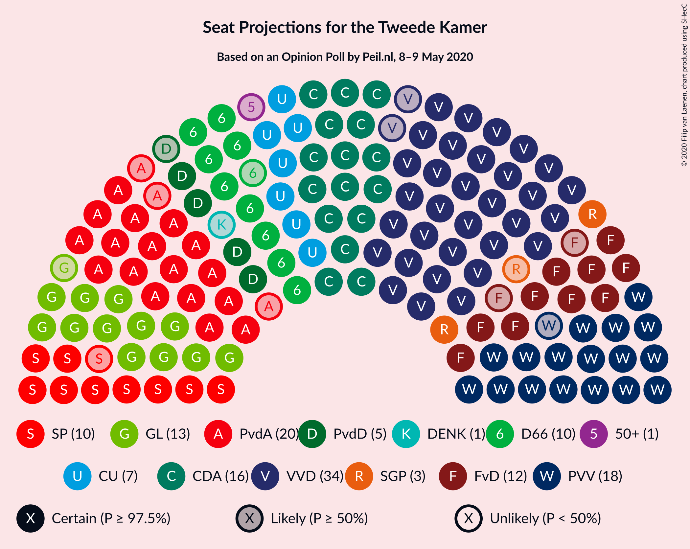
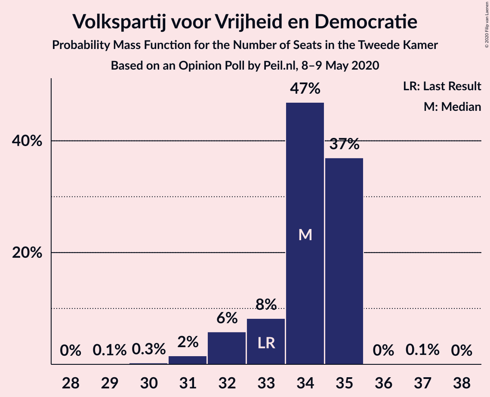
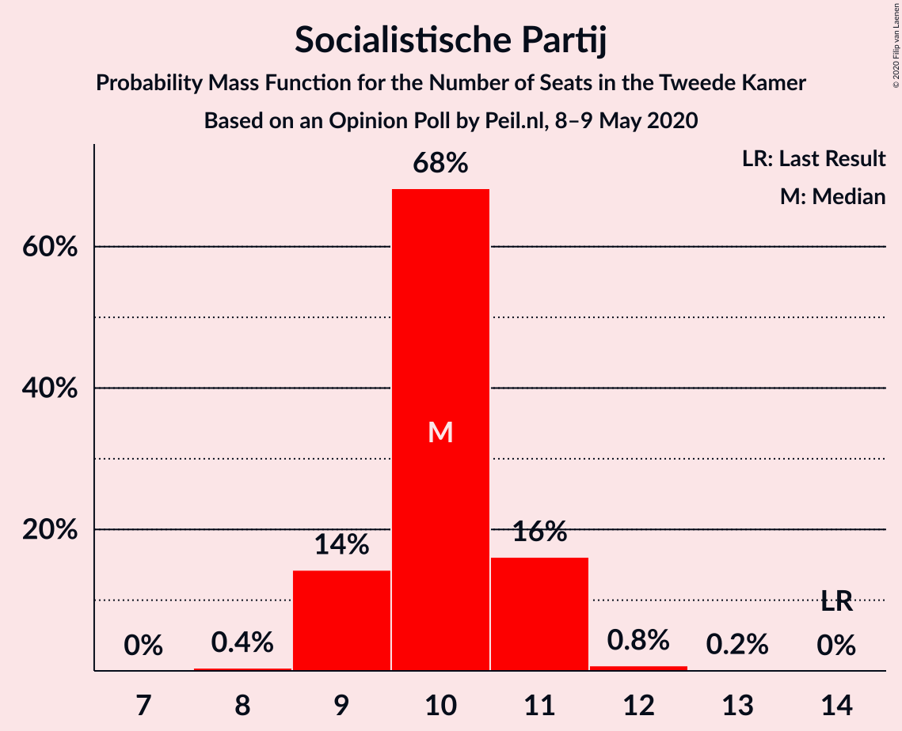
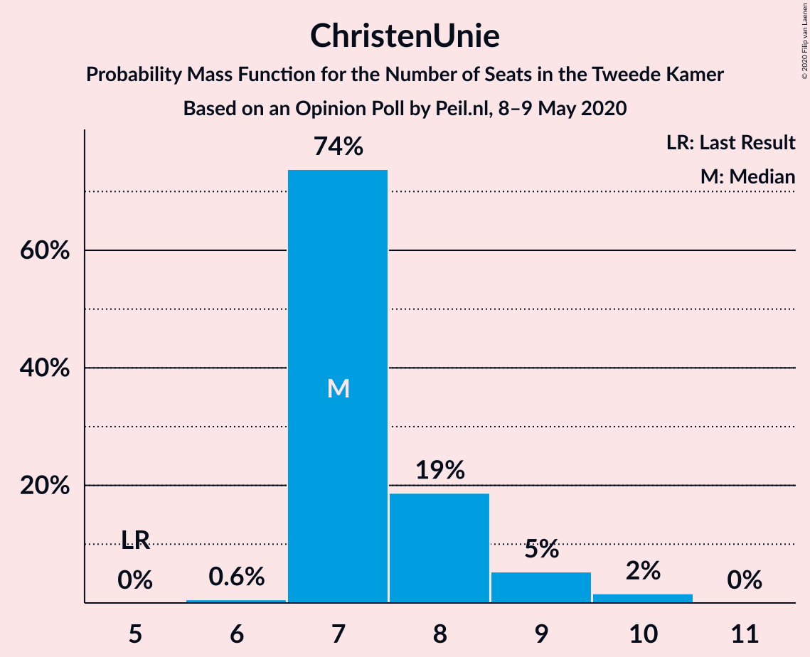
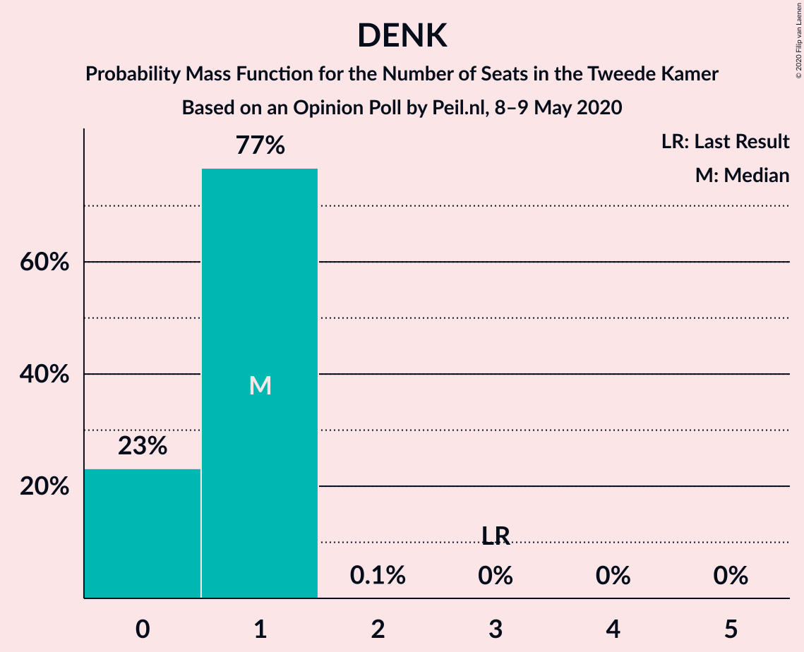
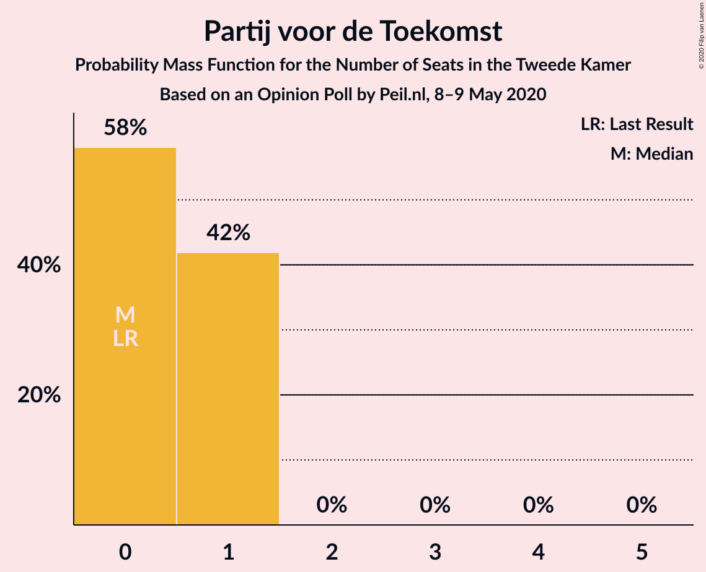
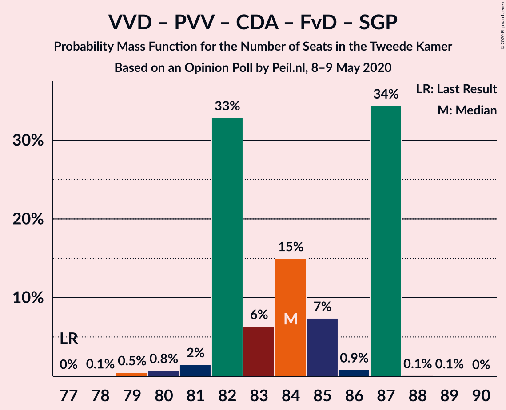
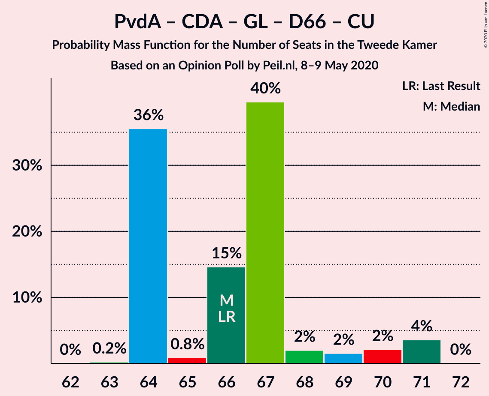
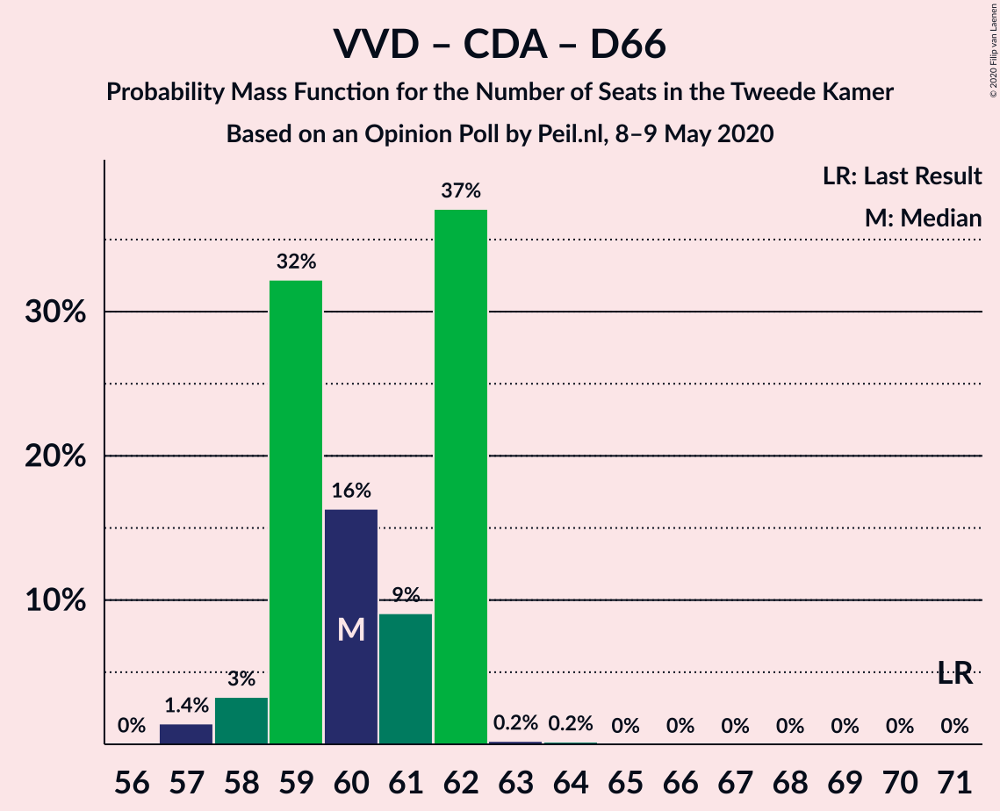
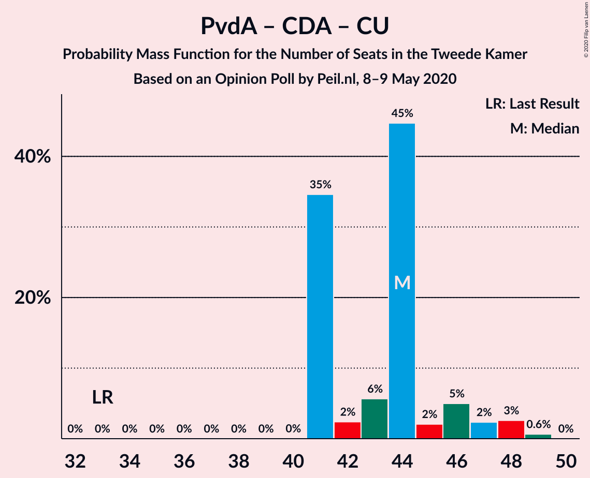

# Opinion Poll by Peil.nl, 8–9 May 2020

<a href="#voting-intentions">Voting Intentions</a> | <a href="#seats">Seats</a> | <a href="#coalitions">Coalitions</a> | <a href="#technical-information">Technical Information</a>

## Voting Intentions

### Confidence Intervals

| Party | Last Result | Poll Result | 80% Confidence Interval | 90% Confidence Interval | 95% Confidence Interval | 99% Confidence Interval |
|:-----:|:-----------:|:-----------:|:-----------------------:|:-----------------------:|:-----------------------:|:-----------------------:|
| Volkspartij voor Vrijheid en Democratie | 21.3% | 21.3% | 20.4–22.3% |20.1–22.6% |19.9–22.8% |19.4–23.3% |
| Partij van de Arbeid | 5.7% | 12.6% | 11.9–13.4% |11.7–13.7% |11.5–13.9% |11.1–14.3% |
| Partij voor de Vrijheid | 13.1% | 12.0% | 11.2–12.8% |11.0–13.0% |10.9–13.2% |10.5–13.6% |
| Christen-Democratisch Appèl | 12.4% | 11.3% | 10.6–12.1% |10.4–12.3% |10.2–12.5% |9.9–12.9% |
| GroenLinks | 9.1% | 8.7% | 8.0–9.4% |7.8–9.6% |7.7–9.7% |7.4–10.1% |
| Forum voor Democratie | 1.8% | 7.3% | 6.8–8.0% |6.6–8.2% |6.4–8.3% |6.2–8.6% |
| Democraten 66 | 12.2% | 6.7% | 6.1–7.3% |6.0–7.5% |5.8–7.6% |5.6–7.9% |
| Socialistische Partij | 9.1% | 6.7% | 6.1–7.3% |6.0–7.5% |5.8–7.6% |5.6–7.9% |
| ChristenUnie | 3.4% | 5.3% | 4.8–5.9% |4.7–6.1% |4.6–6.2% |4.4–6.5% |
| Partij voor de Dieren | 3.2% | 3.3% | 2.9–3.8% |2.8–3.9% |2.7–4.0% |2.6–4.3% |
| Staatkundig Gereformeerde Partij | 2.1% | 2.7% | 2.3–3.1% |2.2–3.2% |2.1–3.3% |2.0–3.5% |
| 50Plus | 3.1% | 0.7% | 0.5–0.9% |0.5–1.0% |0.4–1.0% |0.4–1.2% |
| DENK | 2.1% | 0.7% | 0.5–0.9% |0.5–1.0% |0.4–1.0% |0.4–1.2% |
| Partij voor de Toekomst | 0.0% | 0.7% | 0.5–0.9% |0.5–1.0% |0.4–1.0% |0.4–1.2% |

*Note:* The poll result column reflects the actual value used in the calculations. Published results may vary slightly, and in addition be rounded to fewer digits.

## Seats

### Confidence Intervals

| Party | Last Result | Median | 80% Confidence Interval | 90% Confidence Interval | 95% Confidence Interval | 99% Confidence Interval |
|:-----:|:-----------:|:------:|:-----------------------:|:-----------------------:|:-----------------------:|:-----------------------:|
| <a href="#volkspartij-voor-vrijheid-en-democratie">Volkspartij voor Vrijheid en Democratie</a> | 33 | 33 | 33–35 |32–35 |32–35 |31–35 |
| <a href="#partij-van-de-arbeid">Partij van de Arbeid</a> | 9 | 19 | 17–23 |17–23 |17–23 |16–23 |
| <a href="#partij-voor-de-vrijheid">Partij voor de Vrijheid</a> | 20 | 19 | 16–20 |16–20 |16–21 |16–21 |
| <a href="#christen-democratisch-appèl">Christen-Democratisch Appèl</a> | 19 | 17 | 15–18 |15–19 |15–19 |15–19 |
| <a href="#groenlinks">GroenLinks</a> | 14 | 13 | 12–15 |12–15 |12–15 |11–15 |
| <a href="#forum-voor-democratie">Forum voor Democratie</a> | 2 | 11 | 10–12 |10–12 |10–13 |9–13 |
| <a href="#democraten-66">Democraten 66</a> | 19 | 10 | 9–11 |9–11 |9–11 |8–12 |
| <a href="#socialistische-partij">Socialistische Partij</a> | 14 | 10 | 9–11 |9–11 |8–11 |8–12 |
| <a href="#christenunie">ChristenUnie</a> | 5 | 7 | 7–10 |6–10 |6–10 |6–10 |
| <a href="#partij-voor-de-dieren">Partij voor de Dieren</a> | 5 | 5 | 4–6 |4–6 |4–6 |3–6 |
| <a href="#staatkundig-gereformeerde-partij">Staatkundig Gereformeerde Partij</a> | 3 | 5 | 2–5 |2–5 |2–5 |2–5 |
| <a href="#50plus">50Plus</a> | 4 | 0 | 0–1 |0–1 |0–1 |0–1 |
| <a href="#denk">DENK</a> | 3 | 1 | 0–1 |0–1 |0–1 |0–1 |
| <a href="#partij-voor-de-toekomst">Partij voor de Toekomst</a> | 0 | 0 | 0–1 |0–1 |0–1 |0–1 |

### Volkspartij voor Vrijheid en Democratie

*For a full overview of the results for this party, see the [Volkspartij voor Vrijheid en Democratie](party-volkspartijvoorvrijheidendemocratie.html) page.*

| Number of Seats | Probability | Accumulated | Special Marks |
|:---------------:|:-----------:|:-----------:|:-------------:|
| 28 | 0.1% | 100% |  |
| 29 | 0% | 99.9% |  |
| 30 | 0.1% | 99.9% |  |
| 31 | 2% | 99.8% |  |
| 32 | 5% | 98% |  |
| 33 | 65% | 93% | Last Result, Median |
| 34 | 13% | 27% |  |
| 35 | 15% | 15% |  |
| 36 | 0.1% | 0.1% |  |
| 37 | 0% | 0% |  |

### Partij van de Arbeid

*For a full overview of the results for this party, see the [Partij van de Arbeid](party-partijvandearbeid.html) page.*

| Number of Seats | Probability | Accumulated | Special Marks |
|:---------------:|:-----------:|:-----------:|:-------------:|
| 9 | 0% | 100% | Last Result |
| 10 | 0% | 100% |  |
| 11 | 0% | 100% |  |
| 12 | 0% | 100% |  |
| 13 | 0% | 100% |  |
| 14 | 0% | 100% |  |
| 15 | 0% | 100% |  |
| 16 | 0.7% | 100% |  |
| 17 | 11% | 99.3% |  |
| 18 | 19% | 89% |  |
| 19 | 41% | 70% | Median |
| 20 | 9% | 29% |  |
| 21 | 0.3% | 20% |  |
| 22 | 0.1% | 19% |  |
| 23 | 19% | 19% |  |
| 24 | 0% | 0% |  |

### Partij voor de Vrijheid

*For a full overview of the results for this party, see the [Partij voor de Vrijheid](party-partijvoordevrijheid.html) page.*

| Number of Seats | Probability | Accumulated | Special Marks |
|:---------------:|:-----------:|:-----------:|:-------------:|
| 15 | 0.1% | 100% |  |
| 16 | 25% | 99.9% |  |
| 17 | 6% | 75% |  |
| 18 | 7% | 69% |  |
| 19 | 45% | 62% | Median |
| 20 | 15% | 18% | Last Result |
| 21 | 3% | 3% |  |
| 22 | 0% | 0% |  |

### Christen-Democratisch Appèl

*For a full overview of the results for this party, see the [Christen-Democratisch Appèl](party-christen-democratischappèl.html) page.*

| Number of Seats | Probability | Accumulated | Special Marks |
|:---------------:|:-----------:|:-----------:|:-------------:|
| 15 | 19% | 100% |  |
| 16 | 10% | 81% |  |
| 17 | 59% | 70% | Median |
| 18 | 3% | 12% |  |
| 19 | 9% | 9% | Last Result |
| 20 | 0.2% | 0.2% |  |
| 21 | 0% | 0% |  |

### GroenLinks

*For a full overview of the results for this party, see the [GroenLinks](party-groenlinks.html) page.*

| Number of Seats | Probability | Accumulated | Special Marks |
|:---------------:|:-----------:|:-----------:|:-------------:|
| 10 | 0.4% | 100% |  |
| 11 | 0.7% | 99.6% |  |
| 12 | 39% | 98.9% |  |
| 13 | 48% | 60% | Median |
| 14 | 1.3% | 12% | Last Result |
| 15 | 11% | 11% |  |
| 16 | 0% | 0% |  |

### Forum voor Democratie

*For a full overview of the results for this party, see the [Forum voor Democratie](party-forumvoordemocratie.html) page.*

| Number of Seats | Probability | Accumulated | Special Marks |
|:---------------:|:-----------:|:-----------:|:-------------:|
| 2 | 0% | 100% | Last Result |
| 3 | 0% | 100% |  |
| 4 | 0% | 100% |  |
| 5 | 0% | 100% |  |
| 6 | 0% | 100% |  |
| 7 | 0% | 100% |  |
| 8 | 0.2% | 100% |  |
| 9 | 1.3% | 99.8% |  |
| 10 | 9% | 98.6% |  |
| 11 | 72% | 89% | Median |
| 12 | 14% | 18% |  |
| 13 | 4% | 4% |  |
| 14 | 0.1% | 0.1% |  |
| 15 | 0% | 0% |  |

### Democraten 66

*For a full overview of the results for this party, see the [Democraten 66](party-democraten66.html) page.*

| Number of Seats | Probability | Accumulated | Special Marks |
|:---------------:|:-----------:|:-----------:|:-------------:|
| 8 | 0.9% | 100% |  |
| 9 | 47% | 99.1% |  |
| 10 | 39% | 52% | Median |
| 11 | 11% | 12% |  |
| 12 | 1.2% | 1.3% |  |
| 13 | 0.1% | 0.1% |  |
| 14 | 0% | 0% |  |
| 15 | 0% | 0% |  |
| 16 | 0% | 0% |  |
| 17 | 0% | 0% |  |
| 18 | 0% | 0% |  |
| 19 | 0% | 0% | Last Result |

### Socialistische Partij

*For a full overview of the results for this party, see the [Socialistische Partij](party-socialistischepartij.html) page.*

| Number of Seats | Probability | Accumulated | Special Marks |
|:---------------:|:-----------:|:-----------:|:-------------:|
| 8 | 3% | 100% |  |
| 9 | 24% | 97% |  |
| 10 | 31% | 73% | Median |
| 11 | 40% | 42% |  |
| 12 | 2% | 2% |  |
| 13 | 0.1% | 0.1% |  |
| 14 | 0% | 0% | Last Result |

### ChristenUnie

*For a full overview of the results for this party, see the [ChristenUnie](party-christenunie.html) page.*

| Number of Seats | Probability | Accumulated | Special Marks |
|:---------------:|:-----------:|:-----------:|:-------------:|
| 5 | 0% | 100% | Last Result |
| 6 | 8% | 100% |  |
| 7 | 47% | 92% | Median |
| 8 | 24% | 45% |  |
| 9 | 1.0% | 21% |  |
| 10 | 20% | 20% |  |
| 11 | 0% | 0% |  |

### Partij voor de Dieren

*For a full overview of the results for this party, see the [Partij voor de Dieren](party-partijvoordedieren.html) page.*

| Number of Seats | Probability | Accumulated | Special Marks |
|:---------------:|:-----------:|:-----------:|:-------------:|
| 3 | 0.8% | 100% |  |
| 4 | 14% | 99.2% |  |
| 5 | 37% | 86% | Last Result, Median |
| 6 | 49% | 49% |  |
| 7 | 0.1% | 0.1% |  |
| 8 | 0% | 0% |  |

### Staatkundig Gereformeerde Partij

*For a full overview of the results for this party, see the [Staatkundig Gereformeerde Partij](party-staatkundiggereformeerdepartij.html) page.*

| Number of Seats | Probability | Accumulated | Special Marks |
|:---------------:|:-----------:|:-----------:|:-------------:|
| 2 | 11% | 100% |  |
| 3 | 10% | 89% | Last Result |
| 4 | 27% | 80% |  |
| 5 | 53% | 53% | Median |
| 6 | 0% | 0% |  |

### 50Plus

*For a full overview of the results for this party, see the [50Plus](party-50plus.html) page.*

| Number of Seats | Probability | Accumulated | Special Marks |
|:---------------:|:-----------:|:-----------:|:-------------:|
| 0 | 77% | 100% | Median |
| 1 | 23% | 23% |  |
| 2 | 0.1% | 0.1% |  |
| 3 | 0% | 0% |  |
| 4 | 0% | 0% | Last Result |

### DENK

*For a full overview of the results for this party, see the [DENK](party-denk.html) page.*

| Number of Seats | Probability | Accumulated | Special Marks |
|:---------------:|:-----------:|:-----------:|:-------------:|
| 0 | 20% | 100% |  |
| 1 | 80% | 80% | Median |
| 2 | 0.1% | 0.1% |  |
| 3 | 0% | 0% | Last Result |

### Partij voor de Toekomst

*For a full overview of the results for this party, see the [Partij voor de Toekomst](party-partijvoordetoekomst.html) page.*

| Number of Seats | Probability | Accumulated | Special Marks |
|:---------------:|:-----------:|:-----------:|:-------------:|
| 0 | 83% | 100% | Last Result, Median |
| 1 | 17% | 17% |  |
| 2 | 0.1% | 0.1% |  |
| 3 | 0% | 0% |  |

## Coalitions

### Confidence Intervals

| Coalition | Last Result | Median | Majority? | 80% Confidence Interval | 90% Confidence Interval | 95% Confidence Interval | 99% Confidence Interval |
|:---------:|:-----------:|:------:|:---------:|:-----------------------:|:-----------------------:|:-----------------------:|:-----------------------:|
| Volkspartij voor Vrijheid en Democratie – Partij van de Arbeid – Christen-Democratisch Appèl – Democraten 66 – ChristenUnie | 85 | 86 | 100% | 85–91 | 85–91 | 84–91 | 84–91 |
| Volkspartij voor Vrijheid en Democratie – Partij voor de Vrijheid – Christen-Democratisch Appèl – Forum voor Democratie – Staatkundig Gereformeerde Partij | 77 | 85 | 100% | 79–85 | 79–86 | 79–89 | 79–89 |
| Volkspartij voor Vrijheid en Democratie – Partij voor de Vrijheid – Christen-Democratisch Appèl – Forum voor Democratie | 74 | 80 | 81% | 75–83 | 75–83 | 75–85 | 75–85 |
| Volkspartij voor Vrijheid en Democratie – Christen-Democratisch Appèl – GroenLinks – Democraten 66 – ChristenUnie | 90 | 81 | 100% | 78–84 | 78–84 | 78–84 | 78–86 |
| Partij van de Arbeid – Christen-Democratisch Appèl – GroenLinks – Democraten 66 – Socialistische Partij – ChristenUnie | 80 | 75 | 43% | 75–80 | 74–80 | 73–80 | 73–81 |
| Volkspartij voor Vrijheid en Democratie – Partij voor de Vrijheid – Christen-Democratisch Appèl | 72 | 69 | 0% | 64–71 | 64–72 | 64–73 | 64–73 |
| Volkspartij voor Vrijheid en Democratie – Christen-Democratisch Appèl – Democraten 66 – ChristenUnie | 76 | 67 | 0% | 66–69 | 66–71 | 66–71 | 66–74 |
| Volkspartij voor Vrijheid en Democratie – Partij van de Arbeid – Christen-Democratisch Appèl | 61 | 69 | 0% | 68–71 | 68–71 | 66–71 | 66–72 |
| Partij van de Arbeid – Christen-Democratisch Appèl – GroenLinks – Democraten 66 – ChristenUnie | 66 | 65 | 0% | 64–71 | 64–71 | 64–71 | 64–71 |
| Volkspartij voor Vrijheid en Democratie – Christen-Democratisch Appèl – Forum voor Democratie – Staatkundig Gereformeerde Partij – 50Plus | 61 | 66 | 0% | 63–68 | 63–69 | 63–69 | 62–69 |
| Volkspartij voor Vrijheid en Democratie – Christen-Democratisch Appèl – Forum voor Democratie – Staatkundig Gereformeerde Partij | 57 | 66 | 0% | 63–67 | 63–68 | 63–68 | 62–69 |
| Volkspartij voor Vrijheid en Democratie – Partij van de Arbeid – Democraten 66 | 61 | 61 | 0% | 61–66 | 61–66 | 60–66 | 60–66 |
| Volkspartij voor Vrijheid en Democratie – Christen-Democratisch Appèl – Forum voor Democratie – 50Plus | 58 | 61 | 0% | 59–64 | 59–64 | 59–64 | 59–64 |
| Volkspartij voor Vrijheid en Democratie – Christen-Democratisch Appèl – Forum voor Democratie | 54 | 61 | 0% | 59–63 | 59–63 | 59–64 | 59–64 |
| Volkspartij voor Vrijheid en Democratie – Christen-Democratisch Appèl – Democraten 66 | 71 | 59 | 0% | 58–62 | 58–63 | 58–63 | 58–64 |
| Volkspartij voor Vrijheid en Democratie – Partij van de Arbeid | 42 | 52 | 0% | 51–56 | 51–56 | 50–56 | 50–56 |
| Volkspartij voor Vrijheid en Democratie – Christen-Democratisch Appèl | 52 | 50 | 0% | 48–52 | 48–52 | 48–52 | 48–53 |
| Partij van de Arbeid – Christen-Democratisch Appèl – Democraten 66 | 47 | 45 | 0% | 44–48 | 44–48 | 44–49 | 44–49 |
| Partij van de Arbeid – Christen-Democratisch Appèl – ChristenUnie | 33 | 43 | 0% | 42–48 | 42–48 | 42–48 | 42–48 |
| Partij van de Arbeid – Christen-Democratisch Appèl | 28 | 36 | 0% | 34–38 | 34–38 | 34–38 | 34–39 |
| Christen-Democratisch Appèl – Democraten 66 | 38 | 26 | 0% | 25–29 | 25–29 | 25–29 | 25–30 |

### Volkspartij voor Vrijheid en Democratie – Partij van de Arbeid – Christen-Democratisch Appèl – Democraten 66 – ChristenUnie

| Number of Seats | Probability | Accumulated | Special Marks |
|:---------------:|:-----------:|:-----------:|:-------------:|
| 84 | 4% | 100% |  |
| 85 | 37% | 96% | Last Result |
| 86 | 19% | 59% | Median |
| 87 | 12% | 40% |  |
| 88 | 0.9% | 29% |  |
| 89 | 7% | 28% |  |
| 90 | 1.1% | 21% |  |
| 91 | 19% | 19% |  |
| 92 | 0% | 0.1% |  |
| 93 | 0% | 0.1% |  |
| 94 | 0% | 0% |  |

### Volkspartij voor Vrijheid en Democratie – Partij voor de Vrijheid – Christen-Democratisch Appèl – Forum voor Democratie – Staatkundig Gereformeerde Partij

| Number of Seats | Probability | Accumulated | Special Marks |
|:---------------:|:-----------:|:-----------:|:-------------:|
| 77 | 0% | 100% | Last Result |
| 78 | 0% | 100% |  |
| 79 | 19% | 100% |  |
| 80 | 0.3% | 81% |  |
| 81 | 0.3% | 80% |  |
| 82 | 5% | 80% |  |
| 83 | 4% | 75% |  |
| 84 | 12% | 71% |  |
| 85 | 54% | 59% | Median |
| 86 | 0.3% | 5% |  |
| 87 | 2% | 5% |  |
| 88 | 0.4% | 3% |  |
| 89 | 3% | 3% |  |
| 90 | 0% | 0% |  |

### Volkspartij voor Vrijheid en Democratie – Partij voor de Vrijheid – Christen-Democratisch Appèl – Forum voor Democratie

| Number of Seats | Probability | Accumulated | Special Marks |
|:---------------:|:-----------:|:-----------:|:-------------:|
| 74 | 0% | 100% | Last Result |
| 75 | 19% | 100% |  |
| 76 | 0.4% | 81% | Majority |
| 77 | 0.2% | 80% |  |
| 78 | 7% | 80% |  |
| 79 | 8% | 74% |  |
| 80 | 42% | 66% | Median |
| 81 | 7% | 23% |  |
| 82 | 1.2% | 16% |  |
| 83 | 11% | 15% |  |
| 84 | 0.7% | 4% |  |
| 85 | 3% | 3% |  |
| 86 | 0% | 0% |  |

### Volkspartij voor Vrijheid en Democratie – Christen-Democratisch Appèl – GroenLinks – Democraten 66 – ChristenUnie

| Number of Seats | Probability | Accumulated | Special Marks |
|:---------------:|:-----------:|:-----------:|:-------------:|
| 76 | 0.1% | 100% | Majority |
| 77 | 0.1% | 99.9% |  |
| 78 | 37% | 99.9% |  |
| 79 | 6% | 63% |  |
| 80 | 2% | 56% | Median |
| 81 | 24% | 54% |  |
| 82 | 17% | 30% |  |
| 83 | 0.2% | 13% |  |
| 84 | 12% | 13% |  |
| 85 | 0% | 0.8% |  |
| 86 | 0.8% | 0.8% |  |
| 87 | 0% | 0% |  |
| 88 | 0% | 0% |  |
| 89 | 0% | 0% |  |
| 90 | 0% | 0% | Last Result |

### Partij van de Arbeid – Christen-Democratisch Appèl – GroenLinks – Democraten 66 – Socialistische Partij – ChristenUnie

| Number of Seats | Probability | Accumulated | Special Marks |
|:---------------:|:-----------:|:-----------:|:-------------:|
| 71 | 0.3% | 100% |  |
| 72 | 0% | 99.7% |  |
| 73 | 3% | 99.6% |  |
| 74 | 6% | 97% |  |
| 75 | 48% | 91% |  |
| 76 | 4% | 43% | Median, Majority |
| 77 | 6% | 39% |  |
| 78 | 3% | 33% |  |
| 79 | 7% | 30% |  |
| 80 | 20% | 22% | Last Result |
| 81 | 2% | 2% |  |
| 82 | 0% | 0% |  |

### Volkspartij voor Vrijheid en Democratie – Partij voor de Vrijheid – Christen-Democratisch Appèl

| Number of Seats | Probability | Accumulated | Special Marks |
|:---------------:|:-----------:|:-----------:|:-------------:|
| 63 | 0.1% | 100% |  |
| 64 | 19% | 99.9% |  |
| 65 | 4% | 81% |  |
| 66 | 0.2% | 77% |  |
| 67 | 2% | 77% |  |
| 68 | 7% | 75% |  |
| 69 | 39% | 68% | Median |
| 70 | 12% | 29% |  |
| 71 | 11% | 17% |  |
| 72 | 2% | 5% | Last Result |
| 73 | 4% | 4% |  |
| 74 | 0% | 0% |  |

### Volkspartij voor Vrijheid en Democratie – Christen-Democratisch Appèl – Democraten 66 – ChristenUnie

| Number of Seats | Probability | Accumulated | Special Marks |
|:---------------:|:-----------:|:-----------:|:-------------:|
| 64 | 0.1% | 100% |  |
| 65 | 0.1% | 99.9% |  |
| 66 | 46% | 99.8% |  |
| 67 | 4% | 53% | Median |
| 68 | 21% | 49% |  |
| 69 | 20% | 28% |  |
| 70 | 0.3% | 8% |  |
| 71 | 7% | 7% |  |
| 72 | 0.1% | 0.8% |  |
| 73 | 0% | 0.7% |  |
| 74 | 0.7% | 0.7% |  |
| 75 | 0% | 0% |  |
| 76 | 0% | 0% | Last Result, Majority |

### Volkspartij voor Vrijheid en Democratie – Partij van de Arbeid – Christen-Democratisch Appèl

| Number of Seats | Probability | Accumulated | Special Marks |
|:---------------:|:-----------:|:-----------:|:-------------:|
| 61 | 0% | 100% | Last Result |
| 62 | 0% | 100% |  |
| 63 | 0% | 100% |  |
| 64 | 0% | 100% |  |
| 65 | 0% | 100% |  |
| 66 | 4% | 100% |  |
| 67 | 0.7% | 96% |  |
| 68 | 11% | 96% |  |
| 69 | 42% | 84% | Median |
| 70 | 14% | 43% |  |
| 71 | 27% | 29% |  |
| 72 | 1.1% | 1.2% |  |
| 73 | 0.1% | 0.1% |  |
| 74 | 0% | 0% |  |

### Partij van de Arbeid – Christen-Democratisch Appèl – GroenLinks – Democraten 66 – ChristenUnie

| Number of Seats | Probability | Accumulated | Special Marks |
|:---------------:|:-----------:|:-----------:|:-------------:|
| 61 | 0.3% | 100% |  |
| 62 | 0.1% | 99.7% |  |
| 63 | 0% | 99.6% |  |
| 64 | 43% | 99.6% |  |
| 65 | 14% | 57% |  |
| 66 | 0.5% | 43% | Last Result, Median |
| 67 | 9% | 42% |  |
| 68 | 5% | 33% |  |
| 69 | 9% | 28% |  |
| 70 | 0.2% | 20% |  |
| 71 | 19% | 19% |  |
| 72 | 0.1% | 0.1% |  |
| 73 | 0% | 0% |  |

### Volkspartij voor Vrijheid en Democratie – Christen-Democratisch Appèl – Forum voor Democratie – Staatkundig Gereformeerde Partij – 50Plus

| Number of Seats | Probability | Accumulated | Special Marks |
|:---------------:|:-----------:|:-----------:|:-------------:|
| 61 | 0% | 100% | Last Result |
| 62 | 2% | 100% |  |
| 63 | 20% | 98% |  |
| 64 | 0.5% | 78% |  |
| 65 | 13% | 77% |  |
| 66 | 45% | 64% | Median |
| 67 | 4% | 19% |  |
| 68 | 8% | 15% |  |
| 69 | 7% | 7% |  |
| 70 | 0% | 0% |  |

### Volkspartij voor Vrijheid en Democratie – Christen-Democratisch Appèl – Forum voor Democratie – Staatkundig Gereformeerde Partij

| Number of Seats | Probability | Accumulated | Special Marks |
|:---------------:|:-----------:|:-----------:|:-------------:|
| 57 | 0% | 100% | Last Result |
| 58 | 0% | 100% |  |
| 59 | 0% | 100% |  |
| 60 | 0% | 100% |  |
| 61 | 0.1% | 100% |  |
| 62 | 2% | 99.9% |  |
| 63 | 20% | 98% |  |
| 64 | 0.5% | 77% |  |
| 65 | 20% | 77% |  |
| 66 | 41% | 57% | Median |
| 67 | 6% | 16% |  |
| 68 | 9% | 10% |  |
| 69 | 1.1% | 1.1% |  |
| 70 | 0% | 0% |  |

### Volkspartij voor Vrijheid en Democratie – Partij van de Arbeid – Democraten 66

| Number of Seats | Probability | Accumulated | Special Marks |
|:---------------:|:-----------:|:-----------:|:-------------:|
| 57 | 0.1% | 100% |  |
| 58 | 0% | 99.9% |  |
| 59 | 0.2% | 99.9% |  |
| 60 | 3% | 99.8% |  |
| 61 | 56% | 96% | Last Result |
| 62 | 6% | 41% | Median |
| 63 | 4% | 35% |  |
| 64 | 12% | 31% |  |
| 65 | 0.1% | 20% |  |
| 66 | 19% | 19% |  |
| 67 | 0% | 0% |  |

### Volkspartij voor Vrijheid en Democratie – Christen-Democratisch Appèl – Forum voor Democratie – 50Plus

| Number of Seats | Probability | Accumulated | Special Marks |
|:---------------:|:-----------:|:-----------:|:-------------:|
| 58 | 0% | 100% | Last Result |
| 59 | 22% | 100% |  |
| 60 | 0.3% | 78% |  |
| 61 | 40% | 77% | Median |
| 62 | 5% | 38% |  |
| 63 | 22% | 33% |  |
| 64 | 10% | 11% |  |
| 65 | 0.2% | 0.2% |  |
| 66 | 0% | 0% |  |

### Volkspartij voor Vrijheid en Democratie – Christen-Democratisch Appèl – Forum voor Democratie

| Number of Seats | Probability | Accumulated | Special Marks |
|:---------------:|:-----------:|:-----------:|:-------------:|
| 54 | 0% | 100% | Last Result |
| 55 | 0% | 100% |  |
| 56 | 0% | 100% |  |
| 57 | 0% | 100% |  |
| 58 | 0.2% | 100% |  |
| 59 | 22% | 99.8% |  |
| 60 | 0.8% | 77% |  |
| 61 | 43% | 77% | Median |
| 62 | 12% | 33% |  |
| 63 | 16% | 21% |  |
| 64 | 5% | 5% |  |
| 65 | 0.1% | 0.1% |  |
| 66 | 0% | 0% |  |

### Volkspartij voor Vrijheid en Democratie – Christen-Democratisch Appèl – Democraten 66

| Number of Seats | Probability | Accumulated | Special Marks |
|:---------------:|:-----------:|:-----------:|:-------------:|
| 56 | 0.1% | 100% |  |
| 57 | 0.2% | 99.9% |  |
| 58 | 23% | 99.6% |  |
| 59 | 37% | 77% |  |
| 60 | 9% | 40% | Median |
| 61 | 18% | 31% |  |
| 62 | 6% | 13% |  |
| 63 | 6% | 7% |  |
| 64 | 1.4% | 1.5% |  |
| 65 | 0% | 0% |  |
| 66 | 0% | 0% |  |
| 67 | 0% | 0% |  |
| 68 | 0% | 0% |  |
| 69 | 0% | 0% |  |
| 70 | 0% | 0% |  |
| 71 | 0% | 0% | Last Result |

### Volkspartij voor Vrijheid en Democratie – Partij van de Arbeid

| Number of Seats | Probability | Accumulated | Special Marks |
|:---------------:|:-----------:|:-----------:|:-------------:|
| 42 | 0% | 100% | Last Result |
| 43 | 0% | 100% |  |
| 44 | 0% | 100% |  |
| 45 | 0% | 100% |  |
| 46 | 0% | 100% |  |
| 47 | 0.1% | 100% |  |
| 48 | 0% | 99.9% |  |
| 49 | 0.1% | 99.9% |  |
| 50 | 5% | 99.8% |  |
| 51 | 19% | 95% |  |
| 52 | 40% | 76% | Median |
| 53 | 10% | 36% |  |
| 54 | 0.5% | 26% |  |
| 55 | 6% | 26% |  |
| 56 | 19% | 19% |  |
| 57 | 0% | 0% |  |

### Volkspartij voor Vrijheid en Democratie – Christen-Democratisch Appèl

| Number of Seats | Probability | Accumulated | Special Marks |
|:---------------:|:-----------:|:-----------:|:-------------:|
| 46 | 0.2% | 100% |  |
| 47 | 0.1% | 99.8% |  |
| 48 | 23% | 99.8% |  |
| 49 | 3% | 77% |  |
| 50 | 39% | 73% | Median |
| 51 | 17% | 35% |  |
| 52 | 16% | 18% | Last Result |
| 53 | 2% | 2% |  |
| 54 | 0% | 0.1% |  |
| 55 | 0% | 0% |  |

### Partij van de Arbeid – Christen-Democratisch Appèl – Democraten 66

| Number of Seats | Probability | Accumulated | Special Marks |
|:---------------:|:-----------:|:-----------:|:-------------:|
| 42 | 0.3% | 100% |  |
| 43 | 0.1% | 99.7% |  |
| 44 | 17% | 99.6% |  |
| 45 | 43% | 83% |  |
| 46 | 6% | 40% | Median |
| 47 | 9% | 33% | Last Result |
| 48 | 21% | 24% |  |
| 49 | 2% | 3% |  |
| 50 | 0.2% | 0.4% |  |
| 51 | 0% | 0.1% |  |
| 52 | 0.1% | 0.1% |  |
| 53 | 0% | 0% |  |

### Partij van de Arbeid – Christen-Democratisch Appèl – ChristenUnie

| Number of Seats | Probability | Accumulated | Special Marks |
|:---------------:|:-----------:|:-----------:|:-------------:|
| 33 | 0% | 100% | Last Result |
| 34 | 0% | 100% |  |
| 35 | 0% | 100% |  |
| 36 | 0% | 100% |  |
| 37 | 0% | 100% |  |
| 38 | 0% | 100% |  |
| 39 | 0% | 100% |  |
| 40 | 0% | 100% |  |
| 41 | 0.1% | 100% |  |
| 42 | 22% | 99.9% |  |
| 43 | 45% | 77% | Median |
| 44 | 7% | 32% |  |
| 45 | 4% | 25% |  |
| 46 | 0.9% | 21% |  |
| 47 | 0.2% | 20% |  |
| 48 | 20% | 20% |  |
| 49 | 0% | 0% |  |

### Partij van de Arbeid – Christen-Democratisch Appèl

| Number of Seats | Probability | Accumulated | Special Marks |
|:---------------:|:-----------:|:-----------:|:-------------:|
| 28 | 0% | 100% | Last Result |
| 29 | 0% | 100% |  |
| 30 | 0% | 100% |  |
| 31 | 0% | 100% |  |
| 32 | 0% | 100% |  |
| 33 | 0% | 100% |  |
| 34 | 14% | 100% |  |
| 35 | 9% | 86% |  |
| 36 | 46% | 76% | Median |
| 37 | 7% | 31% |  |
| 38 | 23% | 24% |  |
| 39 | 0.8% | 0.9% |  |
| 40 | 0.1% | 0.1% |  |
| 41 | 0% | 0% |  |

### Christen-Democratisch Appèl – Democraten 66

| Number of Seats | Probability | Accumulated | Special Marks |
|:---------------:|:-----------:|:-----------:|:-------------:|
| 24 | 0.5% | 100% |  |
| 25 | 25% | 99.5% |  |
| 26 | 43% | 74% |  |
| 27 | 12% | 31% | Median |
| 28 | 8% | 19% |  |
| 29 | 9% | 11% |  |
| 30 | 2% | 2% |  |
| 31 | 0.2% | 0.2% |  |
| 32 | 0% | 0% |  |
| 33 | 0% | 0% |  |
| 34 | 0% | 0% |  |
| 35 | 0% | 0% |  |
| 36 | 0% | 0% |  |
| 37 | 0% | 0% |  |
| 38 | 0% | 0% | Last Result |

## Technical Information

### Opinion Poll

+ **Polling firm:** Peil.nl
+ **Commissioner(s):** —
+ **Fieldwork period:** 8–9 May 2020

### Calculations

+ **Sample size:** 3000
+ **Simulations done:** 131,072
+ **Error estimate:** 2.29%

