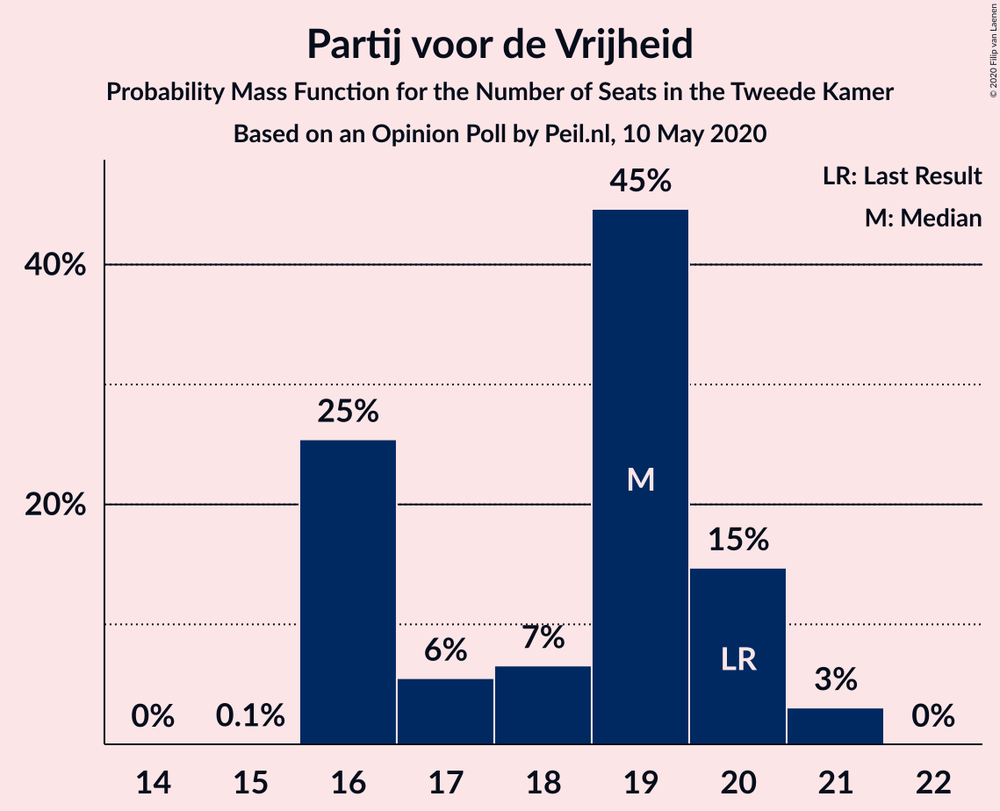
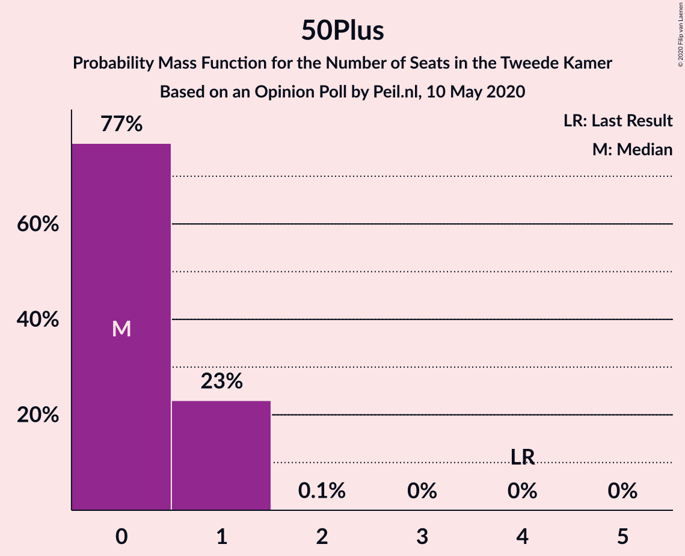
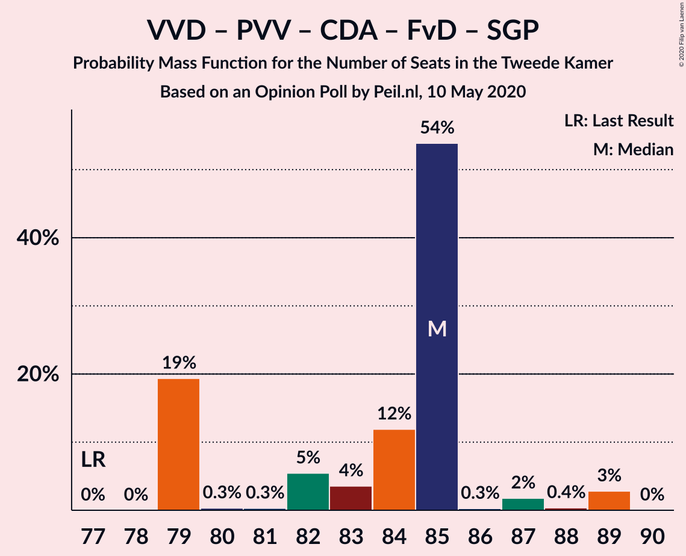
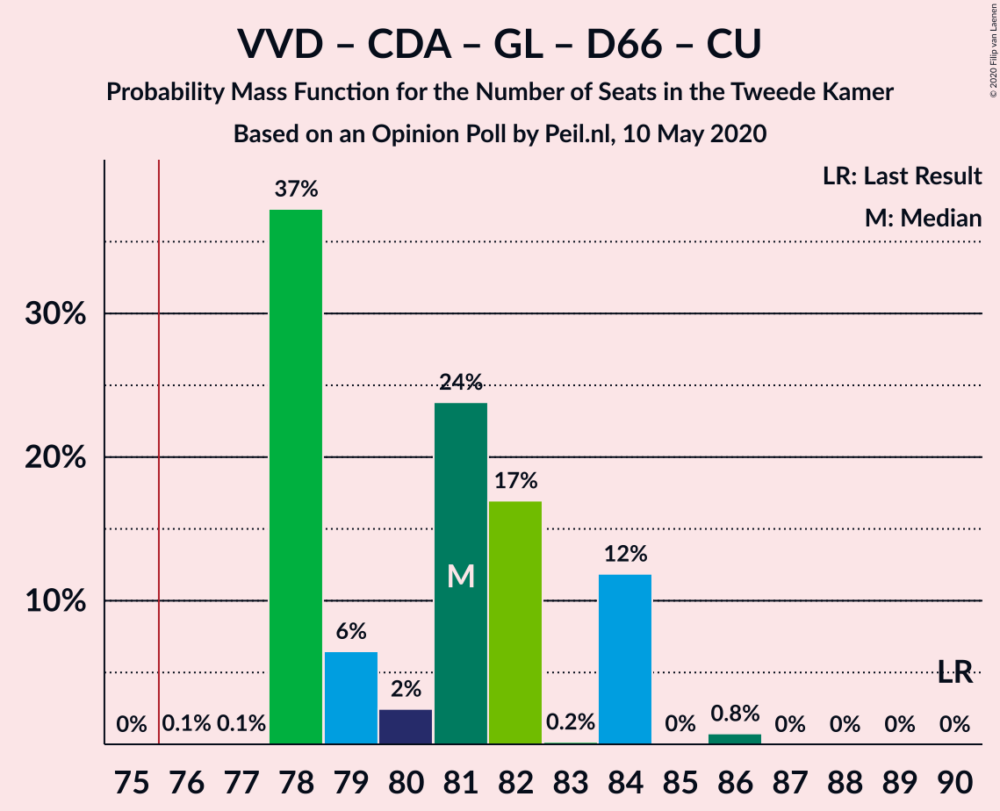
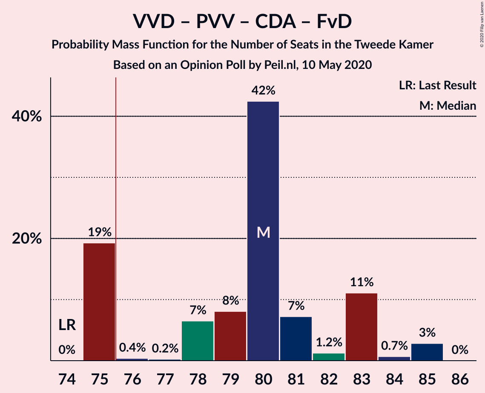
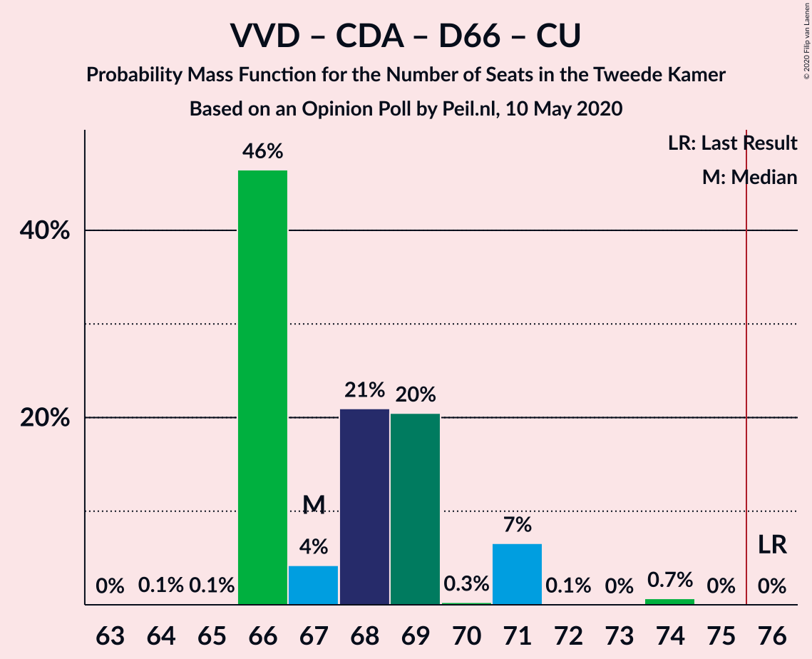
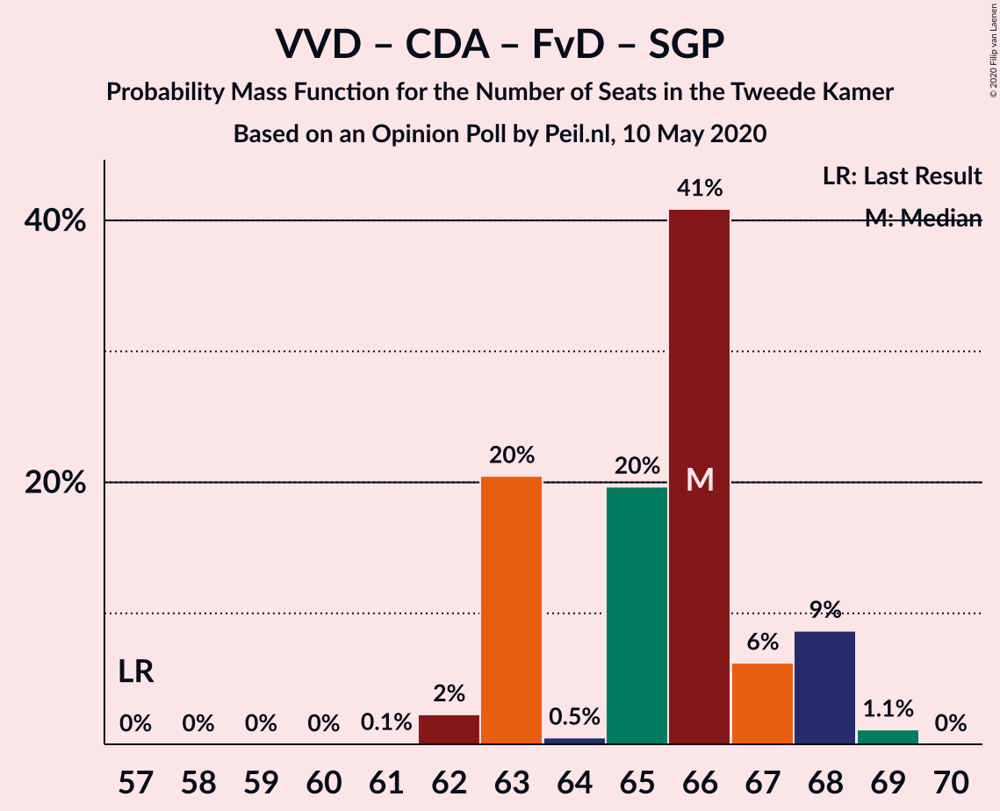
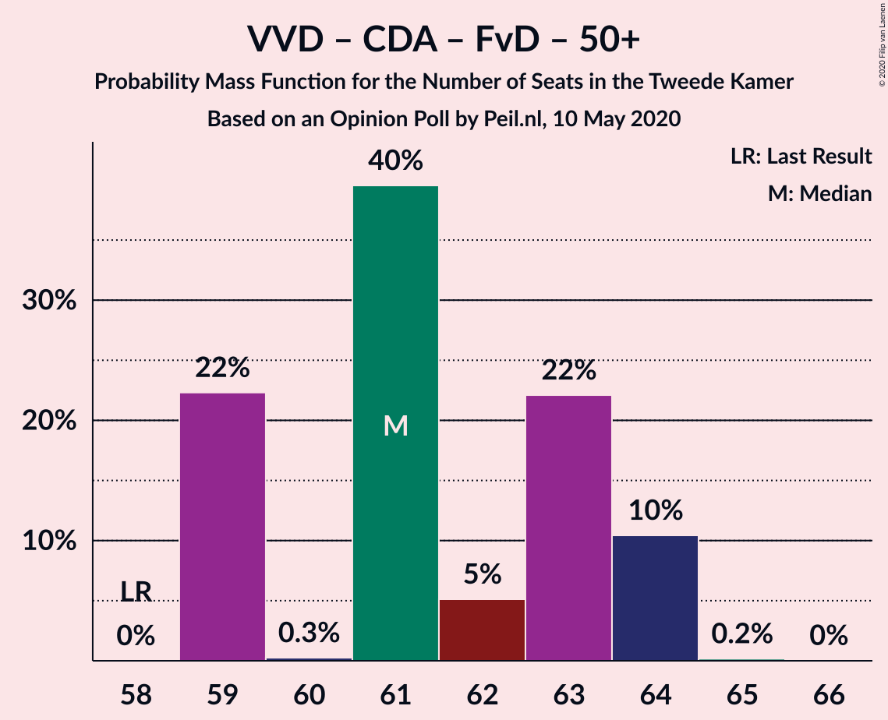

# Opinion Poll by Peil.nl, 10 May 2020

<a href="#voting-intentions">Voting Intentions</a> | <a href="#seats">Seats</a> | <a href="#coalitions">Coalitions</a> | <a href="#technical-information">Technical Information</a>

## Voting Intentions

### Confidence Intervals

| Party | Last Result | Poll Result | 80% Confidence Interval | 90% Confidence Interval | 95% Confidence Interval | 99% Confidence Interval |
|:-----:|:-----------:|:-----------:|:-----------------------:|:-----------------------:|:-----------------------:|:-----------------------:|
| Volkspartij voor Vrijheid en Democratie | 21.3% | 21.3% | 20.4–22.3% |20.1–22.6% |19.9–22.8% |19.4–23.3% |
| Partij van de Arbeid | 5.7% | 12.7% | 11.9–13.5% |11.7–13.7% |11.5–13.9% |11.2–14.3% |
| Partij voor de Vrijheid | 13.1% | 12.0% | 11.3–12.8% |11.1–13.0% |10.9–13.2% |10.5–13.6% |
| Christen-Democratisch Appèl | 12.4% | 11.3% | 10.6–12.1% |10.4–12.3% |10.2–12.5% |9.9–12.9% |
| GroenLinks | 9.1% | 8.7% | 8.0–9.4% |7.8–9.6% |7.7–9.7% |7.4–10.1% |
| Forum voor Democratie | 1.8% | 7.3% | 6.8–8.0% |6.6–8.2% |6.4–8.3% |6.2–8.6% |
| Democraten 66 | 12.2% | 6.7% | 6.1–7.3% |6.0–7.5% |5.8–7.6% |5.6–7.9% |
| Socialistische Partij | 9.1% | 6.7% | 6.1–7.3% |6.0–7.5% |5.8–7.6% |5.6–7.9% |
| ChristenUnie | 3.4% | 5.3% | 4.8–5.9% |4.7–6.1% |4.6–6.2% |4.4–6.5% |
| Partij voor de Dieren | 3.2% | 3.3% | 2.9–3.8% |2.8–3.9% |2.7–4.0% |2.6–4.3% |
| Staatkundig Gereformeerde Partij | 2.1% | 2.7% | 2.3–3.1% |2.2–3.2% |2.1–3.3% |2.0–3.5% |
| 50Plus | 3.1% | 0.7% | 0.5–0.9% |0.5–1.0% |0.4–1.0% |0.4–1.2% |
| DENK | 2.1% | 0.7% | 0.5–0.9% |0.5–1.0% |0.4–1.0% |0.4–1.2% |

*Note:* The poll result column reflects the actual value used in the calculations. Published results may vary slightly, and in addition be rounded to fewer digits.

## Seats

### Confidence Intervals

| Party | Last Result | Median | 80% Confidence Interval | 90% Confidence Interval | 95% Confidence Interval | 99% Confidence Interval |
|:-----:|:-----------:|:------:|:-----------------------:|:-----------------------:|:-----------------------:|:-----------------------:|
| <a href="#volkspartij-voor-vrijheid-en-democratie">Volkspartij voor Vrijheid en Democratie</a> | 33 | 32 | 32–34 |32–34 |32–35 |30–35 |
| <a href="#partij-van-de-arbeid">Partij van de Arbeid</a> | 9 | 19 | 18–20 |17–20 |17–20 |16–21 |
| <a href="#partij-voor-de-vrijheid">Partij voor de Vrijheid</a> | 20 | 18 | 18 |18 |18–20 |17–20 |
| <a href="#christen-democratisch-appèl">Christen-Democratisch Appèl</a> | 19 | 16 | 16 |16–18 |16–18 |15–20 |
| <a href="#groenlinks">GroenLinks</a> | 14 | 15 | 13–15 |13–15 |13–15 |12–15 |
| <a href="#forum-voor-democratie">Forum voor Democratie</a> | 2 | 11 | 11–12 |11–12 |11–13 |10–13 |
| <a href="#democraten-66">Democraten 66</a> | 19 | 10 | 9–10 |9–10 |9–11 |9–11 |
| <a href="#socialistische-partij">Socialistische Partij</a> | 14 | 10 | 9–10 |9–10 |9–10 |9–11 |
| <a href="#christenunie">ChristenUnie</a> | 5 | 8 | 8 |8–9 |7–10 |7–10 |
| <a href="#partij-voor-de-dieren">Partij voor de Dieren</a> | 5 | 5 | 5–6 |5–6 |4–6 |4–6 |
| <a href="#staatkundig-gereformeerde-partij">Staatkundig Gereformeerde Partij</a> | 3 | 4 | 3–4 |3–4 |3–4 |2–5 |
| <a href="#50plus">50Plus</a> | 4 | 1 | 0–1 |0–1 |0–1 |0–1 |
| <a href="#denk">DENK</a> | 3 | 1 | 0–1 |0–1 |0–1 |0–1 |

### Volkspartij voor Vrijheid en Democratie

*For a full overview of the results for this party, see the [Volkspartij voor Vrijheid en Democratie](party-volkspartijvoorvrijheidendemocratie.html) page.*

| Number of Seats | Probability | Accumulated | Special Marks |
|:---------------:|:-----------:|:-----------:|:-------------:|
| 30 | 0.7% | 100% |  |
| 31 | 1.5% | 99.3% |  |
| 32 | 76% | 98% | Median |
| 33 | 3% | 22% | Last Result |
| 34 | 14% | 19% |  |
| 35 | 5% | 5% |  |
| 36 | 0% | 0% |  |

### Partij van de Arbeid

*For a full overview of the results for this party, see the [Partij van de Arbeid](party-partijvandearbeid.html) page.*

| Number of Seats | Probability | Accumulated | Special Marks |
|:---------------:|:-----------:|:-----------:|:-------------:|
| 9 | 0% | 100% | Last Result |
| 10 | 0% | 100% |  |
| 11 | 0% | 100% |  |
| 12 | 0% | 100% |  |
| 13 | 0% | 100% |  |
| 14 | 0% | 100% |  |
| 15 | 0% | 100% |  |
| 16 | 1.3% | 100% |  |
| 17 | 5% | 98.7% |  |
| 18 | 6% | 94% |  |
| 19 | 74% | 88% | Median |
| 20 | 12% | 14% |  |
| 21 | 2% | 2% |  |
| 22 | 0% | 0% |  |

### Partij voor de Vrijheid

*For a full overview of the results for this party, see the [Partij voor de Vrijheid](party-partijvoordevrijheid.html) page.*

| Number of Seats | Probability | Accumulated | Special Marks |
|:---------------:|:-----------:|:-----------:|:-------------:|
| 16 | 0.1% | 100% |  |
| 17 | 1.3% | 99.9% |  |
| 18 | 94% | 98.6% | Median |
| 19 | 0.3% | 4% |  |
| 20 | 4% | 4% | Last Result |
| 21 | 0.1% | 0.1% |  |
| 22 | 0% | 0% |  |

### Christen-Democratisch Appèl

*For a full overview of the results for this party, see the [Christen-Democratisch Appèl](party-christen-democratischappèl.html) page.*

| Number of Seats | Probability | Accumulated | Special Marks |
|:---------------:|:-----------:|:-----------:|:-------------:|
| 15 | 2% | 100% |  |
| 16 | 88% | 98% | Median |
| 17 | 2% | 10% |  |
| 18 | 6% | 8% |  |
| 19 | 0.9% | 2% | Last Result |
| 20 | 0.6% | 0.7% |  |
| 21 | 0.1% | 0.1% |  |
| 22 | 0% | 0% |  |

### GroenLinks

*For a full overview of the results for this party, see the [GroenLinks](party-groenlinks.html) page.*

| Number of Seats | Probability | Accumulated | Special Marks |
|:---------------:|:-----------:|:-----------:|:-------------:|
| 11 | 0.1% | 100% |  |
| 12 | 2% | 99.9% |  |
| 13 | 12% | 98% |  |
| 14 | 0.4% | 86% | Last Result |
| 15 | 86% | 86% | Median |
| 16 | 0% | 0% |  |

### Forum voor Democratie

*For a full overview of the results for this party, see the [Forum voor Democratie](party-forumvoordemocratie.html) page.*

| Number of Seats | Probability | Accumulated | Special Marks |
|:---------------:|:-----------:|:-----------:|:-------------:|
| 2 | 0% | 100% | Last Result |
| 3 | 0% | 100% |  |
| 4 | 0% | 100% |  |
| 5 | 0% | 100% |  |
| 6 | 0% | 100% |  |
| 7 | 0% | 100% |  |
| 8 | 0% | 100% |  |
| 9 | 0.2% | 100% |  |
| 10 | 0.8% | 99.8% |  |
| 11 | 73% | 99.0% | Median |
| 12 | 21% | 26% |  |
| 13 | 5% | 5% |  |
| 14 | 0% | 0% |  |

### Democraten 66

*For a full overview of the results for this party, see the [Democraten 66](party-democraten66.html) page.*

| Number of Seats | Probability | Accumulated | Special Marks |
|:---------------:|:-----------:|:-----------:|:-------------:|
| 8 | 0.1% | 100% |  |
| 9 | 15% | 99.9% |  |
| 10 | 82% | 85% | Median |
| 11 | 3% | 3% |  |
| 12 | 0.3% | 0.3% |  |
| 13 | 0% | 0% |  |
| 14 | 0% | 0% |  |
| 15 | 0% | 0% |  |
| 16 | 0% | 0% |  |
| 17 | 0% | 0% |  |
| 18 | 0% | 0% |  |
| 19 | 0% | 0% | Last Result |

### Socialistische Partij

*For a full overview of the results for this party, see the [Socialistische Partij](party-socialistischepartij.html) page.*

| Number of Seats | Probability | Accumulated | Special Marks |
|:---------------:|:-----------:|:-----------:|:-------------:|
| 8 | 0% | 100% |  |
| 9 | 17% | 99.9% |  |
| 10 | 82% | 83% | Median |
| 11 | 1.1% | 1.1% |  |
| 12 | 0% | 0% |  |
| 13 | 0% | 0% |  |
| 14 | 0% | 0% | Last Result |

### ChristenUnie

*For a full overview of the results for this party, see the [ChristenUnie](party-christenunie.html) page.*

| Number of Seats | Probability | Accumulated | Special Marks |
|:---------------:|:-----------:|:-----------:|:-------------:|
| 5 | 0% | 100% | Last Result |
| 6 | 0% | 100% |  |
| 7 | 3% | 100% |  |
| 8 | 91% | 97% | Median |
| 9 | 2% | 6% |  |
| 10 | 4% | 4% |  |
| 11 | 0% | 0% |  |

### Partij voor de Dieren

*For a full overview of the results for this party, see the [Partij voor de Dieren](party-partijvoordedieren.html) page.*

| Number of Seats | Probability | Accumulated | Special Marks |
|:---------------:|:-----------:|:-----------:|:-------------:|
| 3 | 0.3% | 100% |  |
| 4 | 4% | 99.7% |  |
| 5 | 79% | 95% | Last Result, Median |
| 6 | 16% | 17% |  |
| 7 | 0% | 0% |  |

### Staatkundig Gereformeerde Partij

*For a full overview of the results for this party, see the [Staatkundig Gereformeerde Partij](party-staatkundiggereformeerdepartij.html) page.*

| Number of Seats | Probability | Accumulated | Special Marks |
|:---------------:|:-----------:|:-----------:|:-------------:|
| 2 | 2% | 100% |  |
| 3 | 17% | 98% | Last Result |
| 4 | 80% | 81% | Median |
| 5 | 2% | 2% |  |
| 6 | 0% | 0% |  |

### 50Plus

*For a full overview of the results for this party, see the [50Plus](party-50plus.html) page.*

| Number of Seats | Probability | Accumulated | Special Marks |
|:---------------:|:-----------:|:-----------:|:-------------:|
| 0 | 22% | 100% |  |
| 1 | 78% | 78% | Median |
| 2 | 0.1% | 0.1% |  |
| 3 | 0% | 0% |  |
| 4 | 0% | 0% | Last Result |

### DENK

*For a full overview of the results for this party, see the [DENK](party-denk.html) page.*

| Number of Seats | Probability | Accumulated | Special Marks |
|:---------------:|:-----------:|:-----------:|:-------------:|
| 0 | 24% | 100% |  |
| 1 | 76% | 76% | Median |
| 2 | 0% | 0% |  |
| 3 | 0% | 0% | Last Result |

## Coalitions

### Confidence Intervals

| Coalition | Last Result | Median | Majority? | 80% Confidence Interval | 90% Confidence Interval | 95% Confidence Interval | 99% Confidence Interval |
|:---------:|:-----------:|:------:|:---------:|:-----------------------:|:-----------------------:|:-----------------------:|:-----------------------:|
| Volkspartij voor Vrijheid en Democratie – Partij van de Arbeid – Christen-Democratisch Appèl – Democraten 66 – ChristenUnie | 85 | 85 | 100% | 85–87 | 85–88 | 83–90 | 83–91 |
| Volkspartij voor Vrijheid en Democratie – Partij voor de Vrijheid – Christen-Democratisch Appèl – Forum voor Democratie – Staatkundig Gereformeerde Partij | 77 | 81 | 100% | 81–83 | 81–85 | 81–86 | 81–86 |
| Volkspartij voor Vrijheid en Democratie – Christen-Democratisch Appèl – GroenLinks – Democraten 66 – ChristenUnie | 90 | 81 | 100% | 81–82 | 81–83 | 80–83 | 79–83 |
| Volkspartij voor Vrijheid en Democratie – Partij voor de Vrijheid – Christen-Democratisch Appèl – Forum voor Democratie | 74 | 77 | 100% | 77–80 | 77–82 | 77–82 | 77–82 |
| Partij van de Arbeid – Christen-Democratisch Appèl – GroenLinks – Democraten 66 – Socialistische Partij – ChristenUnie | 80 | 78 | 92% | 77–78 | 74–79 | 73–79 | 73–81 |
| Volkspartij voor Vrijheid en Democratie – Partij van de Arbeid – Christen-Democratisch Appèl | 61 | 67 | 0% | 67–70 | 67–70 | 67–71 | 64–72 |
| Volkspartij voor Vrijheid en Democratie – Christen-Democratisch Appèl – Democraten 66 – ChristenUnie | 76 | 66 | 0% | 66–69 | 66–70 | 66–70 | 65–71 |
| Volkspartij voor Vrijheid en Democratie – Partij voor de Vrijheid – Christen-Democratisch Appèl | 72 | 66 | 0% | 66–69 | 66–69 | 66–69 | 66–70 |
| Volkspartij voor Vrijheid en Democratie – Christen-Democratisch Appèl – Forum voor Democratie – Staatkundig Gereformeerde Partij – 50Plus | 61 | 64 | 0% | 64–65 | 64–69 | 64–69 | 61–69 |
| Partij van de Arbeid – Christen-Democratisch Appèl – GroenLinks – Democraten 66 – ChristenUnie | 66 | 68 | 0% | 68 | 64–69 | 64–69 | 64–71 |
| Volkspartij voor Vrijheid en Democratie – Christen-Democratisch Appèl – Forum voor Democratie – Staatkundig Gereformeerde Partij | 57 | 63 | 0% | 63–65 | 63–68 | 63–68 | 61–68 |
| Volkspartij voor Vrijheid en Democratie – Christen-Democratisch Appèl – Forum voor Democratie – 50Plus | 58 | 60 | 0% | 60–62 | 60–65 | 60–65 | 58–66 |
| Volkspartij voor Vrijheid en Democratie – Christen-Democratisch Appèl – Forum voor Democratie | 54 | 59 | 0% | 59–62 | 59–64 | 59–64 | 58–65 |
| Volkspartij voor Vrijheid en Democratie – Partij van de Arbeid – Democraten 66 | 61 | 61 | 0% | 61–63 | 60–63 | 60–63 | 57–65 |
| Volkspartij voor Vrijheid en Democratie – Christen-Democratisch Appèl – Democraten 66 | 71 | 58 | 0% | 58–60 | 58–61 | 58–62 | 58–64 |
| Volkspartij voor Vrijheid en Democratie – Partij van de Arbeid | 42 | 51 | 0% | 51–54 | 50–54 | 50–54 | 47–54 |
| Volkspartij voor Vrijheid en Democratie – Christen-Democratisch Appèl | 52 | 48 | 0% | 48–50 | 48–51 | 48–51 | 48–53 |
| Partij van de Arbeid – Christen-Democratisch Appèl – Democraten 66 | 47 | 45 | 0% | 45 | 43–46 | 43–49 | 42–50 |
| Partij van de Arbeid – Christen-Democratisch Appèl – ChristenUnie | 33 | 43 | 0% | 43–44 | 41–46 | 41–47 | 40–47 |
| Partij van de Arbeid – Christen-Democratisch Appèl | 28 | 35 | 0% | 35–36 | 33–36 | 33–38 | 33–39 |
| Christen-Democratisch Appèl – Democraten 66 | 38 | 26 | 0% | 25–26 | 25–28 | 25–29 | 24–31 |

### Volkspartij voor Vrijheid en Democratie – Partij van de Arbeid – Christen-Democratisch Appèl – Democraten 66 – ChristenUnie

| Number of Seats | Probability | Accumulated | Special Marks |
|:---------------:|:-----------:|:-----------:|:-------------:|
| 83 | 3% | 100% |  |
| 84 | 0% | 97% |  |
| 85 | 72% | 96% | Last Result, Median |
| 86 | 5% | 24% |  |
| 87 | 12% | 20% |  |
| 88 | 5% | 8% |  |
| 89 | 0.3% | 3% |  |
| 90 | 2% | 3% |  |
| 91 | 1.4% | 1.4% |  |
| 92 | 0% | 0% |  |

### Volkspartij voor Vrijheid en Democratie – Partij voor de Vrijheid – Christen-Democratisch Appèl – Forum voor Democratie – Staatkundig Gereformeerde Partij

| Number of Seats | Probability | Accumulated | Special Marks |
|:---------------:|:-----------:|:-----------:|:-------------:|
| 77 | 0% | 100% | Last Result |
| 78 | 0% | 100% |  |
| 79 | 0% | 100% |  |
| 80 | 0% | 100% |  |
| 81 | 73% | 100% | Median |
| 82 | 0.1% | 27% |  |
| 83 | 18% | 27% |  |
| 84 | 0.9% | 10% |  |
| 85 | 4% | 9% |  |
| 86 | 5% | 5% |  |
| 87 | 0.1% | 0.2% |  |
| 88 | 0% | 0% |  |

### Volkspartij voor Vrijheid en Democratie – Christen-Democratisch Appèl – GroenLinks – Democraten 66 – ChristenUnie

| Number of Seats | Probability | Accumulated | Special Marks |
|:---------------:|:-----------:|:-----------:|:-------------:|
| 78 | 0% | 100% |  |
| 79 | 0.5% | 99.9% |  |
| 80 | 3% | 99.5% |  |
| 81 | 73% | 96% | Median |
| 82 | 16% | 24% |  |
| 83 | 7% | 7% |  |
| 84 | 0% | 0% |  |
| 85 | 0% | 0% |  |
| 86 | 0% | 0% |  |
| 87 | 0% | 0% |  |
| 88 | 0% | 0% |  |
| 89 | 0% | 0% |  |
| 90 | 0% | 0% | Last Result |

### Volkspartij voor Vrijheid en Democratie – Partij voor de Vrijheid – Christen-Democratisch Appèl – Forum voor Democratie

| Number of Seats | Probability | Accumulated | Special Marks |
|:---------------:|:-----------:|:-----------:|:-------------:|
| 74 | 0% | 100% | Last Result |
| 75 | 0% | 100% |  |
| 76 | 0% | 100% | Majority |
| 77 | 72% | 100% | Median |
| 78 | 0.5% | 28% |  |
| 79 | 0.1% | 27% |  |
| 80 | 18% | 27% |  |
| 81 | 4% | 9% |  |
| 82 | 5% | 5% |  |
| 83 | 0.1% | 0.3% |  |
| 84 | 0.1% | 0.2% |  |
| 85 | 0% | 0% |  |

### Partij van de Arbeid – Christen-Democratisch Appèl – GroenLinks – Democraten 66 – Socialistische Partij – ChristenUnie

| Number of Seats | Probability | Accumulated | Special Marks |
|:---------------:|:-----------:|:-----------:|:-------------:|
| 73 | 5% | 100% |  |
| 74 | 2% | 95% |  |
| 75 | 1.4% | 94% |  |
| 76 | 0% | 92% | Majority |
| 77 | 12% | 92% |  |
| 78 | 72% | 80% | Median |
| 79 | 6% | 8% |  |
| 80 | 0% | 2% | Last Result |
| 81 | 2% | 2% |  |
| 82 | 0.3% | 0.3% |  |
| 83 | 0% | 0% |  |

### Volkspartij voor Vrijheid en Democratie – Partij van de Arbeid – Christen-Democratisch Appèl

| Number of Seats | Probability | Accumulated | Special Marks |
|:---------------:|:-----------:|:-----------:|:-------------:|
| 61 | 0% | 100% | Last Result |
| 62 | 0% | 100% |  |
| 63 | 0% | 100% |  |
| 64 | 1.3% | 100% |  |
| 65 | 0% | 98.7% |  |
| 66 | 0.4% | 98.7% |  |
| 67 | 74% | 98% | Median |
| 68 | 9% | 25% |  |
| 69 | 0.2% | 16% |  |
| 70 | 12% | 15% |  |
| 71 | 1.1% | 3% |  |
| 72 | 2% | 2% |  |
| 73 | 0% | 0% |  |

### Volkspartij voor Vrijheid en Democratie – Christen-Democratisch Appèl – Democraten 66 – ChristenUnie

| Number of Seats | Probability | Accumulated | Special Marks |
|:---------------:|:-----------:|:-----------:|:-------------:|
| 64 | 0.4% | 100% |  |
| 65 | 2% | 99.6% |  |
| 66 | 72% | 98% | Median |
| 67 | 13% | 26% |  |
| 68 | 0.5% | 12% |  |
| 69 | 5% | 12% |  |
| 70 | 6% | 7% |  |
| 71 | 2% | 2% |  |
| 72 | 0% | 0% |  |
| 73 | 0% | 0% |  |
| 74 | 0% | 0% |  |
| 75 | 0% | 0% |  |
| 76 | 0% | 0% | Last Result, Majority |

### Volkspartij voor Vrijheid en Democratie – Partij voor de Vrijheid – Christen-Democratisch Appèl

| Number of Seats | Probability | Accumulated | Special Marks |
|:---------------:|:-----------:|:-----------:|:-------------:|
| 66 | 72% | 100% | Median |
| 67 | 0.5% | 28% |  |
| 68 | 17% | 28% |  |
| 69 | 9% | 10% |  |
| 70 | 1.1% | 1.4% |  |
| 71 | 0.2% | 0.4% |  |
| 72 | 0.1% | 0.2% | Last Result |
| 73 | 0% | 0% |  |

### Volkspartij voor Vrijheid en Democratie – Christen-Democratisch Appèl – Forum voor Democratie – Staatkundig Gereformeerde Partij – 50Plus

| Number of Seats | Probability | Accumulated | Special Marks |
|:---------------:|:-----------:|:-----------:|:-------------:|
| 61 | 0.7% | 100% | Last Result |
| 62 | 0% | 99.3% |  |
| 63 | 0% | 99.3% |  |
| 64 | 72% | 99.3% | Median |
| 65 | 20% | 27% |  |
| 66 | 0.6% | 7% |  |
| 67 | 0.3% | 6% |  |
| 68 | 0.6% | 6% |  |
| 69 | 5% | 5% |  |
| 70 | 0% | 0% |  |

### Partij van de Arbeid – Christen-Democratisch Appèl – GroenLinks – Democraten 66 – ChristenUnie

| Number of Seats | Probability | Accumulated | Special Marks |
|:---------------:|:-----------:|:-----------:|:-------------:|
| 64 | 6% | 100% |  |
| 65 | 1.3% | 94% |  |
| 66 | 0.2% | 92% | Last Result |
| 67 | 0.1% | 92% |  |
| 68 | 85% | 92% | Median |
| 69 | 5% | 7% |  |
| 70 | 0.4% | 2% |  |
| 71 | 2% | 2% |  |
| 72 | 0% | 0% |  |

### Volkspartij voor Vrijheid en Democratie – Christen-Democratisch Appèl – Forum voor Democratie – Staatkundig Gereformeerde Partij

| Number of Seats | Probability | Accumulated | Special Marks |
|:---------------:|:-----------:|:-----------:|:-------------:|
| 57 | 0% | 100% | Last Result |
| 58 | 0% | 100% |  |
| 59 | 0% | 100% |  |
| 60 | 0% | 100% |  |
| 61 | 0.7% | 100% |  |
| 62 | 0% | 99.3% |  |
| 63 | 72% | 99.3% | Median |
| 64 | 0.2% | 27% |  |
| 65 | 21% | 27% |  |
| 66 | 0.6% | 6% |  |
| 67 | 0.7% | 6% |  |
| 68 | 5% | 5% |  |
| 69 | 0% | 0% |  |

### Volkspartij voor Vrijheid en Democratie – Christen-Democratisch Appèl – Forum voor Democratie – 50Plus

| Number of Seats | Probability | Accumulated | Special Marks |
|:---------------:|:-----------:|:-----------:|:-------------:|
| 57 | 0.4% | 100% |  |
| 58 | 0.3% | 99.6% | Last Result |
| 59 | 0.2% | 99.3% |  |
| 60 | 73% | 99.1% | Median |
| 61 | 2% | 26% |  |
| 62 | 16% | 24% |  |
| 63 | 2% | 8% |  |
| 64 | 1.1% | 6% |  |
| 65 | 5% | 5% |  |
| 66 | 0.6% | 0.6% |  |
| 67 | 0% | 0% |  |

### Volkspartij voor Vrijheid en Democratie – Christen-Democratisch Appèl – Forum voor Democratie

| Number of Seats | Probability | Accumulated | Special Marks |
|:---------------:|:-----------:|:-----------:|:-------------:|
| 54 | 0% | 100% | Last Result |
| 55 | 0% | 100% |  |
| 56 | 0% | 100% |  |
| 57 | 0.5% | 100% |  |
| 58 | 0.3% | 99.5% |  |
| 59 | 72% | 99.3% | Median |
| 60 | 1.4% | 27% |  |
| 61 | 2% | 26% |  |
| 62 | 16% | 24% |  |
| 63 | 3% | 8% |  |
| 64 | 5% | 5% |  |
| 65 | 0.6% | 0.6% |  |
| 66 | 0% | 0% |  |

### Volkspartij voor Vrijheid en Democratie – Partij van de Arbeid – Democraten 66

| Number of Seats | Probability | Accumulated | Special Marks |
|:---------------:|:-----------:|:-----------:|:-------------:|
| 57 | 1.3% | 100% |  |
| 58 | 0.4% | 98.7% |  |
| 59 | 0.1% | 98% |  |
| 60 | 4% | 98% |  |
| 61 | 74% | 94% | Last Result, Median |
| 62 | 6% | 20% |  |
| 63 | 13% | 14% |  |
| 64 | 0% | 2% |  |
| 65 | 2% | 2% |  |
| 66 | 0% | 0% |  |

### Volkspartij voor Vrijheid en Democratie – Christen-Democratisch Appèl – Democraten 66

| Number of Seats | Probability | Accumulated | Special Marks |
|:---------------:|:-----------:|:-----------:|:-------------:|
| 56 | 0.4% | 100% |  |
| 57 | 0% | 99.6% |  |
| 58 | 75% | 99.6% | Median |
| 59 | 12% | 24% |  |
| 60 | 4% | 12% |  |
| 61 | 5% | 8% |  |
| 62 | 2% | 3% |  |
| 63 | 0.1% | 1.0% |  |
| 64 | 0.9% | 0.9% |  |
| 65 | 0% | 0% |  |
| 66 | 0% | 0% |  |
| 67 | 0% | 0% |  |
| 68 | 0% | 0% |  |
| 69 | 0% | 0% |  |
| 70 | 0% | 0% |  |
| 71 | 0% | 0% | Last Result |

### Volkspartij voor Vrijheid en Democratie – Partij van de Arbeid

| Number of Seats | Probability | Accumulated | Special Marks |
|:---------------:|:-----------:|:-----------:|:-------------:|
| 42 | 0% | 100% | Last Result |
| 43 | 0% | 100% |  |
| 44 | 0% | 100% |  |
| 45 | 0% | 100% |  |
| 46 | 0% | 100% |  |
| 47 | 1.3% | 100% |  |
| 48 | 0% | 98.7% |  |
| 49 | 0.4% | 98.7% |  |
| 50 | 4% | 98% |  |
| 51 | 72% | 94% | Median |
| 52 | 8% | 22% |  |
| 53 | 0.7% | 14% |  |
| 54 | 13% | 13% |  |
| 55 | 0% | 0% |  |

### Volkspartij voor Vrijheid en Democratie – Christen-Democratisch Appèl

| Number of Seats | Probability | Accumulated | Special Marks |
|:---------------:|:-----------:|:-----------:|:-------------:|
| 47 | 0.5% | 100% |  |
| 48 | 74% | 99.5% | Median |
| 49 | 2% | 26% |  |
| 50 | 16% | 24% |  |
| 51 | 6% | 8% |  |
| 52 | 1.1% | 2% | Last Result |
| 53 | 0.6% | 0.7% |  |
| 54 | 0% | 0% |  |

### Partij van de Arbeid – Christen-Democratisch Appèl – Democraten 66

| Number of Seats | Probability | Accumulated | Special Marks |
|:---------------:|:-----------:|:-----------:|:-------------:|
| 42 | 2% | 100% |  |
| 43 | 6% | 98% |  |
| 44 | 0% | 92% |  |
| 45 | 84% | 92% | Median |
| 46 | 4% | 8% |  |
| 47 | 0.3% | 4% | Last Result |
| 48 | 1.0% | 4% |  |
| 49 | 0.5% | 3% |  |
| 50 | 2% | 2% |  |
| 51 | 0.1% | 0.1% |  |
| 52 | 0% | 0% |  |

### Partij van de Arbeid – Christen-Democratisch Appèl – ChristenUnie

| Number of Seats | Probability | Accumulated | Special Marks |
|:---------------:|:-----------:|:-----------:|:-------------:|
| 33 | 0% | 100% | Last Result |
| 34 | 0% | 100% |  |
| 35 | 0% | 100% |  |
| 36 | 0% | 100% |  |
| 37 | 0% | 100% |  |
| 38 | 0% | 100% |  |
| 39 | 0% | 100% |  |
| 40 | 2% | 100% |  |
| 41 | 5% | 98% |  |
| 42 | 1.5% | 94% |  |
| 43 | 72% | 92% | Median |
| 44 | 13% | 20% |  |
| 45 | 0.1% | 7% |  |
| 46 | 5% | 7% |  |
| 47 | 3% | 3% |  |
| 48 | 0% | 0% |  |

### Partij van de Arbeid – Christen-Democratisch Appèl

| Number of Seats | Probability | Accumulated | Special Marks |
|:---------------:|:-----------:|:-----------:|:-------------:|
| 28 | 0% | 100% | Last Result |
| 29 | 0% | 100% |  |
| 30 | 0% | 100% |  |
| 31 | 0% | 100% |  |
| 32 | 0% | 100% |  |
| 33 | 8% | 100% |  |
| 34 | 0.2% | 92% |  |
| 35 | 72% | 92% | Median |
| 36 | 17% | 20% |  |
| 37 | 0.3% | 4% |  |
| 38 | 1.0% | 3% |  |
| 39 | 2% | 2% |  |
| 40 | 0.1% | 0.1% |  |
| 41 | 0% | 0% |  |

### Christen-Democratisch Appèl – Democraten 66

| Number of Seats | Probability | Accumulated | Special Marks |
|:---------------:|:-----------:|:-----------:|:-------------:|
| 24 | 2% | 100% |  |
| 25 | 12% | 98% |  |
| 26 | 77% | 86% | Median |
| 27 | 2% | 9% |  |
| 28 | 4% | 8% |  |
| 29 | 2% | 3% |  |
| 30 | 0.3% | 1.0% |  |
| 31 | 0.6% | 0.7% |  |
| 32 | 0.1% | 0.1% |  |
| 33 | 0% | 0% |  |
| 34 | 0% | 0% |  |
| 35 | 0% | 0% |  |
| 36 | 0% | 0% |  |
| 37 | 0% | 0% |  |
| 38 | 0% | 0% | Last Result |

## Technical Information

### Opinion Poll

+ **Polling firm:** Peil.nl
+ **Commissioner(s):** —
+ **Fieldwork period:** 10 May 2020

### Calculations

+ **Sample size:** 3000
+ **Simulations done:** 131,072
+ **Error estimate:** 1.62%

