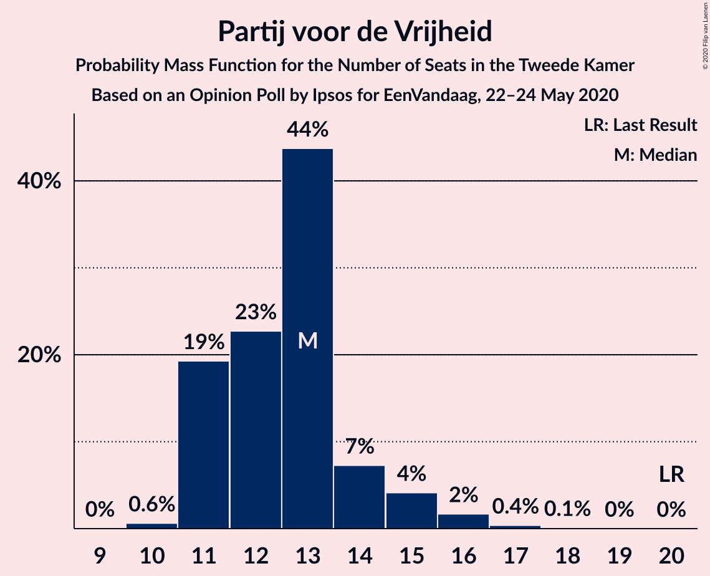
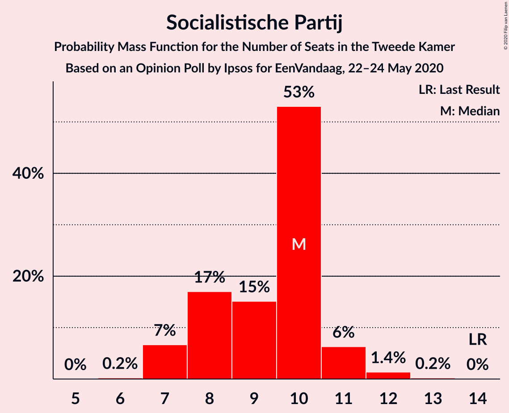
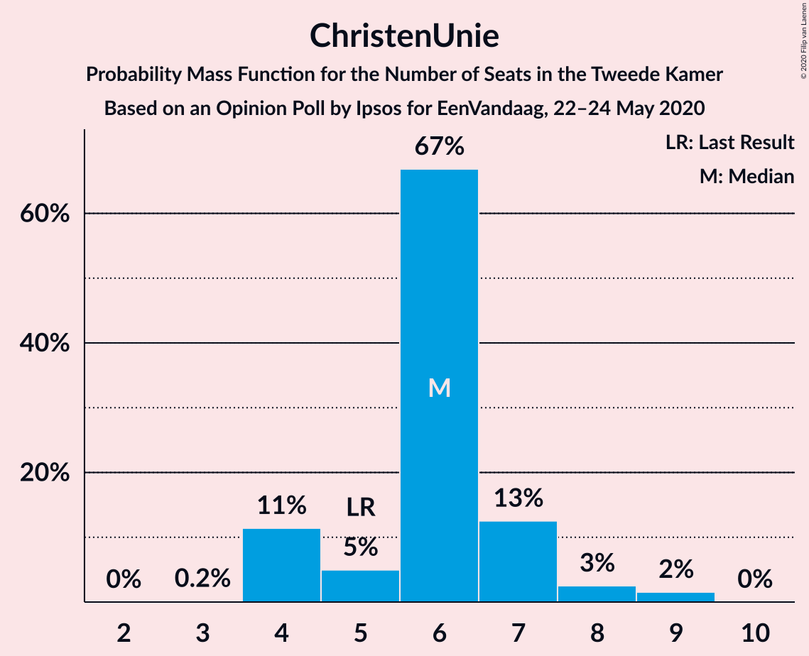
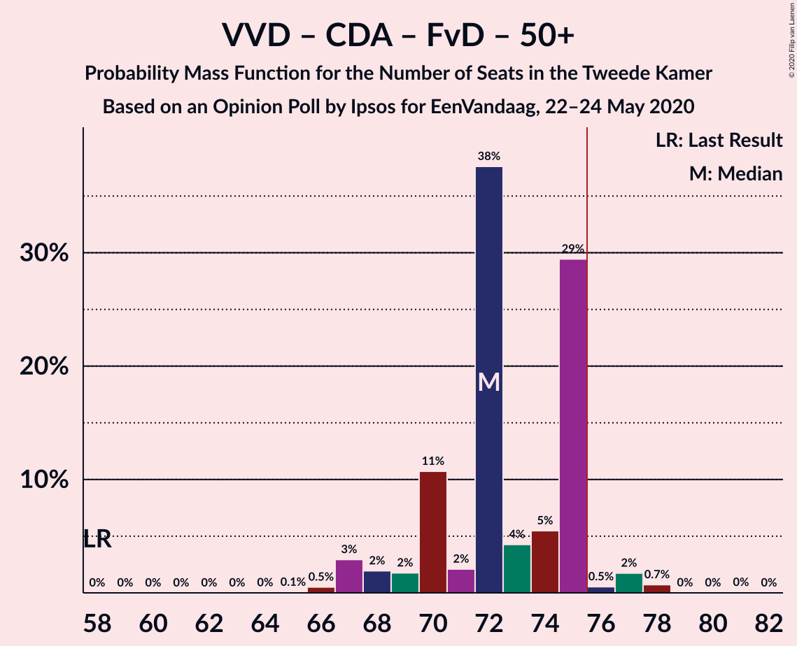
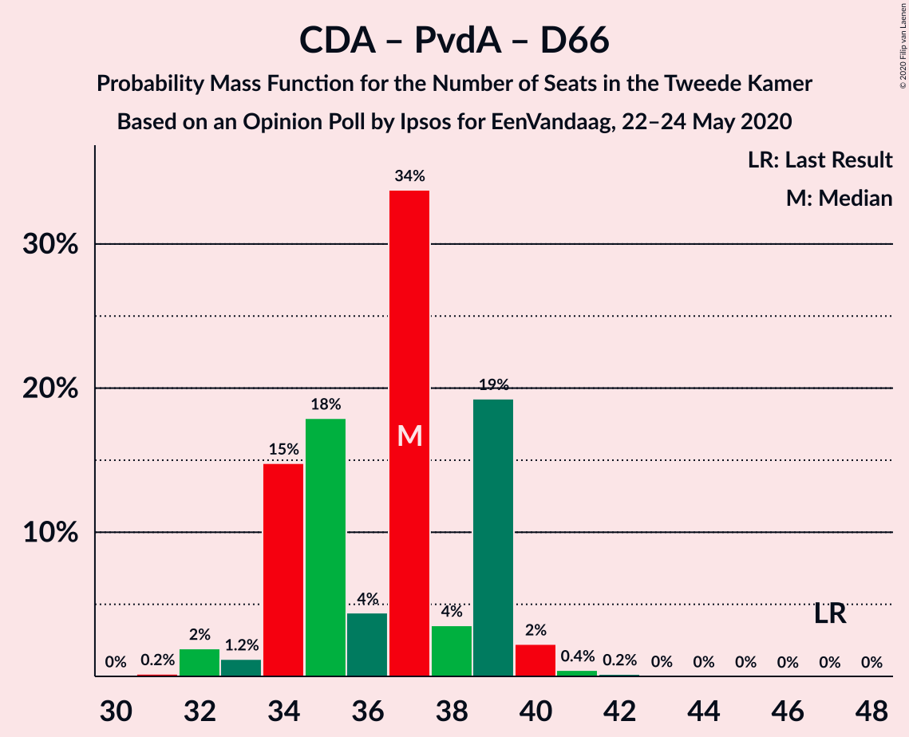

# Opinion Poll by Ipsos for EenVandaag, 22–24 May 2020

<a href="#voting-intentions">Voting Intentions</a> | <a href="#seats">Seats</a> | <a href="#coalitions">Coalitions</a> | <a href="#technical-information">Technical Information</a>

## Voting Intentions

### Confidence Intervals

| Party | Last Result | Poll Result | 80% Confidence Interval | 90% Confidence Interval | 95% Confidence Interval | 99% Confidence Interval |
|:-----:|:-----------:|:-----------:|:-----------------------:|:-----------------------:|:-----------------------:|:-----------------------:|
| Volkspartij voor Vrijheid en Democratie | 21.3% | 28.5% | 26.8–30.4% |26.3–30.9% |25.9–31.4% |25.1–32.2% |
| GroenLinks | 9.1% | 9.7% | 8.6–11.0% |8.3–11.4% |8.1–11.7% |7.6–12.3% |
| Christen-Democratisch Appèl | 12.4% | 9.2% | 8.1–10.4% |7.8–10.8% |7.6–11.1% |7.1–11.7% |
| Partij voor de Vrijheid | 13.1% | 9.0% | 7.9–10.2% |7.6–10.5% |7.4–10.9% |6.9–11.5% |
| Partij van de Arbeid | 5.7% | 8.6% | 7.6–9.8% |7.3–10.2% |7.0–10.4% |6.6–11.1% |
| Forum voor Democratie | 1.8% | 7.7% | 6.8–8.9% |6.5–9.2% |6.3–9.5% |5.8–10.1% |
| Democraten 66 | 12.2% | 6.7% | 5.8–7.8% |5.5–8.1% |5.3–8.4% |4.9–8.9% |
| Socialistische Partij | 9.1% | 6.1% | 5.2–7.2% |5.0–7.5% |4.8–7.7% |4.4–8.3% |
| ChristenUnie | 3.4% | 4.0% | 3.3–4.9% |3.1–5.2% |3.0–5.4% |2.7–5.8% |
| Partij voor de Dieren | 3.2% | 3.7% | 3.1–4.6% |2.9–4.8% |2.7–5.1% |2.5–5.5% |
| Staatkundig Gereformeerde Partij | 2.1% | 2.0% | 1.5–2.7% |1.4–2.9% |1.3–3.0% |1.1–3.4% |
| 50Plus | 3.1% | 1.9% | 1.5–2.6% |1.3–2.8% |1.2–2.9% |1.1–3.3% |
| DENK | 2.1% | 1.6% | 1.2–2.3% |1.1–2.4% |1.0–2.6% |0.9–2.9% |

*Note:* The poll result column reflects the actual value used in the calculations. Published results may vary slightly, and in addition be rounded to fewer digits.

## Seats

### Confidence Intervals

| Party | Last Result | Median | 80% Confidence Interval | 90% Confidence Interval | 95% Confidence Interval | 99% Confidence Interval |
|:-----:|:-----------:|:------:|:-----------------------:|:-----------------------:|:-----------------------:|:-----------------------:|
| <a href="#volkspartij-voor-vrijheid-en-democratie">Volkspartij voor Vrijheid en Democratie</a> | 33 | 48 | 43–48 |40–48 |40–48 |39–48 |
| <a href="#groenlinks">GroenLinks</a> | 14 | 14 | 14–16 |13–16 |11–16 |11–18 |
| <a href="#christen-democratisch-appèl">Christen-Democratisch Appèl</a> | 19 | 12 | 12–15 |10–15 |10–17 |10–18 |
| <a href="#partij-voor-de-vrijheid">Partij voor de Vrijheid</a> | 20 | 13 | 10–14 |10–15 |10–16 |10–17 |
| <a href="#partij-van-de-arbeid">Partij van de Arbeid</a> | 9 | 11 | 11–14 |11–14 |11–16 |10–17 |
| <a href="#forum-voor-democratie">Forum voor Democratie</a> | 2 | 10 | 10–14 |10–14 |9–14 |9–16 |
| <a href="#democraten-66">Democraten 66</a> | 19 | 9 | 9–12 |8–12 |8–12 |7–13 |
| <a href="#socialistische-partij">Socialistische Partij</a> | 14 | 10 | 8–10 |8–11 |8–11 |7–12 |
| <a href="#christenunie">ChristenUnie</a> | 5 | 5 | 4–6 |4–7 |4–7 |4–9 |
| <a href="#partij-voor-de-dieren">Partij voor de Dieren</a> | 5 | 7 | 5–7 |4–7 |4–9 |3–9 |
| <a href="#staatkundig-gereformeerde-partij">Staatkundig Gereformeerde Partij</a> | 3 | 4 | 2–4 |2–4 |2–4 |2–5 |
| <a href="#50plus">50Plus</a> | 4 | 2 | 2–3 |2–4 |1–4 |1–4 |
| <a href="#denk">DENK</a> | 3 | 3 | 1–3 |1–4 |1–4 |1–4 |

### Volkspartij voor Vrijheid en Democratie

*For a full overview of the results for this party, see the [Volkspartij voor Vrijheid en Democratie](party-volkspartijvoorvrijheidendemocratie.html) page.*

| Number of Seats | Probability | Accumulated | Special Marks |
|:---------------:|:-----------:|:-----------:|:-------------:|
| 33 | 0% | 100% | Last Result |
| 34 | 0% | 100% |  |
| 35 | 0% | 100% |  |
| 36 | 0.2% | 100% |  |
| 37 | 0.1% | 99.8% |  |
| 38 | 0.1% | 99.6% |  |
| 39 | 0.5% | 99.6% |  |
| 40 | 6% | 99.1% |  |
| 41 | 0.6% | 93% |  |
| 42 | 2% | 92% |  |
| 43 | 19% | 90% |  |
| 44 | 2% | 71% |  |
| 45 | 2% | 69% |  |
| 46 | 8% | 67% |  |
| 47 | 2% | 60% |  |
| 48 | 57% | 57% | Median |
| 49 | 0% | 0.1% |  |
| 50 | 0% | 0% |  |

### GroenLinks

*For a full overview of the results for this party, see the [GroenLinks](party-groenlinks.html) page.*

| Number of Seats | Probability | Accumulated | Special Marks |
|:---------------:|:-----------:|:-----------:|:-------------:|
| 10 | 0.1% | 100% |  |
| 11 | 3% | 99.9% |  |
| 12 | 0.6% | 97% |  |
| 13 | 6% | 97% |  |
| 14 | 59% | 91% | Last Result, Median |
| 15 | 17% | 32% |  |
| 16 | 13% | 15% |  |
| 17 | 1.1% | 2% |  |
| 18 | 0.8% | 0.9% |  |
| 19 | 0.1% | 0.1% |  |
| 20 | 0% | 0% |  |

### Christen-Democratisch Appèl

*For a full overview of the results for this party, see the [Christen-Democratisch Appèl](party-christen-democratischappèl.html) page.*

| Number of Seats | Probability | Accumulated | Special Marks |
|:---------------:|:-----------:|:-----------:|:-------------:|
| 10 | 6% | 100% |  |
| 11 | 2% | 94% |  |
| 12 | 58% | 92% | Median |
| 13 | 5% | 34% |  |
| 14 | 7% | 29% |  |
| 15 | 17% | 22% |  |
| 16 | 2% | 5% |  |
| 17 | 0.7% | 3% |  |
| 18 | 2% | 2% |  |
| 19 | 0% | 0% | Last Result |

### Partij voor de Vrijheid

*For a full overview of the results for this party, see the [Partij voor de Vrijheid](party-partijvoordevrijheid.html) page.*

| Number of Seats | Probability | Accumulated | Special Marks |
|:---------------:|:-----------:|:-----------:|:-------------:|
| 9 | 0.1% | 100% |  |
| 10 | 16% | 99.9% |  |
| 11 | 0.6% | 84% |  |
| 12 | 7% | 84% |  |
| 13 | 57% | 77% | Median |
| 14 | 14% | 20% |  |
| 15 | 2% | 6% |  |
| 16 | 3% | 3% |  |
| 17 | 0.3% | 0.8% |  |
| 18 | 0.4% | 0.5% |  |
| 19 | 0% | 0% |  |
| 20 | 0% | 0% | Last Result |

### Partij van de Arbeid

*For a full overview of the results for this party, see the [Partij van de Arbeid](party-partijvandearbeid.html) page.*

| Number of Seats | Probability | Accumulated | Special Marks |
|:---------------:|:-----------:|:-----------:|:-------------:|
| 9 | 0.1% | 100% | Last Result |
| 10 | 0.6% | 99.9% |  |
| 11 | 62% | 99.3% | Median |
| 12 | 3% | 37% |  |
| 13 | 19% | 34% |  |
| 14 | 11% | 15% |  |
| 15 | 0.6% | 4% |  |
| 16 | 3% | 3% |  |
| 17 | 0.5% | 0.7% |  |
| 18 | 0.2% | 0.2% |  |
| 19 | 0% | 0% |  |

### Forum voor Democratie

*For a full overview of the results for this party, see the [Forum voor Democratie](party-forumvoordemocratie.html) page.*

| Number of Seats | Probability | Accumulated | Special Marks |
|:---------------:|:-----------:|:-----------:|:-------------:|
| 2 | 0% | 100% | Last Result |
| 3 | 0% | 100% |  |
| 4 | 0% | 100% |  |
| 5 | 0% | 100% |  |
| 6 | 0% | 100% |  |
| 7 | 0% | 100% |  |
| 8 | 0% | 100% |  |
| 9 | 4% | 100% |  |
| 10 | 61% | 96% | Median |
| 11 | 8% | 35% |  |
| 12 | 2% | 27% |  |
| 13 | 4% | 25% |  |
| 14 | 21% | 22% |  |
| 15 | 0.2% | 1.0% |  |
| 16 | 0.7% | 0.9% |  |
| 17 | 0% | 0.1% |  |
| 18 | 0.1% | 0.1% |  |
| 19 | 0% | 0% |  |

### Democraten 66

*For a full overview of the results for this party, see the [Democraten 66](party-democraten66.html) page.*

| Number of Seats | Probability | Accumulated | Special Marks |
|:---------------:|:-----------:|:-----------:|:-------------:|
| 6 | 0.3% | 100% |  |
| 7 | 0.9% | 99.7% |  |
| 8 | 4% | 98.8% |  |
| 9 | 64% | 95% | Median |
| 10 | 3% | 31% |  |
| 11 | 9% | 28% |  |
| 12 | 18% | 19% |  |
| 13 | 0.8% | 0.9% |  |
| 14 | 0.1% | 0.1% |  |
| 15 | 0% | 0% |  |
| 16 | 0% | 0% |  |
| 17 | 0% | 0% |  |
| 18 | 0% | 0% |  |
| 19 | 0% | 0% | Last Result |

### Socialistische Partij

*For a full overview of the results for this party, see the [Socialistische Partij](party-socialistischepartij.html) page.*

| Number of Seats | Probability | Accumulated | Special Marks |
|:---------------:|:-----------:|:-----------:|:-------------:|
| 6 | 0.2% | 100% |  |
| 7 | 0.3% | 99.8% |  |
| 8 | 20% | 99.5% |  |
| 9 | 10% | 79% |  |
| 10 | 63% | 69% | Median |
| 11 | 4% | 6% |  |
| 12 | 1.4% | 2% |  |
| 13 | 0.1% | 0.2% |  |
| 14 | 0.1% | 0.1% | Last Result |
| 15 | 0% | 0% |  |

### ChristenUnie

*For a full overview of the results for this party, see the [ChristenUnie](party-christenunie.html) page.*

| Number of Seats | Probability | Accumulated | Special Marks |
|:---------------:|:-----------:|:-----------:|:-------------:|
| 3 | 0.2% | 100% |  |
| 4 | 11% | 99.8% |  |
| 5 | 60% | 89% | Last Result, Median |
| 6 | 22% | 29% |  |
| 7 | 5% | 7% |  |
| 8 | 0.8% | 1.5% |  |
| 9 | 0.6% | 0.7% |  |
| 10 | 0.1% | 0.1% |  |
| 11 | 0% | 0% |  |

### Partij voor de Dieren

*For a full overview of the results for this party, see the [Partij voor de Dieren](party-partijvoordedieren.html) page.*

| Number of Seats | Probability | Accumulated | Special Marks |
|:---------------:|:-----------:|:-----------:|:-------------:|
| 2 | 0.1% | 100% |  |
| 3 | 2% | 99.9% |  |
| 4 | 7% | 98% |  |
| 5 | 8% | 92% | Last Result |
| 6 | 17% | 83% |  |
| 7 | 63% | 66% | Median |
| 8 | 0.3% | 3% |  |
| 9 | 3% | 3% |  |
| 10 | 0% | 0% |  |

### Staatkundig Gereformeerde Partij

*For a full overview of the results for this party, see the [Staatkundig Gereformeerde Partij](party-staatkundiggereformeerdepartij.html) page.*

| Number of Seats | Probability | Accumulated | Special Marks |
|:---------------:|:-----------:|:-----------:|:-------------:|
| 1 | 0.4% | 100% |  |
| 2 | 12% | 99.6% |  |
| 3 | 9% | 88% | Last Result |
| 4 | 78% | 79% | Median |
| 5 | 0.5% | 0.6% |  |
| 6 | 0.1% | 0.1% |  |
| 7 | 0% | 0% |  |

### 50Plus

*For a full overview of the results for this party, see the [50Plus](party-50plus.html) page.*

| Number of Seats | Probability | Accumulated | Special Marks |
|:---------------:|:-----------:|:-----------:|:-------------:|
| 0 | 0.2% | 100% |  |
| 1 | 3% | 99.8% |  |
| 2 | 85% | 97% | Median |
| 3 | 5% | 12% |  |
| 4 | 7% | 7% | Last Result |
| 5 | 0.2% | 0.2% |  |
| 6 | 0% | 0% |  |

### DENK

*For a full overview of the results for this party, see the [DENK](party-denk.html) page.*

| Number of Seats | Probability | Accumulated | Special Marks |
|:---------------:|:-----------:|:-----------:|:-------------:|
| 0 | 0.2% | 100% |  |
| 1 | 19% | 99.8% |  |
| 2 | 15% | 81% |  |
| 3 | 60% | 66% | Last Result, Median |
| 4 | 6% | 6% |  |
| 5 | 0% | 0% |  |

## Coalitions

### Confidence Intervals

| Coalition | Last Result | Median | Majority? | 80% Confidence Interval | 90% Confidence Interval | 95% Confidence Interval | 99% Confidence Interval |
|:---------:|:-----------:|:------:|:---------:|:-----------------------:|:-----------------------:|:-----------------------:|:-----------------------:|
| Volkspartij voor Vrijheid en Democratie – GroenLinks – Christen-Democratisch Appèl – Democraten 66 – ChristenUnie | 90 | 88 | 100% | 86–91 | 85–91 | 83–91 | 82–94 |
| Volkspartij voor Vrijheid en Democratie – Christen-Democratisch Appèl – Partij voor de Vrijheid – Forum voor Democratie – Staatkundig Gereformeerde Partij | 77 | 87 | 100% | 84–87 | 83–88 | 83–90 | 81–90 |
| Volkspartij voor Vrijheid en Democratie – Christen-Democratisch Appèl – Partij van de Arbeid – Democraten 66 – ChristenUnie | 85 | 85 | 100% | 85–89 | 80–89 | 80–90 | 80–91 |
| Volkspartij voor Vrijheid en Democratie – Christen-Democratisch Appèl – Partij voor de Vrijheid – Forum voor Democratie | 74 | 83 | 99.9% | 81–83 | 80–84 | 80–88 | 78–88 |
| Volkspartij voor Vrijheid en Democratie – Christen-Democratisch Appèl – Forum voor Democratie – Staatkundig Gereformeerde Partij – 50Plus | 61 | 76 | 81% | 72–78 | 71–78 | 71–78 | 70–78 |
| Volkspartij voor Vrijheid en Democratie – Christen-Democratisch Appèl – Democraten 66 – ChristenUnie | 76 | 74 | 20% | 71–76 | 69–76 | 69–77 | 68–77 |
| Volkspartij voor Vrijheid en Democratie – Christen-Democratisch Appèl – Forum voor Democratie – 50Plus | 58 | 72 | 3% | 69–74 | 69–74 | 69–76 | 67–76 |
| Volkspartij voor Vrijheid en Democratie – Christen-Democratisch Appèl – Forum voor Democratie – Staatkundig Gereformeerde Partij | 57 | 74 | 18% | 69–76 | 69–76 | 69–76 | 67–76 |
| Volkspartij voor Vrijheid en Democratie – Christen-Democratisch Appèl – Partij voor de Vrijheid | 72 | 73 | 0.4% | 68–73 | 66–74 | 66–75 | 66–75 |
| Volkspartij voor Vrijheid en Democratie – Christen-Democratisch Appèl – Forum voor Democratie | 54 | 70 | 0.1% | 67–72 | 67–72 | 66–74 | 64–74 |
| Volkspartij voor Vrijheid en Democratie – Christen-Democratisch Appèl – Partij van de Arbeid | 61 | 71 | 0.5% | 70–72 | 65–73 | 65–74 | 64–75 |
| Volkspartij voor Vrijheid en Democratie – Christen-Democratisch Appèl – Democraten 66 | 71 | 69 | 0% | 66–70 | 63–70 | 63–73 | 63–73 |
| Volkspartij voor Vrijheid en Democratie – Partij van de Arbeid – Democraten 66 | 61 | 68 | 0% | 65–69 | 61–71 | 60–71 | 60–71 |
| GroenLinks – Christen-Democratisch Appèl – Partij van de Arbeid – Democraten 66 – Socialistische Partij – ChristenUnie | 80 | 61 | 0% | 61–69 | 61–69 | 61–70 | 61–75 |
| Volkspartij voor Vrijheid en Democratie – Christen-Democratisch Appèl | 52 | 60 | 0% | 56–60 | 54–60 | 54–61 | 53–61 |
| GroenLinks – Christen-Democratisch Appèl – Partij van de Arbeid – Democraten 66 – ChristenUnie | 66 | 51 | 0% | 51–61 | 51–61 | 51–61 | 51–65 |
| Volkspartij voor Vrijheid en Democratie – Partij van de Arbeid | 42 | 59 | 0% | 55–60 | 51–60 | 51–61 | 50–62 |
| Christen-Democratisch Appèl – Partij van de Arbeid – Democraten 66 | 47 | 32 | 0% | 32–40 | 32–40 | 32–42 | 31–42 |
| Christen-Democratisch Appèl – Partij van de Arbeid – ChristenUnie | 33 | 28 | 0% | 28–34 | 28–34 | 28–36 | 28–38 |
| Christen-Democratisch Appèl – Partij van de Arbeid | 28 | 23 | 0% | 23–28 | 23–29 | 23–30 | 23–32 |
| Christen-Democratisch Appèl – Democraten 66 | 38 | 21 | 0% | 21–27 | 21–27 | 21–29 | 18–30 |

### Volkspartij voor Vrijheid en Democratie – GroenLinks – Christen-Democratisch Appèl – Democraten 66 – ChristenUnie

| Number of Seats | Probability | Accumulated | Special Marks |
|:---------------:|:-----------:|:-----------:|:-------------:|
| 80 | 0% | 100% |  |
| 81 | 0.1% | 99.9% |  |
| 82 | 0.7% | 99.9% |  |
| 83 | 2% | 99.2% |  |
| 84 | 0.4% | 97% |  |
| 85 | 5% | 97% |  |
| 86 | 3% | 91% |  |
| 87 | 6% | 89% |  |
| 88 | 62% | 82% | Median |
| 89 | 3% | 20% |  |
| 90 | 0.3% | 18% | Last Result |
| 91 | 17% | 18% |  |
| 92 | 0.1% | 0.9% |  |
| 93 | 0.1% | 0.8% |  |
| 94 | 0.6% | 0.7% |  |
| 95 | 0.1% | 0.1% |  |
| 96 | 0% | 0% |  |

### Volkspartij voor Vrijheid en Democratie – Christen-Democratisch Appèl – Partij voor de Vrijheid – Forum voor Democratie – Staatkundig Gereformeerde Partij

| Number of Seats | Probability | Accumulated | Special Marks |
|:---------------:|:-----------:|:-----------:|:-------------:|
| 77 | 0% | 100% | Last Result |
| 78 | 0.1% | 99.9% |  |
| 79 | 0% | 99.9% |  |
| 80 | 0% | 99.9% |  |
| 81 | 0.8% | 99.8% |  |
| 82 | 0.8% | 99.0% |  |
| 83 | 7% | 98% |  |
| 84 | 7% | 91% |  |
| 85 | 3% | 83% |  |
| 86 | 16% | 80% |  |
| 87 | 59% | 64% | Median |
| 88 | 2% | 6% |  |
| 89 | 1.3% | 4% |  |
| 90 | 3% | 3% |  |
| 91 | 0% | 0.2% |  |
| 92 | 0.2% | 0.2% |  |
| 93 | 0% | 0% |  |

### Volkspartij voor Vrijheid en Democratie – Christen-Democratisch Appèl – Partij van de Arbeid – Democraten 66 – ChristenUnie

| Number of Seats | Probability | Accumulated | Special Marks |
|:---------------:|:-----------:|:-----------:|:-------------:|
| 79 | 0.3% | 100% |  |
| 80 | 5% | 99.7% |  |
| 81 | 1.0% | 95% |  |
| 82 | 0.4% | 94% |  |
| 83 | 0.2% | 93% |  |
| 84 | 2% | 93% |  |
| 85 | 63% | 91% | Last Result, Median |
| 86 | 2% | 28% |  |
| 87 | 4% | 26% |  |
| 88 | 0.6% | 23% |  |
| 89 | 18% | 22% |  |
| 90 | 1.3% | 4% |  |
| 91 | 2% | 2% |  |
| 92 | 0.1% | 0.2% |  |
| 93 | 0% | 0.1% |  |
| 94 | 0.1% | 0.1% |  |
| 95 | 0% | 0% |  |

### Volkspartij voor Vrijheid en Democratie – Christen-Democratisch Appèl – Partij voor de Vrijheid – Forum voor Democratie

| Number of Seats | Probability | Accumulated | Special Marks |
|:---------------:|:-----------:|:-----------:|:-------------:|
| 74 | 0% | 100% | Last Result |
| 75 | 0% | 100% |  |
| 76 | 0% | 99.9% | Majority |
| 77 | 0.1% | 99.9% |  |
| 78 | 0.7% | 99.8% |  |
| 79 | 0.4% | 99.1% |  |
| 80 | 6% | 98.7% |  |
| 81 | 8% | 93% |  |
| 82 | 19% | 84% |  |
| 83 | 57% | 65% | Median |
| 84 | 4% | 8% |  |
| 85 | 0.7% | 4% |  |
| 86 | 1.1% | 4% |  |
| 87 | 0% | 3% |  |
| 88 | 2% | 3% |  |
| 89 | 0% | 0.2% |  |
| 90 | 0.1% | 0.2% |  |
| 91 | 0% | 0% |  |

### Volkspartij voor Vrijheid en Democratie – Christen-Democratisch Appèl – Forum voor Democratie – Staatkundig Gereformeerde Partij – 50Plus

| Number of Seats | Probability | Accumulated | Special Marks |
|:---------------:|:-----------:|:-----------:|:-------------:|
| 61 | 0% | 100% | Last Result |
| 62 | 0% | 100% |  |
| 63 | 0% | 100% |  |
| 64 | 0% | 100% |  |
| 65 | 0% | 100% |  |
| 66 | 0.1% | 100% |  |
| 67 | 0% | 99.9% |  |
| 68 | 0.1% | 99.9% |  |
| 69 | 0.3% | 99.9% |  |
| 70 | 0.4% | 99.6% |  |
| 71 | 7% | 99.1% |  |
| 72 | 4% | 92% |  |
| 73 | 1.3% | 88% |  |
| 74 | 4% | 87% |  |
| 75 | 2% | 83% |  |
| 76 | 61% | 81% | Median, Majority |
| 77 | 1.3% | 20% |  |
| 78 | 18% | 19% |  |
| 79 | 0.2% | 0.4% |  |
| 80 | 0.1% | 0.2% |  |
| 81 | 0.1% | 0.1% |  |
| 82 | 0% | 0% |  |

### Volkspartij voor Vrijheid en Democratie – Christen-Democratisch Appèl – Democraten 66 – ChristenUnie

| Number of Seats | Probability | Accumulated | Special Marks |
|:---------------:|:-----------:|:-----------:|:-------------:|
| 65 | 0% | 100% |  |
| 66 | 0.1% | 99.9% |  |
| 67 | 0.2% | 99.9% |  |
| 68 | 0.8% | 99.7% |  |
| 69 | 5% | 98.9% |  |
| 70 | 3% | 94% |  |
| 71 | 7% | 91% |  |
| 72 | 0.6% | 84% |  |
| 73 | 3% | 84% |  |
| 74 | 58% | 80% | Median |
| 75 | 2% | 22% |  |
| 76 | 16% | 20% | Last Result, Majority |
| 77 | 4% | 4% |  |
| 78 | 0% | 0.3% |  |
| 79 | 0.1% | 0.3% |  |
| 80 | 0.1% | 0.2% |  |
| 81 | 0.1% | 0.1% |  |
| 82 | 0% | 0.1% |  |
| 83 | 0% | 0% |  |

### Volkspartij voor Vrijheid en Democratie – Christen-Democratisch Appèl – Forum voor Democratie – 50Plus

| Number of Seats | Probability | Accumulated | Special Marks |
|:---------------:|:-----------:|:-----------:|:-------------:|
| 58 | 0% | 100% | Last Result |
| 59 | 0% | 100% |  |
| 60 | 0% | 100% |  |
| 61 | 0% | 100% |  |
| 62 | 0% | 100% |  |
| 63 | 0% | 100% |  |
| 64 | 0% | 99.9% |  |
| 65 | 0.1% | 99.9% |  |
| 66 | 0.3% | 99.8% |  |
| 67 | 0.2% | 99.5% |  |
| 68 | 1.0% | 99.4% |  |
| 69 | 10% | 98% |  |
| 70 | 2% | 89% |  |
| 71 | 5% | 87% |  |
| 72 | 61% | 82% | Median |
| 73 | 1.2% | 21% |  |
| 74 | 17% | 20% |  |
| 75 | 0.3% | 3% |  |
| 76 | 3% | 3% | Majority |
| 77 | 0.1% | 0.2% |  |
| 78 | 0.1% | 0.1% |  |
| 79 | 0% | 0.1% |  |
| 80 | 0% | 0% |  |

### Volkspartij voor Vrijheid en Democratie – Christen-Democratisch Appèl – Forum voor Democratie – Staatkundig Gereformeerde Partij

| Number of Seats | Probability | Accumulated | Special Marks |
|:---------------:|:-----------:|:-----------:|:-------------:|
| 57 | 0% | 100% | Last Result |
| 58 | 0% | 100% |  |
| 59 | 0% | 100% |  |
| 60 | 0% | 100% |  |
| 61 | 0% | 100% |  |
| 62 | 0% | 100% |  |
| 63 | 0% | 100% |  |
| 64 | 0% | 100% |  |
| 65 | 0.1% | 99.9% |  |
| 66 | 0.3% | 99.9% |  |
| 67 | 0.4% | 99.6% |  |
| 68 | 0.2% | 99.1% |  |
| 69 | 10% | 98.9% |  |
| 70 | 3% | 89% |  |
| 71 | 0.1% | 86% |  |
| 72 | 6% | 86% |  |
| 73 | 4% | 80% |  |
| 74 | 57% | 76% | Median |
| 75 | 0.8% | 19% |  |
| 76 | 18% | 18% | Majority |
| 77 | 0.1% | 0.2% |  |
| 78 | 0.1% | 0.2% |  |
| 79 | 0% | 0.1% |  |
| 80 | 0% | 0% |  |

### Volkspartij voor Vrijheid en Democratie – Christen-Democratisch Appèl – Partij voor de Vrijheid

| Number of Seats | Probability | Accumulated | Special Marks |
|:---------------:|:-----------:|:-----------:|:-------------:|
| 63 | 0.1% | 100% |  |
| 64 | 0.1% | 99.9% |  |
| 65 | 0% | 99.8% |  |
| 66 | 5% | 99.8% |  |
| 67 | 1.0% | 95% |  |
| 68 | 17% | 94% |  |
| 69 | 0.6% | 77% |  |
| 70 | 7% | 77% |  |
| 71 | 2% | 69% |  |
| 72 | 1.3% | 67% | Last Result |
| 73 | 59% | 66% | Median |
| 74 | 2% | 6% |  |
| 75 | 4% | 4% |  |
| 76 | 0.1% | 0.4% | Majority |
| 77 | 0.3% | 0.4% |  |
| 78 | 0% | 0.1% |  |
| 79 | 0% | 0% |  |

### Volkspartij voor Vrijheid en Democratie – Christen-Democratisch Appèl – Forum voor Democratie

| Number of Seats | Probability | Accumulated | Special Marks |
|:---------------:|:-----------:|:-----------:|:-------------:|
| 54 | 0% | 100% | Last Result |
| 55 | 0% | 100% |  |
| 56 | 0% | 100% |  |
| 57 | 0% | 100% |  |
| 58 | 0% | 100% |  |
| 59 | 0% | 100% |  |
| 60 | 0% | 100% |  |
| 61 | 0% | 100% |  |
| 62 | 0% | 99.9% |  |
| 63 | 0.4% | 99.9% |  |
| 64 | 0% | 99.5% |  |
| 65 | 0.3% | 99.5% |  |
| 66 | 4% | 99.1% |  |
| 67 | 8% | 95% |  |
| 68 | 6% | 88% |  |
| 69 | 2% | 81% |  |
| 70 | 58% | 79% | Median |
| 71 | 1.4% | 21% |  |
| 72 | 16% | 19% |  |
| 73 | 0.2% | 3% |  |
| 74 | 3% | 3% |  |
| 75 | 0% | 0.1% |  |
| 76 | 0.1% | 0.1% | Majority |
| 77 | 0% | 0% |  |

### Volkspartij voor Vrijheid en Democratie – Christen-Democratisch Appèl – Partij van de Arbeid

| Number of Seats | Probability | Accumulated | Special Marks |
|:---------------:|:-----------:|:-----------:|:-------------:|
| 61 | 0% | 100% | Last Result |
| 62 | 0.1% | 100% |  |
| 63 | 0% | 99.9% |  |
| 64 | 0.5% | 99.9% |  |
| 65 | 5% | 99.4% |  |
| 66 | 0.6% | 95% |  |
| 67 | 1.0% | 94% |  |
| 68 | 1.4% | 93% |  |
| 69 | 0.6% | 92% |  |
| 70 | 6% | 91% |  |
| 71 | 75% | 85% | Median |
| 72 | 1.1% | 10% |  |
| 73 | 6% | 9% |  |
| 74 | 2% | 3% |  |
| 75 | 0.2% | 0.7% |  |
| 76 | 0.1% | 0.5% | Majority |
| 77 | 0% | 0.4% |  |
| 78 | 0% | 0.4% |  |
| 79 | 0.3% | 0.3% |  |
| 80 | 0% | 0% |  |

### Volkspartij voor Vrijheid en Democratie – Christen-Democratisch Appèl – Democraten 66

| Number of Seats | Probability | Accumulated | Special Marks |
|:---------------:|:-----------:|:-----------:|:-------------:|
| 60 | 0.1% | 100% |  |
| 61 | 0.1% | 99.9% |  |
| 62 | 0.1% | 99.8% |  |
| 63 | 5% | 99.6% |  |
| 64 | 1.4% | 94% |  |
| 65 | 2% | 93% |  |
| 66 | 3% | 91% |  |
| 67 | 7% | 88% |  |
| 68 | 4% | 81% |  |
| 69 | 57% | 77% | Median |
| 70 | 17% | 20% |  |
| 71 | 0.1% | 3% | Last Result |
| 72 | 0.1% | 3% |  |
| 73 | 3% | 3% |  |
| 74 | 0% | 0.1% |  |
| 75 | 0.1% | 0.1% |  |
| 76 | 0% | 0% | Majority |

### Volkspartij voor Vrijheid en Democratie – Partij van de Arbeid – Democraten 66

| Number of Seats | Probability | Accumulated | Special Marks |
|:---------------:|:-----------:|:-----------:|:-------------:|
| 59 | 0.1% | 100% |  |
| 60 | 5% | 99.9% |  |
| 61 | 1.0% | 95% | Last Result |
| 62 | 0.8% | 94% |  |
| 63 | 1.0% | 93% |  |
| 64 | 2% | 92% |  |
| 65 | 0.7% | 91% |  |
| 66 | 0.3% | 90% |  |
| 67 | 3% | 90% |  |
| 68 | 74% | 87% | Median |
| 69 | 4% | 13% |  |
| 70 | 0.6% | 9% |  |
| 71 | 8% | 9% |  |
| 72 | 0.3% | 0.4% |  |
| 73 | 0.1% | 0.1% |  |
| 74 | 0% | 0.1% |  |
| 75 | 0% | 0% |  |

### GroenLinks – Christen-Democratisch Appèl – Partij van de Arbeid – Democraten 66 – Socialistische Partij – ChristenUnie

| Number of Seats | Probability | Accumulated | Special Marks |
|:---------------:|:-----------:|:-----------:|:-------------:|
| 60 | 0.1% | 100% |  |
| 61 | 57% | 99.9% | Median |
| 62 | 3% | 43% |  |
| 63 | 0.8% | 40% |  |
| 64 | 6% | 39% |  |
| 65 | 0.9% | 33% |  |
| 66 | 7% | 32% |  |
| 67 | 0.7% | 25% |  |
| 68 | 5% | 24% |  |
| 69 | 16% | 19% |  |
| 70 | 0.3% | 3% |  |
| 71 | 0.4% | 2% |  |
| 72 | 1.0% | 2% |  |
| 73 | 0.2% | 1.0% |  |
| 74 | 0.2% | 0.7% |  |
| 75 | 0.5% | 0.5% |  |
| 76 | 0% | 0% | Majority |
| 77 | 0% | 0% |  |
| 78 | 0% | 0% |  |
| 79 | 0% | 0% |  |
| 80 | 0% | 0% | Last Result |

### Volkspartij voor Vrijheid en Democratie – Christen-Democratisch Appèl

| Number of Seats | Probability | Accumulated | Special Marks |
|:---------------:|:-----------:|:-----------:|:-------------:|
| 50 | 0.1% | 100% |  |
| 51 | 0.1% | 99.9% |  |
| 52 | 0.2% | 99.8% | Last Result |
| 53 | 0.4% | 99.6% |  |
| 54 | 6% | 99.3% |  |
| 55 | 1.4% | 94% |  |
| 56 | 7% | 92% |  |
| 57 | 5% | 85% |  |
| 58 | 17% | 80% |  |
| 59 | 2% | 64% |  |
| 60 | 59% | 62% | Median |
| 61 | 3% | 3% |  |
| 62 | 0.4% | 0.5% |  |
| 63 | 0% | 0.1% |  |
| 64 | 0% | 0.1% |  |
| 65 | 0.1% | 0.1% |  |
| 66 | 0% | 0% |  |

### GroenLinks – Christen-Democratisch Appèl – Partij van de Arbeid – Democraten 66 – ChristenUnie

| Number of Seats | Probability | Accumulated | Special Marks |
|:---------------:|:-----------:|:-----------:|:-------------:|
| 50 | 0% | 100% |  |
| 51 | 56% | 99.9% | Median |
| 52 | 1.3% | 44% |  |
| 53 | 3% | 42% |  |
| 54 | 0.7% | 40% |  |
| 55 | 7% | 39% |  |
| 56 | 6% | 32% |  |
| 57 | 3% | 26% |  |
| 58 | 2% | 23% |  |
| 59 | 0.7% | 21% |  |
| 60 | 3% | 20% |  |
| 61 | 16% | 17% |  |
| 62 | 0.1% | 1.3% |  |
| 63 | 0.1% | 1.2% |  |
| 64 | 0.2% | 1.1% |  |
| 65 | 0.8% | 0.8% |  |
| 66 | 0% | 0% | Last Result |

### Volkspartij voor Vrijheid en Democratie – Partij van de Arbeid

| Number of Seats | Probability | Accumulated | Special Marks |
|:---------------:|:-----------:|:-----------:|:-------------:|
| 42 | 0% | 100% | Last Result |
| 43 | 0% | 100% |  |
| 44 | 0% | 100% |  |
| 45 | 0% | 100% |  |
| 46 | 0% | 100% |  |
| 47 | 0% | 100% |  |
| 48 | 0% | 100% |  |
| 49 | 0.1% | 100% |  |
| 50 | 0.7% | 99.9% |  |
| 51 | 6% | 99.3% |  |
| 52 | 0.2% | 94% |  |
| 53 | 0.5% | 94% |  |
| 54 | 0.6% | 93% |  |
| 55 | 4% | 92% |  |
| 56 | 16% | 88% |  |
| 57 | 0.7% | 72% |  |
| 58 | 0.3% | 71% |  |
| 59 | 59% | 71% | Median |
| 60 | 8% | 12% |  |
| 61 | 3% | 4% |  |
| 62 | 0.5% | 0.9% |  |
| 63 | 0% | 0.4% |  |
| 64 | 0.3% | 0.4% |  |
| 65 | 0% | 0.1% |  |
| 66 | 0% | 0% |  |

### Christen-Democratisch Appèl – Partij van de Arbeid – Democraten 66

| Number of Seats | Probability | Accumulated | Special Marks |
|:---------------:|:-----------:|:-----------:|:-------------:|
| 30 | 0.4% | 100% |  |
| 31 | 0.7% | 99.6% |  |
| 32 | 56% | 98.9% | Median |
| 33 | 0.2% | 43% |  |
| 34 | 5% | 42% |  |
| 35 | 11% | 37% |  |
| 36 | 0.4% | 26% |  |
| 37 | 2% | 26% |  |
| 38 | 0.9% | 23% |  |
| 39 | 0.6% | 23% |  |
| 40 | 19% | 22% |  |
| 41 | 0.3% | 3% |  |
| 42 | 3% | 3% |  |
| 43 | 0.1% | 0.2% |  |
| 44 | 0% | 0.1% |  |
| 45 | 0.1% | 0.1% |  |
| 46 | 0% | 0% |  |
| 47 | 0% | 0% | Last Result |

### Christen-Democratisch Appèl – Partij van de Arbeid – ChristenUnie

| Number of Seats | Probability | Accumulated | Special Marks |
|:---------------:|:-----------:|:-----------:|:-------------:|
| 27 | 0.2% | 100% |  |
| 28 | 62% | 99.8% | Median |
| 29 | 0.3% | 38% |  |
| 30 | 3% | 37% |  |
| 31 | 6% | 35% |  |
| 32 | 3% | 29% |  |
| 33 | 1.4% | 26% | Last Result |
| 34 | 20% | 25% |  |
| 35 | 0.5% | 5% |  |
| 36 | 3% | 4% |  |
| 37 | 0.5% | 1.0% |  |
| 38 | 0.4% | 0.5% |  |
| 39 | 0.1% | 0.1% |  |
| 40 | 0% | 0% |  |

### Christen-Democratisch Appèl – Partij van de Arbeid

| Number of Seats | Probability | Accumulated | Special Marks |
|:---------------:|:-----------:|:-----------:|:-------------:|
| 21 | 0% | 100% |  |
| 22 | 0.4% | 99.9% |  |
| 23 | 56% | 99.5% | Median |
| 24 | 8% | 43% |  |
| 25 | 5% | 36% |  |
| 26 | 2% | 30% |  |
| 27 | 4% | 28% |  |
| 28 | 17% | 24% | Last Result |
| 29 | 3% | 7% |  |
| 30 | 3% | 4% |  |
| 31 | 0.8% | 1.4% |  |
| 32 | 0.6% | 0.6% |  |
| 33 | 0% | 0.1% |  |
| 34 | 0% | 0% |  |

### Christen-Democratisch Appèl – Democraten 66

| Number of Seats | Probability | Accumulated | Special Marks |
|:---------------:|:-----------:|:-----------:|:-------------:|
| 18 | 0.7% | 100% |  |
| 19 | 0.5% | 99.3% |  |
| 20 | 0.6% | 98.8% |  |
| 21 | 66% | 98% | Median |
| 22 | 2% | 32% |  |
| 23 | 6% | 31% |  |
| 24 | 4% | 25% |  |
| 25 | 1.2% | 21% |  |
| 26 | 0.6% | 20% |  |
| 27 | 16% | 19% |  |
| 28 | 0.3% | 4% |  |
| 29 | 0.7% | 3% |  |
| 30 | 2% | 2% |  |
| 31 | 0% | 0% |  |
| 32 | 0% | 0% |  |
| 33 | 0% | 0% |  |
| 34 | 0% | 0% |  |
| 35 | 0% | 0% |  |
| 36 | 0% | 0% |  |
| 37 | 0% | 0% |  |
| 38 | 0% | 0% | Last Result |

## Technical Information

### Opinion Poll

+ **Polling firm:** Ipsos
+ **Commissioner(s):** EenVandaag
+ **Fieldwork period:** 22–24 May 2020

### Calculations

+ **Sample size:** 1048
+ **Simulations done:** 131,072
+ **Error estimate:** 3.26%

