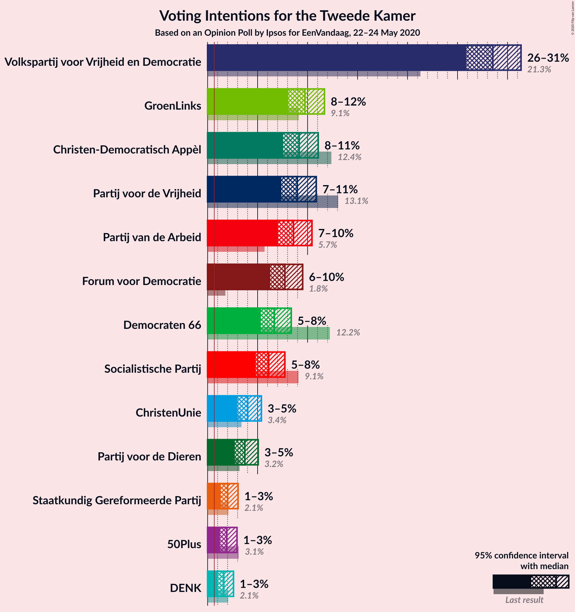
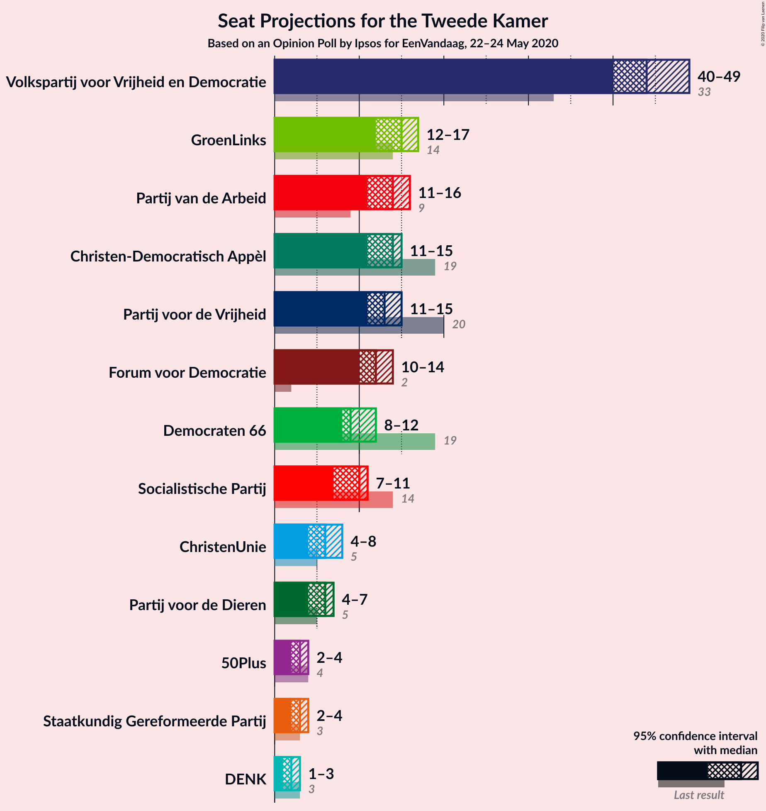
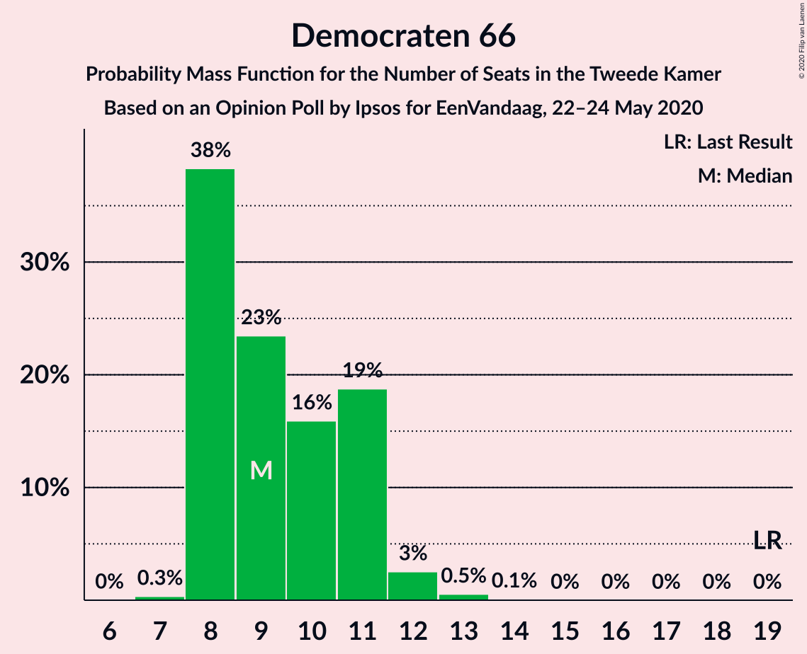
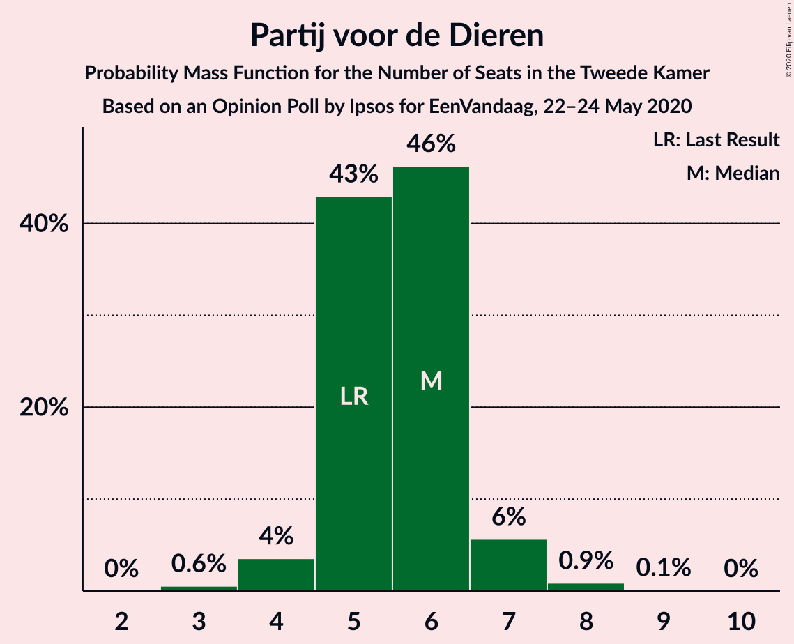
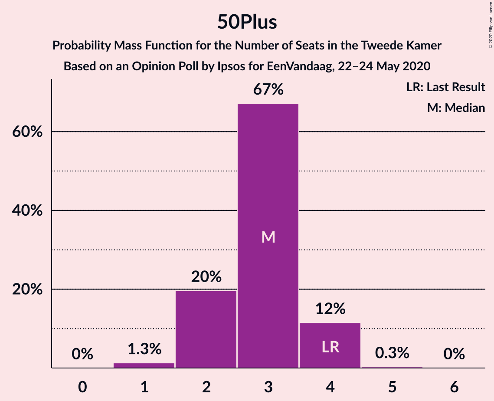
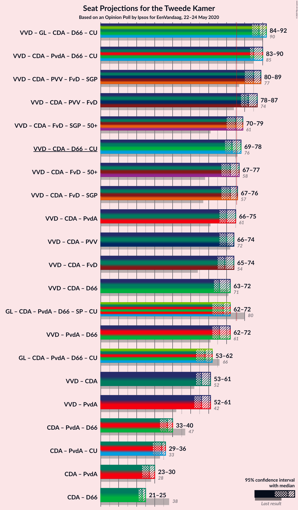
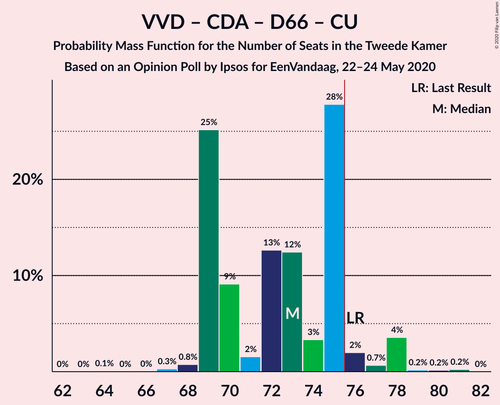
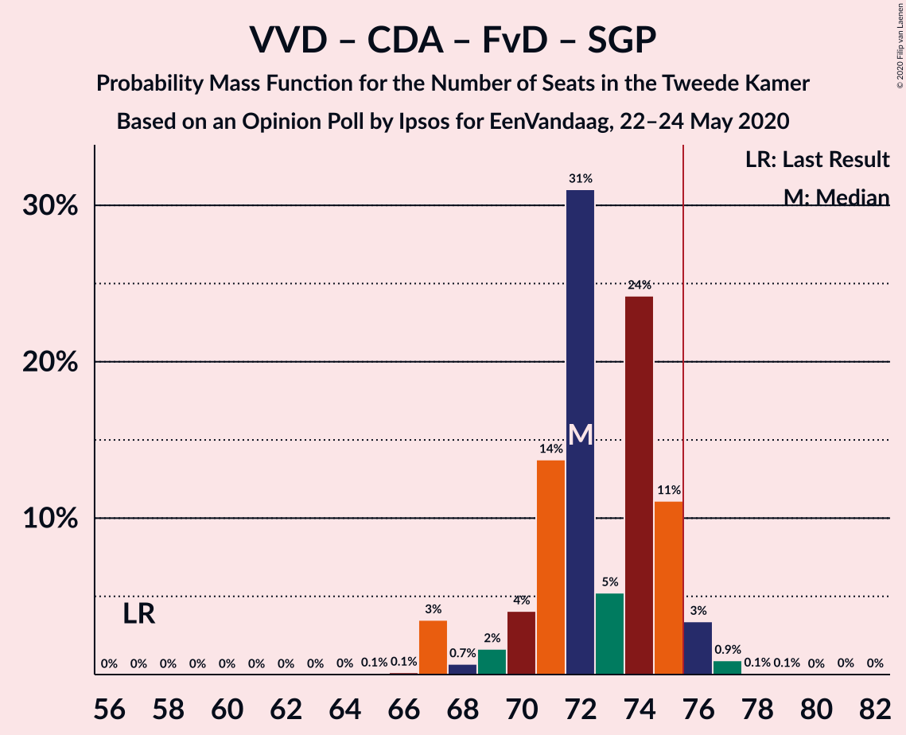

# Opinion Poll by Ipsos for EenVandaag, 22–24 May 2020

<a href="#voting-intentions">Voting Intentions</a> | <a href="#seats">Seats</a> | <a href="#coalitions">Coalitions</a> | <a href="#technical-information">Technical Information</a>

## Voting Intentions

### Confidence Intervals

| Party | Last Result | Poll Result | 80% Confidence Interval | 90% Confidence Interval | 95% Confidence Interval | 99% Confidence Interval |
|:-----:|:-----------:|:-----------:|:-----------------------:|:-----------------------:|:-----------------------:|:-----------------------:|
| Volkspartij voor Vrijheid en Democratie | 21.3% | 29.3% | 27.5–31.1% |27.0–31.6% |26.6–32.1% |25.8–33.0% |
| GroenLinks | 9.1% | 10.0% | 8.9–11.3% |8.6–11.7% |8.3–12.0% |7.8–12.6% |
| Partij voor de Vrijheid | 13.1% | 9.3% | 8.3–10.6% |8.0–11.0% |7.7–11.3% |7.2–11.9% |
| Christen-Democratisch Appèl | 12.4% | 9.3% | 8.3–10.6% |8.0–11.0% |7.7–11.3% |7.2–11.9% |
| Partij van de Arbeid | 5.7% | 8.7% | 7.7–9.9% |7.4–10.2% |7.1–10.5% |6.6–11.2% |
| Forum voor Democratie | 1.8% | 8.0% | 7.0–9.2% |6.7–9.5% |6.5–9.8% |6.1–10.4% |
| Democraten 66 | 12.2% | 6.7% | 5.8–7.8% |5.5–8.1% |5.3–8.4% |4.9–8.9% |
| Socialistische Partij | 9.1% | 6.0% | 5.2–7.1% |4.9–7.4% |4.7–7.6% |4.3–8.2% |
| ChristenUnie | 3.4% | 4.0% | 3.3–4.9% |3.1–5.2% |3.0–5.4% |2.7–5.8% |
| Partij voor de Dieren | 3.2% | 3.3% | 2.7–4.2% |2.5–4.4% |2.4–4.6% |2.1–5.0% |
| Staatkundig Gereformeerde Partij | 2.1% | 2.0% | 1.5–2.7% |1.4–2.9% |1.3–3.0% |1.1–3.4% |
| 50Plus | 3.1% | 1.3% | 1.0–1.9% |0.9–2.1% |0.8–2.2% |0.7–2.5% |
| DENK | 2.1% | 1.3% | 1.0–1.9% |0.9–2.1% |0.8–2.2% |0.7–2.5% |
| Partij voor de Toekomst | 0.0% | 0.7% | 0.4–1.1% |0.4–1.2% |0.3–1.4% |0.2–1.6% |

*Note:* The poll result column reflects the actual value used in the calculations. Published results may vary slightly, and in addition be rounded to fewer digits.

## Seats

### Confidence Intervals

| Party | Last Result | Median | 80% Confidence Interval | 90% Confidence Interval | 95% Confidence Interval | 99% Confidence Interval |
|:-----:|:-----------:|:------:|:-----------------------:|:-----------------------:|:-----------------------:|:-----------------------:|
| <a href="#volkspartij-voor-vrijheid-en-democratie">Volkspartij voor Vrijheid en Democratie</a> | 33 | 45 | 43–46 |41–48 |41–50 |41–50 |
| <a href="#groenlinks">GroenLinks</a> | 14 | 18 | 14–18 |13–18 |13–19 |13–19 |
| <a href="#partij-voor-de-vrijheid">Partij voor de Vrijheid</a> | 20 | 12 | 12–15 |12–17 |12–17 |11–17 |
| <a href="#christen-democratisch-appèl">Christen-Democratisch Appèl</a> | 19 | 14 | 12–16 |12–16 |12–17 |10–17 |
| <a href="#partij-van-de-arbeid">Partij van de Arbeid</a> | 9 | 11 | 11–15 |11–15 |11–15 |11–16 |
| <a href="#forum-voor-democratie">Forum voor Democratie</a> | 2 | 15 | 11–15 |9–15 |9–15 |9–18 |
| <a href="#democraten-66">Democraten 66</a> | 19 | 11 | 9–11 |8–13 |8–13 |8–13 |
| <a href="#socialistische-partij">Socialistische Partij</a> | 14 | 9 | 8–9 |6–9 |6–11 |6–11 |
| <a href="#christenunie">ChristenUnie</a> | 5 | 6 | 5–8 |5–9 |4–9 |4–9 |
| <a href="#partij-voor-de-dieren">Partij voor de Dieren</a> | 5 | 3 | 3–5 |3–6 |3–6 |3–7 |
| <a href="#staatkundig-gereformeerde-partij">Staatkundig Gereformeerde Partij</a> | 3 | 3 | 2–4 |2–4 |2–4 |2–5 |
| <a href="#50plus">50Plus</a> | 4 | 1 | 1–3 |1–3 |1–3 |1–3 |
| <a href="#denk">DENK</a> | 3 | 1 | 1–2 |1–3 |1–3 |1–3 |
| <a href="#partij-voor-de-toekomst">Partij voor de Toekomst</a> | 0 | 1 | 1 |0–1 |0–1 |0–2 |

### Volkspartij voor Vrijheid en Democratie

*For a full overview of the results for this party, see the [Volkspartij voor Vrijheid en Democratie](party-volkspartijvoorvrijheidendemocratie.html) page.*

| Number of Seats | Probability | Accumulated | Special Marks |
|:---------------:|:-----------:|:-----------:|:-------------:|
| 33 | 0% | 100% | Last Result |
| 34 | 0% | 100% |  |
| 35 | 0% | 100% |  |
| 36 | 0% | 100% |  |
| 37 | 0% | 100% |  |
| 38 | 0% | 100% |  |
| 39 | 0% | 100% |  |
| 40 | 0.3% | 99.9% |  |
| 41 | 9% | 99.6% |  |
| 42 | 0.2% | 91% |  |
| 43 | 4% | 91% |  |
| 44 | 11% | 87% |  |
| 45 | 63% | 76% | Median |
| 46 | 8% | 13% |  |
| 47 | 0.2% | 6% |  |
| 48 | 0.6% | 5% |  |
| 49 | 0.1% | 5% |  |
| 50 | 4% | 5% |  |
| 51 | 0.2% | 0.2% |  |
| 52 | 0% | 0% |  |

### GroenLinks

*For a full overview of the results for this party, see the [GroenLinks](party-groenlinks.html) page.*

| Number of Seats | Probability | Accumulated | Special Marks |
|:---------------:|:-----------:|:-----------:|:-------------:|
| 12 | 0.4% | 100% |  |
| 13 | 5% | 99.6% |  |
| 14 | 6% | 95% | Last Result |
| 15 | 17% | 89% |  |
| 16 | 0.5% | 72% |  |
| 17 | 8% | 72% |  |
| 18 | 61% | 64% | Median |
| 19 | 3% | 3% |  |
| 20 | 0% | 0% |  |

### Partij voor de Vrijheid

*For a full overview of the results for this party, see the [Partij voor de Vrijheid](party-partijvoordevrijheid.html) page.*

| Number of Seats | Probability | Accumulated | Special Marks |
|:---------------:|:-----------:|:-----------:|:-------------:|
| 10 | 0.1% | 100% |  |
| 11 | 2% | 99.9% |  |
| 12 | 75% | 98% | Median |
| 13 | 5% | 23% |  |
| 14 | 4% | 18% |  |
| 15 | 9% | 15% |  |
| 16 | 0.4% | 6% |  |
| 17 | 5% | 5% |  |
| 18 | 0.3% | 0.3% |  |
| 19 | 0% | 0% |  |
| 20 | 0% | 0% | Last Result |

### Christen-Democratisch Appèl

*For a full overview of the results for this party, see the [Christen-Democratisch Appèl](party-christen-democratischappèl.html) page.*

| Number of Seats | Probability | Accumulated | Special Marks |
|:---------------:|:-----------:|:-----------:|:-------------:|
| 10 | 1.5% | 100% |  |
| 11 | 0.7% | 98% |  |
| 12 | 10% | 98% |  |
| 13 | 9% | 88% |  |
| 14 | 60% | 79% | Median |
| 15 | 8% | 18% |  |
| 16 | 7% | 11% |  |
| 17 | 4% | 4% |  |
| 18 | 0.1% | 0.1% |  |
| 19 | 0.1% | 0.1% | Last Result |
| 20 | 0% | 0% |  |

### Partij van de Arbeid

*For a full overview of the results for this party, see the [Partij van de Arbeid](party-partijvandearbeid.html) page.*

| Number of Seats | Probability | Accumulated | Special Marks |
|:---------------:|:-----------:|:-----------:|:-------------:|
| 9 | 0% | 100% | Last Result |
| 10 | 0.4% | 100% |  |
| 11 | 65% | 99.5% | Median |
| 12 | 14% | 34% |  |
| 13 | 1.1% | 20% |  |
| 14 | 4% | 19% |  |
| 15 | 14% | 16% |  |
| 16 | 1.3% | 2% |  |
| 17 | 0.1% | 0.2% |  |
| 18 | 0.1% | 0.1% |  |
| 19 | 0.1% | 0.1% |  |
| 20 | 0% | 0% |  |

### Forum voor Democratie

*For a full overview of the results for this party, see the [Forum voor Democratie](party-forumvoordemocratie.html) page.*

| Number of Seats | Probability | Accumulated | Special Marks |
|:---------------:|:-----------:|:-----------:|:-------------:|
| 2 | 0% | 100% | Last Result |
| 3 | 0% | 100% |  |
| 4 | 0% | 100% |  |
| 5 | 0% | 100% |  |
| 6 | 0% | 100% |  |
| 7 | 0% | 100% |  |
| 8 | 0% | 100% |  |
| 9 | 5% | 100% |  |
| 10 | 0.2% | 95% |  |
| 11 | 8% | 94% |  |
| 12 | 14% | 87% |  |
| 13 | 9% | 72% |  |
| 14 | 0.8% | 64% |  |
| 15 | 62% | 63% | Median |
| 16 | 0.1% | 1.0% |  |
| 17 | 0% | 0.8% |  |
| 18 | 0.8% | 0.8% |  |
| 19 | 0% | 0% |  |

### Democraten 66

*For a full overview of the results for this party, see the [Democraten 66](party-democraten66.html) page.*

| Number of Seats | Probability | Accumulated | Special Marks |
|:---------------:|:-----------:|:-----------:|:-------------:|
| 7 | 0.3% | 100% |  |
| 8 | 8% | 99.7% |  |
| 9 | 7% | 91% |  |
| 10 | 11% | 84% |  |
| 11 | 63% | 73% | Median |
| 12 | 1.4% | 10% |  |
| 13 | 8% | 8% |  |
| 14 | 0.2% | 0.2% |  |
| 15 | 0% | 0% |  |
| 16 | 0% | 0% |  |
| 17 | 0% | 0% |  |
| 18 | 0% | 0% |  |
| 19 | 0% | 0% | Last Result |

### Socialistische Partij

*For a full overview of the results for this party, see the [Socialistische Partij](party-socialistischepartij.html) page.*

| Number of Seats | Probability | Accumulated | Special Marks |
|:---------------:|:-----------:|:-----------:|:-------------:|
| 6 | 7% | 100% |  |
| 7 | 0.9% | 93% |  |
| 8 | 10% | 92% |  |
| 9 | 78% | 82% | Median |
| 10 | 1.2% | 4% |  |
| 11 | 3% | 3% |  |
| 12 | 0.1% | 0.1% |  |
| 13 | 0% | 0% |  |
| 14 | 0% | 0% | Last Result |

### ChristenUnie

*For a full overview of the results for this party, see the [ChristenUnie](party-christenunie.html) page.*

| Number of Seats | Probability | Accumulated | Special Marks |
|:---------------:|:-----------:|:-----------:|:-------------:|
| 4 | 4% | 100% |  |
| 5 | 13% | 96% | Last Result |
| 6 | 67% | 83% | Median |
| 7 | 2% | 16% |  |
| 8 | 6% | 14% |  |
| 9 | 8% | 8% |  |
| 10 | 0% | 0% |  |

### Partij voor de Dieren

*For a full overview of the results for this party, see the [Partij voor de Dieren](party-partijvoordedieren.html) page.*

| Number of Seats | Probability | Accumulated | Special Marks |
|:---------------:|:-----------:|:-----------:|:-------------:|
| 3 | 60% | 100% | Median |
| 4 | 11% | 40% |  |
| 5 | 22% | 29% | Last Result |
| 6 | 6% | 7% |  |
| 7 | 0.5% | 1.0% |  |
| 8 | 0.4% | 0.4% |  |
| 9 | 0% | 0% |  |

### Staatkundig Gereformeerde Partij

*For a full overview of the results for this party, see the [Staatkundig Gereformeerde Partij](party-staatkundiggereformeerdepartij.html) page.*

| Number of Seats | Probability | Accumulated | Special Marks |
|:---------------:|:-----------:|:-----------:|:-------------:|
| 2 | 19% | 100% |  |
| 3 | 70% | 81% | Last Result, Median |
| 4 | 10% | 11% |  |
| 5 | 1.3% | 1.3% |  |
| 6 | 0% | 0% |  |

### 50Plus

*For a full overview of the results for this party, see the [50Plus](party-50plus.html) page.*

| Number of Seats | Probability | Accumulated | Special Marks |
|:---------------:|:-----------:|:-----------:|:-------------:|
| 1 | 64% | 100% | Median |
| 2 | 26% | 36% |  |
| 3 | 11% | 11% |  |
| 4 | 0% | 0% | Last Result |

### DENK

*For a full overview of the results for this party, see the [DENK](party-denk.html) page.*

| Number of Seats | Probability | Accumulated | Special Marks |
|:---------------:|:-----------:|:-----------:|:-------------:|
| 0 | 0.1% | 100% |  |
| 1 | 77% | 99.9% | Median |
| 2 | 16% | 23% |  |
| 3 | 7% | 7% | Last Result |
| 4 | 0.1% | 0.1% |  |
| 5 | 0% | 0% |  |

### Partij voor de Toekomst

*For a full overview of the results for this party, see the [Partij voor de Toekomst](party-partijvoordetoekomst.html) page.*

| Number of Seats | Probability | Accumulated | Special Marks |
|:---------------:|:-----------:|:-----------:|:-------------:|
| 0 | 9% | 100% | Last Result |
| 1 | 90% | 91% | Median |
| 2 | 0.6% | 0.6% |  |
| 3 | 0% | 0% |  |

## Coalitions

### Confidence Intervals

| Coalition | Last Result | Median | Majority? | 80% Confidence Interval | 90% Confidence Interval | 95% Confidence Interval | 99% Confidence Interval |
|:---------:|:-----------:|:------:|:---------:|:-----------------------:|:-----------------------:|:-----------------------:|:-----------------------:|
| Volkspartij voor Vrijheid en Democratie – GroenLinks – Christen-Democratisch Appèl – Democraten 66 – ChristenUnie | 90 | 94 | 100% | 88–94 | 87–94 | 85–94 | 82–94 |
| Volkspartij voor Vrijheid en Democratie – Christen-Democratisch Appèl – Partij van de Arbeid – Democraten 66 – ChristenUnie | 85 | 87 | 100% | 86–90 | 85–93 | 82–93 | 81–93 |
| Volkspartij voor Vrijheid en Democratie – Christen-Democratisch Appèl – Partij voor de Vrijheid – Forum voor Democratie – Staatkundig Gereformeerde Partij | 77 | 89 | 100% | 84–90 | 84–91 | 84–91 | 81–93 |
| Volkspartij voor Vrijheid en Democratie – Christen-Democratisch Appèl – Partij voor de Vrijheid – Forum voor Democratie | 74 | 86 | 100% | 81–86 | 81–89 | 81–89 | 79–89 |
| Volkspartij voor Vrijheid en Democratie – Christen-Democratisch Appèl – Forum voor Democratie – Staatkundig Gereformeerde Partij – 50Plus | 61 | 78 | 79% | 74–78 | 72–80 | 72–80 | 70–80 |
| Volkspartij voor Vrijheid en Democratie – Christen-Democratisch Appèl – Partij voor de Vrijheid | 72 | 71 | 5% | 69–74 | 68–77 | 68–80 | 68–80 |
| Volkspartij voor Vrijheid en Democratie – Christen-Democratisch Appèl – Democraten 66 – ChristenUnie | 76 | 76 | 83% | 71–78 | 71–78 | 69–78 | 68–78 |
| Volkspartij voor Vrijheid en Democratie – Christen-Democratisch Appèl – Forum voor Democratie – Staatkundig Gereformeerde Partij | 57 | 77 | 69% | 71–77 | 69–78 | 69–78 | 69–78 |
| Volkspartij voor Vrijheid en Democratie – Christen-Democratisch Appèl – Partij van de Arbeid | 61 | 70 | 7% | 68–75 | 68–77 | 68–77 | 67–77 |
| Volkspartij voor Vrijheid en Democratie – Christen-Democratisch Appèl – Forum voor Democratie – 50Plus | 58 | 75 | 7% | 71–75 | 70–76 | 70–76 | 67–77 |
| Volkspartij voor Vrijheid en Democratie – Christen-Democratisch Appèl – Forum voor Democratie | 54 | 74 | 0.1% | 68–74 | 67–74 | 67–74 | 66–75 |
| Volkspartij voor Vrijheid en Democratie – Christen-Democratisch Appèl – Democraten 66 | 71 | 70 | 0% | 66–70 | 66–72 | 65–72 | 62–72 |
| Volkspartij voor Vrijheid en Democratie – Partij van de Arbeid – Democraten 66 | 61 | 67 | 0% | 66–69 | 65–71 | 65–71 | 62–71 |
| GroenLinks – Christen-Democratisch Appèl – Partij van de Arbeid – Democraten 66 – Socialistische Partij – ChristenUnie | 80 | 69 | 0% | 66–69 | 62–71 | 62–71 | 60–71 |
| Volkspartij voor Vrijheid en Democratie – Christen-Democratisch Appèl | 52 | 59 | 0% | 56–62 | 56–62 | 56–63 | 54–63 |
| Volkspartij voor Vrijheid en Democratie – Partij van de Arbeid | 42 | 56 | 0% | 56–61 | 54–62 | 54–62 | 54–62 |
| GroenLinks – Christen-Democratisch Appèl – Partij van de Arbeid – Democraten 66 – ChristenUnie | 66 | 60 | 0% | 57–62 | 53–62 | 53–62 | 53–62 |
| Christen-Democratisch Appèl – Partij van de Arbeid – Democraten 66 | 47 | 36 | 0% | 35–39 | 34–40 | 34–40 | 32–40 |
| Christen-Democratisch Appèl – Partij van de Arbeid – ChristenUnie | 33 | 31 | 0% | 31–35 | 31–39 | 30–39 | 28–39 |
| Christen-Democratisch Appèl – Partij van de Arbeid | 28 | 25 | 0% | 24–30 | 24–31 | 24–31 | 24–31 |
| Christen-Democratisch Appèl – Democraten 66 | 38 | 25 | 0% | 23–25 | 22–25 | 20–28 | 19–28 |

### Volkspartij voor Vrijheid en Democratie – GroenLinks – Christen-Democratisch Appèl – Democraten 66 – ChristenUnie

| Number of Seats | Probability | Accumulated | Special Marks |
|:---------------:|:-----------:|:-----------:|:-------------:|
| 81 | 0.1% | 100% |  |
| 82 | 0.8% | 99.9% |  |
| 83 | 0.2% | 99.1% |  |
| 84 | 1.2% | 98.9% |  |
| 85 | 0.7% | 98% |  |
| 86 | 0.9% | 97% |  |
| 87 | 1.3% | 96% |  |
| 88 | 8% | 95% |  |
| 89 | 0.4% | 87% |  |
| 90 | 5% | 86% | Last Result |
| 91 | 5% | 81% |  |
| 92 | 0.4% | 76% |  |
| 93 | 14% | 76% |  |
| 94 | 62% | 62% | Median |
| 95 | 0% | 0.1% |  |
| 96 | 0.1% | 0.1% |  |
| 97 | 0% | 0% |  |

### Volkspartij voor Vrijheid en Democratie – Christen-Democratisch Appèl – Partij van de Arbeid – Democraten 66 – ChristenUnie

| Number of Seats | Probability | Accumulated | Special Marks |
|:---------------:|:-----------:|:-----------:|:-------------:|
| 80 | 0.3% | 100% |  |
| 81 | 0.9% | 99.7% |  |
| 82 | 2% | 98.9% |  |
| 83 | 0.1% | 97% |  |
| 84 | 0% | 97% |  |
| 85 | 2% | 97% | Last Result |
| 86 | 9% | 95% |  |
| 87 | 66% | 86% | Median |
| 88 | 0.2% | 20% |  |
| 89 | 0.4% | 20% |  |
| 90 | 12% | 19% |  |
| 91 | 0.2% | 7% |  |
| 92 | 0.3% | 7% |  |
| 93 | 6% | 7% |  |
| 94 | 0% | 0.1% |  |
| 95 | 0% | 0% |  |

### Volkspartij voor Vrijheid en Democratie – Christen-Democratisch Appèl – Partij voor de Vrijheid – Forum voor Democratie – Staatkundig Gereformeerde Partij

| Number of Seats | Probability | Accumulated | Special Marks |
|:---------------:|:-----------:|:-----------:|:-------------:|
| 77 | 0% | 100% | Last Result |
| 78 | 0% | 100% |  |
| 79 | 0% | 100% |  |
| 80 | 0% | 100% |  |
| 81 | 0.5% | 100% |  |
| 82 | 0.2% | 99.5% |  |
| 83 | 0.1% | 99.3% |  |
| 84 | 17% | 99.2% |  |
| 85 | 0.8% | 83% |  |
| 86 | 4% | 82% |  |
| 87 | 0.7% | 78% |  |
| 88 | 3% | 77% |  |
| 89 | 60% | 73% | Median |
| 90 | 7% | 13% |  |
| 91 | 6% | 6% |  |
| 92 | 0% | 0.7% |  |
| 93 | 0.6% | 0.6% |  |
| 94 | 0.1% | 0.1% |  |
| 95 | 0% | 0% |  |

### Volkspartij voor Vrijheid en Democratie – Christen-Democratisch Appèl – Partij voor de Vrijheid – Forum voor Democratie

| Number of Seats | Probability | Accumulated | Special Marks |
|:---------------:|:-----------:|:-----------:|:-------------:|
| 74 | 0% | 100% | Last Result |
| 75 | 0% | 100% |  |
| 76 | 0% | 100% | Majority |
| 77 | 0% | 100% |  |
| 78 | 0.1% | 100% |  |
| 79 | 0.8% | 99.9% |  |
| 80 | 0% | 99.1% |  |
| 81 | 11% | 99.1% |  |
| 82 | 9% | 88% |  |
| 83 | 0.5% | 79% |  |
| 84 | 1.5% | 79% |  |
| 85 | 0.4% | 77% |  |
| 86 | 70% | 77% | Median |
| 87 | 1.1% | 7% |  |
| 88 | 0.3% | 6% |  |
| 89 | 5% | 5% |  |
| 90 | 0.1% | 0.5% |  |
| 91 | 0.4% | 0.4% |  |
| 92 | 0% | 0% |  |

### Volkspartij voor Vrijheid en Democratie – Christen-Democratisch Appèl – Forum voor Democratie – Staatkundig Gereformeerde Partij – 50Plus

| Number of Seats | Probability | Accumulated | Special Marks |
|:---------------:|:-----------:|:-----------:|:-------------:|
| 61 | 0% | 100% | Last Result |
| 62 | 0% | 100% |  |
| 63 | 0% | 100% |  |
| 64 | 0% | 100% |  |
| 65 | 0% | 100% |  |
| 66 | 0% | 100% |  |
| 67 | 0% | 100% |  |
| 68 | 0% | 100% |  |
| 69 | 0% | 100% |  |
| 70 | 0.7% | 99.9% |  |
| 71 | 0.2% | 99.3% |  |
| 72 | 8% | 99.1% |  |
| 73 | 0.5% | 91% |  |
| 74 | 9% | 91% |  |
| 75 | 2% | 81% |  |
| 76 | 10% | 79% | Majority |
| 77 | 1.2% | 69% |  |
| 78 | 60% | 68% | Median |
| 79 | 0.6% | 8% |  |
| 80 | 7% | 7% |  |
| 81 | 0.1% | 0.1% |  |
| 82 | 0% | 0% |  |

### Volkspartij voor Vrijheid en Democratie – Christen-Democratisch Appèl – Partij voor de Vrijheid

| Number of Seats | Probability | Accumulated | Special Marks |
|:---------------:|:-----------:|:-----------:|:-------------:|
| 64 | 0.1% | 100% |  |
| 65 | 0% | 99.9% |  |
| 66 | 0.2% | 99.9% |  |
| 67 | 0% | 99.7% |  |
| 68 | 8% | 99.7% |  |
| 69 | 4% | 91% |  |
| 70 | 3% | 87% |  |
| 71 | 68% | 84% | Median |
| 72 | 0.1% | 16% | Last Result |
| 73 | 0.2% | 16% |  |
| 74 | 10% | 16% |  |
| 75 | 0.3% | 6% |  |
| 76 | 0.4% | 5% | Majority |
| 77 | 0.3% | 5% |  |
| 78 | 0.1% | 5% |  |
| 79 | 0.2% | 5% |  |
| 80 | 4% | 4% |  |
| 81 | 0% | 0% |  |

### Volkspartij voor Vrijheid en Democratie – Christen-Democratisch Appèl – Democraten 66 – ChristenUnie

| Number of Seats | Probability | Accumulated | Special Marks |
|:---------------:|:-----------:|:-----------:|:-------------:|
| 66 | 0.1% | 100% |  |
| 67 | 0.1% | 99.9% |  |
| 68 | 1.2% | 99.8% |  |
| 69 | 1.2% | 98.6% |  |
| 70 | 0.2% | 97% |  |
| 71 | 10% | 97% |  |
| 72 | 1.3% | 88% |  |
| 73 | 2% | 86% |  |
| 74 | 0.4% | 85% |  |
| 75 | 2% | 84% |  |
| 76 | 63% | 83% | Last Result, Median, Majority |
| 77 | 0.3% | 19% |  |
| 78 | 19% | 19% |  |
| 79 | 0.1% | 0.2% |  |
| 80 | 0.1% | 0.1% |  |
| 81 | 0% | 0% |  |

### Volkspartij voor Vrijheid en Democratie – Christen-Democratisch Appèl – Forum voor Democratie – Staatkundig Gereformeerde Partij

| Number of Seats | Probability | Accumulated | Special Marks |
|:---------------:|:-----------:|:-----------:|:-------------:|
| 57 | 0% | 100% | Last Result |
| 58 | 0% | 100% |  |
| 59 | 0% | 100% |  |
| 60 | 0% | 100% |  |
| 61 | 0% | 100% |  |
| 62 | 0% | 100% |  |
| 63 | 0% | 100% |  |
| 64 | 0% | 100% |  |
| 65 | 0% | 100% |  |
| 66 | 0% | 100% |  |
| 67 | 0% | 100% |  |
| 68 | 0.4% | 100% |  |
| 69 | 8% | 99.5% |  |
| 70 | 0.6% | 92% |  |
| 71 | 2% | 91% |  |
| 72 | 8% | 89% |  |
| 73 | 4% | 82% |  |
| 74 | 8% | 78% |  |
| 75 | 2% | 70% |  |
| 76 | 1.4% | 69% | Majority |
| 77 | 61% | 67% | Median |
| 78 | 7% | 7% |  |
| 79 | 0.1% | 0.2% |  |
| 80 | 0% | 0% |  |

### Volkspartij voor Vrijheid en Democratie – Christen-Democratisch Appèl – Partij van de Arbeid

| Number of Seats | Probability | Accumulated | Special Marks |
|:---------------:|:-----------:|:-----------:|:-------------:|
| 61 | 0% | 100% | Last Result |
| 62 | 0% | 100% |  |
| 63 | 0% | 100% |  |
| 64 | 0% | 100% |  |
| 65 | 0.2% | 100% |  |
| 66 | 0.2% | 99.8% |  |
| 67 | 1.1% | 99.6% |  |
| 68 | 10% | 98% |  |
| 69 | 0.1% | 89% |  |
| 70 | 63% | 89% | Median |
| 71 | 12% | 26% |  |
| 72 | 2% | 14% |  |
| 73 | 0.1% | 12% |  |
| 74 | 0.7% | 12% |  |
| 75 | 5% | 11% |  |
| 76 | 0% | 7% | Majority |
| 77 | 7% | 7% |  |
| 78 | 0.2% | 0.2% |  |
| 79 | 0% | 0% |  |

### Volkspartij voor Vrijheid en Democratie – Christen-Democratisch Appèl – Forum voor Democratie – 50Plus

| Number of Seats | Probability | Accumulated | Special Marks |
|:---------------:|:-----------:|:-----------:|:-------------:|
| 58 | 0% | 100% | Last Result |
| 59 | 0% | 100% |  |
| 60 | 0% | 100% |  |
| 61 | 0% | 100% |  |
| 62 | 0% | 100% |  |
| 63 | 0% | 100% |  |
| 64 | 0% | 100% |  |
| 65 | 0% | 100% |  |
| 66 | 0% | 100% |  |
| 67 | 0.5% | 99.9% |  |
| 68 | 0.4% | 99.4% |  |
| 69 | 0.1% | 99.0% |  |
| 70 | 8% | 98.9% |  |
| 71 | 12% | 91% |  |
| 72 | 0.4% | 78% |  |
| 73 | 0.9% | 78% |  |
| 74 | 9% | 77% |  |
| 75 | 61% | 68% | Median |
| 76 | 7% | 7% | Majority |
| 77 | 0.4% | 0.7% |  |
| 78 | 0.3% | 0.3% |  |
| 79 | 0% | 0% |  |

### Volkspartij voor Vrijheid en Democratie – Christen-Democratisch Appèl – Forum voor Democratie

| Number of Seats | Probability | Accumulated | Special Marks |
|:---------------:|:-----------:|:-----------:|:-------------:|
| 54 | 0% | 100% | Last Result |
| 55 | 0% | 100% |  |
| 56 | 0% | 100% |  |
| 57 | 0% | 100% |  |
| 58 | 0% | 100% |  |
| 59 | 0% | 100% |  |
| 60 | 0% | 100% |  |
| 61 | 0% | 100% |  |
| 62 | 0% | 100% |  |
| 63 | 0% | 100% |  |
| 64 | 0% | 100% |  |
| 65 | 0.2% | 100% |  |
| 66 | 0.8% | 99.8% |  |
| 67 | 8% | 99.0% |  |
| 68 | 3% | 91% |  |
| 69 | 10% | 88% |  |
| 70 | 0.3% | 79% |  |
| 71 | 0.4% | 78% |  |
| 72 | 9% | 78% |  |
| 73 | 2% | 69% |  |
| 74 | 67% | 67% | Median |
| 75 | 0.6% | 0.6% |  |
| 76 | 0% | 0.1% | Majority |
| 77 | 0% | 0% |  |

### Volkspartij voor Vrijheid en Democratie – Christen-Democratisch Appèl – Democraten 66

| Number of Seats | Probability | Accumulated | Special Marks |
|:---------------:|:-----------:|:-----------:|:-------------:|
| 61 | 0% | 100% |  |
| 62 | 1.3% | 99.9% |  |
| 63 | 0% | 98.6% |  |
| 64 | 0.2% | 98.6% |  |
| 65 | 2% | 98% |  |
| 66 | 8% | 97% |  |
| 67 | 3% | 89% |  |
| 68 | 3% | 86% |  |
| 69 | 8% | 83% |  |
| 70 | 67% | 75% | Median |
| 71 | 3% | 9% | Last Result |
| 72 | 5% | 5% |  |
| 73 | 0% | 0.3% |  |
| 74 | 0.2% | 0.2% |  |
| 75 | 0% | 0.1% |  |
| 76 | 0% | 0% | Majority |

### Volkspartij voor Vrijheid en Democratie – Partij van de Arbeid – Democraten 66

| Number of Seats | Probability | Accumulated | Special Marks |
|:---------------:|:-----------:|:-----------:|:-------------:|
| 59 | 0.1% | 100% |  |
| 60 | 0% | 99.9% |  |
| 61 | 0.1% | 99.8% | Last Result |
| 62 | 0.9% | 99.8% |  |
| 63 | 0.1% | 98.8% |  |
| 64 | 0.3% | 98.7% |  |
| 65 | 5% | 98% |  |
| 66 | 8% | 93% |  |
| 67 | 62% | 85% | Median |
| 68 | 0.8% | 23% |  |
| 69 | 14% | 22% |  |
| 70 | 2% | 8% |  |
| 71 | 6% | 6% |  |
| 72 | 0% | 0.3% |  |
| 73 | 0% | 0.3% |  |
| 74 | 0.1% | 0.3% |  |
| 75 | 0.2% | 0.2% |  |
| 76 | 0% | 0% | Majority |

### GroenLinks – Christen-Democratisch Appèl – Partij van de Arbeid – Democraten 66 – Socialistische Partij – ChristenUnie

| Number of Seats | Probability | Accumulated | Special Marks |
|:---------------:|:-----------:|:-----------:|:-------------:|
| 57 | 0.2% | 100% |  |
| 58 | 0% | 99.8% |  |
| 59 | 0% | 99.8% |  |
| 60 | 0.3% | 99.8% |  |
| 61 | 0% | 99.4% |  |
| 62 | 5% | 99.4% |  |
| 63 | 2% | 94% |  |
| 64 | 0.2% | 92% |  |
| 65 | 1.4% | 92% |  |
| 66 | 1.0% | 91% |  |
| 67 | 4% | 90% |  |
| 68 | 9% | 86% |  |
| 69 | 68% | 78% | Median |
| 70 | 2% | 10% |  |
| 71 | 8% | 8% |  |
| 72 | 0.3% | 0.4% |  |
| 73 | 0.1% | 0.1% |  |
| 74 | 0% | 0% |  |
| 75 | 0% | 0% |  |
| 76 | 0% | 0% | Majority |
| 77 | 0% | 0% |  |
| 78 | 0% | 0% |  |
| 79 | 0% | 0% |  |
| 80 | 0% | 0% | Last Result |

### Volkspartij voor Vrijheid en Democratie – Christen-Democratisch Appèl

| Number of Seats | Probability | Accumulated | Special Marks |
|:---------------:|:-----------:|:-----------:|:-------------:|
| 52 | 0% | 100% | Last Result |
| 53 | 0.4% | 100% |  |
| 54 | 1.3% | 99.6% |  |
| 55 | 0.1% | 98% |  |
| 56 | 18% | 98% |  |
| 57 | 3% | 80% |  |
| 58 | 1.5% | 77% |  |
| 59 | 60% | 76% | Median |
| 60 | 4% | 16% |  |
| 61 | 0.3% | 12% |  |
| 62 | 6% | 11% |  |
| 63 | 5% | 5% |  |
| 64 | 0% | 0.1% |  |
| 65 | 0% | 0% |  |

### Volkspartij voor Vrijheid en Democratie – Partij van de Arbeid

| Number of Seats | Probability | Accumulated | Special Marks |
|:---------------:|:-----------:|:-----------:|:-------------:|
| 42 | 0% | 100% | Last Result |
| 43 | 0% | 100% |  |
| 44 | 0% | 100% |  |
| 45 | 0% | 100% |  |
| 46 | 0% | 100% |  |
| 47 | 0% | 100% |  |
| 48 | 0% | 100% |  |
| 49 | 0% | 100% |  |
| 50 | 0% | 100% |  |
| 51 | 0.1% | 100% |  |
| 52 | 0.1% | 99.9% |  |
| 53 | 0.2% | 99.8% |  |
| 54 | 5% | 99.5% |  |
| 55 | 2% | 95% |  |
| 56 | 75% | 93% | Median |
| 57 | 2% | 18% |  |
| 58 | 2% | 16% |  |
| 59 | 1.3% | 14% |  |
| 60 | 0.1% | 13% |  |
| 61 | 7% | 13% |  |
| 62 | 6% | 6% |  |
| 63 | 0% | 0.2% |  |
| 64 | 0% | 0.2% |  |
| 65 | 0% | 0.2% |  |
| 66 | 0.2% | 0.2% |  |
| 67 | 0% | 0% |  |

### GroenLinks – Christen-Democratisch Appèl – Partij van de Arbeid – Democraten 66 – ChristenUnie

| Number of Seats | Probability | Accumulated | Special Marks |
|:---------------:|:-----------:|:-----------:|:-------------:|
| 47 | 0.2% | 100% |  |
| 48 | 0% | 99.8% |  |
| 49 | 0% | 99.8% |  |
| 50 | 0% | 99.8% |  |
| 51 | 0% | 99.8% |  |
| 52 | 0.1% | 99.8% |  |
| 53 | 5% | 99.7% |  |
| 54 | 2% | 95% |  |
| 55 | 0.7% | 93% |  |
| 56 | 0.5% | 92% |  |
| 57 | 4% | 92% |  |
| 58 | 4% | 88% |  |
| 59 | 0.5% | 84% |  |
| 60 | 60% | 84% | Median |
| 61 | 9% | 24% |  |
| 62 | 14% | 14% |  |
| 63 | 0% | 0.2% |  |
| 64 | 0.2% | 0.2% |  |
| 65 | 0% | 0% |  |
| 66 | 0% | 0% | Last Result |

### Christen-Democratisch Appèl – Partij van de Arbeid – Democraten 66

| Number of Seats | Probability | Accumulated | Special Marks |
|:---------------:|:-----------:|:-----------:|:-------------:|
| 30 | 0.2% | 100% |  |
| 31 | 0% | 99.8% |  |
| 32 | 0.4% | 99.8% |  |
| 33 | 0.2% | 99.4% |  |
| 34 | 8% | 99.2% |  |
| 35 | 3% | 91% |  |
| 36 | 61% | 89% | Median |
| 37 | 8% | 28% |  |
| 38 | 1.4% | 19% |  |
| 39 | 10% | 18% |  |
| 40 | 8% | 8% |  |
| 41 | 0.2% | 0.5% |  |
| 42 | 0.1% | 0.2% |  |
| 43 | 0.1% | 0.2% |  |
| 44 | 0.1% | 0.1% |  |
| 45 | 0% | 0% |  |
| 46 | 0% | 0% |  |
| 47 | 0% | 0% | Last Result |

### Christen-Democratisch Appèl – Partij van de Arbeid – ChristenUnie

| Number of Seats | Probability | Accumulated | Special Marks |
|:---------------:|:-----------:|:-----------:|:-------------:|
| 26 | 0.2% | 100% |  |
| 27 | 0% | 99.8% |  |
| 28 | 2% | 99.8% |  |
| 29 | 0.4% | 98% |  |
| 30 | 2% | 98% |  |
| 31 | 67% | 96% | Median |
| 32 | 2% | 29% |  |
| 33 | 11% | 27% | Last Result |
| 34 | 0.6% | 16% |  |
| 35 | 8% | 15% |  |
| 36 | 0.5% | 7% |  |
| 37 | 0.1% | 7% |  |
| 38 | 0.1% | 7% |  |
| 39 | 6% | 6% |  |
| 40 | 0% | 0% |  |

### Christen-Democratisch Appèl – Partij van de Arbeid

| Number of Seats | Probability | Accumulated | Special Marks |
|:---------------:|:-----------:|:-----------:|:-------------:|
| 22 | 0.2% | 100% |  |
| 23 | 0.1% | 99.8% |  |
| 24 | 10% | 99.6% |  |
| 25 | 67% | 90% | Median |
| 26 | 4% | 23% |  |
| 27 | 0.7% | 19% |  |
| 28 | 4% | 18% | Last Result |
| 29 | 0.1% | 15% |  |
| 30 | 8% | 15% |  |
| 31 | 7% | 7% |  |
| 32 | 0% | 0.1% |  |
| 33 | 0% | 0.1% |  |
| 34 | 0% | 0% |  |

### Christen-Democratisch Appèl – Democraten 66

| Number of Seats | Probability | Accumulated | Special Marks |
|:---------------:|:-----------:|:-----------:|:-------------:|
| 18 | 0.3% | 100% |  |
| 19 | 1.2% | 99.7% |  |
| 20 | 1.1% | 98% |  |
| 21 | 1.2% | 97% |  |
| 22 | 5% | 96% |  |
| 23 | 3% | 91% |  |
| 24 | 8% | 88% |  |
| 25 | 75% | 80% | Median |
| 26 | 0.6% | 4% |  |
| 27 | 0.3% | 4% |  |
| 28 | 3% | 3% |  |
| 29 | 0% | 0.2% |  |
| 30 | 0.1% | 0.2% |  |
| 31 | 0.1% | 0.1% |  |
| 32 | 0% | 0% |  |
| 33 | 0% | 0% |  |
| 34 | 0% | 0% |  |
| 35 | 0% | 0% |  |
| 36 | 0% | 0% |  |
| 37 | 0% | 0% |  |
| 38 | 0% | 0% | Last Result |

## Technical Information

### Opinion Poll

+ **Polling firm:** Ipsos
+ **Commissioner(s):** EenVandaag
+ **Fieldwork period:** 22–24 May 2020

### Calculations

+ **Sample size:** 1049
+ **Simulations done:** 524,288
+ **Error estimate:** 1.89%

