# Opinion Poll by Ipsos for EenVandaag, 22–24 May 2020

<a href="#voting-intentions">Voting Intentions</a> | <a href="#seats">Seats</a> | <a href="#coalitions">Coalitions</a> | <a href="#technical-information">Technical Information</a>

## Voting Intentions

### Confidence Intervals

| Party | Last Result | Poll Result | 80% Confidence Interval | 90% Confidence Interval | 95% Confidence Interval | 99% Confidence Interval |
|:-----:|:-----------:|:-----------:|:-----------------------:|:-----------------------:|:-----------------------:|:-----------------------:|
| Volkspartij voor Vrijheid en Democratie | 21.3% | 28.5% | 26.8–30.4% |26.3–30.9% |25.9–31.4% |25.1–32.2% |
| GroenLinks | 9.1% | 9.7% | 8.6–11.0% |8.3–11.4% |8.1–11.7% |7.6–12.3% |
| Christen-Democratisch Appèl | 12.4% | 9.2% | 8.1–10.4% |7.8–10.8% |7.6–11.1% |7.1–11.7% |
| Partij voor de Vrijheid | 13.1% | 9.0% | 7.9–10.2% |7.6–10.5% |7.4–10.9% |6.9–11.5% |
| Partij van de Arbeid | 5.7% | 8.6% | 7.6–9.8% |7.3–10.2% |7.0–10.4% |6.6–11.1% |
| Forum voor Democratie | 1.8% | 7.7% | 6.8–8.9% |6.5–9.2% |6.3–9.5% |5.8–10.1% |
| Democraten 66 | 12.2% | 6.7% | 5.8–7.8% |5.5–8.1% |5.3–8.4% |4.9–8.9% |
| Socialistische Partij | 9.1% | 6.1% | 5.2–7.2% |5.0–7.5% |4.8–7.7% |4.4–8.3% |
| ChristenUnie | 3.4% | 4.0% | 3.3–4.9% |3.1–5.2% |3.0–5.4% |2.7–5.8% |
| Partij voor de Dieren | 3.2% | 3.7% | 3.1–4.6% |2.9–4.8% |2.7–5.1% |2.5–5.5% |
| Staatkundig Gereformeerde Partij | 2.1% | 2.0% | 1.5–2.7% |1.4–2.9% |1.3–3.0% |1.1–3.4% |
| 50Plus | 3.1% | 1.9% | 1.5–2.6% |1.3–2.8% |1.2–2.9% |1.1–3.3% |
| DENK | 2.1% | 1.6% | 1.2–2.3% |1.1–2.4% |1.0–2.6% |0.9–2.9% |

*Note:* The poll result column reflects the actual value used in the calculations. Published results may vary slightly, and in addition be rounded to fewer digits.

## Seats

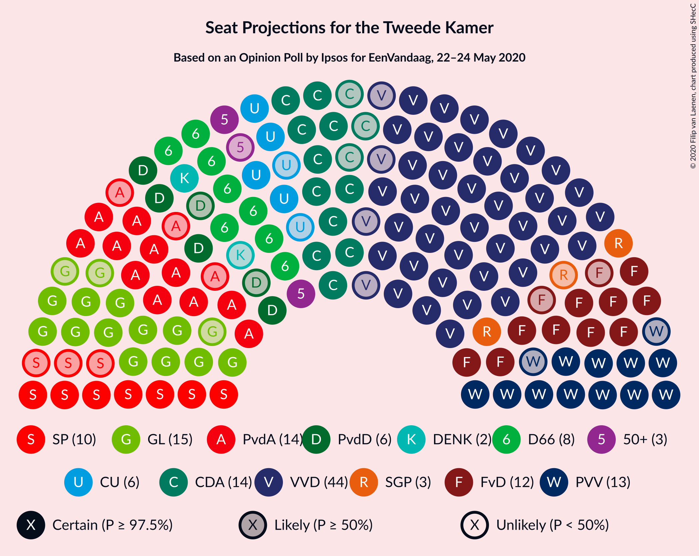

### Confidence Intervals

| Party | Last Result | Median | 80% Confidence Interval | 90% Confidence Interval | 95% Confidence Interval | 99% Confidence Interval |
|:-----:|:-----------:|:------:|:-----------------------:|:-----------------------:|:-----------------------:|:-----------------------:|
| <a href="#volkspartij-voor-vrijheid-en-democratie">Volkspartij voor Vrijheid en Democratie</a> | 33 | 44 | 40–47 |40–48 |40–49 |39–50 |
| <a href="#groenlinks">GroenLinks</a> | 14 | 15 | 13–16 |13–17 |12–17 |12–19 |
| <a href="#christen-democratisch-appèl">Christen-Democratisch Appèl</a> | 19 | 14 | 12–15 |12–15 |11–15 |10–17 |
| <a href="#partij-voor-de-vrijheid">Partij voor de Vrijheid</a> | 20 | 13 | 11–14 |11–15 |11–15 |10–16 |
| <a href="#partij-van-de-arbeid">Partij van de Arbeid</a> | 9 | 14 | 11–15 |11–15 |11–16 |10–16 |
| <a href="#forum-voor-democratie">Forum voor Democratie</a> | 2 | 12 | 11–14 |10–14 |10–14 |9–16 |
| <a href="#democraten-66">Democraten 66</a> | 19 | 9 | 8–11 |8–11 |8–12 |8–13 |
| <a href="#socialistische-partij">Socialistische Partij</a> | 14 | 10 | 8–10 |7–11 |7–11 |7–12 |
| <a href="#christenunie">ChristenUnie</a> | 5 | 6 | 4–7 |4–7 |4–8 |4–9 |
| <a href="#partij-voor-de-dieren">Partij voor de Dieren</a> | 5 | 6 | 5–6 |5–7 |4–7 |3–8 |
| <a href="#staatkundig-gereformeerde-partij">Staatkundig Gereformeerde Partij</a> | 3 | 3 | 2–4 |2–4 |2–4 |1–5 |
| <a href="#50plus">50Plus</a> | 4 | 3 | 2–4 |2–4 |2–4 |1–4 |
| <a href="#denk">DENK</a> | 3 | 2 | 2–3 |2–3 |1–3 |1–4 |

### Volkspartij voor Vrijheid en Democratie

*For a full overview of the results for this party, see the [Volkspartij voor Vrijheid en Democratie](party-volkspartijvoorvrijheidendemocratie.html) page.*

| Number of Seats | Probability | Accumulated | Special Marks |
|:---------------:|:-----------:|:-----------:|:-------------:|
| 33 | 0% | 100% | Last Result |
| 34 | 0% | 100% |  |
| 35 | 0% | 100% |  |
| 36 | 0% | 100% |  |
| 37 | 0% | 100% |  |
| 38 | 0.4% | 99.9% |  |
| 39 | 0.4% | 99.5% |  |
| 40 | 28% | 99.1% |  |
| 41 | 1.1% | 71% |  |
| 42 | 3% | 70% |  |
| 43 | 14% | 67% |  |
| 44 | 13% | 53% | Median |
| 45 | 27% | 40% |  |
| 46 | 3% | 13% |  |
| 47 | 4% | 11% |  |
| 48 | 3% | 6% |  |
| 49 | 3% | 4% |  |
| 50 | 0.2% | 0.6% |  |
| 51 | 0.4% | 0.4% |  |
| 52 | 0% | 0% |  |

### GroenLinks

*For a full overview of the results for this party, see the [GroenLinks](party-groenlinks.html) page.*

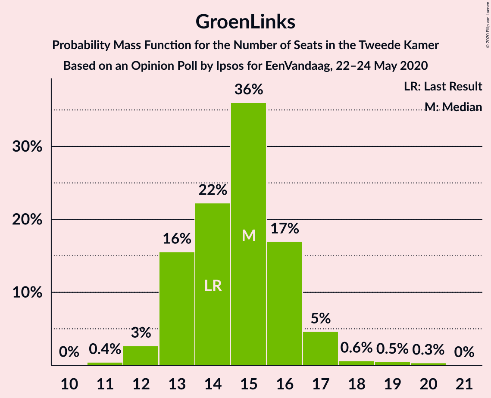

| Number of Seats | Probability | Accumulated | Special Marks |
|:---------------:|:-----------:|:-----------:|:-------------:|
| 11 | 0.4% | 100% |  |
| 12 | 3% | 99.5% |  |
| 13 | 16% | 97% |  |
| 14 | 22% | 81% | Last Result |
| 15 | 36% | 59% | Median |
| 16 | 17% | 23% |  |
| 17 | 5% | 6% |  |
| 18 | 0.6% | 1.4% |  |
| 19 | 0.5% | 0.8% |  |
| 20 | 0.3% | 0.3% |  |
| 21 | 0% | 0% |  |

### Christen-Democratisch Appèl

*For a full overview of the results for this party, see the [Christen-Democratisch Appèl](party-christen-democratischappèl.html) page.*

| Number of Seats | Probability | Accumulated | Special Marks |
|:---------------:|:-----------:|:-----------:|:-------------:|
| 9 | 0.1% | 100% |  |
| 10 | 0.5% | 99.9% |  |
| 11 | 3% | 99.4% |  |
| 12 | 17% | 96% |  |
| 13 | 20% | 79% |  |
| 14 | 12% | 59% | Median |
| 15 | 45% | 47% |  |
| 16 | 0.6% | 2% |  |
| 17 | 1.4% | 2% |  |
| 18 | 0.1% | 0.2% |  |
| 19 | 0% | 0.1% | Last Result |
| 20 | 0% | 0% |  |

### Partij voor de Vrijheid

*For a full overview of the results for this party, see the [Partij voor de Vrijheid](party-partijvoordevrijheid.html) page.*

| Number of Seats | Probability | Accumulated | Special Marks |
|:---------------:|:-----------:|:-----------:|:-------------:|
| 10 | 0.6% | 100% |  |
| 11 | 19% | 99.3% |  |
| 12 | 23% | 80% |  |
| 13 | 44% | 57% | Median |
| 14 | 7% | 14% |  |
| 15 | 4% | 6% |  |
| 16 | 2% | 2% |  |
| 17 | 0.4% | 0.5% |  |
| 18 | 0.1% | 0.1% |  |
| 19 | 0% | 0% |  |
| 20 | 0% | 0% | Last Result |

### Partij van de Arbeid

*For a full overview of the results for this party, see the [Partij van de Arbeid](party-partijvandearbeid.html) page.*

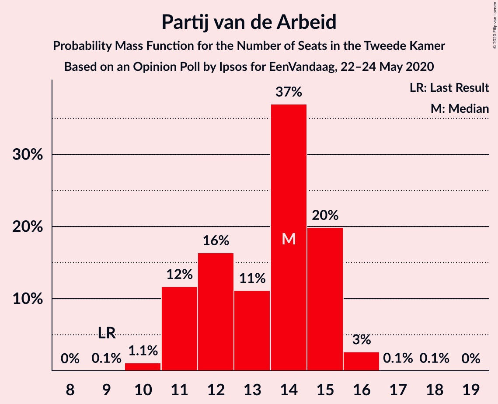

| Number of Seats | Probability | Accumulated | Special Marks |
|:---------------:|:-----------:|:-----------:|:-------------:|
| 9 | 0.1% | 100% | Last Result |
| 10 | 1.1% | 99.9% |  |
| 11 | 12% | 98.8% |  |
| 12 | 16% | 87% |  |
| 13 | 11% | 71% |  |
| 14 | 37% | 60% | Median |
| 15 | 20% | 23% |  |
| 16 | 3% | 3% |  |
| 17 | 0.1% | 0.1% |  |
| 18 | 0.1% | 0.1% |  |
| 19 | 0% | 0% |  |

### Forum voor Democratie

*For a full overview of the results for this party, see the [Forum voor Democratie](party-forumvoordemocratie.html) page.*

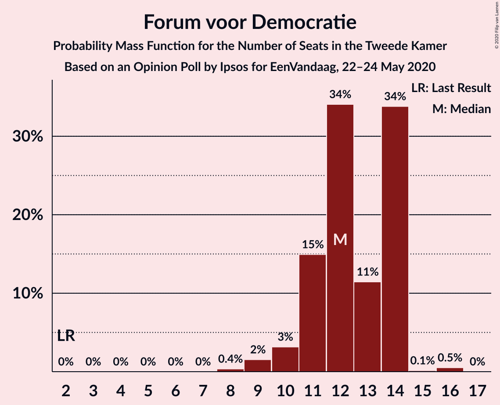

| Number of Seats | Probability | Accumulated | Special Marks |
|:---------------:|:-----------:|:-----------:|:-------------:|
| 2 | 0% | 100% | Last Result |
| 3 | 0% | 100% |  |
| 4 | 0% | 100% |  |
| 5 | 0% | 100% |  |
| 6 | 0% | 100% |  |
| 7 | 0% | 100% |  |
| 8 | 0.4% | 100% |  |
| 9 | 2% | 99.6% |  |
| 10 | 3% | 98% |  |
| 11 | 15% | 95% |  |
| 12 | 34% | 80% | Median |
| 13 | 11% | 46% |  |
| 14 | 34% | 34% |  |
| 15 | 0.1% | 0.7% |  |
| 16 | 0.5% | 0.5% |  |
| 17 | 0% | 0% |  |

### Democraten 66

*For a full overview of the results for this party, see the [Democraten 66](party-democraten66.html) page.*

| Number of Seats | Probability | Accumulated | Special Marks |
|:---------------:|:-----------:|:-----------:|:-------------:|
| 7 | 0.3% | 100% |  |
| 8 | 38% | 99.6% |  |
| 9 | 23% | 61% | Median |
| 10 | 16% | 38% |  |
| 11 | 19% | 22% |  |
| 12 | 3% | 3% |  |
| 13 | 0.5% | 0.7% |  |
| 14 | 0.1% | 0.1% |  |
| 15 | 0% | 0% |  |
| 16 | 0% | 0% |  |
| 17 | 0% | 0% |  |
| 18 | 0% | 0% |  |
| 19 | 0% | 0% | Last Result |

### Socialistische Partij

*For a full overview of the results for this party, see the [Socialistische Partij](party-socialistischepartij.html) page.*

| Number of Seats | Probability | Accumulated | Special Marks |
|:---------------:|:-----------:|:-----------:|:-------------:|
| 6 | 0.2% | 100% |  |
| 7 | 7% | 99.8% |  |
| 8 | 17% | 93% |  |
| 9 | 15% | 76% |  |
| 10 | 53% | 61% | Median |
| 11 | 6% | 8% |  |
| 12 | 1.4% | 2% |  |
| 13 | 0.2% | 0.3% |  |
| 14 | 0% | 0% | Last Result |

### ChristenUnie

*For a full overview of the results for this party, see the [ChristenUnie](party-christenunie.html) page.*

| Number of Seats | Probability | Accumulated | Special Marks |
|:---------------:|:-----------:|:-----------:|:-------------:|
| 3 | 0.2% | 100% |  |
| 4 | 11% | 99.8% |  |
| 5 | 5% | 88% | Last Result |
| 6 | 67% | 83% | Median |
| 7 | 13% | 17% |  |
| 8 | 3% | 4% |  |
| 9 | 2% | 2% |  |
| 10 | 0% | 0% |  |

### Partij voor de Dieren

*For a full overview of the results for this party, see the [Partij voor de Dieren](party-partijvoordedieren.html) page.*

| Number of Seats | Probability | Accumulated | Special Marks |
|:---------------:|:-----------:|:-----------:|:-------------:|
| 3 | 0.6% | 100% |  |
| 4 | 4% | 99.4% |  |
| 5 | 43% | 96% | Last Result |
| 6 | 46% | 53% | Median |
| 7 | 6% | 7% |  |
| 8 | 0.9% | 1.0% |  |
| 9 | 0.1% | 0.1% |  |
| 10 | 0% | 0% |  |

### Staatkundig Gereformeerde Partij

*For a full overview of the results for this party, see the [Staatkundig Gereformeerde Partij](party-staatkundiggereformeerdepartij.html) page.*

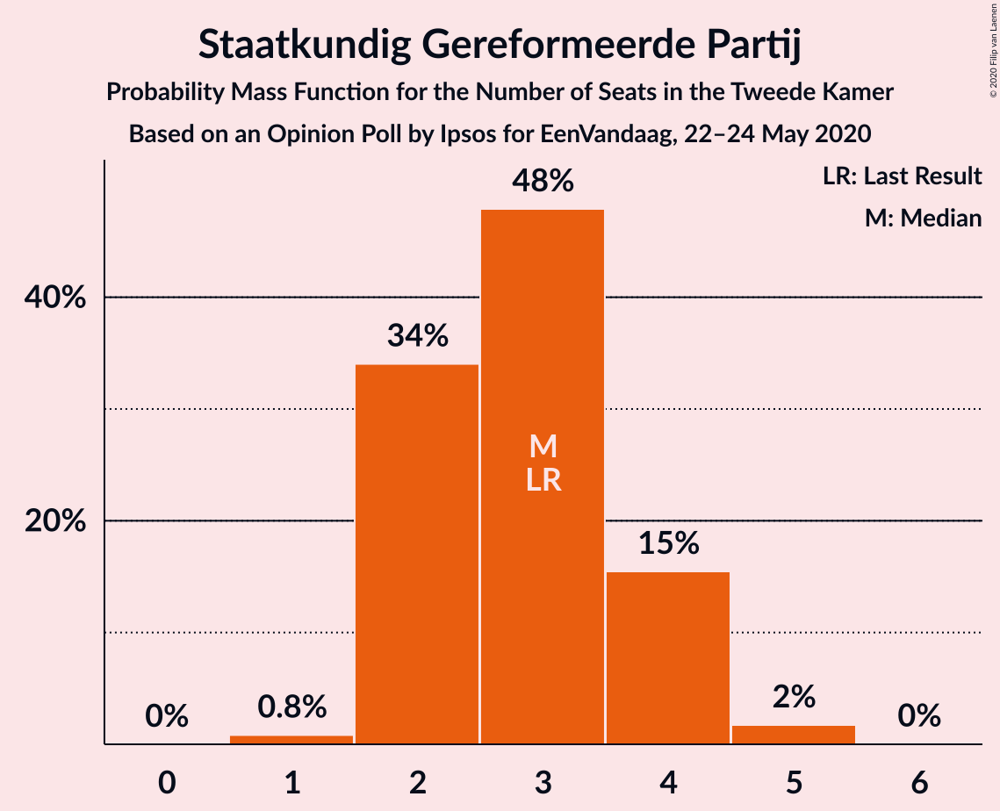

| Number of Seats | Probability | Accumulated | Special Marks |
|:---------------:|:-----------:|:-----------:|:-------------:|
| 1 | 0.8% | 100% |  |
| 2 | 34% | 99.2% |  |
| 3 | 48% | 65% | Last Result, Median |
| 4 | 15% | 17% |  |
| 5 | 2% | 2% |  |
| 6 | 0% | 0% |  |

### 50Plus

*For a full overview of the results for this party, see the [50Plus](party-50plus.html) page.*

| Number of Seats | Probability | Accumulated | Special Marks |
|:---------------:|:-----------:|:-----------:|:-------------:|
| 1 | 1.3% | 100% |  |
| 2 | 20% | 98.7% |  |
| 3 | 67% | 79% | Median |
| 4 | 12% | 12% | Last Result |
| 5 | 0.3% | 0.3% |  |
| 6 | 0% | 0% |  |

### DENK

*For a full overview of the results for this party, see the [DENK](party-denk.html) page.*

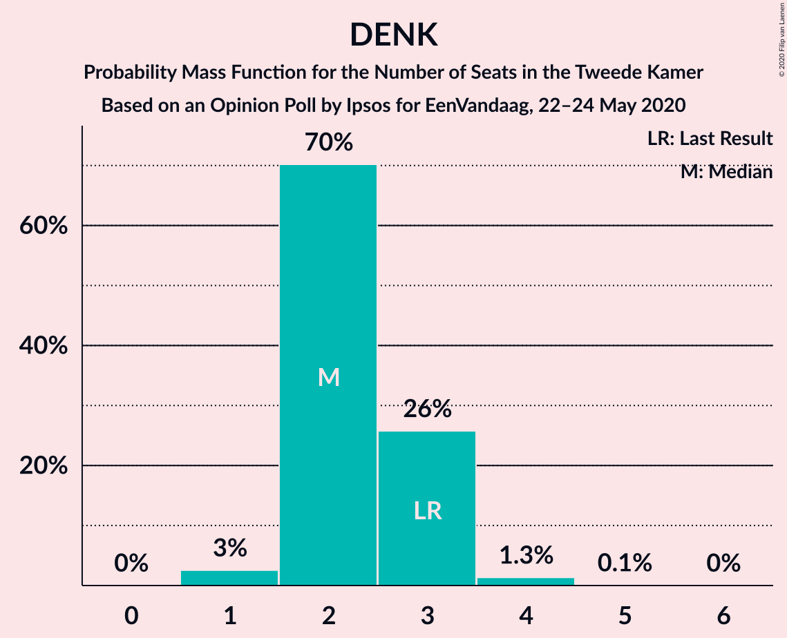

| Number of Seats | Probability | Accumulated | Special Marks |
|:---------------:|:-----------:|:-----------:|:-------------:|
| 1 | 3% | 100% |  |
| 2 | 70% | 97% | Median |
| 3 | 26% | 27% | Last Result |
| 4 | 1.3% | 1.4% |  |
| 5 | 0.1% | 0.1% |  |
| 6 | 0% | 0% |  |

## Coalitions

### Confidence Intervals

| Coalition | Last Result | Median | Majority? | 80% Confidence Interval | 90% Confidence Interval | 95% Confidence Interval | 99% Confidence Interval |
|:---------:|:-----------:|:------:|:---------:|:-----------------------:|:-----------------------:|:-----------------------:|:-----------------------:|
| Volkspartij voor Vrijheid en Democratie – GroenLinks – Christen-Democratisch Appèl – Democraten 66 – ChristenUnie | 90 | 88 | 100% | 84–91 | 84–91 | 84–92 | 82–94 |
| Volkspartij voor Vrijheid en Democratie – Christen-Democratisch Appèl – Partij van de Arbeid – Democraten 66 – ChristenUnie | 85 | 85 | 100% | 83–90 | 83–90 | 83–90 | 80–92 |
| Volkspartij voor Vrijheid en Democratie – Christen-Democratisch Appèl – Partij voor de Vrijheid – Forum voor Democratie – Staatkundig Gereformeerde Partij | 77 | 85 | 100% | 84–87 | 82–88 | 80–89 | 80–90 |
| Volkspartij voor Vrijheid en Democratie – Christen-Democratisch Appèl – Partij voor de Vrijheid – Forum voor Democratie | 74 | 82 | 100% | 80–84 | 79–85 | 78–87 | 77–87 |
| Volkspartij voor Vrijheid en Democratie – Christen-Democratisch Appèl – Forum voor Democratie – Staatkundig Gereformeerde Partij – 50Plus | 61 | 75 | 45% | 73–78 | 71–78 | 70–79 | 69–81 |
| Volkspartij voor Vrijheid en Democratie – Christen-Democratisch Appèl – Democraten 66 – ChristenUnie | 76 | 73 | 7% | 69–75 | 69–76 | 69–78 | 68–79 |
| Volkspartij voor Vrijheid en Democratie – Christen-Democratisch Appèl – Forum voor Democratie – 50Plus | 58 | 72 | 3% | 70–75 | 68–75 | 67–77 | 66–78 |
| Volkspartij voor Vrijheid en Democratie – Christen-Democratisch Appèl – Forum voor Democratie – Staatkundig Gereformeerde Partij | 57 | 72 | 5% | 70–75 | 69–75 | 67–76 | 67–77 |
| Volkspartij voor Vrijheid en Democratie – Christen-Democratisch Appèl – Partij van de Arbeid | 61 | 70 | 0.8% | 67–75 | 66–75 | 66–75 | 64–76 |
| Volkspartij voor Vrijheid en Democratie – Christen-Democratisch Appèl – Partij voor de Vrijheid | 72 | 70 | 0.8% | 68–73 | 67–73 | 66–74 | 65–76 |
| Volkspartij voor Vrijheid en Democratie – Christen-Democratisch Appèl – Forum voor Democratie | 54 | 69 | 0.1% | 67–72 | 65–72 | 65–74 | 63–75 |
| Volkspartij voor Vrijheid en Democratie – Christen-Democratisch Appèl – Democraten 66 | 71 | 66 | 0.1% | 63–69 | 63–71 | 63–72 | 62–73 |
| GroenLinks – Christen-Democratisch Appèl – Partij van de Arbeid – Democraten 66 – Socialistische Partij – ChristenUnie | 80 | 68 | 0% | 63–69 | 63–69 | 62–72 | 61–73 |
| Volkspartij voor Vrijheid en Democratie – Partij van de Arbeid – Democraten 66 | 61 | 66 | 0% | 62–69 | 62–71 | 62–72 | 61–73 |
| GroenLinks – Christen-Democratisch Appèl – Partij van de Arbeid – Democraten 66 – ChristenUnie | 66 | 58 | 0% | 54–59 | 53–61 | 53–62 | 51–62 |
| Volkspartij voor Vrijheid en Democratie – Christen-Democratisch Appèl | 52 | 56 | 0% | 55–60 | 54–61 | 53–61 | 52–63 |
| Volkspartij voor Vrijheid en Democratie – Partij van de Arbeid | 42 | 56 | 0% | 54–60 | 54–61 | 52–61 | 51–63 |
| Christen-Democratisch Appèl – Partij van de Arbeid – Democraten 66 | 47 | 37 | 0% | 34–39 | 34–39 | 33–40 | 32–41 |
| Christen-Democratisch Appèl – Partij van de Arbeid – ChristenUnie | 33 | 34 | 0% | 30–36 | 29–36 | 29–36 | 28–36 |
| Christen-Democratisch Appèl – Partij van de Arbeid | 28 | 27 | 0% | 24–30 | 23–30 | 23–30 | 22–30 |
| Christen-Democratisch Appèl – Democraten 66 | 38 | 23 | 0% | 21–25 | 21–25 | 21–25 | 20–28 |

### Volkspartij voor Vrijheid en Democratie – GroenLinks – Christen-Democratisch Appèl – Democraten 66 – ChristenUnie

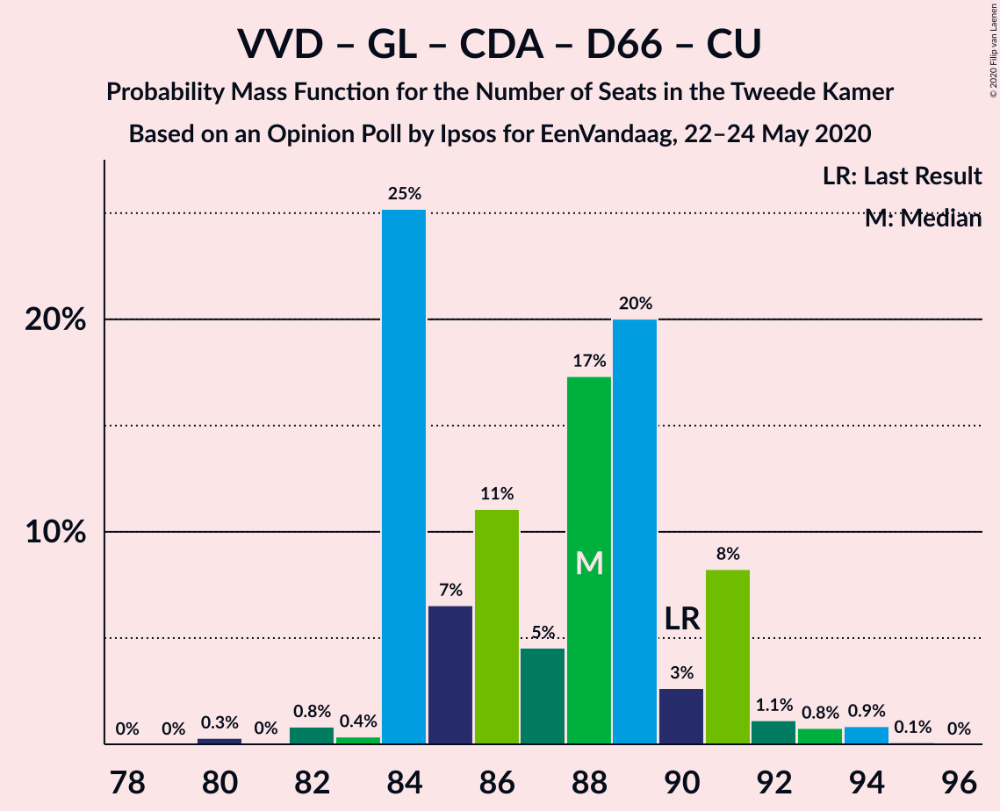

| Number of Seats | Probability | Accumulated | Special Marks |
|:---------------:|:-----------:|:-----------:|:-------------:|
| 80 | 0.3% | 100% |  |
| 81 | 0% | 99.7% |  |
| 82 | 0.8% | 99.7% |  |
| 83 | 0.4% | 98.8% |  |
| 84 | 25% | 98% |  |
| 85 | 7% | 73% |  |
| 86 | 11% | 67% |  |
| 87 | 5% | 56% |  |
| 88 | 17% | 51% | Median |
| 89 | 20% | 34% |  |
| 90 | 3% | 14% | Last Result |
| 91 | 8% | 11% |  |
| 92 | 1.1% | 3% |  |
| 93 | 0.8% | 2% |  |
| 94 | 0.9% | 1.0% |  |
| 95 | 0.1% | 0.1% |  |
| 96 | 0% | 0% |  |

### Volkspartij voor Vrijheid en Democratie – Christen-Democratisch Appèl – Partij van de Arbeid – Democraten 66 – ChristenUnie

| Number of Seats | Probability | Accumulated | Special Marks |
|:---------------:|:-----------:|:-----------:|:-------------:|
| 79 | 0% | 100% |  |
| 80 | 0.7% | 99.9% |  |
| 81 | 0.7% | 99.2% |  |
| 82 | 0.9% | 98.5% |  |
| 83 | 29% | 98% |  |
| 84 | 11% | 69% |  |
| 85 | 17% | 58% | Last Result |
| 86 | 5% | 41% |  |
| 87 | 5% | 36% | Median |
| 88 | 7% | 31% |  |
| 89 | 2% | 25% |  |
| 90 | 22% | 23% |  |
| 91 | 0.5% | 1.1% |  |
| 92 | 0.2% | 0.6% |  |
| 93 | 0.3% | 0.4% |  |
| 94 | 0% | 0% |  |

### Volkspartij voor Vrijheid en Democratie – Christen-Democratisch Appèl – Partij voor de Vrijheid – Forum voor Democratie – Staatkundig Gereformeerde Partij

| Number of Seats | Probability | Accumulated | Special Marks |
|:---------------:|:-----------:|:-----------:|:-------------:|
| 77 | 0% | 100% | Last Result |
| 78 | 0.2% | 100% |  |
| 79 | 0.1% | 99.8% |  |
| 80 | 2% | 99.6% |  |
| 81 | 0.9% | 97% |  |
| 82 | 3% | 96% |  |
| 83 | 1.4% | 93% |  |
| 84 | 16% | 92% |  |
| 85 | 45% | 76% |  |
| 86 | 9% | 31% | Median |
| 87 | 16% | 22% |  |
| 88 | 1.4% | 5% |  |
| 89 | 2% | 4% |  |
| 90 | 1.4% | 2% |  |
| 91 | 0.2% | 0.3% |  |
| 92 | 0.1% | 0.1% |  |
| 93 | 0% | 0.1% |  |
| 94 | 0% | 0% |  |

### Volkspartij voor Vrijheid en Democratie – Christen-Democratisch Appèl – Partij voor de Vrijheid – Forum voor Democratie

| Number of Seats | Probability | Accumulated | Special Marks |
|:---------------:|:-----------:|:-----------:|:-------------:|
| 74 | 0% | 100% | Last Result |
| 75 | 0% | 100% |  |
| 76 | 0.2% | 100% | Majority |
| 77 | 2% | 99.8% |  |
| 78 | 3% | 98% |  |
| 79 | 2% | 95% |  |
| 80 | 12% | 94% |  |
| 81 | 7% | 82% |  |
| 82 | 27% | 75% |  |
| 83 | 25% | 48% | Median |
| 84 | 15% | 24% |  |
| 85 | 4% | 8% |  |
| 86 | 0.6% | 4% |  |
| 87 | 3% | 4% |  |
| 88 | 0.3% | 0.4% |  |
| 89 | 0.1% | 0.2% |  |
| 90 | 0% | 0.1% |  |
| 91 | 0% | 0.1% |  |
| 92 | 0% | 0% |  |

### Volkspartij voor Vrijheid en Democratie – Christen-Democratisch Appèl – Forum voor Democratie – Staatkundig Gereformeerde Partij – 50Plus

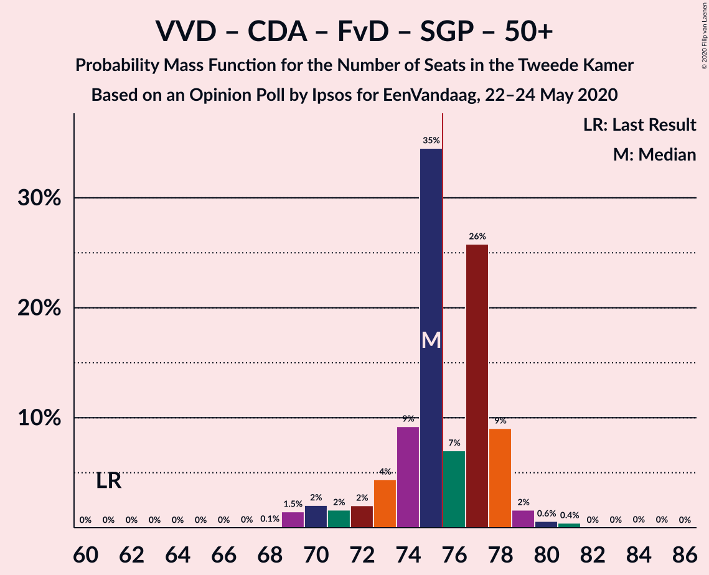

| Number of Seats | Probability | Accumulated | Special Marks |
|:---------------:|:-----------:|:-----------:|:-------------:|
| 61 | 0% | 100% | Last Result |
| 62 | 0% | 100% |  |
| 63 | 0% | 100% |  |
| 64 | 0% | 100% |  |
| 65 | 0% | 100% |  |
| 66 | 0% | 100% |  |
| 67 | 0% | 100% |  |
| 68 | 0.1% | 100% |  |
| 69 | 1.5% | 99.8% |  |
| 70 | 2% | 98% |  |
| 71 | 2% | 96% |  |
| 72 | 2% | 95% |  |
| 73 | 4% | 93% |  |
| 74 | 9% | 88% |  |
| 75 | 35% | 79% |  |
| 76 | 7% | 45% | Median, Majority |
| 77 | 26% | 38% |  |
| 78 | 9% | 12% |  |
| 79 | 2% | 3% |  |
| 80 | 0.6% | 1.1% |  |
| 81 | 0.4% | 0.5% |  |
| 82 | 0% | 0.1% |  |
| 83 | 0% | 0.1% |  |
| 84 | 0% | 0.1% |  |
| 85 | 0% | 0% |  |

### Volkspartij voor Vrijheid en Democratie – Christen-Democratisch Appèl – Democraten 66 – ChristenUnie

| Number of Seats | Probability | Accumulated | Special Marks |
|:---------------:|:-----------:|:-----------:|:-------------:|
| 64 | 0.1% | 100% |  |
| 65 | 0% | 99.9% |  |
| 66 | 0% | 99.9% |  |
| 67 | 0.3% | 99.9% |  |
| 68 | 0.8% | 99.6% |  |
| 69 | 25% | 98.8% |  |
| 70 | 9% | 74% |  |
| 71 | 2% | 65% |  |
| 72 | 13% | 63% |  |
| 73 | 12% | 50% | Median |
| 74 | 3% | 38% |  |
| 75 | 28% | 35% |  |
| 76 | 2% | 7% | Last Result, Majority |
| 77 | 0.7% | 5% |  |
| 78 | 4% | 4% |  |
| 79 | 0.2% | 0.6% |  |
| 80 | 0.2% | 0.4% |  |
| 81 | 0.2% | 0.2% |  |
| 82 | 0% | 0% |  |

### Volkspartij voor Vrijheid en Democratie – Christen-Democratisch Appèl – Forum voor Democratie – 50Plus

| Number of Seats | Probability | Accumulated | Special Marks |
|:---------------:|:-----------:|:-----------:|:-------------:|
| 58 | 0% | 100% | Last Result |
| 59 | 0% | 100% |  |
| 60 | 0% | 100% |  |
| 61 | 0% | 100% |  |
| 62 | 0% | 100% |  |
| 63 | 0% | 100% |  |
| 64 | 0% | 100% |  |
| 65 | 0.1% | 100% |  |
| 66 | 0.5% | 99.9% |  |
| 67 | 3% | 99.4% |  |
| 68 | 2% | 96% |  |
| 69 | 2% | 95% |  |
| 70 | 11% | 93% |  |
| 71 | 2% | 82% |  |
| 72 | 38% | 80% |  |
| 73 | 4% | 42% | Median |
| 74 | 5% | 38% |  |
| 75 | 29% | 33% |  |
| 76 | 0.5% | 3% | Majority |
| 77 | 2% | 3% |  |
| 78 | 0.7% | 0.8% |  |
| 79 | 0% | 0.1% |  |
| 80 | 0% | 0.1% |  |
| 81 | 0% | 0.1% |  |
| 82 | 0% | 0% |  |

### Volkspartij voor Vrijheid en Democratie – Christen-Democratisch Appèl – Forum voor Democratie – Staatkundig Gereformeerde Partij

| Number of Seats | Probability | Accumulated | Special Marks |
|:---------------:|:-----------:|:-----------:|:-------------:|
| 57 | 0% | 100% | Last Result |
| 58 | 0% | 100% |  |
| 59 | 0% | 100% |  |
| 60 | 0% | 100% |  |
| 61 | 0% | 100% |  |
| 62 | 0% | 100% |  |
| 63 | 0% | 100% |  |
| 64 | 0% | 100% |  |
| 65 | 0.1% | 100% |  |
| 66 | 0.1% | 99.9% |  |
| 67 | 3% | 99.7% |  |
| 68 | 0.7% | 96% |  |
| 69 | 2% | 96% |  |
| 70 | 4% | 94% |  |
| 71 | 14% | 90% |  |
| 72 | 31% | 76% |  |
| 73 | 5% | 45% | Median |
| 74 | 24% | 40% |  |
| 75 | 11% | 16% |  |
| 76 | 3% | 5% | Majority |
| 77 | 0.9% | 1.1% |  |
| 78 | 0.1% | 0.2% |  |
| 79 | 0.1% | 0.1% |  |
| 80 | 0% | 0.1% |  |
| 81 | 0% | 0.1% |  |
| 82 | 0% | 0% |  |

### Volkspartij voor Vrijheid en Democratie – Christen-Democratisch Appèl – Partij van de Arbeid

| Number of Seats | Probability | Accumulated | Special Marks |
|:---------------:|:-----------:|:-----------:|:-------------:|
| 61 | 0% | 100% | Last Result |
| 62 | 0% | 100% |  |
| 63 | 0.2% | 100% |  |
| 64 | 0.4% | 99.8% |  |
| 65 | 0.6% | 99.3% |  |
| 66 | 7% | 98.7% |  |
| 67 | 2% | 92% |  |
| 68 | 2% | 90% |  |
| 69 | 33% | 88% |  |
| 70 | 18% | 55% |  |
| 71 | 5% | 37% |  |
| 72 | 3% | 32% | Median |
| 73 | 9% | 29% |  |
| 74 | 0.7% | 20% |  |
| 75 | 19% | 20% |  |
| 76 | 0.7% | 0.8% | Majority |
| 77 | 0.1% | 0.2% |  |
| 78 | 0% | 0% |  |

### Volkspartij voor Vrijheid en Democratie – Christen-Democratisch Appèl – Partij voor de Vrijheid

| Number of Seats | Probability | Accumulated | Special Marks |
|:---------------:|:-----------:|:-----------:|:-------------:|
| 64 | 0.1% | 100% |  |
| 65 | 1.2% | 99.9% |  |
| 66 | 1.2% | 98.7% |  |
| 67 | 3% | 97% |  |
| 68 | 34% | 94% |  |
| 69 | 9% | 60% |  |
| 70 | 10% | 51% |  |
| 71 | 22% | 42% | Median |
| 72 | 8% | 19% | Last Result |
| 73 | 8% | 11% |  |
| 74 | 1.4% | 4% |  |
| 75 | 1.3% | 2% |  |
| 76 | 0.6% | 0.8% | Majority |
| 77 | 0.1% | 0.2% |  |
| 78 | 0% | 0.1% |  |
| 79 | 0% | 0% |  |

### Volkspartij voor Vrijheid en Democratie – Christen-Democratisch Appèl – Forum voor Democratie

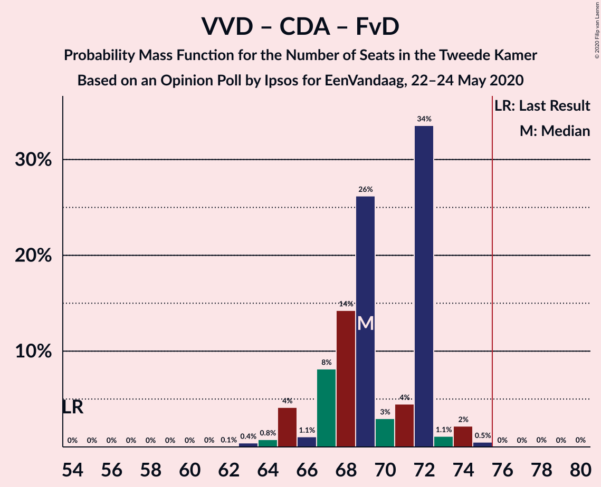

| Number of Seats | Probability | Accumulated | Special Marks |
|:---------------:|:-----------:|:-----------:|:-------------:|
| 54 | 0% | 100% | Last Result |
| 55 | 0% | 100% |  |
| 56 | 0% | 100% |  |
| 57 | 0% | 100% |  |
| 58 | 0% | 100% |  |
| 59 | 0% | 100% |  |
| 60 | 0% | 100% |  |
| 61 | 0% | 100% |  |
| 62 | 0.1% | 100% |  |
| 63 | 0.4% | 99.9% |  |
| 64 | 0.8% | 99.5% |  |
| 65 | 4% | 98.7% |  |
| 66 | 1.1% | 95% |  |
| 67 | 8% | 94% |  |
| 68 | 14% | 85% |  |
| 69 | 26% | 71% |  |
| 70 | 3% | 45% | Median |
| 71 | 4% | 42% |  |
| 72 | 34% | 37% |  |
| 73 | 1.1% | 4% |  |
| 74 | 2% | 3% |  |
| 75 | 0.5% | 0.6% |  |
| 76 | 0% | 0.1% | Majority |
| 77 | 0% | 0.1% |  |
| 78 | 0% | 0.1% |  |
| 79 | 0% | 0% |  |

### Volkspartij voor Vrijheid en Democratie – Christen-Democratisch Appèl – Democraten 66

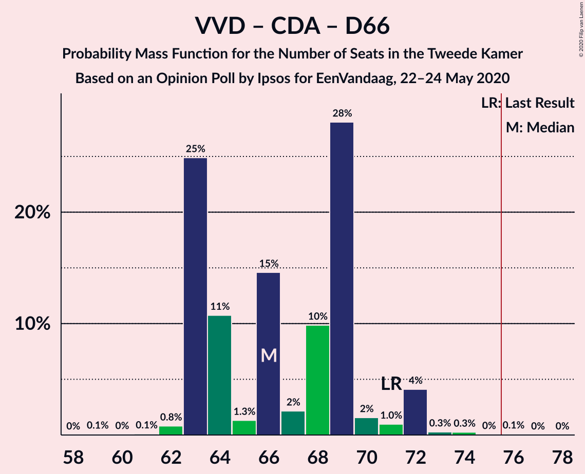

| Number of Seats | Probability | Accumulated | Special Marks |
|:---------------:|:-----------:|:-----------:|:-------------:|
| 59 | 0.1% | 100% |  |
| 60 | 0% | 99.9% |  |
| 61 | 0.1% | 99.9% |  |
| 62 | 0.8% | 99.8% |  |
| 63 | 25% | 99.0% |  |
| 64 | 11% | 74% |  |
| 65 | 1.3% | 63% |  |
| 66 | 15% | 62% |  |
| 67 | 2% | 47% | Median |
| 68 | 10% | 45% |  |
| 69 | 28% | 35% |  |
| 70 | 2% | 7% |  |
| 71 | 1.0% | 6% | Last Result |
| 72 | 4% | 5% |  |
| 73 | 0.3% | 0.7% |  |
| 74 | 0.3% | 0.4% |  |
| 75 | 0% | 0.1% |  |
| 76 | 0.1% | 0.1% | Majority |
| 77 | 0% | 0% |  |

### GroenLinks – Christen-Democratisch Appèl – Partij van de Arbeid – Democraten 66 – Socialistische Partij – ChristenUnie

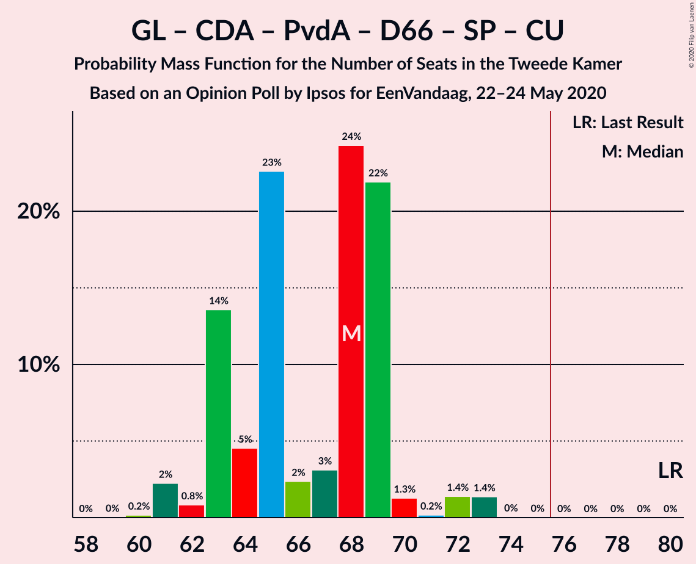

| Number of Seats | Probability | Accumulated | Special Marks |
|:---------------:|:-----------:|:-----------:|:-------------:|
| 60 | 0.2% | 100% |  |
| 61 | 2% | 99.8% |  |
| 62 | 0.8% | 98% |  |
| 63 | 14% | 97% |  |
| 64 | 5% | 83% |  |
| 65 | 23% | 79% |  |
| 66 | 2% | 56% |  |
| 67 | 3% | 54% |  |
| 68 | 24% | 51% | Median |
| 69 | 22% | 26% |  |
| 70 | 1.3% | 4% |  |
| 71 | 0.2% | 3% |  |
| 72 | 1.4% | 3% |  |
| 73 | 1.4% | 1.4% |  |
| 74 | 0% | 0.1% |  |
| 75 | 0% | 0% |  |
| 76 | 0% | 0% | Majority |
| 77 | 0% | 0% |  |
| 78 | 0% | 0% |  |
| 79 | 0% | 0% |  |
| 80 | 0% | 0% | Last Result |

### Volkspartij voor Vrijheid en Democratie – Partij van de Arbeid – Democraten 66

| Number of Seats | Probability | Accumulated | Special Marks |
|:---------------:|:-----------:|:-----------:|:-------------:|
| 59 | 0% | 100% |  |
| 60 | 0.2% | 99.9% |  |
| 61 | 0.4% | 99.7% | Last Result |
| 62 | 26% | 99.4% |  |
| 63 | 1.0% | 73% |  |
| 64 | 1.1% | 72% |  |
| 65 | 14% | 71% |  |
| 66 | 9% | 57% |  |
| 67 | 12% | 48% | Median |
| 68 | 6% | 36% |  |
| 69 | 22% | 29% |  |
| 70 | 2% | 7% |  |
| 71 | 1.2% | 5% |  |
| 72 | 4% | 4% |  |
| 73 | 0.4% | 0.6% |  |
| 74 | 0.2% | 0.2% |  |
| 75 | 0% | 0% |  |

### GroenLinks – Christen-Democratisch Appèl – Partij van de Arbeid – Democraten 66 – ChristenUnie

| Number of Seats | Probability | Accumulated | Special Marks |
|:---------------:|:-----------:|:-----------:|:-------------:|
| 50 | 0% | 100% |  |
| 51 | 2% | 99.9% |  |
| 52 | 0.3% | 98% |  |
| 53 | 7% | 98% |  |
| 54 | 8% | 91% |  |
| 55 | 4% | 82% |  |
| 56 | 8% | 78% |  |
| 57 | 16% | 70% |  |
| 58 | 28% | 54% | Median |
| 59 | 19% | 26% |  |
| 60 | 2% | 7% |  |
| 61 | 3% | 5% |  |
| 62 | 2% | 3% |  |
| 63 | 0.3% | 0.4% |  |
| 64 | 0% | 0.1% |  |
| 65 | 0.1% | 0.1% |  |
| 66 | 0% | 0% | Last Result |

### Volkspartij voor Vrijheid en Democratie – Christen-Democratisch Appèl

| Number of Seats | Probability | Accumulated | Special Marks |
|:---------------:|:-----------:|:-----------:|:-------------:|
| 51 | 0.4% | 100% |  |
| 52 | 0.4% | 99.6% | Last Result |
| 53 | 2% | 99.2% |  |
| 54 | 4% | 97% |  |
| 55 | 30% | 93% |  |
| 56 | 15% | 63% |  |
| 57 | 4% | 49% |  |
| 58 | 12% | 45% | Median |
| 59 | 0.9% | 33% |  |
| 60 | 26% | 32% |  |
| 61 | 5% | 6% |  |
| 62 | 0.2% | 1.0% |  |
| 63 | 0.5% | 0.8% |  |
| 64 | 0.2% | 0.3% |  |
| 65 | 0% | 0.1% |  |
| 66 | 0% | 0% |  |

### Volkspartij voor Vrijheid en Democratie – Partij van de Arbeid

| Number of Seats | Probability | Accumulated | Special Marks |
|:---------------:|:-----------:|:-----------:|:-------------:|
| 42 | 0% | 100% | Last Result |
| 43 | 0% | 100% |  |
| 44 | 0% | 100% |  |
| 45 | 0% | 100% |  |
| 46 | 0% | 100% |  |
| 47 | 0% | 100% |  |
| 48 | 0% | 100% |  |
| 49 | 0% | 100% |  |
| 50 | 0.3% | 100% |  |
| 51 | 0.5% | 99.7% |  |
| 52 | 2% | 99.2% |  |
| 53 | 0.7% | 97% |  |
| 54 | 31% | 97% |  |
| 55 | 2% | 65% |  |
| 56 | 14% | 63% |  |
| 57 | 12% | 49% |  |
| 58 | 3% | 37% | Median |
| 59 | 5% | 34% |  |
| 60 | 23% | 29% |  |
| 61 | 5% | 6% |  |
| 62 | 0.4% | 1.1% |  |
| 63 | 0.3% | 0.7% |  |
| 64 | 0.4% | 0.4% |  |
| 65 | 0% | 0% |  |

### Christen-Democratisch Appèl – Partij van de Arbeid – Democraten 66

| Number of Seats | Probability | Accumulated | Special Marks |
|:---------------:|:-----------:|:-----------:|:-------------:|
| 31 | 0.2% | 100% |  |
| 32 | 2% | 99.8% |  |
| 33 | 1.2% | 98% |  |
| 34 | 15% | 97% |  |
| 35 | 18% | 82% |  |
| 36 | 4% | 64% |  |
| 37 | 34% | 60% | Median |
| 38 | 4% | 26% |  |
| 39 | 19% | 22% |  |
| 40 | 2% | 3% |  |
| 41 | 0.4% | 0.7% |  |
| 42 | 0.2% | 0.3% |  |
| 43 | 0% | 0.1% |  |
| 44 | 0% | 0.1% |  |
| 45 | 0% | 0% |  |
| 46 | 0% | 0% |  |
| 47 | 0% | 0% | Last Result |

### Christen-Democratisch Appèl – Partij van de Arbeid – ChristenUnie

| Number of Seats | Probability | Accumulated | Special Marks |
|:---------------:|:-----------:|:-----------:|:-------------:|
| 26 | 0.1% | 100% |  |
| 27 | 0.1% | 99.9% |  |
| 28 | 2% | 99.8% |  |
| 29 | 6% | 98% |  |
| 30 | 12% | 91% |  |
| 31 | 9% | 79% |  |
| 32 | 6% | 70% |  |
| 33 | 12% | 64% | Last Result |
| 34 | 4% | 52% | Median |
| 35 | 28% | 47% |  |
| 36 | 19% | 19% |  |
| 37 | 0.2% | 0.4% |  |
| 38 | 0.1% | 0.2% |  |
| 39 | 0% | 0.1% |  |
| 40 | 0% | 0% |  |

### Christen-Democratisch Appèl – Partij van de Arbeid

| Number of Seats | Probability | Accumulated | Special Marks |
|:---------------:|:-----------:|:-----------:|:-------------:|
| 20 | 0.1% | 100% |  |
| 21 | 0.1% | 99.9% |  |
| 22 | 0.4% | 99.8% |  |
| 23 | 7% | 99.5% |  |
| 24 | 8% | 93% |  |
| 25 | 10% | 85% |  |
| 26 | 16% | 75% |  |
| 27 | 10% | 59% |  |
| 28 | 5% | 50% | Last Result, Median |
| 29 | 25% | 45% |  |
| 30 | 20% | 20% |  |
| 31 | 0.2% | 0.3% |  |
| 32 | 0.1% | 0.1% |  |
| 33 | 0% | 0.1% |  |
| 34 | 0% | 0% |  |

### Christen-Democratisch Appèl – Democraten 66

| Number of Seats | Probability | Accumulated | Special Marks |
|:---------------:|:-----------:|:-----------:|:-------------:|
| 18 | 0.1% | 100% |  |
| 19 | 0.1% | 99.9% |  |
| 20 | 0.5% | 99.8% |  |
| 21 | 18% | 99.3% |  |
| 22 | 7% | 81% |  |
| 23 | 36% | 74% | Median |
| 24 | 25% | 37% |  |
| 25 | 10% | 13% |  |
| 26 | 0.6% | 2% |  |
| 27 | 0.9% | 2% |  |
| 28 | 0.8% | 0.9% |  |
| 29 | 0.1% | 0.2% |  |
| 30 | 0.1% | 0.1% |  |
| 31 | 0% | 0% |  |
| 32 | 0% | 0% |  |
| 33 | 0% | 0% |  |
| 34 | 0% | 0% |  |
| 35 | 0% | 0% |  |
| 36 | 0% | 0% |  |
| 37 | 0% | 0% |  |
| 38 | 0% | 0% | Last Result |

## Technical Information

### Opinion Poll

+ **Polling firm:** Ipsos
+ **Commissioner(s):** EenVandaag
+ **Fieldwork period:** 22–24 May 2020

### Calculations

+ **Sample size:** 1048
+ **Simulations done:** 1,048,576
+ **Error estimate:** 3.51%

