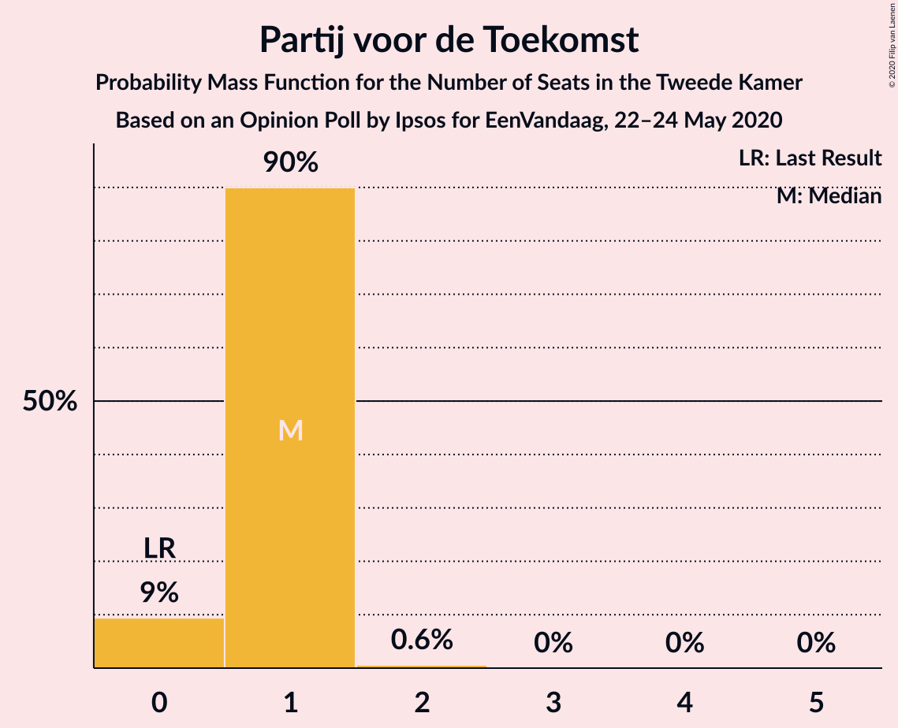
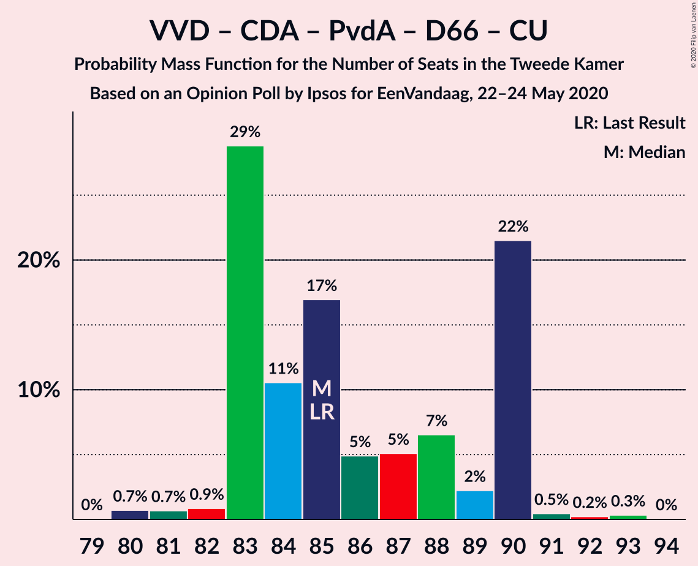
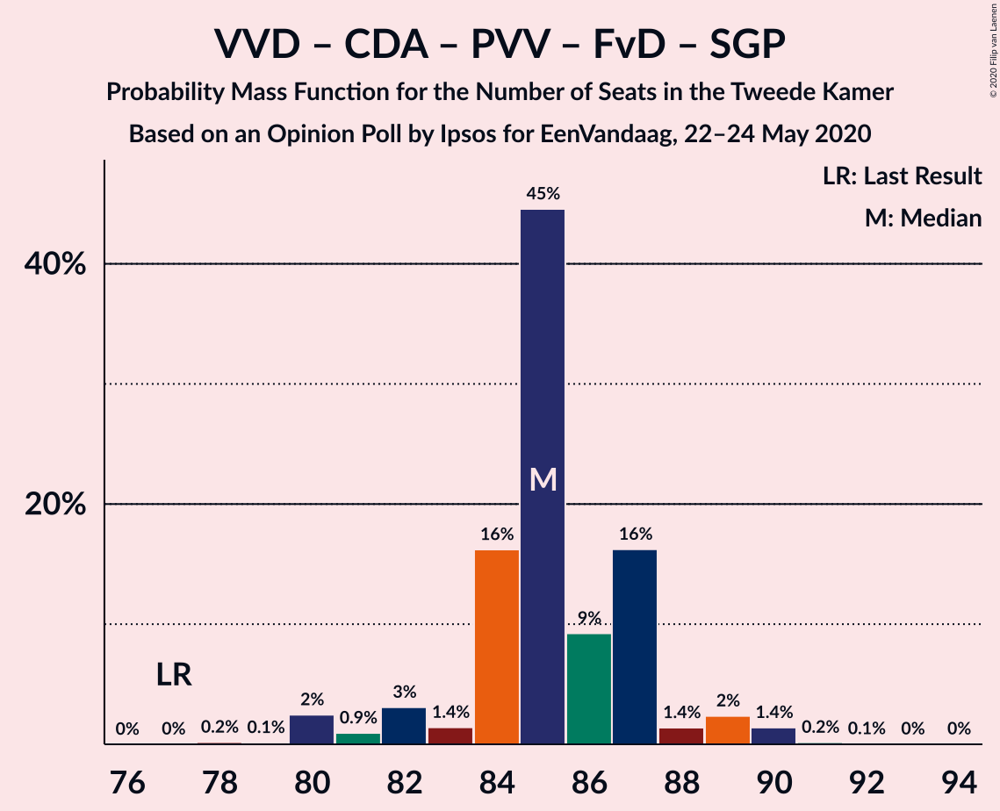
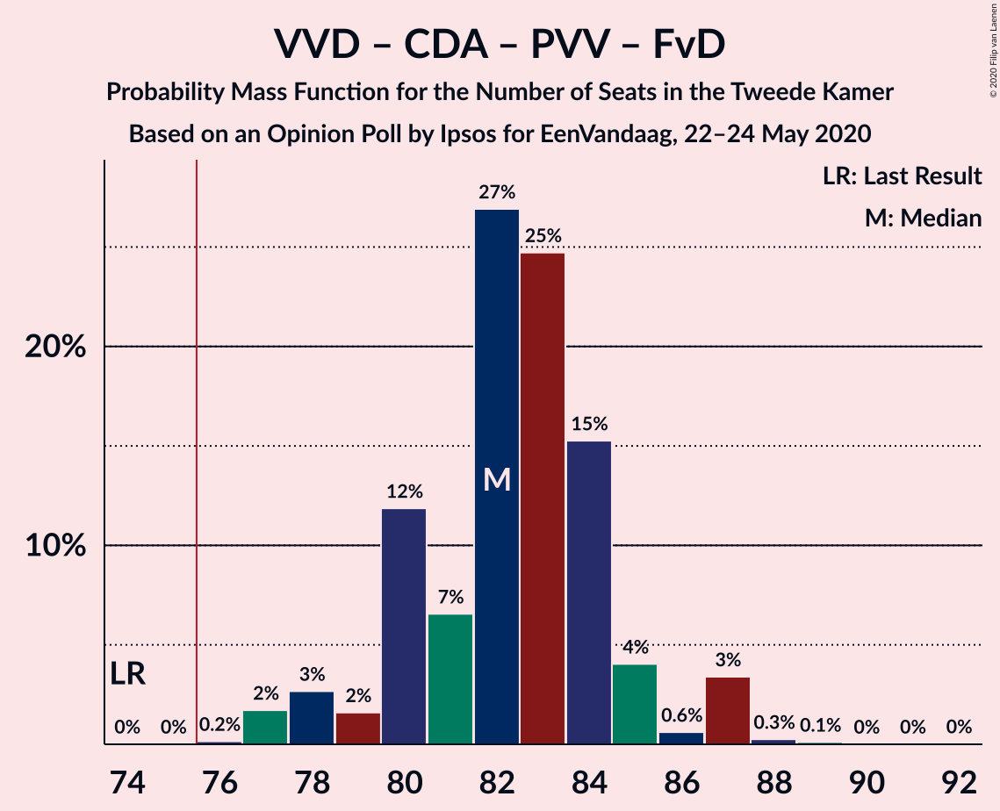
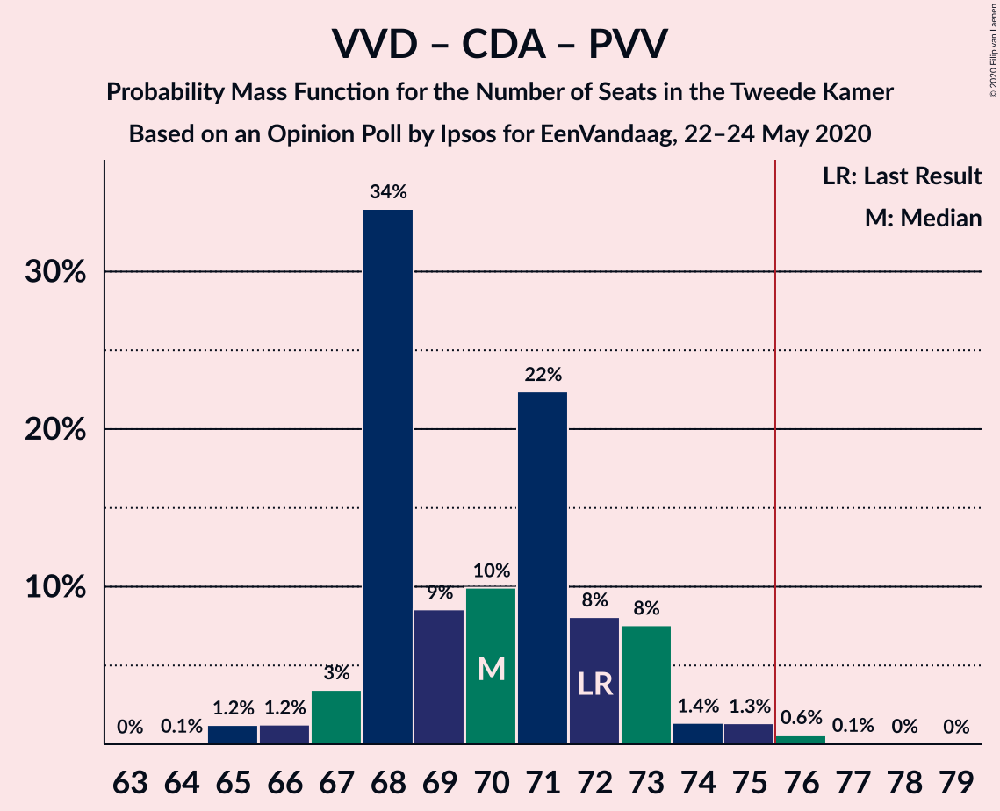
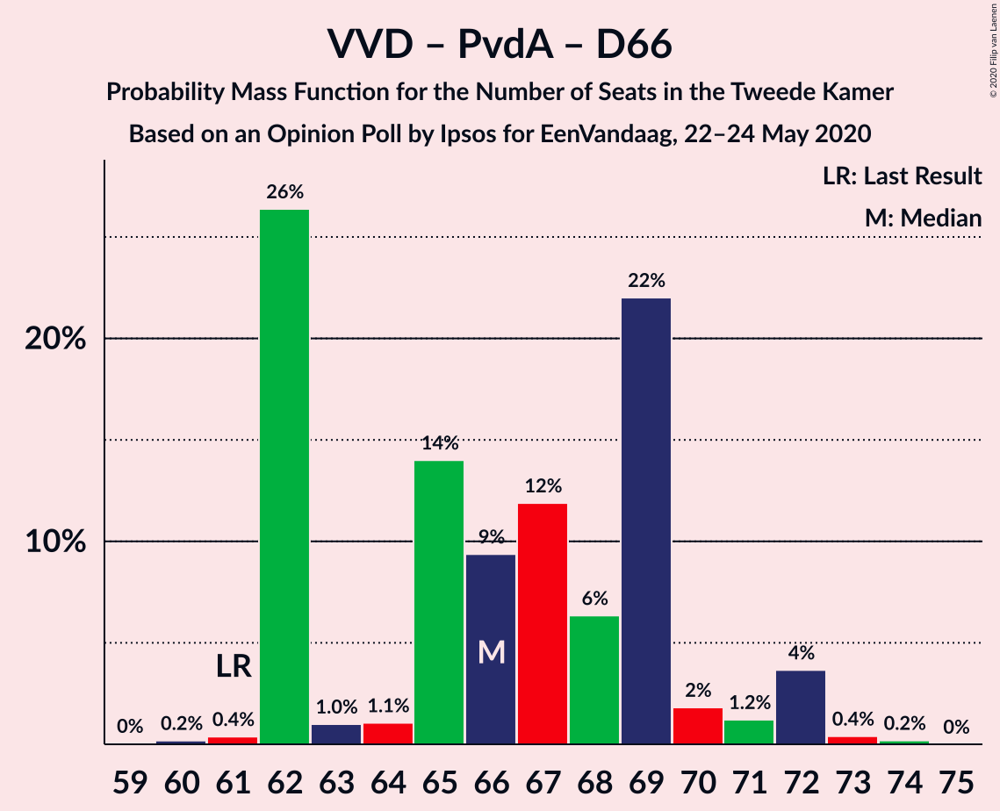
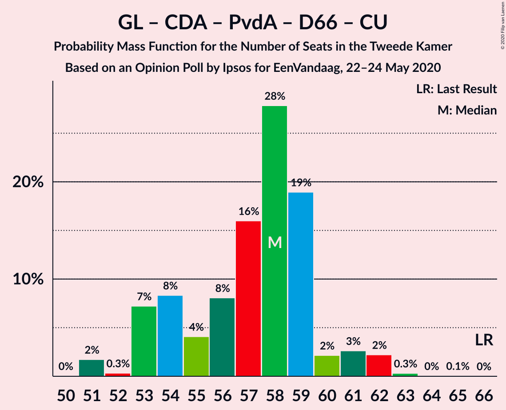

# Opinion Poll by Ipsos for EenVandaag, 22–24 May 2020

<a href="#voting-intentions">Voting Intentions</a> | <a href="#seats">Seats</a> | <a href="#coalitions">Coalitions</a> | <a href="#technical-information">Technical Information</a>

## Voting Intentions

### Confidence Intervals

| Party | Last Result | Poll Result | 80% Confidence Interval | 90% Confidence Interval | 95% Confidence Interval | 99% Confidence Interval |
|:-----:|:-----------:|:-----------:|:-----------------------:|:-----------------------:|:-----------------------:|:-----------------------:|
| Volkspartij voor Vrijheid en Democratie | 21.3% | 29.3% | 27.5–31.1% |27.0–31.6% |26.6–32.1% |25.8–33.0% |
| GroenLinks | 9.1% | 10.0% | 8.9–11.3% |8.6–11.7% |8.3–12.0% |7.8–12.6% |
| Partij voor de Vrijheid | 13.1% | 9.3% | 8.3–10.6% |8.0–11.0% |7.7–11.3% |7.2–11.9% |
| Christen-Democratisch Appèl | 12.4% | 9.3% | 8.3–10.6% |8.0–11.0% |7.7–11.3% |7.2–11.9% |
| Partij van de Arbeid | 5.7% | 8.7% | 7.7–9.9% |7.4–10.2% |7.1–10.5% |6.6–11.2% |
| Forum voor Democratie | 1.8% | 8.0% | 7.0–9.2% |6.7–9.5% |6.5–9.8% |6.1–10.4% |
| Democraten 66 | 12.2% | 6.7% | 5.8–7.8% |5.5–8.1% |5.3–8.4% |4.9–8.9% |
| Socialistische Partij | 9.1% | 6.0% | 5.2–7.1% |4.9–7.4% |4.7–7.6% |4.3–8.2% |
| ChristenUnie | 3.4% | 4.0% | 3.3–4.9% |3.1–5.2% |3.0–5.4% |2.7–5.8% |
| Partij voor de Dieren | 3.2% | 3.3% | 2.7–4.2% |2.5–4.4% |2.4–4.6% |2.1–5.0% |
| Staatkundig Gereformeerde Partij | 2.1% | 2.0% | 1.5–2.7% |1.4–2.9% |1.3–3.0% |1.1–3.4% |
| 50Plus | 3.1% | 1.3% | 1.0–1.9% |0.9–2.1% |0.8–2.2% |0.7–2.5% |
| DENK | 2.1% | 1.3% | 1.0–1.9% |0.9–2.1% |0.8–2.2% |0.7–2.5% |
| Partij voor de Toekomst | 0.0% | 0.7% | 0.4–1.1% |0.4–1.2% |0.3–1.4% |0.2–1.6% |

*Note:* The poll result column reflects the actual value used in the calculations. Published results may vary slightly, and in addition be rounded to fewer digits.

## Seats

### Confidence Intervals

| Party | Last Result | Median | 80% Confidence Interval | 90% Confidence Interval | 95% Confidence Interval | 99% Confidence Interval |
|:-----:|:-----------:|:------:|:-----------------------:|:-----------------------:|:-----------------------:|:-----------------------:|
| <a href="#volkspartij-voor-vrijheid-en-democratie">Volkspartij voor Vrijheid en Democratie</a> | 33 | 44 | 44–46 |43–46 |42–48 |41–49 |
| <a href="#groenlinks">GroenLinks</a> | 14 | 15 | 14–15 |14–16 |14–18 |14–19 |
| <a href="#partij-voor-de-vrijheid">Partij voor de Vrijheid</a> | 20 | 12 | 12–13 |12–13 |12–15 |11–17 |
| <a href="#christen-democratisch-appèl">Christen-Democratisch Appèl</a> | 19 | 12 | 10–12 |10–12 |10–13 |10–17 |
| <a href="#partij-van-de-arbeid">Partij van de Arbeid</a> | 9 | 12 | 12–16 |12–16 |12–16 |11–19 |
| <a href="#forum-voor-democratie">Forum voor Democratie</a> | 2 | 13 | 12–13 |9–13 |9–14 |9–15 |
| <a href="#democraten-66">Democraten 66</a> | 19 | 13 | 9–13 |9–13 |8–13 |7–14 |
| <a href="#socialistische-partij">Socialistische Partij</a> | 14 | 8 | 8–9 |8–10 |8–11 |7–11 |
| <a href="#christenunie">ChristenUnie</a> | 5 | 9 | 4–9 |4–9 |4–9 |4–9 |
| <a href="#partij-voor-de-dieren">Partij voor de Dieren</a> | 5 | 5 | 4–6 |4–7 |4–8 |4–8 |
| <a href="#staatkundig-gereformeerde-partij">Staatkundig Gereformeerde Partij</a> | 3 | 3 | 3–5 |2–5 |2–5 |2–5 |
| <a href="#50plus">50Plus</a> | 4 | 2 | 2–3 |2–3 |2–3 |1–3 |
| <a href="#denk">DENK</a> | 3 | 1 | 1–3 |1–3 |1–3 |0–3 |
| <a href="#partij-voor-de-toekomst">Partij voor de Toekomst</a> | 0 | 1 | 1 |1 |0–1 |0–1 |

### Volkspartij voor Vrijheid en Democratie

*For a full overview of the results for this party, see the [Volkspartij voor Vrijheid en Democratie](party-volkspartijvoorvrijheidendemocratie.html) page.*

| Number of Seats | Probability | Accumulated | Special Marks |
|:---------------:|:-----------:|:-----------:|:-------------:|
| 33 | 0% | 100% | Last Result |
| 34 | 0% | 100% |  |
| 35 | 0% | 100% |  |
| 36 | 0% | 100% |  |
| 37 | 0% | 100% |  |
| 38 | 0% | 100% |  |
| 39 | 0.3% | 100% |  |
| 40 | 0.2% | 99.7% |  |
| 41 | 2% | 99.5% |  |
| 42 | 1.5% | 98% |  |
| 43 | 2% | 96% |  |
| 44 | 77% | 95% | Median |
| 45 | 4% | 17% |  |
| 46 | 11% | 14% |  |
| 47 | 0.1% | 3% |  |
| 48 | 2% | 3% |  |
| 49 | 0.5% | 0.6% |  |
| 50 | 0.1% | 0.1% |  |
| 51 | 0% | 0% |  |

### GroenLinks

*For a full overview of the results for this party, see the [GroenLinks](party-groenlinks.html) page.*

| Number of Seats | Probability | Accumulated | Special Marks |
|:---------------:|:-----------:|:-----------:|:-------------:|
| 12 | 0.1% | 100% |  |
| 13 | 0.2% | 99.9% |  |
| 14 | 14% | 99.7% | Last Result |
| 15 | 78% | 86% | Median |
| 16 | 4% | 8% |  |
| 17 | 0.7% | 4% |  |
| 18 | 1.3% | 3% |  |
| 19 | 2% | 2% |  |
| 20 | 0.2% | 0.2% |  |
| 21 | 0% | 0% |  |

### Partij voor de Vrijheid

*For a full overview of the results for this party, see the [Partij voor de Vrijheid](party-partijvoordevrijheid.html) page.*

| Number of Seats | Probability | Accumulated | Special Marks |
|:---------------:|:-----------:|:-----------:|:-------------:|
| 10 | 0.2% | 100% |  |
| 11 | 2% | 99.8% |  |
| 12 | 68% | 98% | Median |
| 13 | 26% | 30% |  |
| 14 | 2% | 5% |  |
| 15 | 1.1% | 3% |  |
| 16 | 0.6% | 1.4% |  |
| 17 | 0.7% | 0.8% |  |
| 18 | 0.1% | 0.1% |  |
| 19 | 0% | 0% |  |
| 20 | 0% | 0% | Last Result |

### Christen-Democratisch Appèl

*For a full overview of the results for this party, see the [Christen-Democratisch Appèl](party-christen-democratischappèl.html) page.*

| Number of Seats | Probability | Accumulated | Special Marks |
|:---------------:|:-----------:|:-----------:|:-------------:|
| 10 | 10% | 100% |  |
| 11 | 0.8% | 90% |  |
| 12 | 85% | 89% | Median |
| 13 | 2% | 4% |  |
| 14 | 0.1% | 2% |  |
| 15 | 0.4% | 1.5% |  |
| 16 | 0.3% | 1.0% |  |
| 17 | 0.7% | 0.8% |  |
| 18 | 0% | 0% |  |
| 19 | 0% | 0% | Last Result |

### Partij van de Arbeid

*For a full overview of the results for this party, see the [Partij van de Arbeid](party-partijvandearbeid.html) page.*

| Number of Seats | Probability | Accumulated | Special Marks |
|:---------------:|:-----------:|:-----------:|:-------------:|
| 9 | 0.3% | 100% | Last Result |
| 10 | 0.1% | 99.7% |  |
| 11 | 2% | 99.6% |  |
| 12 | 69% | 98% | Median |
| 13 | 0.9% | 28% |  |
| 14 | 15% | 27% |  |
| 15 | 0% | 12% |  |
| 16 | 11% | 12% |  |
| 17 | 0.2% | 0.8% |  |
| 18 | 0.1% | 0.6% |  |
| 19 | 0.5% | 0.5% |  |
| 20 | 0% | 0% |  |

### Forum voor Democratie

*For a full overview of the results for this party, see the [Forum voor Democratie](party-forumvoordemocratie.html) page.*

| Number of Seats | Probability | Accumulated | Special Marks |
|:---------------:|:-----------:|:-----------:|:-------------:|
| 2 | 0% | 100% | Last Result |
| 3 | 0% | 100% |  |
| 4 | 0% | 100% |  |
| 5 | 0% | 100% |  |
| 6 | 0% | 100% |  |
| 7 | 0% | 100% |  |
| 8 | 0% | 100% |  |
| 9 | 5% | 100% |  |
| 10 | 0% | 95% |  |
| 11 | 1.3% | 95% |  |
| 12 | 22% | 93% |  |
| 13 | 69% | 72% | Median |
| 14 | 1.0% | 3% |  |
| 15 | 2% | 2% |  |
| 16 | 0% | 0.1% |  |
| 17 | 0% | 0.1% |  |
| 18 | 0.1% | 0.1% |  |
| 19 | 0% | 0% |  |

### Democraten 66

*For a full overview of the results for this party, see the [Democraten 66](party-democraten66.html) page.*

| Number of Seats | Probability | Accumulated | Special Marks |
|:---------------:|:-----------:|:-----------:|:-------------:|
| 7 | 0.9% | 100% |  |
| 8 | 2% | 99.1% |  |
| 9 | 11% | 97% |  |
| 10 | 4% | 85% |  |
| 11 | 0.1% | 82% |  |
| 12 | 10% | 82% |  |
| 13 | 69% | 71% | Median |
| 14 | 2% | 2% |  |
| 15 | 0% | 0% |  |
| 16 | 0% | 0% |  |
| 17 | 0% | 0% |  |
| 18 | 0% | 0% |  |
| 19 | 0% | 0% | Last Result |

### Socialistische Partij

*For a full overview of the results for this party, see the [Socialistische Partij](party-socialistischepartij.html) page.*

| Number of Seats | Probability | Accumulated | Special Marks |
|:---------------:|:-----------:|:-----------:|:-------------:|
| 5 | 0.1% | 100% |  |
| 6 | 0% | 99.9% |  |
| 7 | 0.4% | 99.9% |  |
| 8 | 80% | 99.5% | Median |
| 9 | 12% | 20% |  |
| 10 | 4% | 8% |  |
| 11 | 4% | 4% |  |
| 12 | 0% | 0% |  |
| 13 | 0% | 0% |  |
| 14 | 0% | 0% | Last Result |

### ChristenUnie

*For a full overview of the results for this party, see the [ChristenUnie](party-christenunie.html) page.*

| Number of Seats | Probability | Accumulated | Special Marks |
|:---------------:|:-----------:|:-----------:|:-------------:|
| 4 | 13% | 100% |  |
| 5 | 15% | 87% | Last Result |
| 6 | 3% | 72% |  |
| 7 | 2% | 69% |  |
| 8 | 0.1% | 68% |  |
| 9 | 67% | 67% | Median |
| 10 | 0% | 0% |  |

### Partij voor de Dieren

*For a full overview of the results for this party, see the [Partij voor de Dieren](party-partijvoordedieren.html) page.*

| Number of Seats | Probability | Accumulated | Special Marks |
|:---------------:|:-----------:|:-----------:|:-------------:|
| 3 | 0.4% | 100% |  |
| 4 | 14% | 99.6% |  |
| 5 | 69% | 85% | Last Result, Median |
| 6 | 11% | 17% |  |
| 7 | 2% | 5% |  |
| 8 | 4% | 4% |  |
| 9 | 0% | 0% |  |

### Staatkundig Gereformeerde Partij

*For a full overview of the results for this party, see the [Staatkundig Gereformeerde Partij](party-staatkundiggereformeerdepartij.html) page.*

| Number of Seats | Probability | Accumulated | Special Marks |
|:---------------:|:-----------:|:-----------:|:-------------:|
| 2 | 7% | 100% |  |
| 3 | 80% | 93% | Last Result, Median |
| 4 | 2% | 13% |  |
| 5 | 11% | 11% |  |
| 6 | 0% | 0.1% |  |
| 7 | 0% | 0% |  |

### 50Plus

*For a full overview of the results for this party, see the [50Plus](party-50plus.html) page.*

| Number of Seats | Probability | Accumulated | Special Marks |
|:---------------:|:-----------:|:-----------:|:-------------:|
| 1 | 1.3% | 100% |  |
| 2 | 77% | 98.7% | Median |
| 3 | 22% | 22% |  |
| 4 | 0% | 0% | Last Result |

### DENK

*For a full overview of the results for this party, see the [DENK](party-denk.html) page.*

| Number of Seats | Probability | Accumulated | Special Marks |
|:---------------:|:-----------:|:-----------:|:-------------:|
| 0 | 0.6% | 100% |  |
| 1 | 70% | 99.4% | Median |
| 2 | 7% | 30% |  |
| 3 | 22% | 22% | Last Result |
| 4 | 0.1% | 0.3% |  |
| 5 | 0.1% | 0.1% |  |
| 6 | 0% | 0% |  |

### Partij voor de Toekomst

*For a full overview of the results for this party, see the [Partij voor de Toekomst](party-partijvoordetoekomst.html) page.*

| Number of Seats | Probability | Accumulated | Special Marks |
|:---------------:|:-----------:|:-----------:|:-------------:|
| 0 | 4% | 100% | Last Result |
| 1 | 96% | 96% | Median |
| 2 | 0.1% | 0.1% |  |
| 3 | 0% | 0% |  |

## Coalitions

### Confidence Intervals

| Coalition | Last Result | Median | Majority? | 80% Confidence Interval | 90% Confidence Interval | 95% Confidence Interval | 99% Confidence Interval |
|:---------:|:-----------:|:------:|:---------:|:-----------------------:|:-----------------------:|:-----------------------:|:-----------------------:|
| Volkspartij voor Vrijheid en Democratie – GroenLinks – Christen-Democratisch Appèl – Democraten 66 – ChristenUnie | 90 | 93 | 100% | 84–93 | 84–93 | 84–93 | 81–94 |
| Volkspartij voor Vrijheid en Democratie – Christen-Democratisch Appèl – Partij van de Arbeid – Democraten 66 – ChristenUnie | 85 | 90 | 100% | 85–90 | 85–90 | 85–90 | 83–91 |
| Volkspartij voor Vrijheid en Democratie – Christen-Democratisch Appèl – Partij voor de Vrijheid – Forum voor Democratie – Staatkundig Gereformeerde Partij | 77 | 84 | 100% | 84–86 | 84–86 | 81–87 | 81–90 |
| Volkspartij voor Vrijheid en Democratie – Christen-Democratisch Appèl – Partij voor de Vrijheid – Forum voor Democratie | 74 | 81 | 100% | 81 | 79–82 | 79–84 | 79–88 |
| Volkspartij voor Vrijheid en Democratie – Christen-Democratisch Appèl – Democraten 66 – ChristenUnie | 76 | 78 | 68% | 69–78 | 69–78 | 69–78 | 67–78 |
| Volkspartij voor Vrijheid en Democratie – Christen-Democratisch Appèl – Forum voor Democratie – Staatkundig Gereformeerde Partij – 50Plus | 61 | 74 | 13% | 74–76 | 72–76 | 70–77 | 70–79 |
| Volkspartij voor Vrijheid en Democratie – Christen-Democratisch Appèl – Forum voor Democratie – Staatkundig Gereformeerde Partij | 57 | 72 | 2% | 71–73 | 70–73 | 68–75 | 68–76 |
| Volkspartij voor Vrijheid en Democratie – Christen-Democratisch Appèl – Forum voor Democratie – 50Plus | 58 | 71 | 0.3% | 71 | 68–71 | 68–74 | 67–75 |
| Volkspartij voor Vrijheid en Democratie – Christen-Democratisch Appèl – Partij van de Arbeid | 61 | 68 | 0.1% | 68–72 | 68–72 | 67–74 | 65–74 |
| Volkspartij voor Vrijheid en Democratie – Christen-Democratisch Appèl – Forum voor Democratie | 54 | 69 | 0.3% | 68–69 | 66–69 | 66–72 | 65–73 |
| Volkspartij voor Vrijheid en Democratie – Christen-Democratisch Appèl – Partij voor de Vrijheid | 72 | 68 | 0.7% | 68–70 | 68–70 | 68–71 | 66–77 |
| Volkspartij voor Vrijheid en Democratie – Partij van de Arbeid – Democraten 66 | 61 | 69 | 0.2% | 69–71 | 67–71 | 67–71 | 62–74 |
| Volkspartij voor Vrijheid en Democratie – Christen-Democratisch Appèl – Democraten 66 | 71 | 69 | 0.1% | 65–69 | 65–69 | 65–69 | 62–72 |
| GroenLinks – Christen-Democratisch Appèl – Partij van de Arbeid – Democraten 66 – Socialistische Partij – ChristenUnie | 80 | 69 | 0.1% | 63–69 | 63–69 | 63–69 | 63–71 |
| Volkspartij voor Vrijheid en Democratie – Partij van de Arbeid | 42 | 56 | 0% | 56–62 | 56–62 | 54–62 | 53–62 |
| GroenLinks – Christen-Democratisch Appèl – Partij van de Arbeid – Democraten 66 – ChristenUnie | 66 | 61 | 0% | 54–61 | 54–61 | 54–61 | 54–62 |
| Volkspartij voor Vrijheid en Democratie – Christen-Democratisch Appèl | 52 | 56 | 0% | 56 | 56–57 | 53–60 | 53–62 |
| Christen-Democratisch Appèl – Partij van de Arbeid – Democraten 66 | 47 | 37 | 0% | 35–38 | 35–38 | 34–38 | 32–40 |
| Christen-Democratisch Appèl – Partij van de Arbeid – ChristenUnie | 33 | 33 | 0% | 30–33 | 30–33 | 30–33 | 29–36 |
| Christen-Democratisch Appèl – Partij van de Arbeid | 28 | 24 | 0% | 24–26 | 24–26 | 24–27 | 24–30 |
| Christen-Democratisch Appèl – Democraten 66 | 38 | 25 | 0% | 19–25 | 19–25 | 19–26 | 19–26 |

### Volkspartij voor Vrijheid en Democratie – GroenLinks – Christen-Democratisch Appèl – Democraten 66 – ChristenUnie

| Number of Seats | Probability | Accumulated | Special Marks |
|:---------------:|:-----------:|:-----------:|:-------------:|
| 81 | 0.5% | 100% |  |
| 82 | 0% | 99.5% |  |
| 83 | 0.4% | 99.5% |  |
| 84 | 11% | 99.1% |  |
| 85 | 0% | 89% |  |
| 86 | 0% | 89% |  |
| 87 | 10% | 88% |  |
| 88 | 5% | 79% |  |
| 89 | 1.4% | 73% |  |
| 90 | 0.8% | 72% | Last Result |
| 91 | 2% | 71% |  |
| 92 | 0.7% | 69% |  |
| 93 | 68% | 68% | Median |
| 94 | 0.2% | 0.5% |  |
| 95 | 0% | 0.4% |  |
| 96 | 0.3% | 0.4% |  |
| 97 | 0% | 0% |  |

### Volkspartij voor Vrijheid en Democratie – Christen-Democratisch Appèl – Partij van de Arbeid – Democraten 66 – ChristenUnie

| Number of Seats | Probability | Accumulated | Special Marks |
|:---------------:|:-----------:|:-----------:|:-------------:|
| 80 | 0.1% | 100% |  |
| 81 | 0.2% | 99.9% |  |
| 82 | 0% | 99.7% |  |
| 83 | 0.3% | 99.7% |  |
| 84 | 0.2% | 99.4% |  |
| 85 | 11% | 99.3% | Last Result |
| 86 | 9% | 88% |  |
| 87 | 10% | 79% |  |
| 88 | 0.3% | 69% |  |
| 89 | 0% | 69% |  |
| 90 | 68% | 69% | Median |
| 91 | 0.9% | 0.9% |  |
| 92 | 0% | 0% |  |

### Volkspartij voor Vrijheid en Democratie – Christen-Democratisch Appèl – Partij voor de Vrijheid – Forum voor Democratie – Staatkundig Gereformeerde Partij

| Number of Seats | Probability | Accumulated | Special Marks |
|:---------------:|:-----------:|:-----------:|:-------------:|
| 77 | 0% | 100% | Last Result |
| 78 | 0% | 100% |  |
| 79 | 0% | 100% |  |
| 80 | 0% | 100% |  |
| 81 | 4% | 100% |  |
| 82 | 0% | 96% |  |
| 83 | 0.1% | 96% |  |
| 84 | 81% | 96% | Median |
| 85 | 0.6% | 15% |  |
| 86 | 11% | 14% |  |
| 87 | 2% | 4% |  |
| 88 | 0% | 2% |  |
| 89 | 0.9% | 2% |  |
| 90 | 0.3% | 0.8% |  |
| 91 | 0.1% | 0.5% |  |
| 92 | 0.1% | 0.4% |  |
| 93 | 0% | 0.3% |  |
| 94 | 0.2% | 0.3% |  |
| 95 | 0% | 0.1% |  |
| 96 | 0% | 0.1% |  |
| 97 | 0% | 0.1% |  |
| 98 | 0% | 0.1% |  |
| 99 | 0.1% | 0.1% |  |
| 100 | 0% | 0% |  |

### Volkspartij voor Vrijheid en Democratie – Christen-Democratisch Appèl – Partij voor de Vrijheid – Forum voor Democratie

| Number of Seats | Probability | Accumulated | Special Marks |
|:---------------:|:-----------:|:-----------:|:-------------:|
| 74 | 0% | 100% | Last Result |
| 75 | 0% | 100% |  |
| 76 | 0% | 100% | Majority |
| 77 | 0% | 100% |  |
| 78 | 0% | 100% |  |
| 79 | 5% | 100% |  |
| 80 | 0% | 95% |  |
| 81 | 90% | 95% | Median |
| 82 | 0.4% | 5% |  |
| 83 | 2% | 5% |  |
| 84 | 0.8% | 3% |  |
| 85 | 0.2% | 2% |  |
| 86 | 0% | 2% |  |
| 87 | 0.7% | 1.5% |  |
| 88 | 0.4% | 0.8% |  |
| 89 | 0% | 0.4% |  |
| 90 | 0.1% | 0.3% |  |
| 91 | 0% | 0.3% |  |
| 92 | 0.2% | 0.3% |  |
| 93 | 0% | 0.1% |  |
| 94 | 0% | 0.1% |  |
| 95 | 0% | 0.1% |  |
| 96 | 0.1% | 0.1% |  |
| 97 | 0% | 0% |  |

### Volkspartij voor Vrijheid en Democratie – Christen-Democratisch Appèl – Democraten 66 – ChristenUnie

| Number of Seats | Probability | Accumulated | Special Marks |
|:---------------:|:-----------:|:-----------:|:-------------:|
| 67 | 0.6% | 100% |  |
| 68 | 0.2% | 99.4% |  |
| 69 | 11% | 99.2% |  |
| 70 | 0.1% | 89% |  |
| 71 | 0.2% | 88% |  |
| 72 | 6% | 88% |  |
| 73 | 10% | 82% |  |
| 74 | 2% | 73% |  |
| 75 | 2% | 70% |  |
| 76 | 0% | 68% | Last Result, Majority |
| 77 | 0.5% | 68% |  |
| 78 | 67% | 68% | Median |
| 79 | 0% | 0.1% |  |
| 80 | 0.1% | 0.1% |  |
| 81 | 0% | 0% |  |

### Volkspartij voor Vrijheid en Democratie – Christen-Democratisch Appèl – Forum voor Democratie – Staatkundig Gereformeerde Partij – 50Plus

| Number of Seats | Probability | Accumulated | Special Marks |
|:---------------:|:-----------:|:-----------:|:-------------:|
| 61 | 0% | 100% | Last Result |
| 62 | 0% | 100% |  |
| 63 | 0% | 100% |  |
| 64 | 0% | 100% |  |
| 65 | 0% | 100% |  |
| 66 | 0% | 100% |  |
| 67 | 0% | 100% |  |
| 68 | 0.1% | 100% |  |
| 69 | 0.2% | 99.9% |  |
| 70 | 3% | 99.7% |  |
| 71 | 0.5% | 96% |  |
| 72 | 2% | 96% |  |
| 73 | 2% | 94% |  |
| 74 | 78% | 91% | Median |
| 75 | 0.2% | 13% |  |
| 76 | 11% | 13% | Majority |
| 77 | 0.5% | 3% |  |
| 78 | 0.2% | 2% |  |
| 79 | 2% | 2% |  |
| 80 | 0.1% | 0.3% |  |
| 81 | 0% | 0.1% |  |
| 82 | 0% | 0.1% |  |
| 83 | 0% | 0.1% |  |
| 84 | 0.1% | 0.1% |  |
| 85 | 0% | 0% |  |

### Volkspartij voor Vrijheid en Democratie – Christen-Democratisch Appèl – Forum voor Democratie – Staatkundig Gereformeerde Partij

| Number of Seats | Probability | Accumulated | Special Marks |
|:---------------:|:-----------:|:-----------:|:-------------:|
| 57 | 0% | 100% | Last Result |
| 58 | 0% | 100% |  |
| 59 | 0% | 100% |  |
| 60 | 0% | 100% |  |
| 61 | 0% | 100% |  |
| 62 | 0% | 100% |  |
| 63 | 0% | 100% |  |
| 64 | 0% | 100% |  |
| 65 | 0% | 100% |  |
| 66 | 0% | 100% |  |
| 67 | 0.1% | 100% |  |
| 68 | 4% | 99.8% |  |
| 69 | 0.5% | 96% |  |
| 70 | 2% | 96% |  |
| 71 | 13% | 94% |  |
| 72 | 68% | 81% | Median |
| 73 | 10% | 13% |  |
| 74 | 0.9% | 4% |  |
| 75 | 0.4% | 3% |  |
| 76 | 2% | 2% | Majority |
| 77 | 0% | 0.3% |  |
| 78 | 0.2% | 0.3% |  |
| 79 | 0% | 0.1% |  |
| 80 | 0% | 0.1% |  |
| 81 | 0% | 0.1% |  |
| 82 | 0% | 0.1% |  |
| 83 | 0.1% | 0.1% |  |
| 84 | 0% | 0% |  |

### Volkspartij voor Vrijheid en Democratie – Christen-Democratisch Appèl – Forum voor Democratie – 50Plus

| Number of Seats | Probability | Accumulated | Special Marks |
|:---------------:|:-----------:|:-----------:|:-------------:|
| 58 | 0% | 100% | Last Result |
| 59 | 0% | 100% |  |
| 60 | 0% | 100% |  |
| 61 | 0% | 100% |  |
| 62 | 0% | 100% |  |
| 63 | 0% | 100% |  |
| 64 | 0.1% | 100% |  |
| 65 | 0% | 99.9% |  |
| 66 | 0.2% | 99.9% |  |
| 67 | 1.4% | 99.7% |  |
| 68 | 3% | 98% |  |
| 69 | 0.5% | 95% |  |
| 70 | 3% | 94% |  |
| 71 | 88% | 92% | Median |
| 72 | 0.3% | 4% |  |
| 73 | 0.1% | 3% |  |
| 74 | 0.8% | 3% |  |
| 75 | 2% | 2% |  |
| 76 | 0.1% | 0.3% | Majority |
| 77 | 0% | 0.3% |  |
| 78 | 0.1% | 0.3% |  |
| 79 | 0% | 0.1% |  |
| 80 | 0% | 0.1% |  |
| 81 | 0.1% | 0.1% |  |
| 82 | 0% | 0% |  |

### Volkspartij voor Vrijheid en Democratie – Christen-Democratisch Appèl – Partij van de Arbeid

| Number of Seats | Probability | Accumulated | Special Marks |
|:---------------:|:-----------:|:-----------:|:-------------:|
| 61 | 0% | 100% | Last Result |
| 62 | 0% | 100% |  |
| 63 | 0% | 100% |  |
| 64 | 0% | 100% |  |
| 65 | 2% | 100% |  |
| 66 | 0.1% | 98% |  |
| 67 | 2% | 98% |  |
| 68 | 67% | 96% | Median |
| 69 | 0% | 29% |  |
| 70 | 10% | 29% |  |
| 71 | 4% | 19% |  |
| 72 | 12% | 15% |  |
| 73 | 0.5% | 3% |  |
| 74 | 3% | 3% |  |
| 75 | 0.1% | 0.2% |  |
| 76 | 0% | 0.1% | Majority |
| 77 | 0.1% | 0.1% |  |
| 78 | 0% | 0% |  |

### Volkspartij voor Vrijheid en Democratie – Christen-Democratisch Appèl – Forum voor Democratie

| Number of Seats | Probability | Accumulated | Special Marks |
|:---------------:|:-----------:|:-----------:|:-------------:|
| 54 | 0% | 100% | Last Result |
| 55 | 0% | 100% |  |
| 56 | 0% | 100% |  |
| 57 | 0% | 100% |  |
| 58 | 0% | 100% |  |
| 59 | 0% | 100% |  |
| 60 | 0% | 100% |  |
| 61 | 0% | 100% |  |
| 62 | 0% | 100% |  |
| 63 | 0.1% | 100% |  |
| 64 | 0% | 99.9% |  |
| 65 | 2% | 99.9% |  |
| 66 | 3% | 98% |  |
| 67 | 0.6% | 95% |  |
| 68 | 22% | 94% |  |
| 69 | 69% | 72% | Median |
| 70 | 0.3% | 4% |  |
| 71 | 0.1% | 3% |  |
| 72 | 2% | 3% |  |
| 73 | 0.4% | 0.8% |  |
| 74 | 0.1% | 0.3% |  |
| 75 | 0% | 0.3% |  |
| 76 | 0.1% | 0.3% | Majority |
| 77 | 0% | 0.1% |  |
| 78 | 0% | 0.1% |  |
| 79 | 0% | 0.1% |  |
| 80 | 0.1% | 0.1% |  |
| 81 | 0% | 0% |  |

### Volkspartij voor Vrijheid en Democratie – Christen-Democratisch Appèl – Partij voor de Vrijheid

| Number of Seats | Probability | Accumulated | Special Marks |
|:---------------:|:-----------:|:-----------:|:-------------:|
| 66 | 2% | 100% |  |
| 67 | 0.1% | 98% |  |
| 68 | 68% | 98% | Median |
| 69 | 20% | 30% |  |
| 70 | 6% | 10% |  |
| 71 | 2% | 4% |  |
| 72 | 0.6% | 2% | Last Result |
| 73 | 0.3% | 2% |  |
| 74 | 0.8% | 1.5% |  |
| 75 | 0% | 0.7% |  |
| 76 | 0.1% | 0.7% | Majority |
| 77 | 0.3% | 0.6% |  |
| 78 | 0% | 0.2% |  |
| 79 | 0.1% | 0.2% |  |
| 80 | 0% | 0.1% |  |
| 81 | 0.1% | 0.1% |  |
| 82 | 0% | 0% |  |

### Volkspartij voor Vrijheid en Democratie – Partij van de Arbeid – Democraten 66

| Number of Seats | Probability | Accumulated | Special Marks |
|:---------------:|:-----------:|:-----------:|:-------------:|
| 61 | 0.2% | 100% | Last Result |
| 62 | 0.8% | 99.8% |  |
| 63 | 0% | 99.0% |  |
| 64 | 0.2% | 99.0% |  |
| 65 | 0.1% | 98.8% |  |
| 66 | 0.2% | 98.7% |  |
| 67 | 4% | 98% |  |
| 68 | 0.4% | 95% |  |
| 69 | 71% | 94% | Median |
| 70 | 12% | 23% |  |
| 71 | 11% | 11% |  |
| 72 | 0% | 0.9% |  |
| 73 | 0% | 0.8% |  |
| 74 | 0.6% | 0.8% |  |
| 75 | 0% | 0.2% |  |
| 76 | 0.2% | 0.2% | Majority |
| 77 | 0% | 0% |  |

### Volkspartij voor Vrijheid en Democratie – Christen-Democratisch Appèl – Democraten 66

| Number of Seats | Probability | Accumulated | Special Marks |
|:---------------:|:-----------:|:-----------:|:-------------:|
| 60 | 0.1% | 100% |  |
| 61 | 0% | 99.9% |  |
| 62 | 0.5% | 99.9% |  |
| 63 | 0.3% | 99.4% |  |
| 64 | 0.3% | 99.1% |  |
| 65 | 10% | 98.7% |  |
| 66 | 0.7% | 88% |  |
| 67 | 5% | 88% |  |
| 68 | 12% | 82% |  |
| 69 | 69% | 71% | Median |
| 70 | 0.9% | 2% |  |
| 71 | 0% | 0.6% | Last Result |
| 72 | 0.3% | 0.6% |  |
| 73 | 0.2% | 0.3% |  |
| 74 | 0% | 0.1% |  |
| 75 | 0% | 0.1% |  |
| 76 | 0.1% | 0.1% | Majority |
| 77 | 0% | 0% |  |

### GroenLinks – Christen-Democratisch Appèl – Partij van de Arbeid – Democraten 66 – Socialistische Partij – ChristenUnie

| Number of Seats | Probability | Accumulated | Special Marks |
|:---------------:|:-----------:|:-----------:|:-------------:|
| 59 | 0.1% | 100% |  |
| 60 | 0.1% | 99.9% |  |
| 61 | 0.1% | 99.8% |  |
| 62 | 0% | 99.7% |  |
| 63 | 10% | 99.6% |  |
| 64 | 0% | 89% |  |
| 65 | 12% | 89% |  |
| 66 | 1.0% | 78% |  |
| 67 | 2% | 77% |  |
| 68 | 4% | 75% |  |
| 69 | 69% | 71% | Median |
| 70 | 1.0% | 2% |  |
| 71 | 0.6% | 0.7% |  |
| 72 | 0% | 0.1% |  |
| 73 | 0% | 0.1% |  |
| 74 | 0% | 0.1% |  |
| 75 | 0% | 0.1% |  |
| 76 | 0.1% | 0.1% | Majority |
| 77 | 0% | 0% |  |
| 78 | 0% | 0% |  |
| 79 | 0% | 0% |  |
| 80 | 0% | 0% | Last Result |

### Volkspartij voor Vrijheid en Democratie – Partij van de Arbeid

| Number of Seats | Probability | Accumulated | Special Marks |
|:---------------:|:-----------:|:-----------:|:-------------:|
| 42 | 0% | 100% | Last Result |
| 43 | 0% | 100% |  |
| 44 | 0% | 100% |  |
| 45 | 0% | 100% |  |
| 46 | 0% | 100% |  |
| 47 | 0% | 100% |  |
| 48 | 0% | 100% |  |
| 49 | 0% | 100% |  |
| 50 | 0% | 100% |  |
| 51 | 0% | 100% |  |
| 52 | 0.3% | 100% |  |
| 53 | 2% | 99.7% |  |
| 54 | 1.4% | 98% |  |
| 55 | 1.0% | 96% |  |
| 56 | 68% | 95% | Median |
| 57 | 0.4% | 28% |  |
| 58 | 10% | 28% |  |
| 59 | 4% | 18% |  |
| 60 | 0.5% | 14% |  |
| 61 | 0.6% | 14% |  |
| 62 | 13% | 13% |  |
| 63 | 0.2% | 0.2% |  |
| 64 | 0% | 0% |  |

### GroenLinks – Christen-Democratisch Appèl – Partij van de Arbeid – Democraten 66 – ChristenUnie

| Number of Seats | Probability | Accumulated | Special Marks |
|:---------------:|:-----------:|:-----------:|:-------------:|
| 51 | 0.1% | 100% |  |
| 52 | 0.2% | 99.9% |  |
| 53 | 0.1% | 99.6% |  |
| 54 | 10% | 99.6% |  |
| 55 | 0.3% | 89% |  |
| 56 | 0.1% | 89% |  |
| 57 | 17% | 89% |  |
| 58 | 0.6% | 72% |  |
| 59 | 2% | 72% |  |
| 60 | 0.1% | 70% |  |
| 61 | 69% | 69% | Median |
| 62 | 0.6% | 0.8% |  |
| 63 | 0.1% | 0.2% |  |
| 64 | 0% | 0.1% |  |
| 65 | 0% | 0.1% |  |
| 66 | 0% | 0.1% | Last Result |
| 67 | 0.1% | 0.1% |  |
| 68 | 0% | 0% |  |

### Volkspartij voor Vrijheid en Democratie – Christen-Democratisch Appèl

| Number of Seats | Probability | Accumulated | Special Marks |
|:---------------:|:-----------:|:-----------:|:-------------:|
| 52 | 0.2% | 100% | Last Result |
| 53 | 2% | 99.8% |  |
| 54 | 0.2% | 97% |  |
| 55 | 0.3% | 97% |  |
| 56 | 89% | 97% | Median |
| 57 | 3% | 8% |  |
| 58 | 0.7% | 4% |  |
| 59 | 0.7% | 4% |  |
| 60 | 2% | 3% |  |
| 61 | 0.2% | 0.9% |  |
| 62 | 0.4% | 0.7% |  |
| 63 | 0.1% | 0.3% |  |
| 64 | 0% | 0.1% |  |
| 65 | 0.1% | 0.1% |  |
| 66 | 0% | 0% |  |

### Christen-Democratisch Appèl – Partij van de Arbeid – Democraten 66

| Number of Seats | Probability | Accumulated | Special Marks |
|:---------------:|:-----------:|:-----------:|:-------------:|
| 31 | 0.1% | 100% |  |
| 32 | 0.5% | 99.9% |  |
| 33 | 0.3% | 99.4% |  |
| 34 | 2% | 99.1% |  |
| 35 | 10% | 97% |  |
| 36 | 4% | 87% |  |
| 37 | 70% | 83% | Median |
| 38 | 12% | 13% |  |
| 39 | 0.5% | 1.5% |  |
| 40 | 0.7% | 1.0% |  |
| 41 | 0.1% | 0.2% |  |
| 42 | 0.1% | 0.2% |  |
| 43 | 0% | 0.1% |  |
| 44 | 0% | 0.1% |  |
| 45 | 0.1% | 0.1% |  |
| 46 | 0% | 0% |  |
| 47 | 0% | 0% | Last Result |

### Christen-Democratisch Appèl – Partij van de Arbeid – ChristenUnie

| Number of Seats | Probability | Accumulated | Special Marks |
|:---------------:|:-----------:|:-----------:|:-------------:|
| 27 | 0.1% | 100% |  |
| 28 | 0% | 99.9% |  |
| 29 | 1.0% | 99.9% |  |
| 30 | 14% | 98.9% |  |
| 31 | 15% | 85% |  |
| 32 | 0.4% | 70% |  |
| 33 | 68% | 70% | Last Result, Median |
| 34 | 0% | 2% |  |
| 35 | 0.5% | 2% |  |
| 36 | 0.8% | 1.0% |  |
| 37 | 0% | 0.2% |  |
| 38 | 0.1% | 0.2% |  |
| 39 | 0.1% | 0.1% |  |
| 40 | 0% | 0% |  |

### Christen-Democratisch Appèl – Partij van de Arbeid

| Number of Seats | Probability | Accumulated | Special Marks |
|:---------------:|:-----------:|:-----------:|:-------------:|
| 21 | 0.1% | 100% |  |
| 22 | 0% | 99.9% |  |
| 23 | 0% | 99.9% |  |
| 24 | 71% | 99.9% | Median |
| 25 | 0.4% | 29% |  |
| 26 | 25% | 28% |  |
| 27 | 0.3% | 3% |  |
| 28 | 0.8% | 2% | Last Result |
| 29 | 0% | 2% |  |
| 30 | 1.3% | 2% |  |
| 31 | 0% | 0.2% |  |
| 32 | 0.1% | 0.2% |  |
| 33 | 0.1% | 0.1% |  |
| 34 | 0% | 0% |  |

### Christen-Democratisch Appèl – Democraten 66

| Number of Seats | Probability | Accumulated | Special Marks |
|:---------------:|:-----------:|:-----------:|:-------------:|
| 19 | 10% | 100% |  |
| 20 | 2% | 90% |  |
| 21 | 0.7% | 87% |  |
| 22 | 4% | 87% |  |
| 23 | 0% | 83% |  |
| 24 | 12% | 83% |  |
| 25 | 68% | 71% | Median |
| 26 | 3% | 4% |  |
| 27 | 0% | 0.1% |  |
| 28 | 0% | 0.1% |  |
| 29 | 0.1% | 0.1% |  |
| 30 | 0% | 0% |  |
| 31 | 0% | 0% |  |
| 32 | 0% | 0% |  |
| 33 | 0% | 0% |  |
| 34 | 0% | 0% |  |
| 35 | 0% | 0% |  |
| 36 | 0% | 0% |  |
| 37 | 0% | 0% |  |
| 38 | 0% | 0% | Last Result |

## Technical Information

### Opinion Poll

+ **Polling firm:** Ipsos
+ **Commissioner(s):** EenVandaag
+ **Fieldwork period:** 22–24 May 2020

### Calculations

+ **Sample size:** 1049
+ **Simulations done:** 131,072
+ **Error estimate:** 2.41%

