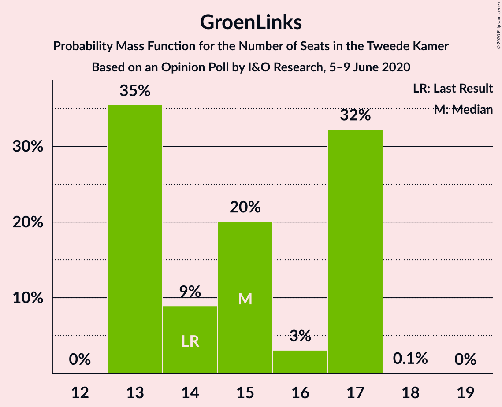
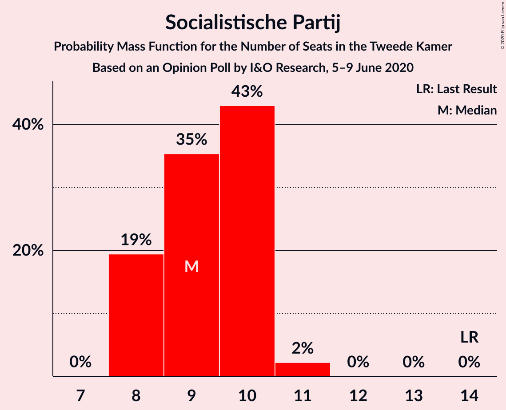
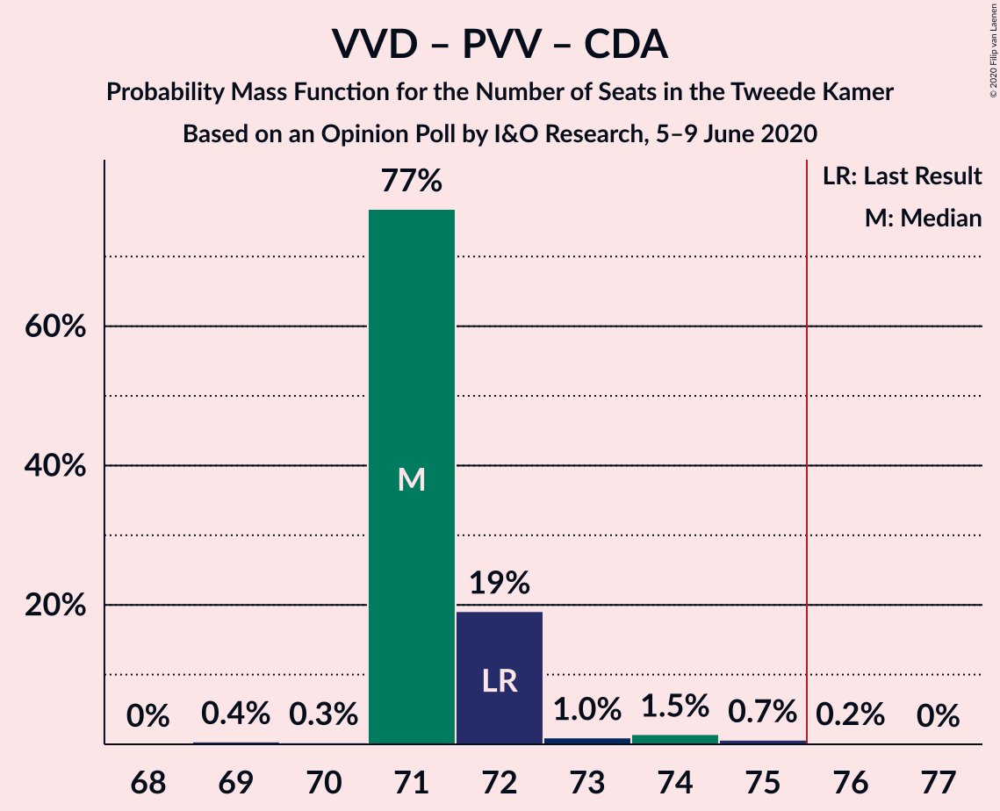

# Opinion Poll by I&O Research, 5–9 June 2020

<a href="#voting-intentions">Voting Intentions</a> | <a href="#seats">Seats</a> | <a href="#coalitions">Coalitions</a> | <a href="#technical-information">Technical Information</a>

## Voting Intentions

### Confidence Intervals

| Party | Last Result | Poll Result | 80% Confidence Interval | 90% Confidence Interval | 95% Confidence Interval | 99% Confidence Interval |
|:-----:|:-----------:|:-----------:|:-----------------------:|:-----------------------:|:-----------------------:|:-----------------------:|
| Volkspartij voor Vrijheid en Democratie | 21.3% | 29.8% | 28.8–30.9% |28.5–31.2% |28.3–31.4% |27.8–31.9% |
| Partij voor de Vrijheid | 13.1% | 9.9% | 9.3–10.7% |9.1–10.8% |9.0–11.0% |8.7–11.4% |
| GroenLinks | 9.1% | 9.9% | 9.3–10.7% |9.1–10.8% |9.0–11.0% |8.7–11.4% |
| Christen-Democratisch Appèl | 12.4% | 9.3% | 8.7–10.0% |8.5–10.2% |8.3–10.3% |8.0–10.7% |
| Partij van de Arbeid | 5.7% | 8.6% | 8.0–9.3% |7.9–9.5% |7.7–9.6% |7.4–10.0% |
| Democraten 66 | 12.2% | 7.3% | 6.8–7.9% |6.6–8.1% |6.5–8.2% |6.2–8.6% |
| Forum voor Democratie | 1.8% | 7.3% | 6.8–7.9% |6.6–8.1% |6.5–8.2% |6.2–8.6% |
| Socialistische Partij | 9.1% | 6.6% | 6.1–7.2% |5.9–7.4% |5.8–7.5% |5.6–7.8% |
| ChristenUnie | 3.4% | 4.6% | 4.2–5.2% |4.1–5.3% |4.0–5.4% |3.8–5.7% |
| Partij voor de Dieren | 3.2% | 2.7% | 2.3–3.1% |2.2–3.2% |2.2–3.3% |2.0–3.5% |
| Staatkundig Gereformeerde Partij | 2.1% | 2.7% | 2.3–3.1% |2.2–3.2% |2.2–3.3% |2.0–3.5% |
| 50Plus | 3.1% | 0.7% | 0.5–0.9% |0.5–0.9% |0.4–1.0% |0.4–1.1% |
| DENK | 2.1% | 0.2% | 0.1–0.3% |0.1–0.4% |0.1–0.4% |0.1–0.5% |
| Partij voor de Toekomst | 0.0% | 0.2% | 0.1–0.3% |0.1–0.4% |0.1–0.4% |0.1–0.5% |

*Note:* The poll result column reflects the actual value used in the calculations. Published results may vary slightly, and in addition be rounded to fewer digits.

## Seats

### Confidence Intervals

| Party | Last Result | Median | 80% Confidence Interval | 90% Confidence Interval | 95% Confidence Interval | 99% Confidence Interval |
|:-----:|:-----------:|:------:|:-----------------------:|:-----------------------:|:-----------------------:|:-----------------------:|
| <a href="#volkspartij-voor-vrijheid-en-democratie">Volkspartij voor Vrijheid en Democratie</a> | 33 | 46 | 46–47 |46–48 |46–48 |44–49 |
| <a href="#partij-voor-de-vrijheid">Partij voor de Vrijheid</a> | 20 | 14 | 14 |14–15 |14–17 |13–17 |
| <a href="#groenlinks">GroenLinks</a> | 14 | 15 | 15 |14–16 |14–17 |13–17 |
| <a href="#christen-democratisch-appèl">Christen-Democratisch Appèl</a> | 19 | 14 | 14–15 |13–15 |13–15 |13–15 |
| <a href="#partij-van-de-arbeid">Partij van de Arbeid</a> | 9 | 15 | 13–15 |13–15 |13–15 |12–15 |
| <a href="#democraten-66">Democraten 66</a> | 19 | 11 | 10–11 |10–11 |10–12 |10–13 |
| <a href="#forum-voor-democratie">Forum voor Democratie</a> | 2 | 10 | 10–12 |10–12 |10–12 |10–12 |
| <a href="#socialistische-partij">Socialistische Partij</a> | 14 | 9 | 9–11 |9–11 |8–11 |8–11 |
| <a href="#christenunie">ChristenUnie</a> | 5 | 6 | 6 |6–7 |6–8 |6–8 |
| <a href="#partij-voor-de-dieren">Partij voor de Dieren</a> | 5 | 5 | 3–5 |3–5 |3–5 |3–5 |
| <a href="#staatkundig-gereformeerde-partij">Staatkundig Gereformeerde Partij</a> | 3 | 4 | 4 |3–4 |3–5 |3–5 |
| <a href="#50plus">50Plus</a> | 4 | 1 | 0–1 |0–1 |0–1 |0–1 |
| <a href="#denk">DENK</a> | 3 | 0 | 0 |0 |0 |0 |
| <a href="#partij-voor-de-toekomst">Partij voor de Toekomst</a> | 0 | 0 | 0 |0 |0 |0 |

### Volkspartij voor Vrijheid en Democratie

*For a full overview of the results for this party, see the [Volkspartij voor Vrijheid en Democratie](party-volkspartijvoorvrijheidendemocratie.html) page.*

| Number of Seats | Probability | Accumulated | Special Marks |
|:---------------:|:-----------:|:-----------:|:-------------:|
| 33 | 0% | 100% | Last Result |
| 34 | 0% | 100% |  |
| 35 | 0% | 100% |  |
| 36 | 0% | 100% |  |
| 37 | 0% | 100% |  |
| 38 | 0% | 100% |  |
| 39 | 0% | 100% |  |
| 40 | 0% | 100% |  |
| 41 | 0% | 100% |  |
| 42 | 0% | 100% |  |
| 43 | 0.2% | 99.9% |  |
| 44 | 0.9% | 99.7% |  |
| 45 | 1.3% | 98.8% |  |
| 46 | 77% | 98% | Median |
| 47 | 14% | 20% |  |
| 48 | 4% | 6% |  |
| 49 | 2% | 2% |  |
| 50 | 0.1% | 0.1% |  |
| 51 | 0% | 0% |  |

### Partij voor de Vrijheid

*For a full overview of the results for this party, see the [Partij voor de Vrijheid](party-partijvoordevrijheid.html) page.*

| Number of Seats | Probability | Accumulated | Special Marks |
|:---------------:|:-----------:|:-----------:|:-------------:|
| 13 | 0.5% | 100% |  |
| 14 | 92% | 99.4% | Median |
| 15 | 3% | 7% |  |
| 16 | 0.9% | 4% |  |
| 17 | 3% | 3% |  |
| 18 | 0.2% | 0.2% |  |
| 19 | 0% | 0% |  |
| 20 | 0% | 0% | Last Result |

### GroenLinks

*For a full overview of the results for this party, see the [GroenLinks](party-groenlinks.html) page.*

| Number of Seats | Probability | Accumulated | Special Marks |
|:---------------:|:-----------:|:-----------:|:-------------:|
| 12 | 0.1% | 100% |  |
| 13 | 0.6% | 99.9% |  |
| 14 | 6% | 99.3% | Last Result |
| 15 | 87% | 93% | Median |
| 16 | 3% | 6% |  |
| 17 | 3% | 3% |  |
| 18 | 0.1% | 0.1% |  |
| 19 | 0% | 0% |  |

### Christen-Democratisch Appèl

*For a full overview of the results for this party, see the [Christen-Democratisch Appèl](party-christen-democratischappèl.html) page.*

| Number of Seats | Probability | Accumulated | Special Marks |
|:---------------:|:-----------:|:-----------:|:-------------:|
| 12 | 0.5% | 100% |  |
| 13 | 7% | 99.5% |  |
| 14 | 77% | 93% | Median |
| 15 | 16% | 16% |  |
| 16 | 0.2% | 0.2% |  |
| 17 | 0% | 0% |  |
| 18 | 0% | 0% |  |
| 19 | 0% | 0% | Last Result |

### Partij van de Arbeid

*For a full overview of the results for this party, see the [Partij van de Arbeid](party-partijvandearbeid.html) page.*

| Number of Seats | Probability | Accumulated | Special Marks |
|:---------------:|:-----------:|:-----------:|:-------------:|
| 9 | 0% | 100% | Last Result |
| 10 | 0% | 100% |  |
| 11 | 0.1% | 100% |  |
| 12 | 2% | 99.9% |  |
| 13 | 22% | 98% |  |
| 14 | 2% | 76% |  |
| 15 | 74% | 74% | Median |
| 16 | 0% | 0% |  |

### Democraten 66

*For a full overview of the results for this party, see the [Democraten 66](party-democraten66.html) page.*

| Number of Seats | Probability | Accumulated | Special Marks |
|:---------------:|:-----------:|:-----------:|:-------------:|
| 9 | 0.2% | 100% |  |
| 10 | 17% | 99.8% |  |
| 11 | 78% | 83% | Median |
| 12 | 4% | 5% |  |
| 13 | 0.7% | 0.7% |  |
| 14 | 0% | 0% |  |
| 15 | 0% | 0% |  |
| 16 | 0% | 0% |  |
| 17 | 0% | 0% |  |
| 18 | 0% | 0% |  |
| 19 | 0% | 0% | Last Result |

### Forum voor Democratie

*For a full overview of the results for this party, see the [Forum voor Democratie](party-forumvoordemocratie.html) page.*

| Number of Seats | Probability | Accumulated | Special Marks |
|:---------------:|:-----------:|:-----------:|:-------------:|
| 2 | 0% | 100% | Last Result |
| 3 | 0% | 100% |  |
| 4 | 0% | 100% |  |
| 5 | 0% | 100% |  |
| 6 | 0% | 100% |  |
| 7 | 0% | 100% |  |
| 8 | 0% | 100% |  |
| 9 | 0.3% | 100% |  |
| 10 | 81% | 99.6% | Median |
| 11 | 4% | 19% |  |
| 12 | 15% | 15% |  |
| 13 | 0.4% | 0.4% |  |
| 14 | 0% | 0% |  |

### Socialistische Partij

*For a full overview of the results for this party, see the [Socialistische Partij](party-socialistischepartij.html) page.*

| Number of Seats | Probability | Accumulated | Special Marks |
|:---------------:|:-----------:|:-----------:|:-------------:|
| 8 | 3% | 100% |  |
| 9 | 78% | 97% | Median |
| 10 | 2% | 20% |  |
| 11 | 17% | 18% |  |
| 12 | 0.4% | 0.4% |  |
| 13 | 0% | 0% |  |
| 14 | 0% | 0% | Last Result |

### ChristenUnie

*For a full overview of the results for this party, see the [ChristenUnie](party-christenunie.html) page.*

| Number of Seats | Probability | Accumulated | Special Marks |
|:---------------:|:-----------:|:-----------:|:-------------:|
| 5 | 0.4% | 100% | Last Result |
| 6 | 91% | 99.6% | Median |
| 7 | 5% | 9% |  |
| 8 | 3% | 4% |  |
| 9 | 0% | 0% |  |

### Partij voor de Dieren

*For a full overview of the results for this party, see the [Partij voor de Dieren](party-partijvoordedieren.html) page.*

| Number of Seats | Probability | Accumulated | Special Marks |
|:---------------:|:-----------:|:-----------:|:-------------:|
| 2 | 0.3% | 100% |  |
| 3 | 20% | 99.7% |  |
| 4 | 6% | 80% |  |
| 5 | 74% | 74% | Last Result, Median |
| 6 | 0% | 0% |  |

### Staatkundig Gereformeerde Partij

*For a full overview of the results for this party, see the [Staatkundig Gereformeerde Partij](party-staatkundiggereformeerdepartij.html) page.*

| Number of Seats | Probability | Accumulated | Special Marks |
|:---------------:|:-----------:|:-----------:|:-------------:|
| 3 | 5% | 100% | Last Result |
| 4 | 92% | 95% | Median |
| 5 | 3% | 3% |  |
| 6 | 0% | 0% |  |

### 50Plus

*For a full overview of the results for this party, see the [50Plus](party-50plus.html) page.*

| Number of Seats | Probability | Accumulated | Special Marks |
|:---------------:|:-----------:|:-----------:|:-------------:|
| 0 | 17% | 100% |  |
| 1 | 83% | 83% | Median |
| 2 | 0% | 0% |  |
| 3 | 0% | 0% |  |
| 4 | 0% | 0% | Last Result |

### DENK

*For a full overview of the results for this party, see the [DENK](party-denk.html) page.*

| Number of Seats | Probability | Accumulated | Special Marks |
|:---------------:|:-----------:|:-----------:|:-------------:|
| 0 | 100% | 100% | Median |
| 1 | 0% | 0% |  |
| 2 | 0% | 0% |  |
| 3 | 0% | 0% | Last Result |

### Partij voor de Toekomst

*For a full overview of the results for this party, see the [Partij voor de Toekomst](party-partijvoordetoekomst.html) page.*

| Number of Seats | Probability | Accumulated | Special Marks |
|:---------------:|:-----------:|:-----------:|:-------------:|
| 0 | 100% | 100% | Last Result, Median |

## Coalitions

### Confidence Intervals

| Coalition | Last Result | Median | Majority? | 80% Confidence Interval | 90% Confidence Interval | 95% Confidence Interval | 99% Confidence Interval |
|:---------:|:-----------:|:------:|:---------:|:-----------------------:|:-----------------------:|:-----------------------:|:-----------------------:|
| Volkspartij voor Vrijheid en Democratie – GroenLinks – Christen-Democratisch Appèl – Democraten 66 – ChristenUnie | 90 | 92 | 100% | 92–93 | 92–94 | 92–96 | 91–97 |
| Volkspartij voor Vrijheid en Democratie – Christen-Democratisch Appèl – Partij van de Arbeid – Democraten 66 – ChristenUnie | 85 | 92 | 100% | 91–92 | 91–92 | 90–93 | 88–94 |
| Volkspartij voor Vrijheid en Democratie – Partij voor de Vrijheid – Christen-Democratisch Appèl – Forum voor Democratie – Staatkundig Gereformeerde Partij | 77 | 88 | 100% | 88–92 | 88–92 | 88–93 | 87–93 |
| Volkspartij voor Vrijheid en Democratie – Partij voor de Vrijheid – Christen-Democratisch Appèl – Forum voor Democratie | 74 | 84 | 100% | 84–88 | 84–88 | 84–89 | 83–89 |
| Volkspartij voor Vrijheid en Democratie – Christen-Democratisch Appèl – Democraten 66 – ChristenUnie | 76 | 77 | 99.4% | 77–78 | 77–79 | 77–80 | 75–81 |
| Volkspartij voor Vrijheid en Democratie – Christen-Democratisch Appèl – Forum voor Democratie – Staatkundig Gereformeerde Partij – 50Plus | 61 | 75 | 20% | 75–78 | 75–78 | 74–78 | 73–78 |
| Volkspartij voor Vrijheid en Democratie – Christen-Democratisch Appèl – Forum voor Democratie – Staatkundig Gereformeerde Partij | 57 | 74 | 19% | 74–78 | 74–78 | 73–78 | 72–78 |
| Volkspartij voor Vrijheid en Democratie – Partij voor de Vrijheid – Christen-Democratisch Appèl | 72 | 74 | 18% | 74–76 | 74–76 | 73–77 | 72–79 |
| Volkspartij voor Vrijheid en Democratie – Christen-Democratisch Appèl – Partij van de Arbeid | 61 | 75 | 1.3% | 75 | 73–75 | 72–75 | 70–76 |
| Volkspartij voor Vrijheid en Democratie – Christen-Democratisch Appèl – Forum voor Democratie – 50Plus | 58 | 71 | 0.2% | 71–74 | 71–74 | 70–74 | 69–74 |
| Volkspartij voor Vrijheid en Democratie – Christen-Democratisch Appèl – Forum voor Democratie | 54 | 70 | 0.1% | 70–74 | 70–74 | 69–74 | 69–74 |
| Volkspartij voor Vrijheid en Democratie – Christen-Democratisch Appèl – Democraten 66 | 71 | 71 | 0% | 71–72 | 71–72 | 71–72 | 69–73 |
| Volkspartij voor Vrijheid en Democratie – Partij van de Arbeid – Democraten 66 | 61 | 72 | 0% | 70–72 | 70–72 | 70–72 | 67–73 |
| GroenLinks – Christen-Democratisch Appèl – Partij van de Arbeid – Democraten 66 – Socialistische Partij – ChristenUnie | 80 | 70 | 0% | 70 | 70–71 | 68–71 | 65–74 |
| Volkspartij voor Vrijheid en Democratie – Christen-Democratisch Appèl | 52 | 60 | 0% | 60–62 | 60–62 | 59–62 | 58–63 |
| Volkspartij voor Vrijheid en Democratie – Partij van de Arbeid | 42 | 61 | 0% | 60–61 | 59–61 | 58–62 | 57–62 |
| GroenLinks – Christen-Democratisch Appèl – Partij van de Arbeid – Democraten 66 – ChristenUnie | 66 | 61 | 0% | 59–61 | 59–61 | 57–62 | 57–63 |
| Christen-Democratisch Appèl – Partij van de Arbeid – Democraten 66 | 47 | 40 | 0% | 38–40 | 37–40 | 36–40 | 36–40 |
| Christen-Democratisch Appèl – Partij van de Arbeid – ChristenUnie | 33 | 35 | 0% | 34–35 | 33–35 | 32–35 | 31–37 |
| Christen-Democratisch Appèl – Partij van de Arbeid | 28 | 29 | 0% | 27–29 | 26–29 | 26–29 | 24–30 |
| Christen-Democratisch Appèl – Democraten 66 | 38 | 25 | 0% | 25 | 24–25 | 24–26 | 23–27 |

### Volkspartij voor Vrijheid en Democratie – GroenLinks – Christen-Democratisch Appèl – Democraten 66 – ChristenUnie

| Number of Seats | Probability | Accumulated | Special Marks |
|:---------------:|:-----------:|:-----------:|:-------------:|
| 89 | 0% | 100% |  |
| 90 | 0.1% | 99.9% | Last Result |
| 91 | 1.2% | 99.8% |  |
| 92 | 76% | 98.6% | Median |
| 93 | 18% | 23% |  |
| 94 | 2% | 5% |  |
| 95 | 0.9% | 4% |  |
| 96 | 0.5% | 3% |  |
| 97 | 2% | 2% |  |
| 98 | 0% | 0% |  |

### Volkspartij voor Vrijheid en Democratie – Christen-Democratisch Appèl – Partij van de Arbeid – Democraten 66 – ChristenUnie

| Number of Seats | Probability | Accumulated | Special Marks |
|:---------------:|:-----------:|:-----------:|:-------------:|
| 85 | 0% | 100% | Last Result |
| 86 | 0% | 100% |  |
| 87 | 0% | 100% |  |
| 88 | 0.5% | 100% |  |
| 89 | 1.0% | 99.4% |  |
| 90 | 2% | 98% |  |
| 91 | 15% | 96% |  |
| 92 | 76% | 81% | Median |
| 93 | 3% | 5% |  |
| 94 | 1.1% | 1.2% |  |
| 95 | 0.1% | 0.1% |  |
| 96 | 0% | 0% |  |

### Volkspartij voor Vrijheid en Democratie – Partij voor de Vrijheid – Christen-Democratisch Appèl – Forum voor Democratie – Staatkundig Gereformeerde Partij

| Number of Seats | Probability | Accumulated | Special Marks |
|:---------------:|:-----------:|:-----------:|:-------------:|
| 77 | 0% | 100% | Last Result |
| 78 | 0% | 100% |  |
| 79 | 0% | 100% |  |
| 80 | 0% | 100% |  |
| 81 | 0% | 100% |  |
| 82 | 0% | 100% |  |
| 83 | 0% | 100% |  |
| 84 | 0% | 100% |  |
| 85 | 0% | 100% |  |
| 86 | 0.2% | 100% |  |
| 87 | 2% | 99.8% |  |
| 88 | 77% | 98% | Median |
| 89 | 0.9% | 21% |  |
| 90 | 1.0% | 20% |  |
| 91 | 3% | 19% |  |
| 92 | 14% | 16% |  |
| 93 | 2% | 3% |  |
| 94 | 0% | 0.1% |  |
| 95 | 0.1% | 0.1% |  |
| 96 | 0% | 0% |  |

### Volkspartij voor Vrijheid en Democratie – Partij voor de Vrijheid – Christen-Democratisch Appèl – Forum voor Democratie

| Number of Seats | Probability | Accumulated | Special Marks |
|:---------------:|:-----------:|:-----------:|:-------------:|
| 74 | 0% | 100% | Last Result |
| 75 | 0% | 100% |  |
| 76 | 0% | 100% | Majority |
| 77 | 0% | 100% |  |
| 78 | 0% | 100% |  |
| 79 | 0% | 100% |  |
| 80 | 0% | 100% |  |
| 81 | 0% | 100% |  |
| 82 | 0.2% | 100% |  |
| 83 | 2% | 99.8% |  |
| 84 | 74% | 98% | Median |
| 85 | 3% | 24% |  |
| 86 | 2% | 20% |  |
| 87 | 2% | 18% |  |
| 88 | 14% | 17% |  |
| 89 | 2% | 3% |  |
| 90 | 0.2% | 0.2% |  |
| 91 | 0.1% | 0.1% |  |
| 92 | 0% | 0% |  |

### Volkspartij voor Vrijheid en Democratie – Christen-Democratisch Appèl – Democraten 66 – ChristenUnie

| Number of Seats | Probability | Accumulated | Special Marks |
|:---------------:|:-----------:|:-----------:|:-------------:|
| 75 | 0.6% | 100% |  |
| 76 | 0.4% | 99.4% | Last Result, Majority |
| 77 | 76% | 99.0% | Median |
| 78 | 16% | 23% |  |
| 79 | 3% | 7% |  |
| 80 | 3% | 4% |  |
| 81 | 0.7% | 0.7% |  |
| 82 | 0% | 0% |  |

### Volkspartij voor Vrijheid en Democratie – Christen-Democratisch Appèl – Forum voor Democratie – Staatkundig Gereformeerde Partij – 50Plus

| Number of Seats | Probability | Accumulated | Special Marks |
|:---------------:|:-----------:|:-----------:|:-------------:|
| 61 | 0% | 100% | Last Result |
| 62 | 0% | 100% |  |
| 63 | 0% | 100% |  |
| 64 | 0% | 100% |  |
| 65 | 0% | 100% |  |
| 66 | 0% | 100% |  |
| 67 | 0% | 100% |  |
| 68 | 0% | 100% |  |
| 69 | 0% | 100% |  |
| 70 | 0% | 100% |  |
| 71 | 0% | 100% |  |
| 72 | 0.2% | 100% |  |
| 73 | 1.0% | 99.7% |  |
| 74 | 2% | 98.7% |  |
| 75 | 77% | 97% | Median |
| 76 | 2% | 20% | Majority |
| 77 | 3% | 18% |  |
| 78 | 14% | 14% |  |
| 79 | 0.3% | 0.4% |  |
| 80 | 0.1% | 0.1% |  |
| 81 | 0% | 0% |  |

### Volkspartij voor Vrijheid en Democratie – Christen-Democratisch Appèl – Forum voor Democratie – Staatkundig Gereformeerde Partij

| Number of Seats | Probability | Accumulated | Special Marks |
|:---------------:|:-----------:|:-----------:|:-------------:|
| 57 | 0% | 100% | Last Result |
| 58 | 0% | 100% |  |
| 59 | 0% | 100% |  |
| 60 | 0% | 100% |  |
| 61 | 0% | 100% |  |
| 62 | 0% | 100% |  |
| 63 | 0% | 100% |  |
| 64 | 0% | 100% |  |
| 65 | 0% | 100% |  |
| 66 | 0% | 100% |  |
| 67 | 0% | 100% |  |
| 68 | 0% | 100% |  |
| 69 | 0% | 100% |  |
| 70 | 0% | 100% |  |
| 71 | 0% | 100% |  |
| 72 | 0.6% | 99.9% |  |
| 73 | 2% | 99.4% |  |
| 74 | 76% | 97% | Median |
| 75 | 2% | 21% |  |
| 76 | 4% | 19% | Majority |
| 77 | 0.9% | 15% |  |
| 78 | 14% | 14% |  |
| 79 | 0.1% | 0.1% |  |
| 80 | 0% | 0.1% |  |
| 81 | 0% | 0% |  |

### Volkspartij voor Vrijheid en Democratie – Partij voor de Vrijheid – Christen-Democratisch Appèl

| Number of Seats | Probability | Accumulated | Special Marks |
|:---------------:|:-----------:|:-----------:|:-------------:|
| 71 | 0.2% | 100% |  |
| 72 | 0.6% | 99.8% | Last Result |
| 73 | 2% | 99.2% |  |
| 74 | 74% | 97% | Median |
| 75 | 4% | 23% |  |
| 76 | 15% | 18% | Majority |
| 77 | 1.3% | 4% |  |
| 78 | 0.1% | 2% |  |
| 79 | 2% | 2% |  |
| 80 | 0.1% | 0.1% |  |
| 81 | 0% | 0% |  |

### Volkspartij voor Vrijheid en Democratie – Christen-Democratisch Appèl – Partij van de Arbeid

| Number of Seats | Probability | Accumulated | Special Marks |
|:---------------:|:-----------:|:-----------:|:-------------:|
| 61 | 0% | 100% | Last Result |
| 62 | 0% | 100% |  |
| 63 | 0% | 100% |  |
| 64 | 0% | 100% |  |
| 65 | 0% | 100% |  |
| 66 | 0% | 100% |  |
| 67 | 0% | 100% |  |
| 68 | 0% | 100% |  |
| 69 | 0% | 100% |  |
| 70 | 0.8% | 100% |  |
| 71 | 0.4% | 99.1% |  |
| 72 | 2% | 98.7% |  |
| 73 | 2% | 96% |  |
| 74 | 3% | 94% |  |
| 75 | 90% | 91% | Median |
| 76 | 1.1% | 1.3% | Majority |
| 77 | 0.1% | 0.2% |  |
| 78 | 0% | 0.1% |  |
| 79 | 0% | 0% |  |

### Volkspartij voor Vrijheid en Democratie – Christen-Democratisch Appèl – Forum voor Democratie – 50Plus

| Number of Seats | Probability | Accumulated | Special Marks |
|:---------------:|:-----------:|:-----------:|:-------------:|
| 58 | 0% | 100% | Last Result |
| 59 | 0% | 100% |  |
| 60 | 0% | 100% |  |
| 61 | 0% | 100% |  |
| 62 | 0% | 100% |  |
| 63 | 0% | 100% |  |
| 64 | 0% | 100% |  |
| 65 | 0% | 100% |  |
| 66 | 0% | 100% |  |
| 67 | 0% | 100% |  |
| 68 | 0.3% | 100% |  |
| 69 | 0.3% | 99.7% |  |
| 70 | 3% | 99.4% |  |
| 71 | 75% | 96% | Median |
| 72 | 3% | 21% |  |
| 73 | 3% | 18% |  |
| 74 | 15% | 15% |  |
| 75 | 0.2% | 0.5% |  |
| 76 | 0.2% | 0.2% | Majority |
| 77 | 0% | 0% |  |

### Volkspartij voor Vrijheid en Democratie – Christen-Democratisch Appèl – Forum voor Democratie

| Number of Seats | Probability | Accumulated | Special Marks |
|:---------------:|:-----------:|:-----------:|:-------------:|
| 54 | 0% | 100% | Last Result |
| 55 | 0% | 100% |  |
| 56 | 0% | 100% |  |
| 57 | 0% | 100% |  |
| 58 | 0% | 100% |  |
| 59 | 0% | 100% |  |
| 60 | 0% | 100% |  |
| 61 | 0% | 100% |  |
| 62 | 0% | 100% |  |
| 63 | 0% | 100% |  |
| 64 | 0% | 100% |  |
| 65 | 0% | 100% |  |
| 66 | 0% | 100% |  |
| 67 | 0.1% | 100% |  |
| 68 | 0.4% | 99.9% |  |
| 69 | 2% | 99.5% |  |
| 70 | 75% | 97% | Median |
| 71 | 4% | 22% |  |
| 72 | 3% | 18% |  |
| 73 | 2% | 16% |  |
| 74 | 13% | 14% |  |
| 75 | 0.3% | 0.4% |  |
| 76 | 0.1% | 0.1% | Majority |
| 77 | 0% | 0% |  |

### Volkspartij voor Vrijheid en Democratie – Christen-Democratisch Appèl – Democraten 66

| Number of Seats | Probability | Accumulated | Special Marks |
|:---------------:|:-----------:|:-----------:|:-------------:|
| 68 | 0.2% | 100% |  |
| 69 | 1.1% | 99.8% |  |
| 70 | 0.7% | 98.7% |  |
| 71 | 76% | 98% | Last Result, Median |
| 72 | 20% | 22% |  |
| 73 | 2% | 2% |  |
| 74 | 0.3% | 0.4% |  |
| 75 | 0.1% | 0.1% |  |
| 76 | 0% | 0% | Majority |

### Volkspartij voor Vrijheid en Democratie – Partij van de Arbeid – Democraten 66

| Number of Seats | Probability | Accumulated | Special Marks |
|:---------------:|:-----------:|:-----------:|:-------------:|
| 61 | 0% | 100% | Last Result |
| 62 | 0% | 100% |  |
| 63 | 0% | 100% |  |
| 64 | 0% | 100% |  |
| 65 | 0% | 100% |  |
| 66 | 0.1% | 100% |  |
| 67 | 0.4% | 99.9% |  |
| 68 | 0.5% | 99.4% |  |
| 69 | 0.9% | 99.0% |  |
| 70 | 15% | 98% |  |
| 71 | 4% | 83% |  |
| 72 | 78% | 79% | Median |
| 73 | 1.3% | 1.4% |  |
| 74 | 0.1% | 0.1% |  |
| 75 | 0% | 0% |  |

### GroenLinks – Christen-Democratisch Appèl – Partij van de Arbeid – Democraten 66 – Socialistische Partij – ChristenUnie

| Number of Seats | Probability | Accumulated | Special Marks |
|:---------------:|:-----------:|:-----------:|:-------------:|
| 65 | 2% | 100% |  |
| 66 | 0% | 98% |  |
| 67 | 0.4% | 98% |  |
| 68 | 0.7% | 98% |  |
| 69 | 2% | 97% |  |
| 70 | 89% | 95% | Median |
| 71 | 4% | 6% |  |
| 72 | 0.8% | 2% |  |
| 73 | 0.2% | 0.8% |  |
| 74 | 0.5% | 0.5% |  |
| 75 | 0% | 0% |  |
| 76 | 0% | 0% | Majority |
| 77 | 0% | 0% |  |
| 78 | 0% | 0% |  |
| 79 | 0% | 0% |  |
| 80 | 0% | 0% | Last Result |

### Volkspartij voor Vrijheid en Democratie – Christen-Democratisch Appèl

| Number of Seats | Probability | Accumulated | Special Marks |
|:---------------:|:-----------:|:-----------:|:-------------:|
| 52 | 0% | 100% | Last Result |
| 53 | 0% | 100% |  |
| 54 | 0% | 100% |  |
| 55 | 0% | 100% |  |
| 56 | 0% | 100% |  |
| 57 | 0.3% | 100% |  |
| 58 | 0.8% | 99.7% |  |
| 59 | 2% | 98.8% |  |
| 60 | 77% | 96% | Median |
| 61 | 2% | 20% |  |
| 62 | 17% | 17% |  |
| 63 | 0.5% | 0.6% |  |
| 64 | 0% | 0.1% |  |
| 65 | 0.1% | 0.1% |  |
| 66 | 0% | 0% |  |

### Volkspartij voor Vrijheid en Democratie – Partij van de Arbeid

| Number of Seats | Probability | Accumulated | Special Marks |
|:---------------:|:-----------:|:-----------:|:-------------:|
| 42 | 0% | 100% | Last Result |
| 43 | 0% | 100% |  |
| 44 | 0% | 100% |  |
| 45 | 0% | 100% |  |
| 46 | 0% | 100% |  |
| 47 | 0% | 100% |  |
| 48 | 0% | 100% |  |
| 49 | 0% | 100% |  |
| 50 | 0% | 100% |  |
| 51 | 0% | 100% |  |
| 52 | 0% | 100% |  |
| 53 | 0% | 100% |  |
| 54 | 0% | 100% |  |
| 55 | 0.1% | 100% |  |
| 56 | 0.1% | 99.9% |  |
| 57 | 1.2% | 99.8% |  |
| 58 | 1.1% | 98.6% |  |
| 59 | 4% | 97% |  |
| 60 | 14% | 94% |  |
| 61 | 76% | 80% | Median |
| 62 | 3% | 3% |  |
| 63 | 0.2% | 0.2% |  |
| 64 | 0% | 0% |  |

### GroenLinks – Christen-Democratisch Appèl – Partij van de Arbeid – Democraten 66 – ChristenUnie

| Number of Seats | Probability | Accumulated | Special Marks |
|:---------------:|:-----------:|:-----------:|:-------------:|
| 56 | 0.2% | 100% |  |
| 57 | 2% | 99.8% |  |
| 58 | 0.7% | 97% |  |
| 59 | 15% | 97% |  |
| 60 | 4% | 82% |  |
| 61 | 74% | 78% | Median |
| 62 | 3% | 4% |  |
| 63 | 0.9% | 1.1% |  |
| 64 | 0.2% | 0.2% |  |
| 65 | 0% | 0% |  |
| 66 | 0% | 0% | Last Result |

### Christen-Democratisch Appèl – Partij van de Arbeid – Democraten 66

| Number of Seats | Probability | Accumulated | Special Marks |
|:---------------:|:-----------:|:-----------:|:-------------:|
| 35 | 0.2% | 100% |  |
| 36 | 3% | 99.8% |  |
| 37 | 3% | 97% |  |
| 38 | 16% | 94% |  |
| 39 | 3% | 78% |  |
| 40 | 74% | 75% | Median |
| 41 | 0.1% | 0.2% |  |
| 42 | 0.1% | 0.1% |  |
| 43 | 0% | 0% |  |
| 44 | 0% | 0% |  |
| 45 | 0% | 0% |  |
| 46 | 0% | 0% |  |
| 47 | 0% | 0% | Last Result |

### Christen-Democratisch Appèl – Partij van de Arbeid – ChristenUnie

| Number of Seats | Probability | Accumulated | Special Marks |
|:---------------:|:-----------:|:-----------:|:-------------:|
| 30 | 0.4% | 100% |  |
| 31 | 0.2% | 99.6% |  |
| 32 | 2% | 99.4% |  |
| 33 | 4% | 97% | Last Result |
| 34 | 17% | 93% |  |
| 35 | 76% | 77% | Median |
| 36 | 0.2% | 1.0% |  |
| 37 | 0.6% | 0.7% |  |
| 38 | 0.1% | 0.1% |  |
| 39 | 0% | 0% |  |

### Christen-Democratisch Appèl – Partij van de Arbeid

| Number of Seats | Probability | Accumulated | Special Marks |
|:---------------:|:-----------:|:-----------:|:-------------:|
| 24 | 0.5% | 100% |  |
| 25 | 0.4% | 99.5% |  |
| 26 | 6% | 99.1% |  |
| 27 | 3% | 93% |  |
| 28 | 15% | 90% | Last Result |
| 29 | 74% | 75% | Median |
| 30 | 0.7% | 0.7% |  |
| 31 | 0% | 0% |  |

### Christen-Democratisch Appèl – Democraten 66

| Number of Seats | Probability | Accumulated | Special Marks |
|:---------------:|:-----------:|:-----------:|:-------------:|
| 23 | 2% | 100% |  |
| 24 | 3% | 98% |  |
| 25 | 92% | 95% | Median |
| 26 | 3% | 3% |  |
| 27 | 0.2% | 0.5% |  |
| 28 | 0.3% | 0.3% |  |
| 29 | 0% | 0% |  |
| 30 | 0% | 0% |  |
| 31 | 0% | 0% |  |
| 32 | 0% | 0% |  |
| 33 | 0% | 0% |  |
| 34 | 0% | 0% |  |
| 35 | 0% | 0% |  |
| 36 | 0% | 0% |  |
| 37 | 0% | 0% |  |
| 38 | 0% | 0% | Last Result |

## Technical Information

### Opinion Poll

+ **Polling firm:** I&O Research
+ **Commissioner(s):** —
+ **Fieldwork period:** 5–9 June 2020

### Calculations

+ **Sample size:** 3338
+ **Simulations done:** 524,288
+ **Error estimate:** 1.22%

