# Opinion Poll by Kantar Public, 23–26 June 2020

<a href="#voting-intentions">Voting Intentions</a> | <a href="#seats">Seats</a> | <a href="#coalitions">Coalitions</a> | <a href="#technical-information">Technical Information</a>

## Voting Intentions

### Confidence Intervals

| Party | Last Result | Poll Result | 80% Confidence Interval | 90% Confidence Interval | 95% Confidence Interval | 99% Confidence Interval |
|:-----:|:-----------:|:-----------:|:-----------------------:|:-----------------------:|:-----------------------:|:-----------------------:|
| Volkspartij voor Vrijheid en Democratie | 21.3% | 26.6% | 24.8–28.6% |24.3–29.1% |23.9–29.6% |23.0–30.6% |
| Partij voor de Vrijheid | 13.1% | 10.0% | 8.8–11.4% |8.5–11.8% |8.2–12.1% |7.7–12.8% |
| GroenLinks | 9.1% | 10.0% | 8.8–11.4% |8.5–11.8% |8.2–12.1% |7.7–12.8% |
| Christen-Democratisch Appèl | 12.4% | 9.3% | 8.2–10.7% |7.9–11.1% |7.6–11.4% |7.1–12.1% |
| Forum voor Democratie | 1.8% | 8.7% | 7.6–10.0% |7.3–10.3% |7.0–10.7% |6.5–11.3% |
| Democraten 66 | 12.2% | 8.0% | 6.9–9.3% |6.6–9.6% |6.4–10.0% |5.9–10.6% |
| Socialistische Partij | 9.1% | 8.0% | 6.9–9.3% |6.6–9.6% |6.4–10.0% |5.9–10.6% |
| Partij van de Arbeid | 5.7% | 8.0% | 6.9–9.3% |6.6–9.6% |6.4–10.0% |5.9–10.6% |
| ChristenUnie | 3.4% | 3.3% | 2.7–4.2% |2.5–4.5% |2.3–4.7% |2.1–5.2% |
| Partij voor de Dieren | 3.2% | 2.7% | 2.1–3.5% |1.9–3.7% |1.8–3.9% |1.6–4.4% |
| Staatkundig Gereformeerde Partij | 2.1% | 2.0% | 1.5–2.7% |1.4–3.0% |1.3–3.1% |1.1–3.5% |
| 50Plus | 3.1% | 1.3% | 1.0–2.0% |0.9–2.1% |0.8–2.3% |0.6–2.7% |
| DENK | 2.1% | 1.3% | 1.0–2.0% |0.9–2.1% |0.8–2.3% |0.6–2.7% |
| Partij voor de Toekomst | 0.0% | 0.7% | 0.4–1.2% |0.4–1.3% |0.3–1.4% |0.2–1.7% |

*Note:* The poll result column reflects the actual value used in the calculations. Published results may vary slightly, and in addition be rounded to fewer digits.

## Seats

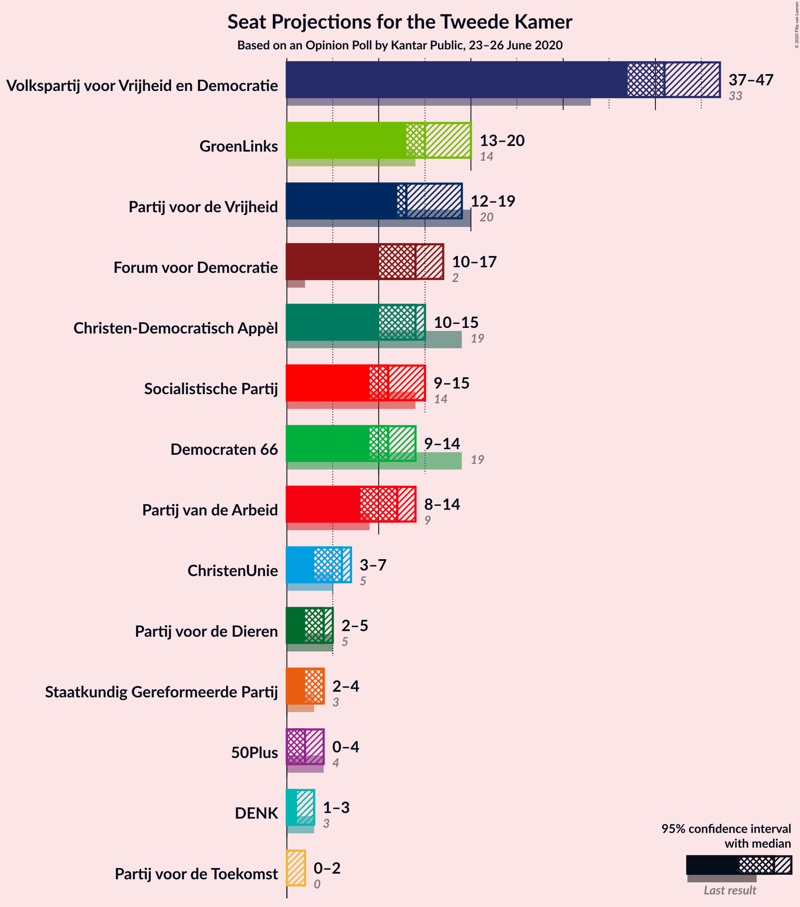

### Confidence Intervals

| Party | Last Result | Median | 80% Confidence Interval | 90% Confidence Interval | 95% Confidence Interval | 99% Confidence Interval |
|:-----:|:-----------:|:------:|:-----------------------:|:-----------------------:|:-----------------------:|:-----------------------:|
| <a href="#volkspartij-voor-vrijheid-en-democratie">Volkspartij voor Vrijheid en Democratie</a> | 33 | 40 | 40–44 |40–44 |40–46 |36–47 |
| <a href="#partij-voor-de-vrijheid">Partij voor de Vrijheid</a> | 20 | 16 | 12–16 |11–16 |9–16 |9–18 |
| <a href="#groenlinks">GroenLinks</a> | 14 | 17 | 13–21 |13–21 |13–21 |10–21 |
| <a href="#christen-democratisch-appèl">Christen-Democratisch Appèl</a> | 19 | 15 | 10–18 |10–18 |10–18 |9–18 |
| <a href="#forum-voor-democratie">Forum voor Democratie</a> | 2 | 12 | 12–15 |12–15 |12–15 |8–15 |
| <a href="#democraten-66">Democraten 66</a> | 19 | 10 | 9–11 |9–13 |9–14 |9–14 |
| <a href="#socialistische-partij">Socialistische Partij</a> | 14 | 11 | 9–18 |9–18 |9–18 |9–18 |
| <a href="#partij-van-de-arbeid">Partij van de Arbeid</a> | 9 | 11 | 9–12 |9–13 |9–13 |8–15 |
| <a href="#christenunie">ChristenUnie</a> | 5 | 5 | 3–8 |3–8 |3–8 |3–10 |
| <a href="#partij-voor-de-dieren">Partij voor de Dieren</a> | 5 | 4 | 1–4 |1–5 |1–5 |1–5 |
| <a href="#staatkundig-gereformeerde-partij">Staatkundig Gereformeerde Partij</a> | 3 | 3 | 1–3 |1–3 |1–3 |1–5 |
| <a href="#50plus">50Plus</a> | 4 | 1 | 1–3 |1–3 |1–3 |1–4 |
| <a href="#denk">DENK</a> | 3 | 2 | 1–3 |1–3 |1–5 |1–5 |
| <a href="#partij-voor-de-toekomst">Partij voor de Toekomst</a> | 0 | 0 | 0–1 |0–1 |0–1 |0–3 |

### Volkspartij voor Vrijheid en Democratie

*For a full overview of the results for this party, see the [Volkspartij voor Vrijheid en Democratie](party-volkspartijvoorvrijheidendemocratie.html) page.*

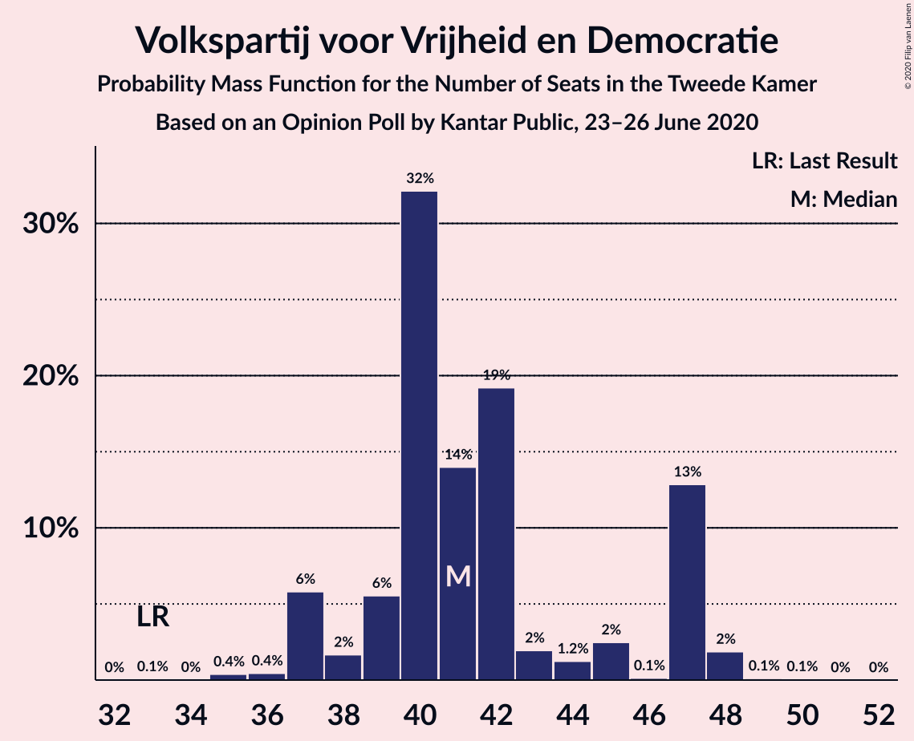

| Number of Seats | Probability | Accumulated | Special Marks |
|:---------------:|:-----------:|:-----------:|:-------------:|
| 33 | 0% | 100% | Last Result |
| 34 | 0.5% | 100% |  |
| 35 | 0% | 99.5% |  |
| 36 | 0.4% | 99.5% |  |
| 37 | 0% | 99.1% |  |
| 38 | 0% | 99.1% |  |
| 39 | 0.5% | 99.1% |  |
| 40 | 58% | 98.6% | Median |
| 41 | 3% | 41% |  |
| 42 | 17% | 38% |  |
| 43 | 1.5% | 20% |  |
| 44 | 16% | 19% |  |
| 45 | 0.1% | 3% |  |
| 46 | 2% | 3% |  |
| 47 | 0.8% | 0.8% |  |
| 48 | 0% | 0% |  |

### Partij voor de Vrijheid

*For a full overview of the results for this party, see the [Partij voor de Vrijheid](party-partijvoordevrijheid.html) page.*

| Number of Seats | Probability | Accumulated | Special Marks |
|:---------------:|:-----------:|:-----------:|:-------------:|
| 9 | 3% | 100% |  |
| 10 | 0.5% | 97% |  |
| 11 | 2% | 97% |  |
| 12 | 20% | 95% |  |
| 13 | 0.1% | 75% |  |
| 14 | 0% | 75% |  |
| 15 | 0% | 75% |  |
| 16 | 74% | 75% | Median |
| 17 | 0% | 0.8% |  |
| 18 | 0.4% | 0.8% |  |
| 19 | 0.4% | 0.4% |  |
| 20 | 0% | 0% | Last Result |

### GroenLinks

*For a full overview of the results for this party, see the [GroenLinks](party-groenlinks.html) page.*

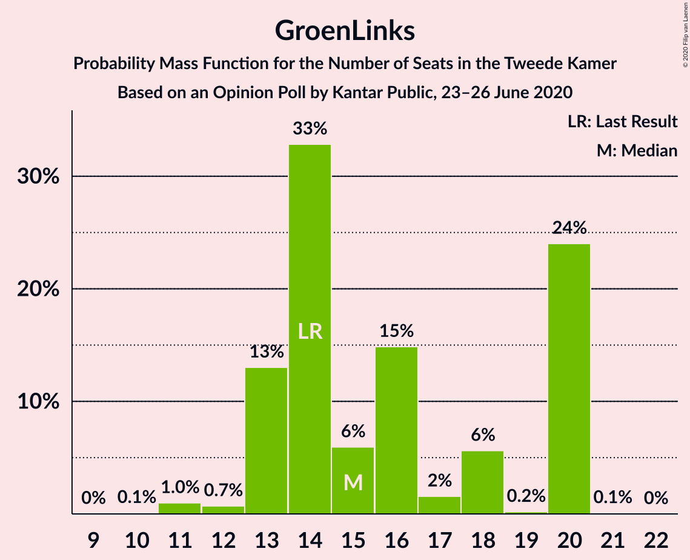

| Number of Seats | Probability | Accumulated | Special Marks |
|:---------------:|:-----------:|:-----------:|:-------------:|
| 10 | 2% | 100% |  |
| 11 | 0% | 98% |  |
| 12 | 0% | 98% |  |
| 13 | 22% | 98% |  |
| 14 | 0.1% | 76% | Last Result |
| 15 | 0% | 76% |  |
| 16 | 0.6% | 76% |  |
| 17 | 59% | 76% | Median |
| 18 | 0% | 16% |  |
| 19 | 0% | 16% |  |
| 20 | 0% | 16% |  |
| 21 | 16% | 16% |  |
| 22 | 0.1% | 0.1% |  |
| 23 | 0% | 0% |  |

### Christen-Democratisch Appèl

*For a full overview of the results for this party, see the [Christen-Democratisch Appèl](party-christen-democratischappèl.html) page.*

| Number of Seats | Probability | Accumulated | Special Marks |
|:---------------:|:-----------:|:-----------:|:-------------:|
| 9 | 0.5% | 100% |  |
| 10 | 17% | 99.5% |  |
| 11 | 0.4% | 83% |  |
| 12 | 1.5% | 82% |  |
| 13 | 0.5% | 81% |  |
| 14 | 2% | 80% |  |
| 15 | 61% | 78% | Median |
| 16 | 0% | 17% |  |
| 17 | 0% | 17% |  |
| 18 | 17% | 17% |  |
| 19 | 0% | 0% | Last Result |

### Forum voor Democratie

*For a full overview of the results for this party, see the [Forum voor Democratie](party-forumvoordemocratie.html) page.*

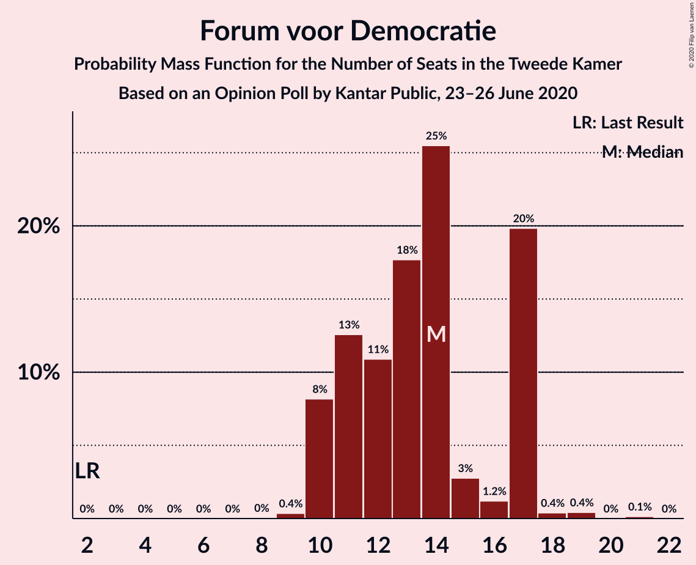

| Number of Seats | Probability | Accumulated | Special Marks |
|:---------------:|:-----------:|:-----------:|:-------------:|
| 2 | 0% | 100% | Last Result |
| 3 | 0% | 100% |  |
| 4 | 0% | 100% |  |
| 5 | 0% | 100% |  |
| 6 | 0% | 100% |  |
| 7 | 0% | 100% |  |
| 8 | 2% | 100% |  |
| 9 | 0% | 98% |  |
| 10 | 0.2% | 98% |  |
| 11 | 0% | 98% |  |
| 12 | 76% | 98% | Median |
| 13 | 4% | 22% |  |
| 14 | 0.8% | 18% |  |
| 15 | 17% | 17% |  |
| 16 | 0% | 0% |  |

### Democraten 66

*For a full overview of the results for this party, see the [Democraten 66](party-democraten66.html) page.*

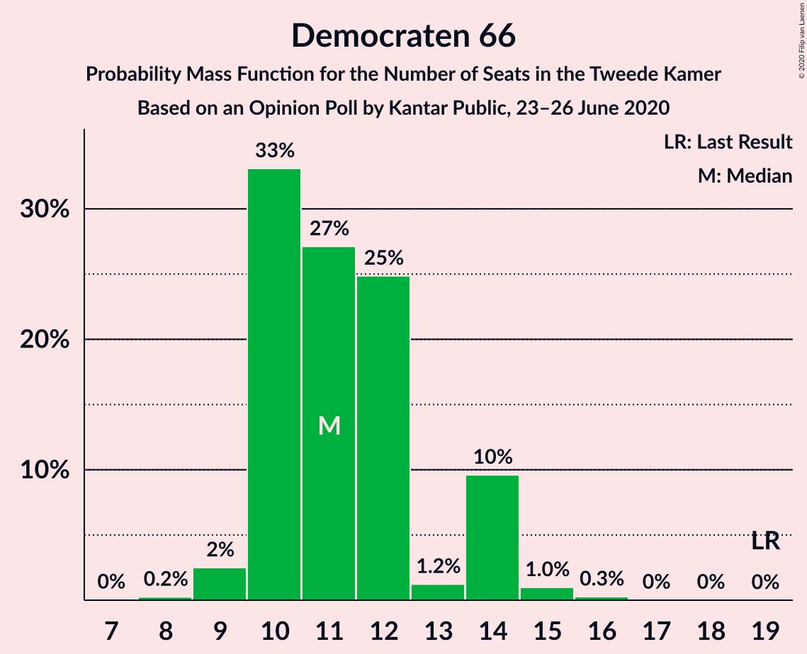

| Number of Seats | Probability | Accumulated | Special Marks |
|:---------------:|:-----------:|:-----------:|:-------------:|
| 9 | 19% | 100% |  |
| 10 | 58% | 81% | Median |
| 11 | 17% | 23% |  |
| 12 | 0.1% | 6% |  |
| 13 | 2% | 6% |  |
| 14 | 3% | 4% |  |
| 15 | 0.5% | 0.5% |  |
| 16 | 0% | 0% |  |
| 17 | 0% | 0% |  |
| 18 | 0% | 0% |  |
| 19 | 0% | 0% | Last Result |

### Socialistische Partij

*For a full overview of the results for this party, see the [Socialistische Partij](party-socialistischepartij.html) page.*

| Number of Seats | Probability | Accumulated | Special Marks |
|:---------------:|:-----------:|:-----------:|:-------------:|
| 8 | 0.2% | 100% |  |
| 9 | 16% | 99.8% |  |
| 10 | 0.2% | 84% |  |
| 11 | 61% | 84% | Median |
| 12 | 0.5% | 22% |  |
| 13 | 4% | 22% |  |
| 14 | 0% | 18% | Last Result |
| 15 | 0.4% | 18% |  |
| 16 | 0.1% | 18% |  |
| 17 | 0% | 18% |  |
| 18 | 17% | 18% |  |
| 19 | 0.5% | 0.5% |  |
| 20 | 0% | 0% |  |

### Partij van de Arbeid

*For a full overview of the results for this party, see the [Partij van de Arbeid](party-partijvandearbeid.html) page.*

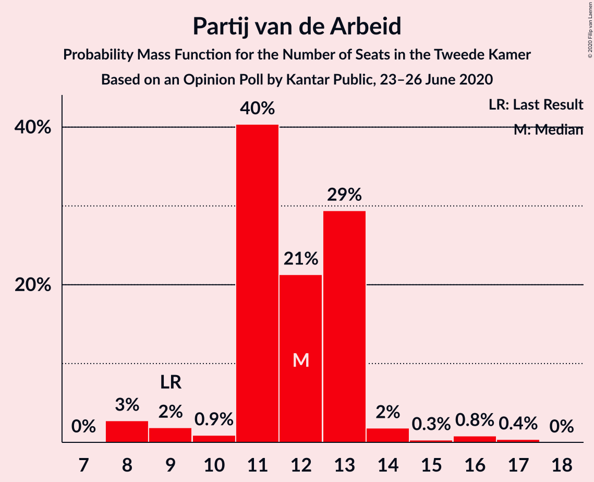

| Number of Seats | Probability | Accumulated | Special Marks |
|:---------------:|:-----------:|:-----------:|:-------------:|
| 8 | 1.1% | 100% |  |
| 9 | 18% | 98.9% | Last Result |
| 10 | 0% | 81% |  |
| 11 | 58% | 81% | Median |
| 12 | 16% | 23% |  |
| 13 | 5% | 7% |  |
| 14 | 0.5% | 2% |  |
| 15 | 1.4% | 1.4% |  |
| 16 | 0% | 0% |  |

### ChristenUnie

*For a full overview of the results for this party, see the [ChristenUnie](party-christenunie.html) page.*

| Number of Seats | Probability | Accumulated | Special Marks |
|:---------------:|:-----------:|:-----------:|:-------------:|
| 3 | 17% | 100% |  |
| 4 | 0.6% | 83% |  |
| 5 | 61% | 83% | Last Result, Median |
| 6 | 0.5% | 22% |  |
| 7 | 3% | 22% |  |
| 8 | 17% | 19% |  |
| 9 | 0% | 1.4% |  |
| 10 | 1.4% | 1.4% |  |
| 11 | 0% | 0% |  |

### Partij voor de Dieren

*For a full overview of the results for this party, see the [Partij voor de Dieren](party-partijvoordedieren.html) page.*

| Number of Seats | Probability | Accumulated | Special Marks |
|:---------------:|:-----------:|:-----------:|:-------------:|
| 1 | 16% | 100% |  |
| 2 | 1.5% | 84% |  |
| 3 | 19% | 83% |  |
| 4 | 59% | 64% | Median |
| 5 | 5% | 5% | Last Result |
| 6 | 0% | 0.1% |  |
| 7 | 0.1% | 0.1% |  |
| 8 | 0% | 0% |  |

### Staatkundig Gereformeerde Partij

*For a full overview of the results for this party, see the [Staatkundig Gereformeerde Partij](party-staatkundiggereformeerdepartij.html) page.*

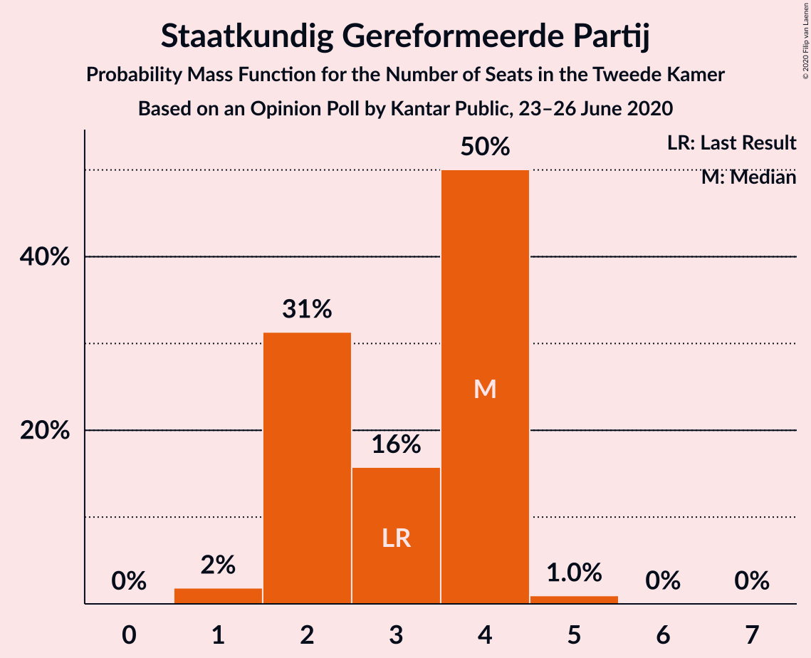

| Number of Seats | Probability | Accumulated | Special Marks |
|:---------------:|:-----------:|:-----------:|:-------------:|
| 1 | 21% | 100% |  |
| 2 | 2% | 79% |  |
| 3 | 76% | 77% | Last Result, Median |
| 4 | 0% | 0.7% |  |
| 5 | 0.3% | 0.7% |  |
| 6 | 0% | 0.4% |  |
| 7 | 0.4% | 0.4% |  |
| 8 | 0% | 0% |  |

### 50Plus

*For a full overview of the results for this party, see the [50Plus](party-50plus.html) page.*

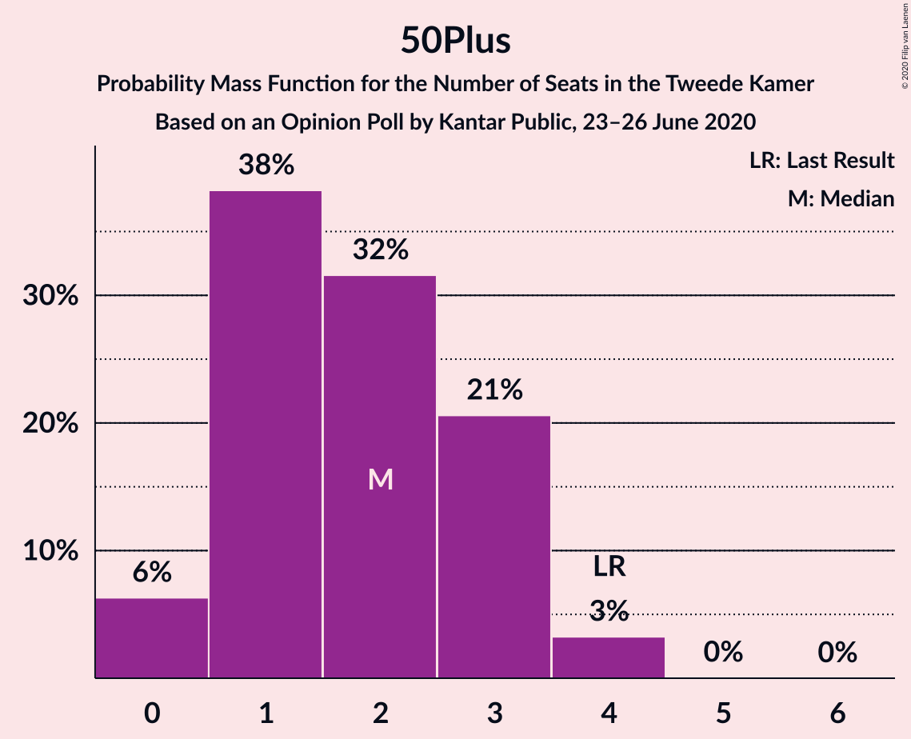

| Number of Seats | Probability | Accumulated | Special Marks |
|:---------------:|:-----------:|:-----------:|:-------------:|
| 0 | 0.5% | 100% |  |
| 1 | 59% | 99.5% | Median |
| 2 | 19% | 41% |  |
| 3 | 19% | 22% |  |
| 4 | 2% | 2% | Last Result |
| 5 | 0.1% | 0.1% |  |
| 6 | 0% | 0% |  |

### DENK

*For a full overview of the results for this party, see the [DENK](party-denk.html) page.*

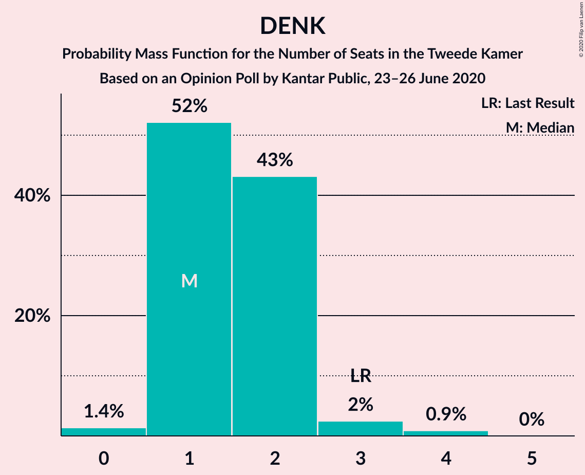

| Number of Seats | Probability | Accumulated | Special Marks |
|:---------------:|:-----------:|:-----------:|:-------------:|
| 1 | 16% | 100% |  |
| 2 | 60% | 84% | Median |
| 3 | 21% | 24% | Last Result |
| 4 | 0% | 3% |  |
| 5 | 3% | 3% |  |
| 6 | 0% | 0% |  |

### Partij voor de Toekomst

*For a full overview of the results for this party, see the [Partij voor de Toekomst](party-partijvoordetoekomst.html) page.*

| Number of Seats | Probability | Accumulated | Special Marks |
|:---------------:|:-----------:|:-----------:|:-------------:|
| 0 | 78% | 100% | Last Result, Median |
| 1 | 21% | 22% |  |
| 2 | 0.6% | 1.1% |  |
| 3 | 0.4% | 0.5% |  |
| 4 | 0.1% | 0.1% |  |
| 5 | 0% | 0% |  |

## Coalitions

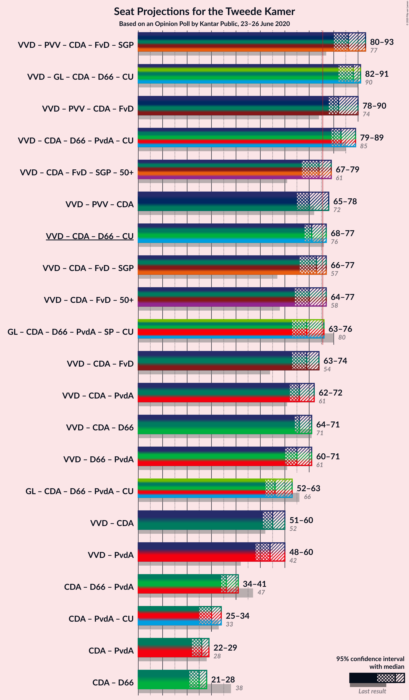

### Confidence Intervals

| Coalition | Last Result | Median | Majority? | 80% Confidence Interval | 90% Confidence Interval | 95% Confidence Interval | 99% Confidence Interval |
|:---------:|:-----------:|:------:|:---------:|:-----------------------:|:-----------------------:|:-----------------------:|:-----------------------:|
| Volkspartij voor Vrijheid en Democratie – GroenLinks – Christen-Democratisch Appèl – Democraten 66 – ChristenUnie | 90 | 87 | 100% | 87–90 | 87–90 | 87–90 | 82–90 |
| Volkspartij voor Vrijheid en Democratie – Christen-Democratisch Appèl – Democraten 66 – Partij van de Arbeid – ChristenUnie | 85 | 81 | 99.2% | 80–86 | 80–88 | 80–89 | 74–93 |
| Volkspartij voor Vrijheid en Democratie – Partij voor de Vrijheid – Christen-Democratisch Appèl – Forum voor Democratie – Staatkundig Gereformeerde Partij | 77 | 86 | 99.5% | 85–88 | 82–88 | 79–88 | 75–88 |
| Volkspartij voor Vrijheid en Democratie – Partij voor de Vrijheid – Christen-Democratisch Appèl – Forum voor Democratie | 74 | 83 | 99.5% | 83–85 | 80–85 | 78–85 | 74–85 |
| Volkspartij voor Vrijheid en Democratie – Christen-Democratisch Appèl – Democraten 66 – ChristenUnie | 76 | 70 | 20% | 68–77 | 68–77 | 68–77 | 65–80 |
| Volkspartij voor Vrijheid en Democratie – Christen-Democratisch Appèl – Forum voor Democratie – Staatkundig Gereformeerde Partij – 50Plus | 61 | 71 | 0.3% | 71–75 | 71–75 | 71–75 | 66–75 |
| GroenLinks – Christen-Democratisch Appèl – Democraten 66 – Partij van de Arbeid – Socialistische Partij – ChristenUnie | 80 | 69 | 0.1% | 66–75 | 66–75 | 66–75 | 65–75 |
| Volkspartij voor Vrijheid en Democratie – Christen-Democratisch Appèl – Forum voor Democratie – 50Plus | 58 | 68 | 0% | 68–74 | 68–74 | 68–74 | 63–74 |
| Volkspartij voor Vrijheid en Democratie – Christen-Democratisch Appèl – Forum voor Democratie – Staatkundig Gereformeerde Partij | 57 | 70 | 0.2% | 70–73 | 70–73 | 70–73 | 64–74 |
| Volkspartij voor Vrijheid en Democratie – Christen-Democratisch Appèl – Forum voor Democratie | 54 | 67 | 0% | 67–72 | 67–72 | 67–72 | 62–72 |
| Volkspartij voor Vrijheid en Democratie – Partij voor de Vrijheid – Christen-Democratisch Appèl | 72 | 71 | 0% | 70–72 | 66–72 | 65–72 | 60–72 |
| Volkspartij voor Vrijheid en Democratie – Christen-Democratisch Appèl – Partij van de Arbeid | 61 | 66 | 0% | 66–69 | 66–69 | 66–70 | 56–73 |
| Volkspartij voor Vrijheid en Democratie – Christen-Democratisch Appèl – Democraten 66 | 71 | 65 | 0% | 65–69 | 65–70 | 64–70 | 61–73 |
| Volkspartij voor Vrijheid en Democratie – Democraten 66 – Partij van de Arbeid | 61 | 61 | 0% | 60–67 | 60–68 | 60–70 | 57–72 |
| GroenLinks – Christen-Democratisch Appèl – Democraten 66 – Partij van de Arbeid – ChristenUnie | 66 | 58 | 0% | 57–58 | 57–58 | 57–60 | 50–60 |
| Volkspartij voor Vrijheid en Democratie – Christen-Democratisch Appèl | 52 | 55 | 0% | 54–60 | 54–60 | 54–60 | 47–60 |
| Volkspartij voor Vrijheid en Democratie – Partij van de Arbeid | 42 | 51 | 0% | 51–56 | 51–56 | 51–59 | 44–59 |
| Christen-Democratisch Appèl – Democraten 66 – Partij van de Arbeid | 47 | 36 | 0% | 33–36 | 33–40 | 33–42 | 30–42 |
| Christen-Democratisch Appèl – Partij van de Arbeid – ChristenUnie | 33 | 31 | 0% | 25–35 | 25–35 | 25–35 | 22–37 |
| Christen-Democratisch Appèl – Democraten 66 | 38 | 25 | 0% | 21–27 | 21–27 | 21–29 | 21–29 |
| Christen-Democratisch Appèl – Partij van de Arbeid | 28 | 26 | 0% | 22–27 | 22–27 | 22–28 | 18–28 |

### Volkspartij voor Vrijheid en Democratie – GroenLinks – Christen-Democratisch Appèl – Democraten 66 – ChristenUnie

| Number of Seats | Probability | Accumulated | Special Marks |
|:---------------:|:-----------:|:-----------:|:-------------:|
| 78 | 0.4% | 100% |  |
| 79 | 0% | 99.6% |  |
| 80 | 0% | 99.6% |  |
| 81 | 0% | 99.6% |  |
| 82 | 0.5% | 99.6% |  |
| 83 | 0% | 99.1% |  |
| 84 | 0% | 99.1% |  |
| 85 | 0% | 99.1% |  |
| 86 | 0% | 99.1% |  |
| 87 | 60% | 99.1% | Median |
| 88 | 3% | 39% |  |
| 89 | 16% | 36% |  |
| 90 | 20% | 20% | Last Result |
| 91 | 0% | 0.1% |  |
| 92 | 0% | 0.1% |  |
| 93 | 0% | 0.1% |  |
| 94 | 0% | 0.1% |  |
| 95 | 0.1% | 0.1% |  |
| 96 | 0% | 0% |  |

### Volkspartij voor Vrijheid en Democratie – Christen-Democratisch Appèl – Democraten 66 – Partij van de Arbeid – ChristenUnie

| Number of Seats | Probability | Accumulated | Special Marks |
|:---------------:|:-----------:|:-----------:|:-------------:|
| 69 | 0.4% | 100% |  |
| 70 | 0% | 99.6% |  |
| 71 | 0% | 99.6% |  |
| 72 | 0% | 99.6% |  |
| 73 | 0% | 99.6% |  |
| 74 | 0.4% | 99.6% |  |
| 75 | 0% | 99.2% |  |
| 76 | 0% | 99.2% | Majority |
| 77 | 0% | 99.2% |  |
| 78 | 0.5% | 99.2% |  |
| 79 | 0% | 98.7% |  |
| 80 | 16% | 98.7% |  |
| 81 | 58% | 82% | Median |
| 82 | 0% | 24% |  |
| 83 | 0% | 24% |  |
| 84 | 0% | 24% |  |
| 85 | 0% | 24% | Last Result |
| 86 | 18% | 24% |  |
| 87 | 0% | 6% |  |
| 88 | 3% | 6% |  |
| 89 | 1.4% | 4% |  |
| 90 | 0% | 2% |  |
| 91 | 0% | 2% |  |
| 92 | 0% | 2% |  |
| 93 | 2% | 2% |  |
| 94 | 0% | 0% |  |

### Volkspartij voor Vrijheid en Democratie – Partij voor de Vrijheid – Christen-Democratisch Appèl – Forum voor Democratie – Staatkundig Gereformeerde Partij

| Number of Seats | Probability | Accumulated | Special Marks |
|:---------------:|:-----------:|:-----------:|:-------------:|
| 72 | 0.1% | 100% |  |
| 73 | 0% | 99.9% |  |
| 74 | 0% | 99.9% |  |
| 75 | 0.5% | 99.9% |  |
| 76 | 0% | 99.5% | Majority |
| 77 | 0% | 99.5% | Last Result |
| 78 | 0% | 99.5% |  |
| 79 | 3% | 99.5% |  |
| 80 | 0% | 97% |  |
| 81 | 0% | 97% |  |
| 82 | 4% | 97% |  |
| 83 | 0.4% | 93% |  |
| 84 | 0.5% | 93% |  |
| 85 | 18% | 92% |  |
| 86 | 58% | 75% | Median |
| 87 | 0.4% | 17% |  |
| 88 | 16% | 16% |  |
| 89 | 0.2% | 0.3% |  |
| 90 | 0% | 0% |  |

### Volkspartij voor Vrijheid en Democratie – Partij voor de Vrijheid – Christen-Democratisch Appèl – Forum voor Democratie

| Number of Seats | Probability | Accumulated | Special Marks |
|:---------------:|:-----------:|:-----------:|:-------------:|
| 69 | 0.1% | 100% |  |
| 70 | 0% | 99.9% |  |
| 71 | 0% | 99.9% |  |
| 72 | 0% | 99.9% |  |
| 73 | 0% | 99.9% |  |
| 74 | 0.5% | 99.9% | Last Result |
| 75 | 0% | 99.5% |  |
| 76 | 0% | 99.5% | Majority |
| 77 | 0.1% | 99.5% |  |
| 78 | 3% | 99.4% |  |
| 79 | 1.4% | 97% |  |
| 80 | 3% | 95% |  |
| 81 | 0.5% | 92% |  |
| 82 | 0% | 92% |  |
| 83 | 58% | 92% | Median |
| 84 | 18% | 34% |  |
| 85 | 16% | 16% |  |
| 86 | 0% | 0% |  |

### Volkspartij voor Vrijheid en Democratie – Christen-Democratisch Appèl – Democraten 66 – ChristenUnie

| Number of Seats | Probability | Accumulated | Special Marks |
|:---------------:|:-----------:|:-----------:|:-------------:|
| 61 | 0.4% | 100% |  |
| 62 | 0% | 99.6% |  |
| 63 | 0% | 99.6% |  |
| 64 | 0% | 99.6% |  |
| 65 | 0.4% | 99.6% |  |
| 66 | 0% | 99.2% |  |
| 67 | 0% | 99.2% |  |
| 68 | 16% | 99.2% |  |
| 69 | 0.1% | 83% |  |
| 70 | 58% | 83% | Median |
| 71 | 0% | 25% |  |
| 72 | 0.7% | 25% |  |
| 73 | 0% | 24% |  |
| 74 | 1.4% | 24% |  |
| 75 | 3% | 22% |  |
| 76 | 0% | 20% | Last Result, Majority |
| 77 | 17% | 20% |  |
| 78 | 0% | 2% |  |
| 79 | 0.1% | 2% |  |
| 80 | 2% | 2% |  |
| 81 | 0% | 0% |  |

### Volkspartij voor Vrijheid en Democratie – Christen-Democratisch Appèl – Forum voor Democratie – Staatkundig Gereformeerde Partij – 50Plus

| Number of Seats | Probability | Accumulated | Special Marks |
|:---------------:|:-----------:|:-----------:|:-------------:|
| 61 | 0% | 100% | Last Result |
| 62 | 0% | 100% |  |
| 63 | 0% | 100% |  |
| 64 | 0% | 100% |  |
| 65 | 0.5% | 100% |  |
| 66 | 0% | 99.5% |  |
| 67 | 0.5% | 99.5% |  |
| 68 | 0% | 99.0% |  |
| 69 | 0% | 99.0% |  |
| 70 | 0.4% | 99.0% |  |
| 71 | 58% | 98.6% | Median |
| 72 | 0% | 40% |  |
| 73 | 4% | 40% |  |
| 74 | 3% | 36% |  |
| 75 | 33% | 34% |  |
| 76 | 0% | 0.3% | Majority |
| 77 | 0% | 0.3% |  |
| 78 | 0% | 0.3% |  |
| 79 | 0.2% | 0.2% |  |
| 80 | 0% | 0% |  |

### GroenLinks – Christen-Democratisch Appèl – Democraten 66 – Partij van de Arbeid – Socialistische Partij – ChristenUnie

| Number of Seats | Probability | Accumulated | Special Marks |
|:---------------:|:-----------:|:-----------:|:-------------:|
| 59 | 0.1% | 100% |  |
| 60 | 0.2% | 99.9% |  |
| 61 | 0% | 99.7% |  |
| 62 | 0% | 99.7% |  |
| 63 | 0% | 99.7% |  |
| 64 | 0% | 99.7% |  |
| 65 | 0.5% | 99.7% |  |
| 66 | 16% | 99.2% |  |
| 67 | 0.5% | 83% |  |
| 68 | 0.4% | 83% |  |
| 69 | 58% | 82% | Median |
| 70 | 2% | 24% |  |
| 71 | 3% | 22% |  |
| 72 | 1.4% | 19% |  |
| 73 | 0% | 18% |  |
| 74 | 0% | 18% |  |
| 75 | 18% | 18% |  |
| 76 | 0% | 0.1% | Majority |
| 77 | 0% | 0.1% |  |
| 78 | 0% | 0.1% |  |
| 79 | 0% | 0.1% |  |
| 80 | 0% | 0.1% | Last Result |
| 81 | 0% | 0.1% |  |
| 82 | 0.1% | 0.1% |  |
| 83 | 0% | 0% |  |

### Volkspartij voor Vrijheid en Democratie – Christen-Democratisch Appèl – Forum voor Democratie – 50Plus

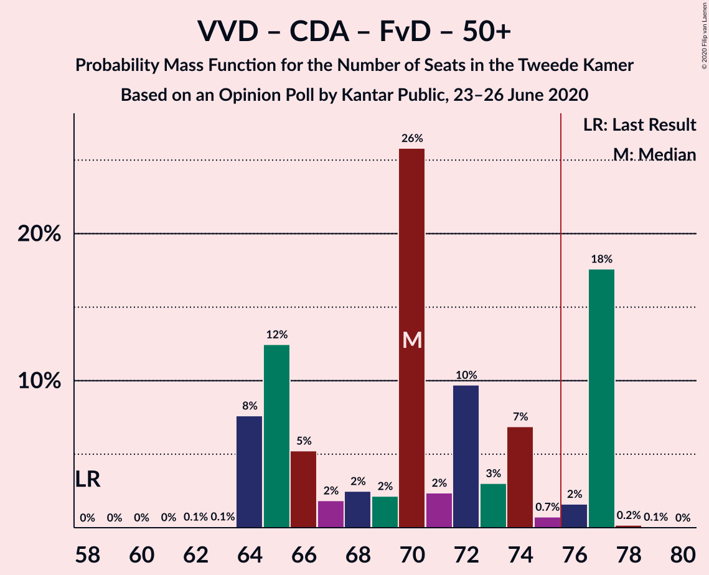

| Number of Seats | Probability | Accumulated | Special Marks |
|:---------------:|:-----------:|:-----------:|:-------------:|
| 58 | 0% | 100% | Last Result |
| 59 | 0% | 100% |  |
| 60 | 0% | 100% |  |
| 61 | 0% | 100% |  |
| 62 | 0.4% | 100% |  |
| 63 | 0.4% | 99.5% |  |
| 64 | 0% | 99.1% |  |
| 65 | 0% | 99.1% |  |
| 66 | 0.5% | 99.1% |  |
| 67 | 0% | 98.6% |  |
| 68 | 58% | 98.6% | Median |
| 69 | 0.1% | 41% |  |
| 70 | 1.4% | 40% |  |
| 71 | 0.6% | 39% |  |
| 72 | 21% | 39% |  |
| 73 | 0% | 18% |  |
| 74 | 18% | 18% |  |
| 75 | 0% | 0% |  |

### Volkspartij voor Vrijheid en Democratie – Christen-Democratisch Appèl – Forum voor Democratie – Staatkundig Gereformeerde Partij

| Number of Seats | Probability | Accumulated | Special Marks |
|:---------------:|:-----------:|:-----------:|:-------------:|
| 57 | 0% | 100% | Last Result |
| 58 | 0% | 100% |  |
| 59 | 0% | 100% |  |
| 60 | 0.1% | 100% |  |
| 61 | 0% | 99.9% |  |
| 62 | 0% | 99.9% |  |
| 63 | 0% | 99.9% |  |
| 64 | 0.8% | 99.9% |  |
| 65 | 0% | 99.1% |  |
| 66 | 0% | 99.0% |  |
| 67 | 0% | 99.0% |  |
| 68 | 0% | 99.0% |  |
| 69 | 0.6% | 99.0% |  |
| 70 | 63% | 98% | Median |
| 71 | 1.4% | 35% |  |
| 72 | 16% | 34% |  |
| 73 | 17% | 18% |  |
| 74 | 0.5% | 0.7% |  |
| 75 | 0% | 0.3% |  |
| 76 | 0% | 0.2% | Majority |
| 77 | 0.2% | 0.2% |  |
| 78 | 0% | 0% |  |

### Volkspartij voor Vrijheid en Democratie – Christen-Democratisch Appèl – Forum voor Democratie

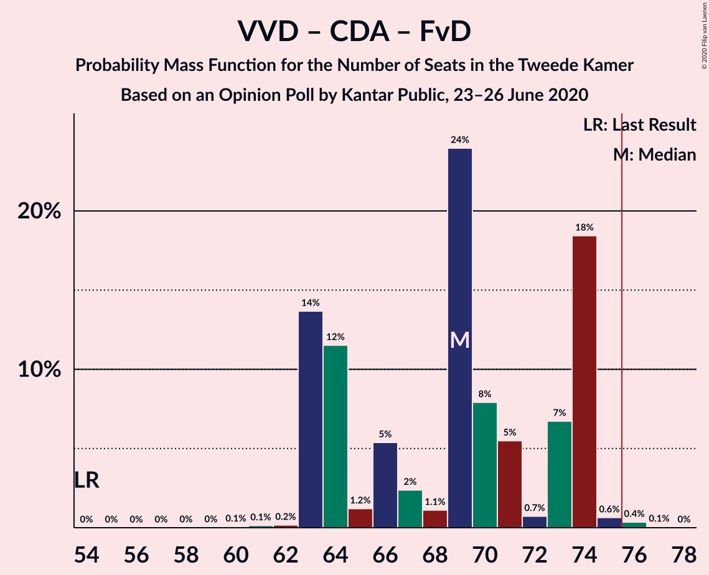

| Number of Seats | Probability | Accumulated | Special Marks |
|:---------------:|:-----------:|:-----------:|:-------------:|
| 54 | 0% | 100% | Last Result |
| 55 | 0% | 100% |  |
| 56 | 0% | 100% |  |
| 57 | 0.1% | 100% |  |
| 58 | 0% | 99.9% |  |
| 59 | 0% | 99.9% |  |
| 60 | 0% | 99.9% |  |
| 61 | 0.4% | 99.9% |  |
| 62 | 0.4% | 99.5% |  |
| 63 | 0.5% | 99.1% |  |
| 64 | 0.1% | 98.6% |  |
| 65 | 0% | 98.6% |  |
| 66 | 0% | 98.6% |  |
| 67 | 58% | 98.6% | Median |
| 68 | 4% | 40% |  |
| 69 | 19% | 37% |  |
| 70 | 0% | 18% |  |
| 71 | 0.5% | 18% |  |
| 72 | 18% | 18% |  |
| 73 | 0% | 0% |  |

### Volkspartij voor Vrijheid en Democratie – Partij voor de Vrijheid – Christen-Democratisch Appèl

| Number of Seats | Probability | Accumulated | Special Marks |
|:---------------:|:-----------:|:-----------:|:-------------:|
| 59 | 0.1% | 100% |  |
| 60 | 0.5% | 99.9% |  |
| 61 | 0% | 99.5% |  |
| 62 | 0% | 99.5% |  |
| 63 | 0% | 99.5% |  |
| 64 | 0% | 99.5% |  |
| 65 | 3% | 99.5% |  |
| 66 | 2% | 96% |  |
| 67 | 0.1% | 94% |  |
| 68 | 0% | 94% |  |
| 69 | 0.2% | 94% |  |
| 70 | 16% | 94% |  |
| 71 | 58% | 78% | Median |
| 72 | 20% | 20% | Last Result |
| 73 | 0.1% | 0.1% |  |
| 74 | 0% | 0% |  |

### Volkspartij voor Vrijheid en Democratie – Christen-Democratisch Appèl – Partij van de Arbeid

| Number of Seats | Probability | Accumulated | Special Marks |
|:---------------:|:-----------:|:-----------:|:-------------:|
| 55 | 0.4% | 100% |  |
| 56 | 0.4% | 99.6% |  |
| 57 | 0.5% | 99.2% |  |
| 58 | 0% | 98.7% |  |
| 59 | 0% | 98.7% |  |
| 60 | 0.1% | 98.7% |  |
| 61 | 0% | 98.7% | Last Result |
| 62 | 0% | 98.7% |  |
| 63 | 0.1% | 98.7% |  |
| 64 | 0% | 98.6% |  |
| 65 | 0.2% | 98.6% |  |
| 66 | 74% | 98% | Median |
| 67 | 0.1% | 24% |  |
| 68 | 0% | 24% |  |
| 69 | 20% | 24% |  |
| 70 | 2% | 4% |  |
| 71 | 0% | 2% |  |
| 72 | 0% | 2% |  |
| 73 | 2% | 2% |  |
| 74 | 0% | 0% |  |

### Volkspartij voor Vrijheid en Democratie – Christen-Democratisch Appèl – Democraten 66

| Number of Seats | Probability | Accumulated | Special Marks |
|:---------------:|:-----------:|:-----------:|:-------------:|
| 58 | 0.4% | 100% |  |
| 59 | 0% | 99.6% |  |
| 60 | 0% | 99.6% |  |
| 61 | 0.4% | 99.6% |  |
| 62 | 0% | 99.2% |  |
| 63 | 0% | 99.1% |  |
| 64 | 2% | 99.1% |  |
| 65 | 75% | 97% | Median |
| 66 | 0.1% | 23% |  |
| 67 | 0% | 23% |  |
| 68 | 0.2% | 23% |  |
| 69 | 17% | 22% |  |
| 70 | 3% | 5% |  |
| 71 | 0.1% | 2% | Last Result |
| 72 | 0% | 2% |  |
| 73 | 2% | 2% |  |
| 74 | 0% | 0% |  |

### Volkspartij voor Vrijheid en Democratie – Democraten 66 – Partij van de Arbeid

| Number of Seats | Probability | Accumulated | Special Marks |
|:---------------:|:-----------:|:-----------:|:-------------:|
| 55 | 0.4% | 100% |  |
| 56 | 0% | 99.6% |  |
| 57 | 0.4% | 99.6% |  |
| 58 | 0% | 99.2% |  |
| 59 | 0% | 99.2% |  |
| 60 | 17% | 99.2% |  |
| 61 | 58% | 82% | Last Result, Median |
| 62 | 0.5% | 24% |  |
| 63 | 0% | 23% |  |
| 64 | 0% | 23% |  |
| 65 | 0.1% | 23% |  |
| 66 | 0.3% | 23% |  |
| 67 | 17% | 23% |  |
| 68 | 3% | 6% |  |
| 69 | 0% | 3% |  |
| 70 | 0.6% | 3% |  |
| 71 | 0% | 2% |  |
| 72 | 2% | 2% |  |
| 73 | 0% | 0% |  |

### GroenLinks – Christen-Democratisch Appèl – Democraten 66 – Partij van de Arbeid – ChristenUnie

| Number of Seats | Probability | Accumulated | Special Marks |
|:---------------:|:-----------:|:-----------:|:-------------:|
| 50 | 0.6% | 100% |  |
| 51 | 0.1% | 99.4% |  |
| 52 | 0% | 99.3% |  |
| 53 | 0% | 99.3% |  |
| 54 | 0.1% | 99.3% |  |
| 55 | 0.5% | 99.2% |  |
| 56 | 0.5% | 98.7% |  |
| 57 | 36% | 98% |  |
| 58 | 58% | 62% | Median |
| 59 | 1.4% | 4% |  |
| 60 | 3% | 3% |  |
| 61 | 0% | 0.1% |  |
| 62 | 0% | 0.1% |  |
| 63 | 0% | 0.1% |  |
| 64 | 0% | 0.1% |  |
| 65 | 0% | 0.1% |  |
| 66 | 0% | 0.1% | Last Result |
| 67 | 0% | 0.1% |  |
| 68 | 0% | 0.1% |  |
| 69 | 0.1% | 0.1% |  |
| 70 | 0% | 0% |  |

### Volkspartij voor Vrijheid en Democratie – Christen-Democratisch Appèl

| Number of Seats | Probability | Accumulated | Special Marks |
|:---------------:|:-----------:|:-----------:|:-------------:|
| 47 | 0.8% | 100% |  |
| 48 | 0% | 99.1% |  |
| 49 | 0.5% | 99.1% |  |
| 50 | 0% | 98.7% |  |
| 51 | 0% | 98.7% |  |
| 52 | 0% | 98.7% | Last Result |
| 53 | 0% | 98.7% |  |
| 54 | 16% | 98.7% |  |
| 55 | 59% | 83% | Median |
| 56 | 3% | 23% |  |
| 57 | 0.3% | 20% |  |
| 58 | 0% | 20% |  |
| 59 | 0% | 20% |  |
| 60 | 20% | 20% |  |
| 61 | 0% | 0% |  |

### Volkspartij voor Vrijheid en Democratie – Partij van de Arbeid

| Number of Seats | Probability | Accumulated | Special Marks |
|:---------------:|:-----------:|:-----------:|:-------------:|
| 42 | 0% | 100% | Last Result |
| 43 | 0.4% | 100% |  |
| 44 | 0.4% | 99.6% |  |
| 45 | 0% | 99.2% |  |
| 46 | 0% | 99.2% |  |
| 47 | 0.5% | 99.2% |  |
| 48 | 0% | 98.7% |  |
| 49 | 0% | 98.6% |  |
| 50 | 0% | 98.6% |  |
| 51 | 75% | 98.6% | Median |
| 52 | 0% | 23% |  |
| 53 | 0% | 23% |  |
| 54 | 3% | 23% |  |
| 55 | 0.3% | 20% |  |
| 56 | 16% | 20% |  |
| 57 | 0% | 4% |  |
| 58 | 1.4% | 4% |  |
| 59 | 2% | 3% |  |
| 60 | 0% | 0.5% |  |
| 61 | 0.5% | 0.5% |  |
| 62 | 0% | 0% |  |

### Christen-Democratisch Appèl – Democraten 66 – Partij van de Arbeid

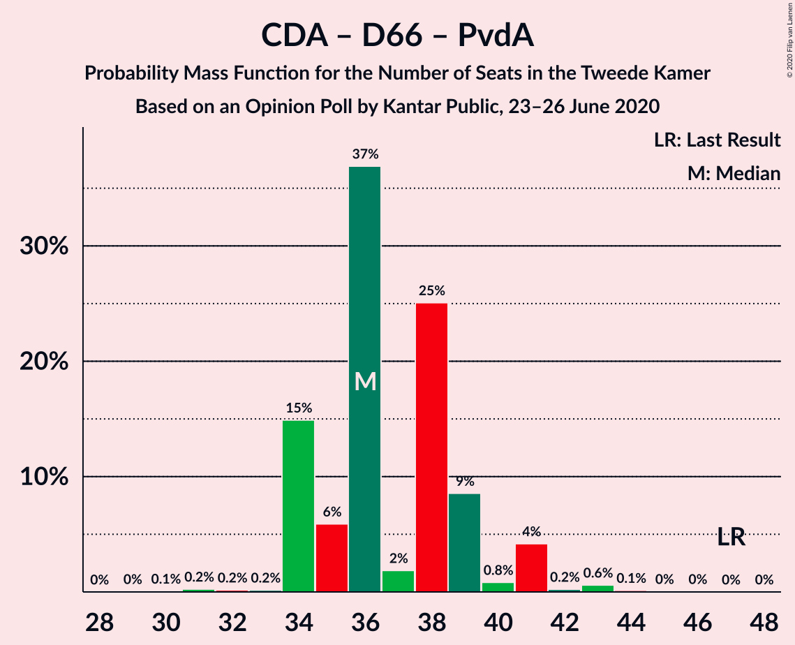

| Number of Seats | Probability | Accumulated | Special Marks |
|:---------------:|:-----------:|:-----------:|:-------------:|
| 29 | 0.2% | 100% |  |
| 30 | 0.5% | 99.8% |  |
| 31 | 0% | 99.3% |  |
| 32 | 0.5% | 99.3% |  |
| 33 | 17% | 98.8% |  |
| 34 | 0.1% | 82% |  |
| 35 | 0% | 82% |  |
| 36 | 77% | 82% | Median |
| 37 | 0% | 5% |  |
| 38 | 0% | 5% |  |
| 39 | 0% | 5% |  |
| 40 | 2% | 5% |  |
| 41 | 0% | 3% |  |
| 42 | 3% | 3% |  |
| 43 | 0% | 0% |  |
| 44 | 0% | 0% |  |
| 45 | 0% | 0% |  |
| 46 | 0% | 0% |  |
| 47 | 0% | 0% | Last Result |

### Christen-Democratisch Appèl – Partij van de Arbeid – ChristenUnie

| Number of Seats | Probability | Accumulated | Special Marks |
|:---------------:|:-----------:|:-----------:|:-------------:|
| 21 | 0.1% | 100% |  |
| 22 | 0.6% | 99.9% |  |
| 23 | 0% | 99.3% |  |
| 24 | 0.5% | 99.3% |  |
| 25 | 16% | 98.8% |  |
| 26 | 0.4% | 83% |  |
| 27 | 0.2% | 82% |  |
| 28 | 0% | 82% |  |
| 29 | 0% | 82% |  |
| 30 | 0.5% | 82% |  |
| 31 | 58% | 82% | Median |
| 32 | 0% | 24% |  |
| 33 | 3% | 24% | Last Result |
| 34 | 2% | 21% |  |
| 35 | 17% | 19% |  |
| 36 | 0% | 1.4% |  |
| 37 | 1.4% | 1.4% |  |
| 38 | 0% | 0% |  |

### Christen-Democratisch Appèl – Democraten 66

| Number of Seats | Probability | Accumulated | Special Marks |
|:---------------:|:-----------:|:-----------:|:-------------:|
| 18 | 0.5% | 100% |  |
| 19 | 0% | 99.5% |  |
| 20 | 0% | 99.5% |  |
| 21 | 18% | 99.5% |  |
| 22 | 0.5% | 82% |  |
| 23 | 0% | 81% |  |
| 24 | 0.1% | 81% |  |
| 25 | 58% | 81% | Median |
| 26 | 0% | 23% |  |
| 27 | 20% | 23% |  |
| 28 | 0% | 3% |  |
| 29 | 3% | 3% |  |
| 30 | 0% | 0% |  |
| 31 | 0% | 0% |  |
| 32 | 0% | 0% |  |
| 33 | 0% | 0% |  |
| 34 | 0% | 0% |  |
| 35 | 0% | 0% |  |
| 36 | 0% | 0% |  |
| 37 | 0% | 0% |  |
| 38 | 0% | 0% | Last Result |

### Christen-Democratisch Appèl – Partij van de Arbeid

| Number of Seats | Probability | Accumulated | Special Marks |
|:---------------:|:-----------:|:-----------:|:-------------:|
| 18 | 0.7% | 100% |  |
| 19 | 0.5% | 99.3% |  |
| 20 | 0% | 98.8% |  |
| 21 | 0% | 98.8% |  |
| 22 | 16% | 98.8% |  |
| 23 | 0.5% | 82% |  |
| 24 | 0.1% | 82% |  |
| 25 | 0% | 82% |  |
| 26 | 58% | 82% | Median |
| 27 | 21% | 24% |  |
| 28 | 3% | 3% | Last Result |
| 29 | 0% | 0% |  |

## Technical Information

### Opinion Poll

+ **Polling firm:** Kantar Public
+ **Commissioner(s):** —
+ **Fieldwork period:** 23–26 June 2020

### Calculations

+ **Sample size:** 901
+ **Simulations done:** 1,024
+ **Error estimate:** 4.36%

