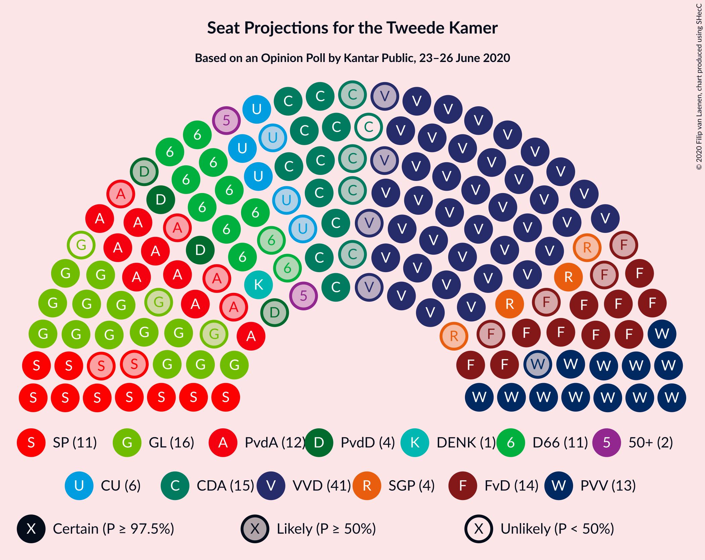
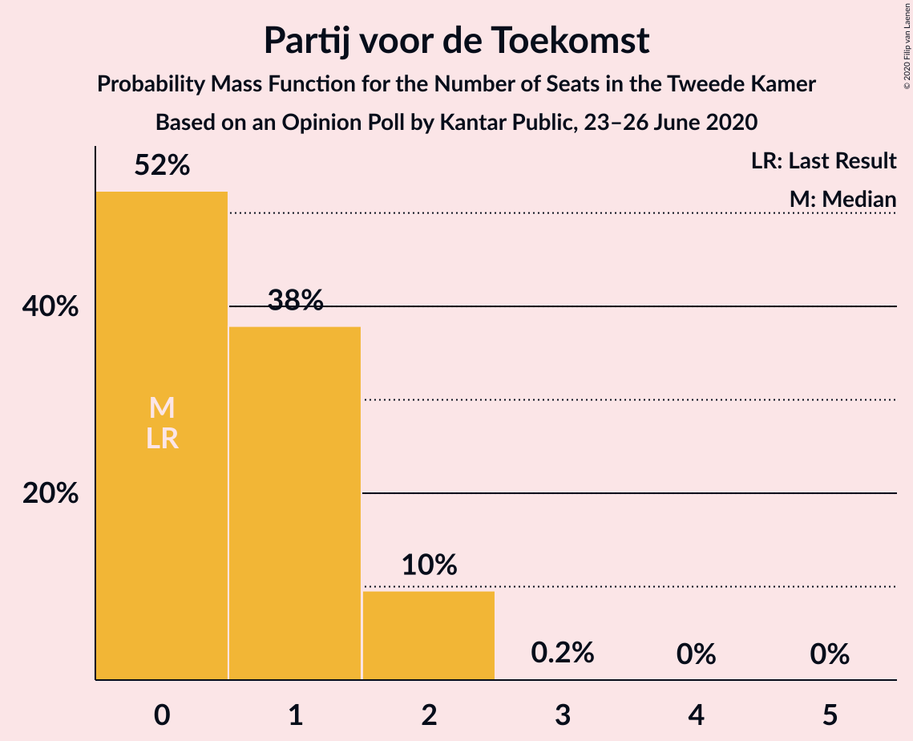
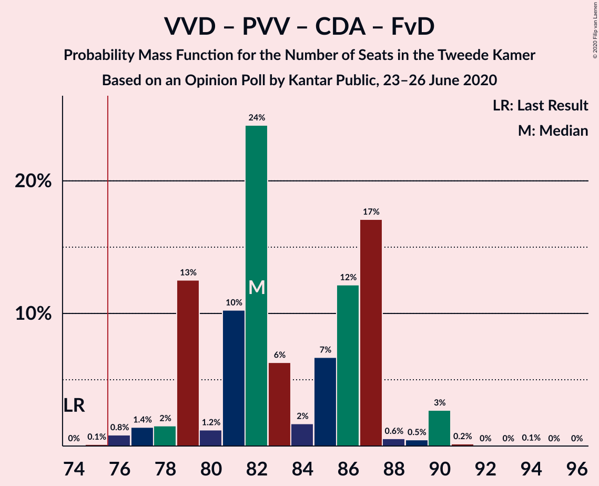
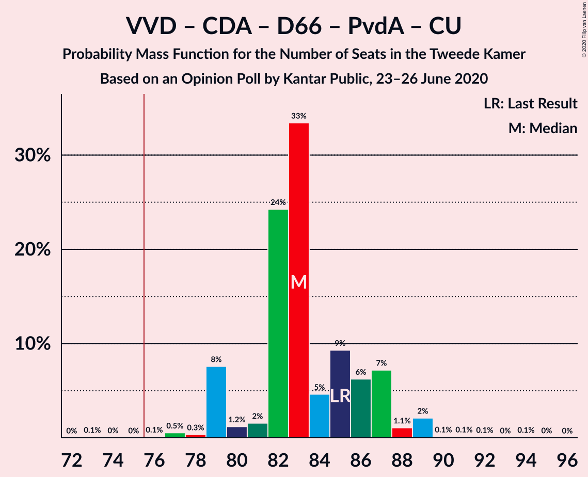
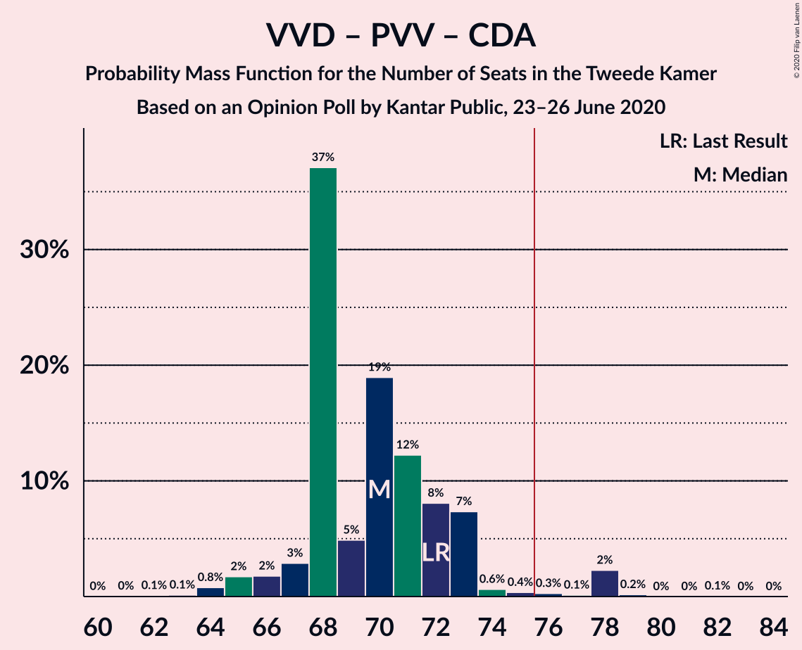
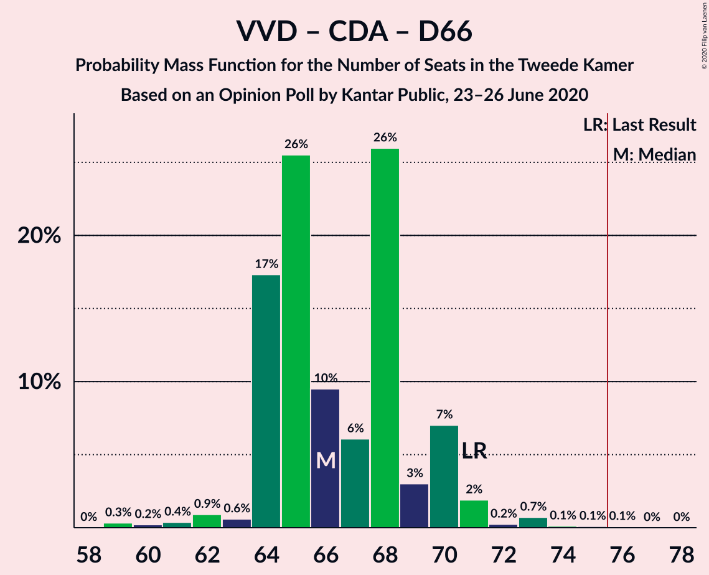
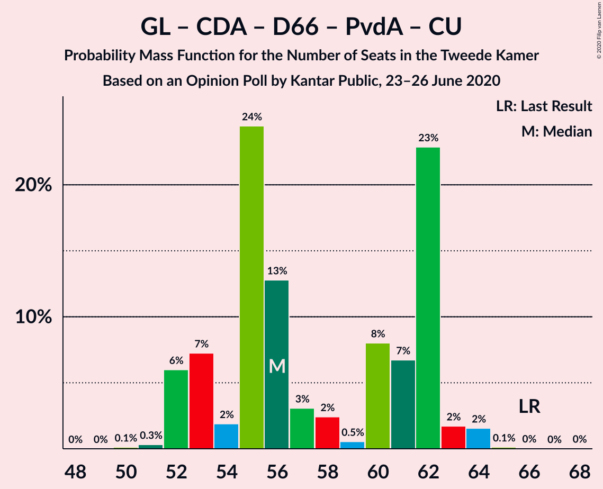
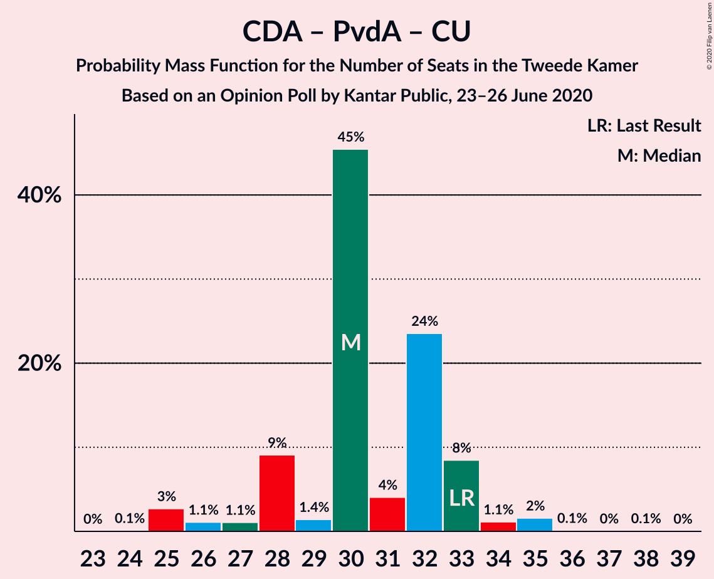

# Opinion Poll by Kantar Public, 23–26 June 2020

<a href="#voting-intentions">Voting Intentions</a> | <a href="#seats">Seats</a> | <a href="#coalitions">Coalitions</a> | <a href="#technical-information">Technical Information</a>

## Voting Intentions

### Confidence Intervals

| Party | Last Result | Poll Result | 80% Confidence Interval | 90% Confidence Interval | 95% Confidence Interval | 99% Confidence Interval |
|:-----:|:-----------:|:-----------:|:-----------------------:|:-----------------------:|:-----------------------:|:-----------------------:|
| Volkspartij voor Vrijheid en Democratie | 21.3% | 26.6% | 24.8–28.6% |24.3–29.1% |23.9–29.6% |23.0–30.6% |
| Partij voor de Vrijheid | 13.1% | 10.0% | 8.8–11.4% |8.5–11.8% |8.2–12.1% |7.7–12.8% |
| GroenLinks | 9.1% | 10.0% | 8.8–11.4% |8.5–11.8% |8.2–12.1% |7.7–12.8% |
| Christen-Democratisch Appèl | 12.4% | 9.3% | 8.2–10.7% |7.9–11.1% |7.6–11.4% |7.1–12.1% |
| Forum voor Democratie | 1.8% | 8.7% | 7.6–10.0% |7.3–10.3% |7.0–10.7% |6.5–11.3% |
| Democraten 66 | 12.2% | 8.0% | 6.9–9.3% |6.6–9.6% |6.4–10.0% |5.9–10.6% |
| Socialistische Partij | 9.1% | 8.0% | 6.9–9.3% |6.6–9.6% |6.4–10.0% |5.9–10.6% |
| Partij van de Arbeid | 5.7% | 8.0% | 6.9–9.3% |6.6–9.6% |6.4–10.0% |5.9–10.6% |
| ChristenUnie | 3.4% | 3.3% | 2.7–4.2% |2.5–4.5% |2.3–4.7% |2.1–5.2% |
| Partij voor de Dieren | 3.2% | 2.7% | 2.1–3.5% |1.9–3.7% |1.8–3.9% |1.6–4.4% |
| Staatkundig Gereformeerde Partij | 2.1% | 2.0% | 1.5–2.7% |1.4–3.0% |1.3–3.1% |1.1–3.5% |
| 50Plus | 3.1% | 1.3% | 1.0–2.0% |0.9–2.1% |0.8–2.3% |0.6–2.7% |
| DENK | 2.1% | 1.3% | 1.0–2.0% |0.9–2.1% |0.8–2.3% |0.6–2.7% |
| Partij voor de Toekomst | 0.0% | 0.7% | 0.4–1.2% |0.4–1.3% |0.3–1.4% |0.2–1.7% |

*Note:* The poll result column reflects the actual value used in the calculations. Published results may vary slightly, and in addition be rounded to fewer digits.

## Seats

### Confidence Intervals

| Party | Last Result | Median | 80% Confidence Interval | 90% Confidence Interval | 95% Confidence Interval | 99% Confidence Interval |
|:-----:|:-----------:|:------:|:-----------------------:|:-----------------------:|:-----------------------:|:-----------------------:|
| <a href="#volkspartij-voor-vrijheid-en-democratie">Volkspartij voor Vrijheid en Democratie</a> | 33 | 41 | 39–47 |37–47 |37–47 |36–48 |
| <a href="#partij-voor-de-vrijheid">Partij voor de Vrijheid</a> | 20 | 13 | 13–17 |13–19 |12–19 |12–19 |
| <a href="#groenlinks">GroenLinks</a> | 14 | 15 | 13–20 |13–20 |13–20 |11–20 |
| <a href="#christen-democratisch-appèl">Christen-Democratisch Appèl</a> | 19 | 14 | 11–15 |10–15 |10–15 |10–18 |
| <a href="#forum-voor-democratie">Forum voor Democratie</a> | 2 | 14 | 11–17 |10–17 |10–17 |10–19 |
| <a href="#democraten-66">Democraten 66</a> | 19 | 11 | 10–14 |10–14 |9–14 |9–15 |
| <a href="#socialistische-partij">Socialistische Partij</a> | 14 | 11 | 11–13 |9–15 |9–15 |9–16 |
| <a href="#partij-van-de-arbeid">Partij van de Arbeid</a> | 9 | 12 | 11–13 |10–13 |8–14 |8–16 |
| <a href="#christenunie">ChristenUnie</a> | 5 | 6 | 3–6 |3–6 |3–7 |2–8 |
| <a href="#partij-voor-de-dieren">Partij voor de Dieren</a> | 5 | 4 | 3–5 |3–5 |2–5 |2–6 |
| <a href="#staatkundig-gereformeerde-partij">Staatkundig Gereformeerde Partij</a> | 3 | 4 | 2–4 |2–4 |2–4 |1–5 |
| <a href="#50plus">50Plus</a> | 4 | 2 | 1–3 |0–3 |0–4 |0–4 |
| <a href="#denk">DENK</a> | 3 | 1 | 1–2 |1–2 |1–3 |0–4 |
| <a href="#partij-voor-de-toekomst">Partij voor de Toekomst</a> | 0 | 0 | 0–1 |0–2 |0–2 |0–2 |

### Volkspartij voor Vrijheid en Democratie

*For a full overview of the results for this party, see the [Volkspartij voor Vrijheid en Democratie](party-volkspartijvoorvrijheidendemocratie.html) page.*

| Number of Seats | Probability | Accumulated | Special Marks |
|:---------------:|:-----------:|:-----------:|:-------------:|
| 33 | 0.1% | 100% | Last Result |
| 34 | 0% | 99.9% |  |
| 35 | 0.4% | 99.9% |  |
| 36 | 0.4% | 99.5% |  |
| 37 | 6% | 99.1% |  |
| 38 | 2% | 93% |  |
| 39 | 6% | 92% |  |
| 40 | 32% | 86% |  |
| 41 | 14% | 54% | Median |
| 42 | 19% | 40% |  |
| 43 | 2% | 21% |  |
| 44 | 1.2% | 19% |  |
| 45 | 2% | 18% |  |
| 46 | 0.1% | 15% |  |
| 47 | 13% | 15% |  |
| 48 | 2% | 2% |  |
| 49 | 0.1% | 0.2% |  |
| 50 | 0.1% | 0.1% |  |
| 51 | 0% | 0% |  |

### Partij voor de Vrijheid

*For a full overview of the results for this party, see the [Partij voor de Vrijheid](party-partijvoordevrijheid.html) page.*

| Number of Seats | Probability | Accumulated | Special Marks |
|:---------------:|:-----------:|:-----------:|:-------------:|
| 10 | 0.1% | 100% |  |
| 11 | 0.3% | 99.9% |  |
| 12 | 3% | 99.6% |  |
| 13 | 49% | 96% | Median |
| 14 | 4% | 47% |  |
| 15 | 14% | 44% |  |
| 16 | 15% | 30% |  |
| 17 | 7% | 15% |  |
| 18 | 0.8% | 8% |  |
| 19 | 7% | 7% |  |
| 20 | 0.2% | 0.3% | Last Result |
| 21 | 0.1% | 0.1% |  |
| 22 | 0% | 0% |  |

### GroenLinks

*For a full overview of the results for this party, see the [GroenLinks](party-groenlinks.html) page.*

| Number of Seats | Probability | Accumulated | Special Marks |
|:---------------:|:-----------:|:-----------:|:-------------:|
| 10 | 0.1% | 100% |  |
| 11 | 1.0% | 99.9% |  |
| 12 | 0.7% | 98.9% |  |
| 13 | 13% | 98% |  |
| 14 | 33% | 85% | Last Result |
| 15 | 6% | 52% | Median |
| 16 | 15% | 46% |  |
| 17 | 2% | 32% |  |
| 18 | 6% | 30% |  |
| 19 | 0.2% | 24% |  |
| 20 | 24% | 24% |  |
| 21 | 0.1% | 0.1% |  |
| 22 | 0% | 0% |  |

### Christen-Democratisch Appèl

*For a full overview of the results for this party, see the [Christen-Democratisch Appèl](party-christen-democratischappèl.html) page.*

| Number of Seats | Probability | Accumulated | Special Marks |
|:---------------:|:-----------:|:-----------:|:-------------:|
| 10 | 7% | 100% |  |
| 11 | 13% | 93% |  |
| 12 | 3% | 80% |  |
| 13 | 11% | 77% |  |
| 14 | 18% | 66% | Median |
| 15 | 46% | 48% |  |
| 16 | 1.0% | 2% |  |
| 17 | 0.4% | 1.1% |  |
| 18 | 0.6% | 0.7% |  |
| 19 | 0% | 0% | Last Result |

### Forum voor Democratie

*For a full overview of the results for this party, see the [Forum voor Democratie](party-forumvoordemocratie.html) page.*

| Number of Seats | Probability | Accumulated | Special Marks |
|:---------------:|:-----------:|:-----------:|:-------------:|
| 2 | 0% | 100% | Last Result |
| 3 | 0% | 100% |  |
| 4 | 0% | 100% |  |
| 5 | 0% | 100% |  |
| 6 | 0% | 100% |  |
| 7 | 0% | 100% |  |
| 8 | 0% | 100% |  |
| 9 | 0.4% | 100% |  |
| 10 | 8% | 99.6% |  |
| 11 | 13% | 91% |  |
| 12 | 11% | 79% |  |
| 13 | 18% | 68% |  |
| 14 | 25% | 50% | Median |
| 15 | 3% | 25% |  |
| 16 | 1.2% | 22% |  |
| 17 | 20% | 21% |  |
| 18 | 0.4% | 1.0% |  |
| 19 | 0.4% | 0.6% |  |
| 20 | 0% | 0.1% |  |
| 21 | 0.1% | 0.1% |  |
| 22 | 0% | 0% |  |

### Democraten 66

*For a full overview of the results for this party, see the [Democraten 66](party-democraten66.html) page.*

| Number of Seats | Probability | Accumulated | Special Marks |
|:---------------:|:-----------:|:-----------:|:-------------:|
| 8 | 0.2% | 100% |  |
| 9 | 2% | 99.7% |  |
| 10 | 33% | 97% |  |
| 11 | 27% | 64% | Median |
| 12 | 25% | 37% |  |
| 13 | 1.2% | 12% |  |
| 14 | 10% | 11% |  |
| 15 | 1.0% | 1.3% |  |
| 16 | 0.3% | 0.3% |  |
| 17 | 0% | 0.1% |  |
| 18 | 0% | 0% |  |
| 19 | 0% | 0% | Last Result |

### Socialistische Partij

*For a full overview of the results for this party, see the [Socialistische Partij](party-socialistischepartij.html) page.*

| Number of Seats | Probability | Accumulated | Special Marks |
|:---------------:|:-----------:|:-----------:|:-------------:|
| 7 | 0.1% | 100% |  |
| 8 | 0.1% | 99.9% |  |
| 9 | 6% | 99.8% |  |
| 10 | 2% | 93% |  |
| 11 | 43% | 91% | Median |
| 12 | 22% | 48% |  |
| 13 | 17% | 26% |  |
| 14 | 1.0% | 9% | Last Result |
| 15 | 8% | 8% |  |
| 16 | 0.5% | 0.6% |  |
| 17 | 0.1% | 0.1% |  |
| 18 | 0% | 0% |  |

### Partij van de Arbeid

*For a full overview of the results for this party, see the [Partij van de Arbeid](party-partijvandearbeid.html) page.*

| Number of Seats | Probability | Accumulated | Special Marks |
|:---------------:|:-----------:|:-----------:|:-------------:|
| 8 | 3% | 100% |  |
| 9 | 2% | 97% | Last Result |
| 10 | 0.9% | 95% |  |
| 11 | 40% | 94% |  |
| 12 | 21% | 54% | Median |
| 13 | 29% | 33% |  |
| 14 | 2% | 3% |  |
| 15 | 0.3% | 2% |  |
| 16 | 0.8% | 1.2% |  |
| 17 | 0.4% | 0.4% |  |
| 18 | 0% | 0% |  |

### ChristenUnie

*For a full overview of the results for this party, see the [ChristenUnie](party-christenunie.html) page.*

| Number of Seats | Probability | Accumulated | Special Marks |
|:---------------:|:-----------:|:-----------:|:-------------:|
| 2 | 0.6% | 100% |  |
| 3 | 23% | 99.4% |  |
| 4 | 11% | 76% |  |
| 5 | 11% | 65% | Last Result |
| 6 | 51% | 54% | Median |
| 7 | 0.6% | 3% |  |
| 8 | 2% | 2% |  |
| 9 | 0% | 0% |  |

### Partij voor de Dieren

*For a full overview of the results for this party, see the [Partij voor de Dieren](party-partijvoordedieren.html) page.*

| Number of Seats | Probability | Accumulated | Special Marks |
|:---------------:|:-----------:|:-----------:|:-------------:|
| 2 | 3% | 100% |  |
| 3 | 29% | 97% |  |
| 4 | 45% | 68% | Median |
| 5 | 22% | 24% | Last Result |
| 6 | 1.2% | 1.3% |  |
| 7 | 0.1% | 0.1% |  |
| 8 | 0% | 0% |  |

### Staatkundig Gereformeerde Partij

*For a full overview of the results for this party, see the [Staatkundig Gereformeerde Partij](party-staatkundiggereformeerdepartij.html) page.*

| Number of Seats | Probability | Accumulated | Special Marks |
|:---------------:|:-----------:|:-----------:|:-------------:|
| 1 | 2% | 100% |  |
| 2 | 31% | 98% |  |
| 3 | 16% | 67% | Last Result |
| 4 | 50% | 51% | Median |
| 5 | 1.0% | 1.0% |  |
| 6 | 0% | 0.1% |  |
| 7 | 0% | 0% |  |

### 50Plus

*For a full overview of the results for this party, see the [50Plus](party-50plus.html) page.*

| Number of Seats | Probability | Accumulated | Special Marks |
|:---------------:|:-----------:|:-----------:|:-------------:|
| 0 | 6% | 100% |  |
| 1 | 38% | 94% |  |
| 2 | 32% | 55% | Median |
| 3 | 21% | 24% |  |
| 4 | 3% | 3% | Last Result |
| 5 | 0% | 0.1% |  |
| 6 | 0% | 0% |  |

### DENK

*For a full overview of the results for this party, see the [DENK](party-denk.html) page.*

| Number of Seats | Probability | Accumulated | Special Marks |
|:---------------:|:-----------:|:-----------:|:-------------:|
| 0 | 1.4% | 100% |  |
| 1 | 52% | 98.6% | Median |
| 2 | 43% | 47% |  |
| 3 | 2% | 3% | Last Result |
| 4 | 0.9% | 0.9% |  |
| 5 | 0% | 0% |  |

### Partij voor de Toekomst

*For a full overview of the results for this party, see the [Partij voor de Toekomst](party-partijvoordetoekomst.html) page.*

| Number of Seats | Probability | Accumulated | Special Marks |
|:---------------:|:-----------:|:-----------:|:-------------:|
| 0 | 52% | 100% | Last Result, Median |
| 1 | 38% | 48% |  |
| 2 | 10% | 10% |  |
| 3 | 0.2% | 0.2% |  |
| 4 | 0% | 0% |  |

## Coalitions

### Confidence Intervals

| Coalition | Last Result | Median | Majority? | 80% Confidence Interval | 90% Confidence Interval | 95% Confidence Interval | 99% Confidence Interval |
|:---------:|:-----------:|:------:|:---------:|:-----------------------:|:-----------------------:|:-----------------------:|:-----------------------:|
| Volkspartij voor Vrijheid en Democratie – Partij voor de Vrijheid – Christen-Democratisch Appèl – Forum voor Democratie – Staatkundig Gereformeerde Partij | 77 | 86 | 100% | 83–90 | 83–90 | 80–93 | 79–94 |
| Volkspartij voor Vrijheid en Democratie – GroenLinks – Christen-Democratisch Appèl – Democraten 66 – ChristenUnie | 90 | 88 | 100% | 84–91 | 84–91 | 82–91 | 80–93 |
| Volkspartij voor Vrijheid en Democratie – Partij voor de Vrijheid – Christen-Democratisch Appèl – Forum voor Democratie | 74 | 82 | 99.8% | 79–87 | 79–87 | 78–90 | 76–90 |
| Volkspartij voor Vrijheid en Democratie – Christen-Democratisch Appèl – Democraten 66 – Partij van de Arbeid – ChristenUnie | 85 | 83 | 99.9% | 81–87 | 79–87 | 79–89 | 77–89 |
| Volkspartij voor Vrijheid en Democratie – Christen-Democratisch Appèl – Forum voor Democratie – Staatkundig Gereformeerde Partij – 50Plus | 61 | 74 | 33% | 68–79 | 67–79 | 67–79 | 66–79 |
| Volkspartij voor Vrijheid en Democratie – Partij voor de Vrijheid – Christen-Democratisch Appèl | 72 | 70 | 3% | 68–73 | 67–73 | 65–78 | 64–78 |
| Volkspartij voor Vrijheid en Democratie – Christen-Democratisch Appèl – Democraten 66 – ChristenUnie | 76 | 71 | 10% | 70–75 | 68–76 | 68–77 | 65–78 |
| Volkspartij voor Vrijheid en Democratie – Christen-Democratisch Appèl – Forum voor Democratie – Staatkundig Gereformeerde Partij | 57 | 73 | 25% | 67–76 | 66–77 | 66–77 | 65–78 |
| Volkspartij voor Vrijheid en Democratie – Christen-Democratisch Appèl – Forum voor Democratie – 50Plus | 58 | 70 | 19% | 65–77 | 64–77 | 64–77 | 64–77 |
| GroenLinks – Christen-Democratisch Appèl – Democraten 66 – Partij van de Arbeid – Socialistische Partij – ChristenUnie | 80 | 69 | 8% | 64–73 | 64–76 | 63–76 | 63–79 |
| Volkspartij voor Vrijheid en Democratie – Christen-Democratisch Appèl – Forum voor Democratie | 54 | 69 | 0.4% | 63–74 | 63–74 | 63–74 | 63–75 |
| Volkspartij voor Vrijheid en Democratie – Christen-Democratisch Appèl – Partij van de Arbeid | 61 | 66 | 0.1% | 63–71 | 63–71 | 62–72 | 61–73 |
| Volkspartij voor Vrijheid en Democratie – Christen-Democratisch Appèl – Democraten 66 | 71 | 66 | 0.1% | 64–70 | 64–70 | 64–71 | 60–73 |
| Volkspartij voor Vrijheid en Democratie – Democraten 66 – Partij van de Arbeid | 61 | 65 | 0% | 61–68 | 60–71 | 60–71 | 57–71 |
| GroenLinks – Christen-Democratisch Appèl – Democraten 66 – Partij van de Arbeid – ChristenUnie | 66 | 56 | 0% | 53–62 | 52–62 | 52–63 | 52–64 |
| Volkspartij voor Vrijheid en Democratie – Christen-Democratisch Appèl | 52 | 55 | 0% | 52–59 | 52–60 | 51–60 | 50–61 |
| Volkspartij voor Vrijheid en Democratie – Partij van de Arbeid | 42 | 54 | 0% | 50–58 | 48–60 | 48–60 | 46–60 |
| Christen-Democratisch Appèl – Democraten 66 – Partij van de Arbeid | 47 | 36 | 0% | 34–39 | 34–41 | 34–41 | 32–43 |
| Christen-Democratisch Appèl – Partij van de Arbeid – ChristenUnie | 33 | 30 | 0% | 28–33 | 27–33 | 25–34 | 25–35 |
| Christen-Democratisch Appèl – Partij van de Arbeid | 28 | 26 | 0% | 23–27 | 22–27 | 22–29 | 20–30 |
| Christen-Democratisch Appèl – Democraten 66 | 38 | 25 | 0% | 23–27 | 21–28 | 21–28 | 21–30 |

### Volkspartij voor Vrijheid en Democratie – Partij voor de Vrijheid – Christen-Democratisch Appèl – Forum voor Democratie – Staatkundig Gereformeerde Partij

| Number of Seats | Probability | Accumulated | Special Marks |
|:---------------:|:-----------:|:-----------:|:-------------:|
| 77 | 0% | 100% | Last Result |
| 78 | 0% | 100% |  |
| 79 | 2% | 99.9% |  |
| 80 | 2% | 98% |  |
| 81 | 0.4% | 97% |  |
| 82 | 0.7% | 96% |  |
| 83 | 15% | 96% |  |
| 84 | 8% | 80% |  |
| 85 | 7% | 73% |  |
| 86 | 24% | 65% | Median |
| 87 | 3% | 41% |  |
| 88 | 7% | 38% |  |
| 89 | 17% | 31% |  |
| 90 | 10% | 14% |  |
| 91 | 0.9% | 4% |  |
| 92 | 0.5% | 3% |  |
| 93 | 0% | 3% |  |
| 94 | 2% | 2% |  |
| 95 | 0% | 0.1% |  |
| 96 | 0% | 0.1% |  |
| 97 | 0.1% | 0.1% |  |
| 98 | 0% | 0% |  |

### Volkspartij voor Vrijheid en Democratie – GroenLinks – Christen-Democratisch Appèl – Democraten 66 – ChristenUnie

| Number of Seats | Probability | Accumulated | Special Marks |
|:---------------:|:-----------:|:-----------:|:-------------:|
| 78 | 0.1% | 100% |  |
| 79 | 0.1% | 99.9% |  |
| 80 | 0.6% | 99.8% |  |
| 81 | 1.4% | 99.2% |  |
| 82 | 1.2% | 98% |  |
| 83 | 0.5% | 97% |  |
| 84 | 14% | 96% |  |
| 85 | 18% | 82% |  |
| 86 | 12% | 64% |  |
| 87 | 0.7% | 52% | Median |
| 88 | 9% | 51% |  |
| 89 | 14% | 42% |  |
| 90 | 3% | 28% | Last Result |
| 91 | 23% | 25% |  |
| 92 | 2% | 2% |  |
| 93 | 0.3% | 0.5% |  |
| 94 | 0.2% | 0.3% |  |
| 95 | 0% | 0.1% |  |
| 96 | 0% | 0.1% |  |
| 97 | 0% | 0% |  |

### Volkspartij voor Vrijheid en Democratie – Partij voor de Vrijheid – Christen-Democratisch Appèl – Forum voor Democratie

| Number of Seats | Probability | Accumulated | Special Marks |
|:---------------:|:-----------:|:-----------:|:-------------:|
| 74 | 0% | 100% | Last Result |
| 75 | 0.1% | 100% |  |
| 76 | 0.8% | 99.8% | Majority |
| 77 | 1.4% | 99.0% |  |
| 78 | 2% | 98% |  |
| 79 | 13% | 96% |  |
| 80 | 1.2% | 84% |  |
| 81 | 10% | 82% |  |
| 82 | 24% | 72% | Median |
| 83 | 6% | 48% |  |
| 84 | 2% | 42% |  |
| 85 | 7% | 40% |  |
| 86 | 12% | 33% |  |
| 87 | 17% | 21% |  |
| 88 | 0.6% | 4% |  |
| 89 | 0.5% | 3% |  |
| 90 | 3% | 3% |  |
| 91 | 0.2% | 0.2% |  |
| 92 | 0% | 0.1% |  |
| 93 | 0% | 0.1% |  |
| 94 | 0.1% | 0.1% |  |
| 95 | 0% | 0% |  |

### Volkspartij voor Vrijheid en Democratie – Christen-Democratisch Appèl – Democraten 66 – Partij van de Arbeid – ChristenUnie

| Number of Seats | Probability | Accumulated | Special Marks |
|:---------------:|:-----------:|:-----------:|:-------------:|
| 73 | 0.1% | 100% |  |
| 74 | 0% | 99.9% |  |
| 75 | 0% | 99.9% |  |
| 76 | 0.1% | 99.9% | Majority |
| 77 | 0.5% | 99.8% |  |
| 78 | 0.3% | 99.2% |  |
| 79 | 8% | 98.9% |  |
| 80 | 1.2% | 91% |  |
| 81 | 2% | 90% |  |
| 82 | 24% | 89% |  |
| 83 | 33% | 64% |  |
| 84 | 5% | 31% | Median |
| 85 | 9% | 26% | Last Result |
| 86 | 6% | 17% |  |
| 87 | 7% | 11% |  |
| 88 | 1.1% | 4% |  |
| 89 | 2% | 3% |  |
| 90 | 0.1% | 0.4% |  |
| 91 | 0.1% | 0.3% |  |
| 92 | 0.1% | 0.2% |  |
| 93 | 0% | 0.1% |  |
| 94 | 0.1% | 0.1% |  |
| 95 | 0% | 0% |  |

### Volkspartij voor Vrijheid en Democratie – Christen-Democratisch Appèl – Forum voor Democratie – Staatkundig Gereformeerde Partij – 50Plus

| Number of Seats | Probability | Accumulated | Special Marks |
|:---------------:|:-----------:|:-----------:|:-------------:|
| 61 | 0% | 100% | Last Result |
| 62 | 0% | 100% |  |
| 63 | 0% | 100% |  |
| 64 | 0% | 100% |  |
| 65 | 0.2% | 99.9% |  |
| 66 | 1.3% | 99.8% |  |
| 67 | 6% | 98% |  |
| 68 | 5% | 92% |  |
| 69 | 13% | 88% |  |
| 70 | 2% | 75% |  |
| 71 | 2% | 72% |  |
| 72 | 5% | 71% |  |
| 73 | 2% | 66% |  |
| 74 | 24% | 64% |  |
| 75 | 7% | 40% | Median |
| 76 | 4% | 33% | Majority |
| 77 | 5% | 29% |  |
| 78 | 7% | 25% |  |
| 79 | 18% | 18% |  |
| 80 | 0% | 0.3% |  |
| 81 | 0.2% | 0.2% |  |
| 82 | 0.1% | 0.1% |  |
| 83 | 0% | 0% |  |

### Volkspartij voor Vrijheid en Democratie – Partij voor de Vrijheid – Christen-Democratisch Appèl

| Number of Seats | Probability | Accumulated | Special Marks |
|:---------------:|:-----------:|:-----------:|:-------------:|
| 61 | 0% | 100% |  |
| 62 | 0.1% | 99.9% |  |
| 63 | 0.1% | 99.8% |  |
| 64 | 0.8% | 99.7% |  |
| 65 | 2% | 98.9% |  |
| 66 | 2% | 97% |  |
| 67 | 3% | 95% |  |
| 68 | 37% | 93% | Median |
| 69 | 5% | 55% |  |
| 70 | 19% | 51% |  |
| 71 | 12% | 32% |  |
| 72 | 8% | 19% | Last Result |
| 73 | 7% | 11% |  |
| 74 | 0.6% | 4% |  |
| 75 | 0.4% | 3% |  |
| 76 | 0.3% | 3% | Majority |
| 77 | 0.1% | 3% |  |
| 78 | 2% | 3% |  |
| 79 | 0.2% | 0.2% |  |
| 80 | 0% | 0.1% |  |
| 81 | 0% | 0.1% |  |
| 82 | 0.1% | 0.1% |  |
| 83 | 0% | 0% |  |

### Volkspartij voor Vrijheid en Democratie – Christen-Democratisch Appèl – Democraten 66 – ChristenUnie

| Number of Seats | Probability | Accumulated | Special Marks |
|:---------------:|:-----------:|:-----------:|:-------------:|
| 63 | 0.1% | 100% |  |
| 64 | 0.1% | 99.8% |  |
| 65 | 0.4% | 99.7% |  |
| 66 | 0.8% | 99.4% |  |
| 67 | 0.6% | 98.6% |  |
| 68 | 6% | 98% |  |
| 69 | 1.0% | 92% |  |
| 70 | 12% | 91% |  |
| 71 | 46% | 79% |  |
| 72 | 13% | 33% | Median |
| 73 | 9% | 20% |  |
| 74 | 1.1% | 11% |  |
| 75 | 0.4% | 10% |  |
| 76 | 7% | 10% | Last Result, Majority |
| 77 | 2% | 3% |  |
| 78 | 0.7% | 0.9% |  |
| 79 | 0% | 0.2% |  |
| 80 | 0.1% | 0.2% |  |
| 81 | 0.1% | 0.1% |  |
| 82 | 0% | 0% |  |

### Volkspartij voor Vrijheid en Democratie – Christen-Democratisch Appèl – Forum voor Democratie – Staatkundig Gereformeerde Partij

| Number of Seats | Probability | Accumulated | Special Marks |
|:---------------:|:-----------:|:-----------:|:-------------:|
| 57 | 0% | 100% | Last Result |
| 58 | 0% | 100% |  |
| 59 | 0% | 100% |  |
| 60 | 0% | 100% |  |
| 61 | 0% | 100% |  |
| 62 | 0% | 100% |  |
| 63 | 0% | 100% |  |
| 64 | 0.3% | 99.9% |  |
| 65 | 1.4% | 99.7% |  |
| 66 | 5% | 98% |  |
| 67 | 18% | 94% |  |
| 68 | 5% | 75% |  |
| 69 | 2% | 70% |  |
| 70 | 2% | 68% |  |
| 71 | 2% | 66% |  |
| 72 | 2% | 64% |  |
| 73 | 29% | 62% | Median |
| 74 | 2% | 33% |  |
| 75 | 6% | 31% |  |
| 76 | 17% | 25% | Majority |
| 77 | 7% | 8% |  |
| 78 | 0.5% | 0.6% |  |
| 79 | 0% | 0.1% |  |
| 80 | 0.1% | 0.1% |  |
| 81 | 0% | 0% |  |

### Volkspartij voor Vrijheid en Democratie – Christen-Democratisch Appèl – Forum voor Democratie – 50Plus

| Number of Seats | Probability | Accumulated | Special Marks |
|:---------------:|:-----------:|:-----------:|:-------------:|
| 58 | 0% | 100% | Last Result |
| 59 | 0% | 100% |  |
| 60 | 0% | 100% |  |
| 61 | 0% | 100% |  |
| 62 | 0.1% | 99.9% |  |
| 63 | 0.1% | 99.9% |  |
| 64 | 8% | 99.8% |  |
| 65 | 12% | 92% |  |
| 66 | 5% | 80% |  |
| 67 | 2% | 74% |  |
| 68 | 2% | 73% |  |
| 69 | 2% | 70% |  |
| 70 | 26% | 68% |  |
| 71 | 2% | 42% | Median |
| 72 | 10% | 40% |  |
| 73 | 3% | 30% |  |
| 74 | 7% | 27% |  |
| 75 | 0.7% | 20% |  |
| 76 | 2% | 19% | Majority |
| 77 | 18% | 18% |  |
| 78 | 0.2% | 0.2% |  |
| 79 | 0.1% | 0.1% |  |
| 80 | 0% | 0% |  |

### GroenLinks – Christen-Democratisch Appèl – Democraten 66 – Partij van de Arbeid – Socialistische Partij – ChristenUnie

| Number of Seats | Probability | Accumulated | Special Marks |
|:---------------:|:-----------:|:-----------:|:-------------:|
| 62 | 0.1% | 100% |  |
| 63 | 4% | 99.9% |  |
| 64 | 13% | 96% |  |
| 65 | 3% | 83% |  |
| 66 | 2% | 80% |  |
| 67 | 20% | 79% |  |
| 68 | 1.4% | 59% |  |
| 69 | 12% | 57% | Median |
| 70 | 2% | 45% |  |
| 71 | 8% | 42% |  |
| 72 | 1.2% | 34% |  |
| 73 | 23% | 33% |  |
| 74 | 1.3% | 10% |  |
| 75 | 0.9% | 9% |  |
| 76 | 6% | 8% | Majority |
| 77 | 0.3% | 2% |  |
| 78 | 0.1% | 1.4% |  |
| 79 | 1.3% | 1.4% |  |
| 80 | 0% | 0% | Last Result |

### Volkspartij voor Vrijheid en Democratie – Christen-Democratisch Appèl – Forum voor Democratie

| Number of Seats | Probability | Accumulated | Special Marks |
|:---------------:|:-----------:|:-----------:|:-------------:|
| 54 | 0% | 100% | Last Result |
| 55 | 0% | 100% |  |
| 56 | 0% | 100% |  |
| 57 | 0% | 100% |  |
| 58 | 0% | 100% |  |
| 59 | 0% | 100% |  |
| 60 | 0.1% | 100% |  |
| 61 | 0.1% | 99.9% |  |
| 62 | 0.2% | 99.8% |  |
| 63 | 14% | 99.6% |  |
| 64 | 12% | 86% |  |
| 65 | 1.2% | 74% |  |
| 66 | 5% | 73% |  |
| 67 | 2% | 68% |  |
| 68 | 1.1% | 65% |  |
| 69 | 24% | 64% | Median |
| 70 | 8% | 40% |  |
| 71 | 5% | 32% |  |
| 72 | 0.7% | 27% |  |
| 73 | 7% | 26% |  |
| 74 | 18% | 19% |  |
| 75 | 0.6% | 1.1% |  |
| 76 | 0.4% | 0.4% | Majority |
| 77 | 0.1% | 0.1% |  |
| 78 | 0% | 0% |  |

### Volkspartij voor Vrijheid en Democratie – Christen-Democratisch Appèl – Partij van de Arbeid

| Number of Seats | Probability | Accumulated | Special Marks |
|:---------------:|:-----------:|:-----------:|:-------------:|
| 58 | 0.1% | 100% |  |
| 59 | 0.1% | 99.9% |  |
| 60 | 0.2% | 99.8% |  |
| 61 | 0.5% | 99.6% | Last Result |
| 62 | 4% | 99.1% |  |
| 63 | 6% | 95% |  |
| 64 | 3% | 89% |  |
| 65 | 13% | 86% |  |
| 66 | 28% | 74% |  |
| 67 | 7% | 46% | Median |
| 68 | 1.4% | 39% |  |
| 69 | 18% | 37% |  |
| 70 | 9% | 20% |  |
| 71 | 7% | 11% |  |
| 72 | 2% | 4% |  |
| 73 | 1.0% | 1.3% |  |
| 74 | 0.2% | 0.3% |  |
| 75 | 0% | 0.1% |  |
| 76 | 0% | 0.1% | Majority |
| 77 | 0.1% | 0.1% |  |
| 78 | 0% | 0% |  |

### Volkspartij voor Vrijheid en Democratie – Christen-Democratisch Appèl – Democraten 66

| Number of Seats | Probability | Accumulated | Special Marks |
|:---------------:|:-----------:|:-----------:|:-------------:|
| 59 | 0.3% | 100% |  |
| 60 | 0.2% | 99.7% |  |
| 61 | 0.4% | 99.4% |  |
| 62 | 0.9% | 99.1% |  |
| 63 | 0.6% | 98% |  |
| 64 | 17% | 98% |  |
| 65 | 26% | 80% |  |
| 66 | 10% | 55% | Median |
| 67 | 6% | 45% |  |
| 68 | 26% | 39% |  |
| 69 | 3% | 13% |  |
| 70 | 7% | 10% |  |
| 71 | 2% | 3% | Last Result |
| 72 | 0.2% | 1.3% |  |
| 73 | 0.7% | 1.0% |  |
| 74 | 0.1% | 0.3% |  |
| 75 | 0.1% | 0.2% |  |
| 76 | 0.1% | 0.1% | Majority |
| 77 | 0% | 0% |  |

### Volkspartij voor Vrijheid en Democratie – Democraten 66 – Partij van de Arbeid

| Number of Seats | Probability | Accumulated | Special Marks |
|:---------------:|:-----------:|:-----------:|:-------------:|
| 56 | 0.1% | 100% |  |
| 57 | 0.5% | 99.9% |  |
| 58 | 0.3% | 99.4% |  |
| 59 | 0.4% | 99.1% |  |
| 60 | 5% | 98.7% |  |
| 61 | 24% | 94% | Last Result |
| 62 | 5% | 70% |  |
| 63 | 0.9% | 66% |  |
| 64 | 3% | 65% | Median |
| 65 | 25% | 62% |  |
| 66 | 18% | 37% |  |
| 67 | 1.2% | 19% |  |
| 68 | 8% | 18% |  |
| 69 | 2% | 10% |  |
| 70 | 0.1% | 8% |  |
| 71 | 8% | 8% |  |
| 72 | 0.1% | 0.2% |  |
| 73 | 0.2% | 0.2% |  |
| 74 | 0% | 0% |  |

### GroenLinks – Christen-Democratisch Appèl – Democraten 66 – Partij van de Arbeid – ChristenUnie

| Number of Seats | Probability | Accumulated | Special Marks |
|:---------------:|:-----------:|:-----------:|:-------------:|
| 50 | 0.1% | 100% |  |
| 51 | 0.3% | 99.9% |  |
| 52 | 6% | 99.5% |  |
| 53 | 7% | 94% |  |
| 54 | 2% | 86% |  |
| 55 | 24% | 84% |  |
| 56 | 13% | 60% |  |
| 57 | 3% | 47% |  |
| 58 | 2% | 44% | Median |
| 59 | 0.5% | 42% |  |
| 60 | 8% | 41% |  |
| 61 | 7% | 33% |  |
| 62 | 23% | 26% |  |
| 63 | 2% | 3% |  |
| 64 | 2% | 2% |  |
| 65 | 0.1% | 0.2% |  |
| 66 | 0% | 0.1% | Last Result |
| 67 | 0% | 0% |  |

### Volkspartij voor Vrijheid en Democratie – Christen-Democratisch Appèl

| Number of Seats | Probability | Accumulated | Special Marks |
|:---------------:|:-----------:|:-----------:|:-------------:|
| 47 | 0.1% | 100% |  |
| 48 | 0.2% | 99.9% |  |
| 49 | 0.3% | 99.8% |  |
| 50 | 1.4% | 99.5% |  |
| 51 | 1.4% | 98% |  |
| 52 | 17% | 97% | Last Result |
| 53 | 7% | 80% |  |
| 54 | 10% | 73% |  |
| 55 | 25% | 63% | Median |
| 56 | 1.2% | 38% |  |
| 57 | 24% | 37% |  |
| 58 | 0.8% | 13% |  |
| 59 | 3% | 12% |  |
| 60 | 8% | 9% |  |
| 61 | 0.5% | 0.9% |  |
| 62 | 0% | 0.4% |  |
| 63 | 0.3% | 0.3% |  |
| 64 | 0% | 0.1% |  |
| 65 | 0.1% | 0.1% |  |
| 66 | 0% | 0% |  |

### Volkspartij voor Vrijheid en Democratie – Partij van de Arbeid

| Number of Seats | Probability | Accumulated | Special Marks |
|:---------------:|:-----------:|:-----------:|:-------------:|
| 42 | 0% | 100% | Last Result |
| 43 | 0% | 100% |  |
| 44 | 0% | 100% |  |
| 45 | 0% | 100% |  |
| 46 | 0.5% | 100% |  |
| 47 | 0.4% | 99.5% |  |
| 48 | 7% | 99.1% |  |
| 49 | 2% | 92% |  |
| 50 | 3% | 90% |  |
| 51 | 24% | 88% |  |
| 52 | 5% | 63% |  |
| 53 | 8% | 59% | Median |
| 54 | 30% | 51% |  |
| 55 | 2% | 21% |  |
| 56 | 3% | 20% |  |
| 57 | 1.2% | 17% |  |
| 58 | 7% | 16% |  |
| 59 | 0.6% | 9% |  |
| 60 | 8% | 8% |  |
| 61 | 0% | 0% |  |

### Christen-Democratisch Appèl – Democraten 66 – Partij van de Arbeid

| Number of Seats | Probability | Accumulated | Special Marks |
|:---------------:|:-----------:|:-----------:|:-------------:|
| 30 | 0.1% | 100% |  |
| 31 | 0.2% | 99.9% |  |
| 32 | 0.2% | 99.6% |  |
| 33 | 0.2% | 99.5% |  |
| 34 | 15% | 99.3% |  |
| 35 | 6% | 84% |  |
| 36 | 37% | 78% |  |
| 37 | 2% | 42% | Median |
| 38 | 25% | 40% |  |
| 39 | 9% | 15% |  |
| 40 | 0.8% | 6% |  |
| 41 | 4% | 5% |  |
| 42 | 0.2% | 1.1% |  |
| 43 | 0.6% | 0.8% |  |
| 44 | 0.1% | 0.2% |  |
| 45 | 0% | 0.1% |  |
| 46 | 0% | 0.1% |  |
| 47 | 0% | 0% | Last Result |

### Christen-Democratisch Appèl – Partij van de Arbeid – ChristenUnie

| Number of Seats | Probability | Accumulated | Special Marks |
|:---------------:|:-----------:|:-----------:|:-------------:|
| 24 | 0.1% | 100% |  |
| 25 | 3% | 99.9% |  |
| 26 | 1.1% | 97% |  |
| 27 | 1.1% | 96% |  |
| 28 | 9% | 95% |  |
| 29 | 1.4% | 86% |  |
| 30 | 45% | 84% |  |
| 31 | 4% | 39% |  |
| 32 | 24% | 35% | Median |
| 33 | 8% | 11% | Last Result |
| 34 | 1.1% | 3% |  |
| 35 | 2% | 2% |  |
| 36 | 0.1% | 0.2% |  |
| 37 | 0% | 0.1% |  |
| 38 | 0.1% | 0.1% |  |
| 39 | 0% | 0% |  |

### Christen-Democratisch Appèl – Partij van de Arbeid

| Number of Seats | Probability | Accumulated | Special Marks |
|:---------------:|:-----------:|:-----------:|:-------------:|
| 20 | 0.5% | 100% |  |
| 21 | 0.8% | 99.5% |  |
| 22 | 4% | 98.6% |  |
| 23 | 7% | 95% |  |
| 24 | 21% | 88% |  |
| 25 | 6% | 67% |  |
| 26 | 29% | 61% | Median |
| 27 | 29% | 32% |  |
| 28 | 1.3% | 4% | Last Result |
| 29 | 2% | 3% |  |
| 30 | 0.4% | 0.6% |  |
| 31 | 0.1% | 0.2% |  |
| 32 | 0% | 0.1% |  |
| 33 | 0% | 0.1% |  |
| 34 | 0.1% | 0.1% |  |
| 35 | 0% | 0% |  |

### Christen-Democratisch Appèl – Democraten 66

| Number of Seats | Probability | Accumulated | Special Marks |
|:---------------:|:-----------:|:-----------:|:-------------:|
| 19 | 0.1% | 100% |  |
| 20 | 0.2% | 99.9% |  |
| 21 | 6% | 99.8% |  |
| 22 | 2% | 94% |  |
| 23 | 20% | 92% |  |
| 24 | 6% | 72% |  |
| 25 | 25% | 66% | Median |
| 26 | 25% | 40% |  |
| 27 | 5% | 15% |  |
| 28 | 8% | 10% |  |
| 29 | 0.9% | 2% |  |
| 30 | 0.3% | 0.6% |  |
| 31 | 0.2% | 0.3% |  |
| 32 | 0% | 0.1% |  |
| 33 | 0% | 0.1% |  |
| 34 | 0% | 0% |  |
| 35 | 0% | 0% |  |
| 36 | 0% | 0% |  |
| 37 | 0% | 0% |  |
| 38 | 0% | 0% | Last Result |

## Technical Information

### Opinion Poll

+ **Polling firm:** Kantar Public
+ **Commissioner(s):** —
+ **Fieldwork period:** 23–26 June 2020

### Calculations

+ **Sample size:** 901
+ **Simulations done:** 1,048,576
+ **Error estimate:** 3.48%

