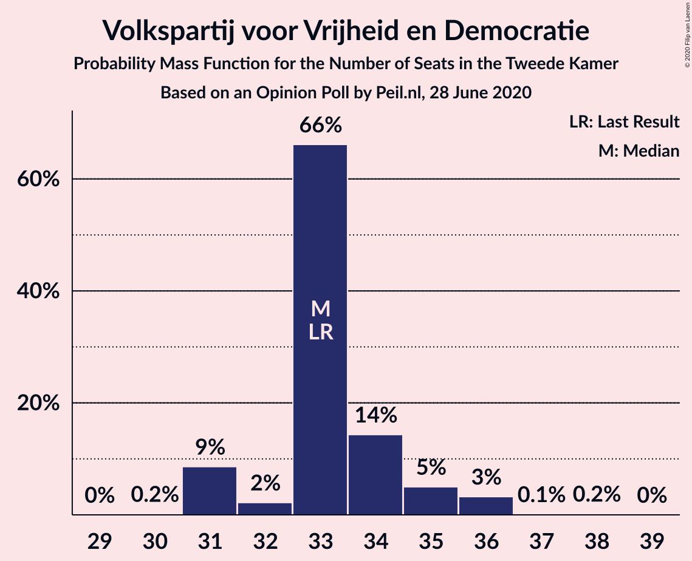
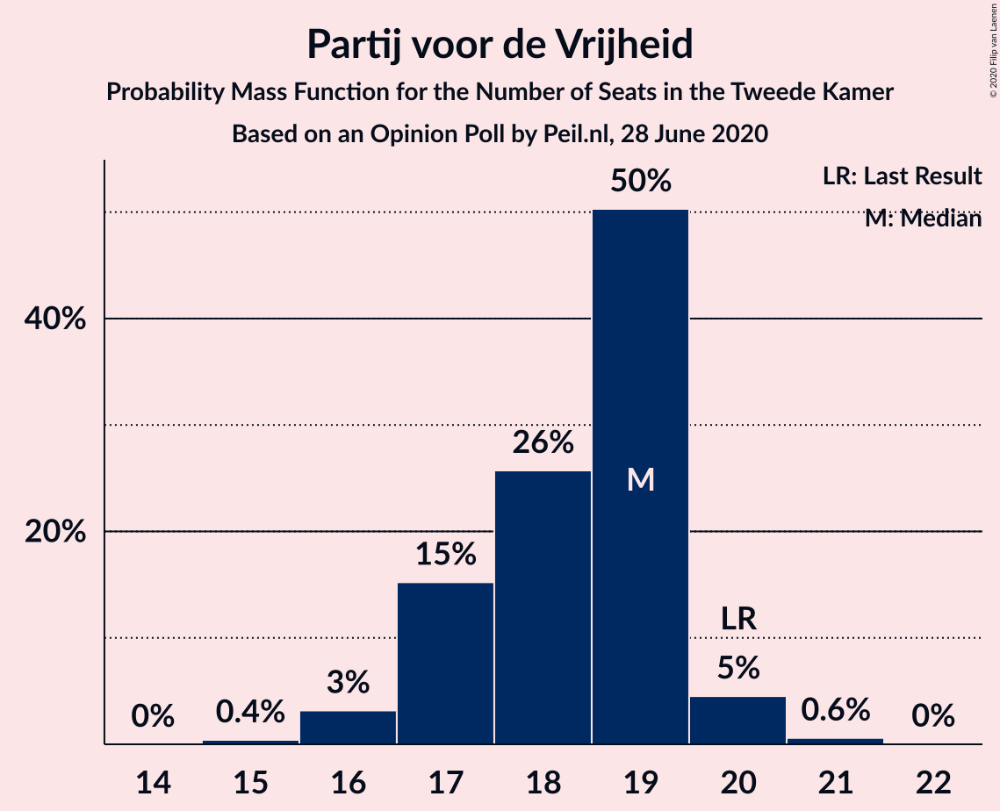
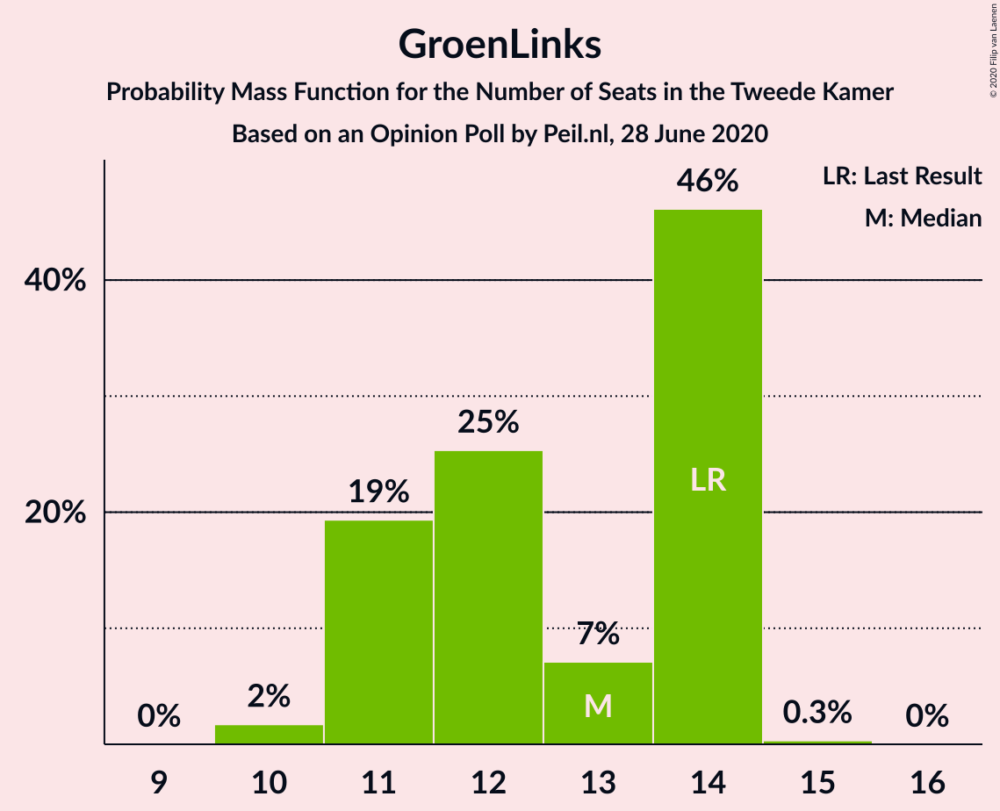
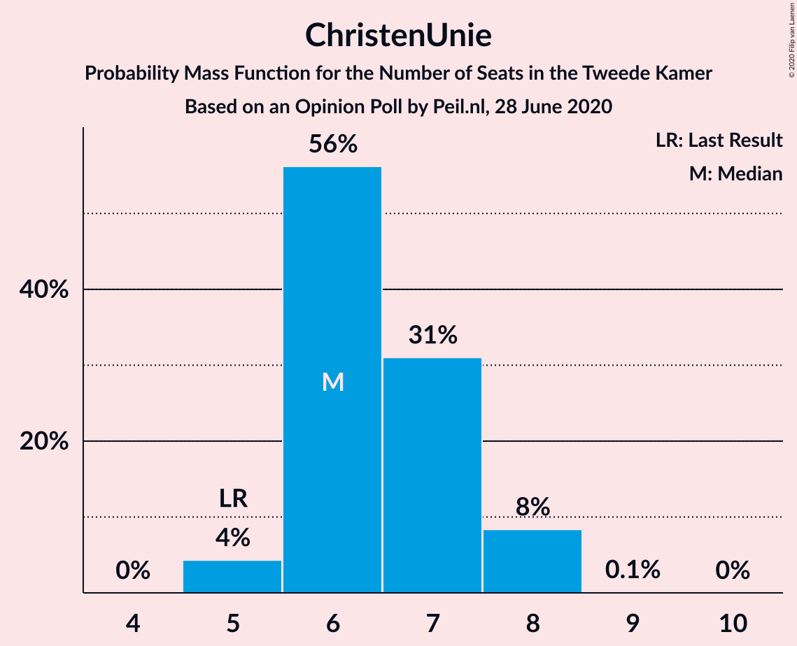
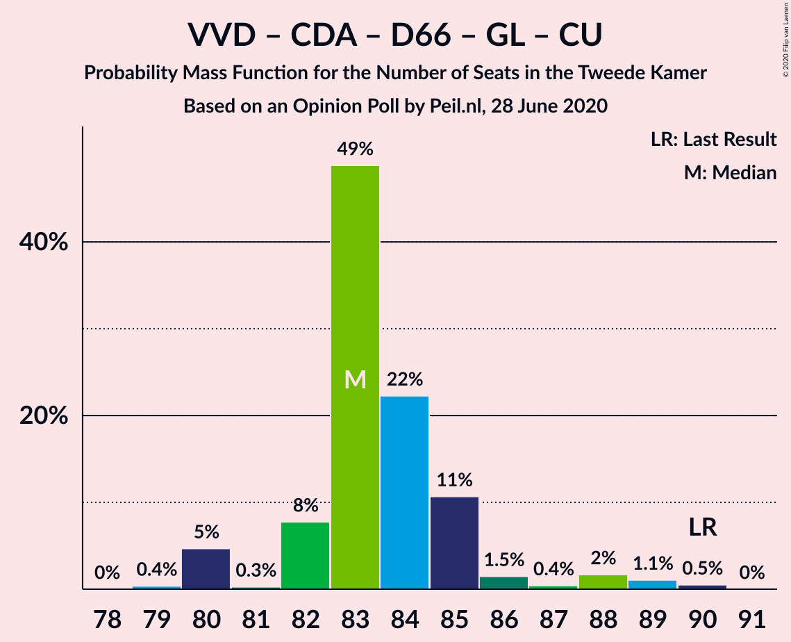
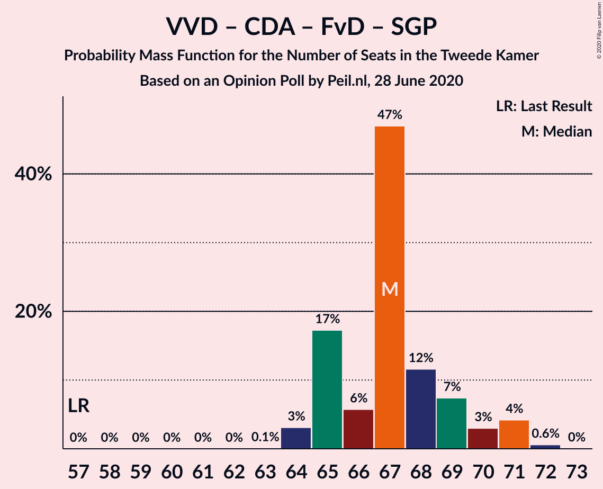
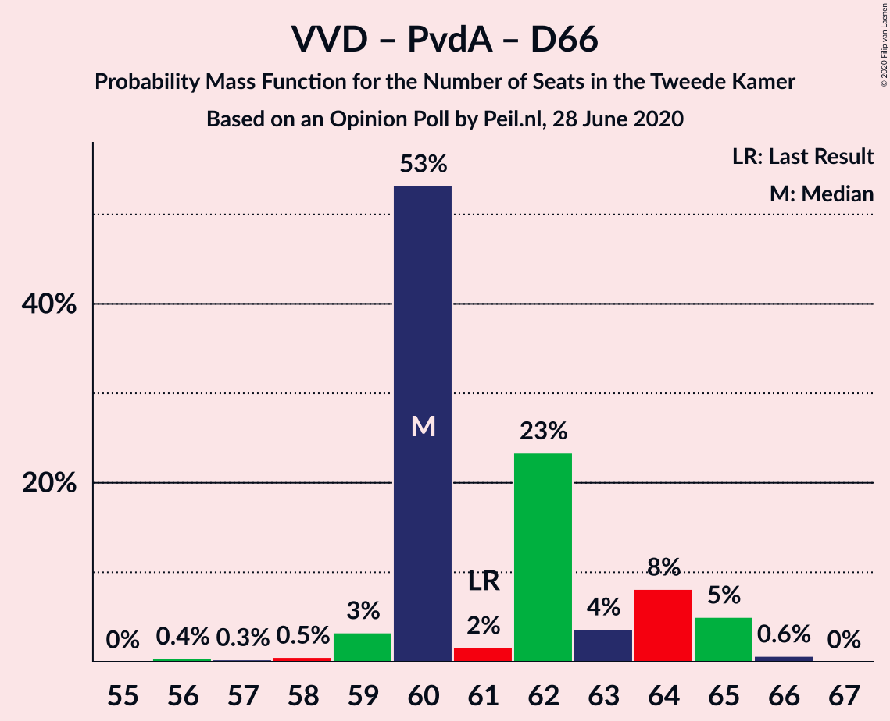
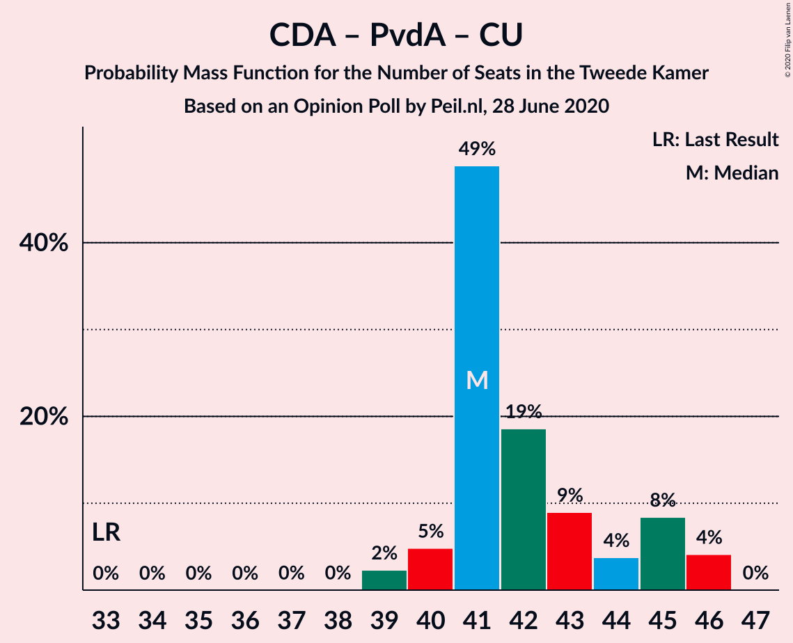

# Opinion Poll by Peil.nl, 28 June 2020

<a href="#voting-intentions">Voting Intentions</a> | <a href="#seats">Seats</a> | <a href="#coalitions">Coalitions</a> | <a href="#technical-information">Technical Information</a>

## Voting Intentions

### Confidence Intervals

| Party | Last Result | Poll Result | 80% Confidence Interval | 90% Confidence Interval | 95% Confidence Interval | 99% Confidence Interval |
|:-----:|:-----------:|:-----------:|:-----------------------:|:-----------------------:|:-----------------------:|:-----------------------:|
| Volkspartij voor Vrijheid en Democratie | 21.3% | 22.0% | 21.0–23.0% |20.7–23.2% |20.5–23.5% |20.1–24.0% |
| Christen-Democratisch Appèl | 12.4% | 12.6% | 11.9–13.4% |11.7–13.7% |11.5–13.9% |11.1–14.3% |
| Partij voor de Vrijheid | 13.1% | 12.0% | 11.2–12.8% |11.0–13.0% |10.9–13.2% |10.5–13.6% |
| Partij van de Arbeid | 5.7% | 10.6% | 9.9–11.4% |9.7–11.6% |9.6–11.8% |9.3–12.2% |
| Democraten 66 | 12.2% | 8.0% | 7.4–8.7% |7.2–8.9% |7.1–9.0% |6.8–9.4% |
| GroenLinks | 9.1% | 8.0% | 7.4–8.7% |7.2–8.9% |7.1–9.0% |6.8–9.4% |
| Forum voor Democratie | 1.8% | 7.3% | 6.8–8.0% |6.6–8.2% |6.4–8.3% |6.2–8.6% |
| Socialistische Partij | 9.1% | 6.7% | 6.1–7.3% |6.0–7.5% |5.8–7.6% |5.6–7.9% |
| ChristenUnie | 3.4% | 4.7% | 4.2–5.2% |4.1–5.3% |4.0–5.5% |3.7–5.8% |
| Partij voor de Dieren | 3.2% | 3.3% | 2.9–3.8% |2.8–3.9% |2.7–4.0% |2.6–4.3% |
| Staatkundig Gereformeerde Partij | 2.1% | 2.7% | 2.3–3.1% |2.2–3.2% |2.1–3.3% |2.0–3.5% |
| 50Plus | 3.1% | 0.7% | 0.5–0.9% |0.5–1.0% |0.4–1.0% |0.4–1.2% |
| DENK | 2.1% | 0.7% | 0.5–0.9% |0.5–1.0% |0.4–1.0% |0.4–1.2% |
| Partij voor de Toekomst | 0.0% | 0.7% | 0.5–0.9% |0.5–1.0% |0.4–1.0% |0.4–1.2% |

*Note:* The poll result column reflects the actual value used in the calculations. Published results may vary slightly, and in addition be rounded to fewer digits.

## Seats

### Confidence Intervals

| Party | Last Result | Median | 80% Confidence Interval | 90% Confidence Interval | 95% Confidence Interval | 99% Confidence Interval |
|:-----:|:-----------:|:------:|:-----------------------:|:-----------------------:|:-----------------------:|:-----------------------:|
| <a href="#volkspartij-voor-vrijheid-en-democratie">Volkspartij voor Vrijheid en Democratie</a> | 33 | 33 | 33–34 |32–35 |31–35 |31–36 |
| <a href="#christen-democratisch-appèl">Christen-Democratisch Appèl</a> | 19 | 19 | 19–23 |18–23 |18–23 |17–23 |
| <a href="#partij-voor-de-vrijheid">Partij voor de Vrijheid</a> | 20 | 18 | 17–19 |16–19 |16–19 |15–20 |
| <a href="#partij-van-de-arbeid">Partij van de Arbeid</a> | 9 | 16 | 16–17 |16–17 |15–17 |14–18 |
| <a href="#democraten-66">Democraten 66</a> | 19 | 13 | 11–13 |11–14 |11–14 |10–14 |
| <a href="#groenlinks">GroenLinks</a> | 14 | 12 | 11–13 |11–13 |11–14 |10–14 |
| <a href="#forum-voor-democratie">Forum voor Democratie</a> | 2 | 10 | 10–11 |10–11 |10–12 |10–13 |
| <a href="#socialistische-partij">Socialistische Partij</a> | 14 | 11 | 9–11 |9–11 |9–12 |9–12 |
| <a href="#christenunie">ChristenUnie</a> | 5 | 7 | 6–7 |5–8 |5–8 |5–8 |
| <a href="#partij-voor-de-dieren">Partij voor de Dieren</a> | 5 | 6 | 4–6 |4–6 |4–6 |3–6 |
| <a href="#staatkundig-gereformeerde-partij">Staatkundig Gereformeerde Partij</a> | 3 | 3 | 3–4 |3–4 |3–4 |3–5 |
| <a href="#50plus">50Plus</a> | 4 | 1 | 1 |0–1 |0–1 |0–1 |
| <a href="#denk">DENK</a> | 3 | 0 | 0–1 |0–1 |0–2 |0–2 |
| <a href="#partij-voor-de-toekomst">Partij voor de Toekomst</a> | 0 | 1 | 0–1 |0–1 |0–1 |0–1 |

### Volkspartij voor Vrijheid en Democratie

*For a full overview of the results for this party, see the [Volkspartij voor Vrijheid en Democratie](party-volkspartijvoorvrijheidendemocratie.html) page.*

| Number of Seats | Probability | Accumulated | Special Marks |
|:---------------:|:-----------:|:-----------:|:-------------:|
| 31 | 5% | 100% |  |
| 32 | 3% | 95% |  |
| 33 | 74% | 93% | Last Result, Median |
| 34 | 9% | 19% |  |
| 35 | 9% | 10% |  |
| 36 | 0.5% | 0.6% |  |
| 37 | 0.1% | 0.1% |  |
| 38 | 0% | 0% |  |

### Christen-Democratisch Appèl

*For a full overview of the results for this party, see the [Christen-Democratisch Appèl](party-christen-democratischappèl.html) page.*

| Number of Seats | Probability | Accumulated | Special Marks |
|:---------------:|:-----------:|:-----------:|:-------------:|
| 16 | 0% | 100% |  |
| 17 | 0.9% | 99.9% |  |
| 18 | 6% | 99.1% |  |
| 19 | 65% | 93% | Last Result, Median |
| 20 | 8% | 28% |  |
| 21 | 5% | 20% |  |
| 22 | 0.6% | 15% |  |
| 23 | 14% | 14% |  |
| 24 | 0% | 0% |  |

### Partij voor de Vrijheid

*For a full overview of the results for this party, see the [Partij voor de Vrijheid](party-partijvoordevrijheid.html) page.*

| Number of Seats | Probability | Accumulated | Special Marks |
|:---------------:|:-----------:|:-----------:|:-------------:|
| 15 | 1.4% | 100% |  |
| 16 | 7% | 98.6% |  |
| 17 | 17% | 92% |  |
| 18 | 62% | 75% | Median |
| 19 | 11% | 13% |  |
| 20 | 2% | 2% | Last Result |
| 21 | 0% | 0% |  |

### Partij van de Arbeid

*For a full overview of the results for this party, see the [Partij van de Arbeid](party-partijvandearbeid.html) page.*

| Number of Seats | Probability | Accumulated | Special Marks |
|:---------------:|:-----------:|:-----------:|:-------------:|
| 9 | 0% | 100% | Last Result |
| 10 | 0% | 100% |  |
| 11 | 0% | 100% |  |
| 12 | 0% | 100% |  |
| 13 | 0% | 100% |  |
| 14 | 0.8% | 100% |  |
| 15 | 3% | 99.2% |  |
| 16 | 82% | 97% | Median |
| 17 | 13% | 15% |  |
| 18 | 2% | 2% |  |
| 19 | 0.1% | 0.1% |  |
| 20 | 0% | 0% |  |

### Democraten 66

*For a full overview of the results for this party, see the [Democraten 66](party-democraten66.html) page.*

| Number of Seats | Probability | Accumulated | Special Marks |
|:---------------:|:-----------:|:-----------:|:-------------:|
| 10 | 1.0% | 100% |  |
| 11 | 18% | 99.0% |  |
| 12 | 10% | 81% |  |
| 13 | 62% | 71% | Median |
| 14 | 9% | 9% |  |
| 15 | 0% | 0% |  |
| 16 | 0% | 0% |  |
| 17 | 0% | 0% |  |
| 18 | 0% | 0% |  |
| 19 | 0% | 0% | Last Result |

### GroenLinks

*For a full overview of the results for this party, see the [GroenLinks](party-groenlinks.html) page.*

| Number of Seats | Probability | Accumulated | Special Marks |
|:---------------:|:-----------:|:-----------:|:-------------:|
| 10 | 1.0% | 100% |  |
| 11 | 19% | 99.0% |  |
| 12 | 68% | 80% | Median |
| 13 | 9% | 12% |  |
| 14 | 3% | 3% | Last Result |
| 15 | 0% | 0% |  |

### Forum voor Democratie

*For a full overview of the results for this party, see the [Forum voor Democratie](party-forumvoordemocratie.html) page.*

| Number of Seats | Probability | Accumulated | Special Marks |
|:---------------:|:-----------:|:-----------:|:-------------:|
| 2 | 0% | 100% | Last Result |
| 3 | 0% | 100% |  |
| 4 | 0% | 100% |  |
| 5 | 0% | 100% |  |
| 6 | 0% | 100% |  |
| 7 | 0% | 100% |  |
| 8 | 0% | 100% |  |
| 9 | 0.1% | 100% |  |
| 10 | 60% | 99.9% | Median |
| 11 | 36% | 40% |  |
| 12 | 3% | 5% |  |
| 13 | 2% | 2% |  |
| 14 | 0% | 0.1% |  |
| 15 | 0% | 0% |  |

### Socialistische Partij

*For a full overview of the results for this party, see the [Socialistische Partij](party-socialistischepartij.html) page.*

| Number of Seats | Probability | Accumulated | Special Marks |
|:---------------:|:-----------:|:-----------:|:-------------:|
| 8 | 0.1% | 100% |  |
| 9 | 10% | 99.9% |  |
| 10 | 16% | 90% |  |
| 11 | 70% | 74% | Median |
| 12 | 4% | 4% |  |
| 13 | 0.1% | 0.1% |  |
| 14 | 0% | 0% | Last Result |

### ChristenUnie

*For a full overview of the results for this party, see the [ChristenUnie](party-christenunie.html) page.*

| Number of Seats | Probability | Accumulated | Special Marks |
|:---------------:|:-----------:|:-----------:|:-------------:|
| 5 | 7% | 100% | Last Result |
| 6 | 8% | 93% |  |
| 7 | 76% | 86% | Median |
| 8 | 9% | 9% |  |
| 9 | 0.1% | 0.1% |  |
| 10 | 0% | 0% |  |

### Partij voor de Dieren

*For a full overview of the results for this party, see the [Partij voor de Dieren](party-partijvoordedieren.html) page.*

| Number of Seats | Probability | Accumulated | Special Marks |
|:---------------:|:-----------:|:-----------:|:-------------:|
| 3 | 2% | 100% |  |
| 4 | 31% | 98% |  |
| 5 | 8% | 67% | Last Result |
| 6 | 59% | 59% | Median |
| 7 | 0.1% | 0.1% |  |
| 8 | 0% | 0% |  |

### Staatkundig Gereformeerde Partij

*For a full overview of the results for this party, see the [Staatkundig Gereformeerde Partij](party-staatkundiggereformeerdepartij.html) page.*

| Number of Seats | Probability | Accumulated | Special Marks |
|:---------------:|:-----------:|:-----------:|:-------------:|
| 2 | 0.2% | 100% |  |
| 3 | 73% | 99.8% | Last Result, Median |
| 4 | 27% | 27% |  |
| 5 | 0.7% | 0.8% |  |
| 6 | 0% | 0% |  |

### 50Plus

*For a full overview of the results for this party, see the [50Plus](party-50plus.html) page.*

| Number of Seats | Probability | Accumulated | Special Marks |
|:---------------:|:-----------:|:-----------:|:-------------:|
| 0 | 8% | 100% |  |
| 1 | 92% | 92% | Median |
| 2 | 0% | 0% |  |
| 3 | 0% | 0% |  |
| 4 | 0% | 0% | Last Result |

### DENK

*For a full overview of the results for this party, see the [DENK](party-denk.html) page.*

| Number of Seats | Probability | Accumulated | Special Marks |
|:---------------:|:-----------:|:-----------:|:-------------:|
| 0 | 61% | 100% | Median |
| 1 | 35% | 39% |  |
| 2 | 4% | 4% |  |
| 3 | 0% | 0% | Last Result |

### Partij voor de Toekomst

*For a full overview of the results for this party, see the [Partij voor de Toekomst](party-partijvoordetoekomst.html) page.*

| Number of Seats | Probability | Accumulated | Special Marks |
|:---------------:|:-----------:|:-----------:|:-------------:|
| 0 | 24% | 100% | Last Result |
| 1 | 76% | 76% | Median |
| 2 | 0% | 0% |  |

## Coalitions

### Confidence Intervals

| Coalition | Last Result | Median | Majority? | 80% Confidence Interval | 90% Confidence Interval | 95% Confidence Interval | 99% Confidence Interval |
|:---------:|:-----------:|:------:|:---------:|:-----------------------:|:-----------------------:|:-----------------------:|:-----------------------:|
| Volkspartij voor Vrijheid en Democratie – Christen-Democratisch Appèl – Partij van de Arbeid – Democraten 66 – ChristenUnie | 85 | 88 | 100% | 87–90 | 87–91 | 87–92 | 86–92 |
| Volkspartij voor Vrijheid en Democratie – Christen-Democratisch Appèl – Partij voor de Vrijheid – Forum voor Democratie – Staatkundig Gereformeerde Partij | 77 | 83 | 100% | 83–88 | 83–88 | 83–88 | 83–89 |
| Volkspartij voor Vrijheid en Democratie – Christen-Democratisch Appèl – Democraten 66 – GroenLinks – ChristenUnie | 90 | 84 | 100% | 84–85 | 82–85 | 82–88 | 80–88 |
| Volkspartij voor Vrijheid en Democratie – Christen-Democratisch Appèl – Partij voor de Vrijheid – Forum voor Democratie | 74 | 80 | 100% | 80–84 | 80–84 | 79–84 | 79–85 |
| Christen-Democratisch Appèl – Partij van de Arbeid – Democraten 66 – GroenLinks – Socialistische Partij – ChristenUnie | 80 | 78 | 96% | 76–79 | 76–79 | 75–80 | 74–80 |
| Volkspartij voor Vrijheid en Democratie – Christen-Democratisch Appèl – Democraten 66 – ChristenUnie | 76 | 72 | 0% | 71–74 | 70–74 | 70–75 | 69–75 |
| Volkspartij voor Vrijheid en Democratie – Christen-Democratisch Appèl – Partij voor de Vrijheid | 72 | 70 | 0.1% | 69–73 | 69–73 | 68–73 | 68–74 |
| Volkspartij voor Vrijheid en Democratie – Christen-Democratisch Appèl – Partij van de Arbeid | 61 | 68 | 0% | 68–72 | 67–72 | 67–72 | 67–72 |
| Volkspartij voor Vrijheid en Democratie – Christen-Democratisch Appèl – Forum voor Democratie – Staatkundig Gereformeerde Partij – 50Plus | 61 | 66 | 0% | 66–72 | 66–72 | 65–72 | 65–73 |
| Christen-Democratisch Appèl – Partij van de Arbeid – Democraten 66 – GroenLinks – ChristenUnie | 66 | 67 | 0% | 66–68 | 66–69 | 65–71 | 65–71 |
| Volkspartij voor Vrijheid en Democratie – Christen-Democratisch Appèl – Forum voor Democratie – Staatkundig Gereformeerde Partij | 57 | 65 | 0% | 65–71 | 65–71 | 64–71 | 64–72 |
| Volkspartij voor Vrijheid en Democratie – Christen-Democratisch Appèl – Forum voor Democratie – 50Plus | 58 | 63 | 0% | 63–68 | 63–68 | 62–68 | 62–69 |
| Volkspartij voor Vrijheid en Democratie – Christen-Democratisch Appèl – Democraten 66 | 71 | 65 | 0% | 65–67 | 64–68 | 62–68 | 62–68 |
| Volkspartij voor Vrijheid en Democratie – Christen-Democratisch Appèl – Forum voor Democratie | 54 | 62 | 0% | 62–67 | 62–67 | 61–67 | 61–68 |
| Volkspartij voor Vrijheid en Democratie – Partij van de Arbeid – Democraten 66 | 61 | 62 | 0% | 60–64 | 60–65 | 60–65 | 60–65 |
| Volkspartij voor Vrijheid en Democratie – Christen-Democratisch Appèl | 52 | 52 | 0% | 52–56 | 51–56 | 50–56 | 50–56 |
| Volkspartij voor Vrijheid en Democratie – Partij van de Arbeid | 42 | 49 | 0% | 49–51 | 48–51 | 48–51 | 48–52 |
| Christen-Democratisch Appèl – Partij van de Arbeid – Democraten 66 | 47 | 48 | 0% | 48–50 | 47–50 | 45–50 | 44–51 |
| Christen-Democratisch Appèl – Partij van de Arbeid – ChristenUnie | 33 | 42 | 0% | 40–46 | 40–46 | 40–46 | 39–46 |
| Christen-Democratisch Appèl – Partij van de Arbeid | 28 | 35 | 0% | 35–39 | 35–39 | 33–39 | 32–39 |
| Christen-Democratisch Appèl – Democraten 66 | 38 | 32 | 0% | 31–34 | 31–34 | 30–34 | 29–34 |

### Volkspartij voor Vrijheid en Democratie – Christen-Democratisch Appèl – Partij van de Arbeid – Democraten 66 – ChristenUnie

| Number of Seats | Probability | Accumulated | Special Marks |
|:---------------:|:-----------:|:-----------:|:-------------:|
| 83 | 0.1% | 100% |  |
| 84 | 0.1% | 99.9% |  |
| 85 | 0.2% | 99.8% | Last Result |
| 86 | 2% | 99.6% |  |
| 87 | 8% | 98% |  |
| 88 | 60% | 90% | Median |
| 89 | 10% | 30% |  |
| 90 | 15% | 20% |  |
| 91 | 2% | 5% |  |
| 92 | 4% | 4% |  |
| 93 | 0% | 0% |  |

### Volkspartij voor Vrijheid en Democratie – Christen-Democratisch Appèl – Partij voor de Vrijheid – Forum voor Democratie – Staatkundig Gereformeerde Partij

| Number of Seats | Probability | Accumulated | Special Marks |
|:---------------:|:-----------:|:-----------:|:-------------:|
| 77 | 0% | 100% | Last Result |
| 78 | 0% | 100% |  |
| 79 | 0% | 100% |  |
| 80 | 0% | 100% |  |
| 81 | 0.1% | 100% |  |
| 82 | 0.1% | 99.9% |  |
| 83 | 65% | 99.8% | Median |
| 84 | 2% | 34% |  |
| 85 | 0.8% | 33% |  |
| 86 | 10% | 32% |  |
| 87 | 4% | 22% |  |
| 88 | 16% | 18% |  |
| 89 | 2% | 2% |  |
| 90 | 0% | 0.1% |  |
| 91 | 0.1% | 0.1% |  |
| 92 | 0% | 0% |  |

### Volkspartij voor Vrijheid en Democratie – Christen-Democratisch Appèl – Democraten 66 – GroenLinks – ChristenUnie

| Number of Seats | Probability | Accumulated | Special Marks |
|:---------------:|:-----------:|:-----------:|:-------------:|
| 79 | 0.1% | 100% |  |
| 80 | 0.9% | 99.9% |  |
| 81 | 0.3% | 99.0% |  |
| 82 | 6% | 98.6% |  |
| 83 | 0.6% | 93% |  |
| 84 | 57% | 92% | Median |
| 85 | 30% | 35% |  |
| 86 | 0.8% | 5% |  |
| 87 | 0.1% | 4% |  |
| 88 | 4% | 4% |  |
| 89 | 0% | 0% |  |
| 90 | 0% | 0% | Last Result |

### Volkspartij voor Vrijheid en Democratie – Christen-Democratisch Appèl – Partij voor de Vrijheid – Forum voor Democratie

| Number of Seats | Probability | Accumulated | Special Marks |
|:---------------:|:-----------:|:-----------:|:-------------:|
| 74 | 0% | 100% | Last Result |
| 75 | 0% | 100% |  |
| 76 | 0% | 100% | Majority |
| 77 | 0.1% | 100% |  |
| 78 | 0% | 99.9% |  |
| 79 | 3% | 99.9% |  |
| 80 | 64% | 97% | Median |
| 81 | 0.3% | 33% |  |
| 82 | 4% | 32% |  |
| 83 | 7% | 28% |  |
| 84 | 20% | 22% |  |
| 85 | 1.5% | 2% |  |
| 86 | 0.2% | 0.2% |  |
| 87 | 0% | 0.1% |  |
| 88 | 0% | 0% |  |

### Christen-Democratisch Appèl – Partij van de Arbeid – Democraten 66 – GroenLinks – Socialistische Partij – ChristenUnie

| Number of Seats | Probability | Accumulated | Special Marks |
|:---------------:|:-----------:|:-----------:|:-------------:|
| 73 | 0.2% | 100% |  |
| 74 | 0.8% | 99.8% |  |
| 75 | 3% | 99.0% |  |
| 76 | 9% | 96% | Majority |
| 77 | 5% | 87% |  |
| 78 | 59% | 82% | Median |
| 79 | 19% | 23% |  |
| 80 | 4% | 4% | Last Result |
| 81 | 0.2% | 0.2% |  |
| 82 | 0% | 0% |  |

### Volkspartij voor Vrijheid en Democratie – Christen-Democratisch Appèl – Democraten 66 – ChristenUnie

| Number of Seats | Probability | Accumulated | Special Marks |
|:---------------:|:-----------:|:-----------:|:-------------:|
| 68 | 0.2% | 100% |  |
| 69 | 0.4% | 99.8% |  |
| 70 | 5% | 99.4% |  |
| 71 | 5% | 94% |  |
| 72 | 62% | 89% | Median |
| 73 | 7% | 28% |  |
| 74 | 16% | 20% |  |
| 75 | 4% | 4% |  |
| 76 | 0% | 0% | Last Result, Majority |

### Volkspartij voor Vrijheid en Democratie – Christen-Democratisch Appèl – Partij voor de Vrijheid

| Number of Seats | Probability | Accumulated | Special Marks |
|:---------------:|:-----------:|:-----------:|:-------------:|
| 67 | 0.1% | 100% |  |
| 68 | 3% | 99.8% |  |
| 69 | 7% | 97% |  |
| 70 | 60% | 90% | Median |
| 71 | 2% | 30% |  |
| 72 | 8% | 28% | Last Result |
| 73 | 20% | 21% |  |
| 74 | 0.5% | 0.7% |  |
| 75 | 0.1% | 0.2% |  |
| 76 | 0% | 0.1% | Majority |
| 77 | 0% | 0% |  |

### Volkspartij voor Vrijheid en Democratie – Christen-Democratisch Appèl – Partij van de Arbeid

| Number of Seats | Probability | Accumulated | Special Marks |
|:---------------:|:-----------:|:-----------:|:-------------:|
| 61 | 0% | 100% | Last Result |
| 62 | 0% | 100% |  |
| 63 | 0% | 100% |  |
| 64 | 0% | 100% |  |
| 65 | 0% | 99.9% |  |
| 66 | 0.2% | 99.9% |  |
| 67 | 5% | 99.8% |  |
| 68 | 59% | 95% | Median |
| 69 | 3% | 35% |  |
| 70 | 11% | 32% |  |
| 71 | 7% | 21% |  |
| 72 | 14% | 14% |  |
| 73 | 0.1% | 0.1% |  |
| 74 | 0% | 0% |  |

### Volkspartij voor Vrijheid en Democratie – Christen-Democratisch Appèl – Forum voor Democratie – Staatkundig Gereformeerde Partij – 50Plus

| Number of Seats | Probability | Accumulated | Special Marks |
|:---------------:|:-----------:|:-----------:|:-------------:|
| 61 | 0% | 100% | Last Result |
| 62 | 0% | 100% |  |
| 63 | 0% | 100% |  |
| 64 | 0% | 99.9% |  |
| 65 | 5% | 99.9% |  |
| 66 | 54% | 95% | Median |
| 67 | 4% | 41% |  |
| 68 | 8% | 37% |  |
| 69 | 10% | 29% |  |
| 70 | 3% | 19% |  |
| 71 | 1.0% | 16% |  |
| 72 | 14% | 15% |  |
| 73 | 0.8% | 0.8% |  |
| 74 | 0% | 0% |  |

### Christen-Democratisch Appèl – Partij van de Arbeid – Democraten 66 – GroenLinks – ChristenUnie

| Number of Seats | Probability | Accumulated | Special Marks |
|:---------------:|:-----------:|:-----------:|:-------------:|
| 63 | 0.4% | 100% |  |
| 64 | 0.1% | 99.6% |  |
| 65 | 3% | 99.5% |  |
| 66 | 10% | 96% | Last Result |
| 67 | 59% | 87% | Median |
| 68 | 22% | 28% |  |
| 69 | 2% | 6% |  |
| 70 | 0.1% | 4% |  |
| 71 | 4% | 4% |  |
| 72 | 0% | 0% |  |

### Volkspartij voor Vrijheid en Democratie – Christen-Democratisch Appèl – Forum voor Democratie – Staatkundig Gereformeerde Partij

| Number of Seats | Probability | Accumulated | Special Marks |
|:---------------:|:-----------:|:-----------:|:-------------:|
| 57 | 0% | 100% | Last Result |
| 58 | 0% | 100% |  |
| 59 | 0% | 100% |  |
| 60 | 0% | 100% |  |
| 61 | 0% | 100% |  |
| 62 | 0% | 100% |  |
| 63 | 0% | 100% |  |
| 64 | 5% | 99.9% |  |
| 65 | 54% | 95% | Median |
| 66 | 0.1% | 41% |  |
| 67 | 9% | 41% |  |
| 68 | 13% | 32% |  |
| 69 | 3% | 19% |  |
| 70 | 1.0% | 16% |  |
| 71 | 14% | 15% |  |
| 72 | 0.9% | 0.9% |  |
| 73 | 0% | 0% |  |

### Volkspartij voor Vrijheid en Democratie – Christen-Democratisch Appèl – Forum voor Democratie – 50Plus

| Number of Seats | Probability | Accumulated | Special Marks |
|:---------------:|:-----------:|:-----------:|:-------------:|
| 58 | 0% | 100% | Last Result |
| 59 | 0% | 100% |  |
| 60 | 0% | 100% |  |
| 61 | 0.1% | 99.9% |  |
| 62 | 5% | 99.8% |  |
| 63 | 54% | 95% | Median |
| 64 | 9% | 41% |  |
| 65 | 6% | 32% |  |
| 66 | 9% | 25% |  |
| 67 | 0.9% | 16% |  |
| 68 | 14% | 15% |  |
| 69 | 0.9% | 0.9% |  |
| 70 | 0% | 0% |  |

### Volkspartij voor Vrijheid en Democratie – Christen-Democratisch Appèl – Democraten 66

| Number of Seats | Probability | Accumulated | Special Marks |
|:---------------:|:-----------:|:-----------:|:-------------:|
| 61 | 0.1% | 100% |  |
| 62 | 5% | 99.9% |  |
| 63 | 0.1% | 95% |  |
| 64 | 3% | 95% |  |
| 65 | 62% | 92% | Median |
| 66 | 3% | 30% |  |
| 67 | 21% | 27% |  |
| 68 | 6% | 6% |  |
| 69 | 0% | 0% |  |
| 70 | 0% | 0% |  |
| 71 | 0% | 0% | Last Result |

### Volkspartij voor Vrijheid en Democratie – Christen-Democratisch Appèl – Forum voor Democratie

| Number of Seats | Probability | Accumulated | Special Marks |
|:---------------:|:-----------:|:-----------:|:-------------:|
| 54 | 0% | 100% | Last Result |
| 55 | 0% | 100% |  |
| 56 | 0% | 100% |  |
| 57 | 0% | 100% |  |
| 58 | 0% | 100% |  |
| 59 | 0% | 100% |  |
| 60 | 0.1% | 99.9% |  |
| 61 | 5% | 99.8% |  |
| 62 | 54% | 95% | Median |
| 63 | 5% | 41% |  |
| 64 | 7% | 36% |  |
| 65 | 13% | 29% |  |
| 66 | 0.9% | 16% |  |
| 67 | 14% | 15% |  |
| 68 | 1.0% | 1.0% |  |
| 69 | 0% | 0% |  |

### Volkspartij voor Vrijheid en Democratie – Partij van de Arbeid – Democraten 66

| Number of Seats | Probability | Accumulated | Special Marks |
|:---------------:|:-----------:|:-----------:|:-------------:|
| 58 | 0.1% | 100% |  |
| 59 | 0.1% | 99.8% |  |
| 60 | 23% | 99.7% |  |
| 61 | 2% | 76% | Last Result |
| 62 | 57% | 74% | Median |
| 63 | 4% | 17% |  |
| 64 | 4% | 13% |  |
| 65 | 9% | 9% |  |
| 66 | 0.1% | 0.1% |  |
| 67 | 0% | 0% |  |

### Volkspartij voor Vrijheid en Democratie – Christen-Democratisch Appèl

| Number of Seats | Probability | Accumulated | Special Marks |
|:---------------:|:-----------:|:-----------:|:-------------:|
| 49 | 0% | 100% |  |
| 50 | 5% | 99.9% |  |
| 51 | 0.3% | 95% |  |
| 52 | 61% | 95% | Last Result, Median |
| 53 | 3% | 34% |  |
| 54 | 16% | 32% |  |
| 55 | 1.5% | 16% |  |
| 56 | 14% | 14% |  |
| 57 | 0.1% | 0.1% |  |
| 58 | 0% | 0% |  |

### Volkspartij voor Vrijheid en Democratie – Partij van de Arbeid

| Number of Seats | Probability | Accumulated | Special Marks |
|:---------------:|:-----------:|:-----------:|:-------------:|
| 42 | 0% | 100% | Last Result |
| 43 | 0% | 100% |  |
| 44 | 0% | 100% |  |
| 45 | 0% | 100% |  |
| 46 | 0% | 100% |  |
| 47 | 0.2% | 100% |  |
| 48 | 7% | 99.7% |  |
| 49 | 72% | 93% | Median |
| 50 | 6% | 21% |  |
| 51 | 15% | 15% |  |
| 52 | 0.5% | 0.5% |  |
| 53 | 0.1% | 0.1% |  |
| 54 | 0% | 0% |  |

### Christen-Democratisch Appèl – Partij van de Arbeid – Democraten 66

| Number of Seats | Probability | Accumulated | Special Marks |
|:---------------:|:-----------:|:-----------:|:-------------:|
| 44 | 0.5% | 100% |  |
| 45 | 2% | 99.5% |  |
| 46 | 1.3% | 97% |  |
| 47 | 2% | 96% | Last Result |
| 48 | 63% | 94% | Median |
| 49 | 9% | 31% |  |
| 50 | 20% | 21% |  |
| 51 | 2% | 2% |  |
| 52 | 0% | 0% |  |

### Christen-Democratisch Appèl – Partij van de Arbeid – ChristenUnie

| Number of Seats | Probability | Accumulated | Special Marks |
|:---------------:|:-----------:|:-----------:|:-------------:|
| 33 | 0% | 100% | Last Result |
| 34 | 0% | 100% |  |
| 35 | 0% | 100% |  |
| 36 | 0% | 100% |  |
| 37 | 0.1% | 100% |  |
| 38 | 0% | 99.9% |  |
| 39 | 2% | 99.9% |  |
| 40 | 8% | 98% |  |
| 41 | 4% | 90% |  |
| 42 | 54% | 86% | Median |
| 43 | 2% | 32% |  |
| 44 | 9% | 30% |  |
| 45 | 5% | 20% |  |
| 46 | 15% | 15% |  |
| 47 | 0% | 0% |  |

### Christen-Democratisch Appèl – Partij van de Arbeid

| Number of Seats | Probability | Accumulated | Special Marks |
|:---------------:|:-----------:|:-----------:|:-------------:|
| 28 | 0% | 100% | Last Result |
| 29 | 0% | 100% |  |
| 30 | 0% | 100% |  |
| 31 | 0% | 100% |  |
| 32 | 0.6% | 100% |  |
| 33 | 2% | 99.4% |  |
| 34 | 2% | 97% |  |
| 35 | 63% | 95% | Median |
| 36 | 7% | 32% |  |
| 37 | 8% | 25% |  |
| 38 | 3% | 18% |  |
| 39 | 14% | 14% |  |
| 40 | 0.1% | 0.1% |  |
| 41 | 0% | 0% |  |

### Christen-Democratisch Appèl – Democraten 66

| Number of Seats | Probability | Accumulated | Special Marks |
|:---------------:|:-----------:|:-----------:|:-------------:|
| 28 | 0.2% | 100% |  |
| 29 | 0.6% | 99.8% |  |
| 30 | 3% | 99.2% |  |
| 31 | 6% | 96% |  |
| 32 | 62% | 90% | Median |
| 33 | 11% | 27% |  |
| 34 | 16% | 16% |  |
| 35 | 0% | 0% |  |
| 36 | 0% | 0% |  |
| 37 | 0% | 0% |  |
| 38 | 0% | 0% | Last Result |

## Technical Information

### Opinion Poll

+ **Polling firm:** Peil.nl
+ **Commissioner(s):** —
+ **Fieldwork period:** 28 June 2020

### Calculations

+ **Sample size:** 3000
+ **Simulations done:** 262,144
+ **Error estimate:** 1.57%

