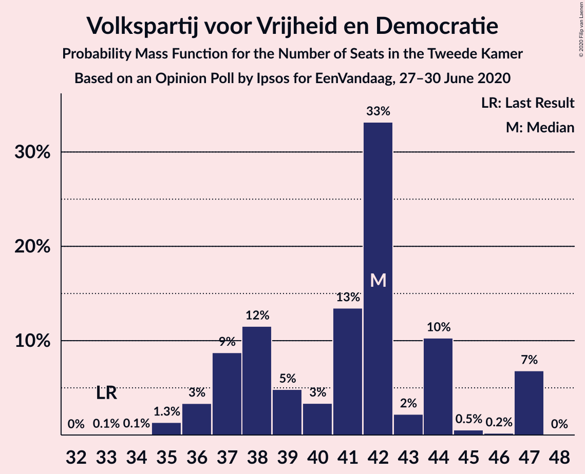
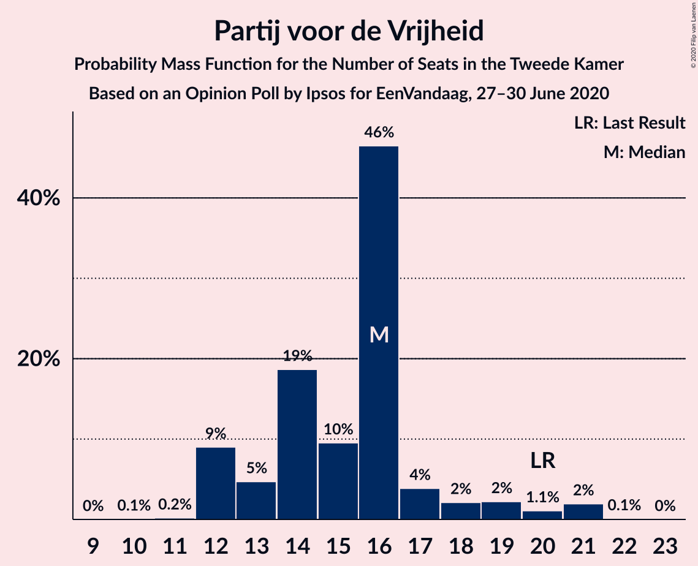
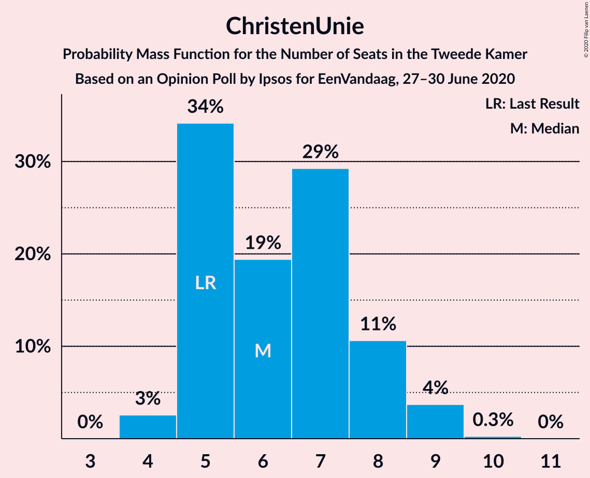
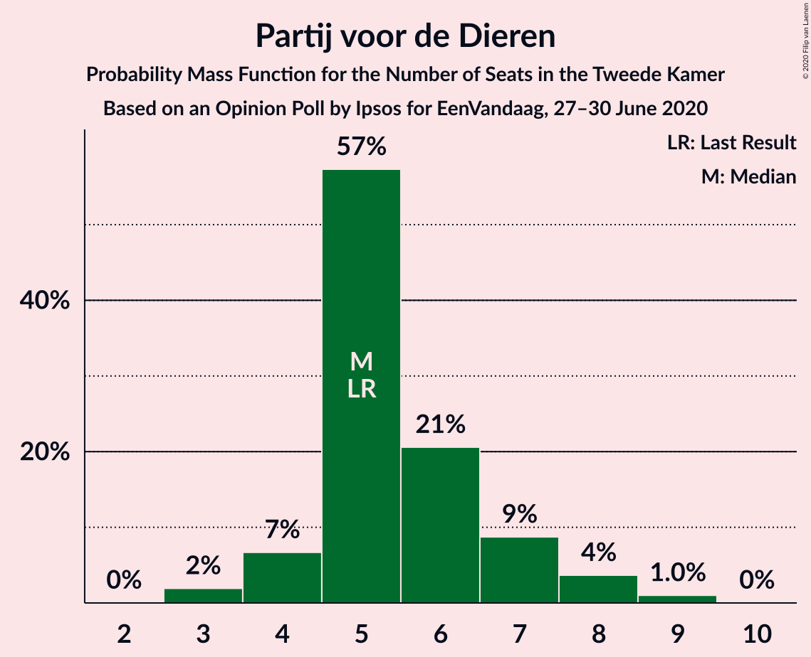
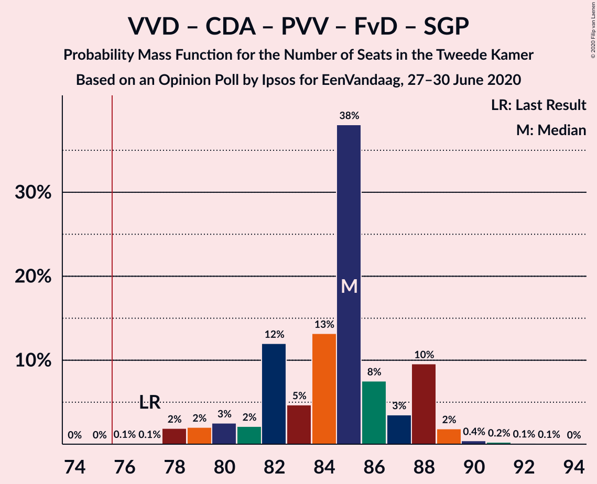
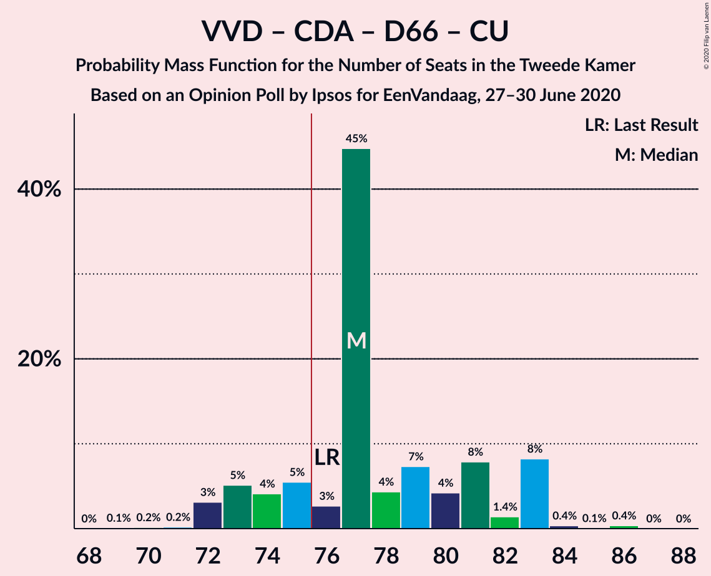
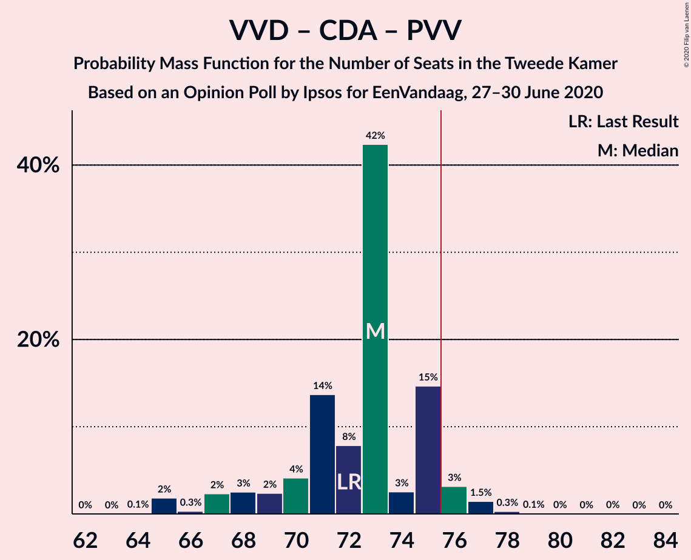
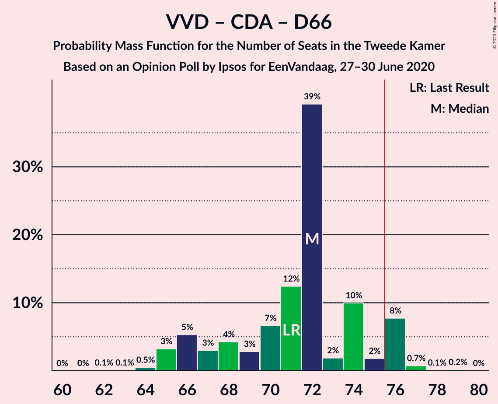
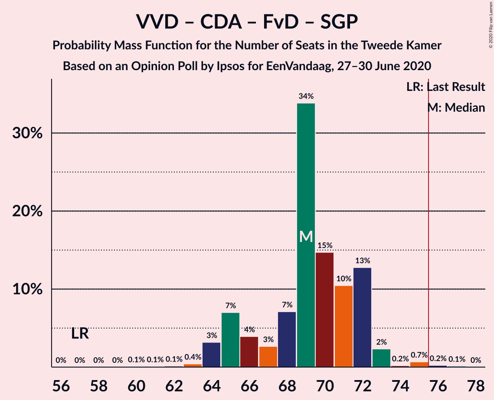
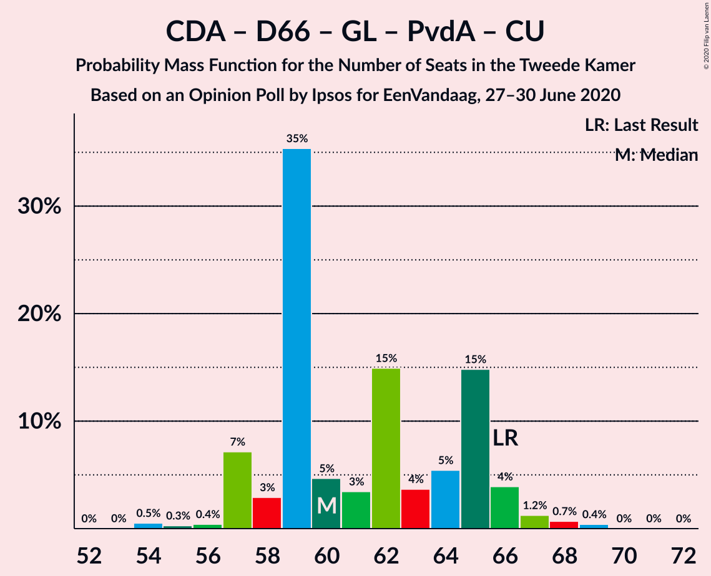

# Opinion Poll by Ipsos for EenVandaag, 27–30 June 2020

<a href="#voting-intentions">Voting Intentions</a> | <a href="#seats">Seats</a> | <a href="#coalitions">Coalitions</a> | <a href="#technical-information">Technical Information</a>

## Voting Intentions

### Confidence Intervals

| Party | Last Result | Poll Result | 80% Confidence Interval | 90% Confidence Interval | 95% Confidence Interval | 99% Confidence Interval |
|:-----:|:-----------:|:-----------:|:-----------------------:|:-----------------------:|:-----------------------:|:-----------------------:|
| Volkspartij voor Vrijheid en Democratie | 21.3% | 27.3% | 25.6–29.1% |25.1–29.6% |24.7–30.1% |23.9–31.0% |
| Partij voor de Vrijheid | 13.1% | 10.6% | 9.5–11.9% |9.2–12.3% |8.9–12.6% |8.4–13.3% |
| Christen-Democratisch Appèl | 12.4% | 10.6% | 9.5–11.9% |9.2–12.3% |8.9–12.6% |8.4–13.3% |
| Democraten 66 | 12.2% | 9.3% | 8.2–10.5% |7.9–10.9% |7.7–11.2% |7.2–11.8% |
| GroenLinks | 9.1% | 8.6% | 7.6–9.8% |7.3–10.2% |7.1–10.5% |6.6–11.1% |
| Partij van de Arbeid | 5.7% | 8.0% | 7.0–9.1% |6.7–9.5% |6.5–9.8% |6.0–10.3% |
| Socialistische Partij | 9.1% | 6.6% | 5.7–7.7% |5.5–8.0% |5.3–8.3% |4.9–8.9% |
| Forum voor Democratie | 1.8% | 6.0% | 5.1–7.0% |4.9–7.3% |4.7–7.6% |4.3–8.1% |
| ChristenUnie | 3.4% | 4.6% | 3.9–5.6% |3.7–5.9% |3.5–6.1% |3.2–6.6% |
| Partij voor de Dieren | 3.2% | 3.3% | 2.7–4.1% |2.5–4.4% |2.4–4.6% |2.1–5.0% |
| Staatkundig Gereformeerde Partij | 2.1% | 2.0% | 1.5–2.7% |1.4–2.9% |1.3–3.0% |1.1–3.4% |
| DENK | 2.1% | 1.3% | 1.0–1.9% |0.9–2.1% |0.8–2.2% |0.6–2.5% |
| 50Plus | 3.1% | 0.7% | 0.4–1.1% |0.4–1.2% |0.3–1.4% |0.2–1.6% |
| Partij voor de Toekomst | 0.0% | 0.7% | 0.4–1.1% |0.4–1.2% |0.3–1.4% |0.2–1.6% |

*Note:* The poll result column reflects the actual value used in the calculations. Published results may vary slightly, and in addition be rounded to fewer digits.

## Seats

### Confidence Intervals

| Party | Last Result | Median | 80% Confidence Interval | 90% Confidence Interval | 95% Confidence Interval | 99% Confidence Interval |
|:-----:|:-----------:|:------:|:-----------------------:|:-----------------------:|:-----------------------:|:-----------------------:|
| <a href="#volkspartij-voor-vrijheid-en-democratie">Volkspartij voor Vrijheid en Democratie</a> | 33 | 41 | 37–43 |37–45 |37–46 |35–48 |
| <a href="#partij-voor-de-vrijheid">Partij voor de Vrijheid</a> | 20 | 16 | 14–18 |13–18 |13–20 |12–21 |
| <a href="#christen-democratisch-appèl">Christen-Democratisch Appèl</a> | 19 | 15 | 14–19 |14–21 |14–21 |13–21 |
| <a href="#democraten-66">Democraten 66</a> | 19 | 13 | 12–16 |12–17 |10–18 |10–18 |
| <a href="#groenlinks">GroenLinks</a> | 14 | 13 | 12–15 |11–15 |11–16 |9–17 |
| <a href="#partij-van-de-arbeid">Partij van de Arbeid</a> | 9 | 12 | 11–14 |10–14 |10–14 |9–15 |
| <a href="#socialistische-partij">Socialistische Partij</a> | 14 | 10 | 8–13 |8–14 |8–14 |7–15 |
| <a href="#forum-voor-democratie">Forum voor Democratie</a> | 2 | 10 | 8–12 |7–12 |6–12 |6–12 |
| <a href="#christenunie">ChristenUnie</a> | 5 | 6 | 5–8 |5–9 |4–9 |4–10 |
| <a href="#partij-voor-de-dieren">Partij voor de Dieren</a> | 5 | 4 | 4–7 |4–7 |3–7 |3–7 |
| <a href="#staatkundig-gereformeerde-partij">Staatkundig Gereformeerde Partij</a> | 3 | 3 | 2–4 |2–5 |2–5 |1–5 |
| <a href="#denk">DENK</a> | 3 | 2 | 1–2 |0–3 |0–3 |0–3 |
| <a href="#50plus">50Plus</a> | 4 | 1 | 0–1 |0–1 |0–1 |0–2 |
| <a href="#partij-voor-de-toekomst">Partij voor de Toekomst</a> | 0 | 1 | 0–2 |0–2 |0–2 |0–2 |

### Volkspartij voor Vrijheid en Democratie

*For a full overview of the results for this party, see the [Volkspartij voor Vrijheid en Democratie](party-volkspartijvoorvrijheidendemocratie.html) page.*

| Number of Seats | Probability | Accumulated | Special Marks |
|:---------------:|:-----------:|:-----------:|:-------------:|
| 33 | 0% | 100% | Last Result |
| 34 | 0% | 100% |  |
| 35 | 0.7% | 100% |  |
| 36 | 0.5% | 99.3% |  |
| 37 | 10% | 98.8% |  |
| 38 | 4% | 89% |  |
| 39 | 15% | 85% |  |
| 40 | 11% | 70% |  |
| 41 | 29% | 58% | Median |
| 42 | 5% | 29% |  |
| 43 | 15% | 24% |  |
| 44 | 3% | 9% |  |
| 45 | 3% | 6% |  |
| 46 | 2% | 3% |  |
| 47 | 0.1% | 1.1% |  |
| 48 | 0.9% | 1.0% |  |
| 49 | 0.1% | 0.1% |  |
| 50 | 0% | 0% |  |

### Partij voor de Vrijheid

*For a full overview of the results for this party, see the [Partij voor de Vrijheid](party-partijvoordevrijheid.html) page.*

| Number of Seats | Probability | Accumulated | Special Marks |
|:---------------:|:-----------:|:-----------:|:-------------:|
| 11 | 0.1% | 100% |  |
| 12 | 1.1% | 99.9% |  |
| 13 | 6% | 98.8% |  |
| 14 | 14% | 93% |  |
| 15 | 21% | 79% |  |
| 16 | 28% | 57% | Median |
| 17 | 14% | 29% |  |
| 18 | 11% | 15% |  |
| 19 | 2% | 5% |  |
| 20 | 1.2% | 3% | Last Result |
| 21 | 1.4% | 1.5% |  |
| 22 | 0% | 0% |  |

### Christen-Democratisch Appèl

*For a full overview of the results for this party, see the [Christen-Democratisch Appèl](party-christen-democratischappèl.html) page.*

| Number of Seats | Probability | Accumulated | Special Marks |
|:---------------:|:-----------:|:-----------:|:-------------:|
| 11 | 0.2% | 100% |  |
| 12 | 0.2% | 99.8% |  |
| 13 | 0.7% | 99.6% |  |
| 14 | 25% | 98.8% |  |
| 15 | 32% | 74% | Median |
| 16 | 3% | 42% |  |
| 17 | 16% | 39% |  |
| 18 | 9% | 23% |  |
| 19 | 4% | 14% | Last Result |
| 20 | 0.7% | 10% |  |
| 21 | 9% | 9% |  |
| 22 | 0% | 0% |  |

### Democraten 66

*For a full overview of the results for this party, see the [Democraten 66](party-democraten66.html) page.*

| Number of Seats | Probability | Accumulated | Special Marks |
|:---------------:|:-----------:|:-----------:|:-------------:|
| 10 | 3% | 100% |  |
| 11 | 2% | 97% |  |
| 12 | 14% | 95% |  |
| 13 | 37% | 81% | Median |
| 14 | 14% | 44% |  |
| 15 | 19% | 30% |  |
| 16 | 2% | 11% |  |
| 17 | 5% | 9% |  |
| 18 | 4% | 4% |  |
| 19 | 0% | 0.1% | Last Result |
| 20 | 0% | 0% |  |

### GroenLinks

*For a full overview of the results for this party, see the [GroenLinks](party-groenlinks.html) page.*

| Number of Seats | Probability | Accumulated | Special Marks |
|:---------------:|:-----------:|:-----------:|:-------------:|
| 9 | 0.6% | 100% |  |
| 10 | 1.3% | 99.4% |  |
| 11 | 6% | 98% |  |
| 12 | 29% | 92% |  |
| 13 | 20% | 62% | Median |
| 14 | 10% | 43% | Last Result |
| 15 | 29% | 33% |  |
| 16 | 2% | 3% |  |
| 17 | 1.3% | 1.4% |  |
| 18 | 0% | 0.1% |  |
| 19 | 0.1% | 0.1% |  |
| 20 | 0% | 0% |  |

### Partij van de Arbeid

*For a full overview of the results for this party, see the [Partij van de Arbeid](party-partijvandearbeid.html) page.*

| Number of Seats | Probability | Accumulated | Special Marks |
|:---------------:|:-----------:|:-----------:|:-------------:|
| 8 | 0.1% | 100% |  |
| 9 | 2% | 99.9% | Last Result |
| 10 | 8% | 98% |  |
| 11 | 15% | 91% |  |
| 12 | 38% | 76% | Median |
| 13 | 15% | 38% |  |
| 14 | 22% | 23% |  |
| 15 | 1.1% | 1.4% |  |
| 16 | 0.2% | 0.3% |  |
| 17 | 0% | 0% |  |

### Socialistische Partij

*For a full overview of the results for this party, see the [Socialistische Partij](party-socialistischepartij.html) page.*

| Number of Seats | Probability | Accumulated | Special Marks |
|:---------------:|:-----------:|:-----------:|:-------------:|
| 7 | 2% | 100% |  |
| 8 | 9% | 98% |  |
| 9 | 12% | 89% |  |
| 10 | 32% | 76% | Median |
| 11 | 21% | 44% |  |
| 12 | 12% | 23% |  |
| 13 | 6% | 12% |  |
| 14 | 5% | 5% | Last Result |
| 15 | 0.7% | 0.7% |  |
| 16 | 0% | 0% |  |

### Forum voor Democratie

*For a full overview of the results for this party, see the [Forum voor Democratie](party-forumvoordemocratie.html) page.*

| Number of Seats | Probability | Accumulated | Special Marks |
|:---------------:|:-----------:|:-----------:|:-------------:|
| 2 | 0% | 100% | Last Result |
| 3 | 0% | 100% |  |
| 4 | 0% | 100% |  |
| 5 | 0% | 100% |  |
| 6 | 4% | 100% |  |
| 7 | 1.3% | 96% |  |
| 8 | 10% | 95% |  |
| 9 | 25% | 85% |  |
| 10 | 33% | 60% | Median |
| 11 | 15% | 27% |  |
| 12 | 12% | 12% |  |
| 13 | 0% | 0% |  |

### ChristenUnie

*For a full overview of the results for this party, see the [ChristenUnie](party-christenunie.html) page.*

| Number of Seats | Probability | Accumulated | Special Marks |
|:---------------:|:-----------:|:-----------:|:-------------:|
| 4 | 3% | 100% |  |
| 5 | 18% | 97% | Last Result |
| 6 | 31% | 79% | Median |
| 7 | 19% | 48% |  |
| 8 | 24% | 29% |  |
| 9 | 4% | 5% |  |
| 10 | 1.5% | 2% |  |
| 11 | 0.1% | 0.1% |  |
| 12 | 0% | 0% |  |

### Partij voor de Dieren

*For a full overview of the results for this party, see the [Partij voor de Dieren](party-partijvoordedieren.html) page.*

| Number of Seats | Probability | Accumulated | Special Marks |
|:---------------:|:-----------:|:-----------:|:-------------:|
| 2 | 0.3% | 100% |  |
| 3 | 2% | 99.7% |  |
| 4 | 50% | 97% | Median |
| 5 | 21% | 47% | Last Result |
| 6 | 7% | 26% |  |
| 7 | 18% | 19% |  |
| 8 | 0.4% | 0.4% |  |
| 9 | 0% | 0% |  |

### Staatkundig Gereformeerde Partij

*For a full overview of the results for this party, see the [Staatkundig Gereformeerde Partij](party-staatkundiggereformeerdepartij.html) page.*

| Number of Seats | Probability | Accumulated | Special Marks |
|:---------------:|:-----------:|:-----------:|:-------------:|
| 1 | 1.0% | 100% |  |
| 2 | 36% | 99.0% |  |
| 3 | 34% | 63% | Last Result, Median |
| 4 | 19% | 29% |  |
| 5 | 9% | 9% |  |
| 6 | 0.1% | 0.1% |  |
| 7 | 0% | 0% |  |

### DENK

*For a full overview of the results for this party, see the [DENK](party-denk.html) page.*

| Number of Seats | Probability | Accumulated | Special Marks |
|:---------------:|:-----------:|:-----------:|:-------------:|
| 0 | 10% | 100% |  |
| 1 | 36% | 90% |  |
| 2 | 45% | 54% | Median |
| 3 | 9% | 9% | Last Result |
| 4 | 0.3% | 0.3% |  |
| 5 | 0% | 0% |  |

### 50Plus

*For a full overview of the results for this party, see the [50Plus](party-50plus.html) page.*

| Number of Seats | Probability | Accumulated | Special Marks |
|:---------------:|:-----------:|:-----------:|:-------------:|
| 0 | 47% | 100% |  |
| 1 | 51% | 53% | Median |
| 2 | 2% | 2% |  |
| 3 | 0% | 0% |  |
| 4 | 0% | 0% | Last Result |

### Partij voor de Toekomst

*For a full overview of the results for this party, see the [Partij voor de Toekomst](party-partijvoordetoekomst.html) page.*

| Number of Seats | Probability | Accumulated | Special Marks |
|:---------------:|:-----------:|:-----------:|:-------------:|
| 0 | 31% | 100% | Last Result |
| 1 | 54% | 69% | Median |
| 2 | 16% | 16% |  |
| 3 | 0.1% | 0.1% |  |
| 4 | 0% | 0% |  |

## Coalitions

### Confidence Intervals

| Coalition | Last Result | Median | Majority? | 80% Confidence Interval | 90% Confidence Interval | 95% Confidence Interval | 99% Confidence Interval |
|:---------:|:-----------:|:------:|:---------:|:-----------------------:|:-----------------------:|:-----------------------:|:-----------------------:|
| Volkspartij voor Vrijheid en Democratie – Christen-Democratisch Appèl – Democraten 66 – GroenLinks – ChristenUnie | 90 | 90 | 100% | 89–94 | 88–94 | 87–96 | 86–97 |
| Volkspartij voor Vrijheid en Democratie – Christen-Democratisch Appèl – Democraten 66 – Partij van de Arbeid – ChristenUnie | 85 | 89 | 100% | 87–92 | 86–94 | 86–95 | 85–96 |
| Volkspartij voor Vrijheid en Democratie – Christen-Democratisch Appèl – Partij voor de Vrijheid – Forum voor Democratie – Staatkundig Gereformeerde Partij | 77 | 84 | 100% | 83–90 | 79–92 | 79–92 | 78–92 |
| Volkspartij voor Vrijheid en Democratie – Christen-Democratisch Appèl – Partij voor de Vrijheid – Forum voor Democratie | 74 | 82 | 94% | 80–87 | 75–88 | 75–90 | 75–90 |
| Volkspartij voor Vrijheid en Democratie – Christen-Democratisch Appèl – Democraten 66 – ChristenUnie | 76 | 77 | 72% | 74–81 | 74–82 | 74–84 | 73–85 |
| Volkspartij voor Vrijheid en Democratie – Christen-Democratisch Appèl – Partij voor de Vrijheid | 72 | 73 | 23% | 69–77 | 65–79 | 65–81 | 65–82 |
| Christen-Democratisch Appèl – Democraten 66 – GroenLinks – Partij van de Arbeid – Socialistische Partij – ChristenUnie | 80 | 73 | 19% | 68–76 | 67–77 | 65–77 | 65–78 |
| Volkspartij voor Vrijheid en Democratie – Christen-Democratisch Appèl – Democraten 66 | 71 | 70 | 4% | 67–74 | 67–75 | 67–76 | 66–79 |
| Volkspartij voor Vrijheid en Democratie – Christen-Democratisch Appèl – Forum voor Democratie – Staatkundig Gereformeerde Partij – 50Plus | 61 | 70 | 2% | 67–75 | 66–75 | 66–75 | 65–77 |
| Volkspartij voor Vrijheid en Democratie – Christen-Democratisch Appèl – Forum voor Democratie – Staatkundig Gereformeerde Partij | 57 | 69 | 1.0% | 66–74 | 66–74 | 66–75 | 64–77 |
| Volkspartij voor Vrijheid en Democratie – Christen-Democratisch Appèl – Partij van de Arbeid | 61 | 69 | 0.9% | 66–72 | 65–73 | 64–74 | 64–76 |
| Volkspartij voor Vrijheid en Democratie – Democraten 66 – Partij van de Arbeid | 61 | 67 | 0.3% | 64–69 | 63–71 | 63–72 | 61–74 |
| Volkspartij voor Vrijheid en Democratie – Christen-Democratisch Appèl – Forum voor Democratie – 50Plus | 58 | 67 | 0% | 63–72 | 62–72 | 62–72 | 62–74 |
| Volkspartij voor Vrijheid en Democratie – Christen-Democratisch Appèl – Forum voor Democratie | 54 | 66 | 0% | 63–71 | 62–71 | 62–72 | 61–72 |
| Christen-Democratisch Appèl – Democraten 66 – GroenLinks – Partij van de Arbeid – ChristenUnie | 66 | 62 | 0% | 58–66 | 57–67 | 56–67 | 56–69 |
| Volkspartij voor Vrijheid en Democratie – Christen-Democratisch Appèl | 52 | 56 | 0% | 53–61 | 52–61 | 52–62 | 52–65 |
| Volkspartij voor Vrijheid en Democratie – Partij van de Arbeid | 42 | 53 | 0% | 50–56 | 49–57 | 49–58 | 47–59 |
| Christen-Democratisch Appèl – Democraten 66 – Partij van de Arbeid | 47 | 41 | 0% | 39–46 | 38–46 | 38–46 | 36–49 |
| Christen-Democratisch Appèl – Partij van de Arbeid – ChristenUnie | 33 | 35 | 0% | 32–38 | 32–38 | 30–40 | 30–41 |
| Christen-Democratisch Appèl – Democraten 66 | 38 | 30 | 0% | 27–34 | 27–34 | 26–34 | 24–36 |
| Christen-Democratisch Appèl – Partij van de Arbeid | 28 | 28 | 0% | 26–32 | 26–33 | 25–33 | 24–34 |

### Volkspartij voor Vrijheid en Democratie – Christen-Democratisch Appèl – Democraten 66 – GroenLinks – ChristenUnie

| Number of Seats | Probability | Accumulated | Special Marks |
|:---------------:|:-----------:|:-----------:|:-------------:|
| 84 | 0.1% | 100% |  |
| 85 | 0.2% | 99.9% |  |
| 86 | 1.2% | 99.6% |  |
| 87 | 1.1% | 98% |  |
| 88 | 7% | 97% | Median |
| 89 | 32% | 91% |  |
| 90 | 13% | 59% | Last Result |
| 91 | 28% | 46% |  |
| 92 | 2% | 17% |  |
| 93 | 4% | 15% |  |
| 94 | 6% | 11% |  |
| 95 | 0.8% | 5% |  |
| 96 | 2% | 4% |  |
| 97 | 1.0% | 1.2% |  |
| 98 | 0.1% | 0.2% |  |
| 99 | 0.1% | 0.1% |  |
| 100 | 0% | 0% |  |

### Volkspartij voor Vrijheid en Democratie – Christen-Democratisch Appèl – Democraten 66 – Partij van de Arbeid – ChristenUnie

| Number of Seats | Probability | Accumulated | Special Marks |
|:---------------:|:-----------:|:-----------:|:-------------:|
| 82 | 0.1% | 100% |  |
| 83 | 0.1% | 99.9% |  |
| 84 | 0.2% | 99.8% |  |
| 85 | 2% | 99.6% | Last Result |
| 86 | 5% | 98% |  |
| 87 | 15% | 93% | Median |
| 88 | 7% | 78% |  |
| 89 | 22% | 71% |  |
| 90 | 29% | 48% |  |
| 91 | 9% | 20% |  |
| 92 | 2% | 10% |  |
| 93 | 2% | 8% |  |
| 94 | 3% | 7% |  |
| 95 | 3% | 4% |  |
| 96 | 0.5% | 1.0% |  |
| 97 | 0.1% | 0.4% |  |
| 98 | 0% | 0.4% |  |
| 99 | 0.3% | 0.3% |  |
| 100 | 0% | 0.1% |  |
| 101 | 0.1% | 0.1% |  |
| 102 | 0% | 0% |  |

### Volkspartij voor Vrijheid en Democratie – Christen-Democratisch Appèl – Partij voor de Vrijheid – Forum voor Democratie – Staatkundig Gereformeerde Partij

| Number of Seats | Probability | Accumulated | Special Marks |
|:---------------:|:-----------:|:-----------:|:-------------:|
| 77 | 0% | 100% | Last Result |
| 78 | 0.6% | 100% |  |
| 79 | 5% | 99.4% |  |
| 80 | 0.5% | 94% |  |
| 81 | 0.5% | 93% |  |
| 82 | 1.4% | 93% |  |
| 83 | 27% | 92% |  |
| 84 | 15% | 64% |  |
| 85 | 11% | 50% | Median |
| 86 | 3% | 39% |  |
| 87 | 12% | 36% |  |
| 88 | 2% | 24% |  |
| 89 | 2% | 22% |  |
| 90 | 14% | 20% |  |
| 91 | 0.8% | 6% |  |
| 92 | 5% | 5% |  |
| 93 | 0.2% | 0.2% |  |
| 94 | 0% | 0% |  |

### Volkspartij voor Vrijheid en Democratie – Christen-Democratisch Appèl – Partij voor de Vrijheid – Forum voor Democratie

| Number of Seats | Probability | Accumulated | Special Marks |
|:---------------:|:-----------:|:-----------:|:-------------:|
| 74 | 0% | 100% | Last Result |
| 75 | 6% | 100% |  |
| 76 | 0.3% | 94% | Majority |
| 77 | 0.4% | 94% |  |
| 78 | 0.5% | 94% |  |
| 79 | 2% | 93% |  |
| 80 | 17% | 91% |  |
| 81 | 23% | 74% |  |
| 82 | 14% | 51% | Median |
| 83 | 8% | 37% |  |
| 84 | 4% | 29% |  |
| 85 | 4% | 25% |  |
| 86 | 2% | 22% |  |
| 87 | 12% | 19% |  |
| 88 | 3% | 7% |  |
| 89 | 1.0% | 4% |  |
| 90 | 3% | 3% |  |
| 91 | 0% | 0% |  |

### Volkspartij voor Vrijheid en Democratie – Christen-Democratisch Appèl – Democraten 66 – ChristenUnie

| Number of Seats | Probability | Accumulated | Special Marks |
|:---------------:|:-----------:|:-----------:|:-------------:|
| 70 | 0.1% | 100% |  |
| 71 | 0% | 99.9% |  |
| 72 | 0.1% | 99.8% |  |
| 73 | 2% | 99.7% |  |
| 74 | 11% | 98% |  |
| 75 | 15% | 86% | Median |
| 76 | 13% | 72% | Last Result, Majority |
| 77 | 18% | 58% |  |
| 78 | 21% | 40% |  |
| 79 | 6% | 19% |  |
| 80 | 2% | 13% |  |
| 81 | 5% | 11% |  |
| 82 | 2% | 6% |  |
| 83 | 0.8% | 4% |  |
| 84 | 2% | 3% |  |
| 85 | 1.4% | 2% |  |
| 86 | 0.1% | 0.1% |  |
| 87 | 0% | 0.1% |  |
| 88 | 0.1% | 0.1% |  |
| 89 | 0% | 0% |  |

### Volkspartij voor Vrijheid en Democratie – Christen-Democratisch Appèl – Partij voor de Vrijheid

| Number of Seats | Probability | Accumulated | Special Marks |
|:---------------:|:-----------:|:-----------:|:-------------:|
| 65 | 5% | 100% |  |
| 66 | 0.2% | 95% |  |
| 67 | 0.3% | 94% |  |
| 68 | 0.5% | 94% |  |
| 69 | 10% | 94% |  |
| 70 | 15% | 84% |  |
| 71 | 9% | 69% |  |
| 72 | 9% | 59% | Last Result, Median |
| 73 | 12% | 51% |  |
| 74 | 12% | 38% |  |
| 75 | 4% | 27% |  |
| 76 | 11% | 23% | Majority |
| 77 | 3% | 11% |  |
| 78 | 2% | 9% |  |
| 79 | 3% | 7% |  |
| 80 | 0.6% | 3% |  |
| 81 | 1.0% | 3% |  |
| 82 | 2% | 2% |  |
| 83 | 0% | 0% |  |

### Christen-Democratisch Appèl – Democraten 66 – GroenLinks – Partij van de Arbeid – Socialistische Partij – ChristenUnie

| Number of Seats | Probability | Accumulated | Special Marks |
|:---------------:|:-----------:|:-----------:|:-------------:|
| 64 | 0.1% | 100% |  |
| 65 | 2% | 99.9% |  |
| 66 | 2% | 97% |  |
| 67 | 2% | 96% |  |
| 68 | 12% | 94% |  |
| 69 | 0.8% | 81% | Median |
| 70 | 5% | 81% |  |
| 71 | 5% | 75% |  |
| 72 | 16% | 70% |  |
| 73 | 16% | 54% |  |
| 74 | 11% | 38% |  |
| 75 | 9% | 28% |  |
| 76 | 11% | 19% | Majority |
| 77 | 6% | 8% |  |
| 78 | 2% | 2% |  |
| 79 | 0.3% | 0.5% |  |
| 80 | 0.1% | 0.2% | Last Result |
| 81 | 0.1% | 0.1% |  |
| 82 | 0% | 0% |  |

### Volkspartij voor Vrijheid en Democratie – Christen-Democratisch Appèl – Democraten 66

| Number of Seats | Probability | Accumulated | Special Marks |
|:---------------:|:-----------:|:-----------:|:-------------:|
| 64 | 0.1% | 100% |  |
| 65 | 0% | 99.8% |  |
| 66 | 1.5% | 99.8% |  |
| 67 | 10% | 98% |  |
| 68 | 19% | 89% |  |
| 69 | 5% | 69% | Median |
| 70 | 18% | 65% |  |
| 71 | 9% | 47% | Last Result |
| 72 | 16% | 38% |  |
| 73 | 10% | 22% |  |
| 74 | 6% | 12% |  |
| 75 | 3% | 6% |  |
| 76 | 3% | 4% | Majority |
| 77 | 0.3% | 1.0% |  |
| 78 | 0% | 0.7% |  |
| 79 | 0.6% | 0.7% |  |
| 80 | 0% | 0.1% |  |
| 81 | 0.1% | 0.1% |  |
| 82 | 0% | 0% |  |

### Volkspartij voor Vrijheid en Democratie – Christen-Democratisch Appèl – Forum voor Democratie – Staatkundig Gereformeerde Partij – 50Plus

| Number of Seats | Probability | Accumulated | Special Marks |
|:---------------:|:-----------:|:-----------:|:-------------:|
| 61 | 0% | 100% | Last Result |
| 62 | 0% | 99.9% |  |
| 63 | 0.2% | 99.9% |  |
| 64 | 0.1% | 99.7% |  |
| 65 | 0.9% | 99.6% |  |
| 66 | 9% | 98.7% |  |
| 67 | 8% | 90% |  |
| 68 | 21% | 82% |  |
| 69 | 7% | 61% |  |
| 70 | 16% | 54% | Median |
| 71 | 5% | 39% |  |
| 72 | 10% | 34% |  |
| 73 | 7% | 24% |  |
| 74 | 4% | 16% |  |
| 75 | 11% | 13% |  |
| 76 | 0.6% | 2% | Majority |
| 77 | 1.1% | 1.2% |  |
| 78 | 0.1% | 0.1% |  |
| 79 | 0% | 0% |  |

### Volkspartij voor Vrijheid en Democratie – Christen-Democratisch Appèl – Forum voor Democratie – Staatkundig Gereformeerde Partij

| Number of Seats | Probability | Accumulated | Special Marks |
|:---------------:|:-----------:|:-----------:|:-------------:|
| 57 | 0% | 100% | Last Result |
| 58 | 0% | 100% |  |
| 59 | 0% | 100% |  |
| 60 | 0% | 100% |  |
| 61 | 0% | 100% |  |
| 62 | 0.2% | 99.9% |  |
| 63 | 0.1% | 99.8% |  |
| 64 | 0.7% | 99.7% |  |
| 65 | 1.2% | 99.0% |  |
| 66 | 12% | 98% |  |
| 67 | 9% | 86% |  |
| 68 | 21% | 76% |  |
| 69 | 16% | 56% | Median |
| 70 | 5% | 39% |  |
| 71 | 3% | 34% |  |
| 72 | 11% | 31% |  |
| 73 | 4% | 20% |  |
| 74 | 13% | 16% |  |
| 75 | 2% | 3% |  |
| 76 | 0.5% | 1.0% | Majority |
| 77 | 0.4% | 0.5% |  |
| 78 | 0.1% | 0.1% |  |
| 79 | 0% | 0% |  |

### Volkspartij voor Vrijheid en Democratie – Christen-Democratisch Appèl – Partij van de Arbeid

| Number of Seats | Probability | Accumulated | Special Marks |
|:---------------:|:-----------:|:-----------:|:-------------:|
| 61 | 0.1% | 100% | Last Result |
| 62 | 0% | 99.9% |  |
| 63 | 0.2% | 99.9% |  |
| 64 | 4% | 99.8% |  |
| 65 | 2% | 96% |  |
| 66 | 9% | 93% |  |
| 67 | 11% | 85% |  |
| 68 | 11% | 74% | Median |
| 69 | 22% | 63% |  |
| 70 | 11% | 40% |  |
| 71 | 11% | 29% |  |
| 72 | 13% | 18% |  |
| 73 | 2% | 5% |  |
| 74 | 2% | 3% |  |
| 75 | 0.1% | 1.0% |  |
| 76 | 0.5% | 0.9% | Majority |
| 77 | 0% | 0.3% |  |
| 78 | 0% | 0.3% |  |
| 79 | 0.2% | 0.3% |  |
| 80 | 0.1% | 0.1% |  |
| 81 | 0% | 0% |  |

### Volkspartij voor Vrijheid en Democratie – Democraten 66 – Partij van de Arbeid

| Number of Seats | Probability | Accumulated | Special Marks |
|:---------------:|:-----------:|:-----------:|:-------------:|
| 60 | 0.1% | 100% |  |
| 61 | 0.7% | 99.9% | Last Result |
| 62 | 0.6% | 99.2% |  |
| 63 | 7% | 98.6% |  |
| 64 | 13% | 92% |  |
| 65 | 3% | 79% |  |
| 66 | 14% | 75% | Median |
| 67 | 33% | 62% |  |
| 68 | 16% | 29% |  |
| 69 | 5% | 13% |  |
| 70 | 2% | 8% |  |
| 71 | 3% | 6% |  |
| 72 | 2% | 4% |  |
| 73 | 0.3% | 2% |  |
| 74 | 1.1% | 1.5% |  |
| 75 | 0.1% | 0.4% |  |
| 76 | 0.3% | 0.3% | Majority |
| 77 | 0% | 0% |  |

### Volkspartij voor Vrijheid en Democratie – Christen-Democratisch Appèl – Forum voor Democratie – 50Plus

| Number of Seats | Probability | Accumulated | Special Marks |
|:---------------:|:-----------:|:-----------:|:-------------:|
| 58 | 0% | 100% | Last Result |
| 59 | 0% | 100% |  |
| 60 | 0% | 99.9% |  |
| 61 | 0.4% | 99.9% |  |
| 62 | 6% | 99.5% |  |
| 63 | 4% | 94% |  |
| 64 | 6% | 90% |  |
| 65 | 13% | 83% |  |
| 66 | 16% | 70% |  |
| 67 | 14% | 54% | Median |
| 68 | 13% | 40% |  |
| 69 | 2% | 26% |  |
| 70 | 7% | 24% |  |
| 71 | 3% | 17% |  |
| 72 | 12% | 14% |  |
| 73 | 0.3% | 1.2% |  |
| 74 | 0.7% | 0.9% |  |
| 75 | 0.2% | 0.2% |  |
| 76 | 0% | 0% | Majority |

### Volkspartij voor Vrijheid en Democratie – Christen-Democratisch Appèl – Forum voor Democratie

| Number of Seats | Probability | Accumulated | Special Marks |
|:---------------:|:-----------:|:-----------:|:-------------:|
| 54 | 0% | 100% | Last Result |
| 55 | 0% | 100% |  |
| 56 | 0% | 100% |  |
| 57 | 0% | 100% |  |
| 58 | 0% | 100% |  |
| 59 | 0% | 99.9% |  |
| 60 | 0.2% | 99.9% |  |
| 61 | 0.5% | 99.7% |  |
| 62 | 9% | 99.2% |  |
| 63 | 1.5% | 90% |  |
| 64 | 7% | 89% |  |
| 65 | 22% | 81% |  |
| 66 | 12% | 60% | Median |
| 67 | 21% | 48% |  |
| 68 | 2% | 27% |  |
| 69 | 4% | 25% |  |
| 70 | 7% | 21% |  |
| 71 | 9% | 14% |  |
| 72 | 4% | 5% |  |
| 73 | 0.2% | 0.5% |  |
| 74 | 0.2% | 0.2% |  |
| 75 | 0.1% | 0.1% |  |
| 76 | 0% | 0% | Majority |

### Christen-Democratisch Appèl – Democraten 66 – GroenLinks – Partij van de Arbeid – ChristenUnie

| Number of Seats | Probability | Accumulated | Special Marks |
|:---------------:|:-----------:|:-----------:|:-------------:|
| 53 | 0.1% | 100% |  |
| 54 | 0% | 99.9% |  |
| 55 | 0.1% | 99.9% |  |
| 56 | 4% | 99.8% |  |
| 57 | 1.3% | 96% |  |
| 58 | 10% | 95% |  |
| 59 | 6% | 85% | Median |
| 60 | 7% | 79% |  |
| 61 | 16% | 72% |  |
| 62 | 11% | 56% |  |
| 63 | 7% | 45% |  |
| 64 | 25% | 37% |  |
| 65 | 2% | 12% |  |
| 66 | 3% | 11% | Last Result |
| 67 | 6% | 7% |  |
| 68 | 0.6% | 1.5% |  |
| 69 | 0.8% | 0.9% |  |
| 70 | 0% | 0.1% |  |
| 71 | 0% | 0% |  |

### Volkspartij voor Vrijheid en Democratie – Christen-Democratisch Appèl

| Number of Seats | Probability | Accumulated | Special Marks |
|:---------------:|:-----------:|:-----------:|:-------------:|
| 49 | 0.1% | 100% |  |
| 50 | 0% | 99.9% |  |
| 51 | 0.1% | 99.9% |  |
| 52 | 9% | 99.9% | Last Result |
| 53 | 2% | 91% |  |
| 54 | 3% | 88% |  |
| 55 | 25% | 86% |  |
| 56 | 12% | 61% | Median |
| 57 | 8% | 49% |  |
| 58 | 17% | 42% |  |
| 59 | 1.1% | 25% |  |
| 60 | 14% | 24% |  |
| 61 | 7% | 10% |  |
| 62 | 1.2% | 3% |  |
| 63 | 0.6% | 1.5% |  |
| 64 | 0.2% | 0.9% |  |
| 65 | 0.6% | 0.7% |  |
| 66 | 0% | 0.1% |  |
| 67 | 0.1% | 0.1% |  |
| 68 | 0% | 0% |  |

### Volkspartij voor Vrijheid en Democratie – Partij van de Arbeid

| Number of Seats | Probability | Accumulated | Special Marks |
|:---------------:|:-----------:|:-----------:|:-------------:|
| 42 | 0% | 100% | Last Result |
| 43 | 0% | 100% |  |
| 44 | 0% | 100% |  |
| 45 | 0% | 100% |  |
| 46 | 0% | 100% |  |
| 47 | 0.5% | 99.9% |  |
| 48 | 1.1% | 99.5% |  |
| 49 | 5% | 98% |  |
| 50 | 5% | 94% |  |
| 51 | 18% | 88% |  |
| 52 | 17% | 70% |  |
| 53 | 7% | 53% | Median |
| 54 | 16% | 46% |  |
| 55 | 19% | 30% |  |
| 56 | 5% | 11% |  |
| 57 | 3% | 6% |  |
| 58 | 2% | 3% |  |
| 59 | 0.6% | 1.0% |  |
| 60 | 0.1% | 0.4% |  |
| 61 | 0% | 0.3% |  |
| 62 | 0.3% | 0.3% |  |
| 63 | 0% | 0% |  |

### Christen-Democratisch Appèl – Democraten 66 – Partij van de Arbeid

| Number of Seats | Probability | Accumulated | Special Marks |
|:---------------:|:-----------:|:-----------:|:-------------:|
| 35 | 0.1% | 100% |  |
| 36 | 0.8% | 99.9% |  |
| 37 | 0.9% | 99.1% |  |
| 38 | 4% | 98% |  |
| 39 | 11% | 94% |  |
| 40 | 11% | 82% | Median |
| 41 | 24% | 71% |  |
| 42 | 4% | 47% |  |
| 43 | 5% | 43% |  |
| 44 | 19% | 38% |  |
| 45 | 8% | 19% |  |
| 46 | 9% | 11% |  |
| 47 | 0.7% | 2% | Last Result |
| 48 | 0% | 0.9% |  |
| 49 | 0.7% | 0.8% |  |
| 50 | 0.1% | 0.2% |  |
| 51 | 0% | 0% |  |

### Christen-Democratisch Appèl – Partij van de Arbeid – ChristenUnie

| Number of Seats | Probability | Accumulated | Special Marks |
|:---------------:|:-----------:|:-----------:|:-------------:|
| 29 | 0.1% | 100% |  |
| 30 | 3% | 99.9% |  |
| 31 | 0.9% | 97% |  |
| 32 | 13% | 96% |  |
| 33 | 12% | 83% | Last Result, Median |
| 34 | 15% | 71% |  |
| 35 | 13% | 56% |  |
| 36 | 16% | 43% |  |
| 37 | 11% | 27% |  |
| 38 | 12% | 16% |  |
| 39 | 2% | 4% |  |
| 40 | 2% | 3% |  |
| 41 | 0.6% | 0.8% |  |
| 42 | 0.1% | 0.2% |  |
| 43 | 0.1% | 0.1% |  |
| 44 | 0% | 0% |  |

### Christen-Democratisch Appèl – Democraten 66

| Number of Seats | Probability | Accumulated | Special Marks |
|:---------------:|:-----------:|:-----------:|:-------------:|
| 24 | 0.8% | 100% |  |
| 25 | 0.3% | 99.2% |  |
| 26 | 4% | 98.8% |  |
| 27 | 28% | 95% |  |
| 28 | 6% | 67% | Median |
| 29 | 5% | 62% |  |
| 30 | 14% | 56% |  |
| 31 | 13% | 42% |  |
| 32 | 13% | 29% |  |
| 33 | 6% | 17% |  |
| 34 | 9% | 10% |  |
| 35 | 0.4% | 1.1% |  |
| 36 | 0.7% | 0.7% |  |
| 37 | 0.1% | 0.1% |  |
| 38 | 0% | 0% | Last Result |

### Christen-Democratisch Appèl – Partij van de Arbeid

| Number of Seats | Probability | Accumulated | Special Marks |
|:---------------:|:-----------:|:-----------:|:-------------:|
| 22 | 0.1% | 100% |  |
| 23 | 0.1% | 99.9% |  |
| 24 | 1.0% | 99.8% |  |
| 25 | 2% | 98.8% |  |
| 26 | 10% | 96% |  |
| 27 | 30% | 86% | Median |
| 28 | 18% | 56% | Last Result |
| 29 | 15% | 38% |  |
| 30 | 8% | 24% |  |
| 31 | 5% | 16% |  |
| 32 | 0.7% | 11% |  |
| 33 | 9% | 10% |  |
| 34 | 0.6% | 0.8% |  |
| 35 | 0.1% | 0.1% |  |
| 36 | 0% | 0% |  |

## Technical Information

### Opinion Poll

+ **Polling firm:** Ipsos
+ **Commissioner(s):** EenVandaag
+ **Fieldwork period:** 27–30 June 2020

### Calculations

+ **Sample size:** 1055
+ **Simulations done:** 1,048,576
+ **Error estimate:** 2.23%

