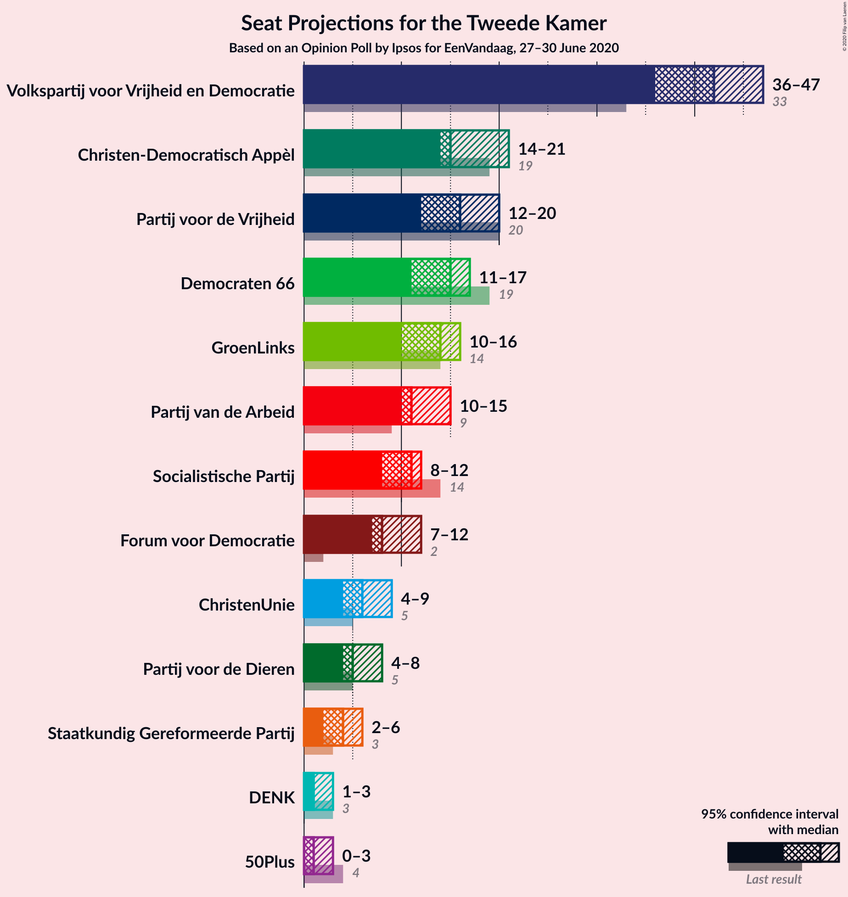
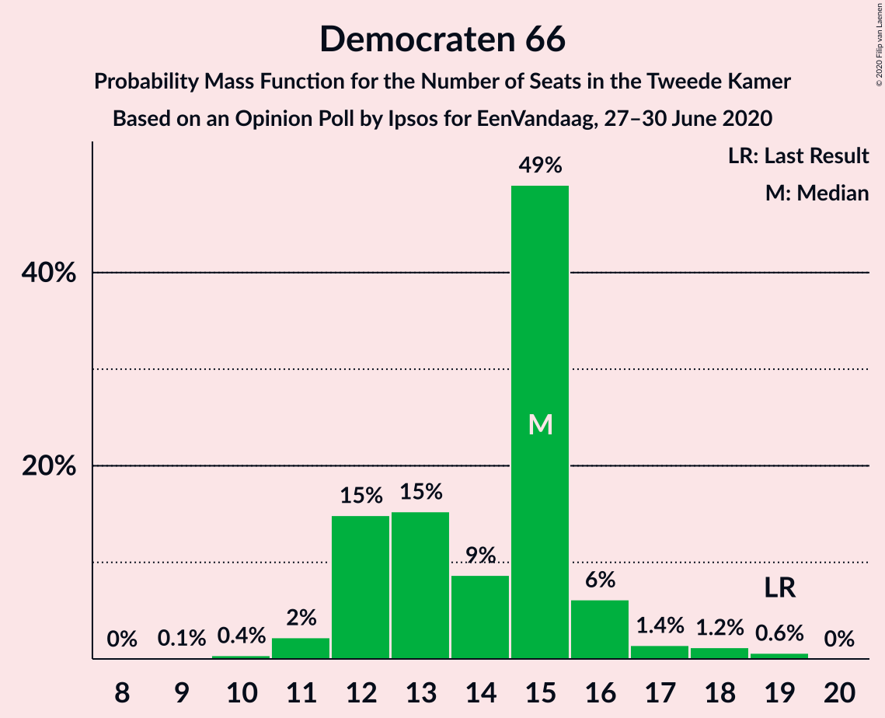
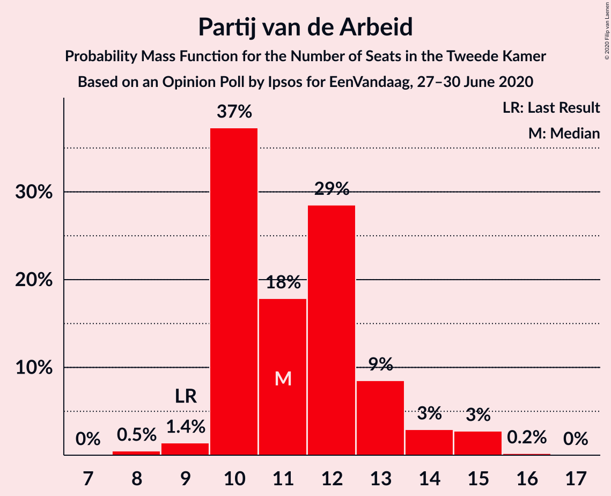
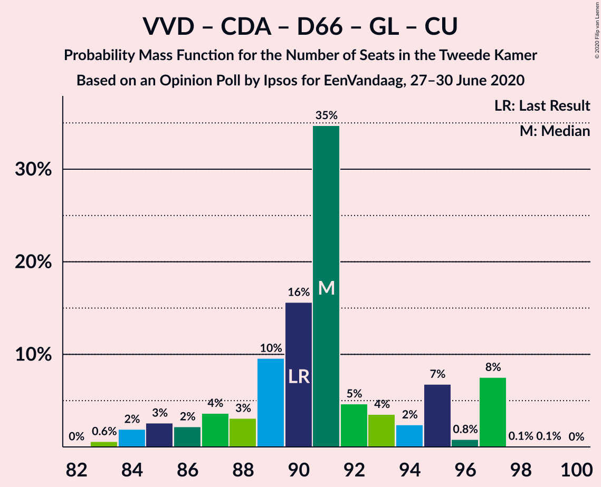
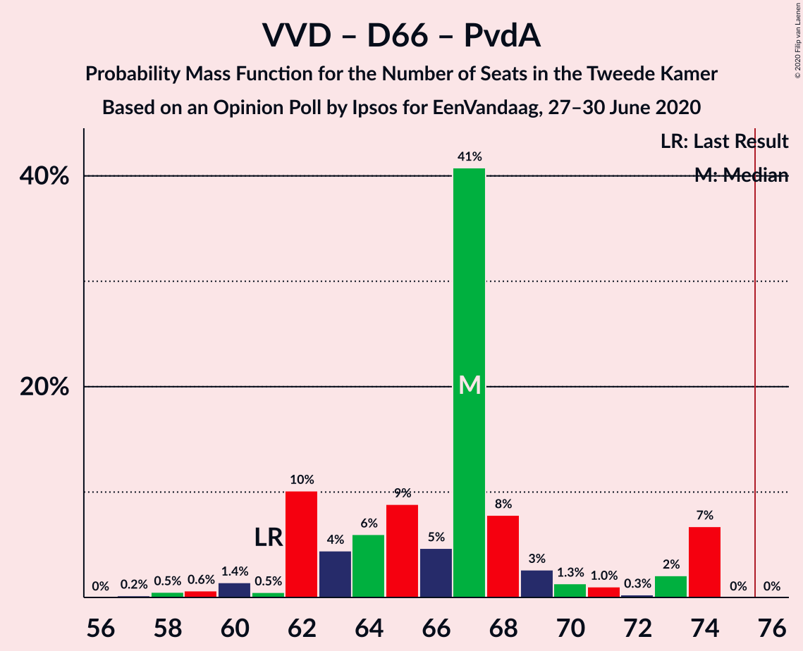
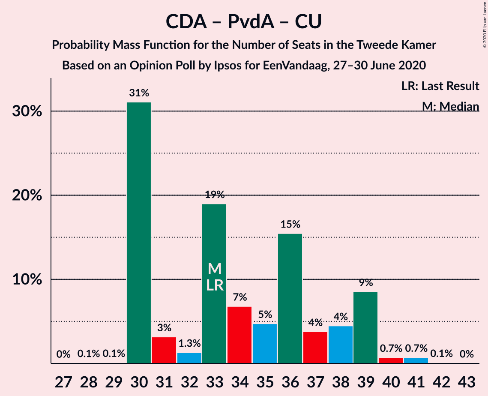

# Opinion Poll by Ipsos for EenVandaag, 27–30 June 2020

<a href="#voting-intentions">Voting Intentions</a> | <a href="#seats">Seats</a> | <a href="#coalitions">Coalitions</a> | <a href="#technical-information">Technical Information</a>

## Voting Intentions

### Confidence Intervals

| Party | Last Result | Poll Result | 80% Confidence Interval | 90% Confidence Interval | 95% Confidence Interval | 99% Confidence Interval |
|:-----:|:-----------:|:-----------:|:-----------------------:|:-----------------------:|:-----------------------:|:-----------------------:|
| Volkspartij voor Vrijheid en Democratie | 21.3% | 26.4% | 24.7–28.2% |24.2–28.7% |23.8–29.1% |23.0–30.0% |
| Christen-Democratisch Appèl | 12.4% | 10.7% | 9.6–12.0% |9.3–12.4% |9.0–12.7% |8.5–13.4% |
| Partij voor de Vrijheid | 13.1% | 10.4% | 9.3–11.7% |9.0–12.1% |8.7–12.4% |8.2–13.1% |
| Democraten 66 | 12.2% | 9.1% | 8.0–10.3% |7.8–10.7% |7.5–11.0% |7.0–11.6% |
| GroenLinks | 9.1% | 8.6% | 7.6–9.8% |7.3–10.2% |7.1–10.5% |6.6–11.1% |
| Partij van de Arbeid | 5.7% | 7.9% | 6.9–9.0% |6.6–9.4% |6.4–9.7% |5.9–10.2% |
| Socialistische Partij | 9.1% | 6.8% | 5.9–7.9% |5.7–8.2% |5.5–8.5% |5.0–9.1% |
| Forum voor Democratie | 1.8% | 5.9% | 5.0–6.9% |4.8–7.2% |4.6–7.5% |4.2–8.0% |
| ChristenUnie | 3.4% | 4.5% | 3.8–5.5% |3.6–5.7% |3.4–6.0% |3.1–6.5% |
| Partij voor de Dieren | 3.2% | 3.7% | 3.0–4.6% |2.9–4.8% |2.7–5.0% |2.4–5.5% |
| Staatkundig Gereformeerde Partij | 2.1% | 2.4% | 1.9–3.1% |1.7–3.3% |1.6–3.5% |1.4–3.9% |
| DENK | 2.1% | 1.3% | 1.0–1.9% |0.9–2.1% |0.8–2.2% |0.6–2.5% |
| 50Plus | 3.1% | 1.1% | 0.8–1.7% |0.7–1.8% |0.7–2.0% |0.5–2.3% |

*Note:* The poll result column reflects the actual value used in the calculations. Published results may vary slightly, and in addition be rounded to fewer digits.

## Seats

### Confidence Intervals

| Party | Last Result | Median | 80% Confidence Interval | 90% Confidence Interval | 95% Confidence Interval | 99% Confidence Interval |
|:-----:|:-----------:|:------:|:-----------------------:|:-----------------------:|:-----------------------:|:-----------------------:|
| <a href="#volkspartij-voor-vrijheid-en-democratie">Volkspartij voor Vrijheid en Democratie</a> | 33 | 38 | 37–47 |37–47 |37–47 |36–47 |
| <a href="#christen-democratisch-appèl">Christen-Democratisch Appèl</a> | 19 | 16 | 14–21 |14–21 |14–21 |13–21 |
| <a href="#partij-voor-de-vrijheid">Partij voor de Vrijheid</a> | 20 | 14 | 13–16 |12–17 |12–19 |12–19 |
| <a href="#democraten-66">Democraten 66</a> | 19 | 15 | 13–16 |13–16 |12–18 |10–18 |
| <a href="#groenlinks">GroenLinks</a> | 14 | 14 | 11–16 |11–16 |11–16 |11–17 |
| <a href="#partij-van-de-arbeid">Partij van de Arbeid</a> | 9 | 12 | 10–14 |10–15 |10–15 |10–15 |
| <a href="#socialistische-partij">Socialistische Partij</a> | 14 | 10 | 9–12 |9–12 |8–12 |8–12 |
| <a href="#forum-voor-democratie">Forum voor Democratie</a> | 2 | 9 | 7–11 |7–12 |6–12 |6–12 |
| <a href="#christenunie">ChristenUnie</a> | 5 | 7 | 4–7 |4–7 |4–8 |4–8 |
| <a href="#partij-voor-de-dieren">Partij voor de Dieren</a> | 5 | 5 | 4–7 |4–7 |3–7 |3–7 |
| <a href="#staatkundig-gereformeerde-partij">Staatkundig Gereformeerde Partij</a> | 3 | 2 | 2–4 |2–4 |2–4 |1–5 |
| <a href="#denk">DENK</a> | 3 | 2 | 1–2 |1–3 |1–3 |1–3 |
| <a href="#50plus">50Plus</a> | 4 | 1 | 1–2 |1–2 |1–2 |0–3 |

### Volkspartij voor Vrijheid en Democratie

*For a full overview of the results for this party, see the [Volkspartij voor Vrijheid en Democratie](party-volkspartijvoorvrijheidendemocratie.html) page.*

| Number of Seats | Probability | Accumulated | Special Marks |
|:---------------:|:-----------:|:-----------:|:-------------:|
| 33 | 0% | 100% | Last Result |
| 34 | 0.2% | 100% |  |
| 35 | 0.3% | 99.8% |  |
| 36 | 0.4% | 99.5% |  |
| 37 | 18% | 99.1% |  |
| 38 | 32% | 81% | Median |
| 39 | 4% | 49% |  |
| 40 | 2% | 45% |  |
| 41 | 1.2% | 43% |  |
| 42 | 2% | 41% |  |
| 43 | 0.7% | 39% |  |
| 44 | 8% | 39% |  |
| 45 | 0.1% | 31% |  |
| 46 | 0.2% | 30% |  |
| 47 | 30% | 30% |  |
| 48 | 0% | 0% |  |

### Christen-Democratisch Appèl

*For a full overview of the results for this party, see the [Christen-Democratisch Appèl](party-christen-democratischappèl.html) page.*

| Number of Seats | Probability | Accumulated | Special Marks |
|:---------------:|:-----------:|:-----------:|:-------------:|
| 12 | 0.1% | 100% |  |
| 13 | 0.4% | 99.8% |  |
| 14 | 42% | 99.4% |  |
| 15 | 3% | 58% |  |
| 16 | 10% | 55% | Median |
| 17 | 13% | 45% |  |
| 18 | 10% | 31% |  |
| 19 | 0.7% | 21% | Last Result |
| 20 | 3% | 20% |  |
| 21 | 18% | 18% |  |
| 22 | 0% | 0% |  |

### Partij voor de Vrijheid

*For a full overview of the results for this party, see the [Partij voor de Vrijheid](party-partijvoordevrijheid.html) page.*

| Number of Seats | Probability | Accumulated | Special Marks |
|:---------------:|:-----------:|:-----------:|:-------------:|
| 11 | 0% | 100% |  |
| 12 | 8% | 99.9% |  |
| 13 | 9% | 92% |  |
| 14 | 44% | 83% | Median |
| 15 | 22% | 39% |  |
| 16 | 11% | 18% |  |
| 17 | 2% | 7% |  |
| 18 | 0.1% | 4% |  |
| 19 | 3% | 4% |  |
| 20 | 0.5% | 0.5% | Last Result |
| 21 | 0% | 0% |  |

### Democraten 66

*For a full overview of the results for this party, see the [Democraten 66](party-democraten66.html) page.*

| Number of Seats | Probability | Accumulated | Special Marks |
|:---------------:|:-----------:|:-----------:|:-------------:|
| 9 | 0.4% | 100% |  |
| 10 | 0.2% | 99.6% |  |
| 11 | 0.5% | 99.4% |  |
| 12 | 2% | 98.9% |  |
| 13 | 21% | 97% |  |
| 14 | 12% | 76% |  |
| 15 | 40% | 64% | Median |
| 16 | 19% | 24% |  |
| 17 | 1.2% | 5% |  |
| 18 | 3% | 4% |  |
| 19 | 0.5% | 0.5% | Last Result |
| 20 | 0% | 0% |  |

### GroenLinks

*For a full overview of the results for this party, see the [GroenLinks](party-groenlinks.html) page.*

| Number of Seats | Probability | Accumulated | Special Marks |
|:---------------:|:-----------:|:-----------:|:-------------:|
| 10 | 0.2% | 100% |  |
| 11 | 14% | 99.8% |  |
| 12 | 2% | 86% |  |
| 13 | 21% | 84% |  |
| 14 | 40% | 63% | Last Result, Median |
| 15 | 12% | 23% |  |
| 16 | 10% | 11% |  |
| 17 | 0.3% | 0.6% |  |
| 18 | 0.3% | 0.3% |  |
| 19 | 0% | 0% |  |

### Partij van de Arbeid

*For a full overview of the results for this party, see the [Partij van de Arbeid](party-partijvandearbeid.html) page.*

| Number of Seats | Probability | Accumulated | Special Marks |
|:---------------:|:-----------:|:-----------:|:-------------:|
| 9 | 0.4% | 100% | Last Result |
| 10 | 12% | 99.6% |  |
| 11 | 3% | 88% |  |
| 12 | 62% | 85% | Median |
| 13 | 11% | 22% |  |
| 14 | 3% | 12% |  |
| 15 | 9% | 9% |  |
| 16 | 0.1% | 0.1% |  |
| 17 | 0% | 0% |  |

### Socialistische Partij

*For a full overview of the results for this party, see the [Socialistische Partij](party-socialistischepartij.html) page.*

| Number of Seats | Probability | Accumulated | Special Marks |
|:---------------:|:-----------:|:-----------:|:-------------:|
| 7 | 0.1% | 100% |  |
| 8 | 3% | 99.9% |  |
| 9 | 40% | 97% |  |
| 10 | 18% | 57% | Median |
| 11 | 21% | 39% |  |
| 12 | 18% | 19% |  |
| 13 | 0.3% | 0.4% |  |
| 14 | 0.1% | 0.1% | Last Result |
| 15 | 0% | 0% |  |

### Forum voor Democratie

*For a full overview of the results for this party, see the [Forum voor Democratie](party-forumvoordemocratie.html) page.*

| Number of Seats | Probability | Accumulated | Special Marks |
|:---------------:|:-----------:|:-----------:|:-------------:|
| 2 | 0% | 100% | Last Result |
| 3 | 0% | 100% |  |
| 4 | 0% | 100% |  |
| 5 | 0% | 100% |  |
| 6 | 3% | 100% |  |
| 7 | 32% | 97% |  |
| 8 | 1.2% | 64% |  |
| 9 | 42% | 63% | Median |
| 10 | 10% | 21% |  |
| 11 | 2% | 11% |  |
| 12 | 10% | 10% |  |
| 13 | 0% | 0% |  |

### ChristenUnie

*For a full overview of the results for this party, see the [ChristenUnie](party-christenunie.html) page.*

| Number of Seats | Probability | Accumulated | Special Marks |
|:---------------:|:-----------:|:-----------:|:-------------:|
| 4 | 10% | 100% |  |
| 5 | 3% | 90% | Last Result |
| 6 | 30% | 87% |  |
| 7 | 54% | 57% | Median |
| 8 | 3% | 3% |  |
| 9 | 0.3% | 0.3% |  |
| 10 | 0% | 0% |  |

### Partij voor de Dieren

*For a full overview of the results for this party, see the [Partij voor de Dieren](party-partijvoordedieren.html) page.*

| Number of Seats | Probability | Accumulated | Special Marks |
|:---------------:|:-----------:|:-----------:|:-------------:|
| 3 | 3% | 100% |  |
| 4 | 10% | 97% |  |
| 5 | 59% | 87% | Last Result, Median |
| 6 | 16% | 28% |  |
| 7 | 11% | 12% |  |
| 8 | 0.2% | 0.2% |  |
| 9 | 0% | 0% |  |

### Staatkundig Gereformeerde Partij

*For a full overview of the results for this party, see the [Staatkundig Gereformeerde Partij](party-staatkundiggereformeerdepartij.html) page.*

| Number of Seats | Probability | Accumulated | Special Marks |
|:---------------:|:-----------:|:-----------:|:-------------:|
| 1 | 0.8% | 100% |  |
| 2 | 50% | 99.2% | Median |
| 3 | 15% | 49% | Last Result |
| 4 | 33% | 34% |  |
| 5 | 1.3% | 2% |  |
| 6 | 0.2% | 0.2% |  |
| 7 | 0% | 0% |  |

### DENK

*For a full overview of the results for this party, see the [DENK](party-denk.html) page.*

| Number of Seats | Probability | Accumulated | Special Marks |
|:---------------:|:-----------:|:-----------:|:-------------:|
| 1 | 30% | 100% |  |
| 2 | 60% | 70% | Median |
| 3 | 9% | 10% | Last Result |
| 4 | 0.4% | 0.4% |  |
| 5 | 0% | 0% |  |

### 50Plus

*For a full overview of the results for this party, see the [50Plus](party-50plus.html) page.*

| Number of Seats | Probability | Accumulated | Special Marks |
|:---------------:|:-----------:|:-----------:|:-------------:|
| 0 | 2% | 100% |  |
| 1 | 81% | 98% | Median |
| 2 | 17% | 18% |  |
| 3 | 0.5% | 0.5% |  |
| 4 | 0% | 0% | Last Result |

## Coalitions

### Confidence Intervals

| Coalition | Last Result | Median | Majority? | 80% Confidence Interval | 90% Confidence Interval | 95% Confidence Interval | 99% Confidence Interval |
|:---------:|:-----------:|:------:|:---------:|:-----------------------:|:-----------------------:|:-----------------------:|:-----------------------:|
| Volkspartij voor Vrijheid en Democratie – Christen-Democratisch Appèl – Democraten 66 – GroenLinks – ChristenUnie | 90 | 90 | 100% | 90–97 | 87–97 | 87–97 | 85–97 |
| Volkspartij voor Vrijheid en Democratie – Christen-Democratisch Appèl – Democraten 66 – Partij van de Arbeid – ChristenUnie | 85 | 92 | 100% | 85–95 | 85–95 | 84–95 | 83–95 |
| Volkspartij voor Vrijheid en Democratie – Christen-Democratisch Appèl – Partij voor de Vrijheid – Forum voor Democratie – Staatkundig Gereformeerde Partij | 77 | 84 | 100% | 80–86 | 78–86 | 78–88 | 78–89 |
| Volkspartij voor Vrijheid en Democratie – Christen-Democratisch Appèl – Partij voor de Vrijheid – Forum voor Democratie | 74 | 82 | 91% | 77–82 | 75–82 | 75–84 | 75–86 |
| Volkspartij voor Vrijheid en Democratie – Christen-Democratisch Appèl – Democraten 66 – ChristenUnie | 76 | 79 | 76% | 74–83 | 74–83 | 72–83 | 72–83 |
| Christen-Democratisch Appèl – Democraten 66 – GroenLinks – Partij van de Arbeid – Socialistische Partij – ChristenUnie | 80 | 74 | 22% | 71–77 | 71–77 | 69–77 | 68–77 |
| Volkspartij voor Vrijheid en Democratie – Christen-Democratisch Appèl – Democraten 66 | 71 | 72 | 31% | 68–76 | 67–76 | 65–76 | 65–76 |
| Volkspartij voor Vrijheid en Democratie – Christen-Democratisch Appèl – Partij voor de Vrijheid | 72 | 73 | 1.2% | 70–75 | 65–75 | 65–75 | 65–77 |
| Volkspartij voor Vrijheid en Democratie – Christen-Democratisch Appèl – Partij van de Arbeid | 61 | 70 | 0.1% | 64–73 | 62–75 | 62–75 | 62–75 |
| Volkspartij voor Vrijheid en Democratie – Democraten 66 – Partij van de Arbeid | 61 | 67 | 0% | 62–74 | 62–74 | 62–74 | 61–74 |
| Volkspartij voor Vrijheid en Democratie – Christen-Democratisch Appèl – Forum voor Democratie – Staatkundig Gereformeerde Partij – 50Plus | 61 | 71 | 0.1% | 67–73 | 67–73 | 67–73 | 64–75 |
| Volkspartij voor Vrijheid en Democratie – Christen-Democratisch Appèl – Forum voor Democratie – Staatkundig Gereformeerde Partij | 57 | 70 | 0% | 65–72 | 65–72 | 65–72 | 62–73 |
| Volkspartij voor Vrijheid en Democratie – Christen-Democratisch Appèl – Forum voor Democratie – 50Plus | 58 | 69 | 0% | 64–69 | 64–70 | 63–70 | 61–72 |
| Volkspartij voor Vrijheid en Democratie – Christen-Democratisch Appèl – Forum voor Democratie | 54 | 68 | 0% | 62–68 | 62–69 | 61–69 | 60–71 |
| Christen-Democratisch Appèl – Democraten 66 – GroenLinks – Partij van de Arbeid – ChristenUnie | 66 | 64 | 0% | 62–65 | 61–65 | 60–66 | 57–67 |
| Volkspartij voor Vrijheid en Democratie – Christen-Democratisch Appèl | 52 | 58 | 0% | 52–61 | 52–61 | 52–61 | 51–61 |
| Volkspartij voor Vrijheid en Democratie – Partij van de Arbeid | 42 | 51 | 0% | 49–59 | 48–59 | 48–59 | 47–59 |
| Christen-Democratisch Appèl – Democraten 66 – Partij van de Arbeid | 47 | 44 | 0% | 40–47 | 40–47 | 39–48 | 37–48 |
| Christen-Democratisch Appèl – Partij van de Arbeid – ChristenUnie | 33 | 33 | 0% | 32–39 | 31–39 | 31–39 | 31–39 |
| Christen-Democratisch Appèl – Democraten 66 | 38 | 30 | 0% | 29–34 | 28–34 | 27–35 | 26–35 |
| Christen-Democratisch Appèl – Partij van de Arbeid | 28 | 29 | 0% | 26–33 | 24–33 | 24–33 | 24–34 |

### Volkspartij voor Vrijheid en Democratie – Christen-Democratisch Appèl – Democraten 66 – GroenLinks – ChristenUnie

| Number of Seats | Probability | Accumulated | Special Marks |
|:---------------:|:-----------:|:-----------:|:-------------:|
| 83 | 0.1% | 100% |  |
| 84 | 0% | 99.9% |  |
| 85 | 0.5% | 99.9% |  |
| 86 | 2% | 99.4% |  |
| 87 | 3% | 98% |  |
| 88 | 0.3% | 95% |  |
| 89 | 0.5% | 95% |  |
| 90 | 48% | 94% | Last Result, Median |
| 91 | 2% | 46% |  |
| 92 | 3% | 44% |  |
| 93 | 0.4% | 41% |  |
| 94 | 10% | 41% |  |
| 95 | 0.1% | 31% |  |
| 96 | 0.1% | 31% |  |
| 97 | 31% | 31% |  |
| 98 | 0% | 0% |  |

### Volkspartij voor Vrijheid en Democratie – Christen-Democratisch Appèl – Democraten 66 – Partij van de Arbeid – ChristenUnie

| Number of Seats | Probability | Accumulated | Special Marks |
|:---------------:|:-----------:|:-----------:|:-------------:|
| 83 | 1.0% | 100% |  |
| 84 | 3% | 99.0% |  |
| 85 | 8% | 96% | Last Result |
| 86 | 11% | 88% |  |
| 87 | 1.4% | 77% |  |
| 88 | 0.9% | 75% | Median |
| 89 | 18% | 75% |  |
| 90 | 0.7% | 57% |  |
| 91 | 5% | 56% |  |
| 92 | 10% | 51% |  |
| 93 | 1.3% | 41% |  |
| 94 | 1.5% | 40% |  |
| 95 | 39% | 39% |  |
| 96 | 0% | 0.1% |  |
| 97 | 0% | 0% |  |

### Volkspartij voor Vrijheid en Democratie – Christen-Democratisch Appèl – Partij voor de Vrijheid – Forum voor Democratie – Staatkundig Gereformeerde Partij

| Number of Seats | Probability | Accumulated | Special Marks |
|:---------------:|:-----------:|:-----------:|:-------------:|
| 76 | 0.3% | 100% | Majority |
| 77 | 0.1% | 99.7% | Last Result |
| 78 | 8% | 99.6% |  |
| 79 | 0.5% | 92% | Median |
| 80 | 1.5% | 91% |  |
| 81 | 3% | 90% |  |
| 82 | 10% | 87% |  |
| 83 | 11% | 77% |  |
| 84 | 34% | 66% |  |
| 85 | 0.6% | 31% |  |
| 86 | 27% | 31% |  |
| 87 | 1.0% | 4% |  |
| 88 | 2% | 3% |  |
| 89 | 0.3% | 0.7% |  |
| 90 | 0.5% | 0.5% |  |
| 91 | 0% | 0% |  |

### Volkspartij voor Vrijheid en Democratie – Christen-Democratisch Appèl – Partij voor de Vrijheid – Forum voor Democratie

| Number of Seats | Probability | Accumulated | Special Marks |
|:---------------:|:-----------:|:-----------:|:-------------:|
| 73 | 0.1% | 100% |  |
| 74 | 0.4% | 99.9% | Last Result |
| 75 | 8% | 99.6% |  |
| 76 | 0.2% | 91% | Majority |
| 77 | 1.2% | 91% | Median |
| 78 | 2% | 90% |  |
| 79 | 2% | 87% |  |
| 80 | 15% | 85% |  |
| 81 | 9% | 70% |  |
| 82 | 58% | 62% |  |
| 83 | 1.1% | 4% |  |
| 84 | 2% | 3% |  |
| 85 | 0.3% | 0.8% |  |
| 86 | 0% | 0.5% |  |
| 87 | 0% | 0.5% |  |
| 88 | 0.4% | 0.4% |  |
| 89 | 0% | 0% |  |

### Volkspartij voor Vrijheid en Democratie – Christen-Democratisch Appèl – Democraten 66 – ChristenUnie

| Number of Seats | Probability | Accumulated | Special Marks |
|:---------------:|:-----------:|:-----------:|:-------------:|
| 70 | 0.1% | 100% |  |
| 71 | 0.2% | 99.9% |  |
| 72 | 4% | 99.8% |  |
| 73 | 0.9% | 96% |  |
| 74 | 10% | 95% |  |
| 75 | 8% | 85% |  |
| 76 | 2% | 76% | Last Result, Median, Majority |
| 77 | 20% | 75% |  |
| 78 | 0.3% | 54% |  |
| 79 | 10% | 54% |  |
| 80 | 9% | 44% |  |
| 81 | 3% | 35% |  |
| 82 | 1.1% | 33% |  |
| 83 | 31% | 31% |  |
| 84 | 0% | 0% |  |

### Christen-Democratisch Appèl – Democraten 66 – GroenLinks – Partij van de Arbeid – Socialistische Partij – ChristenUnie

| Number of Seats | Probability | Accumulated | Special Marks |
|:---------------:|:-----------:|:-----------:|:-------------:|
| 65 | 0.2% | 100% |  |
| 66 | 0% | 99.8% |  |
| 67 | 0.1% | 99.8% |  |
| 68 | 1.4% | 99.7% |  |
| 69 | 1.3% | 98% |  |
| 70 | 1.1% | 97% |  |
| 71 | 31% | 96% |  |
| 72 | 12% | 65% |  |
| 73 | 0.4% | 53% |  |
| 74 | 13% | 53% | Median |
| 75 | 19% | 40% |  |
| 76 | 1.3% | 22% | Majority |
| 77 | 20% | 21% |  |
| 78 | 0.1% | 0.4% |  |
| 79 | 0.1% | 0.3% |  |
| 80 | 0.2% | 0.2% | Last Result |
| 81 | 0% | 0% |  |

### Volkspartij voor Vrijheid en Democratie – Christen-Democratisch Appèl – Democraten 66

| Number of Seats | Probability | Accumulated | Special Marks |
|:---------------:|:-----------:|:-----------:|:-------------:|
| 63 | 0.1% | 100% |  |
| 64 | 0% | 99.9% |  |
| 65 | 3% | 99.9% |  |
| 66 | 2% | 97% |  |
| 67 | 1.0% | 96% |  |
| 68 | 9% | 95% |  |
| 69 | 0.6% | 86% | Median |
| 70 | 11% | 85% |  |
| 71 | 18% | 74% | Last Result |
| 72 | 12% | 57% |  |
| 73 | 1.2% | 45% |  |
| 74 | 12% | 44% |  |
| 75 | 1.1% | 32% |  |
| 76 | 30% | 31% | Majority |
| 77 | 0.1% | 0.2% |  |
| 78 | 0% | 0% |  |

### Volkspartij voor Vrijheid en Democratie – Christen-Democratisch Appèl – Partij voor de Vrijheid

| Number of Seats | Probability | Accumulated | Special Marks |
|:---------------:|:-----------:|:-----------:|:-------------:|
| 62 | 0.1% | 100% |  |
| 63 | 0% | 99.9% |  |
| 64 | 0.1% | 99.9% |  |
| 65 | 8% | 99.7% |  |
| 66 | 0.4% | 92% |  |
| 67 | 0.2% | 91% |  |
| 68 | 0.6% | 91% | Median |
| 69 | 0.7% | 91% |  |
| 70 | 10% | 90% |  |
| 71 | 15% | 80% |  |
| 72 | 11% | 65% | Last Result |
| 73 | 21% | 53% |  |
| 74 | 0.9% | 32% |  |
| 75 | 30% | 32% |  |
| 76 | 0.3% | 1.2% | Majority |
| 77 | 0.9% | 0.9% |  |
| 78 | 0.1% | 0.1% |  |
| 79 | 0% | 0% |  |

### Volkspartij voor Vrijheid en Democratie – Christen-Democratisch Appèl – Partij van de Arbeid

| Number of Seats | Probability | Accumulated | Special Marks |
|:---------------:|:-----------:|:-----------:|:-------------:|
| 61 | 0.3% | 100% | Last Result |
| 62 | 8% | 99.7% |  |
| 63 | 0.1% | 92% |  |
| 64 | 3% | 92% |  |
| 65 | 1.3% | 89% |  |
| 66 | 3% | 88% | Median |
| 67 | 12% | 85% |  |
| 68 | 1.3% | 73% |  |
| 69 | 10% | 71% |  |
| 70 | 19% | 61% |  |
| 71 | 1.0% | 42% |  |
| 72 | 2% | 41% |  |
| 73 | 30% | 39% |  |
| 74 | 0.1% | 8% |  |
| 75 | 8% | 8% |  |
| 76 | 0.1% | 0.1% | Majority |
| 77 | 0% | 0% |  |

### Volkspartij voor Vrijheid en Democratie – Democraten 66 – Partij van de Arbeid

| Number of Seats | Probability | Accumulated | Special Marks |
|:---------------:|:-----------:|:-----------:|:-------------:|
| 60 | 0.1% | 100% |  |
| 61 | 0.8% | 99.9% | Last Result |
| 62 | 18% | 99.1% |  |
| 63 | 4% | 81% |  |
| 64 | 9% | 77% |  |
| 65 | 10% | 68% | Median |
| 66 | 4% | 58% |  |
| 67 | 12% | 54% |  |
| 68 | 0.1% | 42% |  |
| 69 | 1.1% | 42% |  |
| 70 | 0.9% | 41% |  |
| 71 | 0.9% | 40% |  |
| 72 | 0.6% | 39% |  |
| 73 | 8% | 39% |  |
| 74 | 30% | 30% |  |
| 75 | 0% | 0% |  |

### Volkspartij voor Vrijheid en Democratie – Christen-Democratisch Appèl – Forum voor Democratie – Staatkundig Gereformeerde Partij – 50Plus

| Number of Seats | Probability | Accumulated | Special Marks |
|:---------------:|:-----------:|:-----------:|:-------------:|
| 61 | 0.1% | 100% | Last Result |
| 62 | 0.2% | 99.9% |  |
| 63 | 0.2% | 99.7% |  |
| 64 | 0.3% | 99.6% |  |
| 65 | 0.2% | 99.2% |  |
| 66 | 0.1% | 99.0% | Median |
| 67 | 21% | 98.9% |  |
| 68 | 0.5% | 77% |  |
| 69 | 6% | 77% |  |
| 70 | 2% | 70% |  |
| 71 | 30% | 68% |  |
| 72 | 26% | 38% |  |
| 73 | 11% | 12% |  |
| 74 | 0.2% | 0.9% |  |
| 75 | 0.5% | 0.6% |  |
| 76 | 0.1% | 0.1% | Majority |
| 77 | 0% | 0% |  |

### Volkspartij voor Vrijheid en Democratie – Christen-Democratisch Appèl – Forum voor Democratie – Staatkundig Gereformeerde Partij

| Number of Seats | Probability | Accumulated | Special Marks |
|:---------------:|:-----------:|:-----------:|:-------------:|
| 57 | 0% | 100% | Last Result |
| 58 | 0% | 100% |  |
| 59 | 0% | 100% |  |
| 60 | 0.1% | 100% |  |
| 61 | 0.2% | 99.9% |  |
| 62 | 0.2% | 99.7% |  |
| 63 | 0.3% | 99.5% |  |
| 64 | 0.1% | 99.2% |  |
| 65 | 11% | 99.0% | Median |
| 66 | 11% | 88% |  |
| 67 | 4% | 77% |  |
| 68 | 5% | 73% |  |
| 69 | 0% | 68% |  |
| 70 | 30% | 68% |  |
| 71 | 26% | 38% |  |
| 72 | 10% | 12% |  |
| 73 | 1.4% | 2% |  |
| 74 | 0.1% | 0.2% |  |
| 75 | 0.1% | 0.1% |  |
| 76 | 0% | 0% | Majority |

### Volkspartij voor Vrijheid en Democratie – Christen-Democratisch Appèl – Forum voor Democratie – 50Plus

| Number of Seats | Probability | Accumulated | Special Marks |
|:---------------:|:-----------:|:-----------:|:-------------:|
| 58 | 0% | 100% | Last Result |
| 59 | 0.1% | 100% |  |
| 60 | 0.2% | 99.9% |  |
| 61 | 0.4% | 99.7% |  |
| 62 | 0.3% | 99.3% |  |
| 63 | 3% | 99.0% |  |
| 64 | 10% | 96% | Median |
| 65 | 10% | 87% |  |
| 66 | 8% | 76% |  |
| 67 | 0.3% | 69% |  |
| 68 | 18% | 68% |  |
| 69 | 41% | 50% |  |
| 70 | 8% | 9% |  |
| 71 | 0.1% | 0.8% |  |
| 72 | 0.2% | 0.7% |  |
| 73 | 0.5% | 0.5% |  |
| 74 | 0% | 0% |  |

### Volkspartij voor Vrijheid en Democratie – Christen-Democratisch Appèl – Forum voor Democratie

| Number of Seats | Probability | Accumulated | Special Marks |
|:---------------:|:-----------:|:-----------:|:-------------:|
| 54 | 0% | 100% | Last Result |
| 55 | 0% | 100% |  |
| 56 | 0% | 100% |  |
| 57 | 0% | 100% |  |
| 58 | 0.2% | 100% |  |
| 59 | 0.2% | 99.8% |  |
| 60 | 0.2% | 99.6% |  |
| 61 | 3% | 99.4% |  |
| 62 | 9% | 96% |  |
| 63 | 0.6% | 87% | Median |
| 64 | 14% | 87% |  |
| 65 | 4% | 72% |  |
| 66 | 0.5% | 68% |  |
| 67 | 18% | 68% |  |
| 68 | 40% | 50% |  |
| 69 | 9% | 10% |  |
| 70 | 0.1% | 0.8% |  |
| 71 | 0.6% | 0.7% |  |
| 72 | 0% | 0% |  |

### Christen-Democratisch Appèl – Democraten 66 – GroenLinks – Partij van de Arbeid – ChristenUnie

| Number of Seats | Probability | Accumulated | Special Marks |
|:---------------:|:-----------:|:-----------:|:-------------:|
| 55 | 0.1% | 100% |  |
| 56 | 0.1% | 99.9% |  |
| 57 | 1.1% | 99.8% |  |
| 58 | 0.4% | 98.7% |  |
| 59 | 0.1% | 98% |  |
| 60 | 0.7% | 98% |  |
| 61 | 5% | 97% |  |
| 62 | 39% | 93% |  |
| 63 | 3% | 53% |  |
| 64 | 10% | 50% | Median |
| 65 | 35% | 40% |  |
| 66 | 3% | 4% | Last Result |
| 67 | 0.8% | 1.1% |  |
| 68 | 0.2% | 0.3% |  |
| 69 | 0% | 0.1% |  |
| 70 | 0% | 0.1% |  |
| 71 | 0% | 0.1% |  |
| 72 | 0% | 0% |  |

### Volkspartij voor Vrijheid en Democratie – Christen-Democratisch Appèl

| Number of Seats | Probability | Accumulated | Special Marks |
|:---------------:|:-----------:|:-----------:|:-------------:|
| 49 | 0% | 100% |  |
| 50 | 0.4% | 99.9% |  |
| 51 | 0.1% | 99.5% |  |
| 52 | 11% | 99.5% | Last Result |
| 53 | 0.3% | 89% |  |
| 54 | 1.4% | 88% | Median |
| 55 | 11% | 87% |  |
| 56 | 14% | 76% |  |
| 57 | 0.9% | 63% |  |
| 58 | 22% | 62% |  |
| 59 | 0.3% | 40% |  |
| 60 | 9% | 39% |  |
| 61 | 30% | 31% |  |
| 62 | 0% | 0.1% |  |
| 63 | 0.1% | 0.1% |  |
| 64 | 0% | 0% |  |

### Volkspartij voor Vrijheid en Democratie – Partij van de Arbeid

| Number of Seats | Probability | Accumulated | Special Marks |
|:---------------:|:-----------:|:-----------:|:-------------:|
| 42 | 0% | 100% | Last Result |
| 43 | 0% | 100% |  |
| 44 | 0% | 100% |  |
| 45 | 0% | 100% |  |
| 46 | 0.3% | 100% |  |
| 47 | 0.4% | 99.7% |  |
| 48 | 8% | 99.3% |  |
| 49 | 21% | 91% |  |
| 50 | 13% | 71% | Median |
| 51 | 12% | 58% |  |
| 52 | 5% | 46% |  |
| 53 | 0.6% | 41% |  |
| 54 | 1.1% | 41% |  |
| 55 | 0.8% | 40% |  |
| 56 | 0.1% | 39% |  |
| 57 | 0% | 39% |  |
| 58 | 0% | 39% |  |
| 59 | 38% | 39% |  |
| 60 | 0% | 0.2% |  |
| 61 | 0.1% | 0.1% |  |
| 62 | 0% | 0% |  |

### Christen-Democratisch Appèl – Democraten 66 – Partij van de Arbeid

| Number of Seats | Probability | Accumulated | Special Marks |
|:---------------:|:-----------:|:-----------:|:-------------:|
| 36 | 0.1% | 100% |  |
| 37 | 1.0% | 99.8% |  |
| 38 | 0.5% | 98.9% |  |
| 39 | 3% | 98% |  |
| 40 | 10% | 96% |  |
| 41 | 31% | 86% |  |
| 42 | 0.5% | 55% |  |
| 43 | 2% | 55% | Median |
| 44 | 11% | 52% |  |
| 45 | 11% | 42% |  |
| 46 | 18% | 30% |  |
| 47 | 10% | 13% | Last Result |
| 48 | 2% | 3% |  |
| 49 | 0.4% | 0.4% |  |
| 50 | 0% | 0.1% |  |
| 51 | 0.1% | 0.1% |  |
| 52 | 0% | 0% |  |

### Christen-Democratisch Appèl – Partij van de Arbeid – ChristenUnie

| Number of Seats | Probability | Accumulated | Special Marks |
|:---------------:|:-----------:|:-----------:|:-------------:|
| 30 | 0.2% | 100% |  |
| 31 | 9% | 99.8% |  |
| 32 | 1.1% | 91% |  |
| 33 | 43% | 90% | Last Result |
| 34 | 4% | 46% |  |
| 35 | 2% | 42% | Median |
| 36 | 0.7% | 40% |  |
| 37 | 9% | 40% |  |
| 38 | 10% | 30% |  |
| 39 | 20% | 21% |  |
| 40 | 0.1% | 0.2% |  |
| 41 | 0.1% | 0.1% |  |
| 42 | 0% | 0% |  |

### Christen-Democratisch Appèl – Democraten 66

| Number of Seats | Probability | Accumulated | Special Marks |
|:---------------:|:-----------:|:-----------:|:-------------:|
| 25 | 0% | 100% |  |
| 26 | 1.0% | 99.9% |  |
| 27 | 3% | 98.9% |  |
| 28 | 0.8% | 96% |  |
| 29 | 32% | 95% |  |
| 30 | 16% | 63% |  |
| 31 | 2% | 47% | Median |
| 32 | 10% | 45% |  |
| 33 | 2% | 35% |  |
| 34 | 30% | 33% |  |
| 35 | 3% | 3% |  |
| 36 | 0% | 0.1% |  |
| 37 | 0% | 0% |  |
| 38 | 0% | 0% | Last Result |

### Christen-Democratisch Appèl – Partij van de Arbeid

| Number of Seats | Probability | Accumulated | Special Marks |
|:---------------:|:-----------:|:-----------:|:-------------:|
| 24 | 8% | 100% |  |
| 25 | 1.1% | 92% |  |
| 26 | 35% | 91% |  |
| 27 | 4% | 55% |  |
| 28 | 0.7% | 51% | Last Result, Median |
| 29 | 10% | 50% |  |
| 30 | 0.7% | 40% |  |
| 31 | 19% | 39% |  |
| 32 | 0.1% | 21% |  |
| 33 | 18% | 20% |  |
| 34 | 2% | 2% |  |
| 35 | 0% | 0% |  |

## Technical Information

### Opinion Poll

+ **Polling firm:** Ipsos
+ **Commissioner(s):** EenVandaag
+ **Fieldwork period:** 27–30 June 2020

### Calculations

+ **Sample size:** 1055
+ **Simulations done:** 131,072
+ **Error estimate:** 5.14%

