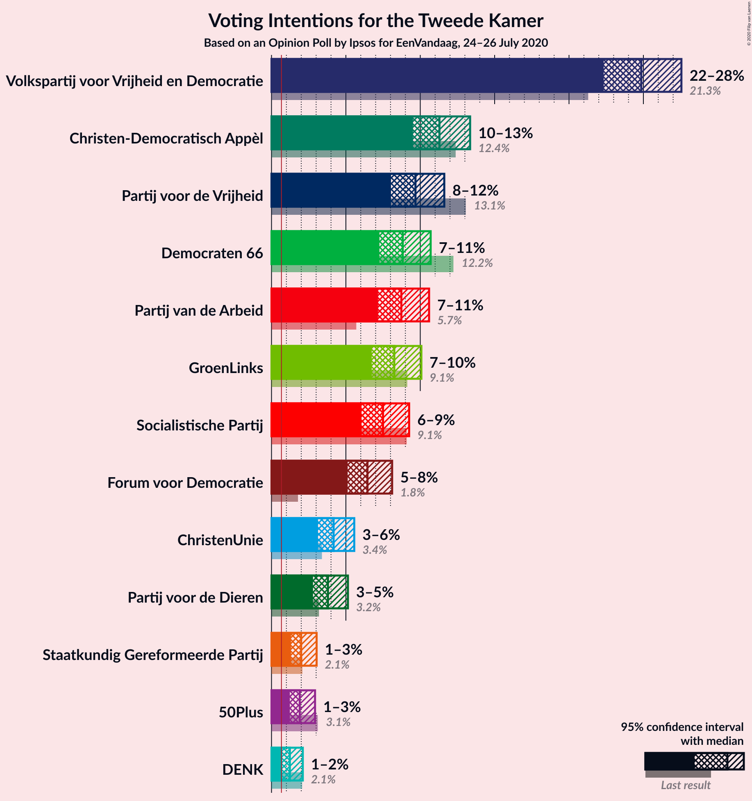
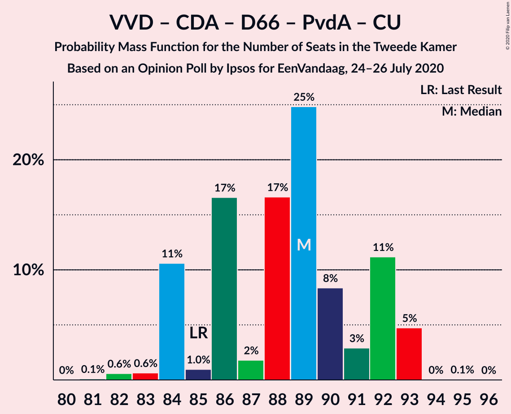
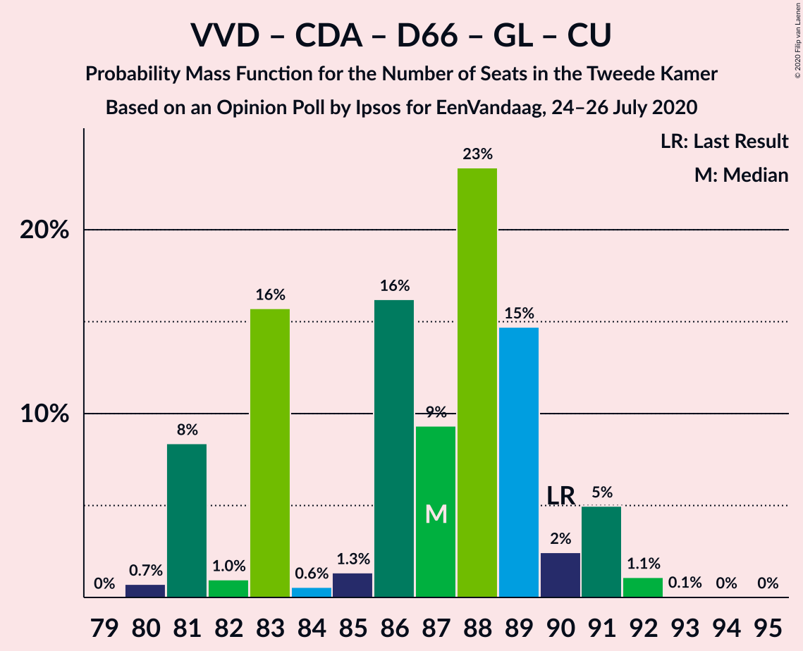
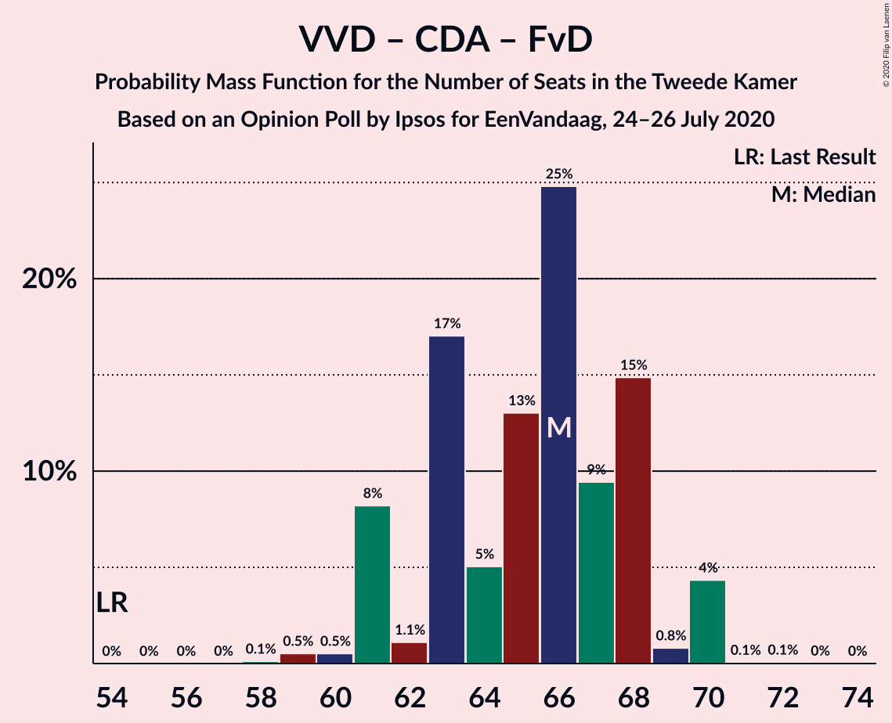
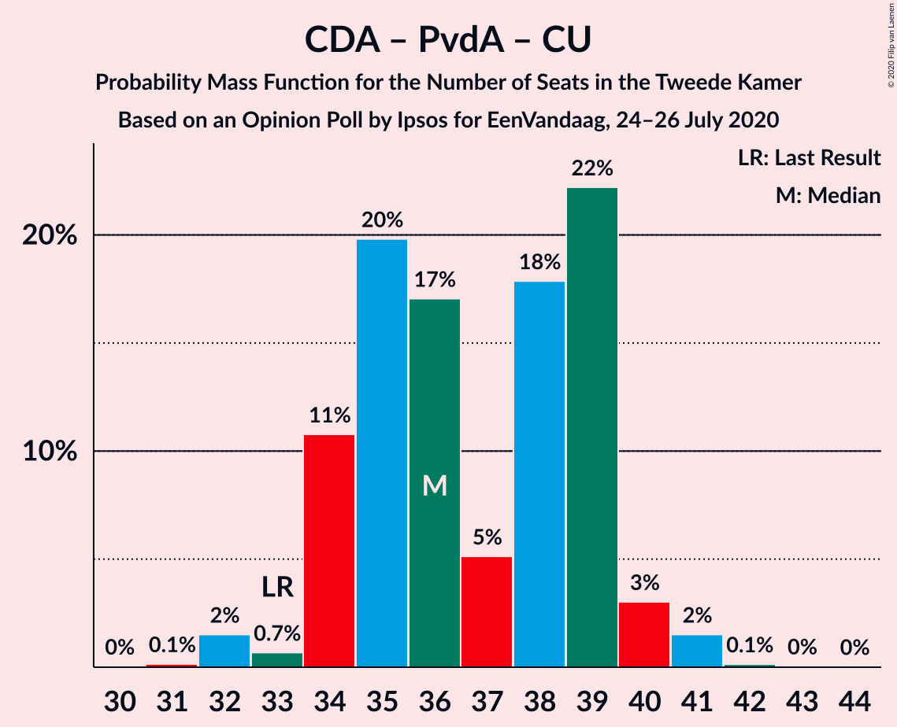

# Opinion Poll by Ipsos for EenVandaag, 24–26 July 2020

<a href="#voting-intentions">Voting Intentions</a> | <a href="#seats">Seats</a> | <a href="#coalitions">Coalitions</a> | <a href="#technical-information">Technical Information</a>

## Voting Intentions

### Confidence Intervals

| Party | Last Result | Poll Result | 80% Confidence Interval | 90% Confidence Interval | 95% Confidence Interval | 99% Confidence Interval |
|:-----:|:-----------:|:-----------:|:-----------------------:|:-----------------------:|:-----------------------:|:-----------------------:|
| Volkspartij voor Vrijheid en Democratie | 21.3% | 24.9% | 23.2–26.6% |22.7–27.1% |22.3–27.6% |21.6–28.4% |
| Christen-Democratisch Appèl | 12.4% | 11.3% | 10.1–12.6% |9.8–13.0% |9.5–13.4% |9.0–14.0% |
| Partij voor de Vrijheid | 13.1% | 9.7% | 8.6–10.9% |8.3–11.3% |8.0–11.6% |7.5–12.3% |
| Democraten 66 | 12.2% | 8.8% | 7.8–10.0% |7.5–10.4% |7.3–10.7% |6.8–11.3% |
| Partij van de Arbeid | 5.7% | 8.7% | 7.7–10.0% |7.4–10.3% |7.2–10.6% |6.7–11.2% |
| GroenLinks | 9.1% | 8.3% | 7.3–9.4% |7.0–9.8% |6.7–10.1% |6.3–10.7% |
| Socialistische Partij | 9.1% | 7.5% | 6.5–8.6% |6.3–9.0% |6.1–9.3% |5.6–9.8% |
| Forum voor Democratie | 1.8% | 6.5% | 5.6–7.5% |5.3–7.8% |5.1–8.1% |4.7–8.7% |
| ChristenUnie | 3.4% | 4.2% | 3.5–5.1% |3.3–5.3% |3.1–5.6% |2.8–6.0% |
| Partij voor de Dieren | 3.2% | 3.8% | 3.1–4.7% |3.0–4.9% |2.8–5.1% |2.5–5.6% |
| Staatkundig Gereformeerde Partij | 2.1% | 2.0% | 1.5–2.7% |1.4–2.9% |1.3–3.0% |1.1–3.4% |
| 50Plus | 3.1% | 1.9% | 1.4–2.6% |1.3–2.7% |1.2–2.9% |1.1–3.3% |
| DENK | 2.1% | 1.2% | 0.9–1.8% |0.8–2.0% |0.7–2.1% |0.6–2.4% |

*Note:* The poll result column reflects the actual value used in the calculations. Published results may vary slightly, and in addition be rounded to fewer digits.

## Seats

### Confidence Intervals

| Party | Last Result | Median | 80% Confidence Interval | 90% Confidence Interval | 95% Confidence Interval | 99% Confidence Interval |
|:-----:|:-----------:|:------:|:-----------------------:|:-----------------------:|:-----------------------:|:-----------------------:|
| <a href="#volkspartij-voor-vrijheid-en-democratie">Volkspartij voor Vrijheid en Democratie</a> | 33 | 39 | 35–42 |35–42 |35–42 |34–42 |
| <a href="#christen-democratisch-appèl">Christen-Democratisch Appèl</a> | 19 | 17 | 15–19 |15–20 |15–20 |14–21 |
| <a href="#partij-voor-de-vrijheid">Partij voor de Vrijheid</a> | 20 | 15 | 14–18 |14–18 |13–18 |12–18 |
| <a href="#democraten-66">Democraten 66</a> | 19 | 13 | 10–15 |10–15 |10–16 |10–17 |
| <a href="#partij-van-de-arbeid">Partij van de Arbeid</a> | 9 | 14 | 12–15 |11–15 |11–15 |10–17 |
| <a href="#groenlinks">GroenLinks</a> | 14 | 12 | 10–13 |10–14 |9–14 |9–15 |
| <a href="#socialistische-partij">Socialistische Partij</a> | 14 | 11 | 9–12 |9–12 |9–13 |8–14 |
| <a href="#forum-voor-democratie">Forum voor Democratie</a> | 2 | 10 | 8–11 |8–12 |7–12 |7–13 |
| <a href="#christenunie">ChristenUnie</a> | 5 | 6 | 5–7 |5–7 |5–8 |4–10 |
| <a href="#partij-voor-de-dieren">Partij voor de Dieren</a> | 5 | 6 | 4–7 |4–7 |4–7 |4–8 |
| <a href="#staatkundig-gereformeerde-partij">Staatkundig Gereformeerde Partij</a> | 3 | 2 | 2–4 |2–4 |2–5 |1–5 |
| <a href="#50plus">50Plus</a> | 4 | 3 | 2–3 |2–3 |1–4 |1–4 |
| <a href="#denk">DENK</a> | 3 | 1 | 1–2 |1–2 |1–3 |1–3 |

### Volkspartij voor Vrijheid en Democratie

*For a full overview of the results for this party, see the [Volkspartij voor Vrijheid en Democratie](party-volkspartijvoorvrijheidendemocratie.html) page.*

| Number of Seats | Probability | Accumulated | Special Marks |
|:---------------:|:-----------:|:-----------:|:-------------:|
| 32 | 0.1% | 100% |  |
| 33 | 0.2% | 99.9% | Last Result |
| 34 | 0.6% | 99.7% |  |
| 35 | 15% | 99.1% |  |
| 36 | 6% | 84% |  |
| 37 | 12% | 78% |  |
| 38 | 8% | 66% |  |
| 39 | 27% | 58% | Median |
| 40 | 2% | 31% |  |
| 41 | 15% | 30% |  |
| 42 | 14% | 15% |  |
| 43 | 0.4% | 0.5% |  |
| 44 | 0% | 0.1% |  |
| 45 | 0% | 0% |  |

### Christen-Democratisch Appèl

*For a full overview of the results for this party, see the [Christen-Democratisch Appèl](party-christen-democratischappèl.html) page.*

| Number of Seats | Probability | Accumulated | Special Marks |
|:---------------:|:-----------:|:-----------:|:-------------:|
| 12 | 0.1% | 100% |  |
| 13 | 0.3% | 99.9% |  |
| 14 | 0.7% | 99.6% |  |
| 15 | 21% | 99.0% |  |
| 16 | 17% | 78% |  |
| 17 | 19% | 61% | Median |
| 18 | 14% | 42% |  |
| 19 | 23% | 28% | Last Result |
| 20 | 4% | 6% |  |
| 21 | 2% | 2% |  |
| 22 | 0.1% | 0.3% |  |
| 23 | 0.2% | 0.2% |  |
| 24 | 0% | 0% |  |

### Partij voor de Vrijheid

*For a full overview of the results for this party, see the [Partij voor de Vrijheid](party-partijvoordevrijheid.html) page.*

| Number of Seats | Probability | Accumulated | Special Marks |
|:---------------:|:-----------:|:-----------:|:-------------:|
| 11 | 0.3% | 100% |  |
| 12 | 1.2% | 99.7% |  |
| 13 | 3% | 98% |  |
| 14 | 17% | 95% |  |
| 15 | 38% | 79% | Median |
| 16 | 27% | 40% |  |
| 17 | 3% | 13% |  |
| 18 | 10% | 10% |  |
| 19 | 0% | 0% |  |
| 20 | 0% | 0% | Last Result |

### Democraten 66

*For a full overview of the results for this party, see the [Democraten 66](party-democraten66.html) page.*

| Number of Seats | Probability | Accumulated | Special Marks |
|:---------------:|:-----------:|:-----------:|:-------------:|
| 10 | 10% | 100% |  |
| 11 | 3% | 90% |  |
| 12 | 27% | 87% |  |
| 13 | 20% | 60% | Median |
| 14 | 29% | 40% |  |
| 15 | 9% | 12% |  |
| 16 | 2% | 3% |  |
| 17 | 0.5% | 0.6% |  |
| 18 | 0.1% | 0.1% |  |
| 19 | 0% | 0% | Last Result |

### Partij van de Arbeid

*For a full overview of the results for this party, see the [Partij van de Arbeid](party-partijvandearbeid.html) page.*

| Number of Seats | Probability | Accumulated | Special Marks |
|:---------------:|:-----------:|:-----------:|:-------------:|
| 9 | 0% | 100% | Last Result |
| 10 | 0.5% | 100% |  |
| 11 | 8% | 99.5% |  |
| 12 | 8% | 91% |  |
| 13 | 24% | 83% |  |
| 14 | 31% | 59% | Median |
| 15 | 27% | 28% |  |
| 16 | 0.7% | 1.3% |  |
| 17 | 0.5% | 0.6% |  |
| 18 | 0.1% | 0.1% |  |
| 19 | 0% | 0% |  |

### GroenLinks

*For a full overview of the results for this party, see the [GroenLinks](party-groenlinks.html) page.*

| Number of Seats | Probability | Accumulated | Special Marks |
|:---------------:|:-----------:|:-----------:|:-------------:|
| 8 | 0.1% | 100% |  |
| 9 | 4% | 99.9% |  |
| 10 | 18% | 96% |  |
| 11 | 23% | 78% |  |
| 12 | 18% | 55% | Median |
| 13 | 32% | 38% |  |
| 14 | 5% | 6% | Last Result |
| 15 | 1.4% | 1.5% |  |
| 16 | 0.1% | 0.1% |  |
| 17 | 0% | 0% |  |

### Socialistische Partij

*For a full overview of the results for this party, see the [Socialistische Partij](party-socialistischepartij.html) page.*

| Number of Seats | Probability | Accumulated | Special Marks |
|:---------------:|:-----------:|:-----------:|:-------------:|
| 7 | 0.1% | 100% |  |
| 8 | 0.6% | 99.9% |  |
| 9 | 13% | 99.2% |  |
| 10 | 13% | 86% |  |
| 11 | 45% | 73% | Median |
| 12 | 24% | 28% |  |
| 13 | 4% | 4% |  |
| 14 | 0.8% | 0.8% | Last Result |
| 15 | 0% | 0% |  |

### Forum voor Democratie

*For a full overview of the results for this party, see the [Forum voor Democratie](party-forumvoordemocratie.html) page.*

| Number of Seats | Probability | Accumulated | Special Marks |
|:---------------:|:-----------:|:-----------:|:-------------:|
| 2 | 0% | 100% | Last Result |
| 3 | 0% | 100% |  |
| 4 | 0% | 100% |  |
| 5 | 0% | 100% |  |
| 6 | 0% | 100% |  |
| 7 | 3% | 99.9% |  |
| 8 | 24% | 97% |  |
| 9 | 23% | 73% |  |
| 10 | 21% | 50% | Median |
| 11 | 24% | 29% |  |
| 12 | 5% | 5% |  |
| 13 | 0.6% | 0.8% |  |
| 14 | 0.1% | 0.1% |  |
| 15 | 0% | 0% |  |

### ChristenUnie

*For a full overview of the results for this party, see the [ChristenUnie](party-christenunie.html) page.*

| Number of Seats | Probability | Accumulated | Special Marks |
|:---------------:|:-----------:|:-----------:|:-------------:|
| 3 | 0.1% | 100% |  |
| 4 | 2% | 99.9% |  |
| 5 | 42% | 98% | Last Result |
| 6 | 16% | 56% | Median |
| 7 | 36% | 40% |  |
| 8 | 3% | 4% |  |
| 9 | 0.4% | 0.9% |  |
| 10 | 0.5% | 0.5% |  |
| 11 | 0% | 0% |  |

### Partij voor de Dieren

*For a full overview of the results for this party, see the [Partij voor de Dieren](party-partijvoordedieren.html) page.*

| Number of Seats | Probability | Accumulated | Special Marks |
|:---------------:|:-----------:|:-----------:|:-------------:|
| 3 | 0.1% | 100% |  |
| 4 | 11% | 99.9% |  |
| 5 | 28% | 89% | Last Result |
| 6 | 41% | 61% | Median |
| 7 | 18% | 19% |  |
| 8 | 0.8% | 0.9% |  |
| 9 | 0% | 0.1% |  |
| 10 | 0% | 0% |  |

### Staatkundig Gereformeerde Partij

*For a full overview of the results for this party, see the [Staatkundig Gereformeerde Partij](party-staatkundiggereformeerdepartij.html) page.*

| Number of Seats | Probability | Accumulated | Special Marks |
|:---------------:|:-----------:|:-----------:|:-------------:|
| 1 | 0.6% | 100% |  |
| 2 | 54% | 99.4% | Median |
| 3 | 21% | 46% | Last Result |
| 4 | 19% | 24% |  |
| 5 | 5% | 5% |  |
| 6 | 0% | 0% |  |

### 50Plus

*For a full overview of the results for this party, see the [50Plus](party-50plus.html) page.*

| Number of Seats | Probability | Accumulated | Special Marks |
|:---------------:|:-----------:|:-----------:|:-------------:|
| 1 | 3% | 100% |  |
| 2 | 38% | 97% |  |
| 3 | 54% | 59% | Median |
| 4 | 5% | 5% | Last Result |
| 5 | 0.2% | 0.2% |  |
| 6 | 0% | 0% |  |

### DENK

*For a full overview of the results for this party, see the [DENK](party-denk.html) page.*

| Number of Seats | Probability | Accumulated | Special Marks |
|:---------------:|:-----------:|:-----------:|:-------------:|
| 0 | 0.4% | 100% |  |
| 1 | 63% | 99.6% | Median |
| 2 | 34% | 37% |  |
| 3 | 3% | 3% | Last Result |
| 4 | 0.2% | 0.2% |  |
| 5 | 0% | 0% |  |

## Coalitions

### Confidence Intervals

| Coalition | Last Result | Median | Majority? | 80% Confidence Interval | 90% Confidence Interval | 95% Confidence Interval | 99% Confidence Interval |
|:---------:|:-----------:|:------:|:---------:|:-----------------------:|:-----------------------:|:-----------------------:|:-----------------------:|
| Volkspartij voor Vrijheid en Democratie – Christen-Democratisch Appèl – Democraten 66 – Partij van de Arbeid – ChristenUnie | 85 | 89 | 100% | 84–92 | 84–92 | 84–93 | 82–93 |
| Volkspartij voor Vrijheid en Democratie – Christen-Democratisch Appèl – Democraten 66 – GroenLinks – ChristenUnie | 90 | 87 | 100% | 82–89 | 81–91 | 81–91 | 80–92 |
| Volkspartij voor Vrijheid en Democratie – Christen-Democratisch Appèl – Partij voor de Vrijheid – Forum voor Democratie – Staatkundig Gereformeerde Partij | 77 | 83 | 99.9% | 81–86 | 81–87 | 81–87 | 78–87 |
| Volkspartij voor Vrijheid en Democratie – Christen-Democratisch Appèl – Partij voor de Vrijheid – Forum voor Democratie | 74 | 81 | 99.5% | 79–83 | 78–84 | 78–85 | 76–85 |
| Volkspartij voor Vrijheid en Democratie – Christen-Democratisch Appèl – Democraten 66 – ChristenUnie | 76 | 75 | 35% | 71–78 | 70–79 | 70–80 | 69–80 |
| Christen-Democratisch Appèl – Democraten 66 – Partij van de Arbeid – GroenLinks – Socialistische Partij – ChristenUnie | 80 | 73 | 9% | 69–75 | 69–77 | 69–77 | 67–79 |
| Volkspartij voor Vrijheid en Democratie – Christen-Democratisch Appèl – Partij voor de Vrijheid | 72 | 72 | 0.1% | 68–73 | 68–73 | 67–75 | 66–75 |
| Volkspartij voor Vrijheid en Democratie – Christen-Democratisch Appèl – Forum voor Democratie – Staatkundig Gereformeerde Partij – 50Plus | 61 | 71 | 1.0% | 68–73 | 67–74 | 67–74 | 65–76 |
| Volkspartij voor Vrijheid en Democratie – Christen-Democratisch Appèl – Democraten 66 | 71 | 69 | 0% | 65–72 | 65–73 | 65–73 | 62–73 |
| Volkspartij voor Vrijheid en Democratie – Christen-Democratisch Appèl – Partij van de Arbeid | 61 | 69 | 0% | 66–73 | 66–73 | 65–73 | 63–73 |
| Volkspartij voor Vrijheid en Democratie – Christen-Democratisch Appèl – Forum voor Democratie – 50Plus | 58 | 68 | 0% | 64–70 | 64–71 | 64–72 | 62–72 |
| Volkspartij voor Vrijheid en Democratie – Christen-Democratisch Appèl – Forum voor Democratie – Staatkundig Gereformeerde Partij | 57 | 68 | 0% | 65–71 | 64–72 | 64–72 | 63–74 |
| Volkspartij voor Vrijheid en Democratie – Democraten 66 – Partij van de Arbeid | 61 | 64 | 0% | 63–71 | 62–71 | 61–71 | 60–71 |
| Volkspartij voor Vrijheid en Democratie – Christen-Democratisch Appèl – Forum voor Democratie | 54 | 66 | 0% | 62–68 | 61–69 | 61–70 | 59–70 |
| Christen-Democratisch Appèl – Democraten 66 – Partij van de Arbeid – GroenLinks – ChristenUnie | 66 | 62 | 0% | 58–65 | 58–65 | 57–66 | 56–67 |
| Volkspartij voor Vrijheid en Democratie – Christen-Democratisch Appèl | 52 | 56 | 0% | 52–58 | 52–59 | 52–60 | 50–60 |
| Volkspartij voor Vrijheid en Democratie – Partij van de Arbeid | 42 | 53 | 0% | 49–57 | 48–57 | 48–57 | 47–57 |
| Christen-Democratisch Appèl – Democraten 66 – Partij van de Arbeid | 47 | 45 | 0% | 39–46 | 38–47 | 38–47 | 38–49 |
| Christen-Democratisch Appèl – Partij van de Arbeid – ChristenUnie | 33 | 36 | 0% | 34–39 | 34–39 | 34–40 | 32–41 |
| Christen-Democratisch Appèl – Democraten 66 | 38 | 31 | 0% | 25–34 | 25–34 | 25–34 | 25–35 |
| Christen-Democratisch Appèl – Partij van de Arbeid | 28 | 31 | 0% | 28–33 | 28–33 | 27–33 | 26–35 |

### Volkspartij voor Vrijheid en Democratie – Christen-Democratisch Appèl – Democraten 66 – Partij van de Arbeid – ChristenUnie

| Number of Seats | Probability | Accumulated | Special Marks |
|:---------------:|:-----------:|:-----------:|:-------------:|
| 81 | 0.1% | 100% |  |
| 82 | 0.6% | 99.9% |  |
| 83 | 0.6% | 99.3% |  |
| 84 | 11% | 98.7% |  |
| 85 | 1.0% | 88% | Last Result |
| 86 | 17% | 87% |  |
| 87 | 2% | 71% |  |
| 88 | 17% | 69% |  |
| 89 | 25% | 52% | Median |
| 90 | 8% | 27% |  |
| 91 | 3% | 19% |  |
| 92 | 11% | 16% |  |
| 93 | 5% | 5% |  |
| 94 | 0% | 0.1% |  |
| 95 | 0.1% | 0.1% |  |
| 96 | 0% | 0% |  |

### Volkspartij voor Vrijheid en Democratie – Christen-Democratisch Appèl – Democraten 66 – GroenLinks – ChristenUnie

| Number of Seats | Probability | Accumulated | Special Marks |
|:---------------:|:-----------:|:-----------:|:-------------:|
| 80 | 0.7% | 100% |  |
| 81 | 8% | 99.3% |  |
| 82 | 1.0% | 91% |  |
| 83 | 16% | 90% |  |
| 84 | 0.6% | 74% |  |
| 85 | 1.3% | 74% |  |
| 86 | 16% | 72% |  |
| 87 | 9% | 56% | Median |
| 88 | 23% | 47% |  |
| 89 | 15% | 23% |  |
| 90 | 2% | 9% | Last Result |
| 91 | 5% | 6% |  |
| 92 | 1.1% | 1.2% |  |
| 93 | 0.1% | 0.1% |  |
| 94 | 0% | 0.1% |  |
| 95 | 0% | 0% |  |

### Volkspartij voor Vrijheid en Democratie – Christen-Democratisch Appèl – Partij voor de Vrijheid – Forum voor Democratie – Staatkundig Gereformeerde Partij

| Number of Seats | Probability | Accumulated | Special Marks |
|:---------------:|:-----------:|:-----------:|:-------------:|
| 75 | 0% | 100% |  |
| 76 | 0% | 99.9% | Majority |
| 77 | 0.1% | 99.9% | Last Result |
| 78 | 0.3% | 99.8% |  |
| 79 | 0.4% | 99.4% |  |
| 80 | 0.9% | 99.0% |  |
| 81 | 19% | 98% |  |
| 82 | 11% | 79% |  |
| 83 | 20% | 68% | Median |
| 84 | 13% | 48% |  |
| 85 | 24% | 35% |  |
| 86 | 5% | 10% |  |
| 87 | 5% | 5% |  |
| 88 | 0.3% | 0.3% |  |
| 89 | 0% | 0% |  |

### Volkspartij voor Vrijheid en Democratie – Christen-Democratisch Appèl – Partij voor de Vrijheid – Forum voor Democratie

| Number of Seats | Probability | Accumulated | Special Marks |
|:---------------:|:-----------:|:-----------:|:-------------:|
| 71 | 0% | 100% |  |
| 72 | 0% | 99.9% |  |
| 73 | 0% | 99.9% |  |
| 74 | 0.2% | 99.9% | Last Result |
| 75 | 0.2% | 99.7% |  |
| 76 | 0.8% | 99.5% | Majority |
| 77 | 0.9% | 98.7% |  |
| 78 | 4% | 98% |  |
| 79 | 26% | 94% |  |
| 80 | 8% | 67% |  |
| 81 | 35% | 60% | Median |
| 82 | 8% | 25% |  |
| 83 | 11% | 17% |  |
| 84 | 2% | 6% |  |
| 85 | 4% | 4% |  |
| 86 | 0.1% | 0.1% |  |
| 87 | 0% | 0% |  |

### Volkspartij voor Vrijheid en Democratie – Christen-Democratisch Appèl – Democraten 66 – ChristenUnie

| Number of Seats | Probability | Accumulated | Special Marks |
|:---------------:|:-----------:|:-----------:|:-------------:|
| 68 | 0.2% | 100% |  |
| 69 | 0.5% | 99.7% |  |
| 70 | 9% | 99.3% |  |
| 71 | 2% | 91% |  |
| 72 | 2% | 88% |  |
| 73 | 27% | 86% |  |
| 74 | 2% | 60% |  |
| 75 | 23% | 58% | Median |
| 76 | 9% | 35% | Last Result, Majority |
| 77 | 12% | 26% |  |
| 78 | 7% | 14% |  |
| 79 | 2% | 7% |  |
| 80 | 5% | 5% |  |
| 81 | 0.1% | 0.1% |  |
| 82 | 0% | 0% |  |

### Christen-Democratisch Appèl – Democraten 66 – Partij van de Arbeid – GroenLinks – Socialistische Partij – ChristenUnie

| Number of Seats | Probability | Accumulated | Special Marks |
|:---------------:|:-----------:|:-----------:|:-------------:|
| 66 | 0.1% | 100% |  |
| 67 | 0.7% | 99.9% |  |
| 68 | 0.2% | 99.2% |  |
| 69 | 18% | 99.0% |  |
| 70 | 9% | 81% |  |
| 71 | 16% | 73% |  |
| 72 | 5% | 56% |  |
| 73 | 4% | 51% | Median |
| 74 | 35% | 47% |  |
| 75 | 3% | 12% |  |
| 76 | 3% | 9% | Majority |
| 77 | 6% | 7% |  |
| 78 | 0.3% | 0.8% |  |
| 79 | 0.5% | 0.6% |  |
| 80 | 0% | 0.1% | Last Result |
| 81 | 0.1% | 0.1% |  |
| 82 | 0% | 0% |  |

### Volkspartij voor Vrijheid en Democratie – Christen-Democratisch Appèl – Partij voor de Vrijheid

| Number of Seats | Probability | Accumulated | Special Marks |
|:---------------:|:-----------:|:-----------:|:-------------:|
| 63 | 0.1% | 100% |  |
| 64 | 0.2% | 99.9% |  |
| 65 | 0.1% | 99.6% |  |
| 66 | 1.0% | 99.5% |  |
| 67 | 1.4% | 98.5% |  |
| 68 | 17% | 97% |  |
| 69 | 1.2% | 80% |  |
| 70 | 17% | 78% |  |
| 71 | 7% | 61% | Median |
| 72 | 20% | 54% | Last Result |
| 73 | 29% | 34% |  |
| 74 | 0.5% | 5% |  |
| 75 | 4% | 4% |  |
| 76 | 0.1% | 0.1% | Majority |
| 77 | 0% | 0% |  |

### Volkspartij voor Vrijheid en Democratie – Christen-Democratisch Appèl – Forum voor Democratie – Staatkundig Gereformeerde Partij – 50Plus

| Number of Seats | Probability | Accumulated | Special Marks |
|:---------------:|:-----------:|:-----------:|:-------------:|
| 61 | 0% | 100% | Last Result |
| 62 | 0% | 100% |  |
| 63 | 0.1% | 100% |  |
| 64 | 0.2% | 99.9% |  |
| 65 | 0.3% | 99.7% |  |
| 66 | 0.7% | 99.4% |  |
| 67 | 8% | 98.7% |  |
| 68 | 17% | 90% |  |
| 69 | 2% | 73% |  |
| 70 | 5% | 71% |  |
| 71 | 23% | 66% | Median |
| 72 | 27% | 43% |  |
| 73 | 6% | 16% |  |
| 74 | 8% | 10% |  |
| 75 | 0.6% | 2% |  |
| 76 | 0.8% | 1.0% | Majority |
| 77 | 0.1% | 0.2% |  |
| 78 | 0% | 0% |  |

### Volkspartij voor Vrijheid en Democratie – Christen-Democratisch Appèl – Democraten 66

| Number of Seats | Probability | Accumulated | Special Marks |
|:---------------:|:-----------:|:-----------:|:-------------:|
| 62 | 0.5% | 100% |  |
| 63 | 0.2% | 99.4% |  |
| 64 | 1.1% | 99.3% |  |
| 65 | 9% | 98% |  |
| 66 | 26% | 89% |  |
| 67 | 3% | 63% |  |
| 68 | 4% | 60% |  |
| 69 | 8% | 55% | Median |
| 70 | 21% | 47% |  |
| 71 | 4% | 26% | Last Result |
| 72 | 12% | 22% |  |
| 73 | 9% | 10% |  |
| 74 | 0.3% | 0.4% |  |
| 75 | 0% | 0.1% |  |
| 76 | 0% | 0% | Majority |

### Volkspartij voor Vrijheid en Democratie – Christen-Democratisch Appèl – Partij van de Arbeid

| Number of Seats | Probability | Accumulated | Special Marks |
|:---------------:|:-----------:|:-----------:|:-------------:|
| 60 | 0.1% | 100% |  |
| 61 | 0% | 99.9% | Last Result |
| 62 | 0.1% | 99.9% |  |
| 63 | 0.3% | 99.8% |  |
| 64 | 0.9% | 99.5% |  |
| 65 | 2% | 98.6% |  |
| 66 | 11% | 96% |  |
| 67 | 20% | 85% |  |
| 68 | 3% | 65% |  |
| 69 | 14% | 62% |  |
| 70 | 6% | 48% | Median |
| 71 | 9% | 42% |  |
| 72 | 21% | 33% |  |
| 73 | 11% | 12% |  |
| 74 | 0.1% | 0.2% |  |
| 75 | 0% | 0.1% |  |
| 76 | 0% | 0% | Majority |

### Volkspartij voor Vrijheid en Democratie – Christen-Democratisch Appèl – Forum voor Democratie – 50Plus

| Number of Seats | Probability | Accumulated | Special Marks |
|:---------------:|:-----------:|:-----------:|:-------------:|
| 58 | 0% | 100% | Last Result |
| 59 | 0% | 100% |  |
| 60 | 0.1% | 100% |  |
| 61 | 0.1% | 99.9% |  |
| 62 | 0.7% | 99.8% |  |
| 63 | 0.6% | 99.2% |  |
| 64 | 9% | 98.6% |  |
| 65 | 2% | 90% |  |
| 66 | 17% | 88% |  |
| 67 | 4% | 71% |  |
| 68 | 18% | 66% |  |
| 69 | 27% | 49% | Median |
| 70 | 17% | 22% |  |
| 71 | 0.6% | 5% |  |
| 72 | 4% | 5% |  |
| 73 | 0.2% | 0.4% |  |
| 74 | 0.1% | 0.2% |  |
| 75 | 0.1% | 0.1% |  |
| 76 | 0% | 0% | Majority |

### Volkspartij voor Vrijheid en Democratie – Christen-Democratisch Appèl – Forum voor Democratie – Staatkundig Gereformeerde Partij

| Number of Seats | Probability | Accumulated | Special Marks |
|:---------------:|:-----------:|:-----------:|:-------------:|
| 57 | 0% | 100% | Last Result |
| 58 | 0% | 100% |  |
| 59 | 0% | 100% |  |
| 60 | 0% | 100% |  |
| 61 | 0.1% | 100% |  |
| 62 | 0.4% | 99.9% |  |
| 63 | 0.6% | 99.5% |  |
| 64 | 8% | 98.9% |  |
| 65 | 15% | 91% |  |
| 66 | 4% | 76% |  |
| 67 | 5% | 72% |  |
| 68 | 19% | 67% | Median |
| 69 | 17% | 48% |  |
| 70 | 17% | 31% |  |
| 71 | 5% | 14% |  |
| 72 | 8% | 9% |  |
| 73 | 0.3% | 1.2% |  |
| 74 | 0.8% | 0.9% |  |
| 75 | 0% | 0.1% |  |
| 76 | 0% | 0% | Majority |

### Volkspartij voor Vrijheid en Democratie – Democraten 66 – Partij van de Arbeid

| Number of Seats | Probability | Accumulated | Special Marks |
|:---------------:|:-----------:|:-----------:|:-------------:|
| 58 | 0.3% | 100% |  |
| 59 | 0.1% | 99.7% |  |
| 60 | 0.7% | 99.6% |  |
| 61 | 3% | 98.9% | Last Result |
| 62 | 5% | 96% |  |
| 63 | 5% | 91% |  |
| 64 | 36% | 85% |  |
| 65 | 20% | 49% |  |
| 66 | 5% | 29% | Median |
| 67 | 13% | 25% |  |
| 68 | 0.9% | 12% |  |
| 69 | 0.8% | 11% |  |
| 70 | 0.4% | 10% |  |
| 71 | 10% | 10% |  |
| 72 | 0% | 0% |  |

### Volkspartij voor Vrijheid en Democratie – Christen-Democratisch Appèl – Forum voor Democratie

| Number of Seats | Probability | Accumulated | Special Marks |
|:---------------:|:-----------:|:-----------:|:-------------:|
| 54 | 0% | 100% | Last Result |
| 55 | 0% | 100% |  |
| 56 | 0% | 100% |  |
| 57 | 0% | 100% |  |
| 58 | 0.1% | 100% |  |
| 59 | 0.5% | 99.9% |  |
| 60 | 0.5% | 99.3% |  |
| 61 | 8% | 98.8% |  |
| 62 | 1.1% | 91% |  |
| 63 | 17% | 90% |  |
| 64 | 5% | 72% |  |
| 65 | 13% | 67% |  |
| 66 | 25% | 54% | Median |
| 67 | 9% | 30% |  |
| 68 | 15% | 20% |  |
| 69 | 0.8% | 5% |  |
| 70 | 4% | 4% |  |
| 71 | 0.1% | 0.2% |  |
| 72 | 0.1% | 0.1% |  |
| 73 | 0% | 0% |  |

### Christen-Democratisch Appèl – Democraten 66 – Partij van de Arbeid – GroenLinks – ChristenUnie

| Number of Seats | Probability | Accumulated | Special Marks |
|:---------------:|:-----------:|:-----------:|:-------------:|
| 55 | 0.3% | 100% |  |
| 56 | 0.7% | 99.7% |  |
| 57 | 4% | 99.0% |  |
| 58 | 19% | 95% |  |
| 59 | 8% | 76% |  |
| 60 | 2% | 68% |  |
| 61 | 3% | 66% |  |
| 62 | 16% | 63% | Median |
| 63 | 34% | 47% |  |
| 64 | 3% | 14% |  |
| 65 | 6% | 11% |  |
| 66 | 3% | 4% | Last Result |
| 67 | 1.3% | 2% |  |
| 68 | 0% | 0.3% |  |
| 69 | 0.2% | 0.3% |  |
| 70 | 0% | 0% |  |

### Volkspartij voor Vrijheid en Democratie – Christen-Democratisch Appèl

| Number of Seats | Probability | Accumulated | Special Marks |
|:---------------:|:-----------:|:-----------:|:-------------:|
| 49 | 0.3% | 100% |  |
| 50 | 0.4% | 99.6% |  |
| 51 | 0.9% | 99.2% |  |
| 52 | 23% | 98% | Last Result |
| 53 | 3% | 75% |  |
| 54 | 2% | 72% |  |
| 55 | 2% | 69% |  |
| 56 | 18% | 67% | Median |
| 57 | 10% | 49% |  |
| 58 | 33% | 39% |  |
| 59 | 2% | 6% |  |
| 60 | 3% | 3% |  |
| 61 | 0.1% | 0.1% |  |
| 62 | 0% | 0.1% |  |
| 63 | 0% | 0% |  |

### Volkspartij voor Vrijheid en Democratie – Partij van de Arbeid

| Number of Seats | Probability | Accumulated | Special Marks |
|:---------------:|:-----------:|:-----------:|:-------------:|
| 42 | 0% | 100% | Last Result |
| 43 | 0% | 100% |  |
| 44 | 0.1% | 100% |  |
| 45 | 0% | 99.9% |  |
| 46 | 0.2% | 99.9% |  |
| 47 | 0.8% | 99.6% |  |
| 48 | 4% | 98.9% |  |
| 49 | 7% | 95% |  |
| 50 | 18% | 88% |  |
| 51 | 12% | 70% |  |
| 52 | 8% | 58% |  |
| 53 | 19% | 50% | Median |
| 54 | 17% | 31% |  |
| 55 | 3% | 14% |  |
| 56 | 0.7% | 11% |  |
| 57 | 10% | 10% |  |
| 58 | 0% | 0% |  |

### Christen-Democratisch Appèl – Democraten 66 – Partij van de Arbeid

| Number of Seats | Probability | Accumulated | Special Marks |
|:---------------:|:-----------:|:-----------:|:-------------:|
| 38 | 10% | 100% |  |
| 39 | 1.3% | 90% |  |
| 40 | 0.9% | 89% |  |
| 41 | 5% | 88% |  |
| 42 | 16% | 83% |  |
| 43 | 9% | 67% |  |
| 44 | 2% | 58% | Median |
| 45 | 29% | 56% |  |
| 46 | 17% | 27% |  |
| 47 | 8% | 10% | Last Result |
| 48 | 1.3% | 2% |  |
| 49 | 0.1% | 0.5% |  |
| 50 | 0.2% | 0.5% |  |
| 51 | 0.2% | 0.2% |  |
| 52 | 0% | 0% |  |

### Christen-Democratisch Appèl – Partij van de Arbeid – ChristenUnie

| Number of Seats | Probability | Accumulated | Special Marks |
|:---------------:|:-----------:|:-----------:|:-------------:|
| 30 | 0% | 100% |  |
| 31 | 0.1% | 99.9% |  |
| 32 | 2% | 99.8% |  |
| 33 | 0.7% | 98% | Last Result |
| 34 | 11% | 98% |  |
| 35 | 20% | 87% |  |
| 36 | 17% | 67% |  |
| 37 | 5% | 50% | Median |
| 38 | 18% | 45% |  |
| 39 | 22% | 27% |  |
| 40 | 3% | 5% |  |
| 41 | 2% | 2% |  |
| 42 | 0.1% | 0.2% |  |
| 43 | 0% | 0.1% |  |
| 44 | 0% | 0% |  |

### Christen-Democratisch Appèl – Democraten 66

| Number of Seats | Probability | Accumulated | Special Marks |
|:---------------:|:-----------:|:-----------:|:-------------:|
| 25 | 10% | 100% |  |
| 26 | 0.4% | 90% |  |
| 27 | 0.7% | 90% |  |
| 28 | 15% | 89% |  |
| 29 | 4% | 74% |  |
| 30 | 16% | 70% | Median |
| 31 | 40% | 54% |  |
| 32 | 2% | 14% |  |
| 33 | 1.3% | 13% |  |
| 34 | 9% | 11% |  |
| 35 | 2% | 2% |  |
| 36 | 0.1% | 0.5% |  |
| 37 | 0.2% | 0.4% |  |
| 38 | 0.2% | 0.2% | Last Result |
| 39 | 0% | 0% |  |

### Christen-Democratisch Appèl – Partij van de Arbeid

| Number of Seats | Probability | Accumulated | Special Marks |
|:---------------:|:-----------:|:-----------:|:-------------:|
| 24 | 0% | 100% |  |
| 25 | 0.2% | 99.9% |  |
| 26 | 0.6% | 99.8% |  |
| 27 | 2% | 99.2% |  |
| 28 | 12% | 97% | Last Result |
| 29 | 19% | 86% |  |
| 30 | 6% | 67% |  |
| 31 | 16% | 61% | Median |
| 32 | 23% | 45% |  |
| 33 | 19% | 21% |  |
| 34 | 0.7% | 2% |  |
| 35 | 1.3% | 2% |  |
| 36 | 0.2% | 0.3% |  |
| 37 | 0% | 0.1% |  |
| 38 | 0% | 0% |  |

## Technical Information

### Opinion Poll

+ **Polling firm:** Ipsos
+ **Commissioner(s):** EenVandaag
+ **Fieldwork period:** 24–26 July 2020

### Calculations

+ **Sample size:** 1054
+ **Simulations done:** 1,048,576
+ **Error estimate:** 2.97%

